cola Report for Hierarchical Partitioning - 'TCGA_THCA_methylation'
==================

**Date**: 2021-07-22 16:14:45 CEST, **cola version**: 1.9.4

----------------------------------------------------------------

<style type='text/css'>

body, td, th {
   font-family: Arial,Helvetica,sans-serif;
   background-color: white;
   font-size: 13px;
  max-width: 800px;
  margin: auto;
  margin-left:210px;
  padding: 0px 10px 0px 10px;
  border-left: 1px solid #EEEEEE;
  line-height: 150%;
}

tt, code, pre {
   font-family: 'DejaVu Sans Mono', 'Droid Sans Mono', 'Lucida Console', Consolas, Monaco, 

monospace;
}

h1 {
   font-size:2.2em;
}

h2 {
   font-size:1.8em;
}

h3 {
   font-size:1.4em;
}

h4 {
   font-size:1.0em;
}

h5 {
   font-size:0.9em;
}

h6 {
   font-size:0.8em;
}

a {
  text-decoration: none;
  color: #0366d6;
}

a:hover {
  text-decoration: underline;
}

a:visited {
   color: #0366d6;
}

pre, img {
  max-width: 100%;
}
pre {
  overflow-x: auto;
}
pre code {
   display: block; padding: 0.5em;
}

code {
  font-size: 92%;
  border: 1px solid #ccc;
}

code[class] {
  background-color: #F8F8F8;
}

table, td, th {
  border: 1px solid #ccc;
}

blockquote {
   color:#666666;
   margin:0;
   padding-left: 1em;
   border-left: 0.5em #EEE solid;
}

hr {
   height: 0px;
   border-bottom: none;
   border-top-width: thin;
   border-top-style: dotted;
   border-top-color: #999999;
}

@media print {
   * {
      background: transparent !important;
      color: black !important;
      filter:none !important;
      -ms-filter: none !important;
   }

   body {
      font-size:12pt;
      max-width:100%;
   }

   a, a:visited {
      text-decoration: underline;
   }

   hr {
      visibility: hidden;
      page-break-before: always;
   }

   pre, blockquote {
      padding-right: 1em;
      page-break-inside: avoid;
   }

   tr, img {
      page-break-inside: avoid;
   }

   img {
      max-width: 100% !important;
   }

   @page :left {
      margin: 15mm 20mm 15mm 10mm;
   }

   @page :right {
      margin: 15mm 10mm 15mm 20mm;
   }

   p, h2, h3 {
      orphans: 3; widows: 3;
   }

   h2, h3 {
      page-break-after: avoid;
   }
}
</style>


## Summary


First the variable is renamed to `res_rh`.


```r
res_rh = rh
```


The partition hierarchy and all available functions which can be applied to `res_rh` object.


```r
res_rh
```

```
#> A 'HierarchicalPartition' object with 4 combinations of top-value methods and partitioning methods.
#>   On a matrix with 375938 rows and 571 columns.
#>   Performed in total 82600 partitions.
#>   There are 42 groups under the following parameters:
#>     - min_samples: 6
#>     - mean_silhouette_cutoff: 0.9
#>     - min_n_signatures: 1000 (signatures are selected based on:)
#>       - fdr_cutoff: 0.05
#>       - group_diff: 0.25
#> 
#> Hierarchy of the partition:
#>   0, 571 cols
#>   |-- 01, 175 cols, 5878 signatures
#>   |   |-- 011, 58 cols, 1595 signatures
#>   |   |   |-- 0111, 16 cols, 49 signatures (c)
#>   |   |   |-- 0112, 17 cols, 5 signatures (c)
#>   |   |   |-- 0113, 9 cols (b)
#>   |   |   `-- 0114, 16 cols, 137 signatures (c)
#>   |   |-- 012, 24 cols, 385 signatures (c)
#>   |   |-- 013, 40 cols, 2027 signatures
#>   |   |   |-- 0131, 19 cols, 41 signatures (c)
#>   |   |   |-- 0132, 3 cols (b)
#>   |   |   `-- 0133, 18 cols, 100 signatures (c)
#>   |   |-- 014, 17 cols, 2606 signatures
#>   |   |   |-- 0141, 2 cols (b)
#>   |   |   |-- 0142, 9 cols (b)
#>   |   |   `-- 0143, 6 cols (b)
#>   |   `-- 015, 36 cols, 96 signatures (c)
#>   |-- 02, 209 cols, 11281 signatures
#>   |   |-- 021, 43 cols, 3180 signatures
#>   |   |   |-- 0211, 31 cols, 43 signatures (c)
#>   |   |   `-- 0212, 12 cols, 0 signatures (c)
#>   |   |-- 022, 45 cols, 4441 signatures
#>   |   |   |-- 0221, 9 cols (b)
#>   |   |   |-- 0222, 22 cols, 33 signatures (c)
#>   |   |   |-- 0223, 11 cols (b)
#>   |   |   `-- 0224, 3 cols (b)
#>   |   |-- 023, 32 cols, 8600 signatures
#>   |   |   |-- 0231, 9 cols (b)
#>   |   |   |-- 0232, 13 cols, 3187 signatures
#>   |   |   |   |-- 02321, 11 cols (b)
#>   |   |   |   `-- 02322, 2 cols (b)
#>   |   |   |-- 0233, 8 cols (b)
#>   |   |   `-- 0234, 2 cols (b)
#>   |   |-- 024, 41 cols, 6634 signatures
#>   |   |   |-- 0241, 21 cols, 3269 signatures
#>   |   |   |   |-- 02411, 8 cols (b)
#>   |   |   |   |-- 02412, 4 cols (b)
#>   |   |   |   |-- 02413, 5 cols (b)
#>   |   |   |   `-- 02414, 4 cols (b)
#>   |   |   |-- 0242, 9 cols (b)
#>   |   |   |-- 0243, 6 cols (b)
#>   |   |   `-- 0244, 5 cols (b)
#>   |   `-- 025, 48 cols, 3159 signatures
#>   |       |-- 0251, 12 cols (a)
#>   |       `-- 0252, 36 cols, 341 signatures (c)
#>   `-- 03, 187 cols, 3641 signatures
#>       |-- 031, 54 cols, 1289 signatures
#>       |   |-- 0311, 23 cols, 1291 signatures
#>       |   |   |-- 03111, 2 cols (b)
#>       |   |   |-- 03112, 13 cols, 21 signatures (c)
#>       |   |   `-- 03113, 8 cols (b)
#>       |   |-- 0312, 13 cols, 79 signatures (c)
#>       |   `-- 0313, 18 cols, 15 signatures (c)
#>       |-- 032, 65 cols, 842 signatures (c)
#>       |-- 033, 65 cols, 1662 signatures
#>       |   |-- 0331, 28 cols, 181 signatures (c)
#>       |   |-- 0332, 9 cols (b)
#>       |   `-- 0333, 28 cols, 295 signatures (c)
#>       `-- 034, 3 cols (b)
#> Stop reason:
#>   a) Mean silhouette score was too small
#>   b) Subgroup had too few columns.
#>   c) There were too few signatures.
#> 
#> Following methods can be applied to this 'HierarchicalPartition' object:
#>  [1] "all_leaves"            "all_nodes"             "cola_report"           "collect_classes"      
#>  [5] "colnames"              "compare_signatures"    "dimension_reduction"   "functional_enrichment"
#>  [9] "get_anno_col"          "get_anno"              "get_children_nodes"    "get_classes"          
#> [13] "get_matrix"            "get_signatures"        "is_leaf_node"          "max_depth"            
#> [17] "merge_node"            "ncol"                  "node_info"             "node_level"           
#> [21] "nrow"                  "rownames"              "show"                  "split_node"           
#> [25] "suggest_best_k"        "test_to_known_factors" "top_rows_heatmap"      "top_rows_overlap"     
#> 
#> You can get result for a single node by e.g. object["01"]
```

The call of `hierarchical_partition()` was:


```
#> hierarchical_partition(data = mat, top_n = 1000, top_value_method = c("SD", "ATC"), 
#>     partition_method = c("kmeans", "skmeans"), subset = 500, group_diff = 0.25, min_n_signatures = 1000, 
#>     filter_fun = function(mat) {
#>         s = rowSds(mat)
#>         order(-s)[1:30000]
#>     }, max_k = 8, scale_rows = FALSE, cores = 4)
```

Dimension of the input matrix:


```r
mat = get_matrix(res_rh)
dim(mat)
```

```
#> [1] 375938    571
```

All the methods that were tried:


```r
res_rh@param$combination_method
```

```
#> [[1]]
#> [1] "SD"     "kmeans"
#> 
#> [[2]]
#> [1] "ATC"    "kmeans"
#> 
#> [[3]]
#> [1] "SD"      "skmeans"
#> 
#> [[4]]
#> [1] "ATC"     "skmeans"
```

### Density distribution

The density distribution for each sample is visualized as one column in the following heatmap.
The clustering is based on the distance which is the Kolmogorov-Smirnov statistic between two distributions.


```r
library(ComplexHeatmap)
densityHeatmap(mat, ylab = "value", cluster_columns = TRUE, show_column_names = FALSE,
    mc.cores = 1)
```


Some values about the hierarchy:


```r
all_nodes(res_rh)
```

```
#>  [1] "0"     "01"    "011"   "0111"  "0112"  "0113"  "0114"  "012"   "013"   "0131"  "0132"  "0133" 
#> [13] "014"   "0141"  "0142"  "0143"  "015"   "02"    "021"   "0211"  "0212"  "022"   "0221"  "0222" 
#> [25] "0223"  "0224"  "023"   "0231"  "0232"  "02321" "02322" "0233"  "0234"  "024"   "0241"  "02411"
#> [37] "02412" "02413" "02414" "0242"  "0243"  "0244"  "025"   "0251"  "0252"  "03"    "031"   "0311" 
#> [49] "03111" "03112" "03113" "0312"  "0313"  "032"   "033"   "0331"  "0332"  "0333"  "034"
```

```r
all_leaves(res_rh)
```

```
#>  [1] "0111"  "0112"  "0113"  "0114"  "012"   "0131"  "0132"  "0133"  "0141"  "0142"  "0143"  "015"  
#> [13] "0211"  "0212"  "0221"  "0222"  "0223"  "0224"  "0231"  "02321" "02322" "0233"  "0234"  "02411"
#> [25] "02412" "02413" "02414" "0242"  "0243"  "0244"  "0251"  "0252"  "03111" "03112" "03113" "0312" 
#> [37] "0313"  "032"   "0331"  "0332"  "0333"  "034"
```

```r
node_info(res_rh)
```

```
#>       id best_method depth best_k n_columns n_signatures p_signatures is_leaf
#> 1      0  SD:skmeans     1      3       571         3511     9.34e-03   FALSE
#> 2     01 ATC:skmeans     2      5       175         5878     1.56e-02   FALSE
#> 3    011 ATC:skmeans     3      4        58         1595     4.24e-03   FALSE
#> 4   0111  ATC:kmeans     4      2        16           49     1.30e-04    TRUE
#> 5   0112 ATC:skmeans     4      2        17            5     1.33e-05    TRUE
#> 6   0113 not applied     4     NA         9           NA           NA    TRUE
#> 7   0114 ATC:skmeans     4      2        16          137     3.64e-04    TRUE
#> 8    012  ATC:kmeans     3      2        24          385     1.02e-03    TRUE
#> 9    013 ATC:skmeans     3      3        40         2027     5.39e-03   FALSE
#> 10  0131 ATC:skmeans     4      2        19           41     1.09e-04    TRUE
#> 11  0132 not applied     4     NA         3           NA           NA    TRUE
#> 12  0133  ATC:kmeans     4      2        18          100     2.66e-04    TRUE
#> 13   014 ATC:skmeans     3      3        17         2606     6.93e-03   FALSE
#> 14  0141 not applied     4     NA         2           NA           NA    TRUE
#> 15  0142 not applied     4     NA         9           NA           NA    TRUE
#> 16  0143 not applied     4     NA         6           NA           NA    TRUE
#> 17   015  ATC:kmeans     3      2        36           96     2.55e-04    TRUE
#> 18    02 ATC:skmeans     2      5       209        11281     3.00e-02   FALSE
#> 19   021  ATC:kmeans     3      2        43         3180     8.46e-03   FALSE
#> 20  0211 ATC:skmeans     4      3        31           43     1.14e-04    TRUE
#> 21  0212   SD:kmeans     4      2        12            0     0.00e+00    TRUE
#> 22   022  ATC:kmeans     3      4        45         4441     1.18e-02   FALSE
#> 23  0221 not applied     4     NA         9           NA           NA    TRUE
#> 24  0222 ATC:skmeans     4      2        22           33     8.78e-05    TRUE
#> 25  0223 not applied     4     NA        11           NA           NA    TRUE
#> 26  0224 not applied     4     NA         3           NA           NA    TRUE
#> 27   023 ATC:skmeans     3      4        32         8600     2.29e-02   FALSE
#> 28  0231 not applied     4     NA         9           NA           NA    TRUE
#> 29  0232   SD:kmeans     4      2        13         3187     8.48e-03   FALSE
#> 30 02321 not applied     5     NA        11           NA           NA    TRUE
#> 31 02322 not applied     5     NA         2           NA           NA    TRUE
#> 32  0233 not applied     4     NA         8           NA           NA    TRUE
#> 33  0234 not applied     4     NA         2           NA           NA    TRUE
#> 34   024 ATC:skmeans     3      4        41         6634     1.76e-02   FALSE
#> 35  0241  ATC:kmeans     4      4        21         3269     8.70e-03   FALSE
#> 36 02411 not applied     5     NA         8           NA           NA    TRUE
#> 37 02412 not applied     5     NA         4           NA           NA    TRUE
#> 38 02413 not applied     5     NA         5           NA           NA    TRUE
#> 39 02414 not applied     5     NA         4           NA           NA    TRUE
#> 40  0242 not applied     4     NA         9           NA           NA    TRUE
#> 41  0243 not applied     4     NA         6           NA           NA    TRUE
#> 42  0244 not applied     4     NA         5           NA           NA    TRUE
#> 43   025  ATC:kmeans     3      2        48         3159     8.40e-03   FALSE
#> 44  0251 ATC:skmeans     4      2        12           NA           NA    TRUE
#> 45  0252  ATC:kmeans     4      2        36          341     9.07e-04    TRUE
#> 46    03  ATC:kmeans     2      4       187         3641     9.69e-03   FALSE
#> 47   031 ATC:skmeans     3      3        54         1289     3.43e-03   FALSE
#> 48  0311 ATC:skmeans     4      3        23         1291     3.43e-03   FALSE
#> 49 03111 not applied     5     NA         2           NA           NA    TRUE
#> 50 03112  ATC:kmeans     5      2        13           21     5.59e-05    TRUE
#> 51 03113 not applied     5     NA         8           NA           NA    TRUE
#> 52  0312 ATC:skmeans     4      2        13           79     2.10e-04    TRUE
#> 53  0313 ATC:skmeans     4      2        18           15     3.99e-05    TRUE
#> 54   032 ATC:skmeans     3      3        65          842     2.24e-03    TRUE
#> 55   033 ATC:skmeans     3      3        65         1662     4.42e-03   FALSE
#> 56  0331  ATC:kmeans     4      3        28          181     4.81e-04    TRUE
#> 57  0332 not applied     4     NA         9           NA           NA    TRUE
#> 58  0333  ATC:kmeans     4      3        28          295     7.85e-04    TRUE
#> 59   034 not applied     3     NA         3           NA           NA    TRUE
```

In the output from `node_info()`, there are the following columns:

- `id`: The node id.
- `best_method`: The best method selected.
- `depth`: Depth of the node in the hierarchy.
- `best_k`: Best number of groups of the partition on that node.
- `n_columns`: Number of columns in the submatrix.
- `n_signatures`: Number of signatures with the `best_k`.
- `p_signatures`: Proportion of hte signatures in total number of rows in the matrix.
- `is_leaf`: Whether the node is a leaf.

Labels of nodes are encoded in a special way. The number of digits
correspond to the depth of the node in the hierarchy and the value of the
digits correspond to the index of the subgroup in the current node, E.g. a label
of “012” means the node is the second subgroup of the partition which is the
first subgroup of the root node.

### Suggest the best k


Following table shows the best `k` (number of partitions) for each node in the
partition hierarchy. Clicking on the node name in the table goes to the
corresponding section for the partitioning on that node.

[The cola vignette](https://jokergoo.github.io/cola_vignettes/cola.html#toc_13)
explains the definition of the metrics used for determining the best
number of partitions.


```r
suggest_best_k(res_rh)
```


|Node                  |Best method                                         |Is leaf          |Best k |1-PAC |Mean silhouette |Concordance | #samples|   |
|:---------------------|:---------------------------------------------------|:----------------|:------|:-----|:---------------|:-----------|--------:|:--|
|[Node0](#Node0)       |SD:skmeans                                          |                 |7      |0.93  |0.85            |0.91        |      571|*  |
|[Node01](#Node01)     |ATC:skmeans                                         |                 |6      |0.94  |0.88            |0.94        |      175|*  |
|[Node011](#Node011)   |ATC:skmeans                                         |                 |4      |1.00  |0.97            |0.98        |       58|** |
|Node0111-leaf         |ATC:kmeans                                          |<U+2713> (&#99;) |2      |1.00  |1.00            |1.00        |       16|** |
|Node0112-leaf         |ATC:skmeans                                         |<U+2713> (&#99;) |2      |0.76  |0.92            |0.96        |       17|   |
|Node0113-leaf         |<span style='color:grey;'><i>not applied</i></span> |<U+2713> (b)     |       |      |                |            |        9|   |
|Node0114-leaf         |ATC:skmeans                                         |<U+2713> (&#99;) |2      |1.00  |1.00            |1.00        |       16|** |
|Node012-leaf          |ATC:kmeans                                          |<U+2713> (&#99;) |2      |1.00  |1.00            |1.00        |       24|** |
|[Node013](#Node013)   |ATC:skmeans                                         |                 |3      |0.99  |0.97            |0.98        |       40|** |
|Node0131-leaf         |ATC:skmeans                                         |<U+2713> (&#99;) |2      |0.72  |0.98            |0.97        |       19|   |
|Node0132-leaf         |<span style='color:grey;'><i>not applied</i></span> |<U+2713> (b)     |       |      |                |            |        3|   |
|Node0133-leaf         |ATC:kmeans                                          |<U+2713> (&#99;) |2      |1.00  |1.00            |1.00        |       18|** |
|[Node014](#Node014)   |ATC:skmeans                                         |                 |4      |0.90  |0.92            |0.99        |       17|*  |
|Node0141-leaf         |<span style='color:grey;'><i>not applied</i></span> |<U+2713> (b)     |       |      |                |            |        2|   |
|Node0142-leaf         |<span style='color:grey;'><i>not applied</i></span> |<U+2713> (b)     |       |      |                |            |        9|   |
|Node0143-leaf         |<span style='color:grey;'><i>not applied</i></span> |<U+2713> (b)     |       |      |                |            |        6|   |
|Node015-leaf          |ATC:kmeans                                          |<U+2713> (&#99;) |2      |0.65  |0.96            |0.96        |       36|   |
|[Node02](#Node02)     |ATC:skmeans                                         |                 |5      |1.00  |0.98            |0.99        |      209|** |
|[Node021](#Node021)   |ATC:kmeans                                          |                 |2      |1.00  |1.00            |1.00        |       43|** |
|Node0211-leaf         |ATC:skmeans                                         |<U+2713> (&#99;) |3      |1.00  |0.96            |0.98        |       31|** |
|Node0212-leaf         |SD:kmeans                                           |<U+2713> (&#99;) |6      |0.68  |0.57            |0.84        |       12|   |
|[Node022](#Node022)   |ATC:kmeans                                          |                 |2      |1.00  |1.00            |1.00        |       45|** |
|Node0221-leaf         |<span style='color:grey;'><i>not applied</i></span> |<U+2713> (b)     |       |      |                |            |        9|   |
|Node0222-leaf         |ATC:skmeans                                         |<U+2713> (&#99;) |2      |1.00  |1.00            |1.00        |       22|** |
|Node0223-leaf         |<span style='color:grey;'><i>not applied</i></span> |<U+2713> (b)     |       |      |                |            |       11|   |
|Node0224-leaf         |<span style='color:grey;'><i>not applied</i></span> |<U+2713> (b)     |       |      |                |            |        3|   |
|[Node023](#Node023)   |ATC:skmeans                                         |                 |3      |1.00  |1.00            |1.00        |       32|** |
|Node0231-leaf         |<span style='color:grey;'><i>not applied</i></span> |<U+2713> (b)     |       |      |                |            |        9|   |
|[Node0232](#Node0232) |SD:kmeans                                           |                 |2      |1.00  |1.00            |1.00        |       13|** |
|Node02321-leaf        |<span style='color:grey;'><i>not applied</i></span> |<U+2713> (b)     |       |      |                |            |       11|   |
|Node02322-leaf        |<span style='color:grey;'><i>not applied</i></span> |<U+2713> (b)     |       |      |                |            |        2|   |
|Node0233-leaf         |<span style='color:grey;'><i>not applied</i></span> |<U+2713> (b)     |       |      |                |            |        8|   |
|Node0234-leaf         |<span style='color:grey;'><i>not applied</i></span> |<U+2713> (b)     |       |      |                |            |        2|   |
|[Node024](#Node024)   |ATC:skmeans                                         |                 |4      |1.00  |0.99            |0.99        |       41|** |
|[Node0241](#Node0241) |ATC:kmeans                                          |                 |6      |0.92  |0.84            |0.94        |       21|*  |
|Node02411-leaf        |<span style='color:grey;'><i>not applied</i></span> |<U+2713> (b)     |       |      |                |            |        8|   |
|Node02412-leaf        |<span style='color:grey;'><i>not applied</i></span> |<U+2713> (b)     |       |      |                |            |        4|   |
|Node02413-leaf        |<span style='color:grey;'><i>not applied</i></span> |<U+2713> (b)     |       |      |                |            |        5|   |
|Node02414-leaf        |<span style='color:grey;'><i>not applied</i></span> |<U+2713> (b)     |       |      |                |            |        4|   |
|Node0242-leaf         |<span style='color:grey;'><i>not applied</i></span> |<U+2713> (b)     |       |      |                |            |        9|   |
|Node0243-leaf         |<span style='color:grey;'><i>not applied</i></span> |<U+2713> (b)     |       |      |                |            |        6|   |
|Node0244-leaf         |<span style='color:grey;'><i>not applied</i></span> |<U+2713> (b)     |       |      |                |            |        5|   |
|[Node025](#Node025)   |ATC:kmeans                                          |                 |2      |1.00  |1.00            |1.00        |       48|** |
|Node0251-leaf         |ATC:skmeans                                         |<U+2713> (a)     |8      |0.98  |0.48            |0.98        |       12|** |
|Node0252-leaf         |ATC:kmeans                                          |<U+2713> (&#99;) |2      |0.94  |0.96            |0.98        |       36|*  |
|[Node03](#Node03)     |ATC:kmeans                                          |                 |2      |1.00  |1.00            |1.00        |      187|** |
|[Node031](#Node031)   |ATC:skmeans                                         |                 |3      |1.00  |0.97            |0.99        |       54|** |
|[Node0311](#Node0311) |ATC:skmeans                                         |                 |3      |1.00  |0.99            |0.99        |       23|** |
|Node03111-leaf        |<span style='color:grey;'><i>not applied</i></span> |<U+2713> (b)     |       |      |                |            |        2|   |
|Node03112-leaf        |ATC:kmeans                                          |<U+2713> (&#99;) |7      |0.94  |0.16            |0.64        |       13|*  |
|Node03113-leaf        |<span style='color:grey;'><i>not applied</i></span> |<U+2713> (b)     |       |      |                |            |        8|   |
|Node0312-leaf         |ATC:skmeans                                         |<U+2713> (&#99;) |2      |1.00  |0.99            |1.00        |       13|** |
|Node0313-leaf         |ATC:skmeans                                         |<U+2713> (&#99;) |2      |1.00  |1.00            |1.00        |       18|** |
|Node032-leaf          |ATC:skmeans                                         |<U+2713> (&#99;) |3      |1.00  |0.98            |0.99        |       65|** |
|[Node033](#Node033)   |ATC:skmeans                                         |                 |3      |1.00  |0.99            |1.00        |       65|** |
|Node0331-leaf         |ATC:kmeans                                          |<U+2713> (&#99;) |2      |0.59  |0.95            |0.93        |       28|   |
|Node0332-leaf         |<span style='color:grey;'><i>not applied</i></span> |<U+2713> (b)     |       |      |                |            |        9|   |
|Node0333-leaf         |ATC:kmeans                                          |<U+2713> (&#99;) |3      |1.00  |0.98            |0.99        |       28|** |
|Node034-leaf          |<span style='color:grey;'><i>not applied</i></span> |<U+2713> (b)     |       |      |                |            |        3|   |


Stop reason: a) Mean silhouette score was too small b) Subgroup had too few columns. c) There were too few signatures. 

\*\*: 1-PAC > 0.95, \*: 1-PAC > 0.9


### Partition hierarchy

The nodes of the hierarchy can be merged by setting the `merge_node` parameters. Here we 
control the hierarchy with the `min_n_signatures` parameter. The value of `min_n_signatures` is
from `node_info()`.


<style type='text/css'>


.ui-helper-hidden {
	display: none;
}
.ui-helper-hidden-accessible {
	border: 0;
	clip: rect(0 0 0 0);
	height: 1px;
	margin: -1px;
	overflow: hidden;
	padding: 0;
	position: absolute;
	width: 1px;
}
.ui-helper-reset {
	margin: 0;
	padding: 0;
	border: 0;
	outline: 0;
	line-height: 1.3;
	text-decoration: none;
	font-size: 100%;
	list-style: none;
}
.ui-helper-clearfix:before,
.ui-helper-clearfix:after {
	content: "";
	display: table;
	border-collapse: collapse;
}
.ui-helper-clearfix:after {
	clear: both;
}
.ui-helper-zfix {
	width: 100%;
	height: 100%;
	top: 0;
	left: 0;
	position: absolute;
	opacity: 0;
	filter:Alpha(Opacity=0); 
}

.ui-front {
	z-index: 100;
}


.ui-state-disabled {
	cursor: default !important;
	pointer-events: none;
}


.ui-icon {
	display: inline-block;
	vertical-align: middle;
	margin-top: -.25em;
	position: relative;
	text-indent: -99999px;
	overflow: hidden;
	background-repeat: no-repeat;
}

.ui-widget-icon-block {
	left: 50%;
	margin-left: -8px;
	display: block;
}


.ui-widget-overlay {
	position: fixed;
	top: 0;
	left: 0;
	width: 100%;
	height: 100%;
}
.ui-accordion .ui-accordion-header {
	display: block;
	cursor: pointer;
	position: relative;
	margin: 2px 0 0 0;
	padding: .5em .5em .5em .7em;
	font-size: 100%;
}
.ui-accordion .ui-accordion-content {
	padding: 1em 2.2em;
	border-top: 0;
	overflow: auto;
}
.ui-autocomplete {
	position: absolute;
	top: 0;
	left: 0;
	cursor: default;
}
.ui-menu {
	list-style: none;
	padding: 0;
	margin: 0;
	display: block;
	outline: 0;
}
.ui-menu .ui-menu {
	position: absolute;
}
.ui-menu .ui-menu-item {
	margin: 0;
	cursor: pointer;
	
	list-style-image: url("data:image/gif;base64,R0lGODlhAQABAIAAAAAAAP///yH5BAEAAAAALAAAAAABAAEAAAIBRAA7");
}
.ui-menu .ui-menu-item-wrapper {
	position: relative;
	padding: 3px 1em 3px .4em;
}
.ui-menu .ui-menu-divider {
	margin: 5px 0;
	height: 0;
	font-size: 0;
	line-height: 0;
	border-width: 1px 0 0 0;
}
.ui-menu .ui-state-focus,
.ui-menu .ui-state-active {
	margin: -1px;
}


.ui-menu-icons {
	position: relative;
}
.ui-menu-icons .ui-menu-item-wrapper {
	padding-left: 2em;
}


.ui-menu .ui-icon {
	position: absolute;
	top: 0;
	bottom: 0;
	left: .2em;
	margin: auto 0;
}


.ui-menu .ui-menu-icon {
	left: auto;
	right: 0;
}
.ui-button {
	padding: .4em 1em;
	display: inline-block;
	position: relative;
	line-height: normal;
	margin-right: .1em;
	cursor: pointer;
	vertical-align: middle;
	text-align: center;
	-webkit-user-select: none;
	-moz-user-select: none;
	-ms-user-select: none;
	user-select: none;

	
	overflow: visible;
}

.ui-button,
.ui-button:link,
.ui-button:visited,
.ui-button:hover,
.ui-button:active {
	text-decoration: none;
}


.ui-button-icon-only {
	width: 2em;
	box-sizing: border-box;
	text-indent: -9999px;
	white-space: nowrap;
}


input.ui-button.ui-button-icon-only {
	text-indent: 0;
}


.ui-button-icon-only .ui-icon {
	position: absolute;
	top: 50%;
	left: 50%;
	margin-top: -8px;
	margin-left: -8px;
}

.ui-button.ui-icon-notext .ui-icon {
	padding: 0;
	width: 2.1em;
	height: 2.1em;
	text-indent: -9999px;
	white-space: nowrap;

}

input.ui-button.ui-icon-notext .ui-icon {
	width: auto;
	height: auto;
	text-indent: 0;
	white-space: normal;
	padding: .4em 1em;
}


input.ui-button::-moz-focus-inner,
button.ui-button::-moz-focus-inner {
	border: 0;
	padding: 0;
}
.ui-controlgroup {
	vertical-align: middle;
	display: inline-block;
}
.ui-controlgroup > .ui-controlgroup-item {
	float: left;
	margin-left: 0;
	margin-right: 0;
}
.ui-controlgroup > .ui-controlgroup-item:focus,
.ui-controlgroup > .ui-controlgroup-item.ui-visual-focus {
	z-index: 9999;
}
.ui-controlgroup-vertical > .ui-controlgroup-item {
	display: block;
	float: none;
	width: 100%;
	margin-top: 0;
	margin-bottom: 0;
	text-align: left;
}
.ui-controlgroup-vertical .ui-controlgroup-item {
	box-sizing: border-box;
}
.ui-controlgroup .ui-controlgroup-label {
	padding: .4em 1em;
}
.ui-controlgroup .ui-controlgroup-label span {
	font-size: 80%;
}
.ui-controlgroup-horizontal .ui-controlgroup-label + .ui-controlgroup-item {
	border-left: none;
}
.ui-controlgroup-vertical .ui-controlgroup-label + .ui-controlgroup-item {
	border-top: none;
}
.ui-controlgroup-horizontal .ui-controlgroup-label.ui-widget-content {
	border-right: none;
}
.ui-controlgroup-vertical .ui-controlgroup-label.ui-widget-content {
	border-bottom: none;
}


.ui-controlgroup-vertical .ui-spinner-input {

	
	width: 75%;
	width: calc( 100% - 2.4em );
}
.ui-controlgroup-vertical .ui-spinner .ui-spinner-up {
	border-top-style: solid;
}

.ui-checkboxradio-label .ui-icon-background {
	box-shadow: inset 1px 1px 1px #ccc;
	border-radius: .12em;
	border: none;
}
.ui-checkboxradio-radio-label .ui-icon-background {
	width: 16px;
	height: 16px;
	border-radius: 1em;
	overflow: visible;
	border: none;
}
.ui-checkboxradio-radio-label.ui-checkboxradio-checked .ui-icon,
.ui-checkboxradio-radio-label.ui-checkboxradio-checked:hover .ui-icon {
	background-image: none;
	width: 8px;
	height: 8px;
	border-width: 4px;
	border-style: solid;
}
.ui-checkboxradio-disabled {
	pointer-events: none;
}
.ui-datepicker {
	width: 17em;
	padding: .2em .2em 0;
	display: none;
}
.ui-datepicker .ui-datepicker-header {
	position: relative;
	padding: .2em 0;
}
.ui-datepicker .ui-datepicker-prev,
.ui-datepicker .ui-datepicker-next {
	position: absolute;
	top: 2px;
	width: 1.8em;
	height: 1.8em;
}
.ui-datepicker .ui-datepicker-prev-hover,
.ui-datepicker .ui-datepicker-next-hover {
	top: 1px;
}
.ui-datepicker .ui-datepicker-prev {
	left: 2px;
}
.ui-datepicker .ui-datepicker-next {
	right: 2px;
}
.ui-datepicker .ui-datepicker-prev-hover {
	left: 1px;
}
.ui-datepicker .ui-datepicker-next-hover {
	right: 1px;
}
.ui-datepicker .ui-datepicker-prev span,
.ui-datepicker .ui-datepicker-next span {
	display: block;
	position: absolute;
	left: 50%;
	margin-left: -8px;
	top: 50%;
	margin-top: -8px;
}
.ui-datepicker .ui-datepicker-title {
	margin: 0 2.3em;
	line-height: 1.8em;
	text-align: center;
}
.ui-datepicker .ui-datepicker-title select {
	font-size: 1em;
	margin: 1px 0;
}
.ui-datepicker select.ui-datepicker-month,
.ui-datepicker select.ui-datepicker-year {
	width: 45%;
}
.ui-datepicker table {
	width: 100%;
	font-size: .9em;
	border-collapse: collapse;
	margin: 0 0 .4em;
}
.ui-datepicker th {
	padding: .7em .3em;
	text-align: center;
	font-weight: bold;
	border: 0;
}
.ui-datepicker td {
	border: 0;
	padding: 1px;
}
.ui-datepicker td span,
.ui-datepicker td a {
	display: block;
	padding: .2em;
	text-align: right;
	text-decoration: none;
}
.ui-datepicker .ui-datepicker-buttonpane {
	background-image: none;
	margin: .7em 0 0 0;
	padding: 0 .2em;
	border-left: 0;
	border-right: 0;
	border-bottom: 0;
}
.ui-datepicker .ui-datepicker-buttonpane button {
	float: right;
	margin: .5em .2em .4em;
	cursor: pointer;
	padding: .2em .6em .3em .6em;
	width: auto;
	overflow: visible;
}
.ui-datepicker .ui-datepicker-buttonpane button.ui-datepicker-current {
	float: left;
}


.ui-datepicker.ui-datepicker-multi {
	width: auto;
}
.ui-datepicker-multi .ui-datepicker-group {
	float: left;
}
.ui-datepicker-multi .ui-datepicker-group table {
	width: 95%;
	margin: 0 auto .4em;
}
.ui-datepicker-multi-2 .ui-datepicker-group {
	width: 50%;
}
.ui-datepicker-multi-3 .ui-datepicker-group {
	width: 33.3%;
}
.ui-datepicker-multi-4 .ui-datepicker-group {
	width: 25%;
}
.ui-datepicker-multi .ui-datepicker-group-last .ui-datepicker-header,
.ui-datepicker-multi .ui-datepicker-group-middle .ui-datepicker-header {
	border-left-width: 0;
}
.ui-datepicker-multi .ui-datepicker-buttonpane {
	clear: left;
}
.ui-datepicker-row-break {
	clear: both;
	width: 100%;
	font-size: 0;
}


.ui-datepicker-rtl {
	direction: rtl;
}
.ui-datepicker-rtl .ui-datepicker-prev {
	right: 2px;
	left: auto;
}
.ui-datepicker-rtl .ui-datepicker-next {
	left: 2px;
	right: auto;
}
.ui-datepicker-rtl .ui-datepicker-prev:hover {
	right: 1px;
	left: auto;
}
.ui-datepicker-rtl .ui-datepicker-next:hover {
	left: 1px;
	right: auto;
}
.ui-datepicker-rtl .ui-datepicker-buttonpane {
	clear: right;
}
.ui-datepicker-rtl .ui-datepicker-buttonpane button {
	float: left;
}
.ui-datepicker-rtl .ui-datepicker-buttonpane button.ui-datepicker-current,
.ui-datepicker-rtl .ui-datepicker-group {
	float: right;
}
.ui-datepicker-rtl .ui-datepicker-group-last .ui-datepicker-header,
.ui-datepicker-rtl .ui-datepicker-group-middle .ui-datepicker-header {
	border-right-width: 0;
	border-left-width: 1px;
}


.ui-datepicker .ui-icon {
	display: block;
	text-indent: -99999px;
	overflow: hidden;
	background-repeat: no-repeat;
	left: .5em;
	top: .3em;
}
.ui-dialog {
	position: absolute;
	top: 0;
	left: 0;
	padding: .2em;
	outline: 0;
}
.ui-dialog .ui-dialog-titlebar {
	padding: .4em 1em;
	position: relative;
}
.ui-dialog .ui-dialog-title {
	float: left;
	margin: .1em 0;
	white-space: nowrap;
	width: 90%;
	overflow: hidden;
	text-overflow: ellipsis;
}
.ui-dialog .ui-dialog-titlebar-close {
	position: absolute;
	right: .3em;
	top: 50%;
	width: 20px;
	margin: -10px 0 0 0;
	padding: 1px;
	height: 20px;
}
.ui-dialog .ui-dialog-content {
	position: relative;
	border: 0;
	padding: .5em 1em;
	background: none;
	overflow: auto;
}
.ui-dialog .ui-dialog-buttonpane {
	text-align: left;
	border-width: 1px 0 0 0;
	background-image: none;
	margin-top: .5em;
	padding: .3em 1em .5em .4em;
}
.ui-dialog .ui-dialog-buttonpane .ui-dialog-buttonset {
	float: right;
}
.ui-dialog .ui-dialog-buttonpane button {
	margin: .5em .4em .5em 0;
	cursor: pointer;
}
.ui-dialog .ui-resizable-n {
	height: 2px;
	top: 0;
}
.ui-dialog .ui-resizable-e {
	width: 2px;
	right: 0;
}
.ui-dialog .ui-resizable-s {
	height: 2px;
	bottom: 0;
}
.ui-dialog .ui-resizable-w {
	width: 2px;
	left: 0;
}
.ui-dialog .ui-resizable-se,
.ui-dialog .ui-resizable-sw,
.ui-dialog .ui-resizable-ne,
.ui-dialog .ui-resizable-nw {
	width: 7px;
	height: 7px;
}
.ui-dialog .ui-resizable-se {
	right: 0;
	bottom: 0;
}
.ui-dialog .ui-resizable-sw {
	left: 0;
	bottom: 0;
}
.ui-dialog .ui-resizable-ne {
	right: 0;
	top: 0;
}
.ui-dialog .ui-resizable-nw {
	left: 0;
	top: 0;
}
.ui-draggable .ui-dialog-titlebar {
	cursor: move;
}
.ui-draggable-handle {
	-ms-touch-action: none;
	touch-action: none;
}
.ui-resizable {
	position: relative;
}
.ui-resizable-handle {
	position: absolute;
	font-size: 0.1px;
	display: block;
	-ms-touch-action: none;
	touch-action: none;
}
.ui-resizable-disabled .ui-resizable-handle,
.ui-resizable-autohide .ui-resizable-handle {
	display: none;
}
.ui-resizable-n {
	cursor: n-resize;
	height: 7px;
	width: 100%;
	top: -5px;
	left: 0;
}
.ui-resizable-s {
	cursor: s-resize;
	height: 7px;
	width: 100%;
	bottom: -5px;
	left: 0;
}
.ui-resizable-e {
	cursor: e-resize;
	width: 7px;
	right: -5px;
	top: 0;
	height: 100%;
}
.ui-resizable-w {
	cursor: w-resize;
	width: 7px;
	left: -5px;
	top: 0;
	height: 100%;
}
.ui-resizable-se {
	cursor: se-resize;
	width: 12px;
	height: 12px;
	right: 1px;
	bottom: 1px;
}
.ui-resizable-sw {
	cursor: sw-resize;
	width: 9px;
	height: 9px;
	left: -5px;
	bottom: -5px;
}
.ui-resizable-nw {
	cursor: nw-resize;
	width: 9px;
	height: 9px;
	left: -5px;
	top: -5px;
}
.ui-resizable-ne {
	cursor: ne-resize;
	width: 9px;
	height: 9px;
	right: -5px;
	top: -5px;
}
.ui-progressbar {
	height: 2em;
	text-align: left;
	overflow: hidden;
}
.ui-progressbar .ui-progressbar-value {
	margin: -1px;
	height: 100%;
}
.ui-progressbar .ui-progressbar-overlay {
	background: url("data:image/gif;base64,R0lGODlhKAAoAIABAAAAAP///yH/C05FVFNDQVBFMi4wAwEAAAAh+QQJAQABACwAAAAAKAAoAAACkYwNqXrdC52DS06a7MFZI+4FHBCKoDeWKXqymPqGqxvJrXZbMx7Ttc+w9XgU2FB3lOyQRWET2IFGiU9m1frDVpxZZc6bfHwv4c1YXP6k1Vdy292Fb6UkuvFtXpvWSzA+HycXJHUXiGYIiMg2R6W459gnWGfHNdjIqDWVqemH2ekpObkpOlppWUqZiqr6edqqWQAAIfkECQEAAQAsAAAAACgAKAAAApSMgZnGfaqcg1E2uuzDmmHUBR8Qil95hiPKqWn3aqtLsS18y7G1SzNeowWBENtQd+T1JktP05nzPTdJZlR6vUxNWWjV+vUWhWNkWFwxl9VpZRedYcflIOLafaa28XdsH/ynlcc1uPVDZxQIR0K25+cICCmoqCe5mGhZOfeYSUh5yJcJyrkZWWpaR8doJ2o4NYq62lAAACH5BAkBAAEALAAAAAAoACgAAAKVDI4Yy22ZnINRNqosw0Bv7i1gyHUkFj7oSaWlu3ovC8GxNso5fluz3qLVhBVeT/Lz7ZTHyxL5dDalQWPVOsQWtRnuwXaFTj9jVVh8pma9JjZ4zYSj5ZOyma7uuolffh+IR5aW97cHuBUXKGKXlKjn+DiHWMcYJah4N0lYCMlJOXipGRr5qdgoSTrqWSq6WFl2ypoaUAAAIfkECQEAAQAsAAAAACgAKAAAApaEb6HLgd/iO7FNWtcFWe+ufODGjRfoiJ2akShbueb0wtI50zm02pbvwfWEMWBQ1zKGlLIhskiEPm9R6vRXxV4ZzWT2yHOGpWMyorblKlNp8HmHEb/lCXjcW7bmtXP8Xt229OVWR1fod2eWqNfHuMjXCPkIGNileOiImVmCOEmoSfn3yXlJWmoHGhqp6ilYuWYpmTqKUgAAIfkECQEAAQAsAAAAACgAKAAAApiEH6kb58biQ3FNWtMFWW3eNVcojuFGfqnZqSebuS06w5V80/X02pKe8zFwP6EFWOT1lDFk8rGERh1TTNOocQ61Hm4Xm2VexUHpzjymViHrFbiELsefVrn6XKfnt2Q9G/+Xdie499XHd2g4h7ioOGhXGJboGAnXSBnoBwKYyfioubZJ2Hn0RuRZaflZOil56Zp6iioKSXpUAAAh+QQJAQABACwAAAAAKAAoAAACkoQRqRvnxuI7kU1a1UU5bd5tnSeOZXhmn5lWK3qNTWvRdQxP8qvaC+/yaYQzXO7BMvaUEmJRd3TsiMAgswmNYrSgZdYrTX6tSHGZO73ezuAw2uxuQ+BbeZfMxsexY35+/Qe4J1inV0g4x3WHuMhIl2jXOKT2Q+VU5fgoSUI52VfZyfkJGkha6jmY+aaYdirq+lQAACH5BAkBAAEALAAAAAAoACgAAAKWBIKpYe0L3YNKToqswUlvznigd4wiR4KhZrKt9Upqip61i9E3vMvxRdHlbEFiEXfk9YARYxOZZD6VQ2pUunBmtRXo1Lf8hMVVcNl8JafV38aM2/Fu5V16Bn63r6xt97j09+MXSFi4BniGFae3hzbH9+hYBzkpuUh5aZmHuanZOZgIuvbGiNeomCnaxxap2upaCZsq+1kAACH5BAkBAAEALAAAAAAoACgAAAKXjI8By5zf4kOxTVrXNVlv1X0d8IGZGKLnNpYtm8Lr9cqVeuOSvfOW79D9aDHizNhDJidFZhNydEahOaDH6nomtJjp1tutKoNWkvA6JqfRVLHU/QUfau9l2x7G54d1fl995xcIGAdXqMfBNadoYrhH+Mg2KBlpVpbluCiXmMnZ2Sh4GBqJ+ckIOqqJ6LmKSllZmsoq6wpQAAAh+QQJAQABACwAAAAAKAAoAAAClYx/oLvoxuJDkU1a1YUZbJ59nSd2ZXhWqbRa2/gF8Gu2DY3iqs7yrq+xBYEkYvFSM8aSSObE+ZgRl1BHFZNr7pRCavZ5BW2142hY3AN/zWtsmf12p9XxxFl2lpLn1rseztfXZjdIWIf2s5dItwjYKBgo9yg5pHgzJXTEeGlZuenpyPmpGQoKOWkYmSpaSnqKileI2FAAACH5BAkBAAEALAAAAAAoACgAAAKVjB+gu+jG4kORTVrVhRlsnn2dJ3ZleFaptFrb+CXmO9OozeL5VfP99HvAWhpiUdcwkpBH3825AwYdU8xTqlLGhtCosArKMpvfa1mMRae9VvWZfeB2XfPkeLmm18lUcBj+p5dnN8jXZ3YIGEhYuOUn45aoCDkp16hl5IjYJvjWKcnoGQpqyPlpOhr3aElaqrq56Bq7VAAAOw==");
	height: 100%;
	filter: alpha(opacity=25); 
	opacity: 0.25;
}
.ui-progressbar-indeterminate .ui-progressbar-value {
	background-image: none;
}
.ui-selectable {
	-ms-touch-action: none;
	touch-action: none;
}
.ui-selectable-helper {
	position: absolute;
	z-index: 100;
	border: 1px dotted black;
}
.ui-selectmenu-menu {
	padding: 0;
	margin: 0;
	position: absolute;
	top: 0;
	left: 0;
	display: none;
}
.ui-selectmenu-menu .ui-menu {
	overflow: auto;
	overflow-x: hidden;
	padding-bottom: 1px;
}
.ui-selectmenu-menu .ui-menu .ui-selectmenu-optgroup {
	font-size: 1em;
	font-weight: bold;
	line-height: 1.5;
	padding: 2px 0.4em;
	margin: 0.5em 0 0 0;
	height: auto;
	border: 0;
}
.ui-selectmenu-open {
	display: block;
}
.ui-selectmenu-text {
	display: block;
	margin-right: 20px;
	overflow: hidden;
	text-overflow: ellipsis;
}
.ui-selectmenu-button.ui-button {
	text-align: left;
	white-space: nowrap;
	width: 14em;
}
.ui-selectmenu-icon.ui-icon {
	float: right;
	margin-top: 0;
}
.ui-slider {
	position: relative;
	text-align: left;
}
.ui-slider .ui-slider-handle {
	position: absolute;
	z-index: 2;
	width: 1.2em;
	height: 1.2em;
	cursor: default;
	-ms-touch-action: none;
	touch-action: none;
}
.ui-slider .ui-slider-range {
	position: absolute;
	z-index: 1;
	font-size: .7em;
	display: block;
	border: 0;
	background-position: 0 0;
}


.ui-slider.ui-state-disabled .ui-slider-handle,
.ui-slider.ui-state-disabled .ui-slider-range {
	filter: inherit;
}

.ui-slider-horizontal {
	height: .8em;
}
.ui-slider-horizontal .ui-slider-handle {
	top: -.3em;
	margin-left: -.6em;
}
.ui-slider-horizontal .ui-slider-range {
	top: 0;
	height: 100%;
}
.ui-slider-horizontal .ui-slider-range-min {
	left: 0;
}
.ui-slider-horizontal .ui-slider-range-max {
	right: 0;
}

.ui-slider-vertical {
	width: .8em;
	height: 100px;
}
.ui-slider-vertical .ui-slider-handle {
	left: -.3em;
	margin-left: 0;
	margin-bottom: -.6em;
}
.ui-slider-vertical .ui-slider-range {
	left: 0;
	width: 100%;
}
.ui-slider-vertical .ui-slider-range-min {
	bottom: 0;
}
.ui-slider-vertical .ui-slider-range-max {
	top: 0;
}
.ui-sortable-handle {
	-ms-touch-action: none;
	touch-action: none;
}
.ui-spinner {
	position: relative;
	display: inline-block;
	overflow: hidden;
	padding: 0;
	vertical-align: middle;
}
.ui-spinner-input {
	border: none;
	background: none;
	color: inherit;
	padding: .222em 0;
	margin: .2em 0;
	vertical-align: middle;
	margin-left: .4em;
	margin-right: 2em;
}
.ui-spinner-button {
	width: 1.6em;
	height: 50%;
	font-size: .5em;
	padding: 0;
	margin: 0;
	text-align: center;
	position: absolute;
	cursor: default;
	display: block;
	overflow: hidden;
	right: 0;
}

.ui-spinner a.ui-spinner-button {
	border-top-style: none;
	border-bottom-style: none;
	border-right-style: none;
}
.ui-spinner-up {
	top: 0;
}
.ui-spinner-down {
	bottom: 0;
}
.ui-tabs {
	position: relative;
	padding: .2em;
}
.ui-tabs .ui-tabs-nav {
	margin: 0;
	padding: .2em .2em 0;
}
.ui-tabs .ui-tabs-nav li {
	list-style: none;
	float: left;
	position: relative;
	top: 0;
	margin: 1px .2em 0 0;
	border-bottom-width: 0;
	padding: 0;
	white-space: nowrap;
}
.ui-tabs .ui-tabs-nav .ui-tabs-anchor {
	float: left;
	padding: .5em 1em;
	text-decoration: none;
}
.ui-tabs .ui-tabs-nav li.ui-tabs-active {
	margin-bottom: -1px;
	padding-bottom: 1px;
}
.ui-tabs .ui-tabs-nav li.ui-tabs-active .ui-tabs-anchor,
.ui-tabs .ui-tabs-nav li.ui-state-disabled .ui-tabs-anchor,
.ui-tabs .ui-tabs-nav li.ui-tabs-loading .ui-tabs-anchor {
	cursor: text;
}
.ui-tabs-collapsible .ui-tabs-nav li.ui-tabs-active .ui-tabs-anchor {
	cursor: pointer;
}
.ui-tabs .ui-tabs-panel {
	display: block;
	border-width: 0;
	padding: 1em 1.4em;
	background: none;
}
.ui-tooltip {
	padding: 8px;
	position: absolute;
	z-index: 9999;
	max-width: 300px;
}
body .ui-tooltip {
	border-width: 2px;
}

.ui-widget {
	font-family: Arial,Helvetica,sans-serif;
	font-size: 1em;
}
.ui-widget .ui-widget {
	font-size: 1em;
}
.ui-widget input,
.ui-widget select,
.ui-widget textarea,
.ui-widget button {
	font-family: Arial,Helvetica,sans-serif;
	font-size: 1em;
}
.ui-widget.ui-widget-content {
	border: 1px solid #c5c5c5;
}
.ui-widget-content {
	border: 1px solid #dddddd;
	background: #ffffff;
	color: #333333;
}
.ui-widget-content a {
	color: #333333;
}
.ui-widget-header {
	border: 1px solid #dddddd;
	background: #e9e9e9;
	color: #333333;
	font-weight: bold;
}
.ui-widget-header a {
	color: #333333;
}


.ui-state-default,
.ui-widget-content .ui-state-default,
.ui-widget-header .ui-state-default,
.ui-button,


html .ui-button.ui-state-disabled:hover,
html .ui-button.ui-state-disabled:active {
	border: 1px solid #c5c5c5;
	background: #f6f6f6;
	font-weight: normal;
	color: #454545;
}
.ui-state-default a,
.ui-state-default a:link,
.ui-state-default a:visited,
a.ui-button,
a:link.ui-button,
a:visited.ui-button,
.ui-button {
	color: #454545;
	text-decoration: none;
}
.ui-state-hover,
.ui-widget-content .ui-state-hover,
.ui-widget-header .ui-state-hover,
.ui-state-focus,
.ui-widget-content .ui-state-focus,
.ui-widget-header .ui-state-focus,
.ui-button:hover,
.ui-button:focus {
	border: 1px solid #cccccc;
	background: #ededed;
	font-weight: normal;
	color: #2b2b2b;
}
.ui-state-hover a,
.ui-state-hover a:hover,
.ui-state-hover a:link,
.ui-state-hover a:visited,
.ui-state-focus a,
.ui-state-focus a:hover,
.ui-state-focus a:link,
.ui-state-focus a:visited,
a.ui-button:hover,
a.ui-button:focus {
	color: #2b2b2b;
	text-decoration: none;
}

.ui-visual-focus {
	box-shadow: 0 0 3px 1px rgb(94, 158, 214);
}
.ui-state-active,
.ui-widget-content .ui-state-active,
.ui-widget-header .ui-state-active,
a.ui-button:active,
.ui-button:active,
.ui-button.ui-state-active:hover {
	border: 1px solid #003eff;
	background: #007fff;
	font-weight: normal;
	color: #ffffff;
}
.ui-icon-background,
.ui-state-active .ui-icon-background {
	border: #003eff;
	background-color: #ffffff;
}
.ui-state-active a,
.ui-state-active a:link,
.ui-state-active a:visited {
	color: #ffffff;
	text-decoration: none;
}


.ui-state-highlight,
.ui-widget-content .ui-state-highlight,
.ui-widget-header .ui-state-highlight {
	border: 1px solid #dad55e;
	background: #fffa90;
	color: #777620;
}
.ui-state-checked {
	border: 1px solid #dad55e;
	background: #fffa90;
}
.ui-state-highlight a,
.ui-widget-content .ui-state-highlight a,
.ui-widget-header .ui-state-highlight a {
	color: #777620;
}
.ui-state-error,
.ui-widget-content .ui-state-error,
.ui-widget-header .ui-state-error {
	border: 1px solid #f1a899;
	background: #fddfdf;
	color: #5f3f3f;
}
.ui-state-error a,
.ui-widget-content .ui-state-error a,
.ui-widget-header .ui-state-error a {
	color: #5f3f3f;
}
.ui-state-error-text,
.ui-widget-content .ui-state-error-text,
.ui-widget-header .ui-state-error-text {
	color: #5f3f3f;
}
.ui-priority-primary,
.ui-widget-content .ui-priority-primary,
.ui-widget-header .ui-priority-primary {
	font-weight: bold;
}
.ui-priority-secondary,
.ui-widget-content .ui-priority-secondary,
.ui-widget-header .ui-priority-secondary {
	opacity: .7;
	filter:Alpha(Opacity=70); 
	font-weight: normal;
}
.ui-state-disabled,
.ui-widget-content .ui-state-disabled,
.ui-widget-header .ui-state-disabled {
	opacity: .35;
	filter:Alpha(Opacity=35); 
	background-image: none;
}
.ui-state-disabled .ui-icon {
	filter:Alpha(Opacity=35); 
}


.ui-icon {
	width: 16px;
	height: 16px;
}
.ui-icon,
.ui-widget-content .ui-icon {
	background-image: url("images/ui-icons_444444_256x240.png");
}
.ui-widget-header .ui-icon {
	background-image: url("images/ui-icons_444444_256x240.png");
}
.ui-state-hover .ui-icon,
.ui-state-focus .ui-icon,
.ui-button:hover .ui-icon,
.ui-button:focus .ui-icon {
	background-image: url("images/ui-icons_555555_256x240.png");
}
.ui-state-active .ui-icon,
.ui-button:active .ui-icon {
	background-image: url("images/ui-icons_ffffff_256x240.png");
}
.ui-state-highlight .ui-icon,
.ui-button .ui-state-highlight.ui-icon {
	background-image: url("images/ui-icons_777620_256x240.png");
}
.ui-state-error .ui-icon,
.ui-state-error-text .ui-icon {
	background-image: url("images/ui-icons_cc0000_256x240.png");
}
.ui-button .ui-icon {
	background-image: url("images/ui-icons_777777_256x240.png");
}


.ui-icon-blank { background-position: 16px 16px; }
.ui-icon-caret-1-n { background-position: 0 0; }
.ui-icon-caret-1-ne { background-position: -16px 0; }
.ui-icon-caret-1-e { background-position: -32px 0; }
.ui-icon-caret-1-se { background-position: -48px 0; }
.ui-icon-caret-1-s { background-position: -65px 0; }
.ui-icon-caret-1-sw { background-position: -80px 0; }
.ui-icon-caret-1-w { background-position: -96px 0; }
.ui-icon-caret-1-nw { background-position: -112px 0; }
.ui-icon-caret-2-n-s { background-position: -128px 0; }
.ui-icon-caret-2-e-w { background-position: -144px 0; }
.ui-icon-triangle-1-n { background-position: 0 -16px; }
.ui-icon-triangle-1-ne { background-position: -16px -16px; }
.ui-icon-triangle-1-e { background-position: -32px -16px; }
.ui-icon-triangle-1-se { background-position: -48px -16px; }
.ui-icon-triangle-1-s { background-position: -65px -16px; }
.ui-icon-triangle-1-sw { background-position: -80px -16px; }
.ui-icon-triangle-1-w { background-position: -96px -16px; }
.ui-icon-triangle-1-nw { background-position: -112px -16px; }
.ui-icon-triangle-2-n-s { background-position: -128px -16px; }
.ui-icon-triangle-2-e-w { background-position: -144px -16px; }
.ui-icon-arrow-1-n { background-position: 0 -32px; }
.ui-icon-arrow-1-ne { background-position: -16px -32px; }
.ui-icon-arrow-1-e { background-position: -32px -32px; }
.ui-icon-arrow-1-se { background-position: -48px -32px; }
.ui-icon-arrow-1-s { background-position: -65px -32px; }
.ui-icon-arrow-1-sw { background-position: -80px -32px; }
.ui-icon-arrow-1-w { background-position: -96px -32px; }
.ui-icon-arrow-1-nw { background-position: -112px -32px; }
.ui-icon-arrow-2-n-s { background-position: -128px -32px; }
.ui-icon-arrow-2-ne-sw { background-position: -144px -32px; }
.ui-icon-arrow-2-e-w { background-position: -160px -32px; }
.ui-icon-arrow-2-se-nw { background-position: -176px -32px; }
.ui-icon-arrowstop-1-n { background-position: -192px -32px; }
.ui-icon-arrowstop-1-e { background-position: -208px -32px; }
.ui-icon-arrowstop-1-s { background-position: -224px -32px; }
.ui-icon-arrowstop-1-w { background-position: -240px -32px; }
.ui-icon-arrowthick-1-n { background-position: 1px -48px; }
.ui-icon-arrowthick-1-ne { background-position: -16px -48px; }
.ui-icon-arrowthick-1-e { background-position: -32px -48px; }
.ui-icon-arrowthick-1-se { background-position: -48px -48px; }
.ui-icon-arrowthick-1-s { background-position: -64px -48px; }
.ui-icon-arrowthick-1-sw { background-position: -80px -48px; }
.ui-icon-arrowthick-1-w { background-position: -96px -48px; }
.ui-icon-arrowthick-1-nw { background-position: -112px -48px; }
.ui-icon-arrowthick-2-n-s { background-position: -128px -48px; }
.ui-icon-arrowthick-2-ne-sw { background-position: -144px -48px; }
.ui-icon-arrowthick-2-e-w { background-position: -160px -48px; }
.ui-icon-arrowthick-2-se-nw { background-position: -176px -48px; }
.ui-icon-arrowthickstop-1-n { background-position: -192px -48px; }
.ui-icon-arrowthickstop-1-e { background-position: -208px -48px; }
.ui-icon-arrowthickstop-1-s { background-position: -224px -48px; }
.ui-icon-arrowthickstop-1-w { background-position: -240px -48px; }
.ui-icon-arrowreturnthick-1-w { background-position: 0 -64px; }
.ui-icon-arrowreturnthick-1-n { background-position: -16px -64px; }
.ui-icon-arrowreturnthick-1-e { background-position: -32px -64px; }
.ui-icon-arrowreturnthick-1-s { background-position: -48px -64px; }
.ui-icon-arrowreturn-1-w { background-position: -64px -64px; }
.ui-icon-arrowreturn-1-n { background-position: -80px -64px; }
.ui-icon-arrowreturn-1-e { background-position: -96px -64px; }
.ui-icon-arrowreturn-1-s { background-position: -112px -64px; }
.ui-icon-arrowrefresh-1-w { background-position: -128px -64px; }
.ui-icon-arrowrefresh-1-n { background-position: -144px -64px; }
.ui-icon-arrowrefresh-1-e { background-position: -160px -64px; }
.ui-icon-arrowrefresh-1-s { background-position: -176px -64px; }
.ui-icon-arrow-4 { background-position: 0 -80px; }
.ui-icon-arrow-4-diag { background-position: -16px -80px; }
.ui-icon-extlink { background-position: -32px -80px; }
.ui-icon-newwin { background-position: -48px -80px; }
.ui-icon-refresh { background-position: -64px -80px; }
.ui-icon-shuffle { background-position: -80px -80px; }
.ui-icon-transfer-e-w { background-position: -96px -80px; }
.ui-icon-transferthick-e-w { background-position: -112px -80px; }
.ui-icon-folder-collapsed { background-position: 0 -96px; }
.ui-icon-folder-open { background-position: -16px -96px; }
.ui-icon-document { background-position: -32px -96px; }
.ui-icon-document-b { background-position: -48px -96px; }
.ui-icon-note { background-position: -64px -96px; }
.ui-icon-mail-closed { background-position: -80px -96px; }
.ui-icon-mail-open { background-position: -96px -96px; }
.ui-icon-suitcase { background-position: -112px -96px; }
.ui-icon-comment { background-position: -128px -96px; }
.ui-icon-person { background-position: -144px -96px; }
.ui-icon-print { background-position: -160px -96px; }
.ui-icon-trash { background-position: -176px -96px; }
.ui-icon-locked { background-position: -192px -96px; }
.ui-icon-unlocked { background-position: -208px -96px; }
.ui-icon-bookmark { background-position: -224px -96px; }
.ui-icon-tag { background-position: -240px -96px; }
.ui-icon-home { background-position: 0 -112px; }
.ui-icon-flag { background-position: -16px -112px; }
.ui-icon-calendar { background-position: -32px -112px; }
.ui-icon-cart { background-position: -48px -112px; }
.ui-icon-pencil { background-position: -64px -112px; }
.ui-icon-clock { background-position: -80px -112px; }
.ui-icon-disk { background-position: -96px -112px; }
.ui-icon-calculator { background-position: -112px -112px; }
.ui-icon-zoomin { background-position: -128px -112px; }
.ui-icon-zoomout { background-position: -144px -112px; }
.ui-icon-search { background-position: -160px -112px; }
.ui-icon-wrench { background-position: -176px -112px; }
.ui-icon-gear { background-position: -192px -112px; }
.ui-icon-heart { background-position: -208px -112px; }
.ui-icon-star { background-position: -224px -112px; }
.ui-icon-link { background-position: -240px -112px; }
.ui-icon-cancel { background-position: 0 -128px; }
.ui-icon-plus { background-position: -16px -128px; }
.ui-icon-plusthick { background-position: -32px -128px; }
.ui-icon-minus { background-position: -48px -128px; }
.ui-icon-minusthick { background-position: -64px -128px; }
.ui-icon-close { background-position: -80px -128px; }
.ui-icon-closethick { background-position: -96px -128px; }
.ui-icon-key { background-position: -112px -128px; }
.ui-icon-lightbulb { background-position: -128px -128px; }
.ui-icon-scissors { background-position: -144px -128px; }
.ui-icon-clipboard { background-position: -160px -128px; }
.ui-icon-copy { background-position: -176px -128px; }
.ui-icon-contact { background-position: -192px -128px; }
.ui-icon-image { background-position: -208px -128px; }
.ui-icon-video { background-position: -224px -128px; }
.ui-icon-script { background-position: -240px -128px; }
.ui-icon-alert { background-position: 0 -144px; }
.ui-icon-info { background-position: -16px -144px; }
.ui-icon-notice { background-position: -32px -144px; }
.ui-icon-help { background-position: -48px -144px; }
.ui-icon-check { background-position: -64px -144px; }
.ui-icon-bullet { background-position: -80px -144px; }
.ui-icon-radio-on { background-position: -96px -144px; }
.ui-icon-radio-off { background-position: -112px -144px; }
.ui-icon-pin-w { background-position: -128px -144px; }
.ui-icon-pin-s { background-position: -144px -144px; }
.ui-icon-play { background-position: 0 -160px; }
.ui-icon-pause { background-position: -16px -160px; }
.ui-icon-seek-next { background-position: -32px -160px; }
.ui-icon-seek-prev { background-position: -48px -160px; }
.ui-icon-seek-end { background-position: -64px -160px; }
.ui-icon-seek-start { background-position: -80px -160px; }

.ui-icon-seek-first { background-position: -80px -160px; }
.ui-icon-stop { background-position: -96px -160px; }
.ui-icon-eject { background-position: -112px -160px; }
.ui-icon-volume-off { background-position: -128px -160px; }
.ui-icon-volume-on { background-position: -144px -160px; }
.ui-icon-power { background-position: 0 -176px; }
.ui-icon-signal-diag { background-position: -16px -176px; }
.ui-icon-signal { background-position: -32px -176px; }
.ui-icon-battery-0 { background-position: -48px -176px; }
.ui-icon-battery-1 { background-position: -64px -176px; }
.ui-icon-battery-2 { background-position: -80px -176px; }
.ui-icon-battery-3 { background-position: -96px -176px; }
.ui-icon-circle-plus { background-position: 0 -192px; }
.ui-icon-circle-minus { background-position: -16px -192px; }
.ui-icon-circle-close { background-position: -32px -192px; }
.ui-icon-circle-triangle-e { background-position: -48px -192px; }
.ui-icon-circle-triangle-s { background-position: -64px -192px; }
.ui-icon-circle-triangle-w { background-position: -80px -192px; }
.ui-icon-circle-triangle-n { background-position: -96px -192px; }
.ui-icon-circle-arrow-e { background-position: -112px -192px; }
.ui-icon-circle-arrow-s { background-position: -128px -192px; }
.ui-icon-circle-arrow-w { background-position: -144px -192px; }
.ui-icon-circle-arrow-n { background-position: -160px -192px; }
.ui-icon-circle-zoomin { background-position: -176px -192px; }
.ui-icon-circle-zoomout { background-position: -192px -192px; }
.ui-icon-circle-check { background-position: -208px -192px; }
.ui-icon-circlesmall-plus { background-position: 0 -208px; }
.ui-icon-circlesmall-minus { background-position: -16px -208px; }
.ui-icon-circlesmall-close { background-position: -32px -208px; }
.ui-icon-squaresmall-plus { background-position: -48px -208px; }
.ui-icon-squaresmall-minus { background-position: -64px -208px; }
.ui-icon-squaresmall-close { background-position: -80px -208px; }
.ui-icon-grip-dotted-vertical { background-position: 0 -224px; }
.ui-icon-grip-dotted-horizontal { background-position: -16px -224px; }
.ui-icon-grip-solid-vertical { background-position: -32px -224px; }
.ui-icon-grip-solid-horizontal { background-position: -48px -224px; }
.ui-icon-gripsmall-diagonal-se { background-position: -64px -224px; }
.ui-icon-grip-diagonal-se { background-position: -80px -224px; }


.ui-corner-all,
.ui-corner-top,
.ui-corner-left,
.ui-corner-tl {
	border-top-left-radius: 3px;
}
.ui-corner-all,
.ui-corner-top,
.ui-corner-right,
.ui-corner-tr {
	border-top-right-radius: 3px;
}
.ui-corner-all,
.ui-corner-bottom,
.ui-corner-left,
.ui-corner-bl {
	border-bottom-left-radius: 3px;
}
.ui-corner-all,
.ui-corner-bottom,
.ui-corner-right,
.ui-corner-br {
	border-bottom-right-radius: 3px;
}


.ui-widget-overlay {
	background: #aaaaaa;
	opacity: .3;
	filter: Alpha(Opacity=30); 
}
.ui-widget-shadow {
	-webkit-box-shadow: 0px 0px 5px #666666;
	box-shadow: 0px 0px 5px #666666;
} 
</style>
<script src='js/jquery-1.12.4.js'></script>
<script src='js/jquery-ui.js'></script>

<script>
$( function() {
	$( '#tabs-collect-classes-from-hierarchical-partition' ).tabs();
} );
</script>
<div id='tabs-collect-classes-from-hierarchical-partition'>
<ul>
<li><a href='#tab-collect-classes-from-hierarchical-partition-1'>n_signatures <U+2265> 1289</a></li>
<li><a href='#tab-collect-classes-from-hierarchical-partition-2'>n_signatures <U+2265> 1291</a></li>
<li><a href='#tab-collect-classes-from-hierarchical-partition-3'>n_signatures <U+2265> 1595</a></li>
<li><a href='#tab-collect-classes-from-hierarchical-partition-4'>n_signatures <U+2265> 1662</a></li>
<li><a href='#tab-collect-classes-from-hierarchical-partition-5'>n_signatures <U+2265> 2027</a></li>
<li><a href='#tab-collect-classes-from-hierarchical-partition-6'>n_signatures <U+2265> 2606</a></li>
<li><a href='#tab-collect-classes-from-hierarchical-partition-7'>n_signatures <U+2265> 3159</a></li>
<li><a href='#tab-collect-classes-from-hierarchical-partition-8'>n_signatures <U+2265> 3180</a></li>
<li><a href='#tab-collect-classes-from-hierarchical-partition-9'>n_signatures <U+2265> 3187</a></li>
<li><a href='#tab-collect-classes-from-hierarchical-partition-10'>n_signatures <U+2265> 3269</a></li>
<li><a href='#tab-collect-classes-from-hierarchical-partition-11'>n_signatures <U+2265> 3511</a></li>
<li><a href='#tab-collect-classes-from-hierarchical-partition-12'>n_signatures <U+2265> 3641</a></li>
<li><a href='#tab-collect-classes-from-hierarchical-partition-13'>n_signatures <U+2265> 4441</a></li>
<li><a href='#tab-collect-classes-from-hierarchical-partition-14'>n_signatures <U+2265> 5878</a></li>
<li><a href='#tab-collect-classes-from-hierarchical-partition-15'>n_signatures <U+2265> 6634</a></li>
<li><a href='#tab-collect-classes-from-hierarchical-partition-16'>n_signatures <U+2265> 8600</a></li>
<li><a href='#tab-collect-classes-from-hierarchical-partition-17'>n_signatures <U+2265> 11281</a></li>
</ul>
<div id='tab-collect-classes-from-hierarchical-partition-1'>
<pre><code class="r">collect_classes(res_rh, merge_node = merge_node_param(min_n_signatures = 1289))
</code></pre>

<p></p>

</div>
<div id='tab-collect-classes-from-hierarchical-partition-2'>
<pre><code class="r">collect_classes(res_rh, merge_node = merge_node_param(min_n_signatures = 1291))
</code></pre>

<p></p>

</div>
<div id='tab-collect-classes-from-hierarchical-partition-3'>
<pre><code class="r">collect_classes(res_rh, merge_node = merge_node_param(min_n_signatures = 1595))
</code></pre>

<p></p>

</div>
<div id='tab-collect-classes-from-hierarchical-partition-4'>
<pre><code class="r">collect_classes(res_rh, merge_node = merge_node_param(min_n_signatures = 1662))
</code></pre>

<p></p>

</div>
<div id='tab-collect-classes-from-hierarchical-partition-5'>
<pre><code class="r">collect_classes(res_rh, merge_node = merge_node_param(min_n_signatures = 2027))
</code></pre>

<p></p>

</div>
<div id='tab-collect-classes-from-hierarchical-partition-6'>
<pre><code class="r">collect_classes(res_rh, merge_node = merge_node_param(min_n_signatures = 2606))
</code></pre>

<p></p>

</div>
<div id='tab-collect-classes-from-hierarchical-partition-7'>
<pre><code class="r">collect_classes(res_rh, merge_node = merge_node_param(min_n_signatures = 3159))
</code></pre>

<p></p>

</div>
<div id='tab-collect-classes-from-hierarchical-partition-8'>
<pre><code class="r">collect_classes(res_rh, merge_node = merge_node_param(min_n_signatures = 3180))
</code></pre>

<p></p>

</div>
<div id='tab-collect-classes-from-hierarchical-partition-9'>
<pre><code class="r">collect_classes(res_rh, merge_node = merge_node_param(min_n_signatures = 3187))
</code></pre>

<p></p>

</div>
<div id='tab-collect-classes-from-hierarchical-partition-10'>
<pre><code class="r">collect_classes(res_rh, merge_node = merge_node_param(min_n_signatures = 3269))
</code></pre>

<p></p>

</div>
<div id='tab-collect-classes-from-hierarchical-partition-11'>
<pre><code class="r">collect_classes(res_rh, merge_node = merge_node_param(min_n_signatures = 3511))
</code></pre>

<p></p>

</div>
<div id='tab-collect-classes-from-hierarchical-partition-12'>
<pre><code class="r">collect_classes(res_rh, merge_node = merge_node_param(min_n_signatures = 3641))
</code></pre>

<pre><code>#&gt; Error in lt[[hierarchy[i, 1]]]$AddChildNode({: attempt to apply non-function
</code></pre>

</div>
<div id='tab-collect-classes-from-hierarchical-partition-13'>
<pre><code class="r">collect_classes(res_rh, merge_node = merge_node_param(min_n_signatures = 4441))
</code></pre>

<pre><code>#&gt; Error in lt[[hierarchy[i, 1]]]$AddChildNode({: attempt to apply non-function
</code></pre>

</div>
<div id='tab-collect-classes-from-hierarchical-partition-14'>
<pre><code class="r">collect_classes(res_rh, merge_node = merge_node_param(min_n_signatures = 5878))
</code></pre>

<pre><code>#&gt; Error in lt[[hierarchy[i, 1]]]$AddChildNode({: attempt to apply non-function
</code></pre>

</div>
<div id='tab-collect-classes-from-hierarchical-partition-15'>
<pre><code class="r">collect_classes(res_rh, merge_node = merge_node_param(min_n_signatures = 6634))
</code></pre>

<pre><code>#&gt; Error in lt[[hierarchy[i, 1]]]$AddChildNode({: attempt to apply non-function
</code></pre>

</div>
<div id='tab-collect-classes-from-hierarchical-partition-16'>
<pre><code class="r">collect_classes(res_rh, merge_node = merge_node_param(min_n_signatures = 8600))
</code></pre>

<pre><code>#&gt; Error in lt[[hierarchy[i, 1]]]$AddChildNode({: attempt to apply non-function
</code></pre>

</div>
<div id='tab-collect-classes-from-hierarchical-partition-17'>
<pre><code class="r">collect_classes(res_rh, merge_node = merge_node_param(min_n_signatures = 11281))
</code></pre>

<pre><code>#&gt; Error in max(children_height): invalid &#39;type&#39; (list) of argument
</code></pre>

</div>
</div>

Following shows the table of the partitions (You need to click the **show/hide
code output** link to see it).


<script>
$( function() {
	$( '#tabs-get-classes-from-hierarchical-partition' ).tabs();
} );
</script>
<div id='tabs-get-classes-from-hierarchical-partition'>
<ul>
<li><a href='#tab-get-classes-from-hierarchical-partition-1'>n_signatures <U+2265> 1289</a></li>
<li><a href='#tab-get-classes-from-hierarchical-partition-2'>n_signatures <U+2265> 1291</a></li>
<li><a href='#tab-get-classes-from-hierarchical-partition-3'>n_signatures <U+2265> 1595</a></li>
<li><a href='#tab-get-classes-from-hierarchical-partition-4'>n_signatures <U+2265> 1662</a></li>
<li><a href='#tab-get-classes-from-hierarchical-partition-5'>n_signatures <U+2265> 2027</a></li>
<li><a href='#tab-get-classes-from-hierarchical-partition-6'>n_signatures <U+2265> 2606</a></li>
<li><a href='#tab-get-classes-from-hierarchical-partition-7'>n_signatures <U+2265> 3159</a></li>
<li><a href='#tab-get-classes-from-hierarchical-partition-8'>n_signatures <U+2265> 3180</a></li>
<li><a href='#tab-get-classes-from-hierarchical-partition-9'>n_signatures <U+2265> 3187</a></li>
<li><a href='#tab-get-classes-from-hierarchical-partition-10'>n_signatures <U+2265> 3269</a></li>
<li><a href='#tab-get-classes-from-hierarchical-partition-11'>n_signatures <U+2265> 3511</a></li>
<li><a href='#tab-get-classes-from-hierarchical-partition-12'>n_signatures <U+2265> 3641</a></li>
<li><a href='#tab-get-classes-from-hierarchical-partition-13'>n_signatures <U+2265> 4441</a></li>
<li><a href='#tab-get-classes-from-hierarchical-partition-14'>n_signatures <U+2265> 5878</a></li>
<li><a href='#tab-get-classes-from-hierarchical-partition-15'>n_signatures <U+2265> 6634</a></li>
<li><a href='#tab-get-classes-from-hierarchical-partition-16'>n_signatures <U+2265> 8600</a></li>
<li><a href='#tab-get-classes-from-hierarchical-partition-17'>n_signatures <U+2265> 11281</a></li>
</ul>

<div id='tab-get-classes-from-hierarchical-partition-1'>
<p><a id='tab-get-classes-from-hierarchical-partition-1-a' style='color:#0366d6' href='#'>show/hide code output</a></p>
<pre><code class="r">get_classes(res_rh, merge_node = merge_node_param(min_n_signatures = 1289))
</code></pre>

<pre><code>#&gt; TCGA.E8.A416.01 TCGA.E8.A433.01 TCGA.EL.A4K9.01 TCGA.DJ.A3V9.01 TCGA.EL.A3ZO.11 TCGA.EL.A3ZN.01 
#&gt;          &quot;0211&quot;           &quot;015&quot;         &quot;03113&quot;          &quot;0114&quot;          &quot;0211&quot;          &quot;0113&quot; 
#&gt; TCGA.KS.A41F.01 TCGA.EL.A3ZK.01 TCGA.ET.A40R.01 TCGA.EL.A3ZM.01 TCGA.ET.A2N3.01 TCGA.EL.A3ZQ.01 
#&gt;           &quot;032&quot;           &quot;015&quot;           &quot;015&quot;          &quot;0312&quot;         &quot;02411&quot;           &quot;032&quot; 
#&gt; TCGA.ET.A40T.01 TCGA.DE.A4MA.01 TCGA.EM.A4FU.01 TCGA.E8.A418.01 TCGA.DJ.A3VD.01 TCGA.DJ.A3VM.01 
#&gt;           &quot;032&quot;           &quot;032&quot;          &quot;0251&quot;           &quot;032&quot;          &quot;0131&quot;          &quot;0244&quot; 
#&gt; TCGA.EL.A3ZG.01 TCGA.EM.A4FV.01 TCGA.E8.A413.01 TCGA.DJ.A3VG.01 TCGA.EL.A4K2.01 TCGA.IM.A420.01 
#&gt;           &quot;012&quot;           &quot;015&quot;           &quot;015&quot;          &quot;0251&quot;          &quot;0222&quot;          &quot;0133&quot; 
#&gt; TCGA.KS.A41J.01 TCGA.EL.A3ZK.11 TCGA.J8.A3O2.01 TCGA.E8.A415.01 TCGA.FY.A40M.01 TCGA.DJ.A3VB.01 
#&gt;           &quot;032&quot;         &quot;02321&quot;           &quot;012&quot;          &quot;0114&quot;          &quot;0252&quot;          &quot;0313&quot; 
#&gt; TCGA.KS.A41I.01 TCGA.DJ.A3VL.01 TCGA.ET.A4KQ.01 TCGA.H2.A421.01 TCGA.EL.A3ZO.01 TCGA.KS.A4I3.01 
#&gt;          &quot;0252&quot;          &quot;0234&quot;          &quot;0252&quot;           &quot;032&quot;           &quot;032&quot;           &quot;012&quot; 
#&gt; TCGA.DJ.A4UT.01 TCGA.DE.A4MD.01 TCGA.EL.A4JW.01 TCGA.DJ.A3VI.01 TCGA.DJ.A3VA.01 TCGA.L6.A4ET.01 
#&gt;          &quot;0131&quot;          &quot;0312&quot;           &quot;015&quot;           &quot;032&quot;           &quot;032&quot;          &quot;0333&quot; 
#&gt; TCGA.E8.A419.01 TCGA.DJ.A4V0.01 TCGA.DJ.A4V2.01 TCGA.ET.A40Q.01 TCGA.EL.A3ZS.01 TCGA.KS.A4ID.01 
#&gt;          &quot;0133&quot;         &quot;02321&quot;          &quot;0331&quot;          &quot;0313&quot;          &quot;0131&quot;          &quot;0133&quot; 
#&gt; TCGA.EL.A3ZL.11 TCGA.J8.A3YE.01 TCGA.EL.A4K7.01 TCGA.DJ.A3VF.01 TCGA.EM.A4FH.01 TCGA.E8.A432.01 
#&gt;          &quot;0211&quot;          &quot;0112&quot;          &quot;0313&quot;          &quot;0133&quot;          &quot;0221&quot;           &quot;015&quot; 
#&gt; TCGA.J8.A3O2.06 TCGA.ET.A2MX.01 TCGA.ET.A40S.01 TCGA.DE.A4M8.01 TCGA.IM.A41Z.01 TCGA.EL.A4KD.01 
#&gt;          &quot;0313&quot;           &quot;012&quot;          &quot;0142&quot;          &quot;0131&quot;         &quot;02412&quot;           &quot;012&quot; 
#&gt; TCGA.DJ.A3V7.01 TCGA.FY.A40L.01 TCGA.DE.A4M9.01 TCGA.J8.A42S.01 TCGA.KS.A41L.01 TCGA.EM.A4FN.01 
#&gt;           &quot;032&quot;           &quot;015&quot;          &quot;0221&quot;           &quot;012&quot;          &quot;0224&quot;          &quot;0331&quot; 
#&gt; TCGA.EL.A4K1.01 TCGA.KS.A4IC.01 TCGA.E8.A414.01 TCGA.H2.A422.01 TCGA.J8.A3YF.01 TCGA.EL.A4KI.01 
#&gt;          &quot;0331&quot;          &quot;0112&quot;           &quot;015&quot;           &quot;032&quot;          &quot;0312&quot;          &quot;0243&quot; 
#&gt; TCGA.EM.A4G1.01 TCGA.DJ.A3VJ.01 TCGA.DE.A4MD.06 TCGA.EL.A3ZP.01 TCGA.EM.A4FQ.01 TCGA.EL.A3ZT.01 
#&gt;          &quot;0252&quot;         &quot;03113&quot;          &quot;0141&quot;         &quot;03112&quot;          &quot;0331&quot;         &quot;03112&quot; 
#&gt; TCGA.DJ.A4V4.01 TCGA.FY.A40K.01 TCGA.L6.A4EQ.01 TCGA.DJ.A3VE.01 TCGA.E8.A434.01 TCGA.EL.A3ZH.01 
#&gt;          &quot;0112&quot;          &quot;0111&quot;          &quot;0313&quot;         &quot;03113&quot;          &quot;0222&quot;          &quot;0222&quot; 
#&gt; TCGA.EM.A4FR.01 TCGA.EL.A3ZH.11 TCGA.EL.A3ZR.01 TCGA.DJ.A3V8.01 TCGA.EL.A3ZG.11 TCGA.ET.A40P.01 
#&gt;           &quot;012&quot;          &quot;0211&quot;          &quot;0252&quot;           &quot;015&quot;          &quot;0212&quot;          &quot;0252&quot; 
#&gt; TCGA.DE.A4MB.01 TCGA.MK.A4N6.01 TCGA.DJ.A3VK.01 TCGA.E8.A417.01 TCGA.L6.A4EU.01 TCGA.J8.A4HY.01 
#&gt;           &quot;032&quot;          &quot;0313&quot;          &quot;0251&quot;           &quot;032&quot;           &quot;032&quot;          &quot;0112&quot; 
#&gt; TCGA.EL.A3ZL.01 TCGA.EL.A3ZP.11 TCGA.FY.A40N.01 TCGA.J8.A4HW.01 TCGA.BJ.A45J.01 TCGA.CE.A482.01 
#&gt;           &quot;032&quot;         &quot;02322&quot;          &quot;0114&quot;           &quot;032&quot;           &quot;032&quot;           &quot;032&quot; 
#&gt; TCGA.DJ.A2Q6.01 TCGA.DJ.A2PX.01 TCGA.DJ.A4UL.01 TCGA.EL.A4JX.01 TCGA.BJ.A2N8.11 TCGA.DJ.A2Q5.01 
#&gt;           &quot;032&quot;           &quot;015&quot;          &quot;0333&quot;          &quot;0131&quot;          &quot;0211&quot;          &quot;0143&quot; 
#&gt; TCGA.EL.A4KG.01 TCGA.DJ.A4UP.01 TCGA.E8.A438.01 TCGA.EL.A3H2.01 TCGA.EM.A3AP.01 TCGA.DJ.A2PQ.01 
#&gt;          &quot;0333&quot;           &quot;015&quot;          &quot;0113&quot;          &quot;0221&quot;          &quot;0252&quot;         &quot;03113&quot; 
#&gt; TCGA.L6.A4EP.01 TCGA.FY.A4B4.01 TCGA.EL.A4KH.01 TCGA.BJ.A45E.01 TCGA.DJ.A4V5.01 TCGA.DE.A4MC.01 
#&gt;          &quot;0333&quot;           &quot;032&quot;          &quot;0111&quot;          &quot;0231&quot;          &quot;0143&quot;          &quot;0332&quot; 
#&gt; TCGA.E8.A44M.01 TCGA.BJ.A45K.01 TCGA.E3.A3DZ.01 TCGA.E3.A3E2.01 TCGA.BJ.A45H.01 TCGA.E8.A44K.01 
#&gt;          &quot;0131&quot;          &quot;0242&quot;          &quot;0252&quot;           &quot;032&quot;           &quot;012&quot;           &quot;015&quot; 
#&gt; TCGA.ET.A2MY.01 TCGA.EL.A3H8.01 TCGA.BJ.A45C.01 TCGA.BJ.A45G.01 TCGA.EL.A4JZ.01 TCGA.CE.A481.01 
#&gt;           &quot;032&quot;          &quot;0333&quot;          &quot;0242&quot;          &quot;0252&quot;          &quot;0332&quot;           &quot;015&quot; 
#&gt; TCGA.KS.A4I9.01 TCGA.EL.A3MW.01 TCGA.E8.A436.01 TCGA.E3.A3DY.01 TCGA.DJ.A2Q3.01 TCGA.BJ.A2P4.01 
#&gt;          &quot;0331&quot;          &quot;0333&quot;           &quot;015&quot;          &quot;0313&quot;          &quot;0133&quot;          &quot;0252&quot; 
#&gt; TCGA.CE.A484.01 TCGA.ET.A2N1.01 TCGA.DJ.A2Q4.01 TCGA.DJ.A2PZ.01 TCGA.BJ.A45F.01 TCGA.IM.A4EB.01 
#&gt;          &quot;0252&quot;          &quot;0113&quot;         &quot;03112&quot;           &quot;012&quot;          &quot;0252&quot;          &quot;0143&quot; 
#&gt; TCGA.EM.A4FO.01 TCGA.FY.A4B3.01 TCGA.FY.A4B0.01 TCGA.BJ.A45I.01 TCGA.E3.A3E3.01 TCGA.EM.A3AQ.01 
#&gt;          &quot;0142&quot;         &quot;03112&quot;          &quot;0242&quot;          &quot;0133&quot;          &quot;0331&quot;           &quot;034&quot; 
#&gt; TCGA.EL.A3N3.01 TCGA.DJ.A2Q9.01 TCGA.EM.A4FM.01 TCGA.EL.A4K6.01 TCGA.MK.A4N9.01 TCGA.KS.A4I1.01 
#&gt;          &quot;0133&quot;          &quot;0231&quot;          &quot;0332&quot;          &quot;0243&quot;          &quot;0333&quot;           &quot;032&quot; 
#&gt; TCGA.DJ.A2PS.01 TCGA.CE.A3MD.01 TCGA.E3.A3E5.01 TCGA.EL.A3CN.01 TCGA.J8.A4HW.06 TCGA.EM.A4FK.01 
#&gt;          &quot;0114&quot;           &quot;012&quot;          &quot;0313&quot;           &quot;015&quot;          &quot;0131&quot;         &quot;02412&quot; 
#&gt; TCGA.E8.A437.01 TCGA.BJ.A4O8.01 TCGA.EL.A3MW.11 TCGA.E3.A3E0.01 TCGA.BJ.A45D.01 TCGA.CE.A483.01 
#&gt;          &quot;0114&quot;         &quot;03113&quot;          &quot;0211&quot;          &quot;0333&quot;          &quot;0251&quot;          &quot;0112&quot; 
#&gt; TCGA.CE.A485.01 TCGA.DJ.A4UR.01 TCGA.IM.A41Y.01 TCGA.ET.A4KN.01 TCGA.KS.A4I5.01 TCGA.DJ.A4UQ.01 
#&gt;           &quot;012&quot;          &quot;0244&quot;           &quot;032&quot;          &quot;0133&quot;          &quot;0333&quot;           &quot;012&quot; 
#&gt; TCGA.KS.A4IB.01 TCGA.EL.A3N2.11 TCGA.BJ.A2N9.01 TCGA.DJ.A4UW.01 TCGA.EL.A3GZ.11 TCGA.EM.A3AR.01 
#&gt;          &quot;0331&quot;          &quot;0211&quot;          &quot;0222&quot;          &quot;0114&quot;          &quot;0211&quot;          &quot;0212&quot; 
#&gt; TCGA.EL.A3N3.11 TCGA.DE.A3KN.01 TCGA.DJ.A2QA.01 TCGA.EL.A4JV.01 TCGA.EM.A4FF.01 TCGA.EL.A4K0.01 
#&gt;         &quot;02321&quot;          &quot;0113&quot;          &quot;0114&quot;          &quot;0252&quot;          &quot;0331&quot;          &quot;0333&quot; 
#&gt; TCGA.FK.A4UB.01 TCGA.BJ.A4O9.01 TCGA.BJ.A2N7.01 TCGA.DE.A2OL.01 TCGA.CE.A3ME.01 TCGA.MK.A4N7.01 
#&gt;         &quot;03113&quot;          &quot;0112&quot;          &quot;0252&quot;         &quot;02411&quot;          &quot;0112&quot;           &quot;032&quot; 
#&gt; TCGA.EL.A3H2.11 TCGA.EL.A4K4.01 TCGA.EL.A3GS.01 TCGA.EL.A3GZ.01 TCGA.E3.A3E1.01 TCGA.DJ.A2Q8.01 
#&gt;          &quot;0212&quot;          &quot;0331&quot;          &quot;0331&quot;           &quot;032&quot;          &quot;0112&quot;           &quot;015&quot; 
#&gt; TCGA.EL.A3N2.01 TCGA.KS.A4I7.01 TCGA.MK.A84Z.01 TCGA.ET.A3DP.11 TCGA.EL.A3MX.11 TCGA.ET.A25G.01 
#&gt;          &quot;0331&quot;           &quot;032&quot;          &quot;0251&quot;          &quot;0211&quot;          &quot;0211&quot;           &quot;032&quot; 
#&gt; TCGA.EM.A3FK.01 TCGA.EM.A2CS.01 TCGA.FE.A23A.01 TCGA.BJ.A28T.11 TCGA.EM.A22J.01 TCGA.EL.A3MX.01 
#&gt;           &quot;034&quot;           &quot;032&quot;          &quot;0133&quot;          &quot;0211&quot;         &quot;02412&quot;          &quot;0332&quot; 
#&gt; TCGA.FY.A3I4.01 TCGA.BJ.A28W.11 TCGA.ET.A25R.01 TCGA.BJ.A2N8.01 TCGA.FY.A76V.01 TCGA.EM.A3FN.01 
#&gt;          &quot;0114&quot;         &quot;02321&quot;           &quot;032&quot;          &quot;0252&quot;          &quot;0251&quot;         &quot;02413&quot; 
#&gt; TCGA.QD.A8IV.01 TCGA.EM.A3FJ.01 TCGA.ET.A2MY.11 TCGA.EM.A3FQ.06 TCGA.ET.A25P.01 TCGA.ET.A2N0.01 
#&gt;          &quot;0252&quot;          &quot;0333&quot;         &quot;02413&quot;          &quot;0333&quot;          &quot;0252&quot;           &quot;015&quot; 
#&gt; TCGA.EM.A2CT.01 TCGA.FE.A235.01 TCGA.ET.A25M.01 TCGA.EL.A3MY.01 TCGA.DE.A7U5.01 TCGA.E8.A2JQ.11 
#&gt;          &quot;0222&quot;          &quot;0333&quot;          &quot;0313&quot;          &quot;0312&quot;          &quot;0331&quot;          &quot;0231&quot; 
#&gt; TCGA.ET.A3DP.01 TCGA.EM.A2CL.01 TCGA.ET.A2N5.01 TCGA.ET.A25J.11 TCGA.DE.A69J.01 TCGA.BJ.A28R.11 
#&gt;          &quot;0111&quot;          &quot;0242&quot;          &quot;0252&quot;          &quot;0211&quot;          &quot;0333&quot;         &quot;02321&quot; 
#&gt; TCGA.ET.A25K.01 TCGA.EL.A3GV.01 TCGA.GE.A2C6.01 TCGA.EM.A3FM.01 TCGA.EL.A3H7.11 TCGA.FE.A22Z.01 
#&gt;           &quot;032&quot;          &quot;0111&quot;          &quot;0133&quot;          &quot;0313&quot;          &quot;0211&quot;          &quot;0332&quot; 
#&gt; TCGA.H2.A2K9.01 TCGA.EM.A22Q.01 TCGA.EM.A3FP.01 TCGA.GE.A2C6.11 TCGA.EL.A3MZ.01 TCGA.DJ.A2PT.01 
#&gt;          &quot;0243&quot;          &quot;0242&quot;          &quot;0252&quot;         &quot;02321&quot;          &quot;0312&quot;          &quot;0133&quot; 
#&gt; TCGA.E8.A242.01 TCGA.ET.A25L.01 TCGA.CE.A27D.01 TCGA.EL.A3H1.11 TCGA.BJ.A2N7.11 TCGA.DJ.A2Q7.01 
#&gt;          &quot;0133&quot;           &quot;032&quot;          &quot;0233&quot;          &quot;0233&quot;          &quot;0211&quot;          &quot;0333&quot; 
#&gt; TCGA.J8.A3O1.01 TCGA.EM.A2CR.01 TCGA.DE.A69K.01 TCGA.EM.A2CQ.01 TCGA.FE.A238.01 TCGA.EL.A3H1.01 
#&gt;          &quot;0113&quot;          &quot;0114&quot;          &quot;0333&quot;          &quot;0222&quot;           &quot;015&quot;         &quot;02411&quot; 
#&gt; TCGA.BJ.A28W.01 TCGA.BJ.A28T.01 TCGA.EM.A2CJ.01 TCGA.EM.A3FQ.01 TCGA.4C.A93U.01 TCGA.EM.A22M.01 
#&gt;          &quot;0231&quot;         &quot;02321&quot;          &quot;0223&quot;           &quot;015&quot;          &quot;0332&quot;          &quot;0142&quot; 
#&gt; TCGA.J8.A3NZ.01 TCGA.EM.A22K.01 TCGA.FE.A236.01 TCGA.BJ.A28R.01 TCGA.EM.A2CU.01 TCGA.ET.A25N.01 
#&gt;          &quot;0112&quot;          &quot;0252&quot;           &quot;012&quot;           &quot;015&quot;           &quot;015&quot;          &quot;0333&quot; 
#&gt; TCGA.EL.A3H7.01 TCGA.FY.A3NM.01 TCGA.EM.A3FO.01 TCGA.EM.A22L.01 TCGA.BJ.A2N9.11 TCGA.BJ.A291.01 
#&gt;          &quot;0331&quot;          &quot;0223&quot;         &quot;03112&quot;          &quot;0252&quot;          &quot;0231&quot;          &quot;0222&quot; 
#&gt; TCGA.ET.A2N5.11 TCGA.ET.A25N.11 TCGA.J8.A3O0.01 TCGA.FE.A237.01 TCGA.DJ.A2QC.01 TCGA.ET.A25O.01 
#&gt;          &quot;0211&quot;          &quot;0211&quot;          &quot;0243&quot;          &quot;0112&quot;          &quot;0111&quot;          &quot;0331&quot; 
#&gt; TCGA.EL.A3GU.01 TCGA.EL.A3MY.11 TCGA.DJ.A2PY.01 TCGA.EM.A2CS.06 TCGA.FY.A3NP.01 TCGA.ET.A25I.01 
#&gt;          &quot;0332&quot;          &quot;0221&quot;          &quot;0331&quot;          &quot;0114&quot;          &quot;0251&quot;          &quot;0222&quot; 
#&gt; TCGA.H2.A26U.01 TCGA.BJ.A290.11 TCGA.EM.A22I.01 TCGA.FE.A239.01 TCGA.BJ.A28Z.01 TCGA.DE.A0XZ.01 
#&gt;          &quot;0133&quot;          &quot;0212&quot;          &quot;0331&quot;          &quot;0242&quot;          &quot;0131&quot;          &quot;0333&quot; 
#&gt; TCGA.ET.A25J.01 TCGA.EM.A22N.01 TCGA.EM.A2CM.01 TCGA.FY.A3NN.01 TCGA.EM.A3FL.01 TCGA.H2.A2K9.11 
#&gt;          &quot;0112&quot;          &quot;0222&quot;          &quot;0244&quot;          &quot;0112&quot;          &quot;0223&quot;          &quot;0233&quot; 
#&gt; TCGA.EL.A3H3.01 TCGA.EL.A3H4.01 TCGA.EM.A2OX.01 TCGA.EM.A3SX.01 TCGA.BJ.A0Z3.01 TCGA.BJ.A28X.01 
#&gt;           &quot;015&quot;           &quot;032&quot;          &quot;0313&quot;           &quot;032&quot;          &quot;0131&quot;          &quot;0131&quot; 
#&gt; TCGA.EL.A3CT.01 TCGA.EL.A3CR.01 TCGA.FY.A3TY.01 TCGA.J8.A3YG.01 TCGA.DJ.A3V6.01 TCGA.EM.A3SZ.01 
#&gt;          &quot;0132&quot;           &quot;032&quot;          &quot;0233&quot;           &quot;015&quot;          &quot;0312&quot;           &quot;015&quot; 
#&gt; TCGA.EM.A2OW.01 TCGA.DO.A1JZ.11 TCGA.EL.A3D5.01 TCGA.EM.A2P0.01 TCGA.E8.A2JQ.01 TCGA.BJ.A18Z.01 
#&gt;          &quot;0222&quot;          &quot;0211&quot;          &quot;0252&quot;           &quot;012&quot;          &quot;0131&quot;          &quot;0313&quot; 
#&gt; TCGA.DJ.A3V0.01 TCGA.EL.A3GW.01 TCGA.DJ.A3UW.01 TCGA.DJ.A3V3.01 TCGA.EL.A3T1.11 TCGA.BJ.A0ZC.01 
#&gt;          &quot;0313&quot;          &quot;0252&quot;          &quot;0131&quot;           &quot;015&quot;         &quot;02321&quot;          &quot;0221&quot; 
#&gt; TCGA.EM.A2OV.01 TCGA.EL.A3GY.01 TCGA.EM.A3SY.01 TCGA.EM.A3AI.01 TCGA.EM.A2OY.01 TCGA.EL.A3T8.01 
#&gt;          &quot;0222&quot;          &quot;0331&quot;          &quot;0212&quot;          &quot;0222&quot;          &quot;0223&quot;         &quot;03113&quot; 
#&gt; TCGA.BJ.A18Y.01 TCGA.EL.A3GP.01 TCGA.EM.A2CK.01 TCGA.EL.A3T7.11 TCGA.BJ.A192.01 TCGA.BJ.A191.01 
#&gt;          &quot;0251&quot;          &quot;0141&quot;          &quot;0251&quot;          &quot;0211&quot;          &quot;0223&quot;          &quot;0113&quot; 
#&gt; TCGA.EM.A2CP.01 TCGA.EM.A22O.01 TCGA.EM.A2P1.01 TCGA.J8.A3YH.01 TCGA.DJ.A3UZ.01 TCGA.IM.A3EB.01 
#&gt;          &quot;0231&quot;          &quot;0312&quot;          &quot;0142&quot;         &quot;03111&quot;          &quot;0222&quot;          &quot;0133&quot; 
#&gt; TCGA.BJ.A3F0.01 TCGA.EL.A3GX.01 TCGA.EM.A3AK.01 TCGA.DO.A1JZ.01 TCGA.FY.A3YR.01 TCGA.DO.A1K0.01 
#&gt;         &quot;02414&quot;          &quot;0331&quot;          &quot;0114&quot;          &quot;0333&quot;           &quot;032&quot;          &quot;0331&quot; 
#&gt; TCGA.DJ.A3V5.01 TCGA.EM.A3AJ.01 TCGA.IM.A3ED.01 TCGA.EM.A3AO.01 TCGA.EM.A2P1.06 TCGA.EM.A1CW.01 
#&gt;           &quot;032&quot;         &quot;02322&quot;          &quot;0333&quot;           &quot;012&quot;          &quot;0142&quot;          &quot;0222&quot; 
#&gt; TCGA.FK.A3SE.01 TCGA.EL.A3T7.01 TCGA.EM.A2P2.01 TCGA.EM.A1CU.11 TCGA.EL.A3T0.11 TCGA.E8.A3X7.01 
#&gt;           &quot;032&quot;           &quot;032&quot;          &quot;0251&quot;          &quot;0212&quot;          &quot;0211&quot;           &quot;032&quot; 
#&gt; TCGA.ET.A3BQ.01 TCGA.EM.A1CS.01 TCGA.EL.A3GQ.01 TCGA.EL.A3H5.01 TCGA.DJ.A3V4.01 TCGA.EM.A2P3.01 
#&gt;          &quot;0333&quot;          &quot;0111&quot;          &quot;0111&quot;          &quot;0332&quot;          &quot;0112&quot;          &quot;0331&quot; 
#&gt; TCGA.FY.A3WA.01 TCGA.DJ.A3V2.01 TCGA.FY.A3TY.11 TCGA.BJ.A290.01 TCGA.EM.A3SU.01 TCGA.EL.A3D0.01 
#&gt;          &quot;0223&quot;          &quot;0131&quot;          &quot;0211&quot;           &quot;012&quot;           &quot;015&quot;          &quot;0312&quot; 
#&gt; TCGA.EM.A1CT.11 TCGA.EL.A3GR.01 TCGA.J8.A3YH.06 TCGA.EM.A3ST.11 TCGA.ET.A3DV.01 TCGA.BJ.A3EZ.01 
#&gt;          &quot;0212&quot;          &quot;0114&quot;         &quot;03111&quot;          &quot;0211&quot;         &quot;02411&quot;          &quot;0312&quot; 
#&gt; TCGA.J8.A3YD.01 TCGA.EM.A3SU.06 TCGA.EM.A3AL.01 TCGA.DJ.A3US.01 TCGA.EM.A1CS.11 TCGA.EM.A1CW.11 
#&gt;          &quot;0222&quot;          &quot;0131&quot;         &quot;02411&quot;           &quot;015&quot;          &quot;0211&quot;          &quot;0211&quot; 
#&gt; TCGA.BJ.A190.01 TCGA.EM.A2OZ.01 TCGA.EM.A1CV.11 TCGA.EM.A1CU.01 TCGA.EM.A3AN.01 TCGA.E8.A2EA.01 
#&gt;          &quot;0221&quot;           &quot;012&quot;          &quot;0211&quot;         &quot;03112&quot;           &quot;032&quot;          &quot;0133&quot; 
#&gt; TCGA.EM.A1CV.01 TCGA.EM.A1CT.01 TCGA.EM.A3ST.01 TCGA.ET.A3BS.01 TCGA.EL.A3GO.01 TCGA.DJ.A2Q0.01 
#&gt;          &quot;0111&quot;           &quot;012&quot;          &quot;0244&quot;          &quot;0143&quot;         &quot;02411&quot;          &quot;0223&quot; 
#&gt; TCGA.EL.A3D6.01 TCGA.DJ.A3UN.01 TCGA.DJ.A3UU.01 TCGA.FK.A3SD.01 TCGA.DJ.A2PO.01 TCGA.DJ.A3UQ.01 
#&gt;           &quot;032&quot;           &quot;032&quot;          &quot;0114&quot;         &quot;02413&quot;           &quot;012&quot;           &quot;015&quot; 
#&gt; TCGA.EM.A1YE.11 TCGA.EL.A3T2.11 TCGA.EL.A3CL.01 TCGA.EM.A1YC.01 TCGA.DJ.A3UP.01 TCGA.EL.A3T0.01 
#&gt;          &quot;0211&quot;          &quot;0211&quot;          &quot;0333&quot;          &quot;0223&quot;          &quot;0252&quot;          &quot;0114&quot; 
#&gt; TCGA.IM.A3U2.01 TCGA.IM.A3U3.01 TCGA.DJ.A3UX.01 TCGA.ET.A3BW.01 TCGA.ET.A39S.01 TCGA.ET.A3BP.01 
#&gt;           &quot;032&quot;           &quot;032&quot;           &quot;015&quot;          &quot;0111&quot;          &quot;0114&quot;          &quot;0112&quot; 
#&gt; TCGA.DJ.A1QE.01 TCGA.EL.A3D4.01 TCGA.FK.A3SB.01 TCGA.EL.A3CW.01 TCGA.ET.A39L.01 TCGA.DJ.A2PW.01 
#&gt;          &quot;0331&quot;           &quot;012&quot;          &quot;0333&quot;         &quot;02321&quot;          &quot;0252&quot;         &quot;03112&quot; 
#&gt; TCGA.EM.A2CO.01 TCGA.FE.A232.01 TCGA.DJ.A3UR.01 TCGA.DJ.A2PP.01 TCGA.ET.A3DQ.01 TCGA.ET.A3DS.01 
#&gt;          &quot;0222&quot;          &quot;0112&quot;          &quot;0111&quot;          &quot;0242&quot;         &quot;02321&quot;          &quot;0222&quot; 
#&gt; TCGA.FY.A3W9.01 TCGA.FK.A3S3.01 TCGA.ET.A2MZ.01 TCGA.BJ.A2NA.11 TCGA.DJ.A1QL.01 TCGA.EL.A3CS.01 
#&gt;          &quot;0244&quot;          &quot;0114&quot;         &quot;03113&quot;          &quot;0233&quot;          &quot;0242&quot;           &quot;015&quot; 
#&gt; TCGA.FE.A233.01 TCGA.EM.A1YD.11 TCGA.ET.A3DW.11 TCGA.EL.A3T9.01 TCGA.DJ.A3UM.01 TCGA.DO.A2HM.01 
#&gt;          &quot;0331&quot;          &quot;0211&quot;          &quot;0212&quot;           &quot;032&quot;           &quot;032&quot;          &quot;0142&quot; 
#&gt; TCGA.FY.A3BL.01 TCGA.EL.A3TA.11 TCGA.ET.A3BX.01 TCGA.DJ.A1QQ.01 TCGA.DJ.A1QF.01 TCGA.DJ.A1QO.01 
#&gt;           &quot;012&quot;          &quot;0212&quot;          &quot;0313&quot;         &quot;03112&quot;          &quot;0112&quot;          &quot;0312&quot; 
#&gt; TCGA.BJ.A2NA.01 TCGA.EM.A1YE.01 TCGA.FY.A2QD.01 TCGA.ET.A39J.01 TCGA.ET.A3DU.01 TCGA.EL.A3CM.01 
#&gt;          &quot;0313&quot;          &quot;0223&quot;         &quot;02413&quot;           &quot;034&quot;          &quot;0133&quot;           &quot;032&quot; 
#&gt; TCGA.DJ.A3UO.01 TCGA.ET.A39P.01 TCGA.DJ.A2Q2.01 TCGA.BJ.A28V.01 TCGA.ET.A3BO.01 TCGA.EL.A3T1.01 
#&gt;          &quot;0313&quot;          &quot;0331&quot;          &quot;0222&quot;         &quot;02411&quot;           &quot;032&quot;           &quot;015&quot; 
#&gt; TCGA.DJ.A1QI.01 TCGA.EL.A3TB.01 TCGA.BJ.A28X.11 TCGA.DJ.A1QN.01 TCGA.FE.A230.01 TCGA.FE.A234.01 
#&gt;          &quot;0333&quot;           &quot;032&quot;          &quot;0231&quot;          &quot;0333&quot;           &quot;015&quot;          &quot;0331&quot; 
#&gt; TCGA.ET.A39R.01 TCGA.DJ.A1QG.01 TCGA.EL.A3CV.01 TCGA.FE.A231.01 TCGA.EL.A3TA.01 TCGA.DJ.A3UY.01 
#&gt;           &quot;015&quot;          &quot;0251&quot;          &quot;0142&quot;          &quot;0312&quot;           &quot;012&quot;           &quot;015&quot; 
#&gt; TCGA.DJ.A2Q1.01 TCGA.EL.A3CU.01 TCGA.EL.A3TB.11 TCGA.ET.A39I.01 TCGA.EM.A1YB.01 TCGA.DJ.A3UV.01 
#&gt;          &quot;0131&quot;          &quot;0133&quot;          &quot;0211&quot;          &quot;0252&quot;         &quot;02414&quot;          &quot;0113&quot; 
#&gt; TCGA.DJ.A3UT.01 TCGA.ET.A3DW.01 TCGA.ET.A3BT.01 TCGA.EL.A3T3.01 TCGA.DJ.A1QM.01 TCGA.EL.A3CY.01 
#&gt;          &quot;0252&quot;          &quot;0312&quot;           &quot;032&quot;           &quot;032&quot;          &quot;0212&quot;          &quot;0231&quot; 
#&gt; TCGA.ET.A39O.01 TCGA.EM.A1YC.11 TCGA.DJ.A1QH.01 TCGA.EL.A3T3.11 TCGA.EL.A3CX.01 TCGA.EL.A3T2.01 
#&gt;          &quot;0313&quot;          &quot;0211&quot;          &quot;0332&quot;          &quot;0211&quot;          &quot;0113&quot;          &quot;0252&quot; 
#&gt; TCGA.EM.A22P.01 TCGA.EL.A3T8.11 TCGA.DJ.A2PU.01 TCGA.DJ.A3UK.01 TCGA.ET.A3DO.01 TCGA.EM.A1YA.01 
#&gt;          &quot;0142&quot;          &quot;0212&quot;          &quot;0333&quot;          &quot;0111&quot;          &quot;0131&quot;          &quot;0223&quot; 
#&gt; TCGA.ET.A3BV.01 TCGA.EL.A3CO.01 TCGA.DJ.A2PN.01 TCGA.FK.A3SG.01 TCGA.FK.A3SH.01 TCGA.EM.A1YD.01 
#&gt;          &quot;0131&quot;          &quot;0233&quot;          &quot;0333&quot;           &quot;032&quot;           &quot;032&quot;          &quot;0223&quot; 
#&gt; TCGA.DJ.A1QD.01 TCGA.EL.A3CZ.01 TCGA.BJ.A0Z9.01 TCGA.CE.A13K.01 TCGA.EM.A3FR.01 TCGA.EM.A3O8.01 
#&gt;          &quot;0331&quot;          &quot;0222&quot;          &quot;0132&quot;           &quot;032&quot;         &quot;02413&quot;          &quot;0252&quot; 
#&gt; TCGA.FY.A3R6.01 TCGA.FY.A3R9.01 TCGA.EL.A3D1.01 TCGA.EM.A3O6.01 TCGA.BJ.A0Z5.01 TCGA.BJ.A28S.01 
#&gt;          &quot;0131&quot;          &quot;0222&quot;         &quot;03112&quot;          &quot;0222&quot;           &quot;012&quot;          &quot;0251&quot; 
#&gt; TCGA.BJ.A0ZH.01 TCGA.ET.A3DT.01 TCGA.H2.A3RI.11 TCGA.DJ.A13W.01 TCGA.DJ.A13T.01 TCGA.BJ.A0ZA.01 
#&gt;           &quot;032&quot;          &quot;0131&quot;          &quot;0211&quot;         &quot;02411&quot;           &quot;032&quot;         &quot;02414&quot; 
#&gt; TCGA.BJ.A3PT.01 TCGA.FE.A3PD.01 TCGA.BJ.A0ZF.01 TCGA.ET.A39M.01 TCGA.BJ.A0ZJ.01 TCGA.BJ.A0YZ.01 
#&gt;          &quot;0252&quot;           &quot;032&quot;          &quot;0224&quot;          &quot;0143&quot;          &quot;0143&quot;          &quot;0221&quot; 
#&gt; TCGA.FE.A3PC.01 TCGA.DJ.A2QB.01 TCGA.EM.A3OB.01 TCGA.H2.A3RH.01 TCGA.ET.A39T.01 TCGA.DJ.A2PV.01 
#&gt;           &quot;032&quot;          &quot;0252&quot;          &quot;0252&quot;          &quot;0252&quot;          &quot;0112&quot;          &quot;0111&quot; 
#&gt; TCGA.BJ.A3PR.11 TCGA.EL.A3T6.11 TCGA.DJ.A13X.01 TCGA.BJ.A0ZG.01 TCGA.EL.A3T6.01 TCGA.BJ.A0Z0.01 
#&gt;         &quot;02321&quot;          &quot;0233&quot;          &quot;0111&quot;          &quot;0221&quot;          &quot;0133&quot;          &quot;0242&quot; 
#&gt; TCGA.ET.A39K.01 TCGA.EM.A3O9.01 TCGA.BJ.A3PU.01 TCGA.BJ.A3PR.01 TCGA.EM.A3O3.01 TCGA.BJ.A0ZB.01 
#&gt;           &quot;032&quot;          &quot;0234&quot;          &quot;0313&quot;          &quot;0231&quot;          &quot;0132&quot;          &quot;0312&quot; 
#&gt; TCGA.EM.A3OA.01 TCGA.DJ.A2PR.01 TCGA.DJ.A13L.01 TCGA.FY.A3ON.01 TCGA.DJ.A13V.01 TCGA.FY.A3R8.01 
#&gt;         &quot;02412&quot;         &quot;03112&quot;          &quot;0142&quot;         &quot;03112&quot;           &quot;032&quot;           &quot;032&quot; 
#&gt; TCGA.EL.A3CP.01 TCGA.DJ.A13U.01 TCGA.DE.A0Y3.01 TCGA.ET.A2N4.01 TCGA.DJ.A13P.01 TCGA.BJ.A0ZE.01 
#&gt;          &quot;0333&quot;           &quot;012&quot;           &quot;032&quot;          &quot;0111&quot;          &quot;0111&quot;          &quot;0252&quot; 
#&gt; TCGA.EM.A3O7.01 TCGA.DJ.A13O.01 TCGA.FY.A3RA.01 TCGA.DJ.A13M.01 TCGA.DJ.A13R.01 TCGA.ET.A3DR.01 
#&gt;          &quot;0111&quot;          &quot;0233&quot;          &quot;0331&quot;          &quot;0252&quot;          &quot;0221&quot;          &quot;0113&quot; 
#&gt; TCGA.FE.A3PB.01 TCGA.ET.A3BN.01 TCGA.H2.A3RI.01 TCGA.ET.A39N.01 TCGA.BJ.A3PU.11 TCGA.FY.A3R7.01 
#&gt;           &quot;015&quot;          &quot;0331&quot;           &quot;032&quot;          &quot;0224&quot;          &quot;0212&quot;          &quot;0222&quot; 
#&gt; TCGA.FE.A3PA.01 TCGA.EM.A2CN.01 TCGA.BJ.A0Z2.01 TCGA.FY.A3I5.01 TCGA.DJ.A13S.01 TCGA.DE.A0Y2.01 
#&gt;         &quot;03112&quot;          &quot;0243&quot;          &quot;0243&quot;         &quot;02414&quot;          &quot;0252&quot;          &quot;0331&quot; 
#&gt; TCGA.ET.A3BU.01 
#&gt;         &quot;03112&quot;
</code></pre>

<script>
$('#tab-get-classes-from-hierarchical-partition-1-a').parent().next().next().hide();
$('#tab-get-classes-from-hierarchical-partition-1-a').click(function(){
  $('#tab-get-classes-from-hierarchical-partition-1-a').parent().next().next().toggle();
  return(false);
});
</script>
</div>

<div id='tab-get-classes-from-hierarchical-partition-2'>
<p><a id='tab-get-classes-from-hierarchical-partition-2-a' style='color:#0366d6' href='#'>show/hide code output</a></p>
<pre><code class="r">get_classes(res_rh, merge_node = merge_node_param(min_n_signatures = 1291))
</code></pre>

<pre><code>#&gt; TCGA.E8.A416.01 TCGA.E8.A433.01 TCGA.EL.A4K9.01 TCGA.DJ.A3V9.01 TCGA.EL.A3ZO.11 TCGA.EL.A3ZN.01 
#&gt;          &quot;0211&quot;           &quot;015&quot;           &quot;031&quot;          &quot;0114&quot;          &quot;0211&quot;          &quot;0113&quot; 
#&gt; TCGA.KS.A41F.01 TCGA.EL.A3ZK.01 TCGA.ET.A40R.01 TCGA.EL.A3ZM.01 TCGA.ET.A2N3.01 TCGA.EL.A3ZQ.01 
#&gt;           &quot;032&quot;           &quot;015&quot;           &quot;015&quot;           &quot;031&quot;         &quot;02411&quot;           &quot;032&quot; 
#&gt; TCGA.ET.A40T.01 TCGA.DE.A4MA.01 TCGA.EM.A4FU.01 TCGA.E8.A418.01 TCGA.DJ.A3VD.01 TCGA.DJ.A3VM.01 
#&gt;           &quot;032&quot;           &quot;032&quot;          &quot;0251&quot;           &quot;032&quot;          &quot;0131&quot;          &quot;0244&quot; 
#&gt; TCGA.EL.A3ZG.01 TCGA.EM.A4FV.01 TCGA.E8.A413.01 TCGA.DJ.A3VG.01 TCGA.EL.A4K2.01 TCGA.IM.A420.01 
#&gt;           &quot;012&quot;           &quot;015&quot;           &quot;015&quot;          &quot;0251&quot;          &quot;0222&quot;          &quot;0133&quot; 
#&gt; TCGA.KS.A41J.01 TCGA.EL.A3ZK.11 TCGA.J8.A3O2.01 TCGA.E8.A415.01 TCGA.FY.A40M.01 TCGA.DJ.A3VB.01 
#&gt;           &quot;032&quot;         &quot;02321&quot;           &quot;012&quot;          &quot;0114&quot;          &quot;0252&quot;           &quot;031&quot; 
#&gt; TCGA.KS.A41I.01 TCGA.DJ.A3VL.01 TCGA.ET.A4KQ.01 TCGA.H2.A421.01 TCGA.EL.A3ZO.01 TCGA.KS.A4I3.01 
#&gt;          &quot;0252&quot;          &quot;0234&quot;          &quot;0252&quot;           &quot;032&quot;           &quot;032&quot;           &quot;012&quot; 
#&gt; TCGA.DJ.A4UT.01 TCGA.DE.A4MD.01 TCGA.EL.A4JW.01 TCGA.DJ.A3VI.01 TCGA.DJ.A3VA.01 TCGA.L6.A4ET.01 
#&gt;          &quot;0131&quot;           &quot;031&quot;           &quot;015&quot;           &quot;032&quot;           &quot;032&quot;          &quot;0333&quot; 
#&gt; TCGA.E8.A419.01 TCGA.DJ.A4V0.01 TCGA.DJ.A4V2.01 TCGA.ET.A40Q.01 TCGA.EL.A3ZS.01 TCGA.KS.A4ID.01 
#&gt;          &quot;0133&quot;         &quot;02321&quot;          &quot;0331&quot;           &quot;031&quot;          &quot;0131&quot;          &quot;0133&quot; 
#&gt; TCGA.EL.A3ZL.11 TCGA.J8.A3YE.01 TCGA.EL.A4K7.01 TCGA.DJ.A3VF.01 TCGA.EM.A4FH.01 TCGA.E8.A432.01 
#&gt;          &quot;0211&quot;          &quot;0112&quot;           &quot;031&quot;          &quot;0133&quot;          &quot;0221&quot;           &quot;015&quot; 
#&gt; TCGA.J8.A3O2.06 TCGA.ET.A2MX.01 TCGA.ET.A40S.01 TCGA.DE.A4M8.01 TCGA.IM.A41Z.01 TCGA.EL.A4KD.01 
#&gt;           &quot;031&quot;           &quot;012&quot;          &quot;0142&quot;          &quot;0131&quot;         &quot;02412&quot;           &quot;012&quot; 
#&gt; TCGA.DJ.A3V7.01 TCGA.FY.A40L.01 TCGA.DE.A4M9.01 TCGA.J8.A42S.01 TCGA.KS.A41L.01 TCGA.EM.A4FN.01 
#&gt;           &quot;032&quot;           &quot;015&quot;          &quot;0221&quot;           &quot;012&quot;          &quot;0224&quot;          &quot;0331&quot; 
#&gt; TCGA.EL.A4K1.01 TCGA.KS.A4IC.01 TCGA.E8.A414.01 TCGA.H2.A422.01 TCGA.J8.A3YF.01 TCGA.EL.A4KI.01 
#&gt;          &quot;0331&quot;          &quot;0112&quot;           &quot;015&quot;           &quot;032&quot;           &quot;031&quot;          &quot;0243&quot; 
#&gt; TCGA.EM.A4G1.01 TCGA.DJ.A3VJ.01 TCGA.DE.A4MD.06 TCGA.EL.A3ZP.01 TCGA.EM.A4FQ.01 TCGA.EL.A3ZT.01 
#&gt;          &quot;0252&quot;           &quot;031&quot;          &quot;0141&quot;           &quot;031&quot;          &quot;0331&quot;           &quot;031&quot; 
#&gt; TCGA.DJ.A4V4.01 TCGA.FY.A40K.01 TCGA.L6.A4EQ.01 TCGA.DJ.A3VE.01 TCGA.E8.A434.01 TCGA.EL.A3ZH.01 
#&gt;          &quot;0112&quot;          &quot;0111&quot;           &quot;031&quot;           &quot;031&quot;          &quot;0222&quot;          &quot;0222&quot; 
#&gt; TCGA.EM.A4FR.01 TCGA.EL.A3ZH.11 TCGA.EL.A3ZR.01 TCGA.DJ.A3V8.01 TCGA.EL.A3ZG.11 TCGA.ET.A40P.01 
#&gt;           &quot;012&quot;          &quot;0211&quot;          &quot;0252&quot;           &quot;015&quot;          &quot;0212&quot;          &quot;0252&quot; 
#&gt; TCGA.DE.A4MB.01 TCGA.MK.A4N6.01 TCGA.DJ.A3VK.01 TCGA.E8.A417.01 TCGA.L6.A4EU.01 TCGA.J8.A4HY.01 
#&gt;           &quot;032&quot;           &quot;031&quot;          &quot;0251&quot;           &quot;032&quot;           &quot;032&quot;          &quot;0112&quot; 
#&gt; TCGA.EL.A3ZL.01 TCGA.EL.A3ZP.11 TCGA.FY.A40N.01 TCGA.J8.A4HW.01 TCGA.BJ.A45J.01 TCGA.CE.A482.01 
#&gt;           &quot;032&quot;         &quot;02322&quot;          &quot;0114&quot;           &quot;032&quot;           &quot;032&quot;           &quot;032&quot; 
#&gt; TCGA.DJ.A2Q6.01 TCGA.DJ.A2PX.01 TCGA.DJ.A4UL.01 TCGA.EL.A4JX.01 TCGA.BJ.A2N8.11 TCGA.DJ.A2Q5.01 
#&gt;           &quot;032&quot;           &quot;015&quot;          &quot;0333&quot;          &quot;0131&quot;          &quot;0211&quot;          &quot;0143&quot; 
#&gt; TCGA.EL.A4KG.01 TCGA.DJ.A4UP.01 TCGA.E8.A438.01 TCGA.EL.A3H2.01 TCGA.EM.A3AP.01 TCGA.DJ.A2PQ.01 
#&gt;          &quot;0333&quot;           &quot;015&quot;          &quot;0113&quot;          &quot;0221&quot;          &quot;0252&quot;           &quot;031&quot; 
#&gt; TCGA.L6.A4EP.01 TCGA.FY.A4B4.01 TCGA.EL.A4KH.01 TCGA.BJ.A45E.01 TCGA.DJ.A4V5.01 TCGA.DE.A4MC.01 
#&gt;          &quot;0333&quot;           &quot;032&quot;          &quot;0111&quot;          &quot;0231&quot;          &quot;0143&quot;          &quot;0332&quot; 
#&gt; TCGA.E8.A44M.01 TCGA.BJ.A45K.01 TCGA.E3.A3DZ.01 TCGA.E3.A3E2.01 TCGA.BJ.A45H.01 TCGA.E8.A44K.01 
#&gt;          &quot;0131&quot;          &quot;0242&quot;          &quot;0252&quot;           &quot;032&quot;           &quot;012&quot;           &quot;015&quot; 
#&gt; TCGA.ET.A2MY.01 TCGA.EL.A3H8.01 TCGA.BJ.A45C.01 TCGA.BJ.A45G.01 TCGA.EL.A4JZ.01 TCGA.CE.A481.01 
#&gt;           &quot;032&quot;          &quot;0333&quot;          &quot;0242&quot;          &quot;0252&quot;          &quot;0332&quot;           &quot;015&quot; 
#&gt; TCGA.KS.A4I9.01 TCGA.EL.A3MW.01 TCGA.E8.A436.01 TCGA.E3.A3DY.01 TCGA.DJ.A2Q3.01 TCGA.BJ.A2P4.01 
#&gt;          &quot;0331&quot;          &quot;0333&quot;           &quot;015&quot;           &quot;031&quot;          &quot;0133&quot;          &quot;0252&quot; 
#&gt; TCGA.CE.A484.01 TCGA.ET.A2N1.01 TCGA.DJ.A2Q4.01 TCGA.DJ.A2PZ.01 TCGA.BJ.A45F.01 TCGA.IM.A4EB.01 
#&gt;          &quot;0252&quot;          &quot;0113&quot;           &quot;031&quot;           &quot;012&quot;          &quot;0252&quot;          &quot;0143&quot; 
#&gt; TCGA.EM.A4FO.01 TCGA.FY.A4B3.01 TCGA.FY.A4B0.01 TCGA.BJ.A45I.01 TCGA.E3.A3E3.01 TCGA.EM.A3AQ.01 
#&gt;          &quot;0142&quot;           &quot;031&quot;          &quot;0242&quot;          &quot;0133&quot;          &quot;0331&quot;           &quot;034&quot; 
#&gt; TCGA.EL.A3N3.01 TCGA.DJ.A2Q9.01 TCGA.EM.A4FM.01 TCGA.EL.A4K6.01 TCGA.MK.A4N9.01 TCGA.KS.A4I1.01 
#&gt;          &quot;0133&quot;          &quot;0231&quot;          &quot;0332&quot;          &quot;0243&quot;          &quot;0333&quot;           &quot;032&quot; 
#&gt; TCGA.DJ.A2PS.01 TCGA.CE.A3MD.01 TCGA.E3.A3E5.01 TCGA.EL.A3CN.01 TCGA.J8.A4HW.06 TCGA.EM.A4FK.01 
#&gt;          &quot;0114&quot;           &quot;012&quot;           &quot;031&quot;           &quot;015&quot;          &quot;0131&quot;         &quot;02412&quot; 
#&gt; TCGA.E8.A437.01 TCGA.BJ.A4O8.01 TCGA.EL.A3MW.11 TCGA.E3.A3E0.01 TCGA.BJ.A45D.01 TCGA.CE.A483.01 
#&gt;          &quot;0114&quot;           &quot;031&quot;          &quot;0211&quot;          &quot;0333&quot;          &quot;0251&quot;          &quot;0112&quot; 
#&gt; TCGA.CE.A485.01 TCGA.DJ.A4UR.01 TCGA.IM.A41Y.01 TCGA.ET.A4KN.01 TCGA.KS.A4I5.01 TCGA.DJ.A4UQ.01 
#&gt;           &quot;012&quot;          &quot;0244&quot;           &quot;032&quot;          &quot;0133&quot;          &quot;0333&quot;           &quot;012&quot; 
#&gt; TCGA.KS.A4IB.01 TCGA.EL.A3N2.11 TCGA.BJ.A2N9.01 TCGA.DJ.A4UW.01 TCGA.EL.A3GZ.11 TCGA.EM.A3AR.01 
#&gt;          &quot;0331&quot;          &quot;0211&quot;          &quot;0222&quot;          &quot;0114&quot;          &quot;0211&quot;          &quot;0212&quot; 
#&gt; TCGA.EL.A3N3.11 TCGA.DE.A3KN.01 TCGA.DJ.A2QA.01 TCGA.EL.A4JV.01 TCGA.EM.A4FF.01 TCGA.EL.A4K0.01 
#&gt;         &quot;02321&quot;          &quot;0113&quot;          &quot;0114&quot;          &quot;0252&quot;          &quot;0331&quot;          &quot;0333&quot; 
#&gt; TCGA.FK.A4UB.01 TCGA.BJ.A4O9.01 TCGA.BJ.A2N7.01 TCGA.DE.A2OL.01 TCGA.CE.A3ME.01 TCGA.MK.A4N7.01 
#&gt;           &quot;031&quot;          &quot;0112&quot;          &quot;0252&quot;         &quot;02411&quot;          &quot;0112&quot;           &quot;032&quot; 
#&gt; TCGA.EL.A3H2.11 TCGA.EL.A4K4.01 TCGA.EL.A3GS.01 TCGA.EL.A3GZ.01 TCGA.E3.A3E1.01 TCGA.DJ.A2Q8.01 
#&gt;          &quot;0212&quot;          &quot;0331&quot;          &quot;0331&quot;           &quot;032&quot;          &quot;0112&quot;           &quot;015&quot; 
#&gt; TCGA.EL.A3N2.01 TCGA.KS.A4I7.01 TCGA.MK.A84Z.01 TCGA.ET.A3DP.11 TCGA.EL.A3MX.11 TCGA.ET.A25G.01 
#&gt;          &quot;0331&quot;           &quot;032&quot;          &quot;0251&quot;          &quot;0211&quot;          &quot;0211&quot;           &quot;032&quot; 
#&gt; TCGA.EM.A3FK.01 TCGA.EM.A2CS.01 TCGA.FE.A23A.01 TCGA.BJ.A28T.11 TCGA.EM.A22J.01 TCGA.EL.A3MX.01 
#&gt;           &quot;034&quot;           &quot;032&quot;          &quot;0133&quot;          &quot;0211&quot;         &quot;02412&quot;          &quot;0332&quot; 
#&gt; TCGA.FY.A3I4.01 TCGA.BJ.A28W.11 TCGA.ET.A25R.01 TCGA.BJ.A2N8.01 TCGA.FY.A76V.01 TCGA.EM.A3FN.01 
#&gt;          &quot;0114&quot;         &quot;02321&quot;           &quot;032&quot;          &quot;0252&quot;          &quot;0251&quot;         &quot;02413&quot; 
#&gt; TCGA.QD.A8IV.01 TCGA.EM.A3FJ.01 TCGA.ET.A2MY.11 TCGA.EM.A3FQ.06 TCGA.ET.A25P.01 TCGA.ET.A2N0.01 
#&gt;          &quot;0252&quot;          &quot;0333&quot;         &quot;02413&quot;          &quot;0333&quot;          &quot;0252&quot;           &quot;015&quot; 
#&gt; TCGA.EM.A2CT.01 TCGA.FE.A235.01 TCGA.ET.A25M.01 TCGA.EL.A3MY.01 TCGA.DE.A7U5.01 TCGA.E8.A2JQ.11 
#&gt;          &quot;0222&quot;          &quot;0333&quot;           &quot;031&quot;           &quot;031&quot;          &quot;0331&quot;          &quot;0231&quot; 
#&gt; TCGA.ET.A3DP.01 TCGA.EM.A2CL.01 TCGA.ET.A2N5.01 TCGA.ET.A25J.11 TCGA.DE.A69J.01 TCGA.BJ.A28R.11 
#&gt;          &quot;0111&quot;          &quot;0242&quot;          &quot;0252&quot;          &quot;0211&quot;          &quot;0333&quot;         &quot;02321&quot; 
#&gt; TCGA.ET.A25K.01 TCGA.EL.A3GV.01 TCGA.GE.A2C6.01 TCGA.EM.A3FM.01 TCGA.EL.A3H7.11 TCGA.FE.A22Z.01 
#&gt;           &quot;032&quot;          &quot;0111&quot;          &quot;0133&quot;           &quot;031&quot;          &quot;0211&quot;          &quot;0332&quot; 
#&gt; TCGA.H2.A2K9.01 TCGA.EM.A22Q.01 TCGA.EM.A3FP.01 TCGA.GE.A2C6.11 TCGA.EL.A3MZ.01 TCGA.DJ.A2PT.01 
#&gt;          &quot;0243&quot;          &quot;0242&quot;          &quot;0252&quot;         &quot;02321&quot;           &quot;031&quot;          &quot;0133&quot; 
#&gt; TCGA.E8.A242.01 TCGA.ET.A25L.01 TCGA.CE.A27D.01 TCGA.EL.A3H1.11 TCGA.BJ.A2N7.11 TCGA.DJ.A2Q7.01 
#&gt;          &quot;0133&quot;           &quot;032&quot;          &quot;0233&quot;          &quot;0233&quot;          &quot;0211&quot;          &quot;0333&quot; 
#&gt; TCGA.J8.A3O1.01 TCGA.EM.A2CR.01 TCGA.DE.A69K.01 TCGA.EM.A2CQ.01 TCGA.FE.A238.01 TCGA.EL.A3H1.01 
#&gt;          &quot;0113&quot;          &quot;0114&quot;          &quot;0333&quot;          &quot;0222&quot;           &quot;015&quot;         &quot;02411&quot; 
#&gt; TCGA.BJ.A28W.01 TCGA.BJ.A28T.01 TCGA.EM.A2CJ.01 TCGA.EM.A3FQ.01 TCGA.4C.A93U.01 TCGA.EM.A22M.01 
#&gt;          &quot;0231&quot;         &quot;02321&quot;          &quot;0223&quot;           &quot;015&quot;          &quot;0332&quot;          &quot;0142&quot; 
#&gt; TCGA.J8.A3NZ.01 TCGA.EM.A22K.01 TCGA.FE.A236.01 TCGA.BJ.A28R.01 TCGA.EM.A2CU.01 TCGA.ET.A25N.01 
#&gt;          &quot;0112&quot;          &quot;0252&quot;           &quot;012&quot;           &quot;015&quot;           &quot;015&quot;          &quot;0333&quot; 
#&gt; TCGA.EL.A3H7.01 TCGA.FY.A3NM.01 TCGA.EM.A3FO.01 TCGA.EM.A22L.01 TCGA.BJ.A2N9.11 TCGA.BJ.A291.01 
#&gt;          &quot;0331&quot;          &quot;0223&quot;           &quot;031&quot;          &quot;0252&quot;          &quot;0231&quot;          &quot;0222&quot; 
#&gt; TCGA.ET.A2N5.11 TCGA.ET.A25N.11 TCGA.J8.A3O0.01 TCGA.FE.A237.01 TCGA.DJ.A2QC.01 TCGA.ET.A25O.01 
#&gt;          &quot;0211&quot;          &quot;0211&quot;          &quot;0243&quot;          &quot;0112&quot;          &quot;0111&quot;          &quot;0331&quot; 
#&gt; TCGA.EL.A3GU.01 TCGA.EL.A3MY.11 TCGA.DJ.A2PY.01 TCGA.EM.A2CS.06 TCGA.FY.A3NP.01 TCGA.ET.A25I.01 
#&gt;          &quot;0332&quot;          &quot;0221&quot;          &quot;0331&quot;          &quot;0114&quot;          &quot;0251&quot;          &quot;0222&quot; 
#&gt; TCGA.H2.A26U.01 TCGA.BJ.A290.11 TCGA.EM.A22I.01 TCGA.FE.A239.01 TCGA.BJ.A28Z.01 TCGA.DE.A0XZ.01 
#&gt;          &quot;0133&quot;          &quot;0212&quot;          &quot;0331&quot;          &quot;0242&quot;          &quot;0131&quot;          &quot;0333&quot; 
#&gt; TCGA.ET.A25J.01 TCGA.EM.A22N.01 TCGA.EM.A2CM.01 TCGA.FY.A3NN.01 TCGA.EM.A3FL.01 TCGA.H2.A2K9.11 
#&gt;          &quot;0112&quot;          &quot;0222&quot;          &quot;0244&quot;          &quot;0112&quot;          &quot;0223&quot;          &quot;0233&quot; 
#&gt; TCGA.EL.A3H3.01 TCGA.EL.A3H4.01 TCGA.EM.A2OX.01 TCGA.EM.A3SX.01 TCGA.BJ.A0Z3.01 TCGA.BJ.A28X.01 
#&gt;           &quot;015&quot;           &quot;032&quot;           &quot;031&quot;           &quot;032&quot;          &quot;0131&quot;          &quot;0131&quot; 
#&gt; TCGA.EL.A3CT.01 TCGA.EL.A3CR.01 TCGA.FY.A3TY.01 TCGA.J8.A3YG.01 TCGA.DJ.A3V6.01 TCGA.EM.A3SZ.01 
#&gt;          &quot;0132&quot;           &quot;032&quot;          &quot;0233&quot;           &quot;015&quot;           &quot;031&quot;           &quot;015&quot; 
#&gt; TCGA.EM.A2OW.01 TCGA.DO.A1JZ.11 TCGA.EL.A3D5.01 TCGA.EM.A2P0.01 TCGA.E8.A2JQ.01 TCGA.BJ.A18Z.01 
#&gt;          &quot;0222&quot;          &quot;0211&quot;          &quot;0252&quot;           &quot;012&quot;          &quot;0131&quot;           &quot;031&quot; 
#&gt; TCGA.DJ.A3V0.01 TCGA.EL.A3GW.01 TCGA.DJ.A3UW.01 TCGA.DJ.A3V3.01 TCGA.EL.A3T1.11 TCGA.BJ.A0ZC.01 
#&gt;           &quot;031&quot;          &quot;0252&quot;          &quot;0131&quot;           &quot;015&quot;         &quot;02321&quot;          &quot;0221&quot; 
#&gt; TCGA.EM.A2OV.01 TCGA.EL.A3GY.01 TCGA.EM.A3SY.01 TCGA.EM.A3AI.01 TCGA.EM.A2OY.01 TCGA.EL.A3T8.01 
#&gt;          &quot;0222&quot;          &quot;0331&quot;          &quot;0212&quot;          &quot;0222&quot;          &quot;0223&quot;           &quot;031&quot; 
#&gt; TCGA.BJ.A18Y.01 TCGA.EL.A3GP.01 TCGA.EM.A2CK.01 TCGA.EL.A3T7.11 TCGA.BJ.A192.01 TCGA.BJ.A191.01 
#&gt;          &quot;0251&quot;          &quot;0141&quot;          &quot;0251&quot;          &quot;0211&quot;          &quot;0223&quot;          &quot;0113&quot; 
#&gt; TCGA.EM.A2CP.01 TCGA.EM.A22O.01 TCGA.EM.A2P1.01 TCGA.J8.A3YH.01 TCGA.DJ.A3UZ.01 TCGA.IM.A3EB.01 
#&gt;          &quot;0231&quot;           &quot;031&quot;          &quot;0142&quot;           &quot;031&quot;          &quot;0222&quot;          &quot;0133&quot; 
#&gt; TCGA.BJ.A3F0.01 TCGA.EL.A3GX.01 TCGA.EM.A3AK.01 TCGA.DO.A1JZ.01 TCGA.FY.A3YR.01 TCGA.DO.A1K0.01 
#&gt;         &quot;02414&quot;          &quot;0331&quot;          &quot;0114&quot;          &quot;0333&quot;           &quot;032&quot;          &quot;0331&quot; 
#&gt; TCGA.DJ.A3V5.01 TCGA.EM.A3AJ.01 TCGA.IM.A3ED.01 TCGA.EM.A3AO.01 TCGA.EM.A2P1.06 TCGA.EM.A1CW.01 
#&gt;           &quot;032&quot;         &quot;02322&quot;          &quot;0333&quot;           &quot;012&quot;          &quot;0142&quot;          &quot;0222&quot; 
#&gt; TCGA.FK.A3SE.01 TCGA.EL.A3T7.01 TCGA.EM.A2P2.01 TCGA.EM.A1CU.11 TCGA.EL.A3T0.11 TCGA.E8.A3X7.01 
#&gt;           &quot;032&quot;           &quot;032&quot;          &quot;0251&quot;          &quot;0212&quot;          &quot;0211&quot;           &quot;032&quot; 
#&gt; TCGA.ET.A3BQ.01 TCGA.EM.A1CS.01 TCGA.EL.A3GQ.01 TCGA.EL.A3H5.01 TCGA.DJ.A3V4.01 TCGA.EM.A2P3.01 
#&gt;          &quot;0333&quot;          &quot;0111&quot;          &quot;0111&quot;          &quot;0332&quot;          &quot;0112&quot;          &quot;0331&quot; 
#&gt; TCGA.FY.A3WA.01 TCGA.DJ.A3V2.01 TCGA.FY.A3TY.11 TCGA.BJ.A290.01 TCGA.EM.A3SU.01 TCGA.EL.A3D0.01 
#&gt;          &quot;0223&quot;          &quot;0131&quot;          &quot;0211&quot;           &quot;012&quot;           &quot;015&quot;           &quot;031&quot; 
#&gt; TCGA.EM.A1CT.11 TCGA.EL.A3GR.01 TCGA.J8.A3YH.06 TCGA.EM.A3ST.11 TCGA.ET.A3DV.01 TCGA.BJ.A3EZ.01 
#&gt;          &quot;0212&quot;          &quot;0114&quot;           &quot;031&quot;          &quot;0211&quot;         &quot;02411&quot;           &quot;031&quot; 
#&gt; TCGA.J8.A3YD.01 TCGA.EM.A3SU.06 TCGA.EM.A3AL.01 TCGA.DJ.A3US.01 TCGA.EM.A1CS.11 TCGA.EM.A1CW.11 
#&gt;          &quot;0222&quot;          &quot;0131&quot;         &quot;02411&quot;           &quot;015&quot;          &quot;0211&quot;          &quot;0211&quot; 
#&gt; TCGA.BJ.A190.01 TCGA.EM.A2OZ.01 TCGA.EM.A1CV.11 TCGA.EM.A1CU.01 TCGA.EM.A3AN.01 TCGA.E8.A2EA.01 
#&gt;          &quot;0221&quot;           &quot;012&quot;          &quot;0211&quot;           &quot;031&quot;           &quot;032&quot;          &quot;0133&quot; 
#&gt; TCGA.EM.A1CV.01 TCGA.EM.A1CT.01 TCGA.EM.A3ST.01 TCGA.ET.A3BS.01 TCGA.EL.A3GO.01 TCGA.DJ.A2Q0.01 
#&gt;          &quot;0111&quot;           &quot;012&quot;          &quot;0244&quot;          &quot;0143&quot;         &quot;02411&quot;          &quot;0223&quot; 
#&gt; TCGA.EL.A3D6.01 TCGA.DJ.A3UN.01 TCGA.DJ.A3UU.01 TCGA.FK.A3SD.01 TCGA.DJ.A2PO.01 TCGA.DJ.A3UQ.01 
#&gt;           &quot;032&quot;           &quot;032&quot;          &quot;0114&quot;         &quot;02413&quot;           &quot;012&quot;           &quot;015&quot; 
#&gt; TCGA.EM.A1YE.11 TCGA.EL.A3T2.11 TCGA.EL.A3CL.01 TCGA.EM.A1YC.01 TCGA.DJ.A3UP.01 TCGA.EL.A3T0.01 
#&gt;          &quot;0211&quot;          &quot;0211&quot;          &quot;0333&quot;          &quot;0223&quot;          &quot;0252&quot;          &quot;0114&quot; 
#&gt; TCGA.IM.A3U2.01 TCGA.IM.A3U3.01 TCGA.DJ.A3UX.01 TCGA.ET.A3BW.01 TCGA.ET.A39S.01 TCGA.ET.A3BP.01 
#&gt;           &quot;032&quot;           &quot;032&quot;           &quot;015&quot;          &quot;0111&quot;          &quot;0114&quot;          &quot;0112&quot; 
#&gt; TCGA.DJ.A1QE.01 TCGA.EL.A3D4.01 TCGA.FK.A3SB.01 TCGA.EL.A3CW.01 TCGA.ET.A39L.01 TCGA.DJ.A2PW.01 
#&gt;          &quot;0331&quot;           &quot;012&quot;          &quot;0333&quot;         &quot;02321&quot;          &quot;0252&quot;           &quot;031&quot; 
#&gt; TCGA.EM.A2CO.01 TCGA.FE.A232.01 TCGA.DJ.A3UR.01 TCGA.DJ.A2PP.01 TCGA.ET.A3DQ.01 TCGA.ET.A3DS.01 
#&gt;          &quot;0222&quot;          &quot;0112&quot;          &quot;0111&quot;          &quot;0242&quot;         &quot;02321&quot;          &quot;0222&quot; 
#&gt; TCGA.FY.A3W9.01 TCGA.FK.A3S3.01 TCGA.ET.A2MZ.01 TCGA.BJ.A2NA.11 TCGA.DJ.A1QL.01 TCGA.EL.A3CS.01 
#&gt;          &quot;0244&quot;          &quot;0114&quot;           &quot;031&quot;          &quot;0233&quot;          &quot;0242&quot;           &quot;015&quot; 
#&gt; TCGA.FE.A233.01 TCGA.EM.A1YD.11 TCGA.ET.A3DW.11 TCGA.EL.A3T9.01 TCGA.DJ.A3UM.01 TCGA.DO.A2HM.01 
#&gt;          &quot;0331&quot;          &quot;0211&quot;          &quot;0212&quot;           &quot;032&quot;           &quot;032&quot;          &quot;0142&quot; 
#&gt; TCGA.FY.A3BL.01 TCGA.EL.A3TA.11 TCGA.ET.A3BX.01 TCGA.DJ.A1QQ.01 TCGA.DJ.A1QF.01 TCGA.DJ.A1QO.01 
#&gt;           &quot;012&quot;          &quot;0212&quot;           &quot;031&quot;           &quot;031&quot;          &quot;0112&quot;           &quot;031&quot; 
#&gt; TCGA.BJ.A2NA.01 TCGA.EM.A1YE.01 TCGA.FY.A2QD.01 TCGA.ET.A39J.01 TCGA.ET.A3DU.01 TCGA.EL.A3CM.01 
#&gt;           &quot;031&quot;          &quot;0223&quot;         &quot;02413&quot;           &quot;034&quot;          &quot;0133&quot;           &quot;032&quot; 
#&gt; TCGA.DJ.A3UO.01 TCGA.ET.A39P.01 TCGA.DJ.A2Q2.01 TCGA.BJ.A28V.01 TCGA.ET.A3BO.01 TCGA.EL.A3T1.01 
#&gt;           &quot;031&quot;          &quot;0331&quot;          &quot;0222&quot;         &quot;02411&quot;           &quot;032&quot;           &quot;015&quot; 
#&gt; TCGA.DJ.A1QI.01 TCGA.EL.A3TB.01 TCGA.BJ.A28X.11 TCGA.DJ.A1QN.01 TCGA.FE.A230.01 TCGA.FE.A234.01 
#&gt;          &quot;0333&quot;           &quot;032&quot;          &quot;0231&quot;          &quot;0333&quot;           &quot;015&quot;          &quot;0331&quot; 
#&gt; TCGA.ET.A39R.01 TCGA.DJ.A1QG.01 TCGA.EL.A3CV.01 TCGA.FE.A231.01 TCGA.EL.A3TA.01 TCGA.DJ.A3UY.01 
#&gt;           &quot;015&quot;          &quot;0251&quot;          &quot;0142&quot;           &quot;031&quot;           &quot;012&quot;           &quot;015&quot; 
#&gt; TCGA.DJ.A2Q1.01 TCGA.EL.A3CU.01 TCGA.EL.A3TB.11 TCGA.ET.A39I.01 TCGA.EM.A1YB.01 TCGA.DJ.A3UV.01 
#&gt;          &quot;0131&quot;          &quot;0133&quot;          &quot;0211&quot;          &quot;0252&quot;         &quot;02414&quot;          &quot;0113&quot; 
#&gt; TCGA.DJ.A3UT.01 TCGA.ET.A3DW.01 TCGA.ET.A3BT.01 TCGA.EL.A3T3.01 TCGA.DJ.A1QM.01 TCGA.EL.A3CY.01 
#&gt;          &quot;0252&quot;           &quot;031&quot;           &quot;032&quot;           &quot;032&quot;          &quot;0212&quot;          &quot;0231&quot; 
#&gt; TCGA.ET.A39O.01 TCGA.EM.A1YC.11 TCGA.DJ.A1QH.01 TCGA.EL.A3T3.11 TCGA.EL.A3CX.01 TCGA.EL.A3T2.01 
#&gt;           &quot;031&quot;          &quot;0211&quot;          &quot;0332&quot;          &quot;0211&quot;          &quot;0113&quot;          &quot;0252&quot; 
#&gt; TCGA.EM.A22P.01 TCGA.EL.A3T8.11 TCGA.DJ.A2PU.01 TCGA.DJ.A3UK.01 TCGA.ET.A3DO.01 TCGA.EM.A1YA.01 
#&gt;          &quot;0142&quot;          &quot;0212&quot;          &quot;0333&quot;          &quot;0111&quot;          &quot;0131&quot;          &quot;0223&quot; 
#&gt; TCGA.ET.A3BV.01 TCGA.EL.A3CO.01 TCGA.DJ.A2PN.01 TCGA.FK.A3SG.01 TCGA.FK.A3SH.01 TCGA.EM.A1YD.01 
#&gt;          &quot;0131&quot;          &quot;0233&quot;          &quot;0333&quot;           &quot;032&quot;           &quot;032&quot;          &quot;0223&quot; 
#&gt; TCGA.DJ.A1QD.01 TCGA.EL.A3CZ.01 TCGA.BJ.A0Z9.01 TCGA.CE.A13K.01 TCGA.EM.A3FR.01 TCGA.EM.A3O8.01 
#&gt;          &quot;0331&quot;          &quot;0222&quot;          &quot;0132&quot;           &quot;032&quot;         &quot;02413&quot;          &quot;0252&quot; 
#&gt; TCGA.FY.A3R6.01 TCGA.FY.A3R9.01 TCGA.EL.A3D1.01 TCGA.EM.A3O6.01 TCGA.BJ.A0Z5.01 TCGA.BJ.A28S.01 
#&gt;          &quot;0131&quot;          &quot;0222&quot;           &quot;031&quot;          &quot;0222&quot;           &quot;012&quot;          &quot;0251&quot; 
#&gt; TCGA.BJ.A0ZH.01 TCGA.ET.A3DT.01 TCGA.H2.A3RI.11 TCGA.DJ.A13W.01 TCGA.DJ.A13T.01 TCGA.BJ.A0ZA.01 
#&gt;           &quot;032&quot;          &quot;0131&quot;          &quot;0211&quot;         &quot;02411&quot;           &quot;032&quot;         &quot;02414&quot; 
#&gt; TCGA.BJ.A3PT.01 TCGA.FE.A3PD.01 TCGA.BJ.A0ZF.01 TCGA.ET.A39M.01 TCGA.BJ.A0ZJ.01 TCGA.BJ.A0YZ.01 
#&gt;          &quot;0252&quot;           &quot;032&quot;          &quot;0224&quot;          &quot;0143&quot;          &quot;0143&quot;          &quot;0221&quot; 
#&gt; TCGA.FE.A3PC.01 TCGA.DJ.A2QB.01 TCGA.EM.A3OB.01 TCGA.H2.A3RH.01 TCGA.ET.A39T.01 TCGA.DJ.A2PV.01 
#&gt;           &quot;032&quot;          &quot;0252&quot;          &quot;0252&quot;          &quot;0252&quot;          &quot;0112&quot;          &quot;0111&quot; 
#&gt; TCGA.BJ.A3PR.11 TCGA.EL.A3T6.11 TCGA.DJ.A13X.01 TCGA.BJ.A0ZG.01 TCGA.EL.A3T6.01 TCGA.BJ.A0Z0.01 
#&gt;         &quot;02321&quot;          &quot;0233&quot;          &quot;0111&quot;          &quot;0221&quot;          &quot;0133&quot;          &quot;0242&quot; 
#&gt; TCGA.ET.A39K.01 TCGA.EM.A3O9.01 TCGA.BJ.A3PU.01 TCGA.BJ.A3PR.01 TCGA.EM.A3O3.01 TCGA.BJ.A0ZB.01 
#&gt;           &quot;032&quot;          &quot;0234&quot;           &quot;031&quot;          &quot;0231&quot;          &quot;0132&quot;           &quot;031&quot; 
#&gt; TCGA.EM.A3OA.01 TCGA.DJ.A2PR.01 TCGA.DJ.A13L.01 TCGA.FY.A3ON.01 TCGA.DJ.A13V.01 TCGA.FY.A3R8.01 
#&gt;         &quot;02412&quot;           &quot;031&quot;          &quot;0142&quot;           &quot;031&quot;           &quot;032&quot;           &quot;032&quot; 
#&gt; TCGA.EL.A3CP.01 TCGA.DJ.A13U.01 TCGA.DE.A0Y3.01 TCGA.ET.A2N4.01 TCGA.DJ.A13P.01 TCGA.BJ.A0ZE.01 
#&gt;          &quot;0333&quot;           &quot;012&quot;           &quot;032&quot;          &quot;0111&quot;          &quot;0111&quot;          &quot;0252&quot; 
#&gt; TCGA.EM.A3O7.01 TCGA.DJ.A13O.01 TCGA.FY.A3RA.01 TCGA.DJ.A13M.01 TCGA.DJ.A13R.01 TCGA.ET.A3DR.01 
#&gt;          &quot;0111&quot;          &quot;0233&quot;          &quot;0331&quot;          &quot;0252&quot;          &quot;0221&quot;          &quot;0113&quot; 
#&gt; TCGA.FE.A3PB.01 TCGA.ET.A3BN.01 TCGA.H2.A3RI.01 TCGA.ET.A39N.01 TCGA.BJ.A3PU.11 TCGA.FY.A3R7.01 
#&gt;           &quot;015&quot;          &quot;0331&quot;           &quot;032&quot;          &quot;0224&quot;          &quot;0212&quot;          &quot;0222&quot; 
#&gt; TCGA.FE.A3PA.01 TCGA.EM.A2CN.01 TCGA.BJ.A0Z2.01 TCGA.FY.A3I5.01 TCGA.DJ.A13S.01 TCGA.DE.A0Y2.01 
#&gt;           &quot;031&quot;          &quot;0243&quot;          &quot;0243&quot;         &quot;02414&quot;          &quot;0252&quot;          &quot;0331&quot; 
#&gt; TCGA.ET.A3BU.01 
#&gt;           &quot;031&quot;
</code></pre>

<script>
$('#tab-get-classes-from-hierarchical-partition-2-a').parent().next().next().hide();
$('#tab-get-classes-from-hierarchical-partition-2-a').click(function(){
  $('#tab-get-classes-from-hierarchical-partition-2-a').parent().next().next().toggle();
  return(false);
});
</script>
</div>

<div id='tab-get-classes-from-hierarchical-partition-3'>
<p><a id='tab-get-classes-from-hierarchical-partition-3-a' style='color:#0366d6' href='#'>show/hide code output</a></p>
<pre><code class="r">get_classes(res_rh, merge_node = merge_node_param(min_n_signatures = 1595))
</code></pre>

<pre><code>#&gt; TCGA.E8.A416.01 TCGA.E8.A433.01 TCGA.EL.A4K9.01 TCGA.DJ.A3V9.01 TCGA.EL.A3ZO.11 TCGA.EL.A3ZN.01 
#&gt;          &quot;0211&quot;           &quot;015&quot;           &quot;031&quot;          &quot;0114&quot;          &quot;0211&quot;          &quot;0113&quot; 
#&gt; TCGA.KS.A41F.01 TCGA.EL.A3ZK.01 TCGA.ET.A40R.01 TCGA.EL.A3ZM.01 TCGA.ET.A2N3.01 TCGA.EL.A3ZQ.01 
#&gt;           &quot;032&quot;           &quot;015&quot;           &quot;015&quot;           &quot;031&quot;         &quot;02411&quot;           &quot;032&quot; 
#&gt; TCGA.ET.A40T.01 TCGA.DE.A4MA.01 TCGA.EM.A4FU.01 TCGA.E8.A418.01 TCGA.DJ.A3VD.01 TCGA.DJ.A3VM.01 
#&gt;           &quot;032&quot;           &quot;032&quot;          &quot;0251&quot;           &quot;032&quot;          &quot;0131&quot;          &quot;0244&quot; 
#&gt; TCGA.EL.A3ZG.01 TCGA.EM.A4FV.01 TCGA.E8.A413.01 TCGA.DJ.A3VG.01 TCGA.EL.A4K2.01 TCGA.IM.A420.01 
#&gt;           &quot;012&quot;           &quot;015&quot;           &quot;015&quot;          &quot;0251&quot;          &quot;0222&quot;          &quot;0133&quot; 
#&gt; TCGA.KS.A41J.01 TCGA.EL.A3ZK.11 TCGA.J8.A3O2.01 TCGA.E8.A415.01 TCGA.FY.A40M.01 TCGA.DJ.A3VB.01 
#&gt;           &quot;032&quot;         &quot;02321&quot;           &quot;012&quot;          &quot;0114&quot;          &quot;0252&quot;           &quot;031&quot; 
#&gt; TCGA.KS.A41I.01 TCGA.DJ.A3VL.01 TCGA.ET.A4KQ.01 TCGA.H2.A421.01 TCGA.EL.A3ZO.01 TCGA.KS.A4I3.01 
#&gt;          &quot;0252&quot;          &quot;0234&quot;          &quot;0252&quot;           &quot;032&quot;           &quot;032&quot;           &quot;012&quot; 
#&gt; TCGA.DJ.A4UT.01 TCGA.DE.A4MD.01 TCGA.EL.A4JW.01 TCGA.DJ.A3VI.01 TCGA.DJ.A3VA.01 TCGA.L6.A4ET.01 
#&gt;          &quot;0131&quot;           &quot;031&quot;           &quot;015&quot;           &quot;032&quot;           &quot;032&quot;          &quot;0333&quot; 
#&gt; TCGA.E8.A419.01 TCGA.DJ.A4V0.01 TCGA.DJ.A4V2.01 TCGA.ET.A40Q.01 TCGA.EL.A3ZS.01 TCGA.KS.A4ID.01 
#&gt;          &quot;0133&quot;         &quot;02321&quot;          &quot;0331&quot;           &quot;031&quot;          &quot;0131&quot;          &quot;0133&quot; 
#&gt; TCGA.EL.A3ZL.11 TCGA.J8.A3YE.01 TCGA.EL.A4K7.01 TCGA.DJ.A3VF.01 TCGA.EM.A4FH.01 TCGA.E8.A432.01 
#&gt;          &quot;0211&quot;          &quot;0112&quot;           &quot;031&quot;          &quot;0133&quot;          &quot;0221&quot;           &quot;015&quot; 
#&gt; TCGA.J8.A3O2.06 TCGA.ET.A2MX.01 TCGA.ET.A40S.01 TCGA.DE.A4M8.01 TCGA.IM.A41Z.01 TCGA.EL.A4KD.01 
#&gt;           &quot;031&quot;           &quot;012&quot;          &quot;0142&quot;          &quot;0131&quot;         &quot;02412&quot;           &quot;012&quot; 
#&gt; TCGA.DJ.A3V7.01 TCGA.FY.A40L.01 TCGA.DE.A4M9.01 TCGA.J8.A42S.01 TCGA.KS.A41L.01 TCGA.EM.A4FN.01 
#&gt;           &quot;032&quot;           &quot;015&quot;          &quot;0221&quot;           &quot;012&quot;          &quot;0224&quot;          &quot;0331&quot; 
#&gt; TCGA.EL.A4K1.01 TCGA.KS.A4IC.01 TCGA.E8.A414.01 TCGA.H2.A422.01 TCGA.J8.A3YF.01 TCGA.EL.A4KI.01 
#&gt;          &quot;0331&quot;          &quot;0112&quot;           &quot;015&quot;           &quot;032&quot;           &quot;031&quot;          &quot;0243&quot; 
#&gt; TCGA.EM.A4G1.01 TCGA.DJ.A3VJ.01 TCGA.DE.A4MD.06 TCGA.EL.A3ZP.01 TCGA.EM.A4FQ.01 TCGA.EL.A3ZT.01 
#&gt;          &quot;0252&quot;           &quot;031&quot;          &quot;0141&quot;           &quot;031&quot;          &quot;0331&quot;           &quot;031&quot; 
#&gt; TCGA.DJ.A4V4.01 TCGA.FY.A40K.01 TCGA.L6.A4EQ.01 TCGA.DJ.A3VE.01 TCGA.E8.A434.01 TCGA.EL.A3ZH.01 
#&gt;          &quot;0112&quot;          &quot;0111&quot;           &quot;031&quot;           &quot;031&quot;          &quot;0222&quot;          &quot;0222&quot; 
#&gt; TCGA.EM.A4FR.01 TCGA.EL.A3ZH.11 TCGA.EL.A3ZR.01 TCGA.DJ.A3V8.01 TCGA.EL.A3ZG.11 TCGA.ET.A40P.01 
#&gt;           &quot;012&quot;          &quot;0211&quot;          &quot;0252&quot;           &quot;015&quot;          &quot;0212&quot;          &quot;0252&quot; 
#&gt; TCGA.DE.A4MB.01 TCGA.MK.A4N6.01 TCGA.DJ.A3VK.01 TCGA.E8.A417.01 TCGA.L6.A4EU.01 TCGA.J8.A4HY.01 
#&gt;           &quot;032&quot;           &quot;031&quot;          &quot;0251&quot;           &quot;032&quot;           &quot;032&quot;          &quot;0112&quot; 
#&gt; TCGA.EL.A3ZL.01 TCGA.EL.A3ZP.11 TCGA.FY.A40N.01 TCGA.J8.A4HW.01 TCGA.BJ.A45J.01 TCGA.CE.A482.01 
#&gt;           &quot;032&quot;         &quot;02322&quot;          &quot;0114&quot;           &quot;032&quot;           &quot;032&quot;           &quot;032&quot; 
#&gt; TCGA.DJ.A2Q6.01 TCGA.DJ.A2PX.01 TCGA.DJ.A4UL.01 TCGA.EL.A4JX.01 TCGA.BJ.A2N8.11 TCGA.DJ.A2Q5.01 
#&gt;           &quot;032&quot;           &quot;015&quot;          &quot;0333&quot;          &quot;0131&quot;          &quot;0211&quot;          &quot;0143&quot; 
#&gt; TCGA.EL.A4KG.01 TCGA.DJ.A4UP.01 TCGA.E8.A438.01 TCGA.EL.A3H2.01 TCGA.EM.A3AP.01 TCGA.DJ.A2PQ.01 
#&gt;          &quot;0333&quot;           &quot;015&quot;          &quot;0113&quot;          &quot;0221&quot;          &quot;0252&quot;           &quot;031&quot; 
#&gt; TCGA.L6.A4EP.01 TCGA.FY.A4B4.01 TCGA.EL.A4KH.01 TCGA.BJ.A45E.01 TCGA.DJ.A4V5.01 TCGA.DE.A4MC.01 
#&gt;          &quot;0333&quot;           &quot;032&quot;          &quot;0111&quot;          &quot;0231&quot;          &quot;0143&quot;          &quot;0332&quot; 
#&gt; TCGA.E8.A44M.01 TCGA.BJ.A45K.01 TCGA.E3.A3DZ.01 TCGA.E3.A3E2.01 TCGA.BJ.A45H.01 TCGA.E8.A44K.01 
#&gt;          &quot;0131&quot;          &quot;0242&quot;          &quot;0252&quot;           &quot;032&quot;           &quot;012&quot;           &quot;015&quot; 
#&gt; TCGA.ET.A2MY.01 TCGA.EL.A3H8.01 TCGA.BJ.A45C.01 TCGA.BJ.A45G.01 TCGA.EL.A4JZ.01 TCGA.CE.A481.01 
#&gt;           &quot;032&quot;          &quot;0333&quot;          &quot;0242&quot;          &quot;0252&quot;          &quot;0332&quot;           &quot;015&quot; 
#&gt; TCGA.KS.A4I9.01 TCGA.EL.A3MW.01 TCGA.E8.A436.01 TCGA.E3.A3DY.01 TCGA.DJ.A2Q3.01 TCGA.BJ.A2P4.01 
#&gt;          &quot;0331&quot;          &quot;0333&quot;           &quot;015&quot;           &quot;031&quot;          &quot;0133&quot;          &quot;0252&quot; 
#&gt; TCGA.CE.A484.01 TCGA.ET.A2N1.01 TCGA.DJ.A2Q4.01 TCGA.DJ.A2PZ.01 TCGA.BJ.A45F.01 TCGA.IM.A4EB.01 
#&gt;          &quot;0252&quot;          &quot;0113&quot;           &quot;031&quot;           &quot;012&quot;          &quot;0252&quot;          &quot;0143&quot; 
#&gt; TCGA.EM.A4FO.01 TCGA.FY.A4B3.01 TCGA.FY.A4B0.01 TCGA.BJ.A45I.01 TCGA.E3.A3E3.01 TCGA.EM.A3AQ.01 
#&gt;          &quot;0142&quot;           &quot;031&quot;          &quot;0242&quot;          &quot;0133&quot;          &quot;0331&quot;           &quot;034&quot; 
#&gt; TCGA.EL.A3N3.01 TCGA.DJ.A2Q9.01 TCGA.EM.A4FM.01 TCGA.EL.A4K6.01 TCGA.MK.A4N9.01 TCGA.KS.A4I1.01 
#&gt;          &quot;0133&quot;          &quot;0231&quot;          &quot;0332&quot;          &quot;0243&quot;          &quot;0333&quot;           &quot;032&quot; 
#&gt; TCGA.DJ.A2PS.01 TCGA.CE.A3MD.01 TCGA.E3.A3E5.01 TCGA.EL.A3CN.01 TCGA.J8.A4HW.06 TCGA.EM.A4FK.01 
#&gt;          &quot;0114&quot;           &quot;012&quot;           &quot;031&quot;           &quot;015&quot;          &quot;0131&quot;         &quot;02412&quot; 
#&gt; TCGA.E8.A437.01 TCGA.BJ.A4O8.01 TCGA.EL.A3MW.11 TCGA.E3.A3E0.01 TCGA.BJ.A45D.01 TCGA.CE.A483.01 
#&gt;          &quot;0114&quot;           &quot;031&quot;          &quot;0211&quot;          &quot;0333&quot;          &quot;0251&quot;          &quot;0112&quot; 
#&gt; TCGA.CE.A485.01 TCGA.DJ.A4UR.01 TCGA.IM.A41Y.01 TCGA.ET.A4KN.01 TCGA.KS.A4I5.01 TCGA.DJ.A4UQ.01 
#&gt;           &quot;012&quot;          &quot;0244&quot;           &quot;032&quot;          &quot;0133&quot;          &quot;0333&quot;           &quot;012&quot; 
#&gt; TCGA.KS.A4IB.01 TCGA.EL.A3N2.11 TCGA.BJ.A2N9.01 TCGA.DJ.A4UW.01 TCGA.EL.A3GZ.11 TCGA.EM.A3AR.01 
#&gt;          &quot;0331&quot;          &quot;0211&quot;          &quot;0222&quot;          &quot;0114&quot;          &quot;0211&quot;          &quot;0212&quot; 
#&gt; TCGA.EL.A3N3.11 TCGA.DE.A3KN.01 TCGA.DJ.A2QA.01 TCGA.EL.A4JV.01 TCGA.EM.A4FF.01 TCGA.EL.A4K0.01 
#&gt;         &quot;02321&quot;          &quot;0113&quot;          &quot;0114&quot;          &quot;0252&quot;          &quot;0331&quot;          &quot;0333&quot; 
#&gt; TCGA.FK.A4UB.01 TCGA.BJ.A4O9.01 TCGA.BJ.A2N7.01 TCGA.DE.A2OL.01 TCGA.CE.A3ME.01 TCGA.MK.A4N7.01 
#&gt;           &quot;031&quot;          &quot;0112&quot;          &quot;0252&quot;         &quot;02411&quot;          &quot;0112&quot;           &quot;032&quot; 
#&gt; TCGA.EL.A3H2.11 TCGA.EL.A4K4.01 TCGA.EL.A3GS.01 TCGA.EL.A3GZ.01 TCGA.E3.A3E1.01 TCGA.DJ.A2Q8.01 
#&gt;          &quot;0212&quot;          &quot;0331&quot;          &quot;0331&quot;           &quot;032&quot;          &quot;0112&quot;           &quot;015&quot; 
#&gt; TCGA.EL.A3N2.01 TCGA.KS.A4I7.01 TCGA.MK.A84Z.01 TCGA.ET.A3DP.11 TCGA.EL.A3MX.11 TCGA.ET.A25G.01 
#&gt;          &quot;0331&quot;           &quot;032&quot;          &quot;0251&quot;          &quot;0211&quot;          &quot;0211&quot;           &quot;032&quot; 
#&gt; TCGA.EM.A3FK.01 TCGA.EM.A2CS.01 TCGA.FE.A23A.01 TCGA.BJ.A28T.11 TCGA.EM.A22J.01 TCGA.EL.A3MX.01 
#&gt;           &quot;034&quot;           &quot;032&quot;          &quot;0133&quot;          &quot;0211&quot;         &quot;02412&quot;          &quot;0332&quot; 
#&gt; TCGA.FY.A3I4.01 TCGA.BJ.A28W.11 TCGA.ET.A25R.01 TCGA.BJ.A2N8.01 TCGA.FY.A76V.01 TCGA.EM.A3FN.01 
#&gt;          &quot;0114&quot;         &quot;02321&quot;           &quot;032&quot;          &quot;0252&quot;          &quot;0251&quot;         &quot;02413&quot; 
#&gt; TCGA.QD.A8IV.01 TCGA.EM.A3FJ.01 TCGA.ET.A2MY.11 TCGA.EM.A3FQ.06 TCGA.ET.A25P.01 TCGA.ET.A2N0.01 
#&gt;          &quot;0252&quot;          &quot;0333&quot;         &quot;02413&quot;          &quot;0333&quot;          &quot;0252&quot;           &quot;015&quot; 
#&gt; TCGA.EM.A2CT.01 TCGA.FE.A235.01 TCGA.ET.A25M.01 TCGA.EL.A3MY.01 TCGA.DE.A7U5.01 TCGA.E8.A2JQ.11 
#&gt;          &quot;0222&quot;          &quot;0333&quot;           &quot;031&quot;           &quot;031&quot;          &quot;0331&quot;          &quot;0231&quot; 
#&gt; TCGA.ET.A3DP.01 TCGA.EM.A2CL.01 TCGA.ET.A2N5.01 TCGA.ET.A25J.11 TCGA.DE.A69J.01 TCGA.BJ.A28R.11 
#&gt;          &quot;0111&quot;          &quot;0242&quot;          &quot;0252&quot;          &quot;0211&quot;          &quot;0333&quot;         &quot;02321&quot; 
#&gt; TCGA.ET.A25K.01 TCGA.EL.A3GV.01 TCGA.GE.A2C6.01 TCGA.EM.A3FM.01 TCGA.EL.A3H7.11 TCGA.FE.A22Z.01 
#&gt;           &quot;032&quot;          &quot;0111&quot;          &quot;0133&quot;           &quot;031&quot;          &quot;0211&quot;          &quot;0332&quot; 
#&gt; TCGA.H2.A2K9.01 TCGA.EM.A22Q.01 TCGA.EM.A3FP.01 TCGA.GE.A2C6.11 TCGA.EL.A3MZ.01 TCGA.DJ.A2PT.01 
#&gt;          &quot;0243&quot;          &quot;0242&quot;          &quot;0252&quot;         &quot;02321&quot;           &quot;031&quot;          &quot;0133&quot; 
#&gt; TCGA.E8.A242.01 TCGA.ET.A25L.01 TCGA.CE.A27D.01 TCGA.EL.A3H1.11 TCGA.BJ.A2N7.11 TCGA.DJ.A2Q7.01 
#&gt;          &quot;0133&quot;           &quot;032&quot;          &quot;0233&quot;          &quot;0233&quot;          &quot;0211&quot;          &quot;0333&quot; 
#&gt; TCGA.J8.A3O1.01 TCGA.EM.A2CR.01 TCGA.DE.A69K.01 TCGA.EM.A2CQ.01 TCGA.FE.A238.01 TCGA.EL.A3H1.01 
#&gt;          &quot;0113&quot;          &quot;0114&quot;          &quot;0333&quot;          &quot;0222&quot;           &quot;015&quot;         &quot;02411&quot; 
#&gt; TCGA.BJ.A28W.01 TCGA.BJ.A28T.01 TCGA.EM.A2CJ.01 TCGA.EM.A3FQ.01 TCGA.4C.A93U.01 TCGA.EM.A22M.01 
#&gt;          &quot;0231&quot;         &quot;02321&quot;          &quot;0223&quot;           &quot;015&quot;          &quot;0332&quot;          &quot;0142&quot; 
#&gt; TCGA.J8.A3NZ.01 TCGA.EM.A22K.01 TCGA.FE.A236.01 TCGA.BJ.A28R.01 TCGA.EM.A2CU.01 TCGA.ET.A25N.01 
#&gt;          &quot;0112&quot;          &quot;0252&quot;           &quot;012&quot;           &quot;015&quot;           &quot;015&quot;          &quot;0333&quot; 
#&gt; TCGA.EL.A3H7.01 TCGA.FY.A3NM.01 TCGA.EM.A3FO.01 TCGA.EM.A22L.01 TCGA.BJ.A2N9.11 TCGA.BJ.A291.01 
#&gt;          &quot;0331&quot;          &quot;0223&quot;           &quot;031&quot;          &quot;0252&quot;          &quot;0231&quot;          &quot;0222&quot; 
#&gt; TCGA.ET.A2N5.11 TCGA.ET.A25N.11 TCGA.J8.A3O0.01 TCGA.FE.A237.01 TCGA.DJ.A2QC.01 TCGA.ET.A25O.01 
#&gt;          &quot;0211&quot;          &quot;0211&quot;          &quot;0243&quot;          &quot;0112&quot;          &quot;0111&quot;          &quot;0331&quot; 
#&gt; TCGA.EL.A3GU.01 TCGA.EL.A3MY.11 TCGA.DJ.A2PY.01 TCGA.EM.A2CS.06 TCGA.FY.A3NP.01 TCGA.ET.A25I.01 
#&gt;          &quot;0332&quot;          &quot;0221&quot;          &quot;0331&quot;          &quot;0114&quot;          &quot;0251&quot;          &quot;0222&quot; 
#&gt; TCGA.H2.A26U.01 TCGA.BJ.A290.11 TCGA.EM.A22I.01 TCGA.FE.A239.01 TCGA.BJ.A28Z.01 TCGA.DE.A0XZ.01 
#&gt;          &quot;0133&quot;          &quot;0212&quot;          &quot;0331&quot;          &quot;0242&quot;          &quot;0131&quot;          &quot;0333&quot; 
#&gt; TCGA.ET.A25J.01 TCGA.EM.A22N.01 TCGA.EM.A2CM.01 TCGA.FY.A3NN.01 TCGA.EM.A3FL.01 TCGA.H2.A2K9.11 
#&gt;          &quot;0112&quot;          &quot;0222&quot;          &quot;0244&quot;          &quot;0112&quot;          &quot;0223&quot;          &quot;0233&quot; 
#&gt; TCGA.EL.A3H3.01 TCGA.EL.A3H4.01 TCGA.EM.A2OX.01 TCGA.EM.A3SX.01 TCGA.BJ.A0Z3.01 TCGA.BJ.A28X.01 
#&gt;           &quot;015&quot;           &quot;032&quot;           &quot;031&quot;           &quot;032&quot;          &quot;0131&quot;          &quot;0131&quot; 
#&gt; TCGA.EL.A3CT.01 TCGA.EL.A3CR.01 TCGA.FY.A3TY.01 TCGA.J8.A3YG.01 TCGA.DJ.A3V6.01 TCGA.EM.A3SZ.01 
#&gt;          &quot;0132&quot;           &quot;032&quot;          &quot;0233&quot;           &quot;015&quot;           &quot;031&quot;           &quot;015&quot; 
#&gt; TCGA.EM.A2OW.01 TCGA.DO.A1JZ.11 TCGA.EL.A3D5.01 TCGA.EM.A2P0.01 TCGA.E8.A2JQ.01 TCGA.BJ.A18Z.01 
#&gt;          &quot;0222&quot;          &quot;0211&quot;          &quot;0252&quot;           &quot;012&quot;          &quot;0131&quot;           &quot;031&quot; 
#&gt; TCGA.DJ.A3V0.01 TCGA.EL.A3GW.01 TCGA.DJ.A3UW.01 TCGA.DJ.A3V3.01 TCGA.EL.A3T1.11 TCGA.BJ.A0ZC.01 
#&gt;           &quot;031&quot;          &quot;0252&quot;          &quot;0131&quot;           &quot;015&quot;         &quot;02321&quot;          &quot;0221&quot; 
#&gt; TCGA.EM.A2OV.01 TCGA.EL.A3GY.01 TCGA.EM.A3SY.01 TCGA.EM.A3AI.01 TCGA.EM.A2OY.01 TCGA.EL.A3T8.01 
#&gt;          &quot;0222&quot;          &quot;0331&quot;          &quot;0212&quot;          &quot;0222&quot;          &quot;0223&quot;           &quot;031&quot; 
#&gt; TCGA.BJ.A18Y.01 TCGA.EL.A3GP.01 TCGA.EM.A2CK.01 TCGA.EL.A3T7.11 TCGA.BJ.A192.01 TCGA.BJ.A191.01 
#&gt;          &quot;0251&quot;          &quot;0141&quot;          &quot;0251&quot;          &quot;0211&quot;          &quot;0223&quot;          &quot;0113&quot; 
#&gt; TCGA.EM.A2CP.01 TCGA.EM.A22O.01 TCGA.EM.A2P1.01 TCGA.J8.A3YH.01 TCGA.DJ.A3UZ.01 TCGA.IM.A3EB.01 
#&gt;          &quot;0231&quot;           &quot;031&quot;          &quot;0142&quot;           &quot;031&quot;          &quot;0222&quot;          &quot;0133&quot; 
#&gt; TCGA.BJ.A3F0.01 TCGA.EL.A3GX.01 TCGA.EM.A3AK.01 TCGA.DO.A1JZ.01 TCGA.FY.A3YR.01 TCGA.DO.A1K0.01 
#&gt;         &quot;02414&quot;          &quot;0331&quot;          &quot;0114&quot;          &quot;0333&quot;           &quot;032&quot;          &quot;0331&quot; 
#&gt; TCGA.DJ.A3V5.01 TCGA.EM.A3AJ.01 TCGA.IM.A3ED.01 TCGA.EM.A3AO.01 TCGA.EM.A2P1.06 TCGA.EM.A1CW.01 
#&gt;           &quot;032&quot;         &quot;02322&quot;          &quot;0333&quot;           &quot;012&quot;          &quot;0142&quot;          &quot;0222&quot; 
#&gt; TCGA.FK.A3SE.01 TCGA.EL.A3T7.01 TCGA.EM.A2P2.01 TCGA.EM.A1CU.11 TCGA.EL.A3T0.11 TCGA.E8.A3X7.01 
#&gt;           &quot;032&quot;           &quot;032&quot;          &quot;0251&quot;          &quot;0212&quot;          &quot;0211&quot;           &quot;032&quot; 
#&gt; TCGA.ET.A3BQ.01 TCGA.EM.A1CS.01 TCGA.EL.A3GQ.01 TCGA.EL.A3H5.01 TCGA.DJ.A3V4.01 TCGA.EM.A2P3.01 
#&gt;          &quot;0333&quot;          &quot;0111&quot;          &quot;0111&quot;          &quot;0332&quot;          &quot;0112&quot;          &quot;0331&quot; 
#&gt; TCGA.FY.A3WA.01 TCGA.DJ.A3V2.01 TCGA.FY.A3TY.11 TCGA.BJ.A290.01 TCGA.EM.A3SU.01 TCGA.EL.A3D0.01 
#&gt;          &quot;0223&quot;          &quot;0131&quot;          &quot;0211&quot;           &quot;012&quot;           &quot;015&quot;           &quot;031&quot; 
#&gt; TCGA.EM.A1CT.11 TCGA.EL.A3GR.01 TCGA.J8.A3YH.06 TCGA.EM.A3ST.11 TCGA.ET.A3DV.01 TCGA.BJ.A3EZ.01 
#&gt;          &quot;0212&quot;          &quot;0114&quot;           &quot;031&quot;          &quot;0211&quot;         &quot;02411&quot;           &quot;031&quot; 
#&gt; TCGA.J8.A3YD.01 TCGA.EM.A3SU.06 TCGA.EM.A3AL.01 TCGA.DJ.A3US.01 TCGA.EM.A1CS.11 TCGA.EM.A1CW.11 
#&gt;          &quot;0222&quot;          &quot;0131&quot;         &quot;02411&quot;           &quot;015&quot;          &quot;0211&quot;          &quot;0211&quot; 
#&gt; TCGA.BJ.A190.01 TCGA.EM.A2OZ.01 TCGA.EM.A1CV.11 TCGA.EM.A1CU.01 TCGA.EM.A3AN.01 TCGA.E8.A2EA.01 
#&gt;          &quot;0221&quot;           &quot;012&quot;          &quot;0211&quot;           &quot;031&quot;           &quot;032&quot;          &quot;0133&quot; 
#&gt; TCGA.EM.A1CV.01 TCGA.EM.A1CT.01 TCGA.EM.A3ST.01 TCGA.ET.A3BS.01 TCGA.EL.A3GO.01 TCGA.DJ.A2Q0.01 
#&gt;          &quot;0111&quot;           &quot;012&quot;          &quot;0244&quot;          &quot;0143&quot;         &quot;02411&quot;          &quot;0223&quot; 
#&gt; TCGA.EL.A3D6.01 TCGA.DJ.A3UN.01 TCGA.DJ.A3UU.01 TCGA.FK.A3SD.01 TCGA.DJ.A2PO.01 TCGA.DJ.A3UQ.01 
#&gt;           &quot;032&quot;           &quot;032&quot;          &quot;0114&quot;         &quot;02413&quot;           &quot;012&quot;           &quot;015&quot; 
#&gt; TCGA.EM.A1YE.11 TCGA.EL.A3T2.11 TCGA.EL.A3CL.01 TCGA.EM.A1YC.01 TCGA.DJ.A3UP.01 TCGA.EL.A3T0.01 
#&gt;          &quot;0211&quot;          &quot;0211&quot;          &quot;0333&quot;          &quot;0223&quot;          &quot;0252&quot;          &quot;0114&quot; 
#&gt; TCGA.IM.A3U2.01 TCGA.IM.A3U3.01 TCGA.DJ.A3UX.01 TCGA.ET.A3BW.01 TCGA.ET.A39S.01 TCGA.ET.A3BP.01 
#&gt;           &quot;032&quot;           &quot;032&quot;           &quot;015&quot;          &quot;0111&quot;          &quot;0114&quot;          &quot;0112&quot; 
#&gt; TCGA.DJ.A1QE.01 TCGA.EL.A3D4.01 TCGA.FK.A3SB.01 TCGA.EL.A3CW.01 TCGA.ET.A39L.01 TCGA.DJ.A2PW.01 
#&gt;          &quot;0331&quot;           &quot;012&quot;          &quot;0333&quot;         &quot;02321&quot;          &quot;0252&quot;           &quot;031&quot; 
#&gt; TCGA.EM.A2CO.01 TCGA.FE.A232.01 TCGA.DJ.A3UR.01 TCGA.DJ.A2PP.01 TCGA.ET.A3DQ.01 TCGA.ET.A3DS.01 
#&gt;          &quot;0222&quot;          &quot;0112&quot;          &quot;0111&quot;          &quot;0242&quot;         &quot;02321&quot;          &quot;0222&quot; 
#&gt; TCGA.FY.A3W9.01 TCGA.FK.A3S3.01 TCGA.ET.A2MZ.01 TCGA.BJ.A2NA.11 TCGA.DJ.A1QL.01 TCGA.EL.A3CS.01 
#&gt;          &quot;0244&quot;          &quot;0114&quot;           &quot;031&quot;          &quot;0233&quot;          &quot;0242&quot;           &quot;015&quot; 
#&gt; TCGA.FE.A233.01 TCGA.EM.A1YD.11 TCGA.ET.A3DW.11 TCGA.EL.A3T9.01 TCGA.DJ.A3UM.01 TCGA.DO.A2HM.01 
#&gt;          &quot;0331&quot;          &quot;0211&quot;          &quot;0212&quot;           &quot;032&quot;           &quot;032&quot;          &quot;0142&quot; 
#&gt; TCGA.FY.A3BL.01 TCGA.EL.A3TA.11 TCGA.ET.A3BX.01 TCGA.DJ.A1QQ.01 TCGA.DJ.A1QF.01 TCGA.DJ.A1QO.01 
#&gt;           &quot;012&quot;          &quot;0212&quot;           &quot;031&quot;           &quot;031&quot;          &quot;0112&quot;           &quot;031&quot; 
#&gt; TCGA.BJ.A2NA.01 TCGA.EM.A1YE.01 TCGA.FY.A2QD.01 TCGA.ET.A39J.01 TCGA.ET.A3DU.01 TCGA.EL.A3CM.01 
#&gt;           &quot;031&quot;          &quot;0223&quot;         &quot;02413&quot;           &quot;034&quot;          &quot;0133&quot;           &quot;032&quot; 
#&gt; TCGA.DJ.A3UO.01 TCGA.ET.A39P.01 TCGA.DJ.A2Q2.01 TCGA.BJ.A28V.01 TCGA.ET.A3BO.01 TCGA.EL.A3T1.01 
#&gt;           &quot;031&quot;          &quot;0331&quot;          &quot;0222&quot;         &quot;02411&quot;           &quot;032&quot;           &quot;015&quot; 
#&gt; TCGA.DJ.A1QI.01 TCGA.EL.A3TB.01 TCGA.BJ.A28X.11 TCGA.DJ.A1QN.01 TCGA.FE.A230.01 TCGA.FE.A234.01 
#&gt;          &quot;0333&quot;           &quot;032&quot;          &quot;0231&quot;          &quot;0333&quot;           &quot;015&quot;          &quot;0331&quot; 
#&gt; TCGA.ET.A39R.01 TCGA.DJ.A1QG.01 TCGA.EL.A3CV.01 TCGA.FE.A231.01 TCGA.EL.A3TA.01 TCGA.DJ.A3UY.01 
#&gt;           &quot;015&quot;          &quot;0251&quot;          &quot;0142&quot;           &quot;031&quot;           &quot;012&quot;           &quot;015&quot; 
#&gt; TCGA.DJ.A2Q1.01 TCGA.EL.A3CU.01 TCGA.EL.A3TB.11 TCGA.ET.A39I.01 TCGA.EM.A1YB.01 TCGA.DJ.A3UV.01 
#&gt;          &quot;0131&quot;          &quot;0133&quot;          &quot;0211&quot;          &quot;0252&quot;         &quot;02414&quot;          &quot;0113&quot; 
#&gt; TCGA.DJ.A3UT.01 TCGA.ET.A3DW.01 TCGA.ET.A3BT.01 TCGA.EL.A3T3.01 TCGA.DJ.A1QM.01 TCGA.EL.A3CY.01 
#&gt;          &quot;0252&quot;           &quot;031&quot;           &quot;032&quot;           &quot;032&quot;          &quot;0212&quot;          &quot;0231&quot; 
#&gt; TCGA.ET.A39O.01 TCGA.EM.A1YC.11 TCGA.DJ.A1QH.01 TCGA.EL.A3T3.11 TCGA.EL.A3CX.01 TCGA.EL.A3T2.01 
#&gt;           &quot;031&quot;          &quot;0211&quot;          &quot;0332&quot;          &quot;0211&quot;          &quot;0113&quot;          &quot;0252&quot; 
#&gt; TCGA.EM.A22P.01 TCGA.EL.A3T8.11 TCGA.DJ.A2PU.01 TCGA.DJ.A3UK.01 TCGA.ET.A3DO.01 TCGA.EM.A1YA.01 
#&gt;          &quot;0142&quot;          &quot;0212&quot;          &quot;0333&quot;          &quot;0111&quot;          &quot;0131&quot;          &quot;0223&quot; 
#&gt; TCGA.ET.A3BV.01 TCGA.EL.A3CO.01 TCGA.DJ.A2PN.01 TCGA.FK.A3SG.01 TCGA.FK.A3SH.01 TCGA.EM.A1YD.01 
#&gt;          &quot;0131&quot;          &quot;0233&quot;          &quot;0333&quot;           &quot;032&quot;           &quot;032&quot;          &quot;0223&quot; 
#&gt; TCGA.DJ.A1QD.01 TCGA.EL.A3CZ.01 TCGA.BJ.A0Z9.01 TCGA.CE.A13K.01 TCGA.EM.A3FR.01 TCGA.EM.A3O8.01 
#&gt;          &quot;0331&quot;          &quot;0222&quot;          &quot;0132&quot;           &quot;032&quot;         &quot;02413&quot;          &quot;0252&quot; 
#&gt; TCGA.FY.A3R6.01 TCGA.FY.A3R9.01 TCGA.EL.A3D1.01 TCGA.EM.A3O6.01 TCGA.BJ.A0Z5.01 TCGA.BJ.A28S.01 
#&gt;          &quot;0131&quot;          &quot;0222&quot;           &quot;031&quot;          &quot;0222&quot;           &quot;012&quot;          &quot;0251&quot; 
#&gt; TCGA.BJ.A0ZH.01 TCGA.ET.A3DT.01 TCGA.H2.A3RI.11 TCGA.DJ.A13W.01 TCGA.DJ.A13T.01 TCGA.BJ.A0ZA.01 
#&gt;           &quot;032&quot;          &quot;0131&quot;          &quot;0211&quot;         &quot;02411&quot;           &quot;032&quot;         &quot;02414&quot; 
#&gt; TCGA.BJ.A3PT.01 TCGA.FE.A3PD.01 TCGA.BJ.A0ZF.01 TCGA.ET.A39M.01 TCGA.BJ.A0ZJ.01 TCGA.BJ.A0YZ.01 
#&gt;          &quot;0252&quot;           &quot;032&quot;          &quot;0224&quot;          &quot;0143&quot;          &quot;0143&quot;          &quot;0221&quot; 
#&gt; TCGA.FE.A3PC.01 TCGA.DJ.A2QB.01 TCGA.EM.A3OB.01 TCGA.H2.A3RH.01 TCGA.ET.A39T.01 TCGA.DJ.A2PV.01 
#&gt;           &quot;032&quot;          &quot;0252&quot;          &quot;0252&quot;          &quot;0252&quot;          &quot;0112&quot;          &quot;0111&quot; 
#&gt; TCGA.BJ.A3PR.11 TCGA.EL.A3T6.11 TCGA.DJ.A13X.01 TCGA.BJ.A0ZG.01 TCGA.EL.A3T6.01 TCGA.BJ.A0Z0.01 
#&gt;         &quot;02321&quot;          &quot;0233&quot;          &quot;0111&quot;          &quot;0221&quot;          &quot;0133&quot;          &quot;0242&quot; 
#&gt; TCGA.ET.A39K.01 TCGA.EM.A3O9.01 TCGA.BJ.A3PU.01 TCGA.BJ.A3PR.01 TCGA.EM.A3O3.01 TCGA.BJ.A0ZB.01 
#&gt;           &quot;032&quot;          &quot;0234&quot;           &quot;031&quot;          &quot;0231&quot;          &quot;0132&quot;           &quot;031&quot; 
#&gt; TCGA.EM.A3OA.01 TCGA.DJ.A2PR.01 TCGA.DJ.A13L.01 TCGA.FY.A3ON.01 TCGA.DJ.A13V.01 TCGA.FY.A3R8.01 
#&gt;         &quot;02412&quot;           &quot;031&quot;          &quot;0142&quot;           &quot;031&quot;           &quot;032&quot;           &quot;032&quot; 
#&gt; TCGA.EL.A3CP.01 TCGA.DJ.A13U.01 TCGA.DE.A0Y3.01 TCGA.ET.A2N4.01 TCGA.DJ.A13P.01 TCGA.BJ.A0ZE.01 
#&gt;          &quot;0333&quot;           &quot;012&quot;           &quot;032&quot;          &quot;0111&quot;          &quot;0111&quot;          &quot;0252&quot; 
#&gt; TCGA.EM.A3O7.01 TCGA.DJ.A13O.01 TCGA.FY.A3RA.01 TCGA.DJ.A13M.01 TCGA.DJ.A13R.01 TCGA.ET.A3DR.01 
#&gt;          &quot;0111&quot;          &quot;0233&quot;          &quot;0331&quot;          &quot;0252&quot;          &quot;0221&quot;          &quot;0113&quot; 
#&gt; TCGA.FE.A3PB.01 TCGA.ET.A3BN.01 TCGA.H2.A3RI.01 TCGA.ET.A39N.01 TCGA.BJ.A3PU.11 TCGA.FY.A3R7.01 
#&gt;           &quot;015&quot;          &quot;0331&quot;           &quot;032&quot;          &quot;0224&quot;          &quot;0212&quot;          &quot;0222&quot; 
#&gt; TCGA.FE.A3PA.01 TCGA.EM.A2CN.01 TCGA.BJ.A0Z2.01 TCGA.FY.A3I5.01 TCGA.DJ.A13S.01 TCGA.DE.A0Y2.01 
#&gt;           &quot;031&quot;          &quot;0243&quot;          &quot;0243&quot;         &quot;02414&quot;          &quot;0252&quot;          &quot;0331&quot; 
#&gt; TCGA.ET.A3BU.01 
#&gt;           &quot;031&quot;
</code></pre>

<script>
$('#tab-get-classes-from-hierarchical-partition-3-a').parent().next().next().hide();
$('#tab-get-classes-from-hierarchical-partition-3-a').click(function(){
  $('#tab-get-classes-from-hierarchical-partition-3-a').parent().next().next().toggle();
  return(false);
});
</script>
</div>

<div id='tab-get-classes-from-hierarchical-partition-4'>
<p><a id='tab-get-classes-from-hierarchical-partition-4-a' style='color:#0366d6' href='#'>show/hide code output</a></p>
<pre><code class="r">get_classes(res_rh, merge_node = merge_node_param(min_n_signatures = 1662))
</code></pre>

<pre><code>#&gt; TCGA.E8.A416.01 TCGA.E8.A433.01 TCGA.EL.A4K9.01 TCGA.DJ.A3V9.01 TCGA.EL.A3ZO.11 TCGA.EL.A3ZN.01 
#&gt;          &quot;0211&quot;           &quot;015&quot;           &quot;031&quot;           &quot;011&quot;          &quot;0211&quot;           &quot;011&quot; 
#&gt; TCGA.KS.A41F.01 TCGA.EL.A3ZK.01 TCGA.ET.A40R.01 TCGA.EL.A3ZM.01 TCGA.ET.A2N3.01 TCGA.EL.A3ZQ.01 
#&gt;           &quot;032&quot;           &quot;015&quot;           &quot;015&quot;           &quot;031&quot;         &quot;02411&quot;           &quot;032&quot; 
#&gt; TCGA.ET.A40T.01 TCGA.DE.A4MA.01 TCGA.EM.A4FU.01 TCGA.E8.A418.01 TCGA.DJ.A3VD.01 TCGA.DJ.A3VM.01 
#&gt;           &quot;032&quot;           &quot;032&quot;          &quot;0251&quot;           &quot;032&quot;          &quot;0131&quot;          &quot;0244&quot; 
#&gt; TCGA.EL.A3ZG.01 TCGA.EM.A4FV.01 TCGA.E8.A413.01 TCGA.DJ.A3VG.01 TCGA.EL.A4K2.01 TCGA.IM.A420.01 
#&gt;           &quot;012&quot;           &quot;015&quot;           &quot;015&quot;          &quot;0251&quot;          &quot;0222&quot;          &quot;0133&quot; 
#&gt; TCGA.KS.A41J.01 TCGA.EL.A3ZK.11 TCGA.J8.A3O2.01 TCGA.E8.A415.01 TCGA.FY.A40M.01 TCGA.DJ.A3VB.01 
#&gt;           &quot;032&quot;         &quot;02321&quot;           &quot;012&quot;           &quot;011&quot;          &quot;0252&quot;           &quot;031&quot; 
#&gt; TCGA.KS.A41I.01 TCGA.DJ.A3VL.01 TCGA.ET.A4KQ.01 TCGA.H2.A421.01 TCGA.EL.A3ZO.01 TCGA.KS.A4I3.01 
#&gt;          &quot;0252&quot;          &quot;0234&quot;          &quot;0252&quot;           &quot;032&quot;           &quot;032&quot;           &quot;012&quot; 
#&gt; TCGA.DJ.A4UT.01 TCGA.DE.A4MD.01 TCGA.EL.A4JW.01 TCGA.DJ.A3VI.01 TCGA.DJ.A3VA.01 TCGA.L6.A4ET.01 
#&gt;          &quot;0131&quot;           &quot;031&quot;           &quot;015&quot;           &quot;032&quot;           &quot;032&quot;          &quot;0333&quot; 
#&gt; TCGA.E8.A419.01 TCGA.DJ.A4V0.01 TCGA.DJ.A4V2.01 TCGA.ET.A40Q.01 TCGA.EL.A3ZS.01 TCGA.KS.A4ID.01 
#&gt;          &quot;0133&quot;         &quot;02321&quot;          &quot;0331&quot;           &quot;031&quot;          &quot;0131&quot;          &quot;0133&quot; 
#&gt; TCGA.EL.A3ZL.11 TCGA.J8.A3YE.01 TCGA.EL.A4K7.01 TCGA.DJ.A3VF.01 TCGA.EM.A4FH.01 TCGA.E8.A432.01 
#&gt;          &quot;0211&quot;           &quot;011&quot;           &quot;031&quot;          &quot;0133&quot;          &quot;0221&quot;           &quot;015&quot; 
#&gt; TCGA.J8.A3O2.06 TCGA.ET.A2MX.01 TCGA.ET.A40S.01 TCGA.DE.A4M8.01 TCGA.IM.A41Z.01 TCGA.EL.A4KD.01 
#&gt;           &quot;031&quot;           &quot;012&quot;          &quot;0142&quot;          &quot;0131&quot;         &quot;02412&quot;           &quot;012&quot; 
#&gt; TCGA.DJ.A3V7.01 TCGA.FY.A40L.01 TCGA.DE.A4M9.01 TCGA.J8.A42S.01 TCGA.KS.A41L.01 TCGA.EM.A4FN.01 
#&gt;           &quot;032&quot;           &quot;015&quot;          &quot;0221&quot;           &quot;012&quot;          &quot;0224&quot;          &quot;0331&quot; 
#&gt; TCGA.EL.A4K1.01 TCGA.KS.A4IC.01 TCGA.E8.A414.01 TCGA.H2.A422.01 TCGA.J8.A3YF.01 TCGA.EL.A4KI.01 
#&gt;          &quot;0331&quot;           &quot;011&quot;           &quot;015&quot;           &quot;032&quot;           &quot;031&quot;          &quot;0243&quot; 
#&gt; TCGA.EM.A4G1.01 TCGA.DJ.A3VJ.01 TCGA.DE.A4MD.06 TCGA.EL.A3ZP.01 TCGA.EM.A4FQ.01 TCGA.EL.A3ZT.01 
#&gt;          &quot;0252&quot;           &quot;031&quot;          &quot;0141&quot;           &quot;031&quot;          &quot;0331&quot;           &quot;031&quot; 
#&gt; TCGA.DJ.A4V4.01 TCGA.FY.A40K.01 TCGA.L6.A4EQ.01 TCGA.DJ.A3VE.01 TCGA.E8.A434.01 TCGA.EL.A3ZH.01 
#&gt;           &quot;011&quot;           &quot;011&quot;           &quot;031&quot;           &quot;031&quot;          &quot;0222&quot;          &quot;0222&quot; 
#&gt; TCGA.EM.A4FR.01 TCGA.EL.A3ZH.11 TCGA.EL.A3ZR.01 TCGA.DJ.A3V8.01 TCGA.EL.A3ZG.11 TCGA.ET.A40P.01 
#&gt;           &quot;012&quot;          &quot;0211&quot;          &quot;0252&quot;           &quot;015&quot;          &quot;0212&quot;          &quot;0252&quot; 
#&gt; TCGA.DE.A4MB.01 TCGA.MK.A4N6.01 TCGA.DJ.A3VK.01 TCGA.E8.A417.01 TCGA.L6.A4EU.01 TCGA.J8.A4HY.01 
#&gt;           &quot;032&quot;           &quot;031&quot;          &quot;0251&quot;           &quot;032&quot;           &quot;032&quot;           &quot;011&quot; 
#&gt; TCGA.EL.A3ZL.01 TCGA.EL.A3ZP.11 TCGA.FY.A40N.01 TCGA.J8.A4HW.01 TCGA.BJ.A45J.01 TCGA.CE.A482.01 
#&gt;           &quot;032&quot;         &quot;02322&quot;           &quot;011&quot;           &quot;032&quot;           &quot;032&quot;           &quot;032&quot; 
#&gt; TCGA.DJ.A2Q6.01 TCGA.DJ.A2PX.01 TCGA.DJ.A4UL.01 TCGA.EL.A4JX.01 TCGA.BJ.A2N8.11 TCGA.DJ.A2Q5.01 
#&gt;           &quot;032&quot;           &quot;015&quot;          &quot;0333&quot;          &quot;0131&quot;          &quot;0211&quot;          &quot;0143&quot; 
#&gt; TCGA.EL.A4KG.01 TCGA.DJ.A4UP.01 TCGA.E8.A438.01 TCGA.EL.A3H2.01 TCGA.EM.A3AP.01 TCGA.DJ.A2PQ.01 
#&gt;          &quot;0333&quot;           &quot;015&quot;           &quot;011&quot;          &quot;0221&quot;          &quot;0252&quot;           &quot;031&quot; 
#&gt; TCGA.L6.A4EP.01 TCGA.FY.A4B4.01 TCGA.EL.A4KH.01 TCGA.BJ.A45E.01 TCGA.DJ.A4V5.01 TCGA.DE.A4MC.01 
#&gt;          &quot;0333&quot;           &quot;032&quot;           &quot;011&quot;          &quot;0231&quot;          &quot;0143&quot;          &quot;0332&quot; 
#&gt; TCGA.E8.A44M.01 TCGA.BJ.A45K.01 TCGA.E3.A3DZ.01 TCGA.E3.A3E2.01 TCGA.BJ.A45H.01 TCGA.E8.A44K.01 
#&gt;          &quot;0131&quot;          &quot;0242&quot;          &quot;0252&quot;           &quot;032&quot;           &quot;012&quot;           &quot;015&quot; 
#&gt; TCGA.ET.A2MY.01 TCGA.EL.A3H8.01 TCGA.BJ.A45C.01 TCGA.BJ.A45G.01 TCGA.EL.A4JZ.01 TCGA.CE.A481.01 
#&gt;           &quot;032&quot;          &quot;0333&quot;          &quot;0242&quot;          &quot;0252&quot;          &quot;0332&quot;           &quot;015&quot; 
#&gt; TCGA.KS.A4I9.01 TCGA.EL.A3MW.01 TCGA.E8.A436.01 TCGA.E3.A3DY.01 TCGA.DJ.A2Q3.01 TCGA.BJ.A2P4.01 
#&gt;          &quot;0331&quot;          &quot;0333&quot;           &quot;015&quot;           &quot;031&quot;          &quot;0133&quot;          &quot;0252&quot; 
#&gt; TCGA.CE.A484.01 TCGA.ET.A2N1.01 TCGA.DJ.A2Q4.01 TCGA.DJ.A2PZ.01 TCGA.BJ.A45F.01 TCGA.IM.A4EB.01 
#&gt;          &quot;0252&quot;           &quot;011&quot;           &quot;031&quot;           &quot;012&quot;          &quot;0252&quot;          &quot;0143&quot; 
#&gt; TCGA.EM.A4FO.01 TCGA.FY.A4B3.01 TCGA.FY.A4B0.01 TCGA.BJ.A45I.01 TCGA.E3.A3E3.01 TCGA.EM.A3AQ.01 
#&gt;          &quot;0142&quot;           &quot;031&quot;          &quot;0242&quot;          &quot;0133&quot;          &quot;0331&quot;           &quot;034&quot; 
#&gt; TCGA.EL.A3N3.01 TCGA.DJ.A2Q9.01 TCGA.EM.A4FM.01 TCGA.EL.A4K6.01 TCGA.MK.A4N9.01 TCGA.KS.A4I1.01 
#&gt;          &quot;0133&quot;          &quot;0231&quot;          &quot;0332&quot;          &quot;0243&quot;          &quot;0333&quot;           &quot;032&quot; 
#&gt; TCGA.DJ.A2PS.01 TCGA.CE.A3MD.01 TCGA.E3.A3E5.01 TCGA.EL.A3CN.01 TCGA.J8.A4HW.06 TCGA.EM.A4FK.01 
#&gt;           &quot;011&quot;           &quot;012&quot;           &quot;031&quot;           &quot;015&quot;          &quot;0131&quot;         &quot;02412&quot; 
#&gt; TCGA.E8.A437.01 TCGA.BJ.A4O8.01 TCGA.EL.A3MW.11 TCGA.E3.A3E0.01 TCGA.BJ.A45D.01 TCGA.CE.A483.01 
#&gt;           &quot;011&quot;           &quot;031&quot;          &quot;0211&quot;          &quot;0333&quot;          &quot;0251&quot;           &quot;011&quot; 
#&gt; TCGA.CE.A485.01 TCGA.DJ.A4UR.01 TCGA.IM.A41Y.01 TCGA.ET.A4KN.01 TCGA.KS.A4I5.01 TCGA.DJ.A4UQ.01 
#&gt;           &quot;012&quot;          &quot;0244&quot;           &quot;032&quot;          &quot;0133&quot;          &quot;0333&quot;           &quot;012&quot; 
#&gt; TCGA.KS.A4IB.01 TCGA.EL.A3N2.11 TCGA.BJ.A2N9.01 TCGA.DJ.A4UW.01 TCGA.EL.A3GZ.11 TCGA.EM.A3AR.01 
#&gt;          &quot;0331&quot;          &quot;0211&quot;          &quot;0222&quot;           &quot;011&quot;          &quot;0211&quot;          &quot;0212&quot; 
#&gt; TCGA.EL.A3N3.11 TCGA.DE.A3KN.01 TCGA.DJ.A2QA.01 TCGA.EL.A4JV.01 TCGA.EM.A4FF.01 TCGA.EL.A4K0.01 
#&gt;         &quot;02321&quot;           &quot;011&quot;           &quot;011&quot;          &quot;0252&quot;          &quot;0331&quot;          &quot;0333&quot; 
#&gt; TCGA.FK.A4UB.01 TCGA.BJ.A4O9.01 TCGA.BJ.A2N7.01 TCGA.DE.A2OL.01 TCGA.CE.A3ME.01 TCGA.MK.A4N7.01 
#&gt;           &quot;031&quot;           &quot;011&quot;          &quot;0252&quot;         &quot;02411&quot;           &quot;011&quot;           &quot;032&quot; 
#&gt; TCGA.EL.A3H2.11 TCGA.EL.A4K4.01 TCGA.EL.A3GS.01 TCGA.EL.A3GZ.01 TCGA.E3.A3E1.01 TCGA.DJ.A2Q8.01 
#&gt;          &quot;0212&quot;          &quot;0331&quot;          &quot;0331&quot;           &quot;032&quot;           &quot;011&quot;           &quot;015&quot; 
#&gt; TCGA.EL.A3N2.01 TCGA.KS.A4I7.01 TCGA.MK.A84Z.01 TCGA.ET.A3DP.11 TCGA.EL.A3MX.11 TCGA.ET.A25G.01 
#&gt;          &quot;0331&quot;           &quot;032&quot;          &quot;0251&quot;          &quot;0211&quot;          &quot;0211&quot;           &quot;032&quot; 
#&gt; TCGA.EM.A3FK.01 TCGA.EM.A2CS.01 TCGA.FE.A23A.01 TCGA.BJ.A28T.11 TCGA.EM.A22J.01 TCGA.EL.A3MX.01 
#&gt;           &quot;034&quot;           &quot;032&quot;          &quot;0133&quot;          &quot;0211&quot;         &quot;02412&quot;          &quot;0332&quot; 
#&gt; TCGA.FY.A3I4.01 TCGA.BJ.A28W.11 TCGA.ET.A25R.01 TCGA.BJ.A2N8.01 TCGA.FY.A76V.01 TCGA.EM.A3FN.01 
#&gt;           &quot;011&quot;         &quot;02321&quot;           &quot;032&quot;          &quot;0252&quot;          &quot;0251&quot;         &quot;02413&quot; 
#&gt; TCGA.QD.A8IV.01 TCGA.EM.A3FJ.01 TCGA.ET.A2MY.11 TCGA.EM.A3FQ.06 TCGA.ET.A25P.01 TCGA.ET.A2N0.01 
#&gt;          &quot;0252&quot;          &quot;0333&quot;         &quot;02413&quot;          &quot;0333&quot;          &quot;0252&quot;           &quot;015&quot; 
#&gt; TCGA.EM.A2CT.01 TCGA.FE.A235.01 TCGA.ET.A25M.01 TCGA.EL.A3MY.01 TCGA.DE.A7U5.01 TCGA.E8.A2JQ.11 
#&gt;          &quot;0222&quot;          &quot;0333&quot;           &quot;031&quot;           &quot;031&quot;          &quot;0331&quot;          &quot;0231&quot; 
#&gt; TCGA.ET.A3DP.01 TCGA.EM.A2CL.01 TCGA.ET.A2N5.01 TCGA.ET.A25J.11 TCGA.DE.A69J.01 TCGA.BJ.A28R.11 
#&gt;           &quot;011&quot;          &quot;0242&quot;          &quot;0252&quot;          &quot;0211&quot;          &quot;0333&quot;         &quot;02321&quot; 
#&gt; TCGA.ET.A25K.01 TCGA.EL.A3GV.01 TCGA.GE.A2C6.01 TCGA.EM.A3FM.01 TCGA.EL.A3H7.11 TCGA.FE.A22Z.01 
#&gt;           &quot;032&quot;           &quot;011&quot;          &quot;0133&quot;           &quot;031&quot;          &quot;0211&quot;          &quot;0332&quot; 
#&gt; TCGA.H2.A2K9.01 TCGA.EM.A22Q.01 TCGA.EM.A3FP.01 TCGA.GE.A2C6.11 TCGA.EL.A3MZ.01 TCGA.DJ.A2PT.01 
#&gt;          &quot;0243&quot;          &quot;0242&quot;          &quot;0252&quot;         &quot;02321&quot;           &quot;031&quot;          &quot;0133&quot; 
#&gt; TCGA.E8.A242.01 TCGA.ET.A25L.01 TCGA.CE.A27D.01 TCGA.EL.A3H1.11 TCGA.BJ.A2N7.11 TCGA.DJ.A2Q7.01 
#&gt;          &quot;0133&quot;           &quot;032&quot;          &quot;0233&quot;          &quot;0233&quot;          &quot;0211&quot;          &quot;0333&quot; 
#&gt; TCGA.J8.A3O1.01 TCGA.EM.A2CR.01 TCGA.DE.A69K.01 TCGA.EM.A2CQ.01 TCGA.FE.A238.01 TCGA.EL.A3H1.01 
#&gt;           &quot;011&quot;           &quot;011&quot;          &quot;0333&quot;          &quot;0222&quot;           &quot;015&quot;         &quot;02411&quot; 
#&gt; TCGA.BJ.A28W.01 TCGA.BJ.A28T.01 TCGA.EM.A2CJ.01 TCGA.EM.A3FQ.01 TCGA.4C.A93U.01 TCGA.EM.A22M.01 
#&gt;          &quot;0231&quot;         &quot;02321&quot;          &quot;0223&quot;           &quot;015&quot;          &quot;0332&quot;          &quot;0142&quot; 
#&gt; TCGA.J8.A3NZ.01 TCGA.EM.A22K.01 TCGA.FE.A236.01 TCGA.BJ.A28R.01 TCGA.EM.A2CU.01 TCGA.ET.A25N.01 
#&gt;           &quot;011&quot;          &quot;0252&quot;           &quot;012&quot;           &quot;015&quot;           &quot;015&quot;          &quot;0333&quot; 
#&gt; TCGA.EL.A3H7.01 TCGA.FY.A3NM.01 TCGA.EM.A3FO.01 TCGA.EM.A22L.01 TCGA.BJ.A2N9.11 TCGA.BJ.A291.01 
#&gt;          &quot;0331&quot;          &quot;0223&quot;           &quot;031&quot;          &quot;0252&quot;          &quot;0231&quot;          &quot;0222&quot; 
#&gt; TCGA.ET.A2N5.11 TCGA.ET.A25N.11 TCGA.J8.A3O0.01 TCGA.FE.A237.01 TCGA.DJ.A2QC.01 TCGA.ET.A25O.01 
#&gt;          &quot;0211&quot;          &quot;0211&quot;          &quot;0243&quot;           &quot;011&quot;           &quot;011&quot;          &quot;0331&quot; 
#&gt; TCGA.EL.A3GU.01 TCGA.EL.A3MY.11 TCGA.DJ.A2PY.01 TCGA.EM.A2CS.06 TCGA.FY.A3NP.01 TCGA.ET.A25I.01 
#&gt;          &quot;0332&quot;          &quot;0221&quot;          &quot;0331&quot;           &quot;011&quot;          &quot;0251&quot;          &quot;0222&quot; 
#&gt; TCGA.H2.A26U.01 TCGA.BJ.A290.11 TCGA.EM.A22I.01 TCGA.FE.A239.01 TCGA.BJ.A28Z.01 TCGA.DE.A0XZ.01 
#&gt;          &quot;0133&quot;          &quot;0212&quot;          &quot;0331&quot;          &quot;0242&quot;          &quot;0131&quot;          &quot;0333&quot; 
#&gt; TCGA.ET.A25J.01 TCGA.EM.A22N.01 TCGA.EM.A2CM.01 TCGA.FY.A3NN.01 TCGA.EM.A3FL.01 TCGA.H2.A2K9.11 
#&gt;           &quot;011&quot;          &quot;0222&quot;          &quot;0244&quot;           &quot;011&quot;          &quot;0223&quot;          &quot;0233&quot; 
#&gt; TCGA.EL.A3H3.01 TCGA.EL.A3H4.01 TCGA.EM.A2OX.01 TCGA.EM.A3SX.01 TCGA.BJ.A0Z3.01 TCGA.BJ.A28X.01 
#&gt;           &quot;015&quot;           &quot;032&quot;           &quot;031&quot;           &quot;032&quot;          &quot;0131&quot;          &quot;0131&quot; 
#&gt; TCGA.EL.A3CT.01 TCGA.EL.A3CR.01 TCGA.FY.A3TY.01 TCGA.J8.A3YG.01 TCGA.DJ.A3V6.01 TCGA.EM.A3SZ.01 
#&gt;          &quot;0132&quot;           &quot;032&quot;          &quot;0233&quot;           &quot;015&quot;           &quot;031&quot;           &quot;015&quot; 
#&gt; TCGA.EM.A2OW.01 TCGA.DO.A1JZ.11 TCGA.EL.A3D5.01 TCGA.EM.A2P0.01 TCGA.E8.A2JQ.01 TCGA.BJ.A18Z.01 
#&gt;          &quot;0222&quot;          &quot;0211&quot;          &quot;0252&quot;           &quot;012&quot;          &quot;0131&quot;           &quot;031&quot; 
#&gt; TCGA.DJ.A3V0.01 TCGA.EL.A3GW.01 TCGA.DJ.A3UW.01 TCGA.DJ.A3V3.01 TCGA.EL.A3T1.11 TCGA.BJ.A0ZC.01 
#&gt;           &quot;031&quot;          &quot;0252&quot;          &quot;0131&quot;           &quot;015&quot;         &quot;02321&quot;          &quot;0221&quot; 
#&gt; TCGA.EM.A2OV.01 TCGA.EL.A3GY.01 TCGA.EM.A3SY.01 TCGA.EM.A3AI.01 TCGA.EM.A2OY.01 TCGA.EL.A3T8.01 
#&gt;          &quot;0222&quot;          &quot;0331&quot;          &quot;0212&quot;          &quot;0222&quot;          &quot;0223&quot;           &quot;031&quot; 
#&gt; TCGA.BJ.A18Y.01 TCGA.EL.A3GP.01 TCGA.EM.A2CK.01 TCGA.EL.A3T7.11 TCGA.BJ.A192.01 TCGA.BJ.A191.01 
#&gt;          &quot;0251&quot;          &quot;0141&quot;          &quot;0251&quot;          &quot;0211&quot;          &quot;0223&quot;           &quot;011&quot; 
#&gt; TCGA.EM.A2CP.01 TCGA.EM.A22O.01 TCGA.EM.A2P1.01 TCGA.J8.A3YH.01 TCGA.DJ.A3UZ.01 TCGA.IM.A3EB.01 
#&gt;          &quot;0231&quot;           &quot;031&quot;          &quot;0142&quot;           &quot;031&quot;          &quot;0222&quot;          &quot;0133&quot; 
#&gt; TCGA.BJ.A3F0.01 TCGA.EL.A3GX.01 TCGA.EM.A3AK.01 TCGA.DO.A1JZ.01 TCGA.FY.A3YR.01 TCGA.DO.A1K0.01 
#&gt;         &quot;02414&quot;          &quot;0331&quot;           &quot;011&quot;          &quot;0333&quot;           &quot;032&quot;          &quot;0331&quot; 
#&gt; TCGA.DJ.A3V5.01 TCGA.EM.A3AJ.01 TCGA.IM.A3ED.01 TCGA.EM.A3AO.01 TCGA.EM.A2P1.06 TCGA.EM.A1CW.01 
#&gt;           &quot;032&quot;         &quot;02322&quot;          &quot;0333&quot;           &quot;012&quot;          &quot;0142&quot;          &quot;0222&quot; 
#&gt; TCGA.FK.A3SE.01 TCGA.EL.A3T7.01 TCGA.EM.A2P2.01 TCGA.EM.A1CU.11 TCGA.EL.A3T0.11 TCGA.E8.A3X7.01 
#&gt;           &quot;032&quot;           &quot;032&quot;          &quot;0251&quot;          &quot;0212&quot;          &quot;0211&quot;           &quot;032&quot; 
#&gt; TCGA.ET.A3BQ.01 TCGA.EM.A1CS.01 TCGA.EL.A3GQ.01 TCGA.EL.A3H5.01 TCGA.DJ.A3V4.01 TCGA.EM.A2P3.01 
#&gt;          &quot;0333&quot;           &quot;011&quot;           &quot;011&quot;          &quot;0332&quot;           &quot;011&quot;          &quot;0331&quot; 
#&gt; TCGA.FY.A3WA.01 TCGA.DJ.A3V2.01 TCGA.FY.A3TY.11 TCGA.BJ.A290.01 TCGA.EM.A3SU.01 TCGA.EL.A3D0.01 
#&gt;          &quot;0223&quot;          &quot;0131&quot;          &quot;0211&quot;           &quot;012&quot;           &quot;015&quot;           &quot;031&quot; 
#&gt; TCGA.EM.A1CT.11 TCGA.EL.A3GR.01 TCGA.J8.A3YH.06 TCGA.EM.A3ST.11 TCGA.ET.A3DV.01 TCGA.BJ.A3EZ.01 
#&gt;          &quot;0212&quot;           &quot;011&quot;           &quot;031&quot;          &quot;0211&quot;         &quot;02411&quot;           &quot;031&quot; 
#&gt; TCGA.J8.A3YD.01 TCGA.EM.A3SU.06 TCGA.EM.A3AL.01 TCGA.DJ.A3US.01 TCGA.EM.A1CS.11 TCGA.EM.A1CW.11 
#&gt;          &quot;0222&quot;          &quot;0131&quot;         &quot;02411&quot;           &quot;015&quot;          &quot;0211&quot;          &quot;0211&quot; 
#&gt; TCGA.BJ.A190.01 TCGA.EM.A2OZ.01 TCGA.EM.A1CV.11 TCGA.EM.A1CU.01 TCGA.EM.A3AN.01 TCGA.E8.A2EA.01 
#&gt;          &quot;0221&quot;           &quot;012&quot;          &quot;0211&quot;           &quot;031&quot;           &quot;032&quot;          &quot;0133&quot; 
#&gt; TCGA.EM.A1CV.01 TCGA.EM.A1CT.01 TCGA.EM.A3ST.01 TCGA.ET.A3BS.01 TCGA.EL.A3GO.01 TCGA.DJ.A2Q0.01 
#&gt;           &quot;011&quot;           &quot;012&quot;          &quot;0244&quot;          &quot;0143&quot;         &quot;02411&quot;          &quot;0223&quot; 
#&gt; TCGA.EL.A3D6.01 TCGA.DJ.A3UN.01 TCGA.DJ.A3UU.01 TCGA.FK.A3SD.01 TCGA.DJ.A2PO.01 TCGA.DJ.A3UQ.01 
#&gt;           &quot;032&quot;           &quot;032&quot;           &quot;011&quot;         &quot;02413&quot;           &quot;012&quot;           &quot;015&quot; 
#&gt; TCGA.EM.A1YE.11 TCGA.EL.A3T2.11 TCGA.EL.A3CL.01 TCGA.EM.A1YC.01 TCGA.DJ.A3UP.01 TCGA.EL.A3T0.01 
#&gt;          &quot;0211&quot;          &quot;0211&quot;          &quot;0333&quot;          &quot;0223&quot;          &quot;0252&quot;           &quot;011&quot; 
#&gt; TCGA.IM.A3U2.01 TCGA.IM.A3U3.01 TCGA.DJ.A3UX.01 TCGA.ET.A3BW.01 TCGA.ET.A39S.01 TCGA.ET.A3BP.01 
#&gt;           &quot;032&quot;           &quot;032&quot;           &quot;015&quot;           &quot;011&quot;           &quot;011&quot;           &quot;011&quot; 
#&gt; TCGA.DJ.A1QE.01 TCGA.EL.A3D4.01 TCGA.FK.A3SB.01 TCGA.EL.A3CW.01 TCGA.ET.A39L.01 TCGA.DJ.A2PW.01 
#&gt;          &quot;0331&quot;           &quot;012&quot;          &quot;0333&quot;         &quot;02321&quot;          &quot;0252&quot;           &quot;031&quot; 
#&gt; TCGA.EM.A2CO.01 TCGA.FE.A232.01 TCGA.DJ.A3UR.01 TCGA.DJ.A2PP.01 TCGA.ET.A3DQ.01 TCGA.ET.A3DS.01 
#&gt;          &quot;0222&quot;           &quot;011&quot;           &quot;011&quot;          &quot;0242&quot;         &quot;02321&quot;          &quot;0222&quot; 
#&gt; TCGA.FY.A3W9.01 TCGA.FK.A3S3.01 TCGA.ET.A2MZ.01 TCGA.BJ.A2NA.11 TCGA.DJ.A1QL.01 TCGA.EL.A3CS.01 
#&gt;          &quot;0244&quot;           &quot;011&quot;           &quot;031&quot;          &quot;0233&quot;          &quot;0242&quot;           &quot;015&quot; 
#&gt; TCGA.FE.A233.01 TCGA.EM.A1YD.11 TCGA.ET.A3DW.11 TCGA.EL.A3T9.01 TCGA.DJ.A3UM.01 TCGA.DO.A2HM.01 
#&gt;          &quot;0331&quot;          &quot;0211&quot;          &quot;0212&quot;           &quot;032&quot;           &quot;032&quot;          &quot;0142&quot; 
#&gt; TCGA.FY.A3BL.01 TCGA.EL.A3TA.11 TCGA.ET.A3BX.01 TCGA.DJ.A1QQ.01 TCGA.DJ.A1QF.01 TCGA.DJ.A1QO.01 
#&gt;           &quot;012&quot;          &quot;0212&quot;           &quot;031&quot;           &quot;031&quot;           &quot;011&quot;           &quot;031&quot; 
#&gt; TCGA.BJ.A2NA.01 TCGA.EM.A1YE.01 TCGA.FY.A2QD.01 TCGA.ET.A39J.01 TCGA.ET.A3DU.01 TCGA.EL.A3CM.01 
#&gt;           &quot;031&quot;          &quot;0223&quot;         &quot;02413&quot;           &quot;034&quot;          &quot;0133&quot;           &quot;032&quot; 
#&gt; TCGA.DJ.A3UO.01 TCGA.ET.A39P.01 TCGA.DJ.A2Q2.01 TCGA.BJ.A28V.01 TCGA.ET.A3BO.01 TCGA.EL.A3T1.01 
#&gt;           &quot;031&quot;          &quot;0331&quot;          &quot;0222&quot;         &quot;02411&quot;           &quot;032&quot;           &quot;015&quot; 
#&gt; TCGA.DJ.A1QI.01 TCGA.EL.A3TB.01 TCGA.BJ.A28X.11 TCGA.DJ.A1QN.01 TCGA.FE.A230.01 TCGA.FE.A234.01 
#&gt;          &quot;0333&quot;           &quot;032&quot;          &quot;0231&quot;          &quot;0333&quot;           &quot;015&quot;          &quot;0331&quot; 
#&gt; TCGA.ET.A39R.01 TCGA.DJ.A1QG.01 TCGA.EL.A3CV.01 TCGA.FE.A231.01 TCGA.EL.A3TA.01 TCGA.DJ.A3UY.01 
#&gt;           &quot;015&quot;          &quot;0251&quot;          &quot;0142&quot;           &quot;031&quot;           &quot;012&quot;           &quot;015&quot; 
#&gt; TCGA.DJ.A2Q1.01 TCGA.EL.A3CU.01 TCGA.EL.A3TB.11 TCGA.ET.A39I.01 TCGA.EM.A1YB.01 TCGA.DJ.A3UV.01 
#&gt;          &quot;0131&quot;          &quot;0133&quot;          &quot;0211&quot;          &quot;0252&quot;         &quot;02414&quot;           &quot;011&quot; 
#&gt; TCGA.DJ.A3UT.01 TCGA.ET.A3DW.01 TCGA.ET.A3BT.01 TCGA.EL.A3T3.01 TCGA.DJ.A1QM.01 TCGA.EL.A3CY.01 
#&gt;          &quot;0252&quot;           &quot;031&quot;           &quot;032&quot;           &quot;032&quot;          &quot;0212&quot;          &quot;0231&quot; 
#&gt; TCGA.ET.A39O.01 TCGA.EM.A1YC.11 TCGA.DJ.A1QH.01 TCGA.EL.A3T3.11 TCGA.EL.A3CX.01 TCGA.EL.A3T2.01 
#&gt;           &quot;031&quot;          &quot;0211&quot;          &quot;0332&quot;          &quot;0211&quot;           &quot;011&quot;          &quot;0252&quot; 
#&gt; TCGA.EM.A22P.01 TCGA.EL.A3T8.11 TCGA.DJ.A2PU.01 TCGA.DJ.A3UK.01 TCGA.ET.A3DO.01 TCGA.EM.A1YA.01 
#&gt;          &quot;0142&quot;          &quot;0212&quot;          &quot;0333&quot;           &quot;011&quot;          &quot;0131&quot;          &quot;0223&quot; 
#&gt; TCGA.ET.A3BV.01 TCGA.EL.A3CO.01 TCGA.DJ.A2PN.01 TCGA.FK.A3SG.01 TCGA.FK.A3SH.01 TCGA.EM.A1YD.01 
#&gt;          &quot;0131&quot;          &quot;0233&quot;          &quot;0333&quot;           &quot;032&quot;           &quot;032&quot;          &quot;0223&quot; 
#&gt; TCGA.DJ.A1QD.01 TCGA.EL.A3CZ.01 TCGA.BJ.A0Z9.01 TCGA.CE.A13K.01 TCGA.EM.A3FR.01 TCGA.EM.A3O8.01 
#&gt;          &quot;0331&quot;          &quot;0222&quot;          &quot;0132&quot;           &quot;032&quot;         &quot;02413&quot;          &quot;0252&quot; 
#&gt; TCGA.FY.A3R6.01 TCGA.FY.A3R9.01 TCGA.EL.A3D1.01 TCGA.EM.A3O6.01 TCGA.BJ.A0Z5.01 TCGA.BJ.A28S.01 
#&gt;          &quot;0131&quot;          &quot;0222&quot;           &quot;031&quot;          &quot;0222&quot;           &quot;012&quot;          &quot;0251&quot; 
#&gt; TCGA.BJ.A0ZH.01 TCGA.ET.A3DT.01 TCGA.H2.A3RI.11 TCGA.DJ.A13W.01 TCGA.DJ.A13T.01 TCGA.BJ.A0ZA.01 
#&gt;           &quot;032&quot;          &quot;0131&quot;          &quot;0211&quot;         &quot;02411&quot;           &quot;032&quot;         &quot;02414&quot; 
#&gt; TCGA.BJ.A3PT.01 TCGA.FE.A3PD.01 TCGA.BJ.A0ZF.01 TCGA.ET.A39M.01 TCGA.BJ.A0ZJ.01 TCGA.BJ.A0YZ.01 
#&gt;          &quot;0252&quot;           &quot;032&quot;          &quot;0224&quot;          &quot;0143&quot;          &quot;0143&quot;          &quot;0221&quot; 
#&gt; TCGA.FE.A3PC.01 TCGA.DJ.A2QB.01 TCGA.EM.A3OB.01 TCGA.H2.A3RH.01 TCGA.ET.A39T.01 TCGA.DJ.A2PV.01 
#&gt;           &quot;032&quot;          &quot;0252&quot;          &quot;0252&quot;          &quot;0252&quot;           &quot;011&quot;           &quot;011&quot; 
#&gt; TCGA.BJ.A3PR.11 TCGA.EL.A3T6.11 TCGA.DJ.A13X.01 TCGA.BJ.A0ZG.01 TCGA.EL.A3T6.01 TCGA.BJ.A0Z0.01 
#&gt;         &quot;02321&quot;          &quot;0233&quot;           &quot;011&quot;          &quot;0221&quot;          &quot;0133&quot;          &quot;0242&quot; 
#&gt; TCGA.ET.A39K.01 TCGA.EM.A3O9.01 TCGA.BJ.A3PU.01 TCGA.BJ.A3PR.01 TCGA.EM.A3O3.01 TCGA.BJ.A0ZB.01 
#&gt;           &quot;032&quot;          &quot;0234&quot;           &quot;031&quot;          &quot;0231&quot;          &quot;0132&quot;           &quot;031&quot; 
#&gt; TCGA.EM.A3OA.01 TCGA.DJ.A2PR.01 TCGA.DJ.A13L.01 TCGA.FY.A3ON.01 TCGA.DJ.A13V.01 TCGA.FY.A3R8.01 
#&gt;         &quot;02412&quot;           &quot;031&quot;          &quot;0142&quot;           &quot;031&quot;           &quot;032&quot;           &quot;032&quot; 
#&gt; TCGA.EL.A3CP.01 TCGA.DJ.A13U.01 TCGA.DE.A0Y3.01 TCGA.ET.A2N4.01 TCGA.DJ.A13P.01 TCGA.BJ.A0ZE.01 
#&gt;          &quot;0333&quot;           &quot;012&quot;           &quot;032&quot;           &quot;011&quot;           &quot;011&quot;          &quot;0252&quot; 
#&gt; TCGA.EM.A3O7.01 TCGA.DJ.A13O.01 TCGA.FY.A3RA.01 TCGA.DJ.A13M.01 TCGA.DJ.A13R.01 TCGA.ET.A3DR.01 
#&gt;           &quot;011&quot;          &quot;0233&quot;          &quot;0331&quot;          &quot;0252&quot;          &quot;0221&quot;           &quot;011&quot; 
#&gt; TCGA.FE.A3PB.01 TCGA.ET.A3BN.01 TCGA.H2.A3RI.01 TCGA.ET.A39N.01 TCGA.BJ.A3PU.11 TCGA.FY.A3R7.01 
#&gt;           &quot;015&quot;          &quot;0331&quot;           &quot;032&quot;          &quot;0224&quot;          &quot;0212&quot;          &quot;0222&quot; 
#&gt; TCGA.FE.A3PA.01 TCGA.EM.A2CN.01 TCGA.BJ.A0Z2.01 TCGA.FY.A3I5.01 TCGA.DJ.A13S.01 TCGA.DE.A0Y2.01 
#&gt;           &quot;031&quot;          &quot;0243&quot;          &quot;0243&quot;         &quot;02414&quot;          &quot;0252&quot;          &quot;0331&quot; 
#&gt; TCGA.ET.A3BU.01 
#&gt;           &quot;031&quot;
</code></pre>

<script>
$('#tab-get-classes-from-hierarchical-partition-4-a').parent().next().next().hide();
$('#tab-get-classes-from-hierarchical-partition-4-a').click(function(){
  $('#tab-get-classes-from-hierarchical-partition-4-a').parent().next().next().toggle();
  return(false);
});
</script>
</div>

<div id='tab-get-classes-from-hierarchical-partition-5'>
<p><a id='tab-get-classes-from-hierarchical-partition-5-a' style='color:#0366d6' href='#'>show/hide code output</a></p>
<pre><code class="r">get_classes(res_rh, merge_node = merge_node_param(min_n_signatures = 2027))
</code></pre>

<pre><code>#&gt; TCGA.E8.A416.01 TCGA.E8.A433.01 TCGA.EL.A4K9.01 TCGA.DJ.A3V9.01 TCGA.EL.A3ZO.11 TCGA.EL.A3ZN.01 
#&gt;          &quot;0211&quot;           &quot;015&quot;           &quot;031&quot;           &quot;011&quot;          &quot;0211&quot;           &quot;011&quot; 
#&gt; TCGA.KS.A41F.01 TCGA.EL.A3ZK.01 TCGA.ET.A40R.01 TCGA.EL.A3ZM.01 TCGA.ET.A2N3.01 TCGA.EL.A3ZQ.01 
#&gt;           &quot;032&quot;           &quot;015&quot;           &quot;015&quot;           &quot;031&quot;         &quot;02411&quot;           &quot;032&quot; 
#&gt; TCGA.ET.A40T.01 TCGA.DE.A4MA.01 TCGA.EM.A4FU.01 TCGA.E8.A418.01 TCGA.DJ.A3VD.01 TCGA.DJ.A3VM.01 
#&gt;           &quot;032&quot;           &quot;032&quot;          &quot;0251&quot;           &quot;032&quot;          &quot;0131&quot;          &quot;0244&quot; 
#&gt; TCGA.EL.A3ZG.01 TCGA.EM.A4FV.01 TCGA.E8.A413.01 TCGA.DJ.A3VG.01 TCGA.EL.A4K2.01 TCGA.IM.A420.01 
#&gt;           &quot;012&quot;           &quot;015&quot;           &quot;015&quot;          &quot;0251&quot;          &quot;0222&quot;          &quot;0133&quot; 
#&gt; TCGA.KS.A41J.01 TCGA.EL.A3ZK.11 TCGA.J8.A3O2.01 TCGA.E8.A415.01 TCGA.FY.A40M.01 TCGA.DJ.A3VB.01 
#&gt;           &quot;032&quot;         &quot;02321&quot;           &quot;012&quot;           &quot;011&quot;          &quot;0252&quot;           &quot;031&quot; 
#&gt; TCGA.KS.A41I.01 TCGA.DJ.A3VL.01 TCGA.ET.A4KQ.01 TCGA.H2.A421.01 TCGA.EL.A3ZO.01 TCGA.KS.A4I3.01 
#&gt;          &quot;0252&quot;          &quot;0234&quot;          &quot;0252&quot;           &quot;032&quot;           &quot;032&quot;           &quot;012&quot; 
#&gt; TCGA.DJ.A4UT.01 TCGA.DE.A4MD.01 TCGA.EL.A4JW.01 TCGA.DJ.A3VI.01 TCGA.DJ.A3VA.01 TCGA.L6.A4ET.01 
#&gt;          &quot;0131&quot;           &quot;031&quot;           &quot;015&quot;           &quot;032&quot;           &quot;032&quot;           &quot;033&quot; 
#&gt; TCGA.E8.A419.01 TCGA.DJ.A4V0.01 TCGA.DJ.A4V2.01 TCGA.ET.A40Q.01 TCGA.EL.A3ZS.01 TCGA.KS.A4ID.01 
#&gt;          &quot;0133&quot;         &quot;02321&quot;           &quot;033&quot;           &quot;031&quot;          &quot;0131&quot;          &quot;0133&quot; 
#&gt; TCGA.EL.A3ZL.11 TCGA.J8.A3YE.01 TCGA.EL.A4K7.01 TCGA.DJ.A3VF.01 TCGA.EM.A4FH.01 TCGA.E8.A432.01 
#&gt;          &quot;0211&quot;           &quot;011&quot;           &quot;031&quot;          &quot;0133&quot;          &quot;0221&quot;           &quot;015&quot; 
#&gt; TCGA.J8.A3O2.06 TCGA.ET.A2MX.01 TCGA.ET.A40S.01 TCGA.DE.A4M8.01 TCGA.IM.A41Z.01 TCGA.EL.A4KD.01 
#&gt;           &quot;031&quot;           &quot;012&quot;          &quot;0142&quot;          &quot;0131&quot;         &quot;02412&quot;           &quot;012&quot; 
#&gt; TCGA.DJ.A3V7.01 TCGA.FY.A40L.01 TCGA.DE.A4M9.01 TCGA.J8.A42S.01 TCGA.KS.A41L.01 TCGA.EM.A4FN.01 
#&gt;           &quot;032&quot;           &quot;015&quot;          &quot;0221&quot;           &quot;012&quot;          &quot;0224&quot;           &quot;033&quot; 
#&gt; TCGA.EL.A4K1.01 TCGA.KS.A4IC.01 TCGA.E8.A414.01 TCGA.H2.A422.01 TCGA.J8.A3YF.01 TCGA.EL.A4KI.01 
#&gt;           &quot;033&quot;           &quot;011&quot;           &quot;015&quot;           &quot;032&quot;           &quot;031&quot;          &quot;0243&quot; 
#&gt; TCGA.EM.A4G1.01 TCGA.DJ.A3VJ.01 TCGA.DE.A4MD.06 TCGA.EL.A3ZP.01 TCGA.EM.A4FQ.01 TCGA.EL.A3ZT.01 
#&gt;          &quot;0252&quot;           &quot;031&quot;          &quot;0141&quot;           &quot;031&quot;           &quot;033&quot;           &quot;031&quot; 
#&gt; TCGA.DJ.A4V4.01 TCGA.FY.A40K.01 TCGA.L6.A4EQ.01 TCGA.DJ.A3VE.01 TCGA.E8.A434.01 TCGA.EL.A3ZH.01 
#&gt;           &quot;011&quot;           &quot;011&quot;           &quot;031&quot;           &quot;031&quot;          &quot;0222&quot;          &quot;0222&quot; 
#&gt; TCGA.EM.A4FR.01 TCGA.EL.A3ZH.11 TCGA.EL.A3ZR.01 TCGA.DJ.A3V8.01 TCGA.EL.A3ZG.11 TCGA.ET.A40P.01 
#&gt;           &quot;012&quot;          &quot;0211&quot;          &quot;0252&quot;           &quot;015&quot;          &quot;0212&quot;          &quot;0252&quot; 
#&gt; TCGA.DE.A4MB.01 TCGA.MK.A4N6.01 TCGA.DJ.A3VK.01 TCGA.E8.A417.01 TCGA.L6.A4EU.01 TCGA.J8.A4HY.01 
#&gt;           &quot;032&quot;           &quot;031&quot;          &quot;0251&quot;           &quot;032&quot;           &quot;032&quot;           &quot;011&quot; 
#&gt; TCGA.EL.A3ZL.01 TCGA.EL.A3ZP.11 TCGA.FY.A40N.01 TCGA.J8.A4HW.01 TCGA.BJ.A45J.01 TCGA.CE.A482.01 
#&gt;           &quot;032&quot;         &quot;02322&quot;           &quot;011&quot;           &quot;032&quot;           &quot;032&quot;           &quot;032&quot; 
#&gt; TCGA.DJ.A2Q6.01 TCGA.DJ.A2PX.01 TCGA.DJ.A4UL.01 TCGA.EL.A4JX.01 TCGA.BJ.A2N8.11 TCGA.DJ.A2Q5.01 
#&gt;           &quot;032&quot;           &quot;015&quot;           &quot;033&quot;          &quot;0131&quot;          &quot;0211&quot;          &quot;0143&quot; 
#&gt; TCGA.EL.A4KG.01 TCGA.DJ.A4UP.01 TCGA.E8.A438.01 TCGA.EL.A3H2.01 TCGA.EM.A3AP.01 TCGA.DJ.A2PQ.01 
#&gt;           &quot;033&quot;           &quot;015&quot;           &quot;011&quot;          &quot;0221&quot;          &quot;0252&quot;           &quot;031&quot; 
#&gt; TCGA.L6.A4EP.01 TCGA.FY.A4B4.01 TCGA.EL.A4KH.01 TCGA.BJ.A45E.01 TCGA.DJ.A4V5.01 TCGA.DE.A4MC.01 
#&gt;           &quot;033&quot;           &quot;032&quot;           &quot;011&quot;          &quot;0231&quot;          &quot;0143&quot;           &quot;033&quot; 
#&gt; TCGA.E8.A44M.01 TCGA.BJ.A45K.01 TCGA.E3.A3DZ.01 TCGA.E3.A3E2.01 TCGA.BJ.A45H.01 TCGA.E8.A44K.01 
#&gt;          &quot;0131&quot;          &quot;0242&quot;          &quot;0252&quot;           &quot;032&quot;           &quot;012&quot;           &quot;015&quot; 
#&gt; TCGA.ET.A2MY.01 TCGA.EL.A3H8.01 TCGA.BJ.A45C.01 TCGA.BJ.A45G.01 TCGA.EL.A4JZ.01 TCGA.CE.A481.01 
#&gt;           &quot;032&quot;           &quot;033&quot;          &quot;0242&quot;          &quot;0252&quot;           &quot;033&quot;           &quot;015&quot; 
#&gt; TCGA.KS.A4I9.01 TCGA.EL.A3MW.01 TCGA.E8.A436.01 TCGA.E3.A3DY.01 TCGA.DJ.A2Q3.01 TCGA.BJ.A2P4.01 
#&gt;           &quot;033&quot;           &quot;033&quot;           &quot;015&quot;           &quot;031&quot;          &quot;0133&quot;          &quot;0252&quot; 
#&gt; TCGA.CE.A484.01 TCGA.ET.A2N1.01 TCGA.DJ.A2Q4.01 TCGA.DJ.A2PZ.01 TCGA.BJ.A45F.01 TCGA.IM.A4EB.01 
#&gt;          &quot;0252&quot;           &quot;011&quot;           &quot;031&quot;           &quot;012&quot;          &quot;0252&quot;          &quot;0143&quot; 
#&gt; TCGA.EM.A4FO.01 TCGA.FY.A4B3.01 TCGA.FY.A4B0.01 TCGA.BJ.A45I.01 TCGA.E3.A3E3.01 TCGA.EM.A3AQ.01 
#&gt;          &quot;0142&quot;           &quot;031&quot;          &quot;0242&quot;          &quot;0133&quot;           &quot;033&quot;           &quot;034&quot; 
#&gt; TCGA.EL.A3N3.01 TCGA.DJ.A2Q9.01 TCGA.EM.A4FM.01 TCGA.EL.A4K6.01 TCGA.MK.A4N9.01 TCGA.KS.A4I1.01 
#&gt;          &quot;0133&quot;          &quot;0231&quot;           &quot;033&quot;          &quot;0243&quot;           &quot;033&quot;           &quot;032&quot; 
#&gt; TCGA.DJ.A2PS.01 TCGA.CE.A3MD.01 TCGA.E3.A3E5.01 TCGA.EL.A3CN.01 TCGA.J8.A4HW.06 TCGA.EM.A4FK.01 
#&gt;           &quot;011&quot;           &quot;012&quot;           &quot;031&quot;           &quot;015&quot;          &quot;0131&quot;         &quot;02412&quot; 
#&gt; TCGA.E8.A437.01 TCGA.BJ.A4O8.01 TCGA.EL.A3MW.11 TCGA.E3.A3E0.01 TCGA.BJ.A45D.01 TCGA.CE.A483.01 
#&gt;           &quot;011&quot;           &quot;031&quot;          &quot;0211&quot;           &quot;033&quot;          &quot;0251&quot;           &quot;011&quot; 
#&gt; TCGA.CE.A485.01 TCGA.DJ.A4UR.01 TCGA.IM.A41Y.01 TCGA.ET.A4KN.01 TCGA.KS.A4I5.01 TCGA.DJ.A4UQ.01 
#&gt;           &quot;012&quot;          &quot;0244&quot;           &quot;032&quot;          &quot;0133&quot;           &quot;033&quot;           &quot;012&quot; 
#&gt; TCGA.KS.A4IB.01 TCGA.EL.A3N2.11 TCGA.BJ.A2N9.01 TCGA.DJ.A4UW.01 TCGA.EL.A3GZ.11 TCGA.EM.A3AR.01 
#&gt;           &quot;033&quot;          &quot;0211&quot;          &quot;0222&quot;           &quot;011&quot;          &quot;0211&quot;          &quot;0212&quot; 
#&gt; TCGA.EL.A3N3.11 TCGA.DE.A3KN.01 TCGA.DJ.A2QA.01 TCGA.EL.A4JV.01 TCGA.EM.A4FF.01 TCGA.EL.A4K0.01 
#&gt;         &quot;02321&quot;           &quot;011&quot;           &quot;011&quot;          &quot;0252&quot;           &quot;033&quot;           &quot;033&quot; 
#&gt; TCGA.FK.A4UB.01 TCGA.BJ.A4O9.01 TCGA.BJ.A2N7.01 TCGA.DE.A2OL.01 TCGA.CE.A3ME.01 TCGA.MK.A4N7.01 
#&gt;           &quot;031&quot;           &quot;011&quot;          &quot;0252&quot;         &quot;02411&quot;           &quot;011&quot;           &quot;032&quot; 
#&gt; TCGA.EL.A3H2.11 TCGA.EL.A4K4.01 TCGA.EL.A3GS.01 TCGA.EL.A3GZ.01 TCGA.E3.A3E1.01 TCGA.DJ.A2Q8.01 
#&gt;          &quot;0212&quot;           &quot;033&quot;           &quot;033&quot;           &quot;032&quot;           &quot;011&quot;           &quot;015&quot; 
#&gt; TCGA.EL.A3N2.01 TCGA.KS.A4I7.01 TCGA.MK.A84Z.01 TCGA.ET.A3DP.11 TCGA.EL.A3MX.11 TCGA.ET.A25G.01 
#&gt;           &quot;033&quot;           &quot;032&quot;          &quot;0251&quot;          &quot;0211&quot;          &quot;0211&quot;           &quot;032&quot; 
#&gt; TCGA.EM.A3FK.01 TCGA.EM.A2CS.01 TCGA.FE.A23A.01 TCGA.BJ.A28T.11 TCGA.EM.A22J.01 TCGA.EL.A3MX.01 
#&gt;           &quot;034&quot;           &quot;032&quot;          &quot;0133&quot;          &quot;0211&quot;         &quot;02412&quot;           &quot;033&quot; 
#&gt; TCGA.FY.A3I4.01 TCGA.BJ.A28W.11 TCGA.ET.A25R.01 TCGA.BJ.A2N8.01 TCGA.FY.A76V.01 TCGA.EM.A3FN.01 
#&gt;           &quot;011&quot;         &quot;02321&quot;           &quot;032&quot;          &quot;0252&quot;          &quot;0251&quot;         &quot;02413&quot; 
#&gt; TCGA.QD.A8IV.01 TCGA.EM.A3FJ.01 TCGA.ET.A2MY.11 TCGA.EM.A3FQ.06 TCGA.ET.A25P.01 TCGA.ET.A2N0.01 
#&gt;          &quot;0252&quot;           &quot;033&quot;         &quot;02413&quot;           &quot;033&quot;          &quot;0252&quot;           &quot;015&quot; 
#&gt; TCGA.EM.A2CT.01 TCGA.FE.A235.01 TCGA.ET.A25M.01 TCGA.EL.A3MY.01 TCGA.DE.A7U5.01 TCGA.E8.A2JQ.11 
#&gt;          &quot;0222&quot;           &quot;033&quot;           &quot;031&quot;           &quot;031&quot;           &quot;033&quot;          &quot;0231&quot; 
#&gt; TCGA.ET.A3DP.01 TCGA.EM.A2CL.01 TCGA.ET.A2N5.01 TCGA.ET.A25J.11 TCGA.DE.A69J.01 TCGA.BJ.A28R.11 
#&gt;           &quot;011&quot;          &quot;0242&quot;          &quot;0252&quot;          &quot;0211&quot;           &quot;033&quot;         &quot;02321&quot; 
#&gt; TCGA.ET.A25K.01 TCGA.EL.A3GV.01 TCGA.GE.A2C6.01 TCGA.EM.A3FM.01 TCGA.EL.A3H7.11 TCGA.FE.A22Z.01 
#&gt;           &quot;032&quot;           &quot;011&quot;          &quot;0133&quot;           &quot;031&quot;          &quot;0211&quot;           &quot;033&quot; 
#&gt; TCGA.H2.A2K9.01 TCGA.EM.A22Q.01 TCGA.EM.A3FP.01 TCGA.GE.A2C6.11 TCGA.EL.A3MZ.01 TCGA.DJ.A2PT.01 
#&gt;          &quot;0243&quot;          &quot;0242&quot;          &quot;0252&quot;         &quot;02321&quot;           &quot;031&quot;          &quot;0133&quot; 
#&gt; TCGA.E8.A242.01 TCGA.ET.A25L.01 TCGA.CE.A27D.01 TCGA.EL.A3H1.11 TCGA.BJ.A2N7.11 TCGA.DJ.A2Q7.01 
#&gt;          &quot;0133&quot;           &quot;032&quot;          &quot;0233&quot;          &quot;0233&quot;          &quot;0211&quot;           &quot;033&quot; 
#&gt; TCGA.J8.A3O1.01 TCGA.EM.A2CR.01 TCGA.DE.A69K.01 TCGA.EM.A2CQ.01 TCGA.FE.A238.01 TCGA.EL.A3H1.01 
#&gt;           &quot;011&quot;           &quot;011&quot;           &quot;033&quot;          &quot;0222&quot;           &quot;015&quot;         &quot;02411&quot; 
#&gt; TCGA.BJ.A28W.01 TCGA.BJ.A28T.01 TCGA.EM.A2CJ.01 TCGA.EM.A3FQ.01 TCGA.4C.A93U.01 TCGA.EM.A22M.01 
#&gt;          &quot;0231&quot;         &quot;02321&quot;          &quot;0223&quot;           &quot;015&quot;           &quot;033&quot;          &quot;0142&quot; 
#&gt; TCGA.J8.A3NZ.01 TCGA.EM.A22K.01 TCGA.FE.A236.01 TCGA.BJ.A28R.01 TCGA.EM.A2CU.01 TCGA.ET.A25N.01 
#&gt;           &quot;011&quot;          &quot;0252&quot;           &quot;012&quot;           &quot;015&quot;           &quot;015&quot;           &quot;033&quot; 
#&gt; TCGA.EL.A3H7.01 TCGA.FY.A3NM.01 TCGA.EM.A3FO.01 TCGA.EM.A22L.01 TCGA.BJ.A2N9.11 TCGA.BJ.A291.01 
#&gt;           &quot;033&quot;          &quot;0223&quot;           &quot;031&quot;          &quot;0252&quot;          &quot;0231&quot;          &quot;0222&quot; 
#&gt; TCGA.ET.A2N5.11 TCGA.ET.A25N.11 TCGA.J8.A3O0.01 TCGA.FE.A237.01 TCGA.DJ.A2QC.01 TCGA.ET.A25O.01 
#&gt;          &quot;0211&quot;          &quot;0211&quot;          &quot;0243&quot;           &quot;011&quot;           &quot;011&quot;           &quot;033&quot; 
#&gt; TCGA.EL.A3GU.01 TCGA.EL.A3MY.11 TCGA.DJ.A2PY.01 TCGA.EM.A2CS.06 TCGA.FY.A3NP.01 TCGA.ET.A25I.01 
#&gt;           &quot;033&quot;          &quot;0221&quot;           &quot;033&quot;           &quot;011&quot;          &quot;0251&quot;          &quot;0222&quot; 
#&gt; TCGA.H2.A26U.01 TCGA.BJ.A290.11 TCGA.EM.A22I.01 TCGA.FE.A239.01 TCGA.BJ.A28Z.01 TCGA.DE.A0XZ.01 
#&gt;          &quot;0133&quot;          &quot;0212&quot;           &quot;033&quot;          &quot;0242&quot;          &quot;0131&quot;           &quot;033&quot; 
#&gt; TCGA.ET.A25J.01 TCGA.EM.A22N.01 TCGA.EM.A2CM.01 TCGA.FY.A3NN.01 TCGA.EM.A3FL.01 TCGA.H2.A2K9.11 
#&gt;           &quot;011&quot;          &quot;0222&quot;          &quot;0244&quot;           &quot;011&quot;          &quot;0223&quot;          &quot;0233&quot; 
#&gt; TCGA.EL.A3H3.01 TCGA.EL.A3H4.01 TCGA.EM.A2OX.01 TCGA.EM.A3SX.01 TCGA.BJ.A0Z3.01 TCGA.BJ.A28X.01 
#&gt;           &quot;015&quot;           &quot;032&quot;           &quot;031&quot;           &quot;032&quot;          &quot;0131&quot;          &quot;0131&quot; 
#&gt; TCGA.EL.A3CT.01 TCGA.EL.A3CR.01 TCGA.FY.A3TY.01 TCGA.J8.A3YG.01 TCGA.DJ.A3V6.01 TCGA.EM.A3SZ.01 
#&gt;          &quot;0132&quot;           &quot;032&quot;          &quot;0233&quot;           &quot;015&quot;           &quot;031&quot;           &quot;015&quot; 
#&gt; TCGA.EM.A2OW.01 TCGA.DO.A1JZ.11 TCGA.EL.A3D5.01 TCGA.EM.A2P0.01 TCGA.E8.A2JQ.01 TCGA.BJ.A18Z.01 
#&gt;          &quot;0222&quot;          &quot;0211&quot;          &quot;0252&quot;           &quot;012&quot;          &quot;0131&quot;           &quot;031&quot; 
#&gt; TCGA.DJ.A3V0.01 TCGA.EL.A3GW.01 TCGA.DJ.A3UW.01 TCGA.DJ.A3V3.01 TCGA.EL.A3T1.11 TCGA.BJ.A0ZC.01 
#&gt;           &quot;031&quot;          &quot;0252&quot;          &quot;0131&quot;           &quot;015&quot;         &quot;02321&quot;          &quot;0221&quot; 
#&gt; TCGA.EM.A2OV.01 TCGA.EL.A3GY.01 TCGA.EM.A3SY.01 TCGA.EM.A3AI.01 TCGA.EM.A2OY.01 TCGA.EL.A3T8.01 
#&gt;          &quot;0222&quot;           &quot;033&quot;          &quot;0212&quot;          &quot;0222&quot;          &quot;0223&quot;           &quot;031&quot; 
#&gt; TCGA.BJ.A18Y.01 TCGA.EL.A3GP.01 TCGA.EM.A2CK.01 TCGA.EL.A3T7.11 TCGA.BJ.A192.01 TCGA.BJ.A191.01 
#&gt;          &quot;0251&quot;          &quot;0141&quot;          &quot;0251&quot;          &quot;0211&quot;          &quot;0223&quot;           &quot;011&quot; 
#&gt; TCGA.EM.A2CP.01 TCGA.EM.A22O.01 TCGA.EM.A2P1.01 TCGA.J8.A3YH.01 TCGA.DJ.A3UZ.01 TCGA.IM.A3EB.01 
#&gt;          &quot;0231&quot;           &quot;031&quot;          &quot;0142&quot;           &quot;031&quot;          &quot;0222&quot;          &quot;0133&quot; 
#&gt; TCGA.BJ.A3F0.01 TCGA.EL.A3GX.01 TCGA.EM.A3AK.01 TCGA.DO.A1JZ.01 TCGA.FY.A3YR.01 TCGA.DO.A1K0.01 
#&gt;         &quot;02414&quot;           &quot;033&quot;           &quot;011&quot;           &quot;033&quot;           &quot;032&quot;           &quot;033&quot; 
#&gt; TCGA.DJ.A3V5.01 TCGA.EM.A3AJ.01 TCGA.IM.A3ED.01 TCGA.EM.A3AO.01 TCGA.EM.A2P1.06 TCGA.EM.A1CW.01 
#&gt;           &quot;032&quot;         &quot;02322&quot;           &quot;033&quot;           &quot;012&quot;          &quot;0142&quot;          &quot;0222&quot; 
#&gt; TCGA.FK.A3SE.01 TCGA.EL.A3T7.01 TCGA.EM.A2P2.01 TCGA.EM.A1CU.11 TCGA.EL.A3T0.11 TCGA.E8.A3X7.01 
#&gt;           &quot;032&quot;           &quot;032&quot;          &quot;0251&quot;          &quot;0212&quot;          &quot;0211&quot;           &quot;032&quot; 
#&gt; TCGA.ET.A3BQ.01 TCGA.EM.A1CS.01 TCGA.EL.A3GQ.01 TCGA.EL.A3H5.01 TCGA.DJ.A3V4.01 TCGA.EM.A2P3.01 
#&gt;           &quot;033&quot;           &quot;011&quot;           &quot;011&quot;           &quot;033&quot;           &quot;011&quot;           &quot;033&quot; 
#&gt; TCGA.FY.A3WA.01 TCGA.DJ.A3V2.01 TCGA.FY.A3TY.11 TCGA.BJ.A290.01 TCGA.EM.A3SU.01 TCGA.EL.A3D0.01 
#&gt;          &quot;0223&quot;          &quot;0131&quot;          &quot;0211&quot;           &quot;012&quot;           &quot;015&quot;           &quot;031&quot; 
#&gt; TCGA.EM.A1CT.11 TCGA.EL.A3GR.01 TCGA.J8.A3YH.06 TCGA.EM.A3ST.11 TCGA.ET.A3DV.01 TCGA.BJ.A3EZ.01 
#&gt;          &quot;0212&quot;           &quot;011&quot;           &quot;031&quot;          &quot;0211&quot;         &quot;02411&quot;           &quot;031&quot; 
#&gt; TCGA.J8.A3YD.01 TCGA.EM.A3SU.06 TCGA.EM.A3AL.01 TCGA.DJ.A3US.01 TCGA.EM.A1CS.11 TCGA.EM.A1CW.11 
#&gt;          &quot;0222&quot;          &quot;0131&quot;         &quot;02411&quot;           &quot;015&quot;          &quot;0211&quot;          &quot;0211&quot; 
#&gt; TCGA.BJ.A190.01 TCGA.EM.A2OZ.01 TCGA.EM.A1CV.11 TCGA.EM.A1CU.01 TCGA.EM.A3AN.01 TCGA.E8.A2EA.01 
#&gt;          &quot;0221&quot;           &quot;012&quot;          &quot;0211&quot;           &quot;031&quot;           &quot;032&quot;          &quot;0133&quot; 
#&gt; TCGA.EM.A1CV.01 TCGA.EM.A1CT.01 TCGA.EM.A3ST.01 TCGA.ET.A3BS.01 TCGA.EL.A3GO.01 TCGA.DJ.A2Q0.01 
#&gt;           &quot;011&quot;           &quot;012&quot;          &quot;0244&quot;          &quot;0143&quot;         &quot;02411&quot;          &quot;0223&quot; 
#&gt; TCGA.EL.A3D6.01 TCGA.DJ.A3UN.01 TCGA.DJ.A3UU.01 TCGA.FK.A3SD.01 TCGA.DJ.A2PO.01 TCGA.DJ.A3UQ.01 
#&gt;           &quot;032&quot;           &quot;032&quot;           &quot;011&quot;         &quot;02413&quot;           &quot;012&quot;           &quot;015&quot; 
#&gt; TCGA.EM.A1YE.11 TCGA.EL.A3T2.11 TCGA.EL.A3CL.01 TCGA.EM.A1YC.01 TCGA.DJ.A3UP.01 TCGA.EL.A3T0.01 
#&gt;          &quot;0211&quot;          &quot;0211&quot;           &quot;033&quot;          &quot;0223&quot;          &quot;0252&quot;           &quot;011&quot; 
#&gt; TCGA.IM.A3U2.01 TCGA.IM.A3U3.01 TCGA.DJ.A3UX.01 TCGA.ET.A3BW.01 TCGA.ET.A39S.01 TCGA.ET.A3BP.01 
#&gt;           &quot;032&quot;           &quot;032&quot;           &quot;015&quot;           &quot;011&quot;           &quot;011&quot;           &quot;011&quot; 
#&gt; TCGA.DJ.A1QE.01 TCGA.EL.A3D4.01 TCGA.FK.A3SB.01 TCGA.EL.A3CW.01 TCGA.ET.A39L.01 TCGA.DJ.A2PW.01 
#&gt;           &quot;033&quot;           &quot;012&quot;           &quot;033&quot;         &quot;02321&quot;          &quot;0252&quot;           &quot;031&quot; 
#&gt; TCGA.EM.A2CO.01 TCGA.FE.A232.01 TCGA.DJ.A3UR.01 TCGA.DJ.A2PP.01 TCGA.ET.A3DQ.01 TCGA.ET.A3DS.01 
#&gt;          &quot;0222&quot;           &quot;011&quot;           &quot;011&quot;          &quot;0242&quot;         &quot;02321&quot;          &quot;0222&quot; 
#&gt; TCGA.FY.A3W9.01 TCGA.FK.A3S3.01 TCGA.ET.A2MZ.01 TCGA.BJ.A2NA.11 TCGA.DJ.A1QL.01 TCGA.EL.A3CS.01 
#&gt;          &quot;0244&quot;           &quot;011&quot;           &quot;031&quot;          &quot;0233&quot;          &quot;0242&quot;           &quot;015&quot; 
#&gt; TCGA.FE.A233.01 TCGA.EM.A1YD.11 TCGA.ET.A3DW.11 TCGA.EL.A3T9.01 TCGA.DJ.A3UM.01 TCGA.DO.A2HM.01 
#&gt;           &quot;033&quot;          &quot;0211&quot;          &quot;0212&quot;           &quot;032&quot;           &quot;032&quot;          &quot;0142&quot; 
#&gt; TCGA.FY.A3BL.01 TCGA.EL.A3TA.11 TCGA.ET.A3BX.01 TCGA.DJ.A1QQ.01 TCGA.DJ.A1QF.01 TCGA.DJ.A1QO.01 
#&gt;           &quot;012&quot;          &quot;0212&quot;           &quot;031&quot;           &quot;031&quot;           &quot;011&quot;           &quot;031&quot; 
#&gt; TCGA.BJ.A2NA.01 TCGA.EM.A1YE.01 TCGA.FY.A2QD.01 TCGA.ET.A39J.01 TCGA.ET.A3DU.01 TCGA.EL.A3CM.01 
#&gt;           &quot;031&quot;          &quot;0223&quot;         &quot;02413&quot;           &quot;034&quot;          &quot;0133&quot;           &quot;032&quot; 
#&gt; TCGA.DJ.A3UO.01 TCGA.ET.A39P.01 TCGA.DJ.A2Q2.01 TCGA.BJ.A28V.01 TCGA.ET.A3BO.01 TCGA.EL.A3T1.01 
#&gt;           &quot;031&quot;           &quot;033&quot;          &quot;0222&quot;         &quot;02411&quot;           &quot;032&quot;           &quot;015&quot; 
#&gt; TCGA.DJ.A1QI.01 TCGA.EL.A3TB.01 TCGA.BJ.A28X.11 TCGA.DJ.A1QN.01 TCGA.FE.A230.01 TCGA.FE.A234.01 
#&gt;           &quot;033&quot;           &quot;032&quot;          &quot;0231&quot;           &quot;033&quot;           &quot;015&quot;           &quot;033&quot; 
#&gt; TCGA.ET.A39R.01 TCGA.DJ.A1QG.01 TCGA.EL.A3CV.01 TCGA.FE.A231.01 TCGA.EL.A3TA.01 TCGA.DJ.A3UY.01 
#&gt;           &quot;015&quot;          &quot;0251&quot;          &quot;0142&quot;           &quot;031&quot;           &quot;012&quot;           &quot;015&quot; 
#&gt; TCGA.DJ.A2Q1.01 TCGA.EL.A3CU.01 TCGA.EL.A3TB.11 TCGA.ET.A39I.01 TCGA.EM.A1YB.01 TCGA.DJ.A3UV.01 
#&gt;          &quot;0131&quot;          &quot;0133&quot;          &quot;0211&quot;          &quot;0252&quot;         &quot;02414&quot;           &quot;011&quot; 
#&gt; TCGA.DJ.A3UT.01 TCGA.ET.A3DW.01 TCGA.ET.A3BT.01 TCGA.EL.A3T3.01 TCGA.DJ.A1QM.01 TCGA.EL.A3CY.01 
#&gt;          &quot;0252&quot;           &quot;031&quot;           &quot;032&quot;           &quot;032&quot;          &quot;0212&quot;          &quot;0231&quot; 
#&gt; TCGA.ET.A39O.01 TCGA.EM.A1YC.11 TCGA.DJ.A1QH.01 TCGA.EL.A3T3.11 TCGA.EL.A3CX.01 TCGA.EL.A3T2.01 
#&gt;           &quot;031&quot;          &quot;0211&quot;           &quot;033&quot;          &quot;0211&quot;           &quot;011&quot;          &quot;0252&quot; 
#&gt; TCGA.EM.A22P.01 TCGA.EL.A3T8.11 TCGA.DJ.A2PU.01 TCGA.DJ.A3UK.01 TCGA.ET.A3DO.01 TCGA.EM.A1YA.01 
#&gt;          &quot;0142&quot;          &quot;0212&quot;           &quot;033&quot;           &quot;011&quot;          &quot;0131&quot;          &quot;0223&quot; 
#&gt; TCGA.ET.A3BV.01 TCGA.EL.A3CO.01 TCGA.DJ.A2PN.01 TCGA.FK.A3SG.01 TCGA.FK.A3SH.01 TCGA.EM.A1YD.01 
#&gt;          &quot;0131&quot;          &quot;0233&quot;           &quot;033&quot;           &quot;032&quot;           &quot;032&quot;          &quot;0223&quot; 
#&gt; TCGA.DJ.A1QD.01 TCGA.EL.A3CZ.01 TCGA.BJ.A0Z9.01 TCGA.CE.A13K.01 TCGA.EM.A3FR.01 TCGA.EM.A3O8.01 
#&gt;           &quot;033&quot;          &quot;0222&quot;          &quot;0132&quot;           &quot;032&quot;         &quot;02413&quot;          &quot;0252&quot; 
#&gt; TCGA.FY.A3R6.01 TCGA.FY.A3R9.01 TCGA.EL.A3D1.01 TCGA.EM.A3O6.01 TCGA.BJ.A0Z5.01 TCGA.BJ.A28S.01 
#&gt;          &quot;0131&quot;          &quot;0222&quot;           &quot;031&quot;          &quot;0222&quot;           &quot;012&quot;          &quot;0251&quot; 
#&gt; TCGA.BJ.A0ZH.01 TCGA.ET.A3DT.01 TCGA.H2.A3RI.11 TCGA.DJ.A13W.01 TCGA.DJ.A13T.01 TCGA.BJ.A0ZA.01 
#&gt;           &quot;032&quot;          &quot;0131&quot;          &quot;0211&quot;         &quot;02411&quot;           &quot;032&quot;         &quot;02414&quot; 
#&gt; TCGA.BJ.A3PT.01 TCGA.FE.A3PD.01 TCGA.BJ.A0ZF.01 TCGA.ET.A39M.01 TCGA.BJ.A0ZJ.01 TCGA.BJ.A0YZ.01 
#&gt;          &quot;0252&quot;           &quot;032&quot;          &quot;0224&quot;          &quot;0143&quot;          &quot;0143&quot;          &quot;0221&quot; 
#&gt; TCGA.FE.A3PC.01 TCGA.DJ.A2QB.01 TCGA.EM.A3OB.01 TCGA.H2.A3RH.01 TCGA.ET.A39T.01 TCGA.DJ.A2PV.01 
#&gt;           &quot;032&quot;          &quot;0252&quot;          &quot;0252&quot;          &quot;0252&quot;           &quot;011&quot;           &quot;011&quot; 
#&gt; TCGA.BJ.A3PR.11 TCGA.EL.A3T6.11 TCGA.DJ.A13X.01 TCGA.BJ.A0ZG.01 TCGA.EL.A3T6.01 TCGA.BJ.A0Z0.01 
#&gt;         &quot;02321&quot;          &quot;0233&quot;           &quot;011&quot;          &quot;0221&quot;          &quot;0133&quot;          &quot;0242&quot; 
#&gt; TCGA.ET.A39K.01 TCGA.EM.A3O9.01 TCGA.BJ.A3PU.01 TCGA.BJ.A3PR.01 TCGA.EM.A3O3.01 TCGA.BJ.A0ZB.01 
#&gt;           &quot;032&quot;          &quot;0234&quot;           &quot;031&quot;          &quot;0231&quot;          &quot;0132&quot;           &quot;031&quot; 
#&gt; TCGA.EM.A3OA.01 TCGA.DJ.A2PR.01 TCGA.DJ.A13L.01 TCGA.FY.A3ON.01 TCGA.DJ.A13V.01 TCGA.FY.A3R8.01 
#&gt;         &quot;02412&quot;           &quot;031&quot;          &quot;0142&quot;           &quot;031&quot;           &quot;032&quot;           &quot;032&quot; 
#&gt; TCGA.EL.A3CP.01 TCGA.DJ.A13U.01 TCGA.DE.A0Y3.01 TCGA.ET.A2N4.01 TCGA.DJ.A13P.01 TCGA.BJ.A0ZE.01 
#&gt;           &quot;033&quot;           &quot;012&quot;           &quot;032&quot;           &quot;011&quot;           &quot;011&quot;          &quot;0252&quot; 
#&gt; TCGA.EM.A3O7.01 TCGA.DJ.A13O.01 TCGA.FY.A3RA.01 TCGA.DJ.A13M.01 TCGA.DJ.A13R.01 TCGA.ET.A3DR.01 
#&gt;           &quot;011&quot;          &quot;0233&quot;           &quot;033&quot;          &quot;0252&quot;          &quot;0221&quot;           &quot;011&quot; 
#&gt; TCGA.FE.A3PB.01 TCGA.ET.A3BN.01 TCGA.H2.A3RI.01 TCGA.ET.A39N.01 TCGA.BJ.A3PU.11 TCGA.FY.A3R7.01 
#&gt;           &quot;015&quot;           &quot;033&quot;           &quot;032&quot;          &quot;0224&quot;          &quot;0212&quot;          &quot;0222&quot; 
#&gt; TCGA.FE.A3PA.01 TCGA.EM.A2CN.01 TCGA.BJ.A0Z2.01 TCGA.FY.A3I5.01 TCGA.DJ.A13S.01 TCGA.DE.A0Y2.01 
#&gt;           &quot;031&quot;          &quot;0243&quot;          &quot;0243&quot;         &quot;02414&quot;          &quot;0252&quot;           &quot;033&quot; 
#&gt; TCGA.ET.A3BU.01 
#&gt;           &quot;031&quot;
</code></pre>

<script>
$('#tab-get-classes-from-hierarchical-partition-5-a').parent().next().next().hide();
$('#tab-get-classes-from-hierarchical-partition-5-a').click(function(){
  $('#tab-get-classes-from-hierarchical-partition-5-a').parent().next().next().toggle();
  return(false);
});
</script>
</div>

<div id='tab-get-classes-from-hierarchical-partition-6'>
<p><a id='tab-get-classes-from-hierarchical-partition-6-a' style='color:#0366d6' href='#'>show/hide code output</a></p>
<pre><code class="r">get_classes(res_rh, merge_node = merge_node_param(min_n_signatures = 2606))
</code></pre>

<pre><code>#&gt; TCGA.E8.A416.01 TCGA.E8.A433.01 TCGA.EL.A4K9.01 TCGA.DJ.A3V9.01 TCGA.EL.A3ZO.11 TCGA.EL.A3ZN.01 
#&gt;          &quot;0211&quot;           &quot;015&quot;           &quot;031&quot;           &quot;011&quot;          &quot;0211&quot;           &quot;011&quot; 
#&gt; TCGA.KS.A41F.01 TCGA.EL.A3ZK.01 TCGA.ET.A40R.01 TCGA.EL.A3ZM.01 TCGA.ET.A2N3.01 TCGA.EL.A3ZQ.01 
#&gt;           &quot;032&quot;           &quot;015&quot;           &quot;015&quot;           &quot;031&quot;         &quot;02411&quot;           &quot;032&quot; 
#&gt; TCGA.ET.A40T.01 TCGA.DE.A4MA.01 TCGA.EM.A4FU.01 TCGA.E8.A418.01 TCGA.DJ.A3VD.01 TCGA.DJ.A3VM.01 
#&gt;           &quot;032&quot;           &quot;032&quot;          &quot;0251&quot;           &quot;032&quot;           &quot;013&quot;          &quot;0244&quot; 
#&gt; TCGA.EL.A3ZG.01 TCGA.EM.A4FV.01 TCGA.E8.A413.01 TCGA.DJ.A3VG.01 TCGA.EL.A4K2.01 TCGA.IM.A420.01 
#&gt;           &quot;012&quot;           &quot;015&quot;           &quot;015&quot;          &quot;0251&quot;          &quot;0222&quot;           &quot;013&quot; 
#&gt; TCGA.KS.A41J.01 TCGA.EL.A3ZK.11 TCGA.J8.A3O2.01 TCGA.E8.A415.01 TCGA.FY.A40M.01 TCGA.DJ.A3VB.01 
#&gt;           &quot;032&quot;         &quot;02321&quot;           &quot;012&quot;           &quot;011&quot;          &quot;0252&quot;           &quot;031&quot; 
#&gt; TCGA.KS.A41I.01 TCGA.DJ.A3VL.01 TCGA.ET.A4KQ.01 TCGA.H2.A421.01 TCGA.EL.A3ZO.01 TCGA.KS.A4I3.01 
#&gt;          &quot;0252&quot;          &quot;0234&quot;          &quot;0252&quot;           &quot;032&quot;           &quot;032&quot;           &quot;012&quot; 
#&gt; TCGA.DJ.A4UT.01 TCGA.DE.A4MD.01 TCGA.EL.A4JW.01 TCGA.DJ.A3VI.01 TCGA.DJ.A3VA.01 TCGA.L6.A4ET.01 
#&gt;           &quot;013&quot;           &quot;031&quot;           &quot;015&quot;           &quot;032&quot;           &quot;032&quot;           &quot;033&quot; 
#&gt; TCGA.E8.A419.01 TCGA.DJ.A4V0.01 TCGA.DJ.A4V2.01 TCGA.ET.A40Q.01 TCGA.EL.A3ZS.01 TCGA.KS.A4ID.01 
#&gt;           &quot;013&quot;         &quot;02321&quot;           &quot;033&quot;           &quot;031&quot;           &quot;013&quot;           &quot;013&quot; 
#&gt; TCGA.EL.A3ZL.11 TCGA.J8.A3YE.01 TCGA.EL.A4K7.01 TCGA.DJ.A3VF.01 TCGA.EM.A4FH.01 TCGA.E8.A432.01 
#&gt;          &quot;0211&quot;           &quot;011&quot;           &quot;031&quot;           &quot;013&quot;          &quot;0221&quot;           &quot;015&quot; 
#&gt; TCGA.J8.A3O2.06 TCGA.ET.A2MX.01 TCGA.ET.A40S.01 TCGA.DE.A4M8.01 TCGA.IM.A41Z.01 TCGA.EL.A4KD.01 
#&gt;           &quot;031&quot;           &quot;012&quot;          &quot;0142&quot;           &quot;013&quot;         &quot;02412&quot;           &quot;012&quot; 
#&gt; TCGA.DJ.A3V7.01 TCGA.FY.A40L.01 TCGA.DE.A4M9.01 TCGA.J8.A42S.01 TCGA.KS.A41L.01 TCGA.EM.A4FN.01 
#&gt;           &quot;032&quot;           &quot;015&quot;          &quot;0221&quot;           &quot;012&quot;          &quot;0224&quot;           &quot;033&quot; 
#&gt; TCGA.EL.A4K1.01 TCGA.KS.A4IC.01 TCGA.E8.A414.01 TCGA.H2.A422.01 TCGA.J8.A3YF.01 TCGA.EL.A4KI.01 
#&gt;           &quot;033&quot;           &quot;011&quot;           &quot;015&quot;           &quot;032&quot;           &quot;031&quot;          &quot;0243&quot; 
#&gt; TCGA.EM.A4G1.01 TCGA.DJ.A3VJ.01 TCGA.DE.A4MD.06 TCGA.EL.A3ZP.01 TCGA.EM.A4FQ.01 TCGA.EL.A3ZT.01 
#&gt;          &quot;0252&quot;           &quot;031&quot;          &quot;0141&quot;           &quot;031&quot;           &quot;033&quot;           &quot;031&quot; 
#&gt; TCGA.DJ.A4V4.01 TCGA.FY.A40K.01 TCGA.L6.A4EQ.01 TCGA.DJ.A3VE.01 TCGA.E8.A434.01 TCGA.EL.A3ZH.01 
#&gt;           &quot;011&quot;           &quot;011&quot;           &quot;031&quot;           &quot;031&quot;          &quot;0222&quot;          &quot;0222&quot; 
#&gt; TCGA.EM.A4FR.01 TCGA.EL.A3ZH.11 TCGA.EL.A3ZR.01 TCGA.DJ.A3V8.01 TCGA.EL.A3ZG.11 TCGA.ET.A40P.01 
#&gt;           &quot;012&quot;          &quot;0211&quot;          &quot;0252&quot;           &quot;015&quot;          &quot;0212&quot;          &quot;0252&quot; 
#&gt; TCGA.DE.A4MB.01 TCGA.MK.A4N6.01 TCGA.DJ.A3VK.01 TCGA.E8.A417.01 TCGA.L6.A4EU.01 TCGA.J8.A4HY.01 
#&gt;           &quot;032&quot;           &quot;031&quot;          &quot;0251&quot;           &quot;032&quot;           &quot;032&quot;           &quot;011&quot; 
#&gt; TCGA.EL.A3ZL.01 TCGA.EL.A3ZP.11 TCGA.FY.A40N.01 TCGA.J8.A4HW.01 TCGA.BJ.A45J.01 TCGA.CE.A482.01 
#&gt;           &quot;032&quot;         &quot;02322&quot;           &quot;011&quot;           &quot;032&quot;           &quot;032&quot;           &quot;032&quot; 
#&gt; TCGA.DJ.A2Q6.01 TCGA.DJ.A2PX.01 TCGA.DJ.A4UL.01 TCGA.EL.A4JX.01 TCGA.BJ.A2N8.11 TCGA.DJ.A2Q5.01 
#&gt;           &quot;032&quot;           &quot;015&quot;           &quot;033&quot;           &quot;013&quot;          &quot;0211&quot;          &quot;0143&quot; 
#&gt; TCGA.EL.A4KG.01 TCGA.DJ.A4UP.01 TCGA.E8.A438.01 TCGA.EL.A3H2.01 TCGA.EM.A3AP.01 TCGA.DJ.A2PQ.01 
#&gt;           &quot;033&quot;           &quot;015&quot;           &quot;011&quot;          &quot;0221&quot;          &quot;0252&quot;           &quot;031&quot; 
#&gt; TCGA.L6.A4EP.01 TCGA.FY.A4B4.01 TCGA.EL.A4KH.01 TCGA.BJ.A45E.01 TCGA.DJ.A4V5.01 TCGA.DE.A4MC.01 
#&gt;           &quot;033&quot;           &quot;032&quot;           &quot;011&quot;          &quot;0231&quot;          &quot;0143&quot;           &quot;033&quot; 
#&gt; TCGA.E8.A44M.01 TCGA.BJ.A45K.01 TCGA.E3.A3DZ.01 TCGA.E3.A3E2.01 TCGA.BJ.A45H.01 TCGA.E8.A44K.01 
#&gt;           &quot;013&quot;          &quot;0242&quot;          &quot;0252&quot;           &quot;032&quot;           &quot;012&quot;           &quot;015&quot; 
#&gt; TCGA.ET.A2MY.01 TCGA.EL.A3H8.01 TCGA.BJ.A45C.01 TCGA.BJ.A45G.01 TCGA.EL.A4JZ.01 TCGA.CE.A481.01 
#&gt;           &quot;032&quot;           &quot;033&quot;          &quot;0242&quot;          &quot;0252&quot;           &quot;033&quot;           &quot;015&quot; 
#&gt; TCGA.KS.A4I9.01 TCGA.EL.A3MW.01 TCGA.E8.A436.01 TCGA.E3.A3DY.01 TCGA.DJ.A2Q3.01 TCGA.BJ.A2P4.01 
#&gt;           &quot;033&quot;           &quot;033&quot;           &quot;015&quot;           &quot;031&quot;           &quot;013&quot;          &quot;0252&quot; 
#&gt; TCGA.CE.A484.01 TCGA.ET.A2N1.01 TCGA.DJ.A2Q4.01 TCGA.DJ.A2PZ.01 TCGA.BJ.A45F.01 TCGA.IM.A4EB.01 
#&gt;          &quot;0252&quot;           &quot;011&quot;           &quot;031&quot;           &quot;012&quot;          &quot;0252&quot;          &quot;0143&quot; 
#&gt; TCGA.EM.A4FO.01 TCGA.FY.A4B3.01 TCGA.FY.A4B0.01 TCGA.BJ.A45I.01 TCGA.E3.A3E3.01 TCGA.EM.A3AQ.01 
#&gt;          &quot;0142&quot;           &quot;031&quot;          &quot;0242&quot;           &quot;013&quot;           &quot;033&quot;           &quot;034&quot; 
#&gt; TCGA.EL.A3N3.01 TCGA.DJ.A2Q9.01 TCGA.EM.A4FM.01 TCGA.EL.A4K6.01 TCGA.MK.A4N9.01 TCGA.KS.A4I1.01 
#&gt;           &quot;013&quot;          &quot;0231&quot;           &quot;033&quot;          &quot;0243&quot;           &quot;033&quot;           &quot;032&quot; 
#&gt; TCGA.DJ.A2PS.01 TCGA.CE.A3MD.01 TCGA.E3.A3E5.01 TCGA.EL.A3CN.01 TCGA.J8.A4HW.06 TCGA.EM.A4FK.01 
#&gt;           &quot;011&quot;           &quot;012&quot;           &quot;031&quot;           &quot;015&quot;           &quot;013&quot;         &quot;02412&quot; 
#&gt; TCGA.E8.A437.01 TCGA.BJ.A4O8.01 TCGA.EL.A3MW.11 TCGA.E3.A3E0.01 TCGA.BJ.A45D.01 TCGA.CE.A483.01 
#&gt;           &quot;011&quot;           &quot;031&quot;          &quot;0211&quot;           &quot;033&quot;          &quot;0251&quot;           &quot;011&quot; 
#&gt; TCGA.CE.A485.01 TCGA.DJ.A4UR.01 TCGA.IM.A41Y.01 TCGA.ET.A4KN.01 TCGA.KS.A4I5.01 TCGA.DJ.A4UQ.01 
#&gt;           &quot;012&quot;          &quot;0244&quot;           &quot;032&quot;           &quot;013&quot;           &quot;033&quot;           &quot;012&quot; 
#&gt; TCGA.KS.A4IB.01 TCGA.EL.A3N2.11 TCGA.BJ.A2N9.01 TCGA.DJ.A4UW.01 TCGA.EL.A3GZ.11 TCGA.EM.A3AR.01 
#&gt;           &quot;033&quot;          &quot;0211&quot;          &quot;0222&quot;           &quot;011&quot;          &quot;0211&quot;          &quot;0212&quot; 
#&gt; TCGA.EL.A3N3.11 TCGA.DE.A3KN.01 TCGA.DJ.A2QA.01 TCGA.EL.A4JV.01 TCGA.EM.A4FF.01 TCGA.EL.A4K0.01 
#&gt;         &quot;02321&quot;           &quot;011&quot;           &quot;011&quot;          &quot;0252&quot;           &quot;033&quot;           &quot;033&quot; 
#&gt; TCGA.FK.A4UB.01 TCGA.BJ.A4O9.01 TCGA.BJ.A2N7.01 TCGA.DE.A2OL.01 TCGA.CE.A3ME.01 TCGA.MK.A4N7.01 
#&gt;           &quot;031&quot;           &quot;011&quot;          &quot;0252&quot;         &quot;02411&quot;           &quot;011&quot;           &quot;032&quot; 
#&gt; TCGA.EL.A3H2.11 TCGA.EL.A4K4.01 TCGA.EL.A3GS.01 TCGA.EL.A3GZ.01 TCGA.E3.A3E1.01 TCGA.DJ.A2Q8.01 
#&gt;          &quot;0212&quot;           &quot;033&quot;           &quot;033&quot;           &quot;032&quot;           &quot;011&quot;           &quot;015&quot; 
#&gt; TCGA.EL.A3N2.01 TCGA.KS.A4I7.01 TCGA.MK.A84Z.01 TCGA.ET.A3DP.11 TCGA.EL.A3MX.11 TCGA.ET.A25G.01 
#&gt;           &quot;033&quot;           &quot;032&quot;          &quot;0251&quot;          &quot;0211&quot;          &quot;0211&quot;           &quot;032&quot; 
#&gt; TCGA.EM.A3FK.01 TCGA.EM.A2CS.01 TCGA.FE.A23A.01 TCGA.BJ.A28T.11 TCGA.EM.A22J.01 TCGA.EL.A3MX.01 
#&gt;           &quot;034&quot;           &quot;032&quot;           &quot;013&quot;          &quot;0211&quot;         &quot;02412&quot;           &quot;033&quot; 
#&gt; TCGA.FY.A3I4.01 TCGA.BJ.A28W.11 TCGA.ET.A25R.01 TCGA.BJ.A2N8.01 TCGA.FY.A76V.01 TCGA.EM.A3FN.01 
#&gt;           &quot;011&quot;         &quot;02321&quot;           &quot;032&quot;          &quot;0252&quot;          &quot;0251&quot;         &quot;02413&quot; 
#&gt; TCGA.QD.A8IV.01 TCGA.EM.A3FJ.01 TCGA.ET.A2MY.11 TCGA.EM.A3FQ.06 TCGA.ET.A25P.01 TCGA.ET.A2N0.01 
#&gt;          &quot;0252&quot;           &quot;033&quot;         &quot;02413&quot;           &quot;033&quot;          &quot;0252&quot;           &quot;015&quot; 
#&gt; TCGA.EM.A2CT.01 TCGA.FE.A235.01 TCGA.ET.A25M.01 TCGA.EL.A3MY.01 TCGA.DE.A7U5.01 TCGA.E8.A2JQ.11 
#&gt;          &quot;0222&quot;           &quot;033&quot;           &quot;031&quot;           &quot;031&quot;           &quot;033&quot;          &quot;0231&quot; 
#&gt; TCGA.ET.A3DP.01 TCGA.EM.A2CL.01 TCGA.ET.A2N5.01 TCGA.ET.A25J.11 TCGA.DE.A69J.01 TCGA.BJ.A28R.11 
#&gt;           &quot;011&quot;          &quot;0242&quot;          &quot;0252&quot;          &quot;0211&quot;           &quot;033&quot;         &quot;02321&quot; 
#&gt; TCGA.ET.A25K.01 TCGA.EL.A3GV.01 TCGA.GE.A2C6.01 TCGA.EM.A3FM.01 TCGA.EL.A3H7.11 TCGA.FE.A22Z.01 
#&gt;           &quot;032&quot;           &quot;011&quot;           &quot;013&quot;           &quot;031&quot;          &quot;0211&quot;           &quot;033&quot; 
#&gt; TCGA.H2.A2K9.01 TCGA.EM.A22Q.01 TCGA.EM.A3FP.01 TCGA.GE.A2C6.11 TCGA.EL.A3MZ.01 TCGA.DJ.A2PT.01 
#&gt;          &quot;0243&quot;          &quot;0242&quot;          &quot;0252&quot;         &quot;02321&quot;           &quot;031&quot;           &quot;013&quot; 
#&gt; TCGA.E8.A242.01 TCGA.ET.A25L.01 TCGA.CE.A27D.01 TCGA.EL.A3H1.11 TCGA.BJ.A2N7.11 TCGA.DJ.A2Q7.01 
#&gt;           &quot;013&quot;           &quot;032&quot;          &quot;0233&quot;          &quot;0233&quot;          &quot;0211&quot;           &quot;033&quot; 
#&gt; TCGA.J8.A3O1.01 TCGA.EM.A2CR.01 TCGA.DE.A69K.01 TCGA.EM.A2CQ.01 TCGA.FE.A238.01 TCGA.EL.A3H1.01 
#&gt;           &quot;011&quot;           &quot;011&quot;           &quot;033&quot;          &quot;0222&quot;           &quot;015&quot;         &quot;02411&quot; 
#&gt; TCGA.BJ.A28W.01 TCGA.BJ.A28T.01 TCGA.EM.A2CJ.01 TCGA.EM.A3FQ.01 TCGA.4C.A93U.01 TCGA.EM.A22M.01 
#&gt;          &quot;0231&quot;         &quot;02321&quot;          &quot;0223&quot;           &quot;015&quot;           &quot;033&quot;          &quot;0142&quot; 
#&gt; TCGA.J8.A3NZ.01 TCGA.EM.A22K.01 TCGA.FE.A236.01 TCGA.BJ.A28R.01 TCGA.EM.A2CU.01 TCGA.ET.A25N.01 
#&gt;           &quot;011&quot;          &quot;0252&quot;           &quot;012&quot;           &quot;015&quot;           &quot;015&quot;           &quot;033&quot; 
#&gt; TCGA.EL.A3H7.01 TCGA.FY.A3NM.01 TCGA.EM.A3FO.01 TCGA.EM.A22L.01 TCGA.BJ.A2N9.11 TCGA.BJ.A291.01 
#&gt;           &quot;033&quot;          &quot;0223&quot;           &quot;031&quot;          &quot;0252&quot;          &quot;0231&quot;          &quot;0222&quot; 
#&gt; TCGA.ET.A2N5.11 TCGA.ET.A25N.11 TCGA.J8.A3O0.01 TCGA.FE.A237.01 TCGA.DJ.A2QC.01 TCGA.ET.A25O.01 
#&gt;          &quot;0211&quot;          &quot;0211&quot;          &quot;0243&quot;           &quot;011&quot;           &quot;011&quot;           &quot;033&quot; 
#&gt; TCGA.EL.A3GU.01 TCGA.EL.A3MY.11 TCGA.DJ.A2PY.01 TCGA.EM.A2CS.06 TCGA.FY.A3NP.01 TCGA.ET.A25I.01 
#&gt;           &quot;033&quot;          &quot;0221&quot;           &quot;033&quot;           &quot;011&quot;          &quot;0251&quot;          &quot;0222&quot; 
#&gt; TCGA.H2.A26U.01 TCGA.BJ.A290.11 TCGA.EM.A22I.01 TCGA.FE.A239.01 TCGA.BJ.A28Z.01 TCGA.DE.A0XZ.01 
#&gt;           &quot;013&quot;          &quot;0212&quot;           &quot;033&quot;          &quot;0242&quot;           &quot;013&quot;           &quot;033&quot; 
#&gt; TCGA.ET.A25J.01 TCGA.EM.A22N.01 TCGA.EM.A2CM.01 TCGA.FY.A3NN.01 TCGA.EM.A3FL.01 TCGA.H2.A2K9.11 
#&gt;           &quot;011&quot;          &quot;0222&quot;          &quot;0244&quot;           &quot;011&quot;          &quot;0223&quot;          &quot;0233&quot; 
#&gt; TCGA.EL.A3H3.01 TCGA.EL.A3H4.01 TCGA.EM.A2OX.01 TCGA.EM.A3SX.01 TCGA.BJ.A0Z3.01 TCGA.BJ.A28X.01 
#&gt;           &quot;015&quot;           &quot;032&quot;           &quot;031&quot;           &quot;032&quot;           &quot;013&quot;           &quot;013&quot; 
#&gt; TCGA.EL.A3CT.01 TCGA.EL.A3CR.01 TCGA.FY.A3TY.01 TCGA.J8.A3YG.01 TCGA.DJ.A3V6.01 TCGA.EM.A3SZ.01 
#&gt;           &quot;013&quot;           &quot;032&quot;          &quot;0233&quot;           &quot;015&quot;           &quot;031&quot;           &quot;015&quot; 
#&gt; TCGA.EM.A2OW.01 TCGA.DO.A1JZ.11 TCGA.EL.A3D5.01 TCGA.EM.A2P0.01 TCGA.E8.A2JQ.01 TCGA.BJ.A18Z.01 
#&gt;          &quot;0222&quot;          &quot;0211&quot;          &quot;0252&quot;           &quot;012&quot;           &quot;013&quot;           &quot;031&quot; 
#&gt; TCGA.DJ.A3V0.01 TCGA.EL.A3GW.01 TCGA.DJ.A3UW.01 TCGA.DJ.A3V3.01 TCGA.EL.A3T1.11 TCGA.BJ.A0ZC.01 
#&gt;           &quot;031&quot;          &quot;0252&quot;           &quot;013&quot;           &quot;015&quot;         &quot;02321&quot;          &quot;0221&quot; 
#&gt; TCGA.EM.A2OV.01 TCGA.EL.A3GY.01 TCGA.EM.A3SY.01 TCGA.EM.A3AI.01 TCGA.EM.A2OY.01 TCGA.EL.A3T8.01 
#&gt;          &quot;0222&quot;           &quot;033&quot;          &quot;0212&quot;          &quot;0222&quot;          &quot;0223&quot;           &quot;031&quot; 
#&gt; TCGA.BJ.A18Y.01 TCGA.EL.A3GP.01 TCGA.EM.A2CK.01 TCGA.EL.A3T7.11 TCGA.BJ.A192.01 TCGA.BJ.A191.01 
#&gt;          &quot;0251&quot;          &quot;0141&quot;          &quot;0251&quot;          &quot;0211&quot;          &quot;0223&quot;           &quot;011&quot; 
#&gt; TCGA.EM.A2CP.01 TCGA.EM.A22O.01 TCGA.EM.A2P1.01 TCGA.J8.A3YH.01 TCGA.DJ.A3UZ.01 TCGA.IM.A3EB.01 
#&gt;          &quot;0231&quot;           &quot;031&quot;          &quot;0142&quot;           &quot;031&quot;          &quot;0222&quot;           &quot;013&quot; 
#&gt; TCGA.BJ.A3F0.01 TCGA.EL.A3GX.01 TCGA.EM.A3AK.01 TCGA.DO.A1JZ.01 TCGA.FY.A3YR.01 TCGA.DO.A1K0.01 
#&gt;         &quot;02414&quot;           &quot;033&quot;           &quot;011&quot;           &quot;033&quot;           &quot;032&quot;           &quot;033&quot; 
#&gt; TCGA.DJ.A3V5.01 TCGA.EM.A3AJ.01 TCGA.IM.A3ED.01 TCGA.EM.A3AO.01 TCGA.EM.A2P1.06 TCGA.EM.A1CW.01 
#&gt;           &quot;032&quot;         &quot;02322&quot;           &quot;033&quot;           &quot;012&quot;          &quot;0142&quot;          &quot;0222&quot; 
#&gt; TCGA.FK.A3SE.01 TCGA.EL.A3T7.01 TCGA.EM.A2P2.01 TCGA.EM.A1CU.11 TCGA.EL.A3T0.11 TCGA.E8.A3X7.01 
#&gt;           &quot;032&quot;           &quot;032&quot;          &quot;0251&quot;          &quot;0212&quot;          &quot;0211&quot;           &quot;032&quot; 
#&gt; TCGA.ET.A3BQ.01 TCGA.EM.A1CS.01 TCGA.EL.A3GQ.01 TCGA.EL.A3H5.01 TCGA.DJ.A3V4.01 TCGA.EM.A2P3.01 
#&gt;           &quot;033&quot;           &quot;011&quot;           &quot;011&quot;           &quot;033&quot;           &quot;011&quot;           &quot;033&quot; 
#&gt; TCGA.FY.A3WA.01 TCGA.DJ.A3V2.01 TCGA.FY.A3TY.11 TCGA.BJ.A290.01 TCGA.EM.A3SU.01 TCGA.EL.A3D0.01 
#&gt;          &quot;0223&quot;           &quot;013&quot;          &quot;0211&quot;           &quot;012&quot;           &quot;015&quot;           &quot;031&quot; 
#&gt; TCGA.EM.A1CT.11 TCGA.EL.A3GR.01 TCGA.J8.A3YH.06 TCGA.EM.A3ST.11 TCGA.ET.A3DV.01 TCGA.BJ.A3EZ.01 
#&gt;          &quot;0212&quot;           &quot;011&quot;           &quot;031&quot;          &quot;0211&quot;         &quot;02411&quot;           &quot;031&quot; 
#&gt; TCGA.J8.A3YD.01 TCGA.EM.A3SU.06 TCGA.EM.A3AL.01 TCGA.DJ.A3US.01 TCGA.EM.A1CS.11 TCGA.EM.A1CW.11 
#&gt;          &quot;0222&quot;           &quot;013&quot;         &quot;02411&quot;           &quot;015&quot;          &quot;0211&quot;          &quot;0211&quot; 
#&gt; TCGA.BJ.A190.01 TCGA.EM.A2OZ.01 TCGA.EM.A1CV.11 TCGA.EM.A1CU.01 TCGA.EM.A3AN.01 TCGA.E8.A2EA.01 
#&gt;          &quot;0221&quot;           &quot;012&quot;          &quot;0211&quot;           &quot;031&quot;           &quot;032&quot;           &quot;013&quot; 
#&gt; TCGA.EM.A1CV.01 TCGA.EM.A1CT.01 TCGA.EM.A3ST.01 TCGA.ET.A3BS.01 TCGA.EL.A3GO.01 TCGA.DJ.A2Q0.01 
#&gt;           &quot;011&quot;           &quot;012&quot;          &quot;0244&quot;          &quot;0143&quot;         &quot;02411&quot;          &quot;0223&quot; 
#&gt; TCGA.EL.A3D6.01 TCGA.DJ.A3UN.01 TCGA.DJ.A3UU.01 TCGA.FK.A3SD.01 TCGA.DJ.A2PO.01 TCGA.DJ.A3UQ.01 
#&gt;           &quot;032&quot;           &quot;032&quot;           &quot;011&quot;         &quot;02413&quot;           &quot;012&quot;           &quot;015&quot; 
#&gt; TCGA.EM.A1YE.11 TCGA.EL.A3T2.11 TCGA.EL.A3CL.01 TCGA.EM.A1YC.01 TCGA.DJ.A3UP.01 TCGA.EL.A3T0.01 
#&gt;          &quot;0211&quot;          &quot;0211&quot;           &quot;033&quot;          &quot;0223&quot;          &quot;0252&quot;           &quot;011&quot; 
#&gt; TCGA.IM.A3U2.01 TCGA.IM.A3U3.01 TCGA.DJ.A3UX.01 TCGA.ET.A3BW.01 TCGA.ET.A39S.01 TCGA.ET.A3BP.01 
#&gt;           &quot;032&quot;           &quot;032&quot;           &quot;015&quot;           &quot;011&quot;           &quot;011&quot;           &quot;011&quot; 
#&gt; TCGA.DJ.A1QE.01 TCGA.EL.A3D4.01 TCGA.FK.A3SB.01 TCGA.EL.A3CW.01 TCGA.ET.A39L.01 TCGA.DJ.A2PW.01 
#&gt;           &quot;033&quot;           &quot;012&quot;           &quot;033&quot;         &quot;02321&quot;          &quot;0252&quot;           &quot;031&quot; 
#&gt; TCGA.EM.A2CO.01 TCGA.FE.A232.01 TCGA.DJ.A3UR.01 TCGA.DJ.A2PP.01 TCGA.ET.A3DQ.01 TCGA.ET.A3DS.01 
#&gt;          &quot;0222&quot;           &quot;011&quot;           &quot;011&quot;          &quot;0242&quot;         &quot;02321&quot;          &quot;0222&quot; 
#&gt; TCGA.FY.A3W9.01 TCGA.FK.A3S3.01 TCGA.ET.A2MZ.01 TCGA.BJ.A2NA.11 TCGA.DJ.A1QL.01 TCGA.EL.A3CS.01 
#&gt;          &quot;0244&quot;           &quot;011&quot;           &quot;031&quot;          &quot;0233&quot;          &quot;0242&quot;           &quot;015&quot; 
#&gt; TCGA.FE.A233.01 TCGA.EM.A1YD.11 TCGA.ET.A3DW.11 TCGA.EL.A3T9.01 TCGA.DJ.A3UM.01 TCGA.DO.A2HM.01 
#&gt;           &quot;033&quot;          &quot;0211&quot;          &quot;0212&quot;           &quot;032&quot;           &quot;032&quot;          &quot;0142&quot; 
#&gt; TCGA.FY.A3BL.01 TCGA.EL.A3TA.11 TCGA.ET.A3BX.01 TCGA.DJ.A1QQ.01 TCGA.DJ.A1QF.01 TCGA.DJ.A1QO.01 
#&gt;           &quot;012&quot;          &quot;0212&quot;           &quot;031&quot;           &quot;031&quot;           &quot;011&quot;           &quot;031&quot; 
#&gt; TCGA.BJ.A2NA.01 TCGA.EM.A1YE.01 TCGA.FY.A2QD.01 TCGA.ET.A39J.01 TCGA.ET.A3DU.01 TCGA.EL.A3CM.01 
#&gt;           &quot;031&quot;          &quot;0223&quot;         &quot;02413&quot;           &quot;034&quot;           &quot;013&quot;           &quot;032&quot; 
#&gt; TCGA.DJ.A3UO.01 TCGA.ET.A39P.01 TCGA.DJ.A2Q2.01 TCGA.BJ.A28V.01 TCGA.ET.A3BO.01 TCGA.EL.A3T1.01 
#&gt;           &quot;031&quot;           &quot;033&quot;          &quot;0222&quot;         &quot;02411&quot;           &quot;032&quot;           &quot;015&quot; 
#&gt; TCGA.DJ.A1QI.01 TCGA.EL.A3TB.01 TCGA.BJ.A28X.11 TCGA.DJ.A1QN.01 TCGA.FE.A230.01 TCGA.FE.A234.01 
#&gt;           &quot;033&quot;           &quot;032&quot;          &quot;0231&quot;           &quot;033&quot;           &quot;015&quot;           &quot;033&quot; 
#&gt; TCGA.ET.A39R.01 TCGA.DJ.A1QG.01 TCGA.EL.A3CV.01 TCGA.FE.A231.01 TCGA.EL.A3TA.01 TCGA.DJ.A3UY.01 
#&gt;           &quot;015&quot;          &quot;0251&quot;          &quot;0142&quot;           &quot;031&quot;           &quot;012&quot;           &quot;015&quot; 
#&gt; TCGA.DJ.A2Q1.01 TCGA.EL.A3CU.01 TCGA.EL.A3TB.11 TCGA.ET.A39I.01 TCGA.EM.A1YB.01 TCGA.DJ.A3UV.01 
#&gt;           &quot;013&quot;           &quot;013&quot;          &quot;0211&quot;          &quot;0252&quot;         &quot;02414&quot;           &quot;011&quot; 
#&gt; TCGA.DJ.A3UT.01 TCGA.ET.A3DW.01 TCGA.ET.A3BT.01 TCGA.EL.A3T3.01 TCGA.DJ.A1QM.01 TCGA.EL.A3CY.01 
#&gt;          &quot;0252&quot;           &quot;031&quot;           &quot;032&quot;           &quot;032&quot;          &quot;0212&quot;          &quot;0231&quot; 
#&gt; TCGA.ET.A39O.01 TCGA.EM.A1YC.11 TCGA.DJ.A1QH.01 TCGA.EL.A3T3.11 TCGA.EL.A3CX.01 TCGA.EL.A3T2.01 
#&gt;           &quot;031&quot;          &quot;0211&quot;           &quot;033&quot;          &quot;0211&quot;           &quot;011&quot;          &quot;0252&quot; 
#&gt; TCGA.EM.A22P.01 TCGA.EL.A3T8.11 TCGA.DJ.A2PU.01 TCGA.DJ.A3UK.01 TCGA.ET.A3DO.01 TCGA.EM.A1YA.01 
#&gt;          &quot;0142&quot;          &quot;0212&quot;           &quot;033&quot;           &quot;011&quot;           &quot;013&quot;          &quot;0223&quot; 
#&gt; TCGA.ET.A3BV.01 TCGA.EL.A3CO.01 TCGA.DJ.A2PN.01 TCGA.FK.A3SG.01 TCGA.FK.A3SH.01 TCGA.EM.A1YD.01 
#&gt;           &quot;013&quot;          &quot;0233&quot;           &quot;033&quot;           &quot;032&quot;           &quot;032&quot;          &quot;0223&quot; 
#&gt; TCGA.DJ.A1QD.01 TCGA.EL.A3CZ.01 TCGA.BJ.A0Z9.01 TCGA.CE.A13K.01 TCGA.EM.A3FR.01 TCGA.EM.A3O8.01 
#&gt;           &quot;033&quot;          &quot;0222&quot;           &quot;013&quot;           &quot;032&quot;         &quot;02413&quot;          &quot;0252&quot; 
#&gt; TCGA.FY.A3R6.01 TCGA.FY.A3R9.01 TCGA.EL.A3D1.01 TCGA.EM.A3O6.01 TCGA.BJ.A0Z5.01 TCGA.BJ.A28S.01 
#&gt;           &quot;013&quot;          &quot;0222&quot;           &quot;031&quot;          &quot;0222&quot;           &quot;012&quot;          &quot;0251&quot; 
#&gt; TCGA.BJ.A0ZH.01 TCGA.ET.A3DT.01 TCGA.H2.A3RI.11 TCGA.DJ.A13W.01 TCGA.DJ.A13T.01 TCGA.BJ.A0ZA.01 
#&gt;           &quot;032&quot;           &quot;013&quot;          &quot;0211&quot;         &quot;02411&quot;           &quot;032&quot;         &quot;02414&quot; 
#&gt; TCGA.BJ.A3PT.01 TCGA.FE.A3PD.01 TCGA.BJ.A0ZF.01 TCGA.ET.A39M.01 TCGA.BJ.A0ZJ.01 TCGA.BJ.A0YZ.01 
#&gt;          &quot;0252&quot;           &quot;032&quot;          &quot;0224&quot;          &quot;0143&quot;          &quot;0143&quot;          &quot;0221&quot; 
#&gt; TCGA.FE.A3PC.01 TCGA.DJ.A2QB.01 TCGA.EM.A3OB.01 TCGA.H2.A3RH.01 TCGA.ET.A39T.01 TCGA.DJ.A2PV.01 
#&gt;           &quot;032&quot;          &quot;0252&quot;          &quot;0252&quot;          &quot;0252&quot;           &quot;011&quot;           &quot;011&quot; 
#&gt; TCGA.BJ.A3PR.11 TCGA.EL.A3T6.11 TCGA.DJ.A13X.01 TCGA.BJ.A0ZG.01 TCGA.EL.A3T6.01 TCGA.BJ.A0Z0.01 
#&gt;         &quot;02321&quot;          &quot;0233&quot;           &quot;011&quot;          &quot;0221&quot;           &quot;013&quot;          &quot;0242&quot; 
#&gt; TCGA.ET.A39K.01 TCGA.EM.A3O9.01 TCGA.BJ.A3PU.01 TCGA.BJ.A3PR.01 TCGA.EM.A3O3.01 TCGA.BJ.A0ZB.01 
#&gt;           &quot;032&quot;          &quot;0234&quot;           &quot;031&quot;          &quot;0231&quot;           &quot;013&quot;           &quot;031&quot; 
#&gt; TCGA.EM.A3OA.01 TCGA.DJ.A2PR.01 TCGA.DJ.A13L.01 TCGA.FY.A3ON.01 TCGA.DJ.A13V.01 TCGA.FY.A3R8.01 
#&gt;         &quot;02412&quot;           &quot;031&quot;          &quot;0142&quot;           &quot;031&quot;           &quot;032&quot;           &quot;032&quot; 
#&gt; TCGA.EL.A3CP.01 TCGA.DJ.A13U.01 TCGA.DE.A0Y3.01 TCGA.ET.A2N4.01 TCGA.DJ.A13P.01 TCGA.BJ.A0ZE.01 
#&gt;           &quot;033&quot;           &quot;012&quot;           &quot;032&quot;           &quot;011&quot;           &quot;011&quot;          &quot;0252&quot; 
#&gt; TCGA.EM.A3O7.01 TCGA.DJ.A13O.01 TCGA.FY.A3RA.01 TCGA.DJ.A13M.01 TCGA.DJ.A13R.01 TCGA.ET.A3DR.01 
#&gt;           &quot;011&quot;          &quot;0233&quot;           &quot;033&quot;          &quot;0252&quot;          &quot;0221&quot;           &quot;011&quot; 
#&gt; TCGA.FE.A3PB.01 TCGA.ET.A3BN.01 TCGA.H2.A3RI.01 TCGA.ET.A39N.01 TCGA.BJ.A3PU.11 TCGA.FY.A3R7.01 
#&gt;           &quot;015&quot;           &quot;033&quot;           &quot;032&quot;          &quot;0224&quot;          &quot;0212&quot;          &quot;0222&quot; 
#&gt; TCGA.FE.A3PA.01 TCGA.EM.A2CN.01 TCGA.BJ.A0Z2.01 TCGA.FY.A3I5.01 TCGA.DJ.A13S.01 TCGA.DE.A0Y2.01 
#&gt;           &quot;031&quot;          &quot;0243&quot;          &quot;0243&quot;         &quot;02414&quot;          &quot;0252&quot;           &quot;033&quot; 
#&gt; TCGA.ET.A3BU.01 
#&gt;           &quot;031&quot;
</code></pre>

<script>
$('#tab-get-classes-from-hierarchical-partition-6-a').parent().next().next().hide();
$('#tab-get-classes-from-hierarchical-partition-6-a').click(function(){
  $('#tab-get-classes-from-hierarchical-partition-6-a').parent().next().next().toggle();
  return(false);
});
</script>
</div>

<div id='tab-get-classes-from-hierarchical-partition-7'>
<p><a id='tab-get-classes-from-hierarchical-partition-7-a' style='color:#0366d6' href='#'>show/hide code output</a></p>
<pre><code class="r">get_classes(res_rh, merge_node = merge_node_param(min_n_signatures = 3159))
</code></pre>

<pre><code>#&gt; TCGA.E8.A416.01 TCGA.E8.A433.01 TCGA.EL.A4K9.01 TCGA.DJ.A3V9.01 TCGA.EL.A3ZO.11 TCGA.EL.A3ZN.01 
#&gt;          &quot;0211&quot;           &quot;015&quot;           &quot;031&quot;           &quot;011&quot;          &quot;0211&quot;           &quot;011&quot; 
#&gt; TCGA.KS.A41F.01 TCGA.EL.A3ZK.01 TCGA.ET.A40R.01 TCGA.EL.A3ZM.01 TCGA.ET.A2N3.01 TCGA.EL.A3ZQ.01 
#&gt;           &quot;032&quot;           &quot;015&quot;           &quot;015&quot;           &quot;031&quot;         &quot;02411&quot;           &quot;032&quot; 
#&gt; TCGA.ET.A40T.01 TCGA.DE.A4MA.01 TCGA.EM.A4FU.01 TCGA.E8.A418.01 TCGA.DJ.A3VD.01 TCGA.DJ.A3VM.01 
#&gt;           &quot;032&quot;           &quot;032&quot;          &quot;0251&quot;           &quot;032&quot;           &quot;013&quot;          &quot;0244&quot; 
#&gt; TCGA.EL.A3ZG.01 TCGA.EM.A4FV.01 TCGA.E8.A413.01 TCGA.DJ.A3VG.01 TCGA.EL.A4K2.01 TCGA.IM.A420.01 
#&gt;           &quot;012&quot;           &quot;015&quot;           &quot;015&quot;          &quot;0251&quot;          &quot;0222&quot;           &quot;013&quot; 
#&gt; TCGA.KS.A41J.01 TCGA.EL.A3ZK.11 TCGA.J8.A3O2.01 TCGA.E8.A415.01 TCGA.FY.A40M.01 TCGA.DJ.A3VB.01 
#&gt;           &quot;032&quot;         &quot;02321&quot;           &quot;012&quot;           &quot;011&quot;          &quot;0252&quot;           &quot;031&quot; 
#&gt; TCGA.KS.A41I.01 TCGA.DJ.A3VL.01 TCGA.ET.A4KQ.01 TCGA.H2.A421.01 TCGA.EL.A3ZO.01 TCGA.KS.A4I3.01 
#&gt;          &quot;0252&quot;          &quot;0234&quot;          &quot;0252&quot;           &quot;032&quot;           &quot;032&quot;           &quot;012&quot; 
#&gt; TCGA.DJ.A4UT.01 TCGA.DE.A4MD.01 TCGA.EL.A4JW.01 TCGA.DJ.A3VI.01 TCGA.DJ.A3VA.01 TCGA.L6.A4ET.01 
#&gt;           &quot;013&quot;           &quot;031&quot;           &quot;015&quot;           &quot;032&quot;           &quot;032&quot;           &quot;033&quot; 
#&gt; TCGA.E8.A419.01 TCGA.DJ.A4V0.01 TCGA.DJ.A4V2.01 TCGA.ET.A40Q.01 TCGA.EL.A3ZS.01 TCGA.KS.A4ID.01 
#&gt;           &quot;013&quot;         &quot;02321&quot;           &quot;033&quot;           &quot;031&quot;           &quot;013&quot;           &quot;013&quot; 
#&gt; TCGA.EL.A3ZL.11 TCGA.J8.A3YE.01 TCGA.EL.A4K7.01 TCGA.DJ.A3VF.01 TCGA.EM.A4FH.01 TCGA.E8.A432.01 
#&gt;          &quot;0211&quot;           &quot;011&quot;           &quot;031&quot;           &quot;013&quot;          &quot;0221&quot;           &quot;015&quot; 
#&gt; TCGA.J8.A3O2.06 TCGA.ET.A2MX.01 TCGA.ET.A40S.01 TCGA.DE.A4M8.01 TCGA.IM.A41Z.01 TCGA.EL.A4KD.01 
#&gt;           &quot;031&quot;           &quot;012&quot;           &quot;014&quot;           &quot;013&quot;         &quot;02412&quot;           &quot;012&quot; 
#&gt; TCGA.DJ.A3V7.01 TCGA.FY.A40L.01 TCGA.DE.A4M9.01 TCGA.J8.A42S.01 TCGA.KS.A41L.01 TCGA.EM.A4FN.01 
#&gt;           &quot;032&quot;           &quot;015&quot;          &quot;0221&quot;           &quot;012&quot;          &quot;0224&quot;           &quot;033&quot; 
#&gt; TCGA.EL.A4K1.01 TCGA.KS.A4IC.01 TCGA.E8.A414.01 TCGA.H2.A422.01 TCGA.J8.A3YF.01 TCGA.EL.A4KI.01 
#&gt;           &quot;033&quot;           &quot;011&quot;           &quot;015&quot;           &quot;032&quot;           &quot;031&quot;          &quot;0243&quot; 
#&gt; TCGA.EM.A4G1.01 TCGA.DJ.A3VJ.01 TCGA.DE.A4MD.06 TCGA.EL.A3ZP.01 TCGA.EM.A4FQ.01 TCGA.EL.A3ZT.01 
#&gt;          &quot;0252&quot;           &quot;031&quot;           &quot;014&quot;           &quot;031&quot;           &quot;033&quot;           &quot;031&quot; 
#&gt; TCGA.DJ.A4V4.01 TCGA.FY.A40K.01 TCGA.L6.A4EQ.01 TCGA.DJ.A3VE.01 TCGA.E8.A434.01 TCGA.EL.A3ZH.01 
#&gt;           &quot;011&quot;           &quot;011&quot;           &quot;031&quot;           &quot;031&quot;          &quot;0222&quot;          &quot;0222&quot; 
#&gt; TCGA.EM.A4FR.01 TCGA.EL.A3ZH.11 TCGA.EL.A3ZR.01 TCGA.DJ.A3V8.01 TCGA.EL.A3ZG.11 TCGA.ET.A40P.01 
#&gt;           &quot;012&quot;          &quot;0211&quot;          &quot;0252&quot;           &quot;015&quot;          &quot;0212&quot;          &quot;0252&quot; 
#&gt; TCGA.DE.A4MB.01 TCGA.MK.A4N6.01 TCGA.DJ.A3VK.01 TCGA.E8.A417.01 TCGA.L6.A4EU.01 TCGA.J8.A4HY.01 
#&gt;           &quot;032&quot;           &quot;031&quot;          &quot;0251&quot;           &quot;032&quot;           &quot;032&quot;           &quot;011&quot; 
#&gt; TCGA.EL.A3ZL.01 TCGA.EL.A3ZP.11 TCGA.FY.A40N.01 TCGA.J8.A4HW.01 TCGA.BJ.A45J.01 TCGA.CE.A482.01 
#&gt;           &quot;032&quot;         &quot;02322&quot;           &quot;011&quot;           &quot;032&quot;           &quot;032&quot;           &quot;032&quot; 
#&gt; TCGA.DJ.A2Q6.01 TCGA.DJ.A2PX.01 TCGA.DJ.A4UL.01 TCGA.EL.A4JX.01 TCGA.BJ.A2N8.11 TCGA.DJ.A2Q5.01 
#&gt;           &quot;032&quot;           &quot;015&quot;           &quot;033&quot;           &quot;013&quot;          &quot;0211&quot;           &quot;014&quot; 
#&gt; TCGA.EL.A4KG.01 TCGA.DJ.A4UP.01 TCGA.E8.A438.01 TCGA.EL.A3H2.01 TCGA.EM.A3AP.01 TCGA.DJ.A2PQ.01 
#&gt;           &quot;033&quot;           &quot;015&quot;           &quot;011&quot;          &quot;0221&quot;          &quot;0252&quot;           &quot;031&quot; 
#&gt; TCGA.L6.A4EP.01 TCGA.FY.A4B4.01 TCGA.EL.A4KH.01 TCGA.BJ.A45E.01 TCGA.DJ.A4V5.01 TCGA.DE.A4MC.01 
#&gt;           &quot;033&quot;           &quot;032&quot;           &quot;011&quot;          &quot;0231&quot;           &quot;014&quot;           &quot;033&quot; 
#&gt; TCGA.E8.A44M.01 TCGA.BJ.A45K.01 TCGA.E3.A3DZ.01 TCGA.E3.A3E2.01 TCGA.BJ.A45H.01 TCGA.E8.A44K.01 
#&gt;           &quot;013&quot;          &quot;0242&quot;          &quot;0252&quot;           &quot;032&quot;           &quot;012&quot;           &quot;015&quot; 
#&gt; TCGA.ET.A2MY.01 TCGA.EL.A3H8.01 TCGA.BJ.A45C.01 TCGA.BJ.A45G.01 TCGA.EL.A4JZ.01 TCGA.CE.A481.01 
#&gt;           &quot;032&quot;           &quot;033&quot;          &quot;0242&quot;          &quot;0252&quot;           &quot;033&quot;           &quot;015&quot; 
#&gt; TCGA.KS.A4I9.01 TCGA.EL.A3MW.01 TCGA.E8.A436.01 TCGA.E3.A3DY.01 TCGA.DJ.A2Q3.01 TCGA.BJ.A2P4.01 
#&gt;           &quot;033&quot;           &quot;033&quot;           &quot;015&quot;           &quot;031&quot;           &quot;013&quot;          &quot;0252&quot; 
#&gt; TCGA.CE.A484.01 TCGA.ET.A2N1.01 TCGA.DJ.A2Q4.01 TCGA.DJ.A2PZ.01 TCGA.BJ.A45F.01 TCGA.IM.A4EB.01 
#&gt;          &quot;0252&quot;           &quot;011&quot;           &quot;031&quot;           &quot;012&quot;          &quot;0252&quot;           &quot;014&quot; 
#&gt; TCGA.EM.A4FO.01 TCGA.FY.A4B3.01 TCGA.FY.A4B0.01 TCGA.BJ.A45I.01 TCGA.E3.A3E3.01 TCGA.EM.A3AQ.01 
#&gt;           &quot;014&quot;           &quot;031&quot;          &quot;0242&quot;           &quot;013&quot;           &quot;033&quot;           &quot;034&quot; 
#&gt; TCGA.EL.A3N3.01 TCGA.DJ.A2Q9.01 TCGA.EM.A4FM.01 TCGA.EL.A4K6.01 TCGA.MK.A4N9.01 TCGA.KS.A4I1.01 
#&gt;           &quot;013&quot;          &quot;0231&quot;           &quot;033&quot;          &quot;0243&quot;           &quot;033&quot;           &quot;032&quot; 
#&gt; TCGA.DJ.A2PS.01 TCGA.CE.A3MD.01 TCGA.E3.A3E5.01 TCGA.EL.A3CN.01 TCGA.J8.A4HW.06 TCGA.EM.A4FK.01 
#&gt;           &quot;011&quot;           &quot;012&quot;           &quot;031&quot;           &quot;015&quot;           &quot;013&quot;         &quot;02412&quot; 
#&gt; TCGA.E8.A437.01 TCGA.BJ.A4O8.01 TCGA.EL.A3MW.11 TCGA.E3.A3E0.01 TCGA.BJ.A45D.01 TCGA.CE.A483.01 
#&gt;           &quot;011&quot;           &quot;031&quot;          &quot;0211&quot;           &quot;033&quot;          &quot;0251&quot;           &quot;011&quot; 
#&gt; TCGA.CE.A485.01 TCGA.DJ.A4UR.01 TCGA.IM.A41Y.01 TCGA.ET.A4KN.01 TCGA.KS.A4I5.01 TCGA.DJ.A4UQ.01 
#&gt;           &quot;012&quot;          &quot;0244&quot;           &quot;032&quot;           &quot;013&quot;           &quot;033&quot;           &quot;012&quot; 
#&gt; TCGA.KS.A4IB.01 TCGA.EL.A3N2.11 TCGA.BJ.A2N9.01 TCGA.DJ.A4UW.01 TCGA.EL.A3GZ.11 TCGA.EM.A3AR.01 
#&gt;           &quot;033&quot;          &quot;0211&quot;          &quot;0222&quot;           &quot;011&quot;          &quot;0211&quot;          &quot;0212&quot; 
#&gt; TCGA.EL.A3N3.11 TCGA.DE.A3KN.01 TCGA.DJ.A2QA.01 TCGA.EL.A4JV.01 TCGA.EM.A4FF.01 TCGA.EL.A4K0.01 
#&gt;         &quot;02321&quot;           &quot;011&quot;           &quot;011&quot;          &quot;0252&quot;           &quot;033&quot;           &quot;033&quot; 
#&gt; TCGA.FK.A4UB.01 TCGA.BJ.A4O9.01 TCGA.BJ.A2N7.01 TCGA.DE.A2OL.01 TCGA.CE.A3ME.01 TCGA.MK.A4N7.01 
#&gt;           &quot;031&quot;           &quot;011&quot;          &quot;0252&quot;         &quot;02411&quot;           &quot;011&quot;           &quot;032&quot; 
#&gt; TCGA.EL.A3H2.11 TCGA.EL.A4K4.01 TCGA.EL.A3GS.01 TCGA.EL.A3GZ.01 TCGA.E3.A3E1.01 TCGA.DJ.A2Q8.01 
#&gt;          &quot;0212&quot;           &quot;033&quot;           &quot;033&quot;           &quot;032&quot;           &quot;011&quot;           &quot;015&quot; 
#&gt; TCGA.EL.A3N2.01 TCGA.KS.A4I7.01 TCGA.MK.A84Z.01 TCGA.ET.A3DP.11 TCGA.EL.A3MX.11 TCGA.ET.A25G.01 
#&gt;           &quot;033&quot;           &quot;032&quot;          &quot;0251&quot;          &quot;0211&quot;          &quot;0211&quot;           &quot;032&quot; 
#&gt; TCGA.EM.A3FK.01 TCGA.EM.A2CS.01 TCGA.FE.A23A.01 TCGA.BJ.A28T.11 TCGA.EM.A22J.01 TCGA.EL.A3MX.01 
#&gt;           &quot;034&quot;           &quot;032&quot;           &quot;013&quot;          &quot;0211&quot;         &quot;02412&quot;           &quot;033&quot; 
#&gt; TCGA.FY.A3I4.01 TCGA.BJ.A28W.11 TCGA.ET.A25R.01 TCGA.BJ.A2N8.01 TCGA.FY.A76V.01 TCGA.EM.A3FN.01 
#&gt;           &quot;011&quot;         &quot;02321&quot;           &quot;032&quot;          &quot;0252&quot;          &quot;0251&quot;         &quot;02413&quot; 
#&gt; TCGA.QD.A8IV.01 TCGA.EM.A3FJ.01 TCGA.ET.A2MY.11 TCGA.EM.A3FQ.06 TCGA.ET.A25P.01 TCGA.ET.A2N0.01 
#&gt;          &quot;0252&quot;           &quot;033&quot;         &quot;02413&quot;           &quot;033&quot;          &quot;0252&quot;           &quot;015&quot; 
#&gt; TCGA.EM.A2CT.01 TCGA.FE.A235.01 TCGA.ET.A25M.01 TCGA.EL.A3MY.01 TCGA.DE.A7U5.01 TCGA.E8.A2JQ.11 
#&gt;          &quot;0222&quot;           &quot;033&quot;           &quot;031&quot;           &quot;031&quot;           &quot;033&quot;          &quot;0231&quot; 
#&gt; TCGA.ET.A3DP.01 TCGA.EM.A2CL.01 TCGA.ET.A2N5.01 TCGA.ET.A25J.11 TCGA.DE.A69J.01 TCGA.BJ.A28R.11 
#&gt;           &quot;011&quot;          &quot;0242&quot;          &quot;0252&quot;          &quot;0211&quot;           &quot;033&quot;         &quot;02321&quot; 
#&gt; TCGA.ET.A25K.01 TCGA.EL.A3GV.01 TCGA.GE.A2C6.01 TCGA.EM.A3FM.01 TCGA.EL.A3H7.11 TCGA.FE.A22Z.01 
#&gt;           &quot;032&quot;           &quot;011&quot;           &quot;013&quot;           &quot;031&quot;          &quot;0211&quot;           &quot;033&quot; 
#&gt; TCGA.H2.A2K9.01 TCGA.EM.A22Q.01 TCGA.EM.A3FP.01 TCGA.GE.A2C6.11 TCGA.EL.A3MZ.01 TCGA.DJ.A2PT.01 
#&gt;          &quot;0243&quot;          &quot;0242&quot;          &quot;0252&quot;         &quot;02321&quot;           &quot;031&quot;           &quot;013&quot; 
#&gt; TCGA.E8.A242.01 TCGA.ET.A25L.01 TCGA.CE.A27D.01 TCGA.EL.A3H1.11 TCGA.BJ.A2N7.11 TCGA.DJ.A2Q7.01 
#&gt;           &quot;013&quot;           &quot;032&quot;          &quot;0233&quot;          &quot;0233&quot;          &quot;0211&quot;           &quot;033&quot; 
#&gt; TCGA.J8.A3O1.01 TCGA.EM.A2CR.01 TCGA.DE.A69K.01 TCGA.EM.A2CQ.01 TCGA.FE.A238.01 TCGA.EL.A3H1.01 
#&gt;           &quot;011&quot;           &quot;011&quot;           &quot;033&quot;          &quot;0222&quot;           &quot;015&quot;         &quot;02411&quot; 
#&gt; TCGA.BJ.A28W.01 TCGA.BJ.A28T.01 TCGA.EM.A2CJ.01 TCGA.EM.A3FQ.01 TCGA.4C.A93U.01 TCGA.EM.A22M.01 
#&gt;          &quot;0231&quot;         &quot;02321&quot;          &quot;0223&quot;           &quot;015&quot;           &quot;033&quot;           &quot;014&quot; 
#&gt; TCGA.J8.A3NZ.01 TCGA.EM.A22K.01 TCGA.FE.A236.01 TCGA.BJ.A28R.01 TCGA.EM.A2CU.01 TCGA.ET.A25N.01 
#&gt;           &quot;011&quot;          &quot;0252&quot;           &quot;012&quot;           &quot;015&quot;           &quot;015&quot;           &quot;033&quot; 
#&gt; TCGA.EL.A3H7.01 TCGA.FY.A3NM.01 TCGA.EM.A3FO.01 TCGA.EM.A22L.01 TCGA.BJ.A2N9.11 TCGA.BJ.A291.01 
#&gt;           &quot;033&quot;          &quot;0223&quot;           &quot;031&quot;          &quot;0252&quot;          &quot;0231&quot;          &quot;0222&quot; 
#&gt; TCGA.ET.A2N5.11 TCGA.ET.A25N.11 TCGA.J8.A3O0.01 TCGA.FE.A237.01 TCGA.DJ.A2QC.01 TCGA.ET.A25O.01 
#&gt;          &quot;0211&quot;          &quot;0211&quot;          &quot;0243&quot;           &quot;011&quot;           &quot;011&quot;           &quot;033&quot; 
#&gt; TCGA.EL.A3GU.01 TCGA.EL.A3MY.11 TCGA.DJ.A2PY.01 TCGA.EM.A2CS.06 TCGA.FY.A3NP.01 TCGA.ET.A25I.01 
#&gt;           &quot;033&quot;          &quot;0221&quot;           &quot;033&quot;           &quot;011&quot;          &quot;0251&quot;          &quot;0222&quot; 
#&gt; TCGA.H2.A26U.01 TCGA.BJ.A290.11 TCGA.EM.A22I.01 TCGA.FE.A239.01 TCGA.BJ.A28Z.01 TCGA.DE.A0XZ.01 
#&gt;           &quot;013&quot;          &quot;0212&quot;           &quot;033&quot;          &quot;0242&quot;           &quot;013&quot;           &quot;033&quot; 
#&gt; TCGA.ET.A25J.01 TCGA.EM.A22N.01 TCGA.EM.A2CM.01 TCGA.FY.A3NN.01 TCGA.EM.A3FL.01 TCGA.H2.A2K9.11 
#&gt;           &quot;011&quot;          &quot;0222&quot;          &quot;0244&quot;           &quot;011&quot;          &quot;0223&quot;          &quot;0233&quot; 
#&gt; TCGA.EL.A3H3.01 TCGA.EL.A3H4.01 TCGA.EM.A2OX.01 TCGA.EM.A3SX.01 TCGA.BJ.A0Z3.01 TCGA.BJ.A28X.01 
#&gt;           &quot;015&quot;           &quot;032&quot;           &quot;031&quot;           &quot;032&quot;           &quot;013&quot;           &quot;013&quot; 
#&gt; TCGA.EL.A3CT.01 TCGA.EL.A3CR.01 TCGA.FY.A3TY.01 TCGA.J8.A3YG.01 TCGA.DJ.A3V6.01 TCGA.EM.A3SZ.01 
#&gt;           &quot;013&quot;           &quot;032&quot;          &quot;0233&quot;           &quot;015&quot;           &quot;031&quot;           &quot;015&quot; 
#&gt; TCGA.EM.A2OW.01 TCGA.DO.A1JZ.11 TCGA.EL.A3D5.01 TCGA.EM.A2P0.01 TCGA.E8.A2JQ.01 TCGA.BJ.A18Z.01 
#&gt;          &quot;0222&quot;          &quot;0211&quot;          &quot;0252&quot;           &quot;012&quot;           &quot;013&quot;           &quot;031&quot; 
#&gt; TCGA.DJ.A3V0.01 TCGA.EL.A3GW.01 TCGA.DJ.A3UW.01 TCGA.DJ.A3V3.01 TCGA.EL.A3T1.11 TCGA.BJ.A0ZC.01 
#&gt;           &quot;031&quot;          &quot;0252&quot;           &quot;013&quot;           &quot;015&quot;         &quot;02321&quot;          &quot;0221&quot; 
#&gt; TCGA.EM.A2OV.01 TCGA.EL.A3GY.01 TCGA.EM.A3SY.01 TCGA.EM.A3AI.01 TCGA.EM.A2OY.01 TCGA.EL.A3T8.01 
#&gt;          &quot;0222&quot;           &quot;033&quot;          &quot;0212&quot;          &quot;0222&quot;          &quot;0223&quot;           &quot;031&quot; 
#&gt; TCGA.BJ.A18Y.01 TCGA.EL.A3GP.01 TCGA.EM.A2CK.01 TCGA.EL.A3T7.11 TCGA.BJ.A192.01 TCGA.BJ.A191.01 
#&gt;          &quot;0251&quot;           &quot;014&quot;          &quot;0251&quot;          &quot;0211&quot;          &quot;0223&quot;           &quot;011&quot; 
#&gt; TCGA.EM.A2CP.01 TCGA.EM.A22O.01 TCGA.EM.A2P1.01 TCGA.J8.A3YH.01 TCGA.DJ.A3UZ.01 TCGA.IM.A3EB.01 
#&gt;          &quot;0231&quot;           &quot;031&quot;           &quot;014&quot;           &quot;031&quot;          &quot;0222&quot;           &quot;013&quot; 
#&gt; TCGA.BJ.A3F0.01 TCGA.EL.A3GX.01 TCGA.EM.A3AK.01 TCGA.DO.A1JZ.01 TCGA.FY.A3YR.01 TCGA.DO.A1K0.01 
#&gt;         &quot;02414&quot;           &quot;033&quot;           &quot;011&quot;           &quot;033&quot;           &quot;032&quot;           &quot;033&quot; 
#&gt; TCGA.DJ.A3V5.01 TCGA.EM.A3AJ.01 TCGA.IM.A3ED.01 TCGA.EM.A3AO.01 TCGA.EM.A2P1.06 TCGA.EM.A1CW.01 
#&gt;           &quot;032&quot;         &quot;02322&quot;           &quot;033&quot;           &quot;012&quot;           &quot;014&quot;          &quot;0222&quot; 
#&gt; TCGA.FK.A3SE.01 TCGA.EL.A3T7.01 TCGA.EM.A2P2.01 TCGA.EM.A1CU.11 TCGA.EL.A3T0.11 TCGA.E8.A3X7.01 
#&gt;           &quot;032&quot;           &quot;032&quot;          &quot;0251&quot;          &quot;0212&quot;          &quot;0211&quot;           &quot;032&quot; 
#&gt; TCGA.ET.A3BQ.01 TCGA.EM.A1CS.01 TCGA.EL.A3GQ.01 TCGA.EL.A3H5.01 TCGA.DJ.A3V4.01 TCGA.EM.A2P3.01 
#&gt;           &quot;033&quot;           &quot;011&quot;           &quot;011&quot;           &quot;033&quot;           &quot;011&quot;           &quot;033&quot; 
#&gt; TCGA.FY.A3WA.01 TCGA.DJ.A3V2.01 TCGA.FY.A3TY.11 TCGA.BJ.A290.01 TCGA.EM.A3SU.01 TCGA.EL.A3D0.01 
#&gt;          &quot;0223&quot;           &quot;013&quot;          &quot;0211&quot;           &quot;012&quot;           &quot;015&quot;           &quot;031&quot; 
#&gt; TCGA.EM.A1CT.11 TCGA.EL.A3GR.01 TCGA.J8.A3YH.06 TCGA.EM.A3ST.11 TCGA.ET.A3DV.01 TCGA.BJ.A3EZ.01 
#&gt;          &quot;0212&quot;           &quot;011&quot;           &quot;031&quot;          &quot;0211&quot;         &quot;02411&quot;           &quot;031&quot; 
#&gt; TCGA.J8.A3YD.01 TCGA.EM.A3SU.06 TCGA.EM.A3AL.01 TCGA.DJ.A3US.01 TCGA.EM.A1CS.11 TCGA.EM.A1CW.11 
#&gt;          &quot;0222&quot;           &quot;013&quot;         &quot;02411&quot;           &quot;015&quot;          &quot;0211&quot;          &quot;0211&quot; 
#&gt; TCGA.BJ.A190.01 TCGA.EM.A2OZ.01 TCGA.EM.A1CV.11 TCGA.EM.A1CU.01 TCGA.EM.A3AN.01 TCGA.E8.A2EA.01 
#&gt;          &quot;0221&quot;           &quot;012&quot;          &quot;0211&quot;           &quot;031&quot;           &quot;032&quot;           &quot;013&quot; 
#&gt; TCGA.EM.A1CV.01 TCGA.EM.A1CT.01 TCGA.EM.A3ST.01 TCGA.ET.A3BS.01 TCGA.EL.A3GO.01 TCGA.DJ.A2Q0.01 
#&gt;           &quot;011&quot;           &quot;012&quot;          &quot;0244&quot;           &quot;014&quot;         &quot;02411&quot;          &quot;0223&quot; 
#&gt; TCGA.EL.A3D6.01 TCGA.DJ.A3UN.01 TCGA.DJ.A3UU.01 TCGA.FK.A3SD.01 TCGA.DJ.A2PO.01 TCGA.DJ.A3UQ.01 
#&gt;           &quot;032&quot;           &quot;032&quot;           &quot;011&quot;         &quot;02413&quot;           &quot;012&quot;           &quot;015&quot; 
#&gt; TCGA.EM.A1YE.11 TCGA.EL.A3T2.11 TCGA.EL.A3CL.01 TCGA.EM.A1YC.01 TCGA.DJ.A3UP.01 TCGA.EL.A3T0.01 
#&gt;          &quot;0211&quot;          &quot;0211&quot;           &quot;033&quot;          &quot;0223&quot;          &quot;0252&quot;           &quot;011&quot; 
#&gt; TCGA.IM.A3U2.01 TCGA.IM.A3U3.01 TCGA.DJ.A3UX.01 TCGA.ET.A3BW.01 TCGA.ET.A39S.01 TCGA.ET.A3BP.01 
#&gt;           &quot;032&quot;           &quot;032&quot;           &quot;015&quot;           &quot;011&quot;           &quot;011&quot;           &quot;011&quot; 
#&gt; TCGA.DJ.A1QE.01 TCGA.EL.A3D4.01 TCGA.FK.A3SB.01 TCGA.EL.A3CW.01 TCGA.ET.A39L.01 TCGA.DJ.A2PW.01 
#&gt;           &quot;033&quot;           &quot;012&quot;           &quot;033&quot;         &quot;02321&quot;          &quot;0252&quot;           &quot;031&quot; 
#&gt; TCGA.EM.A2CO.01 TCGA.FE.A232.01 TCGA.DJ.A3UR.01 TCGA.DJ.A2PP.01 TCGA.ET.A3DQ.01 TCGA.ET.A3DS.01 
#&gt;          &quot;0222&quot;           &quot;011&quot;           &quot;011&quot;          &quot;0242&quot;         &quot;02321&quot;          &quot;0222&quot; 
#&gt; TCGA.FY.A3W9.01 TCGA.FK.A3S3.01 TCGA.ET.A2MZ.01 TCGA.BJ.A2NA.11 TCGA.DJ.A1QL.01 TCGA.EL.A3CS.01 
#&gt;          &quot;0244&quot;           &quot;011&quot;           &quot;031&quot;          &quot;0233&quot;          &quot;0242&quot;           &quot;015&quot; 
#&gt; TCGA.FE.A233.01 TCGA.EM.A1YD.11 TCGA.ET.A3DW.11 TCGA.EL.A3T9.01 TCGA.DJ.A3UM.01 TCGA.DO.A2HM.01 
#&gt;           &quot;033&quot;          &quot;0211&quot;          &quot;0212&quot;           &quot;032&quot;           &quot;032&quot;           &quot;014&quot; 
#&gt; TCGA.FY.A3BL.01 TCGA.EL.A3TA.11 TCGA.ET.A3BX.01 TCGA.DJ.A1QQ.01 TCGA.DJ.A1QF.01 TCGA.DJ.A1QO.01 
#&gt;           &quot;012&quot;          &quot;0212&quot;           &quot;031&quot;           &quot;031&quot;           &quot;011&quot;           &quot;031&quot; 
#&gt; TCGA.BJ.A2NA.01 TCGA.EM.A1YE.01 TCGA.FY.A2QD.01 TCGA.ET.A39J.01 TCGA.ET.A3DU.01 TCGA.EL.A3CM.01 
#&gt;           &quot;031&quot;          &quot;0223&quot;         &quot;02413&quot;           &quot;034&quot;           &quot;013&quot;           &quot;032&quot; 
#&gt; TCGA.DJ.A3UO.01 TCGA.ET.A39P.01 TCGA.DJ.A2Q2.01 TCGA.BJ.A28V.01 TCGA.ET.A3BO.01 TCGA.EL.A3T1.01 
#&gt;           &quot;031&quot;           &quot;033&quot;          &quot;0222&quot;         &quot;02411&quot;           &quot;032&quot;           &quot;015&quot; 
#&gt; TCGA.DJ.A1QI.01 TCGA.EL.A3TB.01 TCGA.BJ.A28X.11 TCGA.DJ.A1QN.01 TCGA.FE.A230.01 TCGA.FE.A234.01 
#&gt;           &quot;033&quot;           &quot;032&quot;          &quot;0231&quot;           &quot;033&quot;           &quot;015&quot;           &quot;033&quot; 
#&gt; TCGA.ET.A39R.01 TCGA.DJ.A1QG.01 TCGA.EL.A3CV.01 TCGA.FE.A231.01 TCGA.EL.A3TA.01 TCGA.DJ.A3UY.01 
#&gt;           &quot;015&quot;          &quot;0251&quot;           &quot;014&quot;           &quot;031&quot;           &quot;012&quot;           &quot;015&quot; 
#&gt; TCGA.DJ.A2Q1.01 TCGA.EL.A3CU.01 TCGA.EL.A3TB.11 TCGA.ET.A39I.01 TCGA.EM.A1YB.01 TCGA.DJ.A3UV.01 
#&gt;           &quot;013&quot;           &quot;013&quot;          &quot;0211&quot;          &quot;0252&quot;         &quot;02414&quot;           &quot;011&quot; 
#&gt; TCGA.DJ.A3UT.01 TCGA.ET.A3DW.01 TCGA.ET.A3BT.01 TCGA.EL.A3T3.01 TCGA.DJ.A1QM.01 TCGA.EL.A3CY.01 
#&gt;          &quot;0252&quot;           &quot;031&quot;           &quot;032&quot;           &quot;032&quot;          &quot;0212&quot;          &quot;0231&quot; 
#&gt; TCGA.ET.A39O.01 TCGA.EM.A1YC.11 TCGA.DJ.A1QH.01 TCGA.EL.A3T3.11 TCGA.EL.A3CX.01 TCGA.EL.A3T2.01 
#&gt;           &quot;031&quot;          &quot;0211&quot;           &quot;033&quot;          &quot;0211&quot;           &quot;011&quot;          &quot;0252&quot; 
#&gt; TCGA.EM.A22P.01 TCGA.EL.A3T8.11 TCGA.DJ.A2PU.01 TCGA.DJ.A3UK.01 TCGA.ET.A3DO.01 TCGA.EM.A1YA.01 
#&gt;           &quot;014&quot;          &quot;0212&quot;           &quot;033&quot;           &quot;011&quot;           &quot;013&quot;          &quot;0223&quot; 
#&gt; TCGA.ET.A3BV.01 TCGA.EL.A3CO.01 TCGA.DJ.A2PN.01 TCGA.FK.A3SG.01 TCGA.FK.A3SH.01 TCGA.EM.A1YD.01 
#&gt;           &quot;013&quot;          &quot;0233&quot;           &quot;033&quot;           &quot;032&quot;           &quot;032&quot;          &quot;0223&quot; 
#&gt; TCGA.DJ.A1QD.01 TCGA.EL.A3CZ.01 TCGA.BJ.A0Z9.01 TCGA.CE.A13K.01 TCGA.EM.A3FR.01 TCGA.EM.A3O8.01 
#&gt;           &quot;033&quot;          &quot;0222&quot;           &quot;013&quot;           &quot;032&quot;         &quot;02413&quot;          &quot;0252&quot; 
#&gt; TCGA.FY.A3R6.01 TCGA.FY.A3R9.01 TCGA.EL.A3D1.01 TCGA.EM.A3O6.01 TCGA.BJ.A0Z5.01 TCGA.BJ.A28S.01 
#&gt;           &quot;013&quot;          &quot;0222&quot;           &quot;031&quot;          &quot;0222&quot;           &quot;012&quot;          &quot;0251&quot; 
#&gt; TCGA.BJ.A0ZH.01 TCGA.ET.A3DT.01 TCGA.H2.A3RI.11 TCGA.DJ.A13W.01 TCGA.DJ.A13T.01 TCGA.BJ.A0ZA.01 
#&gt;           &quot;032&quot;           &quot;013&quot;          &quot;0211&quot;         &quot;02411&quot;           &quot;032&quot;         &quot;02414&quot; 
#&gt; TCGA.BJ.A3PT.01 TCGA.FE.A3PD.01 TCGA.BJ.A0ZF.01 TCGA.ET.A39M.01 TCGA.BJ.A0ZJ.01 TCGA.BJ.A0YZ.01 
#&gt;          &quot;0252&quot;           &quot;032&quot;          &quot;0224&quot;           &quot;014&quot;           &quot;014&quot;          &quot;0221&quot; 
#&gt; TCGA.FE.A3PC.01 TCGA.DJ.A2QB.01 TCGA.EM.A3OB.01 TCGA.H2.A3RH.01 TCGA.ET.A39T.01 TCGA.DJ.A2PV.01 
#&gt;           &quot;032&quot;          &quot;0252&quot;          &quot;0252&quot;          &quot;0252&quot;           &quot;011&quot;           &quot;011&quot; 
#&gt; TCGA.BJ.A3PR.11 TCGA.EL.A3T6.11 TCGA.DJ.A13X.01 TCGA.BJ.A0ZG.01 TCGA.EL.A3T6.01 TCGA.BJ.A0Z0.01 
#&gt;         &quot;02321&quot;          &quot;0233&quot;           &quot;011&quot;          &quot;0221&quot;           &quot;013&quot;          &quot;0242&quot; 
#&gt; TCGA.ET.A39K.01 TCGA.EM.A3O9.01 TCGA.BJ.A3PU.01 TCGA.BJ.A3PR.01 TCGA.EM.A3O3.01 TCGA.BJ.A0ZB.01 
#&gt;           &quot;032&quot;          &quot;0234&quot;           &quot;031&quot;          &quot;0231&quot;           &quot;013&quot;           &quot;031&quot; 
#&gt; TCGA.EM.A3OA.01 TCGA.DJ.A2PR.01 TCGA.DJ.A13L.01 TCGA.FY.A3ON.01 TCGA.DJ.A13V.01 TCGA.FY.A3R8.01 
#&gt;         &quot;02412&quot;           &quot;031&quot;           &quot;014&quot;           &quot;031&quot;           &quot;032&quot;           &quot;032&quot; 
#&gt; TCGA.EL.A3CP.01 TCGA.DJ.A13U.01 TCGA.DE.A0Y3.01 TCGA.ET.A2N4.01 TCGA.DJ.A13P.01 TCGA.BJ.A0ZE.01 
#&gt;           &quot;033&quot;           &quot;012&quot;           &quot;032&quot;           &quot;011&quot;           &quot;011&quot;          &quot;0252&quot; 
#&gt; TCGA.EM.A3O7.01 TCGA.DJ.A13O.01 TCGA.FY.A3RA.01 TCGA.DJ.A13M.01 TCGA.DJ.A13R.01 TCGA.ET.A3DR.01 
#&gt;           &quot;011&quot;          &quot;0233&quot;           &quot;033&quot;          &quot;0252&quot;          &quot;0221&quot;           &quot;011&quot; 
#&gt; TCGA.FE.A3PB.01 TCGA.ET.A3BN.01 TCGA.H2.A3RI.01 TCGA.ET.A39N.01 TCGA.BJ.A3PU.11 TCGA.FY.A3R7.01 
#&gt;           &quot;015&quot;           &quot;033&quot;           &quot;032&quot;          &quot;0224&quot;          &quot;0212&quot;          &quot;0222&quot; 
#&gt; TCGA.FE.A3PA.01 TCGA.EM.A2CN.01 TCGA.BJ.A0Z2.01 TCGA.FY.A3I5.01 TCGA.DJ.A13S.01 TCGA.DE.A0Y2.01 
#&gt;           &quot;031&quot;          &quot;0243&quot;          &quot;0243&quot;         &quot;02414&quot;          &quot;0252&quot;           &quot;033&quot; 
#&gt; TCGA.ET.A3BU.01 
#&gt;           &quot;031&quot;
</code></pre>

<script>
$('#tab-get-classes-from-hierarchical-partition-7-a').parent().next().next().hide();
$('#tab-get-classes-from-hierarchical-partition-7-a').click(function(){
  $('#tab-get-classes-from-hierarchical-partition-7-a').parent().next().next().toggle();
  return(false);
});
</script>
</div>

<div id='tab-get-classes-from-hierarchical-partition-8'>
<p><a id='tab-get-classes-from-hierarchical-partition-8-a' style='color:#0366d6' href='#'>show/hide code output</a></p>
<pre><code class="r">get_classes(res_rh, merge_node = merge_node_param(min_n_signatures = 3180))
</code></pre>

<pre><code>#&gt; TCGA.E8.A416.01 TCGA.E8.A433.01 TCGA.EL.A4K9.01 TCGA.DJ.A3V9.01 TCGA.EL.A3ZO.11 TCGA.EL.A3ZN.01 
#&gt;          &quot;0211&quot;           &quot;015&quot;           &quot;031&quot;           &quot;011&quot;          &quot;0211&quot;           &quot;011&quot; 
#&gt; TCGA.KS.A41F.01 TCGA.EL.A3ZK.01 TCGA.ET.A40R.01 TCGA.EL.A3ZM.01 TCGA.ET.A2N3.01 TCGA.EL.A3ZQ.01 
#&gt;           &quot;032&quot;           &quot;015&quot;           &quot;015&quot;           &quot;031&quot;         &quot;02411&quot;           &quot;032&quot; 
#&gt; TCGA.ET.A40T.01 TCGA.DE.A4MA.01 TCGA.EM.A4FU.01 TCGA.E8.A418.01 TCGA.DJ.A3VD.01 TCGA.DJ.A3VM.01 
#&gt;           &quot;032&quot;           &quot;032&quot;           &quot;025&quot;           &quot;032&quot;           &quot;013&quot;          &quot;0244&quot; 
#&gt; TCGA.EL.A3ZG.01 TCGA.EM.A4FV.01 TCGA.E8.A413.01 TCGA.DJ.A3VG.01 TCGA.EL.A4K2.01 TCGA.IM.A420.01 
#&gt;           &quot;012&quot;           &quot;015&quot;           &quot;015&quot;           &quot;025&quot;          &quot;0222&quot;           &quot;013&quot; 
#&gt; TCGA.KS.A41J.01 TCGA.EL.A3ZK.11 TCGA.J8.A3O2.01 TCGA.E8.A415.01 TCGA.FY.A40M.01 TCGA.DJ.A3VB.01 
#&gt;           &quot;032&quot;         &quot;02321&quot;           &quot;012&quot;           &quot;011&quot;           &quot;025&quot;           &quot;031&quot; 
#&gt; TCGA.KS.A41I.01 TCGA.DJ.A3VL.01 TCGA.ET.A4KQ.01 TCGA.H2.A421.01 TCGA.EL.A3ZO.01 TCGA.KS.A4I3.01 
#&gt;           &quot;025&quot;          &quot;0234&quot;           &quot;025&quot;           &quot;032&quot;           &quot;032&quot;           &quot;012&quot; 
#&gt; TCGA.DJ.A4UT.01 TCGA.DE.A4MD.01 TCGA.EL.A4JW.01 TCGA.DJ.A3VI.01 TCGA.DJ.A3VA.01 TCGA.L6.A4ET.01 
#&gt;           &quot;013&quot;           &quot;031&quot;           &quot;015&quot;           &quot;032&quot;           &quot;032&quot;           &quot;033&quot; 
#&gt; TCGA.E8.A419.01 TCGA.DJ.A4V0.01 TCGA.DJ.A4V2.01 TCGA.ET.A40Q.01 TCGA.EL.A3ZS.01 TCGA.KS.A4ID.01 
#&gt;           &quot;013&quot;         &quot;02321&quot;           &quot;033&quot;           &quot;031&quot;           &quot;013&quot;           &quot;013&quot; 
#&gt; TCGA.EL.A3ZL.11 TCGA.J8.A3YE.01 TCGA.EL.A4K7.01 TCGA.DJ.A3VF.01 TCGA.EM.A4FH.01 TCGA.E8.A432.01 
#&gt;          &quot;0211&quot;           &quot;011&quot;           &quot;031&quot;           &quot;013&quot;          &quot;0221&quot;           &quot;015&quot; 
#&gt; TCGA.J8.A3O2.06 TCGA.ET.A2MX.01 TCGA.ET.A40S.01 TCGA.DE.A4M8.01 TCGA.IM.A41Z.01 TCGA.EL.A4KD.01 
#&gt;           &quot;031&quot;           &quot;012&quot;           &quot;014&quot;           &quot;013&quot;         &quot;02412&quot;           &quot;012&quot; 
#&gt; TCGA.DJ.A3V7.01 TCGA.FY.A40L.01 TCGA.DE.A4M9.01 TCGA.J8.A42S.01 TCGA.KS.A41L.01 TCGA.EM.A4FN.01 
#&gt;           &quot;032&quot;           &quot;015&quot;          &quot;0221&quot;           &quot;012&quot;          &quot;0224&quot;           &quot;033&quot; 
#&gt; TCGA.EL.A4K1.01 TCGA.KS.A4IC.01 TCGA.E8.A414.01 TCGA.H2.A422.01 TCGA.J8.A3YF.01 TCGA.EL.A4KI.01 
#&gt;           &quot;033&quot;           &quot;011&quot;           &quot;015&quot;           &quot;032&quot;           &quot;031&quot;          &quot;0243&quot; 
#&gt; TCGA.EM.A4G1.01 TCGA.DJ.A3VJ.01 TCGA.DE.A4MD.06 TCGA.EL.A3ZP.01 TCGA.EM.A4FQ.01 TCGA.EL.A3ZT.01 
#&gt;           &quot;025&quot;           &quot;031&quot;           &quot;014&quot;           &quot;031&quot;           &quot;033&quot;           &quot;031&quot; 
#&gt; TCGA.DJ.A4V4.01 TCGA.FY.A40K.01 TCGA.L6.A4EQ.01 TCGA.DJ.A3VE.01 TCGA.E8.A434.01 TCGA.EL.A3ZH.01 
#&gt;           &quot;011&quot;           &quot;011&quot;           &quot;031&quot;           &quot;031&quot;          &quot;0222&quot;          &quot;0222&quot; 
#&gt; TCGA.EM.A4FR.01 TCGA.EL.A3ZH.11 TCGA.EL.A3ZR.01 TCGA.DJ.A3V8.01 TCGA.EL.A3ZG.11 TCGA.ET.A40P.01 
#&gt;           &quot;012&quot;          &quot;0211&quot;           &quot;025&quot;           &quot;015&quot;          &quot;0212&quot;           &quot;025&quot; 
#&gt; TCGA.DE.A4MB.01 TCGA.MK.A4N6.01 TCGA.DJ.A3VK.01 TCGA.E8.A417.01 TCGA.L6.A4EU.01 TCGA.J8.A4HY.01 
#&gt;           &quot;032&quot;           &quot;031&quot;           &quot;025&quot;           &quot;032&quot;           &quot;032&quot;           &quot;011&quot; 
#&gt; TCGA.EL.A3ZL.01 TCGA.EL.A3ZP.11 TCGA.FY.A40N.01 TCGA.J8.A4HW.01 TCGA.BJ.A45J.01 TCGA.CE.A482.01 
#&gt;           &quot;032&quot;         &quot;02322&quot;           &quot;011&quot;           &quot;032&quot;           &quot;032&quot;           &quot;032&quot; 
#&gt; TCGA.DJ.A2Q6.01 TCGA.DJ.A2PX.01 TCGA.DJ.A4UL.01 TCGA.EL.A4JX.01 TCGA.BJ.A2N8.11 TCGA.DJ.A2Q5.01 
#&gt;           &quot;032&quot;           &quot;015&quot;           &quot;033&quot;           &quot;013&quot;          &quot;0211&quot;           &quot;014&quot; 
#&gt; TCGA.EL.A4KG.01 TCGA.DJ.A4UP.01 TCGA.E8.A438.01 TCGA.EL.A3H2.01 TCGA.EM.A3AP.01 TCGA.DJ.A2PQ.01 
#&gt;           &quot;033&quot;           &quot;015&quot;           &quot;011&quot;          &quot;0221&quot;           &quot;025&quot;           &quot;031&quot; 
#&gt; TCGA.L6.A4EP.01 TCGA.FY.A4B4.01 TCGA.EL.A4KH.01 TCGA.BJ.A45E.01 TCGA.DJ.A4V5.01 TCGA.DE.A4MC.01 
#&gt;           &quot;033&quot;           &quot;032&quot;           &quot;011&quot;          &quot;0231&quot;           &quot;014&quot;           &quot;033&quot; 
#&gt; TCGA.E8.A44M.01 TCGA.BJ.A45K.01 TCGA.E3.A3DZ.01 TCGA.E3.A3E2.01 TCGA.BJ.A45H.01 TCGA.E8.A44K.01 
#&gt;           &quot;013&quot;          &quot;0242&quot;           &quot;025&quot;           &quot;032&quot;           &quot;012&quot;           &quot;015&quot; 
#&gt; TCGA.ET.A2MY.01 TCGA.EL.A3H8.01 TCGA.BJ.A45C.01 TCGA.BJ.A45G.01 TCGA.EL.A4JZ.01 TCGA.CE.A481.01 
#&gt;           &quot;032&quot;           &quot;033&quot;          &quot;0242&quot;           &quot;025&quot;           &quot;033&quot;           &quot;015&quot; 
#&gt; TCGA.KS.A4I9.01 TCGA.EL.A3MW.01 TCGA.E8.A436.01 TCGA.E3.A3DY.01 TCGA.DJ.A2Q3.01 TCGA.BJ.A2P4.01 
#&gt;           &quot;033&quot;           &quot;033&quot;           &quot;015&quot;           &quot;031&quot;           &quot;013&quot;           &quot;025&quot; 
#&gt; TCGA.CE.A484.01 TCGA.ET.A2N1.01 TCGA.DJ.A2Q4.01 TCGA.DJ.A2PZ.01 TCGA.BJ.A45F.01 TCGA.IM.A4EB.01 
#&gt;           &quot;025&quot;           &quot;011&quot;           &quot;031&quot;           &quot;012&quot;           &quot;025&quot;           &quot;014&quot; 
#&gt; TCGA.EM.A4FO.01 TCGA.FY.A4B3.01 TCGA.FY.A4B0.01 TCGA.BJ.A45I.01 TCGA.E3.A3E3.01 TCGA.EM.A3AQ.01 
#&gt;           &quot;014&quot;           &quot;031&quot;          &quot;0242&quot;           &quot;013&quot;           &quot;033&quot;           &quot;034&quot; 
#&gt; TCGA.EL.A3N3.01 TCGA.DJ.A2Q9.01 TCGA.EM.A4FM.01 TCGA.EL.A4K6.01 TCGA.MK.A4N9.01 TCGA.KS.A4I1.01 
#&gt;           &quot;013&quot;          &quot;0231&quot;           &quot;033&quot;          &quot;0243&quot;           &quot;033&quot;           &quot;032&quot; 
#&gt; TCGA.DJ.A2PS.01 TCGA.CE.A3MD.01 TCGA.E3.A3E5.01 TCGA.EL.A3CN.01 TCGA.J8.A4HW.06 TCGA.EM.A4FK.01 
#&gt;           &quot;011&quot;           &quot;012&quot;           &quot;031&quot;           &quot;015&quot;           &quot;013&quot;         &quot;02412&quot; 
#&gt; TCGA.E8.A437.01 TCGA.BJ.A4O8.01 TCGA.EL.A3MW.11 TCGA.E3.A3E0.01 TCGA.BJ.A45D.01 TCGA.CE.A483.01 
#&gt;           &quot;011&quot;           &quot;031&quot;          &quot;0211&quot;           &quot;033&quot;           &quot;025&quot;           &quot;011&quot; 
#&gt; TCGA.CE.A485.01 TCGA.DJ.A4UR.01 TCGA.IM.A41Y.01 TCGA.ET.A4KN.01 TCGA.KS.A4I5.01 TCGA.DJ.A4UQ.01 
#&gt;           &quot;012&quot;          &quot;0244&quot;           &quot;032&quot;           &quot;013&quot;           &quot;033&quot;           &quot;012&quot; 
#&gt; TCGA.KS.A4IB.01 TCGA.EL.A3N2.11 TCGA.BJ.A2N9.01 TCGA.DJ.A4UW.01 TCGA.EL.A3GZ.11 TCGA.EM.A3AR.01 
#&gt;           &quot;033&quot;          &quot;0211&quot;          &quot;0222&quot;           &quot;011&quot;          &quot;0211&quot;          &quot;0212&quot; 
#&gt; TCGA.EL.A3N3.11 TCGA.DE.A3KN.01 TCGA.DJ.A2QA.01 TCGA.EL.A4JV.01 TCGA.EM.A4FF.01 TCGA.EL.A4K0.01 
#&gt;         &quot;02321&quot;           &quot;011&quot;           &quot;011&quot;           &quot;025&quot;           &quot;033&quot;           &quot;033&quot; 
#&gt; TCGA.FK.A4UB.01 TCGA.BJ.A4O9.01 TCGA.BJ.A2N7.01 TCGA.DE.A2OL.01 TCGA.CE.A3ME.01 TCGA.MK.A4N7.01 
#&gt;           &quot;031&quot;           &quot;011&quot;           &quot;025&quot;         &quot;02411&quot;           &quot;011&quot;           &quot;032&quot; 
#&gt; TCGA.EL.A3H2.11 TCGA.EL.A4K4.01 TCGA.EL.A3GS.01 TCGA.EL.A3GZ.01 TCGA.E3.A3E1.01 TCGA.DJ.A2Q8.01 
#&gt;          &quot;0212&quot;           &quot;033&quot;           &quot;033&quot;           &quot;032&quot;           &quot;011&quot;           &quot;015&quot; 
#&gt; TCGA.EL.A3N2.01 TCGA.KS.A4I7.01 TCGA.MK.A84Z.01 TCGA.ET.A3DP.11 TCGA.EL.A3MX.11 TCGA.ET.A25G.01 
#&gt;           &quot;033&quot;           &quot;032&quot;           &quot;025&quot;          &quot;0211&quot;          &quot;0211&quot;           &quot;032&quot; 
#&gt; TCGA.EM.A3FK.01 TCGA.EM.A2CS.01 TCGA.FE.A23A.01 TCGA.BJ.A28T.11 TCGA.EM.A22J.01 TCGA.EL.A3MX.01 
#&gt;           &quot;034&quot;           &quot;032&quot;           &quot;013&quot;          &quot;0211&quot;         &quot;02412&quot;           &quot;033&quot; 
#&gt; TCGA.FY.A3I4.01 TCGA.BJ.A28W.11 TCGA.ET.A25R.01 TCGA.BJ.A2N8.01 TCGA.FY.A76V.01 TCGA.EM.A3FN.01 
#&gt;           &quot;011&quot;         &quot;02321&quot;           &quot;032&quot;           &quot;025&quot;           &quot;025&quot;         &quot;02413&quot; 
#&gt; TCGA.QD.A8IV.01 TCGA.EM.A3FJ.01 TCGA.ET.A2MY.11 TCGA.EM.A3FQ.06 TCGA.ET.A25P.01 TCGA.ET.A2N0.01 
#&gt;           &quot;025&quot;           &quot;033&quot;         &quot;02413&quot;           &quot;033&quot;           &quot;025&quot;           &quot;015&quot; 
#&gt; TCGA.EM.A2CT.01 TCGA.FE.A235.01 TCGA.ET.A25M.01 TCGA.EL.A3MY.01 TCGA.DE.A7U5.01 TCGA.E8.A2JQ.11 
#&gt;          &quot;0222&quot;           &quot;033&quot;           &quot;031&quot;           &quot;031&quot;           &quot;033&quot;          &quot;0231&quot; 
#&gt; TCGA.ET.A3DP.01 TCGA.EM.A2CL.01 TCGA.ET.A2N5.01 TCGA.ET.A25J.11 TCGA.DE.A69J.01 TCGA.BJ.A28R.11 
#&gt;           &quot;011&quot;          &quot;0242&quot;           &quot;025&quot;          &quot;0211&quot;           &quot;033&quot;         &quot;02321&quot; 
#&gt; TCGA.ET.A25K.01 TCGA.EL.A3GV.01 TCGA.GE.A2C6.01 TCGA.EM.A3FM.01 TCGA.EL.A3H7.11 TCGA.FE.A22Z.01 
#&gt;           &quot;032&quot;           &quot;011&quot;           &quot;013&quot;           &quot;031&quot;          &quot;0211&quot;           &quot;033&quot; 
#&gt; TCGA.H2.A2K9.01 TCGA.EM.A22Q.01 TCGA.EM.A3FP.01 TCGA.GE.A2C6.11 TCGA.EL.A3MZ.01 TCGA.DJ.A2PT.01 
#&gt;          &quot;0243&quot;          &quot;0242&quot;           &quot;025&quot;         &quot;02321&quot;           &quot;031&quot;           &quot;013&quot; 
#&gt; TCGA.E8.A242.01 TCGA.ET.A25L.01 TCGA.CE.A27D.01 TCGA.EL.A3H1.11 TCGA.BJ.A2N7.11 TCGA.DJ.A2Q7.01 
#&gt;           &quot;013&quot;           &quot;032&quot;          &quot;0233&quot;          &quot;0233&quot;          &quot;0211&quot;           &quot;033&quot; 
#&gt; TCGA.J8.A3O1.01 TCGA.EM.A2CR.01 TCGA.DE.A69K.01 TCGA.EM.A2CQ.01 TCGA.FE.A238.01 TCGA.EL.A3H1.01 
#&gt;           &quot;011&quot;           &quot;011&quot;           &quot;033&quot;          &quot;0222&quot;           &quot;015&quot;         &quot;02411&quot; 
#&gt; TCGA.BJ.A28W.01 TCGA.BJ.A28T.01 TCGA.EM.A2CJ.01 TCGA.EM.A3FQ.01 TCGA.4C.A93U.01 TCGA.EM.A22M.01 
#&gt;          &quot;0231&quot;         &quot;02321&quot;          &quot;0223&quot;           &quot;015&quot;           &quot;033&quot;           &quot;014&quot; 
#&gt; TCGA.J8.A3NZ.01 TCGA.EM.A22K.01 TCGA.FE.A236.01 TCGA.BJ.A28R.01 TCGA.EM.A2CU.01 TCGA.ET.A25N.01 
#&gt;           &quot;011&quot;           &quot;025&quot;           &quot;012&quot;           &quot;015&quot;           &quot;015&quot;           &quot;033&quot; 
#&gt; TCGA.EL.A3H7.01 TCGA.FY.A3NM.01 TCGA.EM.A3FO.01 TCGA.EM.A22L.01 TCGA.BJ.A2N9.11 TCGA.BJ.A291.01 
#&gt;           &quot;033&quot;          &quot;0223&quot;           &quot;031&quot;           &quot;025&quot;          &quot;0231&quot;          &quot;0222&quot; 
#&gt; TCGA.ET.A2N5.11 TCGA.ET.A25N.11 TCGA.J8.A3O0.01 TCGA.FE.A237.01 TCGA.DJ.A2QC.01 TCGA.ET.A25O.01 
#&gt;          &quot;0211&quot;          &quot;0211&quot;          &quot;0243&quot;           &quot;011&quot;           &quot;011&quot;           &quot;033&quot; 
#&gt; TCGA.EL.A3GU.01 TCGA.EL.A3MY.11 TCGA.DJ.A2PY.01 TCGA.EM.A2CS.06 TCGA.FY.A3NP.01 TCGA.ET.A25I.01 
#&gt;           &quot;033&quot;          &quot;0221&quot;           &quot;033&quot;           &quot;011&quot;           &quot;025&quot;          &quot;0222&quot; 
#&gt; TCGA.H2.A26U.01 TCGA.BJ.A290.11 TCGA.EM.A22I.01 TCGA.FE.A239.01 TCGA.BJ.A28Z.01 TCGA.DE.A0XZ.01 
#&gt;           &quot;013&quot;          &quot;0212&quot;           &quot;033&quot;          &quot;0242&quot;           &quot;013&quot;           &quot;033&quot; 
#&gt; TCGA.ET.A25J.01 TCGA.EM.A22N.01 TCGA.EM.A2CM.01 TCGA.FY.A3NN.01 TCGA.EM.A3FL.01 TCGA.H2.A2K9.11 
#&gt;           &quot;011&quot;          &quot;0222&quot;          &quot;0244&quot;           &quot;011&quot;          &quot;0223&quot;          &quot;0233&quot; 
#&gt; TCGA.EL.A3H3.01 TCGA.EL.A3H4.01 TCGA.EM.A2OX.01 TCGA.EM.A3SX.01 TCGA.BJ.A0Z3.01 TCGA.BJ.A28X.01 
#&gt;           &quot;015&quot;           &quot;032&quot;           &quot;031&quot;           &quot;032&quot;           &quot;013&quot;           &quot;013&quot; 
#&gt; TCGA.EL.A3CT.01 TCGA.EL.A3CR.01 TCGA.FY.A3TY.01 TCGA.J8.A3YG.01 TCGA.DJ.A3V6.01 TCGA.EM.A3SZ.01 
#&gt;           &quot;013&quot;           &quot;032&quot;          &quot;0233&quot;           &quot;015&quot;           &quot;031&quot;           &quot;015&quot; 
#&gt; TCGA.EM.A2OW.01 TCGA.DO.A1JZ.11 TCGA.EL.A3D5.01 TCGA.EM.A2P0.01 TCGA.E8.A2JQ.01 TCGA.BJ.A18Z.01 
#&gt;          &quot;0222&quot;          &quot;0211&quot;           &quot;025&quot;           &quot;012&quot;           &quot;013&quot;           &quot;031&quot; 
#&gt; TCGA.DJ.A3V0.01 TCGA.EL.A3GW.01 TCGA.DJ.A3UW.01 TCGA.DJ.A3V3.01 TCGA.EL.A3T1.11 TCGA.BJ.A0ZC.01 
#&gt;           &quot;031&quot;           &quot;025&quot;           &quot;013&quot;           &quot;015&quot;         &quot;02321&quot;          &quot;0221&quot; 
#&gt; TCGA.EM.A2OV.01 TCGA.EL.A3GY.01 TCGA.EM.A3SY.01 TCGA.EM.A3AI.01 TCGA.EM.A2OY.01 TCGA.EL.A3T8.01 
#&gt;          &quot;0222&quot;           &quot;033&quot;          &quot;0212&quot;          &quot;0222&quot;          &quot;0223&quot;           &quot;031&quot; 
#&gt; TCGA.BJ.A18Y.01 TCGA.EL.A3GP.01 TCGA.EM.A2CK.01 TCGA.EL.A3T7.11 TCGA.BJ.A192.01 TCGA.BJ.A191.01 
#&gt;           &quot;025&quot;           &quot;014&quot;           &quot;025&quot;          &quot;0211&quot;          &quot;0223&quot;           &quot;011&quot; 
#&gt; TCGA.EM.A2CP.01 TCGA.EM.A22O.01 TCGA.EM.A2P1.01 TCGA.J8.A3YH.01 TCGA.DJ.A3UZ.01 TCGA.IM.A3EB.01 
#&gt;          &quot;0231&quot;           &quot;031&quot;           &quot;014&quot;           &quot;031&quot;          &quot;0222&quot;           &quot;013&quot; 
#&gt; TCGA.BJ.A3F0.01 TCGA.EL.A3GX.01 TCGA.EM.A3AK.01 TCGA.DO.A1JZ.01 TCGA.FY.A3YR.01 TCGA.DO.A1K0.01 
#&gt;         &quot;02414&quot;           &quot;033&quot;           &quot;011&quot;           &quot;033&quot;           &quot;032&quot;           &quot;033&quot; 
#&gt; TCGA.DJ.A3V5.01 TCGA.EM.A3AJ.01 TCGA.IM.A3ED.01 TCGA.EM.A3AO.01 TCGA.EM.A2P1.06 TCGA.EM.A1CW.01 
#&gt;           &quot;032&quot;         &quot;02322&quot;           &quot;033&quot;           &quot;012&quot;           &quot;014&quot;          &quot;0222&quot; 
#&gt; TCGA.FK.A3SE.01 TCGA.EL.A3T7.01 TCGA.EM.A2P2.01 TCGA.EM.A1CU.11 TCGA.EL.A3T0.11 TCGA.E8.A3X7.01 
#&gt;           &quot;032&quot;           &quot;032&quot;           &quot;025&quot;          &quot;0212&quot;          &quot;0211&quot;           &quot;032&quot; 
#&gt; TCGA.ET.A3BQ.01 TCGA.EM.A1CS.01 TCGA.EL.A3GQ.01 TCGA.EL.A3H5.01 TCGA.DJ.A3V4.01 TCGA.EM.A2P3.01 
#&gt;           &quot;033&quot;           &quot;011&quot;           &quot;011&quot;           &quot;033&quot;           &quot;011&quot;           &quot;033&quot; 
#&gt; TCGA.FY.A3WA.01 TCGA.DJ.A3V2.01 TCGA.FY.A3TY.11 TCGA.BJ.A290.01 TCGA.EM.A3SU.01 TCGA.EL.A3D0.01 
#&gt;          &quot;0223&quot;           &quot;013&quot;          &quot;0211&quot;           &quot;012&quot;           &quot;015&quot;           &quot;031&quot; 
#&gt; TCGA.EM.A1CT.11 TCGA.EL.A3GR.01 TCGA.J8.A3YH.06 TCGA.EM.A3ST.11 TCGA.ET.A3DV.01 TCGA.BJ.A3EZ.01 
#&gt;          &quot;0212&quot;           &quot;011&quot;           &quot;031&quot;          &quot;0211&quot;         &quot;02411&quot;           &quot;031&quot; 
#&gt; TCGA.J8.A3YD.01 TCGA.EM.A3SU.06 TCGA.EM.A3AL.01 TCGA.DJ.A3US.01 TCGA.EM.A1CS.11 TCGA.EM.A1CW.11 
#&gt;          &quot;0222&quot;           &quot;013&quot;         &quot;02411&quot;           &quot;015&quot;          &quot;0211&quot;          &quot;0211&quot; 
#&gt; TCGA.BJ.A190.01 TCGA.EM.A2OZ.01 TCGA.EM.A1CV.11 TCGA.EM.A1CU.01 TCGA.EM.A3AN.01 TCGA.E8.A2EA.01 
#&gt;          &quot;0221&quot;           &quot;012&quot;          &quot;0211&quot;           &quot;031&quot;           &quot;032&quot;           &quot;013&quot; 
#&gt; TCGA.EM.A1CV.01 TCGA.EM.A1CT.01 TCGA.EM.A3ST.01 TCGA.ET.A3BS.01 TCGA.EL.A3GO.01 TCGA.DJ.A2Q0.01 
#&gt;           &quot;011&quot;           &quot;012&quot;          &quot;0244&quot;           &quot;014&quot;         &quot;02411&quot;          &quot;0223&quot; 
#&gt; TCGA.EL.A3D6.01 TCGA.DJ.A3UN.01 TCGA.DJ.A3UU.01 TCGA.FK.A3SD.01 TCGA.DJ.A2PO.01 TCGA.DJ.A3UQ.01 
#&gt;           &quot;032&quot;           &quot;032&quot;           &quot;011&quot;         &quot;02413&quot;           &quot;012&quot;           &quot;015&quot; 
#&gt; TCGA.EM.A1YE.11 TCGA.EL.A3T2.11 TCGA.EL.A3CL.01 TCGA.EM.A1YC.01 TCGA.DJ.A3UP.01 TCGA.EL.A3T0.01 
#&gt;          &quot;0211&quot;          &quot;0211&quot;           &quot;033&quot;          &quot;0223&quot;           &quot;025&quot;           &quot;011&quot; 
#&gt; TCGA.IM.A3U2.01 TCGA.IM.A3U3.01 TCGA.DJ.A3UX.01 TCGA.ET.A3BW.01 TCGA.ET.A39S.01 TCGA.ET.A3BP.01 
#&gt;           &quot;032&quot;           &quot;032&quot;           &quot;015&quot;           &quot;011&quot;           &quot;011&quot;           &quot;011&quot; 
#&gt; TCGA.DJ.A1QE.01 TCGA.EL.A3D4.01 TCGA.FK.A3SB.01 TCGA.EL.A3CW.01 TCGA.ET.A39L.01 TCGA.DJ.A2PW.01 
#&gt;           &quot;033&quot;           &quot;012&quot;           &quot;033&quot;         &quot;02321&quot;           &quot;025&quot;           &quot;031&quot; 
#&gt; TCGA.EM.A2CO.01 TCGA.FE.A232.01 TCGA.DJ.A3UR.01 TCGA.DJ.A2PP.01 TCGA.ET.A3DQ.01 TCGA.ET.A3DS.01 
#&gt;          &quot;0222&quot;           &quot;011&quot;           &quot;011&quot;          &quot;0242&quot;         &quot;02321&quot;          &quot;0222&quot; 
#&gt; TCGA.FY.A3W9.01 TCGA.FK.A3S3.01 TCGA.ET.A2MZ.01 TCGA.BJ.A2NA.11 TCGA.DJ.A1QL.01 TCGA.EL.A3CS.01 
#&gt;          &quot;0244&quot;           &quot;011&quot;           &quot;031&quot;          &quot;0233&quot;          &quot;0242&quot;           &quot;015&quot; 
#&gt; TCGA.FE.A233.01 TCGA.EM.A1YD.11 TCGA.ET.A3DW.11 TCGA.EL.A3T9.01 TCGA.DJ.A3UM.01 TCGA.DO.A2HM.01 
#&gt;           &quot;033&quot;          &quot;0211&quot;          &quot;0212&quot;           &quot;032&quot;           &quot;032&quot;           &quot;014&quot; 
#&gt; TCGA.FY.A3BL.01 TCGA.EL.A3TA.11 TCGA.ET.A3BX.01 TCGA.DJ.A1QQ.01 TCGA.DJ.A1QF.01 TCGA.DJ.A1QO.01 
#&gt;           &quot;012&quot;          &quot;0212&quot;           &quot;031&quot;           &quot;031&quot;           &quot;011&quot;           &quot;031&quot; 
#&gt; TCGA.BJ.A2NA.01 TCGA.EM.A1YE.01 TCGA.FY.A2QD.01 TCGA.ET.A39J.01 TCGA.ET.A3DU.01 TCGA.EL.A3CM.01 
#&gt;           &quot;031&quot;          &quot;0223&quot;         &quot;02413&quot;           &quot;034&quot;           &quot;013&quot;           &quot;032&quot; 
#&gt; TCGA.DJ.A3UO.01 TCGA.ET.A39P.01 TCGA.DJ.A2Q2.01 TCGA.BJ.A28V.01 TCGA.ET.A3BO.01 TCGA.EL.A3T1.01 
#&gt;           &quot;031&quot;           &quot;033&quot;          &quot;0222&quot;         &quot;02411&quot;           &quot;032&quot;           &quot;015&quot; 
#&gt; TCGA.DJ.A1QI.01 TCGA.EL.A3TB.01 TCGA.BJ.A28X.11 TCGA.DJ.A1QN.01 TCGA.FE.A230.01 TCGA.FE.A234.01 
#&gt;           &quot;033&quot;           &quot;032&quot;          &quot;0231&quot;           &quot;033&quot;           &quot;015&quot;           &quot;033&quot; 
#&gt; TCGA.ET.A39R.01 TCGA.DJ.A1QG.01 TCGA.EL.A3CV.01 TCGA.FE.A231.01 TCGA.EL.A3TA.01 TCGA.DJ.A3UY.01 
#&gt;           &quot;015&quot;           &quot;025&quot;           &quot;014&quot;           &quot;031&quot;           &quot;012&quot;           &quot;015&quot; 
#&gt; TCGA.DJ.A2Q1.01 TCGA.EL.A3CU.01 TCGA.EL.A3TB.11 TCGA.ET.A39I.01 TCGA.EM.A1YB.01 TCGA.DJ.A3UV.01 
#&gt;           &quot;013&quot;           &quot;013&quot;          &quot;0211&quot;           &quot;025&quot;         &quot;02414&quot;           &quot;011&quot; 
#&gt; TCGA.DJ.A3UT.01 TCGA.ET.A3DW.01 TCGA.ET.A3BT.01 TCGA.EL.A3T3.01 TCGA.DJ.A1QM.01 TCGA.EL.A3CY.01 
#&gt;           &quot;025&quot;           &quot;031&quot;           &quot;032&quot;           &quot;032&quot;          &quot;0212&quot;          &quot;0231&quot; 
#&gt; TCGA.ET.A39O.01 TCGA.EM.A1YC.11 TCGA.DJ.A1QH.01 TCGA.EL.A3T3.11 TCGA.EL.A3CX.01 TCGA.EL.A3T2.01 
#&gt;           &quot;031&quot;          &quot;0211&quot;           &quot;033&quot;          &quot;0211&quot;           &quot;011&quot;           &quot;025&quot; 
#&gt; TCGA.EM.A22P.01 TCGA.EL.A3T8.11 TCGA.DJ.A2PU.01 TCGA.DJ.A3UK.01 TCGA.ET.A3DO.01 TCGA.EM.A1YA.01 
#&gt;           &quot;014&quot;          &quot;0212&quot;           &quot;033&quot;           &quot;011&quot;           &quot;013&quot;          &quot;0223&quot; 
#&gt; TCGA.ET.A3BV.01 TCGA.EL.A3CO.01 TCGA.DJ.A2PN.01 TCGA.FK.A3SG.01 TCGA.FK.A3SH.01 TCGA.EM.A1YD.01 
#&gt;           &quot;013&quot;          &quot;0233&quot;           &quot;033&quot;           &quot;032&quot;           &quot;032&quot;          &quot;0223&quot; 
#&gt; TCGA.DJ.A1QD.01 TCGA.EL.A3CZ.01 TCGA.BJ.A0Z9.01 TCGA.CE.A13K.01 TCGA.EM.A3FR.01 TCGA.EM.A3O8.01 
#&gt;           &quot;033&quot;          &quot;0222&quot;           &quot;013&quot;           &quot;032&quot;         &quot;02413&quot;           &quot;025&quot; 
#&gt; TCGA.FY.A3R6.01 TCGA.FY.A3R9.01 TCGA.EL.A3D1.01 TCGA.EM.A3O6.01 TCGA.BJ.A0Z5.01 TCGA.BJ.A28S.01 
#&gt;           &quot;013&quot;          &quot;0222&quot;           &quot;031&quot;          &quot;0222&quot;           &quot;012&quot;           &quot;025&quot; 
#&gt; TCGA.BJ.A0ZH.01 TCGA.ET.A3DT.01 TCGA.H2.A3RI.11 TCGA.DJ.A13W.01 TCGA.DJ.A13T.01 TCGA.BJ.A0ZA.01 
#&gt;           &quot;032&quot;           &quot;013&quot;          &quot;0211&quot;         &quot;02411&quot;           &quot;032&quot;         &quot;02414&quot; 
#&gt; TCGA.BJ.A3PT.01 TCGA.FE.A3PD.01 TCGA.BJ.A0ZF.01 TCGA.ET.A39M.01 TCGA.BJ.A0ZJ.01 TCGA.BJ.A0YZ.01 
#&gt;           &quot;025&quot;           &quot;032&quot;          &quot;0224&quot;           &quot;014&quot;           &quot;014&quot;          &quot;0221&quot; 
#&gt; TCGA.FE.A3PC.01 TCGA.DJ.A2QB.01 TCGA.EM.A3OB.01 TCGA.H2.A3RH.01 TCGA.ET.A39T.01 TCGA.DJ.A2PV.01 
#&gt;           &quot;032&quot;           &quot;025&quot;           &quot;025&quot;           &quot;025&quot;           &quot;011&quot;           &quot;011&quot; 
#&gt; TCGA.BJ.A3PR.11 TCGA.EL.A3T6.11 TCGA.DJ.A13X.01 TCGA.BJ.A0ZG.01 TCGA.EL.A3T6.01 TCGA.BJ.A0Z0.01 
#&gt;         &quot;02321&quot;          &quot;0233&quot;           &quot;011&quot;          &quot;0221&quot;           &quot;013&quot;          &quot;0242&quot; 
#&gt; TCGA.ET.A39K.01 TCGA.EM.A3O9.01 TCGA.BJ.A3PU.01 TCGA.BJ.A3PR.01 TCGA.EM.A3O3.01 TCGA.BJ.A0ZB.01 
#&gt;           &quot;032&quot;          &quot;0234&quot;           &quot;031&quot;          &quot;0231&quot;           &quot;013&quot;           &quot;031&quot; 
#&gt; TCGA.EM.A3OA.01 TCGA.DJ.A2PR.01 TCGA.DJ.A13L.01 TCGA.FY.A3ON.01 TCGA.DJ.A13V.01 TCGA.FY.A3R8.01 
#&gt;         &quot;02412&quot;           &quot;031&quot;           &quot;014&quot;           &quot;031&quot;           &quot;032&quot;           &quot;032&quot; 
#&gt; TCGA.EL.A3CP.01 TCGA.DJ.A13U.01 TCGA.DE.A0Y3.01 TCGA.ET.A2N4.01 TCGA.DJ.A13P.01 TCGA.BJ.A0ZE.01 
#&gt;           &quot;033&quot;           &quot;012&quot;           &quot;032&quot;           &quot;011&quot;           &quot;011&quot;           &quot;025&quot; 
#&gt; TCGA.EM.A3O7.01 TCGA.DJ.A13O.01 TCGA.FY.A3RA.01 TCGA.DJ.A13M.01 TCGA.DJ.A13R.01 TCGA.ET.A3DR.01 
#&gt;           &quot;011&quot;          &quot;0233&quot;           &quot;033&quot;           &quot;025&quot;          &quot;0221&quot;           &quot;011&quot; 
#&gt; TCGA.FE.A3PB.01 TCGA.ET.A3BN.01 TCGA.H2.A3RI.01 TCGA.ET.A39N.01 TCGA.BJ.A3PU.11 TCGA.FY.A3R7.01 
#&gt;           &quot;015&quot;           &quot;033&quot;           &quot;032&quot;          &quot;0224&quot;          &quot;0212&quot;          &quot;0222&quot; 
#&gt; TCGA.FE.A3PA.01 TCGA.EM.A2CN.01 TCGA.BJ.A0Z2.01 TCGA.FY.A3I5.01 TCGA.DJ.A13S.01 TCGA.DE.A0Y2.01 
#&gt;           &quot;031&quot;          &quot;0243&quot;          &quot;0243&quot;         &quot;02414&quot;           &quot;025&quot;           &quot;033&quot; 
#&gt; TCGA.ET.A3BU.01 
#&gt;           &quot;031&quot;
</code></pre>

<script>
$('#tab-get-classes-from-hierarchical-partition-8-a').parent().next().next().hide();
$('#tab-get-classes-from-hierarchical-partition-8-a').click(function(){
  $('#tab-get-classes-from-hierarchical-partition-8-a').parent().next().next().toggle();
  return(false);
});
</script>
</div>

<div id='tab-get-classes-from-hierarchical-partition-9'>
<p><a id='tab-get-classes-from-hierarchical-partition-9-a' style='color:#0366d6' href='#'>show/hide code output</a></p>
<pre><code class="r">get_classes(res_rh, merge_node = merge_node_param(min_n_signatures = 3187))
</code></pre>

<pre><code>#&gt; TCGA.E8.A416.01 TCGA.E8.A433.01 TCGA.EL.A4K9.01 TCGA.DJ.A3V9.01 TCGA.EL.A3ZO.11 TCGA.EL.A3ZN.01 
#&gt;           &quot;021&quot;           &quot;015&quot;           &quot;031&quot;           &quot;011&quot;           &quot;021&quot;           &quot;011&quot; 
#&gt; TCGA.KS.A41F.01 TCGA.EL.A3ZK.01 TCGA.ET.A40R.01 TCGA.EL.A3ZM.01 TCGA.ET.A2N3.01 TCGA.EL.A3ZQ.01 
#&gt;           &quot;032&quot;           &quot;015&quot;           &quot;015&quot;           &quot;031&quot;         &quot;02411&quot;           &quot;032&quot; 
#&gt; TCGA.ET.A40T.01 TCGA.DE.A4MA.01 TCGA.EM.A4FU.01 TCGA.E8.A418.01 TCGA.DJ.A3VD.01 TCGA.DJ.A3VM.01 
#&gt;           &quot;032&quot;           &quot;032&quot;           &quot;025&quot;           &quot;032&quot;           &quot;013&quot;          &quot;0244&quot; 
#&gt; TCGA.EL.A3ZG.01 TCGA.EM.A4FV.01 TCGA.E8.A413.01 TCGA.DJ.A3VG.01 TCGA.EL.A4K2.01 TCGA.IM.A420.01 
#&gt;           &quot;012&quot;           &quot;015&quot;           &quot;015&quot;           &quot;025&quot;          &quot;0222&quot;           &quot;013&quot; 
#&gt; TCGA.KS.A41J.01 TCGA.EL.A3ZK.11 TCGA.J8.A3O2.01 TCGA.E8.A415.01 TCGA.FY.A40M.01 TCGA.DJ.A3VB.01 
#&gt;           &quot;032&quot;         &quot;02321&quot;           &quot;012&quot;           &quot;011&quot;           &quot;025&quot;           &quot;031&quot; 
#&gt; TCGA.KS.A41I.01 TCGA.DJ.A3VL.01 TCGA.ET.A4KQ.01 TCGA.H2.A421.01 TCGA.EL.A3ZO.01 TCGA.KS.A4I3.01 
#&gt;           &quot;025&quot;          &quot;0234&quot;           &quot;025&quot;           &quot;032&quot;           &quot;032&quot;           &quot;012&quot; 
#&gt; TCGA.DJ.A4UT.01 TCGA.DE.A4MD.01 TCGA.EL.A4JW.01 TCGA.DJ.A3VI.01 TCGA.DJ.A3VA.01 TCGA.L6.A4ET.01 
#&gt;           &quot;013&quot;           &quot;031&quot;           &quot;015&quot;           &quot;032&quot;           &quot;032&quot;           &quot;033&quot; 
#&gt; TCGA.E8.A419.01 TCGA.DJ.A4V0.01 TCGA.DJ.A4V2.01 TCGA.ET.A40Q.01 TCGA.EL.A3ZS.01 TCGA.KS.A4ID.01 
#&gt;           &quot;013&quot;         &quot;02321&quot;           &quot;033&quot;           &quot;031&quot;           &quot;013&quot;           &quot;013&quot; 
#&gt; TCGA.EL.A3ZL.11 TCGA.J8.A3YE.01 TCGA.EL.A4K7.01 TCGA.DJ.A3VF.01 TCGA.EM.A4FH.01 TCGA.E8.A432.01 
#&gt;           &quot;021&quot;           &quot;011&quot;           &quot;031&quot;           &quot;013&quot;          &quot;0221&quot;           &quot;015&quot; 
#&gt; TCGA.J8.A3O2.06 TCGA.ET.A2MX.01 TCGA.ET.A40S.01 TCGA.DE.A4M8.01 TCGA.IM.A41Z.01 TCGA.EL.A4KD.01 
#&gt;           &quot;031&quot;           &quot;012&quot;           &quot;014&quot;           &quot;013&quot;         &quot;02412&quot;           &quot;012&quot; 
#&gt; TCGA.DJ.A3V7.01 TCGA.FY.A40L.01 TCGA.DE.A4M9.01 TCGA.J8.A42S.01 TCGA.KS.A41L.01 TCGA.EM.A4FN.01 
#&gt;           &quot;032&quot;           &quot;015&quot;          &quot;0221&quot;           &quot;012&quot;          &quot;0224&quot;           &quot;033&quot; 
#&gt; TCGA.EL.A4K1.01 TCGA.KS.A4IC.01 TCGA.E8.A414.01 TCGA.H2.A422.01 TCGA.J8.A3YF.01 TCGA.EL.A4KI.01 
#&gt;           &quot;033&quot;           &quot;011&quot;           &quot;015&quot;           &quot;032&quot;           &quot;031&quot;          &quot;0243&quot; 
#&gt; TCGA.EM.A4G1.01 TCGA.DJ.A3VJ.01 TCGA.DE.A4MD.06 TCGA.EL.A3ZP.01 TCGA.EM.A4FQ.01 TCGA.EL.A3ZT.01 
#&gt;           &quot;025&quot;           &quot;031&quot;           &quot;014&quot;           &quot;031&quot;           &quot;033&quot;           &quot;031&quot; 
#&gt; TCGA.DJ.A4V4.01 TCGA.FY.A40K.01 TCGA.L6.A4EQ.01 TCGA.DJ.A3VE.01 TCGA.E8.A434.01 TCGA.EL.A3ZH.01 
#&gt;           &quot;011&quot;           &quot;011&quot;           &quot;031&quot;           &quot;031&quot;          &quot;0222&quot;          &quot;0222&quot; 
#&gt; TCGA.EM.A4FR.01 TCGA.EL.A3ZH.11 TCGA.EL.A3ZR.01 TCGA.DJ.A3V8.01 TCGA.EL.A3ZG.11 TCGA.ET.A40P.01 
#&gt;           &quot;012&quot;           &quot;021&quot;           &quot;025&quot;           &quot;015&quot;           &quot;021&quot;           &quot;025&quot; 
#&gt; TCGA.DE.A4MB.01 TCGA.MK.A4N6.01 TCGA.DJ.A3VK.01 TCGA.E8.A417.01 TCGA.L6.A4EU.01 TCGA.J8.A4HY.01 
#&gt;           &quot;032&quot;           &quot;031&quot;           &quot;025&quot;           &quot;032&quot;           &quot;032&quot;           &quot;011&quot; 
#&gt; TCGA.EL.A3ZL.01 TCGA.EL.A3ZP.11 TCGA.FY.A40N.01 TCGA.J8.A4HW.01 TCGA.BJ.A45J.01 TCGA.CE.A482.01 
#&gt;           &quot;032&quot;         &quot;02322&quot;           &quot;011&quot;           &quot;032&quot;           &quot;032&quot;           &quot;032&quot; 
#&gt; TCGA.DJ.A2Q6.01 TCGA.DJ.A2PX.01 TCGA.DJ.A4UL.01 TCGA.EL.A4JX.01 TCGA.BJ.A2N8.11 TCGA.DJ.A2Q5.01 
#&gt;           &quot;032&quot;           &quot;015&quot;           &quot;033&quot;           &quot;013&quot;           &quot;021&quot;           &quot;014&quot; 
#&gt; TCGA.EL.A4KG.01 TCGA.DJ.A4UP.01 TCGA.E8.A438.01 TCGA.EL.A3H2.01 TCGA.EM.A3AP.01 TCGA.DJ.A2PQ.01 
#&gt;           &quot;033&quot;           &quot;015&quot;           &quot;011&quot;          &quot;0221&quot;           &quot;025&quot;           &quot;031&quot; 
#&gt; TCGA.L6.A4EP.01 TCGA.FY.A4B4.01 TCGA.EL.A4KH.01 TCGA.BJ.A45E.01 TCGA.DJ.A4V5.01 TCGA.DE.A4MC.01 
#&gt;           &quot;033&quot;           &quot;032&quot;           &quot;011&quot;          &quot;0231&quot;           &quot;014&quot;           &quot;033&quot; 
#&gt; TCGA.E8.A44M.01 TCGA.BJ.A45K.01 TCGA.E3.A3DZ.01 TCGA.E3.A3E2.01 TCGA.BJ.A45H.01 TCGA.E8.A44K.01 
#&gt;           &quot;013&quot;          &quot;0242&quot;           &quot;025&quot;           &quot;032&quot;           &quot;012&quot;           &quot;015&quot; 
#&gt; TCGA.ET.A2MY.01 TCGA.EL.A3H8.01 TCGA.BJ.A45C.01 TCGA.BJ.A45G.01 TCGA.EL.A4JZ.01 TCGA.CE.A481.01 
#&gt;           &quot;032&quot;           &quot;033&quot;          &quot;0242&quot;           &quot;025&quot;           &quot;033&quot;           &quot;015&quot; 
#&gt; TCGA.KS.A4I9.01 TCGA.EL.A3MW.01 TCGA.E8.A436.01 TCGA.E3.A3DY.01 TCGA.DJ.A2Q3.01 TCGA.BJ.A2P4.01 
#&gt;           &quot;033&quot;           &quot;033&quot;           &quot;015&quot;           &quot;031&quot;           &quot;013&quot;           &quot;025&quot; 
#&gt; TCGA.CE.A484.01 TCGA.ET.A2N1.01 TCGA.DJ.A2Q4.01 TCGA.DJ.A2PZ.01 TCGA.BJ.A45F.01 TCGA.IM.A4EB.01 
#&gt;           &quot;025&quot;           &quot;011&quot;           &quot;031&quot;           &quot;012&quot;           &quot;025&quot;           &quot;014&quot; 
#&gt; TCGA.EM.A4FO.01 TCGA.FY.A4B3.01 TCGA.FY.A4B0.01 TCGA.BJ.A45I.01 TCGA.E3.A3E3.01 TCGA.EM.A3AQ.01 
#&gt;           &quot;014&quot;           &quot;031&quot;          &quot;0242&quot;           &quot;013&quot;           &quot;033&quot;           &quot;034&quot; 
#&gt; TCGA.EL.A3N3.01 TCGA.DJ.A2Q9.01 TCGA.EM.A4FM.01 TCGA.EL.A4K6.01 TCGA.MK.A4N9.01 TCGA.KS.A4I1.01 
#&gt;           &quot;013&quot;          &quot;0231&quot;           &quot;033&quot;          &quot;0243&quot;           &quot;033&quot;           &quot;032&quot; 
#&gt; TCGA.DJ.A2PS.01 TCGA.CE.A3MD.01 TCGA.E3.A3E5.01 TCGA.EL.A3CN.01 TCGA.J8.A4HW.06 TCGA.EM.A4FK.01 
#&gt;           &quot;011&quot;           &quot;012&quot;           &quot;031&quot;           &quot;015&quot;           &quot;013&quot;         &quot;02412&quot; 
#&gt; TCGA.E8.A437.01 TCGA.BJ.A4O8.01 TCGA.EL.A3MW.11 TCGA.E3.A3E0.01 TCGA.BJ.A45D.01 TCGA.CE.A483.01 
#&gt;           &quot;011&quot;           &quot;031&quot;           &quot;021&quot;           &quot;033&quot;           &quot;025&quot;           &quot;011&quot; 
#&gt; TCGA.CE.A485.01 TCGA.DJ.A4UR.01 TCGA.IM.A41Y.01 TCGA.ET.A4KN.01 TCGA.KS.A4I5.01 TCGA.DJ.A4UQ.01 
#&gt;           &quot;012&quot;          &quot;0244&quot;           &quot;032&quot;           &quot;013&quot;           &quot;033&quot;           &quot;012&quot; 
#&gt; TCGA.KS.A4IB.01 TCGA.EL.A3N2.11 TCGA.BJ.A2N9.01 TCGA.DJ.A4UW.01 TCGA.EL.A3GZ.11 TCGA.EM.A3AR.01 
#&gt;           &quot;033&quot;           &quot;021&quot;          &quot;0222&quot;           &quot;011&quot;           &quot;021&quot;           &quot;021&quot; 
#&gt; TCGA.EL.A3N3.11 TCGA.DE.A3KN.01 TCGA.DJ.A2QA.01 TCGA.EL.A4JV.01 TCGA.EM.A4FF.01 TCGA.EL.A4K0.01 
#&gt;         &quot;02321&quot;           &quot;011&quot;           &quot;011&quot;           &quot;025&quot;           &quot;033&quot;           &quot;033&quot; 
#&gt; TCGA.FK.A4UB.01 TCGA.BJ.A4O9.01 TCGA.BJ.A2N7.01 TCGA.DE.A2OL.01 TCGA.CE.A3ME.01 TCGA.MK.A4N7.01 
#&gt;           &quot;031&quot;           &quot;011&quot;           &quot;025&quot;         &quot;02411&quot;           &quot;011&quot;           &quot;032&quot; 
#&gt; TCGA.EL.A3H2.11 TCGA.EL.A4K4.01 TCGA.EL.A3GS.01 TCGA.EL.A3GZ.01 TCGA.E3.A3E1.01 TCGA.DJ.A2Q8.01 
#&gt;           &quot;021&quot;           &quot;033&quot;           &quot;033&quot;           &quot;032&quot;           &quot;011&quot;           &quot;015&quot; 
#&gt; TCGA.EL.A3N2.01 TCGA.KS.A4I7.01 TCGA.MK.A84Z.01 TCGA.ET.A3DP.11 TCGA.EL.A3MX.11 TCGA.ET.A25G.01 
#&gt;           &quot;033&quot;           &quot;032&quot;           &quot;025&quot;           &quot;021&quot;           &quot;021&quot;           &quot;032&quot; 
#&gt; TCGA.EM.A3FK.01 TCGA.EM.A2CS.01 TCGA.FE.A23A.01 TCGA.BJ.A28T.11 TCGA.EM.A22J.01 TCGA.EL.A3MX.01 
#&gt;           &quot;034&quot;           &quot;032&quot;           &quot;013&quot;           &quot;021&quot;         &quot;02412&quot;           &quot;033&quot; 
#&gt; TCGA.FY.A3I4.01 TCGA.BJ.A28W.11 TCGA.ET.A25R.01 TCGA.BJ.A2N8.01 TCGA.FY.A76V.01 TCGA.EM.A3FN.01 
#&gt;           &quot;011&quot;         &quot;02321&quot;           &quot;032&quot;           &quot;025&quot;           &quot;025&quot;         &quot;02413&quot; 
#&gt; TCGA.QD.A8IV.01 TCGA.EM.A3FJ.01 TCGA.ET.A2MY.11 TCGA.EM.A3FQ.06 TCGA.ET.A25P.01 TCGA.ET.A2N0.01 
#&gt;           &quot;025&quot;           &quot;033&quot;         &quot;02413&quot;           &quot;033&quot;           &quot;025&quot;           &quot;015&quot; 
#&gt; TCGA.EM.A2CT.01 TCGA.FE.A235.01 TCGA.ET.A25M.01 TCGA.EL.A3MY.01 TCGA.DE.A7U5.01 TCGA.E8.A2JQ.11 
#&gt;          &quot;0222&quot;           &quot;033&quot;           &quot;031&quot;           &quot;031&quot;           &quot;033&quot;          &quot;0231&quot; 
#&gt; TCGA.ET.A3DP.01 TCGA.EM.A2CL.01 TCGA.ET.A2N5.01 TCGA.ET.A25J.11 TCGA.DE.A69J.01 TCGA.BJ.A28R.11 
#&gt;           &quot;011&quot;          &quot;0242&quot;           &quot;025&quot;           &quot;021&quot;           &quot;033&quot;         &quot;02321&quot; 
#&gt; TCGA.ET.A25K.01 TCGA.EL.A3GV.01 TCGA.GE.A2C6.01 TCGA.EM.A3FM.01 TCGA.EL.A3H7.11 TCGA.FE.A22Z.01 
#&gt;           &quot;032&quot;           &quot;011&quot;           &quot;013&quot;           &quot;031&quot;           &quot;021&quot;           &quot;033&quot; 
#&gt; TCGA.H2.A2K9.01 TCGA.EM.A22Q.01 TCGA.EM.A3FP.01 TCGA.GE.A2C6.11 TCGA.EL.A3MZ.01 TCGA.DJ.A2PT.01 
#&gt;          &quot;0243&quot;          &quot;0242&quot;           &quot;025&quot;         &quot;02321&quot;           &quot;031&quot;           &quot;013&quot; 
#&gt; TCGA.E8.A242.01 TCGA.ET.A25L.01 TCGA.CE.A27D.01 TCGA.EL.A3H1.11 TCGA.BJ.A2N7.11 TCGA.DJ.A2Q7.01 
#&gt;           &quot;013&quot;           &quot;032&quot;          &quot;0233&quot;          &quot;0233&quot;           &quot;021&quot;           &quot;033&quot; 
#&gt; TCGA.J8.A3O1.01 TCGA.EM.A2CR.01 TCGA.DE.A69K.01 TCGA.EM.A2CQ.01 TCGA.FE.A238.01 TCGA.EL.A3H1.01 
#&gt;           &quot;011&quot;           &quot;011&quot;           &quot;033&quot;          &quot;0222&quot;           &quot;015&quot;         &quot;02411&quot; 
#&gt; TCGA.BJ.A28W.01 TCGA.BJ.A28T.01 TCGA.EM.A2CJ.01 TCGA.EM.A3FQ.01 TCGA.4C.A93U.01 TCGA.EM.A22M.01 
#&gt;          &quot;0231&quot;         &quot;02321&quot;          &quot;0223&quot;           &quot;015&quot;           &quot;033&quot;           &quot;014&quot; 
#&gt; TCGA.J8.A3NZ.01 TCGA.EM.A22K.01 TCGA.FE.A236.01 TCGA.BJ.A28R.01 TCGA.EM.A2CU.01 TCGA.ET.A25N.01 
#&gt;           &quot;011&quot;           &quot;025&quot;           &quot;012&quot;           &quot;015&quot;           &quot;015&quot;           &quot;033&quot; 
#&gt; TCGA.EL.A3H7.01 TCGA.FY.A3NM.01 TCGA.EM.A3FO.01 TCGA.EM.A22L.01 TCGA.BJ.A2N9.11 TCGA.BJ.A291.01 
#&gt;           &quot;033&quot;          &quot;0223&quot;           &quot;031&quot;           &quot;025&quot;          &quot;0231&quot;          &quot;0222&quot; 
#&gt; TCGA.ET.A2N5.11 TCGA.ET.A25N.11 TCGA.J8.A3O0.01 TCGA.FE.A237.01 TCGA.DJ.A2QC.01 TCGA.ET.A25O.01 
#&gt;           &quot;021&quot;           &quot;021&quot;          &quot;0243&quot;           &quot;011&quot;           &quot;011&quot;           &quot;033&quot; 
#&gt; TCGA.EL.A3GU.01 TCGA.EL.A3MY.11 TCGA.DJ.A2PY.01 TCGA.EM.A2CS.06 TCGA.FY.A3NP.01 TCGA.ET.A25I.01 
#&gt;           &quot;033&quot;          &quot;0221&quot;           &quot;033&quot;           &quot;011&quot;           &quot;025&quot;          &quot;0222&quot; 
#&gt; TCGA.H2.A26U.01 TCGA.BJ.A290.11 TCGA.EM.A22I.01 TCGA.FE.A239.01 TCGA.BJ.A28Z.01 TCGA.DE.A0XZ.01 
#&gt;           &quot;013&quot;           &quot;021&quot;           &quot;033&quot;          &quot;0242&quot;           &quot;013&quot;           &quot;033&quot; 
#&gt; TCGA.ET.A25J.01 TCGA.EM.A22N.01 TCGA.EM.A2CM.01 TCGA.FY.A3NN.01 TCGA.EM.A3FL.01 TCGA.H2.A2K9.11 
#&gt;           &quot;011&quot;          &quot;0222&quot;          &quot;0244&quot;           &quot;011&quot;          &quot;0223&quot;          &quot;0233&quot; 
#&gt; TCGA.EL.A3H3.01 TCGA.EL.A3H4.01 TCGA.EM.A2OX.01 TCGA.EM.A3SX.01 TCGA.BJ.A0Z3.01 TCGA.BJ.A28X.01 
#&gt;           &quot;015&quot;           &quot;032&quot;           &quot;031&quot;           &quot;032&quot;           &quot;013&quot;           &quot;013&quot; 
#&gt; TCGA.EL.A3CT.01 TCGA.EL.A3CR.01 TCGA.FY.A3TY.01 TCGA.J8.A3YG.01 TCGA.DJ.A3V6.01 TCGA.EM.A3SZ.01 
#&gt;           &quot;013&quot;           &quot;032&quot;          &quot;0233&quot;           &quot;015&quot;           &quot;031&quot;           &quot;015&quot; 
#&gt; TCGA.EM.A2OW.01 TCGA.DO.A1JZ.11 TCGA.EL.A3D5.01 TCGA.EM.A2P0.01 TCGA.E8.A2JQ.01 TCGA.BJ.A18Z.01 
#&gt;          &quot;0222&quot;           &quot;021&quot;           &quot;025&quot;           &quot;012&quot;           &quot;013&quot;           &quot;031&quot; 
#&gt; TCGA.DJ.A3V0.01 TCGA.EL.A3GW.01 TCGA.DJ.A3UW.01 TCGA.DJ.A3V3.01 TCGA.EL.A3T1.11 TCGA.BJ.A0ZC.01 
#&gt;           &quot;031&quot;           &quot;025&quot;           &quot;013&quot;           &quot;015&quot;         &quot;02321&quot;          &quot;0221&quot; 
#&gt; TCGA.EM.A2OV.01 TCGA.EL.A3GY.01 TCGA.EM.A3SY.01 TCGA.EM.A3AI.01 TCGA.EM.A2OY.01 TCGA.EL.A3T8.01 
#&gt;          &quot;0222&quot;           &quot;033&quot;           &quot;021&quot;          &quot;0222&quot;          &quot;0223&quot;           &quot;031&quot; 
#&gt; TCGA.BJ.A18Y.01 TCGA.EL.A3GP.01 TCGA.EM.A2CK.01 TCGA.EL.A3T7.11 TCGA.BJ.A192.01 TCGA.BJ.A191.01 
#&gt;           &quot;025&quot;           &quot;014&quot;           &quot;025&quot;           &quot;021&quot;          &quot;0223&quot;           &quot;011&quot; 
#&gt; TCGA.EM.A2CP.01 TCGA.EM.A22O.01 TCGA.EM.A2P1.01 TCGA.J8.A3YH.01 TCGA.DJ.A3UZ.01 TCGA.IM.A3EB.01 
#&gt;          &quot;0231&quot;           &quot;031&quot;           &quot;014&quot;           &quot;031&quot;          &quot;0222&quot;           &quot;013&quot; 
#&gt; TCGA.BJ.A3F0.01 TCGA.EL.A3GX.01 TCGA.EM.A3AK.01 TCGA.DO.A1JZ.01 TCGA.FY.A3YR.01 TCGA.DO.A1K0.01 
#&gt;         &quot;02414&quot;           &quot;033&quot;           &quot;011&quot;           &quot;033&quot;           &quot;032&quot;           &quot;033&quot; 
#&gt; TCGA.DJ.A3V5.01 TCGA.EM.A3AJ.01 TCGA.IM.A3ED.01 TCGA.EM.A3AO.01 TCGA.EM.A2P1.06 TCGA.EM.A1CW.01 
#&gt;           &quot;032&quot;         &quot;02322&quot;           &quot;033&quot;           &quot;012&quot;           &quot;014&quot;          &quot;0222&quot; 
#&gt; TCGA.FK.A3SE.01 TCGA.EL.A3T7.01 TCGA.EM.A2P2.01 TCGA.EM.A1CU.11 TCGA.EL.A3T0.11 TCGA.E8.A3X7.01 
#&gt;           &quot;032&quot;           &quot;032&quot;           &quot;025&quot;           &quot;021&quot;           &quot;021&quot;           &quot;032&quot; 
#&gt; TCGA.ET.A3BQ.01 TCGA.EM.A1CS.01 TCGA.EL.A3GQ.01 TCGA.EL.A3H5.01 TCGA.DJ.A3V4.01 TCGA.EM.A2P3.01 
#&gt;           &quot;033&quot;           &quot;011&quot;           &quot;011&quot;           &quot;033&quot;           &quot;011&quot;           &quot;033&quot; 
#&gt; TCGA.FY.A3WA.01 TCGA.DJ.A3V2.01 TCGA.FY.A3TY.11 TCGA.BJ.A290.01 TCGA.EM.A3SU.01 TCGA.EL.A3D0.01 
#&gt;          &quot;0223&quot;           &quot;013&quot;           &quot;021&quot;           &quot;012&quot;           &quot;015&quot;           &quot;031&quot; 
#&gt; TCGA.EM.A1CT.11 TCGA.EL.A3GR.01 TCGA.J8.A3YH.06 TCGA.EM.A3ST.11 TCGA.ET.A3DV.01 TCGA.BJ.A3EZ.01 
#&gt;           &quot;021&quot;           &quot;011&quot;           &quot;031&quot;           &quot;021&quot;         &quot;02411&quot;           &quot;031&quot; 
#&gt; TCGA.J8.A3YD.01 TCGA.EM.A3SU.06 TCGA.EM.A3AL.01 TCGA.DJ.A3US.01 TCGA.EM.A1CS.11 TCGA.EM.A1CW.11 
#&gt;          &quot;0222&quot;           &quot;013&quot;         &quot;02411&quot;           &quot;015&quot;           &quot;021&quot;           &quot;021&quot; 
#&gt; TCGA.BJ.A190.01 TCGA.EM.A2OZ.01 TCGA.EM.A1CV.11 TCGA.EM.A1CU.01 TCGA.EM.A3AN.01 TCGA.E8.A2EA.01 
#&gt;          &quot;0221&quot;           &quot;012&quot;           &quot;021&quot;           &quot;031&quot;           &quot;032&quot;           &quot;013&quot; 
#&gt; TCGA.EM.A1CV.01 TCGA.EM.A1CT.01 TCGA.EM.A3ST.01 TCGA.ET.A3BS.01 TCGA.EL.A3GO.01 TCGA.DJ.A2Q0.01 
#&gt;           &quot;011&quot;           &quot;012&quot;          &quot;0244&quot;           &quot;014&quot;         &quot;02411&quot;          &quot;0223&quot; 
#&gt; TCGA.EL.A3D6.01 TCGA.DJ.A3UN.01 TCGA.DJ.A3UU.01 TCGA.FK.A3SD.01 TCGA.DJ.A2PO.01 TCGA.DJ.A3UQ.01 
#&gt;           &quot;032&quot;           &quot;032&quot;           &quot;011&quot;         &quot;02413&quot;           &quot;012&quot;           &quot;015&quot; 
#&gt; TCGA.EM.A1YE.11 TCGA.EL.A3T2.11 TCGA.EL.A3CL.01 TCGA.EM.A1YC.01 TCGA.DJ.A3UP.01 TCGA.EL.A3T0.01 
#&gt;           &quot;021&quot;           &quot;021&quot;           &quot;033&quot;          &quot;0223&quot;           &quot;025&quot;           &quot;011&quot; 
#&gt; TCGA.IM.A3U2.01 TCGA.IM.A3U3.01 TCGA.DJ.A3UX.01 TCGA.ET.A3BW.01 TCGA.ET.A39S.01 TCGA.ET.A3BP.01 
#&gt;           &quot;032&quot;           &quot;032&quot;           &quot;015&quot;           &quot;011&quot;           &quot;011&quot;           &quot;011&quot; 
#&gt; TCGA.DJ.A1QE.01 TCGA.EL.A3D4.01 TCGA.FK.A3SB.01 TCGA.EL.A3CW.01 TCGA.ET.A39L.01 TCGA.DJ.A2PW.01 
#&gt;           &quot;033&quot;           &quot;012&quot;           &quot;033&quot;         &quot;02321&quot;           &quot;025&quot;           &quot;031&quot; 
#&gt; TCGA.EM.A2CO.01 TCGA.FE.A232.01 TCGA.DJ.A3UR.01 TCGA.DJ.A2PP.01 TCGA.ET.A3DQ.01 TCGA.ET.A3DS.01 
#&gt;          &quot;0222&quot;           &quot;011&quot;           &quot;011&quot;          &quot;0242&quot;         &quot;02321&quot;          &quot;0222&quot; 
#&gt; TCGA.FY.A3W9.01 TCGA.FK.A3S3.01 TCGA.ET.A2MZ.01 TCGA.BJ.A2NA.11 TCGA.DJ.A1QL.01 TCGA.EL.A3CS.01 
#&gt;          &quot;0244&quot;           &quot;011&quot;           &quot;031&quot;          &quot;0233&quot;          &quot;0242&quot;           &quot;015&quot; 
#&gt; TCGA.FE.A233.01 TCGA.EM.A1YD.11 TCGA.ET.A3DW.11 TCGA.EL.A3T9.01 TCGA.DJ.A3UM.01 TCGA.DO.A2HM.01 
#&gt;           &quot;033&quot;           &quot;021&quot;           &quot;021&quot;           &quot;032&quot;           &quot;032&quot;           &quot;014&quot; 
#&gt; TCGA.FY.A3BL.01 TCGA.EL.A3TA.11 TCGA.ET.A3BX.01 TCGA.DJ.A1QQ.01 TCGA.DJ.A1QF.01 TCGA.DJ.A1QO.01 
#&gt;           &quot;012&quot;           &quot;021&quot;           &quot;031&quot;           &quot;031&quot;           &quot;011&quot;           &quot;031&quot; 
#&gt; TCGA.BJ.A2NA.01 TCGA.EM.A1YE.01 TCGA.FY.A2QD.01 TCGA.ET.A39J.01 TCGA.ET.A3DU.01 TCGA.EL.A3CM.01 
#&gt;           &quot;031&quot;          &quot;0223&quot;         &quot;02413&quot;           &quot;034&quot;           &quot;013&quot;           &quot;032&quot; 
#&gt; TCGA.DJ.A3UO.01 TCGA.ET.A39P.01 TCGA.DJ.A2Q2.01 TCGA.BJ.A28V.01 TCGA.ET.A3BO.01 TCGA.EL.A3T1.01 
#&gt;           &quot;031&quot;           &quot;033&quot;          &quot;0222&quot;         &quot;02411&quot;           &quot;032&quot;           &quot;015&quot; 
#&gt; TCGA.DJ.A1QI.01 TCGA.EL.A3TB.01 TCGA.BJ.A28X.11 TCGA.DJ.A1QN.01 TCGA.FE.A230.01 TCGA.FE.A234.01 
#&gt;           &quot;033&quot;           &quot;032&quot;          &quot;0231&quot;           &quot;033&quot;           &quot;015&quot;           &quot;033&quot; 
#&gt; TCGA.ET.A39R.01 TCGA.DJ.A1QG.01 TCGA.EL.A3CV.01 TCGA.FE.A231.01 TCGA.EL.A3TA.01 TCGA.DJ.A3UY.01 
#&gt;           &quot;015&quot;           &quot;025&quot;           &quot;014&quot;           &quot;031&quot;           &quot;012&quot;           &quot;015&quot; 
#&gt; TCGA.DJ.A2Q1.01 TCGA.EL.A3CU.01 TCGA.EL.A3TB.11 TCGA.ET.A39I.01 TCGA.EM.A1YB.01 TCGA.DJ.A3UV.01 
#&gt;           &quot;013&quot;           &quot;013&quot;           &quot;021&quot;           &quot;025&quot;         &quot;02414&quot;           &quot;011&quot; 
#&gt; TCGA.DJ.A3UT.01 TCGA.ET.A3DW.01 TCGA.ET.A3BT.01 TCGA.EL.A3T3.01 TCGA.DJ.A1QM.01 TCGA.EL.A3CY.01 
#&gt;           &quot;025&quot;           &quot;031&quot;           &quot;032&quot;           &quot;032&quot;           &quot;021&quot;          &quot;0231&quot; 
#&gt; TCGA.ET.A39O.01 TCGA.EM.A1YC.11 TCGA.DJ.A1QH.01 TCGA.EL.A3T3.11 TCGA.EL.A3CX.01 TCGA.EL.A3T2.01 
#&gt;           &quot;031&quot;           &quot;021&quot;           &quot;033&quot;           &quot;021&quot;           &quot;011&quot;           &quot;025&quot; 
#&gt; TCGA.EM.A22P.01 TCGA.EL.A3T8.11 TCGA.DJ.A2PU.01 TCGA.DJ.A3UK.01 TCGA.ET.A3DO.01 TCGA.EM.A1YA.01 
#&gt;           &quot;014&quot;           &quot;021&quot;           &quot;033&quot;           &quot;011&quot;           &quot;013&quot;          &quot;0223&quot; 
#&gt; TCGA.ET.A3BV.01 TCGA.EL.A3CO.01 TCGA.DJ.A2PN.01 TCGA.FK.A3SG.01 TCGA.FK.A3SH.01 TCGA.EM.A1YD.01 
#&gt;           &quot;013&quot;          &quot;0233&quot;           &quot;033&quot;           &quot;032&quot;           &quot;032&quot;          &quot;0223&quot; 
#&gt; TCGA.DJ.A1QD.01 TCGA.EL.A3CZ.01 TCGA.BJ.A0Z9.01 TCGA.CE.A13K.01 TCGA.EM.A3FR.01 TCGA.EM.A3O8.01 
#&gt;           &quot;033&quot;          &quot;0222&quot;           &quot;013&quot;           &quot;032&quot;         &quot;02413&quot;           &quot;025&quot; 
#&gt; TCGA.FY.A3R6.01 TCGA.FY.A3R9.01 TCGA.EL.A3D1.01 TCGA.EM.A3O6.01 TCGA.BJ.A0Z5.01 TCGA.BJ.A28S.01 
#&gt;           &quot;013&quot;          &quot;0222&quot;           &quot;031&quot;          &quot;0222&quot;           &quot;012&quot;           &quot;025&quot; 
#&gt; TCGA.BJ.A0ZH.01 TCGA.ET.A3DT.01 TCGA.H2.A3RI.11 TCGA.DJ.A13W.01 TCGA.DJ.A13T.01 TCGA.BJ.A0ZA.01 
#&gt;           &quot;032&quot;           &quot;013&quot;           &quot;021&quot;         &quot;02411&quot;           &quot;032&quot;         &quot;02414&quot; 
#&gt; TCGA.BJ.A3PT.01 TCGA.FE.A3PD.01 TCGA.BJ.A0ZF.01 TCGA.ET.A39M.01 TCGA.BJ.A0ZJ.01 TCGA.BJ.A0YZ.01 
#&gt;           &quot;025&quot;           &quot;032&quot;          &quot;0224&quot;           &quot;014&quot;           &quot;014&quot;          &quot;0221&quot; 
#&gt; TCGA.FE.A3PC.01 TCGA.DJ.A2QB.01 TCGA.EM.A3OB.01 TCGA.H2.A3RH.01 TCGA.ET.A39T.01 TCGA.DJ.A2PV.01 
#&gt;           &quot;032&quot;           &quot;025&quot;           &quot;025&quot;           &quot;025&quot;           &quot;011&quot;           &quot;011&quot; 
#&gt; TCGA.BJ.A3PR.11 TCGA.EL.A3T6.11 TCGA.DJ.A13X.01 TCGA.BJ.A0ZG.01 TCGA.EL.A3T6.01 TCGA.BJ.A0Z0.01 
#&gt;         &quot;02321&quot;          &quot;0233&quot;           &quot;011&quot;          &quot;0221&quot;           &quot;013&quot;          &quot;0242&quot; 
#&gt; TCGA.ET.A39K.01 TCGA.EM.A3O9.01 TCGA.BJ.A3PU.01 TCGA.BJ.A3PR.01 TCGA.EM.A3O3.01 TCGA.BJ.A0ZB.01 
#&gt;           &quot;032&quot;          &quot;0234&quot;           &quot;031&quot;          &quot;0231&quot;           &quot;013&quot;           &quot;031&quot; 
#&gt; TCGA.EM.A3OA.01 TCGA.DJ.A2PR.01 TCGA.DJ.A13L.01 TCGA.FY.A3ON.01 TCGA.DJ.A13V.01 TCGA.FY.A3R8.01 
#&gt;         &quot;02412&quot;           &quot;031&quot;           &quot;014&quot;           &quot;031&quot;           &quot;032&quot;           &quot;032&quot; 
#&gt; TCGA.EL.A3CP.01 TCGA.DJ.A13U.01 TCGA.DE.A0Y3.01 TCGA.ET.A2N4.01 TCGA.DJ.A13P.01 TCGA.BJ.A0ZE.01 
#&gt;           &quot;033&quot;           &quot;012&quot;           &quot;032&quot;           &quot;011&quot;           &quot;011&quot;           &quot;025&quot; 
#&gt; TCGA.EM.A3O7.01 TCGA.DJ.A13O.01 TCGA.FY.A3RA.01 TCGA.DJ.A13M.01 TCGA.DJ.A13R.01 TCGA.ET.A3DR.01 
#&gt;           &quot;011&quot;          &quot;0233&quot;           &quot;033&quot;           &quot;025&quot;          &quot;0221&quot;           &quot;011&quot; 
#&gt; TCGA.FE.A3PB.01 TCGA.ET.A3BN.01 TCGA.H2.A3RI.01 TCGA.ET.A39N.01 TCGA.BJ.A3PU.11 TCGA.FY.A3R7.01 
#&gt;           &quot;015&quot;           &quot;033&quot;           &quot;032&quot;          &quot;0224&quot;           &quot;021&quot;          &quot;0222&quot; 
#&gt; TCGA.FE.A3PA.01 TCGA.EM.A2CN.01 TCGA.BJ.A0Z2.01 TCGA.FY.A3I5.01 TCGA.DJ.A13S.01 TCGA.DE.A0Y2.01 
#&gt;           &quot;031&quot;          &quot;0243&quot;          &quot;0243&quot;         &quot;02414&quot;           &quot;025&quot;           &quot;033&quot; 
#&gt; TCGA.ET.A3BU.01 
#&gt;           &quot;031&quot;
</code></pre>

<script>
$('#tab-get-classes-from-hierarchical-partition-9-a').parent().next().next().hide();
$('#tab-get-classes-from-hierarchical-partition-9-a').click(function(){
  $('#tab-get-classes-from-hierarchical-partition-9-a').parent().next().next().toggle();
  return(false);
});
</script>
</div>

<div id='tab-get-classes-from-hierarchical-partition-10'>
<p><a id='tab-get-classes-from-hierarchical-partition-10-a' style='color:#0366d6' href='#'>show/hide code output</a></p>
<pre><code class="r">get_classes(res_rh, merge_node = merge_node_param(min_n_signatures = 3269))
</code></pre>

<pre><code>#&gt; TCGA.E8.A416.01 TCGA.E8.A433.01 TCGA.EL.A4K9.01 TCGA.DJ.A3V9.01 TCGA.EL.A3ZO.11 TCGA.EL.A3ZN.01 
#&gt;           &quot;021&quot;           &quot;015&quot;           &quot;031&quot;           &quot;011&quot;           &quot;021&quot;           &quot;011&quot; 
#&gt; TCGA.KS.A41F.01 TCGA.EL.A3ZK.01 TCGA.ET.A40R.01 TCGA.EL.A3ZM.01 TCGA.ET.A2N3.01 TCGA.EL.A3ZQ.01 
#&gt;           &quot;032&quot;           &quot;015&quot;           &quot;015&quot;           &quot;031&quot;         &quot;02411&quot;           &quot;032&quot; 
#&gt; TCGA.ET.A40T.01 TCGA.DE.A4MA.01 TCGA.EM.A4FU.01 TCGA.E8.A418.01 TCGA.DJ.A3VD.01 TCGA.DJ.A3VM.01 
#&gt;           &quot;032&quot;           &quot;032&quot;           &quot;025&quot;           &quot;032&quot;           &quot;013&quot;          &quot;0244&quot; 
#&gt; TCGA.EL.A3ZG.01 TCGA.EM.A4FV.01 TCGA.E8.A413.01 TCGA.DJ.A3VG.01 TCGA.EL.A4K2.01 TCGA.IM.A420.01 
#&gt;           &quot;012&quot;           &quot;015&quot;           &quot;015&quot;           &quot;025&quot;          &quot;0222&quot;           &quot;013&quot; 
#&gt; TCGA.KS.A41J.01 TCGA.EL.A3ZK.11 TCGA.J8.A3O2.01 TCGA.E8.A415.01 TCGA.FY.A40M.01 TCGA.DJ.A3VB.01 
#&gt;           &quot;032&quot;          &quot;0232&quot;           &quot;012&quot;           &quot;011&quot;           &quot;025&quot;           &quot;031&quot; 
#&gt; TCGA.KS.A41I.01 TCGA.DJ.A3VL.01 TCGA.ET.A4KQ.01 TCGA.H2.A421.01 TCGA.EL.A3ZO.01 TCGA.KS.A4I3.01 
#&gt;           &quot;025&quot;          &quot;0234&quot;           &quot;025&quot;           &quot;032&quot;           &quot;032&quot;           &quot;012&quot; 
#&gt; TCGA.DJ.A4UT.01 TCGA.DE.A4MD.01 TCGA.EL.A4JW.01 TCGA.DJ.A3VI.01 TCGA.DJ.A3VA.01 TCGA.L6.A4ET.01 
#&gt;           &quot;013&quot;           &quot;031&quot;           &quot;015&quot;           &quot;032&quot;           &quot;032&quot;           &quot;033&quot; 
#&gt; TCGA.E8.A419.01 TCGA.DJ.A4V0.01 TCGA.DJ.A4V2.01 TCGA.ET.A40Q.01 TCGA.EL.A3ZS.01 TCGA.KS.A4ID.01 
#&gt;           &quot;013&quot;          &quot;0232&quot;           &quot;033&quot;           &quot;031&quot;           &quot;013&quot;           &quot;013&quot; 
#&gt; TCGA.EL.A3ZL.11 TCGA.J8.A3YE.01 TCGA.EL.A4K7.01 TCGA.DJ.A3VF.01 TCGA.EM.A4FH.01 TCGA.E8.A432.01 
#&gt;           &quot;021&quot;           &quot;011&quot;           &quot;031&quot;           &quot;013&quot;          &quot;0221&quot;           &quot;015&quot; 
#&gt; TCGA.J8.A3O2.06 TCGA.ET.A2MX.01 TCGA.ET.A40S.01 TCGA.DE.A4M8.01 TCGA.IM.A41Z.01 TCGA.EL.A4KD.01 
#&gt;           &quot;031&quot;           &quot;012&quot;           &quot;014&quot;           &quot;013&quot;         &quot;02412&quot;           &quot;012&quot; 
#&gt; TCGA.DJ.A3V7.01 TCGA.FY.A40L.01 TCGA.DE.A4M9.01 TCGA.J8.A42S.01 TCGA.KS.A41L.01 TCGA.EM.A4FN.01 
#&gt;           &quot;032&quot;           &quot;015&quot;          &quot;0221&quot;           &quot;012&quot;          &quot;0224&quot;           &quot;033&quot; 
#&gt; TCGA.EL.A4K1.01 TCGA.KS.A4IC.01 TCGA.E8.A414.01 TCGA.H2.A422.01 TCGA.J8.A3YF.01 TCGA.EL.A4KI.01 
#&gt;           &quot;033&quot;           &quot;011&quot;           &quot;015&quot;           &quot;032&quot;           &quot;031&quot;          &quot;0243&quot; 
#&gt; TCGA.EM.A4G1.01 TCGA.DJ.A3VJ.01 TCGA.DE.A4MD.06 TCGA.EL.A3ZP.01 TCGA.EM.A4FQ.01 TCGA.EL.A3ZT.01 
#&gt;           &quot;025&quot;           &quot;031&quot;           &quot;014&quot;           &quot;031&quot;           &quot;033&quot;           &quot;031&quot; 
#&gt; TCGA.DJ.A4V4.01 TCGA.FY.A40K.01 TCGA.L6.A4EQ.01 TCGA.DJ.A3VE.01 TCGA.E8.A434.01 TCGA.EL.A3ZH.01 
#&gt;           &quot;011&quot;           &quot;011&quot;           &quot;031&quot;           &quot;031&quot;          &quot;0222&quot;          &quot;0222&quot; 
#&gt; TCGA.EM.A4FR.01 TCGA.EL.A3ZH.11 TCGA.EL.A3ZR.01 TCGA.DJ.A3V8.01 TCGA.EL.A3ZG.11 TCGA.ET.A40P.01 
#&gt;           &quot;012&quot;           &quot;021&quot;           &quot;025&quot;           &quot;015&quot;           &quot;021&quot;           &quot;025&quot; 
#&gt; TCGA.DE.A4MB.01 TCGA.MK.A4N6.01 TCGA.DJ.A3VK.01 TCGA.E8.A417.01 TCGA.L6.A4EU.01 TCGA.J8.A4HY.01 
#&gt;           &quot;032&quot;           &quot;031&quot;           &quot;025&quot;           &quot;032&quot;           &quot;032&quot;           &quot;011&quot; 
#&gt; TCGA.EL.A3ZL.01 TCGA.EL.A3ZP.11 TCGA.FY.A40N.01 TCGA.J8.A4HW.01 TCGA.BJ.A45J.01 TCGA.CE.A482.01 
#&gt;           &quot;032&quot;          &quot;0232&quot;           &quot;011&quot;           &quot;032&quot;           &quot;032&quot;           &quot;032&quot; 
#&gt; TCGA.DJ.A2Q6.01 TCGA.DJ.A2PX.01 TCGA.DJ.A4UL.01 TCGA.EL.A4JX.01 TCGA.BJ.A2N8.11 TCGA.DJ.A2Q5.01 
#&gt;           &quot;032&quot;           &quot;015&quot;           &quot;033&quot;           &quot;013&quot;           &quot;021&quot;           &quot;014&quot; 
#&gt; TCGA.EL.A4KG.01 TCGA.DJ.A4UP.01 TCGA.E8.A438.01 TCGA.EL.A3H2.01 TCGA.EM.A3AP.01 TCGA.DJ.A2PQ.01 
#&gt;           &quot;033&quot;           &quot;015&quot;           &quot;011&quot;          &quot;0221&quot;           &quot;025&quot;           &quot;031&quot; 
#&gt; TCGA.L6.A4EP.01 TCGA.FY.A4B4.01 TCGA.EL.A4KH.01 TCGA.BJ.A45E.01 TCGA.DJ.A4V5.01 TCGA.DE.A4MC.01 
#&gt;           &quot;033&quot;           &quot;032&quot;           &quot;011&quot;          &quot;0231&quot;           &quot;014&quot;           &quot;033&quot; 
#&gt; TCGA.E8.A44M.01 TCGA.BJ.A45K.01 TCGA.E3.A3DZ.01 TCGA.E3.A3E2.01 TCGA.BJ.A45H.01 TCGA.E8.A44K.01 
#&gt;           &quot;013&quot;          &quot;0242&quot;           &quot;025&quot;           &quot;032&quot;           &quot;012&quot;           &quot;015&quot; 
#&gt; TCGA.ET.A2MY.01 TCGA.EL.A3H8.01 TCGA.BJ.A45C.01 TCGA.BJ.A45G.01 TCGA.EL.A4JZ.01 TCGA.CE.A481.01 
#&gt;           &quot;032&quot;           &quot;033&quot;          &quot;0242&quot;           &quot;025&quot;           &quot;033&quot;           &quot;015&quot; 
#&gt; TCGA.KS.A4I9.01 TCGA.EL.A3MW.01 TCGA.E8.A436.01 TCGA.E3.A3DY.01 TCGA.DJ.A2Q3.01 TCGA.BJ.A2P4.01 
#&gt;           &quot;033&quot;           &quot;033&quot;           &quot;015&quot;           &quot;031&quot;           &quot;013&quot;           &quot;025&quot; 
#&gt; TCGA.CE.A484.01 TCGA.ET.A2N1.01 TCGA.DJ.A2Q4.01 TCGA.DJ.A2PZ.01 TCGA.BJ.A45F.01 TCGA.IM.A4EB.01 
#&gt;           &quot;025&quot;           &quot;011&quot;           &quot;031&quot;           &quot;012&quot;           &quot;025&quot;           &quot;014&quot; 
#&gt; TCGA.EM.A4FO.01 TCGA.FY.A4B3.01 TCGA.FY.A4B0.01 TCGA.BJ.A45I.01 TCGA.E3.A3E3.01 TCGA.EM.A3AQ.01 
#&gt;           &quot;014&quot;           &quot;031&quot;          &quot;0242&quot;           &quot;013&quot;           &quot;033&quot;           &quot;034&quot; 
#&gt; TCGA.EL.A3N3.01 TCGA.DJ.A2Q9.01 TCGA.EM.A4FM.01 TCGA.EL.A4K6.01 TCGA.MK.A4N9.01 TCGA.KS.A4I1.01 
#&gt;           &quot;013&quot;          &quot;0231&quot;           &quot;033&quot;          &quot;0243&quot;           &quot;033&quot;           &quot;032&quot; 
#&gt; TCGA.DJ.A2PS.01 TCGA.CE.A3MD.01 TCGA.E3.A3E5.01 TCGA.EL.A3CN.01 TCGA.J8.A4HW.06 TCGA.EM.A4FK.01 
#&gt;           &quot;011&quot;           &quot;012&quot;           &quot;031&quot;           &quot;015&quot;           &quot;013&quot;         &quot;02412&quot; 
#&gt; TCGA.E8.A437.01 TCGA.BJ.A4O8.01 TCGA.EL.A3MW.11 TCGA.E3.A3E0.01 TCGA.BJ.A45D.01 TCGA.CE.A483.01 
#&gt;           &quot;011&quot;           &quot;031&quot;           &quot;021&quot;           &quot;033&quot;           &quot;025&quot;           &quot;011&quot; 
#&gt; TCGA.CE.A485.01 TCGA.DJ.A4UR.01 TCGA.IM.A41Y.01 TCGA.ET.A4KN.01 TCGA.KS.A4I5.01 TCGA.DJ.A4UQ.01 
#&gt;           &quot;012&quot;          &quot;0244&quot;           &quot;032&quot;           &quot;013&quot;           &quot;033&quot;           &quot;012&quot; 
#&gt; TCGA.KS.A4IB.01 TCGA.EL.A3N2.11 TCGA.BJ.A2N9.01 TCGA.DJ.A4UW.01 TCGA.EL.A3GZ.11 TCGA.EM.A3AR.01 
#&gt;           &quot;033&quot;           &quot;021&quot;          &quot;0222&quot;           &quot;011&quot;           &quot;021&quot;           &quot;021&quot; 
#&gt; TCGA.EL.A3N3.11 TCGA.DE.A3KN.01 TCGA.DJ.A2QA.01 TCGA.EL.A4JV.01 TCGA.EM.A4FF.01 TCGA.EL.A4K0.01 
#&gt;          &quot;0232&quot;           &quot;011&quot;           &quot;011&quot;           &quot;025&quot;           &quot;033&quot;           &quot;033&quot; 
#&gt; TCGA.FK.A4UB.01 TCGA.BJ.A4O9.01 TCGA.BJ.A2N7.01 TCGA.DE.A2OL.01 TCGA.CE.A3ME.01 TCGA.MK.A4N7.01 
#&gt;           &quot;031&quot;           &quot;011&quot;           &quot;025&quot;         &quot;02411&quot;           &quot;011&quot;           &quot;032&quot; 
#&gt; TCGA.EL.A3H2.11 TCGA.EL.A4K4.01 TCGA.EL.A3GS.01 TCGA.EL.A3GZ.01 TCGA.E3.A3E1.01 TCGA.DJ.A2Q8.01 
#&gt;           &quot;021&quot;           &quot;033&quot;           &quot;033&quot;           &quot;032&quot;           &quot;011&quot;           &quot;015&quot; 
#&gt; TCGA.EL.A3N2.01 TCGA.KS.A4I7.01 TCGA.MK.A84Z.01 TCGA.ET.A3DP.11 TCGA.EL.A3MX.11 TCGA.ET.A25G.01 
#&gt;           &quot;033&quot;           &quot;032&quot;           &quot;025&quot;           &quot;021&quot;           &quot;021&quot;           &quot;032&quot; 
#&gt; TCGA.EM.A3FK.01 TCGA.EM.A2CS.01 TCGA.FE.A23A.01 TCGA.BJ.A28T.11 TCGA.EM.A22J.01 TCGA.EL.A3MX.01 
#&gt;           &quot;034&quot;           &quot;032&quot;           &quot;013&quot;           &quot;021&quot;         &quot;02412&quot;           &quot;033&quot; 
#&gt; TCGA.FY.A3I4.01 TCGA.BJ.A28W.11 TCGA.ET.A25R.01 TCGA.BJ.A2N8.01 TCGA.FY.A76V.01 TCGA.EM.A3FN.01 
#&gt;           &quot;011&quot;          &quot;0232&quot;           &quot;032&quot;           &quot;025&quot;           &quot;025&quot;         &quot;02413&quot; 
#&gt; TCGA.QD.A8IV.01 TCGA.EM.A3FJ.01 TCGA.ET.A2MY.11 TCGA.EM.A3FQ.06 TCGA.ET.A25P.01 TCGA.ET.A2N0.01 
#&gt;           &quot;025&quot;           &quot;033&quot;         &quot;02413&quot;           &quot;033&quot;           &quot;025&quot;           &quot;015&quot; 
#&gt; TCGA.EM.A2CT.01 TCGA.FE.A235.01 TCGA.ET.A25M.01 TCGA.EL.A3MY.01 TCGA.DE.A7U5.01 TCGA.E8.A2JQ.11 
#&gt;          &quot;0222&quot;           &quot;033&quot;           &quot;031&quot;           &quot;031&quot;           &quot;033&quot;          &quot;0231&quot; 
#&gt; TCGA.ET.A3DP.01 TCGA.EM.A2CL.01 TCGA.ET.A2N5.01 TCGA.ET.A25J.11 TCGA.DE.A69J.01 TCGA.BJ.A28R.11 
#&gt;           &quot;011&quot;          &quot;0242&quot;           &quot;025&quot;           &quot;021&quot;           &quot;033&quot;          &quot;0232&quot; 
#&gt; TCGA.ET.A25K.01 TCGA.EL.A3GV.01 TCGA.GE.A2C6.01 TCGA.EM.A3FM.01 TCGA.EL.A3H7.11 TCGA.FE.A22Z.01 
#&gt;           &quot;032&quot;           &quot;011&quot;           &quot;013&quot;           &quot;031&quot;           &quot;021&quot;           &quot;033&quot; 
#&gt; TCGA.H2.A2K9.01 TCGA.EM.A22Q.01 TCGA.EM.A3FP.01 TCGA.GE.A2C6.11 TCGA.EL.A3MZ.01 TCGA.DJ.A2PT.01 
#&gt;          &quot;0243&quot;          &quot;0242&quot;           &quot;025&quot;          &quot;0232&quot;           &quot;031&quot;           &quot;013&quot; 
#&gt; TCGA.E8.A242.01 TCGA.ET.A25L.01 TCGA.CE.A27D.01 TCGA.EL.A3H1.11 TCGA.BJ.A2N7.11 TCGA.DJ.A2Q7.01 
#&gt;           &quot;013&quot;           &quot;032&quot;          &quot;0233&quot;          &quot;0233&quot;           &quot;021&quot;           &quot;033&quot; 
#&gt; TCGA.J8.A3O1.01 TCGA.EM.A2CR.01 TCGA.DE.A69K.01 TCGA.EM.A2CQ.01 TCGA.FE.A238.01 TCGA.EL.A3H1.01 
#&gt;           &quot;011&quot;           &quot;011&quot;           &quot;033&quot;          &quot;0222&quot;           &quot;015&quot;         &quot;02411&quot; 
#&gt; TCGA.BJ.A28W.01 TCGA.BJ.A28T.01 TCGA.EM.A2CJ.01 TCGA.EM.A3FQ.01 TCGA.4C.A93U.01 TCGA.EM.A22M.01 
#&gt;          &quot;0231&quot;          &quot;0232&quot;          &quot;0223&quot;           &quot;015&quot;           &quot;033&quot;           &quot;014&quot; 
#&gt; TCGA.J8.A3NZ.01 TCGA.EM.A22K.01 TCGA.FE.A236.01 TCGA.BJ.A28R.01 TCGA.EM.A2CU.01 TCGA.ET.A25N.01 
#&gt;           &quot;011&quot;           &quot;025&quot;           &quot;012&quot;           &quot;015&quot;           &quot;015&quot;           &quot;033&quot; 
#&gt; TCGA.EL.A3H7.01 TCGA.FY.A3NM.01 TCGA.EM.A3FO.01 TCGA.EM.A22L.01 TCGA.BJ.A2N9.11 TCGA.BJ.A291.01 
#&gt;           &quot;033&quot;          &quot;0223&quot;           &quot;031&quot;           &quot;025&quot;          &quot;0231&quot;          &quot;0222&quot; 
#&gt; TCGA.ET.A2N5.11 TCGA.ET.A25N.11 TCGA.J8.A3O0.01 TCGA.FE.A237.01 TCGA.DJ.A2QC.01 TCGA.ET.A25O.01 
#&gt;           &quot;021&quot;           &quot;021&quot;          &quot;0243&quot;           &quot;011&quot;           &quot;011&quot;           &quot;033&quot; 
#&gt; TCGA.EL.A3GU.01 TCGA.EL.A3MY.11 TCGA.DJ.A2PY.01 TCGA.EM.A2CS.06 TCGA.FY.A3NP.01 TCGA.ET.A25I.01 
#&gt;           &quot;033&quot;          &quot;0221&quot;           &quot;033&quot;           &quot;011&quot;           &quot;025&quot;          &quot;0222&quot; 
#&gt; TCGA.H2.A26U.01 TCGA.BJ.A290.11 TCGA.EM.A22I.01 TCGA.FE.A239.01 TCGA.BJ.A28Z.01 TCGA.DE.A0XZ.01 
#&gt;           &quot;013&quot;           &quot;021&quot;           &quot;033&quot;          &quot;0242&quot;           &quot;013&quot;           &quot;033&quot; 
#&gt; TCGA.ET.A25J.01 TCGA.EM.A22N.01 TCGA.EM.A2CM.01 TCGA.FY.A3NN.01 TCGA.EM.A3FL.01 TCGA.H2.A2K9.11 
#&gt;           &quot;011&quot;          &quot;0222&quot;          &quot;0244&quot;           &quot;011&quot;          &quot;0223&quot;          &quot;0233&quot; 
#&gt; TCGA.EL.A3H3.01 TCGA.EL.A3H4.01 TCGA.EM.A2OX.01 TCGA.EM.A3SX.01 TCGA.BJ.A0Z3.01 TCGA.BJ.A28X.01 
#&gt;           &quot;015&quot;           &quot;032&quot;           &quot;031&quot;           &quot;032&quot;           &quot;013&quot;           &quot;013&quot; 
#&gt; TCGA.EL.A3CT.01 TCGA.EL.A3CR.01 TCGA.FY.A3TY.01 TCGA.J8.A3YG.01 TCGA.DJ.A3V6.01 TCGA.EM.A3SZ.01 
#&gt;           &quot;013&quot;           &quot;032&quot;          &quot;0233&quot;           &quot;015&quot;           &quot;031&quot;           &quot;015&quot; 
#&gt; TCGA.EM.A2OW.01 TCGA.DO.A1JZ.11 TCGA.EL.A3D5.01 TCGA.EM.A2P0.01 TCGA.E8.A2JQ.01 TCGA.BJ.A18Z.01 
#&gt;          &quot;0222&quot;           &quot;021&quot;           &quot;025&quot;           &quot;012&quot;           &quot;013&quot;           &quot;031&quot; 
#&gt; TCGA.DJ.A3V0.01 TCGA.EL.A3GW.01 TCGA.DJ.A3UW.01 TCGA.DJ.A3V3.01 TCGA.EL.A3T1.11 TCGA.BJ.A0ZC.01 
#&gt;           &quot;031&quot;           &quot;025&quot;           &quot;013&quot;           &quot;015&quot;          &quot;0232&quot;          &quot;0221&quot; 
#&gt; TCGA.EM.A2OV.01 TCGA.EL.A3GY.01 TCGA.EM.A3SY.01 TCGA.EM.A3AI.01 TCGA.EM.A2OY.01 TCGA.EL.A3T8.01 
#&gt;          &quot;0222&quot;           &quot;033&quot;           &quot;021&quot;          &quot;0222&quot;          &quot;0223&quot;           &quot;031&quot; 
#&gt; TCGA.BJ.A18Y.01 TCGA.EL.A3GP.01 TCGA.EM.A2CK.01 TCGA.EL.A3T7.11 TCGA.BJ.A192.01 TCGA.BJ.A191.01 
#&gt;           &quot;025&quot;           &quot;014&quot;           &quot;025&quot;           &quot;021&quot;          &quot;0223&quot;           &quot;011&quot; 
#&gt; TCGA.EM.A2CP.01 TCGA.EM.A22O.01 TCGA.EM.A2P1.01 TCGA.J8.A3YH.01 TCGA.DJ.A3UZ.01 TCGA.IM.A3EB.01 
#&gt;          &quot;0231&quot;           &quot;031&quot;           &quot;014&quot;           &quot;031&quot;          &quot;0222&quot;           &quot;013&quot; 
#&gt; TCGA.BJ.A3F0.01 TCGA.EL.A3GX.01 TCGA.EM.A3AK.01 TCGA.DO.A1JZ.01 TCGA.FY.A3YR.01 TCGA.DO.A1K0.01 
#&gt;         &quot;02414&quot;           &quot;033&quot;           &quot;011&quot;           &quot;033&quot;           &quot;032&quot;           &quot;033&quot; 
#&gt; TCGA.DJ.A3V5.01 TCGA.EM.A3AJ.01 TCGA.IM.A3ED.01 TCGA.EM.A3AO.01 TCGA.EM.A2P1.06 TCGA.EM.A1CW.01 
#&gt;           &quot;032&quot;          &quot;0232&quot;           &quot;033&quot;           &quot;012&quot;           &quot;014&quot;          &quot;0222&quot; 
#&gt; TCGA.FK.A3SE.01 TCGA.EL.A3T7.01 TCGA.EM.A2P2.01 TCGA.EM.A1CU.11 TCGA.EL.A3T0.11 TCGA.E8.A3X7.01 
#&gt;           &quot;032&quot;           &quot;032&quot;           &quot;025&quot;           &quot;021&quot;           &quot;021&quot;           &quot;032&quot; 
#&gt; TCGA.ET.A3BQ.01 TCGA.EM.A1CS.01 TCGA.EL.A3GQ.01 TCGA.EL.A3H5.01 TCGA.DJ.A3V4.01 TCGA.EM.A2P3.01 
#&gt;           &quot;033&quot;           &quot;011&quot;           &quot;011&quot;           &quot;033&quot;           &quot;011&quot;           &quot;033&quot; 
#&gt; TCGA.FY.A3WA.01 TCGA.DJ.A3V2.01 TCGA.FY.A3TY.11 TCGA.BJ.A290.01 TCGA.EM.A3SU.01 TCGA.EL.A3D0.01 
#&gt;          &quot;0223&quot;           &quot;013&quot;           &quot;021&quot;           &quot;012&quot;           &quot;015&quot;           &quot;031&quot; 
#&gt; TCGA.EM.A1CT.11 TCGA.EL.A3GR.01 TCGA.J8.A3YH.06 TCGA.EM.A3ST.11 TCGA.ET.A3DV.01 TCGA.BJ.A3EZ.01 
#&gt;           &quot;021&quot;           &quot;011&quot;           &quot;031&quot;           &quot;021&quot;         &quot;02411&quot;           &quot;031&quot; 
#&gt; TCGA.J8.A3YD.01 TCGA.EM.A3SU.06 TCGA.EM.A3AL.01 TCGA.DJ.A3US.01 TCGA.EM.A1CS.11 TCGA.EM.A1CW.11 
#&gt;          &quot;0222&quot;           &quot;013&quot;         &quot;02411&quot;           &quot;015&quot;           &quot;021&quot;           &quot;021&quot; 
#&gt; TCGA.BJ.A190.01 TCGA.EM.A2OZ.01 TCGA.EM.A1CV.11 TCGA.EM.A1CU.01 TCGA.EM.A3AN.01 TCGA.E8.A2EA.01 
#&gt;          &quot;0221&quot;           &quot;012&quot;           &quot;021&quot;           &quot;031&quot;           &quot;032&quot;           &quot;013&quot; 
#&gt; TCGA.EM.A1CV.01 TCGA.EM.A1CT.01 TCGA.EM.A3ST.01 TCGA.ET.A3BS.01 TCGA.EL.A3GO.01 TCGA.DJ.A2Q0.01 
#&gt;           &quot;011&quot;           &quot;012&quot;          &quot;0244&quot;           &quot;014&quot;         &quot;02411&quot;          &quot;0223&quot; 
#&gt; TCGA.EL.A3D6.01 TCGA.DJ.A3UN.01 TCGA.DJ.A3UU.01 TCGA.FK.A3SD.01 TCGA.DJ.A2PO.01 TCGA.DJ.A3UQ.01 
#&gt;           &quot;032&quot;           &quot;032&quot;           &quot;011&quot;         &quot;02413&quot;           &quot;012&quot;           &quot;015&quot; 
#&gt; TCGA.EM.A1YE.11 TCGA.EL.A3T2.11 TCGA.EL.A3CL.01 TCGA.EM.A1YC.01 TCGA.DJ.A3UP.01 TCGA.EL.A3T0.01 
#&gt;           &quot;021&quot;           &quot;021&quot;           &quot;033&quot;          &quot;0223&quot;           &quot;025&quot;           &quot;011&quot; 
#&gt; TCGA.IM.A3U2.01 TCGA.IM.A3U3.01 TCGA.DJ.A3UX.01 TCGA.ET.A3BW.01 TCGA.ET.A39S.01 TCGA.ET.A3BP.01 
#&gt;           &quot;032&quot;           &quot;032&quot;           &quot;015&quot;           &quot;011&quot;           &quot;011&quot;           &quot;011&quot; 
#&gt; TCGA.DJ.A1QE.01 TCGA.EL.A3D4.01 TCGA.FK.A3SB.01 TCGA.EL.A3CW.01 TCGA.ET.A39L.01 TCGA.DJ.A2PW.01 
#&gt;           &quot;033&quot;           &quot;012&quot;           &quot;033&quot;          &quot;0232&quot;           &quot;025&quot;           &quot;031&quot; 
#&gt; TCGA.EM.A2CO.01 TCGA.FE.A232.01 TCGA.DJ.A3UR.01 TCGA.DJ.A2PP.01 TCGA.ET.A3DQ.01 TCGA.ET.A3DS.01 
#&gt;          &quot;0222&quot;           &quot;011&quot;           &quot;011&quot;          &quot;0242&quot;          &quot;0232&quot;          &quot;0222&quot; 
#&gt; TCGA.FY.A3W9.01 TCGA.FK.A3S3.01 TCGA.ET.A2MZ.01 TCGA.BJ.A2NA.11 TCGA.DJ.A1QL.01 TCGA.EL.A3CS.01 
#&gt;          &quot;0244&quot;           &quot;011&quot;           &quot;031&quot;          &quot;0233&quot;          &quot;0242&quot;           &quot;015&quot; 
#&gt; TCGA.FE.A233.01 TCGA.EM.A1YD.11 TCGA.ET.A3DW.11 TCGA.EL.A3T9.01 TCGA.DJ.A3UM.01 TCGA.DO.A2HM.01 
#&gt;           &quot;033&quot;           &quot;021&quot;           &quot;021&quot;           &quot;032&quot;           &quot;032&quot;           &quot;014&quot; 
#&gt; TCGA.FY.A3BL.01 TCGA.EL.A3TA.11 TCGA.ET.A3BX.01 TCGA.DJ.A1QQ.01 TCGA.DJ.A1QF.01 TCGA.DJ.A1QO.01 
#&gt;           &quot;012&quot;           &quot;021&quot;           &quot;031&quot;           &quot;031&quot;           &quot;011&quot;           &quot;031&quot; 
#&gt; TCGA.BJ.A2NA.01 TCGA.EM.A1YE.01 TCGA.FY.A2QD.01 TCGA.ET.A39J.01 TCGA.ET.A3DU.01 TCGA.EL.A3CM.01 
#&gt;           &quot;031&quot;          &quot;0223&quot;         &quot;02413&quot;           &quot;034&quot;           &quot;013&quot;           &quot;032&quot; 
#&gt; TCGA.DJ.A3UO.01 TCGA.ET.A39P.01 TCGA.DJ.A2Q2.01 TCGA.BJ.A28V.01 TCGA.ET.A3BO.01 TCGA.EL.A3T1.01 
#&gt;           &quot;031&quot;           &quot;033&quot;          &quot;0222&quot;         &quot;02411&quot;           &quot;032&quot;           &quot;015&quot; 
#&gt; TCGA.DJ.A1QI.01 TCGA.EL.A3TB.01 TCGA.BJ.A28X.11 TCGA.DJ.A1QN.01 TCGA.FE.A230.01 TCGA.FE.A234.01 
#&gt;           &quot;033&quot;           &quot;032&quot;          &quot;0231&quot;           &quot;033&quot;           &quot;015&quot;           &quot;033&quot; 
#&gt; TCGA.ET.A39R.01 TCGA.DJ.A1QG.01 TCGA.EL.A3CV.01 TCGA.FE.A231.01 TCGA.EL.A3TA.01 TCGA.DJ.A3UY.01 
#&gt;           &quot;015&quot;           &quot;025&quot;           &quot;014&quot;           &quot;031&quot;           &quot;012&quot;           &quot;015&quot; 
#&gt; TCGA.DJ.A2Q1.01 TCGA.EL.A3CU.01 TCGA.EL.A3TB.11 TCGA.ET.A39I.01 TCGA.EM.A1YB.01 TCGA.DJ.A3UV.01 
#&gt;           &quot;013&quot;           &quot;013&quot;           &quot;021&quot;           &quot;025&quot;         &quot;02414&quot;           &quot;011&quot; 
#&gt; TCGA.DJ.A3UT.01 TCGA.ET.A3DW.01 TCGA.ET.A3BT.01 TCGA.EL.A3T3.01 TCGA.DJ.A1QM.01 TCGA.EL.A3CY.01 
#&gt;           &quot;025&quot;           &quot;031&quot;           &quot;032&quot;           &quot;032&quot;           &quot;021&quot;          &quot;0231&quot; 
#&gt; TCGA.ET.A39O.01 TCGA.EM.A1YC.11 TCGA.DJ.A1QH.01 TCGA.EL.A3T3.11 TCGA.EL.A3CX.01 TCGA.EL.A3T2.01 
#&gt;           &quot;031&quot;           &quot;021&quot;           &quot;033&quot;           &quot;021&quot;           &quot;011&quot;           &quot;025&quot; 
#&gt; TCGA.EM.A22P.01 TCGA.EL.A3T8.11 TCGA.DJ.A2PU.01 TCGA.DJ.A3UK.01 TCGA.ET.A3DO.01 TCGA.EM.A1YA.01 
#&gt;           &quot;014&quot;           &quot;021&quot;           &quot;033&quot;           &quot;011&quot;           &quot;013&quot;          &quot;0223&quot; 
#&gt; TCGA.ET.A3BV.01 TCGA.EL.A3CO.01 TCGA.DJ.A2PN.01 TCGA.FK.A3SG.01 TCGA.FK.A3SH.01 TCGA.EM.A1YD.01 
#&gt;           &quot;013&quot;          &quot;0233&quot;           &quot;033&quot;           &quot;032&quot;           &quot;032&quot;          &quot;0223&quot; 
#&gt; TCGA.DJ.A1QD.01 TCGA.EL.A3CZ.01 TCGA.BJ.A0Z9.01 TCGA.CE.A13K.01 TCGA.EM.A3FR.01 TCGA.EM.A3O8.01 
#&gt;           &quot;033&quot;          &quot;0222&quot;           &quot;013&quot;           &quot;032&quot;         &quot;02413&quot;           &quot;025&quot; 
#&gt; TCGA.FY.A3R6.01 TCGA.FY.A3R9.01 TCGA.EL.A3D1.01 TCGA.EM.A3O6.01 TCGA.BJ.A0Z5.01 TCGA.BJ.A28S.01 
#&gt;           &quot;013&quot;          &quot;0222&quot;           &quot;031&quot;          &quot;0222&quot;           &quot;012&quot;           &quot;025&quot; 
#&gt; TCGA.BJ.A0ZH.01 TCGA.ET.A3DT.01 TCGA.H2.A3RI.11 TCGA.DJ.A13W.01 TCGA.DJ.A13T.01 TCGA.BJ.A0ZA.01 
#&gt;           &quot;032&quot;           &quot;013&quot;           &quot;021&quot;         &quot;02411&quot;           &quot;032&quot;         &quot;02414&quot; 
#&gt; TCGA.BJ.A3PT.01 TCGA.FE.A3PD.01 TCGA.BJ.A0ZF.01 TCGA.ET.A39M.01 TCGA.BJ.A0ZJ.01 TCGA.BJ.A0YZ.01 
#&gt;           &quot;025&quot;           &quot;032&quot;          &quot;0224&quot;           &quot;014&quot;           &quot;014&quot;          &quot;0221&quot; 
#&gt; TCGA.FE.A3PC.01 TCGA.DJ.A2QB.01 TCGA.EM.A3OB.01 TCGA.H2.A3RH.01 TCGA.ET.A39T.01 TCGA.DJ.A2PV.01 
#&gt;           &quot;032&quot;           &quot;025&quot;           &quot;025&quot;           &quot;025&quot;           &quot;011&quot;           &quot;011&quot; 
#&gt; TCGA.BJ.A3PR.11 TCGA.EL.A3T6.11 TCGA.DJ.A13X.01 TCGA.BJ.A0ZG.01 TCGA.EL.A3T6.01 TCGA.BJ.A0Z0.01 
#&gt;          &quot;0232&quot;          &quot;0233&quot;           &quot;011&quot;          &quot;0221&quot;           &quot;013&quot;          &quot;0242&quot; 
#&gt; TCGA.ET.A39K.01 TCGA.EM.A3O9.01 TCGA.BJ.A3PU.01 TCGA.BJ.A3PR.01 TCGA.EM.A3O3.01 TCGA.BJ.A0ZB.01 
#&gt;           &quot;032&quot;          &quot;0234&quot;           &quot;031&quot;          &quot;0231&quot;           &quot;013&quot;           &quot;031&quot; 
#&gt; TCGA.EM.A3OA.01 TCGA.DJ.A2PR.01 TCGA.DJ.A13L.01 TCGA.FY.A3ON.01 TCGA.DJ.A13V.01 TCGA.FY.A3R8.01 
#&gt;         &quot;02412&quot;           &quot;031&quot;           &quot;014&quot;           &quot;031&quot;           &quot;032&quot;           &quot;032&quot; 
#&gt; TCGA.EL.A3CP.01 TCGA.DJ.A13U.01 TCGA.DE.A0Y3.01 TCGA.ET.A2N4.01 TCGA.DJ.A13P.01 TCGA.BJ.A0ZE.01 
#&gt;           &quot;033&quot;           &quot;012&quot;           &quot;032&quot;           &quot;011&quot;           &quot;011&quot;           &quot;025&quot; 
#&gt; TCGA.EM.A3O7.01 TCGA.DJ.A13O.01 TCGA.FY.A3RA.01 TCGA.DJ.A13M.01 TCGA.DJ.A13R.01 TCGA.ET.A3DR.01 
#&gt;           &quot;011&quot;          &quot;0233&quot;           &quot;033&quot;           &quot;025&quot;          &quot;0221&quot;           &quot;011&quot; 
#&gt; TCGA.FE.A3PB.01 TCGA.ET.A3BN.01 TCGA.H2.A3RI.01 TCGA.ET.A39N.01 TCGA.BJ.A3PU.11 TCGA.FY.A3R7.01 
#&gt;           &quot;015&quot;           &quot;033&quot;           &quot;032&quot;          &quot;0224&quot;           &quot;021&quot;          &quot;0222&quot; 
#&gt; TCGA.FE.A3PA.01 TCGA.EM.A2CN.01 TCGA.BJ.A0Z2.01 TCGA.FY.A3I5.01 TCGA.DJ.A13S.01 TCGA.DE.A0Y2.01 
#&gt;           &quot;031&quot;          &quot;0243&quot;          &quot;0243&quot;         &quot;02414&quot;           &quot;025&quot;           &quot;033&quot; 
#&gt; TCGA.ET.A3BU.01 
#&gt;           &quot;031&quot;
</code></pre>

<script>
$('#tab-get-classes-from-hierarchical-partition-10-a').parent().next().next().hide();
$('#tab-get-classes-from-hierarchical-partition-10-a').click(function(){
  $('#tab-get-classes-from-hierarchical-partition-10-a').parent().next().next().toggle();
  return(false);
});
</script>
</div>

<div id='tab-get-classes-from-hierarchical-partition-11'>
<p><a id='tab-get-classes-from-hierarchical-partition-11-a' style='color:#0366d6' href='#'>show/hide code output</a></p>
<pre><code class="r">get_classes(res_rh, merge_node = merge_node_param(min_n_signatures = 3511))
</code></pre>

<pre><code>#&gt; TCGA.E8.A416.01 TCGA.E8.A433.01 TCGA.EL.A4K9.01 TCGA.DJ.A3V9.01 TCGA.EL.A3ZO.11 TCGA.EL.A3ZN.01 
#&gt;           &quot;021&quot;           &quot;015&quot;           &quot;031&quot;           &quot;011&quot;           &quot;021&quot;           &quot;011&quot; 
#&gt; TCGA.KS.A41F.01 TCGA.EL.A3ZK.01 TCGA.ET.A40R.01 TCGA.EL.A3ZM.01 TCGA.ET.A2N3.01 TCGA.EL.A3ZQ.01 
#&gt;           &quot;032&quot;           &quot;015&quot;           &quot;015&quot;           &quot;031&quot;          &quot;0241&quot;           &quot;032&quot; 
#&gt; TCGA.ET.A40T.01 TCGA.DE.A4MA.01 TCGA.EM.A4FU.01 TCGA.E8.A418.01 TCGA.DJ.A3VD.01 TCGA.DJ.A3VM.01 
#&gt;           &quot;032&quot;           &quot;032&quot;           &quot;025&quot;           &quot;032&quot;           &quot;013&quot;          &quot;0244&quot; 
#&gt; TCGA.EL.A3ZG.01 TCGA.EM.A4FV.01 TCGA.E8.A413.01 TCGA.DJ.A3VG.01 TCGA.EL.A4K2.01 TCGA.IM.A420.01 
#&gt;           &quot;012&quot;           &quot;015&quot;           &quot;015&quot;           &quot;025&quot;          &quot;0222&quot;           &quot;013&quot; 
#&gt; TCGA.KS.A41J.01 TCGA.EL.A3ZK.11 TCGA.J8.A3O2.01 TCGA.E8.A415.01 TCGA.FY.A40M.01 TCGA.DJ.A3VB.01 
#&gt;           &quot;032&quot;          &quot;0232&quot;           &quot;012&quot;           &quot;011&quot;           &quot;025&quot;           &quot;031&quot; 
#&gt; TCGA.KS.A41I.01 TCGA.DJ.A3VL.01 TCGA.ET.A4KQ.01 TCGA.H2.A421.01 TCGA.EL.A3ZO.01 TCGA.KS.A4I3.01 
#&gt;           &quot;025&quot;          &quot;0234&quot;           &quot;025&quot;           &quot;032&quot;           &quot;032&quot;           &quot;012&quot; 
#&gt; TCGA.DJ.A4UT.01 TCGA.DE.A4MD.01 TCGA.EL.A4JW.01 TCGA.DJ.A3VI.01 TCGA.DJ.A3VA.01 TCGA.L6.A4ET.01 
#&gt;           &quot;013&quot;           &quot;031&quot;           &quot;015&quot;           &quot;032&quot;           &quot;032&quot;           &quot;033&quot; 
#&gt; TCGA.E8.A419.01 TCGA.DJ.A4V0.01 TCGA.DJ.A4V2.01 TCGA.ET.A40Q.01 TCGA.EL.A3ZS.01 TCGA.KS.A4ID.01 
#&gt;           &quot;013&quot;          &quot;0232&quot;           &quot;033&quot;           &quot;031&quot;           &quot;013&quot;           &quot;013&quot; 
#&gt; TCGA.EL.A3ZL.11 TCGA.J8.A3YE.01 TCGA.EL.A4K7.01 TCGA.DJ.A3VF.01 TCGA.EM.A4FH.01 TCGA.E8.A432.01 
#&gt;           &quot;021&quot;           &quot;011&quot;           &quot;031&quot;           &quot;013&quot;          &quot;0221&quot;           &quot;015&quot; 
#&gt; TCGA.J8.A3O2.06 TCGA.ET.A2MX.01 TCGA.ET.A40S.01 TCGA.DE.A4M8.01 TCGA.IM.A41Z.01 TCGA.EL.A4KD.01 
#&gt;           &quot;031&quot;           &quot;012&quot;           &quot;014&quot;           &quot;013&quot;          &quot;0241&quot;           &quot;012&quot; 
#&gt; TCGA.DJ.A3V7.01 TCGA.FY.A40L.01 TCGA.DE.A4M9.01 TCGA.J8.A42S.01 TCGA.KS.A41L.01 TCGA.EM.A4FN.01 
#&gt;           &quot;032&quot;           &quot;015&quot;          &quot;0221&quot;           &quot;012&quot;          &quot;0224&quot;           &quot;033&quot; 
#&gt; TCGA.EL.A4K1.01 TCGA.KS.A4IC.01 TCGA.E8.A414.01 TCGA.H2.A422.01 TCGA.J8.A3YF.01 TCGA.EL.A4KI.01 
#&gt;           &quot;033&quot;           &quot;011&quot;           &quot;015&quot;           &quot;032&quot;           &quot;031&quot;          &quot;0243&quot; 
#&gt; TCGA.EM.A4G1.01 TCGA.DJ.A3VJ.01 TCGA.DE.A4MD.06 TCGA.EL.A3ZP.01 TCGA.EM.A4FQ.01 TCGA.EL.A3ZT.01 
#&gt;           &quot;025&quot;           &quot;031&quot;           &quot;014&quot;           &quot;031&quot;           &quot;033&quot;           &quot;031&quot; 
#&gt; TCGA.DJ.A4V4.01 TCGA.FY.A40K.01 TCGA.L6.A4EQ.01 TCGA.DJ.A3VE.01 TCGA.E8.A434.01 TCGA.EL.A3ZH.01 
#&gt;           &quot;011&quot;           &quot;011&quot;           &quot;031&quot;           &quot;031&quot;          &quot;0222&quot;          &quot;0222&quot; 
#&gt; TCGA.EM.A4FR.01 TCGA.EL.A3ZH.11 TCGA.EL.A3ZR.01 TCGA.DJ.A3V8.01 TCGA.EL.A3ZG.11 TCGA.ET.A40P.01 
#&gt;           &quot;012&quot;           &quot;021&quot;           &quot;025&quot;           &quot;015&quot;           &quot;021&quot;           &quot;025&quot; 
#&gt; TCGA.DE.A4MB.01 TCGA.MK.A4N6.01 TCGA.DJ.A3VK.01 TCGA.E8.A417.01 TCGA.L6.A4EU.01 TCGA.J8.A4HY.01 
#&gt;           &quot;032&quot;           &quot;031&quot;           &quot;025&quot;           &quot;032&quot;           &quot;032&quot;           &quot;011&quot; 
#&gt; TCGA.EL.A3ZL.01 TCGA.EL.A3ZP.11 TCGA.FY.A40N.01 TCGA.J8.A4HW.01 TCGA.BJ.A45J.01 TCGA.CE.A482.01 
#&gt;           &quot;032&quot;          &quot;0232&quot;           &quot;011&quot;           &quot;032&quot;           &quot;032&quot;           &quot;032&quot; 
#&gt; TCGA.DJ.A2Q6.01 TCGA.DJ.A2PX.01 TCGA.DJ.A4UL.01 TCGA.EL.A4JX.01 TCGA.BJ.A2N8.11 TCGA.DJ.A2Q5.01 
#&gt;           &quot;032&quot;           &quot;015&quot;           &quot;033&quot;           &quot;013&quot;           &quot;021&quot;           &quot;014&quot; 
#&gt; TCGA.EL.A4KG.01 TCGA.DJ.A4UP.01 TCGA.E8.A438.01 TCGA.EL.A3H2.01 TCGA.EM.A3AP.01 TCGA.DJ.A2PQ.01 
#&gt;           &quot;033&quot;           &quot;015&quot;           &quot;011&quot;          &quot;0221&quot;           &quot;025&quot;           &quot;031&quot; 
#&gt; TCGA.L6.A4EP.01 TCGA.FY.A4B4.01 TCGA.EL.A4KH.01 TCGA.BJ.A45E.01 TCGA.DJ.A4V5.01 TCGA.DE.A4MC.01 
#&gt;           &quot;033&quot;           &quot;032&quot;           &quot;011&quot;          &quot;0231&quot;           &quot;014&quot;           &quot;033&quot; 
#&gt; TCGA.E8.A44M.01 TCGA.BJ.A45K.01 TCGA.E3.A3DZ.01 TCGA.E3.A3E2.01 TCGA.BJ.A45H.01 TCGA.E8.A44K.01 
#&gt;           &quot;013&quot;          &quot;0242&quot;           &quot;025&quot;           &quot;032&quot;           &quot;012&quot;           &quot;015&quot; 
#&gt; TCGA.ET.A2MY.01 TCGA.EL.A3H8.01 TCGA.BJ.A45C.01 TCGA.BJ.A45G.01 TCGA.EL.A4JZ.01 TCGA.CE.A481.01 
#&gt;           &quot;032&quot;           &quot;033&quot;          &quot;0242&quot;           &quot;025&quot;           &quot;033&quot;           &quot;015&quot; 
#&gt; TCGA.KS.A4I9.01 TCGA.EL.A3MW.01 TCGA.E8.A436.01 TCGA.E3.A3DY.01 TCGA.DJ.A2Q3.01 TCGA.BJ.A2P4.01 
#&gt;           &quot;033&quot;           &quot;033&quot;           &quot;015&quot;           &quot;031&quot;           &quot;013&quot;           &quot;025&quot; 
#&gt; TCGA.CE.A484.01 TCGA.ET.A2N1.01 TCGA.DJ.A2Q4.01 TCGA.DJ.A2PZ.01 TCGA.BJ.A45F.01 TCGA.IM.A4EB.01 
#&gt;           &quot;025&quot;           &quot;011&quot;           &quot;031&quot;           &quot;012&quot;           &quot;025&quot;           &quot;014&quot; 
#&gt; TCGA.EM.A4FO.01 TCGA.FY.A4B3.01 TCGA.FY.A4B0.01 TCGA.BJ.A45I.01 TCGA.E3.A3E3.01 TCGA.EM.A3AQ.01 
#&gt;           &quot;014&quot;           &quot;031&quot;          &quot;0242&quot;           &quot;013&quot;           &quot;033&quot;           &quot;034&quot; 
#&gt; TCGA.EL.A3N3.01 TCGA.DJ.A2Q9.01 TCGA.EM.A4FM.01 TCGA.EL.A4K6.01 TCGA.MK.A4N9.01 TCGA.KS.A4I1.01 
#&gt;           &quot;013&quot;          &quot;0231&quot;           &quot;033&quot;          &quot;0243&quot;           &quot;033&quot;           &quot;032&quot; 
#&gt; TCGA.DJ.A2PS.01 TCGA.CE.A3MD.01 TCGA.E3.A3E5.01 TCGA.EL.A3CN.01 TCGA.J8.A4HW.06 TCGA.EM.A4FK.01 
#&gt;           &quot;011&quot;           &quot;012&quot;           &quot;031&quot;           &quot;015&quot;           &quot;013&quot;          &quot;0241&quot; 
#&gt; TCGA.E8.A437.01 TCGA.BJ.A4O8.01 TCGA.EL.A3MW.11 TCGA.E3.A3E0.01 TCGA.BJ.A45D.01 TCGA.CE.A483.01 
#&gt;           &quot;011&quot;           &quot;031&quot;           &quot;021&quot;           &quot;033&quot;           &quot;025&quot;           &quot;011&quot; 
#&gt; TCGA.CE.A485.01 TCGA.DJ.A4UR.01 TCGA.IM.A41Y.01 TCGA.ET.A4KN.01 TCGA.KS.A4I5.01 TCGA.DJ.A4UQ.01 
#&gt;           &quot;012&quot;          &quot;0244&quot;           &quot;032&quot;           &quot;013&quot;           &quot;033&quot;           &quot;012&quot; 
#&gt; TCGA.KS.A4IB.01 TCGA.EL.A3N2.11 TCGA.BJ.A2N9.01 TCGA.DJ.A4UW.01 TCGA.EL.A3GZ.11 TCGA.EM.A3AR.01 
#&gt;           &quot;033&quot;           &quot;021&quot;          &quot;0222&quot;           &quot;011&quot;           &quot;021&quot;           &quot;021&quot; 
#&gt; TCGA.EL.A3N3.11 TCGA.DE.A3KN.01 TCGA.DJ.A2QA.01 TCGA.EL.A4JV.01 TCGA.EM.A4FF.01 TCGA.EL.A4K0.01 
#&gt;          &quot;0232&quot;           &quot;011&quot;           &quot;011&quot;           &quot;025&quot;           &quot;033&quot;           &quot;033&quot; 
#&gt; TCGA.FK.A4UB.01 TCGA.BJ.A4O9.01 TCGA.BJ.A2N7.01 TCGA.DE.A2OL.01 TCGA.CE.A3ME.01 TCGA.MK.A4N7.01 
#&gt;           &quot;031&quot;           &quot;011&quot;           &quot;025&quot;          &quot;0241&quot;           &quot;011&quot;           &quot;032&quot; 
#&gt; TCGA.EL.A3H2.11 TCGA.EL.A4K4.01 TCGA.EL.A3GS.01 TCGA.EL.A3GZ.01 TCGA.E3.A3E1.01 TCGA.DJ.A2Q8.01 
#&gt;           &quot;021&quot;           &quot;033&quot;           &quot;033&quot;           &quot;032&quot;           &quot;011&quot;           &quot;015&quot; 
#&gt; TCGA.EL.A3N2.01 TCGA.KS.A4I7.01 TCGA.MK.A84Z.01 TCGA.ET.A3DP.11 TCGA.EL.A3MX.11 TCGA.ET.A25G.01 
#&gt;           &quot;033&quot;           &quot;032&quot;           &quot;025&quot;           &quot;021&quot;           &quot;021&quot;           &quot;032&quot; 
#&gt; TCGA.EM.A3FK.01 TCGA.EM.A2CS.01 TCGA.FE.A23A.01 TCGA.BJ.A28T.11 TCGA.EM.A22J.01 TCGA.EL.A3MX.01 
#&gt;           &quot;034&quot;           &quot;032&quot;           &quot;013&quot;           &quot;021&quot;          &quot;0241&quot;           &quot;033&quot; 
#&gt; TCGA.FY.A3I4.01 TCGA.BJ.A28W.11 TCGA.ET.A25R.01 TCGA.BJ.A2N8.01 TCGA.FY.A76V.01 TCGA.EM.A3FN.01 
#&gt;           &quot;011&quot;          &quot;0232&quot;           &quot;032&quot;           &quot;025&quot;           &quot;025&quot;          &quot;0241&quot; 
#&gt; TCGA.QD.A8IV.01 TCGA.EM.A3FJ.01 TCGA.ET.A2MY.11 TCGA.EM.A3FQ.06 TCGA.ET.A25P.01 TCGA.ET.A2N0.01 
#&gt;           &quot;025&quot;           &quot;033&quot;          &quot;0241&quot;           &quot;033&quot;           &quot;025&quot;           &quot;015&quot; 
#&gt; TCGA.EM.A2CT.01 TCGA.FE.A235.01 TCGA.ET.A25M.01 TCGA.EL.A3MY.01 TCGA.DE.A7U5.01 TCGA.E8.A2JQ.11 
#&gt;          &quot;0222&quot;           &quot;033&quot;           &quot;031&quot;           &quot;031&quot;           &quot;033&quot;          &quot;0231&quot; 
#&gt; TCGA.ET.A3DP.01 TCGA.EM.A2CL.01 TCGA.ET.A2N5.01 TCGA.ET.A25J.11 TCGA.DE.A69J.01 TCGA.BJ.A28R.11 
#&gt;           &quot;011&quot;          &quot;0242&quot;           &quot;025&quot;           &quot;021&quot;           &quot;033&quot;          &quot;0232&quot; 
#&gt; TCGA.ET.A25K.01 TCGA.EL.A3GV.01 TCGA.GE.A2C6.01 TCGA.EM.A3FM.01 TCGA.EL.A3H7.11 TCGA.FE.A22Z.01 
#&gt;           &quot;032&quot;           &quot;011&quot;           &quot;013&quot;           &quot;031&quot;           &quot;021&quot;           &quot;033&quot; 
#&gt; TCGA.H2.A2K9.01 TCGA.EM.A22Q.01 TCGA.EM.A3FP.01 TCGA.GE.A2C6.11 TCGA.EL.A3MZ.01 TCGA.DJ.A2PT.01 
#&gt;          &quot;0243&quot;          &quot;0242&quot;           &quot;025&quot;          &quot;0232&quot;           &quot;031&quot;           &quot;013&quot; 
#&gt; TCGA.E8.A242.01 TCGA.ET.A25L.01 TCGA.CE.A27D.01 TCGA.EL.A3H1.11 TCGA.BJ.A2N7.11 TCGA.DJ.A2Q7.01 
#&gt;           &quot;013&quot;           &quot;032&quot;          &quot;0233&quot;          &quot;0233&quot;           &quot;021&quot;           &quot;033&quot; 
#&gt; TCGA.J8.A3O1.01 TCGA.EM.A2CR.01 TCGA.DE.A69K.01 TCGA.EM.A2CQ.01 TCGA.FE.A238.01 TCGA.EL.A3H1.01 
#&gt;           &quot;011&quot;           &quot;011&quot;           &quot;033&quot;          &quot;0222&quot;           &quot;015&quot;          &quot;0241&quot; 
#&gt; TCGA.BJ.A28W.01 TCGA.BJ.A28T.01 TCGA.EM.A2CJ.01 TCGA.EM.A3FQ.01 TCGA.4C.A93U.01 TCGA.EM.A22M.01 
#&gt;          &quot;0231&quot;          &quot;0232&quot;          &quot;0223&quot;           &quot;015&quot;           &quot;033&quot;           &quot;014&quot; 
#&gt; TCGA.J8.A3NZ.01 TCGA.EM.A22K.01 TCGA.FE.A236.01 TCGA.BJ.A28R.01 TCGA.EM.A2CU.01 TCGA.ET.A25N.01 
#&gt;           &quot;011&quot;           &quot;025&quot;           &quot;012&quot;           &quot;015&quot;           &quot;015&quot;           &quot;033&quot; 
#&gt; TCGA.EL.A3H7.01 TCGA.FY.A3NM.01 TCGA.EM.A3FO.01 TCGA.EM.A22L.01 TCGA.BJ.A2N9.11 TCGA.BJ.A291.01 
#&gt;           &quot;033&quot;          &quot;0223&quot;           &quot;031&quot;           &quot;025&quot;          &quot;0231&quot;          &quot;0222&quot; 
#&gt; TCGA.ET.A2N5.11 TCGA.ET.A25N.11 TCGA.J8.A3O0.01 TCGA.FE.A237.01 TCGA.DJ.A2QC.01 TCGA.ET.A25O.01 
#&gt;           &quot;021&quot;           &quot;021&quot;          &quot;0243&quot;           &quot;011&quot;           &quot;011&quot;           &quot;033&quot; 
#&gt; TCGA.EL.A3GU.01 TCGA.EL.A3MY.11 TCGA.DJ.A2PY.01 TCGA.EM.A2CS.06 TCGA.FY.A3NP.01 TCGA.ET.A25I.01 
#&gt;           &quot;033&quot;          &quot;0221&quot;           &quot;033&quot;           &quot;011&quot;           &quot;025&quot;          &quot;0222&quot; 
#&gt; TCGA.H2.A26U.01 TCGA.BJ.A290.11 TCGA.EM.A22I.01 TCGA.FE.A239.01 TCGA.BJ.A28Z.01 TCGA.DE.A0XZ.01 
#&gt;           &quot;013&quot;           &quot;021&quot;           &quot;033&quot;          &quot;0242&quot;           &quot;013&quot;           &quot;033&quot; 
#&gt; TCGA.ET.A25J.01 TCGA.EM.A22N.01 TCGA.EM.A2CM.01 TCGA.FY.A3NN.01 TCGA.EM.A3FL.01 TCGA.H2.A2K9.11 
#&gt;           &quot;011&quot;          &quot;0222&quot;          &quot;0244&quot;           &quot;011&quot;          &quot;0223&quot;          &quot;0233&quot; 
#&gt; TCGA.EL.A3H3.01 TCGA.EL.A3H4.01 TCGA.EM.A2OX.01 TCGA.EM.A3SX.01 TCGA.BJ.A0Z3.01 TCGA.BJ.A28X.01 
#&gt;           &quot;015&quot;           &quot;032&quot;           &quot;031&quot;           &quot;032&quot;           &quot;013&quot;           &quot;013&quot; 
#&gt; TCGA.EL.A3CT.01 TCGA.EL.A3CR.01 TCGA.FY.A3TY.01 TCGA.J8.A3YG.01 TCGA.DJ.A3V6.01 TCGA.EM.A3SZ.01 
#&gt;           &quot;013&quot;           &quot;032&quot;          &quot;0233&quot;           &quot;015&quot;           &quot;031&quot;           &quot;015&quot; 
#&gt; TCGA.EM.A2OW.01 TCGA.DO.A1JZ.11 TCGA.EL.A3D5.01 TCGA.EM.A2P0.01 TCGA.E8.A2JQ.01 TCGA.BJ.A18Z.01 
#&gt;          &quot;0222&quot;           &quot;021&quot;           &quot;025&quot;           &quot;012&quot;           &quot;013&quot;           &quot;031&quot; 
#&gt; TCGA.DJ.A3V0.01 TCGA.EL.A3GW.01 TCGA.DJ.A3UW.01 TCGA.DJ.A3V3.01 TCGA.EL.A3T1.11 TCGA.BJ.A0ZC.01 
#&gt;           &quot;031&quot;           &quot;025&quot;           &quot;013&quot;           &quot;015&quot;          &quot;0232&quot;          &quot;0221&quot; 
#&gt; TCGA.EM.A2OV.01 TCGA.EL.A3GY.01 TCGA.EM.A3SY.01 TCGA.EM.A3AI.01 TCGA.EM.A2OY.01 TCGA.EL.A3T8.01 
#&gt;          &quot;0222&quot;           &quot;033&quot;           &quot;021&quot;          &quot;0222&quot;          &quot;0223&quot;           &quot;031&quot; 
#&gt; TCGA.BJ.A18Y.01 TCGA.EL.A3GP.01 TCGA.EM.A2CK.01 TCGA.EL.A3T7.11 TCGA.BJ.A192.01 TCGA.BJ.A191.01 
#&gt;           &quot;025&quot;           &quot;014&quot;           &quot;025&quot;           &quot;021&quot;          &quot;0223&quot;           &quot;011&quot; 
#&gt; TCGA.EM.A2CP.01 TCGA.EM.A22O.01 TCGA.EM.A2P1.01 TCGA.J8.A3YH.01 TCGA.DJ.A3UZ.01 TCGA.IM.A3EB.01 
#&gt;          &quot;0231&quot;           &quot;031&quot;           &quot;014&quot;           &quot;031&quot;          &quot;0222&quot;           &quot;013&quot; 
#&gt; TCGA.BJ.A3F0.01 TCGA.EL.A3GX.01 TCGA.EM.A3AK.01 TCGA.DO.A1JZ.01 TCGA.FY.A3YR.01 TCGA.DO.A1K0.01 
#&gt;          &quot;0241&quot;           &quot;033&quot;           &quot;011&quot;           &quot;033&quot;           &quot;032&quot;           &quot;033&quot; 
#&gt; TCGA.DJ.A3V5.01 TCGA.EM.A3AJ.01 TCGA.IM.A3ED.01 TCGA.EM.A3AO.01 TCGA.EM.A2P1.06 TCGA.EM.A1CW.01 
#&gt;           &quot;032&quot;          &quot;0232&quot;           &quot;033&quot;           &quot;012&quot;           &quot;014&quot;          &quot;0222&quot; 
#&gt; TCGA.FK.A3SE.01 TCGA.EL.A3T7.01 TCGA.EM.A2P2.01 TCGA.EM.A1CU.11 TCGA.EL.A3T0.11 TCGA.E8.A3X7.01 
#&gt;           &quot;032&quot;           &quot;032&quot;           &quot;025&quot;           &quot;021&quot;           &quot;021&quot;           &quot;032&quot; 
#&gt; TCGA.ET.A3BQ.01 TCGA.EM.A1CS.01 TCGA.EL.A3GQ.01 TCGA.EL.A3H5.01 TCGA.DJ.A3V4.01 TCGA.EM.A2P3.01 
#&gt;           &quot;033&quot;           &quot;011&quot;           &quot;011&quot;           &quot;033&quot;           &quot;011&quot;           &quot;033&quot; 
#&gt; TCGA.FY.A3WA.01 TCGA.DJ.A3V2.01 TCGA.FY.A3TY.11 TCGA.BJ.A290.01 TCGA.EM.A3SU.01 TCGA.EL.A3D0.01 
#&gt;          &quot;0223&quot;           &quot;013&quot;           &quot;021&quot;           &quot;012&quot;           &quot;015&quot;           &quot;031&quot; 
#&gt; TCGA.EM.A1CT.11 TCGA.EL.A3GR.01 TCGA.J8.A3YH.06 TCGA.EM.A3ST.11 TCGA.ET.A3DV.01 TCGA.BJ.A3EZ.01 
#&gt;           &quot;021&quot;           &quot;011&quot;           &quot;031&quot;           &quot;021&quot;          &quot;0241&quot;           &quot;031&quot; 
#&gt; TCGA.J8.A3YD.01 TCGA.EM.A3SU.06 TCGA.EM.A3AL.01 TCGA.DJ.A3US.01 TCGA.EM.A1CS.11 TCGA.EM.A1CW.11 
#&gt;          &quot;0222&quot;           &quot;013&quot;          &quot;0241&quot;           &quot;015&quot;           &quot;021&quot;           &quot;021&quot; 
#&gt; TCGA.BJ.A190.01 TCGA.EM.A2OZ.01 TCGA.EM.A1CV.11 TCGA.EM.A1CU.01 TCGA.EM.A3AN.01 TCGA.E8.A2EA.01 
#&gt;          &quot;0221&quot;           &quot;012&quot;           &quot;021&quot;           &quot;031&quot;           &quot;032&quot;           &quot;013&quot; 
#&gt; TCGA.EM.A1CV.01 TCGA.EM.A1CT.01 TCGA.EM.A3ST.01 TCGA.ET.A3BS.01 TCGA.EL.A3GO.01 TCGA.DJ.A2Q0.01 
#&gt;           &quot;011&quot;           &quot;012&quot;          &quot;0244&quot;           &quot;014&quot;          &quot;0241&quot;          &quot;0223&quot; 
#&gt; TCGA.EL.A3D6.01 TCGA.DJ.A3UN.01 TCGA.DJ.A3UU.01 TCGA.FK.A3SD.01 TCGA.DJ.A2PO.01 TCGA.DJ.A3UQ.01 
#&gt;           &quot;032&quot;           &quot;032&quot;           &quot;011&quot;          &quot;0241&quot;           &quot;012&quot;           &quot;015&quot; 
#&gt; TCGA.EM.A1YE.11 TCGA.EL.A3T2.11 TCGA.EL.A3CL.01 TCGA.EM.A1YC.01 TCGA.DJ.A3UP.01 TCGA.EL.A3T0.01 
#&gt;           &quot;021&quot;           &quot;021&quot;           &quot;033&quot;          &quot;0223&quot;           &quot;025&quot;           &quot;011&quot; 
#&gt; TCGA.IM.A3U2.01 TCGA.IM.A3U3.01 TCGA.DJ.A3UX.01 TCGA.ET.A3BW.01 TCGA.ET.A39S.01 TCGA.ET.A3BP.01 
#&gt;           &quot;032&quot;           &quot;032&quot;           &quot;015&quot;           &quot;011&quot;           &quot;011&quot;           &quot;011&quot; 
#&gt; TCGA.DJ.A1QE.01 TCGA.EL.A3D4.01 TCGA.FK.A3SB.01 TCGA.EL.A3CW.01 TCGA.ET.A39L.01 TCGA.DJ.A2PW.01 
#&gt;           &quot;033&quot;           &quot;012&quot;           &quot;033&quot;          &quot;0232&quot;           &quot;025&quot;           &quot;031&quot; 
#&gt; TCGA.EM.A2CO.01 TCGA.FE.A232.01 TCGA.DJ.A3UR.01 TCGA.DJ.A2PP.01 TCGA.ET.A3DQ.01 TCGA.ET.A3DS.01 
#&gt;          &quot;0222&quot;           &quot;011&quot;           &quot;011&quot;          &quot;0242&quot;          &quot;0232&quot;          &quot;0222&quot; 
#&gt; TCGA.FY.A3W9.01 TCGA.FK.A3S3.01 TCGA.ET.A2MZ.01 TCGA.BJ.A2NA.11 TCGA.DJ.A1QL.01 TCGA.EL.A3CS.01 
#&gt;          &quot;0244&quot;           &quot;011&quot;           &quot;031&quot;          &quot;0233&quot;          &quot;0242&quot;           &quot;015&quot; 
#&gt; TCGA.FE.A233.01 TCGA.EM.A1YD.11 TCGA.ET.A3DW.11 TCGA.EL.A3T9.01 TCGA.DJ.A3UM.01 TCGA.DO.A2HM.01 
#&gt;           &quot;033&quot;           &quot;021&quot;           &quot;021&quot;           &quot;032&quot;           &quot;032&quot;           &quot;014&quot; 
#&gt; TCGA.FY.A3BL.01 TCGA.EL.A3TA.11 TCGA.ET.A3BX.01 TCGA.DJ.A1QQ.01 TCGA.DJ.A1QF.01 TCGA.DJ.A1QO.01 
#&gt;           &quot;012&quot;           &quot;021&quot;           &quot;031&quot;           &quot;031&quot;           &quot;011&quot;           &quot;031&quot; 
#&gt; TCGA.BJ.A2NA.01 TCGA.EM.A1YE.01 TCGA.FY.A2QD.01 TCGA.ET.A39J.01 TCGA.ET.A3DU.01 TCGA.EL.A3CM.01 
#&gt;           &quot;031&quot;          &quot;0223&quot;          &quot;0241&quot;           &quot;034&quot;           &quot;013&quot;           &quot;032&quot; 
#&gt; TCGA.DJ.A3UO.01 TCGA.ET.A39P.01 TCGA.DJ.A2Q2.01 TCGA.BJ.A28V.01 TCGA.ET.A3BO.01 TCGA.EL.A3T1.01 
#&gt;           &quot;031&quot;           &quot;033&quot;          &quot;0222&quot;          &quot;0241&quot;           &quot;032&quot;           &quot;015&quot; 
#&gt; TCGA.DJ.A1QI.01 TCGA.EL.A3TB.01 TCGA.BJ.A28X.11 TCGA.DJ.A1QN.01 TCGA.FE.A230.01 TCGA.FE.A234.01 
#&gt;           &quot;033&quot;           &quot;032&quot;          &quot;0231&quot;           &quot;033&quot;           &quot;015&quot;           &quot;033&quot; 
#&gt; TCGA.ET.A39R.01 TCGA.DJ.A1QG.01 TCGA.EL.A3CV.01 TCGA.FE.A231.01 TCGA.EL.A3TA.01 TCGA.DJ.A3UY.01 
#&gt;           &quot;015&quot;           &quot;025&quot;           &quot;014&quot;           &quot;031&quot;           &quot;012&quot;           &quot;015&quot; 
#&gt; TCGA.DJ.A2Q1.01 TCGA.EL.A3CU.01 TCGA.EL.A3TB.11 TCGA.ET.A39I.01 TCGA.EM.A1YB.01 TCGA.DJ.A3UV.01 
#&gt;           &quot;013&quot;           &quot;013&quot;           &quot;021&quot;           &quot;025&quot;          &quot;0241&quot;           &quot;011&quot; 
#&gt; TCGA.DJ.A3UT.01 TCGA.ET.A3DW.01 TCGA.ET.A3BT.01 TCGA.EL.A3T3.01 TCGA.DJ.A1QM.01 TCGA.EL.A3CY.01 
#&gt;           &quot;025&quot;           &quot;031&quot;           &quot;032&quot;           &quot;032&quot;           &quot;021&quot;          &quot;0231&quot; 
#&gt; TCGA.ET.A39O.01 TCGA.EM.A1YC.11 TCGA.DJ.A1QH.01 TCGA.EL.A3T3.11 TCGA.EL.A3CX.01 TCGA.EL.A3T2.01 
#&gt;           &quot;031&quot;           &quot;021&quot;           &quot;033&quot;           &quot;021&quot;           &quot;011&quot;           &quot;025&quot; 
#&gt; TCGA.EM.A22P.01 TCGA.EL.A3T8.11 TCGA.DJ.A2PU.01 TCGA.DJ.A3UK.01 TCGA.ET.A3DO.01 TCGA.EM.A1YA.01 
#&gt;           &quot;014&quot;           &quot;021&quot;           &quot;033&quot;           &quot;011&quot;           &quot;013&quot;          &quot;0223&quot; 
#&gt; TCGA.ET.A3BV.01 TCGA.EL.A3CO.01 TCGA.DJ.A2PN.01 TCGA.FK.A3SG.01 TCGA.FK.A3SH.01 TCGA.EM.A1YD.01 
#&gt;           &quot;013&quot;          &quot;0233&quot;           &quot;033&quot;           &quot;032&quot;           &quot;032&quot;          &quot;0223&quot; 
#&gt; TCGA.DJ.A1QD.01 TCGA.EL.A3CZ.01 TCGA.BJ.A0Z9.01 TCGA.CE.A13K.01 TCGA.EM.A3FR.01 TCGA.EM.A3O8.01 
#&gt;           &quot;033&quot;          &quot;0222&quot;           &quot;013&quot;           &quot;032&quot;          &quot;0241&quot;           &quot;025&quot; 
#&gt; TCGA.FY.A3R6.01 TCGA.FY.A3R9.01 TCGA.EL.A3D1.01 TCGA.EM.A3O6.01 TCGA.BJ.A0Z5.01 TCGA.BJ.A28S.01 
#&gt;           &quot;013&quot;          &quot;0222&quot;           &quot;031&quot;          &quot;0222&quot;           &quot;012&quot;           &quot;025&quot; 
#&gt; TCGA.BJ.A0ZH.01 TCGA.ET.A3DT.01 TCGA.H2.A3RI.11 TCGA.DJ.A13W.01 TCGA.DJ.A13T.01 TCGA.BJ.A0ZA.01 
#&gt;           &quot;032&quot;           &quot;013&quot;           &quot;021&quot;          &quot;0241&quot;           &quot;032&quot;          &quot;0241&quot; 
#&gt; TCGA.BJ.A3PT.01 TCGA.FE.A3PD.01 TCGA.BJ.A0ZF.01 TCGA.ET.A39M.01 TCGA.BJ.A0ZJ.01 TCGA.BJ.A0YZ.01 
#&gt;           &quot;025&quot;           &quot;032&quot;          &quot;0224&quot;           &quot;014&quot;           &quot;014&quot;          &quot;0221&quot; 
#&gt; TCGA.FE.A3PC.01 TCGA.DJ.A2QB.01 TCGA.EM.A3OB.01 TCGA.H2.A3RH.01 TCGA.ET.A39T.01 TCGA.DJ.A2PV.01 
#&gt;           &quot;032&quot;           &quot;025&quot;           &quot;025&quot;           &quot;025&quot;           &quot;011&quot;           &quot;011&quot; 
#&gt; TCGA.BJ.A3PR.11 TCGA.EL.A3T6.11 TCGA.DJ.A13X.01 TCGA.BJ.A0ZG.01 TCGA.EL.A3T6.01 TCGA.BJ.A0Z0.01 
#&gt;          &quot;0232&quot;          &quot;0233&quot;           &quot;011&quot;          &quot;0221&quot;           &quot;013&quot;          &quot;0242&quot; 
#&gt; TCGA.ET.A39K.01 TCGA.EM.A3O9.01 TCGA.BJ.A3PU.01 TCGA.BJ.A3PR.01 TCGA.EM.A3O3.01 TCGA.BJ.A0ZB.01 
#&gt;           &quot;032&quot;          &quot;0234&quot;           &quot;031&quot;          &quot;0231&quot;           &quot;013&quot;           &quot;031&quot; 
#&gt; TCGA.EM.A3OA.01 TCGA.DJ.A2PR.01 TCGA.DJ.A13L.01 TCGA.FY.A3ON.01 TCGA.DJ.A13V.01 TCGA.FY.A3R8.01 
#&gt;          &quot;0241&quot;           &quot;031&quot;           &quot;014&quot;           &quot;031&quot;           &quot;032&quot;           &quot;032&quot; 
#&gt; TCGA.EL.A3CP.01 TCGA.DJ.A13U.01 TCGA.DE.A0Y3.01 TCGA.ET.A2N4.01 TCGA.DJ.A13P.01 TCGA.BJ.A0ZE.01 
#&gt;           &quot;033&quot;           &quot;012&quot;           &quot;032&quot;           &quot;011&quot;           &quot;011&quot;           &quot;025&quot; 
#&gt; TCGA.EM.A3O7.01 TCGA.DJ.A13O.01 TCGA.FY.A3RA.01 TCGA.DJ.A13M.01 TCGA.DJ.A13R.01 TCGA.ET.A3DR.01 
#&gt;           &quot;011&quot;          &quot;0233&quot;           &quot;033&quot;           &quot;025&quot;          &quot;0221&quot;           &quot;011&quot; 
#&gt; TCGA.FE.A3PB.01 TCGA.ET.A3BN.01 TCGA.H2.A3RI.01 TCGA.ET.A39N.01 TCGA.BJ.A3PU.11 TCGA.FY.A3R7.01 
#&gt;           &quot;015&quot;           &quot;033&quot;           &quot;032&quot;          &quot;0224&quot;           &quot;021&quot;          &quot;0222&quot; 
#&gt; TCGA.FE.A3PA.01 TCGA.EM.A2CN.01 TCGA.BJ.A0Z2.01 TCGA.FY.A3I5.01 TCGA.DJ.A13S.01 TCGA.DE.A0Y2.01 
#&gt;           &quot;031&quot;          &quot;0243&quot;          &quot;0243&quot;          &quot;0241&quot;           &quot;025&quot;           &quot;033&quot; 
#&gt; TCGA.ET.A3BU.01 
#&gt;           &quot;031&quot;
</code></pre>

<script>
$('#tab-get-classes-from-hierarchical-partition-11-a').parent().next().next().hide();
$('#tab-get-classes-from-hierarchical-partition-11-a').click(function(){
  $('#tab-get-classes-from-hierarchical-partition-11-a').parent().next().next().toggle();
  return(false);
});
</script>
</div>

<div id='tab-get-classes-from-hierarchical-partition-12'>
<p><a id='tab-get-classes-from-hierarchical-partition-12-a' style='color:#0366d6' href='#'>show/hide code output</a></p>
<pre><code class="r">get_classes(res_rh, merge_node = merge_node_param(min_n_signatures = 3641))
</code></pre>

<pre><code>#&gt; TCGA.E8.A416.01 TCGA.E8.A433.01 TCGA.EL.A4K9.01 TCGA.DJ.A3V9.01 TCGA.EL.A3ZO.11 TCGA.EL.A3ZN.01 
#&gt;              NA              NA              NA              NA              NA              NA 
#&gt; TCGA.KS.A41F.01 TCGA.EL.A3ZK.01 TCGA.ET.A40R.01 TCGA.EL.A3ZM.01 TCGA.ET.A2N3.01 TCGA.EL.A3ZQ.01 
#&gt;              NA              NA              NA              NA          &quot;0241&quot;              NA 
#&gt; TCGA.ET.A40T.01 TCGA.DE.A4MA.01 TCGA.EM.A4FU.01 TCGA.E8.A418.01 TCGA.DJ.A3VD.01 TCGA.DJ.A3VM.01 
#&gt;              NA              NA              NA              NA              NA          &quot;0244&quot; 
#&gt; TCGA.EL.A3ZG.01 TCGA.EM.A4FV.01 TCGA.E8.A413.01 TCGA.DJ.A3VG.01 TCGA.EL.A4K2.01 TCGA.IM.A420.01 
#&gt;              NA              NA              NA              NA          &quot;0222&quot;              NA 
#&gt; TCGA.KS.A41J.01 TCGA.EL.A3ZK.11 TCGA.J8.A3O2.01 TCGA.E8.A415.01 TCGA.FY.A40M.01 TCGA.DJ.A3VB.01 
#&gt;              NA          &quot;0232&quot;              NA              NA              NA              NA 
#&gt; TCGA.KS.A41I.01 TCGA.DJ.A3VL.01 TCGA.ET.A4KQ.01 TCGA.H2.A421.01 TCGA.EL.A3ZO.01 TCGA.KS.A4I3.01 
#&gt;              NA          &quot;0234&quot;              NA              NA              NA              NA 
#&gt; TCGA.DJ.A4UT.01 TCGA.DE.A4MD.01 TCGA.EL.A4JW.01 TCGA.DJ.A3VI.01 TCGA.DJ.A3VA.01 TCGA.L6.A4ET.01 
#&gt;              NA              NA              NA              NA              NA              NA 
#&gt; TCGA.E8.A419.01 TCGA.DJ.A4V0.01 TCGA.DJ.A4V2.01 TCGA.ET.A40Q.01 TCGA.EL.A3ZS.01 TCGA.KS.A4ID.01 
#&gt;              NA          &quot;0232&quot;              NA              NA              NA              NA 
#&gt; TCGA.EL.A3ZL.11 TCGA.J8.A3YE.01 TCGA.EL.A4K7.01 TCGA.DJ.A3VF.01 TCGA.EM.A4FH.01 TCGA.E8.A432.01 
#&gt;              NA              NA              NA              NA          &quot;0221&quot;              NA 
#&gt; TCGA.J8.A3O2.06 TCGA.ET.A2MX.01 TCGA.ET.A40S.01 TCGA.DE.A4M8.01 TCGA.IM.A41Z.01 TCGA.EL.A4KD.01 
#&gt;              NA              NA              NA              NA          &quot;0241&quot;              NA 
#&gt; TCGA.DJ.A3V7.01 TCGA.FY.A40L.01 TCGA.DE.A4M9.01 TCGA.J8.A42S.01 TCGA.KS.A41L.01 TCGA.EM.A4FN.01 
#&gt;              NA              NA          &quot;0221&quot;              NA          &quot;0224&quot;              NA 
#&gt; TCGA.EL.A4K1.01 TCGA.KS.A4IC.01 TCGA.E8.A414.01 TCGA.H2.A422.01 TCGA.J8.A3YF.01 TCGA.EL.A4KI.01 
#&gt;              NA              NA              NA              NA              NA          &quot;0243&quot; 
#&gt; TCGA.EM.A4G1.01 TCGA.DJ.A3VJ.01 TCGA.DE.A4MD.06 TCGA.EL.A3ZP.01 TCGA.EM.A4FQ.01 TCGA.EL.A3ZT.01 
#&gt;              NA              NA              NA              NA              NA              NA 
#&gt; TCGA.DJ.A4V4.01 TCGA.FY.A40K.01 TCGA.L6.A4EQ.01 TCGA.DJ.A3VE.01 TCGA.E8.A434.01 TCGA.EL.A3ZH.01 
#&gt;              NA              NA              NA              NA          &quot;0222&quot;          &quot;0222&quot; 
#&gt; TCGA.EM.A4FR.01 TCGA.EL.A3ZH.11 TCGA.EL.A3ZR.01 TCGA.DJ.A3V8.01 TCGA.EL.A3ZG.11 TCGA.ET.A40P.01 
#&gt;              NA              NA              NA              NA              NA              NA 
#&gt; TCGA.DE.A4MB.01 TCGA.MK.A4N6.01 TCGA.DJ.A3VK.01 TCGA.E8.A417.01 TCGA.L6.A4EU.01 TCGA.J8.A4HY.01 
#&gt;              NA              NA              NA              NA              NA              NA 
#&gt; TCGA.EL.A3ZL.01 TCGA.EL.A3ZP.11 TCGA.FY.A40N.01 TCGA.J8.A4HW.01 TCGA.BJ.A45J.01 TCGA.CE.A482.01 
#&gt;              NA          &quot;0232&quot;              NA              NA              NA              NA 
#&gt; TCGA.DJ.A2Q6.01 TCGA.DJ.A2PX.01 TCGA.DJ.A4UL.01 TCGA.EL.A4JX.01 TCGA.BJ.A2N8.11 TCGA.DJ.A2Q5.01 
#&gt;              NA              NA              NA              NA              NA              NA 
#&gt; TCGA.EL.A4KG.01 TCGA.DJ.A4UP.01 TCGA.E8.A438.01 TCGA.EL.A3H2.01 TCGA.EM.A3AP.01 TCGA.DJ.A2PQ.01 
#&gt;              NA              NA              NA          &quot;0221&quot;              NA              NA 
#&gt; TCGA.L6.A4EP.01 TCGA.FY.A4B4.01 TCGA.EL.A4KH.01 TCGA.BJ.A45E.01 TCGA.DJ.A4V5.01 TCGA.DE.A4MC.01 
#&gt;              NA              NA              NA          &quot;0231&quot;              NA              NA 
#&gt; TCGA.E8.A44M.01 TCGA.BJ.A45K.01 TCGA.E3.A3DZ.01 TCGA.E3.A3E2.01 TCGA.BJ.A45H.01 TCGA.E8.A44K.01 
#&gt;              NA          &quot;0242&quot;              NA              NA              NA              NA 
#&gt; TCGA.ET.A2MY.01 TCGA.EL.A3H8.01 TCGA.BJ.A45C.01 TCGA.BJ.A45G.01 TCGA.EL.A4JZ.01 TCGA.CE.A481.01 
#&gt;              NA              NA          &quot;0242&quot;              NA              NA              NA 
#&gt; TCGA.KS.A4I9.01 TCGA.EL.A3MW.01 TCGA.E8.A436.01 TCGA.E3.A3DY.01 TCGA.DJ.A2Q3.01 TCGA.BJ.A2P4.01 
#&gt;              NA              NA              NA              NA              NA              NA 
#&gt; TCGA.CE.A484.01 TCGA.ET.A2N1.01 TCGA.DJ.A2Q4.01 TCGA.DJ.A2PZ.01 TCGA.BJ.A45F.01 TCGA.IM.A4EB.01 
#&gt;              NA              NA              NA              NA              NA              NA 
#&gt; TCGA.EM.A4FO.01 TCGA.FY.A4B3.01 TCGA.FY.A4B0.01 TCGA.BJ.A45I.01 TCGA.E3.A3E3.01 TCGA.EM.A3AQ.01 
#&gt;              NA              NA          &quot;0242&quot;              NA              NA              NA 
#&gt; TCGA.EL.A3N3.01 TCGA.DJ.A2Q9.01 TCGA.EM.A4FM.01 TCGA.EL.A4K6.01 TCGA.MK.A4N9.01 TCGA.KS.A4I1.01 
#&gt;              NA          &quot;0231&quot;              NA          &quot;0243&quot;              NA              NA 
#&gt; TCGA.DJ.A2PS.01 TCGA.CE.A3MD.01 TCGA.E3.A3E5.01 TCGA.EL.A3CN.01 TCGA.J8.A4HW.06 TCGA.EM.A4FK.01 
#&gt;              NA              NA              NA              NA              NA          &quot;0241&quot; 
#&gt; TCGA.E8.A437.01 TCGA.BJ.A4O8.01 TCGA.EL.A3MW.11 TCGA.E3.A3E0.01 TCGA.BJ.A45D.01 TCGA.CE.A483.01 
#&gt;              NA              NA              NA              NA              NA              NA 
#&gt; TCGA.CE.A485.01 TCGA.DJ.A4UR.01 TCGA.IM.A41Y.01 TCGA.ET.A4KN.01 TCGA.KS.A4I5.01 TCGA.DJ.A4UQ.01 
#&gt;              NA          &quot;0244&quot;              NA              NA              NA              NA 
#&gt; TCGA.KS.A4IB.01 TCGA.EL.A3N2.11 TCGA.BJ.A2N9.01 TCGA.DJ.A4UW.01 TCGA.EL.A3GZ.11 TCGA.EM.A3AR.01 
#&gt;              NA              NA          &quot;0222&quot;              NA              NA              NA 
#&gt; TCGA.EL.A3N3.11 TCGA.DE.A3KN.01 TCGA.DJ.A2QA.01 TCGA.EL.A4JV.01 TCGA.EM.A4FF.01 TCGA.EL.A4K0.01 
#&gt;          &quot;0232&quot;              NA              NA              NA              NA              NA 
#&gt; TCGA.FK.A4UB.01 TCGA.BJ.A4O9.01 TCGA.BJ.A2N7.01 TCGA.DE.A2OL.01 TCGA.CE.A3ME.01 TCGA.MK.A4N7.01 
#&gt;              NA              NA              NA          &quot;0241&quot;              NA              NA 
#&gt; TCGA.EL.A3H2.11 TCGA.EL.A4K4.01 TCGA.EL.A3GS.01 TCGA.EL.A3GZ.01 TCGA.E3.A3E1.01 TCGA.DJ.A2Q8.01 
#&gt;              NA              NA              NA              NA              NA              NA 
#&gt; TCGA.EL.A3N2.01 TCGA.KS.A4I7.01 TCGA.MK.A84Z.01 TCGA.ET.A3DP.11 TCGA.EL.A3MX.11 TCGA.ET.A25G.01 
#&gt;              NA              NA              NA              NA              NA              NA 
#&gt; TCGA.EM.A3FK.01 TCGA.EM.A2CS.01 TCGA.FE.A23A.01 TCGA.BJ.A28T.11 TCGA.EM.A22J.01 TCGA.EL.A3MX.01 
#&gt;              NA              NA              NA              NA          &quot;0241&quot;              NA 
#&gt; TCGA.FY.A3I4.01 TCGA.BJ.A28W.11 TCGA.ET.A25R.01 TCGA.BJ.A2N8.01 TCGA.FY.A76V.01 TCGA.EM.A3FN.01 
#&gt;              NA          &quot;0232&quot;              NA              NA              NA          &quot;0241&quot; 
#&gt; TCGA.QD.A8IV.01 TCGA.EM.A3FJ.01 TCGA.ET.A2MY.11 TCGA.EM.A3FQ.06 TCGA.ET.A25P.01 TCGA.ET.A2N0.01 
#&gt;              NA              NA          &quot;0241&quot;              NA              NA              NA 
#&gt; TCGA.EM.A2CT.01 TCGA.FE.A235.01 TCGA.ET.A25M.01 TCGA.EL.A3MY.01 TCGA.DE.A7U5.01 TCGA.E8.A2JQ.11 
#&gt;          &quot;0222&quot;              NA              NA              NA              NA          &quot;0231&quot; 
#&gt; TCGA.ET.A3DP.01 TCGA.EM.A2CL.01 TCGA.ET.A2N5.01 TCGA.ET.A25J.11 TCGA.DE.A69J.01 TCGA.BJ.A28R.11 
#&gt;              NA          &quot;0242&quot;              NA              NA              NA          &quot;0232&quot; 
#&gt; TCGA.ET.A25K.01 TCGA.EL.A3GV.01 TCGA.GE.A2C6.01 TCGA.EM.A3FM.01 TCGA.EL.A3H7.11 TCGA.FE.A22Z.01 
#&gt;              NA              NA              NA              NA              NA              NA 
#&gt; TCGA.H2.A2K9.01 TCGA.EM.A22Q.01 TCGA.EM.A3FP.01 TCGA.GE.A2C6.11 TCGA.EL.A3MZ.01 TCGA.DJ.A2PT.01 
#&gt;          &quot;0243&quot;          &quot;0242&quot;              NA          &quot;0232&quot;              NA              NA 
#&gt; TCGA.E8.A242.01 TCGA.ET.A25L.01 TCGA.CE.A27D.01 TCGA.EL.A3H1.11 TCGA.BJ.A2N7.11 TCGA.DJ.A2Q7.01 
#&gt;              NA              NA          &quot;0233&quot;          &quot;0233&quot;              NA              NA 
#&gt; TCGA.J8.A3O1.01 TCGA.EM.A2CR.01 TCGA.DE.A69K.01 TCGA.EM.A2CQ.01 TCGA.FE.A238.01 TCGA.EL.A3H1.01 
#&gt;              NA              NA              NA          &quot;0222&quot;              NA          &quot;0241&quot; 
#&gt; TCGA.BJ.A28W.01 TCGA.BJ.A28T.01 TCGA.EM.A2CJ.01 TCGA.EM.A3FQ.01 TCGA.4C.A93U.01 TCGA.EM.A22M.01 
#&gt;          &quot;0231&quot;          &quot;0232&quot;          &quot;0223&quot;              NA              NA              NA 
#&gt; TCGA.J8.A3NZ.01 TCGA.EM.A22K.01 TCGA.FE.A236.01 TCGA.BJ.A28R.01 TCGA.EM.A2CU.01 TCGA.ET.A25N.01 
#&gt;              NA              NA              NA              NA              NA              NA 
#&gt; TCGA.EL.A3H7.01 TCGA.FY.A3NM.01 TCGA.EM.A3FO.01 TCGA.EM.A22L.01 TCGA.BJ.A2N9.11 TCGA.BJ.A291.01 
#&gt;              NA          &quot;0223&quot;              NA              NA          &quot;0231&quot;          &quot;0222&quot; 
#&gt; TCGA.ET.A2N5.11 TCGA.ET.A25N.11 TCGA.J8.A3O0.01 TCGA.FE.A237.01 TCGA.DJ.A2QC.01 TCGA.ET.A25O.01 
#&gt;              NA              NA          &quot;0243&quot;              NA              NA              NA 
#&gt; TCGA.EL.A3GU.01 TCGA.EL.A3MY.11 TCGA.DJ.A2PY.01 TCGA.EM.A2CS.06 TCGA.FY.A3NP.01 TCGA.ET.A25I.01 
#&gt;              NA          &quot;0221&quot;              NA              NA              NA          &quot;0222&quot; 
#&gt; TCGA.H2.A26U.01 TCGA.BJ.A290.11 TCGA.EM.A22I.01 TCGA.FE.A239.01 TCGA.BJ.A28Z.01 TCGA.DE.A0XZ.01 
#&gt;              NA              NA              NA          &quot;0242&quot;              NA              NA 
#&gt; TCGA.ET.A25J.01 TCGA.EM.A22N.01 TCGA.EM.A2CM.01 TCGA.FY.A3NN.01 TCGA.EM.A3FL.01 TCGA.H2.A2K9.11 
#&gt;              NA          &quot;0222&quot;          &quot;0244&quot;              NA          &quot;0223&quot;          &quot;0233&quot; 
#&gt; TCGA.EL.A3H3.01 TCGA.EL.A3H4.01 TCGA.EM.A2OX.01 TCGA.EM.A3SX.01 TCGA.BJ.A0Z3.01 TCGA.BJ.A28X.01 
#&gt;              NA              NA              NA              NA              NA              NA 
#&gt; TCGA.EL.A3CT.01 TCGA.EL.A3CR.01 TCGA.FY.A3TY.01 TCGA.J8.A3YG.01 TCGA.DJ.A3V6.01 TCGA.EM.A3SZ.01 
#&gt;              NA              NA          &quot;0233&quot;              NA              NA              NA 
#&gt; TCGA.EM.A2OW.01 TCGA.DO.A1JZ.11 TCGA.EL.A3D5.01 TCGA.EM.A2P0.01 TCGA.E8.A2JQ.01 TCGA.BJ.A18Z.01 
#&gt;          &quot;0222&quot;              NA              NA              NA              NA              NA 
#&gt; TCGA.DJ.A3V0.01 TCGA.EL.A3GW.01 TCGA.DJ.A3UW.01 TCGA.DJ.A3V3.01 TCGA.EL.A3T1.11 TCGA.BJ.A0ZC.01 
#&gt;              NA              NA              NA              NA          &quot;0232&quot;          &quot;0221&quot; 
#&gt; TCGA.EM.A2OV.01 TCGA.EL.A3GY.01 TCGA.EM.A3SY.01 TCGA.EM.A3AI.01 TCGA.EM.A2OY.01 TCGA.EL.A3T8.01 
#&gt;          &quot;0222&quot;              NA              NA          &quot;0222&quot;          &quot;0223&quot;              NA 
#&gt; TCGA.BJ.A18Y.01 TCGA.EL.A3GP.01 TCGA.EM.A2CK.01 TCGA.EL.A3T7.11 TCGA.BJ.A192.01 TCGA.BJ.A191.01 
#&gt;              NA              NA              NA              NA          &quot;0223&quot;              NA 
#&gt; TCGA.EM.A2CP.01 TCGA.EM.A22O.01 TCGA.EM.A2P1.01 TCGA.J8.A3YH.01 TCGA.DJ.A3UZ.01 TCGA.IM.A3EB.01 
#&gt;          &quot;0231&quot;              NA              NA              NA          &quot;0222&quot;              NA 
#&gt; TCGA.BJ.A3F0.01 TCGA.EL.A3GX.01 TCGA.EM.A3AK.01 TCGA.DO.A1JZ.01 TCGA.FY.A3YR.01 TCGA.DO.A1K0.01 
#&gt;          &quot;0241&quot;              NA              NA              NA              NA              NA 
#&gt; TCGA.DJ.A3V5.01 TCGA.EM.A3AJ.01 TCGA.IM.A3ED.01 TCGA.EM.A3AO.01 TCGA.EM.A2P1.06 TCGA.EM.A1CW.01 
#&gt;              NA          &quot;0232&quot;              NA              NA              NA          &quot;0222&quot; 
#&gt; TCGA.FK.A3SE.01 TCGA.EL.A3T7.01 TCGA.EM.A2P2.01 TCGA.EM.A1CU.11 TCGA.EL.A3T0.11 TCGA.E8.A3X7.01 
#&gt;              NA              NA              NA              NA              NA              NA 
#&gt; TCGA.ET.A3BQ.01 TCGA.EM.A1CS.01 TCGA.EL.A3GQ.01 TCGA.EL.A3H5.01 TCGA.DJ.A3V4.01 TCGA.EM.A2P3.01 
#&gt;              NA              NA              NA              NA              NA              NA 
#&gt; TCGA.FY.A3WA.01 TCGA.DJ.A3V2.01 TCGA.FY.A3TY.11 TCGA.BJ.A290.01 TCGA.EM.A3SU.01 TCGA.EL.A3D0.01 
#&gt;          &quot;0223&quot;              NA              NA              NA              NA              NA 
#&gt; TCGA.EM.A1CT.11 TCGA.EL.A3GR.01 TCGA.J8.A3YH.06 TCGA.EM.A3ST.11 TCGA.ET.A3DV.01 TCGA.BJ.A3EZ.01 
#&gt;              NA              NA              NA              NA          &quot;0241&quot;              NA 
#&gt; TCGA.J8.A3YD.01 TCGA.EM.A3SU.06 TCGA.EM.A3AL.01 TCGA.DJ.A3US.01 TCGA.EM.A1CS.11 TCGA.EM.A1CW.11 
#&gt;          &quot;0222&quot;              NA          &quot;0241&quot;              NA              NA              NA 
#&gt; TCGA.BJ.A190.01 TCGA.EM.A2OZ.01 TCGA.EM.A1CV.11 TCGA.EM.A1CU.01 TCGA.EM.A3AN.01 TCGA.E8.A2EA.01 
#&gt;          &quot;0221&quot;              NA              NA              NA              NA              NA 
#&gt; TCGA.EM.A1CV.01 TCGA.EM.A1CT.01 TCGA.EM.A3ST.01 TCGA.ET.A3BS.01 TCGA.EL.A3GO.01 TCGA.DJ.A2Q0.01 
#&gt;              NA              NA          &quot;0244&quot;              NA          &quot;0241&quot;          &quot;0223&quot; 
#&gt; TCGA.EL.A3D6.01 TCGA.DJ.A3UN.01 TCGA.DJ.A3UU.01 TCGA.FK.A3SD.01 TCGA.DJ.A2PO.01 TCGA.DJ.A3UQ.01 
#&gt;              NA              NA              NA          &quot;0241&quot;              NA              NA 
#&gt; TCGA.EM.A1YE.11 TCGA.EL.A3T2.11 TCGA.EL.A3CL.01 TCGA.EM.A1YC.01 TCGA.DJ.A3UP.01 TCGA.EL.A3T0.01 
#&gt;              NA              NA              NA          &quot;0223&quot;              NA              NA 
#&gt; TCGA.IM.A3U2.01 TCGA.IM.A3U3.01 TCGA.DJ.A3UX.01 TCGA.ET.A3BW.01 TCGA.ET.A39S.01 TCGA.ET.A3BP.01 
#&gt;              NA              NA              NA              NA              NA              NA 
#&gt; TCGA.DJ.A1QE.01 TCGA.EL.A3D4.01 TCGA.FK.A3SB.01 TCGA.EL.A3CW.01 TCGA.ET.A39L.01 TCGA.DJ.A2PW.01 
#&gt;              NA              NA              NA          &quot;0232&quot;              NA              NA 
#&gt; TCGA.EM.A2CO.01 TCGA.FE.A232.01 TCGA.DJ.A3UR.01 TCGA.DJ.A2PP.01 TCGA.ET.A3DQ.01 TCGA.ET.A3DS.01 
#&gt;          &quot;0222&quot;              NA              NA          &quot;0242&quot;          &quot;0232&quot;          &quot;0222&quot; 
#&gt; TCGA.FY.A3W9.01 TCGA.FK.A3S3.01 TCGA.ET.A2MZ.01 TCGA.BJ.A2NA.11 TCGA.DJ.A1QL.01 TCGA.EL.A3CS.01 
#&gt;          &quot;0244&quot;              NA              NA          &quot;0233&quot;          &quot;0242&quot;              NA 
#&gt; TCGA.FE.A233.01 TCGA.EM.A1YD.11 TCGA.ET.A3DW.11 TCGA.EL.A3T9.01 TCGA.DJ.A3UM.01 TCGA.DO.A2HM.01 
#&gt;              NA              NA              NA              NA              NA              NA 
#&gt; TCGA.FY.A3BL.01 TCGA.EL.A3TA.11 TCGA.ET.A3BX.01 TCGA.DJ.A1QQ.01 TCGA.DJ.A1QF.01 TCGA.DJ.A1QO.01 
#&gt;              NA              NA              NA              NA              NA              NA 
#&gt; TCGA.BJ.A2NA.01 TCGA.EM.A1YE.01 TCGA.FY.A2QD.01 TCGA.ET.A39J.01 TCGA.ET.A3DU.01 TCGA.EL.A3CM.01 
#&gt;              NA          &quot;0223&quot;          &quot;0241&quot;              NA              NA              NA 
#&gt; TCGA.DJ.A3UO.01 TCGA.ET.A39P.01 TCGA.DJ.A2Q2.01 TCGA.BJ.A28V.01 TCGA.ET.A3BO.01 TCGA.EL.A3T1.01 
#&gt;              NA              NA          &quot;0222&quot;          &quot;0241&quot;              NA              NA 
#&gt; TCGA.DJ.A1QI.01 TCGA.EL.A3TB.01 TCGA.BJ.A28X.11 TCGA.DJ.A1QN.01 TCGA.FE.A230.01 TCGA.FE.A234.01 
#&gt;              NA              NA          &quot;0231&quot;              NA              NA              NA 
#&gt; TCGA.ET.A39R.01 TCGA.DJ.A1QG.01 TCGA.EL.A3CV.01 TCGA.FE.A231.01 TCGA.EL.A3TA.01 TCGA.DJ.A3UY.01 
#&gt;              NA              NA              NA              NA              NA              NA 
#&gt; TCGA.DJ.A2Q1.01 TCGA.EL.A3CU.01 TCGA.EL.A3TB.11 TCGA.ET.A39I.01 TCGA.EM.A1YB.01 TCGA.DJ.A3UV.01 
#&gt;              NA              NA              NA              NA          &quot;0241&quot;              NA 
#&gt; TCGA.DJ.A3UT.01 TCGA.ET.A3DW.01 TCGA.ET.A3BT.01 TCGA.EL.A3T3.01 TCGA.DJ.A1QM.01 TCGA.EL.A3CY.01 
#&gt;              NA              NA              NA              NA              NA          &quot;0231&quot; 
#&gt; TCGA.ET.A39O.01 TCGA.EM.A1YC.11 TCGA.DJ.A1QH.01 TCGA.EL.A3T3.11 TCGA.EL.A3CX.01 TCGA.EL.A3T2.01 
#&gt;              NA              NA              NA              NA              NA              NA 
#&gt; TCGA.EM.A22P.01 TCGA.EL.A3T8.11 TCGA.DJ.A2PU.01 TCGA.DJ.A3UK.01 TCGA.ET.A3DO.01 TCGA.EM.A1YA.01 
#&gt;              NA              NA              NA              NA              NA          &quot;0223&quot; 
#&gt; TCGA.ET.A3BV.01 TCGA.EL.A3CO.01 TCGA.DJ.A2PN.01 TCGA.FK.A3SG.01 TCGA.FK.A3SH.01 TCGA.EM.A1YD.01 
#&gt;              NA          &quot;0233&quot;              NA              NA              NA          &quot;0223&quot; 
#&gt; TCGA.DJ.A1QD.01 TCGA.EL.A3CZ.01 TCGA.BJ.A0Z9.01 TCGA.CE.A13K.01 TCGA.EM.A3FR.01 TCGA.EM.A3O8.01 
#&gt;              NA          &quot;0222&quot;              NA              NA          &quot;0241&quot;              NA 
#&gt; TCGA.FY.A3R6.01 TCGA.FY.A3R9.01 TCGA.EL.A3D1.01 TCGA.EM.A3O6.01 TCGA.BJ.A0Z5.01 TCGA.BJ.A28S.01 
#&gt;              NA          &quot;0222&quot;              NA          &quot;0222&quot;              NA              NA 
#&gt; TCGA.BJ.A0ZH.01 TCGA.ET.A3DT.01 TCGA.H2.A3RI.11 TCGA.DJ.A13W.01 TCGA.DJ.A13T.01 TCGA.BJ.A0ZA.01 
#&gt;              NA              NA              NA          &quot;0241&quot;              NA          &quot;0241&quot; 
#&gt; TCGA.BJ.A3PT.01 TCGA.FE.A3PD.01 TCGA.BJ.A0ZF.01 TCGA.ET.A39M.01 TCGA.BJ.A0ZJ.01 TCGA.BJ.A0YZ.01 
#&gt;              NA              NA          &quot;0224&quot;              NA              NA          &quot;0221&quot; 
#&gt; TCGA.FE.A3PC.01 TCGA.DJ.A2QB.01 TCGA.EM.A3OB.01 TCGA.H2.A3RH.01 TCGA.ET.A39T.01 TCGA.DJ.A2PV.01 
#&gt;              NA              NA              NA              NA              NA              NA 
#&gt; TCGA.BJ.A3PR.11 TCGA.EL.A3T6.11 TCGA.DJ.A13X.01 TCGA.BJ.A0ZG.01 TCGA.EL.A3T6.01 TCGA.BJ.A0Z0.01 
#&gt;          &quot;0232&quot;          &quot;0233&quot;              NA          &quot;0221&quot;              NA          &quot;0242&quot; 
#&gt; TCGA.ET.A39K.01 TCGA.EM.A3O9.01 TCGA.BJ.A3PU.01 TCGA.BJ.A3PR.01 TCGA.EM.A3O3.01 TCGA.BJ.A0ZB.01 
#&gt;              NA          &quot;0234&quot;              NA          &quot;0231&quot;              NA              NA 
#&gt; TCGA.EM.A3OA.01 TCGA.DJ.A2PR.01 TCGA.DJ.A13L.01 TCGA.FY.A3ON.01 TCGA.DJ.A13V.01 TCGA.FY.A3R8.01 
#&gt;          &quot;0241&quot;              NA              NA              NA              NA              NA 
#&gt; TCGA.EL.A3CP.01 TCGA.DJ.A13U.01 TCGA.DE.A0Y3.01 TCGA.ET.A2N4.01 TCGA.DJ.A13P.01 TCGA.BJ.A0ZE.01 
#&gt;              NA              NA              NA              NA              NA              NA 
#&gt; TCGA.EM.A3O7.01 TCGA.DJ.A13O.01 TCGA.FY.A3RA.01 TCGA.DJ.A13M.01 TCGA.DJ.A13R.01 TCGA.ET.A3DR.01 
#&gt;              NA          &quot;0233&quot;              NA              NA          &quot;0221&quot;              NA 
#&gt; TCGA.FE.A3PB.01 TCGA.ET.A3BN.01 TCGA.H2.A3RI.01 TCGA.ET.A39N.01 TCGA.BJ.A3PU.11 TCGA.FY.A3R7.01 
#&gt;              NA              NA              NA          &quot;0224&quot;              NA          &quot;0222&quot; 
#&gt; TCGA.FE.A3PA.01 TCGA.EM.A2CN.01 TCGA.BJ.A0Z2.01 TCGA.FY.A3I5.01 TCGA.DJ.A13S.01 TCGA.DE.A0Y2.01 
#&gt;              NA          &quot;0243&quot;          &quot;0243&quot;          &quot;0241&quot;              NA              NA 
#&gt; TCGA.ET.A3BU.01 
#&gt;              NA
</code></pre>

<script>
$('#tab-get-classes-from-hierarchical-partition-12-a').parent().next().next().hide();
$('#tab-get-classes-from-hierarchical-partition-12-a').click(function(){
  $('#tab-get-classes-from-hierarchical-partition-12-a').parent().next().next().toggle();
  return(false);
});
</script>
</div>

<div id='tab-get-classes-from-hierarchical-partition-13'>
<p><a id='tab-get-classes-from-hierarchical-partition-13-a' style='color:#0366d6' href='#'>show/hide code output</a></p>
<pre><code class="r">get_classes(res_rh, merge_node = merge_node_param(min_n_signatures = 4441))
</code></pre>

<pre><code>#&gt; TCGA.E8.A416.01 TCGA.E8.A433.01 TCGA.EL.A4K9.01 TCGA.DJ.A3V9.01 TCGA.EL.A3ZO.11 TCGA.EL.A3ZN.01 
#&gt;              NA              NA              NA              NA              NA              NA 
#&gt; TCGA.KS.A41F.01 TCGA.EL.A3ZK.01 TCGA.ET.A40R.01 TCGA.EL.A3ZM.01 TCGA.ET.A2N3.01 TCGA.EL.A3ZQ.01 
#&gt;              NA              NA              NA              NA          &quot;0241&quot;              NA 
#&gt; TCGA.ET.A40T.01 TCGA.DE.A4MA.01 TCGA.EM.A4FU.01 TCGA.E8.A418.01 TCGA.DJ.A3VD.01 TCGA.DJ.A3VM.01 
#&gt;              NA              NA              NA              NA              NA          &quot;0244&quot; 
#&gt; TCGA.EL.A3ZG.01 TCGA.EM.A4FV.01 TCGA.E8.A413.01 TCGA.DJ.A3VG.01 TCGA.EL.A4K2.01 TCGA.IM.A420.01 
#&gt;              NA              NA              NA              NA          &quot;0222&quot;              NA 
#&gt; TCGA.KS.A41J.01 TCGA.EL.A3ZK.11 TCGA.J8.A3O2.01 TCGA.E8.A415.01 TCGA.FY.A40M.01 TCGA.DJ.A3VB.01 
#&gt;              NA          &quot;0232&quot;              NA              NA              NA              NA 
#&gt; TCGA.KS.A41I.01 TCGA.DJ.A3VL.01 TCGA.ET.A4KQ.01 TCGA.H2.A421.01 TCGA.EL.A3ZO.01 TCGA.KS.A4I3.01 
#&gt;              NA          &quot;0234&quot;              NA              NA              NA              NA 
#&gt; TCGA.DJ.A4UT.01 TCGA.DE.A4MD.01 TCGA.EL.A4JW.01 TCGA.DJ.A3VI.01 TCGA.DJ.A3VA.01 TCGA.L6.A4ET.01 
#&gt;              NA              NA              NA              NA              NA              NA 
#&gt; TCGA.E8.A419.01 TCGA.DJ.A4V0.01 TCGA.DJ.A4V2.01 TCGA.ET.A40Q.01 TCGA.EL.A3ZS.01 TCGA.KS.A4ID.01 
#&gt;              NA          &quot;0232&quot;              NA              NA              NA              NA 
#&gt; TCGA.EL.A3ZL.11 TCGA.J8.A3YE.01 TCGA.EL.A4K7.01 TCGA.DJ.A3VF.01 TCGA.EM.A4FH.01 TCGA.E8.A432.01 
#&gt;              NA              NA              NA              NA          &quot;0221&quot;              NA 
#&gt; TCGA.J8.A3O2.06 TCGA.ET.A2MX.01 TCGA.ET.A40S.01 TCGA.DE.A4M8.01 TCGA.IM.A41Z.01 TCGA.EL.A4KD.01 
#&gt;              NA              NA              NA              NA          &quot;0241&quot;              NA 
#&gt; TCGA.DJ.A3V7.01 TCGA.FY.A40L.01 TCGA.DE.A4M9.01 TCGA.J8.A42S.01 TCGA.KS.A41L.01 TCGA.EM.A4FN.01 
#&gt;              NA              NA          &quot;0221&quot;              NA          &quot;0224&quot;              NA 
#&gt; TCGA.EL.A4K1.01 TCGA.KS.A4IC.01 TCGA.E8.A414.01 TCGA.H2.A422.01 TCGA.J8.A3YF.01 TCGA.EL.A4KI.01 
#&gt;              NA              NA              NA              NA              NA          &quot;0243&quot; 
#&gt; TCGA.EM.A4G1.01 TCGA.DJ.A3VJ.01 TCGA.DE.A4MD.06 TCGA.EL.A3ZP.01 TCGA.EM.A4FQ.01 TCGA.EL.A3ZT.01 
#&gt;              NA              NA              NA              NA              NA              NA 
#&gt; TCGA.DJ.A4V4.01 TCGA.FY.A40K.01 TCGA.L6.A4EQ.01 TCGA.DJ.A3VE.01 TCGA.E8.A434.01 TCGA.EL.A3ZH.01 
#&gt;              NA              NA              NA              NA          &quot;0222&quot;          &quot;0222&quot; 
#&gt; TCGA.EM.A4FR.01 TCGA.EL.A3ZH.11 TCGA.EL.A3ZR.01 TCGA.DJ.A3V8.01 TCGA.EL.A3ZG.11 TCGA.ET.A40P.01 
#&gt;              NA              NA              NA              NA              NA              NA 
#&gt; TCGA.DE.A4MB.01 TCGA.MK.A4N6.01 TCGA.DJ.A3VK.01 TCGA.E8.A417.01 TCGA.L6.A4EU.01 TCGA.J8.A4HY.01 
#&gt;              NA              NA              NA              NA              NA              NA 
#&gt; TCGA.EL.A3ZL.01 TCGA.EL.A3ZP.11 TCGA.FY.A40N.01 TCGA.J8.A4HW.01 TCGA.BJ.A45J.01 TCGA.CE.A482.01 
#&gt;              NA          &quot;0232&quot;              NA              NA              NA              NA 
#&gt; TCGA.DJ.A2Q6.01 TCGA.DJ.A2PX.01 TCGA.DJ.A4UL.01 TCGA.EL.A4JX.01 TCGA.BJ.A2N8.11 TCGA.DJ.A2Q5.01 
#&gt;              NA              NA              NA              NA              NA              NA 
#&gt; TCGA.EL.A4KG.01 TCGA.DJ.A4UP.01 TCGA.E8.A438.01 TCGA.EL.A3H2.01 TCGA.EM.A3AP.01 TCGA.DJ.A2PQ.01 
#&gt;              NA              NA              NA          &quot;0221&quot;              NA              NA 
#&gt; TCGA.L6.A4EP.01 TCGA.FY.A4B4.01 TCGA.EL.A4KH.01 TCGA.BJ.A45E.01 TCGA.DJ.A4V5.01 TCGA.DE.A4MC.01 
#&gt;              NA              NA              NA          &quot;0231&quot;              NA              NA 
#&gt; TCGA.E8.A44M.01 TCGA.BJ.A45K.01 TCGA.E3.A3DZ.01 TCGA.E3.A3E2.01 TCGA.BJ.A45H.01 TCGA.E8.A44K.01 
#&gt;              NA          &quot;0242&quot;              NA              NA              NA              NA 
#&gt; TCGA.ET.A2MY.01 TCGA.EL.A3H8.01 TCGA.BJ.A45C.01 TCGA.BJ.A45G.01 TCGA.EL.A4JZ.01 TCGA.CE.A481.01 
#&gt;              NA              NA          &quot;0242&quot;              NA              NA              NA 
#&gt; TCGA.KS.A4I9.01 TCGA.EL.A3MW.01 TCGA.E8.A436.01 TCGA.E3.A3DY.01 TCGA.DJ.A2Q3.01 TCGA.BJ.A2P4.01 
#&gt;              NA              NA              NA              NA              NA              NA 
#&gt; TCGA.CE.A484.01 TCGA.ET.A2N1.01 TCGA.DJ.A2Q4.01 TCGA.DJ.A2PZ.01 TCGA.BJ.A45F.01 TCGA.IM.A4EB.01 
#&gt;              NA              NA              NA              NA              NA              NA 
#&gt; TCGA.EM.A4FO.01 TCGA.FY.A4B3.01 TCGA.FY.A4B0.01 TCGA.BJ.A45I.01 TCGA.E3.A3E3.01 TCGA.EM.A3AQ.01 
#&gt;              NA              NA          &quot;0242&quot;              NA              NA              NA 
#&gt; TCGA.EL.A3N3.01 TCGA.DJ.A2Q9.01 TCGA.EM.A4FM.01 TCGA.EL.A4K6.01 TCGA.MK.A4N9.01 TCGA.KS.A4I1.01 
#&gt;              NA          &quot;0231&quot;              NA          &quot;0243&quot;              NA              NA 
#&gt; TCGA.DJ.A2PS.01 TCGA.CE.A3MD.01 TCGA.E3.A3E5.01 TCGA.EL.A3CN.01 TCGA.J8.A4HW.06 TCGA.EM.A4FK.01 
#&gt;              NA              NA              NA              NA              NA          &quot;0241&quot; 
#&gt; TCGA.E8.A437.01 TCGA.BJ.A4O8.01 TCGA.EL.A3MW.11 TCGA.E3.A3E0.01 TCGA.BJ.A45D.01 TCGA.CE.A483.01 
#&gt;              NA              NA              NA              NA              NA              NA 
#&gt; TCGA.CE.A485.01 TCGA.DJ.A4UR.01 TCGA.IM.A41Y.01 TCGA.ET.A4KN.01 TCGA.KS.A4I5.01 TCGA.DJ.A4UQ.01 
#&gt;              NA          &quot;0244&quot;              NA              NA              NA              NA 
#&gt; TCGA.KS.A4IB.01 TCGA.EL.A3N2.11 TCGA.BJ.A2N9.01 TCGA.DJ.A4UW.01 TCGA.EL.A3GZ.11 TCGA.EM.A3AR.01 
#&gt;              NA              NA          &quot;0222&quot;              NA              NA              NA 
#&gt; TCGA.EL.A3N3.11 TCGA.DE.A3KN.01 TCGA.DJ.A2QA.01 TCGA.EL.A4JV.01 TCGA.EM.A4FF.01 TCGA.EL.A4K0.01 
#&gt;          &quot;0232&quot;              NA              NA              NA              NA              NA 
#&gt; TCGA.FK.A4UB.01 TCGA.BJ.A4O9.01 TCGA.BJ.A2N7.01 TCGA.DE.A2OL.01 TCGA.CE.A3ME.01 TCGA.MK.A4N7.01 
#&gt;              NA              NA              NA          &quot;0241&quot;              NA              NA 
#&gt; TCGA.EL.A3H2.11 TCGA.EL.A4K4.01 TCGA.EL.A3GS.01 TCGA.EL.A3GZ.01 TCGA.E3.A3E1.01 TCGA.DJ.A2Q8.01 
#&gt;              NA              NA              NA              NA              NA              NA 
#&gt; TCGA.EL.A3N2.01 TCGA.KS.A4I7.01 TCGA.MK.A84Z.01 TCGA.ET.A3DP.11 TCGA.EL.A3MX.11 TCGA.ET.A25G.01 
#&gt;              NA              NA              NA              NA              NA              NA 
#&gt; TCGA.EM.A3FK.01 TCGA.EM.A2CS.01 TCGA.FE.A23A.01 TCGA.BJ.A28T.11 TCGA.EM.A22J.01 TCGA.EL.A3MX.01 
#&gt;              NA              NA              NA              NA          &quot;0241&quot;              NA 
#&gt; TCGA.FY.A3I4.01 TCGA.BJ.A28W.11 TCGA.ET.A25R.01 TCGA.BJ.A2N8.01 TCGA.FY.A76V.01 TCGA.EM.A3FN.01 
#&gt;              NA          &quot;0232&quot;              NA              NA              NA          &quot;0241&quot; 
#&gt; TCGA.QD.A8IV.01 TCGA.EM.A3FJ.01 TCGA.ET.A2MY.11 TCGA.EM.A3FQ.06 TCGA.ET.A25P.01 TCGA.ET.A2N0.01 
#&gt;              NA              NA          &quot;0241&quot;              NA              NA              NA 
#&gt; TCGA.EM.A2CT.01 TCGA.FE.A235.01 TCGA.ET.A25M.01 TCGA.EL.A3MY.01 TCGA.DE.A7U5.01 TCGA.E8.A2JQ.11 
#&gt;          &quot;0222&quot;              NA              NA              NA              NA          &quot;0231&quot; 
#&gt; TCGA.ET.A3DP.01 TCGA.EM.A2CL.01 TCGA.ET.A2N5.01 TCGA.ET.A25J.11 TCGA.DE.A69J.01 TCGA.BJ.A28R.11 
#&gt;              NA          &quot;0242&quot;              NA              NA              NA          &quot;0232&quot; 
#&gt; TCGA.ET.A25K.01 TCGA.EL.A3GV.01 TCGA.GE.A2C6.01 TCGA.EM.A3FM.01 TCGA.EL.A3H7.11 TCGA.FE.A22Z.01 
#&gt;              NA              NA              NA              NA              NA              NA 
#&gt; TCGA.H2.A2K9.01 TCGA.EM.A22Q.01 TCGA.EM.A3FP.01 TCGA.GE.A2C6.11 TCGA.EL.A3MZ.01 TCGA.DJ.A2PT.01 
#&gt;          &quot;0243&quot;          &quot;0242&quot;              NA          &quot;0232&quot;              NA              NA 
#&gt; TCGA.E8.A242.01 TCGA.ET.A25L.01 TCGA.CE.A27D.01 TCGA.EL.A3H1.11 TCGA.BJ.A2N7.11 TCGA.DJ.A2Q7.01 
#&gt;              NA              NA          &quot;0233&quot;          &quot;0233&quot;              NA              NA 
#&gt; TCGA.J8.A3O1.01 TCGA.EM.A2CR.01 TCGA.DE.A69K.01 TCGA.EM.A2CQ.01 TCGA.FE.A238.01 TCGA.EL.A3H1.01 
#&gt;              NA              NA              NA          &quot;0222&quot;              NA          &quot;0241&quot; 
#&gt; TCGA.BJ.A28W.01 TCGA.BJ.A28T.01 TCGA.EM.A2CJ.01 TCGA.EM.A3FQ.01 TCGA.4C.A93U.01 TCGA.EM.A22M.01 
#&gt;          &quot;0231&quot;          &quot;0232&quot;          &quot;0223&quot;              NA              NA              NA 
#&gt; TCGA.J8.A3NZ.01 TCGA.EM.A22K.01 TCGA.FE.A236.01 TCGA.BJ.A28R.01 TCGA.EM.A2CU.01 TCGA.ET.A25N.01 
#&gt;              NA              NA              NA              NA              NA              NA 
#&gt; TCGA.EL.A3H7.01 TCGA.FY.A3NM.01 TCGA.EM.A3FO.01 TCGA.EM.A22L.01 TCGA.BJ.A2N9.11 TCGA.BJ.A291.01 
#&gt;              NA          &quot;0223&quot;              NA              NA          &quot;0231&quot;          &quot;0222&quot; 
#&gt; TCGA.ET.A2N5.11 TCGA.ET.A25N.11 TCGA.J8.A3O0.01 TCGA.FE.A237.01 TCGA.DJ.A2QC.01 TCGA.ET.A25O.01 
#&gt;              NA              NA          &quot;0243&quot;              NA              NA              NA 
#&gt; TCGA.EL.A3GU.01 TCGA.EL.A3MY.11 TCGA.DJ.A2PY.01 TCGA.EM.A2CS.06 TCGA.FY.A3NP.01 TCGA.ET.A25I.01 
#&gt;              NA          &quot;0221&quot;              NA              NA              NA          &quot;0222&quot; 
#&gt; TCGA.H2.A26U.01 TCGA.BJ.A290.11 TCGA.EM.A22I.01 TCGA.FE.A239.01 TCGA.BJ.A28Z.01 TCGA.DE.A0XZ.01 
#&gt;              NA              NA              NA          &quot;0242&quot;              NA              NA 
#&gt; TCGA.ET.A25J.01 TCGA.EM.A22N.01 TCGA.EM.A2CM.01 TCGA.FY.A3NN.01 TCGA.EM.A3FL.01 TCGA.H2.A2K9.11 
#&gt;              NA          &quot;0222&quot;          &quot;0244&quot;              NA          &quot;0223&quot;          &quot;0233&quot; 
#&gt; TCGA.EL.A3H3.01 TCGA.EL.A3H4.01 TCGA.EM.A2OX.01 TCGA.EM.A3SX.01 TCGA.BJ.A0Z3.01 TCGA.BJ.A28X.01 
#&gt;              NA              NA              NA              NA              NA              NA 
#&gt; TCGA.EL.A3CT.01 TCGA.EL.A3CR.01 TCGA.FY.A3TY.01 TCGA.J8.A3YG.01 TCGA.DJ.A3V6.01 TCGA.EM.A3SZ.01 
#&gt;              NA              NA          &quot;0233&quot;              NA              NA              NA 
#&gt; TCGA.EM.A2OW.01 TCGA.DO.A1JZ.11 TCGA.EL.A3D5.01 TCGA.EM.A2P0.01 TCGA.E8.A2JQ.01 TCGA.BJ.A18Z.01 
#&gt;          &quot;0222&quot;              NA              NA              NA              NA              NA 
#&gt; TCGA.DJ.A3V0.01 TCGA.EL.A3GW.01 TCGA.DJ.A3UW.01 TCGA.DJ.A3V3.01 TCGA.EL.A3T1.11 TCGA.BJ.A0ZC.01 
#&gt;              NA              NA              NA              NA          &quot;0232&quot;          &quot;0221&quot; 
#&gt; TCGA.EM.A2OV.01 TCGA.EL.A3GY.01 TCGA.EM.A3SY.01 TCGA.EM.A3AI.01 TCGA.EM.A2OY.01 TCGA.EL.A3T8.01 
#&gt;          &quot;0222&quot;              NA              NA          &quot;0222&quot;          &quot;0223&quot;              NA 
#&gt; TCGA.BJ.A18Y.01 TCGA.EL.A3GP.01 TCGA.EM.A2CK.01 TCGA.EL.A3T7.11 TCGA.BJ.A192.01 TCGA.BJ.A191.01 
#&gt;              NA              NA              NA              NA          &quot;0223&quot;              NA 
#&gt; TCGA.EM.A2CP.01 TCGA.EM.A22O.01 TCGA.EM.A2P1.01 TCGA.J8.A3YH.01 TCGA.DJ.A3UZ.01 TCGA.IM.A3EB.01 
#&gt;          &quot;0231&quot;              NA              NA              NA          &quot;0222&quot;              NA 
#&gt; TCGA.BJ.A3F0.01 TCGA.EL.A3GX.01 TCGA.EM.A3AK.01 TCGA.DO.A1JZ.01 TCGA.FY.A3YR.01 TCGA.DO.A1K0.01 
#&gt;          &quot;0241&quot;              NA              NA              NA              NA              NA 
#&gt; TCGA.DJ.A3V5.01 TCGA.EM.A3AJ.01 TCGA.IM.A3ED.01 TCGA.EM.A3AO.01 TCGA.EM.A2P1.06 TCGA.EM.A1CW.01 
#&gt;              NA          &quot;0232&quot;              NA              NA              NA          &quot;0222&quot; 
#&gt; TCGA.FK.A3SE.01 TCGA.EL.A3T7.01 TCGA.EM.A2P2.01 TCGA.EM.A1CU.11 TCGA.EL.A3T0.11 TCGA.E8.A3X7.01 
#&gt;              NA              NA              NA              NA              NA              NA 
#&gt; TCGA.ET.A3BQ.01 TCGA.EM.A1CS.01 TCGA.EL.A3GQ.01 TCGA.EL.A3H5.01 TCGA.DJ.A3V4.01 TCGA.EM.A2P3.01 
#&gt;              NA              NA              NA              NA              NA              NA 
#&gt; TCGA.FY.A3WA.01 TCGA.DJ.A3V2.01 TCGA.FY.A3TY.11 TCGA.BJ.A290.01 TCGA.EM.A3SU.01 TCGA.EL.A3D0.01 
#&gt;          &quot;0223&quot;              NA              NA              NA              NA              NA 
#&gt; TCGA.EM.A1CT.11 TCGA.EL.A3GR.01 TCGA.J8.A3YH.06 TCGA.EM.A3ST.11 TCGA.ET.A3DV.01 TCGA.BJ.A3EZ.01 
#&gt;              NA              NA              NA              NA          &quot;0241&quot;              NA 
#&gt; TCGA.J8.A3YD.01 TCGA.EM.A3SU.06 TCGA.EM.A3AL.01 TCGA.DJ.A3US.01 TCGA.EM.A1CS.11 TCGA.EM.A1CW.11 
#&gt;          &quot;0222&quot;              NA          &quot;0241&quot;              NA              NA              NA 
#&gt; TCGA.BJ.A190.01 TCGA.EM.A2OZ.01 TCGA.EM.A1CV.11 TCGA.EM.A1CU.01 TCGA.EM.A3AN.01 TCGA.E8.A2EA.01 
#&gt;          &quot;0221&quot;              NA              NA              NA              NA              NA 
#&gt; TCGA.EM.A1CV.01 TCGA.EM.A1CT.01 TCGA.EM.A3ST.01 TCGA.ET.A3BS.01 TCGA.EL.A3GO.01 TCGA.DJ.A2Q0.01 
#&gt;              NA              NA          &quot;0244&quot;              NA          &quot;0241&quot;          &quot;0223&quot; 
#&gt; TCGA.EL.A3D6.01 TCGA.DJ.A3UN.01 TCGA.DJ.A3UU.01 TCGA.FK.A3SD.01 TCGA.DJ.A2PO.01 TCGA.DJ.A3UQ.01 
#&gt;              NA              NA              NA          &quot;0241&quot;              NA              NA 
#&gt; TCGA.EM.A1YE.11 TCGA.EL.A3T2.11 TCGA.EL.A3CL.01 TCGA.EM.A1YC.01 TCGA.DJ.A3UP.01 TCGA.EL.A3T0.01 
#&gt;              NA              NA              NA          &quot;0223&quot;              NA              NA 
#&gt; TCGA.IM.A3U2.01 TCGA.IM.A3U3.01 TCGA.DJ.A3UX.01 TCGA.ET.A3BW.01 TCGA.ET.A39S.01 TCGA.ET.A3BP.01 
#&gt;              NA              NA              NA              NA              NA              NA 
#&gt; TCGA.DJ.A1QE.01 TCGA.EL.A3D4.01 TCGA.FK.A3SB.01 TCGA.EL.A3CW.01 TCGA.ET.A39L.01 TCGA.DJ.A2PW.01 
#&gt;              NA              NA              NA          &quot;0232&quot;              NA              NA 
#&gt; TCGA.EM.A2CO.01 TCGA.FE.A232.01 TCGA.DJ.A3UR.01 TCGA.DJ.A2PP.01 TCGA.ET.A3DQ.01 TCGA.ET.A3DS.01 
#&gt;          &quot;0222&quot;              NA              NA          &quot;0242&quot;          &quot;0232&quot;          &quot;0222&quot; 
#&gt; TCGA.FY.A3W9.01 TCGA.FK.A3S3.01 TCGA.ET.A2MZ.01 TCGA.BJ.A2NA.11 TCGA.DJ.A1QL.01 TCGA.EL.A3CS.01 
#&gt;          &quot;0244&quot;              NA              NA          &quot;0233&quot;          &quot;0242&quot;              NA 
#&gt; TCGA.FE.A233.01 TCGA.EM.A1YD.11 TCGA.ET.A3DW.11 TCGA.EL.A3T9.01 TCGA.DJ.A3UM.01 TCGA.DO.A2HM.01 
#&gt;              NA              NA              NA              NA              NA              NA 
#&gt; TCGA.FY.A3BL.01 TCGA.EL.A3TA.11 TCGA.ET.A3BX.01 TCGA.DJ.A1QQ.01 TCGA.DJ.A1QF.01 TCGA.DJ.A1QO.01 
#&gt;              NA              NA              NA              NA              NA              NA 
#&gt; TCGA.BJ.A2NA.01 TCGA.EM.A1YE.01 TCGA.FY.A2QD.01 TCGA.ET.A39J.01 TCGA.ET.A3DU.01 TCGA.EL.A3CM.01 
#&gt;              NA          &quot;0223&quot;          &quot;0241&quot;              NA              NA              NA 
#&gt; TCGA.DJ.A3UO.01 TCGA.ET.A39P.01 TCGA.DJ.A2Q2.01 TCGA.BJ.A28V.01 TCGA.ET.A3BO.01 TCGA.EL.A3T1.01 
#&gt;              NA              NA          &quot;0222&quot;          &quot;0241&quot;              NA              NA 
#&gt; TCGA.DJ.A1QI.01 TCGA.EL.A3TB.01 TCGA.BJ.A28X.11 TCGA.DJ.A1QN.01 TCGA.FE.A230.01 TCGA.FE.A234.01 
#&gt;              NA              NA          &quot;0231&quot;              NA              NA              NA 
#&gt; TCGA.ET.A39R.01 TCGA.DJ.A1QG.01 TCGA.EL.A3CV.01 TCGA.FE.A231.01 TCGA.EL.A3TA.01 TCGA.DJ.A3UY.01 
#&gt;              NA              NA              NA              NA              NA              NA 
#&gt; TCGA.DJ.A2Q1.01 TCGA.EL.A3CU.01 TCGA.EL.A3TB.11 TCGA.ET.A39I.01 TCGA.EM.A1YB.01 TCGA.DJ.A3UV.01 
#&gt;              NA              NA              NA              NA          &quot;0241&quot;              NA 
#&gt; TCGA.DJ.A3UT.01 TCGA.ET.A3DW.01 TCGA.ET.A3BT.01 TCGA.EL.A3T3.01 TCGA.DJ.A1QM.01 TCGA.EL.A3CY.01 
#&gt;              NA              NA              NA              NA              NA          &quot;0231&quot; 
#&gt; TCGA.ET.A39O.01 TCGA.EM.A1YC.11 TCGA.DJ.A1QH.01 TCGA.EL.A3T3.11 TCGA.EL.A3CX.01 TCGA.EL.A3T2.01 
#&gt;              NA              NA              NA              NA              NA              NA 
#&gt; TCGA.EM.A22P.01 TCGA.EL.A3T8.11 TCGA.DJ.A2PU.01 TCGA.DJ.A3UK.01 TCGA.ET.A3DO.01 TCGA.EM.A1YA.01 
#&gt;              NA              NA              NA              NA              NA          &quot;0223&quot; 
#&gt; TCGA.ET.A3BV.01 TCGA.EL.A3CO.01 TCGA.DJ.A2PN.01 TCGA.FK.A3SG.01 TCGA.FK.A3SH.01 TCGA.EM.A1YD.01 
#&gt;              NA          &quot;0233&quot;              NA              NA              NA          &quot;0223&quot; 
#&gt; TCGA.DJ.A1QD.01 TCGA.EL.A3CZ.01 TCGA.BJ.A0Z9.01 TCGA.CE.A13K.01 TCGA.EM.A3FR.01 TCGA.EM.A3O8.01 
#&gt;              NA          &quot;0222&quot;              NA              NA          &quot;0241&quot;              NA 
#&gt; TCGA.FY.A3R6.01 TCGA.FY.A3R9.01 TCGA.EL.A3D1.01 TCGA.EM.A3O6.01 TCGA.BJ.A0Z5.01 TCGA.BJ.A28S.01 
#&gt;              NA          &quot;0222&quot;              NA          &quot;0222&quot;              NA              NA 
#&gt; TCGA.BJ.A0ZH.01 TCGA.ET.A3DT.01 TCGA.H2.A3RI.11 TCGA.DJ.A13W.01 TCGA.DJ.A13T.01 TCGA.BJ.A0ZA.01 
#&gt;              NA              NA              NA          &quot;0241&quot;              NA          &quot;0241&quot; 
#&gt; TCGA.BJ.A3PT.01 TCGA.FE.A3PD.01 TCGA.BJ.A0ZF.01 TCGA.ET.A39M.01 TCGA.BJ.A0ZJ.01 TCGA.BJ.A0YZ.01 
#&gt;              NA              NA          &quot;0224&quot;              NA              NA          &quot;0221&quot; 
#&gt; TCGA.FE.A3PC.01 TCGA.DJ.A2QB.01 TCGA.EM.A3OB.01 TCGA.H2.A3RH.01 TCGA.ET.A39T.01 TCGA.DJ.A2PV.01 
#&gt;              NA              NA              NA              NA              NA              NA 
#&gt; TCGA.BJ.A3PR.11 TCGA.EL.A3T6.11 TCGA.DJ.A13X.01 TCGA.BJ.A0ZG.01 TCGA.EL.A3T6.01 TCGA.BJ.A0Z0.01 
#&gt;          &quot;0232&quot;          &quot;0233&quot;              NA          &quot;0221&quot;              NA          &quot;0242&quot; 
#&gt; TCGA.ET.A39K.01 TCGA.EM.A3O9.01 TCGA.BJ.A3PU.01 TCGA.BJ.A3PR.01 TCGA.EM.A3O3.01 TCGA.BJ.A0ZB.01 
#&gt;              NA          &quot;0234&quot;              NA          &quot;0231&quot;              NA              NA 
#&gt; TCGA.EM.A3OA.01 TCGA.DJ.A2PR.01 TCGA.DJ.A13L.01 TCGA.FY.A3ON.01 TCGA.DJ.A13V.01 TCGA.FY.A3R8.01 
#&gt;          &quot;0241&quot;              NA              NA              NA              NA              NA 
#&gt; TCGA.EL.A3CP.01 TCGA.DJ.A13U.01 TCGA.DE.A0Y3.01 TCGA.ET.A2N4.01 TCGA.DJ.A13P.01 TCGA.BJ.A0ZE.01 
#&gt;              NA              NA              NA              NA              NA              NA 
#&gt; TCGA.EM.A3O7.01 TCGA.DJ.A13O.01 TCGA.FY.A3RA.01 TCGA.DJ.A13M.01 TCGA.DJ.A13R.01 TCGA.ET.A3DR.01 
#&gt;              NA          &quot;0233&quot;              NA              NA          &quot;0221&quot;              NA 
#&gt; TCGA.FE.A3PB.01 TCGA.ET.A3BN.01 TCGA.H2.A3RI.01 TCGA.ET.A39N.01 TCGA.BJ.A3PU.11 TCGA.FY.A3R7.01 
#&gt;              NA              NA              NA          &quot;0224&quot;              NA          &quot;0222&quot; 
#&gt; TCGA.FE.A3PA.01 TCGA.EM.A2CN.01 TCGA.BJ.A0Z2.01 TCGA.FY.A3I5.01 TCGA.DJ.A13S.01 TCGA.DE.A0Y2.01 
#&gt;              NA          &quot;0243&quot;          &quot;0243&quot;          &quot;0241&quot;              NA              NA 
#&gt; TCGA.ET.A3BU.01 
#&gt;              NA
</code></pre>

<script>
$('#tab-get-classes-from-hierarchical-partition-13-a').parent().next().next().hide();
$('#tab-get-classes-from-hierarchical-partition-13-a').click(function(){
  $('#tab-get-classes-from-hierarchical-partition-13-a').parent().next().next().toggle();
  return(false);
});
</script>
</div>

<div id='tab-get-classes-from-hierarchical-partition-14'>
<p><a id='tab-get-classes-from-hierarchical-partition-14-a' style='color:#0366d6' href='#'>show/hide code output</a></p>
<pre><code class="r">get_classes(res_rh, merge_node = merge_node_param(min_n_signatures = 5878))
</code></pre>

<pre><code>#&gt; TCGA.E8.A416.01 TCGA.E8.A433.01 TCGA.EL.A4K9.01 TCGA.DJ.A3V9.01 TCGA.EL.A3ZO.11 TCGA.EL.A3ZN.01 
#&gt;              NA              NA              NA              NA              NA              NA 
#&gt; TCGA.KS.A41F.01 TCGA.EL.A3ZK.01 TCGA.ET.A40R.01 TCGA.EL.A3ZM.01 TCGA.ET.A2N3.01 TCGA.EL.A3ZQ.01 
#&gt;              NA              NA              NA              NA          &quot;0241&quot;              NA 
#&gt; TCGA.ET.A40T.01 TCGA.DE.A4MA.01 TCGA.EM.A4FU.01 TCGA.E8.A418.01 TCGA.DJ.A3VD.01 TCGA.DJ.A3VM.01 
#&gt;              NA              NA              NA              NA              NA          &quot;0244&quot; 
#&gt; TCGA.EL.A3ZG.01 TCGA.EM.A4FV.01 TCGA.E8.A413.01 TCGA.DJ.A3VG.01 TCGA.EL.A4K2.01 TCGA.IM.A420.01 
#&gt;              NA              NA              NA              NA              NA              NA 
#&gt; TCGA.KS.A41J.01 TCGA.EL.A3ZK.11 TCGA.J8.A3O2.01 TCGA.E8.A415.01 TCGA.FY.A40M.01 TCGA.DJ.A3VB.01 
#&gt;              NA          &quot;0232&quot;              NA              NA              NA              NA 
#&gt; TCGA.KS.A41I.01 TCGA.DJ.A3VL.01 TCGA.ET.A4KQ.01 TCGA.H2.A421.01 TCGA.EL.A3ZO.01 TCGA.KS.A4I3.01 
#&gt;              NA          &quot;0234&quot;              NA              NA              NA              NA 
#&gt; TCGA.DJ.A4UT.01 TCGA.DE.A4MD.01 TCGA.EL.A4JW.01 TCGA.DJ.A3VI.01 TCGA.DJ.A3VA.01 TCGA.L6.A4ET.01 
#&gt;              NA              NA              NA              NA              NA              NA 
#&gt; TCGA.E8.A419.01 TCGA.DJ.A4V0.01 TCGA.DJ.A4V2.01 TCGA.ET.A40Q.01 TCGA.EL.A3ZS.01 TCGA.KS.A4ID.01 
#&gt;              NA          &quot;0232&quot;              NA              NA              NA              NA 
#&gt; TCGA.EL.A3ZL.11 TCGA.J8.A3YE.01 TCGA.EL.A4K7.01 TCGA.DJ.A3VF.01 TCGA.EM.A4FH.01 TCGA.E8.A432.01 
#&gt;              NA              NA              NA              NA              NA              NA 
#&gt; TCGA.J8.A3O2.06 TCGA.ET.A2MX.01 TCGA.ET.A40S.01 TCGA.DE.A4M8.01 TCGA.IM.A41Z.01 TCGA.EL.A4KD.01 
#&gt;              NA              NA              NA              NA          &quot;0241&quot;              NA 
#&gt; TCGA.DJ.A3V7.01 TCGA.FY.A40L.01 TCGA.DE.A4M9.01 TCGA.J8.A42S.01 TCGA.KS.A41L.01 TCGA.EM.A4FN.01 
#&gt;              NA              NA              NA              NA              NA              NA 
#&gt; TCGA.EL.A4K1.01 TCGA.KS.A4IC.01 TCGA.E8.A414.01 TCGA.H2.A422.01 TCGA.J8.A3YF.01 TCGA.EL.A4KI.01 
#&gt;              NA              NA              NA              NA              NA          &quot;0243&quot; 
#&gt; TCGA.EM.A4G1.01 TCGA.DJ.A3VJ.01 TCGA.DE.A4MD.06 TCGA.EL.A3ZP.01 TCGA.EM.A4FQ.01 TCGA.EL.A3ZT.01 
#&gt;              NA              NA              NA              NA              NA              NA 
#&gt; TCGA.DJ.A4V4.01 TCGA.FY.A40K.01 TCGA.L6.A4EQ.01 TCGA.DJ.A3VE.01 TCGA.E8.A434.01 TCGA.EL.A3ZH.01 
#&gt;              NA              NA              NA              NA              NA              NA 
#&gt; TCGA.EM.A4FR.01 TCGA.EL.A3ZH.11 TCGA.EL.A3ZR.01 TCGA.DJ.A3V8.01 TCGA.EL.A3ZG.11 TCGA.ET.A40P.01 
#&gt;              NA              NA              NA              NA              NA              NA 
#&gt; TCGA.DE.A4MB.01 TCGA.MK.A4N6.01 TCGA.DJ.A3VK.01 TCGA.E8.A417.01 TCGA.L6.A4EU.01 TCGA.J8.A4HY.01 
#&gt;              NA              NA              NA              NA              NA              NA 
#&gt; TCGA.EL.A3ZL.01 TCGA.EL.A3ZP.11 TCGA.FY.A40N.01 TCGA.J8.A4HW.01 TCGA.BJ.A45J.01 TCGA.CE.A482.01 
#&gt;              NA          &quot;0232&quot;              NA              NA              NA              NA 
#&gt; TCGA.DJ.A2Q6.01 TCGA.DJ.A2PX.01 TCGA.DJ.A4UL.01 TCGA.EL.A4JX.01 TCGA.BJ.A2N8.11 TCGA.DJ.A2Q5.01 
#&gt;              NA              NA              NA              NA              NA              NA 
#&gt; TCGA.EL.A4KG.01 TCGA.DJ.A4UP.01 TCGA.E8.A438.01 TCGA.EL.A3H2.01 TCGA.EM.A3AP.01 TCGA.DJ.A2PQ.01 
#&gt;              NA              NA              NA              NA              NA              NA 
#&gt; TCGA.L6.A4EP.01 TCGA.FY.A4B4.01 TCGA.EL.A4KH.01 TCGA.BJ.A45E.01 TCGA.DJ.A4V5.01 TCGA.DE.A4MC.01 
#&gt;              NA              NA              NA          &quot;0231&quot;              NA              NA 
#&gt; TCGA.E8.A44M.01 TCGA.BJ.A45K.01 TCGA.E3.A3DZ.01 TCGA.E3.A3E2.01 TCGA.BJ.A45H.01 TCGA.E8.A44K.01 
#&gt;              NA          &quot;0242&quot;              NA              NA              NA              NA 
#&gt; TCGA.ET.A2MY.01 TCGA.EL.A3H8.01 TCGA.BJ.A45C.01 TCGA.BJ.A45G.01 TCGA.EL.A4JZ.01 TCGA.CE.A481.01 
#&gt;              NA              NA          &quot;0242&quot;              NA              NA              NA 
#&gt; TCGA.KS.A4I9.01 TCGA.EL.A3MW.01 TCGA.E8.A436.01 TCGA.E3.A3DY.01 TCGA.DJ.A2Q3.01 TCGA.BJ.A2P4.01 
#&gt;              NA              NA              NA              NA              NA              NA 
#&gt; TCGA.CE.A484.01 TCGA.ET.A2N1.01 TCGA.DJ.A2Q4.01 TCGA.DJ.A2PZ.01 TCGA.BJ.A45F.01 TCGA.IM.A4EB.01 
#&gt;              NA              NA              NA              NA              NA              NA 
#&gt; TCGA.EM.A4FO.01 TCGA.FY.A4B3.01 TCGA.FY.A4B0.01 TCGA.BJ.A45I.01 TCGA.E3.A3E3.01 TCGA.EM.A3AQ.01 
#&gt;              NA              NA          &quot;0242&quot;              NA              NA              NA 
#&gt; TCGA.EL.A3N3.01 TCGA.DJ.A2Q9.01 TCGA.EM.A4FM.01 TCGA.EL.A4K6.01 TCGA.MK.A4N9.01 TCGA.KS.A4I1.01 
#&gt;              NA          &quot;0231&quot;              NA          &quot;0243&quot;              NA              NA 
#&gt; TCGA.DJ.A2PS.01 TCGA.CE.A3MD.01 TCGA.E3.A3E5.01 TCGA.EL.A3CN.01 TCGA.J8.A4HW.06 TCGA.EM.A4FK.01 
#&gt;              NA              NA              NA              NA              NA          &quot;0241&quot; 
#&gt; TCGA.E8.A437.01 TCGA.BJ.A4O8.01 TCGA.EL.A3MW.11 TCGA.E3.A3E0.01 TCGA.BJ.A45D.01 TCGA.CE.A483.01 
#&gt;              NA              NA              NA              NA              NA              NA 
#&gt; TCGA.CE.A485.01 TCGA.DJ.A4UR.01 TCGA.IM.A41Y.01 TCGA.ET.A4KN.01 TCGA.KS.A4I5.01 TCGA.DJ.A4UQ.01 
#&gt;              NA          &quot;0244&quot;              NA              NA              NA              NA 
#&gt; TCGA.KS.A4IB.01 TCGA.EL.A3N2.11 TCGA.BJ.A2N9.01 TCGA.DJ.A4UW.01 TCGA.EL.A3GZ.11 TCGA.EM.A3AR.01 
#&gt;              NA              NA              NA              NA              NA              NA 
#&gt; TCGA.EL.A3N3.11 TCGA.DE.A3KN.01 TCGA.DJ.A2QA.01 TCGA.EL.A4JV.01 TCGA.EM.A4FF.01 TCGA.EL.A4K0.01 
#&gt;          &quot;0232&quot;              NA              NA              NA              NA              NA 
#&gt; TCGA.FK.A4UB.01 TCGA.BJ.A4O9.01 TCGA.BJ.A2N7.01 TCGA.DE.A2OL.01 TCGA.CE.A3ME.01 TCGA.MK.A4N7.01 
#&gt;              NA              NA              NA          &quot;0241&quot;              NA              NA 
#&gt; TCGA.EL.A3H2.11 TCGA.EL.A4K4.01 TCGA.EL.A3GS.01 TCGA.EL.A3GZ.01 TCGA.E3.A3E1.01 TCGA.DJ.A2Q8.01 
#&gt;              NA              NA              NA              NA              NA              NA 
#&gt; TCGA.EL.A3N2.01 TCGA.KS.A4I7.01 TCGA.MK.A84Z.01 TCGA.ET.A3DP.11 TCGA.EL.A3MX.11 TCGA.ET.A25G.01 
#&gt;              NA              NA              NA              NA              NA              NA 
#&gt; TCGA.EM.A3FK.01 TCGA.EM.A2CS.01 TCGA.FE.A23A.01 TCGA.BJ.A28T.11 TCGA.EM.A22J.01 TCGA.EL.A3MX.01 
#&gt;              NA              NA              NA              NA          &quot;0241&quot;              NA 
#&gt; TCGA.FY.A3I4.01 TCGA.BJ.A28W.11 TCGA.ET.A25R.01 TCGA.BJ.A2N8.01 TCGA.FY.A76V.01 TCGA.EM.A3FN.01 
#&gt;              NA          &quot;0232&quot;              NA              NA              NA          &quot;0241&quot; 
#&gt; TCGA.QD.A8IV.01 TCGA.EM.A3FJ.01 TCGA.ET.A2MY.11 TCGA.EM.A3FQ.06 TCGA.ET.A25P.01 TCGA.ET.A2N0.01 
#&gt;              NA              NA          &quot;0241&quot;              NA              NA              NA 
#&gt; TCGA.EM.A2CT.01 TCGA.FE.A235.01 TCGA.ET.A25M.01 TCGA.EL.A3MY.01 TCGA.DE.A7U5.01 TCGA.E8.A2JQ.11 
#&gt;              NA              NA              NA              NA              NA          &quot;0231&quot; 
#&gt; TCGA.ET.A3DP.01 TCGA.EM.A2CL.01 TCGA.ET.A2N5.01 TCGA.ET.A25J.11 TCGA.DE.A69J.01 TCGA.BJ.A28R.11 
#&gt;              NA          &quot;0242&quot;              NA              NA              NA          &quot;0232&quot; 
#&gt; TCGA.ET.A25K.01 TCGA.EL.A3GV.01 TCGA.GE.A2C6.01 TCGA.EM.A3FM.01 TCGA.EL.A3H7.11 TCGA.FE.A22Z.01 
#&gt;              NA              NA              NA              NA              NA              NA 
#&gt; TCGA.H2.A2K9.01 TCGA.EM.A22Q.01 TCGA.EM.A3FP.01 TCGA.GE.A2C6.11 TCGA.EL.A3MZ.01 TCGA.DJ.A2PT.01 
#&gt;          &quot;0243&quot;          &quot;0242&quot;              NA          &quot;0232&quot;              NA              NA 
#&gt; TCGA.E8.A242.01 TCGA.ET.A25L.01 TCGA.CE.A27D.01 TCGA.EL.A3H1.11 TCGA.BJ.A2N7.11 TCGA.DJ.A2Q7.01 
#&gt;              NA              NA          &quot;0233&quot;          &quot;0233&quot;              NA              NA 
#&gt; TCGA.J8.A3O1.01 TCGA.EM.A2CR.01 TCGA.DE.A69K.01 TCGA.EM.A2CQ.01 TCGA.FE.A238.01 TCGA.EL.A3H1.01 
#&gt;              NA              NA              NA              NA              NA          &quot;0241&quot; 
#&gt; TCGA.BJ.A28W.01 TCGA.BJ.A28T.01 TCGA.EM.A2CJ.01 TCGA.EM.A3FQ.01 TCGA.4C.A93U.01 TCGA.EM.A22M.01 
#&gt;          &quot;0231&quot;          &quot;0232&quot;              NA              NA              NA              NA 
#&gt; TCGA.J8.A3NZ.01 TCGA.EM.A22K.01 TCGA.FE.A236.01 TCGA.BJ.A28R.01 TCGA.EM.A2CU.01 TCGA.ET.A25N.01 
#&gt;              NA              NA              NA              NA              NA              NA 
#&gt; TCGA.EL.A3H7.01 TCGA.FY.A3NM.01 TCGA.EM.A3FO.01 TCGA.EM.A22L.01 TCGA.BJ.A2N9.11 TCGA.BJ.A291.01 
#&gt;              NA              NA              NA              NA          &quot;0231&quot;              NA 
#&gt; TCGA.ET.A2N5.11 TCGA.ET.A25N.11 TCGA.J8.A3O0.01 TCGA.FE.A237.01 TCGA.DJ.A2QC.01 TCGA.ET.A25O.01 
#&gt;              NA              NA          &quot;0243&quot;              NA              NA              NA 
#&gt; TCGA.EL.A3GU.01 TCGA.EL.A3MY.11 TCGA.DJ.A2PY.01 TCGA.EM.A2CS.06 TCGA.FY.A3NP.01 TCGA.ET.A25I.01 
#&gt;              NA              NA              NA              NA              NA              NA 
#&gt; TCGA.H2.A26U.01 TCGA.BJ.A290.11 TCGA.EM.A22I.01 TCGA.FE.A239.01 TCGA.BJ.A28Z.01 TCGA.DE.A0XZ.01 
#&gt;              NA              NA              NA          &quot;0242&quot;              NA              NA 
#&gt; TCGA.ET.A25J.01 TCGA.EM.A22N.01 TCGA.EM.A2CM.01 TCGA.FY.A3NN.01 TCGA.EM.A3FL.01 TCGA.H2.A2K9.11 
#&gt;              NA              NA          &quot;0244&quot;              NA              NA          &quot;0233&quot; 
#&gt; TCGA.EL.A3H3.01 TCGA.EL.A3H4.01 TCGA.EM.A2OX.01 TCGA.EM.A3SX.01 TCGA.BJ.A0Z3.01 TCGA.BJ.A28X.01 
#&gt;              NA              NA              NA              NA              NA              NA 
#&gt; TCGA.EL.A3CT.01 TCGA.EL.A3CR.01 TCGA.FY.A3TY.01 TCGA.J8.A3YG.01 TCGA.DJ.A3V6.01 TCGA.EM.A3SZ.01 
#&gt;              NA              NA          &quot;0233&quot;              NA              NA              NA 
#&gt; TCGA.EM.A2OW.01 TCGA.DO.A1JZ.11 TCGA.EL.A3D5.01 TCGA.EM.A2P0.01 TCGA.E8.A2JQ.01 TCGA.BJ.A18Z.01 
#&gt;              NA              NA              NA              NA              NA              NA 
#&gt; TCGA.DJ.A3V0.01 TCGA.EL.A3GW.01 TCGA.DJ.A3UW.01 TCGA.DJ.A3V3.01 TCGA.EL.A3T1.11 TCGA.BJ.A0ZC.01 
#&gt;              NA              NA              NA              NA          &quot;0232&quot;              NA 
#&gt; TCGA.EM.A2OV.01 TCGA.EL.A3GY.01 TCGA.EM.A3SY.01 TCGA.EM.A3AI.01 TCGA.EM.A2OY.01 TCGA.EL.A3T8.01 
#&gt;              NA              NA              NA              NA              NA              NA 
#&gt; TCGA.BJ.A18Y.01 TCGA.EL.A3GP.01 TCGA.EM.A2CK.01 TCGA.EL.A3T7.11 TCGA.BJ.A192.01 TCGA.BJ.A191.01 
#&gt;              NA              NA              NA              NA              NA              NA 
#&gt; TCGA.EM.A2CP.01 TCGA.EM.A22O.01 TCGA.EM.A2P1.01 TCGA.J8.A3YH.01 TCGA.DJ.A3UZ.01 TCGA.IM.A3EB.01 
#&gt;          &quot;0231&quot;              NA              NA              NA              NA              NA 
#&gt; TCGA.BJ.A3F0.01 TCGA.EL.A3GX.01 TCGA.EM.A3AK.01 TCGA.DO.A1JZ.01 TCGA.FY.A3YR.01 TCGA.DO.A1K0.01 
#&gt;          &quot;0241&quot;              NA              NA              NA              NA              NA 
#&gt; TCGA.DJ.A3V5.01 TCGA.EM.A3AJ.01 TCGA.IM.A3ED.01 TCGA.EM.A3AO.01 TCGA.EM.A2P1.06 TCGA.EM.A1CW.01 
#&gt;              NA          &quot;0232&quot;              NA              NA              NA              NA 
#&gt; TCGA.FK.A3SE.01 TCGA.EL.A3T7.01 TCGA.EM.A2P2.01 TCGA.EM.A1CU.11 TCGA.EL.A3T0.11 TCGA.E8.A3X7.01 
#&gt;              NA              NA              NA              NA              NA              NA 
#&gt; TCGA.ET.A3BQ.01 TCGA.EM.A1CS.01 TCGA.EL.A3GQ.01 TCGA.EL.A3H5.01 TCGA.DJ.A3V4.01 TCGA.EM.A2P3.01 
#&gt;              NA              NA              NA              NA              NA              NA 
#&gt; TCGA.FY.A3WA.01 TCGA.DJ.A3V2.01 TCGA.FY.A3TY.11 TCGA.BJ.A290.01 TCGA.EM.A3SU.01 TCGA.EL.A3D0.01 
#&gt;              NA              NA              NA              NA              NA              NA 
#&gt; TCGA.EM.A1CT.11 TCGA.EL.A3GR.01 TCGA.J8.A3YH.06 TCGA.EM.A3ST.11 TCGA.ET.A3DV.01 TCGA.BJ.A3EZ.01 
#&gt;              NA              NA              NA              NA          &quot;0241&quot;              NA 
#&gt; TCGA.J8.A3YD.01 TCGA.EM.A3SU.06 TCGA.EM.A3AL.01 TCGA.DJ.A3US.01 TCGA.EM.A1CS.11 TCGA.EM.A1CW.11 
#&gt;              NA              NA          &quot;0241&quot;              NA              NA              NA 
#&gt; TCGA.BJ.A190.01 TCGA.EM.A2OZ.01 TCGA.EM.A1CV.11 TCGA.EM.A1CU.01 TCGA.EM.A3AN.01 TCGA.E8.A2EA.01 
#&gt;              NA              NA              NA              NA              NA              NA 
#&gt; TCGA.EM.A1CV.01 TCGA.EM.A1CT.01 TCGA.EM.A3ST.01 TCGA.ET.A3BS.01 TCGA.EL.A3GO.01 TCGA.DJ.A2Q0.01 
#&gt;              NA              NA          &quot;0244&quot;              NA          &quot;0241&quot;              NA 
#&gt; TCGA.EL.A3D6.01 TCGA.DJ.A3UN.01 TCGA.DJ.A3UU.01 TCGA.FK.A3SD.01 TCGA.DJ.A2PO.01 TCGA.DJ.A3UQ.01 
#&gt;              NA              NA              NA          &quot;0241&quot;              NA              NA 
#&gt; TCGA.EM.A1YE.11 TCGA.EL.A3T2.11 TCGA.EL.A3CL.01 TCGA.EM.A1YC.01 TCGA.DJ.A3UP.01 TCGA.EL.A3T0.01 
#&gt;              NA              NA              NA              NA              NA              NA 
#&gt; TCGA.IM.A3U2.01 TCGA.IM.A3U3.01 TCGA.DJ.A3UX.01 TCGA.ET.A3BW.01 TCGA.ET.A39S.01 TCGA.ET.A3BP.01 
#&gt;              NA              NA              NA              NA              NA              NA 
#&gt; TCGA.DJ.A1QE.01 TCGA.EL.A3D4.01 TCGA.FK.A3SB.01 TCGA.EL.A3CW.01 TCGA.ET.A39L.01 TCGA.DJ.A2PW.01 
#&gt;              NA              NA              NA          &quot;0232&quot;              NA              NA 
#&gt; TCGA.EM.A2CO.01 TCGA.FE.A232.01 TCGA.DJ.A3UR.01 TCGA.DJ.A2PP.01 TCGA.ET.A3DQ.01 TCGA.ET.A3DS.01 
#&gt;              NA              NA              NA          &quot;0242&quot;          &quot;0232&quot;              NA 
#&gt; TCGA.FY.A3W9.01 TCGA.FK.A3S3.01 TCGA.ET.A2MZ.01 TCGA.BJ.A2NA.11 TCGA.DJ.A1QL.01 TCGA.EL.A3CS.01 
#&gt;          &quot;0244&quot;              NA              NA          &quot;0233&quot;          &quot;0242&quot;              NA 
#&gt; TCGA.FE.A233.01 TCGA.EM.A1YD.11 TCGA.ET.A3DW.11 TCGA.EL.A3T9.01 TCGA.DJ.A3UM.01 TCGA.DO.A2HM.01 
#&gt;              NA              NA              NA              NA              NA              NA 
#&gt; TCGA.FY.A3BL.01 TCGA.EL.A3TA.11 TCGA.ET.A3BX.01 TCGA.DJ.A1QQ.01 TCGA.DJ.A1QF.01 TCGA.DJ.A1QO.01 
#&gt;              NA              NA              NA              NA              NA              NA 
#&gt; TCGA.BJ.A2NA.01 TCGA.EM.A1YE.01 TCGA.FY.A2QD.01 TCGA.ET.A39J.01 TCGA.ET.A3DU.01 TCGA.EL.A3CM.01 
#&gt;              NA              NA          &quot;0241&quot;              NA              NA              NA 
#&gt; TCGA.DJ.A3UO.01 TCGA.ET.A39P.01 TCGA.DJ.A2Q2.01 TCGA.BJ.A28V.01 TCGA.ET.A3BO.01 TCGA.EL.A3T1.01 
#&gt;              NA              NA              NA          &quot;0241&quot;              NA              NA 
#&gt; TCGA.DJ.A1QI.01 TCGA.EL.A3TB.01 TCGA.BJ.A28X.11 TCGA.DJ.A1QN.01 TCGA.FE.A230.01 TCGA.FE.A234.01 
#&gt;              NA              NA          &quot;0231&quot;              NA              NA              NA 
#&gt; TCGA.ET.A39R.01 TCGA.DJ.A1QG.01 TCGA.EL.A3CV.01 TCGA.FE.A231.01 TCGA.EL.A3TA.01 TCGA.DJ.A3UY.01 
#&gt;              NA              NA              NA              NA              NA              NA 
#&gt; TCGA.DJ.A2Q1.01 TCGA.EL.A3CU.01 TCGA.EL.A3TB.11 TCGA.ET.A39I.01 TCGA.EM.A1YB.01 TCGA.DJ.A3UV.01 
#&gt;              NA              NA              NA              NA          &quot;0241&quot;              NA 
#&gt; TCGA.DJ.A3UT.01 TCGA.ET.A3DW.01 TCGA.ET.A3BT.01 TCGA.EL.A3T3.01 TCGA.DJ.A1QM.01 TCGA.EL.A3CY.01 
#&gt;              NA              NA              NA              NA              NA          &quot;0231&quot; 
#&gt; TCGA.ET.A39O.01 TCGA.EM.A1YC.11 TCGA.DJ.A1QH.01 TCGA.EL.A3T3.11 TCGA.EL.A3CX.01 TCGA.EL.A3T2.01 
#&gt;              NA              NA              NA              NA              NA              NA 
#&gt; TCGA.EM.A22P.01 TCGA.EL.A3T8.11 TCGA.DJ.A2PU.01 TCGA.DJ.A3UK.01 TCGA.ET.A3DO.01 TCGA.EM.A1YA.01 
#&gt;              NA              NA              NA              NA              NA              NA 
#&gt; TCGA.ET.A3BV.01 TCGA.EL.A3CO.01 TCGA.DJ.A2PN.01 TCGA.FK.A3SG.01 TCGA.FK.A3SH.01 TCGA.EM.A1YD.01 
#&gt;              NA          &quot;0233&quot;              NA              NA              NA              NA 
#&gt; TCGA.DJ.A1QD.01 TCGA.EL.A3CZ.01 TCGA.BJ.A0Z9.01 TCGA.CE.A13K.01 TCGA.EM.A3FR.01 TCGA.EM.A3O8.01 
#&gt;              NA              NA              NA              NA          &quot;0241&quot;              NA 
#&gt; TCGA.FY.A3R6.01 TCGA.FY.A3R9.01 TCGA.EL.A3D1.01 TCGA.EM.A3O6.01 TCGA.BJ.A0Z5.01 TCGA.BJ.A28S.01 
#&gt;              NA              NA              NA              NA              NA              NA 
#&gt; TCGA.BJ.A0ZH.01 TCGA.ET.A3DT.01 TCGA.H2.A3RI.11 TCGA.DJ.A13W.01 TCGA.DJ.A13T.01 TCGA.BJ.A0ZA.01 
#&gt;              NA              NA              NA          &quot;0241&quot;              NA          &quot;0241&quot; 
#&gt; TCGA.BJ.A3PT.01 TCGA.FE.A3PD.01 TCGA.BJ.A0ZF.01 TCGA.ET.A39M.01 TCGA.BJ.A0ZJ.01 TCGA.BJ.A0YZ.01 
#&gt;              NA              NA              NA              NA              NA              NA 
#&gt; TCGA.FE.A3PC.01 TCGA.DJ.A2QB.01 TCGA.EM.A3OB.01 TCGA.H2.A3RH.01 TCGA.ET.A39T.01 TCGA.DJ.A2PV.01 
#&gt;              NA              NA              NA              NA              NA              NA 
#&gt; TCGA.BJ.A3PR.11 TCGA.EL.A3T6.11 TCGA.DJ.A13X.01 TCGA.BJ.A0ZG.01 TCGA.EL.A3T6.01 TCGA.BJ.A0Z0.01 
#&gt;          &quot;0232&quot;          &quot;0233&quot;              NA              NA              NA          &quot;0242&quot; 
#&gt; TCGA.ET.A39K.01 TCGA.EM.A3O9.01 TCGA.BJ.A3PU.01 TCGA.BJ.A3PR.01 TCGA.EM.A3O3.01 TCGA.BJ.A0ZB.01 
#&gt;              NA          &quot;0234&quot;              NA          &quot;0231&quot;              NA              NA 
#&gt; TCGA.EM.A3OA.01 TCGA.DJ.A2PR.01 TCGA.DJ.A13L.01 TCGA.FY.A3ON.01 TCGA.DJ.A13V.01 TCGA.FY.A3R8.01 
#&gt;          &quot;0241&quot;              NA              NA              NA              NA              NA 
#&gt; TCGA.EL.A3CP.01 TCGA.DJ.A13U.01 TCGA.DE.A0Y3.01 TCGA.ET.A2N4.01 TCGA.DJ.A13P.01 TCGA.BJ.A0ZE.01 
#&gt;              NA              NA              NA              NA              NA              NA 
#&gt; TCGA.EM.A3O7.01 TCGA.DJ.A13O.01 TCGA.FY.A3RA.01 TCGA.DJ.A13M.01 TCGA.DJ.A13R.01 TCGA.ET.A3DR.01 
#&gt;              NA          &quot;0233&quot;              NA              NA              NA              NA 
#&gt; TCGA.FE.A3PB.01 TCGA.ET.A3BN.01 TCGA.H2.A3RI.01 TCGA.ET.A39N.01 TCGA.BJ.A3PU.11 TCGA.FY.A3R7.01 
#&gt;              NA              NA              NA              NA              NA              NA 
#&gt; TCGA.FE.A3PA.01 TCGA.EM.A2CN.01 TCGA.BJ.A0Z2.01 TCGA.FY.A3I5.01 TCGA.DJ.A13S.01 TCGA.DE.A0Y2.01 
#&gt;              NA          &quot;0243&quot;          &quot;0243&quot;          &quot;0241&quot;              NA              NA 
#&gt; TCGA.ET.A3BU.01 
#&gt;              NA
</code></pre>

<script>
$('#tab-get-classes-from-hierarchical-partition-14-a').parent().next().next().hide();
$('#tab-get-classes-from-hierarchical-partition-14-a').click(function(){
  $('#tab-get-classes-from-hierarchical-partition-14-a').parent().next().next().toggle();
  return(false);
});
</script>
</div>

<div id='tab-get-classes-from-hierarchical-partition-15'>
<p><a id='tab-get-classes-from-hierarchical-partition-15-a' style='color:#0366d6' href='#'>show/hide code output</a></p>
<pre><code class="r">get_classes(res_rh, merge_node = merge_node_param(min_n_signatures = 6634))
</code></pre>

<pre><code>#&gt; TCGA.E8.A416.01 TCGA.E8.A433.01 TCGA.EL.A4K9.01 TCGA.DJ.A3V9.01 TCGA.EL.A3ZO.11 TCGA.EL.A3ZN.01 
#&gt;              NA              NA              NA              NA              NA              NA 
#&gt; TCGA.KS.A41F.01 TCGA.EL.A3ZK.01 TCGA.ET.A40R.01 TCGA.EL.A3ZM.01 TCGA.ET.A2N3.01 TCGA.EL.A3ZQ.01 
#&gt;              NA              NA              NA              NA          &quot;0241&quot;              NA 
#&gt; TCGA.ET.A40T.01 TCGA.DE.A4MA.01 TCGA.EM.A4FU.01 TCGA.E8.A418.01 TCGA.DJ.A3VD.01 TCGA.DJ.A3VM.01 
#&gt;              NA              NA              NA              NA              NA          &quot;0244&quot; 
#&gt; TCGA.EL.A3ZG.01 TCGA.EM.A4FV.01 TCGA.E8.A413.01 TCGA.DJ.A3VG.01 TCGA.EL.A4K2.01 TCGA.IM.A420.01 
#&gt;              NA              NA              NA              NA              NA              NA 
#&gt; TCGA.KS.A41J.01 TCGA.EL.A3ZK.11 TCGA.J8.A3O2.01 TCGA.E8.A415.01 TCGA.FY.A40M.01 TCGA.DJ.A3VB.01 
#&gt;              NA          &quot;0232&quot;              NA              NA              NA              NA 
#&gt; TCGA.KS.A41I.01 TCGA.DJ.A3VL.01 TCGA.ET.A4KQ.01 TCGA.H2.A421.01 TCGA.EL.A3ZO.01 TCGA.KS.A4I3.01 
#&gt;              NA          &quot;0234&quot;              NA              NA              NA              NA 
#&gt; TCGA.DJ.A4UT.01 TCGA.DE.A4MD.01 TCGA.EL.A4JW.01 TCGA.DJ.A3VI.01 TCGA.DJ.A3VA.01 TCGA.L6.A4ET.01 
#&gt;              NA              NA              NA              NA              NA              NA 
#&gt; TCGA.E8.A419.01 TCGA.DJ.A4V0.01 TCGA.DJ.A4V2.01 TCGA.ET.A40Q.01 TCGA.EL.A3ZS.01 TCGA.KS.A4ID.01 
#&gt;              NA          &quot;0232&quot;              NA              NA              NA              NA 
#&gt; TCGA.EL.A3ZL.11 TCGA.J8.A3YE.01 TCGA.EL.A4K7.01 TCGA.DJ.A3VF.01 TCGA.EM.A4FH.01 TCGA.E8.A432.01 
#&gt;              NA              NA              NA              NA              NA              NA 
#&gt; TCGA.J8.A3O2.06 TCGA.ET.A2MX.01 TCGA.ET.A40S.01 TCGA.DE.A4M8.01 TCGA.IM.A41Z.01 TCGA.EL.A4KD.01 
#&gt;              NA              NA              NA              NA          &quot;0241&quot;              NA 
#&gt; TCGA.DJ.A3V7.01 TCGA.FY.A40L.01 TCGA.DE.A4M9.01 TCGA.J8.A42S.01 TCGA.KS.A41L.01 TCGA.EM.A4FN.01 
#&gt;              NA              NA              NA              NA              NA              NA 
#&gt; TCGA.EL.A4K1.01 TCGA.KS.A4IC.01 TCGA.E8.A414.01 TCGA.H2.A422.01 TCGA.J8.A3YF.01 TCGA.EL.A4KI.01 
#&gt;              NA              NA              NA              NA              NA          &quot;0243&quot; 
#&gt; TCGA.EM.A4G1.01 TCGA.DJ.A3VJ.01 TCGA.DE.A4MD.06 TCGA.EL.A3ZP.01 TCGA.EM.A4FQ.01 TCGA.EL.A3ZT.01 
#&gt;              NA              NA              NA              NA              NA              NA 
#&gt; TCGA.DJ.A4V4.01 TCGA.FY.A40K.01 TCGA.L6.A4EQ.01 TCGA.DJ.A3VE.01 TCGA.E8.A434.01 TCGA.EL.A3ZH.01 
#&gt;              NA              NA              NA              NA              NA              NA 
#&gt; TCGA.EM.A4FR.01 TCGA.EL.A3ZH.11 TCGA.EL.A3ZR.01 TCGA.DJ.A3V8.01 TCGA.EL.A3ZG.11 TCGA.ET.A40P.01 
#&gt;              NA              NA              NA              NA              NA              NA 
#&gt; TCGA.DE.A4MB.01 TCGA.MK.A4N6.01 TCGA.DJ.A3VK.01 TCGA.E8.A417.01 TCGA.L6.A4EU.01 TCGA.J8.A4HY.01 
#&gt;              NA              NA              NA              NA              NA              NA 
#&gt; TCGA.EL.A3ZL.01 TCGA.EL.A3ZP.11 TCGA.FY.A40N.01 TCGA.J8.A4HW.01 TCGA.BJ.A45J.01 TCGA.CE.A482.01 
#&gt;              NA          &quot;0232&quot;              NA              NA              NA              NA 
#&gt; TCGA.DJ.A2Q6.01 TCGA.DJ.A2PX.01 TCGA.DJ.A4UL.01 TCGA.EL.A4JX.01 TCGA.BJ.A2N8.11 TCGA.DJ.A2Q5.01 
#&gt;              NA              NA              NA              NA              NA              NA 
#&gt; TCGA.EL.A4KG.01 TCGA.DJ.A4UP.01 TCGA.E8.A438.01 TCGA.EL.A3H2.01 TCGA.EM.A3AP.01 TCGA.DJ.A2PQ.01 
#&gt;              NA              NA              NA              NA              NA              NA 
#&gt; TCGA.L6.A4EP.01 TCGA.FY.A4B4.01 TCGA.EL.A4KH.01 TCGA.BJ.A45E.01 TCGA.DJ.A4V5.01 TCGA.DE.A4MC.01 
#&gt;              NA              NA              NA          &quot;0231&quot;              NA              NA 
#&gt; TCGA.E8.A44M.01 TCGA.BJ.A45K.01 TCGA.E3.A3DZ.01 TCGA.E3.A3E2.01 TCGA.BJ.A45H.01 TCGA.E8.A44K.01 
#&gt;              NA          &quot;0242&quot;              NA              NA              NA              NA 
#&gt; TCGA.ET.A2MY.01 TCGA.EL.A3H8.01 TCGA.BJ.A45C.01 TCGA.BJ.A45G.01 TCGA.EL.A4JZ.01 TCGA.CE.A481.01 
#&gt;              NA              NA          &quot;0242&quot;              NA              NA              NA 
#&gt; TCGA.KS.A4I9.01 TCGA.EL.A3MW.01 TCGA.E8.A436.01 TCGA.E3.A3DY.01 TCGA.DJ.A2Q3.01 TCGA.BJ.A2P4.01 
#&gt;              NA              NA              NA              NA              NA              NA 
#&gt; TCGA.CE.A484.01 TCGA.ET.A2N1.01 TCGA.DJ.A2Q4.01 TCGA.DJ.A2PZ.01 TCGA.BJ.A45F.01 TCGA.IM.A4EB.01 
#&gt;              NA              NA              NA              NA              NA              NA 
#&gt; TCGA.EM.A4FO.01 TCGA.FY.A4B3.01 TCGA.FY.A4B0.01 TCGA.BJ.A45I.01 TCGA.E3.A3E3.01 TCGA.EM.A3AQ.01 
#&gt;              NA              NA          &quot;0242&quot;              NA              NA              NA 
#&gt; TCGA.EL.A3N3.01 TCGA.DJ.A2Q9.01 TCGA.EM.A4FM.01 TCGA.EL.A4K6.01 TCGA.MK.A4N9.01 TCGA.KS.A4I1.01 
#&gt;              NA          &quot;0231&quot;              NA          &quot;0243&quot;              NA              NA 
#&gt; TCGA.DJ.A2PS.01 TCGA.CE.A3MD.01 TCGA.E3.A3E5.01 TCGA.EL.A3CN.01 TCGA.J8.A4HW.06 TCGA.EM.A4FK.01 
#&gt;              NA              NA              NA              NA              NA          &quot;0241&quot; 
#&gt; TCGA.E8.A437.01 TCGA.BJ.A4O8.01 TCGA.EL.A3MW.11 TCGA.E3.A3E0.01 TCGA.BJ.A45D.01 TCGA.CE.A483.01 
#&gt;              NA              NA              NA              NA              NA              NA 
#&gt; TCGA.CE.A485.01 TCGA.DJ.A4UR.01 TCGA.IM.A41Y.01 TCGA.ET.A4KN.01 TCGA.KS.A4I5.01 TCGA.DJ.A4UQ.01 
#&gt;              NA          &quot;0244&quot;              NA              NA              NA              NA 
#&gt; TCGA.KS.A4IB.01 TCGA.EL.A3N2.11 TCGA.BJ.A2N9.01 TCGA.DJ.A4UW.01 TCGA.EL.A3GZ.11 TCGA.EM.A3AR.01 
#&gt;              NA              NA              NA              NA              NA              NA 
#&gt; TCGA.EL.A3N3.11 TCGA.DE.A3KN.01 TCGA.DJ.A2QA.01 TCGA.EL.A4JV.01 TCGA.EM.A4FF.01 TCGA.EL.A4K0.01 
#&gt;          &quot;0232&quot;              NA              NA              NA              NA              NA 
#&gt; TCGA.FK.A4UB.01 TCGA.BJ.A4O9.01 TCGA.BJ.A2N7.01 TCGA.DE.A2OL.01 TCGA.CE.A3ME.01 TCGA.MK.A4N7.01 
#&gt;              NA              NA              NA          &quot;0241&quot;              NA              NA 
#&gt; TCGA.EL.A3H2.11 TCGA.EL.A4K4.01 TCGA.EL.A3GS.01 TCGA.EL.A3GZ.01 TCGA.E3.A3E1.01 TCGA.DJ.A2Q8.01 
#&gt;              NA              NA              NA              NA              NA              NA 
#&gt; TCGA.EL.A3N2.01 TCGA.KS.A4I7.01 TCGA.MK.A84Z.01 TCGA.ET.A3DP.11 TCGA.EL.A3MX.11 TCGA.ET.A25G.01 
#&gt;              NA              NA              NA              NA              NA              NA 
#&gt; TCGA.EM.A3FK.01 TCGA.EM.A2CS.01 TCGA.FE.A23A.01 TCGA.BJ.A28T.11 TCGA.EM.A22J.01 TCGA.EL.A3MX.01 
#&gt;              NA              NA              NA              NA          &quot;0241&quot;              NA 
#&gt; TCGA.FY.A3I4.01 TCGA.BJ.A28W.11 TCGA.ET.A25R.01 TCGA.BJ.A2N8.01 TCGA.FY.A76V.01 TCGA.EM.A3FN.01 
#&gt;              NA          &quot;0232&quot;              NA              NA              NA          &quot;0241&quot; 
#&gt; TCGA.QD.A8IV.01 TCGA.EM.A3FJ.01 TCGA.ET.A2MY.11 TCGA.EM.A3FQ.06 TCGA.ET.A25P.01 TCGA.ET.A2N0.01 
#&gt;              NA              NA          &quot;0241&quot;              NA              NA              NA 
#&gt; TCGA.EM.A2CT.01 TCGA.FE.A235.01 TCGA.ET.A25M.01 TCGA.EL.A3MY.01 TCGA.DE.A7U5.01 TCGA.E8.A2JQ.11 
#&gt;              NA              NA              NA              NA              NA          &quot;0231&quot; 
#&gt; TCGA.ET.A3DP.01 TCGA.EM.A2CL.01 TCGA.ET.A2N5.01 TCGA.ET.A25J.11 TCGA.DE.A69J.01 TCGA.BJ.A28R.11 
#&gt;              NA          &quot;0242&quot;              NA              NA              NA          &quot;0232&quot; 
#&gt; TCGA.ET.A25K.01 TCGA.EL.A3GV.01 TCGA.GE.A2C6.01 TCGA.EM.A3FM.01 TCGA.EL.A3H7.11 TCGA.FE.A22Z.01 
#&gt;              NA              NA              NA              NA              NA              NA 
#&gt; TCGA.H2.A2K9.01 TCGA.EM.A22Q.01 TCGA.EM.A3FP.01 TCGA.GE.A2C6.11 TCGA.EL.A3MZ.01 TCGA.DJ.A2PT.01 
#&gt;          &quot;0243&quot;          &quot;0242&quot;              NA          &quot;0232&quot;              NA              NA 
#&gt; TCGA.E8.A242.01 TCGA.ET.A25L.01 TCGA.CE.A27D.01 TCGA.EL.A3H1.11 TCGA.BJ.A2N7.11 TCGA.DJ.A2Q7.01 
#&gt;              NA              NA          &quot;0233&quot;          &quot;0233&quot;              NA              NA 
#&gt; TCGA.J8.A3O1.01 TCGA.EM.A2CR.01 TCGA.DE.A69K.01 TCGA.EM.A2CQ.01 TCGA.FE.A238.01 TCGA.EL.A3H1.01 
#&gt;              NA              NA              NA              NA              NA          &quot;0241&quot; 
#&gt; TCGA.BJ.A28W.01 TCGA.BJ.A28T.01 TCGA.EM.A2CJ.01 TCGA.EM.A3FQ.01 TCGA.4C.A93U.01 TCGA.EM.A22M.01 
#&gt;          &quot;0231&quot;          &quot;0232&quot;              NA              NA              NA              NA 
#&gt; TCGA.J8.A3NZ.01 TCGA.EM.A22K.01 TCGA.FE.A236.01 TCGA.BJ.A28R.01 TCGA.EM.A2CU.01 TCGA.ET.A25N.01 
#&gt;              NA              NA              NA              NA              NA              NA 
#&gt; TCGA.EL.A3H7.01 TCGA.FY.A3NM.01 TCGA.EM.A3FO.01 TCGA.EM.A22L.01 TCGA.BJ.A2N9.11 TCGA.BJ.A291.01 
#&gt;              NA              NA              NA              NA          &quot;0231&quot;              NA 
#&gt; TCGA.ET.A2N5.11 TCGA.ET.A25N.11 TCGA.J8.A3O0.01 TCGA.FE.A237.01 TCGA.DJ.A2QC.01 TCGA.ET.A25O.01 
#&gt;              NA              NA          &quot;0243&quot;              NA              NA              NA 
#&gt; TCGA.EL.A3GU.01 TCGA.EL.A3MY.11 TCGA.DJ.A2PY.01 TCGA.EM.A2CS.06 TCGA.FY.A3NP.01 TCGA.ET.A25I.01 
#&gt;              NA              NA              NA              NA              NA              NA 
#&gt; TCGA.H2.A26U.01 TCGA.BJ.A290.11 TCGA.EM.A22I.01 TCGA.FE.A239.01 TCGA.BJ.A28Z.01 TCGA.DE.A0XZ.01 
#&gt;              NA              NA              NA          &quot;0242&quot;              NA              NA 
#&gt; TCGA.ET.A25J.01 TCGA.EM.A22N.01 TCGA.EM.A2CM.01 TCGA.FY.A3NN.01 TCGA.EM.A3FL.01 TCGA.H2.A2K9.11 
#&gt;              NA              NA          &quot;0244&quot;              NA              NA          &quot;0233&quot; 
#&gt; TCGA.EL.A3H3.01 TCGA.EL.A3H4.01 TCGA.EM.A2OX.01 TCGA.EM.A3SX.01 TCGA.BJ.A0Z3.01 TCGA.BJ.A28X.01 
#&gt;              NA              NA              NA              NA              NA              NA 
#&gt; TCGA.EL.A3CT.01 TCGA.EL.A3CR.01 TCGA.FY.A3TY.01 TCGA.J8.A3YG.01 TCGA.DJ.A3V6.01 TCGA.EM.A3SZ.01 
#&gt;              NA              NA          &quot;0233&quot;              NA              NA              NA 
#&gt; TCGA.EM.A2OW.01 TCGA.DO.A1JZ.11 TCGA.EL.A3D5.01 TCGA.EM.A2P0.01 TCGA.E8.A2JQ.01 TCGA.BJ.A18Z.01 
#&gt;              NA              NA              NA              NA              NA              NA 
#&gt; TCGA.DJ.A3V0.01 TCGA.EL.A3GW.01 TCGA.DJ.A3UW.01 TCGA.DJ.A3V3.01 TCGA.EL.A3T1.11 TCGA.BJ.A0ZC.01 
#&gt;              NA              NA              NA              NA          &quot;0232&quot;              NA 
#&gt; TCGA.EM.A2OV.01 TCGA.EL.A3GY.01 TCGA.EM.A3SY.01 TCGA.EM.A3AI.01 TCGA.EM.A2OY.01 TCGA.EL.A3T8.01 
#&gt;              NA              NA              NA              NA              NA              NA 
#&gt; TCGA.BJ.A18Y.01 TCGA.EL.A3GP.01 TCGA.EM.A2CK.01 TCGA.EL.A3T7.11 TCGA.BJ.A192.01 TCGA.BJ.A191.01 
#&gt;              NA              NA              NA              NA              NA              NA 
#&gt; TCGA.EM.A2CP.01 TCGA.EM.A22O.01 TCGA.EM.A2P1.01 TCGA.J8.A3YH.01 TCGA.DJ.A3UZ.01 TCGA.IM.A3EB.01 
#&gt;          &quot;0231&quot;              NA              NA              NA              NA              NA 
#&gt; TCGA.BJ.A3F0.01 TCGA.EL.A3GX.01 TCGA.EM.A3AK.01 TCGA.DO.A1JZ.01 TCGA.FY.A3YR.01 TCGA.DO.A1K0.01 
#&gt;          &quot;0241&quot;              NA              NA              NA              NA              NA 
#&gt; TCGA.DJ.A3V5.01 TCGA.EM.A3AJ.01 TCGA.IM.A3ED.01 TCGA.EM.A3AO.01 TCGA.EM.A2P1.06 TCGA.EM.A1CW.01 
#&gt;              NA          &quot;0232&quot;              NA              NA              NA              NA 
#&gt; TCGA.FK.A3SE.01 TCGA.EL.A3T7.01 TCGA.EM.A2P2.01 TCGA.EM.A1CU.11 TCGA.EL.A3T0.11 TCGA.E8.A3X7.01 
#&gt;              NA              NA              NA              NA              NA              NA 
#&gt; TCGA.ET.A3BQ.01 TCGA.EM.A1CS.01 TCGA.EL.A3GQ.01 TCGA.EL.A3H5.01 TCGA.DJ.A3V4.01 TCGA.EM.A2P3.01 
#&gt;              NA              NA              NA              NA              NA              NA 
#&gt; TCGA.FY.A3WA.01 TCGA.DJ.A3V2.01 TCGA.FY.A3TY.11 TCGA.BJ.A290.01 TCGA.EM.A3SU.01 TCGA.EL.A3D0.01 
#&gt;              NA              NA              NA              NA              NA              NA 
#&gt; TCGA.EM.A1CT.11 TCGA.EL.A3GR.01 TCGA.J8.A3YH.06 TCGA.EM.A3ST.11 TCGA.ET.A3DV.01 TCGA.BJ.A3EZ.01 
#&gt;              NA              NA              NA              NA          &quot;0241&quot;              NA 
#&gt; TCGA.J8.A3YD.01 TCGA.EM.A3SU.06 TCGA.EM.A3AL.01 TCGA.DJ.A3US.01 TCGA.EM.A1CS.11 TCGA.EM.A1CW.11 
#&gt;              NA              NA          &quot;0241&quot;              NA              NA              NA 
#&gt; TCGA.BJ.A190.01 TCGA.EM.A2OZ.01 TCGA.EM.A1CV.11 TCGA.EM.A1CU.01 TCGA.EM.A3AN.01 TCGA.E8.A2EA.01 
#&gt;              NA              NA              NA              NA              NA              NA 
#&gt; TCGA.EM.A1CV.01 TCGA.EM.A1CT.01 TCGA.EM.A3ST.01 TCGA.ET.A3BS.01 TCGA.EL.A3GO.01 TCGA.DJ.A2Q0.01 
#&gt;              NA              NA          &quot;0244&quot;              NA          &quot;0241&quot;              NA 
#&gt; TCGA.EL.A3D6.01 TCGA.DJ.A3UN.01 TCGA.DJ.A3UU.01 TCGA.FK.A3SD.01 TCGA.DJ.A2PO.01 TCGA.DJ.A3UQ.01 
#&gt;              NA              NA              NA          &quot;0241&quot;              NA              NA 
#&gt; TCGA.EM.A1YE.11 TCGA.EL.A3T2.11 TCGA.EL.A3CL.01 TCGA.EM.A1YC.01 TCGA.DJ.A3UP.01 TCGA.EL.A3T0.01 
#&gt;              NA              NA              NA              NA              NA              NA 
#&gt; TCGA.IM.A3U2.01 TCGA.IM.A3U3.01 TCGA.DJ.A3UX.01 TCGA.ET.A3BW.01 TCGA.ET.A39S.01 TCGA.ET.A3BP.01 
#&gt;              NA              NA              NA              NA              NA              NA 
#&gt; TCGA.DJ.A1QE.01 TCGA.EL.A3D4.01 TCGA.FK.A3SB.01 TCGA.EL.A3CW.01 TCGA.ET.A39L.01 TCGA.DJ.A2PW.01 
#&gt;              NA              NA              NA          &quot;0232&quot;              NA              NA 
#&gt; TCGA.EM.A2CO.01 TCGA.FE.A232.01 TCGA.DJ.A3UR.01 TCGA.DJ.A2PP.01 TCGA.ET.A3DQ.01 TCGA.ET.A3DS.01 
#&gt;              NA              NA              NA          &quot;0242&quot;          &quot;0232&quot;              NA 
#&gt; TCGA.FY.A3W9.01 TCGA.FK.A3S3.01 TCGA.ET.A2MZ.01 TCGA.BJ.A2NA.11 TCGA.DJ.A1QL.01 TCGA.EL.A3CS.01 
#&gt;          &quot;0244&quot;              NA              NA          &quot;0233&quot;          &quot;0242&quot;              NA 
#&gt; TCGA.FE.A233.01 TCGA.EM.A1YD.11 TCGA.ET.A3DW.11 TCGA.EL.A3T9.01 TCGA.DJ.A3UM.01 TCGA.DO.A2HM.01 
#&gt;              NA              NA              NA              NA              NA              NA 
#&gt; TCGA.FY.A3BL.01 TCGA.EL.A3TA.11 TCGA.ET.A3BX.01 TCGA.DJ.A1QQ.01 TCGA.DJ.A1QF.01 TCGA.DJ.A1QO.01 
#&gt;              NA              NA              NA              NA              NA              NA 
#&gt; TCGA.BJ.A2NA.01 TCGA.EM.A1YE.01 TCGA.FY.A2QD.01 TCGA.ET.A39J.01 TCGA.ET.A3DU.01 TCGA.EL.A3CM.01 
#&gt;              NA              NA          &quot;0241&quot;              NA              NA              NA 
#&gt; TCGA.DJ.A3UO.01 TCGA.ET.A39P.01 TCGA.DJ.A2Q2.01 TCGA.BJ.A28V.01 TCGA.ET.A3BO.01 TCGA.EL.A3T1.01 
#&gt;              NA              NA              NA          &quot;0241&quot;              NA              NA 
#&gt; TCGA.DJ.A1QI.01 TCGA.EL.A3TB.01 TCGA.BJ.A28X.11 TCGA.DJ.A1QN.01 TCGA.FE.A230.01 TCGA.FE.A234.01 
#&gt;              NA              NA          &quot;0231&quot;              NA              NA              NA 
#&gt; TCGA.ET.A39R.01 TCGA.DJ.A1QG.01 TCGA.EL.A3CV.01 TCGA.FE.A231.01 TCGA.EL.A3TA.01 TCGA.DJ.A3UY.01 
#&gt;              NA              NA              NA              NA              NA              NA 
#&gt; TCGA.DJ.A2Q1.01 TCGA.EL.A3CU.01 TCGA.EL.A3TB.11 TCGA.ET.A39I.01 TCGA.EM.A1YB.01 TCGA.DJ.A3UV.01 
#&gt;              NA              NA              NA              NA          &quot;0241&quot;              NA 
#&gt; TCGA.DJ.A3UT.01 TCGA.ET.A3DW.01 TCGA.ET.A3BT.01 TCGA.EL.A3T3.01 TCGA.DJ.A1QM.01 TCGA.EL.A3CY.01 
#&gt;              NA              NA              NA              NA              NA          &quot;0231&quot; 
#&gt; TCGA.ET.A39O.01 TCGA.EM.A1YC.11 TCGA.DJ.A1QH.01 TCGA.EL.A3T3.11 TCGA.EL.A3CX.01 TCGA.EL.A3T2.01 
#&gt;              NA              NA              NA              NA              NA              NA 
#&gt; TCGA.EM.A22P.01 TCGA.EL.A3T8.11 TCGA.DJ.A2PU.01 TCGA.DJ.A3UK.01 TCGA.ET.A3DO.01 TCGA.EM.A1YA.01 
#&gt;              NA              NA              NA              NA              NA              NA 
#&gt; TCGA.ET.A3BV.01 TCGA.EL.A3CO.01 TCGA.DJ.A2PN.01 TCGA.FK.A3SG.01 TCGA.FK.A3SH.01 TCGA.EM.A1YD.01 
#&gt;              NA          &quot;0233&quot;              NA              NA              NA              NA 
#&gt; TCGA.DJ.A1QD.01 TCGA.EL.A3CZ.01 TCGA.BJ.A0Z9.01 TCGA.CE.A13K.01 TCGA.EM.A3FR.01 TCGA.EM.A3O8.01 
#&gt;              NA              NA              NA              NA          &quot;0241&quot;              NA 
#&gt; TCGA.FY.A3R6.01 TCGA.FY.A3R9.01 TCGA.EL.A3D1.01 TCGA.EM.A3O6.01 TCGA.BJ.A0Z5.01 TCGA.BJ.A28S.01 
#&gt;              NA              NA              NA              NA              NA              NA 
#&gt; TCGA.BJ.A0ZH.01 TCGA.ET.A3DT.01 TCGA.H2.A3RI.11 TCGA.DJ.A13W.01 TCGA.DJ.A13T.01 TCGA.BJ.A0ZA.01 
#&gt;              NA              NA              NA          &quot;0241&quot;              NA          &quot;0241&quot; 
#&gt; TCGA.BJ.A3PT.01 TCGA.FE.A3PD.01 TCGA.BJ.A0ZF.01 TCGA.ET.A39M.01 TCGA.BJ.A0ZJ.01 TCGA.BJ.A0YZ.01 
#&gt;              NA              NA              NA              NA              NA              NA 
#&gt; TCGA.FE.A3PC.01 TCGA.DJ.A2QB.01 TCGA.EM.A3OB.01 TCGA.H2.A3RH.01 TCGA.ET.A39T.01 TCGA.DJ.A2PV.01 
#&gt;              NA              NA              NA              NA              NA              NA 
#&gt; TCGA.BJ.A3PR.11 TCGA.EL.A3T6.11 TCGA.DJ.A13X.01 TCGA.BJ.A0ZG.01 TCGA.EL.A3T6.01 TCGA.BJ.A0Z0.01 
#&gt;          &quot;0232&quot;          &quot;0233&quot;              NA              NA              NA          &quot;0242&quot; 
#&gt; TCGA.ET.A39K.01 TCGA.EM.A3O9.01 TCGA.BJ.A3PU.01 TCGA.BJ.A3PR.01 TCGA.EM.A3O3.01 TCGA.BJ.A0ZB.01 
#&gt;              NA          &quot;0234&quot;              NA          &quot;0231&quot;              NA              NA 
#&gt; TCGA.EM.A3OA.01 TCGA.DJ.A2PR.01 TCGA.DJ.A13L.01 TCGA.FY.A3ON.01 TCGA.DJ.A13V.01 TCGA.FY.A3R8.01 
#&gt;          &quot;0241&quot;              NA              NA              NA              NA              NA 
#&gt; TCGA.EL.A3CP.01 TCGA.DJ.A13U.01 TCGA.DE.A0Y3.01 TCGA.ET.A2N4.01 TCGA.DJ.A13P.01 TCGA.BJ.A0ZE.01 
#&gt;              NA              NA              NA              NA              NA              NA 
#&gt; TCGA.EM.A3O7.01 TCGA.DJ.A13O.01 TCGA.FY.A3RA.01 TCGA.DJ.A13M.01 TCGA.DJ.A13R.01 TCGA.ET.A3DR.01 
#&gt;              NA          &quot;0233&quot;              NA              NA              NA              NA 
#&gt; TCGA.FE.A3PB.01 TCGA.ET.A3BN.01 TCGA.H2.A3RI.01 TCGA.ET.A39N.01 TCGA.BJ.A3PU.11 TCGA.FY.A3R7.01 
#&gt;              NA              NA              NA              NA              NA              NA 
#&gt; TCGA.FE.A3PA.01 TCGA.EM.A2CN.01 TCGA.BJ.A0Z2.01 TCGA.FY.A3I5.01 TCGA.DJ.A13S.01 TCGA.DE.A0Y2.01 
#&gt;              NA          &quot;0243&quot;          &quot;0243&quot;          &quot;0241&quot;              NA              NA 
#&gt; TCGA.ET.A3BU.01 
#&gt;              NA
</code></pre>

<script>
$('#tab-get-classes-from-hierarchical-partition-15-a').parent().next().next().hide();
$('#tab-get-classes-from-hierarchical-partition-15-a').click(function(){
  $('#tab-get-classes-from-hierarchical-partition-15-a').parent().next().next().toggle();
  return(false);
});
</script>
</div>

<div id='tab-get-classes-from-hierarchical-partition-16'>
<p><a id='tab-get-classes-from-hierarchical-partition-16-a' style='color:#0366d6' href='#'>show/hide code output</a></p>
<pre><code class="r">get_classes(res_rh, merge_node = merge_node_param(min_n_signatures = 8600))
</code></pre>

<pre><code>#&gt; TCGA.E8.A416.01 TCGA.E8.A433.01 TCGA.EL.A4K9.01 TCGA.DJ.A3V9.01 TCGA.EL.A3ZO.11 TCGA.EL.A3ZN.01 
#&gt;              NA              NA              NA              NA              NA              NA 
#&gt; TCGA.KS.A41F.01 TCGA.EL.A3ZK.01 TCGA.ET.A40R.01 TCGA.EL.A3ZM.01 TCGA.ET.A2N3.01 TCGA.EL.A3ZQ.01 
#&gt;              NA              NA              NA              NA              NA              NA 
#&gt; TCGA.ET.A40T.01 TCGA.DE.A4MA.01 TCGA.EM.A4FU.01 TCGA.E8.A418.01 TCGA.DJ.A3VD.01 TCGA.DJ.A3VM.01 
#&gt;              NA              NA              NA              NA              NA              NA 
#&gt; TCGA.EL.A3ZG.01 TCGA.EM.A4FV.01 TCGA.E8.A413.01 TCGA.DJ.A3VG.01 TCGA.EL.A4K2.01 TCGA.IM.A420.01 
#&gt;              NA              NA              NA              NA              NA              NA 
#&gt; TCGA.KS.A41J.01 TCGA.EL.A3ZK.11 TCGA.J8.A3O2.01 TCGA.E8.A415.01 TCGA.FY.A40M.01 TCGA.DJ.A3VB.01 
#&gt;              NA          &quot;0232&quot;              NA              NA              NA              NA 
#&gt; TCGA.KS.A41I.01 TCGA.DJ.A3VL.01 TCGA.ET.A4KQ.01 TCGA.H2.A421.01 TCGA.EL.A3ZO.01 TCGA.KS.A4I3.01 
#&gt;              NA          &quot;0234&quot;              NA              NA              NA              NA 
#&gt; TCGA.DJ.A4UT.01 TCGA.DE.A4MD.01 TCGA.EL.A4JW.01 TCGA.DJ.A3VI.01 TCGA.DJ.A3VA.01 TCGA.L6.A4ET.01 
#&gt;              NA              NA              NA              NA              NA              NA 
#&gt; TCGA.E8.A419.01 TCGA.DJ.A4V0.01 TCGA.DJ.A4V2.01 TCGA.ET.A40Q.01 TCGA.EL.A3ZS.01 TCGA.KS.A4ID.01 
#&gt;              NA          &quot;0232&quot;              NA              NA              NA              NA 
#&gt; TCGA.EL.A3ZL.11 TCGA.J8.A3YE.01 TCGA.EL.A4K7.01 TCGA.DJ.A3VF.01 TCGA.EM.A4FH.01 TCGA.E8.A432.01 
#&gt;              NA              NA              NA              NA              NA              NA 
#&gt; TCGA.J8.A3O2.06 TCGA.ET.A2MX.01 TCGA.ET.A40S.01 TCGA.DE.A4M8.01 TCGA.IM.A41Z.01 TCGA.EL.A4KD.01 
#&gt;              NA              NA              NA              NA              NA              NA 
#&gt; TCGA.DJ.A3V7.01 TCGA.FY.A40L.01 TCGA.DE.A4M9.01 TCGA.J8.A42S.01 TCGA.KS.A41L.01 TCGA.EM.A4FN.01 
#&gt;              NA              NA              NA              NA              NA              NA 
#&gt; TCGA.EL.A4K1.01 TCGA.KS.A4IC.01 TCGA.E8.A414.01 TCGA.H2.A422.01 TCGA.J8.A3YF.01 TCGA.EL.A4KI.01 
#&gt;              NA              NA              NA              NA              NA              NA 
#&gt; TCGA.EM.A4G1.01 TCGA.DJ.A3VJ.01 TCGA.DE.A4MD.06 TCGA.EL.A3ZP.01 TCGA.EM.A4FQ.01 TCGA.EL.A3ZT.01 
#&gt;              NA              NA              NA              NA              NA              NA 
#&gt; TCGA.DJ.A4V4.01 TCGA.FY.A40K.01 TCGA.L6.A4EQ.01 TCGA.DJ.A3VE.01 TCGA.E8.A434.01 TCGA.EL.A3ZH.01 
#&gt;              NA              NA              NA              NA              NA              NA 
#&gt; TCGA.EM.A4FR.01 TCGA.EL.A3ZH.11 TCGA.EL.A3ZR.01 TCGA.DJ.A3V8.01 TCGA.EL.A3ZG.11 TCGA.ET.A40P.01 
#&gt;              NA              NA              NA              NA              NA              NA 
#&gt; TCGA.DE.A4MB.01 TCGA.MK.A4N6.01 TCGA.DJ.A3VK.01 TCGA.E8.A417.01 TCGA.L6.A4EU.01 TCGA.J8.A4HY.01 
#&gt;              NA              NA              NA              NA              NA              NA 
#&gt; TCGA.EL.A3ZL.01 TCGA.EL.A3ZP.11 TCGA.FY.A40N.01 TCGA.J8.A4HW.01 TCGA.BJ.A45J.01 TCGA.CE.A482.01 
#&gt;              NA          &quot;0232&quot;              NA              NA              NA              NA 
#&gt; TCGA.DJ.A2Q6.01 TCGA.DJ.A2PX.01 TCGA.DJ.A4UL.01 TCGA.EL.A4JX.01 TCGA.BJ.A2N8.11 TCGA.DJ.A2Q5.01 
#&gt;              NA              NA              NA              NA              NA              NA 
#&gt; TCGA.EL.A4KG.01 TCGA.DJ.A4UP.01 TCGA.E8.A438.01 TCGA.EL.A3H2.01 TCGA.EM.A3AP.01 TCGA.DJ.A2PQ.01 
#&gt;              NA              NA              NA              NA              NA              NA 
#&gt; TCGA.L6.A4EP.01 TCGA.FY.A4B4.01 TCGA.EL.A4KH.01 TCGA.BJ.A45E.01 TCGA.DJ.A4V5.01 TCGA.DE.A4MC.01 
#&gt;              NA              NA              NA          &quot;0231&quot;              NA              NA 
#&gt; TCGA.E8.A44M.01 TCGA.BJ.A45K.01 TCGA.E3.A3DZ.01 TCGA.E3.A3E2.01 TCGA.BJ.A45H.01 TCGA.E8.A44K.01 
#&gt;              NA              NA              NA              NA              NA              NA 
#&gt; TCGA.ET.A2MY.01 TCGA.EL.A3H8.01 TCGA.BJ.A45C.01 TCGA.BJ.A45G.01 TCGA.EL.A4JZ.01 TCGA.CE.A481.01 
#&gt;              NA              NA              NA              NA              NA              NA 
#&gt; TCGA.KS.A4I9.01 TCGA.EL.A3MW.01 TCGA.E8.A436.01 TCGA.E3.A3DY.01 TCGA.DJ.A2Q3.01 TCGA.BJ.A2P4.01 
#&gt;              NA              NA              NA              NA              NA              NA 
#&gt; TCGA.CE.A484.01 TCGA.ET.A2N1.01 TCGA.DJ.A2Q4.01 TCGA.DJ.A2PZ.01 TCGA.BJ.A45F.01 TCGA.IM.A4EB.01 
#&gt;              NA              NA              NA              NA              NA              NA 
#&gt; TCGA.EM.A4FO.01 TCGA.FY.A4B3.01 TCGA.FY.A4B0.01 TCGA.BJ.A45I.01 TCGA.E3.A3E3.01 TCGA.EM.A3AQ.01 
#&gt;              NA              NA              NA              NA              NA              NA 
#&gt; TCGA.EL.A3N3.01 TCGA.DJ.A2Q9.01 TCGA.EM.A4FM.01 TCGA.EL.A4K6.01 TCGA.MK.A4N9.01 TCGA.KS.A4I1.01 
#&gt;              NA          &quot;0231&quot;              NA              NA              NA              NA 
#&gt; TCGA.DJ.A2PS.01 TCGA.CE.A3MD.01 TCGA.E3.A3E5.01 TCGA.EL.A3CN.01 TCGA.J8.A4HW.06 TCGA.EM.A4FK.01 
#&gt;              NA              NA              NA              NA              NA              NA 
#&gt; TCGA.E8.A437.01 TCGA.BJ.A4O8.01 TCGA.EL.A3MW.11 TCGA.E3.A3E0.01 TCGA.BJ.A45D.01 TCGA.CE.A483.01 
#&gt;              NA              NA              NA              NA              NA              NA 
#&gt; TCGA.CE.A485.01 TCGA.DJ.A4UR.01 TCGA.IM.A41Y.01 TCGA.ET.A4KN.01 TCGA.KS.A4I5.01 TCGA.DJ.A4UQ.01 
#&gt;              NA              NA              NA              NA              NA              NA 
#&gt; TCGA.KS.A4IB.01 TCGA.EL.A3N2.11 TCGA.BJ.A2N9.01 TCGA.DJ.A4UW.01 TCGA.EL.A3GZ.11 TCGA.EM.A3AR.01 
#&gt;              NA              NA              NA              NA              NA              NA 
#&gt; TCGA.EL.A3N3.11 TCGA.DE.A3KN.01 TCGA.DJ.A2QA.01 TCGA.EL.A4JV.01 TCGA.EM.A4FF.01 TCGA.EL.A4K0.01 
#&gt;          &quot;0232&quot;              NA              NA              NA              NA              NA 
#&gt; TCGA.FK.A4UB.01 TCGA.BJ.A4O9.01 TCGA.BJ.A2N7.01 TCGA.DE.A2OL.01 TCGA.CE.A3ME.01 TCGA.MK.A4N7.01 
#&gt;              NA              NA              NA              NA              NA              NA 
#&gt; TCGA.EL.A3H2.11 TCGA.EL.A4K4.01 TCGA.EL.A3GS.01 TCGA.EL.A3GZ.01 TCGA.E3.A3E1.01 TCGA.DJ.A2Q8.01 
#&gt;              NA              NA              NA              NA              NA              NA 
#&gt; TCGA.EL.A3N2.01 TCGA.KS.A4I7.01 TCGA.MK.A84Z.01 TCGA.ET.A3DP.11 TCGA.EL.A3MX.11 TCGA.ET.A25G.01 
#&gt;              NA              NA              NA              NA              NA              NA 
#&gt; TCGA.EM.A3FK.01 TCGA.EM.A2CS.01 TCGA.FE.A23A.01 TCGA.BJ.A28T.11 TCGA.EM.A22J.01 TCGA.EL.A3MX.01 
#&gt;              NA              NA              NA              NA              NA              NA 
#&gt; TCGA.FY.A3I4.01 TCGA.BJ.A28W.11 TCGA.ET.A25R.01 TCGA.BJ.A2N8.01 TCGA.FY.A76V.01 TCGA.EM.A3FN.01 
#&gt;              NA          &quot;0232&quot;              NA              NA              NA              NA 
#&gt; TCGA.QD.A8IV.01 TCGA.EM.A3FJ.01 TCGA.ET.A2MY.11 TCGA.EM.A3FQ.06 TCGA.ET.A25P.01 TCGA.ET.A2N0.01 
#&gt;              NA              NA              NA              NA              NA              NA 
#&gt; TCGA.EM.A2CT.01 TCGA.FE.A235.01 TCGA.ET.A25M.01 TCGA.EL.A3MY.01 TCGA.DE.A7U5.01 TCGA.E8.A2JQ.11 
#&gt;              NA              NA              NA              NA              NA          &quot;0231&quot; 
#&gt; TCGA.ET.A3DP.01 TCGA.EM.A2CL.01 TCGA.ET.A2N5.01 TCGA.ET.A25J.11 TCGA.DE.A69J.01 TCGA.BJ.A28R.11 
#&gt;              NA              NA              NA              NA              NA          &quot;0232&quot; 
#&gt; TCGA.ET.A25K.01 TCGA.EL.A3GV.01 TCGA.GE.A2C6.01 TCGA.EM.A3FM.01 TCGA.EL.A3H7.11 TCGA.FE.A22Z.01 
#&gt;              NA              NA              NA              NA              NA              NA 
#&gt; TCGA.H2.A2K9.01 TCGA.EM.A22Q.01 TCGA.EM.A3FP.01 TCGA.GE.A2C6.11 TCGA.EL.A3MZ.01 TCGA.DJ.A2PT.01 
#&gt;              NA              NA              NA          &quot;0232&quot;              NA              NA 
#&gt; TCGA.E8.A242.01 TCGA.ET.A25L.01 TCGA.CE.A27D.01 TCGA.EL.A3H1.11 TCGA.BJ.A2N7.11 TCGA.DJ.A2Q7.01 
#&gt;              NA              NA          &quot;0233&quot;          &quot;0233&quot;              NA              NA 
#&gt; TCGA.J8.A3O1.01 TCGA.EM.A2CR.01 TCGA.DE.A69K.01 TCGA.EM.A2CQ.01 TCGA.FE.A238.01 TCGA.EL.A3H1.01 
#&gt;              NA              NA              NA              NA              NA              NA 
#&gt; TCGA.BJ.A28W.01 TCGA.BJ.A28T.01 TCGA.EM.A2CJ.01 TCGA.EM.A3FQ.01 TCGA.4C.A93U.01 TCGA.EM.A22M.01 
#&gt;          &quot;0231&quot;          &quot;0232&quot;              NA              NA              NA              NA 
#&gt; TCGA.J8.A3NZ.01 TCGA.EM.A22K.01 TCGA.FE.A236.01 TCGA.BJ.A28R.01 TCGA.EM.A2CU.01 TCGA.ET.A25N.01 
#&gt;              NA              NA              NA              NA              NA              NA 
#&gt; TCGA.EL.A3H7.01 TCGA.FY.A3NM.01 TCGA.EM.A3FO.01 TCGA.EM.A22L.01 TCGA.BJ.A2N9.11 TCGA.BJ.A291.01 
#&gt;              NA              NA              NA              NA          &quot;0231&quot;              NA 
#&gt; TCGA.ET.A2N5.11 TCGA.ET.A25N.11 TCGA.J8.A3O0.01 TCGA.FE.A237.01 TCGA.DJ.A2QC.01 TCGA.ET.A25O.01 
#&gt;              NA              NA              NA              NA              NA              NA 
#&gt; TCGA.EL.A3GU.01 TCGA.EL.A3MY.11 TCGA.DJ.A2PY.01 TCGA.EM.A2CS.06 TCGA.FY.A3NP.01 TCGA.ET.A25I.01 
#&gt;              NA              NA              NA              NA              NA              NA 
#&gt; TCGA.H2.A26U.01 TCGA.BJ.A290.11 TCGA.EM.A22I.01 TCGA.FE.A239.01 TCGA.BJ.A28Z.01 TCGA.DE.A0XZ.01 
#&gt;              NA              NA              NA              NA              NA              NA 
#&gt; TCGA.ET.A25J.01 TCGA.EM.A22N.01 TCGA.EM.A2CM.01 TCGA.FY.A3NN.01 TCGA.EM.A3FL.01 TCGA.H2.A2K9.11 
#&gt;              NA              NA              NA              NA              NA          &quot;0233&quot; 
#&gt; TCGA.EL.A3H3.01 TCGA.EL.A3H4.01 TCGA.EM.A2OX.01 TCGA.EM.A3SX.01 TCGA.BJ.A0Z3.01 TCGA.BJ.A28X.01 
#&gt;              NA              NA              NA              NA              NA              NA 
#&gt; TCGA.EL.A3CT.01 TCGA.EL.A3CR.01 TCGA.FY.A3TY.01 TCGA.J8.A3YG.01 TCGA.DJ.A3V6.01 TCGA.EM.A3SZ.01 
#&gt;              NA              NA          &quot;0233&quot;              NA              NA              NA 
#&gt; TCGA.EM.A2OW.01 TCGA.DO.A1JZ.11 TCGA.EL.A3D5.01 TCGA.EM.A2P0.01 TCGA.E8.A2JQ.01 TCGA.BJ.A18Z.01 
#&gt;              NA              NA              NA              NA              NA              NA 
#&gt; TCGA.DJ.A3V0.01 TCGA.EL.A3GW.01 TCGA.DJ.A3UW.01 TCGA.DJ.A3V3.01 TCGA.EL.A3T1.11 TCGA.BJ.A0ZC.01 
#&gt;              NA              NA              NA              NA          &quot;0232&quot;              NA 
#&gt; TCGA.EM.A2OV.01 TCGA.EL.A3GY.01 TCGA.EM.A3SY.01 TCGA.EM.A3AI.01 TCGA.EM.A2OY.01 TCGA.EL.A3T8.01 
#&gt;              NA              NA              NA              NA              NA              NA 
#&gt; TCGA.BJ.A18Y.01 TCGA.EL.A3GP.01 TCGA.EM.A2CK.01 TCGA.EL.A3T7.11 TCGA.BJ.A192.01 TCGA.BJ.A191.01 
#&gt;              NA              NA              NA              NA              NA              NA 
#&gt; TCGA.EM.A2CP.01 TCGA.EM.A22O.01 TCGA.EM.A2P1.01 TCGA.J8.A3YH.01 TCGA.DJ.A3UZ.01 TCGA.IM.A3EB.01 
#&gt;          &quot;0231&quot;              NA              NA              NA              NA              NA 
#&gt; TCGA.BJ.A3F0.01 TCGA.EL.A3GX.01 TCGA.EM.A3AK.01 TCGA.DO.A1JZ.01 TCGA.FY.A3YR.01 TCGA.DO.A1K0.01 
#&gt;              NA              NA              NA              NA              NA              NA 
#&gt; TCGA.DJ.A3V5.01 TCGA.EM.A3AJ.01 TCGA.IM.A3ED.01 TCGA.EM.A3AO.01 TCGA.EM.A2P1.06 TCGA.EM.A1CW.01 
#&gt;              NA          &quot;0232&quot;              NA              NA              NA              NA 
#&gt; TCGA.FK.A3SE.01 TCGA.EL.A3T7.01 TCGA.EM.A2P2.01 TCGA.EM.A1CU.11 TCGA.EL.A3T0.11 TCGA.E8.A3X7.01 
#&gt;              NA              NA              NA              NA              NA              NA 
#&gt; TCGA.ET.A3BQ.01 TCGA.EM.A1CS.01 TCGA.EL.A3GQ.01 TCGA.EL.A3H5.01 TCGA.DJ.A3V4.01 TCGA.EM.A2P3.01 
#&gt;              NA              NA              NA              NA              NA              NA 
#&gt; TCGA.FY.A3WA.01 TCGA.DJ.A3V2.01 TCGA.FY.A3TY.11 TCGA.BJ.A290.01 TCGA.EM.A3SU.01 TCGA.EL.A3D0.01 
#&gt;              NA              NA              NA              NA              NA              NA 
#&gt; TCGA.EM.A1CT.11 TCGA.EL.A3GR.01 TCGA.J8.A3YH.06 TCGA.EM.A3ST.11 TCGA.ET.A3DV.01 TCGA.BJ.A3EZ.01 
#&gt;              NA              NA              NA              NA              NA              NA 
#&gt; TCGA.J8.A3YD.01 TCGA.EM.A3SU.06 TCGA.EM.A3AL.01 TCGA.DJ.A3US.01 TCGA.EM.A1CS.11 TCGA.EM.A1CW.11 
#&gt;              NA              NA              NA              NA              NA              NA 
#&gt; TCGA.BJ.A190.01 TCGA.EM.A2OZ.01 TCGA.EM.A1CV.11 TCGA.EM.A1CU.01 TCGA.EM.A3AN.01 TCGA.E8.A2EA.01 
#&gt;              NA              NA              NA              NA              NA              NA 
#&gt; TCGA.EM.A1CV.01 TCGA.EM.A1CT.01 TCGA.EM.A3ST.01 TCGA.ET.A3BS.01 TCGA.EL.A3GO.01 TCGA.DJ.A2Q0.01 
#&gt;              NA              NA              NA              NA              NA              NA 
#&gt; TCGA.EL.A3D6.01 TCGA.DJ.A3UN.01 TCGA.DJ.A3UU.01 TCGA.FK.A3SD.01 TCGA.DJ.A2PO.01 TCGA.DJ.A3UQ.01 
#&gt;              NA              NA              NA              NA              NA              NA 
#&gt; TCGA.EM.A1YE.11 TCGA.EL.A3T2.11 TCGA.EL.A3CL.01 TCGA.EM.A1YC.01 TCGA.DJ.A3UP.01 TCGA.EL.A3T0.01 
#&gt;              NA              NA              NA              NA              NA              NA 
#&gt; TCGA.IM.A3U2.01 TCGA.IM.A3U3.01 TCGA.DJ.A3UX.01 TCGA.ET.A3BW.01 TCGA.ET.A39S.01 TCGA.ET.A3BP.01 
#&gt;              NA              NA              NA              NA              NA              NA 
#&gt; TCGA.DJ.A1QE.01 TCGA.EL.A3D4.01 TCGA.FK.A3SB.01 TCGA.EL.A3CW.01 TCGA.ET.A39L.01 TCGA.DJ.A2PW.01 
#&gt;              NA              NA              NA          &quot;0232&quot;              NA              NA 
#&gt; TCGA.EM.A2CO.01 TCGA.FE.A232.01 TCGA.DJ.A3UR.01 TCGA.DJ.A2PP.01 TCGA.ET.A3DQ.01 TCGA.ET.A3DS.01 
#&gt;              NA              NA              NA              NA          &quot;0232&quot;              NA 
#&gt; TCGA.FY.A3W9.01 TCGA.FK.A3S3.01 TCGA.ET.A2MZ.01 TCGA.BJ.A2NA.11 TCGA.DJ.A1QL.01 TCGA.EL.A3CS.01 
#&gt;              NA              NA              NA          &quot;0233&quot;              NA              NA 
#&gt; TCGA.FE.A233.01 TCGA.EM.A1YD.11 TCGA.ET.A3DW.11 TCGA.EL.A3T9.01 TCGA.DJ.A3UM.01 TCGA.DO.A2HM.01 
#&gt;              NA              NA              NA              NA              NA              NA 
#&gt; TCGA.FY.A3BL.01 TCGA.EL.A3TA.11 TCGA.ET.A3BX.01 TCGA.DJ.A1QQ.01 TCGA.DJ.A1QF.01 TCGA.DJ.A1QO.01 
#&gt;              NA              NA              NA              NA              NA              NA 
#&gt; TCGA.BJ.A2NA.01 TCGA.EM.A1YE.01 TCGA.FY.A2QD.01 TCGA.ET.A39J.01 TCGA.ET.A3DU.01 TCGA.EL.A3CM.01 
#&gt;              NA              NA              NA              NA              NA              NA 
#&gt; TCGA.DJ.A3UO.01 TCGA.ET.A39P.01 TCGA.DJ.A2Q2.01 TCGA.BJ.A28V.01 TCGA.ET.A3BO.01 TCGA.EL.A3T1.01 
#&gt;              NA              NA              NA              NA              NA              NA 
#&gt; TCGA.DJ.A1QI.01 TCGA.EL.A3TB.01 TCGA.BJ.A28X.11 TCGA.DJ.A1QN.01 TCGA.FE.A230.01 TCGA.FE.A234.01 
#&gt;              NA              NA          &quot;0231&quot;              NA              NA              NA 
#&gt; TCGA.ET.A39R.01 TCGA.DJ.A1QG.01 TCGA.EL.A3CV.01 TCGA.FE.A231.01 TCGA.EL.A3TA.01 TCGA.DJ.A3UY.01 
#&gt;              NA              NA              NA              NA              NA              NA 
#&gt; TCGA.DJ.A2Q1.01 TCGA.EL.A3CU.01 TCGA.EL.A3TB.11 TCGA.ET.A39I.01 TCGA.EM.A1YB.01 TCGA.DJ.A3UV.01 
#&gt;              NA              NA              NA              NA              NA              NA 
#&gt; TCGA.DJ.A3UT.01 TCGA.ET.A3DW.01 TCGA.ET.A3BT.01 TCGA.EL.A3T3.01 TCGA.DJ.A1QM.01 TCGA.EL.A3CY.01 
#&gt;              NA              NA              NA              NA              NA          &quot;0231&quot; 
#&gt; TCGA.ET.A39O.01 TCGA.EM.A1YC.11 TCGA.DJ.A1QH.01 TCGA.EL.A3T3.11 TCGA.EL.A3CX.01 TCGA.EL.A3T2.01 
#&gt;              NA              NA              NA              NA              NA              NA 
#&gt; TCGA.EM.A22P.01 TCGA.EL.A3T8.11 TCGA.DJ.A2PU.01 TCGA.DJ.A3UK.01 TCGA.ET.A3DO.01 TCGA.EM.A1YA.01 
#&gt;              NA              NA              NA              NA              NA              NA 
#&gt; TCGA.ET.A3BV.01 TCGA.EL.A3CO.01 TCGA.DJ.A2PN.01 TCGA.FK.A3SG.01 TCGA.FK.A3SH.01 TCGA.EM.A1YD.01 
#&gt;              NA          &quot;0233&quot;              NA              NA              NA              NA 
#&gt; TCGA.DJ.A1QD.01 TCGA.EL.A3CZ.01 TCGA.BJ.A0Z9.01 TCGA.CE.A13K.01 TCGA.EM.A3FR.01 TCGA.EM.A3O8.01 
#&gt;              NA              NA              NA              NA              NA              NA 
#&gt; TCGA.FY.A3R6.01 TCGA.FY.A3R9.01 TCGA.EL.A3D1.01 TCGA.EM.A3O6.01 TCGA.BJ.A0Z5.01 TCGA.BJ.A28S.01 
#&gt;              NA              NA              NA              NA              NA              NA 
#&gt; TCGA.BJ.A0ZH.01 TCGA.ET.A3DT.01 TCGA.H2.A3RI.11 TCGA.DJ.A13W.01 TCGA.DJ.A13T.01 TCGA.BJ.A0ZA.01 
#&gt;              NA              NA              NA              NA              NA              NA 
#&gt; TCGA.BJ.A3PT.01 TCGA.FE.A3PD.01 TCGA.BJ.A0ZF.01 TCGA.ET.A39M.01 TCGA.BJ.A0ZJ.01 TCGA.BJ.A0YZ.01 
#&gt;              NA              NA              NA              NA              NA              NA 
#&gt; TCGA.FE.A3PC.01 TCGA.DJ.A2QB.01 TCGA.EM.A3OB.01 TCGA.H2.A3RH.01 TCGA.ET.A39T.01 TCGA.DJ.A2PV.01 
#&gt;              NA              NA              NA              NA              NA              NA 
#&gt; TCGA.BJ.A3PR.11 TCGA.EL.A3T6.11 TCGA.DJ.A13X.01 TCGA.BJ.A0ZG.01 TCGA.EL.A3T6.01 TCGA.BJ.A0Z0.01 
#&gt;          &quot;0232&quot;          &quot;0233&quot;              NA              NA              NA              NA 
#&gt; TCGA.ET.A39K.01 TCGA.EM.A3O9.01 TCGA.BJ.A3PU.01 TCGA.BJ.A3PR.01 TCGA.EM.A3O3.01 TCGA.BJ.A0ZB.01 
#&gt;              NA          &quot;0234&quot;              NA          &quot;0231&quot;              NA              NA 
#&gt; TCGA.EM.A3OA.01 TCGA.DJ.A2PR.01 TCGA.DJ.A13L.01 TCGA.FY.A3ON.01 TCGA.DJ.A13V.01 TCGA.FY.A3R8.01 
#&gt;              NA              NA              NA              NA              NA              NA 
#&gt; TCGA.EL.A3CP.01 TCGA.DJ.A13U.01 TCGA.DE.A0Y3.01 TCGA.ET.A2N4.01 TCGA.DJ.A13P.01 TCGA.BJ.A0ZE.01 
#&gt;              NA              NA              NA              NA              NA              NA 
#&gt; TCGA.EM.A3O7.01 TCGA.DJ.A13O.01 TCGA.FY.A3RA.01 TCGA.DJ.A13M.01 TCGA.DJ.A13R.01 TCGA.ET.A3DR.01 
#&gt;              NA          &quot;0233&quot;              NA              NA              NA              NA 
#&gt; TCGA.FE.A3PB.01 TCGA.ET.A3BN.01 TCGA.H2.A3RI.01 TCGA.ET.A39N.01 TCGA.BJ.A3PU.11 TCGA.FY.A3R7.01 
#&gt;              NA              NA              NA              NA              NA              NA 
#&gt; TCGA.FE.A3PA.01 TCGA.EM.A2CN.01 TCGA.BJ.A0Z2.01 TCGA.FY.A3I5.01 TCGA.DJ.A13S.01 TCGA.DE.A0Y2.01 
#&gt;              NA              NA              NA              NA              NA              NA 
#&gt; TCGA.ET.A3BU.01 
#&gt;              NA
</code></pre>

<script>
$('#tab-get-classes-from-hierarchical-partition-16-a').parent().next().next().hide();
$('#tab-get-classes-from-hierarchical-partition-16-a').click(function(){
  $('#tab-get-classes-from-hierarchical-partition-16-a').parent().next().next().toggle();
  return(false);
});
</script>
</div>

<div id='tab-get-classes-from-hierarchical-partition-17'>
<p><a id='tab-get-classes-from-hierarchical-partition-17-a' style='color:#0366d6' href='#'>show/hide code output</a></p>
<pre><code class="r">get_classes(res_rh, merge_node = merge_node_param(min_n_signatures = 11281))
</code></pre>

<pre><code>#&gt; TCGA.E8.A416.01 TCGA.E8.A433.01 TCGA.EL.A4K9.01 TCGA.DJ.A3V9.01 TCGA.EL.A3ZO.11 TCGA.EL.A3ZN.01 
#&gt;              NA              NA              NA              NA              NA              NA 
#&gt; TCGA.KS.A41F.01 TCGA.EL.A3ZK.01 TCGA.ET.A40R.01 TCGA.EL.A3ZM.01 TCGA.ET.A2N3.01 TCGA.EL.A3ZQ.01 
#&gt;              NA              NA              NA              NA              NA              NA 
#&gt; TCGA.ET.A40T.01 TCGA.DE.A4MA.01 TCGA.EM.A4FU.01 TCGA.E8.A418.01 TCGA.DJ.A3VD.01 TCGA.DJ.A3VM.01 
#&gt;              NA              NA              NA              NA              NA              NA 
#&gt; TCGA.EL.A3ZG.01 TCGA.EM.A4FV.01 TCGA.E8.A413.01 TCGA.DJ.A3VG.01 TCGA.EL.A4K2.01 TCGA.IM.A420.01 
#&gt;              NA              NA              NA              NA              NA              NA 
#&gt; TCGA.KS.A41J.01 TCGA.EL.A3ZK.11 TCGA.J8.A3O2.01 TCGA.E8.A415.01 TCGA.FY.A40M.01 TCGA.DJ.A3VB.01 
#&gt;              NA              NA              NA              NA              NA              NA 
#&gt; TCGA.KS.A41I.01 TCGA.DJ.A3VL.01 TCGA.ET.A4KQ.01 TCGA.H2.A421.01 TCGA.EL.A3ZO.01 TCGA.KS.A4I3.01 
#&gt;              NA              NA              NA              NA              NA              NA 
#&gt; TCGA.DJ.A4UT.01 TCGA.DE.A4MD.01 TCGA.EL.A4JW.01 TCGA.DJ.A3VI.01 TCGA.DJ.A3VA.01 TCGA.L6.A4ET.01 
#&gt;              NA              NA              NA              NA              NA              NA 
#&gt; TCGA.E8.A419.01 TCGA.DJ.A4V0.01 TCGA.DJ.A4V2.01 TCGA.ET.A40Q.01 TCGA.EL.A3ZS.01 TCGA.KS.A4ID.01 
#&gt;              NA              NA              NA              NA              NA              NA 
#&gt; TCGA.EL.A3ZL.11 TCGA.J8.A3YE.01 TCGA.EL.A4K7.01 TCGA.DJ.A3VF.01 TCGA.EM.A4FH.01 TCGA.E8.A432.01 
#&gt;              NA              NA              NA              NA              NA              NA 
#&gt; TCGA.J8.A3O2.06 TCGA.ET.A2MX.01 TCGA.ET.A40S.01 TCGA.DE.A4M8.01 TCGA.IM.A41Z.01 TCGA.EL.A4KD.01 
#&gt;              NA              NA              NA              NA              NA              NA 
#&gt; TCGA.DJ.A3V7.01 TCGA.FY.A40L.01 TCGA.DE.A4M9.01 TCGA.J8.A42S.01 TCGA.KS.A41L.01 TCGA.EM.A4FN.01 
#&gt;              NA              NA              NA              NA              NA              NA 
#&gt; TCGA.EL.A4K1.01 TCGA.KS.A4IC.01 TCGA.E8.A414.01 TCGA.H2.A422.01 TCGA.J8.A3YF.01 TCGA.EL.A4KI.01 
#&gt;              NA              NA              NA              NA              NA              NA 
#&gt; TCGA.EM.A4G1.01 TCGA.DJ.A3VJ.01 TCGA.DE.A4MD.06 TCGA.EL.A3ZP.01 TCGA.EM.A4FQ.01 TCGA.EL.A3ZT.01 
#&gt;              NA              NA              NA              NA              NA              NA 
#&gt; TCGA.DJ.A4V4.01 TCGA.FY.A40K.01 TCGA.L6.A4EQ.01 TCGA.DJ.A3VE.01 TCGA.E8.A434.01 TCGA.EL.A3ZH.01 
#&gt;              NA              NA              NA              NA              NA              NA 
#&gt; TCGA.EM.A4FR.01 TCGA.EL.A3ZH.11 TCGA.EL.A3ZR.01 TCGA.DJ.A3V8.01 TCGA.EL.A3ZG.11 TCGA.ET.A40P.01 
#&gt;              NA              NA              NA              NA              NA              NA 
#&gt; TCGA.DE.A4MB.01 TCGA.MK.A4N6.01 TCGA.DJ.A3VK.01 TCGA.E8.A417.01 TCGA.L6.A4EU.01 TCGA.J8.A4HY.01 
#&gt;              NA              NA              NA              NA              NA              NA 
#&gt; TCGA.EL.A3ZL.01 TCGA.EL.A3ZP.11 TCGA.FY.A40N.01 TCGA.J8.A4HW.01 TCGA.BJ.A45J.01 TCGA.CE.A482.01 
#&gt;              NA              NA              NA              NA              NA              NA 
#&gt; TCGA.DJ.A2Q6.01 TCGA.DJ.A2PX.01 TCGA.DJ.A4UL.01 TCGA.EL.A4JX.01 TCGA.BJ.A2N8.11 TCGA.DJ.A2Q5.01 
#&gt;              NA              NA              NA              NA              NA              NA 
#&gt; TCGA.EL.A4KG.01 TCGA.DJ.A4UP.01 TCGA.E8.A438.01 TCGA.EL.A3H2.01 TCGA.EM.A3AP.01 TCGA.DJ.A2PQ.01 
#&gt;              NA              NA              NA              NA              NA              NA 
#&gt; TCGA.L6.A4EP.01 TCGA.FY.A4B4.01 TCGA.EL.A4KH.01 TCGA.BJ.A45E.01 TCGA.DJ.A4V5.01 TCGA.DE.A4MC.01 
#&gt;              NA              NA              NA              NA              NA              NA 
#&gt; TCGA.E8.A44M.01 TCGA.BJ.A45K.01 TCGA.E3.A3DZ.01 TCGA.E3.A3E2.01 TCGA.BJ.A45H.01 TCGA.E8.A44K.01 
#&gt;              NA              NA              NA              NA              NA              NA 
#&gt; TCGA.ET.A2MY.01 TCGA.EL.A3H8.01 TCGA.BJ.A45C.01 TCGA.BJ.A45G.01 TCGA.EL.A4JZ.01 TCGA.CE.A481.01 
#&gt;              NA              NA              NA              NA              NA              NA 
#&gt; TCGA.KS.A4I9.01 TCGA.EL.A3MW.01 TCGA.E8.A436.01 TCGA.E3.A3DY.01 TCGA.DJ.A2Q3.01 TCGA.BJ.A2P4.01 
#&gt;              NA              NA              NA              NA              NA              NA 
#&gt; TCGA.CE.A484.01 TCGA.ET.A2N1.01 TCGA.DJ.A2Q4.01 TCGA.DJ.A2PZ.01 TCGA.BJ.A45F.01 TCGA.IM.A4EB.01 
#&gt;              NA              NA              NA              NA              NA              NA 
#&gt; TCGA.EM.A4FO.01 TCGA.FY.A4B3.01 TCGA.FY.A4B0.01 TCGA.BJ.A45I.01 TCGA.E3.A3E3.01 TCGA.EM.A3AQ.01 
#&gt;              NA              NA              NA              NA              NA              NA 
#&gt; TCGA.EL.A3N3.01 TCGA.DJ.A2Q9.01 TCGA.EM.A4FM.01 TCGA.EL.A4K6.01 TCGA.MK.A4N9.01 TCGA.KS.A4I1.01 
#&gt;              NA              NA              NA              NA              NA              NA 
#&gt; TCGA.DJ.A2PS.01 TCGA.CE.A3MD.01 TCGA.E3.A3E5.01 TCGA.EL.A3CN.01 TCGA.J8.A4HW.06 TCGA.EM.A4FK.01 
#&gt;              NA              NA              NA              NA              NA              NA 
#&gt; TCGA.E8.A437.01 TCGA.BJ.A4O8.01 TCGA.EL.A3MW.11 TCGA.E3.A3E0.01 TCGA.BJ.A45D.01 TCGA.CE.A483.01 
#&gt;              NA              NA              NA              NA              NA              NA 
#&gt; TCGA.CE.A485.01 TCGA.DJ.A4UR.01 TCGA.IM.A41Y.01 TCGA.ET.A4KN.01 TCGA.KS.A4I5.01 TCGA.DJ.A4UQ.01 
#&gt;              NA              NA              NA              NA              NA              NA 
#&gt; TCGA.KS.A4IB.01 TCGA.EL.A3N2.11 TCGA.BJ.A2N9.01 TCGA.DJ.A4UW.01 TCGA.EL.A3GZ.11 TCGA.EM.A3AR.01 
#&gt;              NA              NA              NA              NA              NA              NA 
#&gt; TCGA.EL.A3N3.11 TCGA.DE.A3KN.01 TCGA.DJ.A2QA.01 TCGA.EL.A4JV.01 TCGA.EM.A4FF.01 TCGA.EL.A4K0.01 
#&gt;              NA              NA              NA              NA              NA              NA 
#&gt; TCGA.FK.A4UB.01 TCGA.BJ.A4O9.01 TCGA.BJ.A2N7.01 TCGA.DE.A2OL.01 TCGA.CE.A3ME.01 TCGA.MK.A4N7.01 
#&gt;              NA              NA              NA              NA              NA              NA 
#&gt; TCGA.EL.A3H2.11 TCGA.EL.A4K4.01 TCGA.EL.A3GS.01 TCGA.EL.A3GZ.01 TCGA.E3.A3E1.01 TCGA.DJ.A2Q8.01 
#&gt;              NA              NA              NA              NA              NA              NA 
#&gt; TCGA.EL.A3N2.01 TCGA.KS.A4I7.01 TCGA.MK.A84Z.01 TCGA.ET.A3DP.11 TCGA.EL.A3MX.11 TCGA.ET.A25G.01 
#&gt;              NA              NA              NA              NA              NA              NA 
#&gt; TCGA.EM.A3FK.01 TCGA.EM.A2CS.01 TCGA.FE.A23A.01 TCGA.BJ.A28T.11 TCGA.EM.A22J.01 TCGA.EL.A3MX.01 
#&gt;              NA              NA              NA              NA              NA              NA 
#&gt; TCGA.FY.A3I4.01 TCGA.BJ.A28W.11 TCGA.ET.A25R.01 TCGA.BJ.A2N8.01 TCGA.FY.A76V.01 TCGA.EM.A3FN.01 
#&gt;              NA              NA              NA              NA              NA              NA 
#&gt; TCGA.QD.A8IV.01 TCGA.EM.A3FJ.01 TCGA.ET.A2MY.11 TCGA.EM.A3FQ.06 TCGA.ET.A25P.01 TCGA.ET.A2N0.01 
#&gt;              NA              NA              NA              NA              NA              NA 
#&gt; TCGA.EM.A2CT.01 TCGA.FE.A235.01 TCGA.ET.A25M.01 TCGA.EL.A3MY.01 TCGA.DE.A7U5.01 TCGA.E8.A2JQ.11 
#&gt;              NA              NA              NA              NA              NA              NA 
#&gt; TCGA.ET.A3DP.01 TCGA.EM.A2CL.01 TCGA.ET.A2N5.01 TCGA.ET.A25J.11 TCGA.DE.A69J.01 TCGA.BJ.A28R.11 
#&gt;              NA              NA              NA              NA              NA              NA 
#&gt; TCGA.ET.A25K.01 TCGA.EL.A3GV.01 TCGA.GE.A2C6.01 TCGA.EM.A3FM.01 TCGA.EL.A3H7.11 TCGA.FE.A22Z.01 
#&gt;              NA              NA              NA              NA              NA              NA 
#&gt; TCGA.H2.A2K9.01 TCGA.EM.A22Q.01 TCGA.EM.A3FP.01 TCGA.GE.A2C6.11 TCGA.EL.A3MZ.01 TCGA.DJ.A2PT.01 
#&gt;              NA              NA              NA              NA              NA              NA 
#&gt; TCGA.E8.A242.01 TCGA.ET.A25L.01 TCGA.CE.A27D.01 TCGA.EL.A3H1.11 TCGA.BJ.A2N7.11 TCGA.DJ.A2Q7.01 
#&gt;              NA              NA              NA              NA              NA              NA 
#&gt; TCGA.J8.A3O1.01 TCGA.EM.A2CR.01 TCGA.DE.A69K.01 TCGA.EM.A2CQ.01 TCGA.FE.A238.01 TCGA.EL.A3H1.01 
#&gt;              NA              NA              NA              NA              NA              NA 
#&gt; TCGA.BJ.A28W.01 TCGA.BJ.A28T.01 TCGA.EM.A2CJ.01 TCGA.EM.A3FQ.01 TCGA.4C.A93U.01 TCGA.EM.A22M.01 
#&gt;              NA              NA              NA              NA              NA              NA 
#&gt; TCGA.J8.A3NZ.01 TCGA.EM.A22K.01 TCGA.FE.A236.01 TCGA.BJ.A28R.01 TCGA.EM.A2CU.01 TCGA.ET.A25N.01 
#&gt;              NA              NA              NA              NA              NA              NA 
#&gt; TCGA.EL.A3H7.01 TCGA.FY.A3NM.01 TCGA.EM.A3FO.01 TCGA.EM.A22L.01 TCGA.BJ.A2N9.11 TCGA.BJ.A291.01 
#&gt;              NA              NA              NA              NA              NA              NA 
#&gt; TCGA.ET.A2N5.11 TCGA.ET.A25N.11 TCGA.J8.A3O0.01 TCGA.FE.A237.01 TCGA.DJ.A2QC.01 TCGA.ET.A25O.01 
#&gt;              NA              NA              NA              NA              NA              NA 
#&gt; TCGA.EL.A3GU.01 TCGA.EL.A3MY.11 TCGA.DJ.A2PY.01 TCGA.EM.A2CS.06 TCGA.FY.A3NP.01 TCGA.ET.A25I.01 
#&gt;              NA              NA              NA              NA              NA              NA 
#&gt; TCGA.H2.A26U.01 TCGA.BJ.A290.11 TCGA.EM.A22I.01 TCGA.FE.A239.01 TCGA.BJ.A28Z.01 TCGA.DE.A0XZ.01 
#&gt;              NA              NA              NA              NA              NA              NA 
#&gt; TCGA.ET.A25J.01 TCGA.EM.A22N.01 TCGA.EM.A2CM.01 TCGA.FY.A3NN.01 TCGA.EM.A3FL.01 TCGA.H2.A2K9.11 
#&gt;              NA              NA              NA              NA              NA              NA 
#&gt; TCGA.EL.A3H3.01 TCGA.EL.A3H4.01 TCGA.EM.A2OX.01 TCGA.EM.A3SX.01 TCGA.BJ.A0Z3.01 TCGA.BJ.A28X.01 
#&gt;              NA              NA              NA              NA              NA              NA 
#&gt; TCGA.EL.A3CT.01 TCGA.EL.A3CR.01 TCGA.FY.A3TY.01 TCGA.J8.A3YG.01 TCGA.DJ.A3V6.01 TCGA.EM.A3SZ.01 
#&gt;              NA              NA              NA              NA              NA              NA 
#&gt; TCGA.EM.A2OW.01 TCGA.DO.A1JZ.11 TCGA.EL.A3D5.01 TCGA.EM.A2P0.01 TCGA.E8.A2JQ.01 TCGA.BJ.A18Z.01 
#&gt;              NA              NA              NA              NA              NA              NA 
#&gt; TCGA.DJ.A3V0.01 TCGA.EL.A3GW.01 TCGA.DJ.A3UW.01 TCGA.DJ.A3V3.01 TCGA.EL.A3T1.11 TCGA.BJ.A0ZC.01 
#&gt;              NA              NA              NA              NA              NA              NA 
#&gt; TCGA.EM.A2OV.01 TCGA.EL.A3GY.01 TCGA.EM.A3SY.01 TCGA.EM.A3AI.01 TCGA.EM.A2OY.01 TCGA.EL.A3T8.01 
#&gt;              NA              NA              NA              NA              NA              NA 
#&gt; TCGA.BJ.A18Y.01 TCGA.EL.A3GP.01 TCGA.EM.A2CK.01 TCGA.EL.A3T7.11 TCGA.BJ.A192.01 TCGA.BJ.A191.01 
#&gt;              NA              NA              NA              NA              NA              NA 
#&gt; TCGA.EM.A2CP.01 TCGA.EM.A22O.01 TCGA.EM.A2P1.01 TCGA.J8.A3YH.01 TCGA.DJ.A3UZ.01 TCGA.IM.A3EB.01 
#&gt;              NA              NA              NA              NA              NA              NA 
#&gt; TCGA.BJ.A3F0.01 TCGA.EL.A3GX.01 TCGA.EM.A3AK.01 TCGA.DO.A1JZ.01 TCGA.FY.A3YR.01 TCGA.DO.A1K0.01 
#&gt;              NA              NA              NA              NA              NA              NA 
#&gt; TCGA.DJ.A3V5.01 TCGA.EM.A3AJ.01 TCGA.IM.A3ED.01 TCGA.EM.A3AO.01 TCGA.EM.A2P1.06 TCGA.EM.A1CW.01 
#&gt;              NA              NA              NA              NA              NA              NA 
#&gt; TCGA.FK.A3SE.01 TCGA.EL.A3T7.01 TCGA.EM.A2P2.01 TCGA.EM.A1CU.11 TCGA.EL.A3T0.11 TCGA.E8.A3X7.01 
#&gt;              NA              NA              NA              NA              NA              NA 
#&gt; TCGA.ET.A3BQ.01 TCGA.EM.A1CS.01 TCGA.EL.A3GQ.01 TCGA.EL.A3H5.01 TCGA.DJ.A3V4.01 TCGA.EM.A2P3.01 
#&gt;              NA              NA              NA              NA              NA              NA 
#&gt; TCGA.FY.A3WA.01 TCGA.DJ.A3V2.01 TCGA.FY.A3TY.11 TCGA.BJ.A290.01 TCGA.EM.A3SU.01 TCGA.EL.A3D0.01 
#&gt;              NA              NA              NA              NA              NA              NA 
#&gt; TCGA.EM.A1CT.11 TCGA.EL.A3GR.01 TCGA.J8.A3YH.06 TCGA.EM.A3ST.11 TCGA.ET.A3DV.01 TCGA.BJ.A3EZ.01 
#&gt;              NA              NA              NA              NA              NA              NA 
#&gt; TCGA.J8.A3YD.01 TCGA.EM.A3SU.06 TCGA.EM.A3AL.01 TCGA.DJ.A3US.01 TCGA.EM.A1CS.11 TCGA.EM.A1CW.11 
#&gt;              NA              NA              NA              NA              NA              NA 
#&gt; TCGA.BJ.A190.01 TCGA.EM.A2OZ.01 TCGA.EM.A1CV.11 TCGA.EM.A1CU.01 TCGA.EM.A3AN.01 TCGA.E8.A2EA.01 
#&gt;              NA              NA              NA              NA              NA              NA 
#&gt; TCGA.EM.A1CV.01 TCGA.EM.A1CT.01 TCGA.EM.A3ST.01 TCGA.ET.A3BS.01 TCGA.EL.A3GO.01 TCGA.DJ.A2Q0.01 
#&gt;              NA              NA              NA              NA              NA              NA 
#&gt; TCGA.EL.A3D6.01 TCGA.DJ.A3UN.01 TCGA.DJ.A3UU.01 TCGA.FK.A3SD.01 TCGA.DJ.A2PO.01 TCGA.DJ.A3UQ.01 
#&gt;              NA              NA              NA              NA              NA              NA 
#&gt; TCGA.EM.A1YE.11 TCGA.EL.A3T2.11 TCGA.EL.A3CL.01 TCGA.EM.A1YC.01 TCGA.DJ.A3UP.01 TCGA.EL.A3T0.01 
#&gt;              NA              NA              NA              NA              NA              NA 
#&gt; TCGA.IM.A3U2.01 TCGA.IM.A3U3.01 TCGA.DJ.A3UX.01 TCGA.ET.A3BW.01 TCGA.ET.A39S.01 TCGA.ET.A3BP.01 
#&gt;              NA              NA              NA              NA              NA              NA 
#&gt; TCGA.DJ.A1QE.01 TCGA.EL.A3D4.01 TCGA.FK.A3SB.01 TCGA.EL.A3CW.01 TCGA.ET.A39L.01 TCGA.DJ.A2PW.01 
#&gt;              NA              NA              NA              NA              NA              NA 
#&gt; TCGA.EM.A2CO.01 TCGA.FE.A232.01 TCGA.DJ.A3UR.01 TCGA.DJ.A2PP.01 TCGA.ET.A3DQ.01 TCGA.ET.A3DS.01 
#&gt;              NA              NA              NA              NA              NA              NA 
#&gt; TCGA.FY.A3W9.01 TCGA.FK.A3S3.01 TCGA.ET.A2MZ.01 TCGA.BJ.A2NA.11 TCGA.DJ.A1QL.01 TCGA.EL.A3CS.01 
#&gt;              NA              NA              NA              NA              NA              NA 
#&gt; TCGA.FE.A233.01 TCGA.EM.A1YD.11 TCGA.ET.A3DW.11 TCGA.EL.A3T9.01 TCGA.DJ.A3UM.01 TCGA.DO.A2HM.01 
#&gt;              NA              NA              NA              NA              NA              NA 
#&gt; TCGA.FY.A3BL.01 TCGA.EL.A3TA.11 TCGA.ET.A3BX.01 TCGA.DJ.A1QQ.01 TCGA.DJ.A1QF.01 TCGA.DJ.A1QO.01 
#&gt;              NA              NA              NA              NA              NA              NA 
#&gt; TCGA.BJ.A2NA.01 TCGA.EM.A1YE.01 TCGA.FY.A2QD.01 TCGA.ET.A39J.01 TCGA.ET.A3DU.01 TCGA.EL.A3CM.01 
#&gt;              NA              NA              NA              NA              NA              NA 
#&gt; TCGA.DJ.A3UO.01 TCGA.ET.A39P.01 TCGA.DJ.A2Q2.01 TCGA.BJ.A28V.01 TCGA.ET.A3BO.01 TCGA.EL.A3T1.01 
#&gt;              NA              NA              NA              NA              NA              NA 
#&gt; TCGA.DJ.A1QI.01 TCGA.EL.A3TB.01 TCGA.BJ.A28X.11 TCGA.DJ.A1QN.01 TCGA.FE.A230.01 TCGA.FE.A234.01 
#&gt;              NA              NA              NA              NA              NA              NA 
#&gt; TCGA.ET.A39R.01 TCGA.DJ.A1QG.01 TCGA.EL.A3CV.01 TCGA.FE.A231.01 TCGA.EL.A3TA.01 TCGA.DJ.A3UY.01 
#&gt;              NA              NA              NA              NA              NA              NA 
#&gt; TCGA.DJ.A2Q1.01 TCGA.EL.A3CU.01 TCGA.EL.A3TB.11 TCGA.ET.A39I.01 TCGA.EM.A1YB.01 TCGA.DJ.A3UV.01 
#&gt;              NA              NA              NA              NA              NA              NA 
#&gt; TCGA.DJ.A3UT.01 TCGA.ET.A3DW.01 TCGA.ET.A3BT.01 TCGA.EL.A3T3.01 TCGA.DJ.A1QM.01 TCGA.EL.A3CY.01 
#&gt;              NA              NA              NA              NA              NA              NA 
#&gt; TCGA.ET.A39O.01 TCGA.EM.A1YC.11 TCGA.DJ.A1QH.01 TCGA.EL.A3T3.11 TCGA.EL.A3CX.01 TCGA.EL.A3T2.01 
#&gt;              NA              NA              NA              NA              NA              NA 
#&gt; TCGA.EM.A22P.01 TCGA.EL.A3T8.11 TCGA.DJ.A2PU.01 TCGA.DJ.A3UK.01 TCGA.ET.A3DO.01 TCGA.EM.A1YA.01 
#&gt;              NA              NA              NA              NA              NA              NA 
#&gt; TCGA.ET.A3BV.01 TCGA.EL.A3CO.01 TCGA.DJ.A2PN.01 TCGA.FK.A3SG.01 TCGA.FK.A3SH.01 TCGA.EM.A1YD.01 
#&gt;              NA              NA              NA              NA              NA              NA 
#&gt; TCGA.DJ.A1QD.01 TCGA.EL.A3CZ.01 TCGA.BJ.A0Z9.01 TCGA.CE.A13K.01 TCGA.EM.A3FR.01 TCGA.EM.A3O8.01 
#&gt;              NA              NA              NA              NA              NA              NA 
#&gt; TCGA.FY.A3R6.01 TCGA.FY.A3R9.01 TCGA.EL.A3D1.01 TCGA.EM.A3O6.01 TCGA.BJ.A0Z5.01 TCGA.BJ.A28S.01 
#&gt;              NA              NA              NA              NA              NA              NA 
#&gt; TCGA.BJ.A0ZH.01 TCGA.ET.A3DT.01 TCGA.H2.A3RI.11 TCGA.DJ.A13W.01 TCGA.DJ.A13T.01 TCGA.BJ.A0ZA.01 
#&gt;              NA              NA              NA              NA              NA              NA 
#&gt; TCGA.BJ.A3PT.01 TCGA.FE.A3PD.01 TCGA.BJ.A0ZF.01 TCGA.ET.A39M.01 TCGA.BJ.A0ZJ.01 TCGA.BJ.A0YZ.01 
#&gt;              NA              NA              NA              NA              NA              NA 
#&gt; TCGA.FE.A3PC.01 TCGA.DJ.A2QB.01 TCGA.EM.A3OB.01 TCGA.H2.A3RH.01 TCGA.ET.A39T.01 TCGA.DJ.A2PV.01 
#&gt;              NA              NA              NA              NA              NA              NA 
#&gt; TCGA.BJ.A3PR.11 TCGA.EL.A3T6.11 TCGA.DJ.A13X.01 TCGA.BJ.A0ZG.01 TCGA.EL.A3T6.01 TCGA.BJ.A0Z0.01 
#&gt;              NA              NA              NA              NA              NA              NA 
#&gt; TCGA.ET.A39K.01 TCGA.EM.A3O9.01 TCGA.BJ.A3PU.01 TCGA.BJ.A3PR.01 TCGA.EM.A3O3.01 TCGA.BJ.A0ZB.01 
#&gt;              NA              NA              NA              NA              NA              NA 
#&gt; TCGA.EM.A3OA.01 TCGA.DJ.A2PR.01 TCGA.DJ.A13L.01 TCGA.FY.A3ON.01 TCGA.DJ.A13V.01 TCGA.FY.A3R8.01 
#&gt;              NA              NA              NA              NA              NA              NA 
#&gt; TCGA.EL.A3CP.01 TCGA.DJ.A13U.01 TCGA.DE.A0Y3.01 TCGA.ET.A2N4.01 TCGA.DJ.A13P.01 TCGA.BJ.A0ZE.01 
#&gt;              NA              NA              NA              NA              NA              NA 
#&gt; TCGA.EM.A3O7.01 TCGA.DJ.A13O.01 TCGA.FY.A3RA.01 TCGA.DJ.A13M.01 TCGA.DJ.A13R.01 TCGA.ET.A3DR.01 
#&gt;              NA              NA              NA              NA              NA              NA 
#&gt; TCGA.FE.A3PB.01 TCGA.ET.A3BN.01 TCGA.H2.A3RI.01 TCGA.ET.A39N.01 TCGA.BJ.A3PU.11 TCGA.FY.A3R7.01 
#&gt;              NA              NA              NA              NA              NA              NA 
#&gt; TCGA.FE.A3PA.01 TCGA.EM.A2CN.01 TCGA.BJ.A0Z2.01 TCGA.FY.A3I5.01 TCGA.DJ.A13S.01 TCGA.DE.A0Y2.01 
#&gt;              NA              NA              NA              NA              NA              NA 
#&gt; TCGA.ET.A3BU.01 
#&gt;              NA
</code></pre>

<script>
$('#tab-get-classes-from-hierarchical-partition-17-a').parent().next().next().hide();
$('#tab-get-classes-from-hierarchical-partition-17-a').click(function(){
  $('#tab-get-classes-from-hierarchical-partition-17-a').parent().next().next().toggle();
  return(false);
});
</script>
</div>
</div>


### Top rows heatmap

Heatmaps of the top rows:


```r
top_rows_heatmap(res_rh)
```


```
#> Error in UseMethod("height", x) : 
#>   no applicable method for 'height' applied to an object of class "list"
```

Top rows on each node:


```r
top_rows_overlap(res_rh, method = "upset")
```


### UMAP plot

UMAP plot which shows how samples are separated.


<script>
$( function() {
	$( '#tabs-dimension-reduction-by-depth' ).tabs();
} );
</script>
<div id='tabs-dimension-reduction-by-depth'>
<ul>
<li><a href='#tab-dimension-reduction-by-depth-1'>n_signatures <U+2265> 1289</a></li>
<li><a href='#tab-dimension-reduction-by-depth-2'>n_signatures <U+2265> 1291</a></li>
<li><a href='#tab-dimension-reduction-by-depth-3'>n_signatures <U+2265> 1595</a></li>
<li><a href='#tab-dimension-reduction-by-depth-4'>n_signatures <U+2265> 1662</a></li>
<li><a href='#tab-dimension-reduction-by-depth-5'>n_signatures <U+2265> 2027</a></li>
<li><a href='#tab-dimension-reduction-by-depth-6'>n_signatures <U+2265> 2606</a></li>
<li><a href='#tab-dimension-reduction-by-depth-7'>n_signatures <U+2265> 3159</a></li>
<li><a href='#tab-dimension-reduction-by-depth-8'>n_signatures <U+2265> 3180</a></li>
<li><a href='#tab-dimension-reduction-by-depth-9'>n_signatures <U+2265> 3187</a></li>
<li><a href='#tab-dimension-reduction-by-depth-10'>n_signatures <U+2265> 3269</a></li>
<li><a href='#tab-dimension-reduction-by-depth-11'>n_signatures <U+2265> 3511</a></li>
<li><a href='#tab-dimension-reduction-by-depth-12'>n_signatures <U+2265> 3641</a></li>
<li><a href='#tab-dimension-reduction-by-depth-13'>n_signatures <U+2265> 4441</a></li>
<li><a href='#tab-dimension-reduction-by-depth-14'>n_signatures <U+2265> 5878</a></li>
<li><a href='#tab-dimension-reduction-by-depth-15'>n_signatures <U+2265> 6634</a></li>
<li><a href='#tab-dimension-reduction-by-depth-16'>n_signatures <U+2265> 8600</a></li>
<li><a href='#tab-dimension-reduction-by-depth-17'>n_signatures <U+2265> 11281</a></li>
</ul>
<div id='tab-dimension-reduction-by-depth-1'>
<pre><code class="r">par(mfrow = c(1, 2))
dimension_reduction(res_rh, merge_node = merge_node_param(min_n_signatures = 1289),
    method = &quot;UMAP&quot;, top_value_method = &quot;SD&quot;, top_n = 40000, scale_rows = FALSE)
dimension_reduction(res_rh, merge_node = merge_node_param(min_n_signatures = 1289),
    method = &quot;UMAP&quot;, top_value_method = &quot;ATC&quot;, top_n = 40000, scale_rows = TRUE)
</code></pre>

<p></p>

</div>
<div id='tab-dimension-reduction-by-depth-2'>
<pre><code class="r">par(mfrow = c(1, 2))
dimension_reduction(res_rh, merge_node = merge_node_param(min_n_signatures = 1291),
    method = &quot;UMAP&quot;, top_value_method = &quot;SD&quot;, top_n = 40000, scale_rows = FALSE)
dimension_reduction(res_rh, merge_node = merge_node_param(min_n_signatures = 1291),
    method = &quot;UMAP&quot;, top_value_method = &quot;ATC&quot;, top_n = 40000, scale_rows = TRUE)
</code></pre>

<p></p>

</div>
<div id='tab-dimension-reduction-by-depth-3'>
<pre><code class="r">par(mfrow = c(1, 2))
dimension_reduction(res_rh, merge_node = merge_node_param(min_n_signatures = 1595),
    method = &quot;UMAP&quot;, top_value_method = &quot;SD&quot;, top_n = 40000, scale_rows = FALSE)
dimension_reduction(res_rh, merge_node = merge_node_param(min_n_signatures = 1595),
    method = &quot;UMAP&quot;, top_value_method = &quot;ATC&quot;, top_n = 40000, scale_rows = TRUE)
</code></pre>

<p></p>

</div>
<div id='tab-dimension-reduction-by-depth-4'>
<pre><code class="r">par(mfrow = c(1, 2))
dimension_reduction(res_rh, merge_node = merge_node_param(min_n_signatures = 1662),
    method = &quot;UMAP&quot;, top_value_method = &quot;SD&quot;, top_n = 40000, scale_rows = FALSE)
dimension_reduction(res_rh, merge_node = merge_node_param(min_n_signatures = 1662),
    method = &quot;UMAP&quot;, top_value_method = &quot;ATC&quot;, top_n = 40000, scale_rows = TRUE)
</code></pre>

<p></p>

</div>
<div id='tab-dimension-reduction-by-depth-5'>
<pre><code class="r">par(mfrow = c(1, 2))
dimension_reduction(res_rh, merge_node = merge_node_param(min_n_signatures = 2027),
    method = &quot;UMAP&quot;, top_value_method = &quot;SD&quot;, top_n = 40000, scale_rows = FALSE)
dimension_reduction(res_rh, merge_node = merge_node_param(min_n_signatures = 2027),
    method = &quot;UMAP&quot;, top_value_method = &quot;ATC&quot;, top_n = 40000, scale_rows = TRUE)
</code></pre>

<p></p>

</div>
<div id='tab-dimension-reduction-by-depth-6'>
<pre><code class="r">par(mfrow = c(1, 2))
dimension_reduction(res_rh, merge_node = merge_node_param(min_n_signatures = 2606),
    method = &quot;UMAP&quot;, top_value_method = &quot;SD&quot;, top_n = 40000, scale_rows = FALSE)
dimension_reduction(res_rh, merge_node = merge_node_param(min_n_signatures = 2606),
    method = &quot;UMAP&quot;, top_value_method = &quot;ATC&quot;, top_n = 40000, scale_rows = TRUE)
</code></pre>

<p></p>

</div>
<div id='tab-dimension-reduction-by-depth-7'>
<pre><code class="r">par(mfrow = c(1, 2))
dimension_reduction(res_rh, merge_node = merge_node_param(min_n_signatures = 3159),
    method = &quot;UMAP&quot;, top_value_method = &quot;SD&quot;, top_n = 40000, scale_rows = FALSE)
dimension_reduction(res_rh, merge_node = merge_node_param(min_n_signatures = 3159),
    method = &quot;UMAP&quot;, top_value_method = &quot;ATC&quot;, top_n = 40000, scale_rows = TRUE)
</code></pre>

<p></p>

</div>
<div id='tab-dimension-reduction-by-depth-8'>
<pre><code class="r">par(mfrow = c(1, 2))
dimension_reduction(res_rh, merge_node = merge_node_param(min_n_signatures = 3180),
    method = &quot;UMAP&quot;, top_value_method = &quot;SD&quot;, top_n = 40000, scale_rows = FALSE)
dimension_reduction(res_rh, merge_node = merge_node_param(min_n_signatures = 3180),
    method = &quot;UMAP&quot;, top_value_method = &quot;ATC&quot;, top_n = 40000, scale_rows = TRUE)
</code></pre>

<p></p>

</div>
<div id='tab-dimension-reduction-by-depth-9'>
<pre><code class="r">par(mfrow = c(1, 2))
dimension_reduction(res_rh, merge_node = merge_node_param(min_n_signatures = 3187),
    method = &quot;UMAP&quot;, top_value_method = &quot;SD&quot;, top_n = 40000, scale_rows = FALSE)
dimension_reduction(res_rh, merge_node = merge_node_param(min_n_signatures = 3187),
    method = &quot;UMAP&quot;, top_value_method = &quot;ATC&quot;, top_n = 40000, scale_rows = TRUE)
</code></pre>

<p></p>

</div>
<div id='tab-dimension-reduction-by-depth-10'>
<pre><code class="r">par(mfrow = c(1, 2))
dimension_reduction(res_rh, merge_node = merge_node_param(min_n_signatures = 3269),
    method = &quot;UMAP&quot;, top_value_method = &quot;SD&quot;, top_n = 40000, scale_rows = FALSE)
dimension_reduction(res_rh, merge_node = merge_node_param(min_n_signatures = 3269),
    method = &quot;UMAP&quot;, top_value_method = &quot;ATC&quot;, top_n = 40000, scale_rows = TRUE)
</code></pre>

<p></p>

</div>
<div id='tab-dimension-reduction-by-depth-11'>
<pre><code class="r">par(mfrow = c(1, 2))
dimension_reduction(res_rh, merge_node = merge_node_param(min_n_signatures = 3511),
    method = &quot;UMAP&quot;, top_value_method = &quot;SD&quot;, top_n = 40000, scale_rows = FALSE)
dimension_reduction(res_rh, merge_node = merge_node_param(min_n_signatures = 3511),
    method = &quot;UMAP&quot;, top_value_method = &quot;ATC&quot;, top_n = 40000, scale_rows = TRUE)
</code></pre>

<p></p>

</div>
<div id='tab-dimension-reduction-by-depth-12'>
<pre><code class="r">par(mfrow = c(1, 2))
dimension_reduction(res_rh, merge_node = merge_node_param(min_n_signatures = 3641),
    method = &quot;UMAP&quot;, top_value_method = &quot;SD&quot;, top_n = 40000, scale_rows = FALSE)
dimension_reduction(res_rh, merge_node = merge_node_param(min_n_signatures = 3641),
    method = &quot;UMAP&quot;, top_value_method = &quot;ATC&quot;, top_n = 40000, scale_rows = TRUE)
</code></pre>

<p></p>

</div>
<div id='tab-dimension-reduction-by-depth-13'>
<pre><code class="r">par(mfrow = c(1, 2))
dimension_reduction(res_rh, merge_node = merge_node_param(min_n_signatures = 4441),
    method = &quot;UMAP&quot;, top_value_method = &quot;SD&quot;, top_n = 40000, scale_rows = FALSE)
dimension_reduction(res_rh, merge_node = merge_node_param(min_n_signatures = 4441),
    method = &quot;UMAP&quot;, top_value_method = &quot;ATC&quot;, top_n = 40000, scale_rows = TRUE)
</code></pre>

<p></p>

</div>
<div id='tab-dimension-reduction-by-depth-14'>
<pre><code class="r">par(mfrow = c(1, 2))
dimension_reduction(res_rh, merge_node = merge_node_param(min_n_signatures = 5878),
    method = &quot;UMAP&quot;, top_value_method = &quot;SD&quot;, top_n = 40000, scale_rows = FALSE)
dimension_reduction(res_rh, merge_node = merge_node_param(min_n_signatures = 5878),
    method = &quot;UMAP&quot;, top_value_method = &quot;ATC&quot;, top_n = 40000, scale_rows = TRUE)
</code></pre>

<p></p>

</div>
<div id='tab-dimension-reduction-by-depth-15'>
<pre><code class="r">par(mfrow = c(1, 2))
dimension_reduction(res_rh, merge_node = merge_node_param(min_n_signatures = 6634),
    method = &quot;UMAP&quot;, top_value_method = &quot;SD&quot;, top_n = 40000, scale_rows = FALSE)
dimension_reduction(res_rh, merge_node = merge_node_param(min_n_signatures = 6634),
    method = &quot;UMAP&quot;, top_value_method = &quot;ATC&quot;, top_n = 40000, scale_rows = TRUE)
</code></pre>

<p></p>

</div>
<div id='tab-dimension-reduction-by-depth-16'>
<pre><code class="r">par(mfrow = c(1, 2))
dimension_reduction(res_rh, merge_node = merge_node_param(min_n_signatures = 8600),
    method = &quot;UMAP&quot;, top_value_method = &quot;SD&quot;, top_n = 40000, scale_rows = FALSE)
dimension_reduction(res_rh, merge_node = merge_node_param(min_n_signatures = 8600),
    method = &quot;UMAP&quot;, top_value_method = &quot;ATC&quot;, top_n = 40000, scale_rows = TRUE)
</code></pre>

<p></p>

</div>
<div id='tab-dimension-reduction-by-depth-17'>
<pre><code class="r">par(mfrow = c(1, 2))
dimension_reduction(res_rh, merge_node = merge_node_param(min_n_signatures = 11281),
    method = &quot;UMAP&quot;, top_value_method = &quot;SD&quot;, top_n = 40000, scale_rows = FALSE)
dimension_reduction(res_rh, merge_node = merge_node_param(min_n_signatures = 11281),
    method = &quot;UMAP&quot;, top_value_method = &quot;ATC&quot;, top_n = 40000, scale_rows = TRUE)
</code></pre>

<p></p>

</div>
</div>


### Signature heatmap

Signatures on the heatmap are the union of all signatures found on every node
on the hierarchy. The number of k-means on rows are automatically selected by the function.


<script>
$( function() {
	$( '#tabs-get-signatures-from-hierarchical-partition' ).tabs();
} );
</script>
<div id='tabs-get-signatures-from-hierarchical-partition'>
<ul>
<li><a href='#tab-get-signatures-from-hierarchical-partition-1'>n_signatures <U+2265> 1289</a></li>
<li><a href='#tab-get-signatures-from-hierarchical-partition-2'>n_signatures <U+2265> 1291</a></li>
<li><a href='#tab-get-signatures-from-hierarchical-partition-3'>n_signatures <U+2265> 1595</a></li>
<li><a href='#tab-get-signatures-from-hierarchical-partition-4'>n_signatures <U+2265> 1662</a></li>
<li><a href='#tab-get-signatures-from-hierarchical-partition-5'>n_signatures <U+2265> 2027</a></li>
<li><a href='#tab-get-signatures-from-hierarchical-partition-6'>n_signatures <U+2265> 2606</a></li>
<li><a href='#tab-get-signatures-from-hierarchical-partition-7'>n_signatures <U+2265> 3159</a></li>
<li><a href='#tab-get-signatures-from-hierarchical-partition-8'>n_signatures <U+2265> 3180</a></li>
<li><a href='#tab-get-signatures-from-hierarchical-partition-9'>n_signatures <U+2265> 3187</a></li>
<li><a href='#tab-get-signatures-from-hierarchical-partition-10'>n_signatures <U+2265> 3269</a></li>
<li><a href='#tab-get-signatures-from-hierarchical-partition-11'>n_signatures <U+2265> 3511</a></li>
<li><a href='#tab-get-signatures-from-hierarchical-partition-12'>n_signatures <U+2265> 3641</a></li>
<li><a href='#tab-get-signatures-from-hierarchical-partition-13'>n_signatures <U+2265> 4441</a></li>
<li><a href='#tab-get-signatures-from-hierarchical-partition-14'>n_signatures <U+2265> 5878</a></li>
<li><a href='#tab-get-signatures-from-hierarchical-partition-15'>n_signatures <U+2265> 6634</a></li>
<li><a href='#tab-get-signatures-from-hierarchical-partition-16'>n_signatures <U+2265> 8600</a></li>
<li><a href='#tab-get-signatures-from-hierarchical-partition-17'>n_signatures <U+2265> 11281</a></li>
</ul>
<div id='tab-get-signatures-from-hierarchical-partition-1'>
<pre><code class="r">get_signatures(res_rh, merge_node = merge_node_param(min_n_signatures = 1289))
</code></pre>

<p></p>

</div>
<div id='tab-get-signatures-from-hierarchical-partition-2'>
<pre><code class="r">get_signatures(res_rh, merge_node = merge_node_param(min_n_signatures = 1291))
</code></pre>

<p></p>

</div>
<div id='tab-get-signatures-from-hierarchical-partition-3'>
<pre><code class="r">get_signatures(res_rh, merge_node = merge_node_param(min_n_signatures = 1595))
</code></pre>

<p></p>

</div>
<div id='tab-get-signatures-from-hierarchical-partition-4'>
<pre><code class="r">get_signatures(res_rh, merge_node = merge_node_param(min_n_signatures = 1662))
</code></pre>

<p></p>

</div>
<div id='tab-get-signatures-from-hierarchical-partition-5'>
<pre><code class="r">get_signatures(res_rh, merge_node = merge_node_param(min_n_signatures = 2027))
</code></pre>

<p></p>

</div>
<div id='tab-get-signatures-from-hierarchical-partition-6'>
<pre><code class="r">get_signatures(res_rh, merge_node = merge_node_param(min_n_signatures = 2606))
</code></pre>

<p></p>

</div>
<div id='tab-get-signatures-from-hierarchical-partition-7'>
<pre><code class="r">get_signatures(res_rh, merge_node = merge_node_param(min_n_signatures = 3159))
</code></pre>

<p></p>

</div>
<div id='tab-get-signatures-from-hierarchical-partition-8'>
<pre><code class="r">get_signatures(res_rh, merge_node = merge_node_param(min_n_signatures = 3180))
</code></pre>

<p></p>

</div>
<div id='tab-get-signatures-from-hierarchical-partition-9'>
<pre><code class="r">get_signatures(res_rh, merge_node = merge_node_param(min_n_signatures = 3187))
</code></pre>

<p></p>

</div>
<div id='tab-get-signatures-from-hierarchical-partition-10'>
<pre><code class="r">get_signatures(res_rh, merge_node = merge_node_param(min_n_signatures = 3269))
</code></pre>

<p></p>

</div>
<div id='tab-get-signatures-from-hierarchical-partition-11'>
<pre><code class="r">get_signatures(res_rh, merge_node = merge_node_param(min_n_signatures = 3511))
</code></pre>

<p></p>

</div>
<div id='tab-get-signatures-from-hierarchical-partition-12'>
<pre><code class="r">get_signatures(res_rh, merge_node = merge_node_param(min_n_signatures = 3641))
</code></pre>

<pre><code>#&gt; Error in lt[[hierarchy[i, 1]]]$AddChildNode({: attempt to apply non-function
</code></pre>

</div>
<div id='tab-get-signatures-from-hierarchical-partition-13'>
<pre><code class="r">get_signatures(res_rh, merge_node = merge_node_param(min_n_signatures = 4441))
</code></pre>

<pre><code>#&gt; Error in lt[[hierarchy[i, 1]]]$AddChildNode({: attempt to apply non-function
</code></pre>

</div>
<div id='tab-get-signatures-from-hierarchical-partition-14'>
<pre><code class="r">get_signatures(res_rh, merge_node = merge_node_param(min_n_signatures = 5878))
</code></pre>

<pre><code>#&gt; Error in lt[[hierarchy[i, 1]]]$AddChildNode({: attempt to apply non-function
</code></pre>

</div>
<div id='tab-get-signatures-from-hierarchical-partition-15'>
<pre><code class="r">get_signatures(res_rh, merge_node = merge_node_param(min_n_signatures = 6634))
</code></pre>

<pre><code>#&gt; Error in lt[[hierarchy[i, 1]]]$AddChildNode({: attempt to apply non-function
</code></pre>

</div>
<div id='tab-get-signatures-from-hierarchical-partition-16'>
<pre><code class="r">get_signatures(res_rh, merge_node = merge_node_param(min_n_signatures = 8600))
</code></pre>

<pre><code>#&gt; Error in lt[[hierarchy[i, 1]]]$AddChildNode({: attempt to apply non-function
</code></pre>

</div>
<div id='tab-get-signatures-from-hierarchical-partition-17'>
<pre><code class="r">get_signatures(res_rh, merge_node = merge_node_param(min_n_signatures = 11281))
</code></pre>

<pre><code>#&gt; Error in names(x) &lt;- value: &#39;names&#39; attribute [1] must be the same length as the vector [0]
</code></pre>

</div>
</div>


Compare signatures from different nodes:


```r
compare_signatures(res_rh, verbose = FALSE)
```


If there are too many signatures, `top_signatures = ...` can be set to only show the 
signatures with the highest FDRs. Note it only works on every node and the final signatures
are the union of all signatures of all nodes.


```r
# code only for demonstration
# e.g. to show the top 500 most significant rows on each node.
tb = get_signature(res_rh, top_signatures = 500)
```


## Results for each node


---------------------------------------------------


### Node0


Child nodes: 
                [Node01](#Node01)
        ,
                [Node02](#Node02)
        ,
                [Node03](#Node03)
        .


The object with results only for a single top-value method and a single partitioning method 
can be extracted as:

```r
res = res_rh["0"]
```

A summary of `res` and all the functions that can be applied to it:

```r
res
```

```
#> A 'DownSamplingConsensusPartition' object with k = 2, 3, 4, 5, 6, 7, 8.
#>   On a matrix with 375938 rows and 500 columns, randomly sampled from 571 columns.
#>   Top rows (1000) are extracted by 'SD' method.
#>   Subgroups are detected by 'skmeans' method.
#>   Performed in total 350 partitions by row resampling.
#>   Best k for subgroups seems to be 7.
#> 
#> Following methods can be applied to this 'DownSamplingConsensusPartition' object:
#>  [1] "cola_report"             "collect_classes"         "collect_plots"          
#>  [4] "collect_stats"           "colnames"                "compare_partitions"     
#>  [7] "compare_signatures"      "consensus_heatmap"       "dimension_reduction"    
#> [10] "functional_enrichment"   "get_anno_col"            "get_anno"               
#> [13] "get_classes"             "get_consensus"           "get_matrix"             
#> [16] "get_membership"          "get_param"               "get_signatures"         
#> [19] "get_stats"               "is_best_k"               "is_stable_k"            
#> [22] "membership_heatmap"      "ncol"                    "nrow"                   
#> [25] "plot_ecdf"               "predict_classes"         "rownames"               
#> [28] "select_partition_number" "show"                    "suggest_best_k"         
#> [31] "test_to_known_factors"   "top_rows_heatmap"
```

`collect_plots()` function collects all the plots made from `res` for all `k` (number of subgroups)
into one single page to provide an easy and fast comparison between different `k`.

```r
collect_plots(res)
```


The plots are:

- The first row: a plot of the eCDF (empirical cumulative distribution
  function) curves of the consensus matrix for each `k` and the heatmap of
  predicted classes for each `k`.
- The second row: heatmaps of the consensus matrix for each `k`.
- The third row: heatmaps of the membership matrix for each `k`.
- The fouth row: heatmaps of the signatures for each `k`.

All the plots in panels can be made by individual functions and they are
plotted later in this section.

`select_partition_number()` produces several plots showing different
statistics for choosing "optimized" `k`. There are following statistics:

- eCDF curves of the consensus matrix for each `k`;
- 1-PAC. [The PAC score](https://en.wikipedia.org/wiki/Consensus_clustering#Over-interpretation_potential_of_consensus_clustering)
  measures the proportion of the ambiguous subgrouping.
- Mean silhouette score.
- Concordance. The mean probability of fiting the consensus subgroup labels in all
  partitions.
- Area increased. Denote $A_k$ as the area under the eCDF curve for current
  `k`, the area increased is defined as $A_k - A_{k-1}$.
- Rand index. The percent of pairs of samples that are both in a same cluster
  or both are not in a same cluster in the partition of k and k-1.
- Jaccard index. The ratio of pairs of samples are both in a same cluster in
  the partition of k and k-1 and the pairs of samples are both in a same
  cluster in the partition k or k-1.

The detailed explanations of these statistics can be found in [the _cola_
vignette](https://jokergoo.github.io/cola_vignettes/cola.html#toc_13).

Generally speaking, higher 1-PAC score, higher mean silhouette score or higher
concordance corresponds to better partition. Rand index and Jaccard index
measure how similar the current partition is compared to partition with `k-1`.
If they are too similar, we won't accept `k` is better than `k-1`.

```r
select_partition_number(res)
```


The numeric values for all these statistics can be obtained by `get_stats()`.

```r
get_stats(res)
```

```
#>   k 1-PAC mean_silhouette concordance area_increased  Rand Jaccard
#> 2 2 1.000           0.991       0.996         0.4800 0.521   0.521
#> 3 3 1.000           0.988       0.996         0.2994 0.848   0.710
#> 4 4 0.984           0.949       0.978         0.1725 0.867   0.658
#> 5 5 0.949           0.903       0.950         0.0479 0.932   0.761
#> 6 6 0.877           0.893       0.933         0.0634 0.925   0.696
#> 7 7 0.935           0.847       0.912         0.0231 0.974   0.861
#> 8 8 0.853           0.805       0.867         0.0197 0.981   0.888
```

`suggest_best_k()` suggests the best $k$ based on these statistics. The rules are as follows:

- All $k$ with Jaccard index larger than 0.95 are removed because increasing
  $k$ does not provide enough extra information. If all $k$ are removed, it is
  marked as no subgroup is detected.
- For all $k$ with 1-PAC score larger than 0.9, the maximal $k$ is taken as
  the best $k$, and other $k$ are marked as optional $k$.
- If it does not fit the second rule. The $k$ with the maximal vote of the
  highest 1-PAC score, highest mean silhouette, and highest concordance is
  taken as the best $k$.

```r
suggest_best_k(res)
```

```
#> [1] 7
#> attr(,"optional")
#> [1] 2 3 4 5
```

There is also optional best $k$ = 2 3 4 5 that is worth to check.

Following is the table of the partitions (You need to click the **show/hide
code output** link to see it). The membership matrix (columns with name `p*`)
is inferred by
[`clue::cl_consensus()`](https://www.rdocumentation.org/link/cl_consensus?package=clue)
function with the `SE` method. Basically the value in the membership matrix
represents the probability to belong to a certain group. The finall subgroup
label for an item is determined with the group with highest probability it
belongs to.

In `get_classes()` function, the entropy is calculated from the membership
matrix and the silhouette score is calculated from the consensus matrix.


<script>
$( function() {
	$( '#tabs-node-0-get-classes' ).tabs();
} );
</script>
<div id='tabs-node-0-get-classes'>
<ul>
<li><a href='#tab-node-0-get-classes-1'>k = 2</a></li>
<li><a href='#tab-node-0-get-classes-2'>k = 3</a></li>
<li><a href='#tab-node-0-get-classes-3'>k = 4</a></li>
<li><a href='#tab-node-0-get-classes-4'>k = 5</a></li>
<li><a href='#tab-node-0-get-classes-5'>k = 6</a></li>
<li><a href='#tab-node-0-get-classes-6'>k = 7</a></li>
<li><a href='#tab-node-0-get-classes-7'>k = 8</a></li>
</ul>

<div id='tab-node-0-get-classes-1'>
<p><a id='tab-node-0-get-classes-1-a' style='color:#0366d6' href='#'>show/hide code output</a></p>
<pre><code class="r">get_classes(res, k = 2)
</code></pre>

<pre><code>#&gt;                 class     p
#&gt; TCGA.E8.A416.01     2 0.000
#&gt; TCGA.E8.A433.01     1 0.000
#&gt; TCGA.EL.A4K9.01     1 0.000
#&gt; TCGA.DJ.A3V9.01     1 0.000
#&gt; TCGA.EL.A3ZO.11     2 0.000
#&gt; TCGA.EL.A3ZN.01     1 0.000
#&gt; TCGA.KS.A41F.01     1 0.000
#&gt; TCGA.EL.A3ZK.01     1 0.000
#&gt; TCGA.ET.A40R.01     1 0.000
#&gt; TCGA.EL.A3ZM.01     1 0.000
#&gt; TCGA.ET.A2N3.01     2 0.000
#&gt; TCGA.EL.A3ZQ.01     1 0.000
#&gt; TCGA.ET.A40T.01     1 0.000
#&gt; TCGA.DE.A4MA.01     1 0.000
#&gt; TCGA.EM.A4FU.01     2 0.000
#&gt; TCGA.E8.A418.01     1 0.000
#&gt; TCGA.DJ.A3VD.01     1 0.000
#&gt; TCGA.DJ.A3VM.01     2 0.000
#&gt; TCGA.EL.A3ZG.01     1 0.000
#&gt; TCGA.EM.A4FV.01     1 0.000
#&gt; TCGA.E8.A413.01     1 0.000
#&gt; TCGA.DJ.A3VG.01     2 0.000
#&gt; TCGA.EL.A4K2.01     2 0.000
#&gt; TCGA.IM.A420.01     1 0.000
#&gt; TCGA.KS.A41J.01     1 0.000
#&gt; TCGA.EL.A3ZK.11     2 0.000
#&gt; TCGA.J8.A3O2.01     1 0.000
#&gt; TCGA.E8.A415.01     1 0.000
#&gt; TCGA.FY.A40M.01     2 0.000
#&gt; TCGA.DJ.A3VB.01     1 0.000
#&gt; TCGA.KS.A41I.01     2 0.000
#&gt; TCGA.DJ.A3VL.01     2 0.000
#&gt; TCGA.ET.A4KQ.01     2 0.000
#&gt; TCGA.H2.A421.01     1 0.000
#&gt; TCGA.EL.A3ZO.01     1 0.000
#&gt; TCGA.KS.A4I3.01     1 0.000
#&gt; TCGA.DJ.A4UT.01     1 0.000
#&gt; TCGA.DE.A4MD.01     1 0.000
#&gt; TCGA.EL.A4JW.01     1 0.000
#&gt; TCGA.DJ.A3VI.01     1 0.000
#&gt; TCGA.DJ.A3VA.01     1 0.000
#&gt; TCGA.L6.A4ET.01     1 0.000
#&gt; TCGA.E8.A419.01     1 0.000
#&gt; TCGA.DJ.A4V0.01     2 0.000
#&gt; TCGA.DJ.A4V2.01     1 0.000
#&gt; TCGA.ET.A40Q.01     1 0.000
#&gt; TCGA.EL.A3ZS.01     1 0.000
#&gt; TCGA.KS.A4ID.01     1 0.000
#&gt; TCGA.EL.A3ZL.11     2 0.000
#&gt; TCGA.J8.A3YE.01     1 0.000
#&gt; TCGA.EL.A4K7.01     1 0.000
#&gt; TCGA.DJ.A3VF.01     1 0.000
#&gt; TCGA.EM.A4FH.01     2 0.000
#&gt; TCGA.E8.A432.01     1 0.000
#&gt; TCGA.J8.A3O2.06     1 0.000
#&gt; TCGA.ET.A2MX.01     1 0.000
#&gt; TCGA.ET.A40S.01     1 0.000
#&gt; TCGA.DE.A4M8.01     1 0.000
#&gt; TCGA.IM.A41Z.01     2 0.000
#&gt; TCGA.EL.A4KD.01     1 0.000
#&gt; TCGA.DJ.A3V7.01     1 0.000
#&gt; TCGA.FY.A40L.01     1 0.000
#&gt; TCGA.DE.A4M9.01     2 0.000
#&gt; TCGA.J8.A42S.01     1 0.000
#&gt; TCGA.KS.A41L.01     2 0.000
#&gt; TCGA.EM.A4FN.01     1 0.000
#&gt; TCGA.EL.A4K1.01     1 0.000
#&gt; TCGA.KS.A4IC.01     1 0.000
#&gt; TCGA.E8.A414.01     1 0.000
#&gt; TCGA.H2.A422.01     1 0.000
#&gt; TCGA.J8.A3YF.01     1 0.000
#&gt; TCGA.EL.A4KI.01     2 0.000
#&gt; TCGA.EM.A4G1.01     2 0.000
#&gt; TCGA.DJ.A3VJ.01     1 0.000
#&gt; TCGA.DE.A4MD.06     1 0.000
#&gt; TCGA.EL.A3ZP.01     1 0.000
#&gt; TCGA.EM.A4FQ.01     1 0.000
#&gt; TCGA.EL.A3ZT.01     1 0.000
#&gt; TCGA.DJ.A4V4.01     1 0.000
#&gt; TCGA.FY.A40K.01     1 0.000
#&gt; TCGA.L6.A4EQ.01     1 0.000
#&gt; TCGA.DJ.A3VE.01     1 0.000
#&gt; TCGA.E8.A434.01     2 0.000
#&gt; TCGA.EL.A3ZH.01     2 0.000
#&gt; TCGA.EM.A4FR.01     1 0.000
#&gt; TCGA.EL.A3ZH.11     2 0.000
#&gt; TCGA.EL.A3ZR.01     2 0.000
#&gt; TCGA.DJ.A3V8.01     1 0.000
#&gt; TCGA.EL.A3ZG.11     2 0.000
#&gt; TCGA.ET.A40P.01     2 0.000
#&gt; TCGA.DE.A4MB.01     1 0.000
#&gt; TCGA.MK.A4N6.01     1 0.000
#&gt; TCGA.DJ.A3VK.01     2 0.000
#&gt; TCGA.E8.A417.01     1 0.000
#&gt; TCGA.L6.A4EU.01     1 0.000
#&gt; TCGA.J8.A4HY.01     1 0.000
#&gt; TCGA.EL.A3ZL.01     1 0.000
#&gt; TCGA.EL.A3ZP.11     2 0.000
#&gt; TCGA.FY.A40N.01     1 0.000
#&gt; TCGA.J8.A4HW.01     1 0.000
#&gt; TCGA.BJ.A45J.01     1 0.000
#&gt; TCGA.CE.A482.01     1 0.000
#&gt; TCGA.DJ.A2Q6.01     1 0.000
#&gt; TCGA.DJ.A2PX.01     1 0.000
#&gt; TCGA.DJ.A4UL.01     1 0.000
#&gt; TCGA.EL.A4JX.01     1 0.000
#&gt; TCGA.BJ.A2N8.11     2 0.000
#&gt; TCGA.DJ.A2Q5.01     1 0.000
#&gt; TCGA.EL.A4KG.01     1 0.000
#&gt; TCGA.DJ.A4UP.01     1 0.000
#&gt; TCGA.E8.A438.01     1 0.000
#&gt; TCGA.EL.A3H2.01     2 0.000
#&gt; TCGA.EM.A3AP.01     2 0.000
#&gt; TCGA.DJ.A2PQ.01     1 0.000
#&gt; TCGA.L6.A4EP.01     1 0.000
#&gt; TCGA.FY.A4B4.01     1 0.000
#&gt; TCGA.EL.A4KH.01     1 0.000
#&gt; TCGA.BJ.A45E.01     2 0.000
#&gt; TCGA.DJ.A4V5.01     1 0.000
#&gt; TCGA.DE.A4MC.01     1 0.000
#&gt; TCGA.E8.A44M.01     1 0.000
#&gt; TCGA.BJ.A45K.01     2 0.000
#&gt; TCGA.E3.A3DZ.01     2 0.000
#&gt; TCGA.E3.A3E2.01     1 0.000
#&gt; TCGA.BJ.A45H.01     1 0.000
#&gt; TCGA.E8.A44K.01     1 0.000
#&gt; TCGA.ET.A2MY.01     1 0.000
#&gt; TCGA.EL.A3H8.01     1 0.000
#&gt; TCGA.BJ.A45C.01     2 0.000
#&gt; TCGA.BJ.A45G.01     2 0.000
#&gt; TCGA.EL.A4JZ.01     1 0.000
#&gt; TCGA.CE.A481.01     1 0.000
#&gt; TCGA.KS.A4I9.01     1 0.000
#&gt; TCGA.EL.A3MW.01     1 0.000
#&gt; TCGA.E8.A436.01     1 0.000
#&gt; TCGA.E3.A3DY.01     1 0.000
#&gt; TCGA.DJ.A2Q3.01     1 0.000
#&gt; TCGA.BJ.A2P4.01     2 0.000
#&gt; TCGA.CE.A484.01     2 0.000
#&gt; TCGA.ET.A2N1.01     1 0.000
#&gt; TCGA.DJ.A2Q4.01     1 0.000
#&gt; TCGA.DJ.A2PZ.01     1 0.000
#&gt; TCGA.BJ.A45F.01     2 0.000
#&gt; TCGA.IM.A4EB.01     1 0.000
#&gt; TCGA.EM.A4FO.01     1 0.000
#&gt; TCGA.FY.A4B3.01     1 0.000
#&gt; TCGA.FY.A4B0.01     2 0.000
#&gt; TCGA.BJ.A45I.01     1 0.000
#&gt; TCGA.E3.A3E3.01     1 0.000
#&gt; TCGA.EM.A3AQ.01     1 0.000
#&gt; TCGA.EL.A3N3.01     1 0.000
#&gt; TCGA.DJ.A2Q9.01     2 0.000
#&gt; TCGA.EM.A4FM.01     1 0.000
#&gt; TCGA.EL.A4K6.01     2 0.000
#&gt; TCGA.MK.A4N9.01     1 0.000
#&gt; TCGA.KS.A4I1.01     1 0.000
#&gt; TCGA.DJ.A2PS.01     1 0.000
#&gt; TCGA.CE.A3MD.01     1 0.000
#&gt; TCGA.E3.A3E5.01     1 0.000
#&gt; TCGA.EL.A3CN.01     1 0.000
#&gt; TCGA.J8.A4HW.06     1 0.000
#&gt; TCGA.EM.A4FK.01     2 0.000
#&gt; TCGA.E8.A437.01     1 0.000
#&gt; TCGA.BJ.A4O8.01     1 0.000
#&gt; TCGA.EL.A3MW.11     2 0.000
#&gt; TCGA.E3.A3E0.01     1 0.000
#&gt; TCGA.BJ.A45D.01     2 0.000
#&gt; TCGA.CE.A483.01     1 0.000
#&gt; TCGA.CE.A485.01     1 0.000
#&gt; TCGA.DJ.A4UR.01     2 0.000
#&gt; TCGA.IM.A41Y.01     1 0.000
#&gt; TCGA.ET.A4KN.01     1 0.000
#&gt; TCGA.KS.A4I5.01     1 0.000
#&gt; TCGA.DJ.A4UQ.01     1 0.000
#&gt; TCGA.KS.A4IB.01     1 0.000
#&gt; TCGA.EL.A3N2.11     2 0.000
#&gt; TCGA.BJ.A2N9.01     2 0.000
#&gt; TCGA.DJ.A4UW.01     1 0.000
#&gt; TCGA.EL.A3GZ.11     2 0.000
#&gt; TCGA.EM.A3AR.01     2 0.000
#&gt; TCGA.EL.A3N3.11     2 0.000
#&gt; TCGA.DE.A3KN.01     1 0.000
#&gt; TCGA.DJ.A2QA.01     1 0.000
#&gt; TCGA.EL.A4JV.01     2 0.000
#&gt; TCGA.EM.A4FF.01     1 0.000
#&gt; TCGA.EL.A4K0.01     1 0.000
#&gt; TCGA.FK.A4UB.01     1 0.000
#&gt; TCGA.BJ.A4O9.01     1 0.000
#&gt; TCGA.BJ.A2N7.01     2 0.000
#&gt; TCGA.DE.A2OL.01     2 0.000
#&gt; TCGA.CE.A3ME.01     1 0.000
#&gt; TCGA.MK.A4N7.01     1 0.000
#&gt; TCGA.EL.A3H2.11     2 0.000
#&gt; TCGA.EL.A4K4.01     1 0.000
#&gt; TCGA.EL.A3GS.01     1 0.000
#&gt; TCGA.EL.A3GZ.01     1 0.000
#&gt; TCGA.E3.A3E1.01     1 0.000
#&gt; TCGA.DJ.A2Q8.01     1 0.000
#&gt; TCGA.EL.A3N2.01     1 0.000
#&gt; TCGA.KS.A4I7.01     1 0.000
#&gt; TCGA.MK.A84Z.01     2 0.000
#&gt; TCGA.ET.A3DP.11     2 0.000
#&gt; TCGA.EL.A3MX.11     2 0.000
#&gt; TCGA.ET.A25G.01     1 0.000
#&gt; TCGA.EM.A3FK.01     1 0.000
#&gt; TCGA.EM.A2CS.01     1 0.000
#&gt; TCGA.FE.A23A.01     1 0.000
#&gt; TCGA.BJ.A28T.11     2 0.000
#&gt; TCGA.EM.A22J.01     2 0.000
#&gt; TCGA.EL.A3MX.01     1 0.000
#&gt; TCGA.FY.A3I4.01     1 0.000
#&gt; TCGA.BJ.A28W.11     2 0.000
#&gt; TCGA.ET.A25R.01     1 0.000
#&gt; TCGA.BJ.A2N8.01     2 0.000
#&gt; TCGA.FY.A76V.01     2 0.000
#&gt; TCGA.EM.A3FN.01     2 0.000
#&gt; TCGA.QD.A8IV.01     2 0.000
#&gt; TCGA.EM.A3FJ.01     1 0.000
#&gt; TCGA.ET.A2MY.11     2 0.000
#&gt; TCGA.EM.A3FQ.06     1 0.000
#&gt; TCGA.ET.A25P.01     2 0.000
#&gt; TCGA.ET.A2N0.01     1 0.000
#&gt; TCGA.EM.A2CT.01     2 0.000
#&gt; TCGA.FE.A235.01     1 0.000
#&gt; TCGA.ET.A25M.01     1 0.000
#&gt; TCGA.EL.A3MY.01     1 0.000
#&gt; TCGA.DE.A7U5.01     1 0.000
#&gt; TCGA.E8.A2JQ.11     2 0.000
#&gt; TCGA.ET.A3DP.01     1 0.000
#&gt; TCGA.EM.A2CL.01     2 0.000
#&gt; TCGA.ET.A2N5.01     2 0.000
#&gt; TCGA.ET.A25J.11     2 0.000
#&gt; TCGA.DE.A69J.01     1 0.000
#&gt; TCGA.BJ.A28R.11     2 0.000
#&gt; TCGA.ET.A25K.01     1 0.000
#&gt; TCGA.EL.A3GV.01     1 0.000
#&gt; TCGA.GE.A2C6.01     1 0.000
#&gt; TCGA.EM.A3FM.01     1 0.000
#&gt; TCGA.EL.A3H7.11     2 0.000
#&gt; TCGA.FE.A22Z.01     1 0.000
#&gt; TCGA.H2.A2K9.01     2 0.000
#&gt; TCGA.EM.A22Q.01     2 0.000
#&gt; TCGA.EM.A3FP.01     2 0.000
#&gt; TCGA.GE.A2C6.11     2 0.000
#&gt; TCGA.EL.A3MZ.01     1 0.000
#&gt; TCGA.DJ.A2PT.01     1 0.000
#&gt; TCGA.E8.A242.01     1 0.000
#&gt; TCGA.ET.A25L.01     1 0.000
#&gt; TCGA.CE.A27D.01     2 0.000
#&gt; TCGA.EL.A3H1.11     2 0.000
#&gt; TCGA.BJ.A2N7.11     2 0.000
#&gt; TCGA.DJ.A2Q7.01     1 0.000
#&gt; TCGA.J8.A3O1.01     1 0.000
#&gt; TCGA.EM.A2CR.01     1 0.000
#&gt; TCGA.DE.A69K.01     1 0.000
#&gt; TCGA.EM.A2CQ.01     2 0.000
#&gt; TCGA.FE.A238.01     1 0.000
#&gt; TCGA.EL.A3H1.01     2 0.000
#&gt; TCGA.BJ.A28W.01     2 0.000
#&gt; TCGA.BJ.A28T.01     2 0.000
#&gt; TCGA.EM.A2CJ.01     2 0.000
#&gt; TCGA.EM.A3FQ.01     1 0.000
#&gt; TCGA.4C.A93U.01     1 0.000
#&gt; TCGA.EM.A22M.01     1 0.000
#&gt; TCGA.J8.A3NZ.01     1 0.000
#&gt; TCGA.EM.A22K.01     2 0.000
#&gt; TCGA.FE.A236.01     1 0.000
#&gt; TCGA.BJ.A28R.01     1 0.000
#&gt; TCGA.EM.A2CU.01     1 0.000
#&gt; TCGA.ET.A25N.01     1 0.000
#&gt; TCGA.EL.A3H7.01     1 0.000
#&gt; TCGA.FY.A3NM.01     2 0.000
#&gt; TCGA.EM.A3FO.01     1 0.000
#&gt; TCGA.EM.A22L.01     2 0.000
#&gt; TCGA.BJ.A2N9.11     2 0.000
#&gt; TCGA.BJ.A291.01     2 0.000
#&gt; TCGA.ET.A2N5.11     2 0.000
#&gt; TCGA.ET.A25N.11     2 0.000
#&gt; TCGA.J8.A3O0.01     2 0.000
#&gt; TCGA.FE.A237.01     1 0.000
#&gt; TCGA.DJ.A2QC.01     1 0.000
#&gt; TCGA.ET.A25O.01     1 0.000
#&gt; TCGA.EL.A3GU.01     1 0.000
#&gt; TCGA.EL.A3MY.11     2 0.000
#&gt; TCGA.DJ.A2PY.01     1 0.000
#&gt; TCGA.EM.A2CS.06     1 0.000
#&gt; TCGA.FY.A3NP.01     2 0.000
#&gt; TCGA.ET.A25I.01     2 0.000
#&gt; TCGA.H2.A26U.01     1 0.000
#&gt; TCGA.BJ.A290.11     2 0.000
#&gt; TCGA.EM.A22I.01     1 0.000
#&gt; TCGA.FE.A239.01     2 0.000
#&gt; TCGA.BJ.A28Z.01     1 0.000
#&gt; TCGA.DE.A0XZ.01     1 0.000
#&gt; TCGA.ET.A25J.01     1 0.000
#&gt; TCGA.EM.A22N.01     2 0.000
#&gt; TCGA.EM.A2CM.01     2 0.000
#&gt; TCGA.FY.A3NN.01     1 0.000
#&gt; TCGA.EM.A3FL.01     2 0.000
#&gt; TCGA.H2.A2K9.11     2 0.000
#&gt; TCGA.EL.A3H3.01     1 0.000
#&gt; TCGA.EL.A3H4.01     1 0.000
#&gt; TCGA.EM.A2OX.01     1 0.000
#&gt; TCGA.EM.A3SX.01     1 0.000
#&gt; TCGA.BJ.A0Z3.01     1 0.000
#&gt; TCGA.BJ.A28X.01     1 0.000
#&gt; TCGA.EL.A3CT.01     1 0.000
#&gt; TCGA.EL.A3CR.01     1 0.000
#&gt; TCGA.FY.A3TY.01     2 0.000
#&gt; TCGA.J8.A3YG.01     1 0.000
#&gt; TCGA.DJ.A3V6.01     1 0.000
#&gt; TCGA.EM.A3SZ.01     1 0.000
#&gt; TCGA.EM.A2OW.01     2 0.000
#&gt; TCGA.DO.A1JZ.11     2 0.000
#&gt; TCGA.EL.A3D5.01     2 0.000
#&gt; TCGA.EM.A2P0.01     1 0.000
#&gt; TCGA.E8.A2JQ.01     1 0.000
#&gt; TCGA.BJ.A18Z.01     1 0.000
#&gt; TCGA.DJ.A3V0.01     1 0.000
#&gt; TCGA.EL.A3GW.01     2 0.000
#&gt; TCGA.DJ.A3UW.01     1 0.000
#&gt; TCGA.DJ.A3V3.01     1 0.000
#&gt; TCGA.EL.A3T1.11     2 0.000
#&gt; TCGA.BJ.A0ZC.01     2 0.000
#&gt; TCGA.EM.A2OV.01     2 0.000
#&gt; TCGA.EL.A3GY.01     1 0.000
#&gt; TCGA.EM.A3SY.01     2 0.000
#&gt; TCGA.EM.A3AI.01     2 0.000
#&gt; TCGA.EM.A2OY.01     2 0.000
#&gt; TCGA.EL.A3T8.01     1 0.000
#&gt; TCGA.BJ.A18Y.01     2 0.000
#&gt; TCGA.EL.A3GP.01     1 0.000
#&gt; TCGA.EM.A2CK.01     2 0.000
#&gt; TCGA.EL.A3T7.11     2 0.000
#&gt; TCGA.BJ.A192.01     2 0.000
#&gt; TCGA.BJ.A191.01     1 0.000
#&gt; TCGA.EM.A2CP.01     2 0.000
#&gt; TCGA.EM.A22O.01     1 0.000
#&gt; TCGA.EM.A2P1.01     1 0.000
#&gt; TCGA.J8.A3YH.01     1 0.000
#&gt; TCGA.DJ.A3UZ.01     2 0.000
#&gt; TCGA.IM.A3EB.01     1 0.000
#&gt; TCGA.BJ.A3F0.01     2 0.000
#&gt; TCGA.EL.A3GX.01     1 0.000
#&gt; TCGA.EM.A3AK.01     1 0.000
#&gt; TCGA.DO.A1JZ.01     1 0.000
#&gt; TCGA.FY.A3YR.01     1 0.000
#&gt; TCGA.DO.A1K0.01     1 0.000
#&gt; TCGA.DJ.A3V5.01     1 0.000
#&gt; TCGA.EM.A3AJ.01     2 0.000
#&gt; TCGA.IM.A3ED.01     1 0.000
#&gt; TCGA.EM.A3AO.01     1 0.000
#&gt; TCGA.EM.A2P1.06     1 0.000
#&gt; TCGA.EM.A1CW.01     2 0.000
#&gt; TCGA.FK.A3SE.01     1 0.000
#&gt; TCGA.EL.A3T7.01     1 0.000
#&gt; TCGA.EM.A2P2.01     2 0.000
#&gt; TCGA.EM.A1CU.11     2 0.000
#&gt; TCGA.EL.A3T0.11     2 0.000
#&gt; TCGA.E8.A3X7.01     1 0.000
#&gt; TCGA.ET.A3BQ.01     1 0.000
#&gt; TCGA.EM.A1CS.01     1 0.000
#&gt; TCGA.EL.A3GQ.01     1 0.000
#&gt; TCGA.EL.A3H5.01     1 0.000
#&gt; TCGA.DJ.A3V4.01     1 0.000
#&gt; TCGA.EM.A2P3.01     1 0.000
#&gt; TCGA.FY.A3WA.01     2 0.000
#&gt; TCGA.DJ.A3V2.01     1 0.000
#&gt; TCGA.FY.A3TY.11     2 0.000
#&gt; TCGA.BJ.A290.01     1 0.000
#&gt; TCGA.EM.A3SU.01     1 0.000
#&gt; TCGA.EL.A3D0.01     1 0.000
#&gt; TCGA.EM.A1CT.11     2 0.000
#&gt; TCGA.EL.A3GR.01     1 0.000
#&gt; TCGA.J8.A3YH.06     1 0.000
#&gt; TCGA.EM.A3ST.11     2 0.000
#&gt; TCGA.ET.A3DV.01     2 0.000
#&gt; TCGA.BJ.A3EZ.01     1 0.000
#&gt; TCGA.J8.A3YD.01     2 0.000
#&gt; TCGA.EM.A3SU.06     1 0.000
#&gt; TCGA.EM.A3AL.01     2 0.000
#&gt; TCGA.DJ.A3US.01     1 0.000
#&gt; TCGA.EM.A1CS.11     2 0.000
#&gt; TCGA.EM.A1CW.11     2 0.000
#&gt; TCGA.BJ.A190.01     2 0.000
#&gt; TCGA.EM.A2OZ.01     1 0.000
#&gt; TCGA.EM.A1CV.11     2 0.000
#&gt; TCGA.EM.A1CU.01     1 0.000
#&gt; TCGA.EM.A3AN.01     1 0.000
#&gt; TCGA.E8.A2EA.01     1 0.000
#&gt; TCGA.EM.A1CV.01     1 0.000
#&gt; TCGA.EM.A1CT.01     1 0.000
#&gt; TCGA.EM.A3ST.01     2 0.000
#&gt; TCGA.ET.A3BS.01     1 0.000
#&gt; TCGA.EL.A3GO.01     2 0.000
#&gt; TCGA.DJ.A2Q0.01     2 0.000
#&gt; TCGA.EL.A3D6.01     1 0.000
#&gt; TCGA.DJ.A3UN.01     1 0.000
#&gt; TCGA.DJ.A3UU.01     1 0.000
#&gt; TCGA.FK.A3SD.01     2 0.000
#&gt; TCGA.DJ.A2PO.01     1 0.000
#&gt; TCGA.DJ.A3UQ.01     1 0.000
#&gt; TCGA.EM.A1YE.11     2 0.000
#&gt; TCGA.EL.A3T2.11     2 0.000
#&gt; TCGA.EL.A3CL.01     1 0.000
#&gt; TCGA.EM.A1YC.01     2 0.000
#&gt; TCGA.DJ.A3UP.01     2 0.000
#&gt; TCGA.EL.A3T0.01     1 0.000
#&gt; TCGA.IM.A3U2.01     1 0.000
#&gt; TCGA.IM.A3U3.01     1 0.000
#&gt; TCGA.DJ.A3UX.01     1 0.000
#&gt; TCGA.ET.A3BW.01     1 0.000
#&gt; TCGA.ET.A39S.01     1 0.000
#&gt; TCGA.ET.A3BP.01     1 0.000
#&gt; TCGA.DJ.A1QE.01     1 0.000
#&gt; TCGA.EL.A3D4.01     1 0.000
#&gt; TCGA.FK.A3SB.01     1 0.000
#&gt; TCGA.EL.A3CW.01     2 0.000
#&gt; TCGA.ET.A39L.01     2 0.000
#&gt; TCGA.DJ.A2PW.01     1 0.000
#&gt; TCGA.EM.A2CO.01     2 0.000
#&gt; TCGA.FE.A232.01     1 0.000
#&gt; TCGA.DJ.A3UR.01     1 0.000
#&gt; TCGA.DJ.A2PP.01     2 0.000
#&gt; TCGA.ET.A3DQ.01     2 0.000
#&gt; TCGA.ET.A3DS.01     2 0.000
#&gt; TCGA.FY.A3W9.01     2 0.000
#&gt; TCGA.FK.A3S3.01     1 0.000
#&gt; TCGA.ET.A2MZ.01     1 0.000
#&gt; TCGA.BJ.A2NA.11     2 0.000
#&gt; TCGA.DJ.A1QL.01     2 0.000
#&gt; TCGA.EL.A3CS.01     1 0.000
#&gt; TCGA.FE.A233.01     1 0.000
#&gt; TCGA.EM.A1YD.11     2 0.000
#&gt; TCGA.ET.A3DW.11     2 0.000
#&gt; TCGA.EL.A3T9.01     1 0.000
#&gt; TCGA.DJ.A3UM.01     1 0.000
#&gt; TCGA.DO.A2HM.01     1 0.000
#&gt; TCGA.FY.A3BL.01     1 0.000
#&gt; TCGA.EL.A3TA.11     2 0.000
#&gt; TCGA.ET.A3BX.01     1 0.000
#&gt; TCGA.DJ.A1QQ.01     1 0.000
#&gt; TCGA.DJ.A1QF.01     1 0.000
#&gt; TCGA.DJ.A1QO.01     1 0.000
#&gt; TCGA.BJ.A2NA.01     1 0.000
#&gt; TCGA.EM.A1YE.01     2 0.000
#&gt; TCGA.FY.A2QD.01     2 0.000
#&gt; TCGA.ET.A39J.01     1 0.000
#&gt; TCGA.ET.A3DU.01     1 0.000
#&gt; TCGA.EL.A3CM.01     1 0.000
#&gt; TCGA.DJ.A3UO.01     1 0.000
#&gt; TCGA.ET.A39P.01     1 0.000
#&gt; TCGA.DJ.A2Q2.01     2 0.000
#&gt; TCGA.BJ.A28V.01     2 0.000
#&gt; TCGA.ET.A3BO.01     1 0.000
#&gt; TCGA.EL.A3T1.01     1 0.000
#&gt; TCGA.DJ.A1QI.01     1 0.000
#&gt; TCGA.EL.A3TB.01     1 0.000
#&gt; TCGA.BJ.A28X.11     2 0.000
#&gt; TCGA.DJ.A1QN.01     1 0.000
#&gt; TCGA.FE.A230.01     1 0.000
#&gt; TCGA.FE.A234.01     1 0.000
#&gt; TCGA.ET.A39R.01     1 0.000
#&gt; TCGA.DJ.A1QG.01     2 0.000
#&gt; TCGA.EL.A3CV.01     1 0.000
#&gt; TCGA.FE.A231.01     1 0.000
#&gt; TCGA.EL.A3TA.01     1 0.000
#&gt; TCGA.DJ.A3UY.01     1 0.000
#&gt; TCGA.DJ.A2Q1.01     1 0.000
#&gt; TCGA.EL.A3CU.01     1 0.000
#&gt; TCGA.EL.A3TB.11     2 0.000
#&gt; TCGA.ET.A39I.01     2 0.000
#&gt; TCGA.EM.A1YB.01     2 0.000
#&gt; TCGA.DJ.A3UV.01     2 0.000
#&gt; TCGA.DJ.A3UT.01     2 0.000
#&gt; TCGA.ET.A3DW.01     1 0.000
#&gt; TCGA.ET.A3BT.01     1 0.000
#&gt; TCGA.EL.A3T3.01     1 0.000
#&gt; TCGA.DJ.A1QM.01     2 0.000
#&gt; TCGA.EL.A3CY.01     2 0.000
#&gt; TCGA.ET.A39O.01     1 0.000
#&gt; TCGA.EM.A1YC.11     2 0.000
#&gt; TCGA.DJ.A1QH.01     1 0.000
#&gt; TCGA.EL.A3T3.11     2 0.000
#&gt; TCGA.EL.A3CX.01     1 0.747
#&gt; TCGA.EL.A3T2.01     2 0.000
#&gt; TCGA.EM.A22P.01     1 0.000
#&gt; TCGA.EL.A3T8.11     2 0.000
#&gt; TCGA.DJ.A2PU.01     1 0.000
#&gt; TCGA.DJ.A3UK.01     1 0.000
#&gt; TCGA.ET.A3DO.01     1 0.000
#&gt; TCGA.EM.A1YA.01     2 0.000
#&gt; TCGA.ET.A3BV.01     1 0.000
#&gt; TCGA.EL.A3CO.01     2 0.000
#&gt; TCGA.DJ.A2PN.01     1 0.000
#&gt; TCGA.FK.A3SG.01     1 0.000
#&gt; TCGA.FK.A3SH.01     1 0.000
#&gt; TCGA.EM.A1YD.01     2 0.000
#&gt; TCGA.DJ.A1QD.01     1 0.000
#&gt; TCGA.EL.A3CZ.01     2 0.000
#&gt; TCGA.BJ.A0Z9.01     1 0.000
#&gt; TCGA.CE.A13K.01     1 0.000
#&gt; TCGA.EM.A3FR.01     2 0.000
#&gt; TCGA.EM.A3O8.01     2 0.000
#&gt; TCGA.FY.A3R6.01     1 0.000
#&gt; TCGA.FY.A3R9.01     2 0.000
#&gt; TCGA.EL.A3D1.01     1 0.000
#&gt; TCGA.EM.A3O6.01     2 0.000
#&gt; TCGA.BJ.A0Z5.01     1 0.000
#&gt; TCGA.BJ.A28S.01     2 0.000
#&gt; TCGA.BJ.A0ZH.01     1 0.000
#&gt; TCGA.ET.A3DT.01     1 0.000
#&gt; TCGA.H2.A3RI.11     2 0.000
#&gt; TCGA.DJ.A13W.01     2 0.000
#&gt; TCGA.DJ.A13T.01     1 0.000
#&gt; TCGA.BJ.A0ZA.01     2 0.000
#&gt; TCGA.BJ.A3PT.01     2 0.000
#&gt; TCGA.FE.A3PD.01     1 0.000
#&gt; TCGA.BJ.A0ZF.01     2 0.000
#&gt; TCGA.ET.A39M.01     1 0.000
#&gt; TCGA.BJ.A0ZJ.01     1 0.000
#&gt; TCGA.BJ.A0YZ.01     2 0.000
#&gt; TCGA.FE.A3PC.01     1 0.000
#&gt; TCGA.DJ.A2QB.01     2 0.000
#&gt; TCGA.EM.A3OB.01     2 0.000
#&gt; TCGA.H2.A3RH.01     2 0.000
#&gt; TCGA.ET.A39T.01     1 0.000
#&gt; TCGA.DJ.A2PV.01     1 0.000
#&gt; TCGA.BJ.A3PR.11     2 0.000
#&gt; TCGA.EL.A3T6.11     2 0.000
#&gt; TCGA.DJ.A13X.01     1 0.000
#&gt; TCGA.BJ.A0ZG.01     2 0.000
#&gt; TCGA.EL.A3T6.01     1 0.000
#&gt; TCGA.BJ.A0Z0.01     2 0.000
#&gt; TCGA.ET.A39K.01     1 0.000
#&gt; TCGA.EM.A3O9.01     2 0.000
#&gt; TCGA.BJ.A3PU.01     1 0.000
#&gt; TCGA.BJ.A3PR.01     2 0.000
#&gt; TCGA.EM.A3O3.01     1 0.000
#&gt; TCGA.BJ.A0ZB.01     1 0.000
#&gt; TCGA.EM.A3OA.01     2 0.000
#&gt; TCGA.DJ.A2PR.01     1 0.000
#&gt; TCGA.DJ.A13L.01     1 0.000
#&gt; TCGA.FY.A3ON.01     1 0.000
#&gt; TCGA.DJ.A13V.01     1 0.000
#&gt; TCGA.FY.A3R8.01     1 0.000
#&gt; TCGA.EL.A3CP.01     1 0.000
#&gt; TCGA.DJ.A13U.01     1 0.000
#&gt; TCGA.DE.A0Y3.01     1 0.000
#&gt; TCGA.ET.A2N4.01     1 0.000
#&gt; TCGA.DJ.A13P.01     1 0.000
#&gt; TCGA.BJ.A0ZE.01     2 0.000
#&gt; TCGA.EM.A3O7.01     1 0.000
#&gt; TCGA.DJ.A13O.01     2 0.000
#&gt; TCGA.FY.A3RA.01     1 0.000
#&gt; TCGA.DJ.A13M.01     2 0.000
#&gt; TCGA.DJ.A13R.01     2 0.000
#&gt; TCGA.ET.A3DR.01     1 0.000
#&gt; TCGA.FE.A3PB.01     1 0.000
#&gt; TCGA.ET.A3BN.01     1 0.000
#&gt; TCGA.H2.A3RI.01     1 0.000
#&gt; TCGA.ET.A39N.01     2 0.000
#&gt; TCGA.BJ.A3PU.11     2 0.000
#&gt; TCGA.FY.A3R7.01     2 0.000
#&gt; TCGA.FE.A3PA.01     1 0.000
#&gt; TCGA.EM.A2CN.01     2 0.000
#&gt; TCGA.BJ.A0Z2.01     2 0.000
#&gt; TCGA.FY.A3I5.01     2 0.000
#&gt; TCGA.DJ.A13S.01     2 0.000
#&gt; TCGA.DE.A0Y2.01     1 0.000
#&gt; TCGA.ET.A3BU.01     1 0.000
</code></pre>

<script>
$('#tab-node-0-get-classes-1-a').parent().next().next().hide();
$('#tab-node-0-get-classes-1-a').click(function(){
  $('#tab-node-0-get-classes-1-a').parent().next().next().toggle();
  return(false);
});
</script>
</div>

<div id='tab-node-0-get-classes-2'>
<p><a id='tab-node-0-get-classes-2-a' style='color:#0366d6' href='#'>show/hide code output</a></p>
<pre><code class="r">get_classes(res, k = 3)
</code></pre>

<pre><code>#&gt;                 class     p
#&gt; TCGA.E8.A416.01     2 0.000
#&gt; TCGA.E8.A433.01     1 0.000
#&gt; TCGA.EL.A4K9.01     3 0.000
#&gt; TCGA.DJ.A3V9.01     1 0.000
#&gt; TCGA.EL.A3ZO.11     2 0.000
#&gt; TCGA.EL.A3ZN.01     1 0.000
#&gt; TCGA.KS.A41F.01     3 0.000
#&gt; TCGA.EL.A3ZK.01     1 0.000
#&gt; TCGA.ET.A40R.01     1 0.000
#&gt; TCGA.EL.A3ZM.01     3 0.000
#&gt; TCGA.ET.A2N3.01     2 0.000
#&gt; TCGA.EL.A3ZQ.01     3 0.498
#&gt; TCGA.ET.A40T.01     3 1.000
#&gt; TCGA.DE.A4MA.01     3 0.000
#&gt; TCGA.EM.A4FU.01     2 0.000
#&gt; TCGA.E8.A418.01     3 0.000
#&gt; TCGA.DJ.A3VD.01     1 0.000
#&gt; TCGA.DJ.A3VM.01     2 0.000
#&gt; TCGA.EL.A3ZG.01     1 0.249
#&gt; TCGA.EM.A4FV.01     1 0.000
#&gt; TCGA.E8.A413.01     1 0.000
#&gt; TCGA.DJ.A3VG.01     2 0.000
#&gt; TCGA.EL.A4K2.01     2 0.000
#&gt; TCGA.IM.A420.01     1 0.000
#&gt; TCGA.KS.A41J.01     3 0.000
#&gt; TCGA.EL.A3ZK.11     2 0.000
#&gt; TCGA.J8.A3O2.01     1 0.000
#&gt; TCGA.E8.A415.01     1 0.000
#&gt; TCGA.FY.A40M.01     2 0.000
#&gt; TCGA.DJ.A3VB.01     3 0.000
#&gt; TCGA.KS.A41I.01     2 0.000
#&gt; TCGA.DJ.A3VL.01     2 0.000
#&gt; TCGA.ET.A4KQ.01     2 0.000
#&gt; TCGA.H2.A421.01     3 1.000
#&gt; TCGA.EL.A3ZO.01     3 0.000
#&gt; TCGA.KS.A4I3.01     1 0.000
#&gt; TCGA.DJ.A4UT.01     1 0.000
#&gt; TCGA.DE.A4MD.01     3 0.000
#&gt; TCGA.EL.A4JW.01     1 0.000
#&gt; TCGA.DJ.A3VI.01     3 0.000
#&gt; TCGA.DJ.A3VA.01     3 0.000
#&gt; TCGA.L6.A4ET.01     3 0.000
#&gt; TCGA.E8.A419.01     1 0.000
#&gt; TCGA.DJ.A4V0.01     2 0.000
#&gt; TCGA.DJ.A4V2.01     3 0.000
#&gt; TCGA.ET.A40Q.01     3 0.000
#&gt; TCGA.EL.A3ZS.01     1 0.000
#&gt; TCGA.KS.A4ID.01     1 0.000
#&gt; TCGA.EL.A3ZL.11     2 0.000
#&gt; TCGA.J8.A3YE.01     1 0.000
#&gt; TCGA.EL.A4K7.01     3 0.000
#&gt; TCGA.DJ.A3VF.01     1 0.000
#&gt; TCGA.EM.A4FH.01     2 0.000
#&gt; TCGA.E8.A432.01     1 0.000
#&gt; TCGA.J8.A3O2.06     3 0.000
#&gt; TCGA.ET.A2MX.01     1 1.000
#&gt; TCGA.ET.A40S.01     1 0.000
#&gt; TCGA.DE.A4M8.01     1 0.000
#&gt; TCGA.IM.A41Z.01     2 0.000
#&gt; TCGA.EL.A4KD.01     1 1.000
#&gt; TCGA.DJ.A3V7.01     3 0.000
#&gt; TCGA.FY.A40L.01     1 0.000
#&gt; TCGA.DE.A4M9.01     2 0.000
#&gt; TCGA.J8.A42S.01     1 0.000
#&gt; TCGA.KS.A41L.01     2 0.000
#&gt; TCGA.EM.A4FN.01     3 0.000
#&gt; TCGA.EL.A4K1.01     3 0.000
#&gt; TCGA.KS.A4IC.01     1 0.000
#&gt; TCGA.E8.A414.01     1 0.000
#&gt; TCGA.H2.A422.01     3 0.249
#&gt; TCGA.J8.A3YF.01     3 0.000
#&gt; TCGA.EL.A4KI.01     2 0.000
#&gt; TCGA.EM.A4G1.01     2 0.000
#&gt; TCGA.DJ.A3VJ.01     3 1.000
#&gt; TCGA.DE.A4MD.06     1 1.000
#&gt; TCGA.EL.A3ZP.01     3 0.000
#&gt; TCGA.EM.A4FQ.01     3 0.000
#&gt; TCGA.EL.A3ZT.01     3 0.000
#&gt; TCGA.DJ.A4V4.01     1 0.000
#&gt; TCGA.FY.A40K.01     1 0.000
#&gt; TCGA.L6.A4EQ.01     3 0.000
#&gt; TCGA.DJ.A3VE.01     3 0.000
#&gt; TCGA.E8.A434.01     2 0.000
#&gt; TCGA.EL.A3ZH.01     2 0.000
#&gt; TCGA.EM.A4FR.01     1 0.498
#&gt; TCGA.EL.A3ZH.11     2 0.000
#&gt; TCGA.EL.A3ZR.01     2 0.000
#&gt; TCGA.DJ.A3V8.01     1 0.000
#&gt; TCGA.EL.A3ZG.11     2 0.000
#&gt; TCGA.ET.A40P.01     2 0.000
#&gt; TCGA.DE.A4MB.01     3 0.000
#&gt; TCGA.MK.A4N6.01     3 0.000
#&gt; TCGA.DJ.A3VK.01     2 0.000
#&gt; TCGA.E8.A417.01     3 0.000
#&gt; TCGA.L6.A4EU.01     3 0.253
#&gt; TCGA.J8.A4HY.01     1 0.000
#&gt; TCGA.EL.A3ZL.01     3 0.000
#&gt; TCGA.EL.A3ZP.11     2 0.000
#&gt; TCGA.FY.A40N.01     1 0.000
#&gt; TCGA.J8.A4HW.01     3 0.000
#&gt; TCGA.BJ.A45J.01     3 0.000
#&gt; TCGA.CE.A482.01     3 0.000
#&gt; TCGA.DJ.A2Q6.01     3 0.000
#&gt; TCGA.DJ.A2PX.01     1 0.000
#&gt; TCGA.DJ.A4UL.01     3 0.000
#&gt; TCGA.EL.A4JX.01     1 0.000
#&gt; TCGA.BJ.A2N8.11     2 0.000
#&gt; TCGA.DJ.A2Q5.01     1 0.000
#&gt; TCGA.EL.A4KG.01     3 0.000
#&gt; TCGA.DJ.A4UP.01     1 0.000
#&gt; TCGA.E8.A438.01     1 0.249
#&gt; TCGA.EL.A3H2.01     2 0.000
#&gt; TCGA.EM.A3AP.01     2 0.000
#&gt; TCGA.DJ.A2PQ.01     3 0.000
#&gt; TCGA.L6.A4EP.01     3 0.000
#&gt; TCGA.FY.A4B4.01     3 0.000
#&gt; TCGA.EL.A4KH.01     1 0.000
#&gt; TCGA.BJ.A45E.01     2 0.000
#&gt; TCGA.DJ.A4V5.01     1 0.000
#&gt; TCGA.DE.A4MC.01     3 0.000
#&gt; TCGA.E8.A44M.01     1 0.000
#&gt; TCGA.BJ.A45K.01     2 0.000
#&gt; TCGA.E3.A3DZ.01     2 0.000
#&gt; TCGA.E3.A3E2.01     3 0.000
#&gt; TCGA.BJ.A45H.01     1 0.000
#&gt; TCGA.E8.A44K.01     1 0.000
#&gt; TCGA.ET.A2MY.01     3 0.000
#&gt; TCGA.EL.A3H8.01     3 0.000
#&gt; TCGA.BJ.A45C.01     2 0.000
#&gt; TCGA.BJ.A45G.01     2 0.000
#&gt; TCGA.EL.A4JZ.01     3 0.000
#&gt; TCGA.CE.A481.01     1 0.000
#&gt; TCGA.KS.A4I9.01     3 0.000
#&gt; TCGA.EL.A3MW.01     3 0.751
#&gt; TCGA.E8.A436.01     1 0.000
#&gt; TCGA.E3.A3DY.01     3 0.000
#&gt; TCGA.DJ.A2Q3.01     1 0.000
#&gt; TCGA.BJ.A2P4.01     2 0.000
#&gt; TCGA.CE.A484.01     2 0.000
#&gt; TCGA.ET.A2N1.01     1 0.000
#&gt; TCGA.DJ.A2Q4.01     3 0.000
#&gt; TCGA.DJ.A2PZ.01     1 0.000
#&gt; TCGA.BJ.A45F.01     2 0.000
#&gt; TCGA.IM.A4EB.01     1 0.000
#&gt; TCGA.EM.A4FO.01     1 0.000
#&gt; TCGA.FY.A4B3.01     3 0.000
#&gt; TCGA.FY.A4B0.01     2 0.000
#&gt; TCGA.BJ.A45I.01     1 0.000
#&gt; TCGA.E3.A3E3.01     3 0.000
#&gt; TCGA.EM.A3AQ.01     3 0.000
#&gt; TCGA.EL.A3N3.01     1 0.000
#&gt; TCGA.DJ.A2Q9.01     2 0.000
#&gt; TCGA.EM.A4FM.01     3 0.000
#&gt; TCGA.EL.A4K6.01     2 0.000
#&gt; TCGA.MK.A4N9.01     3 0.000
#&gt; TCGA.KS.A4I1.01     3 0.000
#&gt; TCGA.DJ.A2PS.01     1 0.000
#&gt; TCGA.CE.A3MD.01     1 1.000
#&gt; TCGA.E3.A3E5.01     3 0.000
#&gt; TCGA.EL.A3CN.01     1 0.000
#&gt; TCGA.J8.A4HW.06     1 0.000
#&gt; TCGA.EM.A4FK.01     2 0.000
#&gt; TCGA.E8.A437.01     1 0.000
#&gt; TCGA.BJ.A4O8.01     3 0.000
#&gt; TCGA.EL.A3MW.11     2 0.000
#&gt; TCGA.E3.A3E0.01     3 1.000
#&gt; TCGA.BJ.A45D.01     2 0.000
#&gt; TCGA.CE.A483.01     1 0.000
#&gt; TCGA.CE.A485.01     1 0.000
#&gt; TCGA.DJ.A4UR.01     2 0.000
#&gt; TCGA.IM.A41Y.01     3 0.000
#&gt; TCGA.ET.A4KN.01     1 0.000
#&gt; TCGA.KS.A4I5.01     3 0.000
#&gt; TCGA.DJ.A4UQ.01     1 0.000
#&gt; TCGA.KS.A4IB.01     3 0.000
#&gt; TCGA.EL.A3N2.11     2 0.000
#&gt; TCGA.BJ.A2N9.01     2 0.000
#&gt; TCGA.DJ.A4UW.01     1 0.000
#&gt; TCGA.EL.A3GZ.11     2 0.000
#&gt; TCGA.EM.A3AR.01     2 0.000
#&gt; TCGA.EL.A3N3.11     2 0.000
#&gt; TCGA.DE.A3KN.01     1 0.000
#&gt; TCGA.DJ.A2QA.01     1 0.000
#&gt; TCGA.EL.A4JV.01     2 0.000
#&gt; TCGA.EM.A4FF.01     3 0.000
#&gt; TCGA.EL.A4K0.01     3 0.000
#&gt; TCGA.FK.A4UB.01     3 0.000
#&gt; TCGA.BJ.A4O9.01     1 0.249
#&gt; TCGA.BJ.A2N7.01     2 0.000
#&gt; TCGA.DE.A2OL.01     2 0.000
#&gt; TCGA.CE.A3ME.01     1 0.000
#&gt; TCGA.MK.A4N7.01     3 0.000
#&gt; TCGA.EL.A3H2.11     2 0.000
#&gt; TCGA.EL.A4K4.01     3 0.000
#&gt; TCGA.EL.A3GS.01     3 0.000
#&gt; TCGA.EL.A3GZ.01     3 0.000
#&gt; TCGA.E3.A3E1.01     1 0.000
#&gt; TCGA.DJ.A2Q8.01     1 0.000
#&gt; TCGA.EL.A3N2.01     3 0.000
#&gt; TCGA.KS.A4I7.01     3 0.000
#&gt; TCGA.MK.A84Z.01     2 0.000
#&gt; TCGA.ET.A3DP.11     2 0.000
#&gt; TCGA.EL.A3MX.11     2 0.000
#&gt; TCGA.ET.A25G.01     3 0.000
#&gt; TCGA.EM.A3FK.01     3 0.000
#&gt; TCGA.EM.A2CS.01     3 0.000
#&gt; TCGA.FE.A23A.01     1 0.000
#&gt; TCGA.BJ.A28T.11     2 0.000
#&gt; TCGA.EM.A22J.01     2 0.000
#&gt; TCGA.EL.A3MX.01     3 0.000
#&gt; TCGA.FY.A3I4.01     1 0.000
#&gt; TCGA.BJ.A28W.11     2 0.000
#&gt; TCGA.ET.A25R.01     3 0.000
#&gt; TCGA.BJ.A2N8.01     2 0.000
#&gt; TCGA.FY.A76V.01     2 0.000
#&gt; TCGA.EM.A3FN.01     2 0.000
#&gt; TCGA.QD.A8IV.01     2 0.000
#&gt; TCGA.EM.A3FJ.01     3 0.000
#&gt; TCGA.ET.A2MY.11     2 0.000
#&gt; TCGA.EM.A3FQ.06     3 0.000
#&gt; TCGA.ET.A25P.01     2 0.000
#&gt; TCGA.ET.A2N0.01     1 0.000
#&gt; TCGA.EM.A2CT.01     2 0.000
#&gt; TCGA.FE.A235.01     3 0.000
#&gt; TCGA.ET.A25M.01     3 0.000
#&gt; TCGA.EL.A3MY.01     3 0.000
#&gt; TCGA.DE.A7U5.01     3 0.502
#&gt; TCGA.E8.A2JQ.11     2 0.000
#&gt; TCGA.ET.A3DP.01     1 0.000
#&gt; TCGA.EM.A2CL.01     2 0.000
#&gt; TCGA.ET.A2N5.01     2 0.000
#&gt; TCGA.ET.A25J.11     2 0.000
#&gt; TCGA.DE.A69J.01     3 0.000
#&gt; TCGA.BJ.A28R.11     2 0.000
#&gt; TCGA.ET.A25K.01     3 0.000
#&gt; TCGA.EL.A3GV.01     1 0.000
#&gt; TCGA.GE.A2C6.01     1 0.000
#&gt; TCGA.EM.A3FM.01     3 0.000
#&gt; TCGA.EL.A3H7.11     2 0.000
#&gt; TCGA.FE.A22Z.01     3 0.000
#&gt; TCGA.H2.A2K9.01     2 0.000
#&gt; TCGA.EM.A22Q.01     2 0.000
#&gt; TCGA.EM.A3FP.01     2 0.000
#&gt; TCGA.GE.A2C6.11     2 0.000
#&gt; TCGA.EL.A3MZ.01     3 0.000
#&gt; TCGA.DJ.A2PT.01     1 0.000
#&gt; TCGA.E8.A242.01     1 0.000
#&gt; TCGA.ET.A25L.01     3 0.000
#&gt; TCGA.CE.A27D.01     2 0.000
#&gt; TCGA.EL.A3H1.11     2 0.000
#&gt; TCGA.BJ.A2N7.11     2 0.000
#&gt; TCGA.DJ.A2Q7.01     3 0.000
#&gt; TCGA.J8.A3O1.01     1 0.249
#&gt; TCGA.EM.A2CR.01     1 0.249
#&gt; TCGA.DE.A69K.01     3 0.000
#&gt; TCGA.EM.A2CQ.01     2 0.000
#&gt; TCGA.FE.A238.01     1 0.000
#&gt; TCGA.EL.A3H1.01     2 0.000
#&gt; TCGA.BJ.A28W.01     2 0.000
#&gt; TCGA.BJ.A28T.01     2 0.000
#&gt; TCGA.EM.A2CJ.01     2 0.000
#&gt; TCGA.EM.A3FQ.01     1 0.000
#&gt; TCGA.4C.A93U.01     3 0.000
#&gt; TCGA.EM.A22M.01     1 0.000
#&gt; TCGA.J8.A3NZ.01     1 0.000
#&gt; TCGA.EM.A22K.01     2 0.000
#&gt; TCGA.FE.A236.01     1 1.000
#&gt; TCGA.BJ.A28R.01     1 0.000
#&gt; TCGA.EM.A2CU.01     1 0.000
#&gt; TCGA.ET.A25N.01     3 0.000
#&gt; TCGA.EL.A3H7.01     3 0.000
#&gt; TCGA.FY.A3NM.01     2 0.000
#&gt; TCGA.EM.A3FO.01     3 0.000
#&gt; TCGA.EM.A22L.01     2 0.000
#&gt; TCGA.BJ.A2N9.11     2 0.000
#&gt; TCGA.BJ.A291.01     2 0.000
#&gt; TCGA.ET.A2N5.11     2 0.000
#&gt; TCGA.ET.A25N.11     2 0.000
#&gt; TCGA.J8.A3O0.01     2 0.000
#&gt; TCGA.FE.A237.01     1 0.000
#&gt; TCGA.DJ.A2QC.01     1 0.000
#&gt; TCGA.ET.A25O.01     3 0.000
#&gt; TCGA.EL.A3GU.01     3 0.000
#&gt; TCGA.EL.A3MY.11     2 0.000
#&gt; TCGA.DJ.A2PY.01     3 0.000
#&gt; TCGA.EM.A2CS.06     1 0.000
#&gt; TCGA.FY.A3NP.01     2 0.000
#&gt; TCGA.ET.A25I.01     2 0.000
#&gt; TCGA.H2.A26U.01     1 0.000
#&gt; TCGA.BJ.A290.11     2 0.000
#&gt; TCGA.EM.A22I.01     3 0.000
#&gt; TCGA.FE.A239.01     2 0.000
#&gt; TCGA.BJ.A28Z.01     1 0.000
#&gt; TCGA.DE.A0XZ.01     3 0.000
#&gt; TCGA.ET.A25J.01     1 0.000
#&gt; TCGA.EM.A22N.01     2 0.000
#&gt; TCGA.EM.A2CM.01     2 0.000
#&gt; TCGA.FY.A3NN.01     1 0.000
#&gt; TCGA.EM.A3FL.01     2 0.000
#&gt; TCGA.H2.A2K9.11     2 0.000
#&gt; TCGA.EL.A3H3.01     1 1.000
#&gt; TCGA.EL.A3H4.01     3 0.000
#&gt; TCGA.EM.A2OX.01     3 0.000
#&gt; TCGA.EM.A3SX.01     3 0.000
#&gt; TCGA.BJ.A0Z3.01     1 0.000
#&gt; TCGA.BJ.A28X.01     1 0.000
#&gt; TCGA.EL.A3CT.01     1 0.000
#&gt; TCGA.EL.A3CR.01     3 0.000
#&gt; TCGA.FY.A3TY.01     2 0.000
#&gt; TCGA.J8.A3YG.01     1 0.000
#&gt; TCGA.DJ.A3V6.01     3 0.000
#&gt; TCGA.EM.A3SZ.01     1 0.000
#&gt; TCGA.EM.A2OW.01     2 0.000
#&gt; TCGA.DO.A1JZ.11     2 0.000
#&gt; TCGA.EL.A3D5.01     2 0.000
#&gt; TCGA.EM.A2P0.01     1 0.000
#&gt; TCGA.E8.A2JQ.01     1 0.000
#&gt; TCGA.BJ.A18Z.01     3 0.000
#&gt; TCGA.DJ.A3V0.01     3 0.000
#&gt; TCGA.EL.A3GW.01     2 0.000
#&gt; TCGA.DJ.A3UW.01     1 0.000
#&gt; TCGA.DJ.A3V3.01     1 0.000
#&gt; TCGA.EL.A3T1.11     2 0.000
#&gt; TCGA.BJ.A0ZC.01     2 0.000
#&gt; TCGA.EM.A2OV.01     2 0.000
#&gt; TCGA.EL.A3GY.01     3 0.000
#&gt; TCGA.EM.A3SY.01     2 0.000
#&gt; TCGA.EM.A3AI.01     2 0.000
#&gt; TCGA.EM.A2OY.01     2 0.000
#&gt; TCGA.EL.A3T8.01     3 0.000
#&gt; TCGA.BJ.A18Y.01     2 0.000
#&gt; TCGA.EL.A3GP.01     1 1.000
#&gt; TCGA.EM.A2CK.01     2 0.000
#&gt; TCGA.EL.A3T7.11     2 0.000
#&gt; TCGA.BJ.A192.01     2 0.000
#&gt; TCGA.BJ.A191.01     1 0.000
#&gt; TCGA.EM.A2CP.01     2 0.000
#&gt; TCGA.EM.A22O.01     3 1.000
#&gt; TCGA.EM.A2P1.01     1 0.000
#&gt; TCGA.J8.A3YH.01     3 0.000
#&gt; TCGA.DJ.A3UZ.01     2 0.000
#&gt; TCGA.IM.A3EB.01     1 0.000
#&gt; TCGA.BJ.A3F0.01     2 0.000
#&gt; TCGA.EL.A3GX.01     3 0.000
#&gt; TCGA.EM.A3AK.01     1 1.000
#&gt; TCGA.DO.A1JZ.01     3 0.000
#&gt; TCGA.FY.A3YR.01     3 0.000
#&gt; TCGA.DO.A1K0.01     3 0.000
#&gt; TCGA.DJ.A3V5.01     3 0.000
#&gt; TCGA.EM.A3AJ.01     2 0.000
#&gt; TCGA.IM.A3ED.01     3 0.000
#&gt; TCGA.EM.A3AO.01     1 1.000
#&gt; TCGA.EM.A2P1.06     1 0.000
#&gt; TCGA.EM.A1CW.01     2 0.000
#&gt; TCGA.FK.A3SE.01     3 0.000
#&gt; TCGA.EL.A3T7.01     3 0.000
#&gt; TCGA.EM.A2P2.01     2 0.000
#&gt; TCGA.EM.A1CU.11     2 0.000
#&gt; TCGA.EL.A3T0.11     2 0.000
#&gt; TCGA.E8.A3X7.01     3 0.000
#&gt; TCGA.ET.A3BQ.01     3 0.000
#&gt; TCGA.EM.A1CS.01     1 0.000
#&gt; TCGA.EL.A3GQ.01     1 0.000
#&gt; TCGA.EL.A3H5.01     3 0.000
#&gt; TCGA.DJ.A3V4.01     1 0.000
#&gt; TCGA.EM.A2P3.01     3 0.000
#&gt; TCGA.FY.A3WA.01     2 0.000
#&gt; TCGA.DJ.A3V2.01     1 0.000
#&gt; TCGA.FY.A3TY.11     2 0.000
#&gt; TCGA.BJ.A290.01     1 1.000
#&gt; TCGA.EM.A3SU.01     1 0.000
#&gt; TCGA.EL.A3D0.01     3 0.000
#&gt; TCGA.EM.A1CT.11     2 0.000
#&gt; TCGA.EL.A3GR.01     1 0.000
#&gt; TCGA.J8.A3YH.06     3 1.000
#&gt; TCGA.EM.A3ST.11     2 0.000
#&gt; TCGA.ET.A3DV.01     2 0.000
#&gt; TCGA.BJ.A3EZ.01     3 0.000
#&gt; TCGA.J8.A3YD.01     2 0.000
#&gt; TCGA.EM.A3SU.06     1 0.000
#&gt; TCGA.EM.A3AL.01     2 0.000
#&gt; TCGA.DJ.A3US.01     1 0.000
#&gt; TCGA.EM.A1CS.11     2 0.000
#&gt; TCGA.EM.A1CW.11     2 0.000
#&gt; TCGA.BJ.A190.01     2 0.000
#&gt; TCGA.EM.A2OZ.01     1 0.000
#&gt; TCGA.EM.A1CV.11     2 0.000
#&gt; TCGA.EM.A1CU.01     3 0.000
#&gt; TCGA.EM.A3AN.01     3 0.000
#&gt; TCGA.E8.A2EA.01     1 0.000
#&gt; TCGA.EM.A1CV.01     1 0.249
#&gt; TCGA.EM.A1CT.01     1 1.000
#&gt; TCGA.EM.A3ST.01     2 0.000
#&gt; TCGA.ET.A3BS.01     1 1.000
#&gt; TCGA.EL.A3GO.01     2 0.000
#&gt; TCGA.DJ.A2Q0.01     2 0.000
#&gt; TCGA.EL.A3D6.01     3 0.000
#&gt; TCGA.DJ.A3UN.01     3 0.000
#&gt; TCGA.DJ.A3UU.01     1 0.000
#&gt; TCGA.FK.A3SD.01     2 0.000
#&gt; TCGA.DJ.A2PO.01     1 0.000
#&gt; TCGA.DJ.A3UQ.01     1 0.000
#&gt; TCGA.EM.A1YE.11     2 0.000
#&gt; TCGA.EL.A3T2.11     2 0.000
#&gt; TCGA.EL.A3CL.01     3 0.000
#&gt; TCGA.EM.A1YC.01     2 0.000
#&gt; TCGA.DJ.A3UP.01     2 0.000
#&gt; TCGA.EL.A3T0.01     1 0.000
#&gt; TCGA.IM.A3U2.01     3 0.000
#&gt; TCGA.IM.A3U3.01     3 0.000
#&gt; TCGA.DJ.A3UX.01     1 0.000
#&gt; TCGA.ET.A3BW.01     1 0.000
#&gt; TCGA.ET.A39S.01     1 0.000
#&gt; TCGA.ET.A3BP.01     1 0.249
#&gt; TCGA.DJ.A1QE.01     3 0.000
#&gt; TCGA.EL.A3D4.01     1 0.249
#&gt; TCGA.FK.A3SB.01     3 0.000
#&gt; TCGA.EL.A3CW.01     2 0.000
#&gt; TCGA.ET.A39L.01     2 0.000
#&gt; TCGA.DJ.A2PW.01     3 0.000
#&gt; TCGA.EM.A2CO.01     2 0.000
#&gt; TCGA.FE.A232.01     1 0.000
#&gt; TCGA.DJ.A3UR.01     1 0.000
#&gt; TCGA.DJ.A2PP.01     2 0.000
#&gt; TCGA.ET.A3DQ.01     2 0.000
#&gt; TCGA.ET.A3DS.01     2 0.000
#&gt; TCGA.FY.A3W9.01     2 0.000
#&gt; TCGA.FK.A3S3.01     1 0.000
#&gt; TCGA.ET.A2MZ.01     3 0.249
#&gt; TCGA.BJ.A2NA.11     2 0.000
#&gt; TCGA.DJ.A1QL.01     2 0.000
#&gt; TCGA.EL.A3CS.01     1 0.751
#&gt; TCGA.FE.A233.01     3 1.000
#&gt; TCGA.EM.A1YD.11     2 0.000
#&gt; TCGA.ET.A3DW.11     2 0.000
#&gt; TCGA.EL.A3T9.01     3 0.000
#&gt; TCGA.DJ.A3UM.01     3 0.000
#&gt; TCGA.DO.A2HM.01     1 0.000
#&gt; TCGA.FY.A3BL.01     1 0.000
#&gt; TCGA.EL.A3TA.11     2 0.000
#&gt; TCGA.ET.A3BX.01     3 0.000
#&gt; TCGA.DJ.A1QQ.01     3 0.000
#&gt; TCGA.DJ.A1QF.01     1 0.000
#&gt; TCGA.DJ.A1QO.01     3 0.000
#&gt; TCGA.BJ.A2NA.01     3 0.000
#&gt; TCGA.EM.A1YE.01     2 0.000
#&gt; TCGA.FY.A2QD.01     2 0.000
#&gt; TCGA.ET.A39J.01     3 0.000
#&gt; TCGA.ET.A3DU.01     1 0.000
#&gt; TCGA.EL.A3CM.01     3 0.000
#&gt; TCGA.DJ.A3UO.01     3 0.000
#&gt; TCGA.ET.A39P.01     3 0.000
#&gt; TCGA.DJ.A2Q2.01     2 0.000
#&gt; TCGA.BJ.A28V.01     2 0.000
#&gt; TCGA.ET.A3BO.01     3 0.000
#&gt; TCGA.EL.A3T1.01     1 0.000
#&gt; TCGA.DJ.A1QI.01     3 0.000
#&gt; TCGA.EL.A3TB.01     3 0.000
#&gt; TCGA.BJ.A28X.11     2 0.000
#&gt; TCGA.DJ.A1QN.01     3 0.000
#&gt; TCGA.FE.A230.01     1 0.000
#&gt; TCGA.FE.A234.01     3 0.000
#&gt; TCGA.ET.A39R.01     1 0.000
#&gt; TCGA.DJ.A1QG.01     2 0.000
#&gt; TCGA.EL.A3CV.01     1 0.000
#&gt; TCGA.FE.A231.01     3 0.000
#&gt; TCGA.EL.A3TA.01     1 0.000
#&gt; TCGA.DJ.A3UY.01     1 0.000
#&gt; TCGA.DJ.A2Q1.01     1 0.000
#&gt; TCGA.EL.A3CU.01     1 0.000
#&gt; TCGA.EL.A3TB.11     2 0.000
#&gt; TCGA.ET.A39I.01     2 0.000
#&gt; TCGA.EM.A1YB.01     2 0.000
#&gt; TCGA.DJ.A3UV.01     1 1.000
#&gt; TCGA.DJ.A3UT.01     2 0.000
#&gt; TCGA.ET.A3DW.01     3 0.000
#&gt; TCGA.ET.A3BT.01     3 0.000
#&gt; TCGA.EL.A3T3.01     3 0.000
#&gt; TCGA.DJ.A1QM.01     2 0.000
#&gt; TCGA.EL.A3CY.01     2 0.000
#&gt; TCGA.ET.A39O.01     3 0.000
#&gt; TCGA.EM.A1YC.11     2 0.000
#&gt; TCGA.DJ.A1QH.01     3 0.000
#&gt; TCGA.EL.A3T3.11     2 0.000
#&gt; TCGA.EL.A3CX.01     1 0.000
#&gt; TCGA.EL.A3T2.01     2 0.000
#&gt; TCGA.EM.A22P.01     1 0.000
#&gt; TCGA.EL.A3T8.11     2 0.000
#&gt; TCGA.DJ.A2PU.01     3 0.000
#&gt; TCGA.DJ.A3UK.01     1 0.249
#&gt; TCGA.ET.A3DO.01     1 0.000
#&gt; TCGA.EM.A1YA.01     2 0.000
#&gt; TCGA.ET.A3BV.01     1 0.000
#&gt; TCGA.EL.A3CO.01     2 0.000
#&gt; TCGA.DJ.A2PN.01     3 0.000
#&gt; TCGA.FK.A3SG.01     3 0.000
#&gt; TCGA.FK.A3SH.01     3 0.000
#&gt; TCGA.EM.A1YD.01     2 0.000
#&gt; TCGA.DJ.A1QD.01     3 0.000
#&gt; TCGA.EL.A3CZ.01     2 0.000
#&gt; TCGA.BJ.A0Z9.01     1 0.000
#&gt; TCGA.CE.A13K.01     3 1.000
#&gt; TCGA.EM.A3FR.01     2 0.000
#&gt; TCGA.EM.A3O8.01     2 0.000
#&gt; TCGA.FY.A3R6.01     1 0.000
#&gt; TCGA.FY.A3R9.01     2 0.000
#&gt; TCGA.EL.A3D1.01     3 0.000
#&gt; TCGA.EM.A3O6.01     2 0.000
#&gt; TCGA.BJ.A0Z5.01     1 1.000
#&gt; TCGA.BJ.A28S.01     2 0.000
#&gt; TCGA.BJ.A0ZH.01     3 0.000
#&gt; TCGA.ET.A3DT.01     1 0.000
#&gt; TCGA.H2.A3RI.11     2 0.000
#&gt; TCGA.DJ.A13W.01     2 0.000
#&gt; TCGA.DJ.A13T.01     3 0.000
#&gt; TCGA.BJ.A0ZA.01     2 0.000
#&gt; TCGA.BJ.A3PT.01     2 0.000
#&gt; TCGA.FE.A3PD.01     3 0.000
#&gt; TCGA.BJ.A0ZF.01     2 0.000
#&gt; TCGA.ET.A39M.01     1 0.000
#&gt; TCGA.BJ.A0ZJ.01     1 0.000
#&gt; TCGA.BJ.A0YZ.01     2 0.000
#&gt; TCGA.FE.A3PC.01     3 0.000
#&gt; TCGA.DJ.A2QB.01     2 0.000
#&gt; TCGA.EM.A3OB.01     2 0.000
#&gt; TCGA.H2.A3RH.01     2 0.000
#&gt; TCGA.ET.A39T.01     1 0.000
#&gt; TCGA.DJ.A2PV.01     1 0.000
#&gt; TCGA.BJ.A3PR.11     2 0.000
#&gt; TCGA.EL.A3T6.11     2 0.000
#&gt; TCGA.DJ.A13X.01     1 0.000
#&gt; TCGA.BJ.A0ZG.01     2 0.000
#&gt; TCGA.EL.A3T6.01     1 0.000
#&gt; TCGA.BJ.A0Z0.01     2 0.000
#&gt; TCGA.ET.A39K.01     3 0.000
#&gt; TCGA.EM.A3O9.01     2 0.000
#&gt; TCGA.BJ.A3PU.01     3 0.000
#&gt; TCGA.BJ.A3PR.01     2 0.000
#&gt; TCGA.EM.A3O3.01     1 1.000
#&gt; TCGA.BJ.A0ZB.01     3 0.000
#&gt; TCGA.EM.A3OA.01     2 0.000
#&gt; TCGA.DJ.A2PR.01     3 0.000
#&gt; TCGA.DJ.A13L.01     1 0.000
#&gt; TCGA.FY.A3ON.01     3 0.000
#&gt; TCGA.DJ.A13V.01     3 0.000
#&gt; TCGA.FY.A3R8.01     3 0.000
#&gt; TCGA.EL.A3CP.01     3 0.000
#&gt; TCGA.DJ.A13U.01     1 1.000
#&gt; TCGA.DE.A0Y3.01     3 0.000
#&gt; TCGA.ET.A2N4.01     1 0.000
#&gt; TCGA.DJ.A13P.01     1 0.249
#&gt; TCGA.BJ.A0ZE.01     2 0.000
#&gt; TCGA.EM.A3O7.01     1 0.000
#&gt; TCGA.DJ.A13O.01     2 0.000
#&gt; TCGA.FY.A3RA.01     3 0.253
#&gt; TCGA.DJ.A13M.01     2 0.000
#&gt; TCGA.DJ.A13R.01     2 0.000
#&gt; TCGA.ET.A3DR.01     1 0.000
#&gt; TCGA.FE.A3PB.01     1 0.000
#&gt; TCGA.ET.A3BN.01     3 0.000
#&gt; TCGA.H2.A3RI.01     3 0.000
#&gt; TCGA.ET.A39N.01     2 0.000
#&gt; TCGA.BJ.A3PU.11     2 0.000
#&gt; TCGA.FY.A3R7.01     2 1.000
#&gt; TCGA.FE.A3PA.01     3 0.000
#&gt; TCGA.EM.A2CN.01     2 0.000
#&gt; TCGA.BJ.A0Z2.01     2 0.000
#&gt; TCGA.FY.A3I5.01     2 0.000
#&gt; TCGA.DJ.A13S.01     2 0.000
#&gt; TCGA.DE.A0Y2.01     3 0.000
#&gt; TCGA.ET.A3BU.01     3 0.000
</code></pre>

<script>
$('#tab-node-0-get-classes-2-a').parent().next().next().hide();
$('#tab-node-0-get-classes-2-a').click(function(){
  $('#tab-node-0-get-classes-2-a').parent().next().next().toggle();
  return(false);
});
</script>
</div>

<div id='tab-node-0-get-classes-3'>
<p><a id='tab-node-0-get-classes-3-a' style='color:#0366d6' href='#'>show/hide code output</a></p>
<pre><code class="r">get_classes(res, k = 4)
</code></pre>

<pre><code>#&gt;                 class     p
#&gt; TCGA.E8.A416.01     2 0.000
#&gt; TCGA.E8.A433.01     3 0.000
#&gt; TCGA.EL.A4K9.01     1 0.000
#&gt; TCGA.DJ.A3V9.01     3 0.000
#&gt; TCGA.EL.A3ZO.11     2 0.000
#&gt; TCGA.EL.A3ZN.01     4 0.000
#&gt; TCGA.KS.A41F.01     1 0.751
#&gt; TCGA.EL.A3ZK.01     3 0.000
#&gt; TCGA.ET.A40R.01     3 0.000
#&gt; TCGA.EL.A3ZM.01     1 0.000
#&gt; TCGA.ET.A2N3.01     2 0.000
#&gt; TCGA.EL.A3ZQ.01     3 0.000
#&gt; TCGA.ET.A40T.01     3 0.000
#&gt; TCGA.DE.A4MA.01     1 0.000
#&gt; TCGA.EM.A4FU.01     2 0.000
#&gt; TCGA.E8.A418.01     1 0.000
#&gt; TCGA.DJ.A3VD.01     4 0.000
#&gt; TCGA.DJ.A3VM.01     2 0.000
#&gt; TCGA.EL.A3ZG.01     4 0.000
#&gt; TCGA.EM.A4FV.01     4 1.000
#&gt; TCGA.E8.A413.01     4 0.000
#&gt; TCGA.DJ.A3VG.01     2 0.000
#&gt; TCGA.EL.A4K2.01     2 0.000
#&gt; TCGA.IM.A420.01     3 0.000
#&gt; TCGA.KS.A41J.01     1 0.000
#&gt; TCGA.EL.A3ZK.11     2 0.000
#&gt; TCGA.J8.A3O2.01     4 0.000
#&gt; TCGA.E8.A415.01     4 0.000
#&gt; TCGA.FY.A40M.01     4 0.000
#&gt; TCGA.DJ.A3VB.01     1 0.000
#&gt; TCGA.KS.A41I.01     2 0.000
#&gt; TCGA.DJ.A3VL.01     2 0.000
#&gt; TCGA.ET.A4KQ.01     2 0.000
#&gt; TCGA.H2.A421.01     3 0.000
#&gt; TCGA.EL.A3ZO.01     1 0.000
#&gt; TCGA.KS.A4I3.01     4 0.000
#&gt; TCGA.DJ.A4UT.01     4 0.000
#&gt; TCGA.DE.A4MD.01     1 1.000
#&gt; TCGA.EL.A4JW.01     4 0.000
#&gt; TCGA.DJ.A3VI.01     1 0.000
#&gt; TCGA.DJ.A3VA.01     1 0.000
#&gt; TCGA.L6.A4ET.01     3 1.000
#&gt; TCGA.E8.A419.01     3 0.000
#&gt; TCGA.DJ.A4V0.01     4 0.000
#&gt; TCGA.DJ.A4V2.01     1 0.000
#&gt; TCGA.ET.A40Q.01     3 1.000
#&gt; TCGA.EL.A3ZS.01     4 0.000
#&gt; TCGA.KS.A4ID.01     4 0.000
#&gt; TCGA.EL.A3ZL.11     2 0.000
#&gt; TCGA.J8.A3YE.01     4 0.000
#&gt; TCGA.EL.A4K7.01     1 0.000
#&gt; TCGA.DJ.A3VF.01     3 0.000
#&gt; TCGA.EM.A4FH.01     2 0.000
#&gt; TCGA.E8.A432.01     4 0.000
#&gt; TCGA.J8.A3O2.06     1 0.000
#&gt; TCGA.ET.A2MX.01     3 0.000
#&gt; TCGA.ET.A40S.01     4 0.000
#&gt; TCGA.DE.A4M8.01     4 0.000
#&gt; TCGA.IM.A41Z.01     2 0.000
#&gt; TCGA.EL.A4KD.01     4 0.000
#&gt; TCGA.DJ.A3V7.01     1 0.000
#&gt; TCGA.FY.A40L.01     3 0.000
#&gt; TCGA.DE.A4M9.01     2 0.000
#&gt; TCGA.J8.A42S.01     3 0.000
#&gt; TCGA.KS.A41L.01     2 0.000
#&gt; TCGA.EM.A4FN.01     1 0.000
#&gt; TCGA.EL.A4K1.01     1 0.000
#&gt; TCGA.KS.A4IC.01     3 0.000
#&gt; TCGA.E8.A414.01     4 0.000
#&gt; TCGA.H2.A422.01     1 0.000
#&gt; TCGA.J8.A3YF.01     3 1.000
#&gt; TCGA.EL.A4KI.01     2 0.000
#&gt; TCGA.EM.A4G1.01     2 0.000
#&gt; TCGA.DJ.A3VJ.01     3 0.000
#&gt; TCGA.DE.A4MD.06     4 0.000
#&gt; TCGA.EL.A3ZP.01     1 1.000
#&gt; TCGA.EM.A4FQ.01     1 0.000
#&gt; TCGA.EL.A3ZT.01     1 0.000
#&gt; TCGA.DJ.A4V4.01     3 1.000
#&gt; TCGA.FY.A40K.01     3 0.000
#&gt; TCGA.L6.A4EQ.01     3 0.000
#&gt; TCGA.DJ.A3VE.01     1 0.000
#&gt; TCGA.E8.A434.01     4 0.000
#&gt; TCGA.EL.A3ZH.01     2 0.000
#&gt; TCGA.EM.A4FR.01     4 0.000
#&gt; TCGA.EL.A3ZH.11     2 0.000
#&gt; TCGA.EL.A3ZR.01     2 0.000
#&gt; TCGA.DJ.A3V8.01     3 0.000
#&gt; TCGA.EL.A3ZG.11     2 0.000
#&gt; TCGA.ET.A40P.01     2 0.000
#&gt; TCGA.DE.A4MB.01     1 0.000
#&gt; TCGA.MK.A4N6.01     1 0.000
#&gt; TCGA.DJ.A3VK.01     2 0.000
#&gt; TCGA.E8.A417.01     1 0.000
#&gt; TCGA.L6.A4EU.01     1 0.000
#&gt; TCGA.J8.A4HY.01     4 0.000
#&gt; TCGA.EL.A3ZL.01     1 0.000
#&gt; TCGA.EL.A3ZP.11     2 0.000
#&gt; TCGA.FY.A40N.01     4 0.000
#&gt; TCGA.J8.A4HW.01     1 0.000
#&gt; TCGA.BJ.A45J.01     1 0.000
#&gt; TCGA.CE.A482.01     3 0.000
#&gt; TCGA.DJ.A2Q6.01     1 0.000
#&gt; TCGA.DJ.A2PX.01     4 0.000
#&gt; TCGA.DJ.A4UL.01     1 0.000
#&gt; TCGA.EL.A4JX.01     4 0.000
#&gt; TCGA.BJ.A2N8.11     2 0.000
#&gt; TCGA.DJ.A2Q5.01     3 0.000
#&gt; TCGA.EL.A4KG.01     1 0.000
#&gt; TCGA.DJ.A4UP.01     4 0.000
#&gt; TCGA.E8.A438.01     4 0.000
#&gt; TCGA.EL.A3H2.01     2 0.000
#&gt; TCGA.EM.A3AP.01     2 0.000
#&gt; TCGA.DJ.A2PQ.01     1 0.000
#&gt; TCGA.L6.A4EP.01     1 0.000
#&gt; TCGA.FY.A4B4.01     1 0.000
#&gt; TCGA.EL.A4KH.01     3 0.000
#&gt; TCGA.BJ.A45E.01     2 1.000
#&gt; TCGA.DJ.A4V5.01     3 0.000
#&gt; TCGA.DE.A4MC.01     1 0.000
#&gt; TCGA.E8.A44M.01     4 0.000
#&gt; TCGA.BJ.A45K.01     2 0.000
#&gt; TCGA.E3.A3DZ.01     2 0.000
#&gt; TCGA.E3.A3E2.01     1 1.000
#&gt; TCGA.BJ.A45H.01     4 0.000
#&gt; TCGA.E8.A44K.01     3 0.000
#&gt; TCGA.ET.A2MY.01     1 0.000
#&gt; TCGA.EL.A3H8.01     1 0.000
#&gt; TCGA.BJ.A45C.01     2 0.000
#&gt; TCGA.BJ.A45G.01     2 0.000
#&gt; TCGA.EL.A4JZ.01     1 0.000
#&gt; TCGA.CE.A481.01     4 0.000
#&gt; TCGA.KS.A4I9.01     1 0.000
#&gt; TCGA.EL.A3MW.01     3 0.000
#&gt; TCGA.E8.A436.01     4 0.000
#&gt; TCGA.E3.A3DY.01     1 0.000
#&gt; TCGA.DJ.A2Q3.01     4 0.000
#&gt; TCGA.BJ.A2P4.01     2 0.000
#&gt; TCGA.CE.A484.01     2 0.000
#&gt; TCGA.ET.A2N1.01     4 0.000
#&gt; TCGA.DJ.A2Q4.01     1 0.000
#&gt; TCGA.DJ.A2PZ.01     3 0.000
#&gt; TCGA.BJ.A45F.01     2 0.000
#&gt; TCGA.IM.A4EB.01     3 0.000
#&gt; TCGA.EM.A4FO.01     4 0.000
#&gt; TCGA.FY.A4B3.01     1 0.000
#&gt; TCGA.FY.A4B0.01     2 0.000
#&gt; TCGA.BJ.A45I.01     3 0.000
#&gt; TCGA.E3.A3E3.01     1 0.000
#&gt; TCGA.EM.A3AQ.01     3 0.000
#&gt; TCGA.EL.A3N3.01     3 0.000
#&gt; TCGA.DJ.A2Q9.01     4 0.000
#&gt; TCGA.EM.A4FM.01     1 0.000
#&gt; TCGA.EL.A4K6.01     2 0.000
#&gt; TCGA.MK.A4N9.01     1 0.000
#&gt; TCGA.KS.A4I1.01     1 0.000
#&gt; TCGA.DJ.A2PS.01     4 0.000
#&gt; TCGA.CE.A3MD.01     4 1.000
#&gt; TCGA.E3.A3E5.01     3 0.000
#&gt; TCGA.EL.A3CN.01     3 0.000
#&gt; TCGA.J8.A4HW.06     4 0.000
#&gt; TCGA.EM.A4FK.01     2 0.000
#&gt; TCGA.E8.A437.01     4 0.000
#&gt; TCGA.BJ.A4O8.01     1 0.000
#&gt; TCGA.EL.A3MW.11     2 0.000
#&gt; TCGA.E3.A3E0.01     3 0.000
#&gt; TCGA.BJ.A45D.01     2 0.000
#&gt; TCGA.CE.A483.01     3 0.253
#&gt; TCGA.CE.A485.01     4 0.000
#&gt; TCGA.DJ.A4UR.01     2 1.000
#&gt; TCGA.IM.A41Y.01     1 0.000
#&gt; TCGA.ET.A4KN.01     3 0.000
#&gt; TCGA.KS.A4I5.01     1 0.000
#&gt; TCGA.DJ.A4UQ.01     3 0.000
#&gt; TCGA.KS.A4IB.01     3 0.249
#&gt; TCGA.EL.A3N2.11     2 0.000
#&gt; TCGA.BJ.A2N9.01     2 0.000
#&gt; TCGA.DJ.A4UW.01     3 0.000
#&gt; TCGA.EL.A3GZ.11     2 0.000
#&gt; TCGA.EM.A3AR.01     2 0.000
#&gt; TCGA.EL.A3N3.11     2 0.000
#&gt; TCGA.DE.A3KN.01     4 0.000
#&gt; TCGA.DJ.A2QA.01     4 0.000
#&gt; TCGA.EL.A4JV.01     2 0.000
#&gt; TCGA.EM.A4FF.01     1 0.000
#&gt; TCGA.EL.A4K0.01     1 0.000
#&gt; TCGA.FK.A4UB.01     1 0.000
#&gt; TCGA.BJ.A4O9.01     4 0.000
#&gt; TCGA.BJ.A2N7.01     2 0.000
#&gt; TCGA.DE.A2OL.01     2 0.000
#&gt; TCGA.CE.A3ME.01     4 0.000
#&gt; TCGA.MK.A4N7.01     1 0.000
#&gt; TCGA.EL.A3H2.11     2 0.000
#&gt; TCGA.EL.A4K4.01     1 0.000
#&gt; TCGA.EL.A3GS.01     1 0.000
#&gt; TCGA.EL.A3GZ.01     1 0.000
#&gt; TCGA.E3.A3E1.01     4 0.000
#&gt; TCGA.DJ.A2Q8.01     3 0.000
#&gt; TCGA.EL.A3N2.01     1 0.000
#&gt; TCGA.KS.A4I7.01     1 0.000
#&gt; TCGA.MK.A84Z.01     2 0.000
#&gt; TCGA.ET.A3DP.11     2 0.000
#&gt; TCGA.EL.A3MX.11     2 0.000
#&gt; TCGA.ET.A25G.01     1 0.000
#&gt; TCGA.EM.A3FK.01     1 0.000
#&gt; TCGA.EM.A2CS.01     1 0.000
#&gt; TCGA.FE.A23A.01     3 0.000
#&gt; TCGA.BJ.A28T.11     2 0.000
#&gt; TCGA.EM.A22J.01     2 0.000
#&gt; TCGA.EL.A3MX.01     1 0.000
#&gt; TCGA.FY.A3I4.01     4 0.000
#&gt; TCGA.BJ.A28W.11     2 0.000
#&gt; TCGA.ET.A25R.01     1 0.000
#&gt; TCGA.BJ.A2N8.01     2 0.000
#&gt; TCGA.FY.A76V.01     2 0.000
#&gt; TCGA.EM.A3FN.01     2 0.000
#&gt; TCGA.QD.A8IV.01     2 0.000
#&gt; TCGA.EM.A3FJ.01     1 0.000
#&gt; TCGA.ET.A2MY.11     2 0.000
#&gt; TCGA.EM.A3FQ.06     3 1.000
#&gt; TCGA.ET.A25P.01     4 0.000
#&gt; TCGA.ET.A2N0.01     3 0.000
#&gt; TCGA.EM.A2CT.01     2 0.000
#&gt; TCGA.FE.A235.01     3 1.000
#&gt; TCGA.ET.A25M.01     1 0.000
#&gt; TCGA.EL.A3MY.01     3 1.000
#&gt; TCGA.DE.A7U5.01     1 1.000
#&gt; TCGA.E8.A2JQ.11     2 0.000
#&gt; TCGA.ET.A3DP.01     3 0.000
#&gt; TCGA.EM.A2CL.01     2 0.000
#&gt; TCGA.ET.A2N5.01     2 0.000
#&gt; TCGA.ET.A25J.11     2 0.000
#&gt; TCGA.DE.A69J.01     1 0.000
#&gt; TCGA.BJ.A28R.11     2 0.000
#&gt; TCGA.ET.A25K.01     3 0.000
#&gt; TCGA.EL.A3GV.01     3 0.000
#&gt; TCGA.GE.A2C6.01     4 0.000
#&gt; TCGA.EM.A3FM.01     1 0.000
#&gt; TCGA.EL.A3H7.11     2 0.000
#&gt; TCGA.FE.A22Z.01     1 0.000
#&gt; TCGA.H2.A2K9.01     2 0.000
#&gt; TCGA.EM.A22Q.01     2 0.000
#&gt; TCGA.EM.A3FP.01     2 0.000
#&gt; TCGA.GE.A2C6.11     2 0.000
#&gt; TCGA.EL.A3MZ.01     1 0.000
#&gt; TCGA.DJ.A2PT.01     4 1.000
#&gt; TCGA.E8.A242.01     3 0.000
#&gt; TCGA.ET.A25L.01     1 0.000
#&gt; TCGA.CE.A27D.01     2 0.000
#&gt; TCGA.EL.A3H1.11     2 0.000
#&gt; TCGA.BJ.A2N7.11     2 0.000
#&gt; TCGA.DJ.A2Q7.01     3 1.000
#&gt; TCGA.J8.A3O1.01     4 0.000
#&gt; TCGA.EM.A2CR.01     4 0.000
#&gt; TCGA.DE.A69K.01     1 1.000
#&gt; TCGA.EM.A2CQ.01     2 0.000
#&gt; TCGA.FE.A238.01     3 0.000
#&gt; TCGA.EL.A3H1.01     2 0.000
#&gt; TCGA.BJ.A28W.01     2 0.000
#&gt; TCGA.BJ.A28T.01     2 0.000
#&gt; TCGA.EM.A2CJ.01     2 0.000
#&gt; TCGA.EM.A3FQ.01     4 0.000
#&gt; TCGA.4C.A93U.01     1 0.000
#&gt; TCGA.EM.A22M.01     3 0.000
#&gt; TCGA.J8.A3NZ.01     1 1.000
#&gt; TCGA.EM.A22K.01     2 0.000
#&gt; TCGA.FE.A236.01     4 0.000
#&gt; TCGA.BJ.A28R.01     3 0.000
#&gt; TCGA.EM.A2CU.01     4 0.000
#&gt; TCGA.ET.A25N.01     1 0.000
#&gt; TCGA.EL.A3H7.01     1 0.000
#&gt; TCGA.FY.A3NM.01     2 0.000
#&gt; TCGA.EM.A3FO.01     1 0.000
#&gt; TCGA.EM.A22L.01     2 0.000
#&gt; TCGA.BJ.A2N9.11     2 0.000
#&gt; TCGA.BJ.A291.01     2 0.000
#&gt; TCGA.ET.A2N5.11     2 0.000
#&gt; TCGA.ET.A25N.11     2 0.000
#&gt; TCGA.J8.A3O0.01     2 0.000
#&gt; TCGA.FE.A237.01     4 0.000
#&gt; TCGA.DJ.A2QC.01     4 0.000
#&gt; TCGA.ET.A25O.01     1 0.000
#&gt; TCGA.EL.A3GU.01     1 0.000
#&gt; TCGA.EL.A3MY.11     2 0.000
#&gt; TCGA.DJ.A2PY.01     1 0.000
#&gt; TCGA.EM.A2CS.06     4 0.000
#&gt; TCGA.FY.A3NP.01     2 0.000
#&gt; TCGA.ET.A25I.01     2 0.000
#&gt; TCGA.H2.A26U.01     3 0.751
#&gt; TCGA.BJ.A290.11     2 0.000
#&gt; TCGA.EM.A22I.01     1 0.000
#&gt; TCGA.FE.A239.01     2 0.000
#&gt; TCGA.BJ.A28Z.01     4 0.000
#&gt; TCGA.DE.A0XZ.01     1 0.000
#&gt; TCGA.ET.A25J.01     3 0.000
#&gt; TCGA.EM.A22N.01     2 0.000
#&gt; TCGA.EM.A2CM.01     2 0.000
#&gt; TCGA.FY.A3NN.01     4 0.000
#&gt; TCGA.EM.A3FL.01     2 0.000
#&gt; TCGA.H2.A2K9.11     2 0.000
#&gt; TCGA.EL.A3H3.01     1 0.751
#&gt; TCGA.EL.A3H4.01     1 0.000
#&gt; TCGA.EM.A2OX.01     1 0.000
#&gt; TCGA.EM.A3SX.01     1 1.000
#&gt; TCGA.BJ.A0Z3.01     4 0.000
#&gt; TCGA.BJ.A28X.01     4 0.000
#&gt; TCGA.EL.A3CT.01     3 0.000
#&gt; TCGA.EL.A3CR.01     1 0.000
#&gt; TCGA.FY.A3TY.01     2 0.000
#&gt; TCGA.J8.A3YG.01     4 0.000
#&gt; TCGA.DJ.A3V6.01     1 0.000
#&gt; TCGA.EM.A3SZ.01     1 0.000
#&gt; TCGA.EM.A2OW.01     2 0.000
#&gt; TCGA.DO.A1JZ.11     2 0.000
#&gt; TCGA.EL.A3D5.01     2 0.000
#&gt; TCGA.EM.A2P0.01     3 0.000
#&gt; TCGA.E8.A2JQ.01     4 0.000
#&gt; TCGA.BJ.A18Z.01     1 0.000
#&gt; TCGA.DJ.A3V0.01     3 0.000
#&gt; TCGA.EL.A3GW.01     2 0.000
#&gt; TCGA.DJ.A3UW.01     4 0.000
#&gt; TCGA.DJ.A3V3.01     3 0.000
#&gt; TCGA.EL.A3T1.11     2 0.000
#&gt; TCGA.BJ.A0ZC.01     2 0.000
#&gt; TCGA.EM.A2OV.01     2 0.000
#&gt; TCGA.EL.A3GY.01     1 0.000
#&gt; TCGA.EM.A3SY.01     2 0.000
#&gt; TCGA.EM.A3AI.01     2 0.000
#&gt; TCGA.EM.A2OY.01     2 0.000
#&gt; TCGA.EL.A3T8.01     1 0.000
#&gt; TCGA.BJ.A18Y.01     2 0.000
#&gt; TCGA.EL.A3GP.01     4 0.000
#&gt; TCGA.EM.A2CK.01     2 0.000
#&gt; TCGA.EL.A3T7.11     2 0.000
#&gt; TCGA.BJ.A192.01     2 0.000
#&gt; TCGA.BJ.A191.01     4 0.000
#&gt; TCGA.EM.A2CP.01     2 0.000
#&gt; TCGA.EM.A22O.01     4 1.000
#&gt; TCGA.EM.A2P1.01     4 0.000
#&gt; TCGA.J8.A3YH.01     1 1.000
#&gt; TCGA.DJ.A3UZ.01     4 0.000
#&gt; TCGA.IM.A3EB.01     3 0.000
#&gt; TCGA.BJ.A3F0.01     2 0.000
#&gt; TCGA.EL.A3GX.01     1 0.000
#&gt; TCGA.EM.A3AK.01     3 0.000
#&gt; TCGA.DO.A1JZ.01     1 0.253
#&gt; TCGA.FY.A3YR.01     1 0.000
#&gt; TCGA.DO.A1K0.01     1 0.000
#&gt; TCGA.DJ.A3V5.01     1 0.000
#&gt; TCGA.EM.A3AJ.01     2 0.000
#&gt; TCGA.IM.A3ED.01     1 0.000
#&gt; TCGA.EM.A3AO.01     3 0.000
#&gt; TCGA.EM.A2P1.06     4 0.000
#&gt; TCGA.EM.A1CW.01     2 0.000
#&gt; TCGA.FK.A3SE.01     1 1.000
#&gt; TCGA.EL.A3T7.01     1 0.000
#&gt; TCGA.EM.A2P2.01     2 0.000
#&gt; TCGA.EM.A1CU.11     2 0.000
#&gt; TCGA.EL.A3T0.11     2 0.000
#&gt; TCGA.E8.A3X7.01     1 0.000
#&gt; TCGA.ET.A3BQ.01     1 0.000
#&gt; TCGA.EM.A1CS.01     3 0.000
#&gt; TCGA.EL.A3GQ.01     3 0.000
#&gt; TCGA.EL.A3H5.01     1 0.000
#&gt; TCGA.DJ.A3V4.01     4 0.000
#&gt; TCGA.EM.A2P3.01     1 0.000
#&gt; TCGA.FY.A3WA.01     2 0.000
#&gt; TCGA.DJ.A3V2.01     3 0.000
#&gt; TCGA.FY.A3TY.11     2 0.000
#&gt; TCGA.BJ.A290.01     4 0.000
#&gt; TCGA.EM.A3SU.01     3 0.000
#&gt; TCGA.EL.A3D0.01     1 0.000
#&gt; TCGA.EM.A1CT.11     2 0.000
#&gt; TCGA.EL.A3GR.01     3 0.000
#&gt; TCGA.J8.A3YH.06     3 0.000
#&gt; TCGA.EM.A3ST.11     2 0.000
#&gt; TCGA.ET.A3DV.01     2 0.000
#&gt; TCGA.BJ.A3EZ.01     1 0.000
#&gt; TCGA.J8.A3YD.01     2 0.000
#&gt; TCGA.EM.A3SU.06     4 0.000
#&gt; TCGA.EM.A3AL.01     2 0.000
#&gt; TCGA.DJ.A3US.01     4 0.000
#&gt; TCGA.EM.A1CS.11     2 0.000
#&gt; TCGA.EM.A1CW.11     2 0.000
#&gt; TCGA.BJ.A190.01     2 0.000
#&gt; TCGA.EM.A2OZ.01     4 0.000
#&gt; TCGA.EM.A1CV.11     2 0.000
#&gt; TCGA.EM.A1CU.01     1 0.000
#&gt; TCGA.EM.A3AN.01     1 0.000
#&gt; TCGA.E8.A2EA.01     4 0.000
#&gt; TCGA.EM.A1CV.01     4 1.000
#&gt; TCGA.EM.A1CT.01     3 0.000
#&gt; TCGA.EM.A3ST.01     2 0.000
#&gt; TCGA.ET.A3BS.01     3 0.000
#&gt; TCGA.EL.A3GO.01     2 0.000
#&gt; TCGA.DJ.A2Q0.01     2 0.000
#&gt; TCGA.EL.A3D6.01     1 0.000
#&gt; TCGA.DJ.A3UN.01     3 0.000
#&gt; TCGA.DJ.A3UU.01     3 0.000
#&gt; TCGA.FK.A3SD.01     2 0.000
#&gt; TCGA.DJ.A2PO.01     4 0.000
#&gt; TCGA.DJ.A3UQ.01     3 0.000
#&gt; TCGA.EM.A1YE.11     2 0.000
#&gt; TCGA.EL.A3T2.11     2 0.000
#&gt; TCGA.EL.A3CL.01     1 0.000
#&gt; TCGA.EM.A1YC.01     2 0.000
#&gt; TCGA.DJ.A3UP.01     2 0.000
#&gt; TCGA.EL.A3T0.01     4 0.000
#&gt; TCGA.IM.A3U2.01     1 0.000
#&gt; TCGA.IM.A3U3.01     1 0.000
#&gt; TCGA.DJ.A3UX.01     4 0.000
#&gt; TCGA.ET.A3BW.01     3 0.000
#&gt; TCGA.ET.A39S.01     4 0.000
#&gt; TCGA.ET.A3BP.01     4 0.000
#&gt; TCGA.DJ.A1QE.01     1 0.000
#&gt; TCGA.EL.A3D4.01     4 0.000
#&gt; TCGA.FK.A3SB.01     1 0.000
#&gt; TCGA.EL.A3CW.01     2 0.000
#&gt; TCGA.ET.A39L.01     4 0.000
#&gt; TCGA.DJ.A2PW.01     1 0.000
#&gt; TCGA.EM.A2CO.01     2 0.000
#&gt; TCGA.FE.A232.01     4 0.000
#&gt; TCGA.DJ.A3UR.01     4 0.000
#&gt; TCGA.DJ.A2PP.01     2 0.000
#&gt; TCGA.ET.A3DQ.01     4 0.000
#&gt; TCGA.ET.A3DS.01     2 0.000
#&gt; TCGA.FY.A3W9.01     2 0.000
#&gt; TCGA.FK.A3S3.01     3 1.000
#&gt; TCGA.ET.A2MZ.01     3 0.000
#&gt; TCGA.BJ.A2NA.11     2 0.000
#&gt; TCGA.DJ.A1QL.01     2 0.000
#&gt; TCGA.EL.A3CS.01     4 0.000
#&gt; TCGA.FE.A233.01     3 0.000
#&gt; TCGA.EM.A1YD.11     2 0.000
#&gt; TCGA.ET.A3DW.11     2 0.000
#&gt; TCGA.EL.A3T9.01     1 0.000
#&gt; TCGA.DJ.A3UM.01     1 0.000
#&gt; TCGA.DO.A2HM.01     4 0.000
#&gt; TCGA.FY.A3BL.01     4 0.000
#&gt; TCGA.EL.A3TA.11     2 0.000
#&gt; TCGA.ET.A3BX.01     1 0.000
#&gt; TCGA.DJ.A1QQ.01     1 0.000
#&gt; TCGA.DJ.A1QF.01     4 0.000
#&gt; TCGA.DJ.A1QO.01     1 0.000
#&gt; TCGA.BJ.A2NA.01     1 0.000
#&gt; TCGA.EM.A1YE.01     2 0.000
#&gt; TCGA.FY.A2QD.01     2 0.000
#&gt; TCGA.ET.A39J.01     3 1.000
#&gt; TCGA.ET.A3DU.01     4 0.000
#&gt; TCGA.EL.A3CM.01     3 0.000
#&gt; TCGA.DJ.A3UO.01     3 1.000
#&gt; TCGA.ET.A39P.01     1 0.000
#&gt; TCGA.DJ.A2Q2.01     2 0.000
#&gt; TCGA.BJ.A28V.01     2 0.000
#&gt; TCGA.ET.A3BO.01     1 0.000
#&gt; TCGA.EL.A3T1.01     3 0.000
#&gt; TCGA.DJ.A1QI.01     1 0.000
#&gt; TCGA.EL.A3TB.01     1 0.000
#&gt; TCGA.BJ.A28X.11     2 0.000
#&gt; TCGA.DJ.A1QN.01     3 0.000
#&gt; TCGA.FE.A230.01     4 0.000
#&gt; TCGA.FE.A234.01     1 0.000
#&gt; TCGA.ET.A39R.01     3 0.000
#&gt; TCGA.DJ.A1QG.01     2 0.000
#&gt; TCGA.EL.A3CV.01     4 0.000
#&gt; TCGA.FE.A231.01     1 0.000
#&gt; TCGA.EL.A3TA.01     4 0.000
#&gt; TCGA.DJ.A3UY.01     4 0.000
#&gt; TCGA.DJ.A2Q1.01     3 0.000
#&gt; TCGA.EL.A3CU.01     3 0.000
#&gt; TCGA.EL.A3TB.11     2 0.000
#&gt; TCGA.ET.A39I.01     2 0.000
#&gt; TCGA.EM.A1YB.01     2 0.000
#&gt; TCGA.DJ.A3UV.01     4 0.000
#&gt; TCGA.DJ.A3UT.01     2 0.000
#&gt; TCGA.ET.A3DW.01     1 0.000
#&gt; TCGA.ET.A3BT.01     1 0.000
#&gt; TCGA.EL.A3T3.01     1 0.000
#&gt; TCGA.DJ.A1QM.01     2 0.000
#&gt; TCGA.EL.A3CY.01     4 0.000
#&gt; TCGA.ET.A39O.01     1 0.000
#&gt; TCGA.EM.A1YC.11     2 0.000
#&gt; TCGA.DJ.A1QH.01     1 0.000
#&gt; TCGA.EL.A3T3.11     2 0.000
#&gt; TCGA.EL.A3CX.01     4 0.000
#&gt; TCGA.EL.A3T2.01     2 0.000
#&gt; TCGA.EM.A22P.01     4 0.000
#&gt; TCGA.EL.A3T8.11     2 0.000
#&gt; TCGA.DJ.A2PU.01     3 1.000
#&gt; TCGA.DJ.A3UK.01     3 0.000
#&gt; TCGA.ET.A3DO.01     3 0.000
#&gt; TCGA.EM.A1YA.01     2 0.000
#&gt; TCGA.ET.A3BV.01     3 0.000
#&gt; TCGA.EL.A3CO.01     2 0.000
#&gt; TCGA.DJ.A2PN.01     1 0.000
#&gt; TCGA.FK.A3SG.01     3 0.000
#&gt; TCGA.FK.A3SH.01     1 0.000
#&gt; TCGA.EM.A1YD.01     2 0.000
#&gt; TCGA.DJ.A1QD.01     3 0.000
#&gt; TCGA.EL.A3CZ.01     2 0.000
#&gt; TCGA.BJ.A0Z9.01     3 1.000
#&gt; TCGA.CE.A13K.01     3 0.000
#&gt; TCGA.EM.A3FR.01     2 0.000
#&gt; TCGA.EM.A3O8.01     2 0.000
#&gt; TCGA.FY.A3R6.01     4 0.000
#&gt; TCGA.FY.A3R9.01     2 0.000
#&gt; TCGA.EL.A3D1.01     1 0.000
#&gt; TCGA.EM.A3O6.01     2 0.000
#&gt; TCGA.BJ.A0Z5.01     4 0.000
#&gt; TCGA.BJ.A28S.01     2 0.000
#&gt; TCGA.BJ.A0ZH.01     3 0.000
#&gt; TCGA.ET.A3DT.01     4 0.000
#&gt; TCGA.H2.A3RI.11     2 0.000
#&gt; TCGA.DJ.A13W.01     2 0.000
#&gt; TCGA.DJ.A13T.01     1 0.000
#&gt; TCGA.BJ.A0ZA.01     2 0.000
#&gt; TCGA.BJ.A3PT.01     2 0.000
#&gt; TCGA.FE.A3PD.01     1 0.000
#&gt; TCGA.BJ.A0ZF.01     2 0.000
#&gt; TCGA.ET.A39M.01     3 0.000
#&gt; TCGA.BJ.A0ZJ.01     4 0.000
#&gt; TCGA.BJ.A0YZ.01     2 0.000
#&gt; TCGA.FE.A3PC.01     1 0.000
#&gt; TCGA.DJ.A2QB.01     2 0.000
#&gt; TCGA.EM.A3OB.01     2 0.000
#&gt; TCGA.H2.A3RH.01     4 0.000
#&gt; TCGA.ET.A39T.01     4 0.000
#&gt; TCGA.DJ.A2PV.01     3 0.000
#&gt; TCGA.BJ.A3PR.11     2 0.000
#&gt; TCGA.EL.A3T6.11     2 0.000
#&gt; TCGA.DJ.A13X.01     4 1.000
#&gt; TCGA.BJ.A0ZG.01     2 0.000
#&gt; TCGA.EL.A3T6.01     3 0.000
#&gt; TCGA.BJ.A0Z0.01     2 0.000
#&gt; TCGA.ET.A39K.01     1 0.000
#&gt; TCGA.EM.A3O9.01     2 0.000
#&gt; TCGA.BJ.A3PU.01     1 0.000
#&gt; TCGA.BJ.A3PR.01     4 0.000
#&gt; TCGA.EM.A3O3.01     1 1.000
#&gt; TCGA.BJ.A0ZB.01     1 0.000
#&gt; TCGA.EM.A3OA.01     2 0.000
#&gt; TCGA.DJ.A2PR.01     1 0.000
#&gt; TCGA.DJ.A13L.01     3 1.000
#&gt; TCGA.FY.A3ON.01     1 0.000
#&gt; TCGA.DJ.A13V.01     1 0.000
#&gt; TCGA.FY.A3R8.01     1 0.000
#&gt; TCGA.EL.A3CP.01     1 0.000
#&gt; TCGA.DJ.A13U.01     4 0.751
#&gt; TCGA.DE.A0Y3.01     1 0.000
#&gt; TCGA.ET.A2N4.01     4 0.000
#&gt; TCGA.DJ.A13P.01     4 0.000
#&gt; TCGA.BJ.A0ZE.01     2 0.000
#&gt; TCGA.EM.A3O7.01     4 0.000
#&gt; TCGA.DJ.A13O.01     4 0.000
#&gt; TCGA.FY.A3RA.01     1 1.000
#&gt; TCGA.DJ.A13M.01     2 0.000
#&gt; TCGA.DJ.A13R.01     2 0.000
#&gt; TCGA.ET.A3DR.01     3 0.000
#&gt; TCGA.FE.A3PB.01     3 0.000
#&gt; TCGA.ET.A3BN.01     1 0.000
#&gt; TCGA.H2.A3RI.01     1 0.000
#&gt; TCGA.ET.A39N.01     2 0.000
#&gt; TCGA.BJ.A3PU.11     2 0.000
#&gt; TCGA.FY.A3R7.01     4 0.000
#&gt; TCGA.FE.A3PA.01     3 0.000
#&gt; TCGA.EM.A2CN.01     2 0.000
#&gt; TCGA.BJ.A0Z2.01     2 0.000
#&gt; TCGA.FY.A3I5.01     2 0.000
#&gt; TCGA.DJ.A13S.01     2 0.000
#&gt; TCGA.DE.A0Y2.01     1 0.000
#&gt; TCGA.ET.A3BU.01     1 0.000
</code></pre>

<script>
$('#tab-node-0-get-classes-3-a').parent().next().next().hide();
$('#tab-node-0-get-classes-3-a').click(function(){
  $('#tab-node-0-get-classes-3-a').parent().next().next().toggle();
  return(false);
});
</script>
</div>

<div id='tab-node-0-get-classes-4'>
<p><a id='tab-node-0-get-classes-4-a' style='color:#0366d6' href='#'>show/hide code output</a></p>
<pre><code class="r">get_classes(res, k = 5)
</code></pre>

<pre><code>#&gt;                 class     p
#&gt; TCGA.E8.A416.01     2 0.000
#&gt; TCGA.E8.A433.01     3 0.000
#&gt; TCGA.EL.A4K9.01     1 0.000
#&gt; TCGA.DJ.A3V9.01     3 0.000
#&gt; TCGA.EL.A3ZO.11     2 0.000
#&gt; TCGA.EL.A3ZN.01     4 0.000
#&gt; TCGA.KS.A41F.01     1 0.000
#&gt; TCGA.EL.A3ZK.01     5 1.000
#&gt; TCGA.ET.A40R.01     3 0.000
#&gt; TCGA.EL.A3ZM.01     1 0.000
#&gt; TCGA.ET.A2N3.01     2 0.000
#&gt; TCGA.EL.A3ZQ.01     3 0.000
#&gt; TCGA.ET.A40T.01     3 0.000
#&gt; TCGA.DE.A4MA.01     1 0.000
#&gt; TCGA.EM.A4FU.01     2 0.000
#&gt; TCGA.E8.A418.01     1 0.000
#&gt; TCGA.DJ.A3VD.01     5 0.000
#&gt; TCGA.DJ.A3VM.01     2 0.000
#&gt; TCGA.EL.A3ZG.01     4 0.000
#&gt; TCGA.EM.A4FV.01     3 1.000
#&gt; TCGA.E8.A413.01     4 0.000
#&gt; TCGA.DJ.A3VG.01     2 0.000
#&gt; TCGA.EL.A4K2.01     2 0.000
#&gt; TCGA.IM.A420.01     3 0.000
#&gt; TCGA.KS.A41J.01     1 0.000
#&gt; TCGA.EL.A3ZK.11     2 0.000
#&gt; TCGA.J8.A3O2.01     5 1.000
#&gt; TCGA.E8.A415.01     4 0.000
#&gt; TCGA.FY.A40M.01     4 0.000
#&gt; TCGA.DJ.A3VB.01     1 0.000
#&gt; TCGA.KS.A41I.01     2 0.000
#&gt; TCGA.DJ.A3VL.01     2 0.000
#&gt; TCGA.ET.A4KQ.01     2 0.000
#&gt; TCGA.H2.A421.01     3 0.000
#&gt; TCGA.EL.A3ZO.01     3 0.751
#&gt; TCGA.KS.A4I3.01     4 0.000
#&gt; TCGA.DJ.A4UT.01     5 0.000
#&gt; TCGA.DE.A4MD.01     1 0.000
#&gt; TCGA.EL.A4JW.01     5 0.000
#&gt; TCGA.DJ.A3VI.01     1 0.000
#&gt; TCGA.DJ.A3VA.01     1 0.000
#&gt; TCGA.L6.A4ET.01     1 1.000
#&gt; TCGA.E8.A419.01     5 0.000
#&gt; TCGA.DJ.A4V0.01     2 0.502
#&gt; TCGA.DJ.A4V2.01     1 0.000
#&gt; TCGA.ET.A40Q.01     3 0.000
#&gt; TCGA.EL.A3ZS.01     5 0.000
#&gt; TCGA.KS.A4ID.01     5 0.000
#&gt; TCGA.EL.A3ZL.11     2 0.000
#&gt; TCGA.J8.A3YE.01     4 0.000
#&gt; TCGA.EL.A4K7.01     1 0.000
#&gt; TCGA.DJ.A3VF.01     3 0.000
#&gt; TCGA.EM.A4FH.01     2 0.000
#&gt; TCGA.E8.A432.01     5 0.000
#&gt; TCGA.J8.A3O2.06     1 0.000
#&gt; TCGA.ET.A2MX.01     3 0.249
#&gt; TCGA.ET.A40S.01     5 0.000
#&gt; TCGA.DE.A4M8.01     5 0.000
#&gt; TCGA.IM.A41Z.01     2 0.000
#&gt; TCGA.EL.A4KD.01     5 0.000
#&gt; TCGA.DJ.A3V7.01     1 0.000
#&gt; TCGA.FY.A40L.01     3 0.000
#&gt; TCGA.DE.A4M9.01     2 0.000
#&gt; TCGA.J8.A42S.01     3 0.000
#&gt; TCGA.KS.A41L.01     2 0.000
#&gt; TCGA.EM.A4FN.01     1 0.000
#&gt; TCGA.EL.A4K1.01     1 0.000
#&gt; TCGA.KS.A4IC.01     3 0.000
#&gt; TCGA.E8.A414.01     5 0.000
#&gt; TCGA.H2.A422.01     1 0.000
#&gt; TCGA.J8.A3YF.01     3 0.000
#&gt; TCGA.EL.A4KI.01     2 0.000
#&gt; TCGA.EM.A4G1.01     2 0.000
#&gt; TCGA.DJ.A3VJ.01     3 0.000
#&gt; TCGA.DE.A4MD.06     5 0.000
#&gt; TCGA.EL.A3ZP.01     3 0.000
#&gt; TCGA.EM.A4FQ.01     1 0.000
#&gt; TCGA.EL.A3ZT.01     1 0.000
#&gt; TCGA.DJ.A4V4.01     5 1.000
#&gt; TCGA.FY.A40K.01     3 0.000
#&gt; TCGA.L6.A4EQ.01     4 0.000
#&gt; TCGA.DJ.A3VE.01     1 0.000
#&gt; TCGA.E8.A434.01     4 0.000
#&gt; TCGA.EL.A3ZH.01     2 0.000
#&gt; TCGA.EM.A4FR.01     4 0.000
#&gt; TCGA.EL.A3ZH.11     2 0.000
#&gt; TCGA.EL.A3ZR.01     2 0.000
#&gt; TCGA.DJ.A3V8.01     3 0.000
#&gt; TCGA.EL.A3ZG.11     2 0.000
#&gt; TCGA.ET.A40P.01     2 0.000
#&gt; TCGA.DE.A4MB.01     1 0.000
#&gt; TCGA.MK.A4N6.01     1 0.000
#&gt; TCGA.DJ.A3VK.01     2 0.000
#&gt; TCGA.E8.A417.01     1 0.000
#&gt; TCGA.L6.A4EU.01     3 1.000
#&gt; TCGA.J8.A4HY.01     5 0.000
#&gt; TCGA.EL.A3ZL.01     1 0.000
#&gt; TCGA.EL.A3ZP.11     2 0.000
#&gt; TCGA.FY.A40N.01     4 0.000
#&gt; TCGA.J8.A4HW.01     1 0.000
#&gt; TCGA.BJ.A45J.01     1 0.000
#&gt; TCGA.CE.A482.01     3 0.000
#&gt; TCGA.DJ.A2Q6.01     1 0.000
#&gt; TCGA.DJ.A2PX.01     4 0.000
#&gt; TCGA.DJ.A4UL.01     1 0.000
#&gt; TCGA.EL.A4JX.01     5 0.000
#&gt; TCGA.BJ.A2N8.11     2 0.000
#&gt; TCGA.DJ.A2Q5.01     5 0.000
#&gt; TCGA.EL.A4KG.01     1 0.000
#&gt; TCGA.DJ.A4UP.01     5 0.000
#&gt; TCGA.E8.A438.01     5 0.249
#&gt; TCGA.EL.A3H2.01     2 0.000
#&gt; TCGA.EM.A3AP.01     2 0.000
#&gt; TCGA.DJ.A2PQ.01     1 0.000
#&gt; TCGA.L6.A4EP.01     1 0.000
#&gt; TCGA.FY.A4B4.01     1 0.000
#&gt; TCGA.EL.A4KH.01     4 0.000
#&gt; TCGA.BJ.A45E.01     2 1.000
#&gt; TCGA.DJ.A4V5.01     3 0.000
#&gt; TCGA.DE.A4MC.01     1 0.000
#&gt; TCGA.E8.A44M.01     5 0.000
#&gt; TCGA.BJ.A45K.01     2 0.000
#&gt; TCGA.E3.A3DZ.01     2 0.000
#&gt; TCGA.E3.A3E2.01     3 0.000
#&gt; TCGA.BJ.A45H.01     5 0.000
#&gt; TCGA.E8.A44K.01     3 1.000
#&gt; TCGA.ET.A2MY.01     1 0.000
#&gt; TCGA.EL.A3H8.01     1 0.000
#&gt; TCGA.BJ.A45C.01     2 0.000
#&gt; TCGA.BJ.A45G.01     2 0.000
#&gt; TCGA.EL.A4JZ.01     3 0.000
#&gt; TCGA.CE.A481.01     5 0.000
#&gt; TCGA.KS.A4I9.01     1 0.000
#&gt; TCGA.EL.A3MW.01     3 0.000
#&gt; TCGA.E8.A436.01     5 1.000
#&gt; TCGA.E3.A3DY.01     1 0.000
#&gt; TCGA.DJ.A2Q3.01     5 0.000
#&gt; TCGA.BJ.A2P4.01     2 0.000
#&gt; TCGA.CE.A484.01     2 0.000
#&gt; TCGA.ET.A2N1.01     4 0.000
#&gt; TCGA.DJ.A2Q4.01     1 0.000
#&gt; TCGA.DJ.A2PZ.01     3 0.000
#&gt; TCGA.BJ.A45F.01     2 0.000
#&gt; TCGA.IM.A4EB.01     3 0.000
#&gt; TCGA.EM.A4FO.01     5 0.000
#&gt; TCGA.FY.A4B3.01     1 0.000
#&gt; TCGA.FY.A4B0.01     2 0.000
#&gt; TCGA.BJ.A45I.01     3 0.000
#&gt; TCGA.E3.A3E3.01     1 0.000
#&gt; TCGA.EM.A3AQ.01     3 0.000
#&gt; TCGA.EL.A3N3.01     5 1.000
#&gt; TCGA.DJ.A2Q9.01     5 0.000
#&gt; TCGA.EM.A4FM.01     1 0.000
#&gt; TCGA.EL.A4K6.01     2 0.000
#&gt; TCGA.MK.A4N9.01     1 0.000
#&gt; TCGA.KS.A4I1.01     1 0.000
#&gt; TCGA.DJ.A2PS.01     4 0.000
#&gt; TCGA.CE.A3MD.01     5 0.000
#&gt; TCGA.E3.A3E5.01     3 0.000
#&gt; TCGA.EL.A3CN.01     3 0.000
#&gt; TCGA.J8.A4HW.06     5 0.000
#&gt; TCGA.EM.A4FK.01     2 0.000
#&gt; TCGA.E8.A437.01     5 0.000
#&gt; TCGA.BJ.A4O8.01     1 1.000
#&gt; TCGA.EL.A3MW.11     2 0.000
#&gt; TCGA.E3.A3E0.01     3 0.000
#&gt; TCGA.BJ.A45D.01     2 0.000
#&gt; TCGA.CE.A483.01     3 0.000
#&gt; TCGA.CE.A485.01     5 0.000
#&gt; TCGA.DJ.A4UR.01     2 0.751
#&gt; TCGA.IM.A41Y.01     1 0.000
#&gt; TCGA.ET.A4KN.01     5 0.000
#&gt; TCGA.KS.A4I5.01     1 0.000
#&gt; TCGA.DJ.A4UQ.01     3 0.000
#&gt; TCGA.KS.A4IB.01     3 1.000
#&gt; TCGA.EL.A3N2.11     2 0.000
#&gt; TCGA.BJ.A2N9.01     2 0.000
#&gt; TCGA.DJ.A4UW.01     3 0.000
#&gt; TCGA.EL.A3GZ.11     2 0.000
#&gt; TCGA.EM.A3AR.01     2 0.000
#&gt; TCGA.EL.A3N3.11     2 0.000
#&gt; TCGA.DE.A3KN.01     5 0.000
#&gt; TCGA.DJ.A2QA.01     4 0.000
#&gt; TCGA.EL.A4JV.01     2 0.000
#&gt; TCGA.EM.A4FF.01     1 0.000
#&gt; TCGA.EL.A4K0.01     1 0.000
#&gt; TCGA.FK.A4UB.01     1 0.000
#&gt; TCGA.BJ.A4O9.01     4 0.000
#&gt; TCGA.BJ.A2N7.01     2 0.000
#&gt; TCGA.DE.A2OL.01     2 0.000
#&gt; TCGA.CE.A3ME.01     4 0.000
#&gt; TCGA.MK.A4N7.01     1 0.000
#&gt; TCGA.EL.A3H2.11     2 0.000
#&gt; TCGA.EL.A4K4.01     1 0.000
#&gt; TCGA.EL.A3GS.01     1 0.000
#&gt; TCGA.EL.A3GZ.01     1 0.000
#&gt; TCGA.E3.A3E1.01     4 0.253
#&gt; TCGA.DJ.A2Q8.01     5 0.000
#&gt; TCGA.EL.A3N2.01     1 0.000
#&gt; TCGA.KS.A4I7.01     1 0.000
#&gt; TCGA.MK.A84Z.01     2 0.000
#&gt; TCGA.ET.A3DP.11     2 0.000
#&gt; TCGA.EL.A3MX.11     2 0.000
#&gt; TCGA.ET.A25G.01     1 0.000
#&gt; TCGA.EM.A3FK.01     1 0.000
#&gt; TCGA.EM.A2CS.01     1 0.000
#&gt; TCGA.FE.A23A.01     5 1.000
#&gt; TCGA.BJ.A28T.11     2 0.000
#&gt; TCGA.EM.A22J.01     2 0.000
#&gt; TCGA.EL.A3MX.01     1 0.000
#&gt; TCGA.FY.A3I4.01     4 0.253
#&gt; TCGA.BJ.A28W.11     2 0.000
#&gt; TCGA.ET.A25R.01     1 0.000
#&gt; TCGA.BJ.A2N8.01     2 0.000
#&gt; TCGA.FY.A76V.01     2 0.000
#&gt; TCGA.EM.A3FN.01     2 0.000
#&gt; TCGA.QD.A8IV.01     2 0.000
#&gt; TCGA.EM.A3FJ.01     1 0.000
#&gt; TCGA.ET.A2MY.11     2 0.000
#&gt; TCGA.EM.A3FQ.06     3 1.000
#&gt; TCGA.ET.A25P.01     2 0.000
#&gt; TCGA.ET.A2N0.01     3 0.000
#&gt; TCGA.EM.A2CT.01     2 0.000
#&gt; TCGA.FE.A235.01     3 1.000
#&gt; TCGA.ET.A25M.01     1 0.000
#&gt; TCGA.EL.A3MY.01     3 0.000
#&gt; TCGA.DE.A7U5.01     3 0.000
#&gt; TCGA.E8.A2JQ.11     2 0.000
#&gt; TCGA.ET.A3DP.01     3 0.000
#&gt; TCGA.EM.A2CL.01     2 0.000
#&gt; TCGA.ET.A2N5.01     2 0.000
#&gt; TCGA.ET.A25J.11     2 0.000
#&gt; TCGA.DE.A69J.01     1 0.000
#&gt; TCGA.BJ.A28R.11     2 0.000
#&gt; TCGA.ET.A25K.01     3 0.000
#&gt; TCGA.EL.A3GV.01     3 0.000
#&gt; TCGA.GE.A2C6.01     5 0.000
#&gt; TCGA.EM.A3FM.01     1 0.000
#&gt; TCGA.EL.A3H7.11     2 0.000
#&gt; TCGA.FE.A22Z.01     1 0.000
#&gt; TCGA.H2.A2K9.01     2 0.000
#&gt; TCGA.EM.A22Q.01     2 0.000
#&gt; TCGA.EM.A3FP.01     2 0.000
#&gt; TCGA.GE.A2C6.11     2 0.000
#&gt; TCGA.EL.A3MZ.01     1 0.000
#&gt; TCGA.DJ.A2PT.01     5 0.000
#&gt; TCGA.E8.A242.01     5 0.000
#&gt; TCGA.ET.A25L.01     1 0.000
#&gt; TCGA.CE.A27D.01     2 0.000
#&gt; TCGA.EL.A3H1.11     2 0.000
#&gt; TCGA.BJ.A2N7.11     2 0.000
#&gt; TCGA.DJ.A2Q7.01     3 0.000
#&gt; TCGA.J8.A3O1.01     4 0.000
#&gt; TCGA.EM.A2CR.01     4 0.000
#&gt; TCGA.DE.A69K.01     1 0.253
#&gt; TCGA.EM.A2CQ.01     2 0.000
#&gt; TCGA.FE.A238.01     3 0.000
#&gt; TCGA.EL.A3H1.01     2 0.000
#&gt; TCGA.BJ.A28W.01     2 0.000
#&gt; TCGA.BJ.A28T.01     2 0.000
#&gt; TCGA.EM.A2CJ.01     2 0.000
#&gt; TCGA.EM.A3FQ.01     5 0.000
#&gt; TCGA.4C.A93U.01     1 0.751
#&gt; TCGA.EM.A22M.01     5 0.000
#&gt; TCGA.J8.A3NZ.01     1 0.498
#&gt; TCGA.EM.A22K.01     2 0.000
#&gt; TCGA.FE.A236.01     4 0.000
#&gt; TCGA.BJ.A28R.01     3 0.000
#&gt; TCGA.EM.A2CU.01     5 0.000
#&gt; TCGA.ET.A25N.01     1 0.000
#&gt; TCGA.EL.A3H7.01     1 0.000
#&gt; TCGA.FY.A3NM.01     2 0.000
#&gt; TCGA.EM.A3FO.01     1 0.000
#&gt; TCGA.EM.A22L.01     2 0.000
#&gt; TCGA.BJ.A2N9.11     2 0.000
#&gt; TCGA.BJ.A291.01     2 0.000
#&gt; TCGA.ET.A2N5.11     2 0.000
#&gt; TCGA.ET.A25N.11     2 0.000
#&gt; TCGA.J8.A3O0.01     2 0.000
#&gt; TCGA.FE.A237.01     4 0.000
#&gt; TCGA.DJ.A2QC.01     4 0.000
#&gt; TCGA.ET.A25O.01     1 0.000
#&gt; TCGA.EL.A3GU.01     1 0.000
#&gt; TCGA.EL.A3MY.11     2 0.000
#&gt; TCGA.DJ.A2PY.01     1 0.000
#&gt; TCGA.EM.A2CS.06     5 0.000
#&gt; TCGA.FY.A3NP.01     2 0.000
#&gt; TCGA.ET.A25I.01     2 0.000
#&gt; TCGA.H2.A26U.01     5 0.000
#&gt; TCGA.BJ.A290.11     2 0.000
#&gt; TCGA.EM.A22I.01     1 0.000
#&gt; TCGA.FE.A239.01     2 0.000
#&gt; TCGA.BJ.A28Z.01     5 0.000
#&gt; TCGA.DE.A0XZ.01     1 0.000
#&gt; TCGA.ET.A25J.01     3 0.000
#&gt; TCGA.EM.A22N.01     2 0.000
#&gt; TCGA.EM.A2CM.01     2 0.000
#&gt; TCGA.FY.A3NN.01     4 0.000
#&gt; TCGA.EM.A3FL.01     2 0.000
#&gt; TCGA.H2.A2K9.11     2 0.000
#&gt; TCGA.EL.A3H3.01     3 0.000
#&gt; TCGA.EL.A3H4.01     1 0.000
#&gt; TCGA.EM.A2OX.01     1 0.000
#&gt; TCGA.EM.A3SX.01     1 0.253
#&gt; TCGA.BJ.A0Z3.01     5 0.000
#&gt; TCGA.BJ.A28X.01     5 0.000
#&gt; TCGA.EL.A3CT.01     5 0.000
#&gt; TCGA.EL.A3CR.01     1 0.000
#&gt; TCGA.FY.A3TY.01     2 0.000
#&gt; TCGA.J8.A3YG.01     5 0.000
#&gt; TCGA.DJ.A3V6.01     1 1.000
#&gt; TCGA.EM.A3SZ.01     3 0.000
#&gt; TCGA.EM.A2OW.01     2 0.000
#&gt; TCGA.DO.A1JZ.11     2 0.000
#&gt; TCGA.EL.A3D5.01     2 0.000
#&gt; TCGA.EM.A2P0.01     3 0.000
#&gt; TCGA.E8.A2JQ.01     5 0.000
#&gt; TCGA.BJ.A18Z.01     3 0.000
#&gt; TCGA.DJ.A3V0.01     3 0.000
#&gt; TCGA.EL.A3GW.01     2 0.000
#&gt; TCGA.DJ.A3UW.01     5 0.000
#&gt; TCGA.DJ.A3V3.01     3 0.000
#&gt; TCGA.EL.A3T1.11     2 0.000
#&gt; TCGA.BJ.A0ZC.01     2 0.000
#&gt; TCGA.EM.A2OV.01     2 0.000
#&gt; TCGA.EL.A3GY.01     1 0.751
#&gt; TCGA.EM.A3SY.01     2 0.000
#&gt; TCGA.EM.A3AI.01     2 0.000
#&gt; TCGA.EM.A2OY.01     2 0.000
#&gt; TCGA.EL.A3T8.01     1 0.000
#&gt; TCGA.BJ.A18Y.01     2 0.000
#&gt; TCGA.EL.A3GP.01     4 0.000
#&gt; TCGA.EM.A2CK.01     2 0.000
#&gt; TCGA.EL.A3T7.11     2 0.000
#&gt; TCGA.BJ.A192.01     2 0.000
#&gt; TCGA.BJ.A191.01     4 0.751
#&gt; TCGA.EM.A2CP.01     2 0.000
#&gt; TCGA.EM.A22O.01     4 0.000
#&gt; TCGA.EM.A2P1.01     5 0.000
#&gt; TCGA.J8.A3YH.01     1 0.000
#&gt; TCGA.DJ.A3UZ.01     4 0.751
#&gt; TCGA.IM.A3EB.01     3 0.000
#&gt; TCGA.BJ.A3F0.01     2 0.000
#&gt; TCGA.EL.A3GX.01     1 0.000
#&gt; TCGA.EM.A3AK.01     3 0.000
#&gt; TCGA.DO.A1JZ.01     1 0.000
#&gt; TCGA.FY.A3YR.01     1 0.000
#&gt; TCGA.DO.A1K0.01     1 0.000
#&gt; TCGA.DJ.A3V5.01     1 1.000
#&gt; TCGA.EM.A3AJ.01     2 0.000
#&gt; TCGA.IM.A3ED.01     1 0.000
#&gt; TCGA.EM.A3AO.01     3 0.000
#&gt; TCGA.EM.A2P1.06     5 0.000
#&gt; TCGA.EM.A1CW.01     2 0.000
#&gt; TCGA.FK.A3SE.01     3 1.000
#&gt; TCGA.EL.A3T7.01     1 0.000
#&gt; TCGA.EM.A2P2.01     2 0.000
#&gt; TCGA.EM.A1CU.11     2 0.000
#&gt; TCGA.EL.A3T0.11     2 0.000
#&gt; TCGA.E8.A3X7.01     3 0.000
#&gt; TCGA.ET.A3BQ.01     1 0.000
#&gt; TCGA.EM.A1CS.01     4 0.000
#&gt; TCGA.EL.A3GQ.01     4 0.000
#&gt; TCGA.EL.A3H5.01     1 0.751
#&gt; TCGA.DJ.A3V4.01     5 0.000
#&gt; TCGA.EM.A2P3.01     1 0.000
#&gt; TCGA.FY.A3WA.01     2 0.000
#&gt; TCGA.DJ.A3V2.01     3 0.000
#&gt; TCGA.FY.A3TY.11     2 0.000
#&gt; TCGA.BJ.A290.01     4 0.000
#&gt; TCGA.EM.A3SU.01     3 1.000
#&gt; TCGA.EL.A3D0.01     1 0.000
#&gt; TCGA.EM.A1CT.11     2 0.000
#&gt; TCGA.EL.A3GR.01     3 0.000
#&gt; TCGA.J8.A3YH.06     3 0.000
#&gt; TCGA.EM.A3ST.11     2 0.000
#&gt; TCGA.ET.A3DV.01     2 0.000
#&gt; TCGA.BJ.A3EZ.01     1 0.000
#&gt; TCGA.J8.A3YD.01     2 0.000
#&gt; TCGA.EM.A3SU.06     5 0.000
#&gt; TCGA.EM.A3AL.01     2 0.000
#&gt; TCGA.DJ.A3US.01     5 0.000
#&gt; TCGA.EM.A1CS.11     2 0.000
#&gt; TCGA.EM.A1CW.11     2 0.000
#&gt; TCGA.BJ.A190.01     2 0.000
#&gt; TCGA.EM.A2OZ.01     4 0.000
#&gt; TCGA.EM.A1CV.11     2 0.000
#&gt; TCGA.EM.A1CU.01     1 0.000
#&gt; TCGA.EM.A3AN.01     1 0.000
#&gt; TCGA.E8.A2EA.01     5 0.000
#&gt; TCGA.EM.A1CV.01     4 0.000
#&gt; TCGA.EM.A1CT.01     3 0.000
#&gt; TCGA.EM.A3ST.01     2 0.000
#&gt; TCGA.ET.A3BS.01     3 0.000
#&gt; TCGA.EL.A3GO.01     2 0.000
#&gt; TCGA.DJ.A2Q0.01     2 0.000
#&gt; TCGA.EL.A3D6.01     3 0.000
#&gt; TCGA.DJ.A3UN.01     3 0.000
#&gt; TCGA.DJ.A3UU.01     3 0.000
#&gt; TCGA.FK.A3SD.01     2 0.000
#&gt; TCGA.DJ.A2PO.01     4 0.000
#&gt; TCGA.DJ.A3UQ.01     5 1.000
#&gt; TCGA.EM.A1YE.11     2 0.000
#&gt; TCGA.EL.A3T2.11     2 0.000
#&gt; TCGA.EL.A3CL.01     1 0.000
#&gt; TCGA.EM.A1YC.01     2 0.000
#&gt; TCGA.DJ.A3UP.01     2 0.000
#&gt; TCGA.EL.A3T0.01     4 0.000
#&gt; TCGA.IM.A3U2.01     1 0.000
#&gt; TCGA.IM.A3U3.01     1 0.000
#&gt; TCGA.DJ.A3UX.01     4 0.000
#&gt; TCGA.ET.A3BW.01     4 0.000
#&gt; TCGA.ET.A39S.01     4 0.000
#&gt; TCGA.ET.A3BP.01     4 0.000
#&gt; TCGA.DJ.A1QE.01     1 0.000
#&gt; TCGA.EL.A3D4.01     4 0.000
#&gt; TCGA.FK.A3SB.01     1 0.000
#&gt; TCGA.EL.A3CW.01     2 0.000
#&gt; TCGA.ET.A39L.01     4 0.000
#&gt; TCGA.DJ.A2PW.01     1 0.000
#&gt; TCGA.EM.A2CO.01     2 0.000
#&gt; TCGA.FE.A232.01     4 0.000
#&gt; TCGA.DJ.A3UR.01     4 0.000
#&gt; TCGA.DJ.A2PP.01     2 0.000
#&gt; TCGA.ET.A3DQ.01     5 0.502
#&gt; TCGA.ET.A3DS.01     2 0.000
#&gt; TCGA.FY.A3W9.01     2 0.000
#&gt; TCGA.FK.A3S3.01     3 0.249
#&gt; TCGA.ET.A2MZ.01     4 1.000
#&gt; TCGA.BJ.A2NA.11     2 0.000
#&gt; TCGA.DJ.A1QL.01     2 0.000
#&gt; TCGA.EL.A3CS.01     4 0.000
#&gt; TCGA.FE.A233.01     3 0.000
#&gt; TCGA.EM.A1YD.11     2 0.000
#&gt; TCGA.ET.A3DW.11     2 0.000
#&gt; TCGA.EL.A3T9.01     3 0.000
#&gt; TCGA.DJ.A3UM.01     1 0.000
#&gt; TCGA.DO.A2HM.01     5 0.000
#&gt; TCGA.FY.A3BL.01     4 0.000
#&gt; TCGA.EL.A3TA.11     2 0.000
#&gt; TCGA.ET.A3BX.01     1 0.000
#&gt; TCGA.DJ.A1QQ.01     1 0.000
#&gt; TCGA.DJ.A1QF.01     4 0.000
#&gt; TCGA.DJ.A1QO.01     1 0.000
#&gt; TCGA.BJ.A2NA.01     1 1.000
#&gt; TCGA.EM.A1YE.01     2 0.000
#&gt; TCGA.FY.A2QD.01     2 0.000
#&gt; TCGA.ET.A39J.01     3 0.751
#&gt; TCGA.ET.A3DU.01     5 0.000
#&gt; TCGA.EL.A3CM.01     3 0.000
#&gt; TCGA.DJ.A3UO.01     1 1.000
#&gt; TCGA.ET.A39P.01     1 0.000
#&gt; TCGA.DJ.A2Q2.01     2 0.000
#&gt; TCGA.BJ.A28V.01     2 0.000
#&gt; TCGA.ET.A3BO.01     1 1.000
#&gt; TCGA.EL.A3T1.01     3 0.000
#&gt; TCGA.DJ.A1QI.01     1 0.000
#&gt; TCGA.EL.A3TB.01     1 0.000
#&gt; TCGA.BJ.A28X.11     2 0.000
#&gt; TCGA.DJ.A1QN.01     3 0.000
#&gt; TCGA.FE.A230.01     5 0.000
#&gt; TCGA.FE.A234.01     1 0.000
#&gt; TCGA.ET.A39R.01     5 1.000
#&gt; TCGA.DJ.A1QG.01     2 0.000
#&gt; TCGA.EL.A3CV.01     5 0.000
#&gt; TCGA.FE.A231.01     1 0.000
#&gt; TCGA.EL.A3TA.01     4 0.000
#&gt; TCGA.DJ.A3UY.01     4 0.000
#&gt; TCGA.DJ.A2Q1.01     5 1.000
#&gt; TCGA.EL.A3CU.01     3 1.000
#&gt; TCGA.EL.A3TB.11     2 0.000
#&gt; TCGA.ET.A39I.01     2 0.000
#&gt; TCGA.EM.A1YB.01     2 0.000
#&gt; TCGA.DJ.A3UV.01     4 0.751
#&gt; TCGA.DJ.A3UT.01     2 0.000
#&gt; TCGA.ET.A3DW.01     1 0.000
#&gt; TCGA.ET.A3BT.01     1 0.000
#&gt; TCGA.EL.A3T3.01     1 0.000
#&gt; TCGA.DJ.A1QM.01     2 0.000
#&gt; TCGA.EL.A3CY.01     5 0.000
#&gt; TCGA.ET.A39O.01     1 0.000
#&gt; TCGA.EM.A1YC.11     2 0.000
#&gt; TCGA.DJ.A1QH.01     1 0.000
#&gt; TCGA.EL.A3T3.11     2 0.000
#&gt; TCGA.EL.A3CX.01     4 0.000
#&gt; TCGA.EL.A3T2.01     2 0.000
#&gt; TCGA.EM.A22P.01     5 0.000
#&gt; TCGA.EL.A3T8.11     2 0.000
#&gt; TCGA.DJ.A2PU.01     3 1.000
#&gt; TCGA.DJ.A3UK.01     4 0.000
#&gt; TCGA.ET.A3DO.01     5 0.000
#&gt; TCGA.EM.A1YA.01     2 0.000
#&gt; TCGA.ET.A3BV.01     5 0.498
#&gt; TCGA.EL.A3CO.01     2 0.000
#&gt; TCGA.DJ.A2PN.01     1 0.000
#&gt; TCGA.FK.A3SG.01     3 0.000
#&gt; TCGA.FK.A3SH.01     1 0.000
#&gt; TCGA.EM.A1YD.01     2 0.000
#&gt; TCGA.DJ.A1QD.01     3 0.000
#&gt; TCGA.EL.A3CZ.01     2 0.000
#&gt; TCGA.BJ.A0Z9.01     5 0.000
#&gt; TCGA.CE.A13K.01     3 0.000
#&gt; TCGA.EM.A3FR.01     2 0.000
#&gt; TCGA.EM.A3O8.01     2 0.000
#&gt; TCGA.FY.A3R6.01     5 0.000
#&gt; TCGA.FY.A3R9.01     2 0.000
#&gt; TCGA.EL.A3D1.01     1 0.000
#&gt; TCGA.EM.A3O6.01     2 0.000
#&gt; TCGA.BJ.A0Z5.01     4 0.000
#&gt; TCGA.BJ.A28S.01     2 0.000
#&gt; TCGA.BJ.A0ZH.01     3 0.000
#&gt; TCGA.ET.A3DT.01     5 0.000
#&gt; TCGA.H2.A3RI.11     2 0.000
#&gt; TCGA.DJ.A13W.01     2 0.000
#&gt; TCGA.DJ.A13T.01     1 0.000
#&gt; TCGA.BJ.A0ZA.01     2 0.000
#&gt; TCGA.BJ.A3PT.01     2 0.000
#&gt; TCGA.FE.A3PD.01     1 1.000
#&gt; TCGA.BJ.A0ZF.01     2 0.000
#&gt; TCGA.ET.A39M.01     5 0.000
#&gt; TCGA.BJ.A0ZJ.01     5 0.000
#&gt; TCGA.BJ.A0YZ.01     2 0.000
#&gt; TCGA.FE.A3PC.01     1 0.000
#&gt; TCGA.DJ.A2QB.01     2 0.000
#&gt; TCGA.EM.A3OB.01     2 0.000
#&gt; TCGA.H2.A3RH.01     4 0.000
#&gt; TCGA.ET.A39T.01     4 0.000
#&gt; TCGA.DJ.A2PV.01     3 0.000
#&gt; TCGA.BJ.A3PR.11     2 0.000
#&gt; TCGA.EL.A3T6.11     2 0.000
#&gt; TCGA.DJ.A13X.01     4 0.000
#&gt; TCGA.BJ.A0ZG.01     2 0.000
#&gt; TCGA.EL.A3T6.01     3 0.000
#&gt; TCGA.BJ.A0Z0.01     2 0.000
#&gt; TCGA.ET.A39K.01     1 0.000
#&gt; TCGA.EM.A3O9.01     2 0.000
#&gt; TCGA.BJ.A3PU.01     1 0.000
#&gt; TCGA.BJ.A3PR.01     5 0.000
#&gt; TCGA.EM.A3O3.01     3 0.000
#&gt; TCGA.BJ.A0ZB.01     1 0.000
#&gt; TCGA.EM.A3OA.01     2 0.000
#&gt; TCGA.DJ.A2PR.01     1 0.000
#&gt; TCGA.DJ.A13L.01     5 0.000
#&gt; TCGA.FY.A3ON.01     1 0.000
#&gt; TCGA.DJ.A13V.01     1 0.000
#&gt; TCGA.FY.A3R8.01     1 0.000
#&gt; TCGA.EL.A3CP.01     1 0.000
#&gt; TCGA.DJ.A13U.01     4 0.000
#&gt; TCGA.DE.A0Y3.01     1 0.000
#&gt; TCGA.ET.A2N4.01     4 0.000
#&gt; TCGA.DJ.A13P.01     4 0.000
#&gt; TCGA.BJ.A0ZE.01     2 0.000
#&gt; TCGA.EM.A3O7.01     4 0.000
#&gt; TCGA.DJ.A13O.01     5 1.000
#&gt; TCGA.FY.A3RA.01     1 0.000
#&gt; TCGA.DJ.A13M.01     2 0.000
#&gt; TCGA.DJ.A13R.01     2 0.000
#&gt; TCGA.ET.A3DR.01     3 0.000
#&gt; TCGA.FE.A3PB.01     3 0.000
#&gt; TCGA.ET.A3BN.01     1 0.000
#&gt; TCGA.H2.A3RI.01     1 0.000
#&gt; TCGA.ET.A39N.01     2 0.000
#&gt; TCGA.BJ.A3PU.11     2 0.000
#&gt; TCGA.FY.A3R7.01     4 0.000
#&gt; TCGA.FE.A3PA.01     3 0.000
#&gt; TCGA.EM.A2CN.01     2 0.000
#&gt; TCGA.BJ.A0Z2.01     2 0.000
#&gt; TCGA.FY.A3I5.01     2 0.000
#&gt; TCGA.DJ.A13S.01     2 0.000
#&gt; TCGA.DE.A0Y2.01     1 0.000
#&gt; TCGA.ET.A3BU.01     1 0.000
</code></pre>

<script>
$('#tab-node-0-get-classes-4-a').parent().next().next().hide();
$('#tab-node-0-get-classes-4-a').click(function(){
  $('#tab-node-0-get-classes-4-a').parent().next().next().toggle();
  return(false);
});
</script>
</div>

<div id='tab-node-0-get-classes-5'>
<p><a id='tab-node-0-get-classes-5-a' style='color:#0366d6' href='#'>show/hide code output</a></p>
<pre><code class="r">get_classes(res, k = 6)
</code></pre>

<pre><code>#&gt;                 class     p
#&gt; TCGA.E8.A416.01     2 0.000
#&gt; TCGA.E8.A433.01     5 0.000
#&gt; TCGA.EL.A4K9.01     3 0.000
#&gt; TCGA.DJ.A3V9.01     5 0.498
#&gt; TCGA.EL.A3ZO.11     2 0.000
#&gt; TCGA.EL.A3ZN.01     5 0.000
#&gt; TCGA.KS.A41F.01     1 0.751
#&gt; TCGA.EL.A3ZK.01     5 0.000
#&gt; TCGA.ET.A40R.01     5 0.000
#&gt; TCGA.EL.A3ZM.01     3 0.000
#&gt; TCGA.ET.A2N3.01     2 0.000
#&gt; TCGA.EL.A3ZQ.01     5 0.000
#&gt; TCGA.ET.A40T.01     5 0.498
#&gt; TCGA.DE.A4MA.01     1 0.249
#&gt; TCGA.EM.A4FU.01     6 0.000
#&gt; TCGA.E8.A418.01     1 0.751
#&gt; TCGA.DJ.A3VD.01     5 0.000
#&gt; TCGA.DJ.A3VM.01     2 0.000
#&gt; TCGA.EL.A3ZG.01     3 0.000
#&gt; TCGA.EM.A4FV.01     5 0.498
#&gt; TCGA.E8.A413.01     5 0.000
#&gt; TCGA.DJ.A3VG.01     6 0.000
#&gt; TCGA.EL.A4K2.01     2 0.000
#&gt; TCGA.IM.A420.01     5 0.000
#&gt; TCGA.KS.A41J.01     1 0.498
#&gt; TCGA.EL.A3ZK.11     2 0.000
#&gt; TCGA.J8.A3O2.01     3 0.000
#&gt; TCGA.E8.A415.01     5 0.000
#&gt; TCGA.FY.A40M.01     2 0.000
#&gt; TCGA.DJ.A3VB.01     3 0.000
#&gt; TCGA.KS.A41I.01     2 0.000
#&gt; TCGA.DJ.A3VL.01     6 0.000
#&gt; TCGA.ET.A4KQ.01     2 0.000
#&gt; TCGA.H2.A421.01     5 0.502
#&gt; TCGA.EL.A3ZO.01     5 0.000
#&gt; TCGA.KS.A4I3.01     3 0.000
#&gt; TCGA.DJ.A4UT.01     1 0.751
#&gt; TCGA.DE.A4MD.01     3 0.000
#&gt; TCGA.EL.A4JW.01     5 0.498
#&gt; TCGA.DJ.A3VI.01     1 0.000
#&gt; TCGA.DJ.A3VA.01     5 0.498
#&gt; TCGA.L6.A4ET.01     4 1.000
#&gt; TCGA.E8.A419.01     5 0.000
#&gt; TCGA.DJ.A4V0.01     5 0.000
#&gt; TCGA.DJ.A4V2.01     4 1.000
#&gt; TCGA.ET.A40Q.01     3 0.000
#&gt; TCGA.EL.A3ZS.01     5 0.000
#&gt; TCGA.KS.A4ID.01     4 1.000
#&gt; TCGA.EL.A3ZL.11     2 0.000
#&gt; TCGA.J8.A3YE.01     4 0.502
#&gt; TCGA.EL.A4K7.01     3 0.000
#&gt; TCGA.DJ.A3VF.01     5 0.000
#&gt; TCGA.EM.A4FH.01     6 0.000
#&gt; TCGA.E8.A432.01     5 0.000
#&gt; TCGA.J8.A3O2.06     3 0.000
#&gt; TCGA.ET.A2MX.01     3 0.000
#&gt; TCGA.ET.A40S.01     3 0.000
#&gt; TCGA.DE.A4M8.01     5 0.000
#&gt; TCGA.IM.A41Z.01     2 0.000
#&gt; TCGA.EL.A4KD.01     3 0.000
#&gt; TCGA.DJ.A3V7.01     1 0.249
#&gt; TCGA.FY.A40L.01     5 0.000
#&gt; TCGA.DE.A4M9.01     6 0.000
#&gt; TCGA.J8.A42S.01     3 0.000
#&gt; TCGA.KS.A41L.01     2 0.000
#&gt; TCGA.EM.A4FN.01     4 1.000
#&gt; TCGA.EL.A4K1.01     1 0.000
#&gt; TCGA.KS.A4IC.01     4 0.249
#&gt; TCGA.E8.A414.01     5 0.000
#&gt; TCGA.H2.A422.01     1 0.000
#&gt; TCGA.J8.A3YF.01     3 0.000
#&gt; TCGA.EL.A4KI.01     6 0.000
#&gt; TCGA.EM.A4G1.01     2 0.000
#&gt; TCGA.DJ.A3VJ.01     3 0.000
#&gt; TCGA.DE.A4MD.06     3 0.000
#&gt; TCGA.EL.A3ZP.01     3 0.000
#&gt; TCGA.EM.A4FQ.01     4 1.000
#&gt; TCGA.EL.A3ZT.01     3 0.000
#&gt; TCGA.DJ.A4V4.01     4 0.000
#&gt; TCGA.FY.A40K.01     5 0.000
#&gt; TCGA.L6.A4EQ.01     3 0.000
#&gt; TCGA.DJ.A3VE.01     3 0.000
#&gt; TCGA.E8.A434.01     5 0.000
#&gt; TCGA.EL.A3ZH.01     2 0.000
#&gt; TCGA.EM.A4FR.01     3 0.000
#&gt; TCGA.EL.A3ZH.11     2 0.000
#&gt; TCGA.EL.A3ZR.01     2 0.000
#&gt; TCGA.DJ.A3V8.01     5 0.000
#&gt; TCGA.EL.A3ZG.11     6 0.000
#&gt; TCGA.ET.A40P.01     2 0.000
#&gt; TCGA.DE.A4MB.01     5 0.747
#&gt; TCGA.MK.A4N6.01     3 0.000
#&gt; TCGA.DJ.A3VK.01     6 0.000
#&gt; TCGA.E8.A417.01     1 1.000
#&gt; TCGA.L6.A4EU.01     1 0.498
#&gt; TCGA.J8.A4HY.01     5 0.000
#&gt; TCGA.EL.A3ZL.01     1 0.249
#&gt; TCGA.EL.A3ZP.11     6 0.000
#&gt; TCGA.FY.A40N.01     5 0.000
#&gt; TCGA.J8.A4HW.01     1 0.000
#&gt; TCGA.BJ.A45J.01     5 0.000
#&gt; TCGA.CE.A482.01     5 0.000
#&gt; TCGA.DJ.A2Q6.01     1 0.000
#&gt; TCGA.DJ.A2PX.01     5 0.000
#&gt; TCGA.DJ.A4UL.01     4 1.000
#&gt; TCGA.EL.A4JX.01     5 0.000
#&gt; TCGA.BJ.A2N8.11     2 0.000
#&gt; TCGA.DJ.A2Q5.01     3 0.000
#&gt; TCGA.EL.A4KG.01     4 0.747
#&gt; TCGA.DJ.A4UP.01     5 0.000
#&gt; TCGA.E8.A438.01     5 0.000
#&gt; TCGA.EL.A3H2.01     6 0.000
#&gt; TCGA.EM.A3AP.01     2 0.000
#&gt; TCGA.DJ.A2PQ.01     3 0.000
#&gt; TCGA.L6.A4EP.01     1 0.751
#&gt; TCGA.FY.A4B4.01     1 0.751
#&gt; TCGA.EL.A4KH.01     4 0.000
#&gt; TCGA.BJ.A45E.01     5 0.000
#&gt; TCGA.DJ.A4V5.01     3 0.000
#&gt; TCGA.DE.A4MC.01     4 1.000
#&gt; TCGA.E8.A44M.01     5 0.000
#&gt; TCGA.BJ.A45K.01     6 0.000
#&gt; TCGA.E3.A3DZ.01     2 0.000
#&gt; TCGA.E3.A3E2.01     5 0.249
#&gt; TCGA.BJ.A45H.01     3 0.000
#&gt; TCGA.E8.A44K.01     5 0.000
#&gt; TCGA.ET.A2MY.01     5 0.747
#&gt; TCGA.EL.A3H8.01     1 0.502
#&gt; TCGA.BJ.A45C.01     6 0.000
#&gt; TCGA.BJ.A45G.01     2 0.000
#&gt; TCGA.EL.A4JZ.01     1 0.751
#&gt; TCGA.CE.A481.01     5 0.000
#&gt; TCGA.KS.A4I9.01     1 1.000
#&gt; TCGA.EL.A3MW.01     4 1.000
#&gt; TCGA.E8.A436.01     5 0.000
#&gt; TCGA.E3.A3DY.01     3 0.000
#&gt; TCGA.DJ.A2Q3.01     5 0.000
#&gt; TCGA.BJ.A2P4.01     2 0.000
#&gt; TCGA.CE.A484.01     2 0.000
#&gt; TCGA.ET.A2N1.01     5 0.000
#&gt; TCGA.DJ.A2Q4.01     3 0.000
#&gt; TCGA.DJ.A2PZ.01     3 0.000
#&gt; TCGA.BJ.A45F.01     2 0.000
#&gt; TCGA.IM.A4EB.01     3 0.000
#&gt; TCGA.EM.A4FO.01     3 0.000
#&gt; TCGA.FY.A4B3.01     3 0.000
#&gt; TCGA.FY.A4B0.01     6 0.000
#&gt; TCGA.BJ.A45I.01     5 0.000
#&gt; TCGA.E3.A3E3.01     4 0.751
#&gt; TCGA.EM.A3AQ.01     3 1.000
#&gt; TCGA.EL.A3N3.01     1 0.249
#&gt; TCGA.DJ.A2Q9.01     5 0.000
#&gt; TCGA.EM.A4FM.01     1 0.000
#&gt; TCGA.EL.A4K6.01     6 0.000
#&gt; TCGA.MK.A4N9.01     1 0.253
#&gt; TCGA.KS.A4I1.01     1 0.000
#&gt; TCGA.DJ.A2PS.01     5 0.000
#&gt; TCGA.CE.A3MD.01     3 0.000
#&gt; TCGA.E3.A3E5.01     3 0.000
#&gt; TCGA.EL.A3CN.01     4 0.751
#&gt; TCGA.J8.A4HW.06     5 0.000
#&gt; TCGA.EM.A4FK.01     2 0.000
#&gt; TCGA.E8.A437.01     5 0.000
#&gt; TCGA.BJ.A4O8.01     3 0.000
#&gt; TCGA.EL.A3MW.11     2 0.000
#&gt; TCGA.E3.A3E0.01     4 1.000
#&gt; TCGA.BJ.A45D.01     6 0.000
#&gt; TCGA.CE.A483.01     1 0.747
#&gt; TCGA.CE.A485.01     3 0.000
#&gt; TCGA.DJ.A4UR.01     2 0.000
#&gt; TCGA.IM.A41Y.01     1 0.498
#&gt; TCGA.ET.A4KN.01     5 0.000
#&gt; TCGA.KS.A4I5.01     1 0.000
#&gt; TCGA.DJ.A4UQ.01     3 0.000
#&gt; TCGA.KS.A4IB.01     1 0.000
#&gt; TCGA.EL.A3N2.11     2 0.000
#&gt; TCGA.BJ.A2N9.01     2 0.000
#&gt; TCGA.DJ.A4UW.01     1 1.000
#&gt; TCGA.EL.A3GZ.11     2 0.000
#&gt; TCGA.EM.A3AR.01     6 0.000
#&gt; TCGA.EL.A3N3.11     2 0.000
#&gt; TCGA.DE.A3KN.01     4 0.751
#&gt; TCGA.DJ.A2QA.01     5 0.000
#&gt; TCGA.EL.A4JV.01     2 0.000
#&gt; TCGA.EM.A4FF.01     1 0.000
#&gt; TCGA.EL.A4K0.01     4 1.000
#&gt; TCGA.FK.A4UB.01     3 0.000
#&gt; TCGA.BJ.A4O9.01     4 0.253
#&gt; TCGA.BJ.A2N7.01     2 0.000
#&gt; TCGA.DE.A2OL.01     2 0.000
#&gt; TCGA.CE.A3ME.01     4 0.000
#&gt; TCGA.MK.A4N7.01     1 0.000
#&gt; TCGA.EL.A3H2.11     6 0.000
#&gt; TCGA.EL.A4K4.01     1 0.000
#&gt; TCGA.EL.A3GS.01     1 0.751
#&gt; TCGA.EL.A3GZ.01     1 0.000
#&gt; TCGA.E3.A3E1.01     1 0.751
#&gt; TCGA.DJ.A2Q8.01     5 0.000
#&gt; TCGA.EL.A3N2.01     1 0.502
#&gt; TCGA.KS.A4I7.01     1 0.000
#&gt; TCGA.MK.A84Z.01     6 0.000
#&gt; TCGA.ET.A3DP.11     2 0.000
#&gt; TCGA.EL.A3MX.11     2 0.000
#&gt; TCGA.ET.A25G.01     1 0.249
#&gt; TCGA.EM.A3FK.01     4 1.000
#&gt; TCGA.EM.A2CS.01     1 0.751
#&gt; TCGA.FE.A23A.01     5 0.751
#&gt; TCGA.BJ.A28T.11     2 0.000
#&gt; TCGA.EM.A22J.01     2 0.000
#&gt; TCGA.EL.A3MX.01     1 1.000
#&gt; TCGA.FY.A3I4.01     4 0.249
#&gt; TCGA.BJ.A28W.11     2 0.000
#&gt; TCGA.ET.A25R.01     1 0.000
#&gt; TCGA.BJ.A2N8.01     2 0.000
#&gt; TCGA.FY.A76V.01     6 0.000
#&gt; TCGA.EM.A3FN.01     2 0.000
#&gt; TCGA.QD.A8IV.01     2 0.000
#&gt; TCGA.EM.A3FJ.01     4 1.000
#&gt; TCGA.ET.A2MY.11     2 0.000
#&gt; TCGA.EM.A3FQ.06     1 1.000
#&gt; TCGA.ET.A25P.01     2 0.000
#&gt; TCGA.ET.A2N0.01     4 0.249
#&gt; TCGA.EM.A2CT.01     2 0.000
#&gt; TCGA.FE.A235.01     1 0.000
#&gt; TCGA.ET.A25M.01     3 0.000
#&gt; TCGA.EL.A3MY.01     3 0.000
#&gt; TCGA.DE.A7U5.01     1 0.751
#&gt; TCGA.E8.A2JQ.11     2 0.000
#&gt; TCGA.ET.A3DP.01     4 0.000
#&gt; TCGA.EM.A2CL.01     6 0.000
#&gt; TCGA.ET.A2N5.01     2 0.000
#&gt; TCGA.ET.A25J.11     2 0.000
#&gt; TCGA.DE.A69J.01     4 1.000
#&gt; TCGA.BJ.A28R.11     2 0.000
#&gt; TCGA.ET.A25K.01     1 0.502
#&gt; TCGA.EL.A3GV.01     4 0.249
#&gt; TCGA.GE.A2C6.01     5 0.000
#&gt; TCGA.EM.A3FM.01     3 0.000
#&gt; TCGA.EL.A3H7.11     2 0.000
#&gt; TCGA.FE.A22Z.01     1 0.000
#&gt; TCGA.H2.A2K9.01     6 0.000
#&gt; TCGA.EM.A22Q.01     6 0.000
#&gt; TCGA.EM.A3FP.01     2 0.000
#&gt; TCGA.GE.A2C6.11     2 0.000
#&gt; TCGA.EL.A3MZ.01     3 0.000
#&gt; TCGA.DJ.A2PT.01     5 0.000
#&gt; TCGA.E8.A242.01     5 0.000
#&gt; TCGA.ET.A25L.01     5 0.249
#&gt; TCGA.CE.A27D.01     2 0.000
#&gt; TCGA.EL.A3H1.11     2 0.000
#&gt; TCGA.BJ.A2N7.11     2 0.000
#&gt; TCGA.DJ.A2Q7.01     1 0.751
#&gt; TCGA.J8.A3O1.01     4 0.000
#&gt; TCGA.EM.A2CR.01     4 0.000
#&gt; TCGA.DE.A69K.01     4 1.000
#&gt; TCGA.EM.A2CQ.01     2 0.000
#&gt; TCGA.FE.A238.01     5 0.000
#&gt; TCGA.EL.A3H1.01     2 0.000
#&gt; TCGA.BJ.A28W.01     2 0.000
#&gt; TCGA.BJ.A28T.01     2 0.000
#&gt; TCGA.EM.A2CJ.01     2 0.000
#&gt; TCGA.EM.A3FQ.01     4 1.000
#&gt; TCGA.4C.A93U.01     4 0.751
#&gt; TCGA.EM.A22M.01     3 0.000
#&gt; TCGA.J8.A3NZ.01     4 1.000
#&gt; TCGA.EM.A22K.01     2 0.000
#&gt; TCGA.FE.A236.01     3 0.000
#&gt; TCGA.BJ.A28R.01     1 0.502
#&gt; TCGA.EM.A2CU.01     5 1.000
#&gt; TCGA.ET.A25N.01     1 1.000
#&gt; TCGA.EL.A3H7.01     1 0.000
#&gt; TCGA.FY.A3NM.01     2 0.000
#&gt; TCGA.EM.A3FO.01     3 0.000
#&gt; TCGA.EM.A22L.01     4 1.000
#&gt; TCGA.BJ.A2N9.11     2 0.000
#&gt; TCGA.BJ.A291.01     2 0.000
#&gt; TCGA.ET.A2N5.11     2 0.000
#&gt; TCGA.ET.A25N.11     2 0.000
#&gt; TCGA.J8.A3O0.01     6 0.000
#&gt; TCGA.FE.A237.01     4 1.000
#&gt; TCGA.DJ.A2QC.01     5 0.000
#&gt; TCGA.ET.A25O.01     4 1.000
#&gt; TCGA.EL.A3GU.01     1 0.000
#&gt; TCGA.EL.A3MY.11     6 0.000
#&gt; TCGA.DJ.A2PY.01     4 0.502
#&gt; TCGA.EM.A2CS.06     5 0.000
#&gt; TCGA.FY.A3NP.01     6 0.000
#&gt; TCGA.ET.A25I.01     2 0.000
#&gt; TCGA.H2.A26U.01     5 0.000
#&gt; TCGA.BJ.A290.11     6 0.000
#&gt; TCGA.EM.A22I.01     1 0.000
#&gt; TCGA.FE.A239.01     6 0.000
#&gt; TCGA.BJ.A28Z.01     5 0.000
#&gt; TCGA.DE.A0XZ.01     1 0.249
#&gt; TCGA.ET.A25J.01     4 0.498
#&gt; TCGA.EM.A22N.01     2 0.000
#&gt; TCGA.EM.A2CM.01     2 0.000
#&gt; TCGA.FY.A3NN.01     4 0.000
#&gt; TCGA.EM.A3FL.01     2 0.000
#&gt; TCGA.H2.A2K9.11     6 0.000
#&gt; TCGA.EL.A3H3.01     1 0.747
#&gt; TCGA.EL.A3H4.01     1 0.000
#&gt; TCGA.EM.A2OX.01     3 0.000
#&gt; TCGA.EM.A3SX.01     5 1.000
#&gt; TCGA.BJ.A0Z3.01     5 0.249
#&gt; TCGA.BJ.A28X.01     5 0.000
#&gt; TCGA.EL.A3CT.01     5 1.000
#&gt; TCGA.EL.A3CR.01     1 0.000
#&gt; TCGA.FY.A3TY.01     2 0.000
#&gt; TCGA.J8.A3YG.01     5 0.249
#&gt; TCGA.DJ.A3V6.01     3 0.000
#&gt; TCGA.EM.A3SZ.01     5 0.000
#&gt; TCGA.EM.A2OW.01     2 0.000
#&gt; TCGA.DO.A1JZ.11     2 0.000
#&gt; TCGA.EL.A3D5.01     2 0.000
#&gt; TCGA.EM.A2P0.01     3 0.000
#&gt; TCGA.E8.A2JQ.01     5 0.000
#&gt; TCGA.BJ.A18Z.01     3 0.000
#&gt; TCGA.DJ.A3V0.01     3 0.000
#&gt; TCGA.EL.A3GW.01     2 0.000
#&gt; TCGA.DJ.A3UW.01     5 0.000
#&gt; TCGA.DJ.A3V3.01     5 0.498
#&gt; TCGA.EL.A3T1.11     2 0.000
#&gt; TCGA.BJ.A0ZC.01     6 0.000
#&gt; TCGA.EM.A2OV.01     2 0.000
#&gt; TCGA.EL.A3GY.01     1 0.249
#&gt; TCGA.EM.A3SY.01     6 0.000
#&gt; TCGA.EM.A3AI.01     2 0.000
#&gt; TCGA.EM.A2OY.01     2 0.000
#&gt; TCGA.EL.A3T8.01     3 0.000
#&gt; TCGA.BJ.A18Y.01     6 0.000
#&gt; TCGA.EL.A3GP.01     3 0.000
#&gt; TCGA.EM.A2CK.01     6 0.000
#&gt; TCGA.EL.A3T7.11     2 0.000
#&gt; TCGA.BJ.A192.01     2 0.000
#&gt; TCGA.BJ.A191.01     4 0.751
#&gt; TCGA.EM.A2CP.01     2 0.000
#&gt; TCGA.EM.A22O.01     3 0.000
#&gt; TCGA.EM.A2P1.01     3 0.000
#&gt; TCGA.J8.A3YH.01     3 0.000
#&gt; TCGA.DJ.A3UZ.01     2 1.000
#&gt; TCGA.IM.A3EB.01     1 0.751
#&gt; TCGA.BJ.A3F0.01     2 0.000
#&gt; TCGA.EL.A3GX.01     1 0.249
#&gt; TCGA.EM.A3AK.01     4 1.000
#&gt; TCGA.DO.A1JZ.01     4 1.000
#&gt; TCGA.FY.A3YR.01     1 0.000
#&gt; TCGA.DO.A1K0.01     4 0.751
#&gt; TCGA.DJ.A3V5.01     5 0.000
#&gt; TCGA.EM.A3AJ.01     6 0.000
#&gt; TCGA.IM.A3ED.01     1 0.751
#&gt; TCGA.EM.A3AO.01     3 0.000
#&gt; TCGA.EM.A2P1.06     3 0.000
#&gt; TCGA.EM.A1CW.01     2 0.000
#&gt; TCGA.FK.A3SE.01     1 0.000
#&gt; TCGA.EL.A3T7.01     1 0.000
#&gt; TCGA.EM.A2P2.01     6 0.000
#&gt; TCGA.EM.A1CU.11     6 0.000
#&gt; TCGA.EL.A3T0.11     2 0.000
#&gt; TCGA.E8.A3X7.01     5 0.000
#&gt; TCGA.ET.A3BQ.01     4 1.000
#&gt; TCGA.EM.A1CS.01     4 0.000
#&gt; TCGA.EL.A3GQ.01     4 0.000
#&gt; TCGA.EL.A3H5.01     1 1.000
#&gt; TCGA.DJ.A3V4.01     5 0.000
#&gt; TCGA.EM.A2P3.01     1 0.000
#&gt; TCGA.FY.A3WA.01     2 0.000
#&gt; TCGA.DJ.A3V2.01     5 0.000
#&gt; TCGA.FY.A3TY.11     2 0.000
#&gt; TCGA.BJ.A290.01     3 0.000
#&gt; TCGA.EM.A3SU.01     5 0.000
#&gt; TCGA.EL.A3D0.01     3 0.000
#&gt; TCGA.EM.A1CT.11     6 0.000
#&gt; TCGA.EL.A3GR.01     4 0.249
#&gt; TCGA.J8.A3YH.06     3 0.000
#&gt; TCGA.EM.A3ST.11     2 0.000
#&gt; TCGA.ET.A3DV.01     2 0.000
#&gt; TCGA.BJ.A3EZ.01     3 0.000
#&gt; TCGA.J8.A3YD.01     2 0.000
#&gt; TCGA.EM.A3SU.06     5 0.000
#&gt; TCGA.EM.A3AL.01     2 0.000
#&gt; TCGA.DJ.A3US.01     5 0.000
#&gt; TCGA.EM.A1CS.11     2 0.000
#&gt; TCGA.EM.A1CW.11     2 0.000
#&gt; TCGA.BJ.A190.01     6 0.000
#&gt; TCGA.EM.A2OZ.01     3 0.000
#&gt; TCGA.EM.A1CV.11     2 0.000
#&gt; TCGA.EM.A1CU.01     3 0.000
#&gt; TCGA.EM.A3AN.01     1 0.000
#&gt; TCGA.E8.A2EA.01     5 0.000
#&gt; TCGA.EM.A1CV.01     4 0.000
#&gt; TCGA.EM.A1CT.01     3 0.000
#&gt; TCGA.EM.A3ST.01     2 0.000
#&gt; TCGA.ET.A3BS.01     3 0.000
#&gt; TCGA.EL.A3GO.01     2 0.000
#&gt; TCGA.DJ.A2Q0.01     2 0.000
#&gt; TCGA.EL.A3D6.01     5 0.498
#&gt; TCGA.DJ.A3UN.01     1 1.000
#&gt; TCGA.DJ.A3UU.01     5 0.000
#&gt; TCGA.FK.A3SD.01     2 0.000
#&gt; TCGA.DJ.A2PO.01     3 0.000
#&gt; TCGA.DJ.A3UQ.01     5 0.000
#&gt; TCGA.EM.A1YE.11     2 0.000
#&gt; TCGA.EL.A3T2.11     2 0.000
#&gt; TCGA.EL.A3CL.01     1 0.000
#&gt; TCGA.EM.A1YC.01     2 1.000
#&gt; TCGA.DJ.A3UP.01     2 0.000
#&gt; TCGA.EL.A3T0.01     5 0.000
#&gt; TCGA.IM.A3U2.01     5 0.498
#&gt; TCGA.IM.A3U3.01     1 0.751
#&gt; TCGA.DJ.A3UX.01     5 0.000
#&gt; TCGA.ET.A3BW.01     4 0.751
#&gt; TCGA.ET.A39S.01     5 0.000
#&gt; TCGA.ET.A3BP.01     1 0.502
#&gt; TCGA.DJ.A1QE.01     4 1.000
#&gt; TCGA.EL.A3D4.01     3 0.000
#&gt; TCGA.FK.A3SB.01     1 1.000
#&gt; TCGA.EL.A3CW.01     2 0.000
#&gt; TCGA.ET.A39L.01     5 0.000
#&gt; TCGA.DJ.A2PW.01     3 0.000
#&gt; TCGA.EM.A2CO.01     2 0.000
#&gt; TCGA.FE.A232.01     4 0.000
#&gt; TCGA.DJ.A3UR.01     1 0.000
#&gt; TCGA.DJ.A2PP.01     6 0.000
#&gt; TCGA.ET.A3DQ.01     2 0.000
#&gt; TCGA.ET.A3DS.01     2 0.000
#&gt; TCGA.FY.A3W9.01     2 0.000
#&gt; TCGA.FK.A3S3.01     1 1.000
#&gt; TCGA.ET.A2MZ.01     3 0.000
#&gt; TCGA.BJ.A2NA.11     6 0.000
#&gt; TCGA.DJ.A1QL.01     6 0.000
#&gt; TCGA.EL.A3CS.01     1 0.498
#&gt; TCGA.FE.A233.01     4 1.000
#&gt; TCGA.EM.A1YD.11     2 0.000
#&gt; TCGA.ET.A3DW.11     6 0.000
#&gt; TCGA.EL.A3T9.01     5 0.000
#&gt; TCGA.DJ.A3UM.01     5 0.751
#&gt; TCGA.DO.A2HM.01     3 1.000
#&gt; TCGA.FY.A3BL.01     3 0.000
#&gt; TCGA.EL.A3TA.11     6 0.000
#&gt; TCGA.ET.A3BX.01     3 0.000
#&gt; TCGA.DJ.A1QQ.01     3 0.000
#&gt; TCGA.DJ.A1QF.01     4 0.000
#&gt; TCGA.DJ.A1QO.01     3 0.000
#&gt; TCGA.BJ.A2NA.01     3 0.000
#&gt; TCGA.EM.A1YE.01     2 0.000
#&gt; TCGA.FY.A2QD.01     2 0.000
#&gt; TCGA.ET.A39J.01     4 0.000
#&gt; TCGA.ET.A3DU.01     5 0.000
#&gt; TCGA.EL.A3CM.01     5 0.000
#&gt; TCGA.DJ.A3UO.01     3 0.000
#&gt; TCGA.ET.A39P.01     1 0.498
#&gt; TCGA.DJ.A2Q2.01     2 0.000
#&gt; TCGA.BJ.A28V.01     2 0.000
#&gt; TCGA.ET.A3BO.01     1 0.498
#&gt; TCGA.EL.A3T1.01     5 0.498
#&gt; TCGA.DJ.A1QI.01     4 0.000
#&gt; TCGA.EL.A3TB.01     5 0.751
#&gt; TCGA.BJ.A28X.11     2 0.000
#&gt; TCGA.DJ.A1QN.01     4 0.000
#&gt; TCGA.FE.A230.01     4 0.000
#&gt; TCGA.FE.A234.01     4 0.249
#&gt; TCGA.ET.A39R.01     5 0.249
#&gt; TCGA.DJ.A1QG.01     6 0.000
#&gt; TCGA.EL.A3CV.01     3 0.000
#&gt; TCGA.FE.A231.01     3 0.000
#&gt; TCGA.EL.A3TA.01     3 0.000
#&gt; TCGA.DJ.A3UY.01     5 0.000
#&gt; TCGA.DJ.A2Q1.01     5 0.000
#&gt; TCGA.EL.A3CU.01     5 0.000
#&gt; TCGA.EL.A3TB.11     2 0.000
#&gt; TCGA.ET.A39I.01     2 0.000
#&gt; TCGA.EM.A1YB.01     2 0.000
#&gt; TCGA.DJ.A3UV.01     5 0.000
#&gt; TCGA.DJ.A3UT.01     2 0.000
#&gt; TCGA.ET.A3DW.01     3 0.000
#&gt; TCGA.ET.A3BT.01     5 0.249
#&gt; TCGA.EL.A3T3.01     1 0.000
#&gt; TCGA.DJ.A1QM.01     6 0.000
#&gt; TCGA.EL.A3CY.01     3 1.000
#&gt; TCGA.ET.A39O.01     3 0.000
#&gt; TCGA.EM.A1YC.11     2 0.000
#&gt; TCGA.DJ.A1QH.01     4 1.000
#&gt; TCGA.EL.A3T3.11     2 0.000
#&gt; TCGA.EL.A3CX.01     5 0.000
#&gt; TCGA.EL.A3T2.01     2 0.000
#&gt; TCGA.EM.A22P.01     3 0.000
#&gt; TCGA.EL.A3T8.11     6 0.000
#&gt; TCGA.DJ.A2PU.01     4 0.000
#&gt; TCGA.DJ.A3UK.01     1 1.000
#&gt; TCGA.ET.A3DO.01     5 0.000
#&gt; TCGA.EM.A1YA.01     2 0.502
#&gt; TCGA.ET.A3BV.01     5 0.000
#&gt; TCGA.EL.A3CO.01     6 0.000
#&gt; TCGA.DJ.A2PN.01     1 0.502
#&gt; TCGA.FK.A3SG.01     1 1.000
#&gt; TCGA.FK.A3SH.01     5 0.249
#&gt; TCGA.EM.A1YD.01     2 0.000
#&gt; TCGA.DJ.A1QD.01     4 0.000
#&gt; TCGA.EL.A3CZ.01     2 0.000
#&gt; TCGA.BJ.A0Z9.01     5 0.000
#&gt; TCGA.CE.A13K.01     1 0.747
#&gt; TCGA.EM.A3FR.01     2 0.000
#&gt; TCGA.EM.A3O8.01     2 0.000
#&gt; TCGA.FY.A3R6.01     5 0.000
#&gt; TCGA.FY.A3R9.01     2 0.000
#&gt; TCGA.EL.A3D1.01     3 0.000
#&gt; TCGA.EM.A3O6.01     2 0.000
#&gt; TCGA.BJ.A0Z5.01     3 0.000
#&gt; TCGA.BJ.A28S.01     6 0.000
#&gt; TCGA.BJ.A0ZH.01     1 0.249
#&gt; TCGA.ET.A3DT.01     5 0.000
#&gt; TCGA.H2.A3RI.11     2 0.000
#&gt; TCGA.DJ.A13W.01     2 0.000
#&gt; TCGA.DJ.A13T.01     1 0.000
#&gt; TCGA.BJ.A0ZA.01     2 0.000
#&gt; TCGA.BJ.A3PT.01     2 0.000
#&gt; TCGA.FE.A3PD.01     5 1.000
#&gt; TCGA.BJ.A0ZF.01     2 0.000
#&gt; TCGA.ET.A39M.01     3 0.000
#&gt; TCGA.BJ.A0ZJ.01     3 0.000
#&gt; TCGA.BJ.A0YZ.01     6 0.000
#&gt; TCGA.FE.A3PC.01     1 0.498
#&gt; TCGA.DJ.A2QB.01     2 0.000
#&gt; TCGA.EM.A3OB.01     2 0.000
#&gt; TCGA.H2.A3RH.01     2 0.000
#&gt; TCGA.ET.A39T.01     4 1.000
#&gt; TCGA.DJ.A2PV.01     1 0.000
#&gt; TCGA.BJ.A3PR.11     2 0.000
#&gt; TCGA.EL.A3T6.11     2 0.000
#&gt; TCGA.DJ.A13X.01     1 0.751
#&gt; TCGA.BJ.A0ZG.01     6 0.000
#&gt; TCGA.EL.A3T6.01     5 0.747
#&gt; TCGA.BJ.A0Z0.01     6 0.000
#&gt; TCGA.ET.A39K.01     1 0.249
#&gt; TCGA.EM.A3O9.01     6 0.000
#&gt; TCGA.BJ.A3PU.01     3 0.000
#&gt; TCGA.BJ.A3PR.01     5 0.000
#&gt; TCGA.EM.A3O3.01     4 0.000
#&gt; TCGA.BJ.A0ZB.01     3 0.000
#&gt; TCGA.EM.A3OA.01     2 0.000
#&gt; TCGA.DJ.A2PR.01     3 0.000
#&gt; TCGA.DJ.A13L.01     3 0.000
#&gt; TCGA.FY.A3ON.01     3 0.000
#&gt; TCGA.DJ.A13V.01     1 0.249
#&gt; TCGA.FY.A3R8.01     1 0.000
#&gt; TCGA.EL.A3CP.01     1 0.498
#&gt; TCGA.DJ.A13U.01     3 0.000
#&gt; TCGA.DE.A0Y3.01     1 0.000
#&gt; TCGA.ET.A2N4.01     1 0.249
#&gt; TCGA.DJ.A13P.01     5 0.747
#&gt; TCGA.BJ.A0ZE.01     2 0.000
#&gt; TCGA.EM.A3O7.01     4 1.000
#&gt; TCGA.DJ.A13O.01     6 0.000
#&gt; TCGA.FY.A3RA.01     1 0.498
#&gt; TCGA.DJ.A13M.01     2 0.000
#&gt; TCGA.DJ.A13R.01     6 0.000
#&gt; TCGA.ET.A3DR.01     5 0.502
#&gt; TCGA.FE.A3PB.01     5 0.000
#&gt; TCGA.ET.A3BN.01     1 1.000
#&gt; TCGA.H2.A3RI.01     1 0.747
#&gt; TCGA.ET.A39N.01     2 0.000
#&gt; TCGA.BJ.A3PU.11     6 0.000
#&gt; TCGA.FY.A3R7.01     5 0.747
#&gt; TCGA.FE.A3PA.01     3 0.000
#&gt; TCGA.EM.A2CN.01     6 0.000
#&gt; TCGA.BJ.A0Z2.01     6 0.000
#&gt; TCGA.FY.A3I5.01     2 0.000
#&gt; TCGA.DJ.A13S.01     2 0.000
#&gt; TCGA.DE.A0Y2.01     1 0.000
#&gt; TCGA.ET.A3BU.01     3 0.000
</code></pre>

<script>
$('#tab-node-0-get-classes-5-a').parent().next().next().hide();
$('#tab-node-0-get-classes-5-a').click(function(){
  $('#tab-node-0-get-classes-5-a').parent().next().next().toggle();
  return(false);
});
</script>
</div>

<div id='tab-node-0-get-classes-6'>
<p><a id='tab-node-0-get-classes-6-a' style='color:#0366d6' href='#'>show/hide code output</a></p>
<pre><code class="r">get_classes(res, k = 7)
</code></pre>

<pre><code>#&gt;                 class     p
#&gt; TCGA.E8.A416.01     2 0.000
#&gt; TCGA.E8.A433.01     5 1.000
#&gt; TCGA.EL.A4K9.01     3 0.000
#&gt; TCGA.DJ.A3V9.01     5 0.747
#&gt; TCGA.EL.A3ZO.11     2 0.000
#&gt; TCGA.EL.A3ZN.01     7 1.000
#&gt; TCGA.KS.A41F.01     1 0.000
#&gt; TCGA.EL.A3ZK.01     5 0.000
#&gt; TCGA.ET.A40R.01     5 0.498
#&gt; TCGA.EL.A3ZM.01     3 0.000
#&gt; TCGA.ET.A2N3.01     2 0.000
#&gt; TCGA.EL.A3ZQ.01     1 1.000
#&gt; TCGA.ET.A40T.01     5 0.747
#&gt; TCGA.DE.A4MA.01     1 0.000
#&gt; TCGA.EM.A4FU.01     6 0.000
#&gt; TCGA.E8.A418.01     1 0.000
#&gt; TCGA.DJ.A3VD.01     5 1.000
#&gt; TCGA.DJ.A3VM.01     2 0.000
#&gt; TCGA.EL.A3ZG.01     3 0.000
#&gt; TCGA.EM.A4FV.01     5 0.747
#&gt; TCGA.E8.A413.01     7 1.000
#&gt; TCGA.DJ.A3VG.01     6 0.000
#&gt; TCGA.EL.A4K2.01     2 0.000
#&gt; TCGA.IM.A420.01     5 0.747
#&gt; TCGA.KS.A41J.01     1 0.000
#&gt; TCGA.EL.A3ZK.11     2 0.000
#&gt; TCGA.J8.A3O2.01     3 0.000
#&gt; TCGA.E8.A415.01     7 1.000
#&gt; TCGA.FY.A40M.01     7 1.000
#&gt; TCGA.DJ.A3VB.01     3 0.000
#&gt; TCGA.KS.A41I.01     2 0.000
#&gt; TCGA.DJ.A3VL.01     6 0.000
#&gt; TCGA.ET.A4KQ.01     2 0.000
#&gt; TCGA.H2.A421.01     5 0.747
#&gt; TCGA.EL.A3ZO.01     5 1.000
#&gt; TCGA.KS.A4I3.01     3 0.000
#&gt; TCGA.DJ.A4UT.01     5 0.000
#&gt; TCGA.DE.A4MD.01     3 0.000
#&gt; TCGA.EL.A4JW.01     5 0.000
#&gt; TCGA.DJ.A3VI.01     1 0.000
#&gt; TCGA.DJ.A3VA.01     1 0.498
#&gt; TCGA.L6.A4ET.01     4 0.253
#&gt; TCGA.E8.A419.01     5 0.000
#&gt; TCGA.DJ.A4V0.01     7 0.000
#&gt; TCGA.DJ.A4V2.01     1 0.000
#&gt; TCGA.ET.A40Q.01     3 0.000
#&gt; TCGA.EL.A3ZS.01     5 0.000
#&gt; TCGA.KS.A4ID.01     5 0.000
#&gt; TCGA.EL.A3ZL.11     2 0.000
#&gt; TCGA.J8.A3YE.01     4 0.249
#&gt; TCGA.EL.A4K7.01     3 0.000
#&gt; TCGA.DJ.A3VF.01     5 0.498
#&gt; TCGA.EM.A4FH.01     6 0.000
#&gt; TCGA.E8.A432.01     5 0.000
#&gt; TCGA.J8.A3O2.06     3 0.000
#&gt; TCGA.ET.A2MX.01     3 0.000
#&gt; TCGA.ET.A40S.01     3 0.000
#&gt; TCGA.DE.A4M8.01     5 0.000
#&gt; TCGA.IM.A41Z.01     2 0.000
#&gt; TCGA.EL.A4KD.01     3 0.000
#&gt; TCGA.DJ.A3V7.01     1 0.000
#&gt; TCGA.FY.A40L.01     1 0.747
#&gt; TCGA.DE.A4M9.01     6 0.000
#&gt; TCGA.J8.A42S.01     3 0.000
#&gt; TCGA.KS.A41L.01     2 0.000
#&gt; TCGA.EM.A4FN.01     4 1.000
#&gt; TCGA.EL.A4K1.01     1 0.000
#&gt; TCGA.KS.A4IC.01     4 0.000
#&gt; TCGA.E8.A414.01     5 1.000
#&gt; TCGA.H2.A422.01     1 0.000
#&gt; TCGA.J8.A3YF.01     3 0.000
#&gt; TCGA.EL.A4KI.01     6 0.000
#&gt; TCGA.EM.A4G1.01     2 0.000
#&gt; TCGA.DJ.A3VJ.01     3 0.000
#&gt; TCGA.DE.A4MD.06     3 0.000
#&gt; TCGA.EL.A3ZP.01     3 0.000
#&gt; TCGA.EM.A4FQ.01     1 0.253
#&gt; TCGA.EL.A3ZT.01     3 0.000
#&gt; TCGA.DJ.A4V4.01     5 1.000
#&gt; TCGA.FY.A40K.01     1 1.000
#&gt; TCGA.L6.A4EQ.01     3 0.000
#&gt; TCGA.DJ.A3VE.01     3 0.000
#&gt; TCGA.E8.A434.01     7 0.000
#&gt; TCGA.EL.A3ZH.01     2 0.000
#&gt; TCGA.EM.A4FR.01     3 0.000
#&gt; TCGA.EL.A3ZH.11     2 0.000
#&gt; TCGA.EL.A3ZR.01     2 0.000
#&gt; TCGA.DJ.A3V8.01     5 1.000
#&gt; TCGA.EL.A3ZG.11     6 0.000
#&gt; TCGA.ET.A40P.01     2 0.000
#&gt; TCGA.DE.A4MB.01     1 0.000
#&gt; TCGA.MK.A4N6.01     3 0.000
#&gt; TCGA.DJ.A3VK.01     6 0.000
#&gt; TCGA.E8.A417.01     1 0.000
#&gt; TCGA.L6.A4EU.01     1 0.747
#&gt; TCGA.J8.A4HY.01     5 0.000
#&gt; TCGA.EL.A3ZL.01     1 0.000
#&gt; TCGA.EL.A3ZP.11     6 0.000
#&gt; TCGA.FY.A40N.01     5 1.000
#&gt; TCGA.J8.A4HW.01     1 0.000
#&gt; TCGA.BJ.A45J.01     1 0.747
#&gt; TCGA.CE.A482.01     5 1.000
#&gt; TCGA.DJ.A2Q6.01     1 0.498
#&gt; TCGA.DJ.A2PX.01     5 0.000
#&gt; TCGA.DJ.A4UL.01     1 0.751
#&gt; TCGA.EL.A4JX.01     5 0.000
#&gt; TCGA.BJ.A2N8.11     2 0.000
#&gt; TCGA.DJ.A2Q5.01     3 0.000
#&gt; TCGA.EL.A4KG.01     4 0.502
#&gt; TCGA.DJ.A4UP.01     7 0.498
#&gt; TCGA.E8.A438.01     5 0.000
#&gt; TCGA.EL.A3H2.01     6 0.000
#&gt; TCGA.EM.A3AP.01     2 1.000
#&gt; TCGA.DJ.A2PQ.01     3 0.000
#&gt; TCGA.L6.A4EP.01     1 0.000
#&gt; TCGA.FY.A4B4.01     1 0.498
#&gt; TCGA.EL.A4KH.01     4 0.000
#&gt; TCGA.BJ.A45E.01     7 0.000
#&gt; TCGA.DJ.A4V5.01     3 0.000
#&gt; TCGA.DE.A4MC.01     1 0.502
#&gt; TCGA.E8.A44M.01     5 1.000
#&gt; TCGA.BJ.A45K.01     6 0.000
#&gt; TCGA.E3.A3DZ.01     2 0.000
#&gt; TCGA.E3.A3E2.01     1 0.747
#&gt; TCGA.BJ.A45H.01     3 0.000
#&gt; TCGA.E8.A44K.01     5 0.747
#&gt; TCGA.ET.A2MY.01     1 0.000
#&gt; TCGA.EL.A3H8.01     1 0.000
#&gt; TCGA.BJ.A45C.01     6 0.000
#&gt; TCGA.BJ.A45G.01     2 0.000
#&gt; TCGA.EL.A4JZ.01     1 0.249
#&gt; TCGA.CE.A481.01     5 1.000
#&gt; TCGA.KS.A4I9.01     1 0.000
#&gt; TCGA.EL.A3MW.01     1 0.502
#&gt; TCGA.E8.A436.01     7 1.000
#&gt; TCGA.E3.A3DY.01     3 0.000
#&gt; TCGA.DJ.A2Q3.01     5 0.000
#&gt; TCGA.BJ.A2P4.01     2 0.000
#&gt; TCGA.CE.A484.01     7 1.000
#&gt; TCGA.ET.A2N1.01     7 1.000
#&gt; TCGA.DJ.A2Q4.01     3 0.000
#&gt; TCGA.DJ.A2PZ.01     3 0.000
#&gt; TCGA.BJ.A45F.01     2 0.000
#&gt; TCGA.IM.A4EB.01     3 0.000
#&gt; TCGA.EM.A4FO.01     3 0.000
#&gt; TCGA.FY.A4B3.01     3 0.000
#&gt; TCGA.FY.A4B0.01     6 0.000
#&gt; TCGA.BJ.A45I.01     5 0.747
#&gt; TCGA.E3.A3E3.01     4 1.000
#&gt; TCGA.EM.A3AQ.01     3 0.000
#&gt; TCGA.EL.A3N3.01     5 0.747
#&gt; TCGA.DJ.A2Q9.01     7 0.000
#&gt; TCGA.EM.A4FM.01     1 0.000
#&gt; TCGA.EL.A4K6.01     6 0.000
#&gt; TCGA.MK.A4N9.01     1 0.000
#&gt; TCGA.KS.A4I1.01     1 0.000
#&gt; TCGA.DJ.A2PS.01     5 1.000
#&gt; TCGA.CE.A3MD.01     3 0.000
#&gt; TCGA.E3.A3E5.01     3 0.000
#&gt; TCGA.EL.A3CN.01     1 0.498
#&gt; TCGA.J8.A4HW.06     5 0.000
#&gt; TCGA.EM.A4FK.01     2 0.000
#&gt; TCGA.E8.A437.01     5 0.000
#&gt; TCGA.BJ.A4O8.01     3 0.000
#&gt; TCGA.EL.A3MW.11     2 0.000
#&gt; TCGA.E3.A3E0.01     1 0.747
#&gt; TCGA.BJ.A45D.01     6 0.000
#&gt; TCGA.CE.A483.01     1 0.498
#&gt; TCGA.CE.A485.01     3 0.000
#&gt; TCGA.DJ.A4UR.01     2 0.249
#&gt; TCGA.IM.A41Y.01     1 0.000
#&gt; TCGA.ET.A4KN.01     5 0.000
#&gt; TCGA.KS.A4I5.01     1 0.000
#&gt; TCGA.DJ.A4UQ.01     3 0.000
#&gt; TCGA.KS.A4IB.01     1 0.000
#&gt; TCGA.EL.A3N2.11     2 0.000
#&gt; TCGA.BJ.A2N9.01     2 0.000
#&gt; TCGA.DJ.A4UW.01     5 1.000
#&gt; TCGA.EL.A3GZ.11     2 0.000
#&gt; TCGA.EM.A3AR.01     6 0.000
#&gt; TCGA.EL.A3N3.11     2 0.000
#&gt; TCGA.DE.A3KN.01     5 0.000
#&gt; TCGA.DJ.A2QA.01     5 0.000
#&gt; TCGA.EL.A4JV.01     2 0.000
#&gt; TCGA.EM.A4FF.01     1 0.000
#&gt; TCGA.EL.A4K0.01     1 0.498
#&gt; TCGA.FK.A4UB.01     3 0.000
#&gt; TCGA.BJ.A4O9.01     4 0.000
#&gt; TCGA.BJ.A2N7.01     2 0.000
#&gt; TCGA.DE.A2OL.01     2 0.000
#&gt; TCGA.CE.A3ME.01     4 0.000
#&gt; TCGA.MK.A4N7.01     1 0.000
#&gt; TCGA.EL.A3H2.11     6 0.000
#&gt; TCGA.EL.A4K4.01     1 0.000
#&gt; TCGA.EL.A3GS.01     1 0.000
#&gt; TCGA.EL.A3GZ.01     1 0.000
#&gt; TCGA.E3.A3E1.01     5 0.747
#&gt; TCGA.DJ.A2Q8.01     5 0.000
#&gt; TCGA.EL.A3N2.01     1 0.000
#&gt; TCGA.KS.A4I7.01     1 0.000
#&gt; TCGA.MK.A84Z.01     6 0.000
#&gt; TCGA.ET.A3DP.11     2 0.000
#&gt; TCGA.EL.A3MX.11     2 0.000
#&gt; TCGA.ET.A25G.01     1 0.249
#&gt; TCGA.EM.A3FK.01     4 1.000
#&gt; TCGA.EM.A2CS.01     1 0.000
#&gt; TCGA.FE.A23A.01     5 0.747
#&gt; TCGA.BJ.A28T.11     2 0.000
#&gt; TCGA.EM.A22J.01     2 0.000
#&gt; TCGA.EL.A3MX.01     1 0.000
#&gt; TCGA.FY.A3I4.01     7 0.000
#&gt; TCGA.BJ.A28W.11     2 0.000
#&gt; TCGA.ET.A25R.01     1 0.000
#&gt; TCGA.BJ.A2N8.01     2 0.000
#&gt; TCGA.FY.A76V.01     6 0.000
#&gt; TCGA.EM.A3FN.01     2 0.000
#&gt; TCGA.QD.A8IV.01     2 0.000
#&gt; TCGA.EM.A3FJ.01     4 1.000
#&gt; TCGA.ET.A2MY.11     2 0.000
#&gt; TCGA.EM.A3FQ.06     1 0.000
#&gt; TCGA.ET.A25P.01     2 1.000
#&gt; TCGA.ET.A2N0.01     4 0.000
#&gt; TCGA.EM.A2CT.01     2 0.000
#&gt; TCGA.FE.A235.01     1 0.000
#&gt; TCGA.ET.A25M.01     3 0.000
#&gt; TCGA.EL.A3MY.01     3 0.000
#&gt; TCGA.DE.A7U5.01     1 0.249
#&gt; TCGA.E8.A2JQ.11     2 1.000
#&gt; TCGA.ET.A3DP.01     4 0.000
#&gt; TCGA.EM.A2CL.01     6 0.000
#&gt; TCGA.ET.A2N5.01     2 0.000
#&gt; TCGA.ET.A25J.11     2 0.000
#&gt; TCGA.DE.A69J.01     1 0.000
#&gt; TCGA.BJ.A28R.11     2 0.000
#&gt; TCGA.ET.A25K.01     1 0.249
#&gt; TCGA.EL.A3GV.01     4 0.000
#&gt; TCGA.GE.A2C6.01     5 0.000
#&gt; TCGA.EM.A3FM.01     3 0.000
#&gt; TCGA.EL.A3H7.11     2 0.000
#&gt; TCGA.FE.A22Z.01     1 0.000
#&gt; TCGA.H2.A2K9.01     6 0.000
#&gt; TCGA.EM.A22Q.01     6 0.000
#&gt; TCGA.EM.A3FP.01     2 0.000
#&gt; TCGA.GE.A2C6.11     2 0.000
#&gt; TCGA.EL.A3MZ.01     3 0.000
#&gt; TCGA.DJ.A2PT.01     5 0.000
#&gt; TCGA.E8.A242.01     5 0.000
#&gt; TCGA.ET.A25L.01     1 0.747
#&gt; TCGA.CE.A27D.01     2 1.000
#&gt; TCGA.EL.A3H1.11     2 0.000
#&gt; TCGA.BJ.A2N7.11     2 0.000
#&gt; TCGA.DJ.A2Q7.01     1 0.498
#&gt; TCGA.J8.A3O1.01     4 0.751
#&gt; TCGA.EM.A2CR.01     7 0.000
#&gt; TCGA.DE.A69K.01     1 0.751
#&gt; TCGA.EM.A2CQ.01     2 0.000
#&gt; TCGA.FE.A238.01     5 0.000
#&gt; TCGA.EL.A3H1.01     2 0.000
#&gt; TCGA.BJ.A28W.01     2 1.000
#&gt; TCGA.BJ.A28T.01     2 1.000
#&gt; TCGA.EM.A2CJ.01     2 0.000
#&gt; TCGA.EM.A3FQ.01     5 0.000
#&gt; TCGA.4C.A93U.01     1 0.000
#&gt; TCGA.EM.A22M.01     3 0.000
#&gt; TCGA.J8.A3NZ.01     4 1.000
#&gt; TCGA.EM.A22K.01     2 0.000
#&gt; TCGA.FE.A236.01     3 0.000
#&gt; TCGA.BJ.A28R.01     1 0.000
#&gt; TCGA.EM.A2CU.01     5 0.249
#&gt; TCGA.ET.A25N.01     1 0.000
#&gt; TCGA.EL.A3H7.01     1 0.000
#&gt; TCGA.FY.A3NM.01     2 0.000
#&gt; TCGA.EM.A3FO.01     3 0.000
#&gt; TCGA.EM.A22L.01     2 0.000
#&gt; TCGA.BJ.A2N9.11     2 0.000
#&gt; TCGA.BJ.A291.01     2 0.000
#&gt; TCGA.ET.A2N5.11     2 0.000
#&gt; TCGA.ET.A25N.11     2 0.000
#&gt; TCGA.J8.A3O0.01     6 0.000
#&gt; TCGA.FE.A237.01     5 0.498
#&gt; TCGA.DJ.A2QC.01     5 1.000
#&gt; TCGA.ET.A25O.01     4 0.502
#&gt; TCGA.EL.A3GU.01     1 0.000
#&gt; TCGA.EL.A3MY.11     6 0.000
#&gt; TCGA.DJ.A2PY.01     4 0.751
#&gt; TCGA.EM.A2CS.06     5 0.000
#&gt; TCGA.FY.A3NP.01     6 0.000
#&gt; TCGA.ET.A25I.01     2 0.000
#&gt; TCGA.H2.A26U.01     5 0.000
#&gt; TCGA.BJ.A290.11     6 0.000
#&gt; TCGA.EM.A22I.01     1 0.000
#&gt; TCGA.FE.A239.01     6 0.000
#&gt; TCGA.BJ.A28Z.01     5 0.000
#&gt; TCGA.DE.A0XZ.01     1 0.000
#&gt; TCGA.ET.A25J.01     4 0.747
#&gt; TCGA.EM.A22N.01     2 0.000
#&gt; TCGA.EM.A2CM.01     2 0.000
#&gt; TCGA.FY.A3NN.01     4 0.000
#&gt; TCGA.EM.A3FL.01     2 0.000
#&gt; TCGA.H2.A2K9.11     6 0.000
#&gt; TCGA.EL.A3H3.01     1 0.249
#&gt; TCGA.EL.A3H4.01     1 0.000
#&gt; TCGA.EM.A2OX.01     3 0.000
#&gt; TCGA.EM.A3SX.01     1 0.000
#&gt; TCGA.BJ.A0Z3.01     5 0.000
#&gt; TCGA.BJ.A28X.01     5 0.000
#&gt; TCGA.EL.A3CT.01     5 0.000
#&gt; TCGA.EL.A3CR.01     1 0.000
#&gt; TCGA.FY.A3TY.01     7 1.000
#&gt; TCGA.J8.A3YG.01     5 0.000
#&gt; TCGA.DJ.A3V6.01     3 0.000
#&gt; TCGA.EM.A3SZ.01     5 1.000
#&gt; TCGA.EM.A2OW.01     2 0.000
#&gt; TCGA.DO.A1JZ.11     2 0.000
#&gt; TCGA.EL.A3D5.01     2 0.000
#&gt; TCGA.EM.A2P0.01     3 0.000
#&gt; TCGA.E8.A2JQ.01     5 0.000
#&gt; TCGA.BJ.A18Z.01     3 0.000
#&gt; TCGA.DJ.A3V0.01     3 0.000
#&gt; TCGA.EL.A3GW.01     2 0.000
#&gt; TCGA.DJ.A3UW.01     5 0.000
#&gt; TCGA.DJ.A3V3.01     5 0.747
#&gt; TCGA.EL.A3T1.11     2 0.502
#&gt; TCGA.BJ.A0ZC.01     6 0.000
#&gt; TCGA.EM.A2OV.01     2 0.000
#&gt; TCGA.EL.A3GY.01     1 0.000
#&gt; TCGA.EM.A3SY.01     6 0.000
#&gt; TCGA.EM.A3AI.01     2 0.000
#&gt; TCGA.EM.A2OY.01     2 0.000
#&gt; TCGA.EL.A3T8.01     3 0.000
#&gt; TCGA.BJ.A18Y.01     6 0.000
#&gt; TCGA.EL.A3GP.01     3 0.000
#&gt; TCGA.EM.A2CK.01     6 0.000
#&gt; TCGA.EL.A3T7.11     2 0.000
#&gt; TCGA.BJ.A192.01     2 0.000
#&gt; TCGA.BJ.A191.01     7 0.498
#&gt; TCGA.EM.A2CP.01     2 1.000
#&gt; TCGA.EM.A22O.01     3 0.000
#&gt; TCGA.EM.A2P1.01     3 0.000
#&gt; TCGA.J8.A3YH.01     3 0.000
#&gt; TCGA.DJ.A3UZ.01     7 0.000
#&gt; TCGA.IM.A3EB.01     1 0.000
#&gt; TCGA.BJ.A3F0.01     2 0.000
#&gt; TCGA.EL.A3GX.01     1 0.000
#&gt; TCGA.EM.A3AK.01     4 0.502
#&gt; TCGA.DO.A1JZ.01     1 0.000
#&gt; TCGA.FY.A3YR.01     1 0.000
#&gt; TCGA.DO.A1K0.01     1 0.502
#&gt; TCGA.DJ.A3V5.01     1 1.000
#&gt; TCGA.EM.A3AJ.01     6 0.000
#&gt; TCGA.IM.A3ED.01     1 0.249
#&gt; TCGA.EM.A3AO.01     3 0.000
#&gt; TCGA.EM.A2P1.06     3 0.000
#&gt; TCGA.EM.A1CW.01     2 0.000
#&gt; TCGA.FK.A3SE.01     1 0.000
#&gt; TCGA.EL.A3T7.01     1 0.000
#&gt; TCGA.EM.A2P2.01     6 0.000
#&gt; TCGA.EM.A1CU.11     6 0.000
#&gt; TCGA.EL.A3T0.11     2 0.000
#&gt; TCGA.E8.A3X7.01     1 1.000
#&gt; TCGA.ET.A3BQ.01     1 0.000
#&gt; TCGA.EM.A1CS.01     4 0.000
#&gt; TCGA.EL.A3GQ.01     4 0.000
#&gt; TCGA.EL.A3H5.01     1 0.000
#&gt; TCGA.DJ.A3V4.01     5 0.498
#&gt; TCGA.EM.A2P3.01     1 0.000
#&gt; TCGA.FY.A3WA.01     2 0.000
#&gt; TCGA.DJ.A3V2.01     5 0.747
#&gt; TCGA.FY.A3TY.11     2 0.000
#&gt; TCGA.BJ.A290.01     3 0.000
#&gt; TCGA.EM.A3SU.01     5 0.747
#&gt; TCGA.EL.A3D0.01     3 0.000
#&gt; TCGA.EM.A1CT.11     6 0.000
#&gt; TCGA.EL.A3GR.01     4 0.747
#&gt; TCGA.J8.A3YH.06     3 0.000
#&gt; TCGA.EM.A3ST.11     2 0.000
#&gt; TCGA.ET.A3DV.01     2 0.000
#&gt; TCGA.BJ.A3EZ.01     3 0.000
#&gt; TCGA.J8.A3YD.01     2 1.000
#&gt; TCGA.EM.A3SU.06     5 1.000
#&gt; TCGA.EM.A3AL.01     2 0.000
#&gt; TCGA.DJ.A3US.01     7 0.747
#&gt; TCGA.EM.A1CS.11     2 0.000
#&gt; TCGA.EM.A1CW.11     2 0.000
#&gt; TCGA.BJ.A190.01     6 0.000
#&gt; TCGA.EM.A2OZ.01     3 0.000
#&gt; TCGA.EM.A1CV.11     2 0.000
#&gt; TCGA.EM.A1CU.01     3 0.000
#&gt; TCGA.EM.A3AN.01     1 0.000
#&gt; TCGA.E8.A2EA.01     5 0.000
#&gt; TCGA.EM.A1CV.01     4 0.000
#&gt; TCGA.EM.A1CT.01     3 0.000
#&gt; TCGA.EM.A3ST.01     2 0.000
#&gt; TCGA.ET.A3BS.01     3 0.000
#&gt; TCGA.EL.A3GO.01     2 0.000
#&gt; TCGA.DJ.A2Q0.01     2 0.000
#&gt; TCGA.EL.A3D6.01     1 0.747
#&gt; TCGA.DJ.A3UN.01     1 0.249
#&gt; TCGA.DJ.A3UU.01     5 1.000
#&gt; TCGA.FK.A3SD.01     2 0.000
#&gt; TCGA.DJ.A2PO.01     3 0.000
#&gt; TCGA.DJ.A3UQ.01     5 0.747
#&gt; TCGA.EM.A1YE.11     2 0.000
#&gt; TCGA.EL.A3T2.11     2 0.000
#&gt; TCGA.EL.A3CL.01     1 0.000
#&gt; TCGA.EM.A1YC.01     2 0.000
#&gt; TCGA.DJ.A3UP.01     2 0.000
#&gt; TCGA.EL.A3T0.01     7 1.000
#&gt; TCGA.IM.A3U2.01     1 0.000
#&gt; TCGA.IM.A3U3.01     1 0.000
#&gt; TCGA.DJ.A3UX.01     7 0.000
#&gt; TCGA.ET.A3BW.01     1 0.498
#&gt; TCGA.ET.A39S.01     5 0.000
#&gt; TCGA.ET.A3BP.01     4 1.000
#&gt; TCGA.DJ.A1QE.01     1 1.000
#&gt; TCGA.EL.A3D4.01     3 0.000
#&gt; TCGA.FK.A3SB.01     1 0.249
#&gt; TCGA.EL.A3CW.01     2 1.000
#&gt; TCGA.ET.A39L.01     7 1.000
#&gt; TCGA.DJ.A2PW.01     3 0.000
#&gt; TCGA.EM.A2CO.01     2 0.000
#&gt; TCGA.FE.A232.01     4 0.000
#&gt; TCGA.DJ.A3UR.01     4 1.000
#&gt; TCGA.DJ.A2PP.01     6 0.000
#&gt; TCGA.ET.A3DQ.01     7 0.000
#&gt; TCGA.ET.A3DS.01     2 0.000
#&gt; TCGA.FY.A3W9.01     2 0.000
#&gt; TCGA.FK.A3S3.01     1 1.000
#&gt; TCGA.ET.A2MZ.01     3 0.000
#&gt; TCGA.BJ.A2NA.11     6 0.000
#&gt; TCGA.DJ.A1QL.01     6 0.000
#&gt; TCGA.EL.A3CS.01     5 0.747
#&gt; TCGA.FE.A233.01     4 0.502
#&gt; TCGA.EM.A1YD.11     2 0.000
#&gt; TCGA.ET.A3DW.11     6 0.000
#&gt; TCGA.EL.A3T9.01     5 0.498
#&gt; TCGA.DJ.A3UM.01     1 0.249
#&gt; TCGA.DO.A2HM.01     3 1.000
#&gt; TCGA.FY.A3BL.01     3 0.000
#&gt; TCGA.EL.A3TA.11     6 0.000
#&gt; TCGA.ET.A3BX.01     3 0.000
#&gt; TCGA.DJ.A1QQ.01     3 0.000
#&gt; TCGA.DJ.A1QF.01     4 0.000
#&gt; TCGA.DJ.A1QO.01     3 0.000
#&gt; TCGA.BJ.A2NA.01     3 0.000
#&gt; TCGA.EM.A1YE.01     2 0.000
#&gt; TCGA.FY.A2QD.01     2 0.000
#&gt; TCGA.ET.A39J.01     4 0.000
#&gt; TCGA.ET.A3DU.01     5 0.000
#&gt; TCGA.EL.A3CM.01     5 0.747
#&gt; TCGA.DJ.A3UO.01     3 0.000
#&gt; TCGA.ET.A39P.01     1 0.000
#&gt; TCGA.DJ.A2Q2.01     2 0.000
#&gt; TCGA.BJ.A28V.01     2 0.000
#&gt; TCGA.ET.A3BO.01     1 0.249
#&gt; TCGA.EL.A3T1.01     1 0.747
#&gt; TCGA.DJ.A1QI.01     4 0.253
#&gt; TCGA.EL.A3TB.01     1 0.498
#&gt; TCGA.BJ.A28X.11     7 1.000
#&gt; TCGA.DJ.A1QN.01     4 0.000
#&gt; TCGA.FE.A230.01     4 0.000
#&gt; TCGA.FE.A234.01     4 1.000
#&gt; TCGA.ET.A39R.01     5 0.747
#&gt; TCGA.DJ.A1QG.01     6 0.000
#&gt; TCGA.EL.A3CV.01     3 0.000
#&gt; TCGA.FE.A231.01     3 0.000
#&gt; TCGA.EL.A3TA.01     3 0.000
#&gt; TCGA.DJ.A3UY.01     5 0.747
#&gt; TCGA.DJ.A2Q1.01     5 0.000
#&gt; TCGA.EL.A3CU.01     5 0.249
#&gt; TCGA.EL.A3TB.11     2 0.000
#&gt; TCGA.ET.A39I.01     2 0.000
#&gt; TCGA.EM.A1YB.01     2 0.000
#&gt; TCGA.DJ.A3UV.01     7 0.000
#&gt; TCGA.DJ.A3UT.01     2 0.000
#&gt; TCGA.ET.A3DW.01     3 0.000
#&gt; TCGA.ET.A3BT.01     1 0.000
#&gt; TCGA.EL.A3T3.01     1 0.000
#&gt; TCGA.DJ.A1QM.01     6 0.000
#&gt; TCGA.EL.A3CY.01     6 1.000
#&gt; TCGA.ET.A39O.01     3 0.000
#&gt; TCGA.EM.A1YC.11     2 0.000
#&gt; TCGA.DJ.A1QH.01     4 1.000
#&gt; TCGA.EL.A3T3.11     2 0.000
#&gt; TCGA.EL.A3CX.01     7 0.000
#&gt; TCGA.EL.A3T2.01     2 0.000
#&gt; TCGA.EM.A22P.01     3 0.000
#&gt; TCGA.EL.A3T8.11     6 0.000
#&gt; TCGA.DJ.A2PU.01     4 0.000
#&gt; TCGA.DJ.A3UK.01     1 0.000
#&gt; TCGA.ET.A3DO.01     5 0.000
#&gt; TCGA.EM.A1YA.01     2 0.000
#&gt; TCGA.ET.A3BV.01     5 0.000
#&gt; TCGA.EL.A3CO.01     6 0.000
#&gt; TCGA.DJ.A2PN.01     1 0.000
#&gt; TCGA.FK.A3SG.01     1 0.498
#&gt; TCGA.FK.A3SH.01     1 0.000
#&gt; TCGA.EM.A1YD.01     2 0.000
#&gt; TCGA.DJ.A1QD.01     4 0.000
#&gt; TCGA.EL.A3CZ.01     2 0.000
#&gt; TCGA.BJ.A0Z9.01     5 0.498
#&gt; TCGA.CE.A13K.01     1 1.000
#&gt; TCGA.EM.A3FR.01     2 0.000
#&gt; TCGA.EM.A3O8.01     2 0.000
#&gt; TCGA.FY.A3R6.01     7 1.000
#&gt; TCGA.FY.A3R9.01     2 0.000
#&gt; TCGA.EL.A3D1.01     3 0.000
#&gt; TCGA.EM.A3O6.01     2 0.000
#&gt; TCGA.BJ.A0Z5.01     3 0.000
#&gt; TCGA.BJ.A28S.01     6 0.000
#&gt; TCGA.BJ.A0ZH.01     1 0.000
#&gt; TCGA.ET.A3DT.01     5 0.000
#&gt; TCGA.H2.A3RI.11     2 0.000
#&gt; TCGA.DJ.A13W.01     2 0.000
#&gt; TCGA.DJ.A13T.01     1 0.000
#&gt; TCGA.BJ.A0ZA.01     2 0.000
#&gt; TCGA.BJ.A3PT.01     2 0.000
#&gt; TCGA.FE.A3PD.01     1 0.747
#&gt; TCGA.BJ.A0ZF.01     2 0.000
#&gt; TCGA.ET.A39M.01     3 0.000
#&gt; TCGA.BJ.A0ZJ.01     3 0.000
#&gt; TCGA.BJ.A0YZ.01     6 0.000
#&gt; TCGA.FE.A3PC.01     1 0.000
#&gt; TCGA.DJ.A2QB.01     2 0.000
#&gt; TCGA.EM.A3OB.01     2 0.000
#&gt; TCGA.H2.A3RH.01     7 1.000
#&gt; TCGA.ET.A39T.01     4 0.747
#&gt; TCGA.DJ.A2PV.01     1 0.747
#&gt; TCGA.BJ.A3PR.11     2 0.000
#&gt; TCGA.EL.A3T6.11     2 1.000
#&gt; TCGA.DJ.A13X.01     1 1.000
#&gt; TCGA.BJ.A0ZG.01     6 0.000
#&gt; TCGA.EL.A3T6.01     1 1.000
#&gt; TCGA.BJ.A0Z0.01     6 0.000
#&gt; TCGA.ET.A39K.01     1 0.000
#&gt; TCGA.EM.A3O9.01     6 0.000
#&gt; TCGA.BJ.A3PU.01     3 0.000
#&gt; TCGA.BJ.A3PR.01     7 0.000
#&gt; TCGA.EM.A3O3.01     4 0.000
#&gt; TCGA.BJ.A0ZB.01     3 0.000
#&gt; TCGA.EM.A3OA.01     2 0.000
#&gt; TCGA.DJ.A2PR.01     3 0.000
#&gt; TCGA.DJ.A13L.01     3 0.000
#&gt; TCGA.FY.A3ON.01     3 0.000
#&gt; TCGA.DJ.A13V.01     1 0.000
#&gt; TCGA.FY.A3R8.01     1 0.000
#&gt; TCGA.EL.A3CP.01     1 0.000
#&gt; TCGA.DJ.A13U.01     3 0.000
#&gt; TCGA.DE.A0Y3.01     1 0.000
#&gt; TCGA.ET.A2N4.01     4 0.747
#&gt; TCGA.DJ.A13P.01     1 1.000
#&gt; TCGA.BJ.A0ZE.01     2 0.000
#&gt; TCGA.EM.A3O7.01     4 0.249
#&gt; TCGA.DJ.A13O.01     6 1.000
#&gt; TCGA.FY.A3RA.01     1 0.000
#&gt; TCGA.DJ.A13M.01     2 0.000
#&gt; TCGA.DJ.A13R.01     6 0.000
#&gt; TCGA.ET.A3DR.01     5 1.000
#&gt; TCGA.FE.A3PB.01     5 0.498
#&gt; TCGA.ET.A3BN.01     1 0.249
#&gt; TCGA.H2.A3RI.01     1 0.000
#&gt; TCGA.ET.A39N.01     2 0.000
#&gt; TCGA.BJ.A3PU.11     6 0.000
#&gt; TCGA.FY.A3R7.01     7 0.000
#&gt; TCGA.FE.A3PA.01     3 0.000
#&gt; TCGA.EM.A2CN.01     6 0.000
#&gt; TCGA.BJ.A0Z2.01     6 0.000
#&gt; TCGA.FY.A3I5.01     2 0.000
#&gt; TCGA.DJ.A13S.01     2 0.000
#&gt; TCGA.DE.A0Y2.01     1 0.000
#&gt; TCGA.ET.A3BU.01     3 0.000
</code></pre>

<script>
$('#tab-node-0-get-classes-6-a').parent().next().next().hide();
$('#tab-node-0-get-classes-6-a').click(function(){
  $('#tab-node-0-get-classes-6-a').parent().next().next().toggle();
  return(false);
});
</script>
</div>

<div id='tab-node-0-get-classes-7'>
<p><a id='tab-node-0-get-classes-7-a' style='color:#0366d6' href='#'>show/hide code output</a></p>
<pre><code class="r">get_classes(res, k = 8)
</code></pre>

<pre><code>#&gt;                 class     p
#&gt; TCGA.E8.A416.01     2 0.000
#&gt; TCGA.E8.A433.01     5 1.000
#&gt; TCGA.EL.A4K9.01     3 0.000
#&gt; TCGA.DJ.A3V9.01     5 1.000
#&gt; TCGA.EL.A3ZO.11     2 0.000
#&gt; TCGA.EL.A3ZN.01     7 1.000
#&gt; TCGA.KS.A41F.01     1 0.000
#&gt; TCGA.EL.A3ZK.01     5 0.000
#&gt; TCGA.ET.A40R.01     5 1.000
#&gt; TCGA.EL.A3ZM.01     3 0.000
#&gt; TCGA.ET.A2N3.01     2 0.000
#&gt; TCGA.EL.A3ZQ.01     1 1.000
#&gt; TCGA.ET.A40T.01     1 1.000
#&gt; TCGA.DE.A4MA.01     1 0.000
#&gt; TCGA.EM.A4FU.01     6 0.000
#&gt; TCGA.E8.A418.01     1 0.000
#&gt; TCGA.DJ.A3VD.01     7 1.000
#&gt; TCGA.DJ.A3VM.01     2 0.000
#&gt; TCGA.EL.A3ZG.01     8 0.000
#&gt; TCGA.EM.A4FV.01     5 0.747
#&gt; TCGA.E8.A413.01     7 1.000
#&gt; TCGA.DJ.A3VG.01     6 0.000
#&gt; TCGA.EL.A4K2.01     2 0.000
#&gt; TCGA.IM.A420.01     5 1.000
#&gt; TCGA.KS.A41J.01     1 0.000
#&gt; TCGA.EL.A3ZK.11     2 0.000
#&gt; TCGA.J8.A3O2.01     8 0.000
#&gt; TCGA.E8.A415.01     7 1.000
#&gt; TCGA.FY.A40M.01     2 1.000
#&gt; TCGA.DJ.A3VB.01     3 0.000
#&gt; TCGA.KS.A41I.01     2 0.000
#&gt; TCGA.DJ.A3VL.01     6 0.000
#&gt; TCGA.ET.A4KQ.01     2 0.000
#&gt; TCGA.H2.A421.01     5 1.000
#&gt; TCGA.EL.A3ZO.01     1 1.000
#&gt; TCGA.KS.A4I3.01     8 1.000
#&gt; TCGA.DJ.A4UT.01     5 0.000
#&gt; TCGA.DE.A4MD.01     3 0.000
#&gt; TCGA.EL.A4JW.01     5 0.000
#&gt; TCGA.DJ.A3VI.01     1 0.000
#&gt; TCGA.DJ.A3VA.01     1 0.000
#&gt; TCGA.L6.A4ET.01     4 0.502
#&gt; TCGA.E8.A419.01     5 0.000
#&gt; TCGA.DJ.A4V0.01     7 0.000
#&gt; TCGA.DJ.A4V2.01     1 0.000
#&gt; TCGA.ET.A40Q.01     3 0.000
#&gt; TCGA.EL.A3ZS.01     5 0.751
#&gt; TCGA.KS.A4ID.01     5 0.000
#&gt; TCGA.EL.A3ZL.11     2 0.000
#&gt; TCGA.J8.A3YE.01     4 1.000
#&gt; TCGA.EL.A4K7.01     3 0.000
#&gt; TCGA.DJ.A3VF.01     5 0.498
#&gt; TCGA.EM.A4FH.01     6 0.000
#&gt; TCGA.E8.A432.01     5 0.000
#&gt; TCGA.J8.A3O2.06     3 0.000
#&gt; TCGA.ET.A2MX.01     8 0.000
#&gt; TCGA.ET.A40S.01     8 0.000
#&gt; TCGA.DE.A4M8.01     5 0.000
#&gt; TCGA.IM.A41Z.01     2 0.000
#&gt; TCGA.EL.A4KD.01     8 0.000
#&gt; TCGA.DJ.A3V7.01     1 0.000
#&gt; TCGA.FY.A40L.01     1 0.498
#&gt; TCGA.DE.A4M9.01     6 0.000
#&gt; TCGA.J8.A42S.01     3 0.000
#&gt; TCGA.KS.A41L.01     2 0.000
#&gt; TCGA.EM.A4FN.01     1 1.000
#&gt; TCGA.EL.A4K1.01     1 0.000
#&gt; TCGA.KS.A4IC.01     4 0.502
#&gt; TCGA.E8.A414.01     7 1.000
#&gt; TCGA.H2.A422.01     1 0.000
#&gt; TCGA.J8.A3YF.01     3 1.000
#&gt; TCGA.EL.A4KI.01     6 0.000
#&gt; TCGA.EM.A4G1.01     2 0.000
#&gt; TCGA.DJ.A3VJ.01     3 1.000
#&gt; TCGA.DE.A4MD.06     8 0.000
#&gt; TCGA.EL.A3ZP.01     3 0.000
#&gt; TCGA.EM.A4FQ.01     1 0.000
#&gt; TCGA.EL.A3ZT.01     3 0.000
#&gt; TCGA.DJ.A4V4.01     5 1.000
#&gt; TCGA.FY.A40K.01     1 1.000
#&gt; TCGA.L6.A4EQ.01     3 0.000
#&gt; TCGA.DJ.A3VE.01     3 0.000
#&gt; TCGA.E8.A434.01     7 0.000
#&gt; TCGA.EL.A3ZH.01     2 0.000
#&gt; TCGA.EM.A4FR.01     8 0.000
#&gt; TCGA.EL.A3ZH.11     2 0.000
#&gt; TCGA.EL.A3ZR.01     2 0.000
#&gt; TCGA.DJ.A3V8.01     1 1.000
#&gt; TCGA.EL.A3ZG.11     6 0.000
#&gt; TCGA.ET.A40P.01     2 0.000
#&gt; TCGA.DE.A4MB.01     1 0.000
#&gt; TCGA.MK.A4N6.01     3 0.000
#&gt; TCGA.DJ.A3VK.01     6 0.000
#&gt; TCGA.E8.A417.01     1 0.000
#&gt; TCGA.L6.A4EU.01     1 1.000
#&gt; TCGA.J8.A4HY.01     5 0.253
#&gt; TCGA.EL.A3ZL.01     1 0.000
#&gt; TCGA.EL.A3ZP.11     6 0.000
#&gt; TCGA.FY.A40N.01     7 0.498
#&gt; TCGA.J8.A4HW.01     1 0.000
#&gt; TCGA.BJ.A45J.01     1 0.000
#&gt; TCGA.CE.A482.01     1 1.000
#&gt; TCGA.DJ.A2Q6.01     1 0.000
#&gt; TCGA.DJ.A2PX.01     5 0.000
#&gt; TCGA.DJ.A4UL.01     1 0.000
#&gt; TCGA.EL.A4JX.01     5 0.000
#&gt; TCGA.BJ.A2N8.11     2 0.000
#&gt; TCGA.DJ.A2Q5.01     8 0.000
#&gt; TCGA.EL.A4KG.01     1 0.502
#&gt; TCGA.DJ.A4UP.01     7 0.000
#&gt; TCGA.E8.A438.01     5 0.498
#&gt; TCGA.EL.A3H2.01     6 0.000
#&gt; TCGA.EM.A3AP.01     7 0.751
#&gt; TCGA.DJ.A2PQ.01     3 0.000
#&gt; TCGA.L6.A4EP.01     1 0.000
#&gt; TCGA.FY.A4B4.01     1 0.000
#&gt; TCGA.EL.A4KH.01     4 0.000
#&gt; TCGA.BJ.A45E.01     7 0.000
#&gt; TCGA.DJ.A4V5.01     8 0.502
#&gt; TCGA.DE.A4MC.01     1 0.000
#&gt; TCGA.E8.A44M.01     7 1.000
#&gt; TCGA.BJ.A45K.01     6 0.000
#&gt; TCGA.E3.A3DZ.01     2 0.000
#&gt; TCGA.E3.A3E2.01     1 1.000
#&gt; TCGA.BJ.A45H.01     8 0.000
#&gt; TCGA.E8.A44K.01     5 1.000
#&gt; TCGA.ET.A2MY.01     1 0.000
#&gt; TCGA.EL.A3H8.01     1 0.000
#&gt; TCGA.BJ.A45C.01     6 0.000
#&gt; TCGA.BJ.A45G.01     2 1.000
#&gt; TCGA.EL.A4JZ.01     1 0.249
#&gt; TCGA.CE.A481.01     5 1.000
#&gt; TCGA.KS.A4I9.01     1 0.000
#&gt; TCGA.EL.A3MW.01     1 0.000
#&gt; TCGA.E8.A436.01     7 1.000
#&gt; TCGA.E3.A3DY.01     3 0.000
#&gt; TCGA.DJ.A2Q3.01     5 1.000
#&gt; TCGA.BJ.A2P4.01     2 0.000
#&gt; TCGA.CE.A484.01     7 1.000
#&gt; TCGA.ET.A2N1.01     7 0.498
#&gt; TCGA.DJ.A2Q4.01     3 0.000
#&gt; TCGA.DJ.A2PZ.01     3 0.000
#&gt; TCGA.BJ.A45F.01     2 0.000
#&gt; TCGA.IM.A4EB.01     8 0.000
#&gt; TCGA.EM.A4FO.01     8 0.000
#&gt; TCGA.FY.A4B3.01     3 0.000
#&gt; TCGA.FY.A4B0.01     6 0.000
#&gt; TCGA.BJ.A45I.01     5 1.000
#&gt; TCGA.E3.A3E3.01     4 1.000
#&gt; TCGA.EM.A3AQ.01     8 1.000
#&gt; TCGA.EL.A3N3.01     5 1.000
#&gt; TCGA.DJ.A2Q9.01     7 0.000
#&gt; TCGA.EM.A4FM.01     1 0.000
#&gt; TCGA.EL.A4K6.01     6 0.000
#&gt; TCGA.MK.A4N9.01     1 0.000
#&gt; TCGA.KS.A4I1.01     1 0.000
#&gt; TCGA.DJ.A2PS.01     7 1.000
#&gt; TCGA.CE.A3MD.01     8 0.000
#&gt; TCGA.E3.A3E5.01     3 0.000
#&gt; TCGA.EL.A3CN.01     1 0.747
#&gt; TCGA.J8.A4HW.06     5 0.000
#&gt; TCGA.EM.A4FK.01     2 0.000
#&gt; TCGA.E8.A437.01     5 0.000
#&gt; TCGA.BJ.A4O8.01     3 0.000
#&gt; TCGA.EL.A3MW.11     2 0.000
#&gt; TCGA.E3.A3E0.01     1 1.000
#&gt; TCGA.BJ.A45D.01     6 0.000
#&gt; TCGA.CE.A483.01     1 0.000
#&gt; TCGA.CE.A485.01     8 0.000
#&gt; TCGA.DJ.A4UR.01     7 1.000
#&gt; TCGA.IM.A41Y.01     1 0.000
#&gt; TCGA.ET.A4KN.01     5 0.000
#&gt; TCGA.KS.A4I5.01     1 0.000
#&gt; TCGA.DJ.A4UQ.01     3 0.253
#&gt; TCGA.KS.A4IB.01     1 0.000
#&gt; TCGA.EL.A3N2.11     2 0.000
#&gt; TCGA.BJ.A2N9.01     2 0.000
#&gt; TCGA.DJ.A4UW.01     5 1.000
#&gt; TCGA.EL.A3GZ.11     2 0.000
#&gt; TCGA.EM.A3AR.01     6 0.000
#&gt; TCGA.EL.A3N3.11     2 0.000
#&gt; TCGA.DE.A3KN.01     5 0.000
#&gt; TCGA.DJ.A2QA.01     5 0.000
#&gt; TCGA.EL.A4JV.01     2 0.000
#&gt; TCGA.EM.A4FF.01     1 0.000
#&gt; TCGA.EL.A4K0.01     1 0.000
#&gt; TCGA.FK.A4UB.01     3 0.000
#&gt; TCGA.BJ.A4O9.01     4 0.000
#&gt; TCGA.BJ.A2N7.01     2 0.000
#&gt; TCGA.DE.A2OL.01     2 0.000
#&gt; TCGA.CE.A3ME.01     4 1.000
#&gt; TCGA.MK.A4N7.01     1 0.000
#&gt; TCGA.EL.A3H2.11     6 0.000
#&gt; TCGA.EL.A4K4.01     1 0.000
#&gt; TCGA.EL.A3GS.01     1 0.000
#&gt; TCGA.EL.A3GZ.01     1 0.000
#&gt; TCGA.E3.A3E1.01     5 1.000
#&gt; TCGA.DJ.A2Q8.01     5 0.000
#&gt; TCGA.EL.A3N2.01     1 0.000
#&gt; TCGA.KS.A4I7.01     1 0.000
#&gt; TCGA.MK.A84Z.01     6 0.000
#&gt; TCGA.ET.A3DP.11     2 0.000
#&gt; TCGA.EL.A3MX.11     2 0.000
#&gt; TCGA.ET.A25G.01     1 0.000
#&gt; TCGA.EM.A3FK.01     4 1.000
#&gt; TCGA.EM.A2CS.01     1 0.000
#&gt; TCGA.FE.A23A.01     5 1.000
#&gt; TCGA.BJ.A28T.11     2 0.000
#&gt; TCGA.EM.A22J.01     2 0.000
#&gt; TCGA.EL.A3MX.01     1 0.000
#&gt; TCGA.FY.A3I4.01     7 0.751
#&gt; TCGA.BJ.A28W.11     2 0.000
#&gt; TCGA.ET.A25R.01     1 0.000
#&gt; TCGA.BJ.A2N8.01     2 0.000
#&gt; TCGA.FY.A76V.01     6 0.000
#&gt; TCGA.EM.A3FN.01     2 0.000
#&gt; TCGA.QD.A8IV.01     2 0.000
#&gt; TCGA.EM.A3FJ.01     1 0.502
#&gt; TCGA.ET.A2MY.11     2 0.000
#&gt; TCGA.EM.A3FQ.06     1 0.000
#&gt; TCGA.ET.A25P.01     7 0.751
#&gt; TCGA.ET.A2N0.01     4 1.000
#&gt; TCGA.EM.A2CT.01     2 0.000
#&gt; TCGA.FE.A235.01     1 0.000
#&gt; TCGA.ET.A25M.01     3 0.000
#&gt; TCGA.EL.A3MY.01     3 0.000
#&gt; TCGA.DE.A7U5.01     5 1.000
#&gt; TCGA.E8.A2JQ.11     2 0.000
#&gt; TCGA.ET.A3DP.01     4 0.000
#&gt; TCGA.EM.A2CL.01     6 0.000
#&gt; TCGA.ET.A2N5.01     2 0.000
#&gt; TCGA.ET.A25J.11     2 0.000
#&gt; TCGA.DE.A69J.01     1 0.000
#&gt; TCGA.BJ.A28R.11     2 0.000
#&gt; TCGA.ET.A25K.01     1 0.000
#&gt; TCGA.EL.A3GV.01     4 0.000
#&gt; TCGA.GE.A2C6.01     5 0.000
#&gt; TCGA.EM.A3FM.01     3 0.000
#&gt; TCGA.EL.A3H7.11     2 0.000
#&gt; TCGA.FE.A22Z.01     1 0.000
#&gt; TCGA.H2.A2K9.01     6 0.000
#&gt; TCGA.EM.A22Q.01     6 0.000
#&gt; TCGA.EM.A3FP.01     2 0.000
#&gt; TCGA.GE.A2C6.11     2 0.000
#&gt; TCGA.EL.A3MZ.01     3 0.000
#&gt; TCGA.DJ.A2PT.01     5 0.000
#&gt; TCGA.E8.A242.01     5 0.000
#&gt; TCGA.ET.A25L.01     1 0.000
#&gt; TCGA.CE.A27D.01     2 1.000
#&gt; TCGA.EL.A3H1.11     2 0.000
#&gt; TCGA.BJ.A2N7.11     2 0.000
#&gt; TCGA.DJ.A2Q7.01     1 0.498
#&gt; TCGA.J8.A3O1.01     7 0.000
#&gt; TCGA.EM.A2CR.01     7 0.000
#&gt; TCGA.DE.A69K.01     1 0.000
#&gt; TCGA.EM.A2CQ.01     2 0.000
#&gt; TCGA.FE.A238.01     5 1.000
#&gt; TCGA.EL.A3H1.01     2 0.000
#&gt; TCGA.BJ.A28W.01     2 1.000
#&gt; TCGA.BJ.A28T.01     2 1.000
#&gt; TCGA.EM.A2CJ.01     2 0.000
#&gt; TCGA.EM.A3FQ.01     5 0.000
#&gt; TCGA.4C.A93U.01     1 0.000
#&gt; TCGA.EM.A22M.01     8 0.000
#&gt; TCGA.J8.A3NZ.01     1 0.502
#&gt; TCGA.EM.A22K.01     2 0.000
#&gt; TCGA.FE.A236.01     8 0.000
#&gt; TCGA.BJ.A28R.01     1 0.000
#&gt; TCGA.EM.A2CU.01     5 0.000
#&gt; TCGA.ET.A25N.01     1 0.000
#&gt; TCGA.EL.A3H7.01     1 0.000
#&gt; TCGA.FY.A3NM.01     2 0.000
#&gt; TCGA.EM.A3FO.01     3 0.000
#&gt; TCGA.EM.A22L.01     2 0.000
#&gt; TCGA.BJ.A2N9.11     2 0.000
#&gt; TCGA.BJ.A291.01     2 0.000
#&gt; TCGA.ET.A2N5.11     2 0.000
#&gt; TCGA.ET.A25N.11     2 0.000
#&gt; TCGA.J8.A3O0.01     6 0.000
#&gt; TCGA.FE.A237.01     5 1.000
#&gt; TCGA.DJ.A2QC.01     5 1.000
#&gt; TCGA.ET.A25O.01     1 0.498
#&gt; TCGA.EL.A3GU.01     1 0.000
#&gt; TCGA.EL.A3MY.11     6 0.000
#&gt; TCGA.DJ.A2PY.01     1 0.000
#&gt; TCGA.EM.A2CS.06     5 0.000
#&gt; TCGA.FY.A3NP.01     6 0.000
#&gt; TCGA.ET.A25I.01     2 0.000
#&gt; TCGA.H2.A26U.01     5 0.000
#&gt; TCGA.BJ.A290.11     6 0.000
#&gt; TCGA.EM.A22I.01     1 0.000
#&gt; TCGA.FE.A239.01     6 0.000
#&gt; TCGA.BJ.A28Z.01     5 0.000
#&gt; TCGA.DE.A0XZ.01     1 0.000
#&gt; TCGA.ET.A25J.01     1 0.747
#&gt; TCGA.EM.A22N.01     2 0.000
#&gt; TCGA.EM.A2CM.01     2 0.000
#&gt; TCGA.FY.A3NN.01     4 0.000
#&gt; TCGA.EM.A3FL.01     2 0.000
#&gt; TCGA.H2.A2K9.11     6 0.000
#&gt; TCGA.EL.A3H3.01     1 1.000
#&gt; TCGA.EL.A3H4.01     1 0.000
#&gt; TCGA.EM.A2OX.01     3 0.000
#&gt; TCGA.EM.A3SX.01     1 0.000
#&gt; TCGA.BJ.A0Z3.01     5 0.000
#&gt; TCGA.BJ.A28X.01     5 0.000
#&gt; TCGA.EL.A3CT.01     5 0.000
#&gt; TCGA.EL.A3CR.01     1 0.000
#&gt; TCGA.FY.A3TY.01     7 0.751
#&gt; TCGA.J8.A3YG.01     5 0.000
#&gt; TCGA.DJ.A3V6.01     3 0.000
#&gt; TCGA.EM.A3SZ.01     1 1.000
#&gt; TCGA.EM.A2OW.01     2 0.000
#&gt; TCGA.DO.A1JZ.11     2 0.000
#&gt; TCGA.EL.A3D5.01     2 0.000
#&gt; TCGA.EM.A2P0.01     3 0.000
#&gt; TCGA.E8.A2JQ.01     5 0.000
#&gt; TCGA.BJ.A18Z.01     3 0.000
#&gt; TCGA.DJ.A3V0.01     3 0.000
#&gt; TCGA.EL.A3GW.01     2 0.498
#&gt; TCGA.DJ.A3UW.01     5 0.000
#&gt; TCGA.DJ.A3V3.01     5 1.000
#&gt; TCGA.EL.A3T1.11     2 0.751
#&gt; TCGA.BJ.A0ZC.01     6 0.000
#&gt; TCGA.EM.A2OV.01     2 0.000
#&gt; TCGA.EL.A3GY.01     1 0.000
#&gt; TCGA.EM.A3SY.01     6 0.000
#&gt; TCGA.EM.A3AI.01     2 0.000
#&gt; TCGA.EM.A2OY.01     2 0.000
#&gt; TCGA.EL.A3T8.01     3 0.000
#&gt; TCGA.BJ.A18Y.01     6 0.000
#&gt; TCGA.EL.A3GP.01     8 0.000
#&gt; TCGA.EM.A2CK.01     6 0.000
#&gt; TCGA.EL.A3T7.11     2 0.000
#&gt; TCGA.BJ.A192.01     2 0.000
#&gt; TCGA.BJ.A191.01     7 0.000
#&gt; TCGA.EM.A2CP.01     2 1.000
#&gt; TCGA.EM.A22O.01     3 1.000
#&gt; TCGA.EM.A2P1.01     8 0.000
#&gt; TCGA.J8.A3YH.01     3 0.000
#&gt; TCGA.DJ.A3UZ.01     7 0.000
#&gt; TCGA.IM.A3EB.01     1 0.000
#&gt; TCGA.BJ.A3F0.01     2 0.000
#&gt; TCGA.EL.A3GX.01     1 0.000
#&gt; TCGA.EM.A3AK.01     1 0.747
#&gt; TCGA.DO.A1JZ.01     1 0.000
#&gt; TCGA.FY.A3YR.01     1 0.000
#&gt; TCGA.DO.A1K0.01     1 0.249
#&gt; TCGA.DJ.A3V5.01     1 0.747
#&gt; TCGA.EM.A3AJ.01     6 0.000
#&gt; TCGA.IM.A3ED.01     1 0.000
#&gt; TCGA.EM.A3AO.01     8 1.000
#&gt; TCGA.EM.A2P1.06     8 0.000
#&gt; TCGA.EM.A1CW.01     2 0.000
#&gt; TCGA.FK.A3SE.01     1 0.000
#&gt; TCGA.EL.A3T7.01     1 0.000
#&gt; TCGA.EM.A2P2.01     6 0.000
#&gt; TCGA.EM.A1CU.11     6 0.000
#&gt; TCGA.EL.A3T0.11     2 0.000
#&gt; TCGA.E8.A3X7.01     1 1.000
#&gt; TCGA.ET.A3BQ.01     1 0.000
#&gt; TCGA.EM.A1CS.01     4 0.000
#&gt; TCGA.EL.A3GQ.01     4 0.000
#&gt; TCGA.EL.A3H5.01     1 0.000
#&gt; TCGA.DJ.A3V4.01     5 0.249
#&gt; TCGA.EM.A2P3.01     1 0.000
#&gt; TCGA.FY.A3WA.01     2 0.000
#&gt; TCGA.DJ.A3V2.01     5 1.000
#&gt; TCGA.FY.A3TY.11     2 0.000
#&gt; TCGA.BJ.A290.01     3 0.253
#&gt; TCGA.EM.A3SU.01     5 1.000
#&gt; TCGA.EL.A3D0.01     3 0.000
#&gt; TCGA.EM.A1CT.11     6 0.000
#&gt; TCGA.EL.A3GR.01     1 1.000
#&gt; TCGA.J8.A3YH.06     3 0.751
#&gt; TCGA.EM.A3ST.11     2 0.000
#&gt; TCGA.ET.A3DV.01     2 0.000
#&gt; TCGA.BJ.A3EZ.01     3 0.000
#&gt; TCGA.J8.A3YD.01     2 1.000
#&gt; TCGA.EM.A3SU.06     5 1.000
#&gt; TCGA.EM.A3AL.01     2 0.000
#&gt; TCGA.DJ.A3US.01     7 0.000
#&gt; TCGA.EM.A1CS.11     2 0.000
#&gt; TCGA.EM.A1CW.11     2 0.000
#&gt; TCGA.BJ.A190.01     6 0.000
#&gt; TCGA.EM.A2OZ.01     8 0.000
#&gt; TCGA.EM.A1CV.11     2 0.000
#&gt; TCGA.EM.A1CU.01     3 0.000
#&gt; TCGA.EM.A3AN.01     1 0.000
#&gt; TCGA.E8.A2EA.01     5 0.000
#&gt; TCGA.EM.A1CV.01     4 0.000
#&gt; TCGA.EM.A1CT.01     3 0.000
#&gt; TCGA.EM.A3ST.01     2 0.000
#&gt; TCGA.ET.A3BS.01     3 0.000
#&gt; TCGA.EL.A3GO.01     2 0.000
#&gt; TCGA.DJ.A2Q0.01     2 0.000
#&gt; TCGA.EL.A3D6.01     1 1.000
#&gt; TCGA.DJ.A3UN.01     1 0.000
#&gt; TCGA.DJ.A3UU.01     5 1.000
#&gt; TCGA.FK.A3SD.01     2 0.000
#&gt; TCGA.DJ.A2PO.01     8 0.000
#&gt; TCGA.DJ.A3UQ.01     5 1.000
#&gt; TCGA.EM.A1YE.11     2 0.000
#&gt; TCGA.EL.A3T2.11     2 0.000
#&gt; TCGA.EL.A3CL.01     1 0.000
#&gt; TCGA.EM.A1YC.01     2 0.000
#&gt; TCGA.DJ.A3UP.01     2 1.000
#&gt; TCGA.EL.A3T0.01     7 0.498
#&gt; TCGA.IM.A3U2.01     1 0.000
#&gt; TCGA.IM.A3U3.01     1 0.000
#&gt; TCGA.DJ.A3UX.01     7 0.000
#&gt; TCGA.ET.A3BW.01     1 1.000
#&gt; TCGA.ET.A39S.01     5 0.000
#&gt; TCGA.ET.A3BP.01     1 1.000
#&gt; TCGA.DJ.A1QE.01     1 0.000
#&gt; TCGA.EL.A3D4.01     8 0.000
#&gt; TCGA.FK.A3SB.01     1 0.000
#&gt; TCGA.EL.A3CW.01     2 1.000
#&gt; TCGA.ET.A39L.01     7 1.000
#&gt; TCGA.DJ.A2PW.01     3 0.000
#&gt; TCGA.EM.A2CO.01     2 0.000
#&gt; TCGA.FE.A232.01     4 0.000
#&gt; TCGA.DJ.A3UR.01     1 1.000
#&gt; TCGA.DJ.A2PP.01     6 0.000
#&gt; TCGA.ET.A3DQ.01     7 0.000
#&gt; TCGA.ET.A3DS.01     2 0.000
#&gt; TCGA.FY.A3W9.01     2 0.000
#&gt; TCGA.FK.A3S3.01     5 1.000
#&gt; TCGA.ET.A2MZ.01     3 0.000
#&gt; TCGA.BJ.A2NA.11     6 0.000
#&gt; TCGA.DJ.A1QL.01     6 0.000
#&gt; TCGA.EL.A3CS.01     5 1.000
#&gt; TCGA.FE.A233.01     4 0.498
#&gt; TCGA.EM.A1YD.11     2 0.000
#&gt; TCGA.ET.A3DW.11     6 0.000
#&gt; TCGA.EL.A3T9.01     5 0.498
#&gt; TCGA.DJ.A3UM.01     1 0.000
#&gt; TCGA.DO.A2HM.01     8 0.000
#&gt; TCGA.FY.A3BL.01     3 0.000
#&gt; TCGA.EL.A3TA.11     6 0.000
#&gt; TCGA.ET.A3BX.01     3 0.000
#&gt; TCGA.DJ.A1QQ.01     3 0.000
#&gt; TCGA.DJ.A1QF.01     4 0.000
#&gt; TCGA.DJ.A1QO.01     3 0.000
#&gt; TCGA.BJ.A2NA.01     3 0.000
#&gt; TCGA.EM.A1YE.01     2 0.000
#&gt; TCGA.FY.A2QD.01     2 0.000
#&gt; TCGA.ET.A39J.01     4 0.000
#&gt; TCGA.ET.A3DU.01     5 0.000
#&gt; TCGA.EL.A3CM.01     1 1.000
#&gt; TCGA.DJ.A3UO.01     3 0.000
#&gt; TCGA.ET.A39P.01     1 0.000
#&gt; TCGA.DJ.A2Q2.01     2 0.000
#&gt; TCGA.BJ.A28V.01     2 0.000
#&gt; TCGA.ET.A3BO.01     1 0.000
#&gt; TCGA.EL.A3T1.01     1 1.000
#&gt; TCGA.DJ.A1QI.01     4 1.000
#&gt; TCGA.EL.A3TB.01     1 0.000
#&gt; TCGA.BJ.A28X.11     7 1.000
#&gt; TCGA.DJ.A1QN.01     4 0.000
#&gt; TCGA.FE.A230.01     4 0.000
#&gt; TCGA.FE.A234.01     1 0.751
#&gt; TCGA.ET.A39R.01     5 1.000
#&gt; TCGA.DJ.A1QG.01     6 0.000
#&gt; TCGA.EL.A3CV.01     8 0.000
#&gt; TCGA.FE.A231.01     3 0.000
#&gt; TCGA.EL.A3TA.01     8 0.000
#&gt; TCGA.DJ.A3UY.01     7 1.000
#&gt; TCGA.DJ.A2Q1.01     5 0.000
#&gt; TCGA.EL.A3CU.01     5 0.000
#&gt; TCGA.EL.A3TB.11     2 0.000
#&gt; TCGA.ET.A39I.01     2 0.000
#&gt; TCGA.EM.A1YB.01     2 0.249
#&gt; TCGA.DJ.A3UV.01     7 0.000
#&gt; TCGA.DJ.A3UT.01     2 0.000
#&gt; TCGA.ET.A3DW.01     3 0.000
#&gt; TCGA.ET.A3BT.01     1 0.000
#&gt; TCGA.EL.A3T3.01     1 0.000
#&gt; TCGA.DJ.A1QM.01     6 0.000
#&gt; TCGA.EL.A3CY.01     8 0.000
#&gt; TCGA.ET.A39O.01     3 0.000
#&gt; TCGA.EM.A1YC.11     2 0.000
#&gt; TCGA.DJ.A1QH.01     1 0.000
#&gt; TCGA.EL.A3T3.11     2 0.000
#&gt; TCGA.EL.A3CX.01     7 0.249
#&gt; TCGA.EL.A3T2.01     2 0.000
#&gt; TCGA.EM.A22P.01     8 0.000
#&gt; TCGA.EL.A3T8.11     6 0.000
#&gt; TCGA.DJ.A2PU.01     4 0.000
#&gt; TCGA.DJ.A3UK.01     1 0.249
#&gt; TCGA.ET.A3DO.01     5 0.000
#&gt; TCGA.EM.A1YA.01     2 0.000
#&gt; TCGA.ET.A3BV.01     5 0.000
#&gt; TCGA.EL.A3CO.01     6 0.000
#&gt; TCGA.DJ.A2PN.01     1 0.000
#&gt; TCGA.FK.A3SG.01     1 0.249
#&gt; TCGA.FK.A3SH.01     1 0.000
#&gt; TCGA.EM.A1YD.01     2 0.000
#&gt; TCGA.DJ.A1QD.01     4 0.000
#&gt; TCGA.EL.A3CZ.01     2 0.000
#&gt; TCGA.BJ.A0Z9.01     5 0.000
#&gt; TCGA.CE.A13K.01     1 1.000
#&gt; TCGA.EM.A3FR.01     2 0.000
#&gt; TCGA.EM.A3O8.01     2 0.000
#&gt; TCGA.FY.A3R6.01     7 1.000
#&gt; TCGA.FY.A3R9.01     2 0.000
#&gt; TCGA.EL.A3D1.01     3 0.000
#&gt; TCGA.EM.A3O6.01     2 0.000
#&gt; TCGA.BJ.A0Z5.01     3 1.000
#&gt; TCGA.BJ.A28S.01     6 0.000
#&gt; TCGA.BJ.A0ZH.01     1 0.000
#&gt; TCGA.ET.A3DT.01     5 0.000
#&gt; TCGA.H2.A3RI.11     2 0.000
#&gt; TCGA.DJ.A13W.01     2 0.000
#&gt; TCGA.DJ.A13T.01     1 0.000
#&gt; TCGA.BJ.A0ZA.01     2 0.000
#&gt; TCGA.BJ.A3PT.01     2 0.000
#&gt; TCGA.FE.A3PD.01     1 0.000
#&gt; TCGA.BJ.A0ZF.01     2 0.000
#&gt; TCGA.ET.A39M.01     8 0.000
#&gt; TCGA.BJ.A0ZJ.01     8 0.000
#&gt; TCGA.BJ.A0YZ.01     6 0.000
#&gt; TCGA.FE.A3PC.01     1 0.000
#&gt; TCGA.DJ.A2QB.01     2 0.000
#&gt; TCGA.EM.A3OB.01     2 0.000
#&gt; TCGA.H2.A3RH.01     7 0.000
#&gt; TCGA.ET.A39T.01     5 1.000
#&gt; TCGA.DJ.A2PV.01     1 1.000
#&gt; TCGA.BJ.A3PR.11     2 0.000
#&gt; TCGA.EL.A3T6.11     2 1.000
#&gt; TCGA.DJ.A13X.01     1 1.000
#&gt; TCGA.BJ.A0ZG.01     6 0.000
#&gt; TCGA.EL.A3T6.01     5 1.000
#&gt; TCGA.BJ.A0Z0.01     6 0.000
#&gt; TCGA.ET.A39K.01     1 0.000
#&gt; TCGA.EM.A3O9.01     6 0.000
#&gt; TCGA.BJ.A3PU.01     3 0.000
#&gt; TCGA.BJ.A3PR.01     7 0.000
#&gt; TCGA.EM.A3O3.01     4 0.000
#&gt; TCGA.BJ.A0ZB.01     3 0.000
#&gt; TCGA.EM.A3OA.01     2 0.000
#&gt; TCGA.DJ.A2PR.01     3 0.000
#&gt; TCGA.DJ.A13L.01     8 0.000
#&gt; TCGA.FY.A3ON.01     3 0.000
#&gt; TCGA.DJ.A13V.01     1 0.000
#&gt; TCGA.FY.A3R8.01     1 0.000
#&gt; TCGA.EL.A3CP.01     1 0.000
#&gt; TCGA.DJ.A13U.01     8 0.253
#&gt; TCGA.DE.A0Y3.01     1 0.000
#&gt; TCGA.ET.A2N4.01     1 1.000
#&gt; TCGA.DJ.A13P.01     1 1.000
#&gt; TCGA.BJ.A0ZE.01     2 0.000
#&gt; TCGA.EM.A3O7.01     4 1.000
#&gt; TCGA.DJ.A13O.01     8 0.000
#&gt; TCGA.FY.A3RA.01     1 0.000
#&gt; TCGA.DJ.A13M.01     2 0.000
#&gt; TCGA.DJ.A13R.01     6 0.000
#&gt; TCGA.ET.A3DR.01     5 1.000
#&gt; TCGA.FE.A3PB.01     5 1.000
#&gt; TCGA.ET.A3BN.01     1 0.000
#&gt; TCGA.H2.A3RI.01     1 0.000
#&gt; TCGA.ET.A39N.01     2 0.502
#&gt; TCGA.BJ.A3PU.11     6 0.000
#&gt; TCGA.FY.A3R7.01     7 0.000
#&gt; TCGA.FE.A3PA.01     3 0.000
#&gt; TCGA.EM.A2CN.01     6 0.000
#&gt; TCGA.BJ.A0Z2.01     6 0.000
#&gt; TCGA.FY.A3I5.01     2 0.000
#&gt; TCGA.DJ.A13S.01     2 0.000
#&gt; TCGA.DE.A0Y2.01     1 0.000
#&gt; TCGA.ET.A3BU.01     3 0.000
</code></pre>

<script>
$('#tab-node-0-get-classes-7-a').parent().next().next().hide();
$('#tab-node-0-get-classes-7-a').click(function(){
  $('#tab-node-0-get-classes-7-a').parent().next().next().toggle();
  return(false);
});
</script>
</div>
</div>

Heatmaps for the consensus matrix. It visualizes the probability of two
samples to be in a same group.


<script>
$( function() {
	$( '#tabs-node-0-consensus-heatmap' ).tabs();
} );
</script>
<div id='tabs-node-0-consensus-heatmap'>
<ul>
<li><a href='#tab-node-0-consensus-heatmap-1'>k = 2</a></li>
<li><a href='#tab-node-0-consensus-heatmap-2'>k = 3</a></li>
<li><a href='#tab-node-0-consensus-heatmap-3'>k = 4</a></li>
<li><a href='#tab-node-0-consensus-heatmap-4'>k = 5</a></li>
<li><a href='#tab-node-0-consensus-heatmap-5'>k = 6</a></li>
<li><a href='#tab-node-0-consensus-heatmap-6'>k = 7</a></li>
<li><a href='#tab-node-0-consensus-heatmap-7'>k = 8</a></li>
</ul>
<div id='tab-node-0-consensus-heatmap-1'>
<pre><code class="r">consensus_heatmap(res, k = 2)
</code></pre>

<p></p>

</div>
<div id='tab-node-0-consensus-heatmap-2'>
<pre><code class="r">consensus_heatmap(res, k = 3)
</code></pre>

<p></p>

</div>
<div id='tab-node-0-consensus-heatmap-3'>
<pre><code class="r">consensus_heatmap(res, k = 4)
</code></pre>

<p></p>

</div>
<div id='tab-node-0-consensus-heatmap-4'>
<pre><code class="r">consensus_heatmap(res, k = 5)
</code></pre>

<p></p>

</div>
<div id='tab-node-0-consensus-heatmap-5'>
<pre><code class="r">consensus_heatmap(res, k = 6)
</code></pre>

<p></p>

</div>
<div id='tab-node-0-consensus-heatmap-6'>
<pre><code class="r">consensus_heatmap(res, k = 7)
</code></pre>

<p></p>

</div>
<div id='tab-node-0-consensus-heatmap-7'>
<pre><code class="r">consensus_heatmap(res, k = 8)
</code></pre>

<p>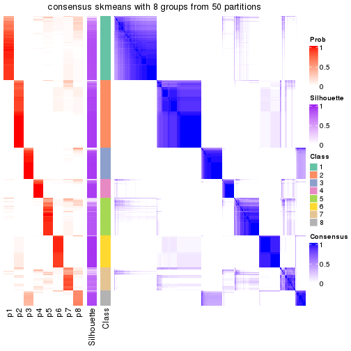</p>

</div>
</div>

Heatmaps for the membership of samples in all partitions to see how consistent they are:


<script>
$( function() {
	$( '#tabs-node-0-membership-heatmap' ).tabs();
} );
</script>
<div id='tabs-node-0-membership-heatmap'>
<ul>
<li><a href='#tab-node-0-membership-heatmap-1'>k = 2</a></li>
<li><a href='#tab-node-0-membership-heatmap-2'>k = 3</a></li>
<li><a href='#tab-node-0-membership-heatmap-3'>k = 4</a></li>
<li><a href='#tab-node-0-membership-heatmap-4'>k = 5</a></li>
<li><a href='#tab-node-0-membership-heatmap-5'>k = 6</a></li>
<li><a href='#tab-node-0-membership-heatmap-6'>k = 7</a></li>
<li><a href='#tab-node-0-membership-heatmap-7'>k = 8</a></li>
</ul>
<div id='tab-node-0-membership-heatmap-1'>
<pre><code class="r">membership_heatmap(res, k = 2)
</code></pre>

<p></p>

</div>
<div id='tab-node-0-membership-heatmap-2'>
<pre><code class="r">membership_heatmap(res, k = 3)
</code></pre>

<p></p>

</div>
<div id='tab-node-0-membership-heatmap-3'>
<pre><code class="r">membership_heatmap(res, k = 4)
</code></pre>

<p></p>

</div>
<div id='tab-node-0-membership-heatmap-4'>
<pre><code class="r">membership_heatmap(res, k = 5)
</code></pre>

<p></p>

</div>
<div id='tab-node-0-membership-heatmap-5'>
<pre><code class="r">membership_heatmap(res, k = 6)
</code></pre>

<p></p>

</div>
<div id='tab-node-0-membership-heatmap-6'>
<pre><code class="r">membership_heatmap(res, k = 7)
</code></pre>

<p></p>

</div>
<div id='tab-node-0-membership-heatmap-7'>
<pre><code class="r">membership_heatmap(res, k = 8)
</code></pre>

<p></p>

</div>
</div>

As soon as the classes for columns are determined, the signatures
that are significantly different between subgroups can be looked for. 
Following are the heatmaps for signatures.


<script>
$( function() {
	$( '#tabs-node-0-get-signatures' ).tabs();
} );
</script>
<div id='tabs-node-0-get-signatures'>
<ul>
<li><a href='#tab-node-0-get-signatures-1'>k = 2</a></li>
<li><a href='#tab-node-0-get-signatures-2'>k = 3</a></li>
<li><a href='#tab-node-0-get-signatures-3'>k = 4</a></li>
<li><a href='#tab-node-0-get-signatures-4'>k = 5</a></li>
<li><a href='#tab-node-0-get-signatures-5'>k = 6</a></li>
<li><a href='#tab-node-0-get-signatures-6'>k = 7</a></li>
<li><a href='#tab-node-0-get-signatures-7'>k = 8</a></li>
</ul>
<div id='tab-node-0-get-signatures-1'>
<pre><code class="r">get_signatures(res, k = 2)
</code></pre>

<p></p>

</div>
<div id='tab-node-0-get-signatures-2'>
<pre><code class="r">get_signatures(res, k = 3)
</code></pre>

<p></p>

</div>
<div id='tab-node-0-get-signatures-3'>
<pre><code class="r">get_signatures(res, k = 4)
</code></pre>

<p></p>

</div>
<div id='tab-node-0-get-signatures-4'>
<pre><code class="r">get_signatures(res, k = 5)
</code></pre>

<p></p>

</div>
<div id='tab-node-0-get-signatures-5'>
<pre><code class="r">get_signatures(res, k = 6)
</code></pre>

<p></p>

</div>
<div id='tab-node-0-get-signatures-6'>
<pre><code class="r">get_signatures(res, k = 7)
</code></pre>

<p></p>

</div>
<div id='tab-node-0-get-signatures-7'>
<pre><code class="r">get_signatures(res, k = 8)
</code></pre>

<p></p>

</div>
</div>


Compare the overlap of signatures from different k:

```r
compare_signatures(res)
```


`get_signature()` returns a data frame invisibly. To get the list of signatures, the function
call should be assigned to a variable explicitly. In following code, if `plot` argument is set
to `FALSE`, no heatmap is plotted while only the differential analysis is performed.

```r
# code only for demonstration
tb = get_signature(res, k = ..., plot = FALSE)
```

An example of the output of `tb` is:

```
#>   which_row         fdr    mean_1    mean_2 scaled_mean_1 scaled_mean_2 km
#> 1        38 0.042760348  8.373488  9.131774    -0.5533452     0.5164555  1
#> 2        40 0.018707592  7.106213  8.469186    -0.6173731     0.5762149  1
#> 3        55 0.019134737 10.221463 11.207825    -0.6159697     0.5749050  1
#> 4        59 0.006059896  5.921854  7.869574    -0.6899429     0.6439467  1
#> 5        60 0.018055526  8.928898 10.211722    -0.6204761     0.5791110  1
#> 6        98 0.009384629 15.714769 14.887706     0.6635654    -0.6193277  2
...
```

The columns in `tb` are:

1. `which_row`: row indices corresponding to the input matrix.
2. `fdr`: FDR for the differential test. 
3. `mean_x`: The mean value in group x.
4. `scaled_mean_x`: The mean value in group x after rows are scaled.
5. `km`: Row groups if k-means clustering is applied to rows (which is done by automatically selecting number of clusters).

If there are too many signatures, `top_signatures = ...` can be set to only show the 
signatures with the highest FDRs:

```r
# code only for demonstration
# e.g. to show the top 500 most significant rows
tb = get_signature(res, k = ..., top_signatures = 500)
```

If the signatures are defined as these which are uniquely high in current group, `diff_method` argument
can be set to `"uniquely_high_in_one_group"`:

```r
# code only for demonstration
tb = get_signature(res, k = ..., diff_method = "uniquely_high_in_one_group")
```


UMAP plot which shows how samples are separated.


<script>
$( function() {
	$( '#tabs-node-0-dimension-reduction' ).tabs();
} );
</script>
<div id='tabs-node-0-dimension-reduction'>
<ul>
<li><a href='#tab-node-0-dimension-reduction-1'>k = 2</a></li>
<li><a href='#tab-node-0-dimension-reduction-2'>k = 3</a></li>
<li><a href='#tab-node-0-dimension-reduction-3'>k = 4</a></li>
<li><a href='#tab-node-0-dimension-reduction-4'>k = 5</a></li>
<li><a href='#tab-node-0-dimension-reduction-5'>k = 6</a></li>
<li><a href='#tab-node-0-dimension-reduction-6'>k = 7</a></li>
<li><a href='#tab-node-0-dimension-reduction-7'>k = 8</a></li>
</ul>
<div id='tab-node-0-dimension-reduction-1'>
<pre><code class="r">dimension_reduction(res, k = 2, method = &quot;UMAP&quot;)
</code></pre>

<p></p>

</div>
<div id='tab-node-0-dimension-reduction-2'>
<pre><code class="r">dimension_reduction(res, k = 3, method = &quot;UMAP&quot;)
</code></pre>

<p></p>

</div>
<div id='tab-node-0-dimension-reduction-3'>
<pre><code class="r">dimension_reduction(res, k = 4, method = &quot;UMAP&quot;)
</code></pre>

<p></p>

</div>
<div id='tab-node-0-dimension-reduction-4'>
<pre><code class="r">dimension_reduction(res, k = 5, method = &quot;UMAP&quot;)
</code></pre>

<p></p>

</div>
<div id='tab-node-0-dimension-reduction-5'>
<pre><code class="r">dimension_reduction(res, k = 6, method = &quot;UMAP&quot;)
</code></pre>

<p></p>

</div>
<div id='tab-node-0-dimension-reduction-6'>
<pre><code class="r">dimension_reduction(res, k = 7, method = &quot;UMAP&quot;)
</code></pre>

<p></p>

</div>
<div id='tab-node-0-dimension-reduction-7'>
<pre><code class="r">dimension_reduction(res, k = 8, method = &quot;UMAP&quot;)
</code></pre>

<p></p>

</div>
</div>


Following heatmap shows how subgroups are split when increasing `k`:

```r
collect_classes(res)
```


If matrix rows can be associated to genes, consider to use `functional_enrichment(res,
...)` to perform function enrichment for the signature genes. See [this vignette](https://jokergoo.github.io/cola_vignettes/functional_enrichment.html) for more detailed explanations.


 

---------------------------------------------------


### Node01


Parent node: [Node0](#Node0).
Child nodes: 
                [Node011](#Node011)
        ,
                Node012-leaf
        ,
                [Node013](#Node013)
        ,
                [Node014](#Node014)
        ,
                Node015-leaf
        ,
                [Node021](#Node021)
        ,
                [Node022](#Node022)
        ,
                [Node023](#Node023)
        ,
                [Node024](#Node024)
        ,
                [Node025](#Node025)
        ,
                [Node031](#Node031)
        ,
                Node032-leaf
        ,
                [Node033](#Node033)
        ,
                Node034-leaf
        .


The object with results only for a single top-value method and a single partitioning method 
can be extracted as:

```r
res = res_rh["01"]
```

A summary of `res` and all the functions that can be applied to it:

```r
res
```

```
#> A 'ConsensusPartition' object with k = 2, 3, 4, 5, 6, 7, 8.
#>   On a matrix with 30000 rows and 175 columns.
#>   Top rows (1000) are extracted by 'ATC' method.
#>   Subgroups are detected by 'skmeans' method.
#>   Performed in total 350 partitions by row resampling.
#>   Best k for subgroups seems to be 6.
#> 
#> Following methods can be applied to this 'ConsensusPartition' object:
#>  [1] "cola_report"             "collect_classes"         "collect_plots"          
#>  [4] "collect_stats"           "colnames"                "compare_partitions"     
#>  [7] "compare_signatures"      "consensus_heatmap"       "dimension_reduction"    
#> [10] "functional_enrichment"   "get_anno_col"            "get_anno"               
#> [13] "get_classes"             "get_consensus"           "get_matrix"             
#> [16] "get_membership"          "get_param"               "get_signatures"         
#> [19] "get_stats"               "is_best_k"               "is_stable_k"            
#> [22] "membership_heatmap"      "ncol"                    "nrow"                   
#> [25] "plot_ecdf"               "predict_classes"         "rownames"               
#> [28] "select_partition_number" "show"                    "suggest_best_k"         
#> [31] "test_to_known_factors"   "top_rows_heatmap"
```

`collect_plots()` function collects all the plots made from `res` for all `k` (number of subgroups)
into one single page to provide an easy and fast comparison between different `k`.

```r
collect_plots(res)
```


The plots are:

- The first row: a plot of the eCDF (empirical cumulative distribution
  function) curves of the consensus matrix for each `k` and the heatmap of
  predicted classes for each `k`.
- The second row: heatmaps of the consensus matrix for each `k`.
- The third row: heatmaps of the membership matrix for each `k`.
- The fouth row: heatmaps of the signatures for each `k`.

All the plots in panels can be made by individual functions and they are
plotted later in this section.

`select_partition_number()` produces several plots showing different
statistics for choosing "optimized" `k`. There are following statistics:

- eCDF curves of the consensus matrix for each `k`;
- 1-PAC. [The PAC score](https://en.wikipedia.org/wiki/Consensus_clustering#Over-interpretation_potential_of_consensus_clustering)
  measures the proportion of the ambiguous subgrouping.
- Mean silhouette score.
- Concordance. The mean probability of fiting the consensus subgroup labels in all
  partitions.
- Area increased. Denote $A_k$ as the area under the eCDF curve for current
  `k`, the area increased is defined as $A_k - A_{k-1}$.
- Rand index. The percent of pairs of samples that are both in a same cluster
  or both are not in a same cluster in the partition of k and k-1.
- Jaccard index. The ratio of pairs of samples are both in a same cluster in
  the partition of k and k-1 and the pairs of samples are both in a same
  cluster in the partition k or k-1.

The detailed explanations of these statistics can be found in [the _cola_
vignette](https://jokergoo.github.io/cola_vignettes/cola.html#toc_13).

Generally speaking, higher 1-PAC score, higher mean silhouette score or higher
concordance corresponds to better partition. Rand index and Jaccard index
measure how similar the current partition is compared to partition with `k-1`.
If they are too similar, we won't accept `k` is better than `k-1`.

```r
select_partition_number(res)
```


The numeric values for all these statistics can be obtained by `get_stats()`.

```r
get_stats(res)
```

```
#>   k 1-PAC mean_silhouette concordance area_increased  Rand Jaccard
#> 2 2 1.000           1.000       1.000        0.36149 0.639   0.639
#> 3 3 1.000           0.992       0.997        0.80166 0.710   0.547
#> 4 4 1.000           0.974       0.979        0.04718 0.973   0.923
#> 5 5 0.959           0.950       0.976        0.13197 0.863   0.601
#> 6 6 0.943           0.878       0.937        0.06016 0.876   0.532
#> 7 7 0.869           0.768       0.886        0.02462 0.964   0.813
#> 8 8 0.819           0.511       0.806        0.00994 0.970   0.832
```

`suggest_best_k()` suggests the best $k$ based on these statistics. The rules are as follows:

- All $k$ with Jaccard index larger than 0.95 are removed because increasing
  $k$ does not provide enough extra information. If all $k$ are removed, it is
  marked as no subgroup is detected.
- For all $k$ with 1-PAC score larger than 0.9, the maximal $k$ is taken as
  the best $k$, and other $k$ are marked as optional $k$.
- If it does not fit the second rule. The $k$ with the maximal vote of the
  highest 1-PAC score, highest mean silhouette, and highest concordance is
  taken as the best $k$.

```r
suggest_best_k(res)
```

```
#> [1] 6
#> attr(,"optional")
#> [1] 2 3 4 5
```

There is also optional best $k$ = 2 3 4 5 that is worth to check.

Following is the table of the partitions (You need to click the **show/hide
code output** link to see it). The membership matrix (columns with name `p*`)
is inferred by
[`clue::cl_consensus()`](https://www.rdocumentation.org/link/cl_consensus?package=clue)
function with the `SE` method. Basically the value in the membership matrix
represents the probability to belong to a certain group. The finall subgroup
label for an item is determined with the group with highest probability it
belongs to.

In `get_classes()` function, the entropy is calculated from the membership
matrix and the silhouette score is calculated from the consensus matrix.


<script>
$( function() {
	$( '#tabs-node-01-get-classes' ).tabs();
} );
</script>
<div id='tabs-node-01-get-classes'>
<ul>
<li><a href='#tab-node-01-get-classes-1'>k = 2</a></li>
<li><a href='#tab-node-01-get-classes-2'>k = 3</a></li>
<li><a href='#tab-node-01-get-classes-3'>k = 4</a></li>
<li><a href='#tab-node-01-get-classes-4'>k = 5</a></li>
<li><a href='#tab-node-01-get-classes-5'>k = 6</a></li>
<li><a href='#tab-node-01-get-classes-6'>k = 7</a></li>
<li><a href='#tab-node-01-get-classes-7'>k = 8</a></li>
</ul>

<div id='tab-node-01-get-classes-1'>
<p><a id='tab-node-01-get-classes-1-a' style='color:#0366d6' href='#'>show/hide code output</a></p>
<pre><code class="r">cbind(get_classes(res, k = 2), get_membership(res, k = 2))
</code></pre>

<pre><code>#&gt;                 class entropy silhouette p1 p2
#&gt; TCGA.E8.A433.01     1       0          1  1  0
#&gt; TCGA.DJ.A3V9.01     1       0          1  1  0
#&gt; TCGA.EL.A3ZN.01     1       0          1  1  0
#&gt; TCGA.EL.A3ZK.01     1       0          1  1  0
#&gt; TCGA.ET.A40R.01     1       0          1  1  0
#&gt; TCGA.DJ.A3VD.01     1       0          1  1  0
#&gt; TCGA.EL.A3ZG.01     2       0          1  0  1
#&gt; TCGA.EM.A4FV.01     1       0          1  1  0
#&gt; TCGA.E8.A413.01     1       0          1  1  0
#&gt; TCGA.IM.A420.01     1       0          1  1  0
#&gt; TCGA.J8.A3O2.01     2       0          1  0  1
#&gt; TCGA.E8.A415.01     1       0          1  1  0
#&gt; TCGA.KS.A4I3.01     2       0          1  0  1
#&gt; TCGA.DJ.A4UT.01     1       0          1  1  0
#&gt; TCGA.EL.A4JW.01     1       0          1  1  0
#&gt; TCGA.E8.A419.01     1       0          1  1  0
#&gt; TCGA.EL.A3ZS.01     1       0          1  1  0
#&gt; TCGA.KS.A4ID.01     1       0          1  1  0
#&gt; TCGA.J8.A3YE.01     1       0          1  1  0
#&gt; TCGA.DJ.A3VF.01     1       0          1  1  0
#&gt; TCGA.E8.A432.01     1       0          1  1  0
#&gt; TCGA.ET.A2MX.01     2       0          1  0  1
#&gt; TCGA.ET.A40S.01     2       0          1  0  1
#&gt; TCGA.DE.A4M8.01     1       0          1  1  0
#&gt; TCGA.EL.A4KD.01     2       0          1  0  1
#&gt; TCGA.FY.A40L.01     1       0          1  1  0
#&gt; TCGA.J8.A42S.01     2       0          1  0  1
#&gt; TCGA.KS.A4IC.01     1       0          1  1  0
#&gt; TCGA.E8.A414.01     1       0          1  1  0
#&gt; TCGA.DE.A4MD.06     2       0          1  0  1
#&gt; TCGA.DJ.A4V4.01     1       0          1  1  0
#&gt; TCGA.FY.A40K.01     1       0          1  1  0
#&gt; TCGA.EM.A4FR.01     2       0          1  0  1
#&gt; TCGA.DJ.A3V8.01     1       0          1  1  0
#&gt; TCGA.J8.A4HY.01     1       0          1  1  0
#&gt; TCGA.FY.A40N.01     1       0          1  1  0
#&gt; TCGA.DJ.A2PX.01     1       0          1  1  0
#&gt; TCGA.EL.A4JX.01     1       0          1  1  0
#&gt; TCGA.DJ.A2Q5.01     2       0          1  0  1
#&gt; TCGA.DJ.A4UP.01     1       0          1  1  0
#&gt; TCGA.E8.A438.01     1       0          1  1  0
#&gt; TCGA.EL.A4KH.01     1       0          1  1  0
#&gt; TCGA.DJ.A4V5.01     2       0          1  0  1
#&gt; TCGA.E8.A44M.01     1       0          1  1  0
#&gt; TCGA.BJ.A45H.01     2       0          1  0  1
#&gt; TCGA.E8.A44K.01     1       0          1  1  0
#&gt; TCGA.CE.A481.01     1       0          1  1  0
#&gt; TCGA.E8.A436.01     1       0          1  1  0
#&gt; TCGA.DJ.A2Q3.01     1       0          1  1  0
#&gt; TCGA.ET.A2N1.01     1       0          1  1  0
#&gt; TCGA.DJ.A2PZ.01     2       0          1  0  1
#&gt; TCGA.IM.A4EB.01     2       0          1  0  1
#&gt; TCGA.EM.A4FO.01     2       0          1  0  1
#&gt; TCGA.BJ.A45I.01     1       0          1  1  0
#&gt; TCGA.EL.A3N3.01     1       0          1  1  0
#&gt; TCGA.DJ.A2PS.01     1       0          1  1  0
#&gt; TCGA.CE.A3MD.01     2       0          1  0  1
#&gt; TCGA.EL.A3CN.01     1       0          1  1  0
#&gt; TCGA.J8.A4HW.06     1       0          1  1  0
#&gt; TCGA.E8.A437.01     1       0          1  1  0
#&gt; TCGA.CE.A483.01     1       0          1  1  0
#&gt; TCGA.CE.A485.01     2       0          1  0  1
#&gt; TCGA.ET.A4KN.01     1       0          1  1  0
#&gt; TCGA.DJ.A4UQ.01     2       0          1  0  1
#&gt; TCGA.DJ.A4UW.01     1       0          1  1  0
#&gt; TCGA.DE.A3KN.01     1       0          1  1  0
#&gt; TCGA.DJ.A2QA.01     1       0          1  1  0
#&gt; TCGA.BJ.A4O9.01     1       0          1  1  0
#&gt; TCGA.CE.A3ME.01     1       0          1  1  0
#&gt; TCGA.E3.A3E1.01     1       0          1  1  0
#&gt; TCGA.DJ.A2Q8.01     1       0          1  1  0
#&gt; TCGA.FE.A23A.01     1       0          1  1  0
#&gt; TCGA.FY.A3I4.01     1       0          1  1  0
#&gt; TCGA.ET.A2N0.01     1       0          1  1  0
#&gt; TCGA.ET.A3DP.01     1       0          1  1  0
#&gt; TCGA.EL.A3GV.01     1       0          1  1  0
#&gt; TCGA.GE.A2C6.01     1       0          1  1  0
#&gt; TCGA.DJ.A2PT.01     1       0          1  1  0
#&gt; TCGA.E8.A242.01     1       0          1  1  0
#&gt; TCGA.J8.A3O1.01     1       0          1  1  0
#&gt; TCGA.EM.A2CR.01     1       0          1  1  0
#&gt; TCGA.FE.A238.01     1       0          1  1  0
#&gt; TCGA.EM.A3FQ.01     1       0          1  1  0
#&gt; TCGA.EM.A22M.01     2       0          1  0  1
#&gt; TCGA.J8.A3NZ.01     1       0          1  1  0
#&gt; TCGA.FE.A236.01     2       0          1  0  1
#&gt; TCGA.BJ.A28R.01     1       0          1  1  0
#&gt; TCGA.EM.A2CU.01     1       0          1  1  0
#&gt; TCGA.FE.A237.01     1       0          1  1  0
#&gt; TCGA.DJ.A2QC.01     1       0          1  1  0
#&gt; TCGA.EM.A2CS.06     1       0          1  1  0
#&gt; TCGA.H2.A26U.01     1       0          1  1  0
#&gt; TCGA.BJ.A28Z.01     1       0          1  1  0
#&gt; TCGA.ET.A25J.01     1       0          1  1  0
#&gt; TCGA.FY.A3NN.01     1       0          1  1  0
#&gt; TCGA.EL.A3H3.01     1       0          1  1  0
#&gt; TCGA.BJ.A0Z3.01     1       0          1  1  0
#&gt; TCGA.BJ.A28X.01     1       0          1  1  0
#&gt; TCGA.EL.A3CT.01     1       0          1  1  0
#&gt; TCGA.J8.A3YG.01     1       0          1  1  0
#&gt; TCGA.EM.A3SZ.01     1       0          1  1  0
#&gt; TCGA.EM.A2P0.01     2       0          1  0  1
#&gt; TCGA.E8.A2JQ.01     1       0          1  1  0
#&gt; TCGA.DJ.A3UW.01     1       0          1  1  0
#&gt; TCGA.DJ.A3V3.01     1       0          1  1  0
#&gt; TCGA.EL.A3GP.01     2       0          1  0  1
#&gt; TCGA.BJ.A191.01     1       0          1  1  0
#&gt; TCGA.EM.A2P1.01     2       0          1  0  1
#&gt; TCGA.IM.A3EB.01     1       0          1  1  0
#&gt; TCGA.EM.A3AK.01     1       0          1  1  0
#&gt; TCGA.EM.A3AO.01     2       0          1  0  1
#&gt; TCGA.EM.A2P1.06     2       0          1  0  1
#&gt; TCGA.EM.A1CS.01     1       0          1  1  0
#&gt; TCGA.EL.A3GQ.01     1       0          1  1  0
#&gt; TCGA.DJ.A3V4.01     1       0          1  1  0
#&gt; TCGA.DJ.A3V2.01     1       0          1  1  0
#&gt; TCGA.BJ.A290.01     2       0          1  0  1
#&gt; TCGA.EM.A3SU.01     1       0          1  1  0
#&gt; TCGA.EL.A3GR.01     1       0          1  1  0
#&gt; TCGA.EM.A3SU.06     1       0          1  1  0
#&gt; TCGA.DJ.A3US.01     1       0          1  1  0
#&gt; TCGA.EM.A2OZ.01     2       0          1  0  1
#&gt; TCGA.E8.A2EA.01     1       0          1  1  0
#&gt; TCGA.EM.A1CV.01     1       0          1  1  0
#&gt; TCGA.EM.A1CT.01     2       0          1  0  1
#&gt; TCGA.ET.A3BS.01     2       0          1  0  1
#&gt; TCGA.DJ.A3UU.01     1       0          1  1  0
#&gt; TCGA.DJ.A2PO.01     2       0          1  0  1
#&gt; TCGA.DJ.A3UQ.01     1       0          1  1  0
#&gt; TCGA.EL.A3T0.01     1       0          1  1  0
#&gt; TCGA.DJ.A3UX.01     1       0          1  1  0
#&gt; TCGA.ET.A3BW.01     1       0          1  1  0
#&gt; TCGA.ET.A39S.01     1       0          1  1  0
#&gt; TCGA.ET.A3BP.01     1       0          1  1  0
#&gt; TCGA.EL.A3D4.01     2       0          1  0  1
#&gt; TCGA.FE.A232.01     1       0          1  1  0
#&gt; TCGA.DJ.A3UR.01     1       0          1  1  0
#&gt; TCGA.FK.A3S3.01     1       0          1  1  0
#&gt; TCGA.EL.A3CS.01     1       0          1  1  0
#&gt; TCGA.DO.A2HM.01     2       0          1  0  1
#&gt; TCGA.FY.A3BL.01     2       0          1  0  1
#&gt; TCGA.DJ.A1QF.01     1       0          1  1  0
#&gt; TCGA.ET.A3DU.01     1       0          1  1  0
#&gt; TCGA.EL.A3T1.01     1       0          1  1  0
#&gt; TCGA.FE.A230.01     1       0          1  1  0
#&gt; TCGA.ET.A39R.01     1       0          1  1  0
#&gt; TCGA.EL.A3CV.01     2       0          1  0  1
#&gt; TCGA.EL.A3TA.01     2       0          1  0  1
#&gt; TCGA.DJ.A3UY.01     1       0          1  1  0
#&gt; TCGA.DJ.A2Q1.01     1       0          1  1  0
#&gt; TCGA.EL.A3CU.01     1       0          1  1  0
#&gt; TCGA.DJ.A3UV.01     1       0          1  1  0
#&gt; TCGA.EL.A3CX.01     1       0          1  1  0
#&gt; TCGA.EM.A22P.01     2       0          1  0  1
#&gt; TCGA.DJ.A3UK.01     1       0          1  1  0
#&gt; TCGA.ET.A3DO.01     1       0          1  1  0
#&gt; TCGA.ET.A3BV.01     1       0          1  1  0
#&gt; TCGA.BJ.A0Z9.01     1       0          1  1  0
#&gt; TCGA.FY.A3R6.01     1       0          1  1  0
#&gt; TCGA.BJ.A0Z5.01     2       0          1  0  1
#&gt; TCGA.ET.A3DT.01     1       0          1  1  0
#&gt; TCGA.ET.A39M.01     2       0          1  0  1
#&gt; TCGA.BJ.A0ZJ.01     2       0          1  0  1
#&gt; TCGA.ET.A39T.01     1       0          1  1  0
#&gt; TCGA.DJ.A2PV.01     1       0          1  1  0
#&gt; TCGA.DJ.A13X.01     1       0          1  1  0
#&gt; TCGA.EL.A3T6.01     1       0          1  1  0
#&gt; TCGA.EM.A3O3.01     1       0          1  1  0
#&gt; TCGA.DJ.A13L.01     2       0          1  0  1
#&gt; TCGA.DJ.A13U.01     2       0          1  0  1
#&gt; TCGA.ET.A2N4.01     1       0          1  1  0
#&gt; TCGA.DJ.A13P.01     1       0          1  1  0
#&gt; TCGA.EM.A3O7.01     1       0          1  1  0
#&gt; TCGA.ET.A3DR.01     1       0          1  1  0
#&gt; TCGA.FE.A3PB.01     1       0          1  1  0
</code></pre>

<script>
$('#tab-node-01-get-classes-1-a').parent().next().next().hide();
$('#tab-node-01-get-classes-1-a').click(function(){
  $('#tab-node-01-get-classes-1-a').parent().next().next().toggle();
  return(false);
});
</script>
</div>

<div id='tab-node-01-get-classes-2'>
<p><a id='tab-node-01-get-classes-2-a' style='color:#0366d6' href='#'>show/hide code output</a></p>
<pre><code class="r">cbind(get_classes(res, k = 3), get_membership(res, k = 3))
</code></pre>

<pre><code>#&gt;                 class entropy silhouette   p1 p2   p3
#&gt; TCGA.E8.A433.01     1   0.000      0.993 1.00  0 0.00
#&gt; TCGA.DJ.A3V9.01     1   0.000      0.993 1.00  0 0.00
#&gt; TCGA.EL.A3ZN.01     1   0.000      0.993 1.00  0 0.00
#&gt; TCGA.EL.A3ZK.01     3   0.000      1.000 0.00  0 1.00
#&gt; TCGA.ET.A40R.01     1   0.000      0.993 1.00  0 0.00
#&gt; TCGA.DJ.A3VD.01     3   0.000      1.000 0.00  0 1.00
#&gt; TCGA.EL.A3ZG.01     2   0.000      1.000 0.00  1 0.00
#&gt; TCGA.EM.A4FV.01     1   0.000      0.993 1.00  0 0.00
#&gt; TCGA.E8.A413.01     1   0.000      0.993 1.00  0 0.00
#&gt; TCGA.IM.A420.01     3   0.000      1.000 0.00  0 1.00
#&gt; TCGA.J8.A3O2.01     2   0.000      1.000 0.00  1 0.00
#&gt; TCGA.E8.A415.01     1   0.000      0.993 1.00  0 0.00
#&gt; TCGA.KS.A4I3.01     2   0.000      1.000 0.00  1 0.00
#&gt; TCGA.DJ.A4UT.01     3   0.000      1.000 0.00  0 1.00
#&gt; TCGA.EL.A4JW.01     1   0.369      0.835 0.86  0 0.14
#&gt; TCGA.E8.A419.01     3   0.000      1.000 0.00  0 1.00
#&gt; TCGA.EL.A3ZS.01     3   0.000      1.000 0.00  0 1.00
#&gt; TCGA.KS.A4ID.01     3   0.000      1.000 0.00  0 1.00
#&gt; TCGA.J8.A3YE.01     1   0.000      0.993 1.00  0 0.00
#&gt; TCGA.DJ.A3VF.01     3   0.000      1.000 0.00  0 1.00
#&gt; TCGA.E8.A432.01     1   0.000      0.993 1.00  0 0.00
#&gt; TCGA.ET.A2MX.01     2   0.000      1.000 0.00  1 0.00
#&gt; TCGA.ET.A40S.01     2   0.000      1.000 0.00  1 0.00
#&gt; TCGA.DE.A4M8.01     3   0.000      1.000 0.00  0 1.00
#&gt; TCGA.EL.A4KD.01     2   0.000      1.000 0.00  1 0.00
#&gt; TCGA.FY.A40L.01     1   0.000      0.993 1.00  0 0.00
#&gt; TCGA.J8.A42S.01     2   0.000      1.000 0.00  1 0.00
#&gt; TCGA.KS.A4IC.01     1   0.000      0.993 1.00  0 0.00
#&gt; TCGA.E8.A414.01     3   0.000      1.000 0.00  0 1.00
#&gt; TCGA.DE.A4MD.06     2   0.000      1.000 0.00  1 0.00
#&gt; TCGA.DJ.A4V4.01     1   0.000      0.993 1.00  0 0.00
#&gt; TCGA.FY.A40K.01     1   0.000      0.993 1.00  0 0.00
#&gt; TCGA.EM.A4FR.01     2   0.000      1.000 0.00  1 0.00
#&gt; TCGA.DJ.A3V8.01     1   0.000      0.993 1.00  0 0.00
#&gt; TCGA.J8.A4HY.01     1   0.000      0.993 1.00  0 0.00
#&gt; TCGA.FY.A40N.01     1   0.000      0.993 1.00  0 0.00
#&gt; TCGA.DJ.A2PX.01     3   0.000      1.000 0.00  0 1.00
#&gt; TCGA.EL.A4JX.01     3   0.000      1.000 0.00  0 1.00
#&gt; TCGA.DJ.A2Q5.01     2   0.000      1.000 0.00  1 0.00
#&gt; TCGA.DJ.A4UP.01     3   0.000      1.000 0.00  0 1.00
#&gt; TCGA.E8.A438.01     1   0.000      0.993 1.00  0 0.00
#&gt; TCGA.EL.A4KH.01     1   0.000      0.993 1.00  0 0.00
#&gt; TCGA.DJ.A4V5.01     2   0.000      1.000 0.00  1 0.00
#&gt; TCGA.E8.A44M.01     3   0.000      1.000 0.00  0 1.00
#&gt; TCGA.BJ.A45H.01     2   0.000      1.000 0.00  1 0.00
#&gt; TCGA.E8.A44K.01     1   0.000      0.993 1.00  0 0.00
#&gt; TCGA.CE.A481.01     3   0.000      1.000 0.00  0 1.00
#&gt; TCGA.E8.A436.01     1   0.000      0.993 1.00  0 0.00
#&gt; TCGA.DJ.A2Q3.01     3   0.000      1.000 0.00  0 1.00
#&gt; TCGA.ET.A2N1.01     1   0.000      0.993 1.00  0 0.00
#&gt; TCGA.DJ.A2PZ.01     2   0.000      1.000 0.00  1 0.00
#&gt; TCGA.IM.A4EB.01     2   0.000      1.000 0.00  1 0.00
#&gt; TCGA.EM.A4FO.01     2   0.000      1.000 0.00  1 0.00
#&gt; TCGA.BJ.A45I.01     3   0.000      1.000 0.00  0 1.00
#&gt; TCGA.EL.A3N3.01     3   0.000      1.000 0.00  0 1.00
#&gt; TCGA.DJ.A2PS.01     1   0.000      0.993 1.00  0 0.00
#&gt; TCGA.CE.A3MD.01     2   0.000      1.000 0.00  1 0.00
#&gt; TCGA.EL.A3CN.01     3   0.000      1.000 0.00  0 1.00
#&gt; TCGA.J8.A4HW.06     3   0.000      1.000 0.00  0 1.00
#&gt; TCGA.E8.A437.01     1   0.000      0.993 1.00  0 0.00
#&gt; TCGA.CE.A483.01     1   0.000      0.993 1.00  0 0.00
#&gt; TCGA.CE.A485.01     2   0.000      1.000 0.00  1 0.00
#&gt; TCGA.ET.A4KN.01     3   0.000      1.000 0.00  0 1.00
#&gt; TCGA.DJ.A4UQ.01     2   0.000      1.000 0.00  1 0.00
#&gt; TCGA.DJ.A4UW.01     1   0.000      0.993 1.00  0 0.00
#&gt; TCGA.DE.A3KN.01     1   0.000      0.993 1.00  0 0.00
#&gt; TCGA.DJ.A2QA.01     1   0.000      0.993 1.00  0 0.00
#&gt; TCGA.BJ.A4O9.01     1   0.000      0.993 1.00  0 0.00
#&gt; TCGA.CE.A3ME.01     1   0.000      0.993 1.00  0 0.00
#&gt; TCGA.E3.A3E1.01     1   0.000      0.993 1.00  0 0.00
#&gt; TCGA.DJ.A2Q8.01     1   0.000      0.993 1.00  0 0.00
#&gt; TCGA.FE.A23A.01     3   0.000      1.000 0.00  0 1.00
#&gt; TCGA.FY.A3I4.01     1   0.000      0.993 1.00  0 0.00
#&gt; TCGA.ET.A2N0.01     1   0.000      0.993 1.00  0 0.00
#&gt; TCGA.ET.A3DP.01     1   0.000      0.993 1.00  0 0.00
#&gt; TCGA.EL.A3GV.01     1   0.000      0.993 1.00  0 0.00
#&gt; TCGA.GE.A2C6.01     3   0.000      1.000 0.00  0 1.00
#&gt; TCGA.DJ.A2PT.01     3   0.000      1.000 0.00  0 1.00
#&gt; TCGA.E8.A242.01     3   0.000      1.000 0.00  0 1.00
#&gt; TCGA.J8.A3O1.01     1   0.000      0.993 1.00  0 0.00
#&gt; TCGA.EM.A2CR.01     1   0.000      0.993 1.00  0 0.00
#&gt; TCGA.FE.A238.01     1   0.000      0.993 1.00  0 0.00
#&gt; TCGA.EM.A3FQ.01     3   0.000      1.000 0.00  0 1.00
#&gt; TCGA.EM.A22M.01     2   0.000      1.000 0.00  1 0.00
#&gt; TCGA.J8.A3NZ.01     1   0.000      0.993 1.00  0 0.00
#&gt; TCGA.FE.A236.01     2   0.000      1.000 0.00  1 0.00
#&gt; TCGA.BJ.A28R.01     1   0.604      0.392 0.62  0 0.38
#&gt; TCGA.EM.A2CU.01     1   0.000      0.993 1.00  0 0.00
#&gt; TCGA.FE.A237.01     1   0.000      0.993 1.00  0 0.00
#&gt; TCGA.DJ.A2QC.01     1   0.000      0.993 1.00  0 0.00
#&gt; TCGA.EM.A2CS.06     1   0.000      0.993 1.00  0 0.00
#&gt; TCGA.H2.A26U.01     3   0.000      1.000 0.00  0 1.00
#&gt; TCGA.BJ.A28Z.01     3   0.000      1.000 0.00  0 1.00
#&gt; TCGA.ET.A25J.01     1   0.000      0.993 1.00  0 0.00
#&gt; TCGA.FY.A3NN.01     1   0.000      0.993 1.00  0 0.00
#&gt; TCGA.EL.A3H3.01     3   0.000      1.000 0.00  0 1.00
#&gt; TCGA.BJ.A0Z3.01     3   0.000      1.000 0.00  0 1.00
#&gt; TCGA.BJ.A28X.01     3   0.000      1.000 0.00  0 1.00
#&gt; TCGA.EL.A3CT.01     3   0.000      1.000 0.00  0 1.00
#&gt; TCGA.J8.A3YG.01     3   0.000      1.000 0.00  0 1.00
#&gt; TCGA.EM.A3SZ.01     3   0.000      1.000 0.00  0 1.00
#&gt; TCGA.EM.A2P0.01     2   0.000      1.000 0.00  1 0.00
#&gt; TCGA.E8.A2JQ.01     3   0.000      1.000 0.00  0 1.00
#&gt; TCGA.DJ.A3UW.01     3   0.000      1.000 0.00  0 1.00
#&gt; TCGA.DJ.A3V3.01     3   0.000      1.000 0.00  0 1.00
#&gt; TCGA.EL.A3GP.01     2   0.000      1.000 0.00  1 0.00
#&gt; TCGA.BJ.A191.01     1   0.000      0.993 1.00  0 0.00
#&gt; TCGA.EM.A2P1.01     2   0.000      1.000 0.00  1 0.00
#&gt; TCGA.IM.A3EB.01     3   0.000      1.000 0.00  0 1.00
#&gt; TCGA.EM.A3AK.01     1   0.000      0.993 1.00  0 0.00
#&gt; TCGA.EM.A3AO.01     2   0.000      1.000 0.00  1 0.00
#&gt; TCGA.EM.A2P1.06     2   0.000      1.000 0.00  1 0.00
#&gt; TCGA.EM.A1CS.01     1   0.000      0.993 1.00  0 0.00
#&gt; TCGA.EL.A3GQ.01     1   0.000      0.993 1.00  0 0.00
#&gt; TCGA.DJ.A3V4.01     1   0.000      0.993 1.00  0 0.00
#&gt; TCGA.DJ.A3V2.01     3   0.000      1.000 0.00  0 1.00
#&gt; TCGA.BJ.A290.01     2   0.000      1.000 0.00  1 0.00
#&gt; TCGA.EM.A3SU.01     3   0.000      1.000 0.00  0 1.00
#&gt; TCGA.EL.A3GR.01     1   0.000      0.993 1.00  0 0.00
#&gt; TCGA.EM.A3SU.06     3   0.000      1.000 0.00  0 1.00
#&gt; TCGA.DJ.A3US.01     3   0.000      1.000 0.00  0 1.00
#&gt; TCGA.EM.A2OZ.01     2   0.000      1.000 0.00  1 0.00
#&gt; TCGA.E8.A2EA.01     3   0.000      1.000 0.00  0 1.00
#&gt; TCGA.EM.A1CV.01     1   0.000      0.993 1.00  0 0.00
#&gt; TCGA.EM.A1CT.01     2   0.000      1.000 0.00  1 0.00
#&gt; TCGA.ET.A3BS.01     2   0.000      1.000 0.00  1 0.00
#&gt; TCGA.DJ.A3UU.01     1   0.000      0.993 1.00  0 0.00
#&gt; TCGA.DJ.A2PO.01     2   0.000      1.000 0.00  1 0.00
#&gt; TCGA.DJ.A3UQ.01     3   0.000      1.000 0.00  0 1.00
#&gt; TCGA.EL.A3T0.01     1   0.000      0.993 1.00  0 0.00
#&gt; TCGA.DJ.A3UX.01     1   0.000      0.993 1.00  0 0.00
#&gt; TCGA.ET.A3BW.01     1   0.000      0.993 1.00  0 0.00
#&gt; TCGA.ET.A39S.01     1   0.000      0.993 1.00  0 0.00
#&gt; TCGA.ET.A3BP.01     1   0.000      0.993 1.00  0 0.00
#&gt; TCGA.EL.A3D4.01     2   0.000      1.000 0.00  1 0.00
#&gt; TCGA.FE.A232.01     1   0.000      0.993 1.00  0 0.00
#&gt; TCGA.DJ.A3UR.01     1   0.000      0.993 1.00  0 0.00
#&gt; TCGA.FK.A3S3.01     1   0.000      0.993 1.00  0 0.00
#&gt; TCGA.EL.A3CS.01     1   0.000      0.993 1.00  0 0.00
#&gt; TCGA.DO.A2HM.01     2   0.000      1.000 0.00  1 0.00
#&gt; TCGA.FY.A3BL.01     2   0.000      1.000 0.00  1 0.00
#&gt; TCGA.DJ.A1QF.01     1   0.000      0.993 1.00  0 0.00
#&gt; TCGA.ET.A3DU.01     3   0.000      1.000 0.00  0 1.00
#&gt; TCGA.EL.A3T1.01     3   0.000      1.000 0.00  0 1.00
#&gt; TCGA.FE.A230.01     3   0.000      1.000 0.00  0 1.00
#&gt; TCGA.ET.A39R.01     3   0.000      1.000 0.00  0 1.00
#&gt; TCGA.EL.A3CV.01     2   0.000      1.000 0.00  1 0.00
#&gt; TCGA.EL.A3TA.01     2   0.000      1.000 0.00  1 0.00
#&gt; TCGA.DJ.A3UY.01     1   0.000      0.993 1.00  0 0.00
#&gt; TCGA.DJ.A2Q1.01     3   0.000      1.000 0.00  0 1.00
#&gt; TCGA.EL.A3CU.01     3   0.000      1.000 0.00  0 1.00
#&gt; TCGA.DJ.A3UV.01     1   0.000      0.993 1.00  0 0.00
#&gt; TCGA.EL.A3CX.01     1   0.000      0.993 1.00  0 0.00
#&gt; TCGA.EM.A22P.01     2   0.000      1.000 0.00  1 0.00
#&gt; TCGA.DJ.A3UK.01     1   0.000      0.993 1.00  0 0.00
#&gt; TCGA.ET.A3DO.01     3   0.000      1.000 0.00  0 1.00
#&gt; TCGA.ET.A3BV.01     3   0.000      1.000 0.00  0 1.00
#&gt; TCGA.BJ.A0Z9.01     3   0.000      1.000 0.00  0 1.00
#&gt; TCGA.FY.A3R6.01     3   0.000      1.000 0.00  0 1.00
#&gt; TCGA.BJ.A0Z5.01     2   0.000      1.000 0.00  1 0.00
#&gt; TCGA.ET.A3DT.01     3   0.000      1.000 0.00  0 1.00
#&gt; TCGA.ET.A39M.01     2   0.000      1.000 0.00  1 0.00
#&gt; TCGA.BJ.A0ZJ.01     2   0.000      1.000 0.00  1 0.00
#&gt; TCGA.ET.A39T.01     1   0.000      0.993 1.00  0 0.00
#&gt; TCGA.DJ.A2PV.01     1   0.000      0.993 1.00  0 0.00
#&gt; TCGA.DJ.A13X.01     1   0.000      0.993 1.00  0 0.00
#&gt; TCGA.EL.A3T6.01     3   0.000      1.000 0.00  0 1.00
#&gt; TCGA.EM.A3O3.01     3   0.000      1.000 0.00  0 1.00
#&gt; TCGA.DJ.A13L.01     2   0.000      1.000 0.00  1 0.00
#&gt; TCGA.DJ.A13U.01     2   0.000      1.000 0.00  1 0.00
#&gt; TCGA.ET.A2N4.01     1   0.000      0.993 1.00  0 0.00
#&gt; TCGA.DJ.A13P.01     1   0.000      0.993 1.00  0 0.00
#&gt; TCGA.EM.A3O7.01     1   0.000      0.993 1.00  0 0.00
#&gt; TCGA.ET.A3DR.01     1   0.000      0.993 1.00  0 0.00
#&gt; TCGA.FE.A3PB.01     3   0.000      1.000 0.00  0 1.00
</code></pre>

<script>
$('#tab-node-01-get-classes-2-a').parent().next().next().hide();
$('#tab-node-01-get-classes-2-a').click(function(){
  $('#tab-node-01-get-classes-2-a').parent().next().next().toggle();
  return(false);
});
</script>
</div>

<div id='tab-node-01-get-classes-3'>
<p><a id='tab-node-01-get-classes-3-a' style='color:#0366d6' href='#'>show/hide code output</a></p>
<pre><code class="r">cbind(get_classes(res, k = 4), get_membership(res, k = 4))
</code></pre>

<pre><code>#&gt;                 class entropy silhouette   p1   p2   p3   p4
#&gt; TCGA.E8.A433.01     1  0.1637      0.944 0.94 0.00 0.00 0.06
#&gt; TCGA.DJ.A3V9.01     1  0.0000      0.978 1.00 0.00 0.00 0.00
#&gt; TCGA.EL.A3ZN.01     1  0.0000      0.978 1.00 0.00 0.00 0.00
#&gt; TCGA.EL.A3ZK.01     3  0.1637      0.956 0.00 0.00 0.94 0.06
#&gt; TCGA.ET.A40R.01     1  0.1637      0.944 0.94 0.00 0.00 0.06
#&gt; TCGA.DJ.A3VD.01     3  0.0000      0.981 0.00 0.00 1.00 0.00
#&gt; TCGA.EL.A3ZG.01     2  0.0000      1.000 0.00 1.00 0.00 0.00
#&gt; TCGA.EM.A4FV.01     1  0.1637      0.944 0.94 0.00 0.00 0.06
#&gt; TCGA.E8.A413.01     1  0.1637      0.944 0.94 0.00 0.00 0.06
#&gt; TCGA.IM.A420.01     3  0.0000      0.981 0.00 0.00 1.00 0.00
#&gt; TCGA.J8.A3O2.01     2  0.0000      1.000 0.00 1.00 0.00 0.00
#&gt; TCGA.E8.A415.01     1  0.0000      0.978 1.00 0.00 0.00 0.00
#&gt; TCGA.KS.A4I3.01     2  0.0000      1.000 0.00 1.00 0.00 0.00
#&gt; TCGA.DJ.A4UT.01     3  0.0000      0.981 0.00 0.00 1.00 0.00
#&gt; TCGA.EL.A4JW.01     1  0.4227      0.798 0.82 0.00 0.12 0.06
#&gt; TCGA.E8.A419.01     3  0.0000      0.981 0.00 0.00 1.00 0.00
#&gt; TCGA.EL.A3ZS.01     3  0.0000      0.981 0.00 0.00 1.00 0.00
#&gt; TCGA.KS.A4ID.01     3  0.0000      0.981 0.00 0.00 1.00 0.00
#&gt; TCGA.J8.A3YE.01     1  0.0000      0.978 1.00 0.00 0.00 0.00
#&gt; TCGA.DJ.A3VF.01     3  0.0000      0.981 0.00 0.00 1.00 0.00
#&gt; TCGA.E8.A432.01     1  0.1211      0.956 0.96 0.00 0.00 0.04
#&gt; TCGA.ET.A2MX.01     2  0.0000      1.000 0.00 1.00 0.00 0.00
#&gt; TCGA.ET.A40S.01     4  0.1637      1.000 0.00 0.06 0.00 0.94
#&gt; TCGA.DE.A4M8.01     3  0.0000      0.981 0.00 0.00 1.00 0.00
#&gt; TCGA.EL.A4KD.01     2  0.0000      1.000 0.00 1.00 0.00 0.00
#&gt; TCGA.FY.A40L.01     1  0.1637      0.944 0.94 0.00 0.00 0.06
#&gt; TCGA.J8.A42S.01     2  0.0000      1.000 0.00 1.00 0.00 0.00
#&gt; TCGA.KS.A4IC.01     1  0.0000      0.978 1.00 0.00 0.00 0.00
#&gt; TCGA.E8.A414.01     3  0.1637      0.956 0.00 0.00 0.94 0.06
#&gt; TCGA.DE.A4MD.06     4  0.1637      1.000 0.00 0.06 0.00 0.94
#&gt; TCGA.DJ.A4V4.01     1  0.0000      0.978 1.00 0.00 0.00 0.00
#&gt; TCGA.FY.A40K.01     1  0.0000      0.978 1.00 0.00 0.00 0.00
#&gt; TCGA.EM.A4FR.01     2  0.0000      1.000 0.00 1.00 0.00 0.00
#&gt; TCGA.DJ.A3V8.01     1  0.1637      0.944 0.94 0.00 0.00 0.06
#&gt; TCGA.J8.A4HY.01     1  0.0000      0.978 1.00 0.00 0.00 0.00
#&gt; TCGA.FY.A40N.01     1  0.0000      0.978 1.00 0.00 0.00 0.00
#&gt; TCGA.DJ.A2PX.01     3  0.1637      0.956 0.00 0.00 0.94 0.06
#&gt; TCGA.EL.A4JX.01     3  0.0000      0.981 0.00 0.00 1.00 0.00
#&gt; TCGA.DJ.A2Q5.01     4  0.1637      1.000 0.00 0.06 0.00 0.94
#&gt; TCGA.DJ.A4UP.01     3  0.1211      0.965 0.00 0.00 0.96 0.04
#&gt; TCGA.E8.A438.01     1  0.0000      0.978 1.00 0.00 0.00 0.00
#&gt; TCGA.EL.A4KH.01     1  0.0000      0.978 1.00 0.00 0.00 0.00
#&gt; TCGA.DJ.A4V5.01     4  0.1637      1.000 0.00 0.06 0.00 0.94
#&gt; TCGA.E8.A44M.01     3  0.0000      0.981 0.00 0.00 1.00 0.00
#&gt; TCGA.BJ.A45H.01     2  0.0000      1.000 0.00 1.00 0.00 0.00
#&gt; TCGA.E8.A44K.01     1  0.1637      0.944 0.94 0.00 0.00 0.06
#&gt; TCGA.CE.A481.01     3  0.1637      0.956 0.00 0.00 0.94 0.06
#&gt; TCGA.E8.A436.01     1  0.1637      0.944 0.94 0.00 0.00 0.06
#&gt; TCGA.DJ.A2Q3.01     3  0.0000      0.981 0.00 0.00 1.00 0.00
#&gt; TCGA.ET.A2N1.01     1  0.0000      0.978 1.00 0.00 0.00 0.00
#&gt; TCGA.DJ.A2PZ.01     2  0.0000      1.000 0.00 1.00 0.00 0.00
#&gt; TCGA.IM.A4EB.01     4  0.1637      1.000 0.00 0.06 0.00 0.94
#&gt; TCGA.EM.A4FO.01     4  0.1637      1.000 0.00 0.06 0.00 0.94
#&gt; TCGA.BJ.A45I.01     3  0.0000      0.981 0.00 0.00 1.00 0.00
#&gt; TCGA.EL.A3N3.01     3  0.0000      0.981 0.00 0.00 1.00 0.00
#&gt; TCGA.DJ.A2PS.01     1  0.0000      0.978 1.00 0.00 0.00 0.00
#&gt; TCGA.CE.A3MD.01     2  0.0000      1.000 0.00 1.00 0.00 0.00
#&gt; TCGA.EL.A3CN.01     3  0.1637      0.956 0.00 0.00 0.94 0.06
#&gt; TCGA.J8.A4HW.06     3  0.0000      0.981 0.00 0.00 1.00 0.00
#&gt; TCGA.E8.A437.01     1  0.0000      0.978 1.00 0.00 0.00 0.00
#&gt; TCGA.CE.A483.01     1  0.0000      0.978 1.00 0.00 0.00 0.00
#&gt; TCGA.CE.A485.01     2  0.0000      1.000 0.00 1.00 0.00 0.00
#&gt; TCGA.ET.A4KN.01     3  0.0000      0.981 0.00 0.00 1.00 0.00
#&gt; TCGA.DJ.A4UQ.01     2  0.0000      1.000 0.00 1.00 0.00 0.00
#&gt; TCGA.DJ.A4UW.01     1  0.0000      0.978 1.00 0.00 0.00 0.00
#&gt; TCGA.DE.A3KN.01     1  0.0000      0.978 1.00 0.00 0.00 0.00
#&gt; TCGA.DJ.A2QA.01     1  0.0000      0.978 1.00 0.00 0.00 0.00
#&gt; TCGA.BJ.A4O9.01     1  0.0000      0.978 1.00 0.00 0.00 0.00
#&gt; TCGA.CE.A3ME.01     1  0.0000      0.978 1.00 0.00 0.00 0.00
#&gt; TCGA.E3.A3E1.01     1  0.0000      0.978 1.00 0.00 0.00 0.00
#&gt; TCGA.DJ.A2Q8.01     1  0.1637      0.944 0.94 0.00 0.00 0.06
#&gt; TCGA.FE.A23A.01     3  0.0000      0.981 0.00 0.00 1.00 0.00
#&gt; TCGA.FY.A3I4.01     1  0.0000      0.978 1.00 0.00 0.00 0.00
#&gt; TCGA.ET.A2N0.01     1  0.1637      0.944 0.94 0.00 0.00 0.06
#&gt; TCGA.ET.A3DP.01     1  0.0000      0.978 1.00 0.00 0.00 0.00
#&gt; TCGA.EL.A3GV.01     1  0.0000      0.978 1.00 0.00 0.00 0.00
#&gt; TCGA.GE.A2C6.01     3  0.0000      0.981 0.00 0.00 1.00 0.00
#&gt; TCGA.DJ.A2PT.01     3  0.0000      0.981 0.00 0.00 1.00 0.00
#&gt; TCGA.E8.A242.01     3  0.0000      0.981 0.00 0.00 1.00 0.00
#&gt; TCGA.J8.A3O1.01     1  0.0000      0.978 1.00 0.00 0.00 0.00
#&gt; TCGA.EM.A2CR.01     1  0.0000      0.978 1.00 0.00 0.00 0.00
#&gt; TCGA.FE.A238.01     1  0.1637      0.944 0.94 0.00 0.00 0.06
#&gt; TCGA.EM.A3FQ.01     3  0.1637      0.956 0.00 0.00 0.94 0.06
#&gt; TCGA.EM.A22M.01     4  0.1637      1.000 0.00 0.06 0.00 0.94
#&gt; TCGA.J8.A3NZ.01     1  0.0000      0.978 1.00 0.00 0.00 0.00
#&gt; TCGA.FE.A236.01     2  0.0000      1.000 0.00 1.00 0.00 0.00
#&gt; TCGA.BJ.A28R.01     1  0.6150      0.360 0.58 0.00 0.36 0.06
#&gt; TCGA.EM.A2CU.01     1  0.1637      0.944 0.94 0.00 0.00 0.06
#&gt; TCGA.FE.A237.01     1  0.0000      0.978 1.00 0.00 0.00 0.00
#&gt; TCGA.DJ.A2QC.01     1  0.0000      0.978 1.00 0.00 0.00 0.00
#&gt; TCGA.EM.A2CS.06     1  0.0000      0.978 1.00 0.00 0.00 0.00
#&gt; TCGA.H2.A26U.01     3  0.0000      0.981 0.00 0.00 1.00 0.00
#&gt; TCGA.BJ.A28Z.01     3  0.0000      0.981 0.00 0.00 1.00 0.00
#&gt; TCGA.ET.A25J.01     1  0.0000      0.978 1.00 0.00 0.00 0.00
#&gt; TCGA.FY.A3NN.01     1  0.0000      0.978 1.00 0.00 0.00 0.00
#&gt; TCGA.EL.A3H3.01     3  0.1637      0.956 0.00 0.00 0.94 0.06
#&gt; TCGA.BJ.A0Z3.01     3  0.0000      0.981 0.00 0.00 1.00 0.00
#&gt; TCGA.BJ.A28X.01     3  0.0000      0.981 0.00 0.00 1.00 0.00
#&gt; TCGA.EL.A3CT.01     3  0.0000      0.981 0.00 0.00 1.00 0.00
#&gt; TCGA.J8.A3YG.01     3  0.1637      0.956 0.00 0.00 0.94 0.06
#&gt; TCGA.EM.A3SZ.01     3  0.1637      0.956 0.00 0.00 0.94 0.06
#&gt; TCGA.EM.A2P0.01     2  0.0000      1.000 0.00 1.00 0.00 0.00
#&gt; TCGA.E8.A2JQ.01     3  0.0000      0.981 0.00 0.00 1.00 0.00
#&gt; TCGA.DJ.A3UW.01     3  0.0000      0.981 0.00 0.00 1.00 0.00
#&gt; TCGA.DJ.A3V3.01     3  0.1637      0.956 0.00 0.00 0.94 0.06
#&gt; TCGA.EL.A3GP.01     4  0.1637      1.000 0.00 0.06 0.00 0.94
#&gt; TCGA.BJ.A191.01     1  0.0000      0.978 1.00 0.00 0.00 0.00
#&gt; TCGA.EM.A2P1.01     4  0.1637      1.000 0.00 0.06 0.00 0.94
#&gt; TCGA.IM.A3EB.01     3  0.0000      0.981 0.00 0.00 1.00 0.00
#&gt; TCGA.EM.A3AK.01     1  0.0000      0.978 1.00 0.00 0.00 0.00
#&gt; TCGA.EM.A3AO.01     2  0.0000      1.000 0.00 1.00 0.00 0.00
#&gt; TCGA.EM.A2P1.06     4  0.1637      1.000 0.00 0.06 0.00 0.94
#&gt; TCGA.EM.A1CS.01     1  0.0000      0.978 1.00 0.00 0.00 0.00
#&gt; TCGA.EL.A3GQ.01     1  0.0000      0.978 1.00 0.00 0.00 0.00
#&gt; TCGA.DJ.A3V4.01     1  0.0000      0.978 1.00 0.00 0.00 0.00
#&gt; TCGA.DJ.A3V2.01     3  0.0000      0.981 0.00 0.00 1.00 0.00
#&gt; TCGA.BJ.A290.01     2  0.0000      1.000 0.00 1.00 0.00 0.00
#&gt; TCGA.EM.A3SU.01     3  0.1637      0.956 0.00 0.00 0.94 0.06
#&gt; TCGA.EL.A3GR.01     1  0.0000      0.978 1.00 0.00 0.00 0.00
#&gt; TCGA.EM.A3SU.06     3  0.0000      0.981 0.00 0.00 1.00 0.00
#&gt; TCGA.DJ.A3US.01     3  0.1637      0.956 0.00 0.00 0.94 0.06
#&gt; TCGA.EM.A2OZ.01     2  0.0000      1.000 0.00 1.00 0.00 0.00
#&gt; TCGA.E8.A2EA.01     3  0.0000      0.981 0.00 0.00 1.00 0.00
#&gt; TCGA.EM.A1CV.01     1  0.0000      0.978 1.00 0.00 0.00 0.00
#&gt; TCGA.EM.A1CT.01     2  0.0000      1.000 0.00 1.00 0.00 0.00
#&gt; TCGA.ET.A3BS.01     4  0.1637      1.000 0.00 0.06 0.00 0.94
#&gt; TCGA.DJ.A3UU.01     1  0.0000      0.978 1.00 0.00 0.00 0.00
#&gt; TCGA.DJ.A2PO.01     2  0.0000      1.000 0.00 1.00 0.00 0.00
#&gt; TCGA.DJ.A3UQ.01     3  0.1637      0.956 0.00 0.00 0.94 0.06
#&gt; TCGA.EL.A3T0.01     1  0.0000      0.978 1.00 0.00 0.00 0.00
#&gt; TCGA.DJ.A3UX.01     1  0.1637      0.944 0.94 0.00 0.00 0.06
#&gt; TCGA.ET.A3BW.01     1  0.0000      0.978 1.00 0.00 0.00 0.00
#&gt; TCGA.ET.A39S.01     1  0.0000      0.978 1.00 0.00 0.00 0.00
#&gt; TCGA.ET.A3BP.01     1  0.0000      0.978 1.00 0.00 0.00 0.00
#&gt; TCGA.EL.A3D4.01     2  0.0000      1.000 0.00 1.00 0.00 0.00
#&gt; TCGA.FE.A232.01     1  0.0000      0.978 1.00 0.00 0.00 0.00
#&gt; TCGA.DJ.A3UR.01     1  0.0000      0.978 1.00 0.00 0.00 0.00
#&gt; TCGA.FK.A3S3.01     1  0.0000      0.978 1.00 0.00 0.00 0.00
#&gt; TCGA.EL.A3CS.01     1  0.1637      0.944 0.94 0.00 0.00 0.06
#&gt; TCGA.DO.A2HM.01     4  0.1637      1.000 0.00 0.06 0.00 0.94
#&gt; TCGA.FY.A3BL.01     2  0.0000      1.000 0.00 1.00 0.00 0.00
#&gt; TCGA.DJ.A1QF.01     1  0.0000      0.978 1.00 0.00 0.00 0.00
#&gt; TCGA.ET.A3DU.01     3  0.0000      0.981 0.00 0.00 1.00 0.00
#&gt; TCGA.EL.A3T1.01     3  0.1637      0.956 0.00 0.00 0.94 0.06
#&gt; TCGA.FE.A230.01     3  0.1637      0.956 0.00 0.00 0.94 0.06
#&gt; TCGA.ET.A39R.01     3  0.1637      0.956 0.00 0.00 0.94 0.06
#&gt; TCGA.EL.A3CV.01     4  0.1637      1.000 0.00 0.06 0.00 0.94
#&gt; TCGA.EL.A3TA.01     2  0.0000      1.000 0.00 1.00 0.00 0.00
#&gt; TCGA.DJ.A3UY.01     1  0.1637      0.944 0.94 0.00 0.00 0.06
#&gt; TCGA.DJ.A2Q1.01     3  0.0000      0.981 0.00 0.00 1.00 0.00
#&gt; TCGA.EL.A3CU.01     3  0.0000      0.981 0.00 0.00 1.00 0.00
#&gt; TCGA.DJ.A3UV.01     1  0.0000      0.978 1.00 0.00 0.00 0.00
#&gt; TCGA.EL.A3CX.01     1  0.0707      0.967 0.98 0.00 0.00 0.02
#&gt; TCGA.EM.A22P.01     4  0.1637      1.000 0.00 0.06 0.00 0.94
#&gt; TCGA.DJ.A3UK.01     1  0.0000      0.978 1.00 0.00 0.00 0.00
#&gt; TCGA.ET.A3DO.01     3  0.0000      0.981 0.00 0.00 1.00 0.00
#&gt; TCGA.ET.A3BV.01     3  0.0000      0.981 0.00 0.00 1.00 0.00
#&gt; TCGA.BJ.A0Z9.01     3  0.0000      0.981 0.00 0.00 1.00 0.00
#&gt; TCGA.FY.A3R6.01     3  0.0000      0.981 0.00 0.00 1.00 0.00
#&gt; TCGA.BJ.A0Z5.01     2  0.0000      1.000 0.00 1.00 0.00 0.00
#&gt; TCGA.ET.A3DT.01     3  0.0000      0.981 0.00 0.00 1.00 0.00
#&gt; TCGA.ET.A39M.01     4  0.1637      1.000 0.00 0.06 0.00 0.94
#&gt; TCGA.BJ.A0ZJ.01     4  0.1637      1.000 0.00 0.06 0.00 0.94
#&gt; TCGA.ET.A39T.01     1  0.0000      0.978 1.00 0.00 0.00 0.00
#&gt; TCGA.DJ.A2PV.01     1  0.0000      0.978 1.00 0.00 0.00 0.00
#&gt; TCGA.DJ.A13X.01     1  0.0000      0.978 1.00 0.00 0.00 0.00
#&gt; TCGA.EL.A3T6.01     3  0.0000      0.981 0.00 0.00 1.00 0.00
#&gt; TCGA.EM.A3O3.01     3  0.0000      0.981 0.00 0.00 1.00 0.00
#&gt; TCGA.DJ.A13L.01     4  0.1637      1.000 0.00 0.06 0.00 0.94
#&gt; TCGA.DJ.A13U.01     2  0.0000      1.000 0.00 1.00 0.00 0.00
#&gt; TCGA.ET.A2N4.01     1  0.0000      0.978 1.00 0.00 0.00 0.00
#&gt; TCGA.DJ.A13P.01     1  0.0000      0.978 1.00 0.00 0.00 0.00
#&gt; TCGA.EM.A3O7.01     1  0.0000      0.978 1.00 0.00 0.00 0.00
#&gt; TCGA.ET.A3DR.01     1  0.0000      0.978 1.00 0.00 0.00 0.00
#&gt; TCGA.FE.A3PB.01     3  0.1637      0.956 0.00 0.00 0.94 0.06
</code></pre>

<script>
$('#tab-node-01-get-classes-3-a').parent().next().next().hide();
$('#tab-node-01-get-classes-3-a').click(function(){
  $('#tab-node-01-get-classes-3-a').parent().next().next().toggle();
  return(false);
});
</script>
</div>

<div id='tab-node-01-get-classes-4'>
<p><a id='tab-node-01-get-classes-4-a' style='color:#0366d6' href='#'>show/hide code output</a></p>
<pre><code class="r">cbind(get_classes(res, k = 5), get_membership(res, k = 5))
</code></pre>

<pre><code>#&gt;                 class entropy silhouette   p1 p2   p3 p4   p5
#&gt; TCGA.E8.A433.01     5  0.3274      0.659 0.22  0 0.00  0 0.78
#&gt; TCGA.DJ.A3V9.01     1  0.2020      0.916 0.90  0 0.00  0 0.10
#&gt; TCGA.EL.A3ZN.01     1  0.1410      0.941 0.94  0 0.00  0 0.06
#&gt; TCGA.EL.A3ZK.01     5  0.0000      0.929 0.00  0 0.00  0 1.00
#&gt; TCGA.ET.A40R.01     5  0.0000      0.929 0.00  0 0.00  0 1.00
#&gt; TCGA.DJ.A3VD.01     3  0.0000      0.992 0.00  0 1.00  0 0.00
#&gt; TCGA.EL.A3ZG.01     2  0.0000      1.000 0.00  1 0.00  0 0.00
#&gt; TCGA.EM.A4FV.01     5  0.0000      0.929 0.00  0 0.00  0 1.00
#&gt; TCGA.E8.A413.01     5  0.0000      0.929 0.00  0 0.00  0 1.00
#&gt; TCGA.IM.A420.01     3  0.0000      0.992 0.00  0 1.00  0 0.00
#&gt; TCGA.J8.A3O2.01     2  0.0000      1.000 0.00  1 0.00  0 0.00
#&gt; TCGA.E8.A415.01     1  0.1043      0.951 0.96  0 0.00  0 0.04
#&gt; TCGA.KS.A4I3.01     2  0.0000      1.000 0.00  1 0.00  0 0.00
#&gt; TCGA.DJ.A4UT.01     3  0.0000      0.992 0.00  0 1.00  0 0.00
#&gt; TCGA.EL.A4JW.01     5  0.0000      0.929 0.00  0 0.00  0 1.00
#&gt; TCGA.E8.A419.01     3  0.0000      0.992 0.00  0 1.00  0 0.00
#&gt; TCGA.EL.A3ZS.01     3  0.0000      0.992 0.00  0 1.00  0 0.00
#&gt; TCGA.KS.A4ID.01     3  0.0000      0.992 0.00  0 1.00  0 0.00
#&gt; TCGA.J8.A3YE.01     1  0.0000      0.964 1.00  0 0.00  0 0.00
#&gt; TCGA.DJ.A3VF.01     3  0.2020      0.882 0.00  0 0.90  0 0.10
#&gt; TCGA.E8.A432.01     5  0.4262      0.122 0.44  0 0.00  0 0.56
#&gt; TCGA.ET.A2MX.01     2  0.0000      1.000 0.00  1 0.00  0 0.00
#&gt; TCGA.ET.A40S.01     4  0.0000      1.000 0.00  0 0.00  1 0.00
#&gt; TCGA.DE.A4M8.01     3  0.0000      0.992 0.00  0 1.00  0 0.00
#&gt; TCGA.EL.A4KD.01     2  0.0000      1.000 0.00  1 0.00  0 0.00
#&gt; TCGA.FY.A40L.01     5  0.0000      0.929 0.00  0 0.00  0 1.00
#&gt; TCGA.J8.A42S.01     2  0.0000      1.000 0.00  1 0.00  0 0.00
#&gt; TCGA.KS.A4IC.01     1  0.0000      0.964 1.00  0 0.00  0 0.00
#&gt; TCGA.E8.A414.01     5  0.2516      0.821 0.00  0 0.14  0 0.86
#&gt; TCGA.DE.A4MD.06     4  0.0000      1.000 0.00  0 0.00  1 0.00
#&gt; TCGA.DJ.A4V4.01     1  0.0000      0.964 1.00  0 0.00  0 0.00
#&gt; TCGA.FY.A40K.01     1  0.0000      0.964 1.00  0 0.00  0 0.00
#&gt; TCGA.EM.A4FR.01     2  0.0000      1.000 0.00  1 0.00  0 0.00
#&gt; TCGA.DJ.A3V8.01     5  0.0609      0.911 0.02  0 0.00  0 0.98
#&gt; TCGA.J8.A4HY.01     1  0.0000      0.964 1.00  0 0.00  0 0.00
#&gt; TCGA.FY.A40N.01     1  0.0000      0.964 1.00  0 0.00  0 0.00
#&gt; TCGA.DJ.A2PX.01     5  0.1410      0.892 0.00  0 0.06  0 0.94
#&gt; TCGA.EL.A4JX.01     3  0.0000      0.992 0.00  0 1.00  0 0.00
#&gt; TCGA.DJ.A2Q5.01     4  0.0000      1.000 0.00  0 0.00  1 0.00
#&gt; TCGA.DJ.A4UP.01     5  0.4126      0.419 0.00  0 0.38  0 0.62
#&gt; TCGA.E8.A438.01     1  0.2020      0.916 0.90  0 0.00  0 0.10
#&gt; TCGA.EL.A4KH.01     1  0.0000      0.964 1.00  0 0.00  0 0.00
#&gt; TCGA.DJ.A4V5.01     4  0.0000      1.000 0.00  0 0.00  1 0.00
#&gt; TCGA.E8.A44M.01     3  0.0000      0.992 0.00  0 1.00  0 0.00
#&gt; TCGA.BJ.A45H.01     2  0.0000      1.000 0.00  1 0.00  0 0.00
#&gt; TCGA.E8.A44K.01     5  0.0000      0.929 0.00  0 0.00  0 1.00
#&gt; TCGA.CE.A481.01     5  0.0000      0.929 0.00  0 0.00  0 1.00
#&gt; TCGA.E8.A436.01     5  0.0000      0.929 0.00  0 0.00  0 1.00
#&gt; TCGA.DJ.A2Q3.01     3  0.0000      0.992 0.00  0 1.00  0 0.00
#&gt; TCGA.ET.A2N1.01     1  0.0000      0.964 1.00  0 0.00  0 0.00
#&gt; TCGA.DJ.A2PZ.01     2  0.0000      1.000 0.00  1 0.00  0 0.00
#&gt; TCGA.IM.A4EB.01     4  0.0000      1.000 0.00  0 0.00  1 0.00
#&gt; TCGA.EM.A4FO.01     4  0.0000      1.000 0.00  0 0.00  1 0.00
#&gt; TCGA.BJ.A45I.01     3  0.0000      0.992 0.00  0 1.00  0 0.00
#&gt; TCGA.EL.A3N3.01     3  0.0000      0.992 0.00  0 1.00  0 0.00
#&gt; TCGA.DJ.A2PS.01     1  0.2020      0.916 0.90  0 0.00  0 0.10
#&gt; TCGA.CE.A3MD.01     2  0.0000      1.000 0.00  1 0.00  0 0.00
#&gt; TCGA.EL.A3CN.01     5  0.2516      0.821 0.00  0 0.14  0 0.86
#&gt; TCGA.J8.A4HW.06     3  0.0000      0.992 0.00  0 1.00  0 0.00
#&gt; TCGA.E8.A437.01     1  0.0000      0.964 1.00  0 0.00  0 0.00
#&gt; TCGA.CE.A483.01     1  0.0000      0.964 1.00  0 0.00  0 0.00
#&gt; TCGA.CE.A485.01     2  0.0000      1.000 0.00  1 0.00  0 0.00
#&gt; TCGA.ET.A4KN.01     3  0.0000      0.992 0.00  0 1.00  0 0.00
#&gt; TCGA.DJ.A4UQ.01     2  0.0000      1.000 0.00  1 0.00  0 0.00
#&gt; TCGA.DJ.A4UW.01     1  0.0000      0.964 1.00  0 0.00  0 0.00
#&gt; TCGA.DE.A3KN.01     1  0.1410      0.941 0.94  0 0.00  0 0.06
#&gt; TCGA.DJ.A2QA.01     1  0.0000      0.964 1.00  0 0.00  0 0.00
#&gt; TCGA.BJ.A4O9.01     1  0.0000      0.964 1.00  0 0.00  0 0.00
#&gt; TCGA.CE.A3ME.01     1  0.1732      0.930 0.92  0 0.00  0 0.08
#&gt; TCGA.E3.A3E1.01     1  0.1732      0.930 0.92  0 0.00  0 0.08
#&gt; TCGA.DJ.A2Q8.01     5  0.0000      0.929 0.00  0 0.00  0 1.00
#&gt; TCGA.FE.A23A.01     3  0.0000      0.992 0.00  0 1.00  0 0.00
#&gt; TCGA.FY.A3I4.01     1  0.1043      0.951 0.96  0 0.00  0 0.04
#&gt; TCGA.ET.A2N0.01     5  0.0000      0.929 0.00  0 0.00  0 1.00
#&gt; TCGA.ET.A3DP.01     1  0.1732      0.930 0.92  0 0.00  0 0.08
#&gt; TCGA.EL.A3GV.01     1  0.1732      0.930 0.92  0 0.00  0 0.08
#&gt; TCGA.GE.A2C6.01     3  0.0000      0.992 0.00  0 1.00  0 0.00
#&gt; TCGA.DJ.A2PT.01     3  0.0000      0.992 0.00  0 1.00  0 0.00
#&gt; TCGA.E8.A242.01     3  0.0000      0.992 0.00  0 1.00  0 0.00
#&gt; TCGA.J8.A3O1.01     1  0.0000      0.964 1.00  0 0.00  0 0.00
#&gt; TCGA.EM.A2CR.01     1  0.0000      0.964 1.00  0 0.00  0 0.00
#&gt; TCGA.FE.A238.01     5  0.0000      0.929 0.00  0 0.00  0 1.00
#&gt; TCGA.EM.A3FQ.01     5  0.2516      0.821 0.00  0 0.14  0 0.86
#&gt; TCGA.EM.A22M.01     4  0.0000      1.000 0.00  0 0.00  1 0.00
#&gt; TCGA.J8.A3NZ.01     1  0.0000      0.964 1.00  0 0.00  0 0.00
#&gt; TCGA.FE.A236.01     2  0.0000      1.000 0.00  1 0.00  0 0.00
#&gt; TCGA.BJ.A28R.01     5  0.0000      0.929 0.00  0 0.00  0 1.00
#&gt; TCGA.EM.A2CU.01     5  0.0000      0.929 0.00  0 0.00  0 1.00
#&gt; TCGA.FE.A237.01     1  0.1732      0.930 0.92  0 0.00  0 0.08
#&gt; TCGA.DJ.A2QC.01     1  0.0000      0.964 1.00  0 0.00  0 0.00
#&gt; TCGA.EM.A2CS.06     1  0.0000      0.964 1.00  0 0.00  0 0.00
#&gt; TCGA.H2.A26U.01     3  0.0000      0.992 0.00  0 1.00  0 0.00
#&gt; TCGA.BJ.A28Z.01     3  0.0000      0.992 0.00  0 1.00  0 0.00
#&gt; TCGA.ET.A25J.01     1  0.0000      0.964 1.00  0 0.00  0 0.00
#&gt; TCGA.FY.A3NN.01     1  0.0000      0.964 1.00  0 0.00  0 0.00
#&gt; TCGA.EL.A3H3.01     5  0.0000      0.929 0.00  0 0.00  0 1.00
#&gt; TCGA.BJ.A0Z3.01     3  0.0000      0.992 0.00  0 1.00  0 0.00
#&gt; TCGA.BJ.A28X.01     3  0.0000      0.992 0.00  0 1.00  0 0.00
#&gt; TCGA.EL.A3CT.01     3  0.0000      0.992 0.00  0 1.00  0 0.00
#&gt; TCGA.J8.A3YG.01     5  0.0000      0.929 0.00  0 0.00  0 1.00
#&gt; TCGA.EM.A3SZ.01     5  0.1410      0.892 0.00  0 0.06  0 0.94
#&gt; TCGA.EM.A2P0.01     2  0.0000      1.000 0.00  1 0.00  0 0.00
#&gt; TCGA.E8.A2JQ.01     3  0.0000      0.992 0.00  0 1.00  0 0.00
#&gt; TCGA.DJ.A3UW.01     3  0.0000      0.992 0.00  0 1.00  0 0.00
#&gt; TCGA.DJ.A3V3.01     5  0.0000      0.929 0.00  0 0.00  0 1.00
#&gt; TCGA.EL.A3GP.01     4  0.0000      1.000 0.00  0 0.00  1 0.00
#&gt; TCGA.BJ.A191.01     1  0.1043      0.951 0.96  0 0.00  0 0.04
#&gt; TCGA.EM.A2P1.01     4  0.0000      1.000 0.00  0 0.00  1 0.00
#&gt; TCGA.IM.A3EB.01     3  0.0000      0.992 0.00  0 1.00  0 0.00
#&gt; TCGA.EM.A3AK.01     1  0.1410      0.941 0.94  0 0.00  0 0.06
#&gt; TCGA.EM.A3AO.01     2  0.0000      1.000 0.00  1 0.00  0 0.00
#&gt; TCGA.EM.A2P1.06     4  0.0000      1.000 0.00  0 0.00  1 0.00
#&gt; TCGA.EM.A1CS.01     1  0.0000      0.964 1.00  0 0.00  0 0.00
#&gt; TCGA.EL.A3GQ.01     1  0.0000      0.964 1.00  0 0.00  0 0.00
#&gt; TCGA.DJ.A3V4.01     1  0.2020      0.916 0.90  0 0.00  0 0.10
#&gt; TCGA.DJ.A3V2.01     3  0.2516      0.832 0.00  0 0.86  0 0.14
#&gt; TCGA.BJ.A290.01     2  0.0000      1.000 0.00  1 0.00  0 0.00
#&gt; TCGA.EM.A3SU.01     5  0.0000      0.929 0.00  0 0.00  0 1.00
#&gt; TCGA.EL.A3GR.01     1  0.2020      0.916 0.90  0 0.00  0 0.10
#&gt; TCGA.EM.A3SU.06     3  0.0000      0.992 0.00  0 1.00  0 0.00
#&gt; TCGA.DJ.A3US.01     5  0.1732      0.876 0.00  0 0.08  0 0.92
#&gt; TCGA.EM.A2OZ.01     2  0.0000      1.000 0.00  1 0.00  0 0.00
#&gt; TCGA.E8.A2EA.01     3  0.0000      0.992 0.00  0 1.00  0 0.00
#&gt; TCGA.EM.A1CV.01     1  0.0000      0.964 1.00  0 0.00  0 0.00
#&gt; TCGA.EM.A1CT.01     2  0.0000      1.000 0.00  1 0.00  0 0.00
#&gt; TCGA.ET.A3BS.01     4  0.0000      1.000 0.00  0 0.00  1 0.00
#&gt; TCGA.DJ.A3UU.01     1  0.2020      0.916 0.90  0 0.00  0 0.10
#&gt; TCGA.DJ.A2PO.01     2  0.0000      1.000 0.00  1 0.00  0 0.00
#&gt; TCGA.DJ.A3UQ.01     5  0.0000      0.929 0.00  0 0.00  0 1.00
#&gt; TCGA.EL.A3T0.01     1  0.2020      0.916 0.90  0 0.00  0 0.10
#&gt; TCGA.DJ.A3UX.01     5  0.0000      0.929 0.00  0 0.00  0 1.00
#&gt; TCGA.ET.A3BW.01     1  0.0000      0.964 1.00  0 0.00  0 0.00
#&gt; TCGA.ET.A39S.01     1  0.0000      0.964 1.00  0 0.00  0 0.00
#&gt; TCGA.ET.A3BP.01     1  0.0000      0.964 1.00  0 0.00  0 0.00
#&gt; TCGA.EL.A3D4.01     2  0.0000      1.000 0.00  1 0.00  0 0.00
#&gt; TCGA.FE.A232.01     1  0.1043      0.951 0.96  0 0.00  0 0.04
#&gt; TCGA.DJ.A3UR.01     1  0.0000      0.964 1.00  0 0.00  0 0.00
#&gt; TCGA.FK.A3S3.01     1  0.0000      0.964 1.00  0 0.00  0 0.00
#&gt; TCGA.EL.A3CS.01     5  0.0000      0.929 0.00  0 0.00  0 1.00
#&gt; TCGA.DO.A2HM.01     4  0.0000      1.000 0.00  0 0.00  1 0.00
#&gt; TCGA.FY.A3BL.01     2  0.0000      1.000 0.00  1 0.00  0 0.00
#&gt; TCGA.DJ.A1QF.01     1  0.0000      0.964 1.00  0 0.00  0 0.00
#&gt; TCGA.ET.A3DU.01     3  0.0000      0.992 0.00  0 1.00  0 0.00
#&gt; TCGA.EL.A3T1.01     5  0.1732      0.876 0.00  0 0.08  0 0.92
#&gt; TCGA.FE.A230.01     5  0.0000      0.929 0.00  0 0.00  0 1.00
#&gt; TCGA.ET.A39R.01     5  0.2020      0.858 0.00  0 0.10  0 0.90
#&gt; TCGA.EL.A3CV.01     4  0.0000      1.000 0.00  0 0.00  1 0.00
#&gt; TCGA.EL.A3TA.01     2  0.0000      1.000 0.00  1 0.00  0 0.00
#&gt; TCGA.DJ.A3UY.01     5  0.0000      0.929 0.00  0 0.00  0 1.00
#&gt; TCGA.DJ.A2Q1.01     3  0.0000      0.992 0.00  0 1.00  0 0.00
#&gt; TCGA.EL.A3CU.01     3  0.0000      0.992 0.00  0 1.00  0 0.00
#&gt; TCGA.DJ.A3UV.01     1  0.2020      0.916 0.90  0 0.00  0 0.10
#&gt; TCGA.EL.A3CX.01     1  0.4227      0.348 0.58  0 0.00  0 0.42
#&gt; TCGA.EM.A22P.01     4  0.0000      1.000 0.00  0 0.00  1 0.00
#&gt; TCGA.DJ.A3UK.01     1  0.0000      0.964 1.00  0 0.00  0 0.00
#&gt; TCGA.ET.A3DO.01     3  0.0000      0.992 0.00  0 1.00  0 0.00
#&gt; TCGA.ET.A3BV.01     3  0.0000      0.992 0.00  0 1.00  0 0.00
#&gt; TCGA.BJ.A0Z9.01     3  0.0609      0.972 0.00  0 0.98  0 0.02
#&gt; TCGA.FY.A3R6.01     3  0.0000      0.992 0.00  0 1.00  0 0.00
#&gt; TCGA.BJ.A0Z5.01     2  0.0000      1.000 0.00  1 0.00  0 0.00
#&gt; TCGA.ET.A3DT.01     3  0.0000      0.992 0.00  0 1.00  0 0.00
#&gt; TCGA.ET.A39M.01     4  0.0000      1.000 0.00  0 0.00  1 0.00
#&gt; TCGA.BJ.A0ZJ.01     4  0.0000      1.000 0.00  0 0.00  1 0.00
#&gt; TCGA.ET.A39T.01     1  0.0000      0.964 1.00  0 0.00  0 0.00
#&gt; TCGA.DJ.A2PV.01     1  0.0000      0.964 1.00  0 0.00  0 0.00
#&gt; TCGA.DJ.A13X.01     1  0.0000      0.964 1.00  0 0.00  0 0.00
#&gt; TCGA.EL.A3T6.01     3  0.0000      0.992 0.00  0 1.00  0 0.00
#&gt; TCGA.EM.A3O3.01     3  0.0000      0.992 0.00  0 1.00  0 0.00
#&gt; TCGA.DJ.A13L.01     4  0.0000      1.000 0.00  0 0.00  1 0.00
#&gt; TCGA.DJ.A13U.01     2  0.0000      1.000 0.00  1 0.00  0 0.00
#&gt; TCGA.ET.A2N4.01     1  0.0000      0.964 1.00  0 0.00  0 0.00
#&gt; TCGA.DJ.A13P.01     1  0.0000      0.964 1.00  0 0.00  0 0.00
#&gt; TCGA.EM.A3O7.01     1  0.0000      0.964 1.00  0 0.00  0 0.00
#&gt; TCGA.ET.A3DR.01     1  0.0000      0.964 1.00  0 0.00  0 0.00
#&gt; TCGA.FE.A3PB.01     5  0.1410      0.892 0.00  0 0.06  0 0.94
</code></pre>

<script>
$('#tab-node-01-get-classes-4-a').parent().next().next().hide();
$('#tab-node-01-get-classes-4-a').click(function(){
  $('#tab-node-01-get-classes-4-a').parent().next().next().toggle();
  return(false);
});
</script>
</div>

<div id='tab-node-01-get-classes-5'>
<p><a id='tab-node-01-get-classes-5-a' style='color:#0366d6' href='#'>show/hide code output</a></p>
<pre><code class="r">cbind(get_classes(res, k = 6), get_membership(res, k = 6))
</code></pre>

<pre><code>#&gt;                 class entropy silhouette   p1   p2   p3 p4   p5   p6
#&gt; TCGA.E8.A433.01     1  0.0937     0.8960 0.96 0.00 0.00  0 0.04 0.00
#&gt; TCGA.DJ.A3V9.01     1  0.1092     0.9016 0.96 0.00 0.00  0 0.02 0.02
#&gt; TCGA.EL.A3ZN.01     1  0.1556     0.8987 0.92 0.00 0.00  0 0.00 0.08
#&gt; TCGA.EL.A3ZK.01     5  0.0937     0.9244 0.04 0.00 0.00  0 0.96 0.00
#&gt; TCGA.ET.A40R.01     1  0.2941     0.6899 0.78 0.00 0.00  0 0.22 0.00
#&gt; TCGA.DJ.A3VD.01     3  0.0000     0.9572 0.00 0.00 1.00  0 0.00 0.00
#&gt; TCGA.EL.A3ZG.01     2  0.0000     0.9718 0.00 1.00 0.00  0 0.00 0.00
#&gt; TCGA.EM.A4FV.01     1  0.3797     0.2303 0.58 0.00 0.00  0 0.42 0.00
#&gt; TCGA.E8.A413.01     1  0.0937     0.8960 0.96 0.00 0.00  0 0.04 0.00
#&gt; TCGA.IM.A420.01     3  0.3797     0.2543 0.00 0.00 0.58  0 0.42 0.00
#&gt; TCGA.J8.A3O2.01     2  0.1865     0.9651 0.04 0.92 0.00  0 0.04 0.00
#&gt; TCGA.E8.A415.01     1  0.1556     0.8987 0.92 0.00 0.00  0 0.00 0.08
#&gt; TCGA.KS.A4I3.01     2  0.0000     0.9718 0.00 1.00 0.00  0 0.00 0.00
#&gt; TCGA.DJ.A4UT.01     3  0.0000     0.9572 0.00 0.00 1.00  0 0.00 0.00
#&gt; TCGA.EL.A4JW.01     5  0.2048     0.8489 0.12 0.00 0.00  0 0.88 0.00
#&gt; TCGA.E8.A419.01     3  0.0000     0.9572 0.00 0.00 1.00  0 0.00 0.00
#&gt; TCGA.EL.A3ZS.01     3  0.0000     0.9572 0.00 0.00 1.00  0 0.00 0.00
#&gt; TCGA.KS.A4ID.01     3  0.0000     0.9572 0.00 0.00 1.00  0 0.00 0.00
#&gt; TCGA.J8.A3YE.01     6  0.0000     0.8929 0.00 0.00 0.00  0 0.00 1.00
#&gt; TCGA.DJ.A3VF.01     5  0.1556     0.9024 0.00 0.00 0.08  0 0.92 0.00
#&gt; TCGA.E8.A432.01     1  0.0937     0.8960 0.96 0.00 0.00  0 0.04 0.00
#&gt; TCGA.ET.A2MX.01     2  0.0000     0.9718 0.00 1.00 0.00  0 0.00 0.00
#&gt; TCGA.ET.A40S.01     4  0.0000     1.0000 0.00 0.00 0.00  1 0.00 0.00
#&gt; TCGA.DE.A4M8.01     3  0.0000     0.9572 0.00 0.00 1.00  0 0.00 0.00
#&gt; TCGA.EL.A4KD.01     2  0.1865     0.9651 0.04 0.92 0.00  0 0.04 0.00
#&gt; TCGA.FY.A40L.01     1  0.0937     0.8960 0.96 0.00 0.00  0 0.04 0.00
#&gt; TCGA.J8.A42S.01     2  0.0000     0.9718 0.00 1.00 0.00  0 0.00 0.00
#&gt; TCGA.KS.A4IC.01     6  0.3797     0.2668 0.42 0.00 0.00  0 0.00 0.58
#&gt; TCGA.E8.A414.01     5  0.1267     0.9175 0.00 0.00 0.06  0 0.94 0.00
#&gt; TCGA.DE.A4MD.06     4  0.0000     1.0000 0.00 0.00 0.00  1 0.00 0.00
#&gt; TCGA.DJ.A4V4.01     6  0.3797     0.2671 0.42 0.00 0.00  0 0.00 0.58
#&gt; TCGA.FY.A40K.01     1  0.3578     0.5169 0.66 0.00 0.00  0 0.00 0.34
#&gt; TCGA.EM.A4FR.01     2  0.0000     0.9718 0.00 1.00 0.00  0 0.00 0.00
#&gt; TCGA.DJ.A3V8.01     1  0.0937     0.8960 0.96 0.00 0.00  0 0.04 0.00
#&gt; TCGA.J8.A4HY.01     1  0.2631     0.8038 0.82 0.00 0.00  0 0.00 0.18
#&gt; TCGA.FY.A40N.01     6  0.3828     0.1929 0.44 0.00 0.00  0 0.00 0.56
#&gt; TCGA.DJ.A2PX.01     5  0.1092     0.9266 0.02 0.00 0.02  0 0.96 0.00
#&gt; TCGA.EL.A4JX.01     3  0.0000     0.9572 0.00 0.00 1.00  0 0.00 0.00
#&gt; TCGA.DJ.A2Q5.01     4  0.0000     1.0000 0.00 0.00 0.00  1 0.00 0.00
#&gt; TCGA.DJ.A4UP.01     5  0.1267     0.9175 0.00 0.00 0.06  0 0.94 0.00
#&gt; TCGA.E8.A438.01     1  0.0937     0.9057 0.96 0.00 0.00  0 0.00 0.04
#&gt; TCGA.EL.A4KH.01     6  0.0000     0.8929 0.00 0.00 0.00  0 0.00 1.00
#&gt; TCGA.DJ.A4V5.01     4  0.0000     1.0000 0.00 0.00 0.00  1 0.00 0.00
#&gt; TCGA.E8.A44M.01     3  0.0000     0.9572 0.00 0.00 1.00  0 0.00 0.00
#&gt; TCGA.BJ.A45H.01     2  0.1865     0.9651 0.04 0.92 0.00  0 0.04 0.00
#&gt; TCGA.E8.A44K.01     5  0.3797     0.2908 0.42 0.00 0.00  0 0.58 0.00
#&gt; TCGA.CE.A481.01     5  0.0937     0.9244 0.04 0.00 0.00  0 0.96 0.00
#&gt; TCGA.E8.A436.01     1  0.0937     0.8960 0.96 0.00 0.00  0 0.04 0.00
#&gt; TCGA.DJ.A2Q3.01     3  0.0000     0.9572 0.00 0.00 1.00  0 0.00 0.00
#&gt; TCGA.ET.A2N1.01     6  0.0000     0.8929 0.00 0.00 0.00  0 0.00 1.00
#&gt; TCGA.DJ.A2PZ.01     2  0.1092     0.9697 0.02 0.96 0.00  0 0.02 0.00
#&gt; TCGA.IM.A4EB.01     4  0.0000     1.0000 0.00 0.00 0.00  1 0.00 0.00
#&gt; TCGA.EM.A4FO.01     4  0.0000     1.0000 0.00 0.00 0.00  1 0.00 0.00
#&gt; TCGA.BJ.A45I.01     5  0.1556     0.9024 0.00 0.00 0.08  0 0.92 0.00
#&gt; TCGA.EL.A3N3.01     3  0.3864     0.0537 0.00 0.00 0.52  0 0.48 0.00
#&gt; TCGA.DJ.A2PS.01     1  0.0937     0.9057 0.96 0.00 0.00  0 0.00 0.04
#&gt; TCGA.CE.A3MD.01     2  0.1865     0.9651 0.04 0.92 0.00  0 0.04 0.00
#&gt; TCGA.EL.A3CN.01     5  0.1267     0.9175 0.00 0.00 0.06  0 0.94 0.00
#&gt; TCGA.J8.A4HW.06     3  0.0000     0.9572 0.00 0.00 1.00  0 0.00 0.00
#&gt; TCGA.E8.A437.01     1  0.2048     0.8714 0.88 0.00 0.00  0 0.00 0.12
#&gt; TCGA.CE.A483.01     6  0.0000     0.8929 0.00 0.00 0.00  0 0.00 1.00
#&gt; TCGA.CE.A485.01     2  0.1865     0.9651 0.04 0.92 0.00  0 0.04 0.00
#&gt; TCGA.ET.A4KN.01     3  0.0000     0.9572 0.00 0.00 1.00  0 0.00 0.00
#&gt; TCGA.DJ.A4UQ.01     2  0.1865     0.9651 0.04 0.92 0.00  0 0.04 0.00
#&gt; TCGA.DJ.A4UW.01     1  0.2048     0.8714 0.88 0.00 0.00  0 0.00 0.12
#&gt; TCGA.DE.A3KN.01     1  0.1556     0.8987 0.92 0.00 0.00  0 0.00 0.08
#&gt; TCGA.DJ.A2QA.01     6  0.0000     0.8929 0.00 0.00 0.00  0 0.00 1.00
#&gt; TCGA.BJ.A4O9.01     6  0.0000     0.8929 0.00 0.00 0.00  0 0.00 1.00
#&gt; TCGA.CE.A3ME.01     1  0.0937     0.9057 0.96 0.00 0.00  0 0.00 0.04
#&gt; TCGA.E3.A3E1.01     1  0.1267     0.9048 0.94 0.00 0.00  0 0.00 0.06
#&gt; TCGA.DJ.A2Q8.01     1  0.0937     0.8960 0.96 0.00 0.00  0 0.04 0.00
#&gt; TCGA.FE.A23A.01     3  0.0000     0.9572 0.00 0.00 1.00  0 0.00 0.00
#&gt; TCGA.FY.A3I4.01     1  0.1556     0.8987 0.92 0.00 0.00  0 0.00 0.08
#&gt; TCGA.ET.A2N0.01     1  0.0937     0.8960 0.96 0.00 0.00  0 0.04 0.00
#&gt; TCGA.ET.A3DP.01     1  0.1556     0.8987 0.92 0.00 0.00  0 0.00 0.08
#&gt; TCGA.EL.A3GV.01     1  0.1556     0.8987 0.92 0.00 0.00  0 0.00 0.08
#&gt; TCGA.GE.A2C6.01     3  0.0000     0.9572 0.00 0.00 1.00  0 0.00 0.00
#&gt; TCGA.DJ.A2PT.01     3  0.0000     0.9572 0.00 0.00 1.00  0 0.00 0.00
#&gt; TCGA.E8.A242.01     3  0.0000     0.9572 0.00 0.00 1.00  0 0.00 0.00
#&gt; TCGA.J8.A3O1.01     6  0.0000     0.8929 0.00 0.00 0.00  0 0.00 1.00
#&gt; TCGA.EM.A2CR.01     6  0.0000     0.8929 0.00 0.00 0.00  0 0.00 1.00
#&gt; TCGA.FE.A238.01     1  0.1267     0.8821 0.94 0.00 0.00  0 0.06 0.00
#&gt; TCGA.EM.A3FQ.01     5  0.1267     0.9175 0.00 0.00 0.06  0 0.94 0.00
#&gt; TCGA.EM.A22M.01     4  0.0000     1.0000 0.00 0.00 0.00  1 0.00 0.00
#&gt; TCGA.J8.A3NZ.01     1  0.3828     0.2302 0.56 0.00 0.00  0 0.00 0.44
#&gt; TCGA.FE.A236.01     2  0.0547     0.9712 0.00 0.98 0.00  0 0.02 0.00
#&gt; TCGA.BJ.A28R.01     5  0.0937     0.9244 0.04 0.00 0.00  0 0.96 0.00
#&gt; TCGA.EM.A2CU.01     1  0.0937     0.8960 0.96 0.00 0.00  0 0.04 0.00
#&gt; TCGA.FE.A237.01     1  0.1267     0.9048 0.94 0.00 0.00  0 0.00 0.06
#&gt; TCGA.DJ.A2QC.01     6  0.3756     0.3239 0.40 0.00 0.00  0 0.00 0.60
#&gt; TCGA.EM.A2CS.06     1  0.2048     0.8714 0.88 0.00 0.00  0 0.00 0.12
#&gt; TCGA.H2.A26U.01     3  0.0000     0.9572 0.00 0.00 1.00  0 0.00 0.00
#&gt; TCGA.BJ.A28Z.01     3  0.0000     0.9572 0.00 0.00 1.00  0 0.00 0.00
#&gt; TCGA.ET.A25J.01     6  0.2631     0.7242 0.18 0.00 0.00  0 0.00 0.82
#&gt; TCGA.FY.A3NN.01     6  0.0000     0.8929 0.00 0.00 0.00  0 0.00 1.00
#&gt; TCGA.EL.A3H3.01     5  0.0937     0.9244 0.04 0.00 0.00  0 0.96 0.00
#&gt; TCGA.BJ.A0Z3.01     3  0.0000     0.9572 0.00 0.00 1.00  0 0.00 0.00
#&gt; TCGA.BJ.A28X.01     3  0.0000     0.9572 0.00 0.00 1.00  0 0.00 0.00
#&gt; TCGA.EL.A3CT.01     3  0.0000     0.9572 0.00 0.00 1.00  0 0.00 0.00
#&gt; TCGA.J8.A3YG.01     5  0.0937     0.9244 0.04 0.00 0.00  0 0.96 0.00
#&gt; TCGA.EM.A3SZ.01     5  0.1092     0.9266 0.02 0.00 0.02  0 0.96 0.00
#&gt; TCGA.EM.A2P0.01     2  0.0000     0.9718 0.00 1.00 0.00  0 0.00 0.00
#&gt; TCGA.E8.A2JQ.01     3  0.0000     0.9572 0.00 0.00 1.00  0 0.00 0.00
#&gt; TCGA.DJ.A3UW.01     3  0.0000     0.9572 0.00 0.00 1.00  0 0.00 0.00
#&gt; TCGA.DJ.A3V3.01     5  0.0937     0.9244 0.04 0.00 0.00  0 0.96 0.00
#&gt; TCGA.EL.A3GP.01     4  0.0000     1.0000 0.00 0.00 0.00  1 0.00 0.00
#&gt; TCGA.BJ.A191.01     1  0.2260     0.8521 0.86 0.00 0.00  0 0.00 0.14
#&gt; TCGA.EM.A2P1.01     4  0.0000     1.0000 0.00 0.00 0.00  1 0.00 0.00
#&gt; TCGA.IM.A3EB.01     5  0.1556     0.9024 0.00 0.00 0.08  0 0.92 0.00
#&gt; TCGA.EM.A3AK.01     1  0.1556     0.8987 0.92 0.00 0.00  0 0.00 0.08
#&gt; TCGA.EM.A3AO.01     2  0.1865     0.9651 0.04 0.92 0.00  0 0.04 0.00
#&gt; TCGA.EM.A2P1.06     4  0.0000     1.0000 0.00 0.00 0.00  1 0.00 0.00
#&gt; TCGA.EM.A1CS.01     6  0.0000     0.8929 0.00 0.00 0.00  0 0.00 1.00
#&gt; TCGA.EL.A3GQ.01     6  0.0000     0.8929 0.00 0.00 0.00  0 0.00 1.00
#&gt; TCGA.DJ.A3V4.01     1  0.1267     0.9048 0.94 0.00 0.00  0 0.00 0.06
#&gt; TCGA.DJ.A3V2.01     5  0.1556     0.9024 0.00 0.00 0.08  0 0.92 0.00
#&gt; TCGA.BJ.A290.01     2  0.0000     0.9718 0.00 1.00 0.00  0 0.00 0.00
#&gt; TCGA.EM.A3SU.01     5  0.0937     0.9244 0.04 0.00 0.00  0 0.96 0.00
#&gt; TCGA.EL.A3GR.01     1  0.0937     0.9057 0.96 0.00 0.00  0 0.00 0.04
#&gt; TCGA.EM.A3SU.06     3  0.0000     0.9572 0.00 0.00 1.00  0 0.00 0.00
#&gt; TCGA.DJ.A3US.01     5  0.0937     0.9248 0.00 0.00 0.04  0 0.96 0.00
#&gt; TCGA.EM.A2OZ.01     2  0.0000     0.9718 0.00 1.00 0.00  0 0.00 0.00
#&gt; TCGA.E8.A2EA.01     3  0.3828     0.1915 0.00 0.00 0.56  0 0.44 0.00
#&gt; TCGA.EM.A1CV.01     6  0.0000     0.8929 0.00 0.00 0.00  0 0.00 1.00
#&gt; TCGA.EM.A1CT.01     2  0.0000     0.9718 0.00 1.00 0.00  0 0.00 0.00
#&gt; TCGA.ET.A3BS.01     4  0.0000     1.0000 0.00 0.00 0.00  1 0.00 0.00
#&gt; TCGA.DJ.A3UU.01     1  0.1267     0.9048 0.94 0.00 0.00  0 0.00 0.06
#&gt; TCGA.DJ.A2PO.01     2  0.1865     0.9651 0.04 0.92 0.00  0 0.04 0.00
#&gt; TCGA.DJ.A3UQ.01     5  0.0937     0.9244 0.04 0.00 0.00  0 0.96 0.00
#&gt; TCGA.EL.A3T0.01     1  0.0937     0.9057 0.96 0.00 0.00  0 0.00 0.04
#&gt; TCGA.DJ.A3UX.01     1  0.0937     0.8960 0.96 0.00 0.00  0 0.04 0.00
#&gt; TCGA.ET.A3BW.01     6  0.0000     0.8929 0.00 0.00 0.00  0 0.00 1.00
#&gt; TCGA.ET.A39S.01     6  0.3756     0.3246 0.40 0.00 0.00  0 0.00 0.60
#&gt; TCGA.ET.A3BP.01     6  0.0000     0.8929 0.00 0.00 0.00  0 0.00 1.00
#&gt; TCGA.EL.A3D4.01     2  0.1865     0.9651 0.04 0.92 0.00  0 0.04 0.00
#&gt; TCGA.FE.A232.01     1  0.1556     0.8987 0.92 0.00 0.00  0 0.00 0.08
#&gt; TCGA.DJ.A3UR.01     6  0.0000     0.8929 0.00 0.00 0.00  0 0.00 1.00
#&gt; TCGA.FK.A3S3.01     1  0.3828     0.2344 0.56 0.00 0.00  0 0.00 0.44
#&gt; TCGA.EL.A3CS.01     1  0.0937     0.8960 0.96 0.00 0.00  0 0.04 0.00
#&gt; TCGA.DO.A2HM.01     4  0.0000     1.0000 0.00 0.00 0.00  1 0.00 0.00
#&gt; TCGA.FY.A3BL.01     2  0.0000     0.9718 0.00 1.00 0.00  0 0.00 0.00
#&gt; TCGA.DJ.A1QF.01     6  0.0000     0.8929 0.00 0.00 0.00  0 0.00 1.00
#&gt; TCGA.ET.A3DU.01     3  0.0000     0.9572 0.00 0.00 1.00  0 0.00 0.00
#&gt; TCGA.EL.A3T1.01     5  0.0937     0.9248 0.00 0.00 0.04  0 0.96 0.00
#&gt; TCGA.FE.A230.01     5  0.0937     0.9244 0.04 0.00 0.00  0 0.96 0.00
#&gt; TCGA.ET.A39R.01     5  0.0937     0.9248 0.00 0.00 0.04  0 0.96 0.00
#&gt; TCGA.EL.A3CV.01     4  0.0000     1.0000 0.00 0.00 0.00  1 0.00 0.00
#&gt; TCGA.EL.A3TA.01     2  0.1865     0.9651 0.04 0.92 0.00  0 0.04 0.00
#&gt; TCGA.DJ.A3UY.01     1  0.0937     0.8960 0.96 0.00 0.00  0 0.04 0.00
#&gt; TCGA.DJ.A2Q1.01     3  0.0000     0.9572 0.00 0.00 1.00  0 0.00 0.00
#&gt; TCGA.EL.A3CU.01     3  0.0000     0.9572 0.00 0.00 1.00  0 0.00 0.00
#&gt; TCGA.DJ.A3UV.01     1  0.1267     0.9048 0.94 0.00 0.00  0 0.00 0.06
#&gt; TCGA.EL.A3CX.01     1  0.0937     0.8960 0.96 0.00 0.00  0 0.04 0.00
#&gt; TCGA.EM.A22P.01     4  0.0000     1.0000 0.00 0.00 0.00  1 0.00 0.00
#&gt; TCGA.DJ.A3UK.01     6  0.0000     0.8929 0.00 0.00 0.00  0 0.00 1.00
#&gt; TCGA.ET.A3DO.01     3  0.0000     0.9572 0.00 0.00 1.00  0 0.00 0.00
#&gt; TCGA.ET.A3BV.01     3  0.0000     0.9572 0.00 0.00 1.00  0 0.00 0.00
#&gt; TCGA.BJ.A0Z9.01     5  0.3309     0.6181 0.00 0.00 0.28  0 0.72 0.00
#&gt; TCGA.FY.A3R6.01     3  0.0000     0.9572 0.00 0.00 1.00  0 0.00 0.00
#&gt; TCGA.BJ.A0Z5.01     2  0.0000     0.9718 0.00 1.00 0.00  0 0.00 0.00
#&gt; TCGA.ET.A3DT.01     3  0.0000     0.9572 0.00 0.00 1.00  0 0.00 0.00
#&gt; TCGA.ET.A39M.01     4  0.0000     1.0000 0.00 0.00 0.00  1 0.00 0.00
#&gt; TCGA.BJ.A0ZJ.01     4  0.0000     1.0000 0.00 0.00 0.00  1 0.00 0.00
#&gt; TCGA.ET.A39T.01     6  0.0000     0.8929 0.00 0.00 0.00  0 0.00 1.00
#&gt; TCGA.DJ.A2PV.01     1  0.2048     0.8714 0.88 0.00 0.00  0 0.00 0.12
#&gt; TCGA.DJ.A13X.01     6  0.0000     0.8929 0.00 0.00 0.00  0 0.00 1.00
#&gt; TCGA.EL.A3T6.01     3  0.0000     0.9572 0.00 0.00 1.00  0 0.00 0.00
#&gt; TCGA.EM.A3O3.01     3  0.0000     0.9572 0.00 0.00 1.00  0 0.00 0.00
#&gt; TCGA.DJ.A13L.01     4  0.0000     1.0000 0.00 0.00 0.00  1 0.00 0.00
#&gt; TCGA.DJ.A13U.01     2  0.0000     0.9718 0.00 1.00 0.00  0 0.00 0.00
#&gt; TCGA.ET.A2N4.01     6  0.0000     0.8929 0.00 0.00 0.00  0 0.00 1.00
#&gt; TCGA.DJ.A13P.01     6  0.0000     0.8929 0.00 0.00 0.00  0 0.00 1.00
#&gt; TCGA.EM.A3O7.01     6  0.0000     0.8929 0.00 0.00 0.00  0 0.00 1.00
#&gt; TCGA.ET.A3DR.01     1  0.1814     0.8863 0.90 0.00 0.00  0 0.00 0.10
#&gt; TCGA.FE.A3PB.01     5  0.0937     0.9244 0.04 0.00 0.00  0 0.96 0.00
</code></pre>

<script>
$('#tab-node-01-get-classes-5-a').parent().next().next().hide();
$('#tab-node-01-get-classes-5-a').click(function(){
  $('#tab-node-01-get-classes-5-a').parent().next().next().toggle();
  return(false);
});
</script>
</div>

<div id='tab-node-01-get-classes-6'>
<p><a id='tab-node-01-get-classes-6-a' style='color:#0366d6' href='#'>show/hide code output</a></p>
<pre><code class="r">cbind(get_classes(res, k = 7), get_membership(res, k = 7))
</code></pre>

<pre><code>#&gt;                 class entropy silhouette   p1   p2   p3   p4   p5   p6   p7
#&gt; TCGA.E8.A433.01     1  0.0504     0.7475 0.98 0.00 0.00 0.00 0.00 0.00 0.02
#&gt; TCGA.DJ.A3V9.01     1  0.3047     0.8275 0.72 0.00 0.00 0.00 0.00 0.00 0.28
#&gt; TCGA.EL.A3ZN.01     1  0.3047     0.8275 0.72 0.00 0.00 0.00 0.00 0.00 0.28
#&gt; TCGA.EL.A3ZK.01     5  0.1928     0.8477 0.08 0.00 0.00 0.00 0.90 0.00 0.02
#&gt; TCGA.ET.A40R.01     1  0.1363     0.7006 0.94 0.00 0.00 0.00 0.04 0.00 0.02
#&gt; TCGA.DJ.A3VD.01     3  0.0000     0.9752 0.00 0.00 1.00 0.00 0.00 0.00 0.00
#&gt; TCGA.EL.A3ZG.01     2  0.0000     0.7133 0.00 1.00 0.00 0.00 0.00 0.00 0.00
#&gt; TCGA.EM.A4FV.01     1  0.3307     0.3805 0.74 0.00 0.00 0.00 0.24 0.00 0.02
#&gt; TCGA.E8.A413.01     1  0.0504     0.7290 0.98 0.00 0.00 0.00 0.00 0.00 0.02
#&gt; TCGA.IM.A420.01     5  0.3413     0.3691 0.00 0.00 0.38 0.00 0.62 0.00 0.00
#&gt; TCGA.J8.A3O2.01     7  0.3558     1.0000 0.00 0.48 0.00 0.00 0.00 0.00 0.52
#&gt; TCGA.E8.A415.01     1  0.3047     0.8275 0.72 0.00 0.00 0.00 0.00 0.00 0.28
#&gt; TCGA.KS.A4I3.01     2  0.0504     0.7093 0.00 0.98 0.00 0.00 0.00 0.00 0.02
#&gt; TCGA.DJ.A4UT.01     3  0.1166     0.9538 0.00 0.00 0.94 0.00 0.06 0.00 0.00
#&gt; TCGA.EL.A4JW.01     5  0.3968     0.4487 0.44 0.00 0.00 0.00 0.54 0.00 0.02
#&gt; TCGA.E8.A419.01     3  0.0000     0.9752 0.00 0.00 1.00 0.00 0.00 0.00 0.00
#&gt; TCGA.EL.A3ZS.01     3  0.2081     0.8677 0.00 0.00 0.86 0.00 0.14 0.00 0.00
#&gt; TCGA.KS.A4ID.01     3  0.1166     0.9538 0.00 0.00 0.94 0.00 0.06 0.00 0.00
#&gt; TCGA.J8.A3YE.01     6  0.1671     0.7678 0.00 0.00 0.00 0.00 0.00 0.90 0.10
#&gt; TCGA.DJ.A3VF.01     5  0.0000     0.8867 0.00 0.00 0.00 0.00 1.00 0.00 0.00
#&gt; TCGA.E8.A432.01     1  0.3047     0.8275 0.72 0.00 0.00 0.00 0.00 0.00 0.28
#&gt; TCGA.ET.A2MX.01     2  0.0863     0.6778 0.00 0.96 0.00 0.00 0.00 0.00 0.04
#&gt; TCGA.ET.A40S.01     4  0.1886     0.9132 0.00 0.00 0.00 0.88 0.00 0.00 0.12
#&gt; TCGA.DE.A4M8.01     3  0.0000     0.9752 0.00 0.00 1.00 0.00 0.00 0.00 0.00
#&gt; TCGA.EL.A4KD.01     2  0.3294    -0.1666 0.00 0.66 0.00 0.00 0.00 0.00 0.34
#&gt; TCGA.FY.A40L.01     1  0.0504     0.7290 0.98 0.00 0.00 0.00 0.00 0.00 0.02
#&gt; TCGA.J8.A42S.01     2  0.0000     0.7133 0.00 1.00 0.00 0.00 0.00 0.00 0.00
#&gt; TCGA.KS.A4IC.01     6  0.5467     0.1454 0.26 0.00 0.00 0.00 0.00 0.46 0.28
#&gt; TCGA.E8.A414.01     5  0.0000     0.8867 0.00 0.00 0.00 0.00 1.00 0.00 0.00
#&gt; TCGA.DE.A4MD.06     4  0.0000     0.9666 0.00 0.00 0.00 1.00 0.00 0.00 0.00
#&gt; TCGA.DJ.A4V4.01     6  0.5007     0.3905 0.16 0.00 0.00 0.00 0.00 0.56 0.28
#&gt; TCGA.FY.A40K.01     6  0.5589    -0.0782 0.32 0.00 0.00 0.00 0.00 0.40 0.28
#&gt; TCGA.EM.A4FR.01     2  0.0000     0.7133 0.00 1.00 0.00 0.00 0.00 0.00 0.00
#&gt; TCGA.DJ.A3V8.01     1  0.0000     0.7387 1.00 0.00 0.00 0.00 0.00 0.00 0.00
#&gt; TCGA.J8.A4HY.01     1  0.5520     0.4277 0.44 0.00 0.00 0.00 0.00 0.28 0.28
#&gt; TCGA.FY.A40N.01     6  0.4970     0.4208 0.18 0.00 0.00 0.00 0.00 0.58 0.24
#&gt; TCGA.DJ.A2PX.01     5  0.0000     0.8867 0.00 0.00 0.00 0.00 1.00 0.00 0.00
#&gt; TCGA.EL.A4JX.01     3  0.0000     0.9752 0.00 0.00 1.00 0.00 0.00 0.00 0.00
#&gt; TCGA.DJ.A2Q5.01     4  0.0000     0.9666 0.00 0.00 0.00 1.00 0.00 0.00 0.00
#&gt; TCGA.DJ.A4UP.01     5  0.0000     0.8867 0.00 0.00 0.00 0.00 1.00 0.00 0.00
#&gt; TCGA.E8.A438.01     1  0.3047     0.8275 0.72 0.00 0.00 0.00 0.00 0.00 0.28
#&gt; TCGA.EL.A4KH.01     6  0.0000     0.8126 0.00 0.00 0.00 0.00 0.00 1.00 0.00
#&gt; TCGA.DJ.A4V5.01     4  0.2259     0.8813 0.00 0.00 0.00 0.84 0.00 0.00 0.16
#&gt; TCGA.E8.A44M.01     3  0.0000     0.9752 0.00 0.00 1.00 0.00 0.00 0.00 0.00
#&gt; TCGA.BJ.A45H.01     2  0.3358    -0.2771 0.00 0.64 0.00 0.00 0.00 0.00 0.36
#&gt; TCGA.E8.A44K.01     1  0.3755     0.1072 0.64 0.00 0.00 0.00 0.34 0.00 0.02
#&gt; TCGA.CE.A481.01     5  0.1363     0.8663 0.04 0.00 0.00 0.00 0.94 0.00 0.02
#&gt; TCGA.E8.A436.01     1  0.0504     0.7290 0.98 0.00 0.00 0.00 0.00 0.00 0.02
#&gt; TCGA.DJ.A2Q3.01     3  0.1166     0.9538 0.00 0.00 0.94 0.00 0.06 0.00 0.00
#&gt; TCGA.ET.A2N1.01     6  0.0504     0.8047 0.00 0.00 0.00 0.00 0.00 0.98 0.02
#&gt; TCGA.DJ.A2PZ.01     2  0.2945     0.2216 0.00 0.74 0.00 0.00 0.00 0.00 0.26
#&gt; TCGA.IM.A4EB.01     4  0.1433     0.9345 0.00 0.00 0.00 0.92 0.00 0.00 0.08
#&gt; TCGA.EM.A4FO.01     4  0.0000     0.9666 0.00 0.00 0.00 1.00 0.00 0.00 0.00
#&gt; TCGA.BJ.A45I.01     5  0.0000     0.8867 0.00 0.00 0.00 0.00 1.00 0.00 0.00
#&gt; TCGA.EL.A3N3.01     5  0.3221     0.5074 0.00 0.00 0.32 0.00 0.68 0.00 0.00
#&gt; TCGA.DJ.A2PS.01     1  0.3047     0.8275 0.72 0.00 0.00 0.00 0.00 0.00 0.28
#&gt; TCGA.CE.A3MD.01     2  0.3294    -0.1666 0.00 0.66 0.00 0.00 0.00 0.00 0.34
#&gt; TCGA.EL.A3CN.01     5  0.0000     0.8867 0.00 0.00 0.00 0.00 1.00 0.00 0.00
#&gt; TCGA.J8.A4HW.06     3  0.0000     0.9752 0.00 0.00 1.00 0.00 0.00 0.00 0.00
#&gt; TCGA.E8.A437.01     1  0.5233     0.5965 0.52 0.00 0.00 0.00 0.00 0.20 0.28
#&gt; TCGA.CE.A483.01     6  0.0000     0.8126 0.00 0.00 0.00 0.00 0.00 1.00 0.00
#&gt; TCGA.CE.A485.01     7  0.3558     1.0000 0.00 0.48 0.00 0.00 0.00 0.00 0.52
#&gt; TCGA.ET.A4KN.01     3  0.0000     0.9752 0.00 0.00 1.00 0.00 0.00 0.00 0.00
#&gt; TCGA.DJ.A4UQ.01     2  0.3358    -0.2771 0.00 0.64 0.00 0.00 0.00 0.00 0.36
#&gt; TCGA.DJ.A4UW.01     1  0.4714     0.7198 0.60 0.00 0.00 0.00 0.00 0.12 0.28
#&gt; TCGA.DE.A3KN.01     1  0.3047     0.8275 0.72 0.00 0.00 0.00 0.00 0.00 0.28
#&gt; TCGA.DJ.A2QA.01     6  0.0000     0.8126 0.00 0.00 0.00 0.00 0.00 1.00 0.00
#&gt; TCGA.BJ.A4O9.01     6  0.1886     0.7538 0.00 0.00 0.00 0.00 0.00 0.88 0.12
#&gt; TCGA.CE.A3ME.01     1  0.2081     0.6750 0.86 0.00 0.00 0.00 0.00 0.00 0.14
#&gt; TCGA.E3.A3E1.01     1  0.3047     0.8275 0.72 0.00 0.00 0.00 0.00 0.00 0.28
#&gt; TCGA.DJ.A2Q8.01     1  0.2945     0.8250 0.74 0.00 0.00 0.00 0.00 0.00 0.26
#&gt; TCGA.FE.A23A.01     3  0.1166     0.9538 0.00 0.00 0.94 0.00 0.06 0.00 0.00
#&gt; TCGA.FY.A3I4.01     1  0.3047     0.8275 0.72 0.00 0.00 0.00 0.00 0.00 0.28
#&gt; TCGA.ET.A2N0.01     1  0.0504     0.7290 0.98 0.00 0.00 0.00 0.00 0.00 0.02
#&gt; TCGA.ET.A3DP.01     1  0.3047     0.8275 0.72 0.00 0.00 0.00 0.00 0.00 0.28
#&gt; TCGA.EL.A3GV.01     1  0.3047     0.8275 0.72 0.00 0.00 0.00 0.00 0.00 0.28
#&gt; TCGA.GE.A2C6.01     3  0.1166     0.9538 0.00 0.00 0.94 0.00 0.06 0.00 0.00
#&gt; TCGA.DJ.A2PT.01     3  0.0504     0.9703 0.00 0.00 0.98 0.00 0.02 0.00 0.00
#&gt; TCGA.E8.A242.01     3  0.0000     0.9752 0.00 0.00 1.00 0.00 0.00 0.00 0.00
#&gt; TCGA.J8.A3O1.01     6  0.1433     0.7788 0.00 0.00 0.00 0.00 0.00 0.92 0.08
#&gt; TCGA.EM.A2CR.01     6  0.0000     0.8126 0.00 0.00 0.00 0.00 0.00 1.00 0.00
#&gt; TCGA.FE.A238.01     1  0.1363     0.6965 0.94 0.00 0.00 0.00 0.04 0.00 0.02
#&gt; TCGA.EM.A3FQ.01     5  0.0000     0.8867 0.00 0.00 0.00 0.00 1.00 0.00 0.00
#&gt; TCGA.EM.A22M.01     4  0.0000     0.9666 0.00 0.00 0.00 1.00 0.00 0.00 0.00
#&gt; TCGA.J8.A3NZ.01     6  0.5606    -0.1466 0.34 0.00 0.00 0.00 0.00 0.38 0.28
#&gt; TCGA.FE.A236.01     2  0.1886     0.6029 0.00 0.88 0.00 0.00 0.00 0.00 0.12
#&gt; TCGA.BJ.A28R.01     5  0.3517     0.6673 0.28 0.00 0.00 0.00 0.70 0.00 0.02
#&gt; TCGA.EM.A2CU.01     1  0.0504     0.7290 0.98 0.00 0.00 0.00 0.00 0.00 0.02
#&gt; TCGA.FE.A237.01     1  0.3047     0.8275 0.72 0.00 0.00 0.00 0.00 0.00 0.28
#&gt; TCGA.DJ.A2QC.01     6  0.4870     0.4295 0.14 0.00 0.00 0.00 0.00 0.58 0.28
#&gt; TCGA.EM.A2CS.06     1  0.4714     0.7198 0.60 0.00 0.00 0.00 0.00 0.12 0.28
#&gt; TCGA.H2.A26U.01     3  0.0000     0.9752 0.00 0.00 1.00 0.00 0.00 0.00 0.00
#&gt; TCGA.BJ.A28Z.01     3  0.0000     0.9752 0.00 0.00 1.00 0.00 0.00 0.00 0.00
#&gt; TCGA.ET.A25J.01     6  0.3770     0.6665 0.08 0.00 0.00 0.00 0.00 0.74 0.18
#&gt; TCGA.FY.A3NN.01     6  0.0000     0.8126 0.00 0.00 0.00 0.00 0.00 1.00 0.00
#&gt; TCGA.EL.A3H3.01     5  0.1363     0.8663 0.04 0.00 0.00 0.00 0.94 0.00 0.02
#&gt; TCGA.BJ.A0Z3.01     3  0.1166     0.9538 0.00 0.00 0.94 0.00 0.06 0.00 0.00
#&gt; TCGA.BJ.A28X.01     3  0.0000     0.9752 0.00 0.00 1.00 0.00 0.00 0.00 0.00
#&gt; TCGA.EL.A3CT.01     3  0.1166     0.9538 0.00 0.00 0.94 0.00 0.06 0.00 0.00
#&gt; TCGA.J8.A3YG.01     5  0.2745     0.7882 0.16 0.00 0.00 0.00 0.82 0.00 0.02
#&gt; TCGA.EM.A3SZ.01     5  0.0000     0.8867 0.00 0.00 0.00 0.00 1.00 0.00 0.00
#&gt; TCGA.EM.A2P0.01     2  0.0000     0.7133 0.00 1.00 0.00 0.00 0.00 0.00 0.00
#&gt; TCGA.E8.A2JQ.01     3  0.0000     0.9752 0.00 0.00 1.00 0.00 0.00 0.00 0.00
#&gt; TCGA.DJ.A3UW.01     3  0.0000     0.9752 0.00 0.00 1.00 0.00 0.00 0.00 0.00
#&gt; TCGA.DJ.A3V3.01     5  0.1363     0.8663 0.04 0.00 0.00 0.00 0.94 0.00 0.02
#&gt; TCGA.EL.A3GP.01     4  0.0000     0.9666 0.00 0.00 0.00 1.00 0.00 0.00 0.00
#&gt; TCGA.BJ.A191.01     1  0.5007     0.6705 0.56 0.00 0.00 0.00 0.00 0.16 0.28
#&gt; TCGA.EM.A2P1.01     4  0.0000     0.9666 0.00 0.00 0.00 1.00 0.00 0.00 0.00
#&gt; TCGA.IM.A3EB.01     5  0.0000     0.8867 0.00 0.00 0.00 0.00 1.00 0.00 0.00
#&gt; TCGA.EM.A3AK.01     1  0.3047     0.8275 0.72 0.00 0.00 0.00 0.00 0.00 0.28
#&gt; TCGA.EM.A3AO.01     7  0.3558     1.0000 0.00 0.48 0.00 0.00 0.00 0.00 0.52
#&gt; TCGA.EM.A2P1.06     4  0.0000     0.9666 0.00 0.00 0.00 1.00 0.00 0.00 0.00
#&gt; TCGA.EM.A1CS.01     6  0.0000     0.8126 0.00 0.00 0.00 0.00 0.00 1.00 0.00
#&gt; TCGA.EL.A3GQ.01     6  0.0000     0.8126 0.00 0.00 0.00 0.00 0.00 1.00 0.00
#&gt; TCGA.DJ.A3V4.01     1  0.3047     0.8275 0.72 0.00 0.00 0.00 0.00 0.00 0.28
#&gt; TCGA.DJ.A3V2.01     5  0.0000     0.8867 0.00 0.00 0.00 0.00 1.00 0.00 0.00
#&gt; TCGA.BJ.A290.01     2  0.0504     0.7083 0.00 0.98 0.00 0.00 0.00 0.00 0.02
#&gt; TCGA.EM.A3SU.01     5  0.1006     0.8741 0.02 0.00 0.00 0.00 0.96 0.00 0.02
#&gt; TCGA.EL.A3GR.01     1  0.3047     0.8275 0.72 0.00 0.00 0.00 0.00 0.00 0.28
#&gt; TCGA.EM.A3SU.06     3  0.0000     0.9752 0.00 0.00 1.00 0.00 0.00 0.00 0.00
#&gt; TCGA.DJ.A3US.01     5  0.0000     0.8867 0.00 0.00 0.00 0.00 1.00 0.00 0.00
#&gt; TCGA.EM.A2OZ.01     2  0.0504     0.7093 0.00 0.98 0.00 0.00 0.00 0.00 0.02
#&gt; TCGA.E8.A2EA.01     5  0.3358     0.4225 0.00 0.00 0.36 0.00 0.64 0.00 0.00
#&gt; TCGA.EM.A1CV.01     6  0.0000     0.8126 0.00 0.00 0.00 0.00 0.00 1.00 0.00
#&gt; TCGA.EM.A1CT.01     2  0.1886     0.6029 0.00 0.88 0.00 0.00 0.00 0.00 0.12
#&gt; TCGA.ET.A3BS.01     4  0.1886     0.9132 0.00 0.00 0.00 0.88 0.00 0.00 0.12
#&gt; TCGA.DJ.A3UU.01     1  0.3047     0.8275 0.72 0.00 0.00 0.00 0.00 0.00 0.28
#&gt; TCGA.DJ.A2PO.01     7  0.3558     1.0000 0.00 0.48 0.00 0.00 0.00 0.00 0.52
#&gt; TCGA.DJ.A3UQ.01     5  0.1928     0.8473 0.08 0.00 0.00 0.00 0.90 0.00 0.02
#&gt; TCGA.EL.A3T0.01     1  0.3047     0.8275 0.72 0.00 0.00 0.00 0.00 0.00 0.28
#&gt; TCGA.DJ.A3UX.01     1  0.0504     0.7480 0.98 0.00 0.00 0.00 0.00 0.00 0.02
#&gt; TCGA.ET.A3BW.01     6  0.0000     0.8126 0.00 0.00 0.00 0.00 0.00 1.00 0.00
#&gt; TCGA.ET.A39S.01     6  0.5128     0.3479 0.18 0.00 0.00 0.00 0.00 0.54 0.28
#&gt; TCGA.ET.A3BP.01     6  0.0000     0.8126 0.00 0.00 0.00 0.00 0.00 1.00 0.00
#&gt; TCGA.EL.A3D4.01     2  0.3294    -0.1666 0.00 0.66 0.00 0.00 0.00 0.00 0.34
#&gt; TCGA.FE.A232.01     1  0.2945     0.8172 0.74 0.00 0.00 0.00 0.00 0.00 0.26
#&gt; TCGA.DJ.A3UR.01     6  0.0000     0.8126 0.00 0.00 0.00 0.00 0.00 1.00 0.00
#&gt; TCGA.FK.A3S3.01     6  0.5402     0.1877 0.24 0.00 0.00 0.00 0.00 0.48 0.28
#&gt; TCGA.EL.A3CS.01     1  0.2081     0.6386 0.86 0.00 0.00 0.00 0.00 0.00 0.14
#&gt; TCGA.DO.A2HM.01     4  0.0000     0.9666 0.00 0.00 0.00 1.00 0.00 0.00 0.00
#&gt; TCGA.FY.A3BL.01     2  0.0863     0.6782 0.00 0.96 0.00 0.00 0.00 0.00 0.04
#&gt; TCGA.DJ.A1QF.01     6  0.1166     0.7882 0.00 0.00 0.00 0.00 0.00 0.94 0.06
#&gt; TCGA.ET.A3DU.01     3  0.0000     0.9752 0.00 0.00 1.00 0.00 0.00 0.00 0.00
#&gt; TCGA.EL.A3T1.01     5  0.0000     0.8867 0.00 0.00 0.00 0.00 1.00 0.00 0.00
#&gt; TCGA.FE.A230.01     5  0.2376     0.8207 0.12 0.00 0.00 0.00 0.86 0.00 0.02
#&gt; TCGA.ET.A39R.01     5  0.0000     0.8867 0.00 0.00 0.00 0.00 1.00 0.00 0.00
#&gt; TCGA.EL.A3CV.01     4  0.0000     0.9666 0.00 0.00 0.00 1.00 0.00 0.00 0.00
#&gt; TCGA.EL.A3TA.01     7  0.3558     1.0000 0.00 0.48 0.00 0.00 0.00 0.00 0.52
#&gt; TCGA.DJ.A3UY.01     1  0.0504     0.7290 0.98 0.00 0.00 0.00 0.00 0.00 0.02
#&gt; TCGA.DJ.A2Q1.01     3  0.0504     0.9703 0.00 0.00 0.98 0.00 0.02 0.00 0.00
#&gt; TCGA.EL.A3CU.01     3  0.1166     0.9538 0.00 0.00 0.94 0.00 0.06 0.00 0.00
#&gt; TCGA.DJ.A3UV.01     1  0.3047     0.8275 0.72 0.00 0.00 0.00 0.00 0.00 0.28
#&gt; TCGA.EL.A3CX.01     1  0.2832     0.8212 0.76 0.00 0.00 0.00 0.00 0.00 0.24
#&gt; TCGA.EM.A22P.01     4  0.0000     0.9666 0.00 0.00 0.00 1.00 0.00 0.00 0.00
#&gt; TCGA.DJ.A3UK.01     6  0.0000     0.8126 0.00 0.00 0.00 0.00 0.00 1.00 0.00
#&gt; TCGA.ET.A3DO.01     3  0.0000     0.9752 0.00 0.00 1.00 0.00 0.00 0.00 0.00
#&gt; TCGA.ET.A3BV.01     3  0.0504     0.9703 0.00 0.00 0.98 0.00 0.02 0.00 0.00
#&gt; TCGA.BJ.A0Z9.01     5  0.1671     0.8063 0.00 0.00 0.10 0.00 0.90 0.00 0.00
#&gt; TCGA.FY.A3R6.01     3  0.0000     0.9752 0.00 0.00 1.00 0.00 0.00 0.00 0.00
#&gt; TCGA.BJ.A0Z5.01     2  0.0863     0.6782 0.00 0.96 0.00 0.00 0.00 0.00 0.04
#&gt; TCGA.ET.A3DT.01     3  0.0000     0.9752 0.00 0.00 1.00 0.00 0.00 0.00 0.00
#&gt; TCGA.ET.A39M.01     4  0.0504     0.9601 0.00 0.00 0.00 0.98 0.00 0.00 0.02
#&gt; TCGA.BJ.A0ZJ.01     4  0.1886     0.9132 0.00 0.00 0.00 0.88 0.00 0.00 0.12
#&gt; TCGA.ET.A39T.01     6  0.0000     0.8126 0.00 0.00 0.00 0.00 0.00 1.00 0.00
#&gt; TCGA.DJ.A2PV.01     1  0.4714     0.7198 0.60 0.00 0.00 0.00 0.00 0.12 0.28
#&gt; TCGA.DJ.A13X.01     6  0.0000     0.8126 0.00 0.00 0.00 0.00 0.00 1.00 0.00
#&gt; TCGA.EL.A3T6.01     3  0.1166     0.9538 0.00 0.00 0.94 0.00 0.06 0.00 0.00
#&gt; TCGA.EM.A3O3.01     3  0.0000     0.9752 0.00 0.00 1.00 0.00 0.00 0.00 0.00
#&gt; TCGA.DJ.A13L.01     4  0.0000     0.9666 0.00 0.00 0.00 1.00 0.00 0.00 0.00
#&gt; TCGA.DJ.A13U.01     2  0.0000     0.7133 0.00 1.00 0.00 0.00 0.00 0.00 0.00
#&gt; TCGA.ET.A2N4.01     6  0.0000     0.8126 0.00 0.00 0.00 0.00 0.00 1.00 0.00
#&gt; TCGA.DJ.A13P.01     6  0.0000     0.8126 0.00 0.00 0.00 0.00 0.00 1.00 0.00
#&gt; TCGA.EM.A3O7.01     6  0.0000     0.8126 0.00 0.00 0.00 0.00 0.00 1.00 0.00
#&gt; TCGA.ET.A3DR.01     1  0.4338     0.7632 0.64 0.00 0.00 0.00 0.00 0.08 0.28
#&gt; TCGA.FE.A3PB.01     5  0.0000     0.8867 0.00 0.00 0.00 0.00 1.00 0.00 0.00
</code></pre>

<script>
$('#tab-node-01-get-classes-6-a').parent().next().next().hide();
$('#tab-node-01-get-classes-6-a').click(function(){
  $('#tab-node-01-get-classes-6-a').parent().next().next().toggle();
  return(false);
});
</script>
</div>

<div id='tab-node-01-get-classes-7'>
<p><a id='tab-node-01-get-classes-7-a' style='color:#0366d6' href='#'>show/hide code output</a></p>
<pre><code class="r">cbind(get_classes(res, k = 8), get_membership(res, k = 8))
</code></pre>

<pre><code>#&gt;                 class entropy silhouette   p1   p2   p3   p4   p5   p6   p7   p8
#&gt; TCGA.E8.A433.01     1  0.1947     0.3624 0.86 0.00 0.00 0.00 0.00 0.00 0.00 0.14
#&gt; TCGA.DJ.A3V9.01     1  0.3299     0.2679 0.56 0.00 0.00 0.00 0.00 0.00 0.00 0.44
#&gt; TCGA.EL.A3ZN.01     1  0.3299     0.2679 0.56 0.00 0.00 0.00 0.00 0.00 0.00 0.44
#&gt; TCGA.EL.A3ZK.01     5  0.2534     0.7536 0.22 0.00 0.00 0.00 0.78 0.00 0.00 0.00
#&gt; TCGA.ET.A40R.01     1  0.1887     0.3526 0.90 0.00 0.00 0.00 0.06 0.00 0.00 0.04
#&gt; TCGA.DJ.A3VD.01     3  0.0000     0.9532 0.00 0.00 1.00 0.00 0.00 0.00 0.00 0.00
#&gt; TCGA.EL.A3ZG.01     2  0.3329    -0.8826 0.00 0.52 0.00 0.00 0.00 0.00 0.48 0.00
#&gt; TCGA.EM.A4FV.01     1  0.2650     0.2322 0.76 0.00 0.00 0.00 0.24 0.00 0.00 0.00
#&gt; TCGA.E8.A413.01     1  0.0808     0.3793 0.96 0.00 0.00 0.00 0.00 0.00 0.00 0.04
#&gt; TCGA.IM.A420.01     5  0.3318     0.0235 0.00 0.00 0.46 0.00 0.54 0.00 0.00 0.00
#&gt; TCGA.J8.A3O2.01     2  0.3193     0.3258 0.00 0.62 0.00 0.00 0.00 0.00 0.38 0.00
#&gt; TCGA.E8.A415.01     1  0.3299     0.2679 0.56 0.00 0.00 0.00 0.00 0.00 0.00 0.44
#&gt; TCGA.KS.A4I3.01     2  0.3237    -0.6781 0.00 0.60 0.00 0.00 0.00 0.00 0.40 0.00
#&gt; TCGA.DJ.A4UT.01     3  0.1947     0.8800 0.00 0.00 0.86 0.00 0.14 0.00 0.00 0.00
#&gt; TCGA.EL.A4JW.01     1  0.3333    -0.4961 0.50 0.00 0.00 0.00 0.50 0.00 0.00 0.00
#&gt; TCGA.E8.A419.01     3  0.0000     0.9532 0.00 0.00 1.00 0.00 0.00 0.00 0.00 0.00
#&gt; TCGA.EL.A3ZS.01     3  0.2650     0.7522 0.00 0.00 0.76 0.00 0.24 0.00 0.00 0.00
#&gt; TCGA.KS.A4ID.01     3  0.1765     0.8974 0.00 0.00 0.88 0.00 0.12 0.00 0.00 0.00
#&gt; TCGA.J8.A3YE.01     6  0.3170     0.7037 0.00 0.00 0.00 0.00 0.00 0.76 0.04 0.20
#&gt; TCGA.DJ.A3VF.01     5  0.0000     0.8418 0.00 0.00 0.00 0.00 1.00 0.00 0.00 0.00
#&gt; TCGA.E8.A432.01     1  0.3299     0.2679 0.56 0.00 0.00 0.00 0.00 0.00 0.00 0.44
#&gt; TCGA.ET.A2MX.01     7  0.3737     0.0000 0.00 0.48 0.00 0.00 0.00 0.00 0.50 0.02
#&gt; TCGA.ET.A40S.01     4  0.2650     0.8192 0.00 0.00 0.00 0.76 0.00 0.00 0.24 0.00
#&gt; TCGA.DE.A4M8.01     3  0.0000     0.9532 0.00 0.00 1.00 0.00 0.00 0.00 0.00 0.00
#&gt; TCGA.EL.A4KD.01     2  0.0000     0.2915 0.00 1.00 0.00 0.00 0.00 0.00 0.00 0.00
#&gt; TCGA.FY.A40L.01     1  0.0000     0.3723 1.00 0.00 0.00 0.00 0.00 0.00 0.00 0.00
#&gt; TCGA.J8.A42S.01     2  0.3329    -0.8826 0.00 0.52 0.00 0.00 0.00 0.00 0.48 0.00
#&gt; TCGA.KS.A4IC.01     8  0.4804     0.5561 0.14 0.00 0.00 0.00 0.00 0.40 0.00 0.46
#&gt; TCGA.E8.A414.01     5  0.0000     0.8418 0.00 0.00 0.00 0.00 1.00 0.00 0.00 0.00
#&gt; TCGA.DE.A4MD.06     4  0.0000     0.9302 0.00 0.00 0.00 1.00 0.00 0.00 0.00 0.00
#&gt; TCGA.DJ.A4V4.01     6  0.4216    -0.3706 0.06 0.00 0.00 0.00 0.00 0.50 0.00 0.44
#&gt; TCGA.FY.A40K.01     8  0.4990     0.5995 0.18 0.00 0.00 0.00 0.00 0.38 0.00 0.44
#&gt; TCGA.EM.A4FR.01     2  0.3329    -0.8826 0.00 0.52 0.00 0.00 0.00 0.00 0.48 0.00
#&gt; TCGA.DJ.A3V8.01     1  0.2114     0.3606 0.84 0.00 0.00 0.00 0.00 0.00 0.00 0.16
#&gt; TCGA.J8.A4HY.01     8  0.4693     0.3962 0.42 0.00 0.00 0.00 0.00 0.12 0.00 0.46
#&gt; TCGA.FY.A40N.01     6  0.4370    -0.3204 0.08 0.00 0.00 0.00 0.00 0.52 0.00 0.40
#&gt; TCGA.DJ.A2PX.01     5  0.0000     0.8418 0.00 0.00 0.00 0.00 1.00 0.00 0.00 0.00
#&gt; TCGA.EL.A4JX.01     3  0.0000     0.9532 0.00 0.00 1.00 0.00 0.00 0.00 0.00 0.00
#&gt; TCGA.DJ.A2Q5.01     4  0.0000     0.9302 0.00 0.00 0.00 1.00 0.00 0.00 0.00 0.00
#&gt; TCGA.DJ.A4UP.01     5  0.0000     0.8418 0.00 0.00 0.00 0.00 1.00 0.00 0.00 0.00
#&gt; TCGA.E8.A438.01     1  0.3299     0.2679 0.56 0.00 0.00 0.00 0.00 0.00 0.00 0.44
#&gt; TCGA.EL.A4KH.01     6  0.0000     0.8468 0.00 0.00 0.00 0.00 0.00 1.00 0.00 0.00
#&gt; TCGA.DJ.A4V5.01     4  0.3083     0.7236 0.00 0.00 0.00 0.66 0.00 0.00 0.34 0.00
#&gt; TCGA.E8.A44M.01     3  0.0000     0.9532 0.00 0.00 1.00 0.00 0.00 0.00 0.00 0.00
#&gt; TCGA.BJ.A45H.01     2  0.0808     0.3082 0.00 0.96 0.00 0.00 0.00 0.00 0.04 0.00
#&gt; TCGA.E8.A44K.01     1  0.3083    -0.0630 0.66 0.00 0.00 0.00 0.34 0.00 0.00 0.00
#&gt; TCGA.CE.A481.01     5  0.2406     0.7667 0.20 0.00 0.00 0.00 0.80 0.00 0.00 0.00
#&gt; TCGA.E8.A436.01     1  0.0471     0.3765 0.98 0.00 0.00 0.00 0.00 0.00 0.00 0.02
#&gt; TCGA.DJ.A2Q3.01     3  0.1563     0.9109 0.00 0.00 0.90 0.00 0.10 0.00 0.00 0.00
#&gt; TCGA.ET.A2N1.01     6  0.0808     0.8232 0.00 0.00 0.00 0.00 0.00 0.96 0.00 0.04
#&gt; TCGA.DJ.A2PZ.01     2  0.1765     0.1302 0.00 0.88 0.00 0.00 0.00 0.00 0.12 0.00
#&gt; TCGA.IM.A4EB.01     4  0.2267     0.8569 0.00 0.00 0.00 0.82 0.00 0.00 0.18 0.00
#&gt; TCGA.EM.A4FO.01     4  0.0000     0.9302 0.00 0.00 0.00 1.00 0.00 0.00 0.00 0.00
#&gt; TCGA.BJ.A45I.01     5  0.0000     0.8418 0.00 0.00 0.00 0.00 1.00 0.00 0.00 0.00
#&gt; TCGA.EL.A3N3.01     5  0.3142     0.3419 0.00 0.00 0.36 0.00 0.64 0.00 0.00 0.00
#&gt; TCGA.DJ.A2PS.01     1  0.3299     0.2679 0.56 0.00 0.00 0.00 0.00 0.00 0.00 0.44
#&gt; TCGA.CE.A3MD.01     2  0.0000     0.2915 0.00 1.00 0.00 0.00 0.00 0.00 0.00 0.00
#&gt; TCGA.EL.A3CN.01     5  0.0000     0.8418 0.00 0.00 0.00 0.00 1.00 0.00 0.00 0.00
#&gt; TCGA.J8.A4HW.06     3  0.0000     0.9532 0.00 0.00 1.00 0.00 0.00 0.00 0.00 0.00
#&gt; TCGA.E8.A437.01     8  0.4813     0.4396 0.42 0.00 0.00 0.00 0.00 0.14 0.00 0.44
#&gt; TCGA.CE.A483.01     6  0.0000     0.8468 0.00 0.00 0.00 0.00 0.00 1.00 0.00 0.00
#&gt; TCGA.CE.A485.01     2  0.3193     0.3258 0.00 0.62 0.00 0.00 0.00 0.00 0.38 0.00
#&gt; TCGA.ET.A4KN.01     3  0.0000     0.9532 0.00 0.00 1.00 0.00 0.00 0.00 0.00 0.00
#&gt; TCGA.DJ.A4UQ.01     2  0.0808     0.3082 0.00 0.96 0.00 0.00 0.00 0.00 0.04 0.00
#&gt; TCGA.DJ.A4UW.01     1  0.4562    -0.3654 0.46 0.00 0.00 0.00 0.00 0.10 0.00 0.44
#&gt; TCGA.DE.A3KN.01     1  0.3299     0.2679 0.56 0.00 0.00 0.00 0.00 0.00 0.00 0.44
#&gt; TCGA.DJ.A2QA.01     6  0.1091     0.8055 0.00 0.00 0.00 0.00 0.00 0.94 0.00 0.06
#&gt; TCGA.BJ.A4O9.01     6  0.3843     0.6478 0.02 0.00 0.00 0.00 0.00 0.70 0.04 0.24
#&gt; TCGA.CE.A3ME.01     1  0.3862     0.1867 0.60 0.00 0.00 0.00 0.00 0.00 0.04 0.36
#&gt; TCGA.E3.A3E1.01     1  0.3272     0.2648 0.58 0.00 0.00 0.00 0.00 0.00 0.00 0.42
#&gt; TCGA.DJ.A2Q8.01     1  0.3299     0.2679 0.56 0.00 0.00 0.00 0.00 0.00 0.00 0.44
#&gt; TCGA.FE.A23A.01     3  0.1765     0.8974 0.00 0.00 0.88 0.00 0.12 0.00 0.00 0.00
#&gt; TCGA.FY.A3I4.01     1  0.3299     0.2679 0.56 0.00 0.00 0.00 0.00 0.00 0.00 0.44
#&gt; TCGA.ET.A2N0.01     1  0.0000     0.3723 1.00 0.00 0.00 0.00 0.00 0.00 0.00 0.00
#&gt; TCGA.ET.A3DP.01     1  0.3299     0.2679 0.56 0.00 0.00 0.00 0.00 0.00 0.00 0.44
#&gt; TCGA.EL.A3GV.01     1  0.3299     0.2679 0.56 0.00 0.00 0.00 0.00 0.00 0.00 0.44
#&gt; TCGA.GE.A2C6.01     3  0.1947     0.8800 0.00 0.00 0.86 0.00 0.14 0.00 0.00 0.00
#&gt; TCGA.DJ.A2PT.01     3  0.0471     0.9479 0.00 0.00 0.98 0.00 0.02 0.00 0.00 0.00
#&gt; TCGA.E8.A242.01     3  0.0000     0.9532 0.00 0.00 1.00 0.00 0.00 0.00 0.00 0.00
#&gt; TCGA.J8.A3O1.01     6  0.1947     0.7737 0.00 0.00 0.00 0.00 0.00 0.86 0.00 0.14
#&gt; TCGA.EM.A2CR.01     6  0.0808     0.8224 0.00 0.00 0.00 0.00 0.00 0.96 0.00 0.04
#&gt; TCGA.FE.A238.01     1  0.0000     0.3723 1.00 0.00 0.00 0.00 0.00 0.00 0.00 0.00
#&gt; TCGA.EM.A3FQ.01     5  0.0000     0.8418 0.00 0.00 0.00 0.00 1.00 0.00 0.00 0.00
#&gt; TCGA.EM.A22M.01     4  0.0000     0.9302 0.00 0.00 0.00 1.00 0.00 0.00 0.00 0.00
#&gt; TCGA.J8.A3NZ.01     8  0.5165     0.6044 0.28 0.00 0.00 0.00 0.00 0.28 0.00 0.44
#&gt; TCGA.FE.A236.01     2  0.2650    -0.1800 0.00 0.76 0.00 0.00 0.00 0.00 0.24 0.00
#&gt; TCGA.BJ.A28R.01     5  0.3299     0.5365 0.44 0.00 0.00 0.00 0.56 0.00 0.00 0.00
#&gt; TCGA.EM.A2CU.01     1  0.1091     0.3759 0.94 0.00 0.00 0.00 0.00 0.00 0.00 0.06
#&gt; TCGA.FE.A237.01     1  0.3272     0.2728 0.58 0.00 0.00 0.00 0.00 0.00 0.00 0.42
#&gt; TCGA.DJ.A2QC.01     6  0.4216    -0.3706 0.06 0.00 0.00 0.00 0.00 0.50 0.00 0.44
#&gt; TCGA.EM.A2CS.06     1  0.4698    -0.4566 0.44 0.00 0.00 0.00 0.00 0.12 0.00 0.44
#&gt; TCGA.H2.A26U.01     3  0.0000     0.9532 0.00 0.00 1.00 0.00 0.00 0.00 0.00 0.00
#&gt; TCGA.BJ.A28Z.01     3  0.0000     0.9532 0.00 0.00 1.00 0.00 0.00 0.00 0.00 0.00
#&gt; TCGA.ET.A25J.01     6  0.3198     0.5631 0.00 0.00 0.00 0.00 0.00 0.72 0.02 0.26
#&gt; TCGA.FY.A3NN.01     6  0.0808     0.8299 0.00 0.00 0.00 0.00 0.00 0.96 0.00 0.04
#&gt; TCGA.EL.A3H3.01     5  0.2406     0.7667 0.20 0.00 0.00 0.00 0.80 0.00 0.00 0.00
#&gt; TCGA.BJ.A0Z3.01     3  0.2114     0.8591 0.00 0.00 0.84 0.00 0.16 0.00 0.00 0.00
#&gt; TCGA.BJ.A28X.01     3  0.0000     0.9532 0.00 0.00 1.00 0.00 0.00 0.00 0.00 0.00
#&gt; TCGA.EL.A3CT.01     3  0.1765     0.8976 0.00 0.00 0.88 0.00 0.12 0.00 0.00 0.00
#&gt; TCGA.J8.A3YG.01     5  0.2534     0.7520 0.22 0.00 0.00 0.00 0.78 0.00 0.00 0.00
#&gt; TCGA.EM.A3SZ.01     5  0.0000     0.8418 0.00 0.00 0.00 0.00 1.00 0.00 0.00 0.00
#&gt; TCGA.EM.A2P0.01     2  0.3329    -0.8826 0.00 0.52 0.00 0.00 0.00 0.00 0.48 0.00
#&gt; TCGA.E8.A2JQ.01     3  0.0000     0.9532 0.00 0.00 1.00 0.00 0.00 0.00 0.00 0.00
#&gt; TCGA.DJ.A3UW.01     3  0.0000     0.9532 0.00 0.00 1.00 0.00 0.00 0.00 0.00 0.00
#&gt; TCGA.DJ.A3V3.01     5  0.2114     0.7849 0.16 0.00 0.00 0.00 0.84 0.00 0.00 0.00
#&gt; TCGA.EL.A3GP.01     4  0.0471     0.9253 0.00 0.00 0.00 0.98 0.00 0.00 0.02 0.00
#&gt; TCGA.BJ.A191.01     8  0.4562     0.3081 0.44 0.00 0.00 0.00 0.00 0.10 0.00 0.46
#&gt; TCGA.EM.A2P1.01     4  0.0000     0.9302 0.00 0.00 0.00 1.00 0.00 0.00 0.00 0.00
#&gt; TCGA.IM.A3EB.01     5  0.0000     0.8418 0.00 0.00 0.00 0.00 1.00 0.00 0.00 0.00
#&gt; TCGA.EM.A3AK.01     1  0.3299     0.2679 0.56 0.00 0.00 0.00 0.00 0.00 0.00 0.44
#&gt; TCGA.EM.A3AO.01     2  0.3193     0.3258 0.00 0.62 0.00 0.00 0.00 0.00 0.38 0.00
#&gt; TCGA.EM.A2P1.06     4  0.0000     0.9302 0.00 0.00 0.00 1.00 0.00 0.00 0.00 0.00
#&gt; TCGA.EM.A1CS.01     6  0.0000     0.8468 0.00 0.00 0.00 0.00 0.00 1.00 0.00 0.00
#&gt; TCGA.EL.A3GQ.01     6  0.0000     0.8468 0.00 0.00 0.00 0.00 0.00 1.00 0.00 0.00
#&gt; TCGA.DJ.A3V4.01     1  0.3299     0.2679 0.56 0.00 0.00 0.00 0.00 0.00 0.00 0.44
#&gt; TCGA.DJ.A3V2.01     5  0.0000     0.8418 0.00 0.00 0.00 0.00 1.00 0.00 0.00 0.00
#&gt; TCGA.BJ.A290.01     2  0.5230    -0.2783 0.00 0.40 0.00 0.00 0.00 0.00 0.32 0.28
#&gt; TCGA.EM.A3SU.01     5  0.1947     0.7910 0.14 0.00 0.00 0.00 0.86 0.00 0.00 0.00
#&gt; TCGA.EL.A3GR.01     1  0.3299     0.2679 0.56 0.00 0.00 0.00 0.00 0.00 0.00 0.44
#&gt; TCGA.EM.A3SU.06     3  0.0000     0.9532 0.00 0.00 1.00 0.00 0.00 0.00 0.00 0.00
#&gt; TCGA.DJ.A3US.01     5  0.0000     0.8418 0.00 0.00 0.00 0.00 1.00 0.00 0.00 0.00
#&gt; TCGA.EM.A2OZ.01     2  0.3237    -0.6781 0.00 0.60 0.00 0.00 0.00 0.00 0.40 0.00
#&gt; TCGA.E8.A2EA.01     5  0.3329    -0.0548 0.00 0.00 0.48 0.00 0.52 0.00 0.00 0.00
#&gt; TCGA.EM.A1CV.01     6  0.0000     0.8468 0.00 0.00 0.00 0.00 0.00 1.00 0.00 0.00
#&gt; TCGA.EM.A1CT.01     2  0.2852    -0.2005 0.00 0.72 0.00 0.00 0.00 0.00 0.28 0.00
#&gt; TCGA.ET.A3BS.01     4  0.2406     0.8455 0.00 0.00 0.00 0.80 0.00 0.00 0.20 0.00
#&gt; TCGA.DJ.A3UU.01     1  0.3299     0.2679 0.56 0.00 0.00 0.00 0.00 0.00 0.00 0.44
#&gt; TCGA.DJ.A2PO.01     2  0.3193     0.3258 0.00 0.62 0.00 0.00 0.00 0.00 0.38 0.00
#&gt; TCGA.DJ.A3UQ.01     5  0.2534     0.7536 0.22 0.00 0.00 0.00 0.78 0.00 0.00 0.00
#&gt; TCGA.EL.A3T0.01     1  0.3299     0.2679 0.56 0.00 0.00 0.00 0.00 0.00 0.00 0.44
#&gt; TCGA.DJ.A3UX.01     1  0.1765     0.3721 0.88 0.00 0.00 0.00 0.00 0.00 0.00 0.12
#&gt; TCGA.ET.A3BW.01     6  0.0000     0.8468 0.00 0.00 0.00 0.00 0.00 1.00 0.00 0.00
#&gt; TCGA.ET.A39S.01     6  0.4216    -0.3706 0.06 0.00 0.00 0.00 0.00 0.50 0.00 0.44
#&gt; TCGA.ET.A3BP.01     6  0.0000     0.8468 0.00 0.00 0.00 0.00 0.00 1.00 0.00 0.00
#&gt; TCGA.EL.A3D4.01     2  0.0000     0.2915 0.00 1.00 0.00 0.00 0.00 0.00 0.00 0.00
#&gt; TCGA.FE.A232.01     1  0.3690     0.1584 0.56 0.00 0.00 0.00 0.00 0.00 0.02 0.42
#&gt; TCGA.DJ.A3UR.01     6  0.0000     0.8468 0.00 0.00 0.00 0.00 0.00 1.00 0.00 0.00
#&gt; TCGA.FK.A3S3.01     8  0.4990     0.5992 0.18 0.00 0.00 0.00 0.00 0.38 0.00 0.44
#&gt; TCGA.EL.A3CS.01     1  0.3293     0.2121 0.74 0.00 0.00 0.00 0.00 0.00 0.04 0.22
#&gt; TCGA.DO.A2HM.01     4  0.0000     0.9302 0.00 0.00 0.00 1.00 0.00 0.00 0.00 0.00
#&gt; TCGA.FY.A3BL.01     2  0.3329    -0.8826 0.00 0.52 0.00 0.00 0.00 0.00 0.48 0.00
#&gt; TCGA.DJ.A1QF.01     6  0.1887     0.8034 0.00 0.00 0.00 0.00 0.00 0.90 0.04 0.06
#&gt; TCGA.ET.A3DU.01     3  0.0000     0.9532 0.00 0.00 1.00 0.00 0.00 0.00 0.00 0.00
#&gt; TCGA.EL.A3T1.01     5  0.0000     0.8418 0.00 0.00 0.00 0.00 1.00 0.00 0.00 0.00
#&gt; TCGA.FE.A230.01     5  0.2406     0.7651 0.20 0.00 0.00 0.00 0.80 0.00 0.00 0.00
#&gt; TCGA.ET.A39R.01     5  0.0000     0.8418 0.00 0.00 0.00 0.00 1.00 0.00 0.00 0.00
#&gt; TCGA.EL.A3CV.01     4  0.0000     0.9302 0.00 0.00 0.00 1.00 0.00 0.00 0.00 0.00
#&gt; TCGA.EL.A3TA.01     2  0.3193     0.3258 0.00 0.62 0.00 0.00 0.00 0.00 0.38 0.00
#&gt; TCGA.DJ.A3UY.01     1  0.0000     0.3723 1.00 0.00 0.00 0.00 0.00 0.00 0.00 0.00
#&gt; TCGA.DJ.A2Q1.01     3  0.0808     0.9418 0.00 0.00 0.96 0.00 0.04 0.00 0.00 0.00
#&gt; TCGA.EL.A3CU.01     3  0.1563     0.9109 0.00 0.00 0.90 0.00 0.10 0.00 0.00 0.00
#&gt; TCGA.DJ.A3UV.01     1  0.3299     0.2679 0.56 0.00 0.00 0.00 0.00 0.00 0.00 0.44
#&gt; TCGA.EL.A3CX.01     1  0.3272     0.2717 0.58 0.00 0.00 0.00 0.00 0.00 0.00 0.42
#&gt; TCGA.EM.A22P.01     4  0.0000     0.9302 0.00 0.00 0.00 1.00 0.00 0.00 0.00 0.00
#&gt; TCGA.DJ.A3UK.01     6  0.0000     0.8468 0.00 0.00 0.00 0.00 0.00 1.00 0.00 0.00
#&gt; TCGA.ET.A3DO.01     3  0.0000     0.9532 0.00 0.00 1.00 0.00 0.00 0.00 0.00 0.00
#&gt; TCGA.ET.A3BV.01     3  0.0808     0.9418 0.00 0.00 0.96 0.00 0.04 0.00 0.00 0.00
#&gt; TCGA.BJ.A0Z9.01     5  0.2114     0.7022 0.00 0.00 0.16 0.00 0.84 0.00 0.00 0.00
#&gt; TCGA.FY.A3R6.01     3  0.0000     0.9532 0.00 0.00 1.00 0.00 0.00 0.00 0.00 0.00
#&gt; TCGA.BJ.A0Z5.01     2  0.3329    -0.8826 0.00 0.52 0.00 0.00 0.00 0.00 0.48 0.00
#&gt; TCGA.ET.A3DT.01     3  0.0000     0.9532 0.00 0.00 1.00 0.00 0.00 0.00 0.00 0.00
#&gt; TCGA.ET.A39M.01     4  0.1091     0.9120 0.00 0.00 0.00 0.94 0.00 0.00 0.06 0.00
#&gt; TCGA.BJ.A0ZJ.01     4  0.2650     0.8192 0.00 0.00 0.00 0.76 0.00 0.00 0.24 0.00
#&gt; TCGA.ET.A39T.01     6  0.0000     0.8468 0.00 0.00 0.00 0.00 0.00 1.00 0.00 0.00
#&gt; TCGA.DJ.A2PV.01     8  0.4698     0.3690 0.44 0.00 0.00 0.00 0.00 0.12 0.00 0.44
#&gt; TCGA.DJ.A13X.01     6  0.0000     0.8468 0.00 0.00 0.00 0.00 0.00 1.00 0.00 0.00
#&gt; TCGA.EL.A3T6.01     3  0.1091     0.9326 0.00 0.00 0.94 0.00 0.06 0.00 0.00 0.00
#&gt; TCGA.EM.A3O3.01     3  0.0000     0.9532 0.00 0.00 1.00 0.00 0.00 0.00 0.00 0.00
#&gt; TCGA.DJ.A13L.01     4  0.0000     0.9302 0.00 0.00 0.00 1.00 0.00 0.00 0.00 0.00
#&gt; TCGA.DJ.A13U.01     2  0.3329    -0.8826 0.00 0.52 0.00 0.00 0.00 0.00 0.48 0.00
#&gt; TCGA.ET.A2N4.01     6  0.0000     0.8468 0.00 0.00 0.00 0.00 0.00 1.00 0.00 0.00
#&gt; TCGA.DJ.A13P.01     6  0.0000     0.8468 0.00 0.00 0.00 0.00 0.00 1.00 0.00 0.00
#&gt; TCGA.EM.A3O7.01     6  0.0000     0.8468 0.00 0.00 0.00 0.00 0.00 1.00 0.00 0.00
#&gt; TCGA.ET.A3DR.01     1  0.3992     0.0301 0.52 0.00 0.00 0.00 0.00 0.04 0.00 0.44
#&gt; TCGA.FE.A3PB.01     5  0.0000     0.8418 0.00 0.00 0.00 0.00 1.00 0.00 0.00 0.00
</code></pre>

<script>
$('#tab-node-01-get-classes-7-a').parent().next().next().hide();
$('#tab-node-01-get-classes-7-a').click(function(){
  $('#tab-node-01-get-classes-7-a').parent().next().next().toggle();
  return(false);
});
</script>
</div>
</div>

Heatmaps for the consensus matrix. It visualizes the probability of two
samples to be in a same group.


<script>
$( function() {
	$( '#tabs-node-01-consensus-heatmap' ).tabs();
} );
</script>
<div id='tabs-node-01-consensus-heatmap'>
<ul>
<li><a href='#tab-node-01-consensus-heatmap-1'>k = 2</a></li>
<li><a href='#tab-node-01-consensus-heatmap-2'>k = 3</a></li>
<li><a href='#tab-node-01-consensus-heatmap-3'>k = 4</a></li>
<li><a href='#tab-node-01-consensus-heatmap-4'>k = 5</a></li>
<li><a href='#tab-node-01-consensus-heatmap-5'>k = 6</a></li>
<li><a href='#tab-node-01-consensus-heatmap-6'>k = 7</a></li>
<li><a href='#tab-node-01-consensus-heatmap-7'>k = 8</a></li>
</ul>
<div id='tab-node-01-consensus-heatmap-1'>
<pre><code class="r">consensus_heatmap(res, k = 2)
</code></pre>

<p></p>

</div>
<div id='tab-node-01-consensus-heatmap-2'>
<pre><code class="r">consensus_heatmap(res, k = 3)
</code></pre>

<p></p>

</div>
<div id='tab-node-01-consensus-heatmap-3'>
<pre><code class="r">consensus_heatmap(res, k = 4)
</code></pre>

<p></p>

</div>
<div id='tab-node-01-consensus-heatmap-4'>
<pre><code class="r">consensus_heatmap(res, k = 5)
</code></pre>

<p></p>

</div>
<div id='tab-node-01-consensus-heatmap-5'>
<pre><code class="r">consensus_heatmap(res, k = 6)
</code></pre>

<p></p>

</div>
<div id='tab-node-01-consensus-heatmap-6'>
<pre><code class="r">consensus_heatmap(res, k = 7)
</code></pre>

<p></p>

</div>
<div id='tab-node-01-consensus-heatmap-7'>
<pre><code class="r">consensus_heatmap(res, k = 8)
</code></pre>

<p></p>

</div>
</div>

Heatmaps for the membership of samples in all partitions to see how consistent they are:


<script>
$( function() {
	$( '#tabs-node-01-membership-heatmap' ).tabs();
} );
</script>
<div id='tabs-node-01-membership-heatmap'>
<ul>
<li><a href='#tab-node-01-membership-heatmap-1'>k = 2</a></li>
<li><a href='#tab-node-01-membership-heatmap-2'>k = 3</a></li>
<li><a href='#tab-node-01-membership-heatmap-3'>k = 4</a></li>
<li><a href='#tab-node-01-membership-heatmap-4'>k = 5</a></li>
<li><a href='#tab-node-01-membership-heatmap-5'>k = 6</a></li>
<li><a href='#tab-node-01-membership-heatmap-6'>k = 7</a></li>
<li><a href='#tab-node-01-membership-heatmap-7'>k = 8</a></li>
</ul>
<div id='tab-node-01-membership-heatmap-1'>
<pre><code class="r">membership_heatmap(res, k = 2)
</code></pre>

<p>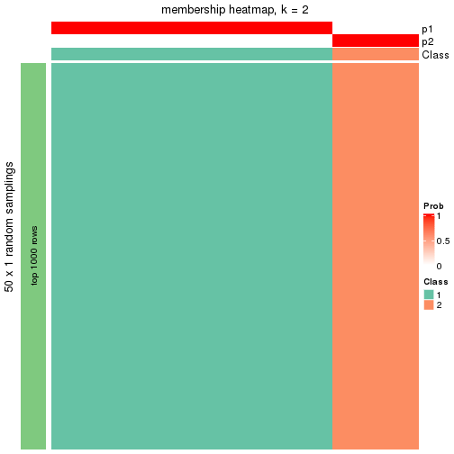</p>

</div>
<div id='tab-node-01-membership-heatmap-2'>
<pre><code class="r">membership_heatmap(res, k = 3)
</code></pre>

<p></p>

</div>
<div id='tab-node-01-membership-heatmap-3'>
<pre><code class="r">membership_heatmap(res, k = 4)
</code></pre>

<p></p>

</div>
<div id='tab-node-01-membership-heatmap-4'>
<pre><code class="r">membership_heatmap(res, k = 5)
</code></pre>

<p></p>

</div>
<div id='tab-node-01-membership-heatmap-5'>
<pre><code class="r">membership_heatmap(res, k = 6)
</code></pre>

<p>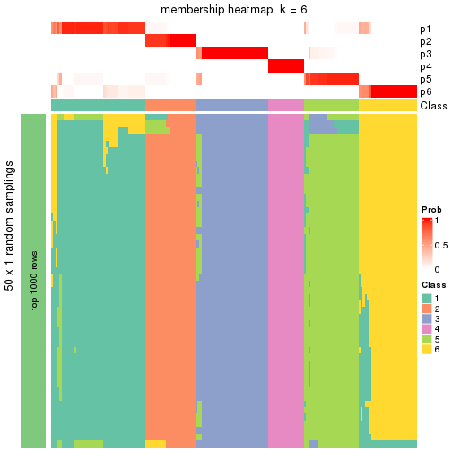</p>

</div>
<div id='tab-node-01-membership-heatmap-6'>
<pre><code class="r">membership_heatmap(res, k = 7)
</code></pre>

<p></p>

</div>
<div id='tab-node-01-membership-heatmap-7'>
<pre><code class="r">membership_heatmap(res, k = 8)
</code></pre>

<p></p>

</div>
</div>

As soon as the classes for columns are determined, the signatures
that are significantly different between subgroups can be looked for. 
Following are the heatmaps for signatures.


<script>
$( function() {
	$( '#tabs-node-01-get-signatures' ).tabs();
} );
</script>
<div id='tabs-node-01-get-signatures'>
<ul>
<li><a href='#tab-node-01-get-signatures-1'>k = 2</a></li>
<li><a href='#tab-node-01-get-signatures-2'>k = 3</a></li>
<li><a href='#tab-node-01-get-signatures-3'>k = 4</a></li>
<li><a href='#tab-node-01-get-signatures-4'>k = 5</a></li>
<li><a href='#tab-node-01-get-signatures-5'>k = 6</a></li>
<li><a href='#tab-node-01-get-signatures-6'>k = 7</a></li>
<li><a href='#tab-node-01-get-signatures-7'>k = 8</a></li>
</ul>
<div id='tab-node-01-get-signatures-1'>
<pre><code class="r">get_signatures(res, k = 2)
</code></pre>

<p></p>

</div>
<div id='tab-node-01-get-signatures-2'>
<pre><code class="r">get_signatures(res, k = 3)
</code></pre>

<p></p>

</div>
<div id='tab-node-01-get-signatures-3'>
<pre><code class="r">get_signatures(res, k = 4)
</code></pre>

<p></p>

</div>
<div id='tab-node-01-get-signatures-4'>
<pre><code class="r">get_signatures(res, k = 5)
</code></pre>

<p></p>

</div>
<div id='tab-node-01-get-signatures-5'>
<pre><code class="r">get_signatures(res, k = 6)
</code></pre>

<p></p>

</div>
<div id='tab-node-01-get-signatures-6'>
<pre><code class="r">get_signatures(res, k = 7)
</code></pre>

<p></p>

</div>
<div id='tab-node-01-get-signatures-7'>
<pre><code class="r">get_signatures(res, k = 8)
</code></pre>

<p></p>

</div>
</div>


Compare the overlap of signatures from different k:

```r
compare_signatures(res)
```


`get_signature()` returns a data frame invisibly. To get the list of signatures, the function
call should be assigned to a variable explicitly. In following code, if `plot` argument is set
to `FALSE`, no heatmap is plotted while only the differential analysis is performed.

```r
# code only for demonstration
tb = get_signature(res, k = ..., plot = FALSE)
```

An example of the output of `tb` is:

```
#>   which_row         fdr    mean_1    mean_2 scaled_mean_1 scaled_mean_2 km
#> 1        38 0.042760348  8.373488  9.131774    -0.5533452     0.5164555  1
#> 2        40 0.018707592  7.106213  8.469186    -0.6173731     0.5762149  1
#> 3        55 0.019134737 10.221463 11.207825    -0.6159697     0.5749050  1
#> 4        59 0.006059896  5.921854  7.869574    -0.6899429     0.6439467  1
#> 5        60 0.018055526  8.928898 10.211722    -0.6204761     0.5791110  1
#> 6        98 0.009384629 15.714769 14.887706     0.6635654    -0.6193277  2
...
```

The columns in `tb` are:

1. `which_row`: row indices corresponding to the input matrix.
2. `fdr`: FDR for the differential test. 
3. `mean_x`: The mean value in group x.
4. `scaled_mean_x`: The mean value in group x after rows are scaled.
5. `km`: Row groups if k-means clustering is applied to rows (which is done by automatically selecting number of clusters).

If there are too many signatures, `top_signatures = ...` can be set to only show the 
signatures with the highest FDRs:

```r
# code only for demonstration
# e.g. to show the top 500 most significant rows
tb = get_signature(res, k = ..., top_signatures = 500)
```

If the signatures are defined as these which are uniquely high in current group, `diff_method` argument
can be set to `"uniquely_high_in_one_group"`:

```r
# code only for demonstration
tb = get_signature(res, k = ..., diff_method = "uniquely_high_in_one_group")
```


UMAP plot which shows how samples are separated.


<script>
$( function() {
	$( '#tabs-node-01-dimension-reduction' ).tabs();
} );
</script>
<div id='tabs-node-01-dimension-reduction'>
<ul>
<li><a href='#tab-node-01-dimension-reduction-1'>k = 2</a></li>
<li><a href='#tab-node-01-dimension-reduction-2'>k = 3</a></li>
<li><a href='#tab-node-01-dimension-reduction-3'>k = 4</a></li>
<li><a href='#tab-node-01-dimension-reduction-4'>k = 5</a></li>
<li><a href='#tab-node-01-dimension-reduction-5'>k = 6</a></li>
<li><a href='#tab-node-01-dimension-reduction-6'>k = 7</a></li>
<li><a href='#tab-node-01-dimension-reduction-7'>k = 8</a></li>
</ul>
<div id='tab-node-01-dimension-reduction-1'>
<pre><code class="r">dimension_reduction(res, k = 2, method = &quot;UMAP&quot;)
</code></pre>

<p></p>

</div>
<div id='tab-node-01-dimension-reduction-2'>
<pre><code class="r">dimension_reduction(res, k = 3, method = &quot;UMAP&quot;)
</code></pre>

<p></p>

</div>
<div id='tab-node-01-dimension-reduction-3'>
<pre><code class="r">dimension_reduction(res, k = 4, method = &quot;UMAP&quot;)
</code></pre>

<p></p>

</div>
<div id='tab-node-01-dimension-reduction-4'>
<pre><code class="r">dimension_reduction(res, k = 5, method = &quot;UMAP&quot;)
</code></pre>

<p></p>

</div>
<div id='tab-node-01-dimension-reduction-5'>
<pre><code class="r">dimension_reduction(res, k = 6, method = &quot;UMAP&quot;)
</code></pre>

<p></p>

</div>
<div id='tab-node-01-dimension-reduction-6'>
<pre><code class="r">dimension_reduction(res, k = 7, method = &quot;UMAP&quot;)
</code></pre>

<p></p>

</div>
<div id='tab-node-01-dimension-reduction-7'>
<pre><code class="r">dimension_reduction(res, k = 8, method = &quot;UMAP&quot;)
</code></pre>

<p></p>

</div>
</div>


Following heatmap shows how subgroups are split when increasing `k`:

```r
collect_classes(res)
```

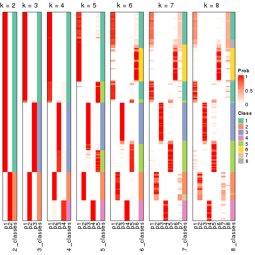


If matrix rows can be associated to genes, consider to use `functional_enrichment(res,
...)` to perform function enrichment for the signature genes. See [this vignette](https://jokergoo.github.io/cola_vignettes/functional_enrichment.html) for more detailed explanations.


 

---------------------------------------------------


### Node011


Parent node: [Node01](#Node01).
Child nodes: 
                Node0111-leaf
        ,
                Node0112-leaf
        ,
                Node0113-leaf
        ,
                Node0114-leaf
        ,
                Node0131-leaf
        ,
                Node0132-leaf
        ,
                Node0133-leaf
        ,
                Node0141-leaf
        ,
                Node0142-leaf
        ,
                Node0143-leaf
        ,
                Node0211-leaf
        ,
                Node0212-leaf
        ,
                Node0221-leaf
        ,
                Node0222-leaf
        ,
                Node0223-leaf
        ,
                Node0224-leaf
        ,
                Node0231-leaf
        ,
                [Node0232](#Node0232)
        ,
                Node0233-leaf
        ,
                Node0234-leaf
        ,
                [Node0241](#Node0241)
        ,
                Node0242-leaf
        ,
                Node0243-leaf
        ,
                Node0244-leaf
        ,
                Node0251-leaf
        ,
                Node0252-leaf
        ,
                [Node0311](#Node0311)
        ,
                Node0312-leaf
        ,
                Node0313-leaf
        ,
                Node0331-leaf
        ,
                Node0332-leaf
        ,
                Node0333-leaf
        .


The object with results only for a single top-value method and a single partitioning method 
can be extracted as:

```r
res = res_rh["011"]
```

A summary of `res` and all the functions that can be applied to it:

```r
res
```

```
#> A 'ConsensusPartition' object with k = 2, 3, 4, 5, 6, 7, 8.
#>   On a matrix with 30000 rows and 58 columns.
#>   Top rows (1000) are extracted by 'ATC' method.
#>   Subgroups are detected by 'skmeans' method.
#>   Performed in total 350 partitions by row resampling.
#>   Best k for subgroups seems to be 4.
#> 
#> Following methods can be applied to this 'ConsensusPartition' object:
#>  [1] "cola_report"             "collect_classes"         "collect_plots"          
#>  [4] "collect_stats"           "colnames"                "compare_partitions"     
#>  [7] "compare_signatures"      "consensus_heatmap"       "dimension_reduction"    
#> [10] "functional_enrichment"   "get_anno_col"            "get_anno"               
#> [13] "get_classes"             "get_consensus"           "get_matrix"             
#> [16] "get_membership"          "get_param"               "get_signatures"         
#> [19] "get_stats"               "is_best_k"               "is_stable_k"            
#> [22] "membership_heatmap"      "ncol"                    "nrow"                   
#> [25] "plot_ecdf"               "predict_classes"         "rownames"               
#> [28] "select_partition_number" "show"                    "suggest_best_k"         
#> [31] "test_to_known_factors"   "top_rows_heatmap"
```

`collect_plots()` function collects all the plots made from `res` for all `k` (number of subgroups)
into one single page to provide an easy and fast comparison between different `k`.

```r
collect_plots(res)
```


The plots are:

- The first row: a plot of the eCDF (empirical cumulative distribution
  function) curves of the consensus matrix for each `k` and the heatmap of
  predicted classes for each `k`.
- The second row: heatmaps of the consensus matrix for each `k`.
- The third row: heatmaps of the membership matrix for each `k`.
- The fouth row: heatmaps of the signatures for each `k`.

All the plots in panels can be made by individual functions and they are
plotted later in this section.

`select_partition_number()` produces several plots showing different
statistics for choosing "optimized" `k`. There are following statistics:

- eCDF curves of the consensus matrix for each `k`;
- 1-PAC. [The PAC score](https://en.wikipedia.org/wiki/Consensus_clustering#Over-interpretation_potential_of_consensus_clustering)
  measures the proportion of the ambiguous subgrouping.
- Mean silhouette score.
- Concordance. The mean probability of fiting the consensus subgroup labels in all
  partitions.
- Area increased. Denote $A_k$ as the area under the eCDF curve for current
  `k`, the area increased is defined as $A_k - A_{k-1}$.
- Rand index. The percent of pairs of samples that are both in a same cluster
  or both are not in a same cluster in the partition of k and k-1.
- Jaccard index. The ratio of pairs of samples are both in a same cluster in
  the partition of k and k-1 and the pairs of samples are both in a same
  cluster in the partition k or k-1.

The detailed explanations of these statistics can be found in [the _cola_
vignette](https://jokergoo.github.io/cola_vignettes/cola.html#toc_13).

Generally speaking, higher 1-PAC score, higher mean silhouette score or higher
concordance corresponds to better partition. Rand index and Jaccard index
measure how similar the current partition is compared to partition with `k-1`.
If they are too similar, we won't accept `k` is better than `k-1`.

```r
select_partition_number(res)
```


The numeric values for all these statistics can be obtained by `get_stats()`.

```r
get_stats(res)
```

```
#>   k 1-PAC mean_silhouette concordance area_increased  Rand Jaccard
#> 2 2 1.000           1.000       1.000         0.4996 0.501   0.501
#> 3 3 1.000           1.000       1.000         0.3048 0.652   0.418
#> 4 4 1.000           0.973       0.984         0.1507 0.828   0.553
#> 5 5 0.896           0.867       0.938         0.0233 0.969   0.876
#> 6 6 0.829           0.749       0.876         0.0277 0.999   0.995
#> 7 7 0.815           0.690       0.852         0.0188 0.991   0.960
#> 8 8 0.780           0.555       0.781         0.0240 0.962   0.833
```

`suggest_best_k()` suggests the best $k$ based on these statistics. The rules are as follows:

- All $k$ with Jaccard index larger than 0.95 are removed because increasing
  $k$ does not provide enough extra information. If all $k$ are removed, it is
  marked as no subgroup is detected.
- For all $k$ with 1-PAC score larger than 0.9, the maximal $k$ is taken as
  the best $k$, and other $k$ are marked as optional $k$.
- If it does not fit the second rule. The $k$ with the maximal vote of the
  highest 1-PAC score, highest mean silhouette, and highest concordance is
  taken as the best $k$.

```r
suggest_best_k(res)
```

```
#> [1] 4
#> attr(,"optional")
#> [1] 2 3
```

There is also optional best $k$ = 2 3 that is worth to check.

Following is the table of the partitions (You need to click the **show/hide
code output** link to see it). The membership matrix (columns with name `p*`)
is inferred by
[`clue::cl_consensus()`](https://www.rdocumentation.org/link/cl_consensus?package=clue)
function with the `SE` method. Basically the value in the membership matrix
represents the probability to belong to a certain group. The finall subgroup
label for an item is determined with the group with highest probability it
belongs to.

In `get_classes()` function, the entropy is calculated from the membership
matrix and the silhouette score is calculated from the consensus matrix.


<script>
$( function() {
	$( '#tabs-node-011-get-classes' ).tabs();
} );
</script>
<div id='tabs-node-011-get-classes'>
<ul>
<li><a href='#tab-node-011-get-classes-1'>k = 2</a></li>
<li><a href='#tab-node-011-get-classes-2'>k = 3</a></li>
<li><a href='#tab-node-011-get-classes-3'>k = 4</a></li>
<li><a href='#tab-node-011-get-classes-4'>k = 5</a></li>
<li><a href='#tab-node-011-get-classes-5'>k = 6</a></li>
<li><a href='#tab-node-011-get-classes-6'>k = 7</a></li>
<li><a href='#tab-node-011-get-classes-7'>k = 8</a></li>
</ul>

<div id='tab-node-011-get-classes-1'>
<p><a id='tab-node-011-get-classes-1-a' style='color:#0366d6' href='#'>show/hide code output</a></p>
<pre><code class="r">cbind(get_classes(res, k = 2), get_membership(res, k = 2))
</code></pre>

<pre><code>#&gt;                 class entropy silhouette p1 p2
#&gt; TCGA.DJ.A3V9.01     2       0          1  0  1
#&gt; TCGA.EL.A3ZN.01     2       0          1  0  1
#&gt; TCGA.E8.A415.01     2       0          1  0  1
#&gt; TCGA.J8.A3YE.01     2       0          1  0  1
#&gt; TCGA.KS.A4IC.01     1       0          1  1  0
#&gt; TCGA.DJ.A4V4.01     2       0          1  0  1
#&gt; TCGA.FY.A40K.01     1       0          1  1  0
#&gt; TCGA.J8.A4HY.01     2       0          1  0  1
#&gt; TCGA.FY.A40N.01     2       0          1  0  1
#&gt; TCGA.E8.A438.01     2       0          1  0  1
#&gt; TCGA.EL.A4KH.01     1       0          1  1  0
#&gt; TCGA.ET.A2N1.01     2       0          1  0  1
#&gt; TCGA.DJ.A2PS.01     2       0          1  0  1
#&gt; TCGA.E8.A437.01     2       0          1  0  1
#&gt; TCGA.CE.A483.01     1       0          1  1  0
#&gt; TCGA.DJ.A4UW.01     2       0          1  0  1
#&gt; TCGA.DE.A3KN.01     2       0          1  0  1
#&gt; TCGA.DJ.A2QA.01     2       0          1  0  1
#&gt; TCGA.BJ.A4O9.01     1       0          1  1  0
#&gt; TCGA.CE.A3ME.01     2       0          1  0  1
#&gt; TCGA.E3.A3E1.01     2       0          1  0  1
#&gt; TCGA.FY.A3I4.01     2       0          1  0  1
#&gt; TCGA.ET.A3DP.01     1       0          1  1  0
#&gt; TCGA.EL.A3GV.01     1       0          1  1  0
#&gt; TCGA.J8.A3O1.01     2       0          1  0  1
#&gt; TCGA.EM.A2CR.01     2       0          1  0  1
#&gt; TCGA.J8.A3NZ.01     2       0          1  0  1
#&gt; TCGA.FE.A237.01     1       0          1  1  0
#&gt; TCGA.DJ.A2QC.01     1       0          1  1  0
#&gt; TCGA.EM.A2CS.06     2       0          1  0  1
#&gt; TCGA.ET.A25J.01     2       0          1  0  1
#&gt; TCGA.FY.A3NN.01     1       0          1  1  0
#&gt; TCGA.BJ.A191.01     2       0          1  0  1
#&gt; TCGA.EM.A3AK.01     1       0          1  1  0
#&gt; TCGA.EM.A1CS.01     1       0          1  1  0
#&gt; TCGA.EL.A3GQ.01     1       0          1  1  0
#&gt; TCGA.DJ.A3V4.01     2       0          1  0  1
#&gt; TCGA.EL.A3GR.01     2       0          1  0  1
#&gt; TCGA.EM.A1CV.01     1       0          1  1  0
#&gt; TCGA.DJ.A3UU.01     2       0          1  0  1
#&gt; TCGA.EL.A3T0.01     2       0          1  0  1
#&gt; TCGA.ET.A3BW.01     1       0          1  1  0
#&gt; TCGA.ET.A39S.01     2       0          1  0  1
#&gt; TCGA.ET.A3BP.01     1       0          1  1  0
#&gt; TCGA.FE.A232.01     2       0          1  0  1
#&gt; TCGA.DJ.A3UR.01     1       0          1  1  0
#&gt; TCGA.FK.A3S3.01     2       0          1  0  1
#&gt; TCGA.DJ.A1QF.01     1       0          1  1  0
#&gt; TCGA.DJ.A3UV.01     2       0          1  0  1
#&gt; TCGA.EL.A3CX.01     2       0          1  0  1
#&gt; TCGA.DJ.A3UK.01     1       0          1  1  0
#&gt; TCGA.ET.A39T.01     1       0          1  1  0
#&gt; TCGA.DJ.A2PV.01     1       0          1  1  0
#&gt; TCGA.DJ.A13X.01     1       0          1  1  0
#&gt; TCGA.ET.A2N4.01     1       0          1  1  0
#&gt; TCGA.DJ.A13P.01     1       0          1  1  0
#&gt; TCGA.EM.A3O7.01     1       0          1  1  0
#&gt; TCGA.ET.A3DR.01     2       0          1  0  1
</code></pre>

<script>
$('#tab-node-011-get-classes-1-a').parent().next().next().hide();
$('#tab-node-011-get-classes-1-a').click(function(){
  $('#tab-node-011-get-classes-1-a').parent().next().next().toggle();
  return(false);
});
</script>
</div>

<div id='tab-node-011-get-classes-2'>
<p><a id='tab-node-011-get-classes-2-a' style='color:#0366d6' href='#'>show/hide code output</a></p>
<pre><code class="r">cbind(get_classes(res, k = 3), get_membership(res, k = 3))
</code></pre>

<pre><code>#&gt;                 class entropy silhouette p1 p2 p3
#&gt; TCGA.DJ.A3V9.01     2       0          1  0  1  0
#&gt; TCGA.EL.A3ZN.01     3       0          1  0  0  1
#&gt; TCGA.E8.A415.01     2       0          1  0  1  0
#&gt; TCGA.J8.A3YE.01     2       0          1  0  1  0
#&gt; TCGA.KS.A4IC.01     2       0          1  0  1  0
#&gt; TCGA.DJ.A4V4.01     2       0          1  0  1  0
#&gt; TCGA.FY.A40K.01     1       0          1  1  0  0
#&gt; TCGA.J8.A4HY.01     2       0          1  0  1  0
#&gt; TCGA.FY.A40N.01     3       0          1  0  0  1
#&gt; TCGA.E8.A438.01     3       0          1  0  0  1
#&gt; TCGA.EL.A4KH.01     1       0          1  1  0  0
#&gt; TCGA.ET.A2N1.01     3       0          1  0  0  1
#&gt; TCGA.DJ.A2PS.01     2       0          1  0  1  0
#&gt; TCGA.E8.A437.01     2       0          1  0  1  0
#&gt; TCGA.CE.A483.01     2       0          1  0  1  0
#&gt; TCGA.DJ.A4UW.01     2       0          1  0  1  0
#&gt; TCGA.DE.A3KN.01     3       0          1  0  0  1
#&gt; TCGA.DJ.A2QA.01     2       0          1  0  1  0
#&gt; TCGA.BJ.A4O9.01     2       0          1  0  1  0
#&gt; TCGA.CE.A3ME.01     2       0          1  0  1  0
#&gt; TCGA.E3.A3E1.01     2       0          1  0  1  0
#&gt; TCGA.FY.A3I4.01     3       0          1  0  0  1
#&gt; TCGA.ET.A3DP.01     1       0          1  1  0  0
#&gt; TCGA.EL.A3GV.01     1       0          1  1  0  0
#&gt; TCGA.J8.A3O1.01     3       0          1  0  0  1
#&gt; TCGA.EM.A2CR.01     3       0          1  0  0  1
#&gt; TCGA.J8.A3NZ.01     2       0          1  0  1  0
#&gt; TCGA.FE.A237.01     2       0          1  0  1  0
#&gt; TCGA.DJ.A2QC.01     1       0          1  1  0  0
#&gt; TCGA.EM.A2CS.06     2       0          1  0  1  0
#&gt; TCGA.ET.A25J.01     2       0          1  0  1  0
#&gt; TCGA.FY.A3NN.01     2       0          1  0  1  0
#&gt; TCGA.BJ.A191.01     3       0          1  0  0  1
#&gt; TCGA.EM.A3AK.01     2       0          1  0  1  0
#&gt; TCGA.EM.A1CS.01     1       0          1  1  0  0
#&gt; TCGA.EL.A3GQ.01     1       0          1  1  0  0
#&gt; TCGA.DJ.A3V4.01     2       0          1  0  1  0
#&gt; TCGA.EL.A3GR.01     3       0          1  0  0  1
#&gt; TCGA.EM.A1CV.01     1       0          1  1  0  0
#&gt; TCGA.DJ.A3UU.01     2       0          1  0  1  0
#&gt; TCGA.EL.A3T0.01     3       0          1  0  0  1
#&gt; TCGA.ET.A3BW.01     1       0          1  1  0  0
#&gt; TCGA.ET.A39S.01     2       0          1  0  1  0
#&gt; TCGA.ET.A3BP.01     2       0          1  0  1  0
#&gt; TCGA.FE.A232.01     2       0          1  0  1  0
#&gt; TCGA.DJ.A3UR.01     1       0          1  1  0  0
#&gt; TCGA.FK.A3S3.01     3       0          1  0  0  1
#&gt; TCGA.DJ.A1QF.01     2       0          1  0  1  0
#&gt; TCGA.DJ.A3UV.01     3       0          1  0  0  1
#&gt; TCGA.EL.A3CX.01     3       0          1  0  0  1
#&gt; TCGA.DJ.A3UK.01     1       0          1  1  0  0
#&gt; TCGA.ET.A39T.01     2       0          1  0  1  0
#&gt; TCGA.DJ.A2PV.01     1       0          1  1  0  0
#&gt; TCGA.DJ.A13X.01     1       0          1  1  0  0
#&gt; TCGA.ET.A2N4.01     1       0          1  1  0  0
#&gt; TCGA.DJ.A13P.01     1       0          1  1  0  0
#&gt; TCGA.EM.A3O7.01     1       0          1  1  0  0
#&gt; TCGA.ET.A3DR.01     3       0          1  0  0  1
</code></pre>

<script>
$('#tab-node-011-get-classes-2-a').parent().next().next().hide();
$('#tab-node-011-get-classes-2-a').click(function(){
  $('#tab-node-011-get-classes-2-a').parent().next().next().toggle();
  return(false);
});
</script>
</div>

<div id='tab-node-011-get-classes-3'>
<p><a id='tab-node-011-get-classes-3-a' style='color:#0366d6' href='#'>show/hide code output</a></p>
<pre><code class="r">cbind(get_classes(res, k = 4), get_membership(res, k = 4))
</code></pre>

<pre><code>#&gt;                 class entropy silhouette p1   p2   p3   p4
#&gt; TCGA.DJ.A3V9.01     4  0.0707      0.963  0 0.02 0.00 0.98
#&gt; TCGA.EL.A3ZN.01     3  0.0000      0.973  0 0.00 1.00 0.00
#&gt; TCGA.E8.A415.01     4  0.0707      0.963  0 0.02 0.00 0.98
#&gt; TCGA.J8.A3YE.01     2  0.0000      1.000  0 1.00 0.00 0.00
#&gt; TCGA.KS.A4IC.01     2  0.0000      1.000  0 1.00 0.00 0.00
#&gt; TCGA.DJ.A4V4.01     2  0.0000      1.000  0 1.00 0.00 0.00
#&gt; TCGA.FY.A40K.01     1  0.0000      1.000  1 0.00 0.00 0.00
#&gt; TCGA.J8.A4HY.01     2  0.0000      1.000  0 1.00 0.00 0.00
#&gt; TCGA.FY.A40N.01     4  0.0707      0.953  0 0.00 0.02 0.98
#&gt; TCGA.E8.A438.01     3  0.0000      0.973  0 0.00 1.00 0.00
#&gt; TCGA.EL.A4KH.01     1  0.0000      1.000  1 0.00 0.00 0.00
#&gt; TCGA.ET.A2N1.01     3  0.0000      0.973  0 0.00 1.00 0.00
#&gt; TCGA.DJ.A2PS.01     4  0.0707      0.963  0 0.02 0.00 0.98
#&gt; TCGA.E8.A437.01     4  0.0707      0.963  0 0.02 0.00 0.98
#&gt; TCGA.CE.A483.01     2  0.0000      1.000  0 1.00 0.00 0.00
#&gt; TCGA.DJ.A4UW.01     4  0.0707      0.963  0 0.02 0.00 0.98
#&gt; TCGA.DE.A3KN.01     3  0.0000      0.973  0 0.00 1.00 0.00
#&gt; TCGA.DJ.A2QA.01     4  0.0707      0.963  0 0.02 0.00 0.98
#&gt; TCGA.BJ.A4O9.01     2  0.0000      1.000  0 1.00 0.00 0.00
#&gt; TCGA.CE.A3ME.01     2  0.0000      1.000  0 1.00 0.00 0.00
#&gt; TCGA.E3.A3E1.01     2  0.0000      1.000  0 1.00 0.00 0.00
#&gt; TCGA.FY.A3I4.01     4  0.0000      0.952  0 0.00 0.00 1.00
#&gt; TCGA.ET.A3DP.01     1  0.0000      1.000  1 0.00 0.00 0.00
#&gt; TCGA.EL.A3GV.01     1  0.0000      1.000  1 0.00 0.00 0.00
#&gt; TCGA.J8.A3O1.01     3  0.0000      0.973  0 0.00 1.00 0.00
#&gt; TCGA.EM.A2CR.01     4  0.0707      0.953  0 0.00 0.02 0.98
#&gt; TCGA.J8.A3NZ.01     2  0.0000      1.000  0 1.00 0.00 0.00
#&gt; TCGA.FE.A237.01     2  0.0000      1.000  0 1.00 0.00 0.00
#&gt; TCGA.DJ.A2QC.01     1  0.0000      1.000  1 0.00 0.00 0.00
#&gt; TCGA.EM.A2CS.06     4  0.0707      0.963  0 0.02 0.00 0.98
#&gt; TCGA.ET.A25J.01     2  0.0000      1.000  0 1.00 0.00 0.00
#&gt; TCGA.FY.A3NN.01     2  0.0000      1.000  0 1.00 0.00 0.00
#&gt; TCGA.BJ.A191.01     3  0.0707      0.963  0 0.00 0.98 0.02
#&gt; TCGA.EM.A3AK.01     4  0.0707      0.963  0 0.02 0.00 0.98
#&gt; TCGA.EM.A1CS.01     1  0.0000      1.000  1 0.00 0.00 0.00
#&gt; TCGA.EL.A3GQ.01     1  0.0000      1.000  1 0.00 0.00 0.00
#&gt; TCGA.DJ.A3V4.01     2  0.0000      1.000  0 1.00 0.00 0.00
#&gt; TCGA.EL.A3GR.01     4  0.4406      0.536  0 0.00 0.30 0.70
#&gt; TCGA.EM.A1CV.01     1  0.0000      1.000  1 0.00 0.00 0.00
#&gt; TCGA.DJ.A3UU.01     4  0.0707      0.963  0 0.02 0.00 0.98
#&gt; TCGA.EL.A3T0.01     4  0.0707      0.953  0 0.00 0.02 0.98
#&gt; TCGA.ET.A3BW.01     1  0.0000      1.000  1 0.00 0.00 0.00
#&gt; TCGA.ET.A39S.01     4  0.0707      0.963  0 0.02 0.00 0.98
#&gt; TCGA.ET.A3BP.01     2  0.0000      1.000  0 1.00 0.00 0.00
#&gt; TCGA.FE.A232.01     2  0.0000      1.000  0 1.00 0.00 0.00
#&gt; TCGA.DJ.A3UR.01     1  0.0000      1.000  1 0.00 0.00 0.00
#&gt; TCGA.FK.A3S3.01     4  0.2647      0.860  0 0.00 0.12 0.88
#&gt; TCGA.DJ.A1QF.01     2  0.0000      1.000  0 1.00 0.00 0.00
#&gt; TCGA.DJ.A3UV.01     3  0.2921      0.834  0 0.00 0.86 0.14
#&gt; TCGA.EL.A3CX.01     3  0.0000      0.973  0 0.00 1.00 0.00
#&gt; TCGA.DJ.A3UK.01     1  0.0000      1.000  1 0.00 0.00 0.00
#&gt; TCGA.ET.A39T.01     2  0.0000      1.000  0 1.00 0.00 0.00
#&gt; TCGA.DJ.A2PV.01     1  0.0000      1.000  1 0.00 0.00 0.00
#&gt; TCGA.DJ.A13X.01     1  0.0000      1.000  1 0.00 0.00 0.00
#&gt; TCGA.ET.A2N4.01     1  0.0000      1.000  1 0.00 0.00 0.00
#&gt; TCGA.DJ.A13P.01     1  0.0000      1.000  1 0.00 0.00 0.00
#&gt; TCGA.EM.A3O7.01     1  0.0000      1.000  1 0.00 0.00 0.00
#&gt; TCGA.ET.A3DR.01     3  0.1637      0.942  0 0.00 0.94 0.06
</code></pre>

<script>
$('#tab-node-011-get-classes-3-a').parent().next().next().hide();
$('#tab-node-011-get-classes-3-a').click(function(){
  $('#tab-node-011-get-classes-3-a').parent().next().next().toggle();
  return(false);
});
</script>
</div>

<div id='tab-node-011-get-classes-4'>
<p><a id='tab-node-011-get-classes-4-a' style='color:#0366d6' href='#'>show/hide code output</a></p>
<pre><code class="r">cbind(get_classes(res, k = 5), get_membership(res, k = 5))
</code></pre>

<pre><code>#&gt;                 class entropy silhouette   p1   p2   p3   p4   p5
#&gt; TCGA.DJ.A3V9.01     4  0.1043     0.8702 0.00 0.00 0.00 0.96 0.04
#&gt; TCGA.EL.A3ZN.01     3  0.0000     0.8229 0.00 0.00 1.00 0.00 0.00
#&gt; TCGA.E8.A415.01     4  0.2873     0.7658 0.00 0.12 0.00 0.86 0.02
#&gt; TCGA.J8.A3YE.01     2  0.0000     0.9725 0.00 1.00 0.00 0.00 0.00
#&gt; TCGA.KS.A4IC.01     2  0.1043     0.9726 0.00 0.96 0.00 0.00 0.04
#&gt; TCGA.DJ.A4V4.01     2  0.0609     0.9596 0.00 0.98 0.00 0.00 0.02
#&gt; TCGA.FY.A40K.01     1  0.0000     1.0000 1.00 0.00 0.00 0.00 0.00
#&gt; TCGA.J8.A4HY.01     2  0.0000     0.9725 0.00 1.00 0.00 0.00 0.00
#&gt; TCGA.FY.A40N.01     4  0.2438     0.8339 0.00 0.00 0.04 0.90 0.06
#&gt; TCGA.E8.A438.01     3  0.0000     0.8229 0.00 0.00 1.00 0.00 0.00
#&gt; TCGA.EL.A4KH.01     1  0.0000     1.0000 1.00 0.00 0.00 0.00 0.00
#&gt; TCGA.ET.A2N1.01     3  0.0000     0.8229 0.00 0.00 1.00 0.00 0.00
#&gt; TCGA.DJ.A2PS.01     4  0.0000     0.8820 0.00 0.00 0.00 1.00 0.00
#&gt; TCGA.E8.A437.01     4  0.2754     0.8077 0.00 0.08 0.00 0.88 0.04
#&gt; TCGA.CE.A483.01     2  0.1043     0.9726 0.00 0.96 0.00 0.00 0.04
#&gt; TCGA.DJ.A4UW.01     4  0.0000     0.8820 0.00 0.00 0.00 1.00 0.00
#&gt; TCGA.DE.A3KN.01     3  0.0000     0.8229 0.00 0.00 1.00 0.00 0.00
#&gt; TCGA.DJ.A2QA.01     4  0.0000     0.8820 0.00 0.00 0.00 1.00 0.00
#&gt; TCGA.BJ.A4O9.01     2  0.1043     0.9726 0.00 0.96 0.00 0.00 0.04
#&gt; TCGA.CE.A3ME.01     2  0.0000     0.9725 0.00 1.00 0.00 0.00 0.00
#&gt; TCGA.E3.A3E1.01     2  0.0000     0.9725 0.00 1.00 0.00 0.00 0.00
#&gt; TCGA.FY.A3I4.01     4  0.4588     0.5551 0.00 0.00 0.06 0.72 0.22
#&gt; TCGA.ET.A3DP.01     1  0.0000     1.0000 1.00 0.00 0.00 0.00 0.00
#&gt; TCGA.EL.A3GV.01     1  0.0000     1.0000 1.00 0.00 0.00 0.00 0.00
#&gt; TCGA.J8.A3O1.01     3  0.1410     0.7945 0.00 0.00 0.94 0.00 0.06
#&gt; TCGA.EM.A2CR.01     4  0.3037     0.7899 0.00 0.00 0.10 0.86 0.04
#&gt; TCGA.J8.A3NZ.01     2  0.0000     0.9725 0.00 1.00 0.00 0.00 0.00
#&gt; TCGA.FE.A237.01     2  0.1043     0.9726 0.00 0.96 0.00 0.00 0.04
#&gt; TCGA.DJ.A2QC.01     1  0.0000     1.0000 1.00 0.00 0.00 0.00 0.00
#&gt; TCGA.EM.A2CS.06     4  0.0000     0.8820 0.00 0.00 0.00 1.00 0.00
#&gt; TCGA.ET.A25J.01     2  0.0000     0.9725 0.00 1.00 0.00 0.00 0.00
#&gt; TCGA.FY.A3NN.01     2  0.1043     0.9726 0.00 0.96 0.00 0.00 0.04
#&gt; TCGA.BJ.A191.01     5  0.3109     0.3123 0.00 0.00 0.20 0.00 0.80
#&gt; TCGA.EM.A3AK.01     4  0.2675     0.8033 0.04 0.02 0.00 0.90 0.04
#&gt; TCGA.EM.A1CS.01     1  0.0000     1.0000 1.00 0.00 0.00 0.00 0.00
#&gt; TCGA.EL.A3GQ.01     1  0.0000     1.0000 1.00 0.00 0.00 0.00 0.00
#&gt; TCGA.DJ.A3V4.01     2  0.2438     0.8716 0.00 0.90 0.00 0.06 0.04
#&gt; TCGA.EL.A3GR.01     5  0.6219     0.2142 0.00 0.00 0.14 0.42 0.44
#&gt; TCGA.EM.A1CV.01     1  0.0000     1.0000 1.00 0.00 0.00 0.00 0.00
#&gt; TCGA.DJ.A3UU.01     4  0.1043     0.8702 0.00 0.00 0.00 0.96 0.04
#&gt; TCGA.EL.A3T0.01     4  0.3106     0.7665 0.00 0.00 0.14 0.84 0.02
#&gt; TCGA.ET.A3BW.01     1  0.0000     1.0000 1.00 0.00 0.00 0.00 0.00
#&gt; TCGA.ET.A39S.01     4  0.0000     0.8820 0.00 0.00 0.00 1.00 0.00
#&gt; TCGA.ET.A3BP.01     2  0.1043     0.9726 0.00 0.96 0.00 0.00 0.04
#&gt; TCGA.FE.A232.01     2  0.0000     0.9725 0.00 1.00 0.00 0.00 0.00
#&gt; TCGA.DJ.A3UR.01     1  0.0000     1.0000 1.00 0.00 0.00 0.00 0.00
#&gt; TCGA.FK.A3S3.01     3  0.4990     0.0942 0.00 0.00 0.60 0.36 0.04
#&gt; TCGA.DJ.A1QF.01     2  0.1043     0.9726 0.00 0.96 0.00 0.00 0.04
#&gt; TCGA.DJ.A3UV.01     3  0.3731     0.5440 0.00 0.00 0.80 0.16 0.04
#&gt; TCGA.EL.A3CX.01     3  0.1732     0.7804 0.00 0.00 0.92 0.00 0.08
#&gt; TCGA.DJ.A3UK.01     1  0.0000     1.0000 1.00 0.00 0.00 0.00 0.00
#&gt; TCGA.ET.A39T.01     2  0.1043     0.9726 0.00 0.96 0.00 0.00 0.04
#&gt; TCGA.DJ.A2PV.01     1  0.0000     1.0000 1.00 0.00 0.00 0.00 0.00
#&gt; TCGA.DJ.A13X.01     1  0.0000     1.0000 1.00 0.00 0.00 0.00 0.00
#&gt; TCGA.ET.A2N4.01     1  0.0000     1.0000 1.00 0.00 0.00 0.00 0.00
#&gt; TCGA.DJ.A13P.01     1  0.0000     1.0000 1.00 0.00 0.00 0.00 0.00
#&gt; TCGA.EM.A3O7.01     1  0.0000     1.0000 1.00 0.00 0.00 0.00 0.00
#&gt; TCGA.ET.A3DR.01     5  0.6447     0.3725 0.00 0.00 0.38 0.18 0.44
</code></pre>

<script>
$('#tab-node-011-get-classes-4-a').parent().next().next().hide();
$('#tab-node-011-get-classes-4-a').click(function(){
  $('#tab-node-011-get-classes-4-a').parent().next().next().toggle();
  return(false);
});
</script>
</div>

<div id='tab-node-011-get-classes-5'>
<p><a id='tab-node-011-get-classes-5-a' style='color:#0366d6' href='#'>show/hide code output</a></p>
<pre><code class="r">cbind(get_classes(res, k = 6), get_membership(res, k = 6))
</code></pre>

<pre><code>#&gt;                 class entropy silhouette   p1   p2   p3   p4   p5   p6
#&gt; TCGA.DJ.A3V9.01     4  0.0937     0.7248 0.00 0.00 0.00 0.96 0.04 0.00
#&gt; TCGA.EL.A3ZN.01     3  0.0000     0.7693 0.00 0.00 1.00 0.00 0.00 0.00
#&gt; TCGA.E8.A415.01     4  0.5111     0.4505 0.00 0.02 0.00 0.66 0.22 0.10
#&gt; TCGA.J8.A3YE.01     2  0.2793     0.8604 0.00 0.80 0.00 0.00 0.00 0.20
#&gt; TCGA.KS.A4IC.01     2  0.0000     0.8565 0.00 1.00 0.00 0.00 0.00 0.00
#&gt; TCGA.DJ.A4V4.01     2  0.4475     0.7751 0.00 0.70 0.00 0.10 0.00 0.20
#&gt; TCGA.FY.A40K.01     1  0.0000     0.9831 1.00 0.00 0.00 0.00 0.00 0.00
#&gt; TCGA.J8.A4HY.01     2  0.2793     0.8604 0.00 0.80 0.00 0.00 0.00 0.20
#&gt; TCGA.FY.A40N.01     4  0.3499     0.4883 0.00 0.00 0.00 0.68 0.32 0.00
#&gt; TCGA.E8.A438.01     3  0.0000     0.7693 0.00 0.00 1.00 0.00 0.00 0.00
#&gt; TCGA.EL.A4KH.01     1  0.0000     0.9831 1.00 0.00 0.00 0.00 0.00 0.00
#&gt; TCGA.ET.A2N1.01     3  0.0000     0.7693 0.00 0.00 1.00 0.00 0.00 0.00
#&gt; TCGA.DJ.A2PS.01     4  0.0000     0.7323 0.00 0.00 0.00 1.00 0.00 0.00
#&gt; TCGA.E8.A437.01     4  0.5043     0.3969 0.00 0.02 0.00 0.68 0.12 0.18
#&gt; TCGA.CE.A483.01     2  0.0547     0.8442 0.00 0.98 0.00 0.02 0.00 0.00
#&gt; TCGA.DJ.A4UW.01     4  0.0000     0.7323 0.00 0.00 0.00 1.00 0.00 0.00
#&gt; TCGA.DE.A3KN.01     3  0.0000     0.7693 0.00 0.00 1.00 0.00 0.00 0.00
#&gt; TCGA.DJ.A2QA.01     4  0.0000     0.7323 0.00 0.00 0.00 1.00 0.00 0.00
#&gt; TCGA.BJ.A4O9.01     2  0.0000     0.8565 0.00 1.00 0.00 0.00 0.00 0.00
#&gt; TCGA.CE.A3ME.01     2  0.2793     0.8604 0.00 0.80 0.00 0.00 0.00 0.20
#&gt; TCGA.E3.A3E1.01     2  0.2793     0.8604 0.00 0.80 0.00 0.00 0.00 0.20
#&gt; TCGA.FY.A3I4.01     4  0.3828     0.0540 0.00 0.00 0.00 0.56 0.44 0.00
#&gt; TCGA.ET.A3DP.01     1  0.1092     0.9740 0.96 0.00 0.00 0.00 0.02 0.02
#&gt; TCGA.EL.A3GV.01     1  0.1092     0.9740 0.96 0.00 0.00 0.00 0.02 0.02
#&gt; TCGA.J8.A3O1.01     3  0.0937     0.7509 0.00 0.00 0.96 0.00 0.04 0.00
#&gt; TCGA.EM.A2CR.01     4  0.4420     0.4694 0.00 0.00 0.02 0.66 0.30 0.02
#&gt; TCGA.J8.A3NZ.01     2  0.2793     0.8604 0.00 0.80 0.00 0.00 0.00 0.20
#&gt; TCGA.FE.A237.01     2  0.0000     0.8565 0.00 1.00 0.00 0.00 0.00 0.00
#&gt; TCGA.DJ.A2QC.01     1  0.1092     0.9740 0.96 0.00 0.00 0.00 0.02 0.02
#&gt; TCGA.EM.A2CS.06     4  0.0937     0.7169 0.00 0.00 0.00 0.96 0.04 0.00
#&gt; TCGA.ET.A25J.01     2  0.2793     0.8604 0.00 0.80 0.00 0.00 0.00 0.20
#&gt; TCGA.FY.A3NN.01     2  0.0000     0.8565 0.00 1.00 0.00 0.00 0.00 0.00
#&gt; TCGA.BJ.A191.01     6  0.4067     0.0000 0.00 0.00 0.04 0.00 0.26 0.70
#&gt; TCGA.EM.A3AK.01     4  0.4947     0.4484 0.12 0.02 0.00 0.74 0.08 0.04
#&gt; TCGA.EM.A1CS.01     1  0.0000     0.9831 1.00 0.00 0.00 0.00 0.00 0.00
#&gt; TCGA.EL.A3GQ.01     1  0.0547     0.9803 0.98 0.00 0.00 0.00 0.00 0.02
#&gt; TCGA.DJ.A3V4.01     2  0.6575     0.5408 0.00 0.54 0.00 0.10 0.16 0.20
#&gt; TCGA.EL.A3GR.01     5  0.5189     0.6205 0.00 0.00 0.06 0.34 0.58 0.02
#&gt; TCGA.EM.A1CV.01     1  0.0000     0.9831 1.00 0.00 0.00 0.00 0.00 0.00
#&gt; TCGA.DJ.A3UU.01     4  0.1480     0.7098 0.00 0.00 0.00 0.94 0.04 0.02
#&gt; TCGA.EL.A3T0.01     4  0.3198     0.5617 0.00 0.00 0.00 0.74 0.26 0.00
#&gt; TCGA.ET.A3BW.01     1  0.0547     0.9682 0.98 0.02 0.00 0.00 0.00 0.00
#&gt; TCGA.ET.A39S.01     4  0.0547     0.7260 0.00 0.00 0.00 0.98 0.02 0.00
#&gt; TCGA.ET.A3BP.01     2  0.0000     0.8565 0.00 1.00 0.00 0.00 0.00 0.00
#&gt; TCGA.FE.A232.01     2  0.2793     0.8604 0.00 0.80 0.00 0.00 0.00 0.20
#&gt; TCGA.DJ.A3UR.01     1  0.0000     0.9831 1.00 0.00 0.00 0.00 0.00 0.00
#&gt; TCGA.FK.A3S3.01     3  0.6157     0.1378 0.00 0.00 0.50 0.28 0.20 0.02
#&gt; TCGA.DJ.A1QF.01     2  0.0000     0.8565 0.00 1.00 0.00 0.00 0.00 0.00
#&gt; TCGA.DJ.A3UV.01     3  0.5569    -0.0757 0.00 0.00 0.54 0.18 0.28 0.00
#&gt; TCGA.EL.A3CX.01     3  0.4121     0.5683 0.00 0.00 0.72 0.00 0.22 0.06
#&gt; TCGA.DJ.A3UK.01     1  0.0000     0.9831 1.00 0.00 0.00 0.00 0.00 0.00
#&gt; TCGA.ET.A39T.01     2  0.0000     0.8565 0.00 1.00 0.00 0.00 0.00 0.00
#&gt; TCGA.DJ.A2PV.01     1  0.1092     0.9740 0.96 0.00 0.00 0.00 0.02 0.02
#&gt; TCGA.DJ.A13X.01     1  0.0547     0.9803 0.98 0.00 0.00 0.00 0.00 0.02
#&gt; TCGA.ET.A2N4.01     1  0.1092     0.9740 0.96 0.00 0.00 0.00 0.02 0.02
#&gt; TCGA.DJ.A13P.01     1  0.0000     0.9831 1.00 0.00 0.00 0.00 0.00 0.00
#&gt; TCGA.EM.A3O7.01     1  0.0000     0.9831 1.00 0.00 0.00 0.00 0.00 0.00
#&gt; TCGA.ET.A3DR.01     5  0.5782     0.5825 0.00 0.00 0.22 0.18 0.58 0.02
</code></pre>

<script>
$('#tab-node-011-get-classes-5-a').parent().next().next().hide();
$('#tab-node-011-get-classes-5-a').click(function(){
  $('#tab-node-011-get-classes-5-a').parent().next().next().toggle();
  return(false);
});
</script>
</div>

<div id='tab-node-011-get-classes-6'>
<p><a id='tab-node-011-get-classes-6-a' style='color:#0366d6' href='#'>show/hide code output</a></p>
<pre><code class="r">cbind(get_classes(res, k = 7), get_membership(res, k = 7))
</code></pre>

<pre><code>#&gt;                 class entropy silhouette   p1   p2   p3   p4   p5   p6   p7
#&gt; TCGA.DJ.A3V9.01     4  0.1433     0.5998 0.00 0.00 0.00 0.92 0.08 0.00 0.00
#&gt; TCGA.EL.A3ZN.01     3  0.0000     0.7495 0.00 0.00 1.00 0.00 0.00 0.00 0.00
#&gt; TCGA.E8.A415.01     4  0.4783     0.0666 0.00 0.00 0.00 0.54 0.36 0.00 0.10
#&gt; TCGA.J8.A3YE.01     7  0.0000     0.8518 0.00 0.00 0.00 0.00 0.00 0.00 1.00
#&gt; TCGA.KS.A4IC.01     7  0.2259     0.8438 0.00 0.00 0.00 0.00 0.00 0.16 0.84
#&gt; TCGA.DJ.A4V4.01     7  0.1928     0.7839 0.00 0.02 0.00 0.08 0.00 0.00 0.90
#&gt; TCGA.FY.A40K.01     1  0.0000     0.9578 1.00 0.00 0.00 0.00 0.00 0.00 0.00
#&gt; TCGA.J8.A4HY.01     7  0.0504     0.8472 0.00 0.02 0.00 0.00 0.00 0.00 0.98
#&gt; TCGA.FY.A40N.01     4  0.5272     0.0811 0.00 0.02 0.06 0.54 0.36 0.02 0.00
#&gt; TCGA.E8.A438.01     3  0.0000     0.7495 0.00 0.00 1.00 0.00 0.00 0.00 0.00
#&gt; TCGA.EL.A4KH.01     1  0.1006     0.9520 0.96 0.02 0.00 0.00 0.00 0.02 0.00
#&gt; TCGA.ET.A2N1.01     3  0.0000     0.7495 0.00 0.00 1.00 0.00 0.00 0.00 0.00
#&gt; TCGA.DJ.A2PS.01     4  0.0000     0.6428 0.00 0.00 0.00 1.00 0.00 0.00 0.00
#&gt; TCGA.E8.A437.01     4  0.5293     0.1546 0.00 0.02 0.00 0.58 0.24 0.00 0.16
#&gt; TCGA.CE.A483.01     7  0.3661     0.8086 0.00 0.00 0.00 0.02 0.02 0.22 0.74
#&gt; TCGA.DJ.A4UW.01     4  0.0000     0.6428 0.00 0.00 0.00 1.00 0.00 0.00 0.00
#&gt; TCGA.DE.A3KN.01     3  0.0000     0.7495 0.00 0.00 1.00 0.00 0.00 0.00 0.00
#&gt; TCGA.DJ.A2QA.01     4  0.0000     0.6428 0.00 0.00 0.00 1.00 0.00 0.00 0.00
#&gt; TCGA.BJ.A4O9.01     7  0.1886     0.8502 0.00 0.00 0.00 0.00 0.00 0.12 0.88
#&gt; TCGA.CE.A3ME.01     7  0.0000     0.8518 0.00 0.00 0.00 0.00 0.00 0.00 1.00
#&gt; TCGA.E3.A3E1.01     7  0.0504     0.8472 0.00 0.02 0.00 0.00 0.00 0.00 0.98
#&gt; TCGA.FY.A3I4.01     5  0.3968     0.0339 0.00 0.00 0.02 0.44 0.54 0.00 0.00
#&gt; TCGA.ET.A3DP.01     1  0.1166     0.9455 0.94 0.06 0.00 0.00 0.00 0.00 0.00
#&gt; TCGA.EL.A3GV.01     1  0.0863     0.9523 0.96 0.04 0.00 0.00 0.00 0.00 0.00
#&gt; TCGA.J8.A3O1.01     3  0.2745     0.6516 0.00 0.16 0.82 0.00 0.02 0.00 0.00
#&gt; TCGA.EM.A2CR.01     4  0.6428     0.2204 0.00 0.18 0.08 0.52 0.20 0.02 0.00
#&gt; TCGA.J8.A3NZ.01     7  0.0504     0.8472 0.00 0.02 0.00 0.00 0.00 0.00 0.98
#&gt; TCGA.FE.A237.01     7  0.2832     0.8171 0.00 0.00 0.00 0.00 0.00 0.24 0.76
#&gt; TCGA.DJ.A2QC.01     1  0.1166     0.9454 0.94 0.06 0.00 0.00 0.00 0.00 0.00
#&gt; TCGA.EM.A2CS.06     4  0.0504     0.6355 0.00 0.02 0.00 0.98 0.00 0.00 0.00
#&gt; TCGA.ET.A25J.01     7  0.0504     0.8472 0.00 0.02 0.00 0.00 0.00 0.00 0.98
#&gt; TCGA.FY.A3NN.01     7  0.2832     0.8171 0.00 0.00 0.00 0.00 0.00 0.24 0.76
#&gt; TCGA.BJ.A191.01     6  0.4177     0.0000 0.00 0.12 0.00 0.00 0.18 0.70 0.00
#&gt; TCGA.EM.A3AK.01     4  0.5159     0.3172 0.04 0.24 0.00 0.64 0.02 0.06 0.00
#&gt; TCGA.EM.A1CS.01     1  0.1006     0.9520 0.96 0.02 0.00 0.00 0.00 0.02 0.00
#&gt; TCGA.EL.A3GQ.01     1  0.0863     0.9519 0.96 0.04 0.00 0.00 0.00 0.00 0.00
#&gt; TCGA.DJ.A3V4.01     7  0.4378     0.5065 0.00 0.02 0.00 0.08 0.20 0.00 0.70
#&gt; TCGA.EL.A3GR.01     5  0.5282     0.6174 0.00 0.04 0.08 0.22 0.64 0.02 0.00
#&gt; TCGA.EM.A1CV.01     1  0.0000     0.9578 1.00 0.00 0.00 0.00 0.00 0.00 0.00
#&gt; TCGA.DJ.A3UU.01     4  0.3186     0.4200 0.00 0.02 0.00 0.76 0.22 0.00 0.00
#&gt; TCGA.EL.A3T0.01     4  0.4872     0.2512 0.00 0.02 0.08 0.60 0.30 0.00 0.00
#&gt; TCGA.ET.A3BW.01     1  0.1363     0.9407 0.94 0.02 0.00 0.00 0.00 0.04 0.00
#&gt; TCGA.ET.A39S.01     4  0.0000     0.6428 0.00 0.00 0.00 1.00 0.00 0.00 0.00
#&gt; TCGA.ET.A3BP.01     7  0.2945     0.8062 0.00 0.00 0.00 0.00 0.00 0.26 0.74
#&gt; TCGA.FE.A232.01     7  0.0504     0.8541 0.00 0.00 0.00 0.00 0.00 0.02 0.98
#&gt; TCGA.DJ.A3UR.01     1  0.1006     0.9520 0.96 0.02 0.00 0.00 0.00 0.02 0.00
#&gt; TCGA.FK.A3S3.01     3  0.5536     0.4100 0.00 0.16 0.60 0.18 0.06 0.00 0.00
#&gt; TCGA.DJ.A1QF.01     7  0.2945     0.8062 0.00 0.00 0.00 0.00 0.00 0.26 0.74
#&gt; TCGA.DJ.A3UV.01     3  0.4737     0.1817 0.00 0.00 0.56 0.10 0.34 0.00 0.00
#&gt; TCGA.EL.A3CX.01     3  0.4710     0.2948 0.00 0.46 0.46 0.00 0.08 0.00 0.00
#&gt; TCGA.DJ.A3UK.01     1  0.0504     0.9564 0.98 0.00 0.00 0.00 0.00 0.02 0.00
#&gt; TCGA.ET.A39T.01     7  0.2708     0.8252 0.00 0.00 0.00 0.00 0.00 0.22 0.78
#&gt; TCGA.DJ.A2PV.01     1  0.1166     0.9454 0.94 0.06 0.00 0.00 0.00 0.00 0.00
#&gt; TCGA.DJ.A13X.01     1  0.1166     0.9454 0.94 0.06 0.00 0.00 0.00 0.00 0.00
#&gt; TCGA.ET.A2N4.01     1  0.1928     0.9192 0.90 0.08 0.00 0.00 0.00 0.02 0.00
#&gt; TCGA.DJ.A13P.01     1  0.1006     0.9520 0.96 0.02 0.00 0.00 0.00 0.02 0.00
#&gt; TCGA.EM.A3O7.01     1  0.0504     0.9564 0.98 0.00 0.00 0.00 0.00 0.02 0.00
#&gt; TCGA.ET.A3DR.01     5  0.5453     0.5499 0.00 0.04 0.16 0.14 0.64 0.02 0.00
</code></pre>

<script>
$('#tab-node-011-get-classes-6-a').parent().next().next().hide();
$('#tab-node-011-get-classes-6-a').click(function(){
  $('#tab-node-011-get-classes-6-a').parent().next().next().toggle();
  return(false);
});
</script>
</div>

<div id='tab-node-011-get-classes-7'>
<p><a id='tab-node-011-get-classes-7-a' style='color:#0366d6' href='#'>show/hide code output</a></p>
<pre><code class="r">cbind(get_classes(res, k = 8), get_membership(res, k = 8))
</code></pre>

<pre><code>#&gt;                 class entropy silhouette   p1   p2   p3   p4   p5   p6   p7   p8
#&gt; TCGA.DJ.A3V9.01     4  0.1741    0.58524 0.00 0.02 0.00 0.92 0.02 0.00 0.00 0.04
#&gt; TCGA.EL.A3ZN.01     3  0.0000    0.67759 0.00 0.00 1.00 0.00 0.00 0.00 0.00 0.00
#&gt; TCGA.E8.A415.01     4  0.5656   -0.28177 0.00 0.00 0.00 0.42 0.38 0.00 0.06 0.14
#&gt; TCGA.J8.A3YE.01     7  0.3015    0.62683 0.00 0.00 0.00 0.00 0.00 0.00 0.68 0.32
#&gt; TCGA.KS.A4IC.01     7  0.1091    0.69527 0.00 0.00 0.00 0.00 0.00 0.00 0.94 0.06
#&gt; TCGA.DJ.A4V4.01     7  0.4174    0.47982 0.00 0.00 0.00 0.06 0.00 0.00 0.54 0.40
#&gt; TCGA.FY.A40K.01     1  0.0471    0.90674 0.98 0.00 0.00 0.00 0.00 0.02 0.00 0.00
#&gt; TCGA.J8.A4HY.01     7  0.3618    0.57567 0.00 0.00 0.00 0.02 0.00 0.00 0.60 0.38
#&gt; TCGA.FY.A40N.01     5  0.4399    0.42771 0.00 0.00 0.04 0.44 0.50 0.00 0.00 0.02
#&gt; TCGA.E8.A438.01     3  0.0000    0.67759 0.00 0.00 1.00 0.00 0.00 0.00 0.00 0.00
#&gt; TCGA.EL.A4KH.01     1  0.2114    0.87781 0.84 0.00 0.00 0.00 0.00 0.16 0.00 0.00
#&gt; TCGA.ET.A2N1.01     3  0.0000    0.67759 0.00 0.00 1.00 0.00 0.00 0.00 0.00 0.00
#&gt; TCGA.DJ.A2PS.01     4  0.1091    0.59739 0.00 0.00 0.00 0.94 0.06 0.00 0.00 0.00
#&gt; TCGA.E8.A437.01     4  0.5493    0.12336 0.00 0.00 0.00 0.48 0.12 0.00 0.06 0.34
#&gt; TCGA.CE.A483.01     7  0.2864    0.65382 0.00 0.00 0.00 0.06 0.00 0.02 0.84 0.08
#&gt; TCGA.DJ.A4UW.01     4  0.0471    0.61957 0.00 0.00 0.00 0.98 0.02 0.00 0.00 0.00
#&gt; TCGA.DE.A3KN.01     3  0.0000    0.67759 0.00 0.00 1.00 0.00 0.00 0.00 0.00 0.00
#&gt; TCGA.DJ.A2QA.01     4  0.0471    0.61940 0.00 0.00 0.00 0.98 0.02 0.00 0.00 0.00
#&gt; TCGA.BJ.A4O9.01     7  0.0471    0.69501 0.00 0.00 0.00 0.00 0.00 0.00 0.98 0.02
#&gt; TCGA.CE.A3ME.01     7  0.2650    0.66809 0.00 0.00 0.00 0.00 0.00 0.00 0.76 0.24
#&gt; TCGA.E3.A3E1.01     7  0.3618    0.57567 0.00 0.00 0.00 0.02 0.00 0.00 0.60 0.38
#&gt; TCGA.FY.A3I4.01     5  0.5273    0.42922 0.00 0.04 0.00 0.34 0.50 0.00 0.00 0.12
#&gt; TCGA.ET.A3DP.01     1  0.1607    0.87771 0.92 0.00 0.00 0.00 0.04 0.00 0.00 0.04
#&gt; TCGA.EL.A3GV.01     1  0.0941    0.90610 0.96 0.00 0.00 0.00 0.02 0.02 0.00 0.00
#&gt; TCGA.J8.A3O1.01     3  0.4031    0.31653 0.00 0.16 0.72 0.00 0.00 0.02 0.00 0.10
#&gt; TCGA.EM.A2CR.01     5  0.5242    0.31608 0.00 0.04 0.06 0.38 0.50 0.00 0.00 0.02
#&gt; TCGA.J8.A3NZ.01     7  0.3907    0.54780 0.00 0.00 0.00 0.04 0.00 0.00 0.58 0.38
#&gt; TCGA.FE.A237.01     7  0.0941    0.67588 0.00 0.00 0.00 0.00 0.00 0.02 0.96 0.02
#&gt; TCGA.DJ.A2QC.01     1  0.1275    0.88647 0.94 0.00 0.00 0.00 0.02 0.00 0.00 0.04
#&gt; TCGA.EM.A2CS.06     4  0.2224    0.53387 0.00 0.00 0.00 0.86 0.12 0.00 0.00 0.02
#&gt; TCGA.ET.A25J.01     7  0.3618    0.57567 0.00 0.00 0.00 0.02 0.00 0.00 0.60 0.38
#&gt; TCGA.FY.A3NN.01     7  0.0941    0.67588 0.00 0.00 0.00 0.00 0.00 0.02 0.96 0.02
#&gt; TCGA.BJ.A191.01     6  0.3320    0.00000 0.00 0.04 0.00 0.00 0.12 0.80 0.00 0.04
#&gt; TCGA.EM.A3AK.01     4  0.5612    0.27883 0.14 0.04 0.00 0.64 0.10 0.00 0.02 0.06
#&gt; TCGA.EM.A1CS.01     1  0.2114    0.87781 0.84 0.00 0.00 0.00 0.00 0.16 0.00 0.00
#&gt; TCGA.EL.A3GQ.01     1  0.0000    0.90427 1.00 0.00 0.00 0.00 0.00 0.00 0.00 0.00
#&gt; TCGA.DJ.A3V4.01     8  0.5273   -0.55573 0.00 0.00 0.00 0.08 0.06 0.00 0.42 0.44
#&gt; TCGA.EL.A3GR.01     5  0.6835   -0.00324 0.00 0.10 0.08 0.12 0.36 0.00 0.00 0.34
#&gt; TCGA.EM.A1CV.01     1  0.0941    0.90718 0.96 0.00 0.00 0.00 0.02 0.02 0.00 0.00
#&gt; TCGA.DJ.A3UU.01     4  0.3303    0.46975 0.00 0.02 0.00 0.76 0.02 0.00 0.00 0.20
#&gt; TCGA.EL.A3T0.01     5  0.4216    0.43294 0.00 0.00 0.06 0.44 0.50 0.00 0.00 0.00
#&gt; TCGA.ET.A3BW.01     1  0.4034    0.82252 0.76 0.04 0.00 0.00 0.06 0.12 0.00 0.02
#&gt; TCGA.ET.A39S.01     4  0.0471    0.61891 0.00 0.00 0.00 0.98 0.02 0.00 0.00 0.00
#&gt; TCGA.ET.A3BP.01     7  0.1887    0.62801 0.00 0.00 0.00 0.00 0.00 0.06 0.90 0.04
#&gt; TCGA.FE.A232.01     7  0.2852    0.65819 0.00 0.00 0.00 0.00 0.00 0.00 0.72 0.28
#&gt; TCGA.DJ.A3UR.01     1  0.2114    0.87781 0.84 0.00 0.00 0.00 0.00 0.16 0.00 0.00
#&gt; TCGA.FK.A3S3.01     3  0.5069    0.24410 0.00 0.02 0.56 0.18 0.24 0.00 0.00 0.00
#&gt; TCGA.DJ.A1QF.01     7  0.1275    0.66249 0.00 0.00 0.00 0.00 0.00 0.02 0.94 0.04
#&gt; TCGA.DJ.A3UV.01     3  0.5189    0.03565 0.00 0.00 0.48 0.10 0.38 0.00 0.00 0.04
#&gt; TCGA.EL.A3CX.01     2  0.2534    0.00000 0.00 0.78 0.22 0.00 0.00 0.00 0.00 0.00
#&gt; TCGA.DJ.A3UK.01     1  0.1091    0.90549 0.94 0.00 0.00 0.00 0.00 0.06 0.00 0.00
#&gt; TCGA.ET.A39T.01     7  0.0471    0.68435 0.00 0.00 0.00 0.00 0.00 0.02 0.98 0.00
#&gt; TCGA.DJ.A2PV.01     1  0.1607    0.87685 0.92 0.00 0.00 0.00 0.04 0.00 0.00 0.04
#&gt; TCGA.DJ.A13X.01     1  0.0471    0.90081 0.98 0.00 0.00 0.00 0.00 0.00 0.00 0.02
#&gt; TCGA.ET.A2N4.01     1  0.3402    0.82804 0.82 0.04 0.00 0.00 0.06 0.02 0.00 0.06
#&gt; TCGA.DJ.A13P.01     1  0.2569    0.87114 0.82 0.00 0.00 0.00 0.02 0.16 0.00 0.00
#&gt; TCGA.EM.A3O7.01     1  0.1765    0.89085 0.88 0.00 0.00 0.00 0.00 0.12 0.00 0.00
#&gt; TCGA.ET.A3DR.01     8  0.7056   -0.52550 0.00 0.10 0.14 0.10 0.32 0.00 0.00 0.34
</code></pre>

<script>
$('#tab-node-011-get-classes-7-a').parent().next().next().hide();
$('#tab-node-011-get-classes-7-a').click(function(){
  $('#tab-node-011-get-classes-7-a').parent().next().next().toggle();
  return(false);
});
</script>
</div>
</div>

Heatmaps for the consensus matrix. It visualizes the probability of two
samples to be in a same group.


<script>
$( function() {
	$( '#tabs-node-011-consensus-heatmap' ).tabs();
} );
</script>
<div id='tabs-node-011-consensus-heatmap'>
<ul>
<li><a href='#tab-node-011-consensus-heatmap-1'>k = 2</a></li>
<li><a href='#tab-node-011-consensus-heatmap-2'>k = 3</a></li>
<li><a href='#tab-node-011-consensus-heatmap-3'>k = 4</a></li>
<li><a href='#tab-node-011-consensus-heatmap-4'>k = 5</a></li>
<li><a href='#tab-node-011-consensus-heatmap-5'>k = 6</a></li>
<li><a href='#tab-node-011-consensus-heatmap-6'>k = 7</a></li>
<li><a href='#tab-node-011-consensus-heatmap-7'>k = 8</a></li>
</ul>
<div id='tab-node-011-consensus-heatmap-1'>
<pre><code class="r">consensus_heatmap(res, k = 2)
</code></pre>

<p></p>

</div>
<div id='tab-node-011-consensus-heatmap-2'>
<pre><code class="r">consensus_heatmap(res, k = 3)
</code></pre>

<p></p>

</div>
<div id='tab-node-011-consensus-heatmap-3'>
<pre><code class="r">consensus_heatmap(res, k = 4)
</code></pre>

<p></p>

</div>
<div id='tab-node-011-consensus-heatmap-4'>
<pre><code class="r">consensus_heatmap(res, k = 5)
</code></pre>

<p></p>

</div>
<div id='tab-node-011-consensus-heatmap-5'>
<pre><code class="r">consensus_heatmap(res, k = 6)
</code></pre>

<p></p>

</div>
<div id='tab-node-011-consensus-heatmap-6'>
<pre><code class="r">consensus_heatmap(res, k = 7)
</code></pre>

<p>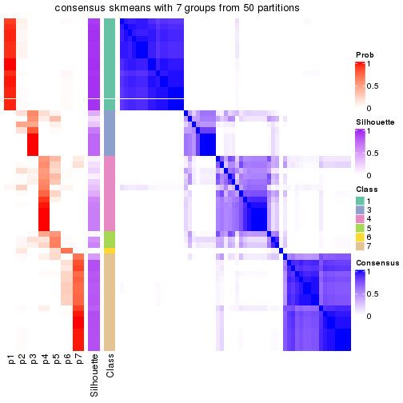</p>

</div>
<div id='tab-node-011-consensus-heatmap-7'>
<pre><code class="r">consensus_heatmap(res, k = 8)
</code></pre>

<p></p>

</div>
</div>

Heatmaps for the membership of samples in all partitions to see how consistent they are:


<script>
$( function() {
	$( '#tabs-node-011-membership-heatmap' ).tabs();
} );
</script>
<div id='tabs-node-011-membership-heatmap'>
<ul>
<li><a href='#tab-node-011-membership-heatmap-1'>k = 2</a></li>
<li><a href='#tab-node-011-membership-heatmap-2'>k = 3</a></li>
<li><a href='#tab-node-011-membership-heatmap-3'>k = 4</a></li>
<li><a href='#tab-node-011-membership-heatmap-4'>k = 5</a></li>
<li><a href='#tab-node-011-membership-heatmap-5'>k = 6</a></li>
<li><a href='#tab-node-011-membership-heatmap-6'>k = 7</a></li>
<li><a href='#tab-node-011-membership-heatmap-7'>k = 8</a></li>
</ul>
<div id='tab-node-011-membership-heatmap-1'>
<pre><code class="r">membership_heatmap(res, k = 2)
</code></pre>

<p></p>

</div>
<div id='tab-node-011-membership-heatmap-2'>
<pre><code class="r">membership_heatmap(res, k = 3)
</code></pre>

<p></p>

</div>
<div id='tab-node-011-membership-heatmap-3'>
<pre><code class="r">membership_heatmap(res, k = 4)
</code></pre>

<p></p>

</div>
<div id='tab-node-011-membership-heatmap-4'>
<pre><code class="r">membership_heatmap(res, k = 5)
</code></pre>

<p></p>

</div>
<div id='tab-node-011-membership-heatmap-5'>
<pre><code class="r">membership_heatmap(res, k = 6)
</code></pre>

<p></p>

</div>
<div id='tab-node-011-membership-heatmap-6'>
<pre><code class="r">membership_heatmap(res, k = 7)
</code></pre>

<p></p>

</div>
<div id='tab-node-011-membership-heatmap-7'>
<pre><code class="r">membership_heatmap(res, k = 8)
</code></pre>

<p></p>

</div>
</div>

As soon as the classes for columns are determined, the signatures
that are significantly different between subgroups can be looked for. 
Following are the heatmaps for signatures.


<script>
$( function() {
	$( '#tabs-node-011-get-signatures' ).tabs();
} );
</script>
<div id='tabs-node-011-get-signatures'>
<ul>
<li><a href='#tab-node-011-get-signatures-1'>k = 2</a></li>
<li><a href='#tab-node-011-get-signatures-2'>k = 3</a></li>
<li><a href='#tab-node-011-get-signatures-3'>k = 4</a></li>
<li><a href='#tab-node-011-get-signatures-4'>k = 5</a></li>
<li><a href='#tab-node-011-get-signatures-5'>k = 6</a></li>
<li><a href='#tab-node-011-get-signatures-6'>k = 7</a></li>
<li><a href='#tab-node-011-get-signatures-7'>k = 8</a></li>
</ul>
<div id='tab-node-011-get-signatures-1'>
<pre><code class="r">get_signatures(res, k = 2)
</code></pre>

<p></p>

</div>
<div id='tab-node-011-get-signatures-2'>
<pre><code class="r">get_signatures(res, k = 3)
</code></pre>

<p></p>

</div>
<div id='tab-node-011-get-signatures-3'>
<pre><code class="r">get_signatures(res, k = 4)
</code></pre>

<p></p>

</div>
<div id='tab-node-011-get-signatures-4'>
<pre><code class="r">get_signatures(res, k = 5)
</code></pre>

<p></p>

</div>
<div id='tab-node-011-get-signatures-5'>
<pre><code class="r">get_signatures(res, k = 6)
</code></pre>

<p></p>

</div>
<div id='tab-node-011-get-signatures-6'>
<pre><code class="r">get_signatures(res, k = 7)
</code></pre>

<p></p>

</div>
<div id='tab-node-011-get-signatures-7'>
<pre><code class="r">get_signatures(res, k = 8)
</code></pre>

<p></p>

</div>
</div>


Compare the overlap of signatures from different k:

```r
compare_signatures(res)
```


`get_signature()` returns a data frame invisibly. To get the list of signatures, the function
call should be assigned to a variable explicitly. In following code, if `plot` argument is set
to `FALSE`, no heatmap is plotted while only the differential analysis is performed.

```r
# code only for demonstration
tb = get_signature(res, k = ..., plot = FALSE)
```

An example of the output of `tb` is:

```
#>   which_row         fdr    mean_1    mean_2 scaled_mean_1 scaled_mean_2 km
#> 1        38 0.042760348  8.373488  9.131774    -0.5533452     0.5164555  1
#> 2        40 0.018707592  7.106213  8.469186    -0.6173731     0.5762149  1
#> 3        55 0.019134737 10.221463 11.207825    -0.6159697     0.5749050  1
#> 4        59 0.006059896  5.921854  7.869574    -0.6899429     0.6439467  1
#> 5        60 0.018055526  8.928898 10.211722    -0.6204761     0.5791110  1
#> 6        98 0.009384629 15.714769 14.887706     0.6635654    -0.6193277  2
...
```

The columns in `tb` are:

1. `which_row`: row indices corresponding to the input matrix.
2. `fdr`: FDR for the differential test. 
3. `mean_x`: The mean value in group x.
4. `scaled_mean_x`: The mean value in group x after rows are scaled.
5. `km`: Row groups if k-means clustering is applied to rows (which is done by automatically selecting number of clusters).

If there are too many signatures, `top_signatures = ...` can be set to only show the 
signatures with the highest FDRs:

```r
# code only for demonstration
# e.g. to show the top 500 most significant rows
tb = get_signature(res, k = ..., top_signatures = 500)
```

If the signatures are defined as these which are uniquely high in current group, `diff_method` argument
can be set to `"uniquely_high_in_one_group"`:

```r
# code only for demonstration
tb = get_signature(res, k = ..., diff_method = "uniquely_high_in_one_group")
```


UMAP plot which shows how samples are separated.


<script>
$( function() {
	$( '#tabs-node-011-dimension-reduction' ).tabs();
} );
</script>
<div id='tabs-node-011-dimension-reduction'>
<ul>
<li><a href='#tab-node-011-dimension-reduction-1'>k = 2</a></li>
<li><a href='#tab-node-011-dimension-reduction-2'>k = 3</a></li>
<li><a href='#tab-node-011-dimension-reduction-3'>k = 4</a></li>
<li><a href='#tab-node-011-dimension-reduction-4'>k = 5</a></li>
<li><a href='#tab-node-011-dimension-reduction-5'>k = 6</a></li>
<li><a href='#tab-node-011-dimension-reduction-6'>k = 7</a></li>
<li><a href='#tab-node-011-dimension-reduction-7'>k = 8</a></li>
</ul>
<div id='tab-node-011-dimension-reduction-1'>
<pre><code class="r">dimension_reduction(res, k = 2, method = &quot;UMAP&quot;)
</code></pre>

<p></p>

</div>
<div id='tab-node-011-dimension-reduction-2'>
<pre><code class="r">dimension_reduction(res, k = 3, method = &quot;UMAP&quot;)
</code></pre>

<p></p>

</div>
<div id='tab-node-011-dimension-reduction-3'>
<pre><code class="r">dimension_reduction(res, k = 4, method = &quot;UMAP&quot;)
</code></pre>

<p></p>

</div>
<div id='tab-node-011-dimension-reduction-4'>
<pre><code class="r">dimension_reduction(res, k = 5, method = &quot;UMAP&quot;)
</code></pre>

<p>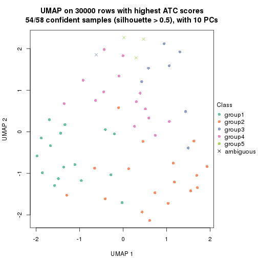</p>

</div>
<div id='tab-node-011-dimension-reduction-5'>
<pre><code class="r">dimension_reduction(res, k = 6, method = &quot;UMAP&quot;)
</code></pre>

<p></p>

</div>
<div id='tab-node-011-dimension-reduction-6'>
<pre><code class="r">dimension_reduction(res, k = 7, method = &quot;UMAP&quot;)
</code></pre>

<p></p>

</div>
<div id='tab-node-011-dimension-reduction-7'>
<pre><code class="r">dimension_reduction(res, k = 8, method = &quot;UMAP&quot;)
</code></pre>

<p></p>

</div>
</div>


Following heatmap shows how subgroups are split when increasing `k`:

```r
collect_classes(res)
```


If matrix rows can be associated to genes, consider to use `functional_enrichment(res,
...)` to perform function enrichment for the signature genes. See [this vignette](https://jokergoo.github.io/cola_vignettes/functional_enrichment.html) for more detailed explanations.


 

---------------------------------------------------


### Node013


Parent node: [Node01](#Node01).
Child nodes: 
                Node0111-leaf
        ,
                Node0112-leaf
        ,
                Node0113-leaf
        ,
                Node0114-leaf
        ,
                Node0131-leaf
        ,
                Node0132-leaf
        ,
                Node0133-leaf
        ,
                Node0141-leaf
        ,
                Node0142-leaf
        ,
                Node0143-leaf
        ,
                Node0211-leaf
        ,
                Node0212-leaf
        ,
                Node0221-leaf
        ,
                Node0222-leaf
        ,
                Node0223-leaf
        ,
                Node0224-leaf
        ,
                Node0231-leaf
        ,
                [Node0232](#Node0232)
        ,
                Node0233-leaf
        ,
                Node0234-leaf
        ,
                [Node0241](#Node0241)
        ,
                Node0242-leaf
        ,
                Node0243-leaf
        ,
                Node0244-leaf
        ,
                Node0251-leaf
        ,
                Node0252-leaf
        ,
                [Node0311](#Node0311)
        ,
                Node0312-leaf
        ,
                Node0313-leaf
        ,
                Node0331-leaf
        ,
                Node0332-leaf
        ,
                Node0333-leaf
        .


The object with results only for a single top-value method and a single partitioning method 
can be extracted as:

```r
res = res_rh["013"]
```

A summary of `res` and all the functions that can be applied to it:

```r
res
```

```
#> A 'ConsensusPartition' object with k = 2, 3, 4, 5, 6, 7, 8.
#>   On a matrix with 30000 rows and 40 columns.
#>   Top rows (1000) are extracted by 'ATC' method.
#>   Subgroups are detected by 'skmeans' method.
#>   Performed in total 350 partitions by row resampling.
#>   Best k for subgroups seems to be 3.
#> 
#> Following methods can be applied to this 'ConsensusPartition' object:
#>  [1] "cola_report"             "collect_classes"         "collect_plots"          
#>  [4] "collect_stats"           "colnames"                "compare_partitions"     
#>  [7] "compare_signatures"      "consensus_heatmap"       "dimension_reduction"    
#> [10] "functional_enrichment"   "get_anno_col"            "get_anno"               
#> [13] "get_classes"             "get_consensus"           "get_matrix"             
#> [16] "get_membership"          "get_param"               "get_signatures"         
#> [19] "get_stats"               "is_best_k"               "is_stable_k"            
#> [22] "membership_heatmap"      "ncol"                    "nrow"                   
#> [25] "plot_ecdf"               "predict_classes"         "rownames"               
#> [28] "select_partition_number" "show"                    "suggest_best_k"         
#> [31] "test_to_known_factors"   "top_rows_heatmap"
```

`collect_plots()` function collects all the plots made from `res` for all `k` (number of subgroups)
into one single page to provide an easy and fast comparison between different `k`.

```r
collect_plots(res)
```


The plots are:

- The first row: a plot of the eCDF (empirical cumulative distribution
  function) curves of the consensus matrix for each `k` and the heatmap of
  predicted classes for each `k`.
- The second row: heatmaps of the consensus matrix for each `k`.
- The third row: heatmaps of the membership matrix for each `k`.
- The fouth row: heatmaps of the signatures for each `k`.

All the plots in panels can be made by individual functions and they are
plotted later in this section.

`select_partition_number()` produces several plots showing different
statistics for choosing "optimized" `k`. There are following statistics:

- eCDF curves of the consensus matrix for each `k`;
- 1-PAC. [The PAC score](https://en.wikipedia.org/wiki/Consensus_clustering#Over-interpretation_potential_of_consensus_clustering)
  measures the proportion of the ambiguous subgrouping.
- Mean silhouette score.
- Concordance. The mean probability of fiting the consensus subgroup labels in all
  partitions.
- Area increased. Denote $A_k$ as the area under the eCDF curve for current
  `k`, the area increased is defined as $A_k - A_{k-1}$.
- Rand index. The percent of pairs of samples that are both in a same cluster
  or both are not in a same cluster in the partition of k and k-1.
- Jaccard index. The ratio of pairs of samples are both in a same cluster in
  the partition of k and k-1 and the pairs of samples are both in a same
  cluster in the partition k or k-1.

The detailed explanations of these statistics can be found in [the _cola_
vignette](https://jokergoo.github.io/cola_vignettes/cola.html#toc_13).

Generally speaking, higher 1-PAC score, higher mean silhouette score or higher
concordance corresponds to better partition. Rand index and Jaccard index
measure how similar the current partition is compared to partition with `k-1`.
If they are too similar, we won't accept `k` is better than `k-1`.

```r
select_partition_number(res)
```


The numeric values for all these statistics can be obtained by `get_stats()`.

```r
get_stats(res)
```

```
#>   k 1-PAC mean_silhouette concordance area_increased  Rand Jaccard
#> 2 2 1.000           0.985       0.993         0.2632 0.738   0.738
#> 3 3 0.991           0.974       0.985         1.1866 0.565   0.454
#> 4 4 0.521           0.751       0.834         0.1390 0.942   0.862
#> 5 5 0.519           0.569       0.732         0.1141 0.845   0.593
#> 6 6 0.475           0.462       0.720         0.0278 0.991   0.963
#> 7 7 0.509           0.351       0.645         0.0388 0.865   0.545
#> 8 8 0.508           0.391       0.665         0.0350 0.919   0.691
```

`suggest_best_k()` suggests the best $k$ based on these statistics. The rules are as follows:

- All $k$ with Jaccard index larger than 0.95 are removed because increasing
  $k$ does not provide enough extra information. If all $k$ are removed, it is
  marked as no subgroup is detected.
- For all $k$ with 1-PAC score larger than 0.9, the maximal $k$ is taken as
  the best $k$, and other $k$ are marked as optional $k$.
- If it does not fit the second rule. The $k$ with the maximal vote of the
  highest 1-PAC score, highest mean silhouette, and highest concordance is
  taken as the best $k$.

```r
suggest_best_k(res)
```

```
#> [1] 3
#> attr(,"optional")
#> [1] 2
```

There is also optional best $k$ = 2 that is worth to check.

Following is the table of the partitions (You need to click the **show/hide
code output** link to see it). The membership matrix (columns with name `p*`)
is inferred by
[`clue::cl_consensus()`](https://www.rdocumentation.org/link/cl_consensus?package=clue)
function with the `SE` method. Basically the value in the membership matrix
represents the probability to belong to a certain group. The finall subgroup
label for an item is determined with the group with highest probability it
belongs to.

In `get_classes()` function, the entropy is calculated from the membership
matrix and the silhouette score is calculated from the consensus matrix.


<script>
$( function() {
	$( '#tabs-node-013-get-classes' ).tabs();
} );
</script>
<div id='tabs-node-013-get-classes'>
<ul>
<li><a href='#tab-node-013-get-classes-1'>k = 2</a></li>
<li><a href='#tab-node-013-get-classes-2'>k = 3</a></li>
<li><a href='#tab-node-013-get-classes-3'>k = 4</a></li>
<li><a href='#tab-node-013-get-classes-4'>k = 5</a></li>
<li><a href='#tab-node-013-get-classes-5'>k = 6</a></li>
<li><a href='#tab-node-013-get-classes-6'>k = 7</a></li>
<li><a href='#tab-node-013-get-classes-7'>k = 8</a></li>
</ul>

<div id='tab-node-013-get-classes-1'>
<p><a id='tab-node-013-get-classes-1-a' style='color:#0366d6' href='#'>show/hide code output</a></p>
<pre><code class="r">cbind(get_classes(res, k = 2), get_membership(res, k = 2))
</code></pre>

<pre><code>#&gt;                 class entropy silhouette   p1   p2
#&gt; TCGA.DJ.A3VD.01     1   0.000      0.995 1.00 0.00
#&gt; TCGA.IM.A420.01     2   0.529      0.862 0.12 0.88
#&gt; TCGA.DJ.A4UT.01     1   0.000      0.995 1.00 0.00
#&gt; TCGA.E8.A419.01     1   0.000      0.995 1.00 0.00
#&gt; TCGA.EL.A3ZS.01     1   0.000      0.995 1.00 0.00
#&gt; TCGA.KS.A4ID.01     1   0.000      0.995 1.00 0.00
#&gt; TCGA.DJ.A3VF.01     1   0.000      0.995 1.00 0.00
#&gt; TCGA.DE.A4M8.01     1   0.000      0.995 1.00 0.00
#&gt; TCGA.EL.A4JX.01     1   0.000      0.995 1.00 0.00
#&gt; TCGA.E8.A44M.01     1   0.000      0.995 1.00 0.00
#&gt; TCGA.DJ.A2Q3.01     1   0.000      0.995 1.00 0.00
#&gt; TCGA.BJ.A45I.01     1   0.469      0.889 0.90 0.10
#&gt; TCGA.EL.A3N3.01     1   0.000      0.995 1.00 0.00
#&gt; TCGA.J8.A4HW.06     1   0.000      0.995 1.00 0.00
#&gt; TCGA.ET.A4KN.01     1   0.000      0.995 1.00 0.00
#&gt; TCGA.FE.A23A.01     1   0.000      0.995 1.00 0.00
#&gt; TCGA.GE.A2C6.01     1   0.000      0.995 1.00 0.00
#&gt; TCGA.DJ.A2PT.01     1   0.000      0.995 1.00 0.00
#&gt; TCGA.E8.A242.01     1   0.327      0.935 0.94 0.06
#&gt; TCGA.H2.A26U.01     1   0.000      0.995 1.00 0.00
#&gt; TCGA.BJ.A28Z.01     1   0.000      0.995 1.00 0.00
#&gt; TCGA.BJ.A0Z3.01     1   0.000      0.995 1.00 0.00
#&gt; TCGA.BJ.A28X.01     1   0.000      0.995 1.00 0.00
#&gt; TCGA.EL.A3CT.01     2   0.000      0.976 0.00 1.00
#&gt; TCGA.E8.A2JQ.01     1   0.000      0.995 1.00 0.00
#&gt; TCGA.DJ.A3UW.01     1   0.000      0.995 1.00 0.00
#&gt; TCGA.IM.A3EB.01     2   0.000      0.976 0.00 1.00
#&gt; TCGA.DJ.A3V2.01     1   0.000      0.995 1.00 0.00
#&gt; TCGA.EM.A3SU.06     1   0.000      0.995 1.00 0.00
#&gt; TCGA.E8.A2EA.01     1   0.000      0.995 1.00 0.00
#&gt; TCGA.ET.A3DU.01     1   0.000      0.995 1.00 0.00
#&gt; TCGA.DJ.A2Q1.01     1   0.000      0.995 1.00 0.00
#&gt; TCGA.EL.A3CU.01     1   0.000      0.995 1.00 0.00
#&gt; TCGA.ET.A3DO.01     1   0.000      0.995 1.00 0.00
#&gt; TCGA.ET.A3BV.01     1   0.000      0.995 1.00 0.00
#&gt; TCGA.BJ.A0Z9.01     2   0.000      0.976 0.00 1.00
#&gt; TCGA.FY.A3R6.01     1   0.000      0.995 1.00 0.00
#&gt; TCGA.ET.A3DT.01     1   0.000      0.995 1.00 0.00
#&gt; TCGA.EL.A3T6.01     2   0.000      0.976 0.00 1.00
#&gt; TCGA.EM.A3O3.01     2   0.000      0.976 0.00 1.00
</code></pre>

<script>
$('#tab-node-013-get-classes-1-a').parent().next().next().hide();
$('#tab-node-013-get-classes-1-a').click(function(){
  $('#tab-node-013-get-classes-1-a').parent().next().next().toggle();
  return(false);
});
</script>
</div>

<div id='tab-node-013-get-classes-2'>
<p><a id='tab-node-013-get-classes-2-a' style='color:#0366d6' href='#'>show/hide code output</a></p>
<pre><code class="r">cbind(get_classes(res, k = 3), get_membership(res, k = 3))
</code></pre>

<pre><code>#&gt;                 class entropy silhouette   p1 p2   p3
#&gt; TCGA.DJ.A3VD.01     1   0.000      1.000 1.00  0 0.00
#&gt; TCGA.IM.A420.01     3   0.000      0.953 0.00  0 1.00
#&gt; TCGA.DJ.A4UT.01     1   0.000      1.000 1.00  0 0.00
#&gt; TCGA.E8.A419.01     3   0.207      0.943 0.06  0 0.94
#&gt; TCGA.EL.A3ZS.01     1   0.000      1.000 1.00  0 0.00
#&gt; TCGA.KS.A4ID.01     3   0.153      0.955 0.04  0 0.96
#&gt; TCGA.DJ.A3VF.01     3   0.153      0.955 0.04  0 0.96
#&gt; TCGA.DE.A4M8.01     1   0.000      1.000 1.00  0 0.00
#&gt; TCGA.EL.A4JX.01     1   0.000      1.000 1.00  0 0.00
#&gt; TCGA.E8.A44M.01     1   0.000      1.000 1.00  0 0.00
#&gt; TCGA.DJ.A2Q3.01     3   0.000      0.953 0.00  0 1.00
#&gt; TCGA.BJ.A45I.01     3   0.000      0.953 0.00  0 1.00
#&gt; TCGA.EL.A3N3.01     3   0.000      0.953 0.00  0 1.00
#&gt; TCGA.J8.A4HW.06     1   0.000      1.000 1.00  0 0.00
#&gt; TCGA.ET.A4KN.01     3   0.254      0.924 0.08  0 0.92
#&gt; TCGA.FE.A23A.01     3   0.153      0.955 0.04  0 0.96
#&gt; TCGA.GE.A2C6.01     3   0.207      0.942 0.06  0 0.94
#&gt; TCGA.DJ.A2PT.01     3   0.153      0.955 0.04  0 0.96
#&gt; TCGA.E8.A242.01     3   0.000      0.953 0.00  0 1.00
#&gt; TCGA.H2.A26U.01     3   0.000      0.953 0.00  0 1.00
#&gt; TCGA.BJ.A28Z.01     1   0.000      1.000 1.00  0 0.00
#&gt; TCGA.BJ.A0Z3.01     1   0.000      1.000 1.00  0 0.00
#&gt; TCGA.BJ.A28X.01     1   0.000      1.000 1.00  0 0.00
#&gt; TCGA.EL.A3CT.01     2   0.000      1.000 0.00  1 0.00
#&gt; TCGA.E8.A2JQ.01     1   0.000      1.000 1.00  0 0.00
#&gt; TCGA.DJ.A3UW.01     1   0.000      1.000 1.00  0 0.00
#&gt; TCGA.IM.A3EB.01     3   0.000      0.953 0.00  0 1.00
#&gt; TCGA.DJ.A3V2.01     1   0.000      1.000 1.00  0 0.00
#&gt; TCGA.EM.A3SU.06     1   0.000      1.000 1.00  0 0.00
#&gt; TCGA.E8.A2EA.01     3   0.153      0.955 0.04  0 0.96
#&gt; TCGA.ET.A3DU.01     3   0.400      0.821 0.16  0 0.84
#&gt; TCGA.DJ.A2Q1.01     1   0.000      1.000 1.00  0 0.00
#&gt; TCGA.EL.A3CU.01     3   0.207      0.924 0.06  0 0.94
#&gt; TCGA.ET.A3DO.01     1   0.000      1.000 1.00  0 0.00
#&gt; TCGA.ET.A3BV.01     1   0.000      1.000 1.00  0 0.00
#&gt; TCGA.BJ.A0Z9.01     2   0.000      1.000 0.00  1 0.00
#&gt; TCGA.FY.A3R6.01     1   0.000      1.000 1.00  0 0.00
#&gt; TCGA.ET.A3DT.01     1   0.000      1.000 1.00  0 0.00
#&gt; TCGA.EL.A3T6.01     3   0.000      0.953 0.00  0 1.00
#&gt; TCGA.EM.A3O3.01     2   0.000      1.000 0.00  1 0.00
</code></pre>

<script>
$('#tab-node-013-get-classes-2-a').parent().next().next().hide();
$('#tab-node-013-get-classes-2-a').click(function(){
  $('#tab-node-013-get-classes-2-a').parent().next().next().toggle();
  return(false);
});
</script>
</div>

<div id='tab-node-013-get-classes-3'>
<p><a id='tab-node-013-get-classes-3-a' style='color:#0366d6' href='#'>show/hide code output</a></p>
<pre><code class="r">cbind(get_classes(res, k = 4), get_membership(res, k = 4))
</code></pre>

<pre><code>#&gt;                 class entropy silhouette   p1 p2   p3   p4
#&gt; TCGA.DJ.A3VD.01     1  0.5428      0.777 0.74  0 0.14 0.12
#&gt; TCGA.IM.A420.01     4  0.4855      0.813 0.00  0 0.40 0.60
#&gt; TCGA.DJ.A4UT.01     1  0.3198      0.738 0.88  0 0.04 0.08
#&gt; TCGA.E8.A419.01     3  0.3525      0.708 0.04  0 0.86 0.10
#&gt; TCGA.EL.A3ZS.01     1  0.2011      0.734 0.92  0 0.00 0.08
#&gt; TCGA.KS.A4ID.01     3  0.2335      0.747 0.02  0 0.92 0.06
#&gt; TCGA.DJ.A3VF.01     3  0.3525      0.717 0.04  0 0.86 0.10
#&gt; TCGA.DE.A4M8.01     1  0.5902      0.762 0.70  0 0.14 0.16
#&gt; TCGA.EL.A4JX.01     1  0.6921      0.652 0.58  0 0.26 0.16
#&gt; TCGA.E8.A44M.01     1  0.5151      0.780 0.76  0 0.14 0.10
#&gt; TCGA.DJ.A2Q3.01     3  0.2011      0.740 0.00  0 0.92 0.08
#&gt; TCGA.BJ.A45I.01     3  0.3610      0.520 0.00  0 0.80 0.20
#&gt; TCGA.EL.A3N3.01     3  0.2921      0.649 0.00  0 0.86 0.14
#&gt; TCGA.J8.A4HW.06     1  0.0707      0.753 0.98  0 0.00 0.02
#&gt; TCGA.ET.A4KN.01     3  0.4731      0.640 0.06  0 0.78 0.16
#&gt; TCGA.FE.A23A.01     3  0.2335      0.773 0.02  0 0.92 0.06
#&gt; TCGA.GE.A2C6.01     3  0.1211      0.776 0.00  0 0.96 0.04
#&gt; TCGA.DJ.A2PT.01     3  0.1211      0.776 0.00  0 0.96 0.04
#&gt; TCGA.E8.A242.01     3  0.2345      0.714 0.00  0 0.90 0.10
#&gt; TCGA.H2.A26U.01     3  0.2011      0.740 0.00  0 0.92 0.08
#&gt; TCGA.BJ.A28Z.01     1  0.7121      0.587 0.54  0 0.30 0.16
#&gt; TCGA.BJ.A0Z3.01     1  0.1637      0.739 0.94  0 0.00 0.06
#&gt; TCGA.BJ.A28X.01     1  0.5784      0.757 0.70  0 0.20 0.10
#&gt; TCGA.EL.A3CT.01     2  0.0000      1.000 0.00  1 0.00 0.00
#&gt; TCGA.E8.A2JQ.01     1  0.7016      0.577 0.54  0 0.32 0.14
#&gt; TCGA.DJ.A3UW.01     1  0.5428      0.777 0.74  0 0.14 0.12
#&gt; TCGA.IM.A3EB.01     4  0.4406      0.919 0.00  0 0.30 0.70
#&gt; TCGA.DJ.A3V2.01     1  0.2345      0.724 0.90  0 0.00 0.10
#&gt; TCGA.EM.A3SU.06     1  0.0000      0.759 1.00  0 0.00 0.00
#&gt; TCGA.E8.A2EA.01     3  0.1637      0.767 0.00  0 0.94 0.06
#&gt; TCGA.ET.A3DU.01     3  0.4731      0.642 0.06  0 0.78 0.16
#&gt; TCGA.DJ.A2Q1.01     1  0.1637      0.739 0.94  0 0.00 0.06
#&gt; TCGA.EL.A3CU.01     3  0.4939      0.604 0.04  0 0.74 0.22
#&gt; TCGA.ET.A3DO.01     1  0.5594      0.778 0.72  0 0.18 0.10
#&gt; TCGA.ET.A3BV.01     1  0.2345      0.724 0.90  0 0.00 0.10
#&gt; TCGA.BJ.A0Z9.01     2  0.0000      1.000 0.00  1 0.00 0.00
#&gt; TCGA.FY.A3R6.01     1  0.5956      0.740 0.68  0 0.22 0.10
#&gt; TCGA.ET.A3DT.01     1  0.1913      0.772 0.94  0 0.04 0.02
#&gt; TCGA.EL.A3T6.01     4  0.4406      0.919 0.00  0 0.30 0.70
#&gt; TCGA.EM.A3O3.01     2  0.0000      1.000 0.00  1 0.00 0.00
</code></pre>

<script>
$('#tab-node-013-get-classes-3-a').parent().next().next().hide();
$('#tab-node-013-get-classes-3-a').click(function(){
  $('#tab-node-013-get-classes-3-a').parent().next().next().toggle();
  return(false);
});
</script>
</div>

<div id='tab-node-013-get-classes-4'>
<p><a id='tab-node-013-get-classes-4-a' style='color:#0366d6' href='#'>show/hide code output</a></p>
<pre><code class="r">cbind(get_classes(res, k = 5), get_membership(res, k = 5))
</code></pre>

<pre><code>#&gt;                 class entropy silhouette   p1 p2   p3   p4   p5
#&gt; TCGA.DJ.A3VD.01     1   0.426     0.2786 0.56  0 0.00 0.00 0.44
#&gt; TCGA.IM.A420.01     4   0.413     0.6998 0.00  0 0.26 0.72 0.02
#&gt; TCGA.DJ.A4UT.01     1   0.526     0.4323 0.66  0 0.10 0.00 0.24
#&gt; TCGA.E8.A419.01     3   0.454     0.5968 0.02  0 0.64 0.00 0.34
#&gt; TCGA.EL.A3ZS.01     1   0.352     0.5968 0.82  0 0.04 0.00 0.14
#&gt; TCGA.KS.A4ID.01     3   0.400     0.6929 0.00  0 0.74 0.02 0.24
#&gt; TCGA.DJ.A3VF.01     3   0.335     0.7777 0.02  0 0.86 0.04 0.08
#&gt; TCGA.DE.A4M8.01     5   0.430    -0.0911 0.48  0 0.00 0.00 0.52
#&gt; TCGA.EL.A4JX.01     5   0.356     0.4496 0.26  0 0.00 0.00 0.74
#&gt; TCGA.E8.A44M.01     1   0.468     0.3845 0.60  0 0.02 0.00 0.38
#&gt; TCGA.DJ.A2Q3.01     3   0.165     0.7814 0.00  0 0.94 0.04 0.02
#&gt; TCGA.BJ.A45I.01     3   0.440     0.5672 0.00  0 0.72 0.24 0.04
#&gt; TCGA.EL.A3N3.01     3   0.417     0.7177 0.00  0 0.78 0.14 0.08
#&gt; TCGA.J8.A4HW.06     1   0.173     0.6289 0.92  0 0.00 0.00 0.08
#&gt; TCGA.ET.A4KN.01     5   0.425     0.2219 0.02  0 0.28 0.00 0.70
#&gt; TCGA.FE.A23A.01     3   0.346     0.7815 0.02  0 0.84 0.02 0.12
#&gt; TCGA.GE.A2C6.01     3   0.506     0.7277 0.04  0 0.74 0.06 0.16
#&gt; TCGA.DJ.A2PT.01     3   0.311     0.7881 0.00  0 0.84 0.02 0.14
#&gt; TCGA.E8.A242.01     3   0.339     0.7281 0.00  0 0.84 0.10 0.06
#&gt; TCGA.H2.A26U.01     3   0.201     0.7780 0.00  0 0.92 0.02 0.06
#&gt; TCGA.BJ.A28Z.01     5   0.385     0.4883 0.22  0 0.02 0.00 0.76
#&gt; TCGA.BJ.A0Z3.01     1   0.000     0.6090 1.00  0 0.00 0.00 0.00
#&gt; TCGA.BJ.A28X.01     1   0.482     0.2028 0.52  0 0.02 0.00 0.46
#&gt; TCGA.EL.A3CT.01     2   0.000     1.0000 0.00  1 0.00 0.00 0.00
#&gt; TCGA.E8.A2JQ.01     5   0.505     0.1402 0.38  0 0.04 0.00 0.58
#&gt; TCGA.DJ.A3UW.01     1   0.426     0.2859 0.56  0 0.00 0.00 0.44
#&gt; TCGA.IM.A3EB.01     4   0.141     0.8418 0.00  0 0.06 0.94 0.00
#&gt; TCGA.DJ.A3V2.01     1   0.122     0.5959 0.96  0 0.00 0.02 0.02
#&gt; TCGA.EM.A3SU.06     1   0.273     0.6156 0.84  0 0.00 0.00 0.16
#&gt; TCGA.E8.A2EA.01     3   0.369     0.7491 0.02  0 0.82 0.02 0.14
#&gt; TCGA.ET.A3DU.01     5   0.422     0.5173 0.10  0 0.12 0.00 0.78
#&gt; TCGA.DJ.A2Q1.01     1   0.104     0.6059 0.96  0 0.00 0.00 0.04
#&gt; TCGA.EL.A3CU.01     5   0.490     0.4316 0.04  0 0.18 0.04 0.74
#&gt; TCGA.ET.A3DO.01     1   0.509     0.3226 0.56  0 0.04 0.00 0.40
#&gt; TCGA.ET.A3BV.01     1   0.104     0.6059 0.96  0 0.00 0.00 0.04
#&gt; TCGA.BJ.A0Z9.01     2   0.000     1.0000 0.00  1 0.00 0.00 0.00
#&gt; TCGA.FY.A3R6.01     5   0.589    -0.1479 0.44  0 0.10 0.00 0.46
#&gt; TCGA.ET.A3DT.01     1   0.380     0.5242 0.70  0 0.00 0.00 0.30
#&gt; TCGA.EL.A3T6.01     4   0.173     0.8520 0.00  0 0.08 0.92 0.00
#&gt; TCGA.EM.A3O3.01     2   0.000     1.0000 0.00  1 0.00 0.00 0.00
</code></pre>

<script>
$('#tab-node-013-get-classes-4-a').parent().next().next().hide();
$('#tab-node-013-get-classes-4-a').click(function(){
  $('#tab-node-013-get-classes-4-a').parent().next().next().toggle();
  return(false);
});
</script>
</div>

<div id='tab-node-013-get-classes-5'>
<p><a id='tab-node-013-get-classes-5-a' style='color:#0366d6' href='#'>show/hide code output</a></p>
<pre><code class="r">cbind(get_classes(res, k = 6), get_membership(res, k = 6))
</code></pre>

<pre><code>#&gt;                 class entropy silhouette   p1   p2   p3   p4   p5   p6
#&gt; TCGA.DJ.A3VD.01     1  0.4328     0.0941 0.52 0.00 0.02 0.00 0.46 0.00
#&gt; TCGA.IM.A420.01     4  0.5797     0.3684 0.00 0.00 0.36 0.52 0.04 0.08
#&gt; TCGA.DJ.A4UT.01     1  0.6211     0.3267 0.64 0.00 0.14 0.04 0.12 0.06
#&gt; TCGA.E8.A419.01     3  0.4812     0.5299 0.04 0.00 0.68 0.00 0.24 0.04
#&gt; TCGA.EL.A3ZS.01     1  0.2882     0.5526 0.86 0.00 0.00 0.02 0.10 0.02
#&gt; TCGA.KS.A4ID.01     3  0.7361     0.2922 0.08 0.00 0.48 0.04 0.24 0.16
#&gt; TCGA.DJ.A3VF.01     3  0.5305     0.6636 0.04 0.00 0.72 0.04 0.08 0.12
#&gt; TCGA.DE.A4M8.01     5  0.4337    -0.1600 0.48 0.00 0.00 0.00 0.50 0.02
#&gt; TCGA.EL.A4JX.01     5  0.3916     0.4042 0.30 0.00 0.02 0.00 0.68 0.00
#&gt; TCGA.E8.A44M.01     1  0.5402     0.2570 0.58 0.00 0.04 0.02 0.34 0.02
#&gt; TCGA.DJ.A2Q3.01     3  0.3942     0.6793 0.00 0.00 0.80 0.04 0.06 0.10
#&gt; TCGA.BJ.A45I.01     3  0.4703     0.4592 0.00 0.00 0.72 0.18 0.04 0.06
#&gt; TCGA.EL.A3N3.01     3  0.3258     0.6079 0.00 0.00 0.84 0.10 0.02 0.04
#&gt; TCGA.J8.A4HW.06     1  0.1267     0.5576 0.94 0.00 0.00 0.00 0.06 0.00
#&gt; TCGA.ET.A4KN.01     5  0.5316    -0.0160 0.04 0.00 0.24 0.04 0.66 0.02
#&gt; TCGA.FE.A23A.01     3  0.5477     0.6150 0.02 0.00 0.70 0.06 0.12 0.10
#&gt; TCGA.GE.A2C6.01     3  0.4221     0.6494 0.06 0.00 0.80 0.02 0.08 0.04
#&gt; TCGA.DJ.A2PT.01     3  0.3942     0.6716 0.06 0.00 0.80 0.00 0.10 0.04
#&gt; TCGA.E8.A242.01     3  0.3324     0.6232 0.00 0.00 0.84 0.08 0.06 0.02
#&gt; TCGA.H2.A26U.01     3  0.2725     0.6492 0.00 0.00 0.88 0.04 0.06 0.02
#&gt; TCGA.BJ.A28Z.01     5  0.4475     0.5134 0.20 0.00 0.10 0.00 0.70 0.00
#&gt; TCGA.BJ.A0Z3.01     1  0.0547     0.5498 0.98 0.00 0.00 0.00 0.00 0.02
#&gt; TCGA.BJ.A28X.01     1  0.5424     0.2135 0.56 0.00 0.08 0.02 0.34 0.00
#&gt; TCGA.EL.A3CT.01     2  0.0547     0.9730 0.00 0.98 0.00 0.00 0.00 0.02
#&gt; TCGA.E8.A2JQ.01     5  0.6267     0.4733 0.22 0.00 0.18 0.02 0.56 0.02
#&gt; TCGA.DJ.A3UW.01     1  0.3797     0.1616 0.58 0.00 0.00 0.00 0.42 0.00
#&gt; TCGA.IM.A3EB.01     4  0.2350     0.7021 0.00 0.00 0.10 0.88 0.00 0.02
#&gt; TCGA.DJ.A3V2.01     1  0.3970     0.5050 0.80 0.00 0.00 0.04 0.08 0.08
#&gt; TCGA.EM.A3SU.06     1  0.3315     0.5112 0.78 0.00 0.02 0.00 0.20 0.00
#&gt; TCGA.E8.A2EA.01     3  0.5916     0.6272 0.02 0.00 0.66 0.08 0.14 0.10
#&gt; TCGA.ET.A3DU.01     5  0.4962     0.1808 0.06 0.00 0.28 0.00 0.64 0.02
#&gt; TCGA.DJ.A2Q1.01     1  0.2956     0.4851 0.84 0.00 0.00 0.00 0.04 0.12
#&gt; TCGA.EL.A3CU.01     6  0.5837     0.0000 0.00 0.00 0.20 0.00 0.34 0.46
#&gt; TCGA.ET.A3DO.01     1  0.6084     0.1708 0.50 0.00 0.06 0.02 0.38 0.04
#&gt; TCGA.ET.A3BV.01     1  0.3523     0.4697 0.78 0.00 0.00 0.00 0.04 0.18
#&gt; TCGA.BJ.A0Z9.01     2  0.1092     0.9652 0.00 0.96 0.00 0.00 0.02 0.02
#&gt; TCGA.FY.A3R6.01     5  0.6654     0.0811 0.40 0.00 0.12 0.02 0.42 0.04
#&gt; TCGA.ET.A3DT.01     1  0.4002     0.3924 0.66 0.00 0.02 0.00 0.32 0.00
#&gt; TCGA.EL.A3T6.01     4  0.2474     0.6903 0.00 0.00 0.08 0.88 0.00 0.04
#&gt; TCGA.EM.A3O3.01     2  0.0000     0.9771 0.00 1.00 0.00 0.00 0.00 0.00
</code></pre>

<script>
$('#tab-node-013-get-classes-5-a').parent().next().next().hide();
$('#tab-node-013-get-classes-5-a').click(function(){
  $('#tab-node-013-get-classes-5-a').parent().next().next().toggle();
  return(false);
});
</script>
</div>

<div id='tab-node-013-get-classes-6'>
<p><a id='tab-node-013-get-classes-6-a' style='color:#0366d6' href='#'>show/hide code output</a></p>
<pre><code class="r">cbind(get_classes(res, k = 7), get_membership(res, k = 7))
</code></pre>

<pre><code>#&gt;                 class entropy silhouette   p1   p2   p3   p4   p5   p6   p7
#&gt; TCGA.DJ.A3VD.01     5   0.439     0.1477 0.42 0.00 0.02 0.00 0.54 0.02 0.00
#&gt; TCGA.IM.A420.01     7   0.534     0.0000 0.00 0.00 0.24 0.26 0.00 0.00 0.50
#&gt; TCGA.DJ.A4UT.01     1   0.696     0.0542 0.40 0.00 0.16 0.00 0.32 0.04 0.08
#&gt; TCGA.E8.A419.01     5   0.605    -0.3159 0.02 0.00 0.40 0.00 0.44 0.06 0.08
#&gt; TCGA.EL.A3ZS.01     1   0.524     0.2683 0.56 0.00 0.00 0.00 0.32 0.04 0.08
#&gt; TCGA.KS.A4ID.01     3   0.573     0.2681 0.00 0.00 0.44 0.00 0.36 0.02 0.18
#&gt; TCGA.DJ.A3VF.01     3   0.414     0.5017 0.02 0.00 0.78 0.00 0.04 0.08 0.08
#&gt; TCGA.DE.A4M8.01     5   0.480     0.1757 0.40 0.00 0.02 0.00 0.54 0.02 0.02
#&gt; TCGA.EL.A4JX.01     5   0.431     0.4163 0.16 0.00 0.00 0.00 0.72 0.10 0.02
#&gt; TCGA.E8.A44M.01     5   0.453     0.3303 0.30 0.00 0.02 0.00 0.64 0.02 0.02
#&gt; TCGA.DJ.A2Q3.01     3   0.404     0.5167 0.00 0.00 0.76 0.02 0.04 0.02 0.16
#&gt; TCGA.BJ.A45I.01     3   0.558     0.0444 0.00 0.00 0.60 0.04 0.02 0.10 0.24
#&gt; TCGA.EL.A3N3.01     3   0.339     0.3305 0.00 0.00 0.76 0.04 0.00 0.00 0.20
#&gt; TCGA.J8.A4HW.06     1   0.257     0.5778 0.84 0.00 0.00 0.00 0.14 0.00 0.02
#&gt; TCGA.ET.A4KN.01     5   0.568    -0.0724 0.00 0.00 0.16 0.00 0.54 0.26 0.04
#&gt; TCGA.FE.A23A.01     3   0.602     0.4203 0.00 0.00 0.54 0.00 0.14 0.10 0.22
#&gt; TCGA.GE.A2C6.01     3   0.582     0.3412 0.04 0.00 0.58 0.00 0.26 0.06 0.06
#&gt; TCGA.DJ.A2PT.01     3   0.385     0.5257 0.00 0.00 0.76 0.00 0.16 0.02 0.06
#&gt; TCGA.E8.A242.01     3   0.344     0.4260 0.00 0.00 0.82 0.00 0.06 0.06 0.06
#&gt; TCGA.H2.A26U.01     3   0.238     0.5104 0.00 0.00 0.86 0.00 0.12 0.00 0.02
#&gt; TCGA.BJ.A28Z.01     5   0.424     0.4351 0.10 0.00 0.02 0.00 0.76 0.10 0.02
#&gt; TCGA.BJ.A0Z3.01     1   0.193     0.6002 0.90 0.00 0.00 0.00 0.08 0.02 0.00
#&gt; TCGA.BJ.A28X.01     5   0.541     0.2643 0.30 0.00 0.06 0.00 0.58 0.04 0.02
#&gt; TCGA.EL.A3CT.01     2   0.000     0.9752 0.00 1.00 0.00 0.00 0.00 0.00 0.00
#&gt; TCGA.E8.A2JQ.01     5   0.582     0.3740 0.12 0.00 0.12 0.00 0.64 0.06 0.06
#&gt; TCGA.DJ.A3UW.01     5   0.523     0.2548 0.34 0.00 0.02 0.00 0.56 0.06 0.02
#&gt; TCGA.IM.A3EB.01     4   0.291     0.3944 0.00 0.00 0.04 0.82 0.00 0.00 0.14
#&gt; TCGA.DJ.A3V2.01     1   0.402     0.5448 0.78 0.00 0.02 0.00 0.10 0.02 0.08
#&gt; TCGA.EM.A3SU.06     1   0.322     0.3533 0.68 0.00 0.00 0.00 0.32 0.00 0.00
#&gt; TCGA.E8.A2EA.01     3   0.550     0.3575 0.00 0.00 0.54 0.00 0.18 0.02 0.26
#&gt; TCGA.ET.A3DU.01     5   0.481     0.0623 0.00 0.00 0.14 0.00 0.66 0.18 0.02
#&gt; TCGA.DJ.A2Q1.01     1   0.101     0.5709 0.96 0.00 0.00 0.00 0.00 0.02 0.02
#&gt; TCGA.EL.A3CU.01     6   0.369     0.0000 0.00 0.00 0.12 0.00 0.12 0.76 0.00
#&gt; TCGA.ET.A3DO.01     5   0.553     0.1573 0.34 0.00 0.02 0.00 0.54 0.04 0.06
#&gt; TCGA.ET.A3BV.01     1   0.306     0.5590 0.84 0.00 0.00 0.00 0.06 0.02 0.08
#&gt; TCGA.BJ.A0Z9.01     2   0.136     0.9497 0.00 0.94 0.00 0.00 0.00 0.02 0.04
#&gt; TCGA.FY.A3R6.01     5   0.667     0.2619 0.28 0.00 0.10 0.00 0.48 0.04 0.10
#&gt; TCGA.ET.A3DT.01     1   0.441     0.0294 0.52 0.00 0.02 0.00 0.44 0.00 0.02
#&gt; TCGA.EL.A3T6.01     4   0.418     0.4593 0.00 0.00 0.04 0.74 0.00 0.06 0.16
#&gt; TCGA.EM.A3O3.01     2   0.000     0.9752 0.00 1.00 0.00 0.00 0.00 0.00 0.00
</code></pre>

<script>
$('#tab-node-013-get-classes-6-a').parent().next().next().hide();
$('#tab-node-013-get-classes-6-a').click(function(){
  $('#tab-node-013-get-classes-6-a').parent().next().next().toggle();
  return(false);
});
</script>
</div>

<div id='tab-node-013-get-classes-7'>
<p><a id='tab-node-013-get-classes-7-a' style='color:#0366d6' href='#'>show/hide code output</a></p>
<pre><code class="r">cbind(get_classes(res, k = 8), get_membership(res, k = 8))
</code></pre>

<pre><code>#&gt;                 class entropy silhouette   p1   p2   p3   p4   p5   p6   p7   p8
#&gt; TCGA.DJ.A3VD.01     1  0.3737    0.09076 0.50 0.00 0.02 0.00 0.48 0.00 0.00 0.00
#&gt; TCGA.IM.A420.01     7  0.6733    0.28713 0.00 0.00 0.18 0.10 0.00 0.04 0.36 0.32
#&gt; TCGA.DJ.A4UT.01     1  0.6298    0.27701 0.52 0.00 0.04 0.16 0.16 0.00 0.00 0.12
#&gt; TCGA.E8.A419.01     8  0.5936    0.17691 0.02 0.00 0.04 0.16 0.38 0.00 0.00 0.40
#&gt; TCGA.EL.A3ZS.01     1  0.5376    0.46233 0.62 0.00 0.06 0.08 0.20 0.00 0.00 0.04
#&gt; TCGA.KS.A4ID.01     8  0.6006    0.36003 0.02 0.00 0.00 0.16 0.28 0.06 0.00 0.48
#&gt; TCGA.DJ.A3VF.01     8  0.5117    0.43357 0.04 0.00 0.02 0.36 0.02 0.02 0.00 0.54
#&gt; TCGA.DE.A4M8.01     5  0.3942    0.14472 0.34 0.00 0.02 0.00 0.62 0.02 0.00 0.00
#&gt; TCGA.EL.A4JX.01     5  0.3771    0.48595 0.06 0.00 0.02 0.08 0.80 0.02 0.00 0.02
#&gt; TCGA.E8.A44M.01     1  0.4407    0.05819 0.48 0.00 0.00 0.02 0.46 0.00 0.00 0.04
#&gt; TCGA.DJ.A2Q3.01     8  0.2818    0.55849 0.00 0.00 0.00 0.12 0.06 0.00 0.00 0.82
#&gt; TCGA.BJ.A45I.01     8  0.4787    0.43035 0.00 0.00 0.04 0.06 0.02 0.04 0.12 0.72
#&gt; TCGA.EL.A3N3.01     8  0.3897    0.46820 0.00 0.00 0.04 0.04 0.00 0.04 0.10 0.78
#&gt; TCGA.J8.A4HW.06     1  0.2404    0.56600 0.84 0.00 0.02 0.00 0.14 0.00 0.00 0.00
#&gt; TCGA.ET.A4KN.01     5  0.5906    0.07496 0.00 0.00 0.00 0.16 0.54 0.08 0.02 0.20
#&gt; TCGA.FE.A23A.01     8  0.6117    0.47266 0.04 0.00 0.02 0.28 0.06 0.04 0.02 0.54
#&gt; TCGA.GE.A2C6.01     8  0.6601    0.36553 0.04 0.00 0.00 0.22 0.24 0.04 0.02 0.44
#&gt; TCGA.DJ.A2PT.01     8  0.4967    0.54492 0.02 0.00 0.02 0.20 0.08 0.00 0.02 0.66
#&gt; TCGA.E8.A242.01     8  0.4511    0.48639 0.00 0.00 0.00 0.14 0.04 0.04 0.06 0.72
#&gt; TCGA.H2.A26U.01     8  0.3744    0.49898 0.00 0.00 0.00 0.18 0.02 0.00 0.06 0.74
#&gt; TCGA.BJ.A28Z.01     5  0.3502    0.48316 0.02 0.00 0.02 0.08 0.82 0.04 0.00 0.02
#&gt; TCGA.BJ.A0Z3.01     1  0.0941    0.57607 0.96 0.00 0.00 0.00 0.02 0.02 0.00 0.00
#&gt; TCGA.BJ.A28X.01     5  0.4995    0.07974 0.36 0.00 0.00 0.08 0.52 0.00 0.00 0.04
#&gt; TCGA.EL.A3CT.01     2  0.0941    0.85435 0.00 0.96 0.02 0.02 0.00 0.00 0.00 0.00
#&gt; TCGA.E8.A2JQ.01     5  0.4998    0.47782 0.10 0.00 0.00 0.16 0.64 0.00 0.00 0.10
#&gt; TCGA.DJ.A3UW.01     5  0.3995    0.00852 0.36 0.00 0.02 0.00 0.60 0.02 0.00 0.00
#&gt; TCGA.IM.A3EB.01     7  0.0808    0.44409 0.00 0.00 0.00 0.00 0.00 0.00 0.96 0.04
#&gt; TCGA.DJ.A3V2.01     1  0.4134    0.53169 0.76 0.00 0.06 0.08 0.08 0.02 0.00 0.00
#&gt; TCGA.EM.A3SU.06     1  0.3374    0.43542 0.68 0.00 0.02 0.00 0.30 0.00 0.00 0.00
#&gt; TCGA.E8.A2EA.01     8  0.5535    0.45698 0.02 0.00 0.04 0.14 0.12 0.04 0.00 0.64
#&gt; TCGA.ET.A3DU.01     5  0.5412    0.24058 0.00 0.00 0.04 0.12 0.64 0.08 0.00 0.12
#&gt; TCGA.DJ.A2Q1.01     1  0.2864    0.54058 0.84 0.00 0.08 0.06 0.02 0.00 0.00 0.00
#&gt; TCGA.EL.A3CU.01     6  0.2404    0.00000 0.00 0.00 0.00 0.00 0.14 0.84 0.00 0.02
#&gt; TCGA.ET.A3DO.01     5  0.5189    0.01563 0.38 0.00 0.00 0.10 0.48 0.04 0.00 0.00
#&gt; TCGA.ET.A3BV.01     1  0.5043    0.48514 0.70 0.00 0.12 0.06 0.04 0.06 0.00 0.02
#&gt; TCGA.BJ.A0Z9.01     2  0.2994    0.78295 0.00 0.80 0.14 0.00 0.00 0.06 0.00 0.00
#&gt; TCGA.FY.A3R6.01     5  0.5639    0.31023 0.20 0.00 0.02 0.08 0.58 0.00 0.00 0.12
#&gt; TCGA.ET.A3DT.01     1  0.3374    0.43522 0.68 0.00 0.02 0.00 0.30 0.00 0.00 0.00
#&gt; TCGA.EL.A3T6.01     7  0.4717    0.40822 0.00 0.00 0.36 0.00 0.00 0.02 0.54 0.08
#&gt; TCGA.EM.A3O3.01     2  0.1341    0.84283 0.00 0.92 0.08 0.00 0.00 0.00 0.00 0.00
</code></pre>

<script>
$('#tab-node-013-get-classes-7-a').parent().next().next().hide();
$('#tab-node-013-get-classes-7-a').click(function(){
  $('#tab-node-013-get-classes-7-a').parent().next().next().toggle();
  return(false);
});
</script>
</div>
</div>

Heatmaps for the consensus matrix. It visualizes the probability of two
samples to be in a same group.


<script>
$( function() {
	$( '#tabs-node-013-consensus-heatmap' ).tabs();
} );
</script>
<div id='tabs-node-013-consensus-heatmap'>
<ul>
<li><a href='#tab-node-013-consensus-heatmap-1'>k = 2</a></li>
<li><a href='#tab-node-013-consensus-heatmap-2'>k = 3</a></li>
<li><a href='#tab-node-013-consensus-heatmap-3'>k = 4</a></li>
<li><a href='#tab-node-013-consensus-heatmap-4'>k = 5</a></li>
<li><a href='#tab-node-013-consensus-heatmap-5'>k = 6</a></li>
<li><a href='#tab-node-013-consensus-heatmap-6'>k = 7</a></li>
<li><a href='#tab-node-013-consensus-heatmap-7'>k = 8</a></li>
</ul>
<div id='tab-node-013-consensus-heatmap-1'>
<pre><code class="r">consensus_heatmap(res, k = 2)
</code></pre>

<p>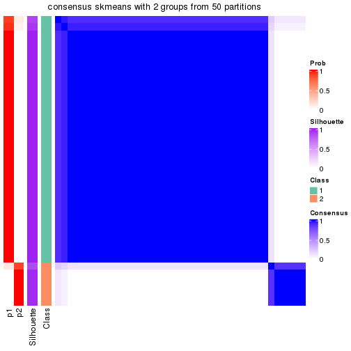</p>

</div>
<div id='tab-node-013-consensus-heatmap-2'>
<pre><code class="r">consensus_heatmap(res, k = 3)
</code></pre>

<p>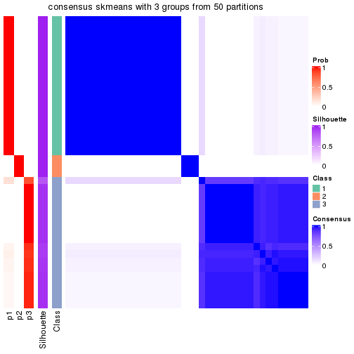</p>

</div>
<div id='tab-node-013-consensus-heatmap-3'>
<pre><code class="r">consensus_heatmap(res, k = 4)
</code></pre>

<p></p>

</div>
<div id='tab-node-013-consensus-heatmap-4'>
<pre><code class="r">consensus_heatmap(res, k = 5)
</code></pre>

<p></p>

</div>
<div id='tab-node-013-consensus-heatmap-5'>
<pre><code class="r">consensus_heatmap(res, k = 6)
</code></pre>

<p></p>

</div>
<div id='tab-node-013-consensus-heatmap-6'>
<pre><code class="r">consensus_heatmap(res, k = 7)
</code></pre>

<p></p>

</div>
<div id='tab-node-013-consensus-heatmap-7'>
<pre><code class="r">consensus_heatmap(res, k = 8)
</code></pre>

<p></p>

</div>
</div>

Heatmaps for the membership of samples in all partitions to see how consistent they are:


<script>
$( function() {
	$( '#tabs-node-013-membership-heatmap' ).tabs();
} );
</script>
<div id='tabs-node-013-membership-heatmap'>
<ul>
<li><a href='#tab-node-013-membership-heatmap-1'>k = 2</a></li>
<li><a href='#tab-node-013-membership-heatmap-2'>k = 3</a></li>
<li><a href='#tab-node-013-membership-heatmap-3'>k = 4</a></li>
<li><a href='#tab-node-013-membership-heatmap-4'>k = 5</a></li>
<li><a href='#tab-node-013-membership-heatmap-5'>k = 6</a></li>
<li><a href='#tab-node-013-membership-heatmap-6'>k = 7</a></li>
<li><a href='#tab-node-013-membership-heatmap-7'>k = 8</a></li>
</ul>
<div id='tab-node-013-membership-heatmap-1'>
<pre><code class="r">membership_heatmap(res, k = 2)
</code></pre>

<p></p>

</div>
<div id='tab-node-013-membership-heatmap-2'>
<pre><code class="r">membership_heatmap(res, k = 3)
</code></pre>

<p></p>

</div>
<div id='tab-node-013-membership-heatmap-3'>
<pre><code class="r">membership_heatmap(res, k = 4)
</code></pre>

<p></p>

</div>
<div id='tab-node-013-membership-heatmap-4'>
<pre><code class="r">membership_heatmap(res, k = 5)
</code></pre>

<p></p>

</div>
<div id='tab-node-013-membership-heatmap-5'>
<pre><code class="r">membership_heatmap(res, k = 6)
</code></pre>

<p></p>

</div>
<div id='tab-node-013-membership-heatmap-6'>
<pre><code class="r">membership_heatmap(res, k = 7)
</code></pre>

<p></p>

</div>
<div id='tab-node-013-membership-heatmap-7'>
<pre><code class="r">membership_heatmap(res, k = 8)
</code></pre>

<p></p>

</div>
</div>

As soon as the classes for columns are determined, the signatures
that are significantly different between subgroups can be looked for. 
Following are the heatmaps for signatures.


<script>
$( function() {
	$( '#tabs-node-013-get-signatures' ).tabs();
} );
</script>
<div id='tabs-node-013-get-signatures'>
<ul>
<li><a href='#tab-node-013-get-signatures-1'>k = 2</a></li>
<li><a href='#tab-node-013-get-signatures-2'>k = 3</a></li>
<li><a href='#tab-node-013-get-signatures-3'>k = 4</a></li>
<li><a href='#tab-node-013-get-signatures-4'>k = 5</a></li>
<li><a href='#tab-node-013-get-signatures-5'>k = 6</a></li>
<li><a href='#tab-node-013-get-signatures-6'>k = 7</a></li>
<li><a href='#tab-node-013-get-signatures-7'>k = 8</a></li>
</ul>
<div id='tab-node-013-get-signatures-1'>
<pre><code class="r">get_signatures(res, k = 2)
</code></pre>

<p></p>

</div>
<div id='tab-node-013-get-signatures-2'>
<pre><code class="r">get_signatures(res, k = 3)
</code></pre>

<p></p>

</div>
<div id='tab-node-013-get-signatures-3'>
<pre><code class="r">get_signatures(res, k = 4)
</code></pre>

<p></p>

</div>
<div id='tab-node-013-get-signatures-4'>
<pre><code class="r">get_signatures(res, k = 5)
</code></pre>

<p></p>

</div>
<div id='tab-node-013-get-signatures-5'>
<pre><code class="r">get_signatures(res, k = 6)
</code></pre>

<p></p>

</div>
<div id='tab-node-013-get-signatures-6'>
<pre><code class="r">get_signatures(res, k = 7)
</code></pre>

<p></p>

</div>
<div id='tab-node-013-get-signatures-7'>
<pre><code class="r">get_signatures(res, k = 8)
</code></pre>

<p></p>

</div>
</div>


Compare the overlap of signatures from different k:

```r
compare_signatures(res)
```


`get_signature()` returns a data frame invisibly. To get the list of signatures, the function
call should be assigned to a variable explicitly. In following code, if `plot` argument is set
to `FALSE`, no heatmap is plotted while only the differential analysis is performed.

```r
# code only for demonstration
tb = get_signature(res, k = ..., plot = FALSE)
```

An example of the output of `tb` is:

```
#>   which_row         fdr    mean_1    mean_2 scaled_mean_1 scaled_mean_2 km
#> 1        38 0.042760348  8.373488  9.131774    -0.5533452     0.5164555  1
#> 2        40 0.018707592  7.106213  8.469186    -0.6173731     0.5762149  1
#> 3        55 0.019134737 10.221463 11.207825    -0.6159697     0.5749050  1
#> 4        59 0.006059896  5.921854  7.869574    -0.6899429     0.6439467  1
#> 5        60 0.018055526  8.928898 10.211722    -0.6204761     0.5791110  1
#> 6        98 0.009384629 15.714769 14.887706     0.6635654    -0.6193277  2
...
```

The columns in `tb` are:

1. `which_row`: row indices corresponding to the input matrix.
2. `fdr`: FDR for the differential test. 
3. `mean_x`: The mean value in group x.
4. `scaled_mean_x`: The mean value in group x after rows are scaled.
5. `km`: Row groups if k-means clustering is applied to rows (which is done by automatically selecting number of clusters).

If there are too many signatures, `top_signatures = ...` can be set to only show the 
signatures with the highest FDRs:

```r
# code only for demonstration
# e.g. to show the top 500 most significant rows
tb = get_signature(res, k = ..., top_signatures = 500)
```

If the signatures are defined as these which are uniquely high in current group, `diff_method` argument
can be set to `"uniquely_high_in_one_group"`:

```r
# code only for demonstration
tb = get_signature(res, k = ..., diff_method = "uniquely_high_in_one_group")
```


UMAP plot which shows how samples are separated.


<script>
$( function() {
	$( '#tabs-node-013-dimension-reduction' ).tabs();
} );
</script>
<div id='tabs-node-013-dimension-reduction'>
<ul>
<li><a href='#tab-node-013-dimension-reduction-1'>k = 2</a></li>
<li><a href='#tab-node-013-dimension-reduction-2'>k = 3</a></li>
<li><a href='#tab-node-013-dimension-reduction-3'>k = 4</a></li>
<li><a href='#tab-node-013-dimension-reduction-4'>k = 5</a></li>
<li><a href='#tab-node-013-dimension-reduction-5'>k = 6</a></li>
<li><a href='#tab-node-013-dimension-reduction-6'>k = 7</a></li>
<li><a href='#tab-node-013-dimension-reduction-7'>k = 8</a></li>
</ul>
<div id='tab-node-013-dimension-reduction-1'>
<pre><code class="r">dimension_reduction(res, k = 2, method = &quot;UMAP&quot;)
</code></pre>

<p></p>

</div>
<div id='tab-node-013-dimension-reduction-2'>
<pre><code class="r">dimension_reduction(res, k = 3, method = &quot;UMAP&quot;)
</code></pre>

<p></p>

</div>
<div id='tab-node-013-dimension-reduction-3'>
<pre><code class="r">dimension_reduction(res, k = 4, method = &quot;UMAP&quot;)
</code></pre>

<p></p>

</div>
<div id='tab-node-013-dimension-reduction-4'>
<pre><code class="r">dimension_reduction(res, k = 5, method = &quot;UMAP&quot;)
</code></pre>

<p></p>

</div>
<div id='tab-node-013-dimension-reduction-5'>
<pre><code class="r">dimension_reduction(res, k = 6, method = &quot;UMAP&quot;)
</code></pre>

<p></p>

</div>
<div id='tab-node-013-dimension-reduction-6'>
<pre><code class="r">dimension_reduction(res, k = 7, method = &quot;UMAP&quot;)
</code></pre>

<p></p>

</div>
<div id='tab-node-013-dimension-reduction-7'>
<pre><code class="r">dimension_reduction(res, k = 8, method = &quot;UMAP&quot;)
</code></pre>

<p></p>

</div>
</div>


Following heatmap shows how subgroups are split when increasing `k`:

```r
collect_classes(res)
```


If matrix rows can be associated to genes, consider to use `functional_enrichment(res,
...)` to perform function enrichment for the signature genes. See [this vignette](https://jokergoo.github.io/cola_vignettes/functional_enrichment.html) for more detailed explanations.


 

---------------------------------------------------


### Node014


Parent node: [Node01](#Node01).
Child nodes: 
                Node0111-leaf
        ,
                Node0112-leaf
        ,
                Node0113-leaf
        ,
                Node0114-leaf
        ,
                Node0131-leaf
        ,
                Node0132-leaf
        ,
                Node0133-leaf
        ,
                Node0141-leaf
        ,
                Node0142-leaf
        ,
                Node0143-leaf
        ,
                Node0211-leaf
        ,
                Node0212-leaf
        ,
                Node0221-leaf
        ,
                Node0222-leaf
        ,
                Node0223-leaf
        ,
                Node0224-leaf
        ,
                Node0231-leaf
        ,
                [Node0232](#Node0232)
        ,
                Node0233-leaf
        ,
                Node0234-leaf
        ,
                [Node0241](#Node0241)
        ,
                Node0242-leaf
        ,
                Node0243-leaf
        ,
                Node0244-leaf
        ,
                Node0251-leaf
        ,
                Node0252-leaf
        ,
                [Node0311](#Node0311)
        ,
                Node0312-leaf
        ,
                Node0313-leaf
        ,
                Node0331-leaf
        ,
                Node0332-leaf
        ,
                Node0333-leaf
        .


The object with results only for a single top-value method and a single partitioning method 
can be extracted as:

```r
res = res_rh["014"]
```

A summary of `res` and all the functions that can be applied to it:

```r
res
```

```
#> A 'ConsensusPartition' object with k = 2, 3, 4, 5, 6, 7, 8.
#>   On a matrix with 30000 rows and 17 columns.
#>   Top rows (1000) are extracted by 'ATC' method.
#>   Subgroups are detected by 'skmeans' method.
#>   Performed in total 350 partitions by row resampling.
#>   Best k for subgroups seems to be 4.
#> 
#> Following methods can be applied to this 'ConsensusPartition' object:
#>  [1] "cola_report"             "collect_classes"         "collect_plots"          
#>  [4] "collect_stats"           "colnames"                "compare_partitions"     
#>  [7] "compare_signatures"      "consensus_heatmap"       "dimension_reduction"    
#> [10] "functional_enrichment"   "get_anno_col"            "get_anno"               
#> [13] "get_classes"             "get_consensus"           "get_matrix"             
#> [16] "get_membership"          "get_param"               "get_signatures"         
#> [19] "get_stats"               "is_best_k"               "is_stable_k"            
#> [22] "membership_heatmap"      "ncol"                    "nrow"                   
#> [25] "plot_ecdf"               "predict_classes"         "rownames"               
#> [28] "select_partition_number" "show"                    "suggest_best_k"         
#> [31] "test_to_known_factors"   "top_rows_heatmap"
```

`collect_plots()` function collects all the plots made from `res` for all `k` (number of subgroups)
into one single page to provide an easy and fast comparison between different `k`.

```r
collect_plots(res)
```


The plots are:

- The first row: a plot of the eCDF (empirical cumulative distribution
  function) curves of the consensus matrix for each `k` and the heatmap of
  predicted classes for each `k`.
- The second row: heatmaps of the consensus matrix for each `k`.
- The third row: heatmaps of the membership matrix for each `k`.
- The fouth row: heatmaps of the signatures for each `k`.

All the plots in panels can be made by individual functions and they are
plotted later in this section.

`select_partition_number()` produces several plots showing different
statistics for choosing "optimized" `k`. There are following statistics:

- eCDF curves of the consensus matrix for each `k`;
- 1-PAC. [The PAC score](https://en.wikipedia.org/wiki/Consensus_clustering#Over-interpretation_potential_of_consensus_clustering)
  measures the proportion of the ambiguous subgrouping.
- Mean silhouette score.
- Concordance. The mean probability of fiting the consensus subgroup labels in all
  partitions.
- Area increased. Denote $A_k$ as the area under the eCDF curve for current
  `k`, the area increased is defined as $A_k - A_{k-1}$.
- Rand index. The percent of pairs of samples that are both in a same cluster
  or both are not in a same cluster in the partition of k and k-1.
- Jaccard index. The ratio of pairs of samples are both in a same cluster in
  the partition of k and k-1 and the pairs of samples are both in a same
  cluster in the partition k or k-1.

The detailed explanations of these statistics can be found in [the _cola_
vignette](https://jokergoo.github.io/cola_vignettes/cola.html#toc_13).

Generally speaking, higher 1-PAC score, higher mean silhouette score or higher
concordance corresponds to better partition. Rand index and Jaccard index
measure how similar the current partition is compared to partition with `k-1`.
If they are too similar, we won't accept `k` is better than `k-1`.

```r
select_partition_number(res)
```


The numeric values for all these statistics can be obtained by `get_stats()`.

```r
get_stats(res)
```

```
#>   k 1-PAC mean_silhouette concordance area_increased  Rand Jaccard
#> 2 2 1.000           1.000       1.000         0.2214 0.779   0.779
#> 3 3 1.000           0.995       0.991         1.7677 0.603   0.491
#> 4 4 0.904           0.922       0.992         0.1087 0.941   0.846
#> 5 5 0.831           0.790       0.955         0.0821 0.949   0.841
#> 6 6 0.801           0.678       0.932         0.0542 0.956   0.838
#> 7 7 0.728           0.563       0.865         0.0590 0.919   0.703
#> 8 8 0.743           0.331       0.836         0.0461 0.926   0.688
```

`suggest_best_k()` suggests the best $k$ based on these statistics. The rules are as follows:

- All $k$ with Jaccard index larger than 0.95 are removed because increasing
  $k$ does not provide enough extra information. If all $k$ are removed, it is
  marked as no subgroup is detected.
- For all $k$ with 1-PAC score larger than 0.9, the maximal $k$ is taken as
  the best $k$, and other $k$ are marked as optional $k$.
- If it does not fit the second rule. The $k$ with the maximal vote of the
  highest 1-PAC score, highest mean silhouette, and highest concordance is
  taken as the best $k$.

```r
suggest_best_k(res)
```

```
#> [1] 4
#> attr(,"optional")
#> [1] 2 3
```

There is also optional best $k$ = 2 3 that is worth to check.

Following is the table of the partitions (You need to click the **show/hide
code output** link to see it). The membership matrix (columns with name `p*`)
is inferred by
[`clue::cl_consensus()`](https://www.rdocumentation.org/link/cl_consensus?package=clue)
function with the `SE` method. Basically the value in the membership matrix
represents the probability to belong to a certain group. The finall subgroup
label for an item is determined with the group with highest probability it
belongs to.

In `get_classes()` function, the entropy is calculated from the membership
matrix and the silhouette score is calculated from the consensus matrix.


<script>
$( function() {
	$( '#tabs-node-014-get-classes' ).tabs();
} );
</script>
<div id='tabs-node-014-get-classes'>
<ul>
<li><a href='#tab-node-014-get-classes-1'>k = 2</a></li>
<li><a href='#tab-node-014-get-classes-2'>k = 3</a></li>
<li><a href='#tab-node-014-get-classes-3'>k = 4</a></li>
<li><a href='#tab-node-014-get-classes-4'>k = 5</a></li>
<li><a href='#tab-node-014-get-classes-5'>k = 6</a></li>
<li><a href='#tab-node-014-get-classes-6'>k = 7</a></li>
<li><a href='#tab-node-014-get-classes-7'>k = 8</a></li>
</ul>

<div id='tab-node-014-get-classes-1'>
<p><a id='tab-node-014-get-classes-1-a' style='color:#0366d6' href='#'>show/hide code output</a></p>
<pre><code class="r">cbind(get_classes(res, k = 2), get_membership(res, k = 2))
</code></pre>

<pre><code>#&gt;                 class entropy silhouette p1 p2
#&gt; TCGA.ET.A40S.01     2       0          1  0  1
#&gt; TCGA.DE.A4MD.06     1       0          1  1  0
#&gt; TCGA.DJ.A2Q5.01     2       0          1  0  1
#&gt; TCGA.DJ.A4V5.01     2       0          1  0  1
#&gt; TCGA.IM.A4EB.01     2       0          1  0  1
#&gt; TCGA.EM.A4FO.01     2       0          1  0  1
#&gt; TCGA.EM.A22M.01     2       0          1  0  1
#&gt; TCGA.EL.A3GP.01     1       0          1  1  0
#&gt; TCGA.EM.A2P1.01     2       0          1  0  1
#&gt; TCGA.EM.A2P1.06     2       0          1  0  1
#&gt; TCGA.ET.A3BS.01     2       0          1  0  1
#&gt; TCGA.DO.A2HM.01     2       0          1  0  1
#&gt; TCGA.EL.A3CV.01     2       0          1  0  1
#&gt; TCGA.EM.A22P.01     2       0          1  0  1
#&gt; TCGA.ET.A39M.01     2       0          1  0  1
#&gt; TCGA.BJ.A0ZJ.01     2       0          1  0  1
#&gt; TCGA.DJ.A13L.01     2       0          1  0  1
</code></pre>

<script>
$('#tab-node-014-get-classes-1-a').parent().next().next().hide();
$('#tab-node-014-get-classes-1-a').click(function(){
  $('#tab-node-014-get-classes-1-a').parent().next().next().toggle();
  return(false);
});
</script>
</div>

<div id='tab-node-014-get-classes-2'>
<p><a id='tab-node-014-get-classes-2-a' style='color:#0366d6' href='#'>show/hide code output</a></p>
<pre><code class="r">cbind(get_classes(res, k = 3), get_membership(res, k = 3))
</code></pre>

<pre><code>#&gt;                 class entropy silhouette p1   p2   p3
#&gt; TCGA.ET.A40S.01     2  0.0892      0.975  0 0.98 0.02
#&gt; TCGA.DE.A4MD.06     1  0.0000      1.000  1 0.00 0.00
#&gt; TCGA.DJ.A2Q5.01     3  0.0892      1.000  0 0.02 0.98
#&gt; TCGA.DJ.A4V5.01     3  0.0892      1.000  0 0.02 0.98
#&gt; TCGA.IM.A4EB.01     3  0.0892      1.000  0 0.02 0.98
#&gt; TCGA.EM.A4FO.01     2  0.0892      0.975  0 0.98 0.02
#&gt; TCGA.EM.A22M.01     2  0.0000      0.994  0 1.00 0.00
#&gt; TCGA.EL.A3GP.01     1  0.0000      1.000  1 0.00 0.00
#&gt; TCGA.EM.A2P1.01     2  0.0000      0.994  0 1.00 0.00
#&gt; TCGA.EM.A2P1.06     2  0.0000      0.994  0 1.00 0.00
#&gt; TCGA.ET.A3BS.01     3  0.0892      1.000  0 0.02 0.98
#&gt; TCGA.DO.A2HM.01     2  0.0000      0.994  0 1.00 0.00
#&gt; TCGA.EL.A3CV.01     2  0.0000      0.994  0 1.00 0.00
#&gt; TCGA.EM.A22P.01     2  0.0000      0.994  0 1.00 0.00
#&gt; TCGA.ET.A39M.01     3  0.0892      1.000  0 0.02 0.98
#&gt; TCGA.BJ.A0ZJ.01     3  0.0892      1.000  0 0.02 0.98
#&gt; TCGA.DJ.A13L.01     2  0.0000      0.994  0 1.00 0.00
</code></pre>

<script>
$('#tab-node-014-get-classes-2-a').parent().next().next().hide();
$('#tab-node-014-get-classes-2-a').click(function(){
  $('#tab-node-014-get-classes-2-a').parent().next().next().toggle();
  return(false);
});
</script>
</div>

<div id='tab-node-014-get-classes-3'>
<p><a id='tab-node-014-get-classes-3-a' style='color:#0366d6' href='#'>show/hide code output</a></p>
<pre><code class="r">cbind(get_classes(res, k = 4), get_membership(res, k = 4))
</code></pre>

<pre><code>#&gt;                 class entropy silhouette p1   p2  p3   p4
#&gt; TCGA.ET.A40S.01     4   0.000      0.000  0 0.00 0.0 1.00
#&gt; TCGA.DE.A4MD.06     1   0.000      1.000  1 0.00 0.0 0.00
#&gt; TCGA.DJ.A2Q5.01     3   0.000      1.000  0 0.00 1.0 0.00
#&gt; TCGA.DJ.A4V5.01     3   0.000      1.000  0 0.00 1.0 0.00
#&gt; TCGA.IM.A4EB.01     3   0.000      1.000  0 0.00 1.0 0.00
#&gt; TCGA.EM.A4FO.01     2   0.234      0.865  0 0.90 0.1 0.00
#&gt; TCGA.EM.A22M.01     2   0.121      0.946  0 0.96 0.0 0.04
#&gt; TCGA.EL.A3GP.01     1   0.000      1.000  1 0.00 0.0 0.00
#&gt; TCGA.EM.A2P1.01     2   0.000      0.976  0 1.00 0.0 0.00
#&gt; TCGA.EM.A2P1.06     2   0.000      0.976  0 1.00 0.0 0.00
#&gt; TCGA.ET.A3BS.01     3   0.000      1.000  0 0.00 1.0 0.00
#&gt; TCGA.DO.A2HM.01     2   0.000      0.976  0 1.00 0.0 0.00
#&gt; TCGA.EL.A3CV.01     2   0.000      0.976  0 1.00 0.0 0.00
#&gt; TCGA.EM.A22P.01     2   0.000      0.976  0 1.00 0.0 0.00
#&gt; TCGA.ET.A39M.01     3   0.000      1.000  0 0.00 1.0 0.00
#&gt; TCGA.BJ.A0ZJ.01     3   0.000      1.000  0 0.00 1.0 0.00
#&gt; TCGA.DJ.A13L.01     2   0.000      0.976  0 1.00 0.0 0.00
</code></pre>

<script>
$('#tab-node-014-get-classes-3-a').parent().next().next().hide();
$('#tab-node-014-get-classes-3-a').click(function(){
  $('#tab-node-014-get-classes-3-a').parent().next().next().toggle();
  return(false);
});
</script>
</div>

<div id='tab-node-014-get-classes-4'>
<p><a id='tab-node-014-get-classes-4-a' style='color:#0366d6' href='#'>show/hide code output</a></p>
<pre><code class="r">cbind(get_classes(res, k = 5), get_membership(res, k = 5))
</code></pre>

<pre><code>#&gt;                 class entropy silhouette p1   p2   p3 p4   p5
#&gt; TCGA.ET.A40S.01     4  0.0000      0.000  0 0.00 0.00  1 0.00
#&gt; TCGA.DE.A4MD.06     1  0.0000      1.000  1 0.00 0.00  0 0.00
#&gt; TCGA.DJ.A2Q5.01     3  0.0000      0.976  0 0.00 1.00  0 0.00
#&gt; TCGA.DJ.A4V5.01     3  0.1410      0.958  0 0.00 0.94  0 0.06
#&gt; TCGA.IM.A4EB.01     3  0.1410      0.958  0 0.00 0.94  0 0.06
#&gt; TCGA.EM.A4FO.01     2  0.3895      0.459  0 0.68 0.32  0 0.00
#&gt; TCGA.EM.A22M.01     5  0.2020      0.000  0 0.10 0.00  0 0.90
#&gt; TCGA.EL.A3GP.01     1  0.0000      1.000  1 0.00 0.00  0 0.00
#&gt; TCGA.EM.A2P1.01     2  0.0000      0.884  0 1.00 0.00  0 0.00
#&gt; TCGA.EM.A2P1.06     2  0.0000      0.884  0 1.00 0.00  0 0.00
#&gt; TCGA.ET.A3BS.01     3  0.0000      0.976  0 0.00 1.00  0 0.00
#&gt; TCGA.DO.A2HM.01     2  0.0000      0.884  0 1.00 0.00  0 0.00
#&gt; TCGA.EL.A3CV.01     2  0.0000      0.884  0 1.00 0.00  0 0.00
#&gt; TCGA.EM.A22P.01     2  0.2732      0.745  0 0.84 0.00  0 0.16
#&gt; TCGA.ET.A39M.01     3  0.0000      0.976  0 0.00 1.00  0 0.00
#&gt; TCGA.BJ.A0ZJ.01     3  0.0609      0.974  0 0.00 0.98  0 0.02
#&gt; TCGA.DJ.A13L.01     2  0.1043      0.866  0 0.96 0.00  0 0.04
</code></pre>

<script>
$('#tab-node-014-get-classes-4-a').parent().next().next().hide();
$('#tab-node-014-get-classes-4-a').click(function(){
  $('#tab-node-014-get-classes-4-a').parent().next().next().toggle();
  return(false);
});
</script>
</div>

<div id='tab-node-014-get-classes-5'>
<p><a id='tab-node-014-get-classes-5-a' style='color:#0366d6' href='#'>show/hide code output</a></p>
<pre><code class="r">cbind(get_classes(res, k = 6), get_membership(res, k = 6))
</code></pre>

<pre><code>#&gt;                 class entropy silhouette p1   p2   p3 p4   p5   p6
#&gt; TCGA.ET.A40S.01     4  0.0000      0.000  0 0.00 0.00  1 0.00 0.00
#&gt; TCGA.DE.A4MD.06     1  0.0000      1.000  1 0.00 0.00  0 0.00 0.00
#&gt; TCGA.DJ.A2Q5.01     3  0.0000      0.968  0 0.00 1.00  0 0.00 0.00
#&gt; TCGA.DJ.A4V5.01     3  0.2260      0.866  0 0.00 0.86  0 0.00 0.14
#&gt; TCGA.IM.A4EB.01     3  0.0937      0.950  0 0.00 0.96  0 0.00 0.04
#&gt; TCGA.EM.A4FO.01     2  0.4787      0.159  0 0.52 0.44  0 0.02 0.02
#&gt; TCGA.EM.A22M.01     5  0.0000      0.000  0 0.00 0.00  0 1.00 0.00
#&gt; TCGA.EL.A3GP.01     1  0.0000      1.000  1 0.00 0.00  0 0.00 0.00
#&gt; TCGA.EM.A2P1.01     2  0.0000      0.779  0 1.00 0.00  0 0.00 0.00
#&gt; TCGA.EM.A2P1.06     2  0.0000      0.779  0 1.00 0.00  0 0.00 0.00
#&gt; TCGA.ET.A3BS.01     3  0.0000      0.968  0 0.00 1.00  0 0.00 0.00
#&gt; TCGA.DO.A2HM.01     2  0.0000      0.779  0 1.00 0.00  0 0.00 0.00
#&gt; TCGA.EL.A3CV.01     2  0.0547      0.770  0 0.98 0.00  0 0.00 0.02
#&gt; TCGA.EM.A22P.01     6  0.3679      0.000  0 0.20 0.00  0 0.04 0.76
#&gt; TCGA.ET.A39M.01     3  0.0000      0.968  0 0.00 1.00  0 0.00 0.00
#&gt; TCGA.BJ.A0ZJ.01     3  0.0000      0.968  0 0.00 1.00  0 0.00 0.00
#&gt; TCGA.DJ.A13L.01     2  0.4004      0.580  0 0.76 0.00  0 0.12 0.12
</code></pre>

<script>
$('#tab-node-014-get-classes-5-a').parent().next().next().hide();
$('#tab-node-014-get-classes-5-a').click(function(){
  $('#tab-node-014-get-classes-5-a').parent().next().next().toggle();
  return(false);
});
</script>
</div>

<div id='tab-node-014-get-classes-6'>
<p><a id='tab-node-014-get-classes-6-a' style='color:#0366d6' href='#'>show/hide code output</a></p>
<pre><code class="r">cbind(get_classes(res, k = 7), get_membership(res, k = 7))
</code></pre>

<pre><code>#&gt;                 class entropy silhouette p1   p2   p3 p4   p5   p6   p7
#&gt; TCGA.ET.A40S.01     4  0.0000     0.0000  0 0.00 0.00  1 0.00 0.00 0.00
#&gt; TCGA.DE.A4MD.06     1  0.0000     1.0000  1 0.00 0.00  0 0.00 0.00 0.00
#&gt; TCGA.DJ.A2Q5.01     3  0.2016     0.7218  0 0.00 0.90  0 0.06 0.04 0.00
#&gt; TCGA.DJ.A4V5.01     3  0.4108     0.5406  0 0.00 0.66  0 0.28 0.06 0.00
#&gt; TCGA.IM.A4EB.01     3  0.3841     0.6225  0 0.00 0.68  0 0.28 0.04 0.00
#&gt; TCGA.EM.A4FO.01     3  0.5791    -0.0139  0 0.40 0.44  0 0.10 0.06 0.00
#&gt; TCGA.EM.A22M.01     7  0.0000     0.0000  0 0.00 0.00  0 0.00 0.00 1.00
#&gt; TCGA.EL.A3GP.01     1  0.0000     1.0000  1 0.00 0.00  0 0.00 0.00 0.00
#&gt; TCGA.EM.A2P1.01     2  0.0000     0.8240  0 1.00 0.00  0 0.00 0.00 0.00
#&gt; TCGA.EM.A2P1.06     2  0.0000     0.8240  0 1.00 0.00  0 0.00 0.00 0.00
#&gt; TCGA.ET.A3BS.01     3  0.2912     0.6891  0 0.00 0.82  0 0.14 0.04 0.00
#&gt; TCGA.DO.A2HM.01     2  0.0504     0.8202  0 0.98 0.00  0 0.00 0.02 0.00
#&gt; TCGA.EL.A3CV.01     2  0.2512     0.7389  0 0.86 0.00  0 0.10 0.04 0.00
#&gt; TCGA.EM.A22P.01     6  0.1886     0.0000  0 0.12 0.00  0 0.00 0.88 0.00
#&gt; TCGA.ET.A39M.01     3  0.0863     0.7355  0 0.00 0.96  0 0.04 0.00 0.00
#&gt; TCGA.BJ.A0ZJ.01     3  0.0504     0.7362  0 0.00 0.98  0 0.02 0.00 0.00
#&gt; TCGA.DJ.A13L.01     2  0.5293     0.3319  0 0.54 0.00  0 0.32 0.02 0.12
</code></pre>

<script>
$('#tab-node-014-get-classes-6-a').parent().next().next().hide();
$('#tab-node-014-get-classes-6-a').click(function(){
  $('#tab-node-014-get-classes-6-a').parent().next().next().toggle();
  return(false);
});
</script>
</div>

<div id='tab-node-014-get-classes-7'>
<p><a id='tab-node-014-get-classes-7-a' style='color:#0366d6' href='#'>show/hide code output</a></p>
<pre><code class="r">cbind(get_classes(res, k = 8), get_membership(res, k = 8))
</code></pre>

<pre><code>#&gt;                 class entropy silhouette p1   p2   p3 p4   p5   p6   p7   p8
#&gt; TCGA.ET.A40S.01     4  0.0000     0.0000  0 0.00 0.00  1 0.00 0.00 0.00 0.00
#&gt; TCGA.DE.A4MD.06     1  0.0000     1.0000  1 0.00 0.00  0 0.00 0.00 0.00 0.00
#&gt; TCGA.DJ.A2Q5.01     3  0.3483     0.1997  0 0.02 0.76  0 0.18 0.00 0.00 0.04
#&gt; TCGA.DJ.A4V5.01     3  0.5206     0.0482  0 0.00 0.50  0 0.32 0.02 0.00 0.16
#&gt; TCGA.IM.A4EB.01     5  0.3318     0.0000  0 0.00 0.46  0 0.54 0.00 0.00 0.00
#&gt; TCGA.EM.A4FO.01     3  0.5295     0.0449  0 0.36 0.50  0 0.10 0.02 0.00 0.02
#&gt; TCGA.EM.A22M.01     7  0.0000     0.0000  0 0.00 0.00  0 0.00 0.00 1.00 0.00
#&gt; TCGA.EL.A3GP.01     1  0.0000     1.0000  1 0.00 0.00  0 0.00 0.00 0.00 0.00
#&gt; TCGA.EM.A2P1.01     2  0.0000     0.9087  0 1.00 0.00  0 0.00 0.00 0.00 0.00
#&gt; TCGA.EM.A2P1.06     2  0.0000     0.9087  0 1.00 0.00  0 0.00 0.00 0.00 0.00
#&gt; TCGA.ET.A3BS.01     3  0.3618    -0.3935  0 0.00 0.60  0 0.38 0.00 0.00 0.02
#&gt; TCGA.DO.A2HM.01     2  0.2484     0.8442  0 0.86 0.00  0 0.02 0.02 0.00 0.10
#&gt; TCGA.EL.A3CV.01     2  0.2348     0.8538  0 0.88 0.00  0 0.06 0.02 0.00 0.04
#&gt; TCGA.EM.A22P.01     6  0.0941     0.0000  0 0.02 0.00  0 0.00 0.96 0.02 0.00
#&gt; TCGA.ET.A39M.01     3  0.0471     0.1822  0 0.00 0.98  0 0.02 0.00 0.00 0.00
#&gt; TCGA.BJ.A0ZJ.01     3  0.2224     0.0262  0 0.00 0.86  0 0.12 0.00 0.00 0.02
#&gt; TCGA.DJ.A13L.01     8  0.3444     0.0000  0 0.14 0.00  0 0.00 0.02 0.06 0.78
</code></pre>

<script>
$('#tab-node-014-get-classes-7-a').parent().next().next().hide();
$('#tab-node-014-get-classes-7-a').click(function(){
  $('#tab-node-014-get-classes-7-a').parent().next().next().toggle();
  return(false);
});
</script>
</div>
</div>

Heatmaps for the consensus matrix. It visualizes the probability of two
samples to be in a same group.


<script>
$( function() {
	$( '#tabs-node-014-consensus-heatmap' ).tabs();
} );
</script>
<div id='tabs-node-014-consensus-heatmap'>
<ul>
<li><a href='#tab-node-014-consensus-heatmap-1'>k = 2</a></li>
<li><a href='#tab-node-014-consensus-heatmap-2'>k = 3</a></li>
<li><a href='#tab-node-014-consensus-heatmap-3'>k = 4</a></li>
<li><a href='#tab-node-014-consensus-heatmap-4'>k = 5</a></li>
<li><a href='#tab-node-014-consensus-heatmap-5'>k = 6</a></li>
<li><a href='#tab-node-014-consensus-heatmap-6'>k = 7</a></li>
<li><a href='#tab-node-014-consensus-heatmap-7'>k = 8</a></li>
</ul>
<div id='tab-node-014-consensus-heatmap-1'>
<pre><code class="r">consensus_heatmap(res, k = 2)
</code></pre>

<p></p>

</div>
<div id='tab-node-014-consensus-heatmap-2'>
<pre><code class="r">consensus_heatmap(res, k = 3)
</code></pre>

<p></p>

</div>
<div id='tab-node-014-consensus-heatmap-3'>
<pre><code class="r">consensus_heatmap(res, k = 4)
</code></pre>

<p></p>

</div>
<div id='tab-node-014-consensus-heatmap-4'>
<pre><code class="r">consensus_heatmap(res, k = 5)
</code></pre>

<p></p>

</div>
<div id='tab-node-014-consensus-heatmap-5'>
<pre><code class="r">consensus_heatmap(res, k = 6)
</code></pre>

<p></p>

</div>
<div id='tab-node-014-consensus-heatmap-6'>
<pre><code class="r">consensus_heatmap(res, k = 7)
</code></pre>

<p></p>

</div>
<div id='tab-node-014-consensus-heatmap-7'>
<pre><code class="r">consensus_heatmap(res, k = 8)
</code></pre>

<p></p>

</div>
</div>

Heatmaps for the membership of samples in all partitions to see how consistent they are:


<script>
$( function() {
	$( '#tabs-node-014-membership-heatmap' ).tabs();
} );
</script>
<div id='tabs-node-014-membership-heatmap'>
<ul>
<li><a href='#tab-node-014-membership-heatmap-1'>k = 2</a></li>
<li><a href='#tab-node-014-membership-heatmap-2'>k = 3</a></li>
<li><a href='#tab-node-014-membership-heatmap-3'>k = 4</a></li>
<li><a href='#tab-node-014-membership-heatmap-4'>k = 5</a></li>
<li><a href='#tab-node-014-membership-heatmap-5'>k = 6</a></li>
<li><a href='#tab-node-014-membership-heatmap-6'>k = 7</a></li>
<li><a href='#tab-node-014-membership-heatmap-7'>k = 8</a></li>
</ul>
<div id='tab-node-014-membership-heatmap-1'>
<pre><code class="r">membership_heatmap(res, k = 2)
</code></pre>

<p>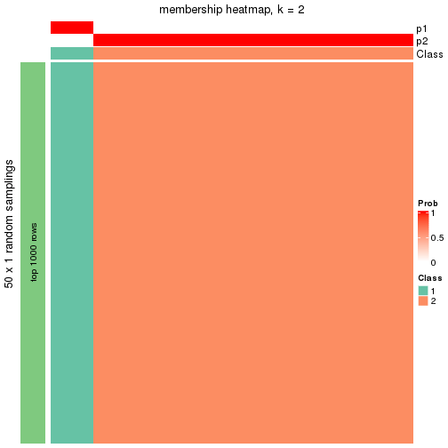</p>

</div>
<div id='tab-node-014-membership-heatmap-2'>
<pre><code class="r">membership_heatmap(res, k = 3)
</code></pre>

<p></p>

</div>
<div id='tab-node-014-membership-heatmap-3'>
<pre><code class="r">membership_heatmap(res, k = 4)
</code></pre>

<p></p>

</div>
<div id='tab-node-014-membership-heatmap-4'>
<pre><code class="r">membership_heatmap(res, k = 5)
</code></pre>

<p></p>

</div>
<div id='tab-node-014-membership-heatmap-5'>
<pre><code class="r">membership_heatmap(res, k = 6)
</code></pre>

<p></p>

</div>
<div id='tab-node-014-membership-heatmap-6'>
<pre><code class="r">membership_heatmap(res, k = 7)
</code></pre>

<p></p>

</div>
<div id='tab-node-014-membership-heatmap-7'>
<pre><code class="r">membership_heatmap(res, k = 8)
</code></pre>

<p></p>

</div>
</div>

As soon as the classes for columns are determined, the signatures
that are significantly different between subgroups can be looked for. 
Following are the heatmaps for signatures.


<script>
$( function() {
	$( '#tabs-node-014-get-signatures' ).tabs();
} );
</script>
<div id='tabs-node-014-get-signatures'>
<ul>
<li><a href='#tab-node-014-get-signatures-1'>k = 2</a></li>
<li><a href='#tab-node-014-get-signatures-2'>k = 3</a></li>
<li><a href='#tab-node-014-get-signatures-3'>k = 4</a></li>
<li><a href='#tab-node-014-get-signatures-4'>k = 5</a></li>
<li><a href='#tab-node-014-get-signatures-5'>k = 6</a></li>
<li><a href='#tab-node-014-get-signatures-6'>k = 7</a></li>
<li><a href='#tab-node-014-get-signatures-7'>k = 8</a></li>
</ul>
<div id='tab-node-014-get-signatures-1'>
<pre><code class="r">get_signatures(res, k = 2)
</code></pre>

<p></p>

</div>
<div id='tab-node-014-get-signatures-2'>
<pre><code class="r">get_signatures(res, k = 3)
</code></pre>

<p></p>

</div>
<div id='tab-node-014-get-signatures-3'>
<pre><code class="r">get_signatures(res, k = 4)
</code></pre>

<p></p>

</div>
<div id='tab-node-014-get-signatures-4'>
<pre><code class="r">get_signatures(res, k = 5)
</code></pre>

<p></p>

</div>
<div id='tab-node-014-get-signatures-5'>
<pre><code class="r">get_signatures(res, k = 6)
</code></pre>

<p></p>

</div>
<div id='tab-node-014-get-signatures-6'>
<pre><code class="r">get_signatures(res, k = 7)
</code></pre>

<p></p>

</div>
<div id='tab-node-014-get-signatures-7'>
<pre><code class="r">get_signatures(res, k = 8)
</code></pre>

<p>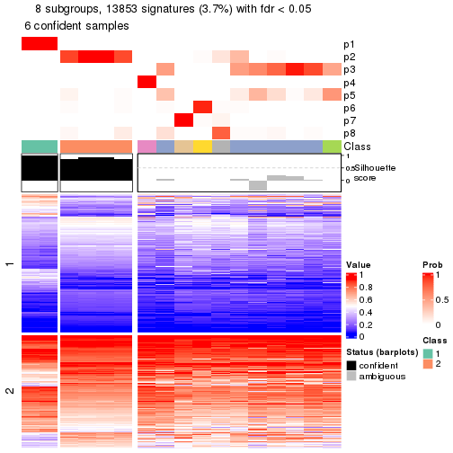</p>

</div>
</div>


Compare the overlap of signatures from different k:

```r
compare_signatures(res)
```


`get_signature()` returns a data frame invisibly. To get the list of signatures, the function
call should be assigned to a variable explicitly. In following code, if `plot` argument is set
to `FALSE`, no heatmap is plotted while only the differential analysis is performed.

```r
# code only for demonstration
tb = get_signature(res, k = ..., plot = FALSE)
```

An example of the output of `tb` is:

```
#>   which_row         fdr    mean_1    mean_2 scaled_mean_1 scaled_mean_2 km
#> 1        38 0.042760348  8.373488  9.131774    -0.5533452     0.5164555  1
#> 2        40 0.018707592  7.106213  8.469186    -0.6173731     0.5762149  1
#> 3        55 0.019134737 10.221463 11.207825    -0.6159697     0.5749050  1
#> 4        59 0.006059896  5.921854  7.869574    -0.6899429     0.6439467  1
#> 5        60 0.018055526  8.928898 10.211722    -0.6204761     0.5791110  1
#> 6        98 0.009384629 15.714769 14.887706     0.6635654    -0.6193277  2
...
```

The columns in `tb` are:

1. `which_row`: row indices corresponding to the input matrix.
2. `fdr`: FDR for the differential test. 
3. `mean_x`: The mean value in group x.
4. `scaled_mean_x`: The mean value in group x after rows are scaled.
5. `km`: Row groups if k-means clustering is applied to rows (which is done by automatically selecting number of clusters).

If there are too many signatures, `top_signatures = ...` can be set to only show the 
signatures with the highest FDRs:

```r
# code only for demonstration
# e.g. to show the top 500 most significant rows
tb = get_signature(res, k = ..., top_signatures = 500)
```

If the signatures are defined as these which are uniquely high in current group, `diff_method` argument
can be set to `"uniquely_high_in_one_group"`:

```r
# code only for demonstration
tb = get_signature(res, k = ..., diff_method = "uniquely_high_in_one_group")
```


UMAP plot which shows how samples are separated.


<script>
$( function() {
	$( '#tabs-node-014-dimension-reduction' ).tabs();
} );
</script>
<div id='tabs-node-014-dimension-reduction'>
<ul>
<li><a href='#tab-node-014-dimension-reduction-1'>k = 2</a></li>
<li><a href='#tab-node-014-dimension-reduction-2'>k = 3</a></li>
<li><a href='#tab-node-014-dimension-reduction-3'>k = 4</a></li>
<li><a href='#tab-node-014-dimension-reduction-4'>k = 5</a></li>
<li><a href='#tab-node-014-dimension-reduction-5'>k = 6</a></li>
<li><a href='#tab-node-014-dimension-reduction-6'>k = 7</a></li>
<li><a href='#tab-node-014-dimension-reduction-7'>k = 8</a></li>
</ul>
<div id='tab-node-014-dimension-reduction-1'>
<pre><code class="r">dimension_reduction(res, k = 2, method = &quot;UMAP&quot;)
</code></pre>

<p></p>

</div>
<div id='tab-node-014-dimension-reduction-2'>
<pre><code class="r">dimension_reduction(res, k = 3, method = &quot;UMAP&quot;)
</code></pre>

<p></p>

</div>
<div id='tab-node-014-dimension-reduction-3'>
<pre><code class="r">dimension_reduction(res, k = 4, method = &quot;UMAP&quot;)
</code></pre>

<p></p>

</div>
<div id='tab-node-014-dimension-reduction-4'>
<pre><code class="r">dimension_reduction(res, k = 5, method = &quot;UMAP&quot;)
</code></pre>

<p></p>

</div>
<div id='tab-node-014-dimension-reduction-5'>
<pre><code class="r">dimension_reduction(res, k = 6, method = &quot;UMAP&quot;)
</code></pre>

<p></p>

</div>
<div id='tab-node-014-dimension-reduction-6'>
<pre><code class="r">dimension_reduction(res, k = 7, method = &quot;UMAP&quot;)
</code></pre>

<p></p>

</div>
<div id='tab-node-014-dimension-reduction-7'>
<pre><code class="r">dimension_reduction(res, k = 8, method = &quot;UMAP&quot;)
</code></pre>

<p></p>

</div>
</div>


Following heatmap shows how subgroups are split when increasing `k`:

```r
collect_classes(res)
```


If matrix rows can be associated to genes, consider to use `functional_enrichment(res,
...)` to perform function enrichment for the signature genes. See [this vignette](https://jokergoo.github.io/cola_vignettes/functional_enrichment.html) for more detailed explanations.


 

---------------------------------------------------


### Node02


Parent node: [Node0](#Node0).
Child nodes: 
                [Node011](#Node011)
        ,
                Node012-leaf
        ,
                [Node013](#Node013)
        ,
                [Node014](#Node014)
        ,
                Node015-leaf
        ,
                [Node021](#Node021)
        ,
                [Node022](#Node022)
        ,
                [Node023](#Node023)
        ,
                [Node024](#Node024)
        ,
                [Node025](#Node025)
        ,
                [Node031](#Node031)
        ,
                Node032-leaf
        ,
                [Node033](#Node033)
        ,
                Node034-leaf
        .


The object with results only for a single top-value method and a single partitioning method 
can be extracted as:

```r
res = res_rh["02"]
```

A summary of `res` and all the functions that can be applied to it:

```r
res
```

```
#> A 'ConsensusPartition' object with k = 2, 3, 4, 5, 6, 7, 8.
#>   On a matrix with 30000 rows and 209 columns.
#>   Top rows (1000) are extracted by 'ATC' method.
#>   Subgroups are detected by 'skmeans' method.
#>   Performed in total 350 partitions by row resampling.
#>   Best k for subgroups seems to be 5.
#> 
#> Following methods can be applied to this 'ConsensusPartition' object:
#>  [1] "cola_report"             "collect_classes"         "collect_plots"          
#>  [4] "collect_stats"           "colnames"                "compare_partitions"     
#>  [7] "compare_signatures"      "consensus_heatmap"       "dimension_reduction"    
#> [10] "functional_enrichment"   "get_anno_col"            "get_anno"               
#> [13] "get_classes"             "get_consensus"           "get_matrix"             
#> [16] "get_membership"          "get_param"               "get_signatures"         
#> [19] "get_stats"               "is_best_k"               "is_stable_k"            
#> [22] "membership_heatmap"      "ncol"                    "nrow"                   
#> [25] "plot_ecdf"               "predict_classes"         "rownames"               
#> [28] "select_partition_number" "show"                    "suggest_best_k"         
#> [31] "test_to_known_factors"   "top_rows_heatmap"
```

`collect_plots()` function collects all the plots made from `res` for all `k` (number of subgroups)
into one single page to provide an easy and fast comparison between different `k`.

```r
collect_plots(res)
```


The plots are:

- The first row: a plot of the eCDF (empirical cumulative distribution
  function) curves of the consensus matrix for each `k` and the heatmap of
  predicted classes for each `k`.
- The second row: heatmaps of the consensus matrix for each `k`.
- The third row: heatmaps of the membership matrix for each `k`.
- The fouth row: heatmaps of the signatures for each `k`.

All the plots in panels can be made by individual functions and they are
plotted later in this section.

`select_partition_number()` produces several plots showing different
statistics for choosing "optimized" `k`. There are following statistics:

- eCDF curves of the consensus matrix for each `k`;
- 1-PAC. [The PAC score](https://en.wikipedia.org/wiki/Consensus_clustering#Over-interpretation_potential_of_consensus_clustering)
  measures the proportion of the ambiguous subgrouping.
- Mean silhouette score.
- Concordance. The mean probability of fiting the consensus subgroup labels in all
  partitions.
- Area increased. Denote $A_k$ as the area under the eCDF curve for current
  `k`, the area increased is defined as $A_k - A_{k-1}$.
- Rand index. The percent of pairs of samples that are both in a same cluster
  or both are not in a same cluster in the partition of k and k-1.
- Jaccard index. The ratio of pairs of samples are both in a same cluster in
  the partition of k and k-1 and the pairs of samples are both in a same
  cluster in the partition k or k-1.

The detailed explanations of these statistics can be found in [the _cola_
vignette](https://jokergoo.github.io/cola_vignettes/cola.html#toc_13).

Generally speaking, higher 1-PAC score, higher mean silhouette score or higher
concordance corresponds to better partition. Rand index and Jaccard index
measure how similar the current partition is compared to partition with `k-1`.
If they are too similar, we won't accept `k` is better than `k-1`.

```r
select_partition_number(res)
```


The numeric values for all these statistics can be obtained by `get_stats()`.

```r
get_stats(res)
```

```
#>   k 1-PAC mean_silhouette concordance area_increased  Rand Jaccard
#> 2 2 0.931           0.947       0.978         0.4859 0.513   0.513
#> 3 3 0.726           0.897       0.927         0.1960 0.877   0.769
#> 4 4 0.988           0.953       0.981         0.2466 0.772   0.511
#> 5 5 1.000           0.985       0.994         0.1053 0.878   0.590
#> 6 6 0.920           0.870       0.925         0.0243 0.991   0.954
#> 7 7 0.875           0.758       0.870         0.0224 0.976   0.873
#> 8 8 0.856           0.680       0.831         0.0155 0.977   0.867
```

`suggest_best_k()` suggests the best $k$ based on these statistics. The rules are as follows:

- All $k$ with Jaccard index larger than 0.95 are removed because increasing
  $k$ does not provide enough extra information. If all $k$ are removed, it is
  marked as no subgroup is detected.
- For all $k$ with 1-PAC score larger than 0.9, the maximal $k$ is taken as
  the best $k$, and other $k$ are marked as optional $k$.
- If it does not fit the second rule. The $k$ with the maximal vote of the
  highest 1-PAC score, highest mean silhouette, and highest concordance is
  taken as the best $k$.

```r
suggest_best_k(res)
```

```
#> [1] 5
#> attr(,"optional")
#> [1] 2 4
```

There is also optional best $k$ = 2 4 that is worth to check.

Following is the table of the partitions (You need to click the **show/hide
code output** link to see it). The membership matrix (columns with name `p*`)
is inferred by
[`clue::cl_consensus()`](https://www.rdocumentation.org/link/cl_consensus?package=clue)
function with the `SE` method. Basically the value in the membership matrix
represents the probability to belong to a certain group. The finall subgroup
label for an item is determined with the group with highest probability it
belongs to.

In `get_classes()` function, the entropy is calculated from the membership
matrix and the silhouette score is calculated from the consensus matrix.


<script>
$( function() {
	$( '#tabs-node-02-get-classes' ).tabs();
} );
</script>
<div id='tabs-node-02-get-classes'>
<ul>
<li><a href='#tab-node-02-get-classes-1'>k = 2</a></li>
<li><a href='#tab-node-02-get-classes-2'>k = 3</a></li>
<li><a href='#tab-node-02-get-classes-3'>k = 4</a></li>
<li><a href='#tab-node-02-get-classes-4'>k = 5</a></li>
<li><a href='#tab-node-02-get-classes-5'>k = 6</a></li>
<li><a href='#tab-node-02-get-classes-6'>k = 7</a></li>
<li><a href='#tab-node-02-get-classes-7'>k = 8</a></li>
</ul>

<div id='tab-node-02-get-classes-1'>
<p><a id='tab-node-02-get-classes-1-a' style='color:#0366d6' href='#'>show/hide code output</a></p>
<pre><code class="r">cbind(get_classes(res, k = 2), get_membership(res, k = 2))
</code></pre>

<pre><code>#&gt;                 class entropy silhouette   p1   p2
#&gt; TCGA.E8.A416.01     1   0.000      0.972 1.00 0.00
#&gt; TCGA.EL.A3ZO.11     1   0.000      0.972 1.00 0.00
#&gt; TCGA.ET.A2N3.01     2   0.000      0.980 0.00 1.00
#&gt; TCGA.EM.A4FU.01     2   0.000      0.980 0.00 1.00
#&gt; TCGA.DJ.A3VM.01     2   0.000      0.980 0.00 1.00
#&gt; TCGA.DJ.A3VG.01     2   0.000      0.980 0.00 1.00
#&gt; TCGA.EL.A4K2.01     1   0.881      0.586 0.70 0.30
#&gt; TCGA.EL.A3ZK.11     1   0.000      0.972 1.00 0.00
#&gt; TCGA.FY.A40M.01     2   0.000      0.980 0.00 1.00
#&gt; TCGA.KS.A41I.01     2   0.000      0.980 0.00 1.00
#&gt; TCGA.DJ.A3VL.01     1   0.000      0.972 1.00 0.00
#&gt; TCGA.ET.A4KQ.01     1   0.981      0.292 0.58 0.42
#&gt; TCGA.DJ.A4V0.01     1   0.000      0.972 1.00 0.00
#&gt; TCGA.EL.A3ZL.11     1   0.000      0.972 1.00 0.00
#&gt; TCGA.EM.A4FH.01     2   0.000      0.980 0.00 1.00
#&gt; TCGA.IM.A41Z.01     2   0.000      0.980 0.00 1.00
#&gt; TCGA.DE.A4M9.01     2   0.000      0.980 0.00 1.00
#&gt; TCGA.KS.A41L.01     2   0.000      0.980 0.00 1.00
#&gt; TCGA.EL.A4KI.01     2   0.000      0.980 0.00 1.00
#&gt; TCGA.EM.A4G1.01     2   0.000      0.980 0.00 1.00
#&gt; TCGA.E8.A434.01     1   0.680      0.784 0.82 0.18
#&gt; TCGA.EL.A3ZH.01     2   0.000      0.980 0.00 1.00
#&gt; TCGA.EL.A3ZH.11     1   0.000      0.972 1.00 0.00
#&gt; TCGA.EL.A3ZR.01     2   0.000      0.980 0.00 1.00
#&gt; TCGA.EL.A3ZG.11     1   0.000      0.972 1.00 0.00
#&gt; TCGA.ET.A40P.01     2   0.000      0.980 0.00 1.00
#&gt; TCGA.DJ.A3VK.01     2   0.000      0.980 0.00 1.00
#&gt; TCGA.EL.A3ZP.11     1   0.000      0.972 1.00 0.00
#&gt; TCGA.BJ.A2N8.11     1   0.000      0.972 1.00 0.00
#&gt; TCGA.EL.A3H2.01     2   0.000      0.980 0.00 1.00
#&gt; TCGA.EM.A3AP.01     2   0.000      0.980 0.00 1.00
#&gt; TCGA.BJ.A45E.01     1   0.000      0.972 1.00 0.00
#&gt; TCGA.BJ.A45K.01     2   0.000      0.980 0.00 1.00
#&gt; TCGA.E3.A3DZ.01     2   0.000      0.980 0.00 1.00
#&gt; TCGA.BJ.A45C.01     2   0.000      0.980 0.00 1.00
#&gt; TCGA.BJ.A45G.01     2   0.000      0.980 0.00 1.00
#&gt; TCGA.BJ.A2P4.01     2   0.000      0.980 0.00 1.00
#&gt; TCGA.CE.A484.01     2   0.000      0.980 0.00 1.00
#&gt; TCGA.BJ.A45F.01     2   0.000      0.980 0.00 1.00
#&gt; TCGA.FY.A4B0.01     2   0.000      0.980 0.00 1.00
#&gt; TCGA.DJ.A2Q9.01     1   0.000      0.972 1.00 0.00
#&gt; TCGA.EL.A4K6.01     2   0.000      0.980 0.00 1.00
#&gt; TCGA.EM.A4FK.01     2   0.000      0.980 0.00 1.00
#&gt; TCGA.EL.A3MW.11     1   0.000      0.972 1.00 0.00
#&gt; TCGA.BJ.A45D.01     2   0.634      0.801 0.16 0.84
#&gt; TCGA.DJ.A4UR.01     2   0.000      0.980 0.00 1.00
#&gt; TCGA.EL.A3N2.11     1   0.000      0.972 1.00 0.00
#&gt; TCGA.BJ.A2N9.01     2   0.000      0.980 0.00 1.00
#&gt; TCGA.EL.A3GZ.11     1   0.000      0.972 1.00 0.00
#&gt; TCGA.EM.A3AR.01     1   0.000      0.972 1.00 0.00
#&gt; TCGA.EL.A3N3.11     1   0.000      0.972 1.00 0.00
#&gt; TCGA.EL.A4JV.01     2   0.000      0.980 0.00 1.00
#&gt; TCGA.BJ.A2N7.01     2   0.000      0.980 0.00 1.00
#&gt; TCGA.DE.A2OL.01     2   0.000      0.980 0.00 1.00
#&gt; TCGA.EL.A3H2.11     1   0.000      0.972 1.00 0.00
#&gt; TCGA.MK.A84Z.01     2   0.000      0.980 0.00 1.00
#&gt; TCGA.ET.A3DP.11     1   0.000      0.972 1.00 0.00
#&gt; TCGA.EL.A3MX.11     1   0.000      0.972 1.00 0.00
#&gt; TCGA.BJ.A28T.11     1   0.000      0.972 1.00 0.00
#&gt; TCGA.EM.A22J.01     2   0.000      0.980 0.00 1.00
#&gt; TCGA.BJ.A28W.11     2   0.000      0.980 0.00 1.00
#&gt; TCGA.BJ.A2N8.01     2   0.000      0.980 0.00 1.00
#&gt; TCGA.FY.A76V.01     2   0.000      0.980 0.00 1.00
#&gt; TCGA.EM.A3FN.01     2   0.000      0.980 0.00 1.00
#&gt; TCGA.QD.A8IV.01     2   0.000      0.980 0.00 1.00
#&gt; TCGA.ET.A2MY.11     2   0.000      0.980 0.00 1.00
#&gt; TCGA.ET.A25P.01     2   0.000      0.980 0.00 1.00
#&gt; TCGA.EM.A2CT.01     2   0.000      0.980 0.00 1.00
#&gt; TCGA.E8.A2JQ.11     1   0.000      0.972 1.00 0.00
#&gt; TCGA.EM.A2CL.01     2   0.000      0.980 0.00 1.00
#&gt; TCGA.ET.A2N5.01     2   0.000      0.980 0.00 1.00
#&gt; TCGA.ET.A25J.11     1   0.000      0.972 1.00 0.00
#&gt; TCGA.BJ.A28R.11     1   0.000      0.972 1.00 0.00
#&gt; TCGA.EL.A3H7.11     1   0.000      0.972 1.00 0.00
#&gt; TCGA.H2.A2K9.01     2   0.000      0.980 0.00 1.00
#&gt; TCGA.EM.A22Q.01     2   0.000      0.980 0.00 1.00
#&gt; TCGA.EM.A3FP.01     2   0.327      0.921 0.06 0.94
#&gt; TCGA.GE.A2C6.11     1   0.000      0.972 1.00 0.00
#&gt; TCGA.CE.A27D.01     1   0.000      0.972 1.00 0.00
#&gt; TCGA.EL.A3H1.11     1   0.000      0.972 1.00 0.00
#&gt; TCGA.BJ.A2N7.11     1   0.000      0.972 1.00 0.00
#&gt; TCGA.EM.A2CQ.01     2   0.000      0.980 0.00 1.00
#&gt; TCGA.EL.A3H1.01     2   0.000      0.980 0.00 1.00
#&gt; TCGA.BJ.A28W.01     1   0.000      0.972 1.00 0.00
#&gt; TCGA.BJ.A28T.01     1   0.000      0.972 1.00 0.00
#&gt; TCGA.EM.A2CJ.01     2   0.000      0.980 0.00 1.00
#&gt; TCGA.EM.A22K.01     2   0.000      0.980 0.00 1.00
#&gt; TCGA.FY.A3NM.01     2   0.000      0.980 0.00 1.00
#&gt; TCGA.EM.A22L.01     2   0.000      0.980 0.00 1.00
#&gt; TCGA.BJ.A2N9.11     1   0.000      0.972 1.00 0.00
#&gt; TCGA.BJ.A291.01     1   0.634      0.810 0.84 0.16
#&gt; TCGA.ET.A2N5.11     1   0.000      0.972 1.00 0.00
#&gt; TCGA.ET.A25N.11     1   0.000      0.972 1.00 0.00
#&gt; TCGA.J8.A3O0.01     2   0.000      0.980 0.00 1.00
#&gt; TCGA.EL.A3MY.11     1   0.760      0.727 0.78 0.22
#&gt; TCGA.FY.A3NP.01     2   0.000      0.980 0.00 1.00
#&gt; TCGA.ET.A25I.01     2   0.000      0.980 0.00 1.00
#&gt; TCGA.BJ.A290.11     1   0.000      0.972 1.00 0.00
#&gt; TCGA.FE.A239.01     2   0.000      0.980 0.00 1.00
#&gt; TCGA.EM.A22N.01     2   0.958      0.379 0.38 0.62
#&gt; TCGA.EM.A2CM.01     2   0.000      0.980 0.00 1.00
#&gt; TCGA.EM.A3FL.01     2   0.000      0.980 0.00 1.00
#&gt; TCGA.H2.A2K9.11     1   0.000      0.972 1.00 0.00
#&gt; TCGA.FY.A3TY.01     1   0.000      0.972 1.00 0.00
#&gt; TCGA.EM.A2OW.01     2   0.943      0.431 0.36 0.64
#&gt; TCGA.DO.A1JZ.11     1   0.000      0.972 1.00 0.00
#&gt; TCGA.EL.A3D5.01     2   0.000      0.980 0.00 1.00
#&gt; TCGA.EL.A3GW.01     2   0.000      0.980 0.00 1.00
#&gt; TCGA.EL.A3T1.11     1   0.000      0.972 1.00 0.00
#&gt; TCGA.BJ.A0ZC.01     2   0.000      0.980 0.00 1.00
#&gt; TCGA.EM.A2OV.01     2   0.000      0.980 0.00 1.00
#&gt; TCGA.EM.A3SY.01     1   0.000      0.972 1.00 0.00
#&gt; TCGA.EM.A3AI.01     1   0.469      0.880 0.90 0.10
#&gt; TCGA.EM.A2OY.01     2   0.000      0.980 0.00 1.00
#&gt; TCGA.BJ.A18Y.01     2   0.000      0.980 0.00 1.00
#&gt; TCGA.EM.A2CK.01     1   0.943      0.455 0.64 0.36
#&gt; TCGA.EL.A3T7.11     1   0.000      0.972 1.00 0.00
#&gt; TCGA.BJ.A192.01     2   0.000      0.980 0.00 1.00
#&gt; TCGA.EM.A2CP.01     1   0.000      0.972 1.00 0.00
#&gt; TCGA.DJ.A3UZ.01     2   0.855      0.605 0.28 0.72
#&gt; TCGA.BJ.A3F0.01     2   0.000      0.980 0.00 1.00
#&gt; TCGA.EM.A3AJ.01     2   0.000      0.980 0.00 1.00
#&gt; TCGA.EM.A1CW.01     2   0.000      0.980 0.00 1.00
#&gt; TCGA.EM.A2P2.01     2   0.000      0.980 0.00 1.00
#&gt; TCGA.EM.A1CU.11     1   0.000      0.972 1.00 0.00
#&gt; TCGA.EL.A3T0.11     1   0.000      0.972 1.00 0.00
#&gt; TCGA.FY.A3WA.01     2   0.000      0.980 0.00 1.00
#&gt; TCGA.FY.A3TY.11     1   0.000      0.972 1.00 0.00
#&gt; TCGA.EM.A1CT.11     1   0.000      0.972 1.00 0.00
#&gt; TCGA.EM.A3ST.11     1   0.000      0.972 1.00 0.00
#&gt; TCGA.ET.A3DV.01     2   0.000      0.980 0.00 1.00
#&gt; TCGA.J8.A3YD.01     1   0.529      0.858 0.88 0.12
#&gt; TCGA.EM.A3AL.01     2   0.000      0.980 0.00 1.00
#&gt; TCGA.EM.A1CS.11     1   0.000      0.972 1.00 0.00
#&gt; TCGA.EM.A1CW.11     1   0.000      0.972 1.00 0.00
#&gt; TCGA.BJ.A190.01     1   0.000      0.972 1.00 0.00
#&gt; TCGA.EM.A1CV.11     1   0.000      0.972 1.00 0.00
#&gt; TCGA.EM.A3ST.01     2   0.000      0.980 0.00 1.00
#&gt; TCGA.EL.A3GO.01     2   0.000      0.980 0.00 1.00
#&gt; TCGA.DJ.A2Q0.01     2   0.584      0.827 0.14 0.86
#&gt; TCGA.FK.A3SD.01     2   0.000      0.980 0.00 1.00
#&gt; TCGA.EM.A1YE.11     1   0.000      0.972 1.00 0.00
#&gt; TCGA.EL.A3T2.11     1   0.000      0.972 1.00 0.00
#&gt; TCGA.EM.A1YC.01     1   0.469      0.880 0.90 0.10
#&gt; TCGA.DJ.A3UP.01     2   0.000      0.980 0.00 1.00
#&gt; TCGA.EL.A3CW.01     1   0.000      0.972 1.00 0.00
#&gt; TCGA.ET.A39L.01     2   0.981      0.263 0.42 0.58
#&gt; TCGA.EM.A2CO.01     2   0.000      0.980 0.00 1.00
#&gt; TCGA.DJ.A2PP.01     2   0.000      0.980 0.00 1.00
#&gt; TCGA.ET.A3DQ.01     1   0.000      0.972 1.00 0.00
#&gt; TCGA.ET.A3DS.01     1   0.141      0.956 0.98 0.02
#&gt; TCGA.FY.A3W9.01     2   0.000      0.980 0.00 1.00
#&gt; TCGA.BJ.A2NA.11     1   0.000      0.972 1.00 0.00
#&gt; TCGA.DJ.A1QL.01     2   0.000      0.980 0.00 1.00
#&gt; TCGA.EM.A1YD.11     1   0.000      0.972 1.00 0.00
#&gt; TCGA.ET.A3DW.11     1   0.000      0.972 1.00 0.00
#&gt; TCGA.EL.A3TA.11     1   0.000      0.972 1.00 0.00
#&gt; TCGA.EM.A1YE.01     2   0.000      0.980 0.00 1.00
#&gt; TCGA.FY.A2QD.01     2   0.000      0.980 0.00 1.00
#&gt; TCGA.DJ.A2Q2.01     2   0.000      0.980 0.00 1.00
#&gt; TCGA.BJ.A28V.01     2   0.000      0.980 0.00 1.00
#&gt; TCGA.BJ.A28X.11     1   0.000      0.972 1.00 0.00
#&gt; TCGA.DJ.A1QG.01     2   0.000      0.980 0.00 1.00
#&gt; TCGA.EL.A3TB.11     1   0.000      0.972 1.00 0.00
#&gt; TCGA.ET.A39I.01     2   0.000      0.980 0.00 1.00
#&gt; TCGA.EM.A1YB.01     2   0.000      0.980 0.00 1.00
#&gt; TCGA.DJ.A3UT.01     2   0.000      0.980 0.00 1.00
#&gt; TCGA.DJ.A1QM.01     1   0.000      0.972 1.00 0.00
#&gt; TCGA.EL.A3CY.01     1   0.000      0.972 1.00 0.00
#&gt; TCGA.EM.A1YC.11     1   0.000      0.972 1.00 0.00
#&gt; TCGA.EL.A3T3.11     1   0.000      0.972 1.00 0.00
#&gt; TCGA.EL.A3T2.01     2   0.000      0.980 0.00 1.00
#&gt; TCGA.EL.A3T8.11     1   0.000      0.972 1.00 0.00
#&gt; TCGA.EM.A1YA.01     2   0.000      0.980 0.00 1.00
#&gt; TCGA.EL.A3CO.01     1   0.000      0.972 1.00 0.00
#&gt; TCGA.EM.A1YD.01     1   0.141      0.956 0.98 0.02
#&gt; TCGA.EL.A3CZ.01     2   0.000      0.980 0.00 1.00
#&gt; TCGA.EM.A3FR.01     2   0.000      0.980 0.00 1.00
#&gt; TCGA.EM.A3O8.01     2   0.971      0.324 0.40 0.60
#&gt; TCGA.FY.A3R9.01     2   0.000      0.980 0.00 1.00
#&gt; TCGA.EM.A3O6.01     2   0.000      0.980 0.00 1.00
#&gt; TCGA.BJ.A28S.01     2   0.000      0.980 0.00 1.00
#&gt; TCGA.H2.A3RI.11     1   0.000      0.972 1.00 0.00
#&gt; TCGA.DJ.A13W.01     2   0.000      0.980 0.00 1.00
#&gt; TCGA.BJ.A0ZA.01     2   0.000      0.980 0.00 1.00
#&gt; TCGA.BJ.A3PT.01     2   0.000      0.980 0.00 1.00
#&gt; TCGA.BJ.A0ZF.01     2   0.000      0.980 0.00 1.00
#&gt; TCGA.BJ.A0YZ.01     2   0.000      0.980 0.00 1.00
#&gt; TCGA.DJ.A2QB.01     2   0.000      0.980 0.00 1.00
#&gt; TCGA.EM.A3OB.01     2   0.000      0.980 0.00 1.00
#&gt; TCGA.H2.A3RH.01     2   0.000      0.980 0.00 1.00
#&gt; TCGA.BJ.A3PR.11     1   0.000      0.972 1.00 0.00
#&gt; TCGA.EL.A3T6.11     1   0.000      0.972 1.00 0.00
#&gt; TCGA.BJ.A0ZG.01     1   0.881      0.587 0.70 0.30
#&gt; TCGA.BJ.A0Z0.01     2   0.000      0.980 0.00 1.00
#&gt; TCGA.EM.A3O9.01     1   0.000      0.972 1.00 0.00
#&gt; TCGA.BJ.A3PR.01     1   0.000      0.972 1.00 0.00
#&gt; TCGA.EM.A3OA.01     2   0.000      0.980 0.00 1.00
#&gt; TCGA.BJ.A0ZE.01     2   0.000      0.980 0.00 1.00
#&gt; TCGA.DJ.A13O.01     1   0.000      0.972 1.00 0.00
#&gt; TCGA.DJ.A13M.01     2   0.000      0.980 0.00 1.00
#&gt; TCGA.DJ.A13R.01     2   0.000      0.980 0.00 1.00
#&gt; TCGA.ET.A39N.01     2   0.000      0.980 0.00 1.00
#&gt; TCGA.BJ.A3PU.11     1   0.000      0.972 1.00 0.00
#&gt; TCGA.FY.A3R7.01     2   0.529      0.853 0.12 0.88
#&gt; TCGA.EM.A2CN.01     2   0.000      0.980 0.00 1.00
#&gt; TCGA.BJ.A0Z2.01     2   0.000      0.980 0.00 1.00
#&gt; TCGA.FY.A3I5.01     2   0.000      0.980 0.00 1.00
#&gt; TCGA.DJ.A13S.01     2   0.000      0.980 0.00 1.00
</code></pre>

<script>
$('#tab-node-02-get-classes-1-a').parent().next().next().hide();
$('#tab-node-02-get-classes-1-a').click(function(){
  $('#tab-node-02-get-classes-1-a').parent().next().next().toggle();
  return(false);
});
</script>
</div>

<div id='tab-node-02-get-classes-2'>
<p><a id='tab-node-02-get-classes-2-a' style='color:#0366d6' href='#'>show/hide code output</a></p>
<pre><code class="r">cbind(get_classes(res, k = 3), get_membership(res, k = 3))
</code></pre>

<pre><code>#&gt;                 class entropy silhouette   p1   p2   p3
#&gt; TCGA.E8.A416.01     1  0.3340     0.9056 0.88 0.00 0.12
#&gt; TCGA.EL.A3ZO.11     1  0.3340     0.9056 0.88 0.00 0.12
#&gt; TCGA.ET.A2N3.01     2  0.0000     0.9263 0.00 1.00 0.00
#&gt; TCGA.EM.A4FU.01     2  0.0000     0.9263 0.00 1.00 0.00
#&gt; TCGA.DJ.A3VM.01     2  0.0000     0.9263 0.00 1.00 0.00
#&gt; TCGA.DJ.A3VG.01     2  0.3340     0.9345 0.12 0.88 0.00
#&gt; TCGA.EL.A4K2.01     2  0.6280     0.3865 0.46 0.54 0.00
#&gt; TCGA.EL.A3ZK.11     3  0.0000     0.9792 0.00 0.00 1.00
#&gt; TCGA.FY.A40M.01     2  0.2537     0.9331 0.08 0.92 0.00
#&gt; TCGA.KS.A41I.01     2  0.3340     0.9345 0.12 0.88 0.00
#&gt; TCGA.DJ.A3VL.01     3  0.3340     0.8297 0.12 0.00 0.88
#&gt; TCGA.ET.A4KQ.01     1  0.6045     0.1536 0.62 0.38 0.00
#&gt; TCGA.DJ.A4V0.01     3  0.0000     0.9792 0.00 0.00 1.00
#&gt; TCGA.EL.A3ZL.11     1  0.3340     0.9056 0.88 0.00 0.12
#&gt; TCGA.EM.A4FH.01     2  0.3340     0.9345 0.12 0.88 0.00
#&gt; TCGA.IM.A41Z.01     2  0.0000     0.9263 0.00 1.00 0.00
#&gt; TCGA.DE.A4M9.01     2  0.3340     0.9345 0.12 0.88 0.00
#&gt; TCGA.KS.A41L.01     2  0.3340     0.9345 0.12 0.88 0.00
#&gt; TCGA.EL.A4KI.01     2  0.0000     0.9263 0.00 1.00 0.00
#&gt; TCGA.EM.A4G1.01     2  0.3340     0.9345 0.12 0.88 0.00
#&gt; TCGA.E8.A434.01     2  0.6280     0.3861 0.46 0.54 0.00
#&gt; TCGA.EL.A3ZH.01     2  0.3340     0.9345 0.12 0.88 0.00
#&gt; TCGA.EL.A3ZH.11     1  0.3340     0.9056 0.88 0.00 0.12
#&gt; TCGA.EL.A3ZR.01     2  0.3340     0.9345 0.12 0.88 0.00
#&gt; TCGA.EL.A3ZG.11     1  0.3340     0.9056 0.88 0.00 0.12
#&gt; TCGA.ET.A40P.01     2  0.3340     0.9345 0.12 0.88 0.00
#&gt; TCGA.DJ.A3VK.01     2  0.3340     0.9345 0.12 0.88 0.00
#&gt; TCGA.EL.A3ZP.11     3  0.0000     0.9792 0.00 0.00 1.00
#&gt; TCGA.BJ.A2N8.11     1  0.3340     0.9056 0.88 0.00 0.12
#&gt; TCGA.EL.A3H2.01     2  0.3340     0.9345 0.12 0.88 0.00
#&gt; TCGA.EM.A3AP.01     2  0.3340     0.9345 0.12 0.88 0.00
#&gt; TCGA.BJ.A45E.01     3  0.0000     0.9792 0.00 0.00 1.00
#&gt; TCGA.BJ.A45K.01     2  0.0000     0.9263 0.00 1.00 0.00
#&gt; TCGA.E3.A3DZ.01     2  0.3340     0.9345 0.12 0.88 0.00
#&gt; TCGA.BJ.A45C.01     2  0.0000     0.9263 0.00 1.00 0.00
#&gt; TCGA.BJ.A45G.01     2  0.2537     0.9331 0.08 0.92 0.00
#&gt; TCGA.BJ.A2P4.01     2  0.3340     0.9345 0.12 0.88 0.00
#&gt; TCGA.CE.A484.01     2  0.0000     0.9263 0.00 1.00 0.00
#&gt; TCGA.BJ.A45F.01     2  0.3340     0.9345 0.12 0.88 0.00
#&gt; TCGA.FY.A4B0.01     2  0.0000     0.9263 0.00 1.00 0.00
#&gt; TCGA.DJ.A2Q9.01     3  0.0000     0.9792 0.00 0.00 1.00
#&gt; TCGA.EL.A4K6.01     2  0.0000     0.9263 0.00 1.00 0.00
#&gt; TCGA.EM.A4FK.01     2  0.0000     0.9263 0.00 1.00 0.00
#&gt; TCGA.EL.A3MW.11     1  0.3340     0.9056 0.88 0.00 0.12
#&gt; TCGA.BJ.A45D.01     2  0.3340     0.9345 0.12 0.88 0.00
#&gt; TCGA.DJ.A4UR.01     2  0.0000     0.9263 0.00 1.00 0.00
#&gt; TCGA.EL.A3N2.11     1  0.3340     0.9056 0.88 0.00 0.12
#&gt; TCGA.BJ.A2N9.01     2  0.3340     0.9345 0.12 0.88 0.00
#&gt; TCGA.EL.A3GZ.11     1  0.3340     0.9056 0.88 0.00 0.12
#&gt; TCGA.EM.A3AR.01     1  0.3340     0.9056 0.88 0.00 0.12
#&gt; TCGA.EL.A3N3.11     3  0.0000     0.9792 0.00 0.00 1.00
#&gt; TCGA.EL.A4JV.01     2  0.3340     0.9345 0.12 0.88 0.00
#&gt; TCGA.BJ.A2N7.01     2  0.3340     0.9345 0.12 0.88 0.00
#&gt; TCGA.DE.A2OL.01     2  0.0000     0.9263 0.00 1.00 0.00
#&gt; TCGA.EL.A3H2.11     1  0.3340     0.9056 0.88 0.00 0.12
#&gt; TCGA.MK.A84Z.01     2  0.0000     0.9263 0.00 1.00 0.00
#&gt; TCGA.ET.A3DP.11     1  0.3340     0.9056 0.88 0.00 0.12
#&gt; TCGA.EL.A3MX.11     1  0.3340     0.9056 0.88 0.00 0.12
#&gt; TCGA.BJ.A28T.11     1  0.3340     0.9056 0.88 0.00 0.12
#&gt; TCGA.EM.A22J.01     2  0.0000     0.9263 0.00 1.00 0.00
#&gt; TCGA.BJ.A28W.11     3  0.3340     0.8297 0.12 0.00 0.88
#&gt; TCGA.BJ.A2N8.01     2  0.3340     0.9345 0.12 0.88 0.00
#&gt; TCGA.FY.A76V.01     2  0.3340     0.9345 0.12 0.88 0.00
#&gt; TCGA.EM.A3FN.01     2  0.0000     0.9263 0.00 1.00 0.00
#&gt; TCGA.QD.A8IV.01     2  0.3340     0.9345 0.12 0.88 0.00
#&gt; TCGA.ET.A2MY.11     2  0.0000     0.9263 0.00 1.00 0.00
#&gt; TCGA.ET.A25P.01     2  0.3340     0.9345 0.12 0.88 0.00
#&gt; TCGA.EM.A2CT.01     2  0.3340     0.9345 0.12 0.88 0.00
#&gt; TCGA.E8.A2JQ.11     3  0.0000     0.9792 0.00 0.00 1.00
#&gt; TCGA.EM.A2CL.01     2  0.0000     0.9263 0.00 1.00 0.00
#&gt; TCGA.ET.A2N5.01     2  0.3340     0.9345 0.12 0.88 0.00
#&gt; TCGA.ET.A25J.11     1  0.3340     0.9056 0.88 0.00 0.12
#&gt; TCGA.BJ.A28R.11     3  0.0000     0.9792 0.00 0.00 1.00
#&gt; TCGA.EL.A3H7.11     1  0.3340     0.9056 0.88 0.00 0.12
#&gt; TCGA.H2.A2K9.01     2  0.0000     0.9263 0.00 1.00 0.00
#&gt; TCGA.EM.A22Q.01     2  0.0000     0.9263 0.00 1.00 0.00
#&gt; TCGA.EM.A3FP.01     2  0.8683     0.4425 0.12 0.54 0.34
#&gt; TCGA.GE.A2C6.11     3  0.0000     0.9792 0.00 0.00 1.00
#&gt; TCGA.CE.A27D.01     3  0.0000     0.9792 0.00 0.00 1.00
#&gt; TCGA.EL.A3H1.11     3  0.0000     0.9792 0.00 0.00 1.00
#&gt; TCGA.BJ.A2N7.11     1  0.3340     0.9056 0.88 0.00 0.12
#&gt; TCGA.EM.A2CQ.01     2  0.3340     0.9345 0.12 0.88 0.00
#&gt; TCGA.EL.A3H1.01     2  0.0000     0.9263 0.00 1.00 0.00
#&gt; TCGA.BJ.A28W.01     3  0.0000     0.9792 0.00 0.00 1.00
#&gt; TCGA.BJ.A28T.01     3  0.0000     0.9792 0.00 0.00 1.00
#&gt; TCGA.EM.A2CJ.01     2  0.3340     0.9345 0.12 0.88 0.00
#&gt; TCGA.EM.A22K.01     2  0.3340     0.9345 0.12 0.88 0.00
#&gt; TCGA.FY.A3NM.01     2  0.3340     0.9345 0.12 0.88 0.00
#&gt; TCGA.EM.A22L.01     2  0.3340     0.9345 0.12 0.88 0.00
#&gt; TCGA.BJ.A2N9.11     3  0.0000     0.9792 0.00 0.00 1.00
#&gt; TCGA.BJ.A291.01     1  0.4002     0.6048 0.84 0.16 0.00
#&gt; TCGA.ET.A2N5.11     1  0.3340     0.9056 0.88 0.00 0.12
#&gt; TCGA.ET.A25N.11     1  0.3340     0.9056 0.88 0.00 0.12
#&gt; TCGA.J8.A3O0.01     2  0.0000     0.9263 0.00 1.00 0.00
#&gt; TCGA.EL.A3MY.11     1  0.0000     0.8017 1.00 0.00 0.00
#&gt; TCGA.FY.A3NP.01     2  0.3340     0.9345 0.12 0.88 0.00
#&gt; TCGA.ET.A25I.01     2  0.3340     0.9345 0.12 0.88 0.00
#&gt; TCGA.BJ.A290.11     1  0.3340     0.9056 0.88 0.00 0.12
#&gt; TCGA.FE.A239.01     2  0.0000     0.9263 0.00 1.00 0.00
#&gt; TCGA.EM.A22N.01     2  0.3340     0.9345 0.12 0.88 0.00
#&gt; TCGA.EM.A2CM.01     2  0.0000     0.9263 0.00 1.00 0.00
#&gt; TCGA.EM.A3FL.01     2  0.3340     0.9345 0.12 0.88 0.00
#&gt; TCGA.H2.A2K9.11     3  0.0000     0.9792 0.00 0.00 1.00
#&gt; TCGA.FY.A3TY.01     3  0.0000     0.9792 0.00 0.00 1.00
#&gt; TCGA.EM.A2OW.01     2  0.3340     0.9345 0.12 0.88 0.00
#&gt; TCGA.DO.A1JZ.11     1  0.3340     0.9056 0.88 0.00 0.12
#&gt; TCGA.EL.A3D5.01     2  0.0000     0.9263 0.00 1.00 0.00
#&gt; TCGA.EL.A3GW.01     2  0.0000     0.9263 0.00 1.00 0.00
#&gt; TCGA.EL.A3T1.11     3  0.0000     0.9792 0.00 0.00 1.00
#&gt; TCGA.BJ.A0ZC.01     2  0.3340     0.9345 0.12 0.88 0.00
#&gt; TCGA.EM.A2OV.01     2  0.3340     0.9345 0.12 0.88 0.00
#&gt; TCGA.EM.A3SY.01     1  0.3340     0.9056 0.88 0.00 0.12
#&gt; TCGA.EM.A3AI.01     1  0.0000     0.8017 1.00 0.00 0.00
#&gt; TCGA.EM.A2OY.01     2  0.3340     0.9345 0.12 0.88 0.00
#&gt; TCGA.BJ.A18Y.01     2  0.3340     0.9345 0.12 0.88 0.00
#&gt; TCGA.EM.A2CK.01     1  0.2959     0.6856 0.90 0.10 0.00
#&gt; TCGA.EL.A3T7.11     1  0.3340     0.9056 0.88 0.00 0.12
#&gt; TCGA.BJ.A192.01     2  0.2537     0.9331 0.08 0.92 0.00
#&gt; TCGA.EM.A2CP.01     3  0.0000     0.9792 0.00 0.00 1.00
#&gt; TCGA.DJ.A3UZ.01     2  0.7633     0.7170 0.12 0.68 0.20
#&gt; TCGA.BJ.A3F0.01     2  0.0000     0.9263 0.00 1.00 0.00
#&gt; TCGA.EM.A3AJ.01     3  0.5334     0.7596 0.12 0.06 0.82
#&gt; TCGA.EM.A1CW.01     2  0.3340     0.9345 0.12 0.88 0.00
#&gt; TCGA.EM.A2P2.01     2  0.0000     0.9263 0.00 1.00 0.00
#&gt; TCGA.EM.A1CU.11     1  0.3340     0.9056 0.88 0.00 0.12
#&gt; TCGA.EL.A3T0.11     1  0.3340     0.9056 0.88 0.00 0.12
#&gt; TCGA.FY.A3WA.01     2  0.0000     0.9263 0.00 1.00 0.00
#&gt; TCGA.FY.A3TY.11     1  0.3340     0.9056 0.88 0.00 0.12
#&gt; TCGA.EM.A1CT.11     1  0.3340     0.9056 0.88 0.00 0.12
#&gt; TCGA.EM.A3ST.11     1  0.3340     0.9056 0.88 0.00 0.12
#&gt; TCGA.ET.A3DV.01     2  0.0000     0.9263 0.00 1.00 0.00
#&gt; TCGA.J8.A3YD.01     1  0.0000     0.8017 1.00 0.00 0.00
#&gt; TCGA.EM.A3AL.01     2  0.0000     0.9263 0.00 1.00 0.00
#&gt; TCGA.EM.A1CS.11     1  0.3340     0.9056 0.88 0.00 0.12
#&gt; TCGA.EM.A1CW.11     1  0.3340     0.9056 0.88 0.00 0.12
#&gt; TCGA.BJ.A190.01     1  0.0000     0.8017 1.00 0.00 0.00
#&gt; TCGA.EM.A1CV.11     1  0.3340     0.9056 0.88 0.00 0.12
#&gt; TCGA.EM.A3ST.01     2  0.0000     0.9263 0.00 1.00 0.00
#&gt; TCGA.EL.A3GO.01     2  0.0000     0.9263 0.00 1.00 0.00
#&gt; TCGA.DJ.A2Q0.01     2  0.3340     0.9345 0.12 0.88 0.00
#&gt; TCGA.FK.A3SD.01     2  0.0000     0.9263 0.00 1.00 0.00
#&gt; TCGA.EM.A1YE.11     1  0.3340     0.9056 0.88 0.00 0.12
#&gt; TCGA.EL.A3T2.11     1  0.3340     0.9056 0.88 0.00 0.12
#&gt; TCGA.EM.A1YC.01     1  0.0000     0.8017 1.00 0.00 0.00
#&gt; TCGA.DJ.A3UP.01     2  0.0000     0.9263 0.00 1.00 0.00
#&gt; TCGA.EL.A3CW.01     3  0.0000     0.9792 0.00 0.00 1.00
#&gt; TCGA.ET.A39L.01     1  0.6302    -0.2213 0.52 0.48 0.00
#&gt; TCGA.EM.A2CO.01     2  0.3340     0.9345 0.12 0.88 0.00
#&gt; TCGA.DJ.A2PP.01     2  0.0000     0.9263 0.00 1.00 0.00
#&gt; TCGA.ET.A3DQ.01     3  0.0892     0.9555 0.02 0.00 0.98
#&gt; TCGA.ET.A3DS.01     1  0.0000     0.8017 1.00 0.00 0.00
#&gt; TCGA.FY.A3W9.01     2  0.0000     0.9263 0.00 1.00 0.00
#&gt; TCGA.BJ.A2NA.11     3  0.0000     0.9792 0.00 0.00 1.00
#&gt; TCGA.DJ.A1QL.01     2  0.0000     0.9263 0.00 1.00 0.00
#&gt; TCGA.EM.A1YD.11     1  0.3340     0.9056 0.88 0.00 0.12
#&gt; TCGA.ET.A3DW.11     1  0.3340     0.9056 0.88 0.00 0.12
#&gt; TCGA.EL.A3TA.11     1  0.3340     0.9056 0.88 0.00 0.12
#&gt; TCGA.EM.A1YE.01     2  0.3340     0.9345 0.12 0.88 0.00
#&gt; TCGA.FY.A2QD.01     2  0.0000     0.9263 0.00 1.00 0.00
#&gt; TCGA.DJ.A2Q2.01     2  0.3340     0.9345 0.12 0.88 0.00
#&gt; TCGA.BJ.A28V.01     2  0.0000     0.9263 0.00 1.00 0.00
#&gt; TCGA.BJ.A28X.11     3  0.0000     0.9792 0.00 0.00 1.00
#&gt; TCGA.DJ.A1QG.01     2  0.0892     0.9283 0.02 0.98 0.00
#&gt; TCGA.EL.A3TB.11     1  0.3340     0.9056 0.88 0.00 0.12
#&gt; TCGA.ET.A39I.01     2  0.3340     0.9345 0.12 0.88 0.00
#&gt; TCGA.EM.A1YB.01     2  0.0000     0.9263 0.00 1.00 0.00
#&gt; TCGA.DJ.A3UT.01     2  0.3340     0.9345 0.12 0.88 0.00
#&gt; TCGA.DJ.A1QM.01     1  0.3340     0.9056 0.88 0.00 0.12
#&gt; TCGA.EL.A3CY.01     3  0.0000     0.9792 0.00 0.00 1.00
#&gt; TCGA.EM.A1YC.11     1  0.3340     0.9056 0.88 0.00 0.12
#&gt; TCGA.EL.A3T3.11     1  0.3340     0.9056 0.88 0.00 0.12
#&gt; TCGA.EL.A3T2.01     2  0.3340     0.9345 0.12 0.88 0.00
#&gt; TCGA.EL.A3T8.11     1  0.3340     0.9056 0.88 0.00 0.12
#&gt; TCGA.EM.A1YA.01     2  0.3340     0.9345 0.12 0.88 0.00
#&gt; TCGA.EL.A3CO.01     3  0.0000     0.9792 0.00 0.00 1.00
#&gt; TCGA.EM.A1YD.01     1  0.0000     0.8017 1.00 0.00 0.00
#&gt; TCGA.EL.A3CZ.01     2  0.3340     0.9345 0.12 0.88 0.00
#&gt; TCGA.EM.A3FR.01     2  0.0000     0.9263 0.00 1.00 0.00
#&gt; TCGA.EM.A3O8.01     1  0.6126     0.0820 0.60 0.40 0.00
#&gt; TCGA.FY.A3R9.01     2  0.3340     0.9345 0.12 0.88 0.00
#&gt; TCGA.EM.A3O6.01     2  0.3340     0.9345 0.12 0.88 0.00
#&gt; TCGA.BJ.A28S.01     2  0.0000     0.9263 0.00 1.00 0.00
#&gt; TCGA.H2.A3RI.11     1  0.3340     0.9056 0.88 0.00 0.12
#&gt; TCGA.DJ.A13W.01     2  0.0000     0.9263 0.00 1.00 0.00
#&gt; TCGA.BJ.A0ZA.01     2  0.0000     0.9263 0.00 1.00 0.00
#&gt; TCGA.BJ.A3PT.01     2  0.3340     0.9345 0.12 0.88 0.00
#&gt; TCGA.BJ.A0ZF.01     2  0.3340     0.9345 0.12 0.88 0.00
#&gt; TCGA.BJ.A0YZ.01     2  0.3340     0.9345 0.12 0.88 0.00
#&gt; TCGA.DJ.A2QB.01     2  0.3340     0.9345 0.12 0.88 0.00
#&gt; TCGA.EM.A3OB.01     2  0.3340     0.9345 0.12 0.88 0.00
#&gt; TCGA.H2.A3RH.01     2  0.0000     0.9263 0.00 1.00 0.00
#&gt; TCGA.BJ.A3PR.11     3  0.0000     0.9792 0.00 0.00 1.00
#&gt; TCGA.EL.A3T6.11     3  0.0000     0.9792 0.00 0.00 1.00
#&gt; TCGA.BJ.A0ZG.01     1  0.6126     0.0816 0.60 0.40 0.00
#&gt; TCGA.BJ.A0Z0.01     2  0.0000     0.9263 0.00 1.00 0.00
#&gt; TCGA.EM.A3O9.01     3  0.0000     0.9792 0.00 0.00 1.00
#&gt; TCGA.BJ.A3PR.01     3  0.0000     0.9792 0.00 0.00 1.00
#&gt; TCGA.EM.A3OA.01     2  0.0000     0.9263 0.00 1.00 0.00
#&gt; TCGA.BJ.A0ZE.01     2  0.0000     0.9263 0.00 1.00 0.00
#&gt; TCGA.DJ.A13O.01     3  0.0000     0.9792 0.00 0.00 1.00
#&gt; TCGA.DJ.A13M.01     2  0.3340     0.9345 0.12 0.88 0.00
#&gt; TCGA.DJ.A13R.01     2  0.2537     0.9331 0.08 0.92 0.00
#&gt; TCGA.ET.A39N.01     2  0.0892     0.9285 0.02 0.98 0.00
#&gt; TCGA.BJ.A3PU.11     1  0.3340     0.9056 0.88 0.00 0.12
#&gt; TCGA.FY.A3R7.01     2  0.3340     0.9345 0.12 0.88 0.00
#&gt; TCGA.EM.A2CN.01     2  0.0000     0.9263 0.00 1.00 0.00
#&gt; TCGA.BJ.A0Z2.01     2  0.0000     0.9263 0.00 1.00 0.00
#&gt; TCGA.FY.A3I5.01     2  0.0000     0.9263 0.00 1.00 0.00
#&gt; TCGA.DJ.A13S.01     2  0.3340     0.9345 0.12 0.88 0.00
</code></pre>

<script>
$('#tab-node-02-get-classes-2-a').parent().next().next().hide();
$('#tab-node-02-get-classes-2-a').click(function(){
  $('#tab-node-02-get-classes-2-a').parent().next().next().toggle();
  return(false);
});
</script>
</div>

<div id='tab-node-02-get-classes-3'>
<p><a id='tab-node-02-get-classes-3-a' style='color:#0366d6' href='#'>show/hide code output</a></p>
<pre><code class="r">cbind(get_classes(res, k = 4), get_membership(res, k = 4))
</code></pre>

<pre><code>#&gt;                 class entropy silhouette   p1   p2   p3   p4
#&gt; TCGA.E8.A416.01     1  0.0000    0.99941 1.00 0.00 0.00 0.00
#&gt; TCGA.EL.A3ZO.11     1  0.0000    0.99941 1.00 0.00 0.00 0.00
#&gt; TCGA.ET.A2N3.01     4  0.0000    0.94977 0.00 0.00 0.00 1.00
#&gt; TCGA.EM.A4FU.01     4  0.1211    0.91703 0.00 0.04 0.00 0.96
#&gt; TCGA.DJ.A3VM.01     4  0.0000    0.94977 0.00 0.00 0.00 1.00
#&gt; TCGA.DJ.A3VG.01     2  0.0000    0.97657 0.00 1.00 0.00 0.00
#&gt; TCGA.EL.A4K2.01     2  0.0000    0.97657 0.00 1.00 0.00 0.00
#&gt; TCGA.EL.A3ZK.11     3  0.0000    0.99845 0.00 0.00 1.00 0.00
#&gt; TCGA.FY.A40M.01     2  0.2921    0.82493 0.00 0.86 0.00 0.14
#&gt; TCGA.KS.A41I.01     2  0.0000    0.97657 0.00 1.00 0.00 0.00
#&gt; TCGA.DJ.A3VL.01     3  0.1211    0.95133 0.00 0.04 0.96 0.00
#&gt; TCGA.ET.A4KQ.01     2  0.0000    0.97657 0.00 1.00 0.00 0.00
#&gt; TCGA.DJ.A4V0.01     3  0.0000    0.99845 0.00 0.00 1.00 0.00
#&gt; TCGA.EL.A3ZL.11     1  0.0000    0.99941 1.00 0.00 0.00 0.00
#&gt; TCGA.EM.A4FH.01     2  0.0000    0.97657 0.00 1.00 0.00 0.00
#&gt; TCGA.IM.A41Z.01     4  0.0000    0.94977 0.00 0.00 0.00 1.00
#&gt; TCGA.DE.A4M9.01     2  0.0000    0.97657 0.00 1.00 0.00 0.00
#&gt; TCGA.KS.A41L.01     2  0.0000    0.97657 0.00 1.00 0.00 0.00
#&gt; TCGA.EL.A4KI.01     4  0.0000    0.94977 0.00 0.00 0.00 1.00
#&gt; TCGA.EM.A4G1.01     2  0.0000    0.97657 0.00 1.00 0.00 0.00
#&gt; TCGA.E8.A434.01     2  0.0000    0.97657 0.00 1.00 0.00 0.00
#&gt; TCGA.EL.A3ZH.01     2  0.0000    0.97657 0.00 1.00 0.00 0.00
#&gt; TCGA.EL.A3ZH.11     1  0.0000    0.99941 1.00 0.00 0.00 0.00
#&gt; TCGA.EL.A3ZR.01     2  0.0000    0.97657 0.00 1.00 0.00 0.00
#&gt; TCGA.EL.A3ZG.11     1  0.0000    0.99941 1.00 0.00 0.00 0.00
#&gt; TCGA.ET.A40P.01     2  0.0000    0.97657 0.00 1.00 0.00 0.00
#&gt; TCGA.DJ.A3VK.01     2  0.0000    0.97657 0.00 1.00 0.00 0.00
#&gt; TCGA.EL.A3ZP.11     3  0.0000    0.99845 0.00 0.00 1.00 0.00
#&gt; TCGA.BJ.A2N8.11     1  0.0000    0.99941 1.00 0.00 0.00 0.00
#&gt; TCGA.EL.A3H2.01     2  0.0000    0.97657 0.00 1.00 0.00 0.00
#&gt; TCGA.EM.A3AP.01     2  0.0000    0.97657 0.00 1.00 0.00 0.00
#&gt; TCGA.BJ.A45E.01     3  0.0000    0.99845 0.00 0.00 1.00 0.00
#&gt; TCGA.BJ.A45K.01     4  0.0000    0.94977 0.00 0.00 0.00 1.00
#&gt; TCGA.E3.A3DZ.01     2  0.0000    0.97657 0.00 1.00 0.00 0.00
#&gt; TCGA.BJ.A45C.01     4  0.0000    0.94977 0.00 0.00 0.00 1.00
#&gt; TCGA.BJ.A45G.01     2  0.3172    0.79728 0.00 0.84 0.00 0.16
#&gt; TCGA.BJ.A2P4.01     2  0.0000    0.97657 0.00 1.00 0.00 0.00
#&gt; TCGA.CE.A484.01     4  0.4522    0.56204 0.00 0.32 0.00 0.68
#&gt; TCGA.BJ.A45F.01     2  0.0000    0.97657 0.00 1.00 0.00 0.00
#&gt; TCGA.FY.A4B0.01     4  0.0000    0.94977 0.00 0.00 0.00 1.00
#&gt; TCGA.DJ.A2Q9.01     3  0.0000    0.99845 0.00 0.00 1.00 0.00
#&gt; TCGA.EL.A4K6.01     4  0.0000    0.94977 0.00 0.00 0.00 1.00
#&gt; TCGA.EM.A4FK.01     4  0.0000    0.94977 0.00 0.00 0.00 1.00
#&gt; TCGA.EL.A3MW.11     1  0.0000    0.99941 1.00 0.00 0.00 0.00
#&gt; TCGA.BJ.A45D.01     2  0.0000    0.97657 0.00 1.00 0.00 0.00
#&gt; TCGA.DJ.A4UR.01     4  0.0000    0.94977 0.00 0.00 0.00 1.00
#&gt; TCGA.EL.A3N2.11     1  0.0000    0.99941 1.00 0.00 0.00 0.00
#&gt; TCGA.BJ.A2N9.01     2  0.0000    0.97657 0.00 1.00 0.00 0.00
#&gt; TCGA.EL.A3GZ.11     1  0.0000    0.99941 1.00 0.00 0.00 0.00
#&gt; TCGA.EM.A3AR.01     1  0.0000    0.99941 1.00 0.00 0.00 0.00
#&gt; TCGA.EL.A3N3.11     3  0.0000    0.99845 0.00 0.00 1.00 0.00
#&gt; TCGA.EL.A4JV.01     2  0.0000    0.97657 0.00 1.00 0.00 0.00
#&gt; TCGA.BJ.A2N7.01     2  0.0000    0.97657 0.00 1.00 0.00 0.00
#&gt; TCGA.DE.A2OL.01     4  0.0000    0.94977 0.00 0.00 0.00 1.00
#&gt; TCGA.EL.A3H2.11     1  0.0000    0.99941 1.00 0.00 0.00 0.00
#&gt; TCGA.MK.A84Z.01     4  0.1211    0.91703 0.00 0.04 0.00 0.96
#&gt; TCGA.ET.A3DP.11     1  0.0000    0.99941 1.00 0.00 0.00 0.00
#&gt; TCGA.EL.A3MX.11     1  0.0000    0.99941 1.00 0.00 0.00 0.00
#&gt; TCGA.BJ.A28T.11     1  0.0000    0.99941 1.00 0.00 0.00 0.00
#&gt; TCGA.EM.A22J.01     4  0.0000    0.94977 0.00 0.00 0.00 1.00
#&gt; TCGA.BJ.A28W.11     3  0.0000    0.99845 0.00 0.00 1.00 0.00
#&gt; TCGA.BJ.A2N8.01     2  0.0000    0.97657 0.00 1.00 0.00 0.00
#&gt; TCGA.FY.A76V.01     2  0.0000    0.97657 0.00 1.00 0.00 0.00
#&gt; TCGA.EM.A3FN.01     4  0.0000    0.94977 0.00 0.00 0.00 1.00
#&gt; TCGA.QD.A8IV.01     2  0.0000    0.97657 0.00 1.00 0.00 0.00
#&gt; TCGA.ET.A2MY.11     4  0.0000    0.94977 0.00 0.00 0.00 1.00
#&gt; TCGA.ET.A25P.01     2  0.0000    0.97657 0.00 1.00 0.00 0.00
#&gt; TCGA.EM.A2CT.01     2  0.2011    0.89992 0.00 0.92 0.00 0.08
#&gt; TCGA.E8.A2JQ.11     3  0.0000    0.99845 0.00 0.00 1.00 0.00
#&gt; TCGA.EM.A2CL.01     4  0.0000    0.94977 0.00 0.00 0.00 1.00
#&gt; TCGA.ET.A2N5.01     2  0.0000    0.97657 0.00 1.00 0.00 0.00
#&gt; TCGA.ET.A25J.11     1  0.0000    0.99941 1.00 0.00 0.00 0.00
#&gt; TCGA.BJ.A28R.11     3  0.0000    0.99845 0.00 0.00 1.00 0.00
#&gt; TCGA.EL.A3H7.11     1  0.0000    0.99941 1.00 0.00 0.00 0.00
#&gt; TCGA.H2.A2K9.01     4  0.0000    0.94977 0.00 0.00 0.00 1.00
#&gt; TCGA.EM.A22Q.01     4  0.0000    0.94977 0.00 0.00 0.00 1.00
#&gt; TCGA.EM.A3FP.01     2  0.0000    0.97657 0.00 1.00 0.00 0.00
#&gt; TCGA.GE.A2C6.11     3  0.0000    0.99845 0.00 0.00 1.00 0.00
#&gt; TCGA.CE.A27D.01     3  0.0000    0.99845 0.00 0.00 1.00 0.00
#&gt; TCGA.EL.A3H1.11     3  0.0000    0.99845 0.00 0.00 1.00 0.00
#&gt; TCGA.BJ.A2N7.11     1  0.0000    0.99941 1.00 0.00 0.00 0.00
#&gt; TCGA.EM.A2CQ.01     2  0.0000    0.97657 0.00 1.00 0.00 0.00
#&gt; TCGA.EL.A3H1.01     4  0.0000    0.94977 0.00 0.00 0.00 1.00
#&gt; TCGA.BJ.A28W.01     3  0.0000    0.99845 0.00 0.00 1.00 0.00
#&gt; TCGA.BJ.A28T.01     3  0.0000    0.99845 0.00 0.00 1.00 0.00
#&gt; TCGA.EM.A2CJ.01     2  0.0000    0.97657 0.00 1.00 0.00 0.00
#&gt; TCGA.EM.A22K.01     2  0.0000    0.97657 0.00 1.00 0.00 0.00
#&gt; TCGA.FY.A3NM.01     2  0.0000    0.97657 0.00 1.00 0.00 0.00
#&gt; TCGA.EM.A22L.01     2  0.0000    0.97657 0.00 1.00 0.00 0.00
#&gt; TCGA.BJ.A2N9.11     3  0.0000    0.99845 0.00 0.00 1.00 0.00
#&gt; TCGA.BJ.A291.01     2  0.0000    0.97657 0.00 1.00 0.00 0.00
#&gt; TCGA.ET.A2N5.11     1  0.0000    0.99941 1.00 0.00 0.00 0.00
#&gt; TCGA.ET.A25N.11     1  0.0000    0.99941 1.00 0.00 0.00 0.00
#&gt; TCGA.J8.A3O0.01     4  0.0000    0.94977 0.00 0.00 0.00 1.00
#&gt; TCGA.EL.A3MY.11     2  0.0000    0.97657 0.00 1.00 0.00 0.00
#&gt; TCGA.FY.A3NP.01     2  0.0000    0.97657 0.00 1.00 0.00 0.00
#&gt; TCGA.ET.A25I.01     2  0.0000    0.97657 0.00 1.00 0.00 0.00
#&gt; TCGA.BJ.A290.11     1  0.0000    0.99941 1.00 0.00 0.00 0.00
#&gt; TCGA.FE.A239.01     4  0.0000    0.94977 0.00 0.00 0.00 1.00
#&gt; TCGA.EM.A22N.01     2  0.0000    0.97657 0.00 1.00 0.00 0.00
#&gt; TCGA.EM.A2CM.01     4  0.0000    0.94977 0.00 0.00 0.00 1.00
#&gt; TCGA.EM.A3FL.01     2  0.0000    0.97657 0.00 1.00 0.00 0.00
#&gt; TCGA.H2.A2K9.11     3  0.0000    0.99845 0.00 0.00 1.00 0.00
#&gt; TCGA.FY.A3TY.01     3  0.0000    0.99845 0.00 0.00 1.00 0.00
#&gt; TCGA.EM.A2OW.01     2  0.0000    0.97657 0.00 1.00 0.00 0.00
#&gt; TCGA.DO.A1JZ.11     1  0.0000    0.99941 1.00 0.00 0.00 0.00
#&gt; TCGA.EL.A3D5.01     4  0.1637    0.89904 0.00 0.06 0.00 0.94
#&gt; TCGA.EL.A3GW.01     4  0.4713    0.47846 0.00 0.36 0.00 0.64
#&gt; TCGA.EL.A3T1.11     3  0.0000    0.99845 0.00 0.00 1.00 0.00
#&gt; TCGA.BJ.A0ZC.01     2  0.0000    0.97657 0.00 1.00 0.00 0.00
#&gt; TCGA.EM.A2OV.01     2  0.0000    0.97657 0.00 1.00 0.00 0.00
#&gt; TCGA.EM.A3SY.01     1  0.0000    0.99941 1.00 0.00 0.00 0.00
#&gt; TCGA.EM.A3AI.01     2  0.0000    0.97657 0.00 1.00 0.00 0.00
#&gt; TCGA.EM.A2OY.01     2  0.0000    0.97657 0.00 1.00 0.00 0.00
#&gt; TCGA.BJ.A18Y.01     2  0.0000    0.97657 0.00 1.00 0.00 0.00
#&gt; TCGA.EM.A2CK.01     2  0.0000    0.97657 0.00 1.00 0.00 0.00
#&gt; TCGA.EL.A3T7.11     1  0.0000    0.99941 1.00 0.00 0.00 0.00
#&gt; TCGA.BJ.A192.01     2  0.2921    0.83265 0.00 0.86 0.00 0.14
#&gt; TCGA.EM.A2CP.01     3  0.0000    0.99845 0.00 0.00 1.00 0.00
#&gt; TCGA.DJ.A3UZ.01     2  0.0000    0.97657 0.00 1.00 0.00 0.00
#&gt; TCGA.BJ.A3F0.01     4  0.0000    0.94977 0.00 0.00 0.00 1.00
#&gt; TCGA.EM.A3AJ.01     3  0.0000    0.99845 0.00 0.00 1.00 0.00
#&gt; TCGA.EM.A1CW.01     2  0.0000    0.97657 0.00 1.00 0.00 0.00
#&gt; TCGA.EM.A2P2.01     4  0.3400    0.77127 0.00 0.18 0.00 0.82
#&gt; TCGA.EM.A1CU.11     1  0.0000    0.99941 1.00 0.00 0.00 0.00
#&gt; TCGA.EL.A3T0.11     1  0.0000    0.99941 1.00 0.00 0.00 0.00
#&gt; TCGA.FY.A3WA.01     4  0.1637    0.89872 0.00 0.06 0.00 0.94
#&gt; TCGA.FY.A3TY.11     1  0.0000    0.99941 1.00 0.00 0.00 0.00
#&gt; TCGA.EM.A1CT.11     1  0.0000    0.99941 1.00 0.00 0.00 0.00
#&gt; TCGA.EM.A3ST.11     1  0.0000    0.99941 1.00 0.00 0.00 0.00
#&gt; TCGA.ET.A3DV.01     4  0.0000    0.94977 0.00 0.00 0.00 1.00
#&gt; TCGA.J8.A3YD.01     2  0.0000    0.97657 0.00 1.00 0.00 0.00
#&gt; TCGA.EM.A3AL.01     4  0.0000    0.94977 0.00 0.00 0.00 1.00
#&gt; TCGA.EM.A1CS.11     1  0.0000    0.99941 1.00 0.00 0.00 0.00
#&gt; TCGA.EM.A1CW.11     1  0.0000    0.99941 1.00 0.00 0.00 0.00
#&gt; TCGA.BJ.A190.01     1  0.0707    0.97436 0.98 0.02 0.00 0.00
#&gt; TCGA.EM.A1CV.11     1  0.0000    0.99941 1.00 0.00 0.00 0.00
#&gt; TCGA.EM.A3ST.01     4  0.0000    0.94977 0.00 0.00 0.00 1.00
#&gt; TCGA.EL.A3GO.01     4  0.0000    0.94977 0.00 0.00 0.00 1.00
#&gt; TCGA.DJ.A2Q0.01     2  0.0000    0.97657 0.00 1.00 0.00 0.00
#&gt; TCGA.FK.A3SD.01     4  0.0000    0.94977 0.00 0.00 0.00 1.00
#&gt; TCGA.EM.A1YE.11     1  0.0000    0.99941 1.00 0.00 0.00 0.00
#&gt; TCGA.EL.A3T2.11     1  0.0000    0.99941 1.00 0.00 0.00 0.00
#&gt; TCGA.EM.A1YC.01     2  0.0707    0.95783 0.02 0.98 0.00 0.00
#&gt; TCGA.DJ.A3UP.01     4  0.2345    0.85918 0.00 0.10 0.00 0.90
#&gt; TCGA.EL.A3CW.01     3  0.0000    0.99845 0.00 0.00 1.00 0.00
#&gt; TCGA.ET.A39L.01     2  0.0000    0.97657 0.00 1.00 0.00 0.00
#&gt; TCGA.EM.A2CO.01     2  0.0000    0.97657 0.00 1.00 0.00 0.00
#&gt; TCGA.DJ.A2PP.01     4  0.0000    0.94977 0.00 0.00 0.00 1.00
#&gt; TCGA.ET.A3DQ.01     3  0.0000    0.99845 0.00 0.00 1.00 0.00
#&gt; TCGA.ET.A3DS.01     2  0.0000    0.97657 0.00 1.00 0.00 0.00
#&gt; TCGA.FY.A3W9.01     4  0.0000    0.94977 0.00 0.00 0.00 1.00
#&gt; TCGA.BJ.A2NA.11     3  0.0000    0.99845 0.00 0.00 1.00 0.00
#&gt; TCGA.DJ.A1QL.01     4  0.0000    0.94977 0.00 0.00 0.00 1.00
#&gt; TCGA.EM.A1YD.11     1  0.0000    0.99941 1.00 0.00 0.00 0.00
#&gt; TCGA.ET.A3DW.11     1  0.0000    0.99941 1.00 0.00 0.00 0.00
#&gt; TCGA.EL.A3TA.11     1  0.0000    0.99941 1.00 0.00 0.00 0.00
#&gt; TCGA.EM.A1YE.01     2  0.0000    0.97657 0.00 1.00 0.00 0.00
#&gt; TCGA.FY.A2QD.01     4  0.0000    0.94977 0.00 0.00 0.00 1.00
#&gt; TCGA.DJ.A2Q2.01     2  0.2011    0.89977 0.00 0.92 0.00 0.08
#&gt; TCGA.BJ.A28V.01     4  0.0000    0.94977 0.00 0.00 0.00 1.00
#&gt; TCGA.BJ.A28X.11     3  0.0000    0.99845 0.00 0.00 1.00 0.00
#&gt; TCGA.DJ.A1QG.01     2  0.4994    0.00539 0.00 0.52 0.00 0.48
#&gt; TCGA.EL.A3TB.11     1  0.0000    0.99941 1.00 0.00 0.00 0.00
#&gt; TCGA.ET.A39I.01     2  0.0000    0.97657 0.00 1.00 0.00 0.00
#&gt; TCGA.EM.A1YB.01     4  0.0000    0.94977 0.00 0.00 0.00 1.00
#&gt; TCGA.DJ.A3UT.01     2  0.0000    0.97657 0.00 1.00 0.00 0.00
#&gt; TCGA.DJ.A1QM.01     1  0.0000    0.99941 1.00 0.00 0.00 0.00
#&gt; TCGA.EL.A3CY.01     3  0.0000    0.99845 0.00 0.00 1.00 0.00
#&gt; TCGA.EM.A1YC.11     1  0.0000    0.99941 1.00 0.00 0.00 0.00
#&gt; TCGA.EL.A3T3.11     1  0.0000    0.99941 1.00 0.00 0.00 0.00
#&gt; TCGA.EL.A3T2.01     2  0.0000    0.97657 0.00 1.00 0.00 0.00
#&gt; TCGA.EL.A3T8.11     1  0.0000    0.99941 1.00 0.00 0.00 0.00
#&gt; TCGA.EM.A1YA.01     2  0.3400    0.77867 0.00 0.82 0.00 0.18
#&gt; TCGA.EL.A3CO.01     3  0.0000    0.99845 0.00 0.00 1.00 0.00
#&gt; TCGA.EM.A1YD.01     2  0.0000    0.97657 0.00 1.00 0.00 0.00
#&gt; TCGA.EL.A3CZ.01     2  0.0000    0.97657 0.00 1.00 0.00 0.00
#&gt; TCGA.EM.A3FR.01     4  0.0000    0.94977 0.00 0.00 0.00 1.00
#&gt; TCGA.EM.A3O8.01     2  0.0000    0.97657 0.00 1.00 0.00 0.00
#&gt; TCGA.FY.A3R9.01     2  0.0000    0.97657 0.00 1.00 0.00 0.00
#&gt; TCGA.EM.A3O6.01     2  0.0000    0.97657 0.00 1.00 0.00 0.00
#&gt; TCGA.BJ.A28S.01     4  0.4790    0.42972 0.00 0.38 0.00 0.62
#&gt; TCGA.H2.A3RI.11     1  0.0000    0.99941 1.00 0.00 0.00 0.00
#&gt; TCGA.DJ.A13W.01     4  0.0000    0.94977 0.00 0.00 0.00 1.00
#&gt; TCGA.BJ.A0ZA.01     4  0.0000    0.94977 0.00 0.00 0.00 1.00
#&gt; TCGA.BJ.A3PT.01     2  0.0000    0.97657 0.00 1.00 0.00 0.00
#&gt; TCGA.BJ.A0ZF.01     2  0.0000    0.97657 0.00 1.00 0.00 0.00
#&gt; TCGA.BJ.A0YZ.01     2  0.0000    0.97657 0.00 1.00 0.00 0.00
#&gt; TCGA.DJ.A2QB.01     2  0.0000    0.97657 0.00 1.00 0.00 0.00
#&gt; TCGA.EM.A3OB.01     2  0.0000    0.97657 0.00 1.00 0.00 0.00
#&gt; TCGA.H2.A3RH.01     4  0.4624    0.52267 0.00 0.34 0.00 0.66
#&gt; TCGA.BJ.A3PR.11     3  0.0000    0.99845 0.00 0.00 1.00 0.00
#&gt; TCGA.EL.A3T6.11     3  0.0000    0.99845 0.00 0.00 1.00 0.00
#&gt; TCGA.BJ.A0ZG.01     2  0.0000    0.97657 0.00 1.00 0.00 0.00
#&gt; TCGA.BJ.A0Z0.01     4  0.0000    0.94977 0.00 0.00 0.00 1.00
#&gt; TCGA.EM.A3O9.01     3  0.0000    0.99845 0.00 0.00 1.00 0.00
#&gt; TCGA.BJ.A3PR.01     3  0.0000    0.99845 0.00 0.00 1.00 0.00
#&gt; TCGA.EM.A3OA.01     4  0.0000    0.94977 0.00 0.00 0.00 1.00
#&gt; TCGA.BJ.A0ZE.01     4  0.0000    0.94977 0.00 0.00 0.00 1.00
#&gt; TCGA.DJ.A13O.01     3  0.0000    0.99845 0.00 0.00 1.00 0.00
#&gt; TCGA.DJ.A13M.01     2  0.0000    0.97657 0.00 1.00 0.00 0.00
#&gt; TCGA.DJ.A13R.01     4  0.5902    0.63897 0.00 0.14 0.16 0.70
#&gt; TCGA.ET.A39N.01     2  0.4948    0.17514 0.00 0.56 0.00 0.44
#&gt; TCGA.BJ.A3PU.11     1  0.0000    0.99941 1.00 0.00 0.00 0.00
#&gt; TCGA.FY.A3R7.01     2  0.0000    0.97657 0.00 1.00 0.00 0.00
#&gt; TCGA.EM.A2CN.01     4  0.0000    0.94977 0.00 0.00 0.00 1.00
#&gt; TCGA.BJ.A0Z2.01     4  0.0000    0.94977 0.00 0.00 0.00 1.00
#&gt; TCGA.FY.A3I5.01     4  0.0000    0.94977 0.00 0.00 0.00 1.00
#&gt; TCGA.DJ.A13S.01     2  0.0000    0.97657 0.00 1.00 0.00 0.00
</code></pre>

<script>
$('#tab-node-02-get-classes-3-a').parent().next().next().hide();
$('#tab-node-02-get-classes-3-a').click(function(){
  $('#tab-node-02-get-classes-3-a').parent().next().next().toggle();
  return(false);
});
</script>
</div>

<div id='tab-node-02-get-classes-4'>
<p><a id='tab-node-02-get-classes-4-a' style='color:#0366d6' href='#'>show/hide code output</a></p>
<pre><code class="r">cbind(get_classes(res, k = 5), get_membership(res, k = 5))
</code></pre>

<pre><code>#&gt;                 class entropy silhouette   p1   p2 p3   p4   p5
#&gt; TCGA.E8.A416.01     1  0.0000      0.999 1.00 0.00  0 0.00 0.00
#&gt; TCGA.EL.A3ZO.11     1  0.0000      0.999 1.00 0.00  0 0.00 0.00
#&gt; TCGA.ET.A2N3.01     4  0.0000      0.995 0.00 0.00  0 1.00 0.00
#&gt; TCGA.EM.A4FU.01     5  0.0000      0.993 0.00 0.00  0 0.00 1.00
#&gt; TCGA.DJ.A3VM.01     4  0.0000      0.995 0.00 0.00  0 1.00 0.00
#&gt; TCGA.DJ.A3VG.01     5  0.0000      0.993 0.00 0.00  0 0.00 1.00
#&gt; TCGA.EL.A4K2.01     2  0.1043      0.944 0.00 0.96  0 0.00 0.04
#&gt; TCGA.EL.A3ZK.11     3  0.0000      1.000 0.00 0.00  1 0.00 0.00
#&gt; TCGA.FY.A40M.01     5  0.0000      0.993 0.00 0.00  0 0.00 1.00
#&gt; TCGA.KS.A41I.01     5  0.0000      0.993 0.00 0.00  0 0.00 1.00
#&gt; TCGA.DJ.A3VL.01     3  0.0000      1.000 0.00 0.00  1 0.00 0.00
#&gt; TCGA.ET.A4KQ.01     5  0.0000      0.993 0.00 0.00  0 0.00 1.00
#&gt; TCGA.DJ.A4V0.01     3  0.0000      1.000 0.00 0.00  1 0.00 0.00
#&gt; TCGA.EL.A3ZL.11     1  0.0000      0.999 1.00 0.00  0 0.00 0.00
#&gt; TCGA.EM.A4FH.01     2  0.0000      0.980 0.00 1.00  0 0.00 0.00
#&gt; TCGA.IM.A41Z.01     4  0.0000      0.995 0.00 0.00  0 1.00 0.00
#&gt; TCGA.DE.A4M9.01     2  0.0000      0.980 0.00 1.00  0 0.00 0.00
#&gt; TCGA.KS.A41L.01     2  0.0000      0.980 0.00 1.00  0 0.00 0.00
#&gt; TCGA.EL.A4KI.01     4  0.0000      0.995 0.00 0.00  0 1.00 0.00
#&gt; TCGA.EM.A4G1.01     5  0.1043      0.953 0.00 0.04  0 0.00 0.96
#&gt; TCGA.E8.A434.01     2  0.0000      0.980 0.00 1.00  0 0.00 0.00
#&gt; TCGA.EL.A3ZH.01     2  0.2280      0.857 0.00 0.88  0 0.00 0.12
#&gt; TCGA.EL.A3ZH.11     1  0.0000      0.999 1.00 0.00  0 0.00 0.00
#&gt; TCGA.EL.A3ZR.01     5  0.0000      0.993 0.00 0.00  0 0.00 1.00
#&gt; TCGA.EL.A3ZG.11     1  0.0000      0.999 1.00 0.00  0 0.00 0.00
#&gt; TCGA.ET.A40P.01     5  0.0000      0.993 0.00 0.00  0 0.00 1.00
#&gt; TCGA.DJ.A3VK.01     5  0.0000      0.993 0.00 0.00  0 0.00 1.00
#&gt; TCGA.EL.A3ZP.11     3  0.0000      1.000 0.00 0.00  1 0.00 0.00
#&gt; TCGA.BJ.A2N8.11     1  0.0000      0.999 1.00 0.00  0 0.00 0.00
#&gt; TCGA.EL.A3H2.01     2  0.0000      0.980 0.00 1.00  0 0.00 0.00
#&gt; TCGA.EM.A3AP.01     5  0.0000      0.993 0.00 0.00  0 0.00 1.00
#&gt; TCGA.BJ.A45E.01     3  0.0000      1.000 0.00 0.00  1 0.00 0.00
#&gt; TCGA.BJ.A45K.01     4  0.0000      0.995 0.00 0.00  0 1.00 0.00
#&gt; TCGA.E3.A3DZ.01     5  0.0000      0.993 0.00 0.00  0 0.00 1.00
#&gt; TCGA.BJ.A45C.01     4  0.1043      0.954 0.00 0.04  0 0.96 0.00
#&gt; TCGA.BJ.A45G.01     5  0.0000      0.993 0.00 0.00  0 0.00 1.00
#&gt; TCGA.BJ.A2P4.01     5  0.0000      0.993 0.00 0.00  0 0.00 1.00
#&gt; TCGA.CE.A484.01     5  0.0000      0.993 0.00 0.00  0 0.00 1.00
#&gt; TCGA.BJ.A45F.01     5  0.0000      0.993 0.00 0.00  0 0.00 1.00
#&gt; TCGA.FY.A4B0.01     4  0.0000      0.995 0.00 0.00  0 1.00 0.00
#&gt; TCGA.DJ.A2Q9.01     3  0.0000      1.000 0.00 0.00  1 0.00 0.00
#&gt; TCGA.EL.A4K6.01     4  0.0000      0.995 0.00 0.00  0 1.00 0.00
#&gt; TCGA.EM.A4FK.01     4  0.0000      0.995 0.00 0.00  0 1.00 0.00
#&gt; TCGA.EL.A3MW.11     1  0.0000      0.999 1.00 0.00  0 0.00 0.00
#&gt; TCGA.BJ.A45D.01     5  0.0000      0.993 0.00 0.00  0 0.00 1.00
#&gt; TCGA.DJ.A4UR.01     4  0.0000      0.995 0.00 0.00  0 1.00 0.00
#&gt; TCGA.EL.A3N2.11     1  0.0000      0.999 1.00 0.00  0 0.00 0.00
#&gt; TCGA.BJ.A2N9.01     2  0.0000      0.980 0.00 1.00  0 0.00 0.00
#&gt; TCGA.EL.A3GZ.11     1  0.0000      0.999 1.00 0.00  0 0.00 0.00
#&gt; TCGA.EM.A3AR.01     1  0.0000      0.999 1.00 0.00  0 0.00 0.00
#&gt; TCGA.EL.A3N3.11     3  0.0000      1.000 0.00 0.00  1 0.00 0.00
#&gt; TCGA.EL.A4JV.01     5  0.0000      0.993 0.00 0.00  0 0.00 1.00
#&gt; TCGA.BJ.A2N7.01     5  0.0000      0.993 0.00 0.00  0 0.00 1.00
#&gt; TCGA.DE.A2OL.01     4  0.0000      0.995 0.00 0.00  0 1.00 0.00
#&gt; TCGA.EL.A3H2.11     1  0.0000      0.999 1.00 0.00  0 0.00 0.00
#&gt; TCGA.MK.A84Z.01     5  0.0000      0.993 0.00 0.00  0 0.00 1.00
#&gt; TCGA.ET.A3DP.11     1  0.0000      0.999 1.00 0.00  0 0.00 0.00
#&gt; TCGA.EL.A3MX.11     1  0.0000      0.999 1.00 0.00  0 0.00 0.00
#&gt; TCGA.BJ.A28T.11     1  0.0000      0.999 1.00 0.00  0 0.00 0.00
#&gt; TCGA.EM.A22J.01     4  0.0000      0.995 0.00 0.00  0 1.00 0.00
#&gt; TCGA.BJ.A28W.11     3  0.0000      1.000 0.00 0.00  1 0.00 0.00
#&gt; TCGA.BJ.A2N8.01     5  0.0000      0.993 0.00 0.00  0 0.00 1.00
#&gt; TCGA.FY.A76V.01     5  0.0000      0.993 0.00 0.00  0 0.00 1.00
#&gt; TCGA.EM.A3FN.01     4  0.0000      0.995 0.00 0.00  0 1.00 0.00
#&gt; TCGA.QD.A8IV.01     5  0.0000      0.993 0.00 0.00  0 0.00 1.00
#&gt; TCGA.ET.A2MY.11     4  0.0609      0.975 0.00 0.02  0 0.98 0.00
#&gt; TCGA.ET.A25P.01     5  0.0000      0.993 0.00 0.00  0 0.00 1.00
#&gt; TCGA.EM.A2CT.01     2  0.0000      0.980 0.00 1.00  0 0.00 0.00
#&gt; TCGA.E8.A2JQ.11     3  0.0000      1.000 0.00 0.00  1 0.00 0.00
#&gt; TCGA.EM.A2CL.01     4  0.0000      0.995 0.00 0.00  0 1.00 0.00
#&gt; TCGA.ET.A2N5.01     5  0.0000      0.993 0.00 0.00  0 0.00 1.00
#&gt; TCGA.ET.A25J.11     1  0.0000      0.999 1.00 0.00  0 0.00 0.00
#&gt; TCGA.BJ.A28R.11     3  0.0000      1.000 0.00 0.00  1 0.00 0.00
#&gt; TCGA.EL.A3H7.11     1  0.0000      0.999 1.00 0.00  0 0.00 0.00
#&gt; TCGA.H2.A2K9.01     4  0.0000      0.995 0.00 0.00  0 1.00 0.00
#&gt; TCGA.EM.A22Q.01     4  0.0000      0.995 0.00 0.00  0 1.00 0.00
#&gt; TCGA.EM.A3FP.01     5  0.0000      0.993 0.00 0.00  0 0.00 1.00
#&gt; TCGA.GE.A2C6.11     3  0.0000      1.000 0.00 0.00  1 0.00 0.00
#&gt; TCGA.CE.A27D.01     3  0.0000      1.000 0.00 0.00  1 0.00 0.00
#&gt; TCGA.EL.A3H1.11     3  0.0000      1.000 0.00 0.00  1 0.00 0.00
#&gt; TCGA.BJ.A2N7.11     1  0.0000      0.999 1.00 0.00  0 0.00 0.00
#&gt; TCGA.EM.A2CQ.01     2  0.0000      0.980 0.00 1.00  0 0.00 0.00
#&gt; TCGA.EL.A3H1.01     4  0.0000      0.995 0.00 0.00  0 1.00 0.00
#&gt; TCGA.BJ.A28W.01     3  0.0000      1.000 0.00 0.00  1 0.00 0.00
#&gt; TCGA.BJ.A28T.01     3  0.0000      1.000 0.00 0.00  1 0.00 0.00
#&gt; TCGA.EM.A2CJ.01     2  0.0000      0.980 0.00 1.00  0 0.00 0.00
#&gt; TCGA.EM.A22K.01     5  0.0000      0.993 0.00 0.00  0 0.00 1.00
#&gt; TCGA.FY.A3NM.01     2  0.0000      0.980 0.00 1.00  0 0.00 0.00
#&gt; TCGA.EM.A22L.01     5  0.0000      0.993 0.00 0.00  0 0.00 1.00
#&gt; TCGA.BJ.A2N9.11     3  0.0000      1.000 0.00 0.00  1 0.00 0.00
#&gt; TCGA.BJ.A291.01     2  0.0000      0.980 0.00 1.00  0 0.00 0.00
#&gt; TCGA.ET.A2N5.11     1  0.0000      0.999 1.00 0.00  0 0.00 0.00
#&gt; TCGA.ET.A25N.11     1  0.0000      0.999 1.00 0.00  0 0.00 0.00
#&gt; TCGA.J8.A3O0.01     4  0.0000      0.995 0.00 0.00  0 1.00 0.00
#&gt; TCGA.EL.A3MY.11     2  0.0000      0.980 0.00 1.00  0 0.00 0.00
#&gt; TCGA.FY.A3NP.01     5  0.0000      0.993 0.00 0.00  0 0.00 1.00
#&gt; TCGA.ET.A25I.01     2  0.2020      0.881 0.00 0.90  0 0.00 0.10
#&gt; TCGA.BJ.A290.11     1  0.0000      0.999 1.00 0.00  0 0.00 0.00
#&gt; TCGA.FE.A239.01     4  0.0000      0.995 0.00 0.00  0 1.00 0.00
#&gt; TCGA.EM.A22N.01     2  0.0000      0.980 0.00 1.00  0 0.00 0.00
#&gt; TCGA.EM.A2CM.01     4  0.0000      0.995 0.00 0.00  0 1.00 0.00
#&gt; TCGA.EM.A3FL.01     2  0.0000      0.980 0.00 1.00  0 0.00 0.00
#&gt; TCGA.H2.A2K9.11     3  0.0000      1.000 0.00 0.00  1 0.00 0.00
#&gt; TCGA.FY.A3TY.01     3  0.0000      1.000 0.00 0.00  1 0.00 0.00
#&gt; TCGA.EM.A2OW.01     2  0.0000      0.980 0.00 1.00  0 0.00 0.00
#&gt; TCGA.DO.A1JZ.11     1  0.0000      0.999 1.00 0.00  0 0.00 0.00
#&gt; TCGA.EL.A3D5.01     5  0.3274      0.717 0.00 0.00  0 0.22 0.78
#&gt; TCGA.EL.A3GW.01     5  0.0000      0.993 0.00 0.00  0 0.00 1.00
#&gt; TCGA.EL.A3T1.11     3  0.0000      1.000 0.00 0.00  1 0.00 0.00
#&gt; TCGA.BJ.A0ZC.01     2  0.0000      0.980 0.00 1.00  0 0.00 0.00
#&gt; TCGA.EM.A2OV.01     2  0.0000      0.980 0.00 1.00  0 0.00 0.00
#&gt; TCGA.EM.A3SY.01     1  0.1043      0.956 0.96 0.04  0 0.00 0.00
#&gt; TCGA.EM.A3AI.01     2  0.0000      0.980 0.00 1.00  0 0.00 0.00
#&gt; TCGA.EM.A2OY.01     2  0.0000      0.980 0.00 1.00  0 0.00 0.00
#&gt; TCGA.BJ.A18Y.01     5  0.0000      0.993 0.00 0.00  0 0.00 1.00
#&gt; TCGA.EM.A2CK.01     5  0.0000      0.993 0.00 0.00  0 0.00 1.00
#&gt; TCGA.EL.A3T7.11     1  0.0000      0.999 1.00 0.00  0 0.00 0.00
#&gt; TCGA.BJ.A192.01     2  0.0000      0.980 0.00 1.00  0 0.00 0.00
#&gt; TCGA.EM.A2CP.01     3  0.0000      1.000 0.00 0.00  1 0.00 0.00
#&gt; TCGA.DJ.A3UZ.01     2  0.0000      0.980 0.00 1.00  0 0.00 0.00
#&gt; TCGA.BJ.A3F0.01     4  0.0000      0.995 0.00 0.00  0 1.00 0.00
#&gt; TCGA.EM.A3AJ.01     3  0.0000      1.000 0.00 0.00  1 0.00 0.00
#&gt; TCGA.EM.A1CW.01     2  0.0000      0.980 0.00 1.00  0 0.00 0.00
#&gt; TCGA.EM.A2P2.01     5  0.0000      0.993 0.00 0.00  0 0.00 1.00
#&gt; TCGA.EM.A1CU.11     1  0.0000      0.999 1.00 0.00  0 0.00 0.00
#&gt; TCGA.EL.A3T0.11     1  0.0000      0.999 1.00 0.00  0 0.00 0.00
#&gt; TCGA.FY.A3WA.01     2  0.4262      0.213 0.00 0.56  0 0.44 0.00
#&gt; TCGA.FY.A3TY.11     1  0.0000      0.999 1.00 0.00  0 0.00 0.00
#&gt; TCGA.EM.A1CT.11     1  0.0000      0.999 1.00 0.00  0 0.00 0.00
#&gt; TCGA.EM.A3ST.11     1  0.0000      0.999 1.00 0.00  0 0.00 0.00
#&gt; TCGA.ET.A3DV.01     4  0.0000      0.995 0.00 0.00  0 1.00 0.00
#&gt; TCGA.J8.A3YD.01     2  0.0000      0.980 0.00 1.00  0 0.00 0.00
#&gt; TCGA.EM.A3AL.01     4  0.0000      0.995 0.00 0.00  0 1.00 0.00
#&gt; TCGA.EM.A1CS.11     1  0.0000      0.999 1.00 0.00  0 0.00 0.00
#&gt; TCGA.EM.A1CW.11     1  0.0000      0.999 1.00 0.00  0 0.00 0.00
#&gt; TCGA.BJ.A190.01     2  0.1410      0.923 0.06 0.94  0 0.00 0.00
#&gt; TCGA.EM.A1CV.11     1  0.0000      0.999 1.00 0.00  0 0.00 0.00
#&gt; TCGA.EM.A3ST.01     4  0.0000      0.995 0.00 0.00  0 1.00 0.00
#&gt; TCGA.EL.A3GO.01     4  0.0000      0.995 0.00 0.00  0 1.00 0.00
#&gt; TCGA.DJ.A2Q0.01     2  0.0000      0.980 0.00 1.00  0 0.00 0.00
#&gt; TCGA.FK.A3SD.01     4  0.0000      0.995 0.00 0.00  0 1.00 0.00
#&gt; TCGA.EM.A1YE.11     1  0.0000      0.999 1.00 0.00  0 0.00 0.00
#&gt; TCGA.EL.A3T2.11     1  0.0000      0.999 1.00 0.00  0 0.00 0.00
#&gt; TCGA.EM.A1YC.01     2  0.0000      0.980 0.00 1.00  0 0.00 0.00
#&gt; TCGA.DJ.A3UP.01     5  0.0000      0.993 0.00 0.00  0 0.00 1.00
#&gt; TCGA.EL.A3CW.01     3  0.0000      1.000 0.00 0.00  1 0.00 0.00
#&gt; TCGA.ET.A39L.01     5  0.0000      0.993 0.00 0.00  0 0.00 1.00
#&gt; TCGA.EM.A2CO.01     2  0.0000      0.980 0.00 1.00  0 0.00 0.00
#&gt; TCGA.DJ.A2PP.01     4  0.0000      0.995 0.00 0.00  0 1.00 0.00
#&gt; TCGA.ET.A3DQ.01     3  0.0000      1.000 0.00 0.00  1 0.00 0.00
#&gt; TCGA.ET.A3DS.01     2  0.0000      0.980 0.00 1.00  0 0.00 0.00
#&gt; TCGA.FY.A3W9.01     4  0.0000      0.995 0.00 0.00  0 1.00 0.00
#&gt; TCGA.BJ.A2NA.11     3  0.0000      1.000 0.00 0.00  1 0.00 0.00
#&gt; TCGA.DJ.A1QL.01     4  0.0000      0.995 0.00 0.00  0 1.00 0.00
#&gt; TCGA.EM.A1YD.11     1  0.0000      0.999 1.00 0.00  0 0.00 0.00
#&gt; TCGA.ET.A3DW.11     1  0.0000      0.999 1.00 0.00  0 0.00 0.00
#&gt; TCGA.EL.A3TA.11     1  0.0000      0.999 1.00 0.00  0 0.00 0.00
#&gt; TCGA.EM.A1YE.01     2  0.0000      0.980 0.00 1.00  0 0.00 0.00
#&gt; TCGA.FY.A2QD.01     4  0.0000      0.995 0.00 0.00  0 1.00 0.00
#&gt; TCGA.DJ.A2Q2.01     2  0.0000      0.980 0.00 1.00  0 0.00 0.00
#&gt; TCGA.BJ.A28V.01     4  0.0000      0.995 0.00 0.00  0 1.00 0.00
#&gt; TCGA.BJ.A28X.11     3  0.0000      1.000 0.00 0.00  1 0.00 0.00
#&gt; TCGA.DJ.A1QG.01     5  0.0000      0.993 0.00 0.00  0 0.00 1.00
#&gt; TCGA.EL.A3TB.11     1  0.0000      0.999 1.00 0.00  0 0.00 0.00
#&gt; TCGA.ET.A39I.01     5  0.0000      0.993 0.00 0.00  0 0.00 1.00
#&gt; TCGA.EM.A1YB.01     4  0.0000      0.995 0.00 0.00  0 1.00 0.00
#&gt; TCGA.DJ.A3UT.01     5  0.0000      0.993 0.00 0.00  0 0.00 1.00
#&gt; TCGA.DJ.A1QM.01     1  0.0000      0.999 1.00 0.00  0 0.00 0.00
#&gt; TCGA.EL.A3CY.01     3  0.0000      1.000 0.00 0.00  1 0.00 0.00
#&gt; TCGA.EM.A1YC.11     1  0.0000      0.999 1.00 0.00  0 0.00 0.00
#&gt; TCGA.EL.A3T3.11     1  0.0000      0.999 1.00 0.00  0 0.00 0.00
#&gt; TCGA.EL.A3T2.01     5  0.0000      0.993 0.00 0.00  0 0.00 1.00
#&gt; TCGA.EL.A3T8.11     1  0.0000      0.999 1.00 0.00  0 0.00 0.00
#&gt; TCGA.EM.A1YA.01     2  0.0000      0.980 0.00 1.00  0 0.00 0.00
#&gt; TCGA.EL.A3CO.01     3  0.0000      1.000 0.00 0.00  1 0.00 0.00
#&gt; TCGA.EM.A1YD.01     2  0.0000      0.980 0.00 1.00  0 0.00 0.00
#&gt; TCGA.EL.A3CZ.01     2  0.1043      0.944 0.00 0.96  0 0.00 0.04
#&gt; TCGA.EM.A3FR.01     4  0.0000      0.995 0.00 0.00  0 1.00 0.00
#&gt; TCGA.EM.A3O8.01     5  0.0000      0.993 0.00 0.00  0 0.00 1.00
#&gt; TCGA.FY.A3R9.01     2  0.0000      0.980 0.00 1.00  0 0.00 0.00
#&gt; TCGA.EM.A3O6.01     2  0.0000      0.980 0.00 1.00  0 0.00 0.00
#&gt; TCGA.BJ.A28S.01     5  0.0000      0.993 0.00 0.00  0 0.00 1.00
#&gt; TCGA.H2.A3RI.11     1  0.0000      0.999 1.00 0.00  0 0.00 0.00
#&gt; TCGA.DJ.A13W.01     4  0.0000      0.995 0.00 0.00  0 1.00 0.00
#&gt; TCGA.BJ.A0ZA.01     4  0.2516      0.835 0.00 0.00  0 0.86 0.14
#&gt; TCGA.BJ.A3PT.01     5  0.0000      0.993 0.00 0.00  0 0.00 1.00
#&gt; TCGA.BJ.A0ZF.01     2  0.0000      0.980 0.00 1.00  0 0.00 0.00
#&gt; TCGA.BJ.A0YZ.01     2  0.0000      0.980 0.00 1.00  0 0.00 0.00
#&gt; TCGA.DJ.A2QB.01     5  0.0000      0.993 0.00 0.00  0 0.00 1.00
#&gt; TCGA.EM.A3OB.01     5  0.0000      0.993 0.00 0.00  0 0.00 1.00
#&gt; TCGA.H2.A3RH.01     5  0.0000      0.993 0.00 0.00  0 0.00 1.00
#&gt; TCGA.BJ.A3PR.11     3  0.0000      1.000 0.00 0.00  1 0.00 0.00
#&gt; TCGA.EL.A3T6.11     3  0.0000      1.000 0.00 0.00  1 0.00 0.00
#&gt; TCGA.BJ.A0ZG.01     2  0.0000      0.980 0.00 1.00  0 0.00 0.00
#&gt; TCGA.BJ.A0Z0.01     4  0.0000      0.995 0.00 0.00  0 1.00 0.00
#&gt; TCGA.EM.A3O9.01     3  0.0000      1.000 0.00 0.00  1 0.00 0.00
#&gt; TCGA.BJ.A3PR.01     3  0.0000      1.000 0.00 0.00  1 0.00 0.00
#&gt; TCGA.EM.A3OA.01     4  0.0000      0.995 0.00 0.00  0 1.00 0.00
#&gt; TCGA.BJ.A0ZE.01     5  0.1043      0.954 0.00 0.00  0 0.04 0.96
#&gt; TCGA.DJ.A13O.01     3  0.0000      1.000 0.00 0.00  1 0.00 0.00
#&gt; TCGA.DJ.A13M.01     5  0.0000      0.993 0.00 0.00  0 0.00 1.00
#&gt; TCGA.DJ.A13R.01     2  0.0000      0.980 0.00 1.00  0 0.00 0.00
#&gt; TCGA.ET.A39N.01     2  0.0000      0.980 0.00 1.00  0 0.00 0.00
#&gt; TCGA.BJ.A3PU.11     1  0.0000      0.999 1.00 0.00  0 0.00 0.00
#&gt; TCGA.FY.A3R7.01     2  0.0000      0.980 0.00 1.00  0 0.00 0.00
#&gt; TCGA.EM.A2CN.01     4  0.0000      0.995 0.00 0.00  0 1.00 0.00
#&gt; TCGA.BJ.A0Z2.01     4  0.0000      0.995 0.00 0.00  0 1.00 0.00
#&gt; TCGA.FY.A3I5.01     4  0.0000      0.995 0.00 0.00  0 1.00 0.00
#&gt; TCGA.DJ.A13S.01     5  0.0000      0.993 0.00 0.00  0 0.00 1.00
</code></pre>

<script>
$('#tab-node-02-get-classes-4-a').parent().next().next().hide();
$('#tab-node-02-get-classes-4-a').click(function(){
  $('#tab-node-02-get-classes-4-a').parent().next().next().toggle();
  return(false);
});
</script>
</div>

<div id='tab-node-02-get-classes-5'>
<p><a id='tab-node-02-get-classes-5-a' style='color:#0366d6' href='#'>show/hide code output</a></p>
<pre><code class="r">cbind(get_classes(res, k = 6), get_membership(res, k = 6))
</code></pre>

<pre><code>#&gt;                 class entropy silhouette   p1   p2   p3   p4   p5   p6
#&gt; TCGA.E8.A416.01     1  0.0000      0.995 1.00 0.00 0.00 0.00 0.00 0.00
#&gt; TCGA.EL.A3ZO.11     1  0.0000      0.995 1.00 0.00 0.00 0.00 0.00 0.00
#&gt; TCGA.ET.A2N3.01     4  0.0000      0.977 0.00 0.00 0.00 1.00 0.00 0.00
#&gt; TCGA.EM.A4FU.01     5  0.0547      0.887 0.00 0.00 0.00 0.00 0.98 0.02
#&gt; TCGA.DJ.A3VM.01     4  0.0000      0.977 0.00 0.00 0.00 1.00 0.00 0.00
#&gt; TCGA.DJ.A3VG.01     5  0.0547      0.887 0.00 0.00 0.00 0.00 0.98 0.02
#&gt; TCGA.EL.A4K2.01     2  0.3982      0.468 0.00 0.74 0.00 0.00 0.06 0.20
#&gt; TCGA.EL.A3ZK.11     3  0.0000      0.939 0.00 0.00 1.00 0.00 0.00 0.00
#&gt; TCGA.FY.A40M.01     5  0.3409      0.584 0.00 0.00 0.00 0.00 0.70 0.30
#&gt; TCGA.KS.A41I.01     5  0.2260      0.842 0.00 0.00 0.00 0.00 0.86 0.14
#&gt; TCGA.DJ.A3VL.01     3  0.4482      0.608 0.00 0.00 0.60 0.00 0.04 0.36
#&gt; TCGA.ET.A4KQ.01     5  0.3076      0.829 0.00 0.00 0.00 0.00 0.76 0.24
#&gt; TCGA.DJ.A4V0.01     3  0.0937      0.935 0.00 0.00 0.96 0.00 0.00 0.04
#&gt; TCGA.EL.A3ZL.11     1  0.0000      0.995 1.00 0.00 0.00 0.00 0.00 0.00
#&gt; TCGA.EM.A4FH.01     2  0.1267      0.757 0.00 0.94 0.00 0.00 0.00 0.06
#&gt; TCGA.IM.A41Z.01     4  0.0937      0.952 0.00 0.00 0.00 0.96 0.00 0.04
#&gt; TCGA.DE.A4M9.01     6  0.4328      0.706 0.00 0.46 0.00 0.00 0.02 0.52
#&gt; TCGA.KS.A41L.01     2  0.3851     -0.662 0.00 0.54 0.00 0.00 0.00 0.46
#&gt; TCGA.EL.A4KI.01     4  0.0000      0.977 0.00 0.00 0.00 1.00 0.00 0.00
#&gt; TCGA.EM.A4G1.01     5  0.3544      0.827 0.00 0.08 0.00 0.00 0.80 0.12
#&gt; TCGA.E8.A434.01     2  0.2048      0.734 0.00 0.88 0.00 0.00 0.00 0.12
#&gt; TCGA.EL.A3ZH.01     2  0.3916      0.202 0.00 0.68 0.00 0.00 0.30 0.02
#&gt; TCGA.EL.A3ZH.11     1  0.0000      0.995 1.00 0.00 0.00 0.00 0.00 0.00
#&gt; TCGA.EL.A3ZR.01     5  0.0547      0.890 0.00 0.00 0.00 0.00 0.98 0.02
#&gt; TCGA.EL.A3ZG.11     1  0.0000      0.995 1.00 0.00 0.00 0.00 0.00 0.00
#&gt; TCGA.ET.A40P.01     5  0.0000      0.890 0.00 0.00 0.00 0.00 1.00 0.00
#&gt; TCGA.DJ.A3VK.01     5  0.2260      0.872 0.00 0.00 0.00 0.00 0.86 0.14
#&gt; TCGA.EL.A3ZP.11     3  0.0000      0.939 0.00 0.00 1.00 0.00 0.00 0.00
#&gt; TCGA.BJ.A2N8.11     1  0.0000      0.995 1.00 0.00 0.00 0.00 0.00 0.00
#&gt; TCGA.EL.A3H2.01     2  0.1556      0.733 0.00 0.92 0.00 0.00 0.00 0.08
#&gt; TCGA.EM.A3AP.01     5  0.0000      0.890 0.00 0.00 0.00 0.00 1.00 0.00
#&gt; TCGA.BJ.A45E.01     3  0.0000      0.939 0.00 0.00 1.00 0.00 0.00 0.00
#&gt; TCGA.BJ.A45K.01     4  0.0000      0.977 0.00 0.00 0.00 1.00 0.00 0.00
#&gt; TCGA.E3.A3DZ.01     5  0.0547      0.887 0.00 0.00 0.00 0.00 0.98 0.02
#&gt; TCGA.BJ.A45C.01     4  0.1807      0.917 0.00 0.02 0.00 0.92 0.00 0.06
#&gt; TCGA.BJ.A45G.01     5  0.0547      0.887 0.00 0.00 0.00 0.00 0.98 0.02
#&gt; TCGA.BJ.A2P4.01     5  0.1814      0.881 0.00 0.00 0.00 0.00 0.90 0.10
#&gt; TCGA.CE.A484.01     5  0.0547      0.887 0.00 0.00 0.00 0.00 0.98 0.02
#&gt; TCGA.BJ.A45F.01     5  0.2631      0.859 0.00 0.00 0.00 0.00 0.82 0.18
#&gt; TCGA.FY.A4B0.01     4  0.0000      0.977 0.00 0.00 0.00 1.00 0.00 0.00
#&gt; TCGA.DJ.A2Q9.01     3  0.0000      0.939 0.00 0.00 1.00 0.00 0.00 0.00
#&gt; TCGA.EL.A4K6.01     4  0.0000      0.977 0.00 0.00 0.00 1.00 0.00 0.00
#&gt; TCGA.EM.A4FK.01     4  0.0937      0.952 0.00 0.00 0.00 0.96 0.00 0.04
#&gt; TCGA.EL.A3MW.11     1  0.0000      0.995 1.00 0.00 0.00 0.00 0.00 0.00
#&gt; TCGA.BJ.A45D.01     5  0.3198      0.816 0.00 0.00 0.00 0.00 0.74 0.26
#&gt; TCGA.DJ.A4UR.01     4  0.0937      0.944 0.00 0.00 0.00 0.96 0.04 0.00
#&gt; TCGA.EL.A3N2.11     1  0.0000      0.995 1.00 0.00 0.00 0.00 0.00 0.00
#&gt; TCGA.BJ.A2N9.01     2  0.1556      0.795 0.00 0.92 0.00 0.00 0.00 0.08
#&gt; TCGA.EL.A3GZ.11     1  0.0000      0.995 1.00 0.00 0.00 0.00 0.00 0.00
#&gt; TCGA.EM.A3AR.01     1  0.0000      0.995 1.00 0.00 0.00 0.00 0.00 0.00
#&gt; TCGA.EL.A3N3.11     3  0.0937      0.935 0.00 0.00 0.96 0.00 0.00 0.04
#&gt; TCGA.EL.A4JV.01     5  0.2631      0.859 0.00 0.00 0.00 0.00 0.82 0.18
#&gt; TCGA.BJ.A2N7.01     5  0.2631      0.859 0.00 0.00 0.00 0.00 0.82 0.18
#&gt; TCGA.DE.A2OL.01     4  0.0000      0.977 0.00 0.00 0.00 1.00 0.00 0.00
#&gt; TCGA.EL.A3H2.11     1  0.0000      0.995 1.00 0.00 0.00 0.00 0.00 0.00
#&gt; TCGA.MK.A84Z.01     5  0.0547      0.887 0.00 0.00 0.00 0.00 0.98 0.02
#&gt; TCGA.ET.A3DP.11     1  0.0000      0.995 1.00 0.00 0.00 0.00 0.00 0.00
#&gt; TCGA.EL.A3MX.11     1  0.0000      0.995 1.00 0.00 0.00 0.00 0.00 0.00
#&gt; TCGA.BJ.A28T.11     1  0.0000      0.995 1.00 0.00 0.00 0.00 0.00 0.00
#&gt; TCGA.EM.A22J.01     4  0.1556      0.915 0.00 0.00 0.00 0.92 0.00 0.08
#&gt; TCGA.BJ.A28W.11     3  0.2793      0.850 0.00 0.00 0.80 0.00 0.00 0.20
#&gt; TCGA.BJ.A2N8.01     5  0.2048      0.877 0.00 0.00 0.00 0.00 0.88 0.12
#&gt; TCGA.FY.A76V.01     5  0.3076      0.829 0.00 0.00 0.00 0.00 0.76 0.24
#&gt; TCGA.EM.A3FN.01     4  0.0547      0.966 0.00 0.00 0.00 0.98 0.00 0.02
#&gt; TCGA.QD.A8IV.01     5  0.0547      0.887 0.00 0.00 0.00 0.00 0.98 0.02
#&gt; TCGA.ET.A2MY.11     4  0.1480      0.931 0.00 0.02 0.00 0.94 0.00 0.04
#&gt; TCGA.ET.A25P.01     5  0.2454      0.865 0.00 0.00 0.00 0.00 0.84 0.16
#&gt; TCGA.EM.A2CT.01     2  0.1814      0.785 0.00 0.90 0.00 0.00 0.00 0.10
#&gt; TCGA.E8.A2JQ.11     3  0.0000      0.939 0.00 0.00 1.00 0.00 0.00 0.00
#&gt; TCGA.EM.A2CL.01     4  0.0547      0.966 0.00 0.00 0.00 0.98 0.00 0.02
#&gt; TCGA.ET.A2N5.01     5  0.0000      0.890 0.00 0.00 0.00 0.00 1.00 0.00
#&gt; TCGA.ET.A25J.11     1  0.0000      0.995 1.00 0.00 0.00 0.00 0.00 0.00
#&gt; TCGA.BJ.A28R.11     3  0.0000      0.939 0.00 0.00 1.00 0.00 0.00 0.00
#&gt; TCGA.EL.A3H7.11     1  0.0000      0.995 1.00 0.00 0.00 0.00 0.00 0.00
#&gt; TCGA.H2.A2K9.01     4  0.0000      0.977 0.00 0.00 0.00 1.00 0.00 0.00
#&gt; TCGA.EM.A22Q.01     4  0.0000      0.977 0.00 0.00 0.00 1.00 0.00 0.00
#&gt; TCGA.EM.A3FP.01     5  0.3706      0.682 0.00 0.00 0.00 0.00 0.62 0.38
#&gt; TCGA.GE.A2C6.11     3  0.0000      0.939 0.00 0.00 1.00 0.00 0.00 0.00
#&gt; TCGA.CE.A27D.01     3  0.0937      0.935 0.00 0.00 0.96 0.00 0.00 0.04
#&gt; TCGA.EL.A3H1.11     3  0.0937      0.935 0.00 0.00 0.96 0.00 0.00 0.04
#&gt; TCGA.BJ.A2N7.11     1  0.0000      0.995 1.00 0.00 0.00 0.00 0.00 0.00
#&gt; TCGA.EM.A2CQ.01     2  0.1814      0.785 0.00 0.90 0.00 0.00 0.00 0.10
#&gt; TCGA.EL.A3H1.01     4  0.0000      0.977 0.00 0.00 0.00 1.00 0.00 0.00
#&gt; TCGA.BJ.A28W.01     3  0.0000      0.939 0.00 0.00 1.00 0.00 0.00 0.00
#&gt; TCGA.BJ.A28T.01     3  0.0000      0.939 0.00 0.00 1.00 0.00 0.00 0.00
#&gt; TCGA.EM.A2CJ.01     2  0.0937      0.790 0.00 0.96 0.00 0.00 0.00 0.04
#&gt; TCGA.EM.A22K.01     5  0.1556      0.883 0.00 0.00 0.00 0.00 0.92 0.08
#&gt; TCGA.FY.A3NM.01     2  0.0547      0.797 0.00 0.98 0.00 0.00 0.00 0.02
#&gt; TCGA.EM.A22L.01     5  0.1814      0.881 0.00 0.00 0.00 0.00 0.90 0.10
#&gt; TCGA.BJ.A2N9.11     3  0.0000      0.939 0.00 0.00 1.00 0.00 0.00 0.00
#&gt; TCGA.BJ.A291.01     2  0.1814      0.736 0.00 0.90 0.00 0.00 0.00 0.10
#&gt; TCGA.ET.A2N5.11     1  0.0000      0.995 1.00 0.00 0.00 0.00 0.00 0.00
#&gt; TCGA.ET.A25N.11     1  0.0000      0.995 1.00 0.00 0.00 0.00 0.00 0.00
#&gt; TCGA.J8.A3O0.01     4  0.2094      0.877 0.00 0.00 0.00 0.90 0.08 0.02
#&gt; TCGA.EL.A3MY.11     2  0.0000      0.798 0.00 1.00 0.00 0.00 0.00 0.00
#&gt; TCGA.FY.A3NP.01     5  0.0000      0.890 0.00 0.00 0.00 0.00 1.00 0.00
#&gt; TCGA.ET.A25I.01     2  0.4552      0.386 0.00 0.64 0.00 0.00 0.06 0.30
#&gt; TCGA.BJ.A290.11     1  0.0000      0.995 1.00 0.00 0.00 0.00 0.00 0.00
#&gt; TCGA.FE.A239.01     4  0.0000      0.977 0.00 0.00 0.00 1.00 0.00 0.00
#&gt; TCGA.EM.A22N.01     2  0.1556      0.795 0.00 0.92 0.00 0.00 0.00 0.08
#&gt; TCGA.EM.A2CM.01     4  0.0000      0.977 0.00 0.00 0.00 1.00 0.00 0.00
#&gt; TCGA.EM.A3FL.01     2  0.1814      0.785 0.00 0.90 0.00 0.00 0.00 0.10
#&gt; TCGA.H2.A2K9.11     3  0.0547      0.929 0.02 0.00 0.98 0.00 0.00 0.00
#&gt; TCGA.FY.A3TY.01     3  0.0937      0.935 0.00 0.00 0.96 0.00 0.00 0.04
#&gt; TCGA.EM.A2OW.01     2  0.1814      0.775 0.00 0.90 0.00 0.00 0.00 0.10
#&gt; TCGA.DO.A1JZ.11     1  0.0000      0.995 1.00 0.00 0.00 0.00 0.00 0.00
#&gt; TCGA.EL.A3D5.01     5  0.5628      0.253 0.00 0.00 0.00 0.22 0.54 0.24
#&gt; TCGA.EL.A3GW.01     5  0.0547      0.887 0.00 0.00 0.00 0.00 0.98 0.02
#&gt; TCGA.EL.A3T1.11     3  0.0000      0.939 0.00 0.00 1.00 0.00 0.00 0.00
#&gt; TCGA.BJ.A0ZC.01     2  0.1267      0.776 0.00 0.94 0.00 0.00 0.00 0.06
#&gt; TCGA.EM.A2OV.01     2  0.1267      0.798 0.00 0.94 0.00 0.00 0.00 0.06
#&gt; TCGA.EM.A3SY.01     1  0.3475      0.738 0.80 0.14 0.00 0.00 0.00 0.06
#&gt; TCGA.EM.A3AI.01     2  0.0000      0.798 0.00 1.00 0.00 0.00 0.00 0.00
#&gt; TCGA.EM.A2OY.01     2  0.0937      0.799 0.00 0.96 0.00 0.00 0.00 0.04
#&gt; TCGA.BJ.A18Y.01     5  0.1814      0.881 0.00 0.00 0.00 0.00 0.90 0.10
#&gt; TCGA.EM.A2CK.01     5  0.3076      0.829 0.00 0.00 0.00 0.00 0.76 0.24
#&gt; TCGA.EL.A3T7.11     1  0.0000      0.995 1.00 0.00 0.00 0.00 0.00 0.00
#&gt; TCGA.BJ.A192.01     2  0.1556      0.790 0.00 0.92 0.00 0.00 0.00 0.08
#&gt; TCGA.EM.A2CP.01     3  0.0000      0.939 0.00 0.00 1.00 0.00 0.00 0.00
#&gt; TCGA.DJ.A3UZ.01     2  0.3076      0.588 0.00 0.76 0.00 0.00 0.00 0.24
#&gt; TCGA.BJ.A3F0.01     4  0.0000      0.977 0.00 0.00 0.00 1.00 0.00 0.00
#&gt; TCGA.EM.A3AJ.01     3  0.2941      0.833 0.00 0.00 0.78 0.00 0.00 0.22
#&gt; TCGA.EM.A1CW.01     2  0.3198      0.600 0.00 0.74 0.00 0.00 0.00 0.26
#&gt; TCGA.EM.A2P2.01     5  0.0547      0.887 0.00 0.00 0.00 0.00 0.98 0.02
#&gt; TCGA.EM.A1CU.11     1  0.0000      0.995 1.00 0.00 0.00 0.00 0.00 0.00
#&gt; TCGA.EL.A3T0.11     1  0.0000      0.995 1.00 0.00 0.00 0.00 0.00 0.00
#&gt; TCGA.FY.A3WA.01     6  0.6525      0.451 0.00 0.20 0.00 0.30 0.04 0.46
#&gt; TCGA.FY.A3TY.11     1  0.0000      0.995 1.00 0.00 0.00 0.00 0.00 0.00
#&gt; TCGA.EM.A1CT.11     1  0.0000      0.995 1.00 0.00 0.00 0.00 0.00 0.00
#&gt; TCGA.EM.A3ST.11     1  0.0000      0.995 1.00 0.00 0.00 0.00 0.00 0.00
#&gt; TCGA.ET.A3DV.01     4  0.0000      0.977 0.00 0.00 0.00 1.00 0.00 0.00
#&gt; TCGA.J8.A3YD.01     2  0.0000      0.798 0.00 1.00 0.00 0.00 0.00 0.00
#&gt; TCGA.EM.A3AL.01     4  0.0000      0.977 0.00 0.00 0.00 1.00 0.00 0.00
#&gt; TCGA.EM.A1CS.11     1  0.0000      0.995 1.00 0.00 0.00 0.00 0.00 0.00
#&gt; TCGA.EM.A1CW.11     1  0.0000      0.995 1.00 0.00 0.00 0.00 0.00 0.00
#&gt; TCGA.BJ.A190.01     2  0.2454      0.524 0.16 0.84 0.00 0.00 0.00 0.00
#&gt; TCGA.EM.A1CV.11     1  0.0000      0.995 1.00 0.00 0.00 0.00 0.00 0.00
#&gt; TCGA.EM.A3ST.01     4  0.0000      0.977 0.00 0.00 0.00 1.00 0.00 0.00
#&gt; TCGA.EL.A3GO.01     4  0.0000      0.977 0.00 0.00 0.00 1.00 0.00 0.00
#&gt; TCGA.DJ.A2Q0.01     2  0.0000      0.798 0.00 1.00 0.00 0.00 0.00 0.00
#&gt; TCGA.FK.A3SD.01     4  0.0000      0.977 0.00 0.00 0.00 1.00 0.00 0.00
#&gt; TCGA.EM.A1YE.11     1  0.0000      0.995 1.00 0.00 0.00 0.00 0.00 0.00
#&gt; TCGA.EL.A3T2.11     1  0.0000      0.995 1.00 0.00 0.00 0.00 0.00 0.00
#&gt; TCGA.EM.A1YC.01     2  0.0000      0.798 0.00 1.00 0.00 0.00 0.00 0.00
#&gt; TCGA.DJ.A3UP.01     5  0.0547      0.887 0.00 0.00 0.00 0.00 0.98 0.02
#&gt; TCGA.EL.A3CW.01     3  0.0937      0.935 0.00 0.00 0.96 0.00 0.00 0.04
#&gt; TCGA.ET.A39L.01     5  0.3076      0.829 0.00 0.00 0.00 0.00 0.76 0.24
#&gt; TCGA.EM.A2CO.01     2  0.1556      0.795 0.00 0.92 0.00 0.00 0.00 0.08
#&gt; TCGA.DJ.A2PP.01     4  0.0000      0.977 0.00 0.00 0.00 1.00 0.00 0.00
#&gt; TCGA.ET.A3DQ.01     3  0.2454      0.879 0.00 0.00 0.84 0.00 0.00 0.16
#&gt; TCGA.ET.A3DS.01     2  0.1556      0.757 0.00 0.92 0.00 0.00 0.00 0.08
#&gt; TCGA.FY.A3W9.01     4  0.0000      0.977 0.00 0.00 0.00 1.00 0.00 0.00
#&gt; TCGA.BJ.A2NA.11     3  0.0937      0.935 0.00 0.00 0.96 0.00 0.00 0.04
#&gt; TCGA.DJ.A1QL.01     4  0.0000      0.977 0.00 0.00 0.00 1.00 0.00 0.00
#&gt; TCGA.EM.A1YD.11     1  0.0000      0.995 1.00 0.00 0.00 0.00 0.00 0.00
#&gt; TCGA.ET.A3DW.11     1  0.0000      0.995 1.00 0.00 0.00 0.00 0.00 0.00
#&gt; TCGA.EL.A3TA.11     1  0.0000      0.995 1.00 0.00 0.00 0.00 0.00 0.00
#&gt; TCGA.EM.A1YE.01     2  0.2941      0.452 0.00 0.78 0.00 0.00 0.00 0.22
#&gt; TCGA.FY.A2QD.01     4  0.0000      0.977 0.00 0.00 0.00 1.00 0.00 0.00
#&gt; TCGA.DJ.A2Q2.01     2  0.1814      0.785 0.00 0.90 0.00 0.00 0.00 0.10
#&gt; TCGA.BJ.A28V.01     4  0.0000      0.977 0.00 0.00 0.00 1.00 0.00 0.00
#&gt; TCGA.BJ.A28X.11     3  0.0000      0.939 0.00 0.00 1.00 0.00 0.00 0.00
#&gt; TCGA.DJ.A1QG.01     5  0.0547      0.887 0.00 0.00 0.00 0.00 0.98 0.02
#&gt; TCGA.EL.A3TB.11     1  0.0000      0.995 1.00 0.00 0.00 0.00 0.00 0.00
#&gt; TCGA.ET.A39I.01     5  0.0547      0.887 0.00 0.00 0.00 0.00 0.98 0.02
#&gt; TCGA.EM.A1YB.01     4  0.1556      0.915 0.00 0.00 0.00 0.92 0.00 0.08
#&gt; TCGA.DJ.A3UT.01     5  0.2941      0.837 0.00 0.00 0.00 0.00 0.78 0.22
#&gt; TCGA.DJ.A1QM.01     1  0.0000      0.995 1.00 0.00 0.00 0.00 0.00 0.00
#&gt; TCGA.EL.A3CY.01     3  0.0000      0.939 0.00 0.00 1.00 0.00 0.00 0.00
#&gt; TCGA.EM.A1YC.11     1  0.0000      0.995 1.00 0.00 0.00 0.00 0.00 0.00
#&gt; TCGA.EL.A3T3.11     1  0.0000      0.995 1.00 0.00 0.00 0.00 0.00 0.00
#&gt; TCGA.EL.A3T2.01     5  0.0547      0.887 0.00 0.00 0.00 0.00 0.98 0.02
#&gt; TCGA.EL.A3T8.11     1  0.0000      0.995 1.00 0.00 0.00 0.00 0.00 0.00
#&gt; TCGA.EM.A1YA.01     2  0.1814      0.785 0.00 0.90 0.00 0.00 0.00 0.10
#&gt; TCGA.EL.A3CO.01     3  0.2631      0.866 0.00 0.00 0.82 0.00 0.00 0.18
#&gt; TCGA.EM.A1YD.01     2  0.0000      0.798 0.00 1.00 0.00 0.00 0.00 0.00
#&gt; TCGA.EL.A3CZ.01     2  0.3321      0.573 0.00 0.82 0.00 0.00 0.10 0.08
#&gt; TCGA.EM.A3FR.01     4  0.0000      0.977 0.00 0.00 0.00 1.00 0.00 0.00
#&gt; TCGA.EM.A3O8.01     5  0.3076      0.829 0.00 0.00 0.00 0.00 0.76 0.24
#&gt; TCGA.FY.A3R9.01     2  0.0547      0.801 0.00 0.98 0.00 0.00 0.00 0.02
#&gt; TCGA.EM.A3O6.01     2  0.0547      0.797 0.00 0.98 0.00 0.00 0.00 0.02
#&gt; TCGA.BJ.A28S.01     5  0.0547      0.887 0.00 0.00 0.00 0.00 0.98 0.02
#&gt; TCGA.H2.A3RI.11     1  0.0000      0.995 1.00 0.00 0.00 0.00 0.00 0.00
#&gt; TCGA.DJ.A13W.01     4  0.0000      0.977 0.00 0.00 0.00 1.00 0.00 0.00
#&gt; TCGA.BJ.A0ZA.01     4  0.3523      0.715 0.00 0.00 0.00 0.78 0.18 0.04
#&gt; TCGA.BJ.A3PT.01     5  0.3499      0.749 0.00 0.00 0.00 0.00 0.68 0.32
#&gt; TCGA.BJ.A0ZF.01     6  0.3869      0.656 0.00 0.50 0.00 0.00 0.00 0.50
#&gt; TCGA.BJ.A0YZ.01     6  0.3864      0.678 0.00 0.48 0.00 0.00 0.00 0.52
#&gt; TCGA.DJ.A2QB.01     5  0.3076      0.814 0.00 0.00 0.00 0.00 0.76 0.24
#&gt; TCGA.EM.A3OB.01     5  0.0000      0.890 0.00 0.00 0.00 0.00 1.00 0.00
#&gt; TCGA.H2.A3RH.01     5  0.0547      0.887 0.00 0.00 0.00 0.00 0.98 0.02
#&gt; TCGA.BJ.A3PR.11     3  0.2631      0.866 0.00 0.00 0.82 0.00 0.00 0.18
#&gt; TCGA.EL.A3T6.11     3  0.2454      0.879 0.00 0.00 0.84 0.00 0.00 0.16
#&gt; TCGA.BJ.A0ZG.01     2  0.0000      0.798 0.00 1.00 0.00 0.00 0.00 0.00
#&gt; TCGA.BJ.A0Z0.01     4  0.0547      0.964 0.00 0.00 0.00 0.98 0.00 0.02
#&gt; TCGA.EM.A3O9.01     3  0.2454      0.879 0.00 0.00 0.84 0.00 0.00 0.16
#&gt; TCGA.BJ.A3PR.01     3  0.0000      0.939 0.00 0.00 1.00 0.00 0.00 0.00
#&gt; TCGA.EM.A3OA.01     4  0.0000      0.977 0.00 0.00 0.00 1.00 0.00 0.00
#&gt; TCGA.BJ.A0ZE.01     5  0.1480      0.861 0.00 0.00 0.00 0.04 0.94 0.02
#&gt; TCGA.DJ.A13O.01     3  0.2454      0.879 0.00 0.00 0.84 0.00 0.00 0.16
#&gt; TCGA.DJ.A13M.01     5  0.0547      0.889 0.00 0.00 0.00 0.00 0.98 0.02
#&gt; TCGA.DJ.A13R.01     2  0.3198      0.600 0.00 0.74 0.00 0.00 0.00 0.26
#&gt; TCGA.ET.A39N.01     6  0.4845      0.692 0.00 0.40 0.00 0.00 0.06 0.54
#&gt; TCGA.BJ.A3PU.11     1  0.0000      0.995 1.00 0.00 0.00 0.00 0.00 0.00
#&gt; TCGA.FY.A3R7.01     2  0.2793      0.630 0.00 0.80 0.00 0.00 0.00 0.20
#&gt; TCGA.EM.A2CN.01     4  0.0547      0.964 0.00 0.00 0.00 0.98 0.00 0.02
#&gt; TCGA.BJ.A0Z2.01     4  0.0000      0.977 0.00 0.00 0.00 1.00 0.00 0.00
#&gt; TCGA.FY.A3I5.01     4  0.0000      0.977 0.00 0.00 0.00 1.00 0.00 0.00
#&gt; TCGA.DJ.A13S.01     5  0.2631      0.859 0.00 0.00 0.00 0.00 0.82 0.18
</code></pre>

<script>
$('#tab-node-02-get-classes-5-a').parent().next().next().hide();
$('#tab-node-02-get-classes-5-a').click(function(){
  $('#tab-node-02-get-classes-5-a').parent().next().next().toggle();
  return(false);
});
</script>
</div>

<div id='tab-node-02-get-classes-6'>
<p><a id='tab-node-02-get-classes-6-a' style='color:#0366d6' href='#'>show/hide code output</a></p>
<pre><code class="r">cbind(get_classes(res, k = 7), get_membership(res, k = 7))
</code></pre>

<pre><code>#&gt;                 class entropy silhouette   p1   p2   p3   p4   p5   p6   p7
#&gt; TCGA.E8.A416.01     1  0.0000    0.98868 1.00 0.00 0.00 0.00 0.00 0.00 0.00
#&gt; TCGA.EL.A3ZO.11     1  0.0000    0.98868 1.00 0.00 0.00 0.00 0.00 0.00 0.00
#&gt; TCGA.ET.A2N3.01     4  0.0000    0.94705 0.00 0.00 0.00 1.00 0.00 0.00 0.00
#&gt; TCGA.EM.A4FU.01     5  0.1363    0.76256 0.00 0.00 0.00 0.00 0.94 0.04 0.02
#&gt; TCGA.DJ.A3VM.01     4  0.0504    0.93630 0.00 0.00 0.00 0.98 0.02 0.00 0.00
#&gt; TCGA.DJ.A3VG.01     5  0.0504    0.76491 0.00 0.00 0.00 0.00 0.98 0.00 0.02
#&gt; TCGA.EL.A4K2.01     7  0.5128    0.14401 0.00 0.24 0.00 0.00 0.04 0.10 0.62
#&gt; TCGA.EL.A3ZK.11     3  0.0000    0.92202 0.00 0.00 1.00 0.00 0.00 0.00 0.00
#&gt; TCGA.FY.A40M.01     5  0.3617    0.56960 0.00 0.00 0.00 0.00 0.76 0.16 0.08
#&gt; TCGA.KS.A41I.01     5  0.4597   -0.00126 0.00 0.00 0.00 0.00 0.56 0.08 0.36
#&gt; TCGA.DJ.A3VL.01     7  0.4328   -0.01169 0.00 0.00 0.34 0.00 0.00 0.06 0.60
#&gt; TCGA.ET.A4KQ.01     7  0.3413    0.46547 0.00 0.00 0.00 0.00 0.38 0.00 0.62
#&gt; TCGA.DJ.A4V0.01     3  0.0504    0.92002 0.00 0.00 0.98 0.00 0.00 0.02 0.00
#&gt; TCGA.EL.A3ZL.11     1  0.0000    0.98868 1.00 0.00 0.00 0.00 0.00 0.00 0.00
#&gt; TCGA.EM.A4FH.01     2  0.4121    0.54309 0.00 0.70 0.00 0.00 0.00 0.20 0.10
#&gt; TCGA.IM.A41Z.01     4  0.2509    0.86697 0.00 0.04 0.00 0.88 0.00 0.02 0.06
#&gt; TCGA.DE.A4M9.01     6  0.3294    0.76384 0.00 0.34 0.00 0.00 0.00 0.66 0.00
#&gt; TCGA.KS.A41L.01     6  0.3909    0.57205 0.00 0.40 0.00 0.00 0.00 0.58 0.02
#&gt; TCGA.EL.A4KI.01     4  0.0000    0.94705 0.00 0.00 0.00 1.00 0.00 0.00 0.00
#&gt; TCGA.EM.A4G1.01     5  0.5639    0.11562 0.00 0.20 0.00 0.00 0.56 0.04 0.20
#&gt; TCGA.E8.A434.01     2  0.4939    0.43596 0.00 0.56 0.00 0.00 0.00 0.14 0.30
#&gt; TCGA.EL.A3ZH.01     2  0.5844    0.27569 0.00 0.54 0.00 0.00 0.16 0.06 0.24
#&gt; TCGA.EL.A3ZH.11     1  0.0000    0.98868 1.00 0.00 0.00 0.00 0.00 0.00 0.00
#&gt; TCGA.EL.A3ZR.01     5  0.1363    0.75854 0.00 0.00 0.00 0.00 0.94 0.02 0.04
#&gt; TCGA.EL.A3ZG.11     1  0.0000    0.98868 1.00 0.00 0.00 0.00 0.00 0.00 0.00
#&gt; TCGA.ET.A40P.01     5  0.1928    0.74407 0.00 0.00 0.00 0.00 0.90 0.02 0.08
#&gt; TCGA.DJ.A3VK.01     5  0.3517    0.52519 0.00 0.00 0.00 0.00 0.70 0.02 0.28
#&gt; TCGA.EL.A3ZP.11     3  0.0000    0.92202 0.00 0.00 1.00 0.00 0.00 0.00 0.00
#&gt; TCGA.BJ.A2N8.11     1  0.0000    0.98868 1.00 0.00 0.00 0.00 0.00 0.00 0.00
#&gt; TCGA.EL.A3H2.01     2  0.4033    0.55007 0.00 0.70 0.00 0.00 0.00 0.22 0.08
#&gt; TCGA.EM.A3AP.01     5  0.1928    0.74354 0.00 0.00 0.00 0.00 0.90 0.02 0.08
#&gt; TCGA.BJ.A45E.01     3  0.0000    0.92202 0.00 0.00 1.00 0.00 0.00 0.00 0.00
#&gt; TCGA.BJ.A45K.01     4  0.0000    0.94705 0.00 0.00 0.00 1.00 0.00 0.00 0.00
#&gt; TCGA.E3.A3DZ.01     5  0.1671    0.75408 0.00 0.00 0.00 0.00 0.90 0.00 0.10
#&gt; TCGA.BJ.A45C.01     4  0.3541    0.77353 0.00 0.08 0.00 0.80 0.00 0.10 0.02
#&gt; TCGA.BJ.A45G.01     5  0.1006    0.75690 0.00 0.00 0.00 0.00 0.96 0.02 0.02
#&gt; TCGA.BJ.A2P4.01     5  0.2906    0.66483 0.00 0.00 0.00 0.00 0.80 0.02 0.18
#&gt; TCGA.CE.A484.01     5  0.1363    0.75078 0.00 0.00 0.00 0.00 0.94 0.04 0.02
#&gt; TCGA.BJ.A45F.01     5  0.3867    0.19629 0.00 0.00 0.00 0.00 0.60 0.02 0.38
#&gt; TCGA.FY.A4B0.01     4  0.0000    0.94705 0.00 0.00 0.00 1.00 0.00 0.00 0.00
#&gt; TCGA.DJ.A2Q9.01     3  0.0000    0.92202 0.00 0.00 1.00 0.00 0.00 0.00 0.00
#&gt; TCGA.EL.A4K6.01     4  0.0000    0.94705 0.00 0.00 0.00 1.00 0.00 0.00 0.00
#&gt; TCGA.EM.A4FK.01     4  0.2804    0.84588 0.00 0.06 0.00 0.86 0.00 0.02 0.06
#&gt; TCGA.EL.A3MW.11     1  0.0000    0.98868 1.00 0.00 0.00 0.00 0.00 0.00 0.00
#&gt; TCGA.BJ.A45D.01     7  0.3496    0.41627 0.00 0.00 0.00 0.00 0.42 0.00 0.58
#&gt; TCGA.DJ.A4UR.01     4  0.1928    0.87083 0.00 0.00 0.00 0.90 0.08 0.02 0.00
#&gt; TCGA.EL.A3N2.11     1  0.0000    0.98868 1.00 0.00 0.00 0.00 0.00 0.00 0.00
#&gt; TCGA.BJ.A2N9.01     2  0.1718    0.66117 0.00 0.92 0.00 0.00 0.00 0.04 0.04
#&gt; TCGA.EL.A3GZ.11     1  0.0000    0.98868 1.00 0.00 0.00 0.00 0.00 0.00 0.00
#&gt; TCGA.EM.A3AR.01     1  0.0000    0.98868 1.00 0.00 0.00 0.00 0.00 0.00 0.00
#&gt; TCGA.EL.A3N3.11     3  0.1718    0.90847 0.00 0.00 0.92 0.00 0.00 0.04 0.04
#&gt; TCGA.EL.A4JV.01     5  0.3221    0.43777 0.00 0.00 0.00 0.00 0.68 0.00 0.32
#&gt; TCGA.BJ.A2N7.01     5  0.3047    0.52304 0.00 0.00 0.00 0.00 0.72 0.00 0.28
#&gt; TCGA.DE.A2OL.01     4  0.0000    0.94705 0.00 0.00 0.00 1.00 0.00 0.00 0.00
#&gt; TCGA.EL.A3H2.11     1  0.0504    0.97198 0.98 0.00 0.00 0.00 0.00 0.00 0.02
#&gt; TCGA.MK.A84Z.01     5  0.0504    0.75949 0.00 0.00 0.00 0.00 0.98 0.02 0.00
#&gt; TCGA.ET.A3DP.11     1  0.0000    0.98868 1.00 0.00 0.00 0.00 0.00 0.00 0.00
#&gt; TCGA.EL.A3MX.11     1  0.0000    0.98868 1.00 0.00 0.00 0.00 0.00 0.00 0.00
#&gt; TCGA.BJ.A28T.11     1  0.1006    0.95343 0.96 0.00 0.02 0.00 0.00 0.02 0.00
#&gt; TCGA.EM.A22J.01     4  0.3061    0.82446 0.00 0.08 0.00 0.84 0.00 0.02 0.06
#&gt; TCGA.BJ.A28W.11     3  0.4965    0.71319 0.00 0.04 0.66 0.00 0.00 0.12 0.18
#&gt; TCGA.BJ.A2N8.01     5  0.2259    0.69537 0.00 0.00 0.00 0.00 0.84 0.00 0.16
#&gt; TCGA.FY.A76V.01     7  0.3546    0.31144 0.00 0.00 0.00 0.00 0.46 0.00 0.54
#&gt; TCGA.EM.A3FN.01     4  0.0504    0.93881 0.00 0.00 0.00 0.98 0.00 0.00 0.02
#&gt; TCGA.QD.A8IV.01     5  0.0504    0.76312 0.00 0.00 0.00 0.00 0.98 0.00 0.02
#&gt; TCGA.ET.A2MY.11     4  0.3000    0.81526 0.00 0.10 0.00 0.84 0.00 0.04 0.02
#&gt; TCGA.ET.A25P.01     5  0.3968   -0.07213 0.00 0.00 0.00 0.00 0.54 0.02 0.44
#&gt; TCGA.EM.A2CT.01     2  0.3263    0.60203 0.00 0.80 0.00 0.00 0.00 0.12 0.08
#&gt; TCGA.E8.A2JQ.11     3  0.0000    0.92202 0.00 0.00 1.00 0.00 0.00 0.00 0.00
#&gt; TCGA.EM.A2CL.01     4  0.0504    0.93881 0.00 0.00 0.00 0.98 0.00 0.00 0.02
#&gt; TCGA.ET.A2N5.01     5  0.0504    0.76312 0.00 0.00 0.00 0.00 0.98 0.00 0.02
#&gt; TCGA.ET.A25J.11     1  0.0000    0.98868 1.00 0.00 0.00 0.00 0.00 0.00 0.00
#&gt; TCGA.BJ.A28R.11     3  0.0000    0.92202 0.00 0.00 1.00 0.00 0.00 0.00 0.00
#&gt; TCGA.EL.A3H7.11     1  0.0504    0.97301 0.98 0.00 0.00 0.00 0.00 0.02 0.00
#&gt; TCGA.H2.A2K9.01     4  0.0000    0.94705 0.00 0.00 0.00 1.00 0.00 0.00 0.00
#&gt; TCGA.EM.A22Q.01     4  0.0000    0.94705 0.00 0.00 0.00 1.00 0.00 0.00 0.00
#&gt; TCGA.EM.A3FP.01     7  0.4353    0.50928 0.00 0.00 0.00 0.00 0.24 0.10 0.66
#&gt; TCGA.GE.A2C6.11     3  0.0000    0.92202 0.00 0.00 1.00 0.00 0.00 0.00 0.00
#&gt; TCGA.CE.A27D.01     3  0.1718    0.90847 0.00 0.00 0.92 0.00 0.00 0.04 0.04
#&gt; TCGA.EL.A3H1.11     3  0.1718    0.90847 0.00 0.00 0.92 0.00 0.00 0.04 0.04
#&gt; TCGA.BJ.A2N7.11     1  0.0000    0.98868 1.00 0.00 0.00 0.00 0.00 0.00 0.00
#&gt; TCGA.EM.A2CQ.01     2  0.2313    0.63772 0.00 0.88 0.00 0.00 0.00 0.06 0.06
#&gt; TCGA.EL.A3H1.01     4  0.0000    0.94705 0.00 0.00 0.00 1.00 0.00 0.00 0.00
#&gt; TCGA.BJ.A28W.01     3  0.0000    0.92202 0.00 0.00 1.00 0.00 0.00 0.00 0.00
#&gt; TCGA.BJ.A28T.01     3  0.0000    0.92202 0.00 0.00 1.00 0.00 0.00 0.00 0.00
#&gt; TCGA.EM.A2CJ.01     2  0.3263    0.64255 0.00 0.80 0.00 0.00 0.00 0.12 0.08
#&gt; TCGA.EM.A22K.01     5  0.2745    0.68626 0.00 0.00 0.00 0.00 0.82 0.02 0.16
#&gt; TCGA.FY.A3NM.01     2  0.2278    0.66583 0.00 0.88 0.00 0.00 0.00 0.08 0.04
#&gt; TCGA.EM.A22L.01     5  0.2745    0.68494 0.00 0.00 0.00 0.00 0.82 0.02 0.16
#&gt; TCGA.BJ.A2N9.11     3  0.0000    0.92202 0.00 0.00 1.00 0.00 0.00 0.00 0.00
#&gt; TCGA.BJ.A291.01     2  0.4502    0.57031 0.00 0.66 0.00 0.00 0.00 0.18 0.16
#&gt; TCGA.ET.A2N5.11     1  0.0504    0.97198 0.98 0.00 0.00 0.00 0.00 0.00 0.02
#&gt; TCGA.ET.A25N.11     1  0.0000    0.98868 1.00 0.00 0.00 0.00 0.00 0.00 0.00
#&gt; TCGA.J8.A3O0.01     4  0.2803    0.80717 0.00 0.00 0.00 0.84 0.10 0.06 0.00
#&gt; TCGA.EL.A3MY.11     2  0.3670    0.60291 0.00 0.76 0.00 0.00 0.00 0.14 0.10
#&gt; TCGA.FY.A3NP.01     5  0.1363    0.75993 0.00 0.00 0.00 0.00 0.94 0.02 0.04
#&gt; TCGA.ET.A25I.01     2  0.4820    0.31005 0.00 0.52 0.00 0.00 0.00 0.10 0.38
#&gt; TCGA.BJ.A290.11     1  0.0000    0.98868 1.00 0.00 0.00 0.00 0.00 0.00 0.00
#&gt; TCGA.FE.A239.01     4  0.0000    0.94705 0.00 0.00 0.00 1.00 0.00 0.00 0.00
#&gt; TCGA.EM.A22N.01     2  0.1718    0.66117 0.00 0.92 0.00 0.00 0.00 0.04 0.04
#&gt; TCGA.EM.A2CM.01     4  0.0000    0.94705 0.00 0.00 0.00 1.00 0.00 0.00 0.00
#&gt; TCGA.EM.A3FL.01     2  0.0863    0.67001 0.00 0.96 0.00 0.00 0.00 0.04 0.00
#&gt; TCGA.H2.A2K9.11     3  0.0504    0.91820 0.00 0.00 0.98 0.00 0.00 0.02 0.00
#&gt; TCGA.FY.A3TY.01     3  0.2313    0.89454 0.00 0.00 0.88 0.00 0.00 0.06 0.06
#&gt; TCGA.EM.A2OW.01     2  0.2803    0.64071 0.00 0.84 0.00 0.00 0.00 0.10 0.06
#&gt; TCGA.DO.A1JZ.11     1  0.0000    0.98868 1.00 0.00 0.00 0.00 0.00 0.00 0.00
#&gt; TCGA.EL.A3D5.01     5  0.3908    0.40947 0.00 0.00 0.00 0.20 0.72 0.08 0.00
#&gt; TCGA.EL.A3GW.01     5  0.1166    0.74308 0.00 0.00 0.00 0.00 0.94 0.06 0.00
#&gt; TCGA.EL.A3T1.11     3  0.0000    0.92202 0.00 0.00 1.00 0.00 0.00 0.00 0.00
#&gt; TCGA.BJ.A0ZC.01     2  0.1671    0.65235 0.00 0.90 0.00 0.00 0.00 0.10 0.00
#&gt; TCGA.EM.A2OV.01     2  0.1363    0.66297 0.00 0.94 0.00 0.00 0.00 0.04 0.02
#&gt; TCGA.EM.A3SY.01     1  0.5190    0.54197 0.66 0.10 0.00 0.00 0.00 0.10 0.14
#&gt; TCGA.EM.A3AI.01     2  0.3867    0.61743 0.00 0.74 0.00 0.00 0.00 0.14 0.12
#&gt; TCGA.EM.A2OY.01     2  0.0504    0.67424 0.00 0.98 0.00 0.00 0.00 0.02 0.00
#&gt; TCGA.BJ.A18Y.01     5  0.3307    0.58792 0.00 0.00 0.00 0.00 0.74 0.02 0.24
#&gt; TCGA.EM.A2CK.01     7  0.3867    0.47115 0.00 0.00 0.00 0.00 0.38 0.02 0.60
#&gt; TCGA.EL.A3T7.11     1  0.0000    0.98868 1.00 0.00 0.00 0.00 0.00 0.00 0.00
#&gt; TCGA.BJ.A192.01     2  0.2016    0.64506 0.00 0.90 0.00 0.00 0.00 0.04 0.06
#&gt; TCGA.EM.A2CP.01     3  0.0000    0.92202 0.00 0.00 1.00 0.00 0.00 0.00 0.00
#&gt; TCGA.DJ.A3UZ.01     7  0.5416   -0.43486 0.00 0.38 0.00 0.00 0.00 0.20 0.42
#&gt; TCGA.BJ.A3F0.01     4  0.0000    0.94705 0.00 0.00 0.00 1.00 0.00 0.00 0.00
#&gt; TCGA.EM.A3AJ.01     3  0.5731    0.59717 0.00 0.08 0.58 0.00 0.00 0.14 0.20
#&gt; TCGA.EM.A1CW.01     2  0.4842    0.37532 0.00 0.60 0.00 0.00 0.00 0.16 0.24
#&gt; TCGA.EM.A2P2.01     5  0.1166    0.74308 0.00 0.00 0.00 0.00 0.94 0.06 0.00
#&gt; TCGA.EM.A1CU.11     1  0.0000    0.98868 1.00 0.00 0.00 0.00 0.00 0.00 0.00
#&gt; TCGA.EL.A3T0.11     1  0.0504    0.97301 0.98 0.00 0.00 0.00 0.00 0.02 0.00
#&gt; TCGA.FY.A3WA.01     6  0.5723    0.42134 0.00 0.20 0.00 0.30 0.02 0.48 0.00
#&gt; TCGA.FY.A3TY.11     1  0.0000    0.98868 1.00 0.00 0.00 0.00 0.00 0.00 0.00
#&gt; TCGA.EM.A1CT.11     1  0.0000    0.98868 1.00 0.00 0.00 0.00 0.00 0.00 0.00
#&gt; TCGA.EM.A3ST.11     1  0.0000    0.98868 1.00 0.00 0.00 0.00 0.00 0.00 0.00
#&gt; TCGA.ET.A3DV.01     4  0.0000    0.94705 0.00 0.00 0.00 1.00 0.00 0.00 0.00
#&gt; TCGA.J8.A3YD.01     2  0.3449    0.64380 0.00 0.78 0.00 0.00 0.00 0.08 0.14
#&gt; TCGA.EM.A3AL.01     4  0.0000    0.94705 0.00 0.00 0.00 1.00 0.00 0.00 0.00
#&gt; TCGA.EM.A1CS.11     1  0.0000    0.98868 1.00 0.00 0.00 0.00 0.00 0.00 0.00
#&gt; TCGA.EM.A1CW.11     1  0.0000    0.98868 1.00 0.00 0.00 0.00 0.00 0.00 0.00
#&gt; TCGA.BJ.A190.01     2  0.5652    0.39510 0.10 0.60 0.00 0.00 0.00 0.18 0.12
#&gt; TCGA.EM.A1CV.11     1  0.0000    0.98868 1.00 0.00 0.00 0.00 0.00 0.00 0.00
#&gt; TCGA.EM.A3ST.01     4  0.0000    0.94705 0.00 0.00 0.00 1.00 0.00 0.00 0.00
#&gt; TCGA.EL.A3GO.01     4  0.0000    0.94705 0.00 0.00 0.00 1.00 0.00 0.00 0.00
#&gt; TCGA.DJ.A2Q0.01     2  0.2512    0.67058 0.00 0.86 0.00 0.00 0.00 0.10 0.04
#&gt; TCGA.FK.A3SD.01     4  0.0000    0.94705 0.00 0.00 0.00 1.00 0.00 0.00 0.00
#&gt; TCGA.EM.A1YE.11     1  0.0000    0.98868 1.00 0.00 0.00 0.00 0.00 0.00 0.00
#&gt; TCGA.EL.A3T2.11     1  0.0000    0.98868 1.00 0.00 0.00 0.00 0.00 0.00 0.00
#&gt; TCGA.EM.A1YC.01     2  0.4177    0.56494 0.00 0.70 0.00 0.00 0.00 0.18 0.12
#&gt; TCGA.DJ.A3UP.01     5  0.1664    0.73712 0.00 0.00 0.00 0.00 0.92 0.06 0.02
#&gt; TCGA.EL.A3CW.01     3  0.1363    0.91230 0.00 0.00 0.94 0.00 0.00 0.02 0.04
#&gt; TCGA.ET.A39L.01     7  0.3525    0.36975 0.00 0.00 0.00 0.00 0.44 0.00 0.56
#&gt; TCGA.EM.A2CO.01     2  0.1363    0.66498 0.00 0.94 0.00 0.00 0.00 0.02 0.04
#&gt; TCGA.DJ.A2PP.01     4  0.0863    0.92970 0.00 0.00 0.00 0.96 0.00 0.00 0.04
#&gt; TCGA.ET.A3DQ.01     3  0.3199    0.84730 0.00 0.00 0.80 0.00 0.00 0.06 0.14
#&gt; TCGA.ET.A3DS.01     2  0.4842    0.48355 0.00 0.60 0.00 0.00 0.00 0.16 0.24
#&gt; TCGA.FY.A3W9.01     4  0.0000    0.94705 0.00 0.00 0.00 1.00 0.00 0.00 0.00
#&gt; TCGA.BJ.A2NA.11     3  0.2313    0.89454 0.00 0.00 0.88 0.00 0.00 0.06 0.06
#&gt; TCGA.DJ.A1QL.01     4  0.0000    0.94705 0.00 0.00 0.00 1.00 0.00 0.00 0.00
#&gt; TCGA.EM.A1YD.11     1  0.0000    0.98868 1.00 0.00 0.00 0.00 0.00 0.00 0.00
#&gt; TCGA.ET.A3DW.11     1  0.0000    0.98868 1.00 0.00 0.00 0.00 0.00 0.00 0.00
#&gt; TCGA.EL.A3TA.11     1  0.0000    0.98868 1.00 0.00 0.00 0.00 0.00 0.00 0.00
#&gt; TCGA.EM.A1YE.01     2  0.3186    0.50074 0.00 0.76 0.00 0.00 0.00 0.22 0.02
#&gt; TCGA.FY.A2QD.01     4  0.0000    0.94705 0.00 0.00 0.00 1.00 0.00 0.00 0.00
#&gt; TCGA.DJ.A2Q2.01     2  0.2572    0.62798 0.00 0.86 0.00 0.00 0.00 0.08 0.06
#&gt; TCGA.BJ.A28V.01     4  0.0000    0.94705 0.00 0.00 0.00 1.00 0.00 0.00 0.00
#&gt; TCGA.BJ.A28X.11     3  0.0000    0.92202 0.00 0.00 1.00 0.00 0.00 0.00 0.00
#&gt; TCGA.DJ.A1QG.01     5  0.1363    0.76256 0.00 0.00 0.00 0.00 0.94 0.04 0.02
#&gt; TCGA.EL.A3TB.11     1  0.0000    0.98868 1.00 0.00 0.00 0.00 0.00 0.00 0.00
#&gt; TCGA.ET.A39I.01     5  0.0504    0.76312 0.00 0.00 0.00 0.00 0.98 0.00 0.02
#&gt; TCGA.EM.A1YB.01     4  0.3541    0.77632 0.00 0.10 0.00 0.80 0.00 0.02 0.08
#&gt; TCGA.DJ.A3UT.01     7  0.3685    0.51666 0.00 0.00 0.00 0.00 0.32 0.02 0.66
#&gt; TCGA.DJ.A1QM.01     1  0.0000    0.98868 1.00 0.00 0.00 0.00 0.00 0.00 0.00
#&gt; TCGA.EL.A3CY.01     3  0.0000    0.92202 0.00 0.00 1.00 0.00 0.00 0.00 0.00
#&gt; TCGA.EM.A1YC.11     1  0.0504    0.97198 0.98 0.00 0.00 0.00 0.00 0.00 0.02
#&gt; TCGA.EL.A3T3.11     1  0.0000    0.98868 1.00 0.00 0.00 0.00 0.00 0.00 0.00
#&gt; TCGA.EL.A3T2.01     5  0.1363    0.75956 0.00 0.00 0.00 0.00 0.94 0.02 0.04
#&gt; TCGA.EL.A3T8.11     1  0.0000    0.98868 1.00 0.00 0.00 0.00 0.00 0.00 0.00
#&gt; TCGA.EM.A1YA.01     2  0.2016    0.64506 0.00 0.90 0.00 0.00 0.00 0.04 0.06
#&gt; TCGA.EL.A3CO.01     3  0.4145    0.79680 0.00 0.02 0.74 0.00 0.00 0.10 0.14
#&gt; TCGA.EM.A1YD.01     2  0.3487    0.64673 0.00 0.78 0.00 0.00 0.00 0.12 0.10
#&gt; TCGA.EL.A3CZ.01     2  0.5652    0.33889 0.00 0.58 0.00 0.00 0.06 0.16 0.20
#&gt; TCGA.EM.A3FR.01     4  0.0000    0.94705 0.00 0.00 0.00 1.00 0.00 0.00 0.00
#&gt; TCGA.EM.A3O8.01     7  0.4461    0.51197 0.00 0.02 0.00 0.00 0.32 0.04 0.62
#&gt; TCGA.FY.A3R9.01     2  0.2016    0.68308 0.00 0.90 0.00 0.00 0.00 0.06 0.04
#&gt; TCGA.EM.A3O6.01     2  0.1363    0.67311 0.00 0.94 0.00 0.00 0.00 0.04 0.02
#&gt; TCGA.BJ.A28S.01     5  0.1363    0.75078 0.00 0.00 0.00 0.00 0.94 0.04 0.02
#&gt; TCGA.H2.A3RI.11     1  0.0000    0.98868 1.00 0.00 0.00 0.00 0.00 0.00 0.00
#&gt; TCGA.DJ.A13W.01     4  0.0000    0.94705 0.00 0.00 0.00 1.00 0.00 0.00 0.00
#&gt; TCGA.BJ.A0ZA.01     4  0.4524    0.41612 0.00 0.00 0.00 0.60 0.34 0.04 0.02
#&gt; TCGA.BJ.A3PT.01     7  0.4681    0.49264 0.00 0.00 0.00 0.00 0.32 0.10 0.58
#&gt; TCGA.BJ.A0ZF.01     6  0.3755    0.75820 0.00 0.34 0.00 0.00 0.00 0.64 0.02
#&gt; TCGA.BJ.A0YZ.01     6  0.3294    0.76384 0.00 0.34 0.00 0.00 0.00 0.66 0.00
#&gt; TCGA.DJ.A2QB.01     5  0.5577   -0.14593 0.00 0.08 0.00 0.00 0.50 0.06 0.36
#&gt; TCGA.EM.A3OB.01     5  0.0504    0.76312 0.00 0.00 0.00 0.00 0.98 0.00 0.02
#&gt; TCGA.H2.A3RH.01     5  0.1664    0.73712 0.00 0.00 0.00 0.00 0.92 0.06 0.02
#&gt; TCGA.BJ.A3PR.11     3  0.3449    0.83266 0.00 0.00 0.78 0.00 0.00 0.08 0.14
#&gt; TCGA.EL.A3T6.11     3  0.3263    0.85198 0.00 0.00 0.80 0.00 0.00 0.08 0.12
#&gt; TCGA.BJ.A0ZG.01     2  0.3687    0.62144 0.00 0.76 0.00 0.00 0.00 0.12 0.12
#&gt; TCGA.BJ.A0Z0.01     4  0.1006    0.92462 0.00 0.00 0.00 0.96 0.02 0.02 0.00
#&gt; TCGA.EM.A3O9.01     3  0.3487    0.84273 0.00 0.00 0.78 0.00 0.00 0.10 0.12
#&gt; TCGA.BJ.A3PR.01     3  0.0000    0.92202 0.00 0.00 1.00 0.00 0.00 0.00 0.00
#&gt; TCGA.EM.A3OA.01     4  0.0863    0.92970 0.00 0.00 0.00 0.96 0.00 0.00 0.04
#&gt; TCGA.BJ.A0ZE.01     5  0.1718    0.72983 0.00 0.00 0.00 0.04 0.92 0.04 0.00
#&gt; TCGA.DJ.A13O.01     3  0.3199    0.84730 0.00 0.00 0.80 0.00 0.00 0.06 0.14
#&gt; TCGA.DJ.A13M.01     5  0.1928    0.74450 0.00 0.00 0.00 0.00 0.90 0.02 0.08
#&gt; TCGA.DJ.A13R.01     2  0.5363    0.33446 0.00 0.60 0.00 0.04 0.00 0.14 0.22
#&gt; TCGA.ET.A39N.01     6  0.3745    0.70924 0.00 0.26 0.00 0.00 0.04 0.70 0.00
#&gt; TCGA.BJ.A3PU.11     1  0.0000    0.98868 1.00 0.00 0.00 0.00 0.00 0.00 0.00
#&gt; TCGA.FY.A3R7.01     2  0.5115    0.32133 0.00 0.48 0.00 0.00 0.00 0.14 0.38
#&gt; TCGA.EM.A2CN.01     4  0.1363    0.90902 0.00 0.00 0.00 0.94 0.04 0.02 0.00
#&gt; TCGA.BJ.A0Z2.01     4  0.1006    0.92462 0.00 0.00 0.00 0.96 0.02 0.02 0.00
#&gt; TCGA.FY.A3I5.01     4  0.0863    0.92970 0.00 0.00 0.00 0.96 0.00 0.00 0.04
#&gt; TCGA.DJ.A13S.01     5  0.3943    0.08432 0.00 0.00 0.00 0.00 0.56 0.02 0.42
</code></pre>

<script>
$('#tab-node-02-get-classes-6-a').parent().next().next().hide();
$('#tab-node-02-get-classes-6-a').click(function(){
  $('#tab-node-02-get-classes-6-a').parent().next().next().toggle();
  return(false);
});
</script>
</div>

<div id='tab-node-02-get-classes-7'>
<p><a id='tab-node-02-get-classes-7-a' style='color:#0366d6' href='#'>show/hide code output</a></p>
<pre><code class="r">cbind(get_classes(res, k = 8), get_membership(res, k = 8))
</code></pre>

<pre><code>#&gt;                 class entropy silhouette   p1   p2   p3   p4   p5   p6   p7   p8
#&gt; TCGA.E8.A416.01     1  0.0000    0.97912 1.00 0.00 0.00 0.00 0.00 0.00 0.00 0.00
#&gt; TCGA.EL.A3ZO.11     1  0.0000    0.97912 1.00 0.00 0.00 0.00 0.00 0.00 0.00 0.00
#&gt; TCGA.ET.A2N3.01     4  0.0000    0.90380 0.00 0.00 0.00 1.00 0.00 0.00 0.00 0.00
#&gt; TCGA.EM.A4FU.01     5  0.0941    0.72680 0.00 0.00 0.00 0.02 0.96 0.00 0.00 0.02
#&gt; TCGA.DJ.A3VM.01     4  0.0471    0.89176 0.00 0.00 0.00 0.98 0.02 0.00 0.00 0.00
#&gt; TCGA.DJ.A3VG.01     5  0.0808    0.74578 0.00 0.00 0.00 0.00 0.96 0.00 0.04 0.00
#&gt; TCGA.EL.A4K2.01     2  0.6431   -0.07778 0.00 0.40 0.00 0.00 0.04 0.06 0.32 0.18
#&gt; TCGA.EL.A3ZK.11     3  0.0471    0.86096 0.00 0.00 0.98 0.00 0.00 0.02 0.00 0.00
#&gt; TCGA.FY.A40M.01     5  0.3314    0.61951 0.00 0.00 0.00 0.00 0.80 0.08 0.02 0.10
#&gt; TCGA.KS.A41I.01     5  0.5512    0.15636 0.00 0.02 0.00 0.00 0.52 0.02 0.16 0.28
#&gt; TCGA.DJ.A3VL.01     8  0.4144    0.32244 0.00 0.00 0.12 0.00 0.00 0.00 0.22 0.66
#&gt; TCGA.ET.A4KQ.01     7  0.5857    0.53144 0.00 0.02 0.00 0.00 0.24 0.04 0.50 0.20
#&gt; TCGA.DJ.A4V0.01     3  0.0808    0.85146 0.00 0.00 0.96 0.00 0.00 0.00 0.00 0.04
#&gt; TCGA.EL.A3ZL.11     1  0.0000    0.97912 1.00 0.00 0.00 0.00 0.00 0.00 0.00 0.00
#&gt; TCGA.EM.A4FH.01     2  0.2547    0.59025 0.00 0.84 0.00 0.00 0.00 0.12 0.04 0.00
#&gt; TCGA.IM.A41Z.01     4  0.4028    0.61571 0.00 0.00 0.00 0.66 0.00 0.04 0.28 0.02
#&gt; TCGA.DE.A4M9.01     6  0.2719    0.75930 0.00 0.18 0.00 0.00 0.02 0.80 0.00 0.00
#&gt; TCGA.KS.A41L.01     6  0.3737    0.27464 0.00 0.48 0.00 0.00 0.00 0.50 0.02 0.00
#&gt; TCGA.EL.A4KI.01     4  0.0000    0.90380 0.00 0.00 0.00 1.00 0.00 0.00 0.00 0.00
#&gt; TCGA.EM.A4G1.01     5  0.5393    0.28479 0.00 0.10 0.00 0.00 0.54 0.00 0.28 0.08
#&gt; TCGA.E8.A434.01     2  0.3374    0.46310 0.00 0.68 0.00 0.00 0.00 0.00 0.02 0.30
#&gt; TCGA.EL.A3ZH.01     2  0.6199    0.22352 0.00 0.54 0.00 0.00 0.20 0.08 0.08 0.10
#&gt; TCGA.EL.A3ZH.11     1  0.0000    0.97912 1.00 0.00 0.00 0.00 0.00 0.00 0.00 0.00
#&gt; TCGA.EL.A3ZR.01     5  0.1563    0.73546 0.00 0.00 0.00 0.00 0.90 0.00 0.10 0.00
#&gt; TCGA.EL.A3ZG.11     1  0.0000    0.97912 1.00 0.00 0.00 0.00 0.00 0.00 0.00 0.00
#&gt; TCGA.ET.A40P.01     5  0.2224    0.71977 0.00 0.00 0.00 0.00 0.86 0.02 0.12 0.00
#&gt; TCGA.DJ.A3VK.01     5  0.3922    0.47757 0.00 0.00 0.00 0.00 0.64 0.00 0.30 0.06
#&gt; TCGA.EL.A3ZP.11     3  0.0000    0.86486 0.00 0.00 1.00 0.00 0.00 0.00 0.00 0.00
#&gt; TCGA.BJ.A2N8.11     1  0.0000    0.97912 1.00 0.00 0.00 0.00 0.00 0.00 0.00 0.00
#&gt; TCGA.EL.A3H2.01     2  0.2623    0.58801 0.00 0.84 0.00 0.00 0.00 0.10 0.00 0.06
#&gt; TCGA.EM.A3AP.01     5  0.1557    0.73907 0.00 0.00 0.00 0.00 0.92 0.02 0.06 0.00
#&gt; TCGA.BJ.A45E.01     3  0.0000    0.86486 0.00 0.00 1.00 0.00 0.00 0.00 0.00 0.00
#&gt; TCGA.BJ.A45K.01     4  0.0000    0.90380 0.00 0.00 0.00 1.00 0.00 0.00 0.00 0.00
#&gt; TCGA.E3.A3DZ.01     5  0.3483    0.65091 0.00 0.02 0.00 0.00 0.76 0.00 0.18 0.04
#&gt; TCGA.BJ.A45C.01     4  0.4841    0.50233 0.00 0.06 0.00 0.64 0.00 0.20 0.10 0.00
#&gt; TCGA.BJ.A45G.01     5  0.1091    0.72692 0.00 0.00 0.00 0.00 0.94 0.00 0.00 0.06
#&gt; TCGA.BJ.A2P4.01     5  0.2938    0.58004 0.00 0.00 0.00 0.00 0.70 0.00 0.30 0.00
#&gt; TCGA.CE.A484.01     5  0.1275    0.73021 0.00 0.00 0.00 0.00 0.94 0.02 0.00 0.04
#&gt; TCGA.BJ.A45F.01     5  0.5277    0.32332 0.00 0.00 0.00 0.00 0.56 0.04 0.20 0.20
#&gt; TCGA.FY.A4B0.01     4  0.0000    0.90380 0.00 0.00 0.00 1.00 0.00 0.00 0.00 0.00
#&gt; TCGA.DJ.A2Q9.01     3  0.0000    0.86486 0.00 0.00 1.00 0.00 0.00 0.00 0.00 0.00
#&gt; TCGA.EL.A4K6.01     4  0.0000    0.90380 0.00 0.00 0.00 1.00 0.00 0.00 0.00 0.00
#&gt; TCGA.EM.A4FK.01     4  0.3941    0.64134 0.00 0.00 0.00 0.68 0.00 0.04 0.26 0.02
#&gt; TCGA.EL.A3MW.11     1  0.0000    0.97912 1.00 0.00 0.00 0.00 0.00 0.00 0.00 0.00
#&gt; TCGA.BJ.A45D.01     7  0.5653    0.52535 0.00 0.00 0.00 0.00 0.22 0.04 0.46 0.28
#&gt; TCGA.DJ.A4UR.01     4  0.2406    0.71165 0.00 0.00 0.00 0.80 0.20 0.00 0.00 0.00
#&gt; TCGA.EL.A3N2.11     1  0.0000    0.97912 1.00 0.00 0.00 0.00 0.00 0.00 0.00 0.00
#&gt; TCGA.BJ.A2N9.01     2  0.4096    0.59368 0.00 0.68 0.00 0.00 0.00 0.06 0.24 0.02
#&gt; TCGA.EL.A3GZ.11     1  0.0000    0.97912 1.00 0.00 0.00 0.00 0.00 0.00 0.00 0.00
#&gt; TCGA.EM.A3AR.01     1  0.0000    0.97912 1.00 0.00 0.00 0.00 0.00 0.00 0.00 0.00
#&gt; TCGA.EL.A3N3.11     3  0.2569    0.77064 0.00 0.00 0.82 0.00 0.00 0.02 0.00 0.16
#&gt; TCGA.EL.A4JV.01     5  0.3618    0.41798 0.00 0.00 0.00 0.00 0.60 0.00 0.38 0.02
#&gt; TCGA.BJ.A2N7.01     5  0.3570    0.45897 0.00 0.00 0.00 0.00 0.62 0.00 0.36 0.02
#&gt; TCGA.DE.A2OL.01     4  0.0000    0.90380 0.00 0.00 0.00 1.00 0.00 0.00 0.00 0.00
#&gt; TCGA.EL.A3H2.11     1  0.0000    0.97912 1.00 0.00 0.00 0.00 0.00 0.00 0.00 0.00
#&gt; TCGA.MK.A84Z.01     5  0.0471    0.73432 0.00 0.00 0.00 0.00 0.98 0.00 0.00 0.02
#&gt; TCGA.ET.A3DP.11     1  0.0000    0.97912 1.00 0.00 0.00 0.00 0.00 0.00 0.00 0.00
#&gt; TCGA.EL.A3MX.11     1  0.0000    0.97912 1.00 0.00 0.00 0.00 0.00 0.00 0.00 0.00
#&gt; TCGA.BJ.A28T.11     1  0.1804    0.88153 0.90 0.00 0.00 0.00 0.00 0.02 0.00 0.08
#&gt; TCGA.EM.A22J.01     4  0.4401    0.55720 0.00 0.00 0.00 0.62 0.00 0.04 0.30 0.04
#&gt; TCGA.BJ.A28W.11     8  0.4588    0.29349 0.00 0.00 0.34 0.00 0.00 0.00 0.12 0.54
#&gt; TCGA.BJ.A2N8.01     5  0.2938    0.57702 0.00 0.00 0.00 0.00 0.70 0.00 0.30 0.00
#&gt; TCGA.FY.A76V.01     7  0.5273    0.31690 0.00 0.00 0.00 0.00 0.36 0.02 0.46 0.16
#&gt; TCGA.EM.A3FN.01     4  0.2025    0.83617 0.00 0.00 0.00 0.88 0.00 0.02 0.10 0.00
#&gt; TCGA.QD.A8IV.01     5  0.1741    0.74069 0.00 0.00 0.00 0.00 0.92 0.02 0.04 0.02
#&gt; TCGA.ET.A2MY.11     4  0.4700    0.51202 0.00 0.04 0.00 0.62 0.00 0.08 0.26 0.00
#&gt; TCGA.ET.A25P.01     5  0.5019    0.44674 0.00 0.00 0.00 0.00 0.60 0.04 0.22 0.14
#&gt; TCGA.EM.A2CT.01     7  0.5735   -0.49804 0.00 0.38 0.00 0.00 0.00 0.10 0.42 0.10
#&gt; TCGA.E8.A2JQ.11     3  0.0000    0.86486 0.00 0.00 1.00 0.00 0.00 0.00 0.00 0.00
#&gt; TCGA.EM.A2CL.01     4  0.1275    0.87352 0.00 0.00 0.00 0.94 0.00 0.02 0.04 0.00
#&gt; TCGA.ET.A2N5.01     5  0.1091    0.74480 0.00 0.00 0.00 0.00 0.94 0.00 0.06 0.00
#&gt; TCGA.ET.A25J.11     1  0.0000    0.97912 1.00 0.00 0.00 0.00 0.00 0.00 0.00 0.00
#&gt; TCGA.BJ.A28R.11     3  0.0471    0.86096 0.00 0.00 0.98 0.00 0.00 0.02 0.00 0.00
#&gt; TCGA.EL.A3H7.11     1  0.0471    0.96173 0.98 0.00 0.00 0.00 0.00 0.02 0.00 0.00
#&gt; TCGA.H2.A2K9.01     4  0.0000    0.90380 0.00 0.00 0.00 1.00 0.00 0.00 0.00 0.00
#&gt; TCGA.EM.A22Q.01     4  0.0000    0.90380 0.00 0.00 0.00 1.00 0.00 0.00 0.00 0.00
#&gt; TCGA.EM.A3FP.01     8  0.4953   -0.20418 0.00 0.00 0.00 0.00 0.16 0.02 0.24 0.58
#&gt; TCGA.GE.A2C6.11     3  0.0000    0.86486 0.00 0.00 1.00 0.00 0.00 0.00 0.00 0.00
#&gt; TCGA.CE.A27D.01     3  0.2569    0.77064 0.00 0.00 0.82 0.00 0.00 0.02 0.00 0.16
#&gt; TCGA.EL.A3H1.11     3  0.2719    0.75210 0.00 0.00 0.80 0.00 0.00 0.02 0.00 0.18
#&gt; TCGA.BJ.A2N7.11     1  0.0000    0.97912 1.00 0.00 0.00 0.00 0.00 0.00 0.00 0.00
#&gt; TCGA.EM.A2CQ.01     2  0.4621    0.52501 0.00 0.58 0.00 0.00 0.00 0.08 0.32 0.02
#&gt; TCGA.EL.A3H1.01     4  0.0000    0.90380 0.00 0.00 0.00 1.00 0.00 0.00 0.00 0.00
#&gt; TCGA.BJ.A28W.01     3  0.0000    0.86486 0.00 0.00 1.00 0.00 0.00 0.00 0.00 0.00
#&gt; TCGA.BJ.A28T.01     3  0.0000    0.86486 0.00 0.00 1.00 0.00 0.00 0.00 0.00 0.00
#&gt; TCGA.EM.A2CJ.01     2  0.3385    0.55559 0.00 0.76 0.00 0.00 0.00 0.16 0.08 0.00
#&gt; TCGA.EM.A22K.01     5  0.3021    0.69572 0.00 0.00 0.00 0.00 0.80 0.02 0.16 0.02
#&gt; TCGA.FY.A3NM.01     2  0.2407    0.64757 0.00 0.86 0.00 0.00 0.00 0.06 0.08 0.00
#&gt; TCGA.EM.A22L.01     5  0.2650    0.64451 0.00 0.00 0.00 0.00 0.76 0.00 0.24 0.00
#&gt; TCGA.BJ.A2N9.11     3  0.0000    0.86486 0.00 0.00 1.00 0.00 0.00 0.00 0.00 0.00
#&gt; TCGA.BJ.A291.01     2  0.2680    0.63111 0.00 0.84 0.00 0.00 0.00 0.02 0.02 0.12
#&gt; TCGA.ET.A2N5.11     1  0.0471    0.96059 0.98 0.02 0.00 0.00 0.00 0.00 0.00 0.00
#&gt; TCGA.ET.A25N.11     1  0.0000    0.97912 1.00 0.00 0.00 0.00 0.00 0.00 0.00 0.00
#&gt; TCGA.J8.A3O0.01     4  0.2719    0.71751 0.00 0.00 0.00 0.80 0.18 0.00 0.00 0.02
#&gt; TCGA.EL.A3MY.11     2  0.1275    0.63752 0.00 0.94 0.00 0.00 0.00 0.02 0.04 0.00
#&gt; TCGA.FY.A3NP.01     5  0.1091    0.74419 0.00 0.00 0.00 0.00 0.94 0.00 0.06 0.00
#&gt; TCGA.ET.A25I.01     8  0.5802    0.10855 0.00 0.24 0.00 0.00 0.02 0.02 0.26 0.46
#&gt; TCGA.BJ.A290.11     1  0.0000    0.97912 1.00 0.00 0.00 0.00 0.00 0.00 0.00 0.00
#&gt; TCGA.FE.A239.01     4  0.0000    0.90380 0.00 0.00 0.00 1.00 0.00 0.00 0.00 0.00
#&gt; TCGA.EM.A22N.01     2  0.4880    0.54881 0.00 0.58 0.00 0.00 0.00 0.06 0.30 0.06
#&gt; TCGA.EM.A2CM.01     4  0.0000    0.90380 0.00 0.00 0.00 1.00 0.00 0.00 0.00 0.00
#&gt; TCGA.EM.A3FL.01     2  0.4529    0.59487 0.00 0.68 0.00 0.00 0.00 0.08 0.18 0.06
#&gt; TCGA.H2.A2K9.11     3  0.1408    0.84147 0.02 0.00 0.94 0.00 0.00 0.02 0.00 0.02
#&gt; TCGA.FY.A3TY.01     3  0.2981    0.70591 0.00 0.00 0.76 0.00 0.00 0.02 0.00 0.22
#&gt; TCGA.EM.A2OW.01     2  0.5019    0.58050 0.00 0.60 0.00 0.00 0.00 0.04 0.22 0.14
#&gt; TCGA.DO.A1JZ.11     1  0.0000    0.97912 1.00 0.00 0.00 0.00 0.00 0.00 0.00 0.00
#&gt; TCGA.EL.A3D5.01     5  0.3970    0.43423 0.00 0.00 0.00 0.18 0.72 0.08 0.00 0.02
#&gt; TCGA.EL.A3GW.01     5  0.0471    0.73432 0.00 0.00 0.00 0.00 0.98 0.00 0.00 0.02
#&gt; TCGA.EL.A3T1.11     3  0.0471    0.86096 0.00 0.00 0.98 0.00 0.00 0.02 0.00 0.00
#&gt; TCGA.BJ.A0ZC.01     2  0.4096    0.51025 0.00 0.68 0.00 0.00 0.00 0.24 0.06 0.02
#&gt; TCGA.EM.A2OV.01     2  0.3991    0.60449 0.00 0.70 0.00 0.00 0.00 0.06 0.22 0.02
#&gt; TCGA.EM.A3SY.01     1  0.6877   -0.09046 0.40 0.20 0.00 0.00 0.00 0.06 0.10 0.24
#&gt; TCGA.EM.A3AI.01     2  0.1741    0.64314 0.00 0.92 0.00 0.00 0.00 0.02 0.02 0.04
#&gt; TCGA.EM.A2OY.01     2  0.2856    0.64652 0.00 0.78 0.00 0.00 0.00 0.02 0.20 0.00
#&gt; TCGA.BJ.A18Y.01     5  0.3015    0.56199 0.00 0.00 0.00 0.00 0.68 0.00 0.32 0.00
#&gt; TCGA.EM.A2CK.01     7  0.6342    0.52744 0.00 0.04 0.00 0.00 0.24 0.08 0.48 0.16
#&gt; TCGA.EL.A3T7.11     1  0.0000    0.97912 1.00 0.00 0.00 0.00 0.00 0.00 0.00 0.00
#&gt; TCGA.BJ.A192.01     2  0.4999    0.45444 0.00 0.52 0.00 0.00 0.00 0.12 0.34 0.02
#&gt; TCGA.EM.A2CP.01     3  0.0000    0.86486 0.00 0.00 1.00 0.00 0.00 0.00 0.00 0.00
#&gt; TCGA.DJ.A3UZ.01     8  0.2888    0.36553 0.00 0.16 0.00 0.00 0.00 0.00 0.04 0.80
#&gt; TCGA.BJ.A3F0.01     4  0.0000    0.90380 0.00 0.00 0.00 1.00 0.00 0.00 0.00 0.00
#&gt; TCGA.EM.A3AJ.01     8  0.5257    0.36241 0.00 0.00 0.28 0.00 0.00 0.04 0.14 0.54
#&gt; TCGA.EM.A1CW.01     7  0.5554   -0.35510 0.00 0.16 0.00 0.00 0.00 0.04 0.40 0.40
#&gt; TCGA.EM.A2P2.01     5  0.0941    0.73606 0.00 0.00 0.00 0.00 0.96 0.00 0.02 0.02
#&gt; TCGA.EM.A1CU.11     1  0.0000    0.97912 1.00 0.00 0.00 0.00 0.00 0.00 0.00 0.00
#&gt; TCGA.EL.A3T0.11     1  0.1275    0.92539 0.94 0.00 0.00 0.00 0.00 0.02 0.00 0.04
#&gt; TCGA.FY.A3WA.01     6  0.5491    0.40582 0.00 0.10 0.00 0.32 0.04 0.52 0.02 0.00
#&gt; TCGA.FY.A3TY.11     1  0.0000    0.97912 1.00 0.00 0.00 0.00 0.00 0.00 0.00 0.00
#&gt; TCGA.EM.A1CT.11     1  0.0000    0.97912 1.00 0.00 0.00 0.00 0.00 0.00 0.00 0.00
#&gt; TCGA.EM.A3ST.11     1  0.0000    0.97912 1.00 0.00 0.00 0.00 0.00 0.00 0.00 0.00
#&gt; TCGA.ET.A3DV.01     4  0.0000    0.90380 0.00 0.00 0.00 1.00 0.00 0.00 0.00 0.00
#&gt; TCGA.J8.A3YD.01     2  0.1765    0.62772 0.00 0.88 0.00 0.00 0.00 0.00 0.00 0.12
#&gt; TCGA.EM.A3AL.01     4  0.0000    0.90380 0.00 0.00 0.00 1.00 0.00 0.00 0.00 0.00
#&gt; TCGA.EM.A1CS.11     1  0.0000    0.97912 1.00 0.00 0.00 0.00 0.00 0.00 0.00 0.00
#&gt; TCGA.EM.A1CW.11     1  0.0000    0.97912 1.00 0.00 0.00 0.00 0.00 0.00 0.00 0.00
#&gt; TCGA.BJ.A190.01     2  0.3131    0.58633 0.06 0.84 0.00 0.00 0.00 0.04 0.04 0.02
#&gt; TCGA.EM.A1CV.11     1  0.0000    0.97912 1.00 0.00 0.00 0.00 0.00 0.00 0.00 0.00
#&gt; TCGA.EM.A3ST.01     4  0.0000    0.90380 0.00 0.00 0.00 1.00 0.00 0.00 0.00 0.00
#&gt; TCGA.EL.A3GO.01     4  0.0000    0.90380 0.00 0.00 0.00 1.00 0.00 0.00 0.00 0.00
#&gt; TCGA.DJ.A2Q0.01     2  0.2071    0.66067 0.00 0.90 0.00 0.00 0.00 0.04 0.02 0.04
#&gt; TCGA.FK.A3SD.01     4  0.0000    0.90380 0.00 0.00 0.00 1.00 0.00 0.00 0.00 0.00
#&gt; TCGA.EM.A1YE.11     1  0.0000    0.97912 1.00 0.00 0.00 0.00 0.00 0.00 0.00 0.00
#&gt; TCGA.EL.A3T2.11     1  0.0000    0.97912 1.00 0.00 0.00 0.00 0.00 0.00 0.00 0.00
#&gt; TCGA.EM.A1YC.01     2  0.3128    0.57936 0.00 0.82 0.00 0.00 0.00 0.10 0.04 0.04
#&gt; TCGA.DJ.A3UP.01     5  0.0471    0.73432 0.00 0.00 0.00 0.00 0.98 0.00 0.00 0.02
#&gt; TCGA.EL.A3CW.01     3  0.2224    0.79840 0.00 0.00 0.86 0.00 0.00 0.02 0.00 0.12
#&gt; TCGA.ET.A39L.01     7  0.5693    0.43023 0.00 0.00 0.00 0.00 0.32 0.06 0.46 0.16
#&gt; TCGA.EM.A2CO.01     2  0.3922    0.57612 0.00 0.64 0.00 0.00 0.00 0.06 0.30 0.00
#&gt; TCGA.DJ.A2PP.01     4  0.2725    0.79435 0.00 0.00 0.00 0.82 0.00 0.04 0.14 0.00
#&gt; TCGA.ET.A3DQ.01     3  0.3329    0.17078 0.00 0.00 0.52 0.00 0.00 0.00 0.00 0.48
#&gt; TCGA.ET.A3DS.01     2  0.3444    0.55394 0.00 0.78 0.00 0.00 0.00 0.06 0.02 0.14
#&gt; TCGA.FY.A3W9.01     4  0.0000    0.90380 0.00 0.00 0.00 1.00 0.00 0.00 0.00 0.00
#&gt; TCGA.BJ.A2NA.11     3  0.2856    0.73115 0.00 0.00 0.78 0.00 0.00 0.02 0.00 0.20
#&gt; TCGA.DJ.A1QL.01     4  0.0000    0.90380 0.00 0.00 0.00 1.00 0.00 0.00 0.00 0.00
#&gt; TCGA.EM.A1YD.11     1  0.0000    0.97912 1.00 0.00 0.00 0.00 0.00 0.00 0.00 0.00
#&gt; TCGA.ET.A3DW.11     1  0.0000    0.97912 1.00 0.00 0.00 0.00 0.00 0.00 0.00 0.00
#&gt; TCGA.EL.A3TA.11     1  0.0000    0.97912 1.00 0.00 0.00 0.00 0.00 0.00 0.00 0.00
#&gt; TCGA.EM.A1YE.01     2  0.4276    0.46484 0.00 0.64 0.00 0.00 0.00 0.28 0.06 0.02
#&gt; TCGA.FY.A2QD.01     4  0.0000    0.90380 0.00 0.00 0.00 1.00 0.00 0.00 0.00 0.00
#&gt; TCGA.DJ.A2Q2.01     2  0.5566    0.38890 0.00 0.46 0.00 0.00 0.00 0.08 0.36 0.10
#&gt; TCGA.BJ.A28V.01     4  0.0000    0.90380 0.00 0.00 0.00 1.00 0.00 0.00 0.00 0.00
#&gt; TCGA.BJ.A28X.11     3  0.0000    0.86486 0.00 0.00 1.00 0.00 0.00 0.00 0.00 0.00
#&gt; TCGA.DJ.A1QG.01     5  0.0471    0.73680 0.00 0.00 0.00 0.02 0.98 0.00 0.00 0.00
#&gt; TCGA.EL.A3TB.11     1  0.0000    0.97912 1.00 0.00 0.00 0.00 0.00 0.00 0.00 0.00
#&gt; TCGA.ET.A39I.01     5  0.0941    0.74367 0.00 0.00 0.00 0.00 0.96 0.02 0.02 0.00
#&gt; TCGA.EM.A1YB.01     4  0.4415    0.51926 0.00 0.00 0.00 0.60 0.00 0.06 0.32 0.02
#&gt; TCGA.DJ.A3UT.01     7  0.6884    0.46288 0.00 0.08 0.00 0.00 0.26 0.06 0.36 0.24
#&gt; TCGA.DJ.A1QM.01     1  0.0000    0.97912 1.00 0.00 0.00 0.00 0.00 0.00 0.00 0.00
#&gt; TCGA.EL.A3CY.01     3  0.0000    0.86486 0.00 0.00 1.00 0.00 0.00 0.00 0.00 0.00
#&gt; TCGA.EM.A1YC.11     1  0.1557    0.90317 0.92 0.06 0.00 0.00 0.00 0.00 0.00 0.02
#&gt; TCGA.EL.A3T3.11     1  0.0000    0.97912 1.00 0.00 0.00 0.00 0.00 0.00 0.00 0.00
#&gt; TCGA.EL.A3T2.01     5  0.2025    0.73115 0.00 0.00 0.00 0.00 0.88 0.02 0.10 0.00
#&gt; TCGA.EL.A3T8.11     1  0.0000    0.97912 1.00 0.00 0.00 0.00 0.00 0.00 0.00 0.00
#&gt; TCGA.EM.A1YA.01     2  0.5162    0.43875 0.00 0.50 0.00 0.00 0.00 0.10 0.36 0.04
#&gt; TCGA.EL.A3CO.01     8  0.3570    0.22145 0.00 0.00 0.36 0.00 0.00 0.00 0.02 0.62
#&gt; TCGA.EM.A1YD.01     2  0.2265    0.63496 0.00 0.88 0.00 0.00 0.00 0.02 0.02 0.08
#&gt; TCGA.EL.A3CZ.01     2  0.5322    0.35637 0.00 0.64 0.00 0.00 0.06 0.16 0.10 0.04
#&gt; TCGA.EM.A3FR.01     4  0.0000    0.90380 0.00 0.00 0.00 1.00 0.00 0.00 0.00 0.00
#&gt; TCGA.EM.A3O8.01     7  0.6670    0.53577 0.00 0.06 0.00 0.00 0.20 0.08 0.44 0.22
#&gt; TCGA.FY.A3R9.01     2  0.1275    0.65765 0.00 0.94 0.00 0.00 0.00 0.00 0.02 0.04
#&gt; TCGA.EM.A3O6.01     2  0.3054    0.63474 0.00 0.80 0.00 0.00 0.00 0.08 0.12 0.00
#&gt; TCGA.BJ.A28S.01     5  0.1408    0.73916 0.00 0.00 0.00 0.00 0.94 0.02 0.02 0.02
#&gt; TCGA.H2.A3RI.11     1  0.0000    0.97912 1.00 0.00 0.00 0.00 0.00 0.00 0.00 0.00
#&gt; TCGA.DJ.A13W.01     4  0.0000    0.90380 0.00 0.00 0.00 1.00 0.00 0.00 0.00 0.00
#&gt; TCGA.BJ.A0ZA.01     5  0.3992    0.06658 0.00 0.00 0.00 0.44 0.52 0.00 0.04 0.00
#&gt; TCGA.BJ.A3PT.01     8  0.5088   -0.24151 0.00 0.00 0.00 0.00 0.22 0.02 0.20 0.56
#&gt; TCGA.BJ.A0ZF.01     6  0.2406    0.74147 0.00 0.20 0.00 0.00 0.00 0.80 0.00 0.00
#&gt; TCGA.BJ.A0YZ.01     6  0.3169    0.75577 0.00 0.18 0.00 0.00 0.02 0.78 0.00 0.02
#&gt; TCGA.DJ.A2QB.01     5  0.6355   -0.22138 0.00 0.06 0.00 0.00 0.38 0.02 0.26 0.28
#&gt; TCGA.EM.A3OB.01     5  0.1275    0.74432 0.00 0.00 0.00 0.00 0.94 0.02 0.04 0.00
#&gt; TCGA.H2.A3RH.01     5  0.0471    0.73432 0.00 0.00 0.00 0.00 0.98 0.00 0.00 0.02
#&gt; TCGA.BJ.A3PR.11     8  0.3299   -0.00416 0.00 0.00 0.44 0.00 0.00 0.00 0.00 0.56
#&gt; TCGA.EL.A3T6.11     3  0.3737    0.15213 0.00 0.00 0.50 0.00 0.00 0.02 0.00 0.48
#&gt; TCGA.BJ.A0ZG.01     2  0.2071    0.65351 0.00 0.90 0.00 0.00 0.00 0.02 0.04 0.04
#&gt; TCGA.BJ.A0Z0.01     4  0.0471    0.89169 0.00 0.00 0.00 0.98 0.02 0.00 0.00 0.00
#&gt; TCGA.EM.A3O9.01     8  0.5019   -0.11808 0.00 0.02 0.44 0.00 0.00 0.02 0.06 0.46
#&gt; TCGA.BJ.A3PR.01     3  0.0000    0.86486 0.00 0.00 1.00 0.00 0.00 0.00 0.00 0.00
#&gt; TCGA.EM.A3OA.01     4  0.2547    0.81086 0.00 0.00 0.00 0.84 0.00 0.04 0.12 0.00
#&gt; TCGA.BJ.A0ZE.01     5  0.1091    0.70292 0.00 0.00 0.00 0.06 0.94 0.00 0.00 0.00
#&gt; TCGA.DJ.A13O.01     3  0.3729    0.20473 0.00 0.00 0.52 0.00 0.00 0.02 0.00 0.46
#&gt; TCGA.DJ.A13M.01     5  0.1563    0.73669 0.00 0.00 0.00 0.00 0.90 0.00 0.10 0.00
#&gt; TCGA.DJ.A13R.01     8  0.5554    0.10796 0.00 0.16 0.00 0.00 0.00 0.04 0.40 0.40
#&gt; TCGA.ET.A39N.01     6  0.2888    0.74817 0.00 0.16 0.00 0.00 0.04 0.80 0.00 0.00
#&gt; TCGA.BJ.A3PU.11     1  0.0000    0.97912 1.00 0.00 0.00 0.00 0.00 0.00 0.00 0.00
#&gt; TCGA.FY.A3R7.01     8  0.3318   -0.08490 0.00 0.46 0.00 0.00 0.00 0.00 0.00 0.54
#&gt; TCGA.EM.A2CN.01     4  0.1563    0.82500 0.00 0.00 0.00 0.90 0.10 0.00 0.00 0.00
#&gt; TCGA.BJ.A0Z2.01     4  0.0808    0.87771 0.00 0.00 0.00 0.96 0.04 0.00 0.00 0.00
#&gt; TCGA.FY.A3I5.01     4  0.2725    0.79435 0.00 0.00 0.00 0.82 0.00 0.04 0.14 0.00
#&gt; TCGA.DJ.A13S.01     5  0.4537    0.11815 0.00 0.00 0.00 0.00 0.50 0.00 0.40 0.10
</code></pre>

<script>
$('#tab-node-02-get-classes-7-a').parent().next().next().hide();
$('#tab-node-02-get-classes-7-a').click(function(){
  $('#tab-node-02-get-classes-7-a').parent().next().next().toggle();
  return(false);
});
</script>
</div>
</div>

Heatmaps for the consensus matrix. It visualizes the probability of two
samples to be in a same group.


<script>
$( function() {
	$( '#tabs-node-02-consensus-heatmap' ).tabs();
} );
</script>
<div id='tabs-node-02-consensus-heatmap'>
<ul>
<li><a href='#tab-node-02-consensus-heatmap-1'>k = 2</a></li>
<li><a href='#tab-node-02-consensus-heatmap-2'>k = 3</a></li>
<li><a href='#tab-node-02-consensus-heatmap-3'>k = 4</a></li>
<li><a href='#tab-node-02-consensus-heatmap-4'>k = 5</a></li>
<li><a href='#tab-node-02-consensus-heatmap-5'>k = 6</a></li>
<li><a href='#tab-node-02-consensus-heatmap-6'>k = 7</a></li>
<li><a href='#tab-node-02-consensus-heatmap-7'>k = 8</a></li>
</ul>
<div id='tab-node-02-consensus-heatmap-1'>
<pre><code class="r">consensus_heatmap(res, k = 2)
</code></pre>

<p></p>

</div>
<div id='tab-node-02-consensus-heatmap-2'>
<pre><code class="r">consensus_heatmap(res, k = 3)
</code></pre>

<p></p>

</div>
<div id='tab-node-02-consensus-heatmap-3'>
<pre><code class="r">consensus_heatmap(res, k = 4)
</code></pre>

<p></p>

</div>
<div id='tab-node-02-consensus-heatmap-4'>
<pre><code class="r">consensus_heatmap(res, k = 5)
</code></pre>

<p></p>

</div>
<div id='tab-node-02-consensus-heatmap-5'>
<pre><code class="r">consensus_heatmap(res, k = 6)
</code></pre>

<p></p>

</div>
<div id='tab-node-02-consensus-heatmap-6'>
<pre><code class="r">consensus_heatmap(res, k = 7)
</code></pre>

<p></p>

</div>
<div id='tab-node-02-consensus-heatmap-7'>
<pre><code class="r">consensus_heatmap(res, k = 8)
</code></pre>

<p></p>

</div>
</div>

Heatmaps for the membership of samples in all partitions to see how consistent they are:


<script>
$( function() {
	$( '#tabs-node-02-membership-heatmap' ).tabs();
} );
</script>
<div id='tabs-node-02-membership-heatmap'>
<ul>
<li><a href='#tab-node-02-membership-heatmap-1'>k = 2</a></li>
<li><a href='#tab-node-02-membership-heatmap-2'>k = 3</a></li>
<li><a href='#tab-node-02-membership-heatmap-3'>k = 4</a></li>
<li><a href='#tab-node-02-membership-heatmap-4'>k = 5</a></li>
<li><a href='#tab-node-02-membership-heatmap-5'>k = 6</a></li>
<li><a href='#tab-node-02-membership-heatmap-6'>k = 7</a></li>
<li><a href='#tab-node-02-membership-heatmap-7'>k = 8</a></li>
</ul>
<div id='tab-node-02-membership-heatmap-1'>
<pre><code class="r">membership_heatmap(res, k = 2)
</code></pre>

<p></p>

</div>
<div id='tab-node-02-membership-heatmap-2'>
<pre><code class="r">membership_heatmap(res, k = 3)
</code></pre>

<p></p>

</div>
<div id='tab-node-02-membership-heatmap-3'>
<pre><code class="r">membership_heatmap(res, k = 4)
</code></pre>

<p></p>

</div>
<div id='tab-node-02-membership-heatmap-4'>
<pre><code class="r">membership_heatmap(res, k = 5)
</code></pre>

<p></p>

</div>
<div id='tab-node-02-membership-heatmap-5'>
<pre><code class="r">membership_heatmap(res, k = 6)
</code></pre>

<p></p>

</div>
<div id='tab-node-02-membership-heatmap-6'>
<pre><code class="r">membership_heatmap(res, k = 7)
</code></pre>

<p></p>

</div>
<div id='tab-node-02-membership-heatmap-7'>
<pre><code class="r">membership_heatmap(res, k = 8)
</code></pre>

<p></p>

</div>
</div>

As soon as the classes for columns are determined, the signatures
that are significantly different between subgroups can be looked for. 
Following are the heatmaps for signatures.


<script>
$( function() {
	$( '#tabs-node-02-get-signatures' ).tabs();
} );
</script>
<div id='tabs-node-02-get-signatures'>
<ul>
<li><a href='#tab-node-02-get-signatures-1'>k = 2</a></li>
<li><a href='#tab-node-02-get-signatures-2'>k = 3</a></li>
<li><a href='#tab-node-02-get-signatures-3'>k = 4</a></li>
<li><a href='#tab-node-02-get-signatures-4'>k = 5</a></li>
<li><a href='#tab-node-02-get-signatures-5'>k = 6</a></li>
<li><a href='#tab-node-02-get-signatures-6'>k = 7</a></li>
<li><a href='#tab-node-02-get-signatures-7'>k = 8</a></li>
</ul>
<div id='tab-node-02-get-signatures-1'>
<pre><code class="r">get_signatures(res, k = 2)
</code></pre>

<p></p>

</div>
<div id='tab-node-02-get-signatures-2'>
<pre><code class="r">get_signatures(res, k = 3)
</code></pre>

<p></p>

</div>
<div id='tab-node-02-get-signatures-3'>
<pre><code class="r">get_signatures(res, k = 4)
</code></pre>

<p></p>

</div>
<div id='tab-node-02-get-signatures-4'>
<pre><code class="r">get_signatures(res, k = 5)
</code></pre>

<p></p>

</div>
<div id='tab-node-02-get-signatures-5'>
<pre><code class="r">get_signatures(res, k = 6)
</code></pre>

<p></p>

</div>
<div id='tab-node-02-get-signatures-6'>
<pre><code class="r">get_signatures(res, k = 7)
</code></pre>

<p></p>

</div>
<div id='tab-node-02-get-signatures-7'>
<pre><code class="r">get_signatures(res, k = 8)
</code></pre>

<p></p>

</div>
</div>


Compare the overlap of signatures from different k:

```r
compare_signatures(res)
```


`get_signature()` returns a data frame invisibly. To get the list of signatures, the function
call should be assigned to a variable explicitly. In following code, if `plot` argument is set
to `FALSE`, no heatmap is plotted while only the differential analysis is performed.

```r
# code only for demonstration
tb = get_signature(res, k = ..., plot = FALSE)
```

An example of the output of `tb` is:

```
#>   which_row         fdr    mean_1    mean_2 scaled_mean_1 scaled_mean_2 km
#> 1        38 0.042760348  8.373488  9.131774    -0.5533452     0.5164555  1
#> 2        40 0.018707592  7.106213  8.469186    -0.6173731     0.5762149  1
#> 3        55 0.019134737 10.221463 11.207825    -0.6159697     0.5749050  1
#> 4        59 0.006059896  5.921854  7.869574    -0.6899429     0.6439467  1
#> 5        60 0.018055526  8.928898 10.211722    -0.6204761     0.5791110  1
#> 6        98 0.009384629 15.714769 14.887706     0.6635654    -0.6193277  2
...
```

The columns in `tb` are:

1. `which_row`: row indices corresponding to the input matrix.
2. `fdr`: FDR for the differential test. 
3. `mean_x`: The mean value in group x.
4. `scaled_mean_x`: The mean value in group x after rows are scaled.
5. `km`: Row groups if k-means clustering is applied to rows (which is done by automatically selecting number of clusters).

If there are too many signatures, `top_signatures = ...` can be set to only show the 
signatures with the highest FDRs:

```r
# code only for demonstration
# e.g. to show the top 500 most significant rows
tb = get_signature(res, k = ..., top_signatures = 500)
```

If the signatures are defined as these which are uniquely high in current group, `diff_method` argument
can be set to `"uniquely_high_in_one_group"`:

```r
# code only for demonstration
tb = get_signature(res, k = ..., diff_method = "uniquely_high_in_one_group")
```


UMAP plot which shows how samples are separated.


<script>
$( function() {
	$( '#tabs-node-02-dimension-reduction' ).tabs();
} );
</script>
<div id='tabs-node-02-dimension-reduction'>
<ul>
<li><a href='#tab-node-02-dimension-reduction-1'>k = 2</a></li>
<li><a href='#tab-node-02-dimension-reduction-2'>k = 3</a></li>
<li><a href='#tab-node-02-dimension-reduction-3'>k = 4</a></li>
<li><a href='#tab-node-02-dimension-reduction-4'>k = 5</a></li>
<li><a href='#tab-node-02-dimension-reduction-5'>k = 6</a></li>
<li><a href='#tab-node-02-dimension-reduction-6'>k = 7</a></li>
<li><a href='#tab-node-02-dimension-reduction-7'>k = 8</a></li>
</ul>
<div id='tab-node-02-dimension-reduction-1'>
<pre><code class="r">dimension_reduction(res, k = 2, method = &quot;UMAP&quot;)
</code></pre>

<p></p>

</div>
<div id='tab-node-02-dimension-reduction-2'>
<pre><code class="r">dimension_reduction(res, k = 3, method = &quot;UMAP&quot;)
</code></pre>

<p></p>

</div>
<div id='tab-node-02-dimension-reduction-3'>
<pre><code class="r">dimension_reduction(res, k = 4, method = &quot;UMAP&quot;)
</code></pre>

<p></p>

</div>
<div id='tab-node-02-dimension-reduction-4'>
<pre><code class="r">dimension_reduction(res, k = 5, method = &quot;UMAP&quot;)
</code></pre>

<p></p>

</div>
<div id='tab-node-02-dimension-reduction-5'>
<pre><code class="r">dimension_reduction(res, k = 6, method = &quot;UMAP&quot;)
</code></pre>

<p></p>

</div>
<div id='tab-node-02-dimension-reduction-6'>
<pre><code class="r">dimension_reduction(res, k = 7, method = &quot;UMAP&quot;)
</code></pre>

<p></p>

</div>
<div id='tab-node-02-dimension-reduction-7'>
<pre><code class="r">dimension_reduction(res, k = 8, method = &quot;UMAP&quot;)
</code></pre>

<p></p>

</div>
</div>


Following heatmap shows how subgroups are split when increasing `k`:

```r
collect_classes(res)
```


If matrix rows can be associated to genes, consider to use `functional_enrichment(res,
...)` to perform function enrichment for the signature genes. See [this vignette](https://jokergoo.github.io/cola_vignettes/functional_enrichment.html) for more detailed explanations.


 

---------------------------------------------------


### Node021


Parent node: [Node02](#Node02).
Child nodes: 
                Node0111-leaf
        ,
                Node0112-leaf
        ,
                Node0113-leaf
        ,
                Node0114-leaf
        ,
                Node0131-leaf
        ,
                Node0132-leaf
        ,
                Node0133-leaf
        ,
                Node0141-leaf
        ,
                Node0142-leaf
        ,
                Node0143-leaf
        ,
                Node0211-leaf
        ,
                Node0212-leaf
        ,
                Node0221-leaf
        ,
                Node0222-leaf
        ,
                Node0223-leaf
        ,
                Node0224-leaf
        ,
                Node0231-leaf
        ,
                [Node0232](#Node0232)
        ,
                Node0233-leaf
        ,
                Node0234-leaf
        ,
                [Node0241](#Node0241)
        ,
                Node0242-leaf
        ,
                Node0243-leaf
        ,
                Node0244-leaf
        ,
                Node0251-leaf
        ,
                Node0252-leaf
        ,
                [Node0311](#Node0311)
        ,
                Node0312-leaf
        ,
                Node0313-leaf
        ,
                Node0331-leaf
        ,
                Node0332-leaf
        ,
                Node0333-leaf
        .


The object with results only for a single top-value method and a single partitioning method 
can be extracted as:

```r
res = res_rh["021"]
```

A summary of `res` and all the functions that can be applied to it:

```r
res
```

```
#> A 'ConsensusPartition' object with k = 2, 3, 4, 5, 6, 7, 8.
#>   On a matrix with 30000 rows and 43 columns.
#>   Top rows (1000) are extracted by 'ATC' method.
#>   Subgroups are detected by 'kmeans' method.
#>   Performed in total 350 partitions by row resampling.
#>   Best k for subgroups seems to be 2.
#> 
#> Following methods can be applied to this 'ConsensusPartition' object:
#>  [1] "cola_report"             "collect_classes"         "collect_plots"          
#>  [4] "collect_stats"           "colnames"                "compare_partitions"     
#>  [7] "compare_signatures"      "consensus_heatmap"       "dimension_reduction"    
#> [10] "functional_enrichment"   "get_anno_col"            "get_anno"               
#> [13] "get_classes"             "get_consensus"           "get_matrix"             
#> [16] "get_membership"          "get_param"               "get_signatures"         
#> [19] "get_stats"               "is_best_k"               "is_stable_k"            
#> [22] "membership_heatmap"      "ncol"                    "nrow"                   
#> [25] "plot_ecdf"               "predict_classes"         "rownames"               
#> [28] "select_partition_number" "show"                    "suggest_best_k"         
#> [31] "test_to_known_factors"   "top_rows_heatmap"
```

`collect_plots()` function collects all the plots made from `res` for all `k` (number of subgroups)
into one single page to provide an easy and fast comparison between different `k`.

```r
collect_plots(res)
```


The plots are:

- The first row: a plot of the eCDF (empirical cumulative distribution
  function) curves of the consensus matrix for each `k` and the heatmap of
  predicted classes for each `k`.
- The second row: heatmaps of the consensus matrix for each `k`.
- The third row: heatmaps of the membership matrix for each `k`.
- The fouth row: heatmaps of the signatures for each `k`.

All the plots in panels can be made by individual functions and they are
plotted later in this section.

`select_partition_number()` produces several plots showing different
statistics for choosing "optimized" `k`. There are following statistics:

- eCDF curves of the consensus matrix for each `k`;
- 1-PAC. [The PAC score](https://en.wikipedia.org/wiki/Consensus_clustering#Over-interpretation_potential_of_consensus_clustering)
  measures the proportion of the ambiguous subgrouping.
- Mean silhouette score.
- Concordance. The mean probability of fiting the consensus subgroup labels in all
  partitions.
- Area increased. Denote $A_k$ as the area under the eCDF curve for current
  `k`, the area increased is defined as $A_k - A_{k-1}$.
- Rand index. The percent of pairs of samples that are both in a same cluster
  or both are not in a same cluster in the partition of k and k-1.
- Jaccard index. The ratio of pairs of samples are both in a same cluster in
  the partition of k and k-1 and the pairs of samples are both in a same
  cluster in the partition k or k-1.

The detailed explanations of these statistics can be found in [the _cola_
vignette](https://jokergoo.github.io/cola_vignettes/cola.html#toc_13).

Generally speaking, higher 1-PAC score, higher mean silhouette score or higher
concordance corresponds to better partition. Rand index and Jaccard index
measure how similar the current partition is compared to partition with `k-1`.
If they are too similar, we won't accept `k` is better than `k-1`.

```r
select_partition_number(res)
```


The numeric values for all these statistics can be obtained by `get_stats()`.

```r
get_stats(res)
```

```
#>   k 1-PAC mean_silhouette concordance area_increased  Rand Jaccard
#> 2 2 1.000           1.000       1.000         0.4125 0.588   0.588
#> 3 3 0.661           0.812       0.906         0.4738 0.796   0.653
#> 4 4 0.709           0.753       0.857         0.1741 0.887   0.706
#> 5 5 0.719           0.487       0.799         0.0588 0.935   0.775
#> 6 6 0.711           0.640       0.801         0.0468 0.926   0.718
#> 7 7 0.832           0.736       0.832         0.0467 0.935   0.712
#> 8 8 0.851           0.654       0.798         0.0178 0.955   0.763
```

`suggest_best_k()` suggests the best $k$ based on these statistics. The rules are as follows:

- All $k$ with Jaccard index larger than 0.95 are removed because increasing
  $k$ does not provide enough extra information. If all $k$ are removed, it is
  marked as no subgroup is detected.
- For all $k$ with 1-PAC score larger than 0.9, the maximal $k$ is taken as
  the best $k$, and other $k$ are marked as optional $k$.
- If it does not fit the second rule. The $k$ with the maximal vote of the
  highest 1-PAC score, highest mean silhouette, and highest concordance is
  taken as the best $k$.

```r
suggest_best_k(res)
```

```
#> [1] 2
```


Following is the table of the partitions (You need to click the **show/hide
code output** link to see it). The membership matrix (columns with name `p*`)
is inferred by
[`clue::cl_consensus()`](https://www.rdocumentation.org/link/cl_consensus?package=clue)
function with the `SE` method. Basically the value in the membership matrix
represents the probability to belong to a certain group. The finall subgroup
label for an item is determined with the group with highest probability it
belongs to.

In `get_classes()` function, the entropy is calculated from the membership
matrix and the silhouette score is calculated from the consensus matrix.


<script>
$( function() {
	$( '#tabs-node-021-get-classes' ).tabs();
} );
</script>
<div id='tabs-node-021-get-classes'>
<ul>
<li><a href='#tab-node-021-get-classes-1'>k = 2</a></li>
<li><a href='#tab-node-021-get-classes-2'>k = 3</a></li>
<li><a href='#tab-node-021-get-classes-3'>k = 4</a></li>
<li><a href='#tab-node-021-get-classes-4'>k = 5</a></li>
<li><a href='#tab-node-021-get-classes-5'>k = 6</a></li>
<li><a href='#tab-node-021-get-classes-6'>k = 7</a></li>
<li><a href='#tab-node-021-get-classes-7'>k = 8</a></li>
</ul>

<div id='tab-node-021-get-classes-1'>
<p><a id='tab-node-021-get-classes-1-a' style='color:#0366d6' href='#'>show/hide code output</a></p>
<pre><code class="r">cbind(get_classes(res, k = 2), get_membership(res, k = 2))
</code></pre>

<pre><code>#&gt;                 class entropy silhouette p1 p2
#&gt; TCGA.E8.A416.01     1       0          1  1  0
#&gt; TCGA.EL.A3ZO.11     1       0          1  1  0
#&gt; TCGA.EL.A3ZL.11     1       0          1  1  0
#&gt; TCGA.EL.A3ZH.11     1       0          1  1  0
#&gt; TCGA.EL.A3ZG.11     2       0          1  0  1
#&gt; TCGA.BJ.A2N8.11     1       0          1  1  0
#&gt; TCGA.EL.A3MW.11     1       0          1  1  0
#&gt; TCGA.EL.A3N2.11     1       0          1  1  0
#&gt; TCGA.EL.A3GZ.11     1       0          1  1  0
#&gt; TCGA.EM.A3AR.01     2       0          1  0  1
#&gt; TCGA.EL.A3H2.11     2       0          1  0  1
#&gt; TCGA.ET.A3DP.11     1       0          1  1  0
#&gt; TCGA.EL.A3MX.11     1       0          1  1  0
#&gt; TCGA.BJ.A28T.11     1       0          1  1  0
#&gt; TCGA.ET.A25J.11     1       0          1  1  0
#&gt; TCGA.EL.A3H7.11     1       0          1  1  0
#&gt; TCGA.BJ.A2N7.11     1       0          1  1  0
#&gt; TCGA.ET.A2N5.11     1       0          1  1  0
#&gt; TCGA.ET.A25N.11     1       0          1  1  0
#&gt; TCGA.BJ.A290.11     2       0          1  0  1
#&gt; TCGA.DO.A1JZ.11     1       0          1  1  0
#&gt; TCGA.EM.A3SY.01     2       0          1  0  1
#&gt; TCGA.EL.A3T7.11     1       0          1  1  0
#&gt; TCGA.EM.A1CU.11     2       0          1  0  1
#&gt; TCGA.EL.A3T0.11     1       0          1  1  0
#&gt; TCGA.FY.A3TY.11     1       0          1  1  0
#&gt; TCGA.EM.A1CT.11     2       0          1  0  1
#&gt; TCGA.EM.A3ST.11     1       0          1  1  0
#&gt; TCGA.EM.A1CS.11     1       0          1  1  0
#&gt; TCGA.EM.A1CW.11     1       0          1  1  0
#&gt; TCGA.EM.A1CV.11     1       0          1  1  0
#&gt; TCGA.EM.A1YE.11     1       0          1  1  0
#&gt; TCGA.EL.A3T2.11     1       0          1  1  0
#&gt; TCGA.EM.A1YD.11     1       0          1  1  0
#&gt; TCGA.ET.A3DW.11     2       0          1  0  1
#&gt; TCGA.EL.A3TA.11     2       0          1  0  1
#&gt; TCGA.EL.A3TB.11     1       0          1  1  0
#&gt; TCGA.DJ.A1QM.01     2       0          1  0  1
#&gt; TCGA.EM.A1YC.11     1       0          1  1  0
#&gt; TCGA.EL.A3T3.11     1       0          1  1  0
#&gt; TCGA.EL.A3T8.11     2       0          1  0  1
#&gt; TCGA.H2.A3RI.11     1       0          1  1  0
#&gt; TCGA.BJ.A3PU.11     2       0          1  0  1
</code></pre>

<script>
$('#tab-node-021-get-classes-1-a').parent().next().next().hide();
$('#tab-node-021-get-classes-1-a').click(function(){
  $('#tab-node-021-get-classes-1-a').parent().next().next().toggle();
  return(false);
});
</script>
</div>

<div id='tab-node-021-get-classes-2'>
<p><a id='tab-node-021-get-classes-2-a' style='color:#0366d6' href='#'>show/hide code output</a></p>
<pre><code class="r">cbind(get_classes(res, k = 3), get_membership(res, k = 3))
</code></pre>

<pre><code>#&gt;                 class entropy silhouette   p1   p2   p3
#&gt; TCGA.E8.A416.01     1   0.000      0.856 1.00 0.00 0.00
#&gt; TCGA.EL.A3ZO.11     1   0.000      0.856 1.00 0.00 0.00
#&gt; TCGA.EL.A3ZL.11     1   0.000      0.856 1.00 0.00 0.00
#&gt; TCGA.EL.A3ZH.11     1   0.000      0.856 1.00 0.00 0.00
#&gt; TCGA.EL.A3ZG.11     2   0.000      0.988 0.00 1.00 0.00
#&gt; TCGA.BJ.A2N8.11     1   0.000      0.856 1.00 0.00 0.00
#&gt; TCGA.EL.A3MW.11     3   0.429      1.000 0.18 0.00 0.82
#&gt; TCGA.EL.A3N2.11     1   0.630     -0.106 0.52 0.00 0.48
#&gt; TCGA.EL.A3GZ.11     1   0.630     -0.106 0.52 0.00 0.48
#&gt; TCGA.EM.A3AR.01     2   0.000      0.988 0.00 1.00 0.00
#&gt; TCGA.EL.A3H2.11     2   0.000      0.988 0.00 1.00 0.00
#&gt; TCGA.ET.A3DP.11     1   0.000      0.856 1.00 0.00 0.00
#&gt; TCGA.EL.A3MX.11     3   0.429      1.000 0.18 0.00 0.82
#&gt; TCGA.BJ.A28T.11     1   0.000      0.856 1.00 0.00 0.00
#&gt; TCGA.ET.A25J.11     1   0.000      0.856 1.00 0.00 0.00
#&gt; TCGA.EL.A3H7.11     1   0.429      0.662 0.82 0.00 0.18
#&gt; TCGA.BJ.A2N7.11     1   0.000      0.856 1.00 0.00 0.00
#&gt; TCGA.ET.A2N5.11     1   0.000      0.856 1.00 0.00 0.00
#&gt; TCGA.ET.A25N.11     1   0.000      0.856 1.00 0.00 0.00
#&gt; TCGA.BJ.A290.11     2   0.000      0.988 0.00 1.00 0.00
#&gt; TCGA.DO.A1JZ.11     3   0.429      1.000 0.18 0.00 0.82
#&gt; TCGA.EM.A3SY.01     2   0.429      0.857 0.00 0.82 0.18
#&gt; TCGA.EL.A3T7.11     1   0.000      0.856 1.00 0.00 0.00
#&gt; TCGA.EM.A1CU.11     2   0.000      0.988 0.00 1.00 0.00
#&gt; TCGA.EL.A3T0.11     1   0.000      0.856 1.00 0.00 0.00
#&gt; TCGA.FY.A3TY.11     1   0.000      0.856 1.00 0.00 0.00
#&gt; TCGA.EM.A1CT.11     2   0.000      0.988 0.00 1.00 0.00
#&gt; TCGA.EM.A3ST.11     1   0.000      0.856 1.00 0.00 0.00
#&gt; TCGA.EM.A1CS.11     3   0.429      1.000 0.18 0.00 0.82
#&gt; TCGA.EM.A1CW.11     1   0.630     -0.106 0.52 0.00 0.48
#&gt; TCGA.EM.A1CV.11     3   0.429      1.000 0.18 0.00 0.82
#&gt; TCGA.EM.A1YE.11     3   0.429      1.000 0.18 0.00 0.82
#&gt; TCGA.EL.A3T2.11     1   0.000      0.856 1.00 0.00 0.00
#&gt; TCGA.EM.A1YD.11     3   0.429      1.000 0.18 0.00 0.82
#&gt; TCGA.ET.A3DW.11     2   0.000      0.988 0.00 1.00 0.00
#&gt; TCGA.EL.A3TA.11     2   0.000      0.988 0.00 1.00 0.00
#&gt; TCGA.EL.A3TB.11     1   0.000      0.856 1.00 0.00 0.00
#&gt; TCGA.DJ.A1QM.01     2   0.000      0.988 0.00 1.00 0.00
#&gt; TCGA.EM.A1YC.11     3   0.429      1.000 0.18 0.00 0.82
#&gt; TCGA.EL.A3T3.11     1   0.571      0.408 0.68 0.00 0.32
#&gt; TCGA.EL.A3T8.11     2   0.000      0.988 0.00 1.00 0.00
#&gt; TCGA.H2.A3RI.11     1   0.630     -0.106 0.52 0.00 0.48
#&gt; TCGA.BJ.A3PU.11     2   0.000      0.988 0.00 1.00 0.00
</code></pre>

<script>
$('#tab-node-021-get-classes-2-a').parent().next().next().hide();
$('#tab-node-021-get-classes-2-a').click(function(){
  $('#tab-node-021-get-classes-2-a').parent().next().next().toggle();
  return(false);
});
</script>
</div>

<div id='tab-node-021-get-classes-3'>
<p><a id='tab-node-021-get-classes-3-a' style='color:#0366d6' href='#'>show/hide code output</a></p>
<pre><code class="r">cbind(get_classes(res, k = 4), get_membership(res, k = 4))
</code></pre>

<pre><code>#&gt;                 class entropy silhouette   p1   p2   p3   p4
#&gt; TCGA.E8.A416.01     1  0.0000     0.7406 1.00 0.00 0.00 0.00
#&gt; TCGA.EL.A3ZO.11     1  0.2647     0.6376 0.88 0.00 0.00 0.12
#&gt; TCGA.EL.A3ZL.11     1  0.0000     0.7406 1.00 0.00 0.00 0.00
#&gt; TCGA.EL.A3ZH.11     1  0.0000     0.7406 1.00 0.00 0.00 0.00
#&gt; TCGA.EL.A3ZG.11     2  0.0000     0.9737 0.00 1.00 0.00 0.00
#&gt; TCGA.BJ.A2N8.11     1  0.3610     0.6927 0.80 0.00 0.00 0.20
#&gt; TCGA.EL.A3MW.11     3  0.4642     0.6521 0.02 0.00 0.74 0.24
#&gt; TCGA.EL.A3N2.11     4  0.6286     0.9249 0.20 0.00 0.14 0.66
#&gt; TCGA.EL.A3GZ.11     4  0.6286     0.9249 0.20 0.00 0.14 0.66
#&gt; TCGA.EM.A3AR.01     2  0.0707     0.9644 0.00 0.98 0.02 0.00
#&gt; TCGA.EL.A3H2.11     2  0.0000     0.9737 0.00 1.00 0.00 0.00
#&gt; TCGA.ET.A3DP.11     1  0.4948     0.1962 0.56 0.00 0.00 0.44
#&gt; TCGA.EL.A3MX.11     3  0.5606     0.0914 0.02 0.00 0.50 0.48
#&gt; TCGA.BJ.A28T.11     1  0.0000     0.7406 1.00 0.00 0.00 0.00
#&gt; TCGA.ET.A25J.11     1  0.3610     0.6927 0.80 0.00 0.00 0.20
#&gt; TCGA.EL.A3H7.11     4  0.5173     0.7274 0.32 0.00 0.02 0.66
#&gt; TCGA.BJ.A2N7.11     1  0.3610     0.6927 0.80 0.00 0.00 0.20
#&gt; TCGA.ET.A2N5.11     1  0.3610     0.6927 0.80 0.00 0.00 0.20
#&gt; TCGA.ET.A25N.11     1  0.4948     0.1962 0.56 0.00 0.00 0.44
#&gt; TCGA.BJ.A290.11     2  0.0000     0.9737 0.00 1.00 0.00 0.00
#&gt; TCGA.DO.A1JZ.11     3  0.0707     0.8838 0.02 0.00 0.98 0.00
#&gt; TCGA.EM.A3SY.01     2  0.4522     0.6952 0.00 0.68 0.00 0.32
#&gt; TCGA.EL.A3T7.11     1  0.4994    -0.4097 0.52 0.00 0.00 0.48
#&gt; TCGA.EM.A1CU.11     2  0.0000     0.9737 0.00 1.00 0.00 0.00
#&gt; TCGA.EL.A3T0.11     1  0.0000     0.7406 1.00 0.00 0.00 0.00
#&gt; TCGA.FY.A3TY.11     1  0.3610     0.6927 0.80 0.00 0.00 0.20
#&gt; TCGA.EM.A1CT.11     2  0.0000     0.9737 0.00 1.00 0.00 0.00
#&gt; TCGA.EM.A3ST.11     1  0.0000     0.7406 1.00 0.00 0.00 0.00
#&gt; TCGA.EM.A1CS.11     3  0.0707     0.8838 0.02 0.00 0.98 0.00
#&gt; TCGA.EM.A1CW.11     4  0.6286     0.9249 0.20 0.00 0.14 0.66
#&gt; TCGA.EM.A1CV.11     3  0.0707     0.8838 0.02 0.00 0.98 0.00
#&gt; TCGA.EM.A1YE.11     3  0.0707     0.8838 0.02 0.00 0.98 0.00
#&gt; TCGA.EL.A3T2.11     1  0.4790     0.3880 0.62 0.00 0.00 0.38
#&gt; TCGA.EM.A1YD.11     3  0.0707     0.8838 0.02 0.00 0.98 0.00
#&gt; TCGA.ET.A3DW.11     2  0.0000     0.9737 0.00 1.00 0.00 0.00
#&gt; TCGA.EL.A3TA.11     2  0.0000     0.9737 0.00 1.00 0.00 0.00
#&gt; TCGA.EL.A3TB.11     1  0.0000     0.7406 1.00 0.00 0.00 0.00
#&gt; TCGA.DJ.A1QM.01     2  0.0707     0.9644 0.00 0.98 0.02 0.00
#&gt; TCGA.EM.A1YC.11     3  0.0707     0.8838 0.02 0.00 0.98 0.00
#&gt; TCGA.EL.A3T3.11     4  0.5962     0.8613 0.26 0.00 0.08 0.66
#&gt; TCGA.EL.A3T8.11     2  0.0000     0.9737 0.00 1.00 0.00 0.00
#&gt; TCGA.H2.A3RI.11     4  0.6286     0.9249 0.20 0.00 0.14 0.66
#&gt; TCGA.BJ.A3PU.11     2  0.0000     0.9737 0.00 1.00 0.00 0.00
</code></pre>

<script>
$('#tab-node-021-get-classes-3-a').parent().next().next().hide();
$('#tab-node-021-get-classes-3-a').click(function(){
  $('#tab-node-021-get-classes-3-a').parent().next().next().toggle();
  return(false);
});
</script>
</div>

<div id='tab-node-021-get-classes-4'>
<p><a id='tab-node-021-get-classes-4-a' style='color:#0366d6' href='#'>show/hide code output</a></p>
<pre><code class="r">cbind(get_classes(res, k = 5), get_membership(res, k = 5))
</code></pre>

<pre><code>#&gt;                 class entropy silhouette   p1   p2   p3   p4   p5
#&gt; TCGA.E8.A416.01     1  0.3895     0.6943 0.68 0.00 0.00 0.32 0.00
#&gt; TCGA.EL.A3ZO.11     4  0.4540    -0.2342 0.34 0.00 0.00 0.64 0.02
#&gt; TCGA.EL.A3ZL.11     1  0.3895     0.6943 0.68 0.00 0.00 0.32 0.00
#&gt; TCGA.EL.A3ZH.11     1  0.4287     0.5927 0.54 0.00 0.00 0.46 0.00
#&gt; TCGA.EL.A3ZG.11     2  0.0000     0.9397 0.00 1.00 0.00 0.00 0.00
#&gt; TCGA.BJ.A2N8.11     1  0.0000     0.7217 1.00 0.00 0.00 0.00 0.00
#&gt; TCGA.EL.A3MW.11     3  0.7288    -0.4653 0.02 0.00 0.34 0.30 0.34
#&gt; TCGA.EL.A3N2.11     4  0.7492    -0.8395 0.24 0.00 0.04 0.38 0.34
#&gt; TCGA.EL.A3GZ.11     4  0.7492    -0.8395 0.24 0.00 0.04 0.38 0.34
#&gt; TCGA.EM.A3AR.01     2  0.2732     0.8594 0.00 0.84 0.00 0.16 0.00
#&gt; TCGA.EL.A3H2.11     2  0.0000     0.9397 0.00 1.00 0.00 0.00 0.00
#&gt; TCGA.ET.A3DP.11     1  0.2331     0.6321 0.90 0.00 0.00 0.08 0.02
#&gt; TCGA.EL.A3MX.11     4  0.7226    -0.2598 0.02 0.00 0.26 0.38 0.34
#&gt; TCGA.BJ.A28T.11     1  0.3895     0.6943 0.68 0.00 0.00 0.32 0.00
#&gt; TCGA.ET.A25J.11     1  0.0609     0.7120 0.98 0.00 0.00 0.00 0.02
#&gt; TCGA.EL.A3H7.11     4  0.7226    -0.7904 0.26 0.00 0.02 0.38 0.34
#&gt; TCGA.BJ.A2N7.11     1  0.0000     0.7217 1.00 0.00 0.00 0.00 0.00
#&gt; TCGA.ET.A2N5.11     1  0.0000     0.7217 1.00 0.00 0.00 0.00 0.00
#&gt; TCGA.ET.A25N.11     1  0.2331     0.6321 0.90 0.00 0.00 0.08 0.02
#&gt; TCGA.BJ.A290.11     2  0.0000     0.9397 0.00 1.00 0.00 0.00 0.00
#&gt; TCGA.DO.A1JZ.11     3  0.2331     0.8393 0.02 0.00 0.90 0.00 0.08
#&gt; TCGA.EM.A3SY.01     2  0.4287     0.5368 0.00 0.54 0.00 0.00 0.46
#&gt; TCGA.EL.A3T7.11     4  0.5273    -0.0614 0.16 0.00 0.00 0.68 0.16
#&gt; TCGA.EM.A1CU.11     2  0.0609     0.9346 0.00 0.98 0.02 0.00 0.00
#&gt; TCGA.EL.A3T0.11     1  0.4287     0.5927 0.54 0.00 0.00 0.46 0.00
#&gt; TCGA.FY.A3TY.11     1  0.0000     0.7217 1.00 0.00 0.00 0.00 0.00
#&gt; TCGA.EM.A1CT.11     2  0.0609     0.9346 0.00 0.98 0.02 0.00 0.00
#&gt; TCGA.EM.A3ST.11     1  0.3895     0.6943 0.68 0.00 0.00 0.32 0.00
#&gt; TCGA.EM.A1CS.11     3  0.2012     0.8388 0.02 0.00 0.92 0.00 0.06
#&gt; TCGA.EM.A1CW.11     4  0.7540    -0.5196 0.34 0.00 0.04 0.36 0.26
#&gt; TCGA.EM.A1CV.11     3  0.2331     0.8393 0.02 0.00 0.90 0.00 0.08
#&gt; TCGA.EM.A1YE.11     3  0.2012     0.8225 0.02 0.00 0.92 0.00 0.06
#&gt; TCGA.EL.A3T2.11     1  0.1410     0.6720 0.94 0.00 0.00 0.06 0.00
#&gt; TCGA.EM.A1YD.11     3  0.2012     0.8291 0.02 0.00 0.92 0.00 0.06
#&gt; TCGA.ET.A3DW.11     2  0.0000     0.9397 0.00 1.00 0.00 0.00 0.00
#&gt; TCGA.EL.A3TA.11     2  0.0000     0.9397 0.00 1.00 0.00 0.00 0.00
#&gt; TCGA.EL.A3TB.11     1  0.4287     0.5927 0.54 0.00 0.00 0.46 0.00
#&gt; TCGA.DJ.A1QM.01     2  0.2732     0.8594 0.00 0.84 0.00 0.16 0.00
#&gt; TCGA.EM.A1YC.11     3  0.0609     0.8375 0.02 0.00 0.98 0.00 0.00
#&gt; TCGA.EL.A3T3.11     5  0.7492     0.0000 0.24 0.00 0.04 0.34 0.38
#&gt; TCGA.EL.A3T8.11     2  0.0000     0.9397 0.00 1.00 0.00 0.00 0.00
#&gt; TCGA.H2.A3RI.11     4  0.7492    -0.8395 0.24 0.00 0.04 0.38 0.34
#&gt; TCGA.BJ.A3PU.11     2  0.0000     0.9397 0.00 1.00 0.00 0.00 0.00
</code></pre>

<script>
$('#tab-node-021-get-classes-4-a').parent().next().next().hide();
$('#tab-node-021-get-classes-4-a').click(function(){
  $('#tab-node-021-get-classes-4-a').parent().next().next().toggle();
  return(false);
});
</script>
</div>

<div id='tab-node-021-get-classes-5'>
<p><a id='tab-node-021-get-classes-5-a' style='color:#0366d6' href='#'>show/hide code output</a></p>
<pre><code class="r">cbind(get_classes(res, k = 6), get_membership(res, k = 6))
</code></pre>

<pre><code>#&gt;                 class entropy silhouette   p1   p2   p3   p4   p5   p6
#&gt; TCGA.E8.A416.01     1  0.4534     -0.269 0.58 0.00 0.00 0.04 0.38 0.00
#&gt; TCGA.EL.A3ZO.11     5  0.6208      0.671 0.28 0.00 0.00 0.06 0.54 0.12
#&gt; TCGA.EL.A3ZL.11     1  0.4534     -0.269 0.58 0.00 0.00 0.04 0.38 0.00
#&gt; TCGA.EL.A3ZH.11     5  0.5655      0.702 0.36 0.00 0.00 0.16 0.48 0.00
#&gt; TCGA.EL.A3ZG.11     2  0.0937      0.894 0.00 0.96 0.00 0.00 0.00 0.04
#&gt; TCGA.BJ.A2N8.11     1  0.0000      0.580 1.00 0.00 0.00 0.00 0.00 0.00
#&gt; TCGA.EL.A3MW.11     6  0.3647      0.353 0.00 0.00 0.36 0.00 0.00 0.64
#&gt; TCGA.EL.A3N2.11     6  0.2790      0.819 0.14 0.00 0.02 0.00 0.00 0.84
#&gt; TCGA.EL.A3GZ.11     6  0.2790      0.819 0.14 0.00 0.02 0.00 0.00 0.84
#&gt; TCGA.EM.A3AR.01     2  0.3309      0.772 0.00 0.72 0.00 0.28 0.00 0.00
#&gt; TCGA.EL.A3H2.11     2  0.1092      0.895 0.00 0.96 0.02 0.00 0.00 0.02
#&gt; TCGA.ET.A3DP.11     1  0.4380      0.405 0.70 0.00 0.00 0.08 0.00 0.22
#&gt; TCGA.EL.A3MX.11     6  0.2260      0.704 0.00 0.00 0.14 0.00 0.00 0.86
#&gt; TCGA.BJ.A28T.11     1  0.3797     -0.331 0.58 0.00 0.00 0.00 0.42 0.00
#&gt; TCGA.ET.A25J.11     1  0.1267      0.557 0.94 0.00 0.00 0.06 0.00 0.00
#&gt; TCGA.EL.A3H7.11     6  0.2454      0.806 0.16 0.00 0.00 0.00 0.00 0.84
#&gt; TCGA.BJ.A2N7.11     1  0.0000      0.580 1.00 0.00 0.00 0.00 0.00 0.00
#&gt; TCGA.ET.A2N5.11     1  0.0000      0.580 1.00 0.00 0.00 0.00 0.00 0.00
#&gt; TCGA.ET.A25N.11     1  0.3982      0.437 0.74 0.00 0.00 0.06 0.00 0.20
#&gt; TCGA.BJ.A290.11     2  0.1092      0.895 0.00 0.96 0.02 0.00 0.00 0.02
#&gt; TCGA.DO.A1JZ.11     3  0.0547      0.920 0.00 0.00 0.98 0.00 0.00 0.02
#&gt; TCGA.EM.A3SY.01     2  0.6642      0.433 0.00 0.44 0.00 0.16 0.34 0.06
#&gt; TCGA.EL.A3T7.11     6  0.6209      0.242 0.10 0.00 0.00 0.06 0.34 0.50
#&gt; TCGA.EM.A1CU.11     2  0.1267      0.891 0.00 0.94 0.00 0.00 0.00 0.06
#&gt; TCGA.EL.A3T0.11     5  0.3706      0.780 0.38 0.00 0.00 0.00 0.62 0.00
#&gt; TCGA.FY.A3TY.11     1  0.0000      0.580 1.00 0.00 0.00 0.00 0.00 0.00
#&gt; TCGA.EM.A1CT.11     2  0.1092      0.895 0.00 0.96 0.02 0.00 0.00 0.02
#&gt; TCGA.EM.A3ST.11     1  0.4534     -0.269 0.58 0.00 0.00 0.04 0.38 0.00
#&gt; TCGA.EM.A1CS.11     3  0.0547      0.920 0.00 0.00 0.98 0.00 0.00 0.02
#&gt; TCGA.EM.A1CW.11     6  0.4887      0.703 0.22 0.00 0.02 0.08 0.00 0.68
#&gt; TCGA.EM.A1CV.11     3  0.0547      0.920 0.00 0.00 0.98 0.00 0.00 0.02
#&gt; TCGA.EM.A1YE.11     3  0.3679      0.885 0.00 0.00 0.76 0.20 0.00 0.04
#&gt; TCGA.EL.A3T2.11     1  0.2454      0.496 0.84 0.00 0.00 0.00 0.00 0.16
#&gt; TCGA.EM.A1YD.11     3  0.3523      0.894 0.00 0.00 0.78 0.18 0.00 0.04
#&gt; TCGA.ET.A3DW.11     2  0.0000      0.896 0.00 1.00 0.00 0.00 0.00 0.00
#&gt; TCGA.EL.A3TA.11     2  0.0937      0.894 0.00 0.96 0.00 0.00 0.00 0.04
#&gt; TCGA.EL.A3TB.11     5  0.3706      0.780 0.38 0.00 0.00 0.00 0.62 0.00
#&gt; TCGA.DJ.A1QM.01     2  0.3309      0.772 0.00 0.72 0.00 0.28 0.00 0.00
#&gt; TCGA.EM.A1YC.11     3  0.2728      0.912 0.00 0.00 0.86 0.10 0.00 0.04
#&gt; TCGA.EL.A3T3.11     6  0.4165      0.779 0.16 0.00 0.00 0.10 0.00 0.74
#&gt; TCGA.EL.A3T8.11     2  0.1092      0.895 0.00 0.96 0.02 0.00 0.00 0.02
#&gt; TCGA.H2.A3RI.11     6  0.2790      0.819 0.14 0.00 0.02 0.00 0.00 0.84
#&gt; TCGA.BJ.A3PU.11     2  0.0937      0.894 0.00 0.96 0.00 0.00 0.00 0.04
</code></pre>

<script>
$('#tab-node-021-get-classes-5-a').parent().next().next().hide();
$('#tab-node-021-get-classes-5-a').click(function(){
  $('#tab-node-021-get-classes-5-a').parent().next().next().toggle();
  return(false);
});
</script>
</div>

<div id='tab-node-021-get-classes-6'>
<p><a id='tab-node-021-get-classes-6-a' style='color:#0366d6' href='#'>show/hide code output</a></p>
<pre><code class="r">cbind(get_classes(res, k = 7), get_membership(res, k = 7))
</code></pre>

<pre><code>#&gt;                 class entropy silhouette   p1   p2   p3   p4   p5   p6   p7
#&gt; TCGA.E8.A416.01     5  0.2572      0.625 0.00 0.00 0.00 0.20 0.80 0.00 0.00
#&gt; TCGA.EL.A3ZO.11     5  0.5293      0.516 0.24 0.00 0.00 0.02 0.58 0.16 0.00
#&gt; TCGA.EL.A3ZL.11     5  0.2832      0.596 0.00 0.00 0.00 0.24 0.76 0.00 0.00
#&gt; TCGA.EL.A3ZH.11     5  0.5130      0.580 0.18 0.00 0.00 0.04 0.64 0.00 0.14
#&gt; TCGA.EL.A3ZG.11     2  0.0000      0.908 0.00 1.00 0.00 0.00 0.00 0.00 0.00
#&gt; TCGA.BJ.A2N8.11     4  0.2708      0.803 0.00 0.00 0.00 0.78 0.22 0.00 0.00
#&gt; TCGA.EL.A3MW.11     6  0.1664      0.787 0.00 0.00 0.06 0.00 0.00 0.92 0.02
#&gt; TCGA.EL.A3N2.11     6  0.0000      0.832 0.00 0.00 0.00 0.00 0.00 1.00 0.00
#&gt; TCGA.EL.A3GZ.11     6  0.0863      0.828 0.04 0.00 0.00 0.00 0.00 0.96 0.00
#&gt; TCGA.EM.A3AR.01     2  0.3186      0.589 0.22 0.76 0.00 0.02 0.00 0.00 0.00
#&gt; TCGA.EL.A3H2.11     2  0.0504      0.907 0.00 0.98 0.00 0.00 0.02 0.00 0.00
#&gt; TCGA.ET.A3DP.11     4  0.3058      0.655 0.10 0.00 0.00 0.82 0.00 0.08 0.00
#&gt; TCGA.EL.A3MX.11     6  0.0000      0.832 0.00 0.00 0.00 0.00 0.00 1.00 0.00
#&gt; TCGA.BJ.A28T.11     5  0.4121      0.631 0.10 0.00 0.00 0.20 0.70 0.00 0.00
#&gt; TCGA.ET.A25J.11     4  0.1860      0.731 0.04 0.00 0.00 0.92 0.02 0.02 0.00
#&gt; TCGA.EL.A3H7.11     6  0.0000      0.832 0.00 0.00 0.00 0.00 0.00 1.00 0.00
#&gt; TCGA.BJ.A2N7.11     4  0.2708      0.803 0.00 0.00 0.00 0.78 0.22 0.00 0.00
#&gt; TCGA.ET.A2N5.11     4  0.2708      0.803 0.00 0.00 0.00 0.78 0.22 0.00 0.00
#&gt; TCGA.ET.A25N.11     4  0.2278      0.695 0.04 0.00 0.00 0.88 0.00 0.08 0.00
#&gt; TCGA.BJ.A290.11     2  0.0504      0.907 0.00 0.98 0.00 0.00 0.02 0.00 0.00
#&gt; TCGA.DO.A1JZ.11     3  0.0000      0.844 0.00 0.00 1.00 0.00 0.00 0.00 0.00
#&gt; TCGA.EM.A3SY.01     7  0.4783      0.000 0.10 0.36 0.00 0.00 0.00 0.00 0.54
#&gt; TCGA.EL.A3T7.11     6  0.5128      0.344 0.28 0.00 0.00 0.00 0.18 0.54 0.00
#&gt; TCGA.EM.A1CU.11     2  0.0504      0.903 0.00 0.98 0.00 0.00 0.02 0.00 0.00
#&gt; TCGA.EL.A3T0.11     5  0.3519      0.677 0.22 0.00 0.00 0.04 0.74 0.00 0.00
#&gt; TCGA.FY.A3TY.11     4  0.2708      0.803 0.00 0.00 0.00 0.78 0.22 0.00 0.00
#&gt; TCGA.EM.A1CT.11     2  0.0863      0.902 0.00 0.96 0.00 0.00 0.04 0.00 0.00
#&gt; TCGA.EM.A3ST.11     5  0.2832      0.596 0.00 0.00 0.00 0.24 0.76 0.00 0.00
#&gt; TCGA.EM.A1CS.11     3  0.0504      0.844 0.00 0.00 0.98 0.00 0.00 0.00 0.02
#&gt; TCGA.EM.A1CW.11     6  0.5086      0.319 0.14 0.00 0.00 0.36 0.00 0.50 0.00
#&gt; TCGA.EM.A1CV.11     3  0.0000      0.844 0.00 0.00 1.00 0.00 0.00 0.00 0.00
#&gt; TCGA.EM.A1YE.11     3  0.4569      0.784 0.06 0.00 0.64 0.02 0.00 0.00 0.28
#&gt; TCGA.EL.A3T2.11     4  0.3388      0.798 0.00 0.00 0.00 0.76 0.20 0.04 0.00
#&gt; TCGA.EM.A1YD.11     3  0.2945      0.832 0.00 0.00 0.74 0.00 0.00 0.00 0.26
#&gt; TCGA.ET.A3DW.11     2  0.0000      0.908 0.00 1.00 0.00 0.00 0.00 0.00 0.00
#&gt; TCGA.EL.A3TA.11     2  0.0000      0.908 0.00 1.00 0.00 0.00 0.00 0.00 0.00
#&gt; TCGA.EL.A3TB.11     5  0.3519      0.677 0.22 0.00 0.00 0.04 0.74 0.00 0.00
#&gt; TCGA.DJ.A1QM.01     2  0.3186      0.589 0.22 0.76 0.00 0.02 0.00 0.00 0.00
#&gt; TCGA.EM.A1YC.11     3  0.3047      0.830 0.00 0.00 0.72 0.00 0.00 0.00 0.28
#&gt; TCGA.EL.A3T3.11     6  0.2422      0.760 0.18 0.00 0.00 0.00 0.00 0.82 0.00
#&gt; TCGA.EL.A3T8.11     2  0.0504      0.907 0.00 0.98 0.00 0.00 0.02 0.00 0.00
#&gt; TCGA.H2.A3RI.11     6  0.0863      0.828 0.04 0.00 0.00 0.00 0.00 0.96 0.00
#&gt; TCGA.BJ.A3PU.11     2  0.0504      0.903 0.00 0.98 0.00 0.00 0.02 0.00 0.00
</code></pre>

<script>
$('#tab-node-021-get-classes-6-a').parent().next().next().hide();
$('#tab-node-021-get-classes-6-a').click(function(){
  $('#tab-node-021-get-classes-6-a').parent().next().next().toggle();
  return(false);
});
</script>
</div>

<div id='tab-node-021-get-classes-7'>
<p><a id='tab-node-021-get-classes-7-a' style='color:#0366d6' href='#'>show/hide code output</a></p>
<pre><code class="r">cbind(get_classes(res, k = 8), get_membership(res, k = 8))
</code></pre>

<pre><code>#&gt;                 class entropy silhouette   p1   p2   p3   p4   p5   p6   p7   p8
#&gt; TCGA.E8.A416.01     5  0.2132     0.5720 0.00 0.00 0.00 0.00 0.88 0.04 0.00 0.08
#&gt; TCGA.EL.A3ZO.11     8  0.4174     0.5105 0.06 0.00 0.00 0.00 0.40 0.00 0.00 0.54
#&gt; TCGA.EL.A3ZL.11     5  0.0000     0.6283 0.00 0.00 0.00 0.00 1.00 0.00 0.00 0.00
#&gt; TCGA.EL.A3ZH.11     5  0.5698    -0.0755 0.00 0.00 0.00 0.00 0.40 0.04 0.20 0.36
#&gt; TCGA.EL.A3ZG.11     2  0.0000     0.8587 0.00 1.00 0.00 0.00 0.00 0.00 0.00 0.00
#&gt; TCGA.BJ.A2N8.11     4  0.3272     0.6376 0.00 0.00 0.00 0.58 0.42 0.00 0.00 0.00
#&gt; TCGA.EL.A3MW.11     1  0.1804     0.8394 0.90 0.00 0.08 0.00 0.00 0.00 0.00 0.02
#&gt; TCGA.EL.A3N2.11     1  0.0941     0.9112 0.96 0.00 0.00 0.02 0.02 0.00 0.00 0.00
#&gt; TCGA.EL.A3GZ.11     1  0.1408     0.9103 0.94 0.00 0.00 0.02 0.02 0.00 0.02 0.00
#&gt; TCGA.EM.A3AR.01     2  0.4213     0.4199 0.00 0.66 0.00 0.00 0.00 0.18 0.00 0.16
#&gt; TCGA.EL.A3H2.11     2  0.1557     0.8484 0.02 0.92 0.00 0.00 0.00 0.06 0.00 0.00
#&gt; TCGA.ET.A3DP.11     4  0.4202     0.5371 0.04 0.00 0.00 0.74 0.06 0.14 0.02 0.00
#&gt; TCGA.EL.A3MX.11     1  0.0941     0.8843 0.96 0.00 0.02 0.00 0.00 0.00 0.00 0.02
#&gt; TCGA.BJ.A28T.11     5  0.4241     0.3068 0.00 0.00 0.00 0.04 0.66 0.04 0.00 0.26
#&gt; TCGA.ET.A25J.11     4  0.2484     0.6022 0.00 0.00 0.00 0.86 0.10 0.02 0.02 0.00
#&gt; TCGA.EL.A3H7.11     1  0.0941     0.9112 0.96 0.00 0.00 0.02 0.02 0.00 0.00 0.00
#&gt; TCGA.BJ.A2N7.11     4  0.3272     0.6376 0.00 0.00 0.00 0.58 0.42 0.00 0.00 0.00
#&gt; TCGA.ET.A2N5.11     4  0.3237     0.6521 0.00 0.00 0.00 0.60 0.40 0.00 0.00 0.00
#&gt; TCGA.ET.A25N.11     4  0.2807     0.5980 0.04 0.00 0.00 0.86 0.06 0.02 0.02 0.00
#&gt; TCGA.BJ.A290.11     2  0.1557     0.8484 0.00 0.92 0.00 0.02 0.00 0.06 0.00 0.00
#&gt; TCGA.DO.A1JZ.11     3  0.3095     0.8477 0.02 0.00 0.74 0.00 0.00 0.24 0.00 0.00
#&gt; TCGA.EM.A3SY.01     7  0.3015     0.0000 0.00 0.32 0.00 0.00 0.00 0.00 0.68 0.00
#&gt; TCGA.EL.A3T7.11     8  0.4556     0.1107 0.38 0.00 0.00 0.00 0.06 0.02 0.00 0.54
#&gt; TCGA.EM.A1CU.11     2  0.0471     0.8519 0.00 0.98 0.00 0.02 0.00 0.00 0.00 0.00
#&gt; TCGA.EL.A3T0.11     8  0.3971     0.5168 0.00 0.00 0.00 0.00 0.42 0.04 0.00 0.54
#&gt; TCGA.FY.A3TY.11     4  0.3237     0.6521 0.00 0.00 0.00 0.60 0.40 0.00 0.00 0.00
#&gt; TCGA.EM.A1CT.11     2  0.1557     0.8449 0.00 0.92 0.00 0.02 0.00 0.06 0.00 0.00
#&gt; TCGA.EM.A3ST.11     5  0.0000     0.6283 0.00 0.00 0.00 0.00 1.00 0.00 0.00 0.00
#&gt; TCGA.EM.A1CS.11     3  0.2981     0.8473 0.02 0.00 0.76 0.00 0.00 0.22 0.00 0.00
#&gt; TCGA.EM.A1CW.11     4  0.5582    -0.1003 0.38 0.00 0.00 0.44 0.02 0.14 0.02 0.00
#&gt; TCGA.EM.A1CV.11     3  0.3095     0.8477 0.02 0.00 0.74 0.00 0.00 0.24 0.00 0.00
#&gt; TCGA.EM.A1YE.11     3  0.2025     0.7733 0.00 0.00 0.88 0.02 0.00 0.10 0.00 0.00
#&gt; TCGA.EL.A3T2.11     4  0.3862     0.6532 0.04 0.00 0.00 0.60 0.36 0.00 0.00 0.00
#&gt; TCGA.EM.A1YD.11     3  0.0941     0.8196 0.00 0.00 0.96 0.00 0.00 0.02 0.00 0.02
#&gt; TCGA.ET.A3DW.11     2  0.0000     0.8587 0.00 1.00 0.00 0.00 0.00 0.00 0.00 0.00
#&gt; TCGA.EL.A3TA.11     2  0.0471     0.8577 0.00 0.98 0.00 0.00 0.00 0.02 0.00 0.00
#&gt; TCGA.EL.A3TB.11     8  0.3971     0.5168 0.00 0.00 0.00 0.00 0.42 0.04 0.00 0.54
#&gt; TCGA.DJ.A1QM.01     2  0.4190     0.4199 0.00 0.66 0.00 0.00 0.00 0.20 0.00 0.14
#&gt; TCGA.EM.A1YC.11     3  0.0941     0.8336 0.02 0.00 0.96 0.00 0.00 0.00 0.00 0.02
#&gt; TCGA.EL.A3T3.11     1  0.5121     0.7063 0.68 0.00 0.00 0.06 0.02 0.14 0.08 0.02
#&gt; TCGA.EL.A3T8.11     2  0.1341     0.8479 0.00 0.92 0.00 0.00 0.00 0.08 0.00 0.00
#&gt; TCGA.H2.A3RI.11     1  0.1408     0.9103 0.94 0.00 0.00 0.02 0.02 0.00 0.02 0.00
#&gt; TCGA.BJ.A3PU.11     2  0.0000     0.8587 0.00 1.00 0.00 0.00 0.00 0.00 0.00 0.00
</code></pre>

<script>
$('#tab-node-021-get-classes-7-a').parent().next().next().hide();
$('#tab-node-021-get-classes-7-a').click(function(){
  $('#tab-node-021-get-classes-7-a').parent().next().next().toggle();
  return(false);
});
</script>
</div>
</div>

Heatmaps for the consensus matrix. It visualizes the probability of two
samples to be in a same group.


<script>
$( function() {
	$( '#tabs-node-021-consensus-heatmap' ).tabs();
} );
</script>
<div id='tabs-node-021-consensus-heatmap'>
<ul>
<li><a href='#tab-node-021-consensus-heatmap-1'>k = 2</a></li>
<li><a href='#tab-node-021-consensus-heatmap-2'>k = 3</a></li>
<li><a href='#tab-node-021-consensus-heatmap-3'>k = 4</a></li>
<li><a href='#tab-node-021-consensus-heatmap-4'>k = 5</a></li>
<li><a href='#tab-node-021-consensus-heatmap-5'>k = 6</a></li>
<li><a href='#tab-node-021-consensus-heatmap-6'>k = 7</a></li>
<li><a href='#tab-node-021-consensus-heatmap-7'>k = 8</a></li>
</ul>
<div id='tab-node-021-consensus-heatmap-1'>
<pre><code class="r">consensus_heatmap(res, k = 2)
</code></pre>

<p></p>

</div>
<div id='tab-node-021-consensus-heatmap-2'>
<pre><code class="r">consensus_heatmap(res, k = 3)
</code></pre>

<p></p>

</div>
<div id='tab-node-021-consensus-heatmap-3'>
<pre><code class="r">consensus_heatmap(res, k = 4)
</code></pre>

<p>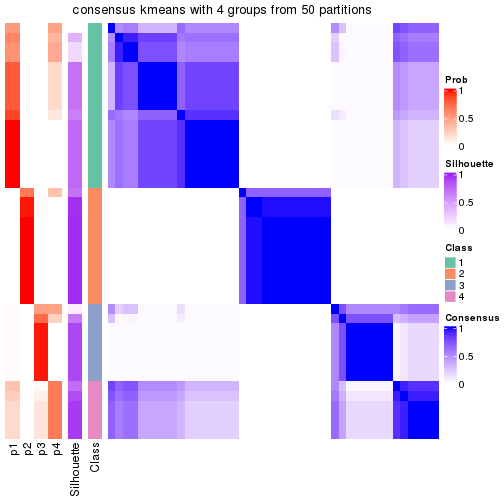</p>

</div>
<div id='tab-node-021-consensus-heatmap-4'>
<pre><code class="r">consensus_heatmap(res, k = 5)
</code></pre>

<p></p>

</div>
<div id='tab-node-021-consensus-heatmap-5'>
<pre><code class="r">consensus_heatmap(res, k = 6)
</code></pre>

<p></p>

</div>
<div id='tab-node-021-consensus-heatmap-6'>
<pre><code class="r">consensus_heatmap(res, k = 7)
</code></pre>

<p></p>

</div>
<div id='tab-node-021-consensus-heatmap-7'>
<pre><code class="r">consensus_heatmap(res, k = 8)
</code></pre>

<p></p>

</div>
</div>

Heatmaps for the membership of samples in all partitions to see how consistent they are:


<script>
$( function() {
	$( '#tabs-node-021-membership-heatmap' ).tabs();
} );
</script>
<div id='tabs-node-021-membership-heatmap'>
<ul>
<li><a href='#tab-node-021-membership-heatmap-1'>k = 2</a></li>
<li><a href='#tab-node-021-membership-heatmap-2'>k = 3</a></li>
<li><a href='#tab-node-021-membership-heatmap-3'>k = 4</a></li>
<li><a href='#tab-node-021-membership-heatmap-4'>k = 5</a></li>
<li><a href='#tab-node-021-membership-heatmap-5'>k = 6</a></li>
<li><a href='#tab-node-021-membership-heatmap-6'>k = 7</a></li>
<li><a href='#tab-node-021-membership-heatmap-7'>k = 8</a></li>
</ul>
<div id='tab-node-021-membership-heatmap-1'>
<pre><code class="r">membership_heatmap(res, k = 2)
</code></pre>

<p></p>

</div>
<div id='tab-node-021-membership-heatmap-2'>
<pre><code class="r">membership_heatmap(res, k = 3)
</code></pre>

<p></p>

</div>
<div id='tab-node-021-membership-heatmap-3'>
<pre><code class="r">membership_heatmap(res, k = 4)
</code></pre>

<p></p>

</div>
<div id='tab-node-021-membership-heatmap-4'>
<pre><code class="r">membership_heatmap(res, k = 5)
</code></pre>

<p></p>

</div>
<div id='tab-node-021-membership-heatmap-5'>
<pre><code class="r">membership_heatmap(res, k = 6)
</code></pre>

<p></p>

</div>
<div id='tab-node-021-membership-heatmap-6'>
<pre><code class="r">membership_heatmap(res, k = 7)
</code></pre>

<p></p>

</div>
<div id='tab-node-021-membership-heatmap-7'>
<pre><code class="r">membership_heatmap(res, k = 8)
</code></pre>

<p></p>

</div>
</div>

As soon as the classes for columns are determined, the signatures
that are significantly different between subgroups can be looked for. 
Following are the heatmaps for signatures.


<script>
$( function() {
	$( '#tabs-node-021-get-signatures' ).tabs();
} );
</script>
<div id='tabs-node-021-get-signatures'>
<ul>
<li><a href='#tab-node-021-get-signatures-1'>k = 2</a></li>
<li><a href='#tab-node-021-get-signatures-2'>k = 3</a></li>
<li><a href='#tab-node-021-get-signatures-3'>k = 4</a></li>
<li><a href='#tab-node-021-get-signatures-4'>k = 5</a></li>
<li><a href='#tab-node-021-get-signatures-5'>k = 6</a></li>
<li><a href='#tab-node-021-get-signatures-6'>k = 7</a></li>
<li><a href='#tab-node-021-get-signatures-7'>k = 8</a></li>
</ul>
<div id='tab-node-021-get-signatures-1'>
<pre><code class="r">get_signatures(res, k = 2)
</code></pre>

<p></p>

</div>
<div id='tab-node-021-get-signatures-2'>
<pre><code class="r">get_signatures(res, k = 3)
</code></pre>

<p></p>

</div>
<div id='tab-node-021-get-signatures-3'>
<pre><code class="r">get_signatures(res, k = 4)
</code></pre>

<p>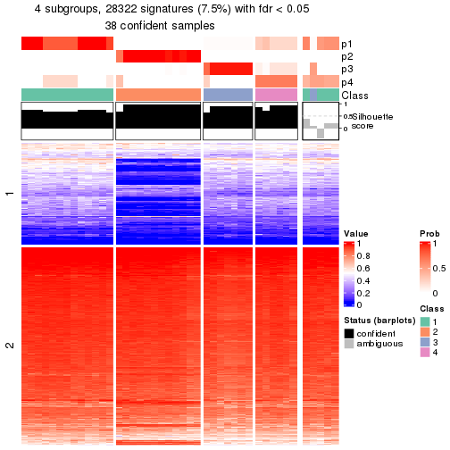</p>

</div>
<div id='tab-node-021-get-signatures-4'>
<pre><code class="r">get_signatures(res, k = 5)
</code></pre>

<p></p>

</div>
<div id='tab-node-021-get-signatures-5'>
<pre><code class="r">get_signatures(res, k = 6)
</code></pre>

<p></p>

</div>
<div id='tab-node-021-get-signatures-6'>
<pre><code class="r">get_signatures(res, k = 7)
</code></pre>

<p></p>

</div>
<div id='tab-node-021-get-signatures-7'>
<pre><code class="r">get_signatures(res, k = 8)
</code></pre>

<p></p>

</div>
</div>


Compare the overlap of signatures from different k:

```r
compare_signatures(res)
```


`get_signature()` returns a data frame invisibly. To get the list of signatures, the function
call should be assigned to a variable explicitly. In following code, if `plot` argument is set
to `FALSE`, no heatmap is plotted while only the differential analysis is performed.

```r
# code only for demonstration
tb = get_signature(res, k = ..., plot = FALSE)
```

An example of the output of `tb` is:

```
#>   which_row         fdr    mean_1    mean_2 scaled_mean_1 scaled_mean_2 km
#> 1        38 0.042760348  8.373488  9.131774    -0.5533452     0.5164555  1
#> 2        40 0.018707592  7.106213  8.469186    -0.6173731     0.5762149  1
#> 3        55 0.019134737 10.221463 11.207825    -0.6159697     0.5749050  1
#> 4        59 0.006059896  5.921854  7.869574    -0.6899429     0.6439467  1
#> 5        60 0.018055526  8.928898 10.211722    -0.6204761     0.5791110  1
#> 6        98 0.009384629 15.714769 14.887706     0.6635654    -0.6193277  2
...
```

The columns in `tb` are:

1. `which_row`: row indices corresponding to the input matrix.
2. `fdr`: FDR for the differential test. 
3. `mean_x`: The mean value in group x.
4. `scaled_mean_x`: The mean value in group x after rows are scaled.
5. `km`: Row groups if k-means clustering is applied to rows (which is done by automatically selecting number of clusters).

If there are too many signatures, `top_signatures = ...` can be set to only show the 
signatures with the highest FDRs:

```r
# code only for demonstration
# e.g. to show the top 500 most significant rows
tb = get_signature(res, k = ..., top_signatures = 500)
```

If the signatures are defined as these which are uniquely high in current group, `diff_method` argument
can be set to `"uniquely_high_in_one_group"`:

```r
# code only for demonstration
tb = get_signature(res, k = ..., diff_method = "uniquely_high_in_one_group")
```


UMAP plot which shows how samples are separated.


<script>
$( function() {
	$( '#tabs-node-021-dimension-reduction' ).tabs();
} );
</script>
<div id='tabs-node-021-dimension-reduction'>
<ul>
<li><a href='#tab-node-021-dimension-reduction-1'>k = 2</a></li>
<li><a href='#tab-node-021-dimension-reduction-2'>k = 3</a></li>
<li><a href='#tab-node-021-dimension-reduction-3'>k = 4</a></li>
<li><a href='#tab-node-021-dimension-reduction-4'>k = 5</a></li>
<li><a href='#tab-node-021-dimension-reduction-5'>k = 6</a></li>
<li><a href='#tab-node-021-dimension-reduction-6'>k = 7</a></li>
<li><a href='#tab-node-021-dimension-reduction-7'>k = 8</a></li>
</ul>
<div id='tab-node-021-dimension-reduction-1'>
<pre><code class="r">dimension_reduction(res, k = 2, method = &quot;UMAP&quot;)
</code></pre>

<p></p>

</div>
<div id='tab-node-021-dimension-reduction-2'>
<pre><code class="r">dimension_reduction(res, k = 3, method = &quot;UMAP&quot;)
</code></pre>

<p>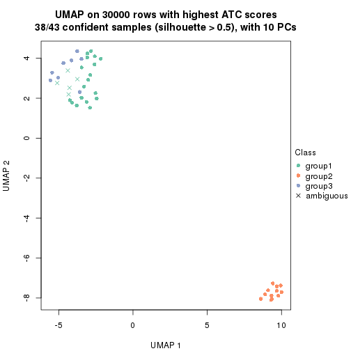</p>

</div>
<div id='tab-node-021-dimension-reduction-3'>
<pre><code class="r">dimension_reduction(res, k = 4, method = &quot;UMAP&quot;)
</code></pre>

<p></p>

</div>
<div id='tab-node-021-dimension-reduction-4'>
<pre><code class="r">dimension_reduction(res, k = 5, method = &quot;UMAP&quot;)
</code></pre>

<p></p>

</div>
<div id='tab-node-021-dimension-reduction-5'>
<pre><code class="r">dimension_reduction(res, k = 6, method = &quot;UMAP&quot;)
</code></pre>

<p></p>

</div>
<div id='tab-node-021-dimension-reduction-6'>
<pre><code class="r">dimension_reduction(res, k = 7, method = &quot;UMAP&quot;)
</code></pre>

<p></p>

</div>
<div id='tab-node-021-dimension-reduction-7'>
<pre><code class="r">dimension_reduction(res, k = 8, method = &quot;UMAP&quot;)
</code></pre>

<p></p>

</div>
</div>


Following heatmap shows how subgroups are split when increasing `k`:

```r
collect_classes(res)
```


If matrix rows can be associated to genes, consider to use `functional_enrichment(res,
...)` to perform function enrichment for the signature genes. See [this vignette](https://jokergoo.github.io/cola_vignettes/functional_enrichment.html) for more detailed explanations.


 

---------------------------------------------------


### Node022


Parent node: [Node02](#Node02).
Child nodes: 
                Node0111-leaf
        ,
                Node0112-leaf
        ,
                Node0113-leaf
        ,
                Node0114-leaf
        ,
                Node0131-leaf
        ,
                Node0132-leaf
        ,
                Node0133-leaf
        ,
                Node0141-leaf
        ,
                Node0142-leaf
        ,
                Node0143-leaf
        ,
                Node0211-leaf
        ,
                Node0212-leaf
        ,
                Node0221-leaf
        ,
                Node0222-leaf
        ,
                Node0223-leaf
        ,
                Node0224-leaf
        ,
                Node0231-leaf
        ,
                [Node0232](#Node0232)
        ,
                Node0233-leaf
        ,
                Node0234-leaf
        ,
                [Node0241](#Node0241)
        ,
                Node0242-leaf
        ,
                Node0243-leaf
        ,
                Node0244-leaf
        ,
                Node0251-leaf
        ,
                Node0252-leaf
        ,
                [Node0311](#Node0311)
        ,
                Node0312-leaf
        ,
                Node0313-leaf
        ,
                Node0331-leaf
        ,
                Node0332-leaf
        ,
                Node0333-leaf
        .


The object with results only for a single top-value method and a single partitioning method 
can be extracted as:

```r
res = res_rh["022"]
```

A summary of `res` and all the functions that can be applied to it:

```r
res
```

```
#> A 'ConsensusPartition' object with k = 2, 3, 4, 5, 6, 7, 8.
#>   On a matrix with 30000 rows and 45 columns.
#>   Top rows (1000) are extracted by 'ATC' method.
#>   Subgroups are detected by 'kmeans' method.
#>   Performed in total 350 partitions by row resampling.
#>   Best k for subgroups seems to be 2.
#> 
#> Following methods can be applied to this 'ConsensusPartition' object:
#>  [1] "cola_report"             "collect_classes"         "collect_plots"          
#>  [4] "collect_stats"           "colnames"                "compare_partitions"     
#>  [7] "compare_signatures"      "consensus_heatmap"       "dimension_reduction"    
#> [10] "functional_enrichment"   "get_anno_col"            "get_anno"               
#> [13] "get_classes"             "get_consensus"           "get_matrix"             
#> [16] "get_membership"          "get_param"               "get_signatures"         
#> [19] "get_stats"               "is_best_k"               "is_stable_k"            
#> [22] "membership_heatmap"      "ncol"                    "nrow"                   
#> [25] "plot_ecdf"               "predict_classes"         "rownames"               
#> [28] "select_partition_number" "show"                    "suggest_best_k"         
#> [31] "test_to_known_factors"   "top_rows_heatmap"
```

`collect_plots()` function collects all the plots made from `res` for all `k` (number of subgroups)
into one single page to provide an easy and fast comparison between different `k`.

```r
collect_plots(res)
```


The plots are:

- The first row: a plot of the eCDF (empirical cumulative distribution
  function) curves of the consensus matrix for each `k` and the heatmap of
  predicted classes for each `k`.
- The second row: heatmaps of the consensus matrix for each `k`.
- The third row: heatmaps of the membership matrix for each `k`.
- The fouth row: heatmaps of the signatures for each `k`.

All the plots in panels can be made by individual functions and they are
plotted later in this section.

`select_partition_number()` produces several plots showing different
statistics for choosing "optimized" `k`. There are following statistics:

- eCDF curves of the consensus matrix for each `k`;
- 1-PAC. [The PAC score](https://en.wikipedia.org/wiki/Consensus_clustering#Over-interpretation_potential_of_consensus_clustering)
  measures the proportion of the ambiguous subgrouping.
- Mean silhouette score.
- Concordance. The mean probability of fiting the consensus subgroup labels in all
  partitions.
- Area increased. Denote $A_k$ as the area under the eCDF curve for current
  `k`, the area increased is defined as $A_k - A_{k-1}$.
- Rand index. The percent of pairs of samples that are both in a same cluster
  or both are not in a same cluster in the partition of k and k-1.
- Jaccard index. The ratio of pairs of samples are both in a same cluster in
  the partition of k and k-1 and the pairs of samples are both in a same
  cluster in the partition k or k-1.

The detailed explanations of these statistics can be found in [the _cola_
vignette](https://jokergoo.github.io/cola_vignettes/cola.html#toc_13).

Generally speaking, higher 1-PAC score, higher mean silhouette score or higher
concordance corresponds to better partition. Rand index and Jaccard index
measure how similar the current partition is compared to partition with `k-1`.
If they are too similar, we won't accept `k` is better than `k-1`.

```r
select_partition_number(res)
```


The numeric values for all these statistics can be obtained by `get_stats()`.

```r
get_stats(res)
```

```
#>   k 1-PAC mean_silhouette concordance area_increased  Rand Jaccard
#> 2 2 1.000           1.000       1.000         0.3279 0.673   0.673
#> 3 3 0.746           0.900       0.898         0.7040 0.689   0.538
#> 4 4 0.726           0.953       0.934         0.1398 0.967   0.908
#> 5 5 0.984           0.916       0.952         0.0684 0.998   0.994
#> 6 6 0.931           0.859       0.921         0.0300 0.990   0.969
#> 7 7 0.801           0.826       0.903         0.0288 0.991   0.971
#> 8 8 0.800           0.720       0.865         0.0115 0.992   0.974
```

`suggest_best_k()` suggests the best $k$ based on these statistics. The rules are as follows:

- All $k$ with Jaccard index larger than 0.95 are removed because increasing
  $k$ does not provide enough extra information. If all $k$ are removed, it is
  marked as no subgroup is detected.
- For all $k$ with 1-PAC score larger than 0.9, the maximal $k$ is taken as
  the best $k$, and other $k$ are marked as optional $k$.
- If it does not fit the second rule. The $k$ with the maximal vote of the
  highest 1-PAC score, highest mean silhouette, and highest concordance is
  taken as the best $k$.

```r
suggest_best_k(res)
```

```
#> [1] 2
```


Following is the table of the partitions (You need to click the **show/hide
code output** link to see it). The membership matrix (columns with name `p*`)
is inferred by
[`clue::cl_consensus()`](https://www.rdocumentation.org/link/cl_consensus?package=clue)
function with the `SE` method. Basically the value in the membership matrix
represents the probability to belong to a certain group. The finall subgroup
label for an item is determined with the group with highest probability it
belongs to.

In `get_classes()` function, the entropy is calculated from the membership
matrix and the silhouette score is calculated from the consensus matrix.


<script>
$( function() {
	$( '#tabs-node-022-get-classes' ).tabs();
} );
</script>
<div id='tabs-node-022-get-classes'>
<ul>
<li><a href='#tab-node-022-get-classes-1'>k = 2</a></li>
<li><a href='#tab-node-022-get-classes-2'>k = 3</a></li>
<li><a href='#tab-node-022-get-classes-3'>k = 4</a></li>
<li><a href='#tab-node-022-get-classes-4'>k = 5</a></li>
<li><a href='#tab-node-022-get-classes-5'>k = 6</a></li>
<li><a href='#tab-node-022-get-classes-6'>k = 7</a></li>
<li><a href='#tab-node-022-get-classes-7'>k = 8</a></li>
</ul>

<div id='tab-node-022-get-classes-1'>
<p><a id='tab-node-022-get-classes-1-a' style='color:#0366d6' href='#'>show/hide code output</a></p>
<pre><code class="r">cbind(get_classes(res, k = 2), get_membership(res, k = 2))
</code></pre>

<pre><code>#&gt;                 class entropy silhouette p1 p2
#&gt; TCGA.EL.A4K2.01     2       0          1  0  1
#&gt; TCGA.EM.A4FH.01     1       0          1  1  0
#&gt; TCGA.DE.A4M9.01     1       0          1  1  0
#&gt; TCGA.KS.A41L.01     2       0          1  0  1
#&gt; TCGA.E8.A434.01     2       0          1  0  1
#&gt; TCGA.EL.A3ZH.01     2       0          1  0  1
#&gt; TCGA.EL.A3H2.01     1       0          1  1  0
#&gt; TCGA.BJ.A2N9.01     2       0          1  0  1
#&gt; TCGA.EM.A2CT.01     2       0          1  0  1
#&gt; TCGA.EM.A2CQ.01     2       0          1  0  1
#&gt; TCGA.EM.A2CJ.01     2       0          1  0  1
#&gt; TCGA.FY.A3NM.01     2       0          1  0  1
#&gt; TCGA.BJ.A291.01     2       0          1  0  1
#&gt; TCGA.EL.A3MY.11     1       0          1  1  0
#&gt; TCGA.ET.A25I.01     2       0          1  0  1
#&gt; TCGA.EM.A22N.01     2       0          1  0  1
#&gt; TCGA.EM.A3FL.01     2       0          1  0  1
#&gt; TCGA.EM.A2OW.01     2       0          1  0  1
#&gt; TCGA.BJ.A0ZC.01     1       0          1  1  0
#&gt; TCGA.EM.A2OV.01     2       0          1  0  1
#&gt; TCGA.EM.A3AI.01     2       0          1  0  1
#&gt; TCGA.EM.A2OY.01     2       0          1  0  1
#&gt; TCGA.BJ.A192.01     2       0          1  0  1
#&gt; TCGA.DJ.A3UZ.01     2       0          1  0  1
#&gt; TCGA.EM.A1CW.01     2       0          1  0  1
#&gt; TCGA.FY.A3WA.01     2       0          1  0  1
#&gt; TCGA.J8.A3YD.01     2       0          1  0  1
#&gt; TCGA.BJ.A190.01     1       0          1  1  0
#&gt; TCGA.DJ.A2Q0.01     2       0          1  0  1
#&gt; TCGA.EM.A1YC.01     2       0          1  0  1
#&gt; TCGA.EM.A2CO.01     2       0          1  0  1
#&gt; TCGA.ET.A3DS.01     2       0          1  0  1
#&gt; TCGA.EM.A1YE.01     2       0          1  0  1
#&gt; TCGA.DJ.A2Q2.01     2       0          1  0  1
#&gt; TCGA.EM.A1YA.01     2       0          1  0  1
#&gt; TCGA.EM.A1YD.01     2       0          1  0  1
#&gt; TCGA.EL.A3CZ.01     2       0          1  0  1
#&gt; TCGA.FY.A3R9.01     2       0          1  0  1
#&gt; TCGA.EM.A3O6.01     2       0          1  0  1
#&gt; TCGA.BJ.A0ZF.01     2       0          1  0  1
#&gt; TCGA.BJ.A0YZ.01     1       0          1  1  0
#&gt; TCGA.BJ.A0ZG.01     1       0          1  1  0
#&gt; TCGA.DJ.A13R.01     1       0          1  1  0
#&gt; TCGA.ET.A39N.01     2       0          1  0  1
#&gt; TCGA.FY.A3R7.01     2       0          1  0  1
</code></pre>

<script>
$('#tab-node-022-get-classes-1-a').parent().next().next().hide();
$('#tab-node-022-get-classes-1-a').click(function(){
  $('#tab-node-022-get-classes-1-a').parent().next().next().toggle();
  return(false);
});
</script>
</div>

<div id='tab-node-022-get-classes-2'>
<p><a id='tab-node-022-get-classes-2-a' style='color:#0366d6' href='#'>show/hide code output</a></p>
<pre><code class="r">cbind(get_classes(res, k = 3), get_membership(res, k = 3))
</code></pre>

<pre><code>#&gt;                 class entropy silhouette   p1   p2   p3
#&gt; TCGA.EL.A4K2.01     2   0.628      1.000 0.00 0.54 0.46
#&gt; TCGA.EM.A4FH.01     1   0.604      0.989 0.62 0.38 0.00
#&gt; TCGA.DE.A4M9.01     1   0.624      0.966 0.56 0.44 0.00
#&gt; TCGA.KS.A41L.01     3   0.604      0.635 0.38 0.00 0.62
#&gt; TCGA.E8.A434.01     2   0.628      1.000 0.00 0.54 0.46
#&gt; TCGA.EL.A3ZH.01     2   0.628      1.000 0.00 0.54 0.46
#&gt; TCGA.EL.A3H2.01     1   0.604      0.989 0.62 0.38 0.00
#&gt; TCGA.BJ.A2N9.01     2   0.628      1.000 0.00 0.54 0.46
#&gt; TCGA.EM.A2CT.01     2   0.628      1.000 0.00 0.54 0.46
#&gt; TCGA.EM.A2CQ.01     2   0.628      1.000 0.00 0.54 0.46
#&gt; TCGA.EM.A2CJ.01     3   0.000      0.718 0.00 0.00 1.00
#&gt; TCGA.FY.A3NM.01     3   0.000      0.718 0.00 0.00 1.00
#&gt; TCGA.BJ.A291.01     2   0.628      1.000 0.00 0.54 0.46
#&gt; TCGA.EL.A3MY.11     1   0.604      0.989 0.62 0.38 0.00
#&gt; TCGA.ET.A25I.01     2   0.628      1.000 0.00 0.54 0.46
#&gt; TCGA.EM.A22N.01     2   0.628      1.000 0.00 0.54 0.46
#&gt; TCGA.EM.A3FL.01     3   0.000      0.718 0.00 0.00 1.00
#&gt; TCGA.EM.A2OW.01     2   0.628      1.000 0.00 0.54 0.46
#&gt; TCGA.BJ.A0ZC.01     1   0.604      0.989 0.62 0.38 0.00
#&gt; TCGA.EM.A2OV.01     2   0.628      1.000 0.00 0.54 0.46
#&gt; TCGA.EM.A3AI.01     2   0.628      1.000 0.00 0.54 0.46
#&gt; TCGA.EM.A2OY.01     3   0.000      0.718 0.00 0.00 1.00
#&gt; TCGA.BJ.A192.01     3   0.296      0.719 0.10 0.00 0.90
#&gt; TCGA.DJ.A3UZ.01     2   0.628      1.000 0.00 0.54 0.46
#&gt; TCGA.EM.A1CW.01     2   0.628      1.000 0.00 0.54 0.46
#&gt; TCGA.FY.A3WA.01     3   0.604      0.635 0.38 0.00 0.62
#&gt; TCGA.J8.A3YD.01     2   0.628      1.000 0.00 0.54 0.46
#&gt; TCGA.BJ.A190.01     1   0.604      0.989 0.62 0.38 0.00
#&gt; TCGA.DJ.A2Q0.01     3   0.000      0.718 0.00 0.00 1.00
#&gt; TCGA.EM.A1YC.01     3   0.604      0.635 0.38 0.00 0.62
#&gt; TCGA.EM.A2CO.01     2   0.628      1.000 0.00 0.54 0.46
#&gt; TCGA.ET.A3DS.01     2   0.628      1.000 0.00 0.54 0.46
#&gt; TCGA.EM.A1YE.01     3   0.000      0.718 0.00 0.00 1.00
#&gt; TCGA.DJ.A2Q2.01     2   0.628      1.000 0.00 0.54 0.46
#&gt; TCGA.EM.A1YA.01     3   0.000      0.718 0.00 0.00 1.00
#&gt; TCGA.EM.A1YD.01     3   0.000      0.718 0.00 0.00 1.00
#&gt; TCGA.EL.A3CZ.01     2   0.628      1.000 0.00 0.54 0.46
#&gt; TCGA.FY.A3R9.01     2   0.628      1.000 0.00 0.54 0.46
#&gt; TCGA.EM.A3O6.01     2   0.628      1.000 0.00 0.54 0.46
#&gt; TCGA.BJ.A0ZF.01     3   0.604      0.635 0.38 0.00 0.62
#&gt; TCGA.BJ.A0YZ.01     1   0.624      0.966 0.56 0.44 0.00
#&gt; TCGA.BJ.A0ZG.01     1   0.604      0.989 0.62 0.38 0.00
#&gt; TCGA.DJ.A13R.01     1   0.613      0.981 0.60 0.40 0.00
#&gt; TCGA.ET.A39N.01     3   0.604      0.635 0.38 0.00 0.62
#&gt; TCGA.FY.A3R7.01     2   0.628      1.000 0.00 0.54 0.46
</code></pre>

<script>
$('#tab-node-022-get-classes-2-a').parent().next().next().hide();
$('#tab-node-022-get-classes-2-a').click(function(){
  $('#tab-node-022-get-classes-2-a').parent().next().next().toggle();
  return(false);
});
</script>
</div>

<div id='tab-node-022-get-classes-3'>
<p><a id='tab-node-022-get-classes-3-a' style='color:#0366d6' href='#'>show/hide code output</a></p>
<pre><code class="r">cbind(get_classes(res, k = 4), get_membership(res, k = 4))
</code></pre>

<pre><code>#&gt;                 class entropy silhouette   p1   p2   p3   p4
#&gt; TCGA.EL.A4K2.01     2  0.0000      0.991 0.00 1.00 0.00 0.00
#&gt; TCGA.EM.A4FH.01     1  0.0000      0.960 1.00 0.00 0.00 0.00
#&gt; TCGA.DE.A4M9.01     1  0.2921      0.891 0.86 0.00 0.00 0.14
#&gt; TCGA.KS.A41L.01     4  0.5512      0.922 0.00 0.04 0.30 0.66
#&gt; TCGA.E8.A434.01     2  0.0000      0.991 0.00 1.00 0.00 0.00
#&gt; TCGA.EL.A3ZH.01     2  0.0000      0.991 0.00 1.00 0.00 0.00
#&gt; TCGA.EL.A3H2.01     1  0.0000      0.960 1.00 0.00 0.00 0.00
#&gt; TCGA.BJ.A2N9.01     2  0.0707      0.989 0.00 0.98 0.00 0.02
#&gt; TCGA.EM.A2CT.01     2  0.0707      0.989 0.00 0.98 0.00 0.02
#&gt; TCGA.EM.A2CQ.01     2  0.0707      0.989 0.00 0.98 0.00 0.02
#&gt; TCGA.EM.A2CJ.01     3  0.2921      0.926 0.00 0.14 0.86 0.00
#&gt; TCGA.FY.A3NM.01     3  0.3172      0.943 0.00 0.16 0.84 0.00
#&gt; TCGA.BJ.A291.01     2  0.0000      0.991 0.00 1.00 0.00 0.00
#&gt; TCGA.EL.A3MY.11     1  0.0000      0.960 1.00 0.00 0.00 0.00
#&gt; TCGA.ET.A25I.01     2  0.0707      0.989 0.00 0.98 0.00 0.02
#&gt; TCGA.EM.A22N.01     2  0.0707      0.989 0.00 0.98 0.00 0.02
#&gt; TCGA.EM.A3FL.01     3  0.3172      0.943 0.00 0.16 0.84 0.00
#&gt; TCGA.EM.A2OW.01     2  0.0707      0.989 0.00 0.98 0.00 0.02
#&gt; TCGA.BJ.A0ZC.01     1  0.0000      0.960 1.00 0.00 0.00 0.00
#&gt; TCGA.EM.A2OV.01     2  0.0000      0.991 0.00 1.00 0.00 0.00
#&gt; TCGA.EM.A3AI.01     2  0.0707      0.989 0.00 0.98 0.00 0.02
#&gt; TCGA.EM.A2OY.01     3  0.3172      0.943 0.00 0.16 0.84 0.00
#&gt; TCGA.BJ.A192.01     3  0.2921      0.926 0.00 0.14 0.86 0.00
#&gt; TCGA.DJ.A3UZ.01     2  0.0000      0.991 0.00 1.00 0.00 0.00
#&gt; TCGA.EM.A1CW.01     2  0.0707      0.989 0.00 0.98 0.00 0.02
#&gt; TCGA.FY.A3WA.01     3  0.1913      0.753 0.00 0.04 0.94 0.02
#&gt; TCGA.J8.A3YD.01     2  0.0000      0.991 0.00 1.00 0.00 0.00
#&gt; TCGA.BJ.A190.01     1  0.0000      0.960 1.00 0.00 0.00 0.00
#&gt; TCGA.DJ.A2Q0.01     3  0.3172      0.943 0.00 0.16 0.84 0.00
#&gt; TCGA.EM.A1YC.01     3  0.1913      0.754 0.00 0.04 0.94 0.02
#&gt; TCGA.EM.A2CO.01     2  0.0707      0.989 0.00 0.98 0.00 0.02
#&gt; TCGA.ET.A3DS.01     2  0.0000      0.991 0.00 1.00 0.00 0.00
#&gt; TCGA.EM.A1YE.01     3  0.3172      0.943 0.00 0.16 0.84 0.00
#&gt; TCGA.DJ.A2Q2.01     2  0.0707      0.989 0.00 0.98 0.00 0.02
#&gt; TCGA.EM.A1YA.01     3  0.3172      0.943 0.00 0.16 0.84 0.00
#&gt; TCGA.EM.A1YD.01     3  0.3172      0.943 0.00 0.16 0.84 0.00
#&gt; TCGA.EL.A3CZ.01     2  0.0000      0.991 0.00 1.00 0.00 0.00
#&gt; TCGA.FY.A3R9.01     2  0.0000      0.991 0.00 1.00 0.00 0.00
#&gt; TCGA.EM.A3O6.01     2  0.0000      0.991 0.00 1.00 0.00 0.00
#&gt; TCGA.BJ.A0ZF.01     4  0.5512      0.922 0.00 0.04 0.30 0.66
#&gt; TCGA.BJ.A0YZ.01     1  0.2921      0.891 0.86 0.00 0.00 0.14
#&gt; TCGA.BJ.A0ZG.01     1  0.0000      0.960 1.00 0.00 0.00 0.00
#&gt; TCGA.DJ.A13R.01     1  0.2830      0.908 0.90 0.00 0.04 0.06
#&gt; TCGA.ET.A39N.01     4  0.4755      0.858 0.00 0.04 0.20 0.76
#&gt; TCGA.FY.A3R7.01     2  0.0000      0.991 0.00 1.00 0.00 0.00
</code></pre>

<script>
$('#tab-node-022-get-classes-3-a').parent().next().next().hide();
$('#tab-node-022-get-classes-3-a').click(function(){
  $('#tab-node-022-get-classes-3-a').parent().next().next().toggle();
  return(false);
});
</script>
</div>

<div id='tab-node-022-get-classes-4'>
<p><a id='tab-node-022-get-classes-4-a' style='color:#0366d6' href='#'>show/hide code output</a></p>
<pre><code class="r">cbind(get_classes(res, k = 5), get_membership(res, k = 5))
</code></pre>

<pre><code>#&gt;                 class entropy silhouette   p1   p2   p3   p4   p5
#&gt; TCGA.EL.A4K2.01     2  0.0000      0.991 0.00 1.00 0.00 0.00 0.00
#&gt; TCGA.EM.A4FH.01     1  0.0609      0.941 0.98 0.00 0.00 0.00 0.02
#&gt; TCGA.DE.A4M9.01     1  0.3109      0.821 0.80 0.00 0.00 0.20 0.00
#&gt; TCGA.KS.A41L.01     4  0.5689      1.000 0.00 0.00 0.08 0.48 0.44
#&gt; TCGA.E8.A434.01     2  0.0000      0.991 0.00 1.00 0.00 0.00 0.00
#&gt; TCGA.EL.A3ZH.01     2  0.0609      0.989 0.00 0.98 0.00 0.02 0.00
#&gt; TCGA.EL.A3H2.01     1  0.0000      0.942 1.00 0.00 0.00 0.00 0.00
#&gt; TCGA.BJ.A2N9.01     2  0.0000      0.991 0.00 1.00 0.00 0.00 0.00
#&gt; TCGA.EM.A2CT.01     2  0.0609      0.989 0.00 0.98 0.00 0.02 0.00
#&gt; TCGA.EM.A2CQ.01     2  0.0609      0.989 0.00 0.98 0.00 0.02 0.00
#&gt; TCGA.EM.A2CJ.01     3  0.1648      0.906 0.00 0.02 0.94 0.04 0.00
#&gt; TCGA.FY.A3NM.01     3  0.0609      0.922 0.00 0.02 0.98 0.00 0.00
#&gt; TCGA.BJ.A291.01     2  0.0000      0.991 0.00 1.00 0.00 0.00 0.00
#&gt; TCGA.EL.A3MY.11     1  0.0000      0.942 1.00 0.00 0.00 0.00 0.00
#&gt; TCGA.ET.A25I.01     2  0.0609      0.989 0.00 0.98 0.00 0.02 0.00
#&gt; TCGA.EM.A22N.01     2  0.0609      0.989 0.00 0.98 0.00 0.02 0.00
#&gt; TCGA.EM.A3FL.01     3  0.0609      0.922 0.00 0.02 0.98 0.00 0.00
#&gt; TCGA.EM.A2OW.01     2  0.0000      0.991 0.00 1.00 0.00 0.00 0.00
#&gt; TCGA.BJ.A0ZC.01     1  0.0609      0.941 0.98 0.00 0.00 0.00 0.02
#&gt; TCGA.EM.A2OV.01     2  0.0000      0.991 0.00 1.00 0.00 0.00 0.00
#&gt; TCGA.EM.A3AI.01     2  0.0609      0.989 0.00 0.98 0.00 0.02 0.00
#&gt; TCGA.EM.A2OY.01     3  0.1648      0.906 0.00 0.02 0.94 0.04 0.00
#&gt; TCGA.BJ.A192.01     3  0.0000      0.903 0.00 0.00 1.00 0.00 0.00
#&gt; TCGA.DJ.A3UZ.01     2  0.0000      0.991 0.00 1.00 0.00 0.00 0.00
#&gt; TCGA.EM.A1CW.01     2  0.0000      0.991 0.00 1.00 0.00 0.00 0.00
#&gt; TCGA.FY.A3WA.01     3  0.4287      0.219 0.00 0.00 0.54 0.46 0.00
#&gt; TCGA.J8.A3YD.01     2  0.0000      0.991 0.00 1.00 0.00 0.00 0.00
#&gt; TCGA.BJ.A190.01     1  0.0609      0.941 0.98 0.00 0.00 0.00 0.02
#&gt; TCGA.DJ.A2Q0.01     3  0.0609      0.922 0.00 0.02 0.98 0.00 0.00
#&gt; TCGA.EM.A1YC.01     3  0.2732      0.782 0.00 0.00 0.84 0.16 0.00
#&gt; TCGA.EM.A2CO.01     2  0.0000      0.991 0.00 1.00 0.00 0.00 0.00
#&gt; TCGA.ET.A3DS.01     2  0.0609      0.989 0.00 0.98 0.00 0.02 0.00
#&gt; TCGA.EM.A1YE.01     3  0.0609      0.922 0.00 0.02 0.98 0.00 0.00
#&gt; TCGA.DJ.A2Q2.01     2  0.0609      0.989 0.00 0.98 0.00 0.02 0.00
#&gt; TCGA.EM.A1YA.01     3  0.0609      0.922 0.00 0.02 0.98 0.00 0.00
#&gt; TCGA.EM.A1YD.01     3  0.0609      0.922 0.00 0.02 0.98 0.00 0.00
#&gt; TCGA.EL.A3CZ.01     2  0.0000      0.991 0.00 1.00 0.00 0.00 0.00
#&gt; TCGA.FY.A3R9.01     2  0.0609      0.989 0.00 0.98 0.00 0.02 0.00
#&gt; TCGA.EM.A3O6.01     2  0.0609      0.989 0.00 0.98 0.00 0.02 0.00
#&gt; TCGA.BJ.A0ZF.01     4  0.5689      1.000 0.00 0.00 0.08 0.48 0.44
#&gt; TCGA.BJ.A0YZ.01     1  0.3109      0.821 0.80 0.00 0.00 0.20 0.00
#&gt; TCGA.BJ.A0ZG.01     1  0.0000      0.942 1.00 0.00 0.00 0.00 0.00
#&gt; TCGA.DJ.A13R.01     1  0.1043      0.922 0.96 0.00 0.00 0.04 0.00
#&gt; TCGA.ET.A39N.01     5  0.0609      0.000 0.00 0.00 0.02 0.00 0.98
#&gt; TCGA.FY.A3R7.01     2  0.0000      0.991 0.00 1.00 0.00 0.00 0.00
</code></pre>

<script>
$('#tab-node-022-get-classes-4-a').parent().next().next().hide();
$('#tab-node-022-get-classes-4-a').click(function(){
  $('#tab-node-022-get-classes-4-a').parent().next().next().toggle();
  return(false);
});
</script>
</div>

<div id='tab-node-022-get-classes-5'>
<p><a id='tab-node-022-get-classes-5-a' style='color:#0366d6' href='#'>show/hide code output</a></p>
<pre><code class="r">cbind(get_classes(res, k = 6), get_membership(res, k = 6))
</code></pre>

<pre><code>#&gt;                 class entropy silhouette   p1   p2   p3   p4   p5   p6
#&gt; TCGA.EL.A4K2.01     2  0.0937     0.9641 0.00 0.96 0.00 0.00 0.00 0.04
#&gt; TCGA.EM.A4FH.01     1  0.0000     0.9084 1.00 0.00 0.00 0.00 0.00 0.00
#&gt; TCGA.DE.A4M9.01     1  0.3409     0.7081 0.70 0.00 0.00 0.00 0.30 0.00
#&gt; TCGA.KS.A41L.01     4  0.1556     1.0000 0.00 0.00 0.08 0.92 0.00 0.00
#&gt; TCGA.E8.A434.01     2  0.0547     0.9629 0.00 0.98 0.00 0.00 0.00 0.02
#&gt; TCGA.EL.A3ZH.01     2  0.0937     0.9621 0.00 0.96 0.00 0.00 0.00 0.04
#&gt; TCGA.EL.A3H2.01     1  0.0547     0.9084 0.98 0.00 0.00 0.00 0.00 0.02
#&gt; TCGA.BJ.A2N9.01     2  0.1480     0.9584 0.00 0.94 0.00 0.00 0.02 0.04
#&gt; TCGA.EM.A2CT.01     2  0.1807     0.9516 0.00 0.92 0.00 0.00 0.02 0.06
#&gt; TCGA.EM.A2CQ.01     2  0.1807     0.9516 0.00 0.92 0.00 0.00 0.02 0.06
#&gt; TCGA.EM.A2CJ.01     3  0.2728     0.7460 0.00 0.00 0.86 0.00 0.04 0.10
#&gt; TCGA.FY.A3NM.01     3  0.0000     0.8897 0.00 0.00 1.00 0.00 0.00 0.00
#&gt; TCGA.BJ.A291.01     2  0.2094     0.9545 0.00 0.90 0.00 0.00 0.02 0.08
#&gt; TCGA.EL.A3MY.11     1  0.0547     0.9084 0.98 0.00 0.00 0.00 0.00 0.02
#&gt; TCGA.ET.A25I.01     2  0.1807     0.9516 0.00 0.92 0.00 0.00 0.02 0.06
#&gt; TCGA.EM.A22N.01     2  0.1480     0.9600 0.00 0.94 0.00 0.00 0.02 0.04
#&gt; TCGA.EM.A3FL.01     3  0.0000     0.8897 0.00 0.00 1.00 0.00 0.00 0.00
#&gt; TCGA.EM.A2OW.01     2  0.0547     0.9647 0.00 0.98 0.00 0.00 0.00 0.02
#&gt; TCGA.BJ.A0ZC.01     1  0.0000     0.9084 1.00 0.00 0.00 0.00 0.00 0.00
#&gt; TCGA.EM.A2OV.01     2  0.0547     0.9647 0.00 0.98 0.00 0.00 0.00 0.02
#&gt; TCGA.EM.A3AI.01     2  0.1480     0.9546 0.00 0.94 0.00 0.00 0.02 0.04
#&gt; TCGA.EM.A2OY.01     3  0.2728     0.7460 0.00 0.00 0.86 0.00 0.04 0.10
#&gt; TCGA.BJ.A192.01     3  0.0000     0.8897 0.00 0.00 1.00 0.00 0.00 0.00
#&gt; TCGA.DJ.A3UZ.01     2  0.0547     0.9629 0.00 0.98 0.00 0.00 0.00 0.02
#&gt; TCGA.EM.A1CW.01     2  0.0547     0.9647 0.00 0.98 0.00 0.00 0.00 0.02
#&gt; TCGA.FY.A3WA.01     6  0.5569     0.0000 0.00 0.00 0.28 0.18 0.00 0.54
#&gt; TCGA.J8.A3YD.01     2  0.0547     0.9629 0.00 0.98 0.00 0.00 0.00 0.02
#&gt; TCGA.BJ.A190.01     1  0.0000     0.9084 1.00 0.00 0.00 0.00 0.00 0.00
#&gt; TCGA.DJ.A2Q0.01     3  0.0000     0.8897 0.00 0.00 1.00 0.00 0.00 0.00
#&gt; TCGA.EM.A1YC.01     3  0.5120     0.0989 0.00 0.00 0.60 0.00 0.12 0.28
#&gt; TCGA.EM.A2CO.01     2  0.0547     0.9647 0.00 0.98 0.00 0.00 0.00 0.02
#&gt; TCGA.ET.A3DS.01     2  0.0000     0.9647 0.00 1.00 0.00 0.00 0.00 0.00
#&gt; TCGA.EM.A1YE.01     3  0.0000     0.8897 0.00 0.00 1.00 0.00 0.00 0.00
#&gt; TCGA.DJ.A2Q2.01     2  0.1092     0.9614 0.00 0.96 0.00 0.00 0.02 0.02
#&gt; TCGA.EM.A1YA.01     3  0.0000     0.8897 0.00 0.00 1.00 0.00 0.00 0.00
#&gt; TCGA.EM.A1YD.01     3  0.0000     0.8897 0.00 0.00 1.00 0.00 0.00 0.00
#&gt; TCGA.EL.A3CZ.01     2  0.1807     0.9536 0.00 0.92 0.00 0.00 0.02 0.06
#&gt; TCGA.FY.A3R9.01     2  0.0547     0.9629 0.00 0.98 0.00 0.00 0.00 0.02
#&gt; TCGA.EM.A3O6.01     2  0.0547     0.9629 0.00 0.98 0.00 0.00 0.00 0.02
#&gt; TCGA.BJ.A0ZF.01     4  0.1556     1.0000 0.00 0.00 0.08 0.92 0.00 0.00
#&gt; TCGA.BJ.A0YZ.01     1  0.3819     0.7081 0.70 0.00 0.00 0.00 0.28 0.02
#&gt; TCGA.BJ.A0ZG.01     1  0.0547     0.9084 0.98 0.00 0.00 0.00 0.00 0.02
#&gt; TCGA.DJ.A13R.01     1  0.2725     0.8436 0.88 0.00 0.00 0.04 0.02 0.06
#&gt; TCGA.ET.A39N.01     5  0.5708     0.0000 0.00 0.00 0.02 0.38 0.50 0.10
#&gt; TCGA.FY.A3R7.01     2  0.0547     0.9629 0.00 0.98 0.00 0.00 0.00 0.02
</code></pre>

<script>
$('#tab-node-022-get-classes-5-a').parent().next().next().hide();
$('#tab-node-022-get-classes-5-a').click(function(){
  $('#tab-node-022-get-classes-5-a').parent().next().next().toggle();
  return(false);
});
</script>
</div>

<div id='tab-node-022-get-classes-6'>
<p><a id='tab-node-022-get-classes-6-a' style='color:#0366d6' href='#'>show/hide code output</a></p>
<pre><code class="r">cbind(get_classes(res, k = 7), get_membership(res, k = 7))
</code></pre>

<pre><code>#&gt;                 class entropy silhouette   p1   p2   p3  p4   p5   p6   p7
#&gt; TCGA.EL.A4K2.01     2  0.1166      0.936 0.00 0.94 0.00 0.0 0.00 0.06 0.00
#&gt; TCGA.EM.A4FH.01     1  0.0504      0.860 0.98 0.00 0.00 0.0 0.00 0.00 0.02
#&gt; TCGA.DE.A4M9.01     1  0.3558      0.460 0.52 0.00 0.00 0.0 0.48 0.00 0.00
#&gt; TCGA.KS.A41L.01     4  0.0000      1.000 0.00 0.00 0.00 1.0 0.00 0.00 0.00
#&gt; TCGA.E8.A434.01     2  0.0863      0.925 0.00 0.96 0.00 0.0 0.00 0.04 0.00
#&gt; TCGA.EL.A3ZH.01     2  0.1671      0.933 0.00 0.90 0.00 0.0 0.00 0.10 0.00
#&gt; TCGA.EL.A3H2.01     1  0.0000      0.861 1.00 0.00 0.00 0.0 0.00 0.00 0.00
#&gt; TCGA.BJ.A2N9.01     2  0.2376      0.921 0.00 0.86 0.00 0.0 0.00 0.12 0.02
#&gt; TCGA.EM.A2CT.01     2  0.2081      0.921 0.00 0.86 0.00 0.0 0.00 0.14 0.00
#&gt; TCGA.EM.A2CQ.01     2  0.1886      0.925 0.00 0.88 0.00 0.0 0.00 0.12 0.00
#&gt; TCGA.EM.A2CJ.01     3  0.3208      0.721 0.00 0.00 0.82 0.0 0.04 0.02 0.12
#&gt; TCGA.FY.A3NM.01     3  0.0000      0.923 0.00 0.00 1.00 0.0 0.00 0.00 0.00
#&gt; TCGA.BJ.A291.01     2  0.2081      0.931 0.00 0.86 0.00 0.0 0.00 0.14 0.00
#&gt; TCGA.EL.A3MY.11     1  0.0000      0.861 1.00 0.00 0.00 0.0 0.00 0.00 0.00
#&gt; TCGA.ET.A25I.01     2  0.2081      0.921 0.00 0.86 0.00 0.0 0.00 0.14 0.00
#&gt; TCGA.EM.A22N.01     2  0.1886      0.925 0.00 0.88 0.00 0.0 0.00 0.12 0.00
#&gt; TCGA.EM.A3FL.01     3  0.0504      0.908 0.00 0.00 0.98 0.0 0.00 0.00 0.02
#&gt; TCGA.EM.A2OW.01     2  0.1433      0.929 0.00 0.92 0.00 0.0 0.00 0.08 0.00
#&gt; TCGA.BJ.A0ZC.01     1  0.0504      0.860 0.98 0.00 0.00 0.0 0.00 0.00 0.02
#&gt; TCGA.EM.A2OV.01     2  0.1166      0.933 0.00 0.94 0.00 0.0 0.00 0.06 0.00
#&gt; TCGA.EM.A3AI.01     2  0.1928      0.926 0.00 0.90 0.00 0.0 0.00 0.08 0.02
#&gt; TCGA.EM.A2OY.01     3  0.3208      0.721 0.00 0.00 0.82 0.0 0.04 0.02 0.12
#&gt; TCGA.BJ.A192.01     3  0.0000      0.923 0.00 0.00 1.00 0.0 0.00 0.00 0.00
#&gt; TCGA.DJ.A3UZ.01     2  0.0863      0.925 0.00 0.96 0.00 0.0 0.00 0.04 0.00
#&gt; TCGA.EM.A1CW.01     2  0.1671      0.928 0.00 0.90 0.00 0.0 0.00 0.10 0.00
#&gt; TCGA.FY.A3WA.01     6  0.5990      0.000 0.00 0.00 0.14 0.1 0.02 0.60 0.14
#&gt; TCGA.J8.A3YD.01     2  0.0863      0.925 0.00 0.96 0.00 0.0 0.00 0.04 0.00
#&gt; TCGA.BJ.A190.01     1  0.0504      0.860 0.98 0.00 0.00 0.0 0.00 0.00 0.02
#&gt; TCGA.DJ.A2Q0.01     3  0.0000      0.923 0.00 0.00 1.00 0.0 0.00 0.00 0.00
#&gt; TCGA.EM.A1YC.01     7  0.3459      0.000 0.00 0.00 0.40 0.0 0.00 0.00 0.60
#&gt; TCGA.EM.A2CO.01     2  0.1433      0.929 0.00 0.92 0.00 0.0 0.00 0.08 0.00
#&gt; TCGA.ET.A3DS.01     2  0.1363      0.928 0.00 0.94 0.00 0.0 0.00 0.04 0.02
#&gt; TCGA.EM.A1YE.01     3  0.0000      0.923 0.00 0.00 1.00 0.0 0.00 0.00 0.00
#&gt; TCGA.DJ.A2Q2.01     2  0.1928      0.926 0.00 0.90 0.00 0.0 0.00 0.08 0.02
#&gt; TCGA.EM.A1YA.01     3  0.0000      0.923 0.00 0.00 1.00 0.0 0.00 0.00 0.00
#&gt; TCGA.EM.A1YD.01     3  0.0000      0.923 0.00 0.00 1.00 0.0 0.00 0.00 0.00
#&gt; TCGA.EL.A3CZ.01     2  0.1433      0.927 0.00 0.92 0.00 0.0 0.00 0.08 0.00
#&gt; TCGA.FY.A3R9.01     2  0.1166      0.929 0.00 0.94 0.00 0.0 0.00 0.06 0.00
#&gt; TCGA.EM.A3O6.01     2  0.1433      0.930 0.00 0.92 0.00 0.0 0.00 0.08 0.00
#&gt; TCGA.BJ.A0ZF.01     4  0.0000      1.000 0.00 0.00 0.00 1.0 0.00 0.00 0.00
#&gt; TCGA.BJ.A0YZ.01     1  0.3558      0.460 0.52 0.00 0.00 0.0 0.48 0.00 0.00
#&gt; TCGA.BJ.A0ZG.01     1  0.0000      0.861 1.00 0.00 0.00 0.0 0.00 0.00 0.00
#&gt; TCGA.DJ.A13R.01     1  0.1928      0.809 0.90 0.00 0.00 0.0 0.00 0.02 0.08
#&gt; TCGA.ET.A39N.01     5  0.6559      0.000 0.00 0.00 0.00 0.2 0.46 0.20 0.14
#&gt; TCGA.FY.A3R7.01     2  0.0863      0.925 0.00 0.96 0.00 0.0 0.00 0.04 0.00
</code></pre>

<script>
$('#tab-node-022-get-classes-6-a').parent().next().next().hide();
$('#tab-node-022-get-classes-6-a').click(function(){
  $('#tab-node-022-get-classes-6-a').parent().next().next().toggle();
  return(false);
});
</script>
</div>

<div id='tab-node-022-get-classes-7'>
<p><a id='tab-node-022-get-classes-7-a' style='color:#0366d6' href='#'>show/hide code output</a></p>
<pre><code class="r">cbind(get_classes(res, k = 8), get_membership(res, k = 8))
</code></pre>

<pre><code>#&gt;                 class entropy silhouette   p1   p2   p3   p4   p5   p6   p7   p8
#&gt; TCGA.EL.A4K2.01     2  0.1341      0.913 0.00 0.92 0.00 0.00 0.00 0.00 0.08 0.00
#&gt; TCGA.EM.A4FH.01     1  0.0941      0.721 0.96 0.00 0.00 0.00 0.02 0.02 0.00 0.00
#&gt; TCGA.DE.A4M9.01     1  0.4403     -0.916 0.48 0.00 0.00 0.00 0.08 0.00 0.00 0.44
#&gt; TCGA.KS.A41L.01     4  0.2265      0.891 0.00 0.00 0.02 0.88 0.00 0.00 0.02 0.08
#&gt; TCGA.E8.A434.01     2  0.0000      0.908 0.00 1.00 0.00 0.00 0.00 0.00 0.00 0.00
#&gt; TCGA.EL.A3ZH.01     2  0.1091      0.908 0.00 0.94 0.00 0.00 0.00 0.00 0.06 0.00
#&gt; TCGA.EL.A3H2.01     1  0.1408      0.726 0.94 0.00 0.00 0.02 0.02 0.02 0.00 0.00
#&gt; TCGA.BJ.A2N9.01     2  0.2406      0.899 0.00 0.80 0.00 0.00 0.00 0.00 0.20 0.00
#&gt; TCGA.EM.A2CT.01     2  0.2406      0.899 0.00 0.80 0.00 0.00 0.00 0.00 0.20 0.00
#&gt; TCGA.EM.A2CQ.01     2  0.2406      0.899 0.00 0.80 0.00 0.00 0.00 0.00 0.20 0.00
#&gt; TCGA.EM.A2CJ.01     3  0.3880      0.468 0.00 0.00 0.64 0.00 0.02 0.02 0.00 0.32
#&gt; TCGA.FY.A3NM.01     3  0.2265      0.749 0.00 0.00 0.88 0.00 0.02 0.02 0.00 0.08
#&gt; TCGA.BJ.A291.01     2  0.0471      0.910 0.00 0.98 0.00 0.00 0.00 0.00 0.02 0.00
#&gt; TCGA.EL.A3MY.11     1  0.1408      0.726 0.94 0.00 0.00 0.02 0.02 0.02 0.00 0.00
#&gt; TCGA.ET.A25I.01     2  0.2406      0.899 0.00 0.80 0.00 0.00 0.00 0.00 0.20 0.00
#&gt; TCGA.EM.A22N.01     2  0.2406      0.899 0.00 0.80 0.00 0.00 0.00 0.00 0.20 0.00
#&gt; TCGA.EM.A3FL.01     3  0.0471      0.841 0.00 0.00 0.98 0.00 0.00 0.00 0.00 0.02
#&gt; TCGA.EM.A2OW.01     2  0.1947      0.908 0.00 0.86 0.00 0.00 0.00 0.00 0.14 0.00
#&gt; TCGA.BJ.A0ZC.01     1  0.0941      0.721 0.96 0.00 0.00 0.00 0.02 0.02 0.00 0.00
#&gt; TCGA.EM.A2OV.01     2  0.1563      0.916 0.00 0.90 0.00 0.00 0.00 0.00 0.10 0.00
#&gt; TCGA.EM.A3AI.01     2  0.2114      0.908 0.00 0.84 0.00 0.00 0.00 0.00 0.16 0.00
#&gt; TCGA.EM.A2OY.01     3  0.3808      0.500 0.00 0.00 0.66 0.00 0.02 0.02 0.00 0.30
#&gt; TCGA.BJ.A192.01     3  0.0471      0.841 0.00 0.00 0.98 0.00 0.00 0.02 0.00 0.00
#&gt; TCGA.DJ.A3UZ.01     2  0.0000      0.908 0.00 1.00 0.00 0.00 0.00 0.00 0.00 0.00
#&gt; TCGA.EM.A1CW.01     2  0.2406      0.899 0.00 0.80 0.00 0.00 0.00 0.00 0.20 0.00
#&gt; TCGA.FY.A3WA.01     6  0.2350      0.000 0.00 0.00 0.10 0.04 0.00 0.86 0.00 0.00
#&gt; TCGA.J8.A3YD.01     2  0.0000      0.908 0.00 1.00 0.00 0.00 0.00 0.00 0.00 0.00
#&gt; TCGA.BJ.A190.01     1  0.0941      0.721 0.96 0.00 0.00 0.00 0.02 0.02 0.00 0.00
#&gt; TCGA.DJ.A2Q0.01     3  0.0000      0.849 0.00 0.00 1.00 0.00 0.00 0.00 0.00 0.00
#&gt; TCGA.EM.A1YC.01     7  0.4489      0.000 0.00 0.00 0.26 0.00 0.04 0.06 0.64 0.00
#&gt; TCGA.EM.A2CO.01     2  0.1947      0.908 0.00 0.86 0.00 0.00 0.00 0.00 0.14 0.00
#&gt; TCGA.ET.A3DS.01     2  0.0000      0.908 0.00 1.00 0.00 0.00 0.00 0.00 0.00 0.00
#&gt; TCGA.EM.A1YE.01     3  0.0000      0.849 0.00 0.00 1.00 0.00 0.00 0.00 0.00 0.00
#&gt; TCGA.DJ.A2Q2.01     2  0.1947      0.910 0.00 0.86 0.00 0.00 0.00 0.00 0.14 0.00
#&gt; TCGA.EM.A1YA.01     3  0.0471      0.841 0.00 0.00 0.98 0.00 0.00 0.02 0.00 0.00
#&gt; TCGA.EM.A1YD.01     3  0.0000      0.849 0.00 0.00 1.00 0.00 0.00 0.00 0.00 0.00
#&gt; TCGA.EL.A3CZ.01     2  0.0000      0.908 0.00 1.00 0.00 0.00 0.00 0.00 0.00 0.00
#&gt; TCGA.FY.A3R9.01     2  0.0000      0.908 0.00 1.00 0.00 0.00 0.00 0.00 0.00 0.00
#&gt; TCGA.EM.A3O6.01     2  0.1091      0.908 0.00 0.94 0.00 0.00 0.00 0.00 0.06 0.00
#&gt; TCGA.BJ.A0ZF.01     4  0.0471      0.891 0.00 0.00 0.02 0.98 0.00 0.00 0.00 0.00
#&gt; TCGA.BJ.A0YZ.01     8  0.3737      0.000 0.48 0.00 0.00 0.00 0.00 0.00 0.02 0.50
#&gt; TCGA.BJ.A0ZG.01     1  0.1408      0.726 0.94 0.00 0.00 0.02 0.02 0.02 0.00 0.00
#&gt; TCGA.DJ.A13R.01     1  0.3720      0.445 0.78 0.00 0.00 0.00 0.02 0.06 0.12 0.02
#&gt; TCGA.ET.A39N.01     5  0.2534      0.000 0.00 0.00 0.00 0.22 0.78 0.00 0.00 0.00
#&gt; TCGA.FY.A3R7.01     2  0.0000      0.908 0.00 1.00 0.00 0.00 0.00 0.00 0.00 0.00
</code></pre>

<script>
$('#tab-node-022-get-classes-7-a').parent().next().next().hide();
$('#tab-node-022-get-classes-7-a').click(function(){
  $('#tab-node-022-get-classes-7-a').parent().next().next().toggle();
  return(false);
});
</script>
</div>
</div>

Heatmaps for the consensus matrix. It visualizes the probability of two
samples to be in a same group.


<script>
$( function() {
	$( '#tabs-node-022-consensus-heatmap' ).tabs();
} );
</script>
<div id='tabs-node-022-consensus-heatmap'>
<ul>
<li><a href='#tab-node-022-consensus-heatmap-1'>k = 2</a></li>
<li><a href='#tab-node-022-consensus-heatmap-2'>k = 3</a></li>
<li><a href='#tab-node-022-consensus-heatmap-3'>k = 4</a></li>
<li><a href='#tab-node-022-consensus-heatmap-4'>k = 5</a></li>
<li><a href='#tab-node-022-consensus-heatmap-5'>k = 6</a></li>
<li><a href='#tab-node-022-consensus-heatmap-6'>k = 7</a></li>
<li><a href='#tab-node-022-consensus-heatmap-7'>k = 8</a></li>
</ul>
<div id='tab-node-022-consensus-heatmap-1'>
<pre><code class="r">consensus_heatmap(res, k = 2)
</code></pre>

<p></p>

</div>
<div id='tab-node-022-consensus-heatmap-2'>
<pre><code class="r">consensus_heatmap(res, k = 3)
</code></pre>

<p></p>

</div>
<div id='tab-node-022-consensus-heatmap-3'>
<pre><code class="r">consensus_heatmap(res, k = 4)
</code></pre>

<p></p>

</div>
<div id='tab-node-022-consensus-heatmap-4'>
<pre><code class="r">consensus_heatmap(res, k = 5)
</code></pre>

<p></p>

</div>
<div id='tab-node-022-consensus-heatmap-5'>
<pre><code class="r">consensus_heatmap(res, k = 6)
</code></pre>

<p>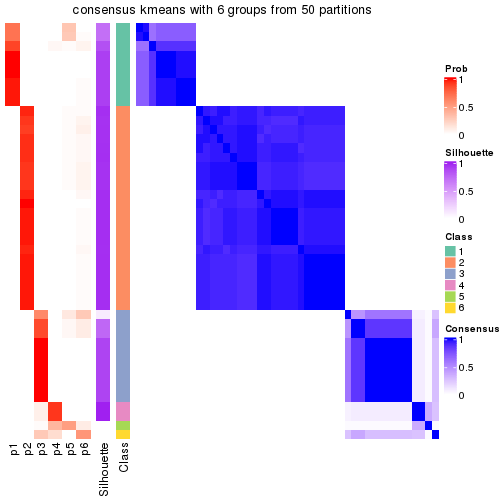</p>

</div>
<div id='tab-node-022-consensus-heatmap-6'>
<pre><code class="r">consensus_heatmap(res, k = 7)
</code></pre>

<p></p>

</div>
<div id='tab-node-022-consensus-heatmap-7'>
<pre><code class="r">consensus_heatmap(res, k = 8)
</code></pre>

<p></p>

</div>
</div>

Heatmaps for the membership of samples in all partitions to see how consistent they are:


<script>
$( function() {
	$( '#tabs-node-022-membership-heatmap' ).tabs();
} );
</script>
<div id='tabs-node-022-membership-heatmap'>
<ul>
<li><a href='#tab-node-022-membership-heatmap-1'>k = 2</a></li>
<li><a href='#tab-node-022-membership-heatmap-2'>k = 3</a></li>
<li><a href='#tab-node-022-membership-heatmap-3'>k = 4</a></li>
<li><a href='#tab-node-022-membership-heatmap-4'>k = 5</a></li>
<li><a href='#tab-node-022-membership-heatmap-5'>k = 6</a></li>
<li><a href='#tab-node-022-membership-heatmap-6'>k = 7</a></li>
<li><a href='#tab-node-022-membership-heatmap-7'>k = 8</a></li>
</ul>
<div id='tab-node-022-membership-heatmap-1'>
<pre><code class="r">membership_heatmap(res, k = 2)
</code></pre>

<p></p>

</div>
<div id='tab-node-022-membership-heatmap-2'>
<pre><code class="r">membership_heatmap(res, k = 3)
</code></pre>

<p></p>

</div>
<div id='tab-node-022-membership-heatmap-3'>
<pre><code class="r">membership_heatmap(res, k = 4)
</code></pre>

<p></p>

</div>
<div id='tab-node-022-membership-heatmap-4'>
<pre><code class="r">membership_heatmap(res, k = 5)
</code></pre>

<p></p>

</div>
<div id='tab-node-022-membership-heatmap-5'>
<pre><code class="r">membership_heatmap(res, k = 6)
</code></pre>

<p></p>

</div>
<div id='tab-node-022-membership-heatmap-6'>
<pre><code class="r">membership_heatmap(res, k = 7)
</code></pre>

<p></p>

</div>
<div id='tab-node-022-membership-heatmap-7'>
<pre><code class="r">membership_heatmap(res, k = 8)
</code></pre>

<p></p>

</div>
</div>

As soon as the classes for columns are determined, the signatures
that are significantly different between subgroups can be looked for. 
Following are the heatmaps for signatures.


<script>
$( function() {
	$( '#tabs-node-022-get-signatures' ).tabs();
} );
</script>
<div id='tabs-node-022-get-signatures'>
<ul>
<li><a href='#tab-node-022-get-signatures-1'>k = 2</a></li>
<li><a href='#tab-node-022-get-signatures-2'>k = 3</a></li>
<li><a href='#tab-node-022-get-signatures-3'>k = 4</a></li>
<li><a href='#tab-node-022-get-signatures-4'>k = 5</a></li>
<li><a href='#tab-node-022-get-signatures-5'>k = 6</a></li>
<li><a href='#tab-node-022-get-signatures-6'>k = 7</a></li>
<li><a href='#tab-node-022-get-signatures-7'>k = 8</a></li>
</ul>
<div id='tab-node-022-get-signatures-1'>
<pre><code class="r">get_signatures(res, k = 2)
</code></pre>

<p></p>

</div>
<div id='tab-node-022-get-signatures-2'>
<pre><code class="r">get_signatures(res, k = 3)
</code></pre>

<p></p>

</div>
<div id='tab-node-022-get-signatures-3'>
<pre><code class="r">get_signatures(res, k = 4)
</code></pre>

<p></p>

</div>
<div id='tab-node-022-get-signatures-4'>
<pre><code class="r">get_signatures(res, k = 5)
</code></pre>

<p></p>

</div>
<div id='tab-node-022-get-signatures-5'>
<pre><code class="r">get_signatures(res, k = 6)
</code></pre>

<p></p>

</div>
<div id='tab-node-022-get-signatures-6'>
<pre><code class="r">get_signatures(res, k = 7)
</code></pre>

<p></p>

</div>
<div id='tab-node-022-get-signatures-7'>
<pre><code class="r">get_signatures(res, k = 8)
</code></pre>

<p></p>

</div>
</div>


Compare the overlap of signatures from different k:

```r
compare_signatures(res)
```


`get_signature()` returns a data frame invisibly. To get the list of signatures, the function
call should be assigned to a variable explicitly. In following code, if `plot` argument is set
to `FALSE`, no heatmap is plotted while only the differential analysis is performed.

```r
# code only for demonstration
tb = get_signature(res, k = ..., plot = FALSE)
```

An example of the output of `tb` is:

```
#>   which_row         fdr    mean_1    mean_2 scaled_mean_1 scaled_mean_2 km
#> 1        38 0.042760348  8.373488  9.131774    -0.5533452     0.5164555  1
#> 2        40 0.018707592  7.106213  8.469186    -0.6173731     0.5762149  1
#> 3        55 0.019134737 10.221463 11.207825    -0.6159697     0.5749050  1
#> 4        59 0.006059896  5.921854  7.869574    -0.6899429     0.6439467  1
#> 5        60 0.018055526  8.928898 10.211722    -0.6204761     0.5791110  1
#> 6        98 0.009384629 15.714769 14.887706     0.6635654    -0.6193277  2
...
```

The columns in `tb` are:

1. `which_row`: row indices corresponding to the input matrix.
2. `fdr`: FDR for the differential test. 
3. `mean_x`: The mean value in group x.
4. `scaled_mean_x`: The mean value in group x after rows are scaled.
5. `km`: Row groups if k-means clustering is applied to rows (which is done by automatically selecting number of clusters).

If there are too many signatures, `top_signatures = ...` can be set to only show the 
signatures with the highest FDRs:

```r
# code only for demonstration
# e.g. to show the top 500 most significant rows
tb = get_signature(res, k = ..., top_signatures = 500)
```

If the signatures are defined as these which are uniquely high in current group, `diff_method` argument
can be set to `"uniquely_high_in_one_group"`:

```r
# code only for demonstration
tb = get_signature(res, k = ..., diff_method = "uniquely_high_in_one_group")
```


UMAP plot which shows how samples are separated.


<script>
$( function() {
	$( '#tabs-node-022-dimension-reduction' ).tabs();
} );
</script>
<div id='tabs-node-022-dimension-reduction'>
<ul>
<li><a href='#tab-node-022-dimension-reduction-1'>k = 2</a></li>
<li><a href='#tab-node-022-dimension-reduction-2'>k = 3</a></li>
<li><a href='#tab-node-022-dimension-reduction-3'>k = 4</a></li>
<li><a href='#tab-node-022-dimension-reduction-4'>k = 5</a></li>
<li><a href='#tab-node-022-dimension-reduction-5'>k = 6</a></li>
<li><a href='#tab-node-022-dimension-reduction-6'>k = 7</a></li>
<li><a href='#tab-node-022-dimension-reduction-7'>k = 8</a></li>
</ul>
<div id='tab-node-022-dimension-reduction-1'>
<pre><code class="r">dimension_reduction(res, k = 2, method = &quot;UMAP&quot;)
</code></pre>

<p></p>

</div>
<div id='tab-node-022-dimension-reduction-2'>
<pre><code class="r">dimension_reduction(res, k = 3, method = &quot;UMAP&quot;)
</code></pre>

<p></p>

</div>
<div id='tab-node-022-dimension-reduction-3'>
<pre><code class="r">dimension_reduction(res, k = 4, method = &quot;UMAP&quot;)
</code></pre>

<p></p>

</div>
<div id='tab-node-022-dimension-reduction-4'>
<pre><code class="r">dimension_reduction(res, k = 5, method = &quot;UMAP&quot;)
</code></pre>

<p></p>

</div>
<div id='tab-node-022-dimension-reduction-5'>
<pre><code class="r">dimension_reduction(res, k = 6, method = &quot;UMAP&quot;)
</code></pre>

<p></p>

</div>
<div id='tab-node-022-dimension-reduction-6'>
<pre><code class="r">dimension_reduction(res, k = 7, method = &quot;UMAP&quot;)
</code></pre>

<p></p>

</div>
<div id='tab-node-022-dimension-reduction-7'>
<pre><code class="r">dimension_reduction(res, k = 8, method = &quot;UMAP&quot;)
</code></pre>

<p></p>

</div>
</div>


Following heatmap shows how subgroups are split when increasing `k`:

```r
collect_classes(res)
```


If matrix rows can be associated to genes, consider to use `functional_enrichment(res,
...)` to perform function enrichment for the signature genes. See [this vignette](https://jokergoo.github.io/cola_vignettes/functional_enrichment.html) for more detailed explanations.


 

---------------------------------------------------


### Node023


Parent node: [Node02](#Node02).
Child nodes: 
                Node0111-leaf
        ,
                Node0112-leaf
        ,
                Node0113-leaf
        ,
                Node0114-leaf
        ,
                Node0131-leaf
        ,
                Node0132-leaf
        ,
                Node0133-leaf
        ,
                Node0141-leaf
        ,
                Node0142-leaf
        ,
                Node0143-leaf
        ,
                Node0211-leaf
        ,
                Node0212-leaf
        ,
                Node0221-leaf
        ,
                Node0222-leaf
        ,
                Node0223-leaf
        ,
                Node0224-leaf
        ,
                Node0231-leaf
        ,
                [Node0232](#Node0232)
        ,
                Node0233-leaf
        ,
                Node0234-leaf
        ,
                [Node0241](#Node0241)
        ,
                Node0242-leaf
        ,
                Node0243-leaf
        ,
                Node0244-leaf
        ,
                Node0251-leaf
        ,
                Node0252-leaf
        ,
                [Node0311](#Node0311)
        ,
                Node0312-leaf
        ,
                Node0313-leaf
        ,
                Node0331-leaf
        ,
                Node0332-leaf
        ,
                Node0333-leaf
        .


The object with results only for a single top-value method and a single partitioning method 
can be extracted as:

```r
res = res_rh["023"]
```

A summary of `res` and all the functions that can be applied to it:

```r
res
```

```
#> A 'ConsensusPartition' object with k = 2, 3, 4, 5, 6, 7, 8.
#>   On a matrix with 30000 rows and 32 columns.
#>   Top rows (1000) are extracted by 'ATC' method.
#>   Subgroups are detected by 'skmeans' method.
#>   Performed in total 350 partitions by row resampling.
#>   Best k for subgroups seems to be 3.
#> 
#> Following methods can be applied to this 'ConsensusPartition' object:
#>  [1] "cola_report"             "collect_classes"         "collect_plots"          
#>  [4] "collect_stats"           "colnames"                "compare_partitions"     
#>  [7] "compare_signatures"      "consensus_heatmap"       "dimension_reduction"    
#> [10] "functional_enrichment"   "get_anno_col"            "get_anno"               
#> [13] "get_classes"             "get_consensus"           "get_matrix"             
#> [16] "get_membership"          "get_param"               "get_signatures"         
#> [19] "get_stats"               "is_best_k"               "is_stable_k"            
#> [22] "membership_heatmap"      "ncol"                    "nrow"                   
#> [25] "plot_ecdf"               "predict_classes"         "rownames"               
#> [28] "select_partition_number" "show"                    "suggest_best_k"         
#> [31] "test_to_known_factors"   "top_rows_heatmap"
```

`collect_plots()` function collects all the plots made from `res` for all `k` (number of subgroups)
into one single page to provide an easy and fast comparison between different `k`.

```r
collect_plots(res)
```


The plots are:

- The first row: a plot of the eCDF (empirical cumulative distribution
  function) curves of the consensus matrix for each `k` and the heatmap of
  predicted classes for each `k`.
- The second row: heatmaps of the consensus matrix for each `k`.
- The third row: heatmaps of the membership matrix for each `k`.
- The fouth row: heatmaps of the signatures for each `k`.

All the plots in panels can be made by individual functions and they are
plotted later in this section.

`select_partition_number()` produces several plots showing different
statistics for choosing "optimized" `k`. There are following statistics:

- eCDF curves of the consensus matrix for each `k`;
- 1-PAC. [The PAC score](https://en.wikipedia.org/wiki/Consensus_clustering#Over-interpretation_potential_of_consensus_clustering)
  measures the proportion of the ambiguous subgrouping.
- Mean silhouette score.
- Concordance. The mean probability of fiting the consensus subgroup labels in all
  partitions.
- Area increased. Denote $A_k$ as the area under the eCDF curve for current
  `k`, the area increased is defined as $A_k - A_{k-1}$.
- Rand index. The percent of pairs of samples that are both in a same cluster
  or both are not in a same cluster in the partition of k and k-1.
- Jaccard index. The ratio of pairs of samples are both in a same cluster in
  the partition of k and k-1 and the pairs of samples are both in a same
  cluster in the partition k or k-1.

The detailed explanations of these statistics can be found in [the _cola_
vignette](https://jokergoo.github.io/cola_vignettes/cola.html#toc_13).

Generally speaking, higher 1-PAC score, higher mean silhouette score or higher
concordance corresponds to better partition. Rand index and Jaccard index
measure how similar the current partition is compared to partition with `k-1`.
If they are too similar, we won't accept `k` is better than `k-1`.

```r
select_partition_number(res)
```


The numeric values for all these statistics can be obtained by `get_stats()`.

```r
get_stats(res)
```

```
#>   k 1-PAC mean_silhouette concordance area_increased  Rand Jaccard
#> 2 2 1.000           1.000       1.000         0.4663 0.534   0.534
#> 3 3 1.000           1.000       1.000         0.4579 0.698   0.477
#> 4 4 1.000           0.994       0.997         0.0479 0.968   0.899
#> 5 5 0.880           0.806       0.900         0.0443 0.976   0.916
#> 6 6 0.855           0.841       0.911         0.0306 0.958   0.844
#> 7 7 0.865           0.742       0.856         0.0468 0.935   0.729
#> 8 8 0.843           0.785       0.891         0.0337 0.970   0.833
```

`suggest_best_k()` suggests the best $k$ based on these statistics. The rules are as follows:

- All $k$ with Jaccard index larger than 0.95 are removed because increasing
  $k$ does not provide enough extra information. If all $k$ are removed, it is
  marked as no subgroup is detected.
- For all $k$ with 1-PAC score larger than 0.9, the maximal $k$ is taken as
  the best $k$, and other $k$ are marked as optional $k$.
- If it does not fit the second rule. The $k$ with the maximal vote of the
  highest 1-PAC score, highest mean silhouette, and highest concordance is
  taken as the best $k$.

```r
suggest_best_k(res)
```

```
#> [1] 3
#> attr(,"optional")
#> [1] 2
```

There is also optional best $k$ = 2 that is worth to check.

Following is the table of the partitions (You need to click the **show/hide
code output** link to see it). The membership matrix (columns with name `p*`)
is inferred by
[`clue::cl_consensus()`](https://www.rdocumentation.org/link/cl_consensus?package=clue)
function with the `SE` method. Basically the value in the membership matrix
represents the probability to belong to a certain group. The finall subgroup
label for an item is determined with the group with highest probability it
belongs to.

In `get_classes()` function, the entropy is calculated from the membership
matrix and the silhouette score is calculated from the consensus matrix.


<script>
$( function() {
	$( '#tabs-node-023-get-classes' ).tabs();
} );
</script>
<div id='tabs-node-023-get-classes'>
<ul>
<li><a href='#tab-node-023-get-classes-1'>k = 2</a></li>
<li><a href='#tab-node-023-get-classes-2'>k = 3</a></li>
<li><a href='#tab-node-023-get-classes-3'>k = 4</a></li>
<li><a href='#tab-node-023-get-classes-4'>k = 5</a></li>
<li><a href='#tab-node-023-get-classes-5'>k = 6</a></li>
<li><a href='#tab-node-023-get-classes-6'>k = 7</a></li>
<li><a href='#tab-node-023-get-classes-7'>k = 8</a></li>
</ul>

<div id='tab-node-023-get-classes-1'>
<p><a id='tab-node-023-get-classes-1-a' style='color:#0366d6' href='#'>show/hide code output</a></p>
<pre><code class="r">cbind(get_classes(res, k = 2), get_membership(res, k = 2))
</code></pre>

<pre><code>#&gt;                 class entropy silhouette p1 p2
#&gt; TCGA.EL.A3ZK.11     2       0          1  0  1
#&gt; TCGA.DJ.A3VL.01     2       0          1  0  1
#&gt; TCGA.DJ.A4V0.01     2       0          1  0  1
#&gt; TCGA.EL.A3ZP.11     2       0          1  0  1
#&gt; TCGA.BJ.A45E.01     1       0          1  1  0
#&gt; TCGA.DJ.A2Q9.01     1       0          1  1  0
#&gt; TCGA.EL.A3N3.11     2       0          1  0  1
#&gt; TCGA.BJ.A28W.11     1       0          1  1  0
#&gt; TCGA.E8.A2JQ.11     1       0          1  1  0
#&gt; TCGA.BJ.A28R.11     2       0          1  0  1
#&gt; TCGA.GE.A2C6.11     1       0          1  1  0
#&gt; TCGA.CE.A27D.01     2       0          1  0  1
#&gt; TCGA.EL.A3H1.11     2       0          1  0  1
#&gt; TCGA.BJ.A28W.01     1       0          1  1  0
#&gt; TCGA.BJ.A28T.01     2       0          1  0  1
#&gt; TCGA.BJ.A2N9.11     1       0          1  1  0
#&gt; TCGA.H2.A2K9.11     2       0          1  0  1
#&gt; TCGA.FY.A3TY.01     2       0          1  0  1
#&gt; TCGA.EL.A3T1.11     2       0          1  0  1
#&gt; TCGA.EM.A2CP.01     1       0          1  1  0
#&gt; TCGA.EM.A3AJ.01     2       0          1  0  1
#&gt; TCGA.EL.A3CW.01     2       0          1  0  1
#&gt; TCGA.ET.A3DQ.01     2       0          1  0  1
#&gt; TCGA.BJ.A2NA.11     2       0          1  0  1
#&gt; TCGA.BJ.A28X.11     1       0          1  1  0
#&gt; TCGA.EL.A3CY.01     1       0          1  1  0
#&gt; TCGA.EL.A3CO.01     2       0          1  0  1
#&gt; TCGA.BJ.A3PR.11     2       0          1  0  1
#&gt; TCGA.EL.A3T6.11     2       0          1  0  1
#&gt; TCGA.EM.A3O9.01     2       0          1  0  1
#&gt; TCGA.BJ.A3PR.01     1       0          1  1  0
#&gt; TCGA.DJ.A13O.01     2       0          1  0  1
</code></pre>

<script>
$('#tab-node-023-get-classes-1-a').parent().next().next().hide();
$('#tab-node-023-get-classes-1-a').click(function(){
  $('#tab-node-023-get-classes-1-a').parent().next().next().toggle();
  return(false);
});
</script>
</div>

<div id='tab-node-023-get-classes-2'>
<p><a id='tab-node-023-get-classes-2-a' style='color:#0366d6' href='#'>show/hide code output</a></p>
<pre><code class="r">cbind(get_classes(res, k = 3), get_membership(res, k = 3))
</code></pre>

<pre><code>#&gt;                 class entropy silhouette p1 p2 p3
#&gt; TCGA.EL.A3ZK.11     2       0          1  0  1  0
#&gt; TCGA.DJ.A3VL.01     3       0          1  0  0  1
#&gt; TCGA.DJ.A4V0.01     2       0          1  0  1  0
#&gt; TCGA.EL.A3ZP.11     2       0          1  0  1  0
#&gt; TCGA.BJ.A45E.01     1       0          1  1  0  0
#&gt; TCGA.DJ.A2Q9.01     1       0          1  1  0  0
#&gt; TCGA.EL.A3N3.11     2       0          1  0  1  0
#&gt; TCGA.BJ.A28W.11     2       0          1  0  1  0
#&gt; TCGA.E8.A2JQ.11     1       0          1  1  0  0
#&gt; TCGA.BJ.A28R.11     2       0          1  0  1  0
#&gt; TCGA.GE.A2C6.11     2       0          1  0  1  0
#&gt; TCGA.CE.A27D.01     3       0          1  0  0  1
#&gt; TCGA.EL.A3H1.11     3       0          1  0  0  1
#&gt; TCGA.BJ.A28W.01     1       0          1  1  0  0
#&gt; TCGA.BJ.A28T.01     2       0          1  0  1  0
#&gt; TCGA.BJ.A2N9.11     1       0          1  1  0  0
#&gt; TCGA.H2.A2K9.11     3       0          1  0  0  1
#&gt; TCGA.FY.A3TY.01     3       0          1  0  0  1
#&gt; TCGA.EL.A3T1.11     2       0          1  0  1  0
#&gt; TCGA.EM.A2CP.01     1       0          1  1  0  0
#&gt; TCGA.EM.A3AJ.01     2       0          1  0  1  0
#&gt; TCGA.EL.A3CW.01     2       0          1  0  1  0
#&gt; TCGA.ET.A3DQ.01     2       0          1  0  1  0
#&gt; TCGA.BJ.A2NA.11     3       0          1  0  0  1
#&gt; TCGA.BJ.A28X.11     1       0          1  1  0  0
#&gt; TCGA.EL.A3CY.01     1       0          1  1  0  0
#&gt; TCGA.EL.A3CO.01     3       0          1  0  0  1
#&gt; TCGA.BJ.A3PR.11     2       0          1  0  1  0
#&gt; TCGA.EL.A3T6.11     3       0          1  0  0  1
#&gt; TCGA.EM.A3O9.01     3       0          1  0  0  1
#&gt; TCGA.BJ.A3PR.01     1       0          1  1  0  0
#&gt; TCGA.DJ.A13O.01     3       0          1  0  0  1
</code></pre>

<script>
$('#tab-node-023-get-classes-2-a').parent().next().next().hide();
$('#tab-node-023-get-classes-2-a').click(function(){
  $('#tab-node-023-get-classes-2-a').parent().next().next().toggle();
  return(false);
});
</script>
</div>

<div id='tab-node-023-get-classes-3'>
<p><a id='tab-node-023-get-classes-3-a' style='color:#0366d6' href='#'>show/hide code output</a></p>
<pre><code class="r">cbind(get_classes(res, k = 4), get_membership(res, k = 4))
</code></pre>

<pre><code>#&gt;                 class entropy silhouette p1 p2   p3   p4
#&gt; TCGA.EL.A3ZK.11     2  0.0000      1.000  0  1 0.00 0.00
#&gt; TCGA.DJ.A3VL.01     4  0.0707      0.979  0  0 0.02 0.98
#&gt; TCGA.DJ.A4V0.01     2  0.0000      1.000  0  1 0.00 0.00
#&gt; TCGA.EL.A3ZP.11     2  0.0000      1.000  0  1 0.00 0.00
#&gt; TCGA.BJ.A45E.01     1  0.0000      1.000  1  0 0.00 0.00
#&gt; TCGA.DJ.A2Q9.01     1  0.0000      1.000  1  0 0.00 0.00
#&gt; TCGA.EL.A3N3.11     2  0.0000      1.000  0  1 0.00 0.00
#&gt; TCGA.BJ.A28W.11     2  0.0000      1.000  0  1 0.00 0.00
#&gt; TCGA.E8.A2JQ.11     1  0.0000      1.000  1  0 0.00 0.00
#&gt; TCGA.BJ.A28R.11     2  0.0000      1.000  0  1 0.00 0.00
#&gt; TCGA.GE.A2C6.11     2  0.0000      1.000  0  1 0.00 0.00
#&gt; TCGA.CE.A27D.01     3  0.0000      0.988  0  0 1.00 0.00
#&gt; TCGA.EL.A3H1.11     3  0.0000      0.988  0  0 1.00 0.00
#&gt; TCGA.BJ.A28W.01     1  0.0000      1.000  1  0 0.00 0.00
#&gt; TCGA.BJ.A28T.01     2  0.0000      1.000  0  1 0.00 0.00
#&gt; TCGA.BJ.A2N9.11     1  0.0000      1.000  1  0 0.00 0.00
#&gt; TCGA.H2.A2K9.11     3  0.0000      0.988  0  0 1.00 0.00
#&gt; TCGA.FY.A3TY.01     3  0.0000      0.988  0  0 1.00 0.00
#&gt; TCGA.EL.A3T1.11     2  0.0000      1.000  0  1 0.00 0.00
#&gt; TCGA.EM.A2CP.01     1  0.0000      1.000  1  0 0.00 0.00
#&gt; TCGA.EM.A3AJ.01     2  0.0000      1.000  0  1 0.00 0.00
#&gt; TCGA.EL.A3CW.01     2  0.0000      1.000  0  1 0.00 0.00
#&gt; TCGA.ET.A3DQ.01     2  0.0000      1.000  0  1 0.00 0.00
#&gt; TCGA.BJ.A2NA.11     3  0.0000      0.988  0  0 1.00 0.00
#&gt; TCGA.BJ.A28X.11     1  0.0000      1.000  1  0 0.00 0.00
#&gt; TCGA.EL.A3CY.01     1  0.0000      1.000  1  0 0.00 0.00
#&gt; TCGA.EL.A3CO.01     3  0.1211      0.964  0  0 0.96 0.04
#&gt; TCGA.BJ.A3PR.11     2  0.0000      1.000  0  1 0.00 0.00
#&gt; TCGA.EL.A3T6.11     3  0.0000      0.988  0  0 1.00 0.00
#&gt; TCGA.EM.A3O9.01     4  0.0000      0.979  0  0 0.00 1.00
#&gt; TCGA.BJ.A3PR.01     1  0.0000      1.000  1  0 0.00 0.00
#&gt; TCGA.DJ.A13O.01     3  0.1211      0.964  0  0 0.96 0.04
</code></pre>

<script>
$('#tab-node-023-get-classes-3-a').parent().next().next().hide();
$('#tab-node-023-get-classes-3-a').click(function(){
  $('#tab-node-023-get-classes-3-a').parent().next().next().toggle();
  return(false);
});
</script>
</div>

<div id='tab-node-023-get-classes-4'>
<p><a id='tab-node-023-get-classes-4-a' style='color:#0366d6' href='#'>show/hide code output</a></p>
<pre><code class="r">cbind(get_classes(res, k = 5), get_membership(res, k = 5))
</code></pre>

<pre><code>#&gt;                 class entropy silhouette p1   p2   p3   p4   p5
#&gt; TCGA.EL.A3ZK.11     2  0.2280      0.852  0 0.88 0.00 0.00 0.12
#&gt; TCGA.DJ.A3VL.01     4  0.2280      0.352  0 0.00 0.12 0.88 0.00
#&gt; TCGA.DJ.A4V0.01     2  0.0609      0.875  0 0.98 0.00 0.00 0.02
#&gt; TCGA.EL.A3ZP.11     2  0.0000      0.874  0 1.00 0.00 0.00 0.00
#&gt; TCGA.BJ.A45E.01     1  0.0000      1.000  1 0.00 0.00 0.00 0.00
#&gt; TCGA.DJ.A2Q9.01     1  0.0000      1.000  1 0.00 0.00 0.00 0.00
#&gt; TCGA.EL.A3N3.11     2  0.2280      0.852  0 0.88 0.00 0.00 0.12
#&gt; TCGA.BJ.A28W.11     5  0.4302      0.000  0 0.48 0.00 0.00 0.52
#&gt; TCGA.E8.A2JQ.11     1  0.0000      1.000  1 0.00 0.00 0.00 0.00
#&gt; TCGA.BJ.A28R.11     2  0.0000      0.874  0 1.00 0.00 0.00 0.00
#&gt; TCGA.GE.A2C6.11     2  0.1732      0.751  0 0.92 0.00 0.00 0.08
#&gt; TCGA.CE.A27D.01     3  0.0000      0.736  0 0.00 1.00 0.00 0.00
#&gt; TCGA.EL.A3H1.11     3  0.0000      0.736  0 0.00 1.00 0.00 0.00
#&gt; TCGA.BJ.A28W.01     1  0.0000      1.000  1 0.00 0.00 0.00 0.00
#&gt; TCGA.BJ.A28T.01     2  0.0609      0.853  0 0.98 0.00 0.00 0.02
#&gt; TCGA.BJ.A2N9.11     1  0.0000      1.000  1 0.00 0.00 0.00 0.00
#&gt; TCGA.H2.A2K9.11     3  0.4060      0.708  0 0.00 0.64 0.36 0.00
#&gt; TCGA.FY.A3TY.01     3  0.0000      0.736  0 0.00 1.00 0.00 0.00
#&gt; TCGA.EL.A3T1.11     2  0.2280      0.852  0 0.88 0.00 0.00 0.12
#&gt; TCGA.EM.A2CP.01     1  0.0000      1.000  1 0.00 0.00 0.00 0.00
#&gt; TCGA.EM.A3AJ.01     2  0.0000      0.874  0 1.00 0.00 0.00 0.00
#&gt; TCGA.EL.A3CW.01     2  0.0000      0.874  0 1.00 0.00 0.00 0.00
#&gt; TCGA.ET.A3DQ.01     2  0.2280      0.852  0 0.88 0.00 0.00 0.12
#&gt; TCGA.BJ.A2NA.11     3  0.4060      0.708  0 0.00 0.64 0.36 0.00
#&gt; TCGA.BJ.A28X.11     1  0.0000      1.000  1 0.00 0.00 0.00 0.00
#&gt; TCGA.EL.A3CY.01     1  0.0000      1.000  1 0.00 0.00 0.00 0.00
#&gt; TCGA.EL.A3CO.01     3  0.4060      0.708  0 0.00 0.64 0.36 0.00
#&gt; TCGA.BJ.A3PR.11     2  0.2280      0.852  0 0.88 0.00 0.00 0.12
#&gt; TCGA.EL.A3T6.11     3  0.0000      0.736  0 0.00 1.00 0.00 0.00
#&gt; TCGA.EM.A3O9.01     4  0.4060      0.441  0 0.00 0.00 0.64 0.36
#&gt; TCGA.BJ.A3PR.01     1  0.0000      1.000  1 0.00 0.00 0.00 0.00
#&gt; TCGA.DJ.A13O.01     3  0.4060      0.708  0 0.00 0.64 0.36 0.00
</code></pre>

<script>
$('#tab-node-023-get-classes-4-a').parent().next().next().hide();
$('#tab-node-023-get-classes-4-a').click(function(){
  $('#tab-node-023-get-classes-4-a').parent().next().next().toggle();
  return(false);
});
</script>
</div>

<div id='tab-node-023-get-classes-5'>
<p><a id='tab-node-023-get-classes-5-a' style='color:#0366d6' href='#'>show/hide code output</a></p>
<pre><code class="r">cbind(get_classes(res, k = 6), get_membership(res, k = 6))
</code></pre>

<pre><code>#&gt;                 class entropy silhouette p1   p2   p3   p4   p5   p6
#&gt; TCGA.EL.A3ZK.11     2  0.1480      0.904  0 0.94 0.00 0.02 0.04 0.00
#&gt; TCGA.DJ.A3VL.01     3  0.0000      0.274  0 0.00 1.00 0.00 0.00 0.00
#&gt; TCGA.DJ.A4V0.01     2  0.0547      0.909  0 0.98 0.00 0.00 0.02 0.00
#&gt; TCGA.EL.A3ZP.11     2  0.1092      0.905  0 0.96 0.00 0.02 0.02 0.00
#&gt; TCGA.BJ.A45E.01     1  0.0000      1.000  1 0.00 0.00 0.00 0.00 0.00
#&gt; TCGA.DJ.A2Q9.01     1  0.0000      1.000  1 0.00 0.00 0.00 0.00 0.00
#&gt; TCGA.EL.A3N3.11     2  0.2190      0.897  0 0.90 0.00 0.06 0.04 0.00
#&gt; TCGA.BJ.A28W.11     5  0.0937      0.000  0 0.04 0.00 0.00 0.96 0.00
#&gt; TCGA.E8.A2JQ.11     1  0.0000      1.000  1 0.00 0.00 0.00 0.00 0.00
#&gt; TCGA.BJ.A28R.11     2  0.0547      0.909  0 0.98 0.00 0.00 0.02 0.00
#&gt; TCGA.GE.A2C6.11     2  0.2941      0.732  0 0.78 0.00 0.00 0.22 0.00
#&gt; TCGA.CE.A27D.01     6  0.0000      1.000  0 0.00 0.00 0.00 0.00 1.00
#&gt; TCGA.EL.A3H1.11     6  0.0000      1.000  0 0.00 0.00 0.00 0.00 1.00
#&gt; TCGA.BJ.A28W.01     1  0.0000      1.000  1 0.00 0.00 0.00 0.00 0.00
#&gt; TCGA.BJ.A28T.01     2  0.2048      0.850  0 0.88 0.00 0.00 0.12 0.00
#&gt; TCGA.BJ.A2N9.11     1  0.0000      1.000  1 0.00 0.00 0.00 0.00 0.00
#&gt; TCGA.H2.A2K9.11     3  0.3828      0.771  0 0.00 0.56 0.00 0.00 0.44
#&gt; TCGA.FY.A3TY.01     6  0.0000      1.000  0 0.00 0.00 0.00 0.00 1.00
#&gt; TCGA.EL.A3T1.11     2  0.2190      0.897  0 0.90 0.00 0.06 0.04 0.00
#&gt; TCGA.EM.A2CP.01     1  0.0000      1.000  1 0.00 0.00 0.00 0.00 0.00
#&gt; TCGA.EM.A3AJ.01     2  0.1865      0.902  0 0.92 0.00 0.04 0.04 0.00
#&gt; TCGA.EL.A3CW.01     2  0.0937      0.903  0 0.96 0.00 0.00 0.04 0.00
#&gt; TCGA.ET.A3DQ.01     2  0.2190      0.897  0 0.90 0.00 0.06 0.04 0.00
#&gt; TCGA.BJ.A2NA.11     3  0.3851      0.745  0 0.00 0.54 0.00 0.00 0.46
#&gt; TCGA.BJ.A28X.11     1  0.0000      1.000  1 0.00 0.00 0.00 0.00 0.00
#&gt; TCGA.EL.A3CY.01     1  0.0000      1.000  1 0.00 0.00 0.00 0.00 0.00
#&gt; TCGA.EL.A3CO.01     3  0.3828      0.771  0 0.00 0.56 0.00 0.00 0.44
#&gt; TCGA.BJ.A3PR.11     2  0.2190      0.897  0 0.90 0.00 0.06 0.04 0.00
#&gt; TCGA.EL.A3T6.11     6  0.0000      1.000  0 0.00 0.00 0.00 0.00 1.00
#&gt; TCGA.EM.A3O9.01     4  0.1556      0.000  0 0.00 0.08 0.92 0.00 0.00
#&gt; TCGA.BJ.A3PR.01     1  0.0000      1.000  1 0.00 0.00 0.00 0.00 0.00
#&gt; TCGA.DJ.A13O.01     3  0.3706      0.752  0 0.00 0.62 0.00 0.00 0.38
</code></pre>

<script>
$('#tab-node-023-get-classes-5-a').parent().next().next().hide();
$('#tab-node-023-get-classes-5-a').click(function(){
  $('#tab-node-023-get-classes-5-a').parent().next().next().toggle();
  return(false);
});
</script>
</div>

<div id='tab-node-023-get-classes-6'>
<p><a id='tab-node-023-get-classes-6-a' style='color:#0366d6' href='#'>show/hide code output</a></p>
<pre><code class="r">cbind(get_classes(res, k = 7), get_membership(res, k = 7))
</code></pre>

<pre><code>#&gt;                 class entropy silhouette   p1   p2   p3   p4   p5   p6   p7
#&gt; TCGA.EL.A3ZK.11     2  0.3496     -0.741 0.00 0.58 0.00 0.00 0.00 0.00 0.42
#&gt; TCGA.DJ.A3VL.01     3  0.3517      0.188 0.00 0.00 0.70 0.02 0.00 0.00 0.28
#&gt; TCGA.DJ.A4V0.01     2  0.2259      0.458 0.00 0.84 0.00 0.00 0.00 0.00 0.16
#&gt; TCGA.EL.A3ZP.11     2  0.0000      0.691 0.00 1.00 0.00 0.00 0.00 0.00 0.00
#&gt; TCGA.BJ.A45E.01     1  0.0000      0.980 1.00 0.00 0.00 0.00 0.00 0.00 0.00
#&gt; TCGA.DJ.A2Q9.01     1  0.0000      0.980 1.00 0.00 0.00 0.00 0.00 0.00 0.00
#&gt; TCGA.EL.A3N3.11     7  0.3558      1.000 0.00 0.48 0.00 0.00 0.00 0.00 0.52
#&gt; TCGA.BJ.A28W.11     5  0.0504      0.000 0.00 0.02 0.00 0.00 0.98 0.00 0.00
#&gt; TCGA.E8.A2JQ.11     1  0.1006      0.975 0.96 0.00 0.00 0.00 0.02 0.00 0.02
#&gt; TCGA.BJ.A28R.11     2  0.0863      0.680 0.00 0.96 0.00 0.00 0.00 0.00 0.04
#&gt; TCGA.GE.A2C6.11     2  0.1664      0.662 0.00 0.92 0.00 0.00 0.06 0.00 0.02
#&gt; TCGA.CE.A27D.01     6  0.0000      1.000 0.00 0.00 0.00 0.00 0.00 1.00 0.00
#&gt; TCGA.EL.A3H1.11     6  0.0000      1.000 0.00 0.00 0.00 0.00 0.00 1.00 0.00
#&gt; TCGA.BJ.A28W.01     1  0.0000      0.980 1.00 0.00 0.00 0.00 0.00 0.00 0.00
#&gt; TCGA.BJ.A28T.01     2  0.1166      0.677 0.00 0.94 0.00 0.00 0.06 0.00 0.00
#&gt; TCGA.BJ.A2N9.11     1  0.1006      0.975 0.96 0.00 0.00 0.00 0.02 0.00 0.02
#&gt; TCGA.H2.A2K9.11     3  0.3139      0.802 0.00 0.00 0.70 0.00 0.00 0.30 0.00
#&gt; TCGA.FY.A3TY.01     6  0.0000      1.000 0.00 0.00 0.00 0.00 0.00 1.00 0.00
#&gt; TCGA.EL.A3T1.11     7  0.3558      1.000 0.00 0.48 0.00 0.00 0.00 0.00 0.52
#&gt; TCGA.EM.A2CP.01     1  0.1006      0.975 0.96 0.00 0.00 0.00 0.02 0.00 0.02
#&gt; TCGA.EM.A3AJ.01     2  0.3307      0.446 0.00 0.74 0.02 0.00 0.00 0.00 0.24
#&gt; TCGA.EL.A3CW.01     2  0.1166      0.663 0.00 0.94 0.00 0.00 0.00 0.00 0.06
#&gt; TCGA.ET.A3DQ.01     7  0.3558      1.000 0.00 0.48 0.00 0.00 0.00 0.00 0.52
#&gt; TCGA.BJ.A2NA.11     3  0.3139      0.802 0.00 0.00 0.70 0.00 0.00 0.30 0.00
#&gt; TCGA.BJ.A28X.11     1  0.1006      0.975 0.96 0.00 0.00 0.00 0.02 0.00 0.02
#&gt; TCGA.EL.A3CY.01     1  0.0000      0.980 1.00 0.00 0.00 0.00 0.00 0.00 0.00
#&gt; TCGA.EL.A3CO.01     3  0.3047      0.808 0.00 0.00 0.72 0.00 0.00 0.28 0.00
#&gt; TCGA.BJ.A3PR.11     7  0.3558      1.000 0.00 0.48 0.00 0.00 0.00 0.00 0.52
#&gt; TCGA.EL.A3T6.11     6  0.0000      1.000 0.00 0.00 0.00 0.00 0.00 1.00 0.00
#&gt; TCGA.EM.A3O9.01     4  0.0000      0.000 0.00 0.00 0.00 1.00 0.00 0.00 0.00
#&gt; TCGA.BJ.A3PR.01     1  0.0000      0.980 1.00 0.00 0.00 0.00 0.00 0.00 0.00
#&gt; TCGA.DJ.A13O.01     3  0.2832      0.795 0.00 0.00 0.76 0.00 0.00 0.24 0.00
</code></pre>

<script>
$('#tab-node-023-get-classes-6-a').parent().next().next().hide();
$('#tab-node-023-get-classes-6-a').click(function(){
  $('#tab-node-023-get-classes-6-a').parent().next().next().toggle();
  return(false);
});
</script>
</div>

<div id='tab-node-023-get-classes-7'>
<p><a id='tab-node-023-get-classes-7-a' style='color:#0366d6' href='#'>show/hide code output</a></p>
<pre><code class="r">cbind(get_classes(res, k = 8), get_membership(res, k = 8))
</code></pre>

<pre><code>#&gt;                 class entropy silhouette   p1   p2   p3   p4   p5   p6   p7   p8
#&gt; TCGA.EL.A3ZK.11     7  0.3318      0.667 0.00 0.46 0.00 0.00 0.00 0.00 0.54 0.00
#&gt; TCGA.DJ.A3VL.01     8  0.2404      0.000 0.00 0.00 0.14 0.02 0.00 0.00 0.00 0.84
#&gt; TCGA.DJ.A4V0.01     2  0.2756      0.332 0.00 0.74 0.00 0.00 0.00 0.00 0.26 0.00
#&gt; TCGA.EL.A3ZP.11     2  0.1275      0.781 0.00 0.94 0.00 0.00 0.02 0.00 0.04 0.00
#&gt; TCGA.BJ.A45E.01     1  0.0000      0.940 1.00 0.00 0.00 0.00 0.00 0.00 0.00 0.00
#&gt; TCGA.DJ.A2Q9.01     1  0.0000      0.940 1.00 0.00 0.00 0.00 0.00 0.00 0.00 0.00
#&gt; TCGA.EL.A3N3.11     7  0.2852      0.876 0.00 0.28 0.00 0.00 0.00 0.00 0.72 0.00
#&gt; TCGA.BJ.A28W.11     5  0.0808      0.000 0.00 0.04 0.00 0.00 0.96 0.00 0.00 0.00
#&gt; TCGA.E8.A2JQ.11     1  0.2165      0.924 0.88 0.00 0.00 0.00 0.00 0.00 0.06 0.06
#&gt; TCGA.BJ.A28R.11     2  0.0808      0.777 0.00 0.96 0.00 0.00 0.00 0.00 0.04 0.00
#&gt; TCGA.GE.A2C6.11     2  0.1557      0.748 0.00 0.92 0.00 0.00 0.06 0.00 0.02 0.00
#&gt; TCGA.CE.A27D.01     6  0.1341      1.000 0.00 0.00 0.08 0.00 0.00 0.92 0.00 0.00
#&gt; TCGA.EL.A3H1.11     6  0.1341      1.000 0.00 0.00 0.08 0.00 0.00 0.92 0.00 0.00
#&gt; TCGA.BJ.A28W.01     1  0.0000      0.940 1.00 0.00 0.00 0.00 0.00 0.00 0.00 0.00
#&gt; TCGA.BJ.A28T.01     2  0.0000      0.792 0.00 1.00 0.00 0.00 0.00 0.00 0.00 0.00
#&gt; TCGA.BJ.A2N9.11     1  0.2165      0.924 0.88 0.00 0.00 0.00 0.00 0.00 0.06 0.06
#&gt; TCGA.H2.A2K9.11     3  0.0000      1.000 0.00 0.00 1.00 0.00 0.00 0.00 0.00 0.00
#&gt; TCGA.FY.A3TY.01     6  0.1341      1.000 0.00 0.00 0.08 0.00 0.00 0.92 0.00 0.00
#&gt; TCGA.EL.A3T1.11     7  0.2852      0.876 0.00 0.28 0.00 0.00 0.00 0.00 0.72 0.00
#&gt; TCGA.EM.A2CP.01     1  0.2165      0.924 0.88 0.00 0.00 0.00 0.00 0.00 0.06 0.06
#&gt; TCGA.EM.A3AJ.01     2  0.5569      0.420 0.00 0.58 0.00 0.00 0.04 0.08 0.24 0.06
#&gt; TCGA.EL.A3CW.01     2  0.0471      0.788 0.00 0.98 0.00 0.00 0.00 0.00 0.02 0.00
#&gt; TCGA.ET.A3DQ.01     7  0.3504      0.835 0.00 0.26 0.00 0.00 0.00 0.00 0.70 0.04
#&gt; TCGA.BJ.A2NA.11     3  0.0000      1.000 0.00 0.00 1.00 0.00 0.00 0.00 0.00 0.00
#&gt; TCGA.BJ.A28X.11     1  0.2165      0.924 0.88 0.00 0.00 0.00 0.00 0.00 0.06 0.06
#&gt; TCGA.EL.A3CY.01     1  0.0000      0.940 1.00 0.00 0.00 0.00 0.00 0.00 0.00 0.00
#&gt; TCGA.EL.A3CO.01     3  0.0000      1.000 0.00 0.00 1.00 0.00 0.00 0.00 0.00 0.00
#&gt; TCGA.BJ.A3PR.11     7  0.3142      0.831 0.00 0.36 0.00 0.00 0.00 0.00 0.64 0.00
#&gt; TCGA.EL.A3T6.11     6  0.1341      1.000 0.00 0.00 0.08 0.00 0.00 0.92 0.00 0.00
#&gt; TCGA.EM.A3O9.01     4  0.0000      0.000 0.00 0.00 0.00 1.00 0.00 0.00 0.00 0.00
#&gt; TCGA.BJ.A3PR.01     1  0.0000      0.940 1.00 0.00 0.00 0.00 0.00 0.00 0.00 0.00
#&gt; TCGA.DJ.A13O.01     3  0.0000      1.000 0.00 0.00 1.00 0.00 0.00 0.00 0.00 0.00
</code></pre>

<script>
$('#tab-node-023-get-classes-7-a').parent().next().next().hide();
$('#tab-node-023-get-classes-7-a').click(function(){
  $('#tab-node-023-get-classes-7-a').parent().next().next().toggle();
  return(false);
});
</script>
</div>
</div>

Heatmaps for the consensus matrix. It visualizes the probability of two
samples to be in a same group.


<script>
$( function() {
	$( '#tabs-node-023-consensus-heatmap' ).tabs();
} );
</script>
<div id='tabs-node-023-consensus-heatmap'>
<ul>
<li><a href='#tab-node-023-consensus-heatmap-1'>k = 2</a></li>
<li><a href='#tab-node-023-consensus-heatmap-2'>k = 3</a></li>
<li><a href='#tab-node-023-consensus-heatmap-3'>k = 4</a></li>
<li><a href='#tab-node-023-consensus-heatmap-4'>k = 5</a></li>
<li><a href='#tab-node-023-consensus-heatmap-5'>k = 6</a></li>
<li><a href='#tab-node-023-consensus-heatmap-6'>k = 7</a></li>
<li><a href='#tab-node-023-consensus-heatmap-7'>k = 8</a></li>
</ul>
<div id='tab-node-023-consensus-heatmap-1'>
<pre><code class="r">consensus_heatmap(res, k = 2)
</code></pre>

<p></p>

</div>
<div id='tab-node-023-consensus-heatmap-2'>
<pre><code class="r">consensus_heatmap(res, k = 3)
</code></pre>

<p></p>

</div>
<div id='tab-node-023-consensus-heatmap-3'>
<pre><code class="r">consensus_heatmap(res, k = 4)
</code></pre>

<p></p>

</div>
<div id='tab-node-023-consensus-heatmap-4'>
<pre><code class="r">consensus_heatmap(res, k = 5)
</code></pre>

<p></p>

</div>
<div id='tab-node-023-consensus-heatmap-5'>
<pre><code class="r">consensus_heatmap(res, k = 6)
</code></pre>

<p></p>

</div>
<div id='tab-node-023-consensus-heatmap-6'>
<pre><code class="r">consensus_heatmap(res, k = 7)
</code></pre>

<p></p>

</div>
<div id='tab-node-023-consensus-heatmap-7'>
<pre><code class="r">consensus_heatmap(res, k = 8)
</code></pre>

<p>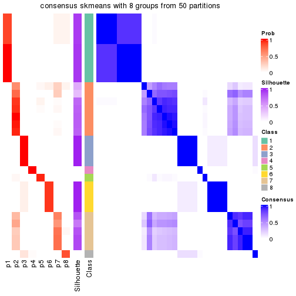</p>

</div>
</div>

Heatmaps for the membership of samples in all partitions to see how consistent they are:


<script>
$( function() {
	$( '#tabs-node-023-membership-heatmap' ).tabs();
} );
</script>
<div id='tabs-node-023-membership-heatmap'>
<ul>
<li><a href='#tab-node-023-membership-heatmap-1'>k = 2</a></li>
<li><a href='#tab-node-023-membership-heatmap-2'>k = 3</a></li>
<li><a href='#tab-node-023-membership-heatmap-3'>k = 4</a></li>
<li><a href='#tab-node-023-membership-heatmap-4'>k = 5</a></li>
<li><a href='#tab-node-023-membership-heatmap-5'>k = 6</a></li>
<li><a href='#tab-node-023-membership-heatmap-6'>k = 7</a></li>
<li><a href='#tab-node-023-membership-heatmap-7'>k = 8</a></li>
</ul>
<div id='tab-node-023-membership-heatmap-1'>
<pre><code class="r">membership_heatmap(res, k = 2)
</code></pre>

<p>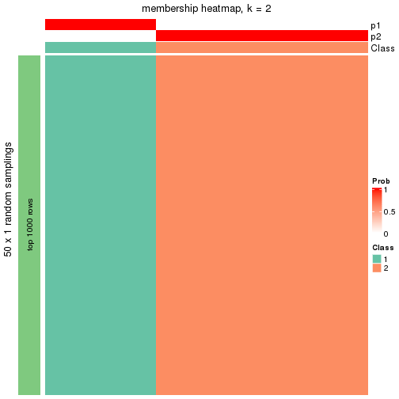</p>

</div>
<div id='tab-node-023-membership-heatmap-2'>
<pre><code class="r">membership_heatmap(res, k = 3)
</code></pre>

<p></p>

</div>
<div id='tab-node-023-membership-heatmap-3'>
<pre><code class="r">membership_heatmap(res, k = 4)
</code></pre>

<p></p>

</div>
<div id='tab-node-023-membership-heatmap-4'>
<pre><code class="r">membership_heatmap(res, k = 5)
</code></pre>

<p></p>

</div>
<div id='tab-node-023-membership-heatmap-5'>
<pre><code class="r">membership_heatmap(res, k = 6)
</code></pre>

<p></p>

</div>
<div id='tab-node-023-membership-heatmap-6'>
<pre><code class="r">membership_heatmap(res, k = 7)
</code></pre>

<p></p>

</div>
<div id='tab-node-023-membership-heatmap-7'>
<pre><code class="r">membership_heatmap(res, k = 8)
</code></pre>

<p>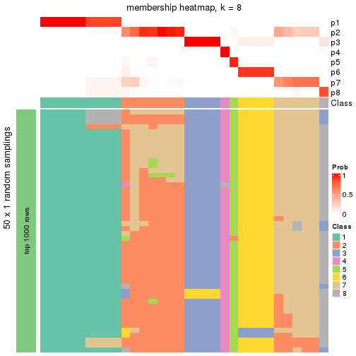</p>

</div>
</div>

As soon as the classes for columns are determined, the signatures
that are significantly different between subgroups can be looked for. 
Following are the heatmaps for signatures.


<script>
$( function() {
	$( '#tabs-node-023-get-signatures' ).tabs();
} );
</script>
<div id='tabs-node-023-get-signatures'>
<ul>
<li><a href='#tab-node-023-get-signatures-1'>k = 2</a></li>
<li><a href='#tab-node-023-get-signatures-2'>k = 3</a></li>
<li><a href='#tab-node-023-get-signatures-3'>k = 4</a></li>
<li><a href='#tab-node-023-get-signatures-4'>k = 5</a></li>
<li><a href='#tab-node-023-get-signatures-5'>k = 6</a></li>
<li><a href='#tab-node-023-get-signatures-6'>k = 7</a></li>
<li><a href='#tab-node-023-get-signatures-7'>k = 8</a></li>
</ul>
<div id='tab-node-023-get-signatures-1'>
<pre><code class="r">get_signatures(res, k = 2)
</code></pre>

<p></p>

</div>
<div id='tab-node-023-get-signatures-2'>
<pre><code class="r">get_signatures(res, k = 3)
</code></pre>

<p></p>

</div>
<div id='tab-node-023-get-signatures-3'>
<pre><code class="r">get_signatures(res, k = 4)
</code></pre>

<p>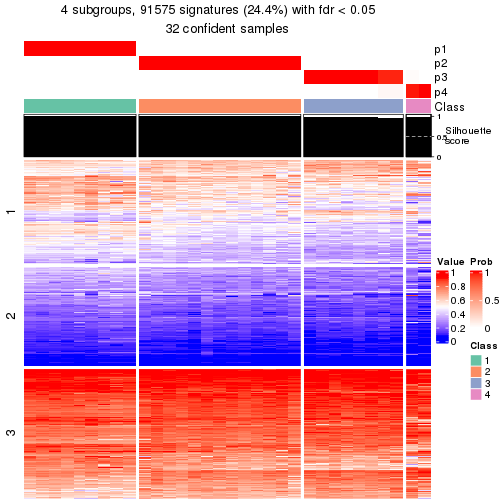</p>

</div>
<div id='tab-node-023-get-signatures-4'>
<pre><code class="r">get_signatures(res, k = 5)
</code></pre>

<p></p>

</div>
<div id='tab-node-023-get-signatures-5'>
<pre><code class="r">get_signatures(res, k = 6)
</code></pre>

<p></p>

</div>
<div id='tab-node-023-get-signatures-6'>
<pre><code class="r">get_signatures(res, k = 7)
</code></pre>

<p></p>

</div>
<div id='tab-node-023-get-signatures-7'>
<pre><code class="r">get_signatures(res, k = 8)
</code></pre>

<p></p>

</div>
</div>


Compare the overlap of signatures from different k:

```r
compare_signatures(res)
```


`get_signature()` returns a data frame invisibly. To get the list of signatures, the function
call should be assigned to a variable explicitly. In following code, if `plot` argument is set
to `FALSE`, no heatmap is plotted while only the differential analysis is performed.

```r
# code only for demonstration
tb = get_signature(res, k = ..., plot = FALSE)
```

An example of the output of `tb` is:

```
#>   which_row         fdr    mean_1    mean_2 scaled_mean_1 scaled_mean_2 km
#> 1        38 0.042760348  8.373488  9.131774    -0.5533452     0.5164555  1
#> 2        40 0.018707592  7.106213  8.469186    -0.6173731     0.5762149  1
#> 3        55 0.019134737 10.221463 11.207825    -0.6159697     0.5749050  1
#> 4        59 0.006059896  5.921854  7.869574    -0.6899429     0.6439467  1
#> 5        60 0.018055526  8.928898 10.211722    -0.6204761     0.5791110  1
#> 6        98 0.009384629 15.714769 14.887706     0.6635654    -0.6193277  2
...
```

The columns in `tb` are:

1. `which_row`: row indices corresponding to the input matrix.
2. `fdr`: FDR for the differential test. 
3. `mean_x`: The mean value in group x.
4. `scaled_mean_x`: The mean value in group x after rows are scaled.
5. `km`: Row groups if k-means clustering is applied to rows (which is done by automatically selecting number of clusters).

If there are too many signatures, `top_signatures = ...` can be set to only show the 
signatures with the highest FDRs:

```r
# code only for demonstration
# e.g. to show the top 500 most significant rows
tb = get_signature(res, k = ..., top_signatures = 500)
```

If the signatures are defined as these which are uniquely high in current group, `diff_method` argument
can be set to `"uniquely_high_in_one_group"`:

```r
# code only for demonstration
tb = get_signature(res, k = ..., diff_method = "uniquely_high_in_one_group")
```


UMAP plot which shows how samples are separated.


<script>
$( function() {
	$( '#tabs-node-023-dimension-reduction' ).tabs();
} );
</script>
<div id='tabs-node-023-dimension-reduction'>
<ul>
<li><a href='#tab-node-023-dimension-reduction-1'>k = 2</a></li>
<li><a href='#tab-node-023-dimension-reduction-2'>k = 3</a></li>
<li><a href='#tab-node-023-dimension-reduction-3'>k = 4</a></li>
<li><a href='#tab-node-023-dimension-reduction-4'>k = 5</a></li>
<li><a href='#tab-node-023-dimension-reduction-5'>k = 6</a></li>
<li><a href='#tab-node-023-dimension-reduction-6'>k = 7</a></li>
<li><a href='#tab-node-023-dimension-reduction-7'>k = 8</a></li>
</ul>
<div id='tab-node-023-dimension-reduction-1'>
<pre><code class="r">dimension_reduction(res, k = 2, method = &quot;UMAP&quot;)
</code></pre>

<p></p>

</div>
<div id='tab-node-023-dimension-reduction-2'>
<pre><code class="r">dimension_reduction(res, k = 3, method = &quot;UMAP&quot;)
</code></pre>

<p></p>

</div>
<div id='tab-node-023-dimension-reduction-3'>
<pre><code class="r">dimension_reduction(res, k = 4, method = &quot;UMAP&quot;)
</code></pre>

<p></p>

</div>
<div id='tab-node-023-dimension-reduction-4'>
<pre><code class="r">dimension_reduction(res, k = 5, method = &quot;UMAP&quot;)
</code></pre>

<p></p>

</div>
<div id='tab-node-023-dimension-reduction-5'>
<pre><code class="r">dimension_reduction(res, k = 6, method = &quot;UMAP&quot;)
</code></pre>

<p></p>

</div>
<div id='tab-node-023-dimension-reduction-6'>
<pre><code class="r">dimension_reduction(res, k = 7, method = &quot;UMAP&quot;)
</code></pre>

<p></p>

</div>
<div id='tab-node-023-dimension-reduction-7'>
<pre><code class="r">dimension_reduction(res, k = 8, method = &quot;UMAP&quot;)
</code></pre>

<p></p>

</div>
</div>


Following heatmap shows how subgroups are split when increasing `k`:

```r
collect_classes(res)
```


If matrix rows can be associated to genes, consider to use `functional_enrichment(res,
...)` to perform function enrichment for the signature genes. See [this vignette](https://jokergoo.github.io/cola_vignettes/functional_enrichment.html) for more detailed explanations.


 

---------------------------------------------------


### Node0232


Parent node: [Node023](#Node023).
Child nodes: 
                Node02321-leaf
        ,
                Node02322-leaf
        ,
                Node02411-leaf
        ,
                Node02412-leaf
        ,
                Node02413-leaf
        ,
                Node02414-leaf
        ,
                Node03111-leaf
        ,
                Node03112-leaf
        ,
                Node03113-leaf
        .


The object with results only for a single top-value method and a single partitioning method 
can be extracted as:

```r
res = res_rh["0232"]
```

A summary of `res` and all the functions that can be applied to it:

```r
res
```

```
#> A 'ConsensusPartition' object with k = 2, 3, 4, 5, 6, 7, 8.
#>   On a matrix with 30000 rows and 13 columns.
#>   Top rows (1000) are extracted by 'SD' method.
#>   Subgroups are detected by 'kmeans' method.
#>   Performed in total 350 partitions by row resampling.
#>   Best k for subgroups seems to be 2.
#> 
#> Following methods can be applied to this 'ConsensusPartition' object:
#>  [1] "cola_report"             "collect_classes"         "collect_plots"          
#>  [4] "collect_stats"           "colnames"                "compare_partitions"     
#>  [7] "compare_signatures"      "consensus_heatmap"       "dimension_reduction"    
#> [10] "functional_enrichment"   "get_anno_col"            "get_anno"               
#> [13] "get_classes"             "get_consensus"           "get_matrix"             
#> [16] "get_membership"          "get_param"               "get_signatures"         
#> [19] "get_stats"               "is_best_k"               "is_stable_k"            
#> [22] "membership_heatmap"      "ncol"                    "nrow"                   
#> [25] "plot_ecdf"               "predict_classes"         "rownames"               
#> [28] "select_partition_number" "show"                    "suggest_best_k"         
#> [31] "test_to_known_factors"   "top_rows_heatmap"
```

`collect_plots()` function collects all the plots made from `res` for all `k` (number of subgroups)
into one single page to provide an easy and fast comparison between different `k`.

```r
collect_plots(res)
```

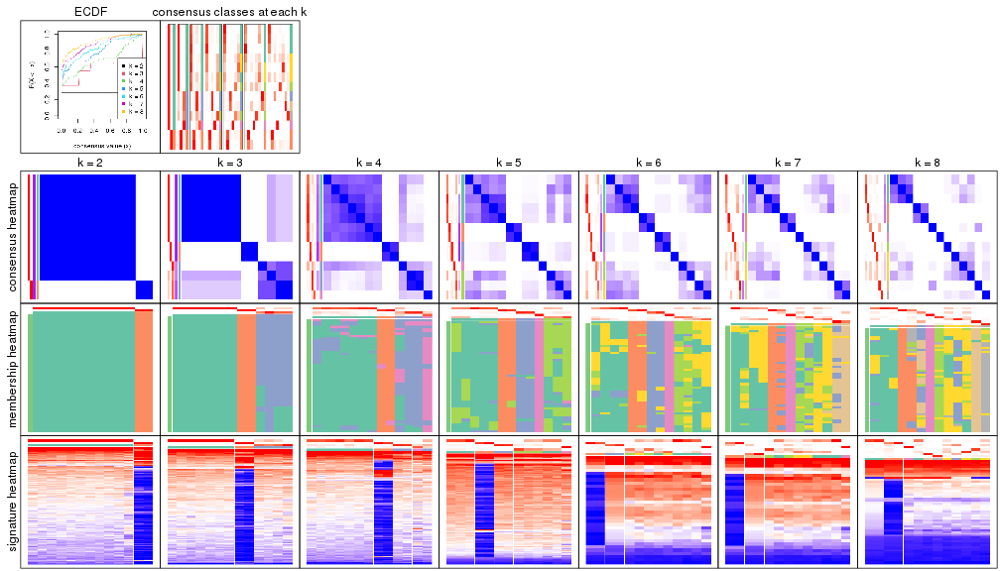

The plots are:

- The first row: a plot of the eCDF (empirical cumulative distribution
  function) curves of the consensus matrix for each `k` and the heatmap of
  predicted classes for each `k`.
- The second row: heatmaps of the consensus matrix for each `k`.
- The third row: heatmaps of the membership matrix for each `k`.
- The fouth row: heatmaps of the signatures for each `k`.

All the plots in panels can be made by individual functions and they are
plotted later in this section.

`select_partition_number()` produces several plots showing different
statistics for choosing "optimized" `k`. There are following statistics:

- eCDF curves of the consensus matrix for each `k`;
- 1-PAC. [The PAC score](https://en.wikipedia.org/wiki/Consensus_clustering#Over-interpretation_potential_of_consensus_clustering)
  measures the proportion of the ambiguous subgrouping.
- Mean silhouette score.
- Concordance. The mean probability of fiting the consensus subgroup labels in all
  partitions.
- Area increased. Denote $A_k$ as the area under the eCDF curve for current
  `k`, the area increased is defined as $A_k - A_{k-1}$.
- Rand index. The percent of pairs of samples that are both in a same cluster
  or both are not in a same cluster in the partition of k and k-1.
- Jaccard index. The ratio of pairs of samples are both in a same cluster in
  the partition of k and k-1 and the pairs of samples are both in a same
  cluster in the partition k or k-1.

The detailed explanations of these statistics can be found in [the _cola_
vignette](https://jokergoo.github.io/cola_vignettes/cola.html#toc_13).

Generally speaking, higher 1-PAC score, higher mean silhouette score or higher
concordance corresponds to better partition. Rand index and Jaccard index
measure how similar the current partition is compared to partition with `k-1`.
If they are too similar, we won't accept `k` is better than `k-1`.

```r
select_partition_number(res)
```


The numeric values for all these statistics can be obtained by `get_stats()`.

```r
get_stats(res)
```

```
#>   k 1-PAC mean_silhouette concordance area_increased  Rand Jaccard
#> 2 2 1.000           1.000       1.000         0.2828 0.718   0.718
#> 3 3 0.667           0.916       0.938         1.0711 0.641   0.500
#> 4 4 0.513           0.640       0.848         0.1783 0.962   0.893
#> 5 5 0.590           0.505       0.820         0.1543 0.821   0.481
#> 6 6 0.667           0.423       0.760         0.0550 0.859   0.389
#> 7 7 0.692           0.310       0.726         0.0473 0.897   0.429
#> 8 8 0.769           0.305       0.771         0.0361 0.910   0.417
```

`suggest_best_k()` suggests the best $k$ based on these statistics. The rules are as follows:

- All $k$ with Jaccard index larger than 0.95 are removed because increasing
  $k$ does not provide enough extra information. If all $k$ are removed, it is
  marked as no subgroup is detected.
- For all $k$ with 1-PAC score larger than 0.9, the maximal $k$ is taken as
  the best $k$, and other $k$ are marked as optional $k$.
- If it does not fit the second rule. The $k$ with the maximal vote of the
  highest 1-PAC score, highest mean silhouette, and highest concordance is
  taken as the best $k$.

```r
suggest_best_k(res)
```

```
#> [1] 2
```


Following is the table of the partitions (You need to click the **show/hide
code output** link to see it). The membership matrix (columns with name `p*`)
is inferred by
[`clue::cl_consensus()`](https://www.rdocumentation.org/link/cl_consensus?package=clue)
function with the `SE` method. Basically the value in the membership matrix
represents the probability to belong to a certain group. The finall subgroup
label for an item is determined with the group with highest probability it
belongs to.

In `get_classes()` function, the entropy is calculated from the membership
matrix and the silhouette score is calculated from the consensus matrix.


<script>
$( function() {
	$( '#tabs-node-0232-get-classes' ).tabs();
} );
</script>
<div id='tabs-node-0232-get-classes'>
<ul>
<li><a href='#tab-node-0232-get-classes-1'>k = 2</a></li>
<li><a href='#tab-node-0232-get-classes-2'>k = 3</a></li>
<li><a href='#tab-node-0232-get-classes-3'>k = 4</a></li>
<li><a href='#tab-node-0232-get-classes-4'>k = 5</a></li>
<li><a href='#tab-node-0232-get-classes-5'>k = 6</a></li>
<li><a href='#tab-node-0232-get-classes-6'>k = 7</a></li>
<li><a href='#tab-node-0232-get-classes-7'>k = 8</a></li>
</ul>

<div id='tab-node-0232-get-classes-1'>
<p><a id='tab-node-0232-get-classes-1-a' style='color:#0366d6' href='#'>show/hide code output</a></p>
<pre><code class="r">cbind(get_classes(res, k = 2), get_membership(res, k = 2))
</code></pre>

<pre><code>#&gt;                 class entropy silhouette p1 p2
#&gt; TCGA.EL.A3ZK.11     1       0          1  1  0
#&gt; TCGA.DJ.A4V0.01     1       0          1  1  0
#&gt; TCGA.EL.A3ZP.11     2       0          1  0  1
#&gt; TCGA.EL.A3N3.11     1       0          1  1  0
#&gt; TCGA.BJ.A28W.11     1       0          1  1  0
#&gt; TCGA.BJ.A28R.11     1       0          1  1  0
#&gt; TCGA.GE.A2C6.11     1       0          1  1  0
#&gt; TCGA.BJ.A28T.01     1       0          1  1  0
#&gt; TCGA.EL.A3T1.11     1       0          1  1  0
#&gt; TCGA.EM.A3AJ.01     2       0          1  0  1
#&gt; TCGA.EL.A3CW.01     1       0          1  1  0
#&gt; TCGA.ET.A3DQ.01     1       0          1  1  0
#&gt; TCGA.BJ.A3PR.11     1       0          1  1  0
</code></pre>

<script>
$('#tab-node-0232-get-classes-1-a').parent().next().next().hide();
$('#tab-node-0232-get-classes-1-a').click(function(){
  $('#tab-node-0232-get-classes-1-a').parent().next().next().toggle();
  return(false);
});
</script>
</div>

<div id='tab-node-0232-get-classes-2'>
<p><a id='tab-node-0232-get-classes-2-a' style='color:#0366d6' href='#'>show/hide code output</a></p>
<pre><code class="r">cbind(get_classes(res, k = 3), get_membership(res, k = 3))
</code></pre>

<pre><code>#&gt;                 class entropy silhouette   p1 p2   p3
#&gt; TCGA.EL.A3ZK.11     1   0.000      1.000 1.00  0 0.00
#&gt; TCGA.DJ.A4V0.01     3   0.480      0.822 0.22  0 0.78
#&gt; TCGA.EL.A3ZP.11     2   0.000      1.000 0.00  1 0.00
#&gt; TCGA.EL.A3N3.11     1   0.000      1.000 1.00  0 0.00
#&gt; TCGA.BJ.A28W.11     3   0.000      0.613 0.00  0 1.00
#&gt; TCGA.BJ.A28R.11     1   0.000      1.000 1.00  0 0.00
#&gt; TCGA.GE.A2C6.11     1   0.000      1.000 1.00  0 0.00
#&gt; TCGA.BJ.A28T.01     1   0.000      1.000 1.00  0 0.00
#&gt; TCGA.EL.A3T1.11     1   0.000      1.000 1.00  0 0.00
#&gt; TCGA.EM.A3AJ.01     2   0.000      1.000 0.00  1 0.00
#&gt; TCGA.EL.A3CW.01     1   0.000      1.000 1.00  0 0.00
#&gt; TCGA.ET.A3DQ.01     3   0.480      0.822 0.22  0 0.78
#&gt; TCGA.BJ.A3PR.11     3   0.595      0.650 0.36  0 0.64
</code></pre>

<script>
$('#tab-node-0232-get-classes-2-a').parent().next().next().hide();
$('#tab-node-0232-get-classes-2-a').click(function(){
  $('#tab-node-0232-get-classes-2-a').parent().next().next().toggle();
  return(false);
});
</script>
</div>

<div id='tab-node-0232-get-classes-3'>
<p><a id='tab-node-0232-get-classes-3-a' style='color:#0366d6' href='#'>show/hide code output</a></p>
<pre><code class="r">cbind(get_classes(res, k = 4), get_membership(res, k = 4))
</code></pre>

<pre><code>#&gt;                 class entropy silhouette   p1   p2   p3   p4
#&gt; TCGA.EL.A3ZK.11     1   0.320     0.7891 0.88 0.00 0.04 0.08
#&gt; TCGA.DJ.A4V0.01     3   0.121     0.5184 0.04 0.00 0.96 0.00
#&gt; TCGA.EL.A3ZP.11     2   0.201     0.9345 0.00 0.92 0.00 0.08
#&gt; TCGA.EL.A3N3.11     1   0.191     0.8040 0.94 0.00 0.04 0.02
#&gt; TCGA.BJ.A28W.11     4   0.361     0.0000 0.00 0.00 0.20 0.80
#&gt; TCGA.BJ.A28R.11     1   0.385     0.7624 0.82 0.00 0.16 0.02
#&gt; TCGA.GE.A2C6.11     1   0.265     0.7840 0.88 0.00 0.12 0.00
#&gt; TCGA.BJ.A28T.01     1   0.141     0.8107 0.96 0.00 0.02 0.02
#&gt; TCGA.EL.A3T1.11     1   0.461     0.7417 0.80 0.00 0.10 0.10
#&gt; TCGA.EM.A3AJ.01     2   0.000     0.9345 0.00 1.00 0.00 0.00
#&gt; TCGA.EL.A3CW.01     1   0.549     0.6615 0.70 0.00 0.24 0.06
#&gt; TCGA.ET.A3DQ.01     3   0.164     0.5136 0.06 0.00 0.94 0.00
#&gt; TCGA.BJ.A3PR.11     3   0.760     0.0613 0.38 0.00 0.42 0.20
</code></pre>

<script>
$('#tab-node-0232-get-classes-3-a').parent().next().next().hide();
$('#tab-node-0232-get-classes-3-a').click(function(){
  $('#tab-node-0232-get-classes-3-a').parent().next().next().toggle();
  return(false);
});
</script>
</div>

<div id='tab-node-0232-get-classes-4'>
<p><a id='tab-node-0232-get-classes-4-a' style='color:#0366d6' href='#'>show/hide code output</a></p>
<pre><code class="r">cbind(get_classes(res, k = 5), get_membership(res, k = 5))
</code></pre>

<pre><code>#&gt;                 class entropy silhouette   p1   p2   p3   p4   p5
#&gt; TCGA.EL.A3ZK.11     1  0.4126     0.0347 0.62 0.00 0.00 0.00 0.38
#&gt; TCGA.DJ.A4V0.01     3  0.1043     0.9770 0.04 0.00 0.96 0.00 0.00
#&gt; TCGA.EL.A3ZP.11     2  0.0000     0.9329 0.00 1.00 0.00 0.00 0.00
#&gt; TCGA.EL.A3N3.11     1  0.4060     0.2749 0.64 0.00 0.00 0.00 0.36
#&gt; TCGA.BJ.A28W.11     4  0.0000     0.0000 0.00 0.00 0.00 1.00 0.00
#&gt; TCGA.BJ.A28R.11     1  0.3421     0.5740 0.84 0.00 0.08 0.00 0.08
#&gt; TCGA.GE.A2C6.11     1  0.3110     0.6037 0.86 0.00 0.06 0.00 0.08
#&gt; TCGA.BJ.A28T.01     1  0.0609     0.6016 0.98 0.00 0.00 0.00 0.02
#&gt; TCGA.EL.A3T1.11     5  0.5048     0.1675 0.38 0.00 0.04 0.00 0.58
#&gt; TCGA.EM.A3AJ.01     2  0.2012     0.9329 0.00 0.92 0.02 0.00 0.06
#&gt; TCGA.EL.A3CW.01     5  0.5864     0.0870 0.32 0.00 0.12 0.00 0.56
#&gt; TCGA.ET.A3DQ.01     3  0.1648     0.9770 0.04 0.00 0.94 0.00 0.02
#&gt; TCGA.BJ.A3PR.11     5  0.2616     0.4078 0.00 0.00 0.10 0.02 0.88
</code></pre>

<script>
$('#tab-node-0232-get-classes-4-a').parent().next().next().hide();
$('#tab-node-0232-get-classes-4-a').click(function(){
  $('#tab-node-0232-get-classes-4-a').parent().next().next().toggle();
  return(false);
});
</script>
</div>

<div id='tab-node-0232-get-classes-5'>
<p><a id='tab-node-0232-get-classes-5-a' style='color:#0366d6' href='#'>show/hide code output</a></p>
<pre><code class="r">cbind(get_classes(res, k = 6), get_membership(res, k = 6))
</code></pre>

<pre><code>#&gt;                 class entropy silhouette   p1   p2   p3   p4   p5   p6
#&gt; TCGA.EL.A3ZK.11     6   0.558      0.111 0.40 0.00 0.00 0.00 0.14 0.46
#&gt; TCGA.DJ.A4V0.01     3   0.425      0.862 0.06 0.00 0.78 0.00 0.06 0.10
#&gt; TCGA.EL.A3ZP.11     2   0.342      0.862 0.00 0.84 0.06 0.00 0.06 0.04
#&gt; TCGA.EL.A3N3.11     6   0.308      0.284 0.24 0.00 0.00 0.00 0.00 0.76
#&gt; TCGA.BJ.A28W.11     4   0.000      0.000 0.00 0.00 0.00 1.00 0.00 0.00
#&gt; TCGA.BJ.A28R.11     1   0.000      0.479 1.00 0.00 0.00 0.00 0.00 0.00
#&gt; TCGA.GE.A2C6.11     1   0.181      0.464 0.90 0.00 0.00 0.00 0.00 0.10
#&gt; TCGA.BJ.A28T.01     1   0.308      0.217 0.76 0.00 0.00 0.00 0.00 0.24
#&gt; TCGA.EL.A3T1.11     5   0.407      0.374 0.26 0.00 0.00 0.00 0.70 0.04
#&gt; TCGA.EM.A3AJ.01     2   0.000      0.862 0.00 1.00 0.00 0.00 0.00 0.00
#&gt; TCGA.EL.A3CW.01     1   0.602     -0.262 0.46 0.00 0.02 0.00 0.14 0.38
#&gt; TCGA.ET.A3DQ.01     3   0.127      0.862 0.06 0.00 0.94 0.00 0.00 0.00
#&gt; TCGA.BJ.A3PR.11     5   0.518      0.380 0.04 0.00 0.02 0.02 0.64 0.28
</code></pre>

<script>
$('#tab-node-0232-get-classes-5-a').parent().next().next().hide();
$('#tab-node-0232-get-classes-5-a').click(function(){
  $('#tab-node-0232-get-classes-5-a').parent().next().next().toggle();
  return(false);
});
</script>
</div>

<div id='tab-node-0232-get-classes-6'>
<p><a id='tab-node-0232-get-classes-6-a' style='color:#0366d6' href='#'>show/hide code output</a></p>
<pre><code class="r">cbind(get_classes(res, k = 7), get_membership(res, k = 7))
</code></pre>

<pre><code>#&gt;                 class entropy silhouette   p1  p2   p3 p4   p5   p6   p7
#&gt; TCGA.EL.A3ZK.11     1   0.536    -0.1184 0.60 0.0 0.04  0 0.14 0.22 0.00
#&gt; TCGA.DJ.A4V0.01     7   0.393     0.6915 0.00 0.0 0.30  0 0.00 0.04 0.66
#&gt; TCGA.EL.A3ZP.11     2   0.000     0.7311 0.00 1.0 0.00  0 0.00 0.00 0.00
#&gt; TCGA.EL.A3N3.11     6   0.595     0.0618 0.36 0.0 0.10  0 0.08 0.46 0.00
#&gt; TCGA.BJ.A28W.11     4   0.000     0.0000 0.00 0.0 0.00  1 0.00 0.00 0.00
#&gt; TCGA.BJ.A28R.11     1   0.382     0.3485 0.62 0.0 0.00  0 0.00 0.36 0.02
#&gt; TCGA.GE.A2C6.11     1   0.399     0.2415 0.50 0.0 0.00  0 0.00 0.48 0.02
#&gt; TCGA.BJ.A28T.01     1   0.000     0.2885 1.00 0.0 0.00  0 0.00 0.00 0.00
#&gt; TCGA.EL.A3T1.11     5   0.681     0.2520 0.20 0.0 0.30  0 0.36 0.14 0.00
#&gt; TCGA.EM.A3AJ.01     2   0.314     0.7311 0.00 0.7 0.30  0 0.00 0.00 0.00
#&gt; TCGA.EL.A3CW.01     6   0.482    -0.0996 0.12 0.0 0.00  0 0.16 0.68 0.04
#&gt; TCGA.ET.A3DQ.01     7   0.000     0.6913 0.00 0.0 0.00  0 0.00 0.00 1.00
#&gt; TCGA.BJ.A3PR.11     5   0.143     0.2044 0.00 0.0 0.00  0 0.92 0.08 0.00
</code></pre>

<script>
$('#tab-node-0232-get-classes-6-a').parent().next().next().hide();
$('#tab-node-0232-get-classes-6-a').click(function(){
  $('#tab-node-0232-get-classes-6-a').parent().next().next().toggle();
  return(false);
});
</script>
</div>

<div id='tab-node-0232-get-classes-7'>
<p><a id='tab-node-0232-get-classes-7-a' style='color:#0366d6' href='#'>show/hide code output</a></p>
<pre><code class="r">cbind(get_classes(res, k = 8), get_membership(res, k = 8))
</code></pre>

<pre><code>#&gt;                 class entropy silhouette   p1   p2   p3 p4   p5   p6   p7   p8
#&gt; TCGA.EL.A3ZK.11     6  0.7351      0.264 0.16 0.00 0.26  0 0.20 0.30 0.00 0.08
#&gt; TCGA.DJ.A4V0.01     7  0.0471      0.000 0.02 0.00 0.00  0 0.00 0.00 0.98 0.00
#&gt; TCGA.EL.A3ZP.11     2  0.0000      0.672 0.00 1.00 0.00  0 0.00 0.00 0.00 0.00
#&gt; TCGA.EL.A3N3.11     6  0.1275      0.230 0.04 0.00 0.00  0 0.00 0.94 0.00 0.02
#&gt; TCGA.BJ.A28W.11     4  0.0000      0.000 0.00 0.00 0.00  1 0.00 0.00 0.00 0.00
#&gt; TCGA.BJ.A28R.11     1  0.0808      0.700 0.96 0.00 0.00  0 0.04 0.00 0.00 0.00
#&gt; TCGA.GE.A2C6.11     1  0.1887      0.637 0.90 0.00 0.06  0 0.00 0.04 0.00 0.00
#&gt; TCGA.BJ.A28T.01     1  0.4472      0.498 0.68 0.00 0.10  0 0.04 0.18 0.00 0.00
#&gt; TCGA.EL.A3T1.11     5  0.1563      0.000 0.00 0.00 0.00  0 0.90 0.00 0.00 0.10
#&gt; TCGA.EM.A3AJ.01     2  0.5612      0.672 0.00 0.64 0.14  0 0.10 0.06 0.02 0.04
#&gt; TCGA.EL.A3CW.01     6  0.7177      0.287 0.28 0.00 0.24  0 0.08 0.30 0.00 0.10
#&gt; TCGA.ET.A3DQ.01     3  0.3272      0.000 0.00 0.00 0.58  0 0.00 0.00 0.42 0.00
#&gt; TCGA.BJ.A3PR.11     8  0.0808      0.000 0.00 0.00 0.00  0 0.00 0.04 0.00 0.96
</code></pre>

<script>
$('#tab-node-0232-get-classes-7-a').parent().next().next().hide();
$('#tab-node-0232-get-classes-7-a').click(function(){
  $('#tab-node-0232-get-classes-7-a').parent().next().next().toggle();
  return(false);
});
</script>
</div>
</div>

Heatmaps for the consensus matrix. It visualizes the probability of two
samples to be in a same group.


<script>
$( function() {
	$( '#tabs-node-0232-consensus-heatmap' ).tabs();
} );
</script>
<div id='tabs-node-0232-consensus-heatmap'>
<ul>
<li><a href='#tab-node-0232-consensus-heatmap-1'>k = 2</a></li>
<li><a href='#tab-node-0232-consensus-heatmap-2'>k = 3</a></li>
<li><a href='#tab-node-0232-consensus-heatmap-3'>k = 4</a></li>
<li><a href='#tab-node-0232-consensus-heatmap-4'>k = 5</a></li>
<li><a href='#tab-node-0232-consensus-heatmap-5'>k = 6</a></li>
<li><a href='#tab-node-0232-consensus-heatmap-6'>k = 7</a></li>
<li><a href='#tab-node-0232-consensus-heatmap-7'>k = 8</a></li>
</ul>
<div id='tab-node-0232-consensus-heatmap-1'>
<pre><code class="r">consensus_heatmap(res, k = 2)
</code></pre>

<p></p>

</div>
<div id='tab-node-0232-consensus-heatmap-2'>
<pre><code class="r">consensus_heatmap(res, k = 3)
</code></pre>

<p></p>

</div>
<div id='tab-node-0232-consensus-heatmap-3'>
<pre><code class="r">consensus_heatmap(res, k = 4)
</code></pre>

<p></p>

</div>
<div id='tab-node-0232-consensus-heatmap-4'>
<pre><code class="r">consensus_heatmap(res, k = 5)
</code></pre>

<p></p>

</div>
<div id='tab-node-0232-consensus-heatmap-5'>
<pre><code class="r">consensus_heatmap(res, k = 6)
</code></pre>

<p></p>

</div>
<div id='tab-node-0232-consensus-heatmap-6'>
<pre><code class="r">consensus_heatmap(res, k = 7)
</code></pre>

<p></p>

</div>
<div id='tab-node-0232-consensus-heatmap-7'>
<pre><code class="r">consensus_heatmap(res, k = 8)
</code></pre>

<p></p>

</div>
</div>

Heatmaps for the membership of samples in all partitions to see how consistent they are:


<script>
$( function() {
	$( '#tabs-node-0232-membership-heatmap' ).tabs();
} );
</script>
<div id='tabs-node-0232-membership-heatmap'>
<ul>
<li><a href='#tab-node-0232-membership-heatmap-1'>k = 2</a></li>
<li><a href='#tab-node-0232-membership-heatmap-2'>k = 3</a></li>
<li><a href='#tab-node-0232-membership-heatmap-3'>k = 4</a></li>
<li><a href='#tab-node-0232-membership-heatmap-4'>k = 5</a></li>
<li><a href='#tab-node-0232-membership-heatmap-5'>k = 6</a></li>
<li><a href='#tab-node-0232-membership-heatmap-6'>k = 7</a></li>
<li><a href='#tab-node-0232-membership-heatmap-7'>k = 8</a></li>
</ul>
<div id='tab-node-0232-membership-heatmap-1'>
<pre><code class="r">membership_heatmap(res, k = 2)
</code></pre>

<p></p>

</div>
<div id='tab-node-0232-membership-heatmap-2'>
<pre><code class="r">membership_heatmap(res, k = 3)
</code></pre>

<p></p>

</div>
<div id='tab-node-0232-membership-heatmap-3'>
<pre><code class="r">membership_heatmap(res, k = 4)
</code></pre>

<p></p>

</div>
<div id='tab-node-0232-membership-heatmap-4'>
<pre><code class="r">membership_heatmap(res, k = 5)
</code></pre>

<p></p>

</div>
<div id='tab-node-0232-membership-heatmap-5'>
<pre><code class="r">membership_heatmap(res, k = 6)
</code></pre>

<p></p>

</div>
<div id='tab-node-0232-membership-heatmap-6'>
<pre><code class="r">membership_heatmap(res, k = 7)
</code></pre>

<p></p>

</div>
<div id='tab-node-0232-membership-heatmap-7'>
<pre><code class="r">membership_heatmap(res, k = 8)
</code></pre>

<p></p>

</div>
</div>

As soon as the classes for columns are determined, the signatures
that are significantly different between subgroups can be looked for. 
Following are the heatmaps for signatures.


<script>
$( function() {
	$( '#tabs-node-0232-get-signatures' ).tabs();
} );
</script>
<div id='tabs-node-0232-get-signatures'>
<ul>
<li><a href='#tab-node-0232-get-signatures-1'>k = 2</a></li>
<li><a href='#tab-node-0232-get-signatures-2'>k = 3</a></li>
<li><a href='#tab-node-0232-get-signatures-3'>k = 4</a></li>
<li><a href='#tab-node-0232-get-signatures-4'>k = 5</a></li>
<li><a href='#tab-node-0232-get-signatures-5'>k = 6</a></li>
<li><a href='#tab-node-0232-get-signatures-6'>k = 7</a></li>
<li><a href='#tab-node-0232-get-signatures-7'>k = 8</a></li>
</ul>
<div id='tab-node-0232-get-signatures-1'>
<pre><code class="r">get_signatures(res, k = 2)
</code></pre>

<p></p>

</div>
<div id='tab-node-0232-get-signatures-2'>
<pre><code class="r">get_signatures(res, k = 3)
</code></pre>

<p></p>

</div>
<div id='tab-node-0232-get-signatures-3'>
<pre><code class="r">get_signatures(res, k = 4)
</code></pre>

<p></p>

</div>
<div id='tab-node-0232-get-signatures-4'>
<pre><code class="r">get_signatures(res, k = 5)
</code></pre>

<p>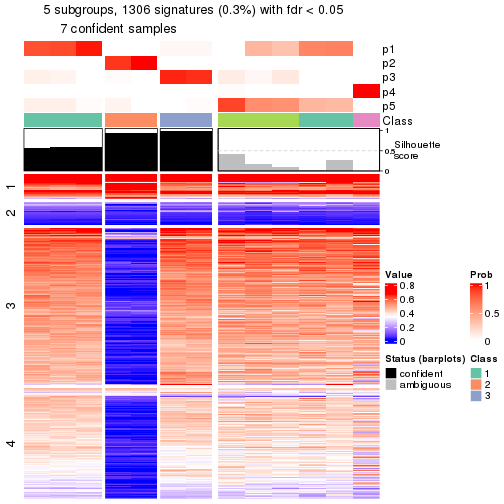</p>

</div>
<div id='tab-node-0232-get-signatures-5'>
<pre><code class="r">get_signatures(res, k = 6)
</code></pre>

<p></p>

</div>
<div id='tab-node-0232-get-signatures-6'>
<pre><code class="r">get_signatures(res, k = 7)
</code></pre>

<p></p>

</div>
<div id='tab-node-0232-get-signatures-7'>
<pre><code class="r">get_signatures(res, k = 8)
</code></pre>

<p></p>

</div>
</div>


Compare the overlap of signatures from different k:

```r
compare_signatures(res)
```


`get_signature()` returns a data frame invisibly. To get the list of signatures, the function
call should be assigned to a variable explicitly. In following code, if `plot` argument is set
to `FALSE`, no heatmap is plotted while only the differential analysis is performed.

```r
# code only for demonstration
tb = get_signature(res, k = ..., plot = FALSE)
```

An example of the output of `tb` is:

```
#>   which_row         fdr    mean_1    mean_2 scaled_mean_1 scaled_mean_2 km
#> 1        38 0.042760348  8.373488  9.131774    -0.5533452     0.5164555  1
#> 2        40 0.018707592  7.106213  8.469186    -0.6173731     0.5762149  1
#> 3        55 0.019134737 10.221463 11.207825    -0.6159697     0.5749050  1
#> 4        59 0.006059896  5.921854  7.869574    -0.6899429     0.6439467  1
#> 5        60 0.018055526  8.928898 10.211722    -0.6204761     0.5791110  1
#> 6        98 0.009384629 15.714769 14.887706     0.6635654    -0.6193277  2
...
```

The columns in `tb` are:

1. `which_row`: row indices corresponding to the input matrix.
2. `fdr`: FDR for the differential test. 
3. `mean_x`: The mean value in group x.
4. `scaled_mean_x`: The mean value in group x after rows are scaled.
5. `km`: Row groups if k-means clustering is applied to rows (which is done by automatically selecting number of clusters).

If there are too many signatures, `top_signatures = ...` can be set to only show the 
signatures with the highest FDRs:

```r
# code only for demonstration
# e.g. to show the top 500 most significant rows
tb = get_signature(res, k = ..., top_signatures = 500)
```

If the signatures are defined as these which are uniquely high in current group, `diff_method` argument
can be set to `"uniquely_high_in_one_group"`:

```r
# code only for demonstration
tb = get_signature(res, k = ..., diff_method = "uniquely_high_in_one_group")
```


UMAP plot which shows how samples are separated.


<script>
$( function() {
	$( '#tabs-node-0232-dimension-reduction' ).tabs();
} );
</script>
<div id='tabs-node-0232-dimension-reduction'>
<ul>
<li><a href='#tab-node-0232-dimension-reduction-1'>k = 2</a></li>
<li><a href='#tab-node-0232-dimension-reduction-2'>k = 3</a></li>
<li><a href='#tab-node-0232-dimension-reduction-3'>k = 4</a></li>
<li><a href='#tab-node-0232-dimension-reduction-4'>k = 5</a></li>
<li><a href='#tab-node-0232-dimension-reduction-5'>k = 6</a></li>
<li><a href='#tab-node-0232-dimension-reduction-6'>k = 7</a></li>
<li><a href='#tab-node-0232-dimension-reduction-7'>k = 8</a></li>
</ul>
<div id='tab-node-0232-dimension-reduction-1'>
<pre><code class="r">dimension_reduction(res, k = 2, method = &quot;UMAP&quot;)
</code></pre>

<p></p>

</div>
<div id='tab-node-0232-dimension-reduction-2'>
<pre><code class="r">dimension_reduction(res, k = 3, method = &quot;UMAP&quot;)
</code></pre>

<p></p>

</div>
<div id='tab-node-0232-dimension-reduction-3'>
<pre><code class="r">dimension_reduction(res, k = 4, method = &quot;UMAP&quot;)
</code></pre>

<p></p>

</div>
<div id='tab-node-0232-dimension-reduction-4'>
<pre><code class="r">dimension_reduction(res, k = 5, method = &quot;UMAP&quot;)
</code></pre>

<p></p>

</div>
<div id='tab-node-0232-dimension-reduction-5'>
<pre><code class="r">dimension_reduction(res, k = 6, method = &quot;UMAP&quot;)
</code></pre>

<p>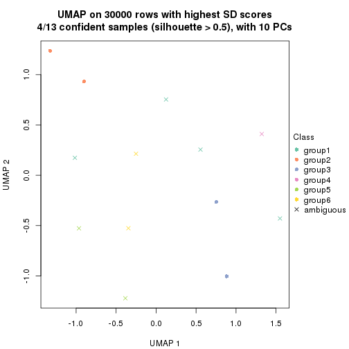</p>

</div>
<div id='tab-node-0232-dimension-reduction-6'>
<pre><code class="r">dimension_reduction(res, k = 7, method = &quot;UMAP&quot;)
</code></pre>

<p></p>

</div>
<div id='tab-node-0232-dimension-reduction-7'>
<pre><code class="r">dimension_reduction(res, k = 8, method = &quot;UMAP&quot;)
</code></pre>

<p></p>

</div>
</div>


Following heatmap shows how subgroups are split when increasing `k`:

```r
collect_classes(res)
```


If matrix rows can be associated to genes, consider to use `functional_enrichment(res,
...)` to perform function enrichment for the signature genes. See [this vignette](https://jokergoo.github.io/cola_vignettes/functional_enrichment.html) for more detailed explanations.


 

---------------------------------------------------


### Node024


Parent node: [Node02](#Node02).
Child nodes: 
                Node0111-leaf
        ,
                Node0112-leaf
        ,
                Node0113-leaf
        ,
                Node0114-leaf
        ,
                Node0131-leaf
        ,
                Node0132-leaf
        ,
                Node0133-leaf
        ,
                Node0141-leaf
        ,
                Node0142-leaf
        ,
                Node0143-leaf
        ,
                Node0211-leaf
        ,
                Node0212-leaf
        ,
                Node0221-leaf
        ,
                Node0222-leaf
        ,
                Node0223-leaf
        ,
                Node0224-leaf
        ,
                Node0231-leaf
        ,
                [Node0232](#Node0232)
        ,
                Node0233-leaf
        ,
                Node0234-leaf
        ,
                [Node0241](#Node0241)
        ,
                Node0242-leaf
        ,
                Node0243-leaf
        ,
                Node0244-leaf
        ,
                Node0251-leaf
        ,
                Node0252-leaf
        ,
                [Node0311](#Node0311)
        ,
                Node0312-leaf
        ,
                Node0313-leaf
        ,
                Node0331-leaf
        ,
                Node0332-leaf
        ,
                Node0333-leaf
        .


The object with results only for a single top-value method and a single partitioning method 
can be extracted as:

```r
res = res_rh["024"]
```

A summary of `res` and all the functions that can be applied to it:

```r
res
```

```
#> A 'ConsensusPartition' object with k = 2, 3, 4, 5, 6, 7, 8.
#>   On a matrix with 30000 rows and 41 columns.
#>   Top rows (1000) are extracted by 'ATC' method.
#>   Subgroups are detected by 'skmeans' method.
#>   Performed in total 350 partitions by row resampling.
#>   Best k for subgroups seems to be 4.
#> 
#> Following methods can be applied to this 'ConsensusPartition' object:
#>  [1] "cola_report"             "collect_classes"         "collect_plots"          
#>  [4] "collect_stats"           "colnames"                "compare_partitions"     
#>  [7] "compare_signatures"      "consensus_heatmap"       "dimension_reduction"    
#> [10] "functional_enrichment"   "get_anno_col"            "get_anno"               
#> [13] "get_classes"             "get_consensus"           "get_matrix"             
#> [16] "get_membership"          "get_param"               "get_signatures"         
#> [19] "get_stats"               "is_best_k"               "is_stable_k"            
#> [22] "membership_heatmap"      "ncol"                    "nrow"                   
#> [25] "plot_ecdf"               "predict_classes"         "rownames"               
#> [28] "select_partition_number" "show"                    "suggest_best_k"         
#> [31] "test_to_known_factors"   "top_rows_heatmap"
```

`collect_plots()` function collects all the plots made from `res` for all `k` (number of subgroups)
into one single page to provide an easy and fast comparison between different `k`.

```r
collect_plots(res)
```


The plots are:

- The first row: a plot of the eCDF (empirical cumulative distribution
  function) curves of the consensus matrix for each `k` and the heatmap of
  predicted classes for each `k`.
- The second row: heatmaps of the consensus matrix for each `k`.
- The third row: heatmaps of the membership matrix for each `k`.
- The fouth row: heatmaps of the signatures for each `k`.

All the plots in panels can be made by individual functions and they are
plotted later in this section.

`select_partition_number()` produces several plots showing different
statistics for choosing "optimized" `k`. There are following statistics:

- eCDF curves of the consensus matrix for each `k`;
- 1-PAC. [The PAC score](https://en.wikipedia.org/wiki/Consensus_clustering#Over-interpretation_potential_of_consensus_clustering)
  measures the proportion of the ambiguous subgrouping.
- Mean silhouette score.
- Concordance. The mean probability of fiting the consensus subgroup labels in all
  partitions.
- Area increased. Denote $A_k$ as the area under the eCDF curve for current
  `k`, the area increased is defined as $A_k - A_{k-1}$.
- Rand index. The percent of pairs of samples that are both in a same cluster
  or both are not in a same cluster in the partition of k and k-1.
- Jaccard index. The ratio of pairs of samples are both in a same cluster in
  the partition of k and k-1 and the pairs of samples are both in a same
  cluster in the partition k or k-1.

The detailed explanations of these statistics can be found in [the _cola_
vignette](https://jokergoo.github.io/cola_vignettes/cola.html#toc_13).

Generally speaking, higher 1-PAC score, higher mean silhouette score or higher
concordance corresponds to better partition. Rand index and Jaccard index
measure how similar the current partition is compared to partition with `k-1`.
If they are too similar, we won't accept `k` is better than `k-1`.

```r
select_partition_number(res)
```


The numeric values for all these statistics can be obtained by `get_stats()`.

```r
get_stats(res)
```

```
#>   k 1-PAC mean_silhouette concordance area_increased  Rand Jaccard
#> 2 2 1.000           1.000       1.000         0.4761 0.524   0.524
#> 3 3 0.818           0.980       0.972         0.1525 0.934   0.874
#> 4 4 1.000           0.988       0.994         0.2281 0.872   0.721
#> 5 5 0.883           0.922       0.949         0.0513 0.983   0.948
#> 6 6 0.839           0.904       0.914         0.0724 0.890   0.650
#> 7 7 0.891           0.866       0.942         0.0321 0.994   0.970
#> 8 8 0.936           0.809       0.940         0.0191 0.990   0.953
```

`suggest_best_k()` suggests the best $k$ based on these statistics. The rules are as follows:

- All $k$ with Jaccard index larger than 0.95 are removed because increasing
  $k$ does not provide enough extra information. If all $k$ are removed, it is
  marked as no subgroup is detected.
- For all $k$ with 1-PAC score larger than 0.9, the maximal $k$ is taken as
  the best $k$, and other $k$ are marked as optional $k$.
- If it does not fit the second rule. The $k$ with the maximal vote of the
  highest 1-PAC score, highest mean silhouette, and highest concordance is
  taken as the best $k$.

```r
suggest_best_k(res)
```

```
#> [1] 4
#> attr(,"optional")
#> [1] 2
```

There is also optional best $k$ = 2 that is worth to check.

Following is the table of the partitions (You need to click the **show/hide
code output** link to see it). The membership matrix (columns with name `p*`)
is inferred by
[`clue::cl_consensus()`](https://www.rdocumentation.org/link/cl_consensus?package=clue)
function with the `SE` method. Basically the value in the membership matrix
represents the probability to belong to a certain group. The finall subgroup
label for an item is determined with the group with highest probability it
belongs to.

In `get_classes()` function, the entropy is calculated from the membership
matrix and the silhouette score is calculated from the consensus matrix.


<script>
$( function() {
	$( '#tabs-node-024-get-classes' ).tabs();
} );
</script>
<div id='tabs-node-024-get-classes'>
<ul>
<li><a href='#tab-node-024-get-classes-1'>k = 2</a></li>
<li><a href='#tab-node-024-get-classes-2'>k = 3</a></li>
<li><a href='#tab-node-024-get-classes-3'>k = 4</a></li>
<li><a href='#tab-node-024-get-classes-4'>k = 5</a></li>
<li><a href='#tab-node-024-get-classes-5'>k = 6</a></li>
<li><a href='#tab-node-024-get-classes-6'>k = 7</a></li>
<li><a href='#tab-node-024-get-classes-7'>k = 8</a></li>
</ul>

<div id='tab-node-024-get-classes-1'>
<p><a id='tab-node-024-get-classes-1-a' style='color:#0366d6' href='#'>show/hide code output</a></p>
<pre><code class="r">cbind(get_classes(res, k = 2), get_membership(res, k = 2))
</code></pre>

<pre><code>#&gt;                 class entropy silhouette p1 p2
#&gt; TCGA.ET.A2N3.01     1       0          1  1  0
#&gt; TCGA.DJ.A3VM.01     1       0          1  1  0
#&gt; TCGA.IM.A41Z.01     1       0          1  1  0
#&gt; TCGA.EL.A4KI.01     2       0          1  0  1
#&gt; TCGA.BJ.A45K.01     2       0          1  0  1
#&gt; TCGA.BJ.A45C.01     2       0          1  0  1
#&gt; TCGA.FY.A4B0.01     2       0          1  0  1
#&gt; TCGA.EL.A4K6.01     2       0          1  0  1
#&gt; TCGA.EM.A4FK.01     1       0          1  1  0
#&gt; TCGA.DJ.A4UR.01     1       0          1  1  0
#&gt; TCGA.DE.A2OL.01     1       0          1  1  0
#&gt; TCGA.EM.A22J.01     1       0          1  1  0
#&gt; TCGA.EM.A3FN.01     1       0          1  1  0
#&gt; TCGA.ET.A2MY.11     1       0          1  1  0
#&gt; TCGA.EM.A2CL.01     2       0          1  0  1
#&gt; TCGA.H2.A2K9.01     2       0          1  0  1
#&gt; TCGA.EM.A22Q.01     2       0          1  0  1
#&gt; TCGA.EL.A3H1.01     1       0          1  1  0
#&gt; TCGA.J8.A3O0.01     2       0          1  0  1
#&gt; TCGA.FE.A239.01     2       0          1  0  1
#&gt; TCGA.EM.A2CM.01     1       0          1  1  0
#&gt; TCGA.BJ.A3F0.01     1       0          1  1  0
#&gt; TCGA.ET.A3DV.01     1       0          1  1  0
#&gt; TCGA.EM.A3AL.01     1       0          1  1  0
#&gt; TCGA.EM.A3ST.01     1       0          1  1  0
#&gt; TCGA.EL.A3GO.01     1       0          1  1  0
#&gt; TCGA.FK.A3SD.01     1       0          1  1  0
#&gt; TCGA.DJ.A2PP.01     2       0          1  0  1
#&gt; TCGA.FY.A3W9.01     1       0          1  1  0
#&gt; TCGA.DJ.A1QL.01     2       0          1  0  1
#&gt; TCGA.FY.A2QD.01     1       0          1  1  0
#&gt; TCGA.BJ.A28V.01     1       0          1  1  0
#&gt; TCGA.EM.A1YB.01     1       0          1  1  0
#&gt; TCGA.EM.A3FR.01     1       0          1  1  0
#&gt; TCGA.DJ.A13W.01     1       0          1  1  0
#&gt; TCGA.BJ.A0ZA.01     1       0          1  1  0
#&gt; TCGA.BJ.A0Z0.01     2       0          1  0  1
#&gt; TCGA.EM.A3OA.01     1       0          1  1  0
#&gt; TCGA.EM.A2CN.01     2       0          1  0  1
#&gt; TCGA.BJ.A0Z2.01     2       0          1  0  1
#&gt; TCGA.FY.A3I5.01     1       0          1  1  0
</code></pre>

<script>
$('#tab-node-024-get-classes-1-a').parent().next().next().hide();
$('#tab-node-024-get-classes-1-a').click(function(){
  $('#tab-node-024-get-classes-1-a').parent().next().next().toggle();
  return(false);
});
</script>
</div>

<div id='tab-node-024-get-classes-2'>
<p><a id='tab-node-024-get-classes-2-a' style='color:#0366d6' href='#'>show/hide code output</a></p>
<pre><code class="r">cbind(get_classes(res, k = 3), get_membership(res, k = 3))
</code></pre>

<pre><code>#&gt;                 class entropy silhouette   p1  p2   p3
#&gt; TCGA.ET.A2N3.01     1  0.0000      0.981 1.00 0.0 0.00
#&gt; TCGA.DJ.A3VM.01     1  0.2959      0.923 0.90 0.0 0.10
#&gt; TCGA.IM.A41Z.01     1  0.0000      0.981 1.00 0.0 0.00
#&gt; TCGA.EL.A4KI.01     3  0.2959      1.000 0.00 0.1 0.90
#&gt; TCGA.BJ.A45K.01     2  0.0000      1.000 0.00 1.0 0.00
#&gt; TCGA.BJ.A45C.01     2  0.0000      1.000 0.00 1.0 0.00
#&gt; TCGA.FY.A4B0.01     2  0.0000      1.000 0.00 1.0 0.00
#&gt; TCGA.EL.A4K6.01     3  0.2959      1.000 0.00 0.1 0.90
#&gt; TCGA.EM.A4FK.01     1  0.0000      0.981 1.00 0.0 0.00
#&gt; TCGA.DJ.A4UR.01     1  0.2959      0.923 0.90 0.0 0.10
#&gt; TCGA.DE.A2OL.01     1  0.0000      0.981 1.00 0.0 0.00
#&gt; TCGA.EM.A22J.01     1  0.0000      0.981 1.00 0.0 0.00
#&gt; TCGA.EM.A3FN.01     1  0.0000      0.981 1.00 0.0 0.00
#&gt; TCGA.ET.A2MY.11     1  0.0000      0.981 1.00 0.0 0.00
#&gt; TCGA.EM.A2CL.01     2  0.0000      1.000 0.00 1.0 0.00
#&gt; TCGA.H2.A2K9.01     3  0.2959      1.000 0.00 0.1 0.90
#&gt; TCGA.EM.A22Q.01     2  0.0000      1.000 0.00 1.0 0.00
#&gt; TCGA.EL.A3H1.01     1  0.0000      0.981 1.00 0.0 0.00
#&gt; TCGA.J8.A3O0.01     3  0.2959      1.000 0.00 0.1 0.90
#&gt; TCGA.FE.A239.01     2  0.0000      1.000 0.00 1.0 0.00
#&gt; TCGA.EM.A2CM.01     1  0.2959      0.923 0.90 0.0 0.10
#&gt; TCGA.BJ.A3F0.01     1  0.0000      0.981 1.00 0.0 0.00
#&gt; TCGA.ET.A3DV.01     1  0.0000      0.981 1.00 0.0 0.00
#&gt; TCGA.EM.A3AL.01     1  0.0000      0.981 1.00 0.0 0.00
#&gt; TCGA.EM.A3ST.01     1  0.2959      0.923 0.90 0.0 0.10
#&gt; TCGA.EL.A3GO.01     1  0.0892      0.971 0.98 0.0 0.02
#&gt; TCGA.FK.A3SD.01     1  0.0000      0.981 1.00 0.0 0.00
#&gt; TCGA.DJ.A2PP.01     2  0.0000      1.000 0.00 1.0 0.00
#&gt; TCGA.FY.A3W9.01     1  0.2959      0.923 0.90 0.0 0.10
#&gt; TCGA.DJ.A1QL.01     2  0.0000      1.000 0.00 1.0 0.00
#&gt; TCGA.FY.A2QD.01     1  0.0000      0.981 1.00 0.0 0.00
#&gt; TCGA.BJ.A28V.01     1  0.0000      0.981 1.00 0.0 0.00
#&gt; TCGA.EM.A1YB.01     1  0.0000      0.981 1.00 0.0 0.00
#&gt; TCGA.EM.A3FR.01     1  0.0000      0.981 1.00 0.0 0.00
#&gt; TCGA.DJ.A13W.01     1  0.0000      0.981 1.00 0.0 0.00
#&gt; TCGA.BJ.A0ZA.01     1  0.0892      0.971 0.98 0.0 0.02
#&gt; TCGA.BJ.A0Z0.01     2  0.0000      1.000 0.00 1.0 0.00
#&gt; TCGA.EM.A3OA.01     1  0.0000      0.981 1.00 0.0 0.00
#&gt; TCGA.EM.A2CN.01     3  0.2959      1.000 0.00 0.1 0.90
#&gt; TCGA.BJ.A0Z2.01     3  0.2959      1.000 0.00 0.1 0.90
#&gt; TCGA.FY.A3I5.01     1  0.0000      0.981 1.00 0.0 0.00
</code></pre>

<script>
$('#tab-node-024-get-classes-2-a').parent().next().next().hide();
$('#tab-node-024-get-classes-2-a').click(function(){
  $('#tab-node-024-get-classes-2-a').parent().next().next().toggle();
  return(false);
});
</script>
</div>

<div id='tab-node-024-get-classes-3'>
<p><a id='tab-node-024-get-classes-3-a' style='color:#0366d6' href='#'>show/hide code output</a></p>
<pre><code class="r">cbind(get_classes(res, k = 4), get_membership(res, k = 4))
</code></pre>

<pre><code>#&gt;                 class entropy silhouette   p1 p2 p3   p4
#&gt; TCGA.ET.A2N3.01     1   0.000      0.988 1.00  0  0 0.00
#&gt; TCGA.DJ.A3VM.01     4   0.000      1.000 0.00  0  0 1.00
#&gt; TCGA.IM.A41Z.01     1   0.000      0.988 1.00  0  0 0.00
#&gt; TCGA.EL.A4KI.01     3   0.000      1.000 0.00  0  1 0.00
#&gt; TCGA.BJ.A45K.01     2   0.000      1.000 0.00  1  0 0.00
#&gt; TCGA.BJ.A45C.01     2   0.000      1.000 0.00  1  0 0.00
#&gt; TCGA.FY.A4B0.01     2   0.000      1.000 0.00  1  0 0.00
#&gt; TCGA.EL.A4K6.01     3   0.000      1.000 0.00  0  1 0.00
#&gt; TCGA.EM.A4FK.01     1   0.000      0.988 1.00  0  0 0.00
#&gt; TCGA.DJ.A4UR.01     4   0.000      1.000 0.00  0  0 1.00
#&gt; TCGA.DE.A2OL.01     1   0.000      0.988 1.00  0  0 0.00
#&gt; TCGA.EM.A22J.01     1   0.000      0.988 1.00  0  0 0.00
#&gt; TCGA.EM.A3FN.01     1   0.000      0.988 1.00  0  0 0.00
#&gt; TCGA.ET.A2MY.11     1   0.000      0.988 1.00  0  0 0.00
#&gt; TCGA.EM.A2CL.01     2   0.000      1.000 0.00  1  0 0.00
#&gt; TCGA.H2.A2K9.01     3   0.000      1.000 0.00  0  1 0.00
#&gt; TCGA.EM.A22Q.01     2   0.000      1.000 0.00  1  0 0.00
#&gt; TCGA.EL.A3H1.01     1   0.000      0.988 1.00  0  0 0.00
#&gt; TCGA.J8.A3O0.01     3   0.000      1.000 0.00  0  1 0.00
#&gt; TCGA.FE.A239.01     2   0.000      1.000 0.00  1  0 0.00
#&gt; TCGA.EM.A2CM.01     4   0.000      1.000 0.00  0  0 1.00
#&gt; TCGA.BJ.A3F0.01     1   0.000      0.988 1.00  0  0 0.00
#&gt; TCGA.ET.A3DV.01     1   0.000      0.988 1.00  0  0 0.00
#&gt; TCGA.EM.A3AL.01     1   0.000      0.988 1.00  0  0 0.00
#&gt; TCGA.EM.A3ST.01     4   0.000      1.000 0.00  0  0 1.00
#&gt; TCGA.EL.A3GO.01     1   0.265      0.870 0.88  0  0 0.12
#&gt; TCGA.FK.A3SD.01     1   0.000      0.988 1.00  0  0 0.00
#&gt; TCGA.DJ.A2PP.01     2   0.000      1.000 0.00  1  0 0.00
#&gt; TCGA.FY.A3W9.01     4   0.000      1.000 0.00  0  0 1.00
#&gt; TCGA.DJ.A1QL.01     2   0.000      1.000 0.00  1  0 0.00
#&gt; TCGA.FY.A2QD.01     1   0.000      0.988 1.00  0  0 0.00
#&gt; TCGA.BJ.A28V.01     1   0.000      0.988 1.00  0  0 0.00
#&gt; TCGA.EM.A1YB.01     1   0.000      0.988 1.00  0  0 0.00
#&gt; TCGA.EM.A3FR.01     1   0.000      0.988 1.00  0  0 0.00
#&gt; TCGA.DJ.A13W.01     1   0.000      0.988 1.00  0  0 0.00
#&gt; TCGA.BJ.A0ZA.01     1   0.265      0.870 0.88  0  0 0.12
#&gt; TCGA.BJ.A0Z0.01     2   0.000      1.000 0.00  1  0 0.00
#&gt; TCGA.EM.A3OA.01     1   0.000      0.988 1.00  0  0 0.00
#&gt; TCGA.EM.A2CN.01     3   0.000      1.000 0.00  0  1 0.00
#&gt; TCGA.BJ.A0Z2.01     3   0.000      1.000 0.00  0  1 0.00
#&gt; TCGA.FY.A3I5.01     1   0.000      0.988 1.00  0  0 0.00
</code></pre>

<script>
$('#tab-node-024-get-classes-3-a').parent().next().next().hide();
$('#tab-node-024-get-classes-3-a').click(function(){
  $('#tab-node-024-get-classes-3-a').parent().next().next().toggle();
  return(false);
});
</script>
</div>

<div id='tab-node-024-get-classes-4'>
<p><a id='tab-node-024-get-classes-4-a' style='color:#0366d6' href='#'>show/hide code output</a></p>
<pre><code class="r">cbind(get_classes(res, k = 5), get_membership(res, k = 5))
</code></pre>

<pre><code>#&gt;                 class entropy silhouette   p1   p2   p3   p4   p5
#&gt; TCGA.ET.A2N3.01     1   0.000      0.933 1.00 0.00 0.00 0.00 0.00
#&gt; TCGA.DJ.A3VM.01     4   0.000      1.000 0.00 0.00 0.00 1.00 0.00
#&gt; TCGA.IM.A41Z.01     1   0.273      0.846 0.84 0.00 0.00 0.00 0.16
#&gt; TCGA.EL.A4KI.01     3   0.000      0.950 0.00 0.00 1.00 0.00 0.00
#&gt; TCGA.BJ.A45K.01     2   0.000      1.000 0.00 1.00 0.00 0.00 0.00
#&gt; TCGA.BJ.A45C.01     2   0.000      1.000 0.00 1.00 0.00 0.00 0.00
#&gt; TCGA.FY.A4B0.01     2   0.000      1.000 0.00 1.00 0.00 0.00 0.00
#&gt; TCGA.EL.A4K6.01     3   0.000      0.950 0.00 0.00 1.00 0.00 0.00
#&gt; TCGA.EM.A4FK.01     1   0.000      0.933 1.00 0.00 0.00 0.00 0.00
#&gt; TCGA.DJ.A4UR.01     4   0.000      1.000 0.00 0.00 0.00 1.00 0.00
#&gt; TCGA.DE.A2OL.01     1   0.000      0.933 1.00 0.00 0.00 0.00 0.00
#&gt; TCGA.EM.A22J.01     1   0.273      0.846 0.84 0.00 0.00 0.00 0.16
#&gt; TCGA.EM.A3FN.01     1   0.000      0.933 1.00 0.00 0.00 0.00 0.00
#&gt; TCGA.ET.A2MY.11     1   0.000      0.933 1.00 0.00 0.00 0.00 0.00
#&gt; TCGA.EM.A2CL.01     2   0.000      1.000 0.00 1.00 0.00 0.00 0.00
#&gt; TCGA.H2.A2K9.01     3   0.228      0.892 0.00 0.00 0.88 0.00 0.12
#&gt; TCGA.EM.A22Q.01     5   0.380      0.801 0.00 0.30 0.00 0.00 0.70
#&gt; TCGA.EL.A3H1.01     1   0.000      0.933 1.00 0.00 0.00 0.00 0.00
#&gt; TCGA.J8.A3O0.01     3   0.228      0.892 0.00 0.00 0.88 0.00 0.12
#&gt; TCGA.FE.A239.01     2   0.000      1.000 0.00 1.00 0.00 0.00 0.00
#&gt; TCGA.EM.A2CM.01     4   0.000      1.000 0.00 0.00 0.00 1.00 0.00
#&gt; TCGA.BJ.A3F0.01     1   0.273      0.846 0.84 0.00 0.00 0.00 0.16
#&gt; TCGA.ET.A3DV.01     1   0.000      0.933 1.00 0.00 0.00 0.00 0.00
#&gt; TCGA.EM.A3AL.01     1   0.000      0.933 1.00 0.00 0.00 0.00 0.00
#&gt; TCGA.EM.A3ST.01     4   0.000      1.000 0.00 0.00 0.00 1.00 0.00
#&gt; TCGA.EL.A3GO.01     1   0.544      0.648 0.66 0.00 0.00 0.18 0.16
#&gt; TCGA.FK.A3SD.01     1   0.000      0.933 1.00 0.00 0.00 0.00 0.00
#&gt; TCGA.DJ.A2PP.01     2   0.000      1.000 0.00 1.00 0.00 0.00 0.00
#&gt; TCGA.FY.A3W9.01     4   0.000      1.000 0.00 0.00 0.00 1.00 0.00
#&gt; TCGA.DJ.A1QL.01     2   0.000      1.000 0.00 1.00 0.00 0.00 0.00
#&gt; TCGA.FY.A2QD.01     1   0.000      0.933 1.00 0.00 0.00 0.00 0.00
#&gt; TCGA.BJ.A28V.01     1   0.000      0.933 1.00 0.00 0.00 0.00 0.00
#&gt; TCGA.EM.A1YB.01     1   0.273      0.846 0.84 0.00 0.00 0.00 0.16
#&gt; TCGA.EM.A3FR.01     1   0.000      0.933 1.00 0.00 0.00 0.00 0.00
#&gt; TCGA.DJ.A13W.01     1   0.000      0.933 1.00 0.00 0.00 0.00 0.00
#&gt; TCGA.BJ.A0ZA.01     1   0.585      0.549 0.60 0.00 0.00 0.24 0.16
#&gt; TCGA.BJ.A0Z0.01     5   0.273      0.828 0.00 0.16 0.00 0.00 0.84
#&gt; TCGA.EM.A3OA.01     1   0.000      0.933 1.00 0.00 0.00 0.00 0.00
#&gt; TCGA.EM.A2CN.01     3   0.000      0.950 0.00 0.00 1.00 0.00 0.00
#&gt; TCGA.BJ.A0Z2.01     3   0.000      0.950 0.00 0.00 1.00 0.00 0.00
#&gt; TCGA.FY.A3I5.01     1   0.000      0.933 1.00 0.00 0.00 0.00 0.00
</code></pre>

<script>
$('#tab-node-024-get-classes-4-a').parent().next().next().hide();
$('#tab-node-024-get-classes-4-a').click(function(){
  $('#tab-node-024-get-classes-4-a').parent().next().next().toggle();
  return(false);
});
</script>
</div>

<div id='tab-node-024-get-classes-5'>
<p><a id='tab-node-024-get-classes-5-a' style='color:#0366d6' href='#'>show/hide code output</a></p>
<pre><code class="r">cbind(get_classes(res, k = 6), get_membership(res, k = 6))
</code></pre>

<pre><code>#&gt;                 class entropy silhouette   p1   p2   p3   p4   p5   p6
#&gt; TCGA.ET.A2N3.01     1  0.0000      1.000 1.00 0.00 0.00 0.00 0.00 0.00
#&gt; TCGA.DJ.A3VM.01     4  0.0000      0.974 0.00 0.00 0.00 1.00 0.00 0.00
#&gt; TCGA.IM.A41Z.01     6  0.3756      0.808 0.40 0.00 0.00 0.00 0.00 0.60
#&gt; TCGA.EL.A4KI.01     3  0.0000      0.897 0.00 0.00 1.00 0.00 0.00 0.00
#&gt; TCGA.BJ.A45K.01     2  0.0000      1.000 0.00 1.00 0.00 0.00 0.00 0.00
#&gt; TCGA.BJ.A45C.01     2  0.0000      1.000 0.00 1.00 0.00 0.00 0.00 0.00
#&gt; TCGA.FY.A4B0.01     2  0.0000      1.000 0.00 1.00 0.00 0.00 0.00 0.00
#&gt; TCGA.EL.A4K6.01     3  0.0000      0.897 0.00 0.00 1.00 0.00 0.00 0.00
#&gt; TCGA.EM.A4FK.01     1  0.0000      1.000 1.00 0.00 0.00 0.00 0.00 0.00
#&gt; TCGA.DJ.A4UR.01     4  0.0000      0.974 0.00 0.00 0.00 1.00 0.00 0.00
#&gt; TCGA.DE.A2OL.01     1  0.0000      1.000 1.00 0.00 0.00 0.00 0.00 0.00
#&gt; TCGA.EM.A22J.01     6  0.3647      0.828 0.36 0.00 0.00 0.00 0.00 0.64
#&gt; TCGA.EM.A3FN.01     1  0.0000      1.000 1.00 0.00 0.00 0.00 0.00 0.00
#&gt; TCGA.ET.A2MY.11     1  0.0000      1.000 1.00 0.00 0.00 0.00 0.00 0.00
#&gt; TCGA.EM.A2CL.01     2  0.0000      1.000 0.00 1.00 0.00 0.00 0.00 0.00
#&gt; TCGA.H2.A2K9.01     3  0.4929      0.614 0.00 0.00 0.62 0.00 0.10 0.28
#&gt; TCGA.EM.A22Q.01     5  0.5095      0.281 0.00 0.42 0.00 0.00 0.50 0.08
#&gt; TCGA.EL.A3H1.01     1  0.0000      1.000 1.00 0.00 0.00 0.00 0.00 0.00
#&gt; TCGA.J8.A3O0.01     3  0.3321      0.796 0.00 0.00 0.82 0.00 0.10 0.08
#&gt; TCGA.FE.A239.01     2  0.0000      1.000 0.00 1.00 0.00 0.00 0.00 0.00
#&gt; TCGA.EM.A2CM.01     4  0.0937      0.947 0.00 0.00 0.00 0.96 0.00 0.04
#&gt; TCGA.BJ.A3F0.01     6  0.3869      0.630 0.50 0.00 0.00 0.00 0.00 0.50
#&gt; TCGA.ET.A3DV.01     1  0.0000      1.000 1.00 0.00 0.00 0.00 0.00 0.00
#&gt; TCGA.EM.A3AL.01     1  0.0000      1.000 1.00 0.00 0.00 0.00 0.00 0.00
#&gt; TCGA.EM.A3ST.01     4  0.1267      0.932 0.00 0.00 0.00 0.94 0.00 0.06
#&gt; TCGA.EL.A3GO.01     6  0.4863      0.702 0.20 0.00 0.00 0.14 0.00 0.66
#&gt; TCGA.FK.A3SD.01     1  0.0000      1.000 1.00 0.00 0.00 0.00 0.00 0.00
#&gt; TCGA.DJ.A2PP.01     2  0.0000      1.000 0.00 1.00 0.00 0.00 0.00 0.00
#&gt; TCGA.FY.A3W9.01     4  0.0000      0.974 0.00 0.00 0.00 1.00 0.00 0.00
#&gt; TCGA.DJ.A1QL.01     2  0.0000      1.000 0.00 1.00 0.00 0.00 0.00 0.00
#&gt; TCGA.FY.A2QD.01     1  0.0000      1.000 1.00 0.00 0.00 0.00 0.00 0.00
#&gt; TCGA.BJ.A28V.01     1  0.0000      1.000 1.00 0.00 0.00 0.00 0.00 0.00
#&gt; TCGA.EM.A1YB.01     6  0.3706      0.824 0.38 0.00 0.00 0.00 0.00 0.62
#&gt; TCGA.EM.A3FR.01     1  0.0000      1.000 1.00 0.00 0.00 0.00 0.00 0.00
#&gt; TCGA.DJ.A13W.01     1  0.0000      1.000 1.00 0.00 0.00 0.00 0.00 0.00
#&gt; TCGA.BJ.A0ZA.01     6  0.4863      0.702 0.20 0.00 0.00 0.14 0.00 0.66
#&gt; TCGA.BJ.A0Z0.01     5  0.0937      0.474 0.00 0.04 0.00 0.00 0.96 0.00
#&gt; TCGA.EM.A3OA.01     1  0.0000      1.000 1.00 0.00 0.00 0.00 0.00 0.00
#&gt; TCGA.EM.A2CN.01     3  0.0000      0.897 0.00 0.00 1.00 0.00 0.00 0.00
#&gt; TCGA.BJ.A0Z2.01     3  0.0000      0.897 0.00 0.00 1.00 0.00 0.00 0.00
#&gt; TCGA.FY.A3I5.01     1  0.0000      1.000 1.00 0.00 0.00 0.00 0.00 0.00
</code></pre>

<script>
$('#tab-node-024-get-classes-5-a').parent().next().next().hide();
$('#tab-node-024-get-classes-5-a').click(function(){
  $('#tab-node-024-get-classes-5-a').parent().next().next().toggle();
  return(false);
});
</script>
</div>

<div id='tab-node-024-get-classes-6'>
<p><a id='tab-node-024-get-classes-6-a' style='color:#0366d6' href='#'>show/hide code output</a></p>
<pre><code class="r">cbind(get_classes(res, k = 7), get_membership(res, k = 7))
</code></pre>

<pre><code>#&gt;                 class entropy silhouette   p1   p2   p3   p4   p5   p6   p7
#&gt; TCGA.ET.A2N3.01     1  0.0000      1.000 1.00 0.00 0.00 0.00 0.00 0.00 0.00
#&gt; TCGA.DJ.A3VM.01     4  0.0000      0.947 0.00 0.00 0.00 1.00 0.00 0.00 0.00
#&gt; TCGA.IM.A41Z.01     6  0.2832      0.799 0.24 0.00 0.00 0.00 0.00 0.76 0.00
#&gt; TCGA.EL.A4KI.01     3  0.0000      0.918 0.00 0.00 1.00 0.00 0.00 0.00 0.00
#&gt; TCGA.BJ.A45K.01     2  0.0000      0.989 0.00 1.00 0.00 0.00 0.00 0.00 0.00
#&gt; TCGA.BJ.A45C.01     2  0.0000      0.989 0.00 1.00 0.00 0.00 0.00 0.00 0.00
#&gt; TCGA.FY.A4B0.01     2  0.0504      0.986 0.00 0.98 0.00 0.00 0.00 0.00 0.02
#&gt; TCGA.EL.A4K6.01     3  0.0000      0.918 0.00 0.00 1.00 0.00 0.00 0.00 0.00
#&gt; TCGA.EM.A4FK.01     1  0.0000      1.000 1.00 0.00 0.00 0.00 0.00 0.00 0.00
#&gt; TCGA.DJ.A4UR.01     4  0.0000      0.947 0.00 0.00 0.00 1.00 0.00 0.00 0.00
#&gt; TCGA.DE.A2OL.01     1  0.0000      1.000 1.00 0.00 0.00 0.00 0.00 0.00 0.00
#&gt; TCGA.EM.A22J.01     6  0.2708      0.809 0.22 0.00 0.00 0.00 0.00 0.78 0.00
#&gt; TCGA.EM.A3FN.01     1  0.0000      1.000 1.00 0.00 0.00 0.00 0.00 0.00 0.00
#&gt; TCGA.ET.A2MY.11     1  0.0000      1.000 1.00 0.00 0.00 0.00 0.00 0.00 0.00
#&gt; TCGA.EM.A2CL.01     2  0.0000      0.989 0.00 1.00 0.00 0.00 0.00 0.00 0.00
#&gt; TCGA.H2.A2K9.01     7  0.1664      0.000 0.00 0.00 0.06 0.00 0.02 0.00 0.92
#&gt; TCGA.EM.A22Q.01     5  0.5467      0.191 0.00 0.28 0.00 0.00 0.46 0.00 0.26
#&gt; TCGA.EL.A3H1.01     1  0.0000      1.000 1.00 0.00 0.00 0.00 0.00 0.00 0.00
#&gt; TCGA.J8.A3O0.01     3  0.3795      0.571 0.00 0.00 0.72 0.00 0.06 0.00 0.22
#&gt; TCGA.FE.A239.01     2  0.0504      0.986 0.00 0.98 0.00 0.00 0.00 0.00 0.02
#&gt; TCGA.EM.A2CM.01     4  0.1886      0.865 0.00 0.00 0.00 0.88 0.00 0.12 0.00
#&gt; TCGA.BJ.A3F0.01     6  0.3358      0.656 0.36 0.00 0.00 0.00 0.00 0.64 0.00
#&gt; TCGA.ET.A3DV.01     1  0.0000      1.000 1.00 0.00 0.00 0.00 0.00 0.00 0.00
#&gt; TCGA.EM.A3AL.01     1  0.0000      1.000 1.00 0.00 0.00 0.00 0.00 0.00 0.00
#&gt; TCGA.EM.A3ST.01     4  0.1363      0.913 0.00 0.00 0.00 0.94 0.00 0.04 0.02
#&gt; TCGA.EL.A3GO.01     6  0.1363      0.561 0.00 0.00 0.00 0.04 0.00 0.94 0.02
#&gt; TCGA.FK.A3SD.01     1  0.0000      1.000 1.00 0.00 0.00 0.00 0.00 0.00 0.00
#&gt; TCGA.DJ.A2PP.01     2  0.0504      0.986 0.00 0.98 0.00 0.00 0.00 0.00 0.02
#&gt; TCGA.FY.A3W9.01     4  0.0504      0.943 0.00 0.00 0.00 0.98 0.00 0.02 0.00
#&gt; TCGA.DJ.A1QL.01     2  0.0000      0.989 0.00 1.00 0.00 0.00 0.00 0.00 0.00
#&gt; TCGA.FY.A2QD.01     1  0.0000      1.000 1.00 0.00 0.00 0.00 0.00 0.00 0.00
#&gt; TCGA.BJ.A28V.01     1  0.0000      1.000 1.00 0.00 0.00 0.00 0.00 0.00 0.00
#&gt; TCGA.EM.A1YB.01     6  0.2708      0.809 0.22 0.00 0.00 0.00 0.00 0.78 0.00
#&gt; TCGA.EM.A3FR.01     1  0.0000      1.000 1.00 0.00 0.00 0.00 0.00 0.00 0.00
#&gt; TCGA.DJ.A13W.01     1  0.0000      1.000 1.00 0.00 0.00 0.00 0.00 0.00 0.00
#&gt; TCGA.BJ.A0ZA.01     6  0.2016      0.671 0.06 0.00 0.00 0.04 0.00 0.90 0.00
#&gt; TCGA.BJ.A0Z0.01     5  0.0000      0.227 0.00 0.00 0.00 0.00 1.00 0.00 0.00
#&gt; TCGA.EM.A3OA.01     1  0.0000      1.000 1.00 0.00 0.00 0.00 0.00 0.00 0.00
#&gt; TCGA.EM.A2CN.01     3  0.0000      0.918 0.00 0.00 1.00 0.00 0.00 0.00 0.00
#&gt; TCGA.BJ.A0Z2.01     3  0.0000      0.918 0.00 0.00 1.00 0.00 0.00 0.00 0.00
#&gt; TCGA.FY.A3I5.01     1  0.0000      1.000 1.00 0.00 0.00 0.00 0.00 0.00 0.00
</code></pre>

<script>
$('#tab-node-024-get-classes-6-a').parent().next().next().hide();
$('#tab-node-024-get-classes-6-a').click(function(){
  $('#tab-node-024-get-classes-6-a').parent().next().next().toggle();
  return(false);
});
</script>
</div>

<div id='tab-node-024-get-classes-7'>
<p><a id='tab-node-024-get-classes-7-a' style='color:#0366d6' href='#'>show/hide code output</a></p>
<pre><code class="r">cbind(get_classes(res, k = 8), get_membership(res, k = 8))
</code></pre>

<pre><code>#&gt;                 class entropy silhouette   p1   p2   p3   p4   p5   p6   p7   p8
#&gt; TCGA.ET.A2N3.01     1  0.0000      0.997 1.00 0.00 0.00 0.00 0.00 0.00 0.00 0.00
#&gt; TCGA.DJ.A3VM.01     8  0.0000      0.871 0.00 0.00 0.00 0.00 0.00 0.00 0.00 1.00
#&gt; TCGA.IM.A41Z.01     6  0.1563      0.825 0.10 0.00 0.00 0.00 0.00 0.90 0.00 0.00
#&gt; TCGA.EL.A4KI.01     3  0.0000      0.903 0.00 0.00 1.00 0.00 0.00 0.00 0.00 0.00
#&gt; TCGA.BJ.A45K.01     2  0.0000      0.892 0.00 1.00 0.00 0.00 0.00 0.00 0.00 0.00
#&gt; TCGA.BJ.A45C.01     2  0.0000      0.892 0.00 1.00 0.00 0.00 0.00 0.00 0.00 0.00
#&gt; TCGA.FY.A4B0.01     2  0.0000      0.892 0.00 1.00 0.00 0.00 0.00 0.00 0.00 0.00
#&gt; TCGA.EL.A4K6.01     3  0.0000      0.903 0.00 0.00 1.00 0.00 0.00 0.00 0.00 0.00
#&gt; TCGA.EM.A4FK.01     1  0.0808      0.955 0.96 0.00 0.00 0.00 0.00 0.04 0.00 0.00
#&gt; TCGA.DJ.A4UR.01     8  0.0000      0.871 0.00 0.00 0.00 0.00 0.00 0.00 0.00 1.00
#&gt; TCGA.DE.A2OL.01     1  0.0000      0.997 1.00 0.00 0.00 0.00 0.00 0.00 0.00 0.00
#&gt; TCGA.EM.A22J.01     6  0.1341      0.835 0.08 0.00 0.00 0.00 0.00 0.92 0.00 0.00
#&gt; TCGA.EM.A3FN.01     1  0.0000      0.997 1.00 0.00 0.00 0.00 0.00 0.00 0.00 0.00
#&gt; TCGA.ET.A2MY.11     1  0.0000      0.997 1.00 0.00 0.00 0.00 0.00 0.00 0.00 0.00
#&gt; TCGA.EM.A2CL.01     2  0.0000      0.892 0.00 1.00 0.00 0.00 0.00 0.00 0.00 0.00
#&gt; TCGA.H2.A2K9.01     7  0.0000      0.000 0.00 0.00 0.00 0.00 0.00 0.00 1.00 0.00
#&gt; TCGA.EM.A22Q.01     2  0.6655     -0.398 0.00 0.26 0.00 0.26 0.26 0.00 0.22 0.00
#&gt; TCGA.EL.A3H1.01     1  0.0000      0.997 1.00 0.00 0.00 0.00 0.00 0.00 0.00 0.00
#&gt; TCGA.J8.A3O0.01     3  0.4489      0.464 0.00 0.00 0.64 0.04 0.06 0.00 0.26 0.00
#&gt; TCGA.FE.A239.01     2  0.0000      0.892 0.00 1.00 0.00 0.00 0.00 0.00 0.00 0.00
#&gt; TCGA.EM.A2CM.01     8  0.1275      0.835 0.00 0.00 0.00 0.02 0.00 0.04 0.00 0.94
#&gt; TCGA.BJ.A3F0.01     6  0.2650      0.650 0.24 0.00 0.00 0.00 0.00 0.76 0.00 0.00
#&gt; TCGA.ET.A3DV.01     1  0.0000      0.997 1.00 0.00 0.00 0.00 0.00 0.00 0.00 0.00
#&gt; TCGA.EM.A3AL.01     1  0.0000      0.997 1.00 0.00 0.00 0.00 0.00 0.00 0.00 0.00
#&gt; TCGA.EM.A3ST.01     8  0.3318      0.425 0.00 0.00 0.00 0.46 0.00 0.00 0.00 0.54
#&gt; TCGA.EL.A3GO.01     6  0.2852      0.545 0.00 0.00 0.00 0.28 0.00 0.72 0.00 0.00
#&gt; TCGA.FK.A3SD.01     1  0.0000      0.997 1.00 0.00 0.00 0.00 0.00 0.00 0.00 0.00
#&gt; TCGA.DJ.A2PP.01     2  0.0000      0.892 0.00 1.00 0.00 0.00 0.00 0.00 0.00 0.00
#&gt; TCGA.FY.A3W9.01     8  0.0000      0.871 0.00 0.00 0.00 0.00 0.00 0.00 0.00 1.00
#&gt; TCGA.DJ.A1QL.01     2  0.0000      0.892 0.00 1.00 0.00 0.00 0.00 0.00 0.00 0.00
#&gt; TCGA.FY.A2QD.01     1  0.0000      0.997 1.00 0.00 0.00 0.00 0.00 0.00 0.00 0.00
#&gt; TCGA.BJ.A28V.01     1  0.0000      0.997 1.00 0.00 0.00 0.00 0.00 0.00 0.00 0.00
#&gt; TCGA.EM.A1YB.01     6  0.1091      0.831 0.06 0.00 0.00 0.00 0.00 0.94 0.00 0.00
#&gt; TCGA.EM.A3FR.01     1  0.0000      0.997 1.00 0.00 0.00 0.00 0.00 0.00 0.00 0.00
#&gt; TCGA.DJ.A13W.01     1  0.0000      0.997 1.00 0.00 0.00 0.00 0.00 0.00 0.00 0.00
#&gt; TCGA.BJ.A0ZA.01     6  0.0941      0.794 0.02 0.00 0.00 0.00 0.00 0.96 0.00 0.02
#&gt; TCGA.BJ.A0Z0.01     5  0.0000      0.000 0.00 0.00 0.00 0.00 1.00 0.00 0.00 0.00
#&gt; TCGA.EM.A3OA.01     1  0.0000      0.997 1.00 0.00 0.00 0.00 0.00 0.00 0.00 0.00
#&gt; TCGA.EM.A2CN.01     3  0.0000      0.903 0.00 0.00 1.00 0.00 0.00 0.00 0.00 0.00
#&gt; TCGA.BJ.A0Z2.01     3  0.0000      0.903 0.00 0.00 1.00 0.00 0.00 0.00 0.00 0.00
#&gt; TCGA.FY.A3I5.01     1  0.0000      0.997 1.00 0.00 0.00 0.00 0.00 0.00 0.00 0.00
</code></pre>

<script>
$('#tab-node-024-get-classes-7-a').parent().next().next().hide();
$('#tab-node-024-get-classes-7-a').click(function(){
  $('#tab-node-024-get-classes-7-a').parent().next().next().toggle();
  return(false);
});
</script>
</div>
</div>

Heatmaps for the consensus matrix. It visualizes the probability of two
samples to be in a same group.


<script>
$( function() {
	$( '#tabs-node-024-consensus-heatmap' ).tabs();
} );
</script>
<div id='tabs-node-024-consensus-heatmap'>
<ul>
<li><a href='#tab-node-024-consensus-heatmap-1'>k = 2</a></li>
<li><a href='#tab-node-024-consensus-heatmap-2'>k = 3</a></li>
<li><a href='#tab-node-024-consensus-heatmap-3'>k = 4</a></li>
<li><a href='#tab-node-024-consensus-heatmap-4'>k = 5</a></li>
<li><a href='#tab-node-024-consensus-heatmap-5'>k = 6</a></li>
<li><a href='#tab-node-024-consensus-heatmap-6'>k = 7</a></li>
<li><a href='#tab-node-024-consensus-heatmap-7'>k = 8</a></li>
</ul>
<div id='tab-node-024-consensus-heatmap-1'>
<pre><code class="r">consensus_heatmap(res, k = 2)
</code></pre>

<p></p>

</div>
<div id='tab-node-024-consensus-heatmap-2'>
<pre><code class="r">consensus_heatmap(res, k = 3)
</code></pre>

<p></p>

</div>
<div id='tab-node-024-consensus-heatmap-3'>
<pre><code class="r">consensus_heatmap(res, k = 4)
</code></pre>

<p></p>

</div>
<div id='tab-node-024-consensus-heatmap-4'>
<pre><code class="r">consensus_heatmap(res, k = 5)
</code></pre>

<p></p>

</div>
<div id='tab-node-024-consensus-heatmap-5'>
<pre><code class="r">consensus_heatmap(res, k = 6)
</code></pre>

<p></p>

</div>
<div id='tab-node-024-consensus-heatmap-6'>
<pre><code class="r">consensus_heatmap(res, k = 7)
</code></pre>

<p></p>

</div>
<div id='tab-node-024-consensus-heatmap-7'>
<pre><code class="r">consensus_heatmap(res, k = 8)
</code></pre>

<p></p>

</div>
</div>

Heatmaps for the membership of samples in all partitions to see how consistent they are:


<script>
$( function() {
	$( '#tabs-node-024-membership-heatmap' ).tabs();
} );
</script>
<div id='tabs-node-024-membership-heatmap'>
<ul>
<li><a href='#tab-node-024-membership-heatmap-1'>k = 2</a></li>
<li><a href='#tab-node-024-membership-heatmap-2'>k = 3</a></li>
<li><a href='#tab-node-024-membership-heatmap-3'>k = 4</a></li>
<li><a href='#tab-node-024-membership-heatmap-4'>k = 5</a></li>
<li><a href='#tab-node-024-membership-heatmap-5'>k = 6</a></li>
<li><a href='#tab-node-024-membership-heatmap-6'>k = 7</a></li>
<li><a href='#tab-node-024-membership-heatmap-7'>k = 8</a></li>
</ul>
<div id='tab-node-024-membership-heatmap-1'>
<pre><code class="r">membership_heatmap(res, k = 2)
</code></pre>

<p></p>

</div>
<div id='tab-node-024-membership-heatmap-2'>
<pre><code class="r">membership_heatmap(res, k = 3)
</code></pre>

<p></p>

</div>
<div id='tab-node-024-membership-heatmap-3'>
<pre><code class="r">membership_heatmap(res, k = 4)
</code></pre>

<p></p>

</div>
<div id='tab-node-024-membership-heatmap-4'>
<pre><code class="r">membership_heatmap(res, k = 5)
</code></pre>

<p></p>

</div>
<div id='tab-node-024-membership-heatmap-5'>
<pre><code class="r">membership_heatmap(res, k = 6)
</code></pre>

<p></p>

</div>
<div id='tab-node-024-membership-heatmap-6'>
<pre><code class="r">membership_heatmap(res, k = 7)
</code></pre>

<p></p>

</div>
<div id='tab-node-024-membership-heatmap-7'>
<pre><code class="r">membership_heatmap(res, k = 8)
</code></pre>

<p></p>

</div>
</div>

As soon as the classes for columns are determined, the signatures
that are significantly different between subgroups can be looked for. 
Following are the heatmaps for signatures.


<script>
$( function() {
	$( '#tabs-node-024-get-signatures' ).tabs();
} );
</script>
<div id='tabs-node-024-get-signatures'>
<ul>
<li><a href='#tab-node-024-get-signatures-1'>k = 2</a></li>
<li><a href='#tab-node-024-get-signatures-2'>k = 3</a></li>
<li><a href='#tab-node-024-get-signatures-3'>k = 4</a></li>
<li><a href='#tab-node-024-get-signatures-4'>k = 5</a></li>
<li><a href='#tab-node-024-get-signatures-5'>k = 6</a></li>
<li><a href='#tab-node-024-get-signatures-6'>k = 7</a></li>
<li><a href='#tab-node-024-get-signatures-7'>k = 8</a></li>
</ul>
<div id='tab-node-024-get-signatures-1'>
<pre><code class="r">get_signatures(res, k = 2)
</code></pre>

<p></p>

</div>
<div id='tab-node-024-get-signatures-2'>
<pre><code class="r">get_signatures(res, k = 3)
</code></pre>

<p></p>

</div>
<div id='tab-node-024-get-signatures-3'>
<pre><code class="r">get_signatures(res, k = 4)
</code></pre>

<p></p>

</div>
<div id='tab-node-024-get-signatures-4'>
<pre><code class="r">get_signatures(res, k = 5)
</code></pre>

<p></p>

</div>
<div id='tab-node-024-get-signatures-5'>
<pre><code class="r">get_signatures(res, k = 6)
</code></pre>

<p></p>

</div>
<div id='tab-node-024-get-signatures-6'>
<pre><code class="r">get_signatures(res, k = 7)
</code></pre>

<p></p>

</div>
<div id='tab-node-024-get-signatures-7'>
<pre><code class="r">get_signatures(res, k = 8)
</code></pre>

<p></p>

</div>
</div>


Compare the overlap of signatures from different k:

```r
compare_signatures(res)
```


`get_signature()` returns a data frame invisibly. To get the list of signatures, the function
call should be assigned to a variable explicitly. In following code, if `plot` argument is set
to `FALSE`, no heatmap is plotted while only the differential analysis is performed.

```r
# code only for demonstration
tb = get_signature(res, k = ..., plot = FALSE)
```

An example of the output of `tb` is:

```
#>   which_row         fdr    mean_1    mean_2 scaled_mean_1 scaled_mean_2 km
#> 1        38 0.042760348  8.373488  9.131774    -0.5533452     0.5164555  1
#> 2        40 0.018707592  7.106213  8.469186    -0.6173731     0.5762149  1
#> 3        55 0.019134737 10.221463 11.207825    -0.6159697     0.5749050  1
#> 4        59 0.006059896  5.921854  7.869574    -0.6899429     0.6439467  1
#> 5        60 0.018055526  8.928898 10.211722    -0.6204761     0.5791110  1
#> 6        98 0.009384629 15.714769 14.887706     0.6635654    -0.6193277  2
...
```

The columns in `tb` are:

1. `which_row`: row indices corresponding to the input matrix.
2. `fdr`: FDR for the differential test. 
3. `mean_x`: The mean value in group x.
4. `scaled_mean_x`: The mean value in group x after rows are scaled.
5. `km`: Row groups if k-means clustering is applied to rows (which is done by automatically selecting number of clusters).

If there are too many signatures, `top_signatures = ...` can be set to only show the 
signatures with the highest FDRs:

```r
# code only for demonstration
# e.g. to show the top 500 most significant rows
tb = get_signature(res, k = ..., top_signatures = 500)
```

If the signatures are defined as these which are uniquely high in current group, `diff_method` argument
can be set to `"uniquely_high_in_one_group"`:

```r
# code only for demonstration
tb = get_signature(res, k = ..., diff_method = "uniquely_high_in_one_group")
```


UMAP plot which shows how samples are separated.


<script>
$( function() {
	$( '#tabs-node-024-dimension-reduction' ).tabs();
} );
</script>
<div id='tabs-node-024-dimension-reduction'>
<ul>
<li><a href='#tab-node-024-dimension-reduction-1'>k = 2</a></li>
<li><a href='#tab-node-024-dimension-reduction-2'>k = 3</a></li>
<li><a href='#tab-node-024-dimension-reduction-3'>k = 4</a></li>
<li><a href='#tab-node-024-dimension-reduction-4'>k = 5</a></li>
<li><a href='#tab-node-024-dimension-reduction-5'>k = 6</a></li>
<li><a href='#tab-node-024-dimension-reduction-6'>k = 7</a></li>
<li><a href='#tab-node-024-dimension-reduction-7'>k = 8</a></li>
</ul>
<div id='tab-node-024-dimension-reduction-1'>
<pre><code class="r">dimension_reduction(res, k = 2, method = &quot;UMAP&quot;)
</code></pre>

<p></p>

</div>
<div id='tab-node-024-dimension-reduction-2'>
<pre><code class="r">dimension_reduction(res, k = 3, method = &quot;UMAP&quot;)
</code></pre>

<p></p>

</div>
<div id='tab-node-024-dimension-reduction-3'>
<pre><code class="r">dimension_reduction(res, k = 4, method = &quot;UMAP&quot;)
</code></pre>

<p></p>

</div>
<div id='tab-node-024-dimension-reduction-4'>
<pre><code class="r">dimension_reduction(res, k = 5, method = &quot;UMAP&quot;)
</code></pre>

<p></p>

</div>
<div id='tab-node-024-dimension-reduction-5'>
<pre><code class="r">dimension_reduction(res, k = 6, method = &quot;UMAP&quot;)
</code></pre>

<p></p>

</div>
<div id='tab-node-024-dimension-reduction-6'>
<pre><code class="r">dimension_reduction(res, k = 7, method = &quot;UMAP&quot;)
</code></pre>

<p></p>

</div>
<div id='tab-node-024-dimension-reduction-7'>
<pre><code class="r">dimension_reduction(res, k = 8, method = &quot;UMAP&quot;)
</code></pre>

<p></p>

</div>
</div>


Following heatmap shows how subgroups are split when increasing `k`:

```r
collect_classes(res)
```


If matrix rows can be associated to genes, consider to use `functional_enrichment(res,
...)` to perform function enrichment for the signature genes. See [this vignette](https://jokergoo.github.io/cola_vignettes/functional_enrichment.html) for more detailed explanations.


 

---------------------------------------------------


### Node0241


Parent node: [Node024](#Node024).
Child nodes: 
                Node02321-leaf
        ,
                Node02322-leaf
        ,
                Node02411-leaf
        ,
                Node02412-leaf
        ,
                Node02413-leaf
        ,
                Node02414-leaf
        ,
                Node03111-leaf
        ,
                Node03112-leaf
        ,
                Node03113-leaf
        .


The object with results only for a single top-value method and a single partitioning method 
can be extracted as:

```r
res = res_rh["0241"]
```

A summary of `res` and all the functions that can be applied to it:

```r
res
```

```
#> A 'ConsensusPartition' object with k = 2, 3, 4, 5, 6, 7, 8.
#>   On a matrix with 30000 rows and 21 columns.
#>   Top rows (1000) are extracted by 'ATC' method.
#>   Subgroups are detected by 'kmeans' method.
#>   Performed in total 350 partitions by row resampling.
#>   Best k for subgroups seems to be 6.
#> 
#> Following methods can be applied to this 'ConsensusPartition' object:
#>  [1] "cola_report"             "collect_classes"         "collect_plots"          
#>  [4] "collect_stats"           "colnames"                "compare_partitions"     
#>  [7] "compare_signatures"      "consensus_heatmap"       "dimension_reduction"    
#> [10] "functional_enrichment"   "get_anno_col"            "get_anno"               
#> [13] "get_classes"             "get_consensus"           "get_matrix"             
#> [16] "get_membership"          "get_param"               "get_signatures"         
#> [19] "get_stats"               "is_best_k"               "is_stable_k"            
#> [22] "membership_heatmap"      "ncol"                    "nrow"                   
#> [25] "plot_ecdf"               "predict_classes"         "rownames"               
#> [28] "select_partition_number" "show"                    "suggest_best_k"         
#> [31] "test_to_known_factors"   "top_rows_heatmap"
```

`collect_plots()` function collects all the plots made from `res` for all `k` (number of subgroups)
into one single page to provide an easy and fast comparison between different `k`.

```r
collect_plots(res)
```


The plots are:

- The first row: a plot of the eCDF (empirical cumulative distribution
  function) curves of the consensus matrix for each `k` and the heatmap of
  predicted classes for each `k`.
- The second row: heatmaps of the consensus matrix for each `k`.
- The third row: heatmaps of the membership matrix for each `k`.
- The fouth row: heatmaps of the signatures for each `k`.

All the plots in panels can be made by individual functions and they are
plotted later in this section.

`select_partition_number()` produces several plots showing different
statistics for choosing "optimized" `k`. There are following statistics:

- eCDF curves of the consensus matrix for each `k`;
- 1-PAC. [The PAC score](https://en.wikipedia.org/wiki/Consensus_clustering#Over-interpretation_potential_of_consensus_clustering)
  measures the proportion of the ambiguous subgrouping.
- Mean silhouette score.
- Concordance. The mean probability of fiting the consensus subgroup labels in all
  partitions.
- Area increased. Denote $A_k$ as the area under the eCDF curve for current
  `k`, the area increased is defined as $A_k - A_{k-1}$.
- Rand index. The percent of pairs of samples that are both in a same cluster
  or both are not in a same cluster in the partition of k and k-1.
- Jaccard index. The ratio of pairs of samples are both in a same cluster in
  the partition of k and k-1 and the pairs of samples are both in a same
  cluster in the partition k or k-1.

The detailed explanations of these statistics can be found in [the _cola_
vignette](https://jokergoo.github.io/cola_vignettes/cola.html#toc_13).

Generally speaking, higher 1-PAC score, higher mean silhouette score or higher
concordance corresponds to better partition. Rand index and Jaccard index
measure how similar the current partition is compared to partition with `k-1`.
If they are too similar, we won't accept `k` is better than `k-1`.

```r
select_partition_number(res)
```


The numeric values for all these statistics can be obtained by `get_stats()`.

```r
get_stats(res)
```

```
#>   k 1-PAC mean_silhouette concordance area_increased  Rand Jaccard
#> 2 2 1.000           1.000       1.000         0.4957 0.505   0.505
#> 3 3 0.648           0.724       0.738         0.3064 0.857   0.717
#> 4 4 0.916           0.985       0.954         0.1529 0.819   0.537
#> 5 5 0.963           0.916       0.947         0.0461 1.000   1.000
#> 6 6 0.924           0.841       0.938         0.0372 0.948   0.780
#> 7 7 0.838           0.723       0.890         0.0308 0.986   0.923
#> 8 8 0.833           0.653       0.865         0.0179 1.000   1.000
```

`suggest_best_k()` suggests the best $k$ based on these statistics. The rules are as follows:

- All $k$ with Jaccard index larger than 0.95 are removed because increasing
  $k$ does not provide enough extra information. If all $k$ are removed, it is
  marked as no subgroup is detected.
- For all $k$ with 1-PAC score larger than 0.9, the maximal $k$ is taken as
  the best $k$, and other $k$ are marked as optional $k$.
- If it does not fit the second rule. The $k$ with the maximal vote of the
  highest 1-PAC score, highest mean silhouette, and highest concordance is
  taken as the best $k$.

```r
suggest_best_k(res)
```

```
#> [1] 6
#> attr(,"optional")
#> [1] 2 4
```

There is also optional best $k$ = 2 4 that is worth to check.

Following is the table of the partitions (You need to click the **show/hide
code output** link to see it). The membership matrix (columns with name `p*`)
is inferred by
[`clue::cl_consensus()`](https://www.rdocumentation.org/link/cl_consensus?package=clue)
function with the `SE` method. Basically the value in the membership matrix
represents the probability to belong to a certain group. The finall subgroup
label for an item is determined with the group with highest probability it
belongs to.

In `get_classes()` function, the entropy is calculated from the membership
matrix and the silhouette score is calculated from the consensus matrix.


<script>
$( function() {
	$( '#tabs-node-0241-get-classes' ).tabs();
} );
</script>
<div id='tabs-node-0241-get-classes'>
<ul>
<li><a href='#tab-node-0241-get-classes-1'>k = 2</a></li>
<li><a href='#tab-node-0241-get-classes-2'>k = 3</a></li>
<li><a href='#tab-node-0241-get-classes-3'>k = 4</a></li>
<li><a href='#tab-node-0241-get-classes-4'>k = 5</a></li>
<li><a href='#tab-node-0241-get-classes-5'>k = 6</a></li>
<li><a href='#tab-node-0241-get-classes-6'>k = 7</a></li>
<li><a href='#tab-node-0241-get-classes-7'>k = 8</a></li>
</ul>

<div id='tab-node-0241-get-classes-1'>
<p><a id='tab-node-0241-get-classes-1-a' style='color:#0366d6' href='#'>show/hide code output</a></p>
<pre><code class="r">cbind(get_classes(res, k = 2), get_membership(res, k = 2))
</code></pre>

<pre><code>#&gt;                 class entropy silhouette p1 p2
#&gt; TCGA.ET.A2N3.01     1       0          1  1  0
#&gt; TCGA.IM.A41Z.01     2       0          1  0  1
#&gt; TCGA.EM.A4FK.01     2       0          1  0  1
#&gt; TCGA.DE.A2OL.01     1       0          1  1  0
#&gt; TCGA.EM.A22J.01     2       0          1  0  1
#&gt; TCGA.EM.A3FN.01     1       0          1  1  0
#&gt; TCGA.ET.A2MY.11     1       0          1  1  0
#&gt; TCGA.EL.A3H1.01     1       0          1  1  0
#&gt; TCGA.BJ.A3F0.01     2       0          1  0  1
#&gt; TCGA.ET.A3DV.01     1       0          1  1  0
#&gt; TCGA.EM.A3AL.01     1       0          1  1  0
#&gt; TCGA.EL.A3GO.01     1       0          1  1  0
#&gt; TCGA.FK.A3SD.01     1       0          1  1  0
#&gt; TCGA.FY.A2QD.01     1       0          1  1  0
#&gt; TCGA.BJ.A28V.01     1       0          1  1  0
#&gt; TCGA.EM.A1YB.01     2       0          1  0  1
#&gt; TCGA.EM.A3FR.01     1       0          1  1  0
#&gt; TCGA.DJ.A13W.01     1       0          1  1  0
#&gt; TCGA.BJ.A0ZA.01     2       0          1  0  1
#&gt; TCGA.EM.A3OA.01     2       0          1  0  1
#&gt; TCGA.FY.A3I5.01     2       0          1  0  1
</code></pre>

<script>
$('#tab-node-0241-get-classes-1-a').parent().next().next().hide();
$('#tab-node-0241-get-classes-1-a').click(function(){
  $('#tab-node-0241-get-classes-1-a').parent().next().next().toggle();
  return(false);
});
</script>
</div>

<div id='tab-node-0241-get-classes-2'>
<p><a id='tab-node-0241-get-classes-2-a' style='color:#0366d6' href='#'>show/hide code output</a></p>
<pre><code class="r">cbind(get_classes(res, k = 3), get_membership(res, k = 3))
</code></pre>

<pre><code>#&gt;                 class entropy silhouette   p1   p2   p3
#&gt; TCGA.ET.A2N3.01     1   0.000      0.876 1.00 0.00 0.00
#&gt; TCGA.IM.A41Z.01     2   0.540      0.714 0.00 0.72 0.28
#&gt; TCGA.EM.A4FK.01     2   0.540      0.714 0.00 0.72 0.28
#&gt; TCGA.DE.A2OL.01     1   0.000      0.876 1.00 0.00 0.00
#&gt; TCGA.EM.A22J.01     2   0.540      0.714 0.00 0.72 0.28
#&gt; TCGA.EM.A3FN.01     3   0.540      1.000 0.28 0.00 0.72
#&gt; TCGA.ET.A2MY.11     3   0.540      1.000 0.28 0.00 0.72
#&gt; TCGA.EL.A3H1.01     1   0.000      0.876 1.00 0.00 0.00
#&gt; TCGA.BJ.A3F0.01     2   0.583      0.489 0.00 0.66 0.34
#&gt; TCGA.ET.A3DV.01     1   0.000      0.876 1.00 0.00 0.00
#&gt; TCGA.EM.A3AL.01     1   0.000      0.876 1.00 0.00 0.00
#&gt; TCGA.EL.A3GO.01     1   0.000      0.876 1.00 0.00 0.00
#&gt; TCGA.FK.A3SD.01     1   0.604      0.105 0.62 0.00 0.38
#&gt; TCGA.FY.A2QD.01     1   0.604      0.105 0.62 0.00 0.38
#&gt; TCGA.BJ.A28V.01     1   0.000      0.876 1.00 0.00 0.00
#&gt; TCGA.EM.A1YB.01     2   0.000      0.667 0.00 1.00 0.00
#&gt; TCGA.EM.A3FR.01     3   0.540      1.000 0.28 0.00 0.72
#&gt; TCGA.DJ.A13W.01     1   0.000      0.876 1.00 0.00 0.00
#&gt; TCGA.BJ.A0ZA.01     2   0.583      0.489 0.00 0.66 0.34
#&gt; TCGA.EM.A3OA.01     2   0.540      0.714 0.00 0.72 0.28
#&gt; TCGA.FY.A3I5.01     2   0.583      0.489 0.00 0.66 0.34
</code></pre>

<script>
$('#tab-node-0241-get-classes-2-a').parent().next().next().hide();
$('#tab-node-0241-get-classes-2-a').click(function(){
  $('#tab-node-0241-get-classes-2-a').parent().next().next().toggle();
  return(false);
});
</script>
</div>

<div id='tab-node-0241-get-classes-3'>
<p><a id='tab-node-0241-get-classes-3-a' style='color:#0366d6' href='#'>show/hide code output</a></p>
<pre><code class="r">cbind(get_classes(res, k = 4), get_membership(res, k = 4))
</code></pre>

<pre><code>#&gt;                 class entropy silhouette   p1   p2   p3   p4
#&gt; TCGA.ET.A2N3.01     1   0.000      0.986 1.00 0.00 0.00 0.00
#&gt; TCGA.IM.A41Z.01     2   0.265      1.000 0.00 0.88 0.00 0.12
#&gt; TCGA.EM.A4FK.01     2   0.265      1.000 0.00 0.88 0.00 0.12
#&gt; TCGA.DE.A2OL.01     1   0.000      0.986 1.00 0.00 0.00 0.00
#&gt; TCGA.EM.A22J.01     2   0.265      1.000 0.00 0.88 0.00 0.12
#&gt; TCGA.EM.A3FN.01     3   0.164      1.000 0.06 0.00 0.94 0.00
#&gt; TCGA.ET.A2MY.11     3   0.164      1.000 0.06 0.00 0.94 0.00
#&gt; TCGA.EL.A3H1.01     1   0.000      0.986 1.00 0.00 0.00 0.00
#&gt; TCGA.BJ.A3F0.01     4   0.000      0.984 0.00 0.00 0.00 1.00
#&gt; TCGA.ET.A3DV.01     1   0.000      0.986 1.00 0.00 0.00 0.00
#&gt; TCGA.EM.A3AL.01     1   0.000      0.986 1.00 0.00 0.00 0.00
#&gt; TCGA.EL.A3GO.01     1   0.265      0.893 0.88 0.12 0.00 0.00
#&gt; TCGA.FK.A3SD.01     3   0.164      1.000 0.06 0.00 0.94 0.00
#&gt; TCGA.FY.A2QD.01     3   0.164      1.000 0.06 0.00 0.94 0.00
#&gt; TCGA.BJ.A28V.01     1   0.000      0.986 1.00 0.00 0.00 0.00
#&gt; TCGA.EM.A1YB.01     4   0.164      0.951 0.00 0.00 0.06 0.94
#&gt; TCGA.EM.A3FR.01     3   0.164      1.000 0.06 0.00 0.94 0.00
#&gt; TCGA.DJ.A13W.01     1   0.000      0.986 1.00 0.00 0.00 0.00
#&gt; TCGA.BJ.A0ZA.01     4   0.000      0.984 0.00 0.00 0.00 1.00
#&gt; TCGA.EM.A3OA.01     2   0.265      1.000 0.00 0.88 0.00 0.12
#&gt; TCGA.FY.A3I5.01     4   0.000      0.984 0.00 0.00 0.00 1.00
</code></pre>

<script>
$('#tab-node-0241-get-classes-3-a').parent().next().next().hide();
$('#tab-node-0241-get-classes-3-a').click(function(){
  $('#tab-node-0241-get-classes-3-a').parent().next().next().toggle();
  return(false);
});
</script>
</div>

<div id='tab-node-0241-get-classes-4'>
<p><a id='tab-node-0241-get-classes-4-a' style='color:#0366d6' href='#'>show/hide code output</a></p>
<pre><code class="r">cbind(get_classes(res, k = 5), get_membership(res, k = 5))
</code></pre>

<pre><code>#&gt;                 class entropy silhouette   p1   p2   p3   p4   p5
#&gt; TCGA.ET.A2N3.01     1  0.0000      0.958 1.00 0.00 0.00 0.00 0.00
#&gt; TCGA.IM.A41Z.01     5  0.0000      0.995 0.00 0.00 0.00 0.00 1.00
#&gt; TCGA.EM.A4FK.01     5  0.0000      0.995 0.00 0.00 0.00 0.00 1.00
#&gt; TCGA.DE.A2OL.01     1  0.0000      0.958 1.00 0.00 0.00 0.00 0.00
#&gt; TCGA.EM.A22J.01     5  0.0609      0.985 0.00 0.00 0.02 0.00 0.98
#&gt; TCGA.EM.A3FN.01     3  0.0609      0.935 0.02 0.00 0.98 0.00 0.00
#&gt; TCGA.ET.A2MY.11     3  0.0609      0.935 0.02 0.00 0.98 0.00 0.00
#&gt; TCGA.EL.A3H1.01     1  0.0000      0.958 1.00 0.00 0.00 0.00 0.00
#&gt; TCGA.BJ.A3F0.01     4  0.0000      0.917 0.00 0.00 0.00 1.00 0.00
#&gt; TCGA.ET.A3DV.01     1  0.0000      0.958 1.00 0.00 0.00 0.00 0.00
#&gt; TCGA.EM.A3AL.01     1  0.0000      0.958 1.00 0.00 0.00 0.00 0.00
#&gt; TCGA.EL.A3GO.01     1  0.3983      0.642 0.66 0.34 0.00 0.00 0.00
#&gt; TCGA.FK.A3SD.01     3  0.0609      0.935 0.02 0.00 0.98 0.00 0.00
#&gt; TCGA.FY.A2QD.01     3  0.0609      0.935 0.02 0.00 0.98 0.00 0.00
#&gt; TCGA.BJ.A28V.01     1  0.0000      0.958 1.00 0.00 0.00 0.00 0.00
#&gt; TCGA.EM.A1YB.01     4  0.3983      0.728 0.00 0.34 0.00 0.66 0.00
#&gt; TCGA.EM.A3FR.01     3  0.4456      0.708 0.02 0.32 0.66 0.00 0.00
#&gt; TCGA.DJ.A13W.01     1  0.0000      0.958 1.00 0.00 0.00 0.00 0.00
#&gt; TCGA.BJ.A0ZA.01     4  0.0000      0.917 0.00 0.00 0.00 1.00 0.00
#&gt; TCGA.EM.A3OA.01     5  0.0000      0.995 0.00 0.00 0.00 0.00 1.00
#&gt; TCGA.FY.A3I5.01     4  0.0000      0.917 0.00 0.00 0.00 1.00 0.00
</code></pre>

<script>
$('#tab-node-0241-get-classes-4-a').parent().next().next().hide();
$('#tab-node-0241-get-classes-4-a').click(function(){
  $('#tab-node-0241-get-classes-4-a').parent().next().next().toggle();
  return(false);
});
</script>
</div>

<div id='tab-node-0241-get-classes-5'>
<p><a id='tab-node-0241-get-classes-5-a' style='color:#0366d6' href='#'>show/hide code output</a></p>
<pre><code class="r">cbind(get_classes(res, k = 6), get_membership(res, k = 6))
</code></pre>

<pre><code>#&gt;                 class entropy silhouette   p1   p2   p3   p4   p5   p6
#&gt; TCGA.ET.A2N3.01     1  0.0000      0.974 1.00 0.00 0.00 0.00 0.00 0.00
#&gt; TCGA.IM.A41Z.01     5  0.0000      0.988 0.00 0.00 0.00 0.00 1.00 0.00
#&gt; TCGA.EM.A4FK.01     5  0.0000      0.988 0.00 0.00 0.00 0.00 1.00 0.00
#&gt; TCGA.DE.A2OL.01     1  0.0000      0.974 1.00 0.00 0.00 0.00 0.00 0.00
#&gt; TCGA.EM.A22J.01     5  0.0937      0.965 0.00 0.00 0.00 0.00 0.96 0.04
#&gt; TCGA.EM.A3FN.01     3  0.1267      0.922 0.00 0.06 0.94 0.00 0.00 0.00
#&gt; TCGA.ET.A2MY.11     3  0.1267      0.922 0.00 0.06 0.94 0.00 0.00 0.00
#&gt; TCGA.EL.A3H1.01     1  0.0937      0.965 0.96 0.00 0.00 0.00 0.00 0.04
#&gt; TCGA.BJ.A3F0.01     4  0.0000      0.882 0.00 0.00 0.00 1.00 0.00 0.00
#&gt; TCGA.ET.A3DV.01     1  0.0000      0.974 1.00 0.00 0.00 0.00 0.00 0.00
#&gt; TCGA.EM.A3AL.01     1  0.0937      0.965 0.96 0.00 0.00 0.00 0.00 0.04
#&gt; TCGA.EL.A3GO.01     2  0.3198      0.000 0.26 0.74 0.00 0.00 0.00 0.00
#&gt; TCGA.FK.A3SD.01     3  0.0547      0.917 0.00 0.00 0.98 0.00 0.00 0.02
#&gt; TCGA.FY.A2QD.01     3  0.0937      0.906 0.00 0.00 0.96 0.00 0.00 0.04
#&gt; TCGA.BJ.A28V.01     1  0.0937      0.965 0.96 0.00 0.00 0.00 0.00 0.04
#&gt; TCGA.EM.A1YB.01     4  0.5027      0.634 0.00 0.20 0.00 0.64 0.00 0.16
#&gt; TCGA.EM.A3FR.01     6  0.3409      0.000 0.00 0.00 0.30 0.00 0.00 0.70
#&gt; TCGA.DJ.A13W.01     1  0.0000      0.974 1.00 0.00 0.00 0.00 0.00 0.00
#&gt; TCGA.BJ.A0ZA.01     4  0.0000      0.882 0.00 0.00 0.00 1.00 0.00 0.00
#&gt; TCGA.EM.A3OA.01     5  0.0000      0.988 0.00 0.00 0.00 0.00 1.00 0.00
#&gt; TCGA.FY.A3I5.01     4  0.0937      0.873 0.00 0.00 0.00 0.96 0.00 0.04
</code></pre>

<script>
$('#tab-node-0241-get-classes-5-a').parent().next().next().hide();
$('#tab-node-0241-get-classes-5-a').click(function(){
  $('#tab-node-0241-get-classes-5-a').parent().next().next().toggle();
  return(false);
});
</script>
</div>

<div id='tab-node-0241-get-classes-6'>
<p><a id='tab-node-0241-get-classes-6-a' style='color:#0366d6' href='#'>show/hide code output</a></p>
<pre><code class="r">cbind(get_classes(res, k = 7), get_membership(res, k = 7))
</code></pre>

<pre><code>#&gt;                 class entropy silhouette   p1   p2   p3   p4   p5   p6   p7
#&gt; TCGA.ET.A2N3.01     1  0.3770      0.825 0.74 0.00 0.00 0.00 0.00 0.08 0.18
#&gt; TCGA.IM.A41Z.01     5  0.0504      0.944 0.00 0.00 0.00 0.00 0.98 0.02 0.00
#&gt; TCGA.EM.A4FK.01     5  0.0000      0.948 0.00 0.00 0.00 0.00 1.00 0.00 0.00
#&gt; TCGA.DE.A2OL.01     1  0.3770      0.825 0.74 0.00 0.00 0.00 0.00 0.08 0.18
#&gt; TCGA.EM.A22J.01     5  0.2803      0.853 0.00 0.10 0.00 0.00 0.84 0.06 0.00
#&gt; TCGA.EM.A3FN.01     3  0.0000      0.806 0.00 0.00 1.00 0.00 0.00 0.00 0.00
#&gt; TCGA.ET.A2MY.11     3  0.0504      0.802 0.00 0.02 0.98 0.00 0.00 0.00 0.00
#&gt; TCGA.EL.A3H1.01     1  0.0000      0.755 1.00 0.00 0.00 0.00 0.00 0.00 0.00
#&gt; TCGA.BJ.A3F0.01     4  0.0000      0.946 0.00 0.00 0.00 1.00 0.00 0.00 0.00
#&gt; TCGA.ET.A3DV.01     1  0.3770      0.825 0.74 0.00 0.00 0.00 0.00 0.08 0.18
#&gt; TCGA.EM.A3AL.01     1  0.0000      0.755 1.00 0.00 0.00 0.00 0.00 0.00 0.00
#&gt; TCGA.EL.A3GO.01     2  0.2708      0.000 0.22 0.78 0.00 0.00 0.00 0.00 0.00
#&gt; TCGA.FK.A3SD.01     3  0.3289      0.792 0.00 0.06 0.82 0.00 0.00 0.02 0.10
#&gt; TCGA.FY.A2QD.01     3  0.4457      0.732 0.00 0.06 0.72 0.00 0.00 0.06 0.16
#&gt; TCGA.BJ.A28V.01     1  0.0000      0.755 1.00 0.00 0.00 0.00 0.00 0.00 0.00
#&gt; TCGA.EM.A1YB.01     7  0.3294      0.000 0.00 0.00 0.00 0.34 0.00 0.00 0.66
#&gt; TCGA.EM.A3FR.01     6  0.2832      0.000 0.00 0.00 0.24 0.00 0.00 0.76 0.00
#&gt; TCGA.DJ.A13W.01     1  0.3770      0.825 0.74 0.00 0.00 0.00 0.00 0.08 0.18
#&gt; TCGA.BJ.A0ZA.01     4  0.0504      0.939 0.00 0.02 0.00 0.98 0.00 0.00 0.00
#&gt; TCGA.EM.A3OA.01     5  0.0000      0.948 0.00 0.00 0.00 0.00 1.00 0.00 0.00
#&gt; TCGA.FY.A3I5.01     4  0.1363      0.911 0.00 0.02 0.00 0.94 0.00 0.04 0.00
</code></pre>

<script>
$('#tab-node-0241-get-classes-6-a').parent().next().next().hide();
$('#tab-node-0241-get-classes-6-a').click(function(){
  $('#tab-node-0241-get-classes-6-a').parent().next().next().toggle();
  return(false);
});
</script>
</div>

<div id='tab-node-0241-get-classes-7'>
<p><a id='tab-node-0241-get-classes-7-a' style='color:#0366d6' href='#'>show/hide code output</a></p>
<pre><code class="r">cbind(get_classes(res, k = 8), get_membership(res, k = 8))
</code></pre>

<pre><code>#&gt;                 class entropy silhouette   p1   p2   p3   p4   p5   p6   p7   p8
#&gt; TCGA.ET.A2N3.01     1  0.3619      0.834 0.74 0.00 0.00 0.00 0.00 0.00 0.12 0.14
#&gt; TCGA.IM.A41Z.01     5  0.0000      0.915 0.00 0.00 0.00 0.00 1.00 0.00 0.00 0.00
#&gt; TCGA.EM.A4FK.01     5  0.0471      0.910 0.00 0.02 0.00 0.00 0.98 0.00 0.00 0.00
#&gt; TCGA.DE.A2OL.01     1  0.3619      0.834 0.74 0.00 0.00 0.00 0.00 0.00 0.12 0.14
#&gt; TCGA.EM.A22J.01     5  0.4098      0.735 0.00 0.10 0.00 0.00 0.74 0.06 0.00 0.10
#&gt; TCGA.EM.A3FN.01     3  0.3142      0.661 0.00 0.00 0.64 0.00 0.00 0.00 0.00 0.36
#&gt; TCGA.ET.A2MY.11     3  0.3318      0.636 0.00 0.00 0.54 0.00 0.00 0.00 0.00 0.46
#&gt; TCGA.EL.A3H1.01     1  0.0000      0.769 1.00 0.00 0.00 0.00 0.00 0.00 0.00 0.00
#&gt; TCGA.BJ.A3F0.01     4  0.0000      0.780 0.00 0.00 0.00 1.00 0.00 0.00 0.00 0.00
#&gt; TCGA.ET.A3DV.01     1  0.3619      0.834 0.74 0.00 0.00 0.00 0.00 0.00 0.12 0.14
#&gt; TCGA.EM.A3AL.01     1  0.0000      0.769 1.00 0.00 0.00 0.00 0.00 0.00 0.00 0.00
#&gt; TCGA.EL.A3GO.01     2  0.2267      0.000 0.18 0.82 0.00 0.00 0.00 0.00 0.00 0.00
#&gt; TCGA.FK.A3SD.01     3  0.0000      0.648 0.00 0.00 1.00 0.00 0.00 0.00 0.00 0.00
#&gt; TCGA.FY.A2QD.01     3  0.2350      0.593 0.00 0.04 0.86 0.00 0.00 0.00 0.10 0.00
#&gt; TCGA.BJ.A28V.01     1  0.0000      0.769 1.00 0.00 0.00 0.00 0.00 0.00 0.00 0.00
#&gt; TCGA.EM.A1YB.01     7  0.2534      0.000 0.00 0.00 0.00 0.22 0.00 0.00 0.78 0.00
#&gt; TCGA.EM.A3FR.01     6  0.1563      0.000 0.00 0.00 0.10 0.00 0.00 0.90 0.00 0.00
#&gt; TCGA.DJ.A13W.01     1  0.3619      0.834 0.74 0.00 0.00 0.00 0.00 0.00 0.12 0.14
#&gt; TCGA.BJ.A0ZA.01     4  0.0000      0.780 0.00 0.00 0.00 1.00 0.00 0.00 0.00 0.00
#&gt; TCGA.EM.A3OA.01     5  0.0000      0.915 0.00 0.00 0.00 0.00 1.00 0.00 0.00 0.00
#&gt; TCGA.FY.A3I5.01     4  0.4106      0.502 0.00 0.02 0.00 0.64 0.00 0.04 0.00 0.30
</code></pre>

<script>
$('#tab-node-0241-get-classes-7-a').parent().next().next().hide();
$('#tab-node-0241-get-classes-7-a').click(function(){
  $('#tab-node-0241-get-classes-7-a').parent().next().next().toggle();
  return(false);
});
</script>
</div>
</div>

Heatmaps for the consensus matrix. It visualizes the probability of two
samples to be in a same group.


<script>
$( function() {
	$( '#tabs-node-0241-consensus-heatmap' ).tabs();
} );
</script>
<div id='tabs-node-0241-consensus-heatmap'>
<ul>
<li><a href='#tab-node-0241-consensus-heatmap-1'>k = 2</a></li>
<li><a href='#tab-node-0241-consensus-heatmap-2'>k = 3</a></li>
<li><a href='#tab-node-0241-consensus-heatmap-3'>k = 4</a></li>
<li><a href='#tab-node-0241-consensus-heatmap-4'>k = 5</a></li>
<li><a href='#tab-node-0241-consensus-heatmap-5'>k = 6</a></li>
<li><a href='#tab-node-0241-consensus-heatmap-6'>k = 7</a></li>
<li><a href='#tab-node-0241-consensus-heatmap-7'>k = 8</a></li>
</ul>
<div id='tab-node-0241-consensus-heatmap-1'>
<pre><code class="r">consensus_heatmap(res, k = 2)
</code></pre>

<p></p>

</div>
<div id='tab-node-0241-consensus-heatmap-2'>
<pre><code class="r">consensus_heatmap(res, k = 3)
</code></pre>

<p></p>

</div>
<div id='tab-node-0241-consensus-heatmap-3'>
<pre><code class="r">consensus_heatmap(res, k = 4)
</code></pre>

<p></p>

</div>
<div id='tab-node-0241-consensus-heatmap-4'>
<pre><code class="r">consensus_heatmap(res, k = 5)
</code></pre>

<p></p>

</div>
<div id='tab-node-0241-consensus-heatmap-5'>
<pre><code class="r">consensus_heatmap(res, k = 6)
</code></pre>

<p></p>

</div>
<div id='tab-node-0241-consensus-heatmap-6'>
<pre><code class="r">consensus_heatmap(res, k = 7)
</code></pre>

<p></p>

</div>
<div id='tab-node-0241-consensus-heatmap-7'>
<pre><code class="r">consensus_heatmap(res, k = 8)
</code></pre>

<p></p>

</div>
</div>

Heatmaps for the membership of samples in all partitions to see how consistent they are:


<script>
$( function() {
	$( '#tabs-node-0241-membership-heatmap' ).tabs();
} );
</script>
<div id='tabs-node-0241-membership-heatmap'>
<ul>
<li><a href='#tab-node-0241-membership-heatmap-1'>k = 2</a></li>
<li><a href='#tab-node-0241-membership-heatmap-2'>k = 3</a></li>
<li><a href='#tab-node-0241-membership-heatmap-3'>k = 4</a></li>
<li><a href='#tab-node-0241-membership-heatmap-4'>k = 5</a></li>
<li><a href='#tab-node-0241-membership-heatmap-5'>k = 6</a></li>
<li><a href='#tab-node-0241-membership-heatmap-6'>k = 7</a></li>
<li><a href='#tab-node-0241-membership-heatmap-7'>k = 8</a></li>
</ul>
<div id='tab-node-0241-membership-heatmap-1'>
<pre><code class="r">membership_heatmap(res, k = 2)
</code></pre>

<p></p>

</div>
<div id='tab-node-0241-membership-heatmap-2'>
<pre><code class="r">membership_heatmap(res, k = 3)
</code></pre>

<p></p>

</div>
<div id='tab-node-0241-membership-heatmap-3'>
<pre><code class="r">membership_heatmap(res, k = 4)
</code></pre>

<p></p>

</div>
<div id='tab-node-0241-membership-heatmap-4'>
<pre><code class="r">membership_heatmap(res, k = 5)
</code></pre>

<p></p>

</div>
<div id='tab-node-0241-membership-heatmap-5'>
<pre><code class="r">membership_heatmap(res, k = 6)
</code></pre>

<p></p>

</div>
<div id='tab-node-0241-membership-heatmap-6'>
<pre><code class="r">membership_heatmap(res, k = 7)
</code></pre>

<p></p>

</div>
<div id='tab-node-0241-membership-heatmap-7'>
<pre><code class="r">membership_heatmap(res, k = 8)
</code></pre>

<p></p>

</div>
</div>

As soon as the classes for columns are determined, the signatures
that are significantly different between subgroups can be looked for. 
Following are the heatmaps for signatures.


<script>
$( function() {
	$( '#tabs-node-0241-get-signatures' ).tabs();
} );
</script>
<div id='tabs-node-0241-get-signatures'>
<ul>
<li><a href='#tab-node-0241-get-signatures-1'>k = 2</a></li>
<li><a href='#tab-node-0241-get-signatures-2'>k = 3</a></li>
<li><a href='#tab-node-0241-get-signatures-3'>k = 4</a></li>
<li><a href='#tab-node-0241-get-signatures-4'>k = 5</a></li>
<li><a href='#tab-node-0241-get-signatures-5'>k = 6</a></li>
<li><a href='#tab-node-0241-get-signatures-6'>k = 7</a></li>
<li><a href='#tab-node-0241-get-signatures-7'>k = 8</a></li>
</ul>
<div id='tab-node-0241-get-signatures-1'>
<pre><code class="r">get_signatures(res, k = 2)
</code></pre>

<p></p>

</div>
<div id='tab-node-0241-get-signatures-2'>
<pre><code class="r">get_signatures(res, k = 3)
</code></pre>

<p></p>

</div>
<div id='tab-node-0241-get-signatures-3'>
<pre><code class="r">get_signatures(res, k = 4)
</code></pre>

<p></p>

</div>
<div id='tab-node-0241-get-signatures-4'>
<pre><code class="r">get_signatures(res, k = 5)
</code></pre>

<p></p>

</div>
<div id='tab-node-0241-get-signatures-5'>
<pre><code class="r">get_signatures(res, k = 6)
</code></pre>

<p>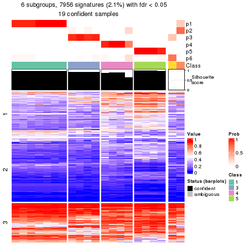</p>

</div>
<div id='tab-node-0241-get-signatures-6'>
<pre><code class="r">get_signatures(res, k = 7)
</code></pre>

<p></p>

</div>
<div id='tab-node-0241-get-signatures-7'>
<pre><code class="r">get_signatures(res, k = 8)
</code></pre>

<p></p>

</div>
</div>


Compare the overlap of signatures from different k:

```r
compare_signatures(res)
```


`get_signature()` returns a data frame invisibly. To get the list of signatures, the function
call should be assigned to a variable explicitly. In following code, if `plot` argument is set
to `FALSE`, no heatmap is plotted while only the differential analysis is performed.

```r
# code only for demonstration
tb = get_signature(res, k = ..., plot = FALSE)
```

An example of the output of `tb` is:

```
#>   which_row         fdr    mean_1    mean_2 scaled_mean_1 scaled_mean_2 km
#> 1        38 0.042760348  8.373488  9.131774    -0.5533452     0.5164555  1
#> 2        40 0.018707592  7.106213  8.469186    -0.6173731     0.5762149  1
#> 3        55 0.019134737 10.221463 11.207825    -0.6159697     0.5749050  1
#> 4        59 0.006059896  5.921854  7.869574    -0.6899429     0.6439467  1
#> 5        60 0.018055526  8.928898 10.211722    -0.6204761     0.5791110  1
#> 6        98 0.009384629 15.714769 14.887706     0.6635654    -0.6193277  2
...
```

The columns in `tb` are:

1. `which_row`: row indices corresponding to the input matrix.
2. `fdr`: FDR for the differential test. 
3. `mean_x`: The mean value in group x.
4. `scaled_mean_x`: The mean value in group x after rows are scaled.
5. `km`: Row groups if k-means clustering is applied to rows (which is done by automatically selecting number of clusters).

If there are too many signatures, `top_signatures = ...` can be set to only show the 
signatures with the highest FDRs:

```r
# code only for demonstration
# e.g. to show the top 500 most significant rows
tb = get_signature(res, k = ..., top_signatures = 500)
```

If the signatures are defined as these which are uniquely high in current group, `diff_method` argument
can be set to `"uniquely_high_in_one_group"`:

```r
# code only for demonstration
tb = get_signature(res, k = ..., diff_method = "uniquely_high_in_one_group")
```


UMAP plot which shows how samples are separated.


<script>
$( function() {
	$( '#tabs-node-0241-dimension-reduction' ).tabs();
} );
</script>
<div id='tabs-node-0241-dimension-reduction'>
<ul>
<li><a href='#tab-node-0241-dimension-reduction-1'>k = 2</a></li>
<li><a href='#tab-node-0241-dimension-reduction-2'>k = 3</a></li>
<li><a href='#tab-node-0241-dimension-reduction-3'>k = 4</a></li>
<li><a href='#tab-node-0241-dimension-reduction-4'>k = 5</a></li>
<li><a href='#tab-node-0241-dimension-reduction-5'>k = 6</a></li>
<li><a href='#tab-node-0241-dimension-reduction-6'>k = 7</a></li>
<li><a href='#tab-node-0241-dimension-reduction-7'>k = 8</a></li>
</ul>
<div id='tab-node-0241-dimension-reduction-1'>
<pre><code class="r">dimension_reduction(res, k = 2, method = &quot;UMAP&quot;)
</code></pre>

<p></p>

</div>
<div id='tab-node-0241-dimension-reduction-2'>
<pre><code class="r">dimension_reduction(res, k = 3, method = &quot;UMAP&quot;)
</code></pre>

<p></p>

</div>
<div id='tab-node-0241-dimension-reduction-3'>
<pre><code class="r">dimension_reduction(res, k = 4, method = &quot;UMAP&quot;)
</code></pre>

<p></p>

</div>
<div id='tab-node-0241-dimension-reduction-4'>
<pre><code class="r">dimension_reduction(res, k = 5, method = &quot;UMAP&quot;)
</code></pre>

<p></p>

</div>
<div id='tab-node-0241-dimension-reduction-5'>
<pre><code class="r">dimension_reduction(res, k = 6, method = &quot;UMAP&quot;)
</code></pre>

<p></p>

</div>
<div id='tab-node-0241-dimension-reduction-6'>
<pre><code class="r">dimension_reduction(res, k = 7, method = &quot;UMAP&quot;)
</code></pre>

<p></p>

</div>
<div id='tab-node-0241-dimension-reduction-7'>
<pre><code class="r">dimension_reduction(res, k = 8, method = &quot;UMAP&quot;)
</code></pre>

<p></p>

</div>
</div>


Following heatmap shows how subgroups are split when increasing `k`:

```r
collect_classes(res)
```


If matrix rows can be associated to genes, consider to use `functional_enrichment(res,
...)` to perform function enrichment for the signature genes. See [this vignette](https://jokergoo.github.io/cola_vignettes/functional_enrichment.html) for more detailed explanations.


 

---------------------------------------------------


### Node025


Parent node: [Node02](#Node02).
Child nodes: 
                Node0111-leaf
        ,
                Node0112-leaf
        ,
                Node0113-leaf
        ,
                Node0114-leaf
        ,
                Node0131-leaf
        ,
                Node0132-leaf
        ,
                Node0133-leaf
        ,
                Node0141-leaf
        ,
                Node0142-leaf
        ,
                Node0143-leaf
        ,
                Node0211-leaf
        ,
                Node0212-leaf
        ,
                Node0221-leaf
        ,
                Node0222-leaf
        ,
                Node0223-leaf
        ,
                Node0224-leaf
        ,
                Node0231-leaf
        ,
                [Node0232](#Node0232)
        ,
                Node0233-leaf
        ,
                Node0234-leaf
        ,
                [Node0241](#Node0241)
        ,
                Node0242-leaf
        ,
                Node0243-leaf
        ,
                Node0244-leaf
        ,
                Node0251-leaf
        ,
                Node0252-leaf
        ,
                [Node0311](#Node0311)
        ,
                Node0312-leaf
        ,
                Node0313-leaf
        ,
                Node0331-leaf
        ,
                Node0332-leaf
        ,
                Node0333-leaf
        .


The object with results only for a single top-value method and a single partitioning method 
can be extracted as:

```r
res = res_rh["025"]
```

A summary of `res` and all the functions that can be applied to it:

```r
res
```

```
#> A 'ConsensusPartition' object with k = 2, 3, 4, 5, 6, 7, 8.
#>   On a matrix with 30000 rows and 48 columns.
#>   Top rows (1000) are extracted by 'ATC' method.
#>   Subgroups are detected by 'kmeans' method.
#>   Performed in total 350 partitions by row resampling.
#>   Best k for subgroups seems to be 2.
#> 
#> Following methods can be applied to this 'ConsensusPartition' object:
#>  [1] "cola_report"             "collect_classes"         "collect_plots"          
#>  [4] "collect_stats"           "colnames"                "compare_partitions"     
#>  [7] "compare_signatures"      "consensus_heatmap"       "dimension_reduction"    
#> [10] "functional_enrichment"   "get_anno_col"            "get_anno"               
#> [13] "get_classes"             "get_consensus"           "get_matrix"             
#> [16] "get_membership"          "get_param"               "get_signatures"         
#> [19] "get_stats"               "is_best_k"               "is_stable_k"            
#> [22] "membership_heatmap"      "ncol"                    "nrow"                   
#> [25] "plot_ecdf"               "predict_classes"         "rownames"               
#> [28] "select_partition_number" "show"                    "suggest_best_k"         
#> [31] "test_to_known_factors"   "top_rows_heatmap"
```

`collect_plots()` function collects all the plots made from `res` for all `k` (number of subgroups)
into one single page to provide an easy and fast comparison between different `k`.

```r
collect_plots(res)
```


The plots are:

- The first row: a plot of the eCDF (empirical cumulative distribution
  function) curves of the consensus matrix for each `k` and the heatmap of
  predicted classes for each `k`.
- The second row: heatmaps of the consensus matrix for each `k`.
- The third row: heatmaps of the membership matrix for each `k`.
- The fouth row: heatmaps of the signatures for each `k`.

All the plots in panels can be made by individual functions and they are
plotted later in this section.

`select_partition_number()` produces several plots showing different
statistics for choosing "optimized" `k`. There are following statistics:

- eCDF curves of the consensus matrix for each `k`;
- 1-PAC. [The PAC score](https://en.wikipedia.org/wiki/Consensus_clustering#Over-interpretation_potential_of_consensus_clustering)
  measures the proportion of the ambiguous subgrouping.
- Mean silhouette score.
- Concordance. The mean probability of fiting the consensus subgroup labels in all
  partitions.
- Area increased. Denote $A_k$ as the area under the eCDF curve for current
  `k`, the area increased is defined as $A_k - A_{k-1}$.
- Rand index. The percent of pairs of samples that are both in a same cluster
  or both are not in a same cluster in the partition of k and k-1.
- Jaccard index. The ratio of pairs of samples are both in a same cluster in
  the partition of k and k-1 and the pairs of samples are both in a same
  cluster in the partition k or k-1.

The detailed explanations of these statistics can be found in [the _cola_
vignette](https://jokergoo.github.io/cola_vignettes/cola.html#toc_13).

Generally speaking, higher 1-PAC score, higher mean silhouette score or higher
concordance corresponds to better partition. Rand index and Jaccard index
measure how similar the current partition is compared to partition with `k-1`.
If they are too similar, we won't accept `k` is better than `k-1`.

```r
select_partition_number(res)
```


The numeric values for all these statistics can be obtained by `get_stats()`.

```r
get_stats(res)
```

```
#>   k 1-PAC mean_silhouette concordance area_increased  Rand Jaccard
#> 2 2 1.000           1.000       1.000         0.3836 0.617   0.617
#> 3 3 0.784           0.845       0.935         0.2567 0.969   0.950
#> 4 4 0.742           0.939       0.929         0.2411 0.766   0.601
#> 5 5 0.780           0.869       0.921         0.0994 1.000   1.000
#> 6 6 0.773           0.801       0.909         0.0314 0.980   0.942
#> 7 7 0.652           0.712       0.853         0.0415 0.984   0.952
#> 8 8 0.624           0.553       0.805         0.0433 0.935   0.798
```

`suggest_best_k()` suggests the best $k$ based on these statistics. The rules are as follows:

- All $k$ with Jaccard index larger than 0.95 are removed because increasing
  $k$ does not provide enough extra information. If all $k$ are removed, it is
  marked as no subgroup is detected.
- For all $k$ with 1-PAC score larger than 0.9, the maximal $k$ is taken as
  the best $k$, and other $k$ are marked as optional $k$.
- If it does not fit the second rule. The $k$ with the maximal vote of the
  highest 1-PAC score, highest mean silhouette, and highest concordance is
  taken as the best $k$.

```r
suggest_best_k(res)
```

```
#> [1] 2
```


Following is the table of the partitions (You need to click the **show/hide
code output** link to see it). The membership matrix (columns with name `p*`)
is inferred by
[`clue::cl_consensus()`](https://www.rdocumentation.org/link/cl_consensus?package=clue)
function with the `SE` method. Basically the value in the membership matrix
represents the probability to belong to a certain group. The finall subgroup
label for an item is determined with the group with highest probability it
belongs to.

In `get_classes()` function, the entropy is calculated from the membership
matrix and the silhouette score is calculated from the consensus matrix.


<script>
$( function() {
	$( '#tabs-node-025-get-classes' ).tabs();
} );
</script>
<div id='tabs-node-025-get-classes'>
<ul>
<li><a href='#tab-node-025-get-classes-1'>k = 2</a></li>
<li><a href='#tab-node-025-get-classes-2'>k = 3</a></li>
<li><a href='#tab-node-025-get-classes-3'>k = 4</a></li>
<li><a href='#tab-node-025-get-classes-4'>k = 5</a></li>
<li><a href='#tab-node-025-get-classes-5'>k = 6</a></li>
<li><a href='#tab-node-025-get-classes-6'>k = 7</a></li>
<li><a href='#tab-node-025-get-classes-7'>k = 8</a></li>
</ul>

<div id='tab-node-025-get-classes-1'>
<p><a id='tab-node-025-get-classes-1-a' style='color:#0366d6' href='#'>show/hide code output</a></p>
<pre><code class="r">cbind(get_classes(res, k = 2), get_membership(res, k = 2))
</code></pre>

<pre><code>#&gt;                 class entropy silhouette p1 p2
#&gt; TCGA.EM.A4FU.01     1       0          1  1  0
#&gt; TCGA.DJ.A3VG.01     1       0          1  1  0
#&gt; TCGA.FY.A40M.01     2       0          1  0  1
#&gt; TCGA.KS.A41I.01     2       0          1  0  1
#&gt; TCGA.ET.A4KQ.01     2       0          1  0  1
#&gt; TCGA.EM.A4G1.01     2       0          1  0  1
#&gt; TCGA.EL.A3ZR.01     2       0          1  0  1
#&gt; TCGA.ET.A40P.01     2       0          1  0  1
#&gt; TCGA.DJ.A3VK.01     1       0          1  1  0
#&gt; TCGA.EM.A3AP.01     2       0          1  0  1
#&gt; TCGA.E3.A3DZ.01     2       0          1  0  1
#&gt; TCGA.BJ.A45G.01     2       0          1  0  1
#&gt; TCGA.BJ.A2P4.01     2       0          1  0  1
#&gt; TCGA.CE.A484.01     2       0          1  0  1
#&gt; TCGA.BJ.A45F.01     2       0          1  0  1
#&gt; TCGA.BJ.A45D.01     1       0          1  1  0
#&gt; TCGA.EL.A4JV.01     2       0          1  0  1
#&gt; TCGA.BJ.A2N7.01     2       0          1  0  1
#&gt; TCGA.MK.A84Z.01     1       0          1  1  0
#&gt; TCGA.BJ.A2N8.01     2       0          1  0  1
#&gt; TCGA.FY.A76V.01     1       0          1  1  0
#&gt; TCGA.QD.A8IV.01     2       0          1  0  1
#&gt; TCGA.ET.A25P.01     2       0          1  0  1
#&gt; TCGA.ET.A2N5.01     2       0          1  0  1
#&gt; TCGA.EM.A3FP.01     2       0          1  0  1
#&gt; TCGA.EM.A22K.01     2       0          1  0  1
#&gt; TCGA.EM.A22L.01     2       0          1  0  1
#&gt; TCGA.FY.A3NP.01     1       0          1  1  0
#&gt; TCGA.EL.A3D5.01     2       0          1  0  1
#&gt; TCGA.EL.A3GW.01     2       0          1  0  1
#&gt; TCGA.BJ.A18Y.01     1       0          1  1  0
#&gt; TCGA.EM.A2CK.01     1       0          1  1  0
#&gt; TCGA.EM.A2P2.01     1       0          1  1  0
#&gt; TCGA.DJ.A3UP.01     2       0          1  0  1
#&gt; TCGA.ET.A39L.01     2       0          1  0  1
#&gt; TCGA.DJ.A1QG.01     1       0          1  1  0
#&gt; TCGA.ET.A39I.01     2       0          1  0  1
#&gt; TCGA.DJ.A3UT.01     2       0          1  0  1
#&gt; TCGA.EL.A3T2.01     2       0          1  0  1
#&gt; TCGA.EM.A3O8.01     2       0          1  0  1
#&gt; TCGA.BJ.A28S.01     1       0          1  1  0
#&gt; TCGA.BJ.A3PT.01     2       0          1  0  1
#&gt; TCGA.DJ.A2QB.01     2       0          1  0  1
#&gt; TCGA.EM.A3OB.01     2       0          1  0  1
#&gt; TCGA.H2.A3RH.01     2       0          1  0  1
#&gt; TCGA.BJ.A0ZE.01     2       0          1  0  1
#&gt; TCGA.DJ.A13M.01     2       0          1  0  1
#&gt; TCGA.DJ.A13S.01     2       0          1  0  1
</code></pre>

<script>
$('#tab-node-025-get-classes-1-a').parent().next().next().hide();
$('#tab-node-025-get-classes-1-a').click(function(){
  $('#tab-node-025-get-classes-1-a').parent().next().next().toggle();
  return(false);
});
</script>
</div>

<div id='tab-node-025-get-classes-2'>
<p><a id='tab-node-025-get-classes-2-a' style='color:#0366d6' href='#'>show/hide code output</a></p>
<pre><code class="r">cbind(get_classes(res, k = 3), get_membership(res, k = 3))
</code></pre>

<pre><code>#&gt;                 class entropy silhouette   p1   p2   p3
#&gt; TCGA.EM.A4FU.01     1  0.0000      0.995 1.00 0.00 0.00
#&gt; TCGA.DJ.A3VG.01     1  0.0000      0.995 1.00 0.00 0.00
#&gt; TCGA.FY.A40M.01     2  0.0000      0.896 0.00 1.00 0.00
#&gt; TCGA.KS.A41I.01     2  0.0000      0.896 0.00 1.00 0.00
#&gt; TCGA.ET.A4KQ.01     2  0.5706      0.619 0.00 0.68 0.32
#&gt; TCGA.EM.A4G1.01     2  0.5835      0.596 0.00 0.66 0.34
#&gt; TCGA.EL.A3ZR.01     2  0.5835      0.596 0.00 0.66 0.34
#&gt; TCGA.ET.A40P.01     2  0.0000      0.896 0.00 1.00 0.00
#&gt; TCGA.DJ.A3VK.01     1  0.0000      0.995 1.00 0.00 0.00
#&gt; TCGA.EM.A3AP.01     2  0.0000      0.896 0.00 1.00 0.00
#&gt; TCGA.E3.A3DZ.01     2  0.0000      0.896 0.00 1.00 0.00
#&gt; TCGA.BJ.A45G.01     2  0.0000      0.896 0.00 1.00 0.00
#&gt; TCGA.BJ.A2P4.01     2  0.0000      0.896 0.00 1.00 0.00
#&gt; TCGA.CE.A484.01     2  0.0000      0.896 0.00 1.00 0.00
#&gt; TCGA.BJ.A45F.01     2  0.0000      0.896 0.00 1.00 0.00
#&gt; TCGA.BJ.A45D.01     1  0.0000      0.995 1.00 0.00 0.00
#&gt; TCGA.EL.A4JV.01     2  0.5835      0.596 0.00 0.66 0.34
#&gt; TCGA.BJ.A2N7.01     2  0.5835      0.596 0.00 0.66 0.34
#&gt; TCGA.MK.A84Z.01     1  0.0892      0.985 0.98 0.00 0.02
#&gt; TCGA.BJ.A2N8.01     2  0.0000      0.896 0.00 1.00 0.00
#&gt; TCGA.FY.A76V.01     1  0.0892      0.985 0.98 0.00 0.02
#&gt; TCGA.QD.A8IV.01     2  0.5835      0.596 0.00 0.66 0.34
#&gt; TCGA.ET.A25P.01     2  0.0000      0.896 0.00 1.00 0.00
#&gt; TCGA.ET.A2N5.01     2  0.0000      0.896 0.00 1.00 0.00
#&gt; TCGA.EM.A3FP.01     2  0.0000      0.896 0.00 1.00 0.00
#&gt; TCGA.EM.A22K.01     2  0.5835      0.596 0.00 0.66 0.34
#&gt; TCGA.EM.A22L.01     3  0.0892      0.000 0.00 0.02 0.98
#&gt; TCGA.FY.A3NP.01     1  0.0000      0.995 1.00 0.00 0.00
#&gt; TCGA.EL.A3D5.01     2  0.5835      0.596 0.00 0.66 0.34
#&gt; TCGA.EL.A3GW.01     2  0.5835      0.596 0.00 0.66 0.34
#&gt; TCGA.BJ.A18Y.01     1  0.0892      0.985 0.98 0.00 0.02
#&gt; TCGA.EM.A2CK.01     1  0.0000      0.995 1.00 0.00 0.00
#&gt; TCGA.EM.A2P2.01     1  0.0000      0.995 1.00 0.00 0.00
#&gt; TCGA.DJ.A3UP.01     2  0.0000      0.896 0.00 1.00 0.00
#&gt; TCGA.ET.A39L.01     2  0.0000      0.896 0.00 1.00 0.00
#&gt; TCGA.DJ.A1QG.01     1  0.0000      0.995 1.00 0.00 0.00
#&gt; TCGA.ET.A39I.01     2  0.0000      0.896 0.00 1.00 0.00
#&gt; TCGA.DJ.A3UT.01     2  0.0000      0.896 0.00 1.00 0.00
#&gt; TCGA.EL.A3T2.01     2  0.0000      0.896 0.00 1.00 0.00
#&gt; TCGA.EM.A3O8.01     2  0.0000      0.896 0.00 1.00 0.00
#&gt; TCGA.BJ.A28S.01     1  0.0000      0.995 1.00 0.00 0.00
#&gt; TCGA.BJ.A3PT.01     2  0.0000      0.896 0.00 1.00 0.00
#&gt; TCGA.DJ.A2QB.01     2  0.0000      0.896 0.00 1.00 0.00
#&gt; TCGA.EM.A3OB.01     2  0.0000      0.896 0.00 1.00 0.00
#&gt; TCGA.H2.A3RH.01     2  0.0000      0.896 0.00 1.00 0.00
#&gt; TCGA.BJ.A0ZE.01     2  0.0000      0.896 0.00 1.00 0.00
#&gt; TCGA.DJ.A13M.01     2  0.0892      0.884 0.00 0.98 0.02
#&gt; TCGA.DJ.A13S.01     2  0.0000      0.896 0.00 1.00 0.00
</code></pre>

<script>
$('#tab-node-025-get-classes-2-a').parent().next().next().hide();
$('#tab-node-025-get-classes-2-a').click(function(){
  $('#tab-node-025-get-classes-2-a').parent().next().next().toggle();
  return(false);
});
</script>
</div>

<div id='tab-node-025-get-classes-3'>
<p><a id='tab-node-025-get-classes-3-a' style='color:#0366d6' href='#'>show/hide code output</a></p>
<pre><code class="r">cbind(get_classes(res, k = 4), get_membership(res, k = 4))
</code></pre>

<pre><code>#&gt;                 class entropy silhouette   p1   p2   p3   p4
#&gt; TCGA.EM.A4FU.01     1  0.0000      0.957 1.00 0.00 0.00 0.00
#&gt; TCGA.DJ.A3VG.01     1  0.0000      0.957 1.00 0.00 0.00 0.00
#&gt; TCGA.FY.A40M.01     2  0.0707      0.976 0.00 0.98 0.02 0.00
#&gt; TCGA.KS.A41I.01     2  0.0000      0.997 0.00 1.00 0.00 0.00
#&gt; TCGA.ET.A4KQ.01     4  0.3975      0.943 0.00 0.24 0.00 0.76
#&gt; TCGA.EM.A4G1.01     4  0.3610      0.909 0.00 0.20 0.00 0.80
#&gt; TCGA.EL.A3ZR.01     4  0.4284      0.904 0.00 0.20 0.02 0.78
#&gt; TCGA.ET.A40P.01     2  0.0000      0.997 0.00 1.00 0.00 0.00
#&gt; TCGA.DJ.A3VK.01     1  0.0000      0.957 1.00 0.00 0.00 0.00
#&gt; TCGA.EM.A3AP.01     2  0.0000      0.997 0.00 1.00 0.00 0.00
#&gt; TCGA.E3.A3DZ.01     2  0.0000      0.997 0.00 1.00 0.00 0.00
#&gt; TCGA.BJ.A45G.01     2  0.0000      0.997 0.00 1.00 0.00 0.00
#&gt; TCGA.BJ.A2P4.01     2  0.0707      0.974 0.00 0.98 0.00 0.02
#&gt; TCGA.CE.A484.01     2  0.0000      0.997 0.00 1.00 0.00 0.00
#&gt; TCGA.BJ.A45F.01     2  0.0000      0.997 0.00 1.00 0.00 0.00
#&gt; TCGA.BJ.A45D.01     1  0.2011      0.932 0.92 0.00 0.00 0.08
#&gt; TCGA.EL.A4JV.01     4  0.3975      0.943 0.00 0.24 0.00 0.76
#&gt; TCGA.BJ.A2N7.01     4  0.3975      0.943 0.00 0.24 0.00 0.76
#&gt; TCGA.MK.A84Z.01     1  0.2647      0.912 0.88 0.00 0.00 0.12
#&gt; TCGA.BJ.A2N8.01     2  0.0000      0.997 0.00 1.00 0.00 0.00
#&gt; TCGA.FY.A76V.01     1  0.3400      0.862 0.82 0.00 0.00 0.18
#&gt; TCGA.QD.A8IV.01     4  0.3975      0.943 0.00 0.24 0.00 0.76
#&gt; TCGA.ET.A25P.01     2  0.0000      0.997 0.00 1.00 0.00 0.00
#&gt; TCGA.ET.A2N5.01     2  0.0707      0.974 0.00 0.98 0.00 0.02
#&gt; TCGA.EM.A3FP.01     2  0.0000      0.997 0.00 1.00 0.00 0.00
#&gt; TCGA.EM.A22K.01     4  0.3610      0.909 0.00 0.20 0.00 0.80
#&gt; TCGA.EM.A22L.01     3  0.0707      0.000 0.00 0.00 0.98 0.02
#&gt; TCGA.FY.A3NP.01     1  0.0000      0.957 1.00 0.00 0.00 0.00
#&gt; TCGA.EL.A3D5.01     4  0.3975      0.943 0.00 0.24 0.00 0.76
#&gt; TCGA.EL.A3GW.01     4  0.3975      0.943 0.00 0.24 0.00 0.76
#&gt; TCGA.BJ.A18Y.01     1  0.1637      0.940 0.94 0.00 0.00 0.06
#&gt; TCGA.EM.A2CK.01     1  0.0000      0.957 1.00 0.00 0.00 0.00
#&gt; TCGA.EM.A2P2.01     1  0.0000      0.957 1.00 0.00 0.00 0.00
#&gt; TCGA.DJ.A3UP.01     2  0.0000      0.997 0.00 1.00 0.00 0.00
#&gt; TCGA.ET.A39L.01     2  0.0000      0.997 0.00 1.00 0.00 0.00
#&gt; TCGA.DJ.A1QG.01     1  0.0000      0.957 1.00 0.00 0.00 0.00
#&gt; TCGA.ET.A39I.01     2  0.0000      0.997 0.00 1.00 0.00 0.00
#&gt; TCGA.DJ.A3UT.01     2  0.0000      0.997 0.00 1.00 0.00 0.00
#&gt; TCGA.EL.A3T2.01     2  0.0000      0.997 0.00 1.00 0.00 0.00
#&gt; TCGA.EM.A3O8.01     2  0.0000      0.997 0.00 1.00 0.00 0.00
#&gt; TCGA.BJ.A28S.01     1  0.2345      0.925 0.90 0.00 0.00 0.10
#&gt; TCGA.BJ.A3PT.01     2  0.0000      0.997 0.00 1.00 0.00 0.00
#&gt; TCGA.DJ.A2QB.01     2  0.0000      0.997 0.00 1.00 0.00 0.00
#&gt; TCGA.EM.A3OB.01     2  0.0000      0.997 0.00 1.00 0.00 0.00
#&gt; TCGA.H2.A3RH.01     2  0.0000      0.997 0.00 1.00 0.00 0.00
#&gt; TCGA.BJ.A0ZE.01     4  0.5570      0.615 0.00 0.44 0.02 0.54
#&gt; TCGA.DJ.A13M.01     4  0.4642      0.933 0.00 0.24 0.02 0.74
#&gt; TCGA.DJ.A13S.01     2  0.0000      0.997 0.00 1.00 0.00 0.00
</code></pre>

<script>
$('#tab-node-025-get-classes-3-a').parent().next().next().hide();
$('#tab-node-025-get-classes-3-a').click(function(){
  $('#tab-node-025-get-classes-3-a').parent().next().next().toggle();
  return(false);
});
</script>
</div>

<div id='tab-node-025-get-classes-4'>
<p><a id='tab-node-025-get-classes-4-a' style='color:#0366d6' href='#'>show/hide code output</a></p>
<pre><code class="r">cbind(get_classes(res, k = 5), get_membership(res, k = 5))
</code></pre>

<pre><code>#&gt;                 class entropy silhouette   p1   p2 p3   p4   p5
#&gt; TCGA.EM.A4FU.01     1  0.0000      0.918 1.00 0.00  0 0.00 0.00
#&gt; TCGA.DJ.A3VG.01     1  0.1648      0.903 0.94 0.00  0 0.02 0.04
#&gt; TCGA.FY.A40M.01     2  0.4060      0.489 0.00 0.64  0 0.00 0.36
#&gt; TCGA.KS.A41I.01     2  0.0000      0.934 0.00 1.00  0 0.00 0.00
#&gt; TCGA.ET.A4KQ.01     4  0.1410      0.915 0.00 0.06  0 0.94 0.00
#&gt; TCGA.EM.A4G1.01     4  0.2012      0.901 0.00 0.06  0 0.92 0.02
#&gt; TCGA.EL.A3ZR.01     4  0.4433      0.766 0.00 0.06  0 0.74 0.20
#&gt; TCGA.ET.A40P.01     2  0.0000      0.934 0.00 1.00  0 0.00 0.00
#&gt; TCGA.DJ.A3VK.01     1  0.0609      0.914 0.98 0.00  0 0.00 0.02
#&gt; TCGA.EM.A3AP.01     2  0.0609      0.932 0.00 0.98  0 0.02 0.00
#&gt; TCGA.E3.A3DZ.01     2  0.2280      0.882 0.00 0.88  0 0.12 0.00
#&gt; TCGA.BJ.A45G.01     2  0.0609      0.933 0.00 0.98  0 0.00 0.02
#&gt; TCGA.BJ.A2P4.01     2  0.2280      0.882 0.00 0.88  0 0.12 0.00
#&gt; TCGA.CE.A484.01     2  0.0609      0.933 0.00 0.98  0 0.00 0.02
#&gt; TCGA.BJ.A45F.01     2  0.0609      0.933 0.00 0.98  0 0.00 0.02
#&gt; TCGA.BJ.A45D.01     1  0.0609      0.919 0.98 0.00  0 0.00 0.02
#&gt; TCGA.EL.A4JV.01     4  0.1410      0.915 0.00 0.06  0 0.94 0.00
#&gt; TCGA.BJ.A2N7.01     4  0.1410      0.915 0.00 0.06  0 0.94 0.00
#&gt; TCGA.MK.A84Z.01     1  0.2929      0.862 0.82 0.00  0 0.00 0.18
#&gt; TCGA.BJ.A2N8.01     2  0.0609      0.932 0.00 0.98  0 0.02 0.00
#&gt; TCGA.FY.A76V.01     1  0.3796      0.752 0.70 0.00  0 0.00 0.30
#&gt; TCGA.QD.A8IV.01     4  0.1410      0.915 0.00 0.06  0 0.94 0.00
#&gt; TCGA.ET.A25P.01     2  0.0609      0.933 0.00 0.98  0 0.00 0.02
#&gt; TCGA.ET.A2N5.01     2  0.2280      0.882 0.00 0.88  0 0.12 0.00
#&gt; TCGA.EM.A3FP.01     2  0.2020      0.897 0.00 0.90  0 0.10 0.00
#&gt; TCGA.EM.A22K.01     4  0.4433      0.758 0.00 0.06  0 0.74 0.20
#&gt; TCGA.EM.A22L.01     3  0.0000      0.000 0.00 0.00  1 0.00 0.00
#&gt; TCGA.FY.A3NP.01     1  0.0609      0.919 0.98 0.00  0 0.00 0.02
#&gt; TCGA.EL.A3D5.01     4  0.1410      0.915 0.00 0.06  0 0.94 0.00
#&gt; TCGA.EL.A3GW.01     4  0.1410      0.915 0.00 0.06  0 0.94 0.00
#&gt; TCGA.BJ.A18Y.01     1  0.2929      0.862 0.82 0.00  0 0.00 0.18
#&gt; TCGA.EM.A2CK.01     1  0.1732      0.904 0.92 0.00  0 0.00 0.08
#&gt; TCGA.EM.A2P2.01     1  0.0000      0.918 1.00 0.00  0 0.00 0.00
#&gt; TCGA.DJ.A3UP.01     2  0.0609      0.933 0.00 0.98  0 0.00 0.02
#&gt; TCGA.ET.A39L.01     2  0.0609      0.933 0.00 0.98  0 0.00 0.02
#&gt; TCGA.DJ.A1QG.01     1  0.0609      0.914 0.98 0.00  0 0.00 0.02
#&gt; TCGA.ET.A39I.01     2  0.2280      0.882 0.00 0.88  0 0.12 0.00
#&gt; TCGA.DJ.A3UT.01     2  0.0609      0.933 0.00 0.98  0 0.00 0.02
#&gt; TCGA.EL.A3T2.01     2  0.0609      0.932 0.00 0.98  0 0.02 0.00
#&gt; TCGA.EM.A3O8.01     2  0.0609      0.933 0.00 0.98  0 0.00 0.02
#&gt; TCGA.BJ.A28S.01     1  0.3291      0.875 0.84 0.00  0 0.04 0.12
#&gt; TCGA.BJ.A3PT.01     2  0.2020      0.897 0.00 0.90  0 0.10 0.00
#&gt; TCGA.DJ.A2QB.01     2  0.0609      0.932 0.00 0.98  0 0.02 0.00
#&gt; TCGA.EM.A3OB.01     2  0.2020      0.897 0.00 0.90  0 0.10 0.00
#&gt; TCGA.H2.A3RH.01     2  0.0609      0.933 0.00 0.98  0 0.00 0.02
#&gt; TCGA.BJ.A0ZE.01     4  0.3796      0.580 0.00 0.30  0 0.70 0.00
#&gt; TCGA.DJ.A13M.01     4  0.1732      0.899 0.00 0.08  0 0.92 0.00
#&gt; TCGA.DJ.A13S.01     2  0.0000      0.934 0.00 1.00  0 0.00 0.00
</code></pre>

<script>
$('#tab-node-025-get-classes-4-a').parent().next().next().hide();
$('#tab-node-025-get-classes-4-a').click(function(){
  $('#tab-node-025-get-classes-4-a').parent().next().next().toggle();
  return(false);
});
</script>
</div>

<div id='tab-node-025-get-classes-5'>
<p><a id='tab-node-025-get-classes-5-a' style='color:#0366d6' href='#'>show/hide code output</a></p>
<pre><code class="r">cbind(get_classes(res, k = 6), get_membership(res, k = 6))
</code></pre>

<pre><code>#&gt;                 class entropy silhouette   p1   p2   p3   p4   p5 p6
#&gt; TCGA.EM.A4FU.01     1  0.0000      0.923 1.00 0.00 0.00 0.00 0.00  0
#&gt; TCGA.DJ.A3VG.01     1  0.1480      0.909 0.94 0.00 0.04 0.02 0.00  0
#&gt; TCGA.FY.A40M.01     5  0.3309      0.000 0.00 0.28 0.00 0.00 0.72  0
#&gt; TCGA.KS.A41I.01     2  0.0000      0.917 0.00 1.00 0.00 0.00 0.00  0
#&gt; TCGA.ET.A4KQ.01     4  0.1267      0.834 0.00 0.06 0.00 0.94 0.00  0
#&gt; TCGA.EM.A4G1.01     4  0.1092      0.798 0.00 0.02 0.02 0.96 0.00  0
#&gt; TCGA.EL.A3ZR.01     4  0.4801      0.285 0.00 0.02 0.46 0.50 0.02  0
#&gt; TCGA.ET.A40P.01     2  0.0547      0.917 0.00 0.98 0.02 0.00 0.00  0
#&gt; TCGA.DJ.A3VK.01     1  0.0937      0.915 0.96 0.00 0.04 0.00 0.00  0
#&gt; TCGA.EM.A3AP.01     2  0.0547      0.914 0.00 0.98 0.02 0.00 0.00  0
#&gt; TCGA.E3.A3DZ.01     2  0.2350      0.831 0.00 0.88 0.02 0.10 0.00  0
#&gt; TCGA.BJ.A45G.01     2  0.0547      0.917 0.00 0.98 0.02 0.00 0.00  0
#&gt; TCGA.BJ.A2P4.01     2  0.4042      0.645 0.00 0.76 0.04 0.18 0.02  0
#&gt; TCGA.CE.A484.01     2  0.0547      0.917 0.00 0.98 0.02 0.00 0.00  0
#&gt; TCGA.BJ.A45F.01     2  0.0547      0.917 0.00 0.98 0.02 0.00 0.00  0
#&gt; TCGA.BJ.A45D.01     1  0.0547      0.921 0.98 0.00 0.00 0.00 0.02  0
#&gt; TCGA.EL.A4JV.01     4  0.1807      0.831 0.00 0.06 0.02 0.92 0.00  0
#&gt; TCGA.BJ.A2N7.01     4  0.2725      0.815 0.00 0.06 0.04 0.88 0.02  0
#&gt; TCGA.MK.A84Z.01     1  0.1807      0.897 0.92 0.00 0.02 0.00 0.06  0
#&gt; TCGA.BJ.A2N8.01     2  0.0547      0.914 0.00 0.98 0.02 0.00 0.00  0
#&gt; TCGA.FY.A76V.01     1  0.4723      0.677 0.68 0.00 0.14 0.00 0.18  0
#&gt; TCGA.QD.A8IV.01     4  0.1807      0.833 0.00 0.06 0.02 0.92 0.00  0
#&gt; TCGA.ET.A25P.01     2  0.0547      0.917 0.00 0.98 0.02 0.00 0.00  0
#&gt; TCGA.ET.A2N5.01     2  0.3873      0.685 0.00 0.78 0.04 0.16 0.02  0
#&gt; TCGA.EM.A3FP.01     2  0.2350      0.831 0.00 0.88 0.02 0.10 0.00  0
#&gt; TCGA.EM.A22K.01     4  0.4420      0.521 0.00 0.02 0.30 0.66 0.02  0
#&gt; TCGA.EM.A22L.01     6  0.0000      0.000 0.00 0.00 0.00 0.00 0.00  1
#&gt; TCGA.FY.A3NP.01     1  0.0000      0.923 1.00 0.00 0.00 0.00 0.00  0
#&gt; TCGA.EL.A3D5.01     4  0.1807      0.833 0.00 0.06 0.02 0.92 0.00  0
#&gt; TCGA.EL.A3GW.01     4  0.2190      0.832 0.00 0.06 0.04 0.90 0.00  0
#&gt; TCGA.BJ.A18Y.01     1  0.1480      0.905 0.94 0.00 0.02 0.00 0.04  0
#&gt; TCGA.EM.A2CK.01     1  0.0000      0.923 1.00 0.00 0.00 0.00 0.00  0
#&gt; TCGA.EM.A2P2.01     1  0.0000      0.923 1.00 0.00 0.00 0.00 0.00  0
#&gt; TCGA.DJ.A3UP.01     2  0.0547      0.917 0.00 0.98 0.02 0.00 0.00  0
#&gt; TCGA.ET.A39L.01     2  0.0000      0.917 0.00 1.00 0.00 0.00 0.00  0
#&gt; TCGA.DJ.A1QG.01     1  0.0937      0.915 0.96 0.00 0.04 0.00 0.00  0
#&gt; TCGA.ET.A39I.01     2  0.2350      0.831 0.00 0.88 0.02 0.10 0.00  0
#&gt; TCGA.DJ.A3UT.01     2  0.0547      0.917 0.00 0.98 0.02 0.00 0.00  0
#&gt; TCGA.EL.A3T2.01     2  0.1480      0.893 0.00 0.94 0.02 0.04 0.00  0
#&gt; TCGA.EM.A3O8.01     2  0.0547      0.917 0.00 0.98 0.02 0.00 0.00  0
#&gt; TCGA.BJ.A28S.01     1  0.4380      0.677 0.70 0.00 0.22 0.00 0.08  0
#&gt; TCGA.BJ.A3PT.01     2  0.0547      0.914 0.00 0.98 0.02 0.00 0.00  0
#&gt; TCGA.DJ.A2QB.01     2  0.0547      0.914 0.00 0.98 0.02 0.00 0.00  0
#&gt; TCGA.EM.A3OB.01     2  0.2094      0.857 0.00 0.90 0.02 0.08 0.00  0
#&gt; TCGA.H2.A3RH.01     2  0.0547      0.917 0.00 0.98 0.02 0.00 0.00  0
#&gt; TCGA.BJ.A0ZE.01     4  0.5107      0.336 0.00 0.30 0.04 0.62 0.04  0
#&gt; TCGA.DJ.A13M.01     4  0.3103      0.812 0.00 0.06 0.04 0.86 0.04  0
#&gt; TCGA.DJ.A13S.01     2  0.0547      0.912 0.00 0.98 0.00 0.02 0.00  0
</code></pre>

<script>
$('#tab-node-025-get-classes-5-a').parent().next().next().hide();
$('#tab-node-025-get-classes-5-a').click(function(){
  $('#tab-node-025-get-classes-5-a').parent().next().next().toggle();
  return(false);
});
</script>
</div>

<div id='tab-node-025-get-classes-6'>
<p><a id='tab-node-025-get-classes-6-a' style='color:#0366d6' href='#'>show/hide code output</a></p>
<pre><code class="r">cbind(get_classes(res, k = 7), get_membership(res, k = 7))
</code></pre>

<pre><code>#&gt;                 class entropy silhouette   p1   p2   p3   p4   p5 p6   p7
#&gt; TCGA.EM.A4FU.01     1  0.0000      0.846 1.00 0.00 0.00 0.00 0.00  0 0.00
#&gt; TCGA.DJ.A3VG.01     1  0.1006      0.842 0.96 0.00 0.00 0.00 0.02  0 0.02
#&gt; TCGA.FY.A40M.01     3  0.2422      0.000 0.00 0.18 0.82 0.00 0.00  0 0.00
#&gt; TCGA.KS.A41I.01     2  0.0504      0.829 0.00 0.98 0.00 0.00 0.02  0 0.00
#&gt; TCGA.ET.A4KQ.01     4  0.0863      0.801 0.00 0.04 0.00 0.96 0.00  0 0.00
#&gt; TCGA.EM.A4G1.01     4  0.3055      0.305 0.00 0.00 0.02 0.82 0.02  0 0.14
#&gt; TCGA.EL.A3ZR.01     7  0.5579      0.535 0.00 0.00 0.00 0.36 0.26  0 0.38
#&gt; TCGA.ET.A40P.01     2  0.0504      0.831 0.00 0.98 0.00 0.00 0.02  0 0.00
#&gt; TCGA.DJ.A3VK.01     1  0.0000      0.846 1.00 0.00 0.00 0.00 0.00  0 0.00
#&gt; TCGA.EM.A3AP.01     2  0.2081      0.807 0.00 0.86 0.00 0.14 0.00  0 0.00
#&gt; TCGA.E3.A3DZ.01     2  0.3307      0.725 0.00 0.74 0.00 0.24 0.02  0 0.00
#&gt; TCGA.BJ.A45G.01     2  0.0504      0.831 0.00 0.98 0.00 0.00 0.02  0 0.00
#&gt; TCGA.BJ.A2P4.01     2  0.4783      0.402 0.00 0.54 0.00 0.36 0.10  0 0.00
#&gt; TCGA.CE.A484.01     2  0.0504      0.831 0.00 0.98 0.00 0.00 0.02  0 0.00
#&gt; TCGA.BJ.A45F.01     2  0.0504      0.831 0.00 0.98 0.00 0.00 0.02  0 0.00
#&gt; TCGA.BJ.A45D.01     1  0.3061      0.808 0.84 0.00 0.06 0.00 0.08  0 0.02
#&gt; TCGA.EL.A4JV.01     4  0.0863      0.801 0.00 0.04 0.00 0.96 0.00  0 0.00
#&gt; TCGA.BJ.A2N7.01     4  0.1363      0.767 0.00 0.02 0.00 0.94 0.04  0 0.00
#&gt; TCGA.MK.A84Z.01     1  0.3991      0.747 0.72 0.00 0.02 0.00 0.22  0 0.04
#&gt; TCGA.BJ.A2N8.01     2  0.1671      0.819 0.00 0.90 0.00 0.10 0.00  0 0.00
#&gt; TCGA.FY.A76V.01     1  0.3562      0.489 0.50 0.00 0.00 0.00 0.50  0 0.00
#&gt; TCGA.QD.A8IV.01     4  0.1363      0.802 0.00 0.04 0.02 0.94 0.00  0 0.00
#&gt; TCGA.ET.A25P.01     2  0.0504      0.831 0.00 0.98 0.00 0.00 0.02  0 0.00
#&gt; TCGA.ET.A2N5.01     2  0.4681      0.484 0.00 0.58 0.00 0.32 0.10  0 0.00
#&gt; TCGA.EM.A3FP.01     2  0.2708      0.755 0.00 0.78 0.00 0.22 0.00  0 0.00
#&gt; TCGA.EM.A22K.01     7  0.3546      0.542 0.00 0.00 0.00 0.46 0.00  0 0.54
#&gt; TCGA.EM.A22L.01     6  0.0000      0.000 0.00 0.00 0.00 0.00 0.00  1 0.00
#&gt; TCGA.FY.A3NP.01     1  0.0504      0.846 0.98 0.00 0.00 0.00 0.02  0 0.00
#&gt; TCGA.EL.A3D5.01     4  0.1363      0.802 0.00 0.04 0.02 0.94 0.00  0 0.00
#&gt; TCGA.EL.A3GW.01     4  0.1860      0.782 0.00 0.04 0.02 0.92 0.00  0 0.02
#&gt; TCGA.BJ.A18Y.01     1  0.3086      0.797 0.80 0.00 0.00 0.00 0.16  0 0.04
#&gt; TCGA.EM.A2CK.01     1  0.1166      0.844 0.94 0.00 0.00 0.00 0.06  0 0.00
#&gt; TCGA.EM.A2P2.01     1  0.1718      0.834 0.92 0.00 0.04 0.00 0.04  0 0.00
#&gt; TCGA.DJ.A3UP.01     2  0.0504      0.831 0.00 0.98 0.00 0.00 0.02  0 0.00
#&gt; TCGA.ET.A39L.01     2  0.0504      0.831 0.00 0.98 0.00 0.00 0.02  0 0.00
#&gt; TCGA.DJ.A1QG.01     1  0.0504      0.847 0.98 0.00 0.02 0.00 0.00  0 0.00
#&gt; TCGA.ET.A39I.01     2  0.3307      0.725 0.00 0.74 0.00 0.24 0.02  0 0.00
#&gt; TCGA.DJ.A3UT.01     2  0.0504      0.831 0.00 0.98 0.00 0.00 0.02  0 0.00
#&gt; TCGA.EL.A3T2.01     2  0.2745      0.788 0.00 0.82 0.00 0.16 0.02  0 0.00
#&gt; TCGA.EM.A3O8.01     2  0.0504      0.831 0.00 0.98 0.00 0.00 0.02  0 0.00
#&gt; TCGA.BJ.A28S.01     1  0.6357      0.359 0.46 0.00 0.10 0.00 0.16  0 0.28
#&gt; TCGA.BJ.A3PT.01     2  0.2745      0.785 0.00 0.82 0.00 0.16 0.02  0 0.00
#&gt; TCGA.DJ.A2QB.01     2  0.1671      0.819 0.00 0.90 0.00 0.10 0.00  0 0.00
#&gt; TCGA.EM.A3OB.01     2  0.3388      0.748 0.00 0.76 0.00 0.20 0.04  0 0.00
#&gt; TCGA.H2.A3RH.01     2  0.0504      0.831 0.00 0.98 0.00 0.00 0.02  0 0.00
#&gt; TCGA.BJ.A0ZE.01     4  0.4813      0.389 0.00 0.24 0.00 0.64 0.10  0 0.02
#&gt; TCGA.DJ.A13M.01     4  0.3772      0.696 0.00 0.06 0.02 0.80 0.10  0 0.02
#&gt; TCGA.DJ.A13S.01     2  0.1006      0.828 0.00 0.96 0.00 0.02 0.02  0 0.00
</code></pre>

<script>
$('#tab-node-025-get-classes-6-a').parent().next().next().hide();
$('#tab-node-025-get-classes-6-a').click(function(){
  $('#tab-node-025-get-classes-6-a').parent().next().next().toggle();
  return(false);
});
</script>
</div>

<div id='tab-node-025-get-classes-7'>
<p><a id='tab-node-025-get-classes-7-a' style='color:#0366d6' href='#'>show/hide code output</a></p>
<pre><code class="r">cbind(get_classes(res, k = 8), get_membership(res, k = 8))
</code></pre>

<pre><code>#&gt;                 class entropy silhouette   p1   p2   p3   p4   p5 p6   p7   p8
#&gt; TCGA.EM.A4FU.01     1  0.0000    0.84059 1.00 0.00 0.00 0.00 0.00  0 0.00 0.00
#&gt; TCGA.DJ.A3VG.01     1  0.1741    0.82125 0.92 0.00 0.04 0.00 0.02  0 0.00 0.02
#&gt; TCGA.FY.A40M.01     3  0.1765    0.00000 0.00 0.12 0.88 0.00 0.00  0 0.00 0.00
#&gt; TCGA.KS.A41I.01     2  0.0471    0.76017 0.00 0.98 0.00 0.00 0.00  0 0.00 0.02
#&gt; TCGA.ET.A4KQ.01     4  0.2025    0.71365 0.00 0.02 0.00 0.88 0.00  0 0.00 0.10
#&gt; TCGA.EM.A4G1.01     4  0.3830    0.45769 0.00 0.02 0.00 0.74 0.08  0 0.00 0.16
#&gt; TCGA.EL.A3ZR.01     7  0.6737   -0.46376 0.00 0.02 0.04 0.10 0.34  0 0.40 0.10
#&gt; TCGA.ET.A40P.01     2  0.0471    0.75923 0.00 0.98 0.00 0.02 0.00  0 0.00 0.00
#&gt; TCGA.DJ.A3VK.01     1  0.0471    0.84010 0.98 0.00 0.02 0.00 0.00  0 0.00 0.00
#&gt; TCGA.EM.A3AP.01     2  0.3434    0.65025 0.00 0.76 0.00 0.14 0.00  0 0.00 0.10
#&gt; TCGA.E3.A3DZ.01     2  0.4759    0.08116 0.00 0.50 0.00 0.36 0.00  0 0.00 0.14
#&gt; TCGA.BJ.A45G.01     2  0.0000    0.76325 0.00 1.00 0.00 0.00 0.00  0 0.00 0.00
#&gt; TCGA.BJ.A2P4.01     8  0.5270    0.55287 0.00 0.30 0.00 0.34 0.00  0 0.00 0.36
#&gt; TCGA.CE.A484.01     2  0.0000    0.76325 0.00 1.00 0.00 0.00 0.00  0 0.00 0.00
#&gt; TCGA.BJ.A45F.01     2  0.0000    0.76325 0.00 1.00 0.00 0.00 0.00  0 0.00 0.00
#&gt; TCGA.BJ.A45D.01     1  0.2020    0.80038 0.90 0.00 0.00 0.02 0.00  0 0.06 0.02
#&gt; TCGA.EL.A4JV.01     4  0.1275    0.81579 0.00 0.02 0.00 0.94 0.00  0 0.00 0.04
#&gt; TCGA.BJ.A2N7.01     4  0.2025    0.76409 0.00 0.02 0.00 0.88 0.00  0 0.00 0.10
#&gt; TCGA.MK.A84Z.01     1  0.4211    0.59412 0.68 0.00 0.00 0.02 0.00  0 0.22 0.08
#&gt; TCGA.BJ.A2N8.01     2  0.3263    0.66805 0.00 0.78 0.00 0.12 0.00  0 0.00 0.10
#&gt; TCGA.FY.A76V.01     7  0.3329   -0.47307 0.48 0.00 0.00 0.00 0.00  0 0.52 0.00
#&gt; TCGA.QD.A8IV.01     4  0.0471    0.84701 0.00 0.02 0.00 0.98 0.00  0 0.00 0.00
#&gt; TCGA.ET.A25P.01     2  0.0000    0.76325 0.00 1.00 0.00 0.00 0.00  0 0.00 0.00
#&gt; TCGA.ET.A2N5.01     8  0.5276    0.52044 0.00 0.32 0.00 0.32 0.00  0 0.00 0.36
#&gt; TCGA.EM.A3FP.01     2  0.4677    0.22197 0.00 0.54 0.00 0.32 0.00  0 0.00 0.14
#&gt; TCGA.EM.A22K.01     5  0.3198    0.00000 0.00 0.02 0.00 0.26 0.72  0 0.00 0.00
#&gt; TCGA.EM.A22L.01     6  0.0000    0.00000 0.00 0.00 0.00 0.00 0.00  1 0.00 0.00
#&gt; TCGA.FY.A3NP.01     1  0.1408    0.83460 0.94 0.00 0.02 0.00 0.00  0 0.02 0.02
#&gt; TCGA.EL.A3D5.01     4  0.0471    0.84701 0.00 0.02 0.00 0.98 0.00  0 0.00 0.00
#&gt; TCGA.EL.A3GW.01     4  0.0941    0.83382 0.00 0.02 0.00 0.96 0.02  0 0.00 0.00
#&gt; TCGA.BJ.A18Y.01     1  0.3601    0.68724 0.76 0.00 0.02 0.00 0.00  0 0.16 0.06
#&gt; TCGA.EM.A2CK.01     1  0.0941    0.83982 0.96 0.00 0.00 0.00 0.00  0 0.02 0.02
#&gt; TCGA.EM.A2P2.01     1  0.0471    0.84039 0.98 0.00 0.02 0.00 0.00  0 0.00 0.00
#&gt; TCGA.DJ.A3UP.01     2  0.0000    0.76325 0.00 1.00 0.00 0.00 0.00  0 0.00 0.00
#&gt; TCGA.ET.A39L.01     2  0.0000    0.76325 0.00 1.00 0.00 0.00 0.00  0 0.00 0.00
#&gt; TCGA.DJ.A1QG.01     1  0.0941    0.84202 0.96 0.00 0.02 0.00 0.02  0 0.00 0.00
#&gt; TCGA.ET.A39I.01     2  0.4873    0.00648 0.00 0.48 0.00 0.36 0.00  0 0.00 0.16
#&gt; TCGA.DJ.A3UT.01     2  0.0000    0.76325 0.00 1.00 0.00 0.00 0.00  0 0.00 0.00
#&gt; TCGA.EL.A3T2.01     2  0.3909    0.58227 0.00 0.70 0.00 0.12 0.00  0 0.00 0.18
#&gt; TCGA.EM.A3O8.01     2  0.0000    0.76325 0.00 1.00 0.00 0.00 0.00  0 0.00 0.00
#&gt; TCGA.BJ.A28S.01     1  0.5252    0.33886 0.56 0.00 0.02 0.00 0.02  0 0.12 0.28
#&gt; TCGA.BJ.A3PT.01     2  0.3434    0.64895 0.00 0.76 0.00 0.10 0.00  0 0.00 0.14
#&gt; TCGA.DJ.A2QB.01     2  0.3434    0.65025 0.00 0.76 0.00 0.14 0.00  0 0.00 0.10
#&gt; TCGA.EM.A3OB.01     2  0.5033   -0.02417 0.00 0.48 0.00 0.30 0.00  0 0.00 0.22
#&gt; TCGA.H2.A3RH.01     2  0.0000    0.76325 0.00 1.00 0.00 0.00 0.00  0 0.00 0.00
#&gt; TCGA.BJ.A0ZE.01     8  0.5535    0.39952 0.00 0.16 0.00 0.36 0.00  0 0.04 0.44
#&gt; TCGA.DJ.A13M.01     8  0.4794   -0.10726 0.00 0.02 0.00 0.42 0.00  0 0.08 0.48
#&gt; TCGA.DJ.A13S.01     2  0.2569    0.69089 0.00 0.82 0.00 0.02 0.00  0 0.00 0.16
</code></pre>

<script>
$('#tab-node-025-get-classes-7-a').parent().next().next().hide();
$('#tab-node-025-get-classes-7-a').click(function(){
  $('#tab-node-025-get-classes-7-a').parent().next().next().toggle();
  return(false);
});
</script>
</div>
</div>

Heatmaps for the consensus matrix. It visualizes the probability of two
samples to be in a same group.


<script>
$( function() {
	$( '#tabs-node-025-consensus-heatmap' ).tabs();
} );
</script>
<div id='tabs-node-025-consensus-heatmap'>
<ul>
<li><a href='#tab-node-025-consensus-heatmap-1'>k = 2</a></li>
<li><a href='#tab-node-025-consensus-heatmap-2'>k = 3</a></li>
<li><a href='#tab-node-025-consensus-heatmap-3'>k = 4</a></li>
<li><a href='#tab-node-025-consensus-heatmap-4'>k = 5</a></li>
<li><a href='#tab-node-025-consensus-heatmap-5'>k = 6</a></li>
<li><a href='#tab-node-025-consensus-heatmap-6'>k = 7</a></li>
<li><a href='#tab-node-025-consensus-heatmap-7'>k = 8</a></li>
</ul>
<div id='tab-node-025-consensus-heatmap-1'>
<pre><code class="r">consensus_heatmap(res, k = 2)
</code></pre>

<p></p>

</div>
<div id='tab-node-025-consensus-heatmap-2'>
<pre><code class="r">consensus_heatmap(res, k = 3)
</code></pre>

<p></p>

</div>
<div id='tab-node-025-consensus-heatmap-3'>
<pre><code class="r">consensus_heatmap(res, k = 4)
</code></pre>

<p></p>

</div>
<div id='tab-node-025-consensus-heatmap-4'>
<pre><code class="r">consensus_heatmap(res, k = 5)
</code></pre>

<p></p>

</div>
<div id='tab-node-025-consensus-heatmap-5'>
<pre><code class="r">consensus_heatmap(res, k = 6)
</code></pre>

<p></p>

</div>
<div id='tab-node-025-consensus-heatmap-6'>
<pre><code class="r">consensus_heatmap(res, k = 7)
</code></pre>

<p></p>

</div>
<div id='tab-node-025-consensus-heatmap-7'>
<pre><code class="r">consensus_heatmap(res, k = 8)
</code></pre>

<p></p>

</div>
</div>

Heatmaps for the membership of samples in all partitions to see how consistent they are:


<script>
$( function() {
	$( '#tabs-node-025-membership-heatmap' ).tabs();
} );
</script>
<div id='tabs-node-025-membership-heatmap'>
<ul>
<li><a href='#tab-node-025-membership-heatmap-1'>k = 2</a></li>
<li><a href='#tab-node-025-membership-heatmap-2'>k = 3</a></li>
<li><a href='#tab-node-025-membership-heatmap-3'>k = 4</a></li>
<li><a href='#tab-node-025-membership-heatmap-4'>k = 5</a></li>
<li><a href='#tab-node-025-membership-heatmap-5'>k = 6</a></li>
<li><a href='#tab-node-025-membership-heatmap-6'>k = 7</a></li>
<li><a href='#tab-node-025-membership-heatmap-7'>k = 8</a></li>
</ul>
<div id='tab-node-025-membership-heatmap-1'>
<pre><code class="r">membership_heatmap(res, k = 2)
</code></pre>

<p></p>

</div>
<div id='tab-node-025-membership-heatmap-2'>
<pre><code class="r">membership_heatmap(res, k = 3)
</code></pre>

<p></p>

</div>
<div id='tab-node-025-membership-heatmap-3'>
<pre><code class="r">membership_heatmap(res, k = 4)
</code></pre>

<p></p>

</div>
<div id='tab-node-025-membership-heatmap-4'>
<pre><code class="r">membership_heatmap(res, k = 5)
</code></pre>

<p></p>

</div>
<div id='tab-node-025-membership-heatmap-5'>
<pre><code class="r">membership_heatmap(res, k = 6)
</code></pre>

<p></p>

</div>
<div id='tab-node-025-membership-heatmap-6'>
<pre><code class="r">membership_heatmap(res, k = 7)
</code></pre>

<p></p>

</div>
<div id='tab-node-025-membership-heatmap-7'>
<pre><code class="r">membership_heatmap(res, k = 8)
</code></pre>

<p>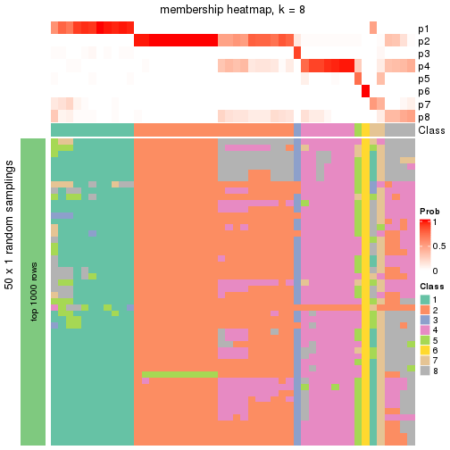</p>

</div>
</div>

As soon as the classes for columns are determined, the signatures
that are significantly different between subgroups can be looked for. 
Following are the heatmaps for signatures.


<script>
$( function() {
	$( '#tabs-node-025-get-signatures' ).tabs();
} );
</script>
<div id='tabs-node-025-get-signatures'>
<ul>
<li><a href='#tab-node-025-get-signatures-1'>k = 2</a></li>
<li><a href='#tab-node-025-get-signatures-2'>k = 3</a></li>
<li><a href='#tab-node-025-get-signatures-3'>k = 4</a></li>
<li><a href='#tab-node-025-get-signatures-4'>k = 5</a></li>
<li><a href='#tab-node-025-get-signatures-5'>k = 6</a></li>
<li><a href='#tab-node-025-get-signatures-6'>k = 7</a></li>
<li><a href='#tab-node-025-get-signatures-7'>k = 8</a></li>
</ul>
<div id='tab-node-025-get-signatures-1'>
<pre><code class="r">get_signatures(res, k = 2)
</code></pre>

<p></p>

</div>
<div id='tab-node-025-get-signatures-2'>
<pre><code class="r">get_signatures(res, k = 3)
</code></pre>

<p></p>

</div>
<div id='tab-node-025-get-signatures-3'>
<pre><code class="r">get_signatures(res, k = 4)
</code></pre>

<p></p>

</div>
<div id='tab-node-025-get-signatures-4'>
<pre><code class="r">get_signatures(res, k = 5)
</code></pre>

<p></p>

</div>
<div id='tab-node-025-get-signatures-5'>
<pre><code class="r">get_signatures(res, k = 6)
</code></pre>

<p></p>

</div>
<div id='tab-node-025-get-signatures-6'>
<pre><code class="r">get_signatures(res, k = 7)
</code></pre>

<p></p>

</div>
<div id='tab-node-025-get-signatures-7'>
<pre><code class="r">get_signatures(res, k = 8)
</code></pre>

<p></p>

</div>
</div>


Compare the overlap of signatures from different k:

```r
compare_signatures(res)
```


`get_signature()` returns a data frame invisibly. To get the list of signatures, the function
call should be assigned to a variable explicitly. In following code, if `plot` argument is set
to `FALSE`, no heatmap is plotted while only the differential analysis is performed.

```r
# code only for demonstration
tb = get_signature(res, k = ..., plot = FALSE)
```

An example of the output of `tb` is:

```
#>   which_row         fdr    mean_1    mean_2 scaled_mean_1 scaled_mean_2 km
#> 1        38 0.042760348  8.373488  9.131774    -0.5533452     0.5164555  1
#> 2        40 0.018707592  7.106213  8.469186    -0.6173731     0.5762149  1
#> 3        55 0.019134737 10.221463 11.207825    -0.6159697     0.5749050  1
#> 4        59 0.006059896  5.921854  7.869574    -0.6899429     0.6439467  1
#> 5        60 0.018055526  8.928898 10.211722    -0.6204761     0.5791110  1
#> 6        98 0.009384629 15.714769 14.887706     0.6635654    -0.6193277  2
...
```

The columns in `tb` are:

1. `which_row`: row indices corresponding to the input matrix.
2. `fdr`: FDR for the differential test. 
3. `mean_x`: The mean value in group x.
4. `scaled_mean_x`: The mean value in group x after rows are scaled.
5. `km`: Row groups if k-means clustering is applied to rows (which is done by automatically selecting number of clusters).

If there are too many signatures, `top_signatures = ...` can be set to only show the 
signatures with the highest FDRs:

```r
# code only for demonstration
# e.g. to show the top 500 most significant rows
tb = get_signature(res, k = ..., top_signatures = 500)
```

If the signatures are defined as these which are uniquely high in current group, `diff_method` argument
can be set to `"uniquely_high_in_one_group"`:

```r
# code only for demonstration
tb = get_signature(res, k = ..., diff_method = "uniquely_high_in_one_group")
```


UMAP plot which shows how samples are separated.


<script>
$( function() {
	$( '#tabs-node-025-dimension-reduction' ).tabs();
} );
</script>
<div id='tabs-node-025-dimension-reduction'>
<ul>
<li><a href='#tab-node-025-dimension-reduction-1'>k = 2</a></li>
<li><a href='#tab-node-025-dimension-reduction-2'>k = 3</a></li>
<li><a href='#tab-node-025-dimension-reduction-3'>k = 4</a></li>
<li><a href='#tab-node-025-dimension-reduction-4'>k = 5</a></li>
<li><a href='#tab-node-025-dimension-reduction-5'>k = 6</a></li>
<li><a href='#tab-node-025-dimension-reduction-6'>k = 7</a></li>
<li><a href='#tab-node-025-dimension-reduction-7'>k = 8</a></li>
</ul>
<div id='tab-node-025-dimension-reduction-1'>
<pre><code class="r">dimension_reduction(res, k = 2, method = &quot;UMAP&quot;)
</code></pre>

<p></p>

</div>
<div id='tab-node-025-dimension-reduction-2'>
<pre><code class="r">dimension_reduction(res, k = 3, method = &quot;UMAP&quot;)
</code></pre>

<p></p>

</div>
<div id='tab-node-025-dimension-reduction-3'>
<pre><code class="r">dimension_reduction(res, k = 4, method = &quot;UMAP&quot;)
</code></pre>

<p>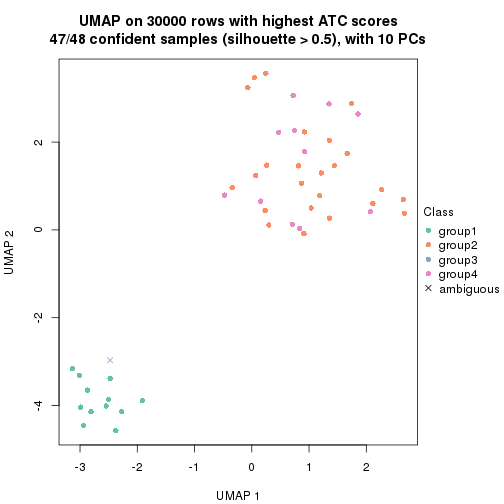</p>

</div>
<div id='tab-node-025-dimension-reduction-4'>
<pre><code class="r">dimension_reduction(res, k = 5, method = &quot;UMAP&quot;)
</code></pre>

<p></p>

</div>
<div id='tab-node-025-dimension-reduction-5'>
<pre><code class="r">dimension_reduction(res, k = 6, method = &quot;UMAP&quot;)
</code></pre>

<p></p>

</div>
<div id='tab-node-025-dimension-reduction-6'>
<pre><code class="r">dimension_reduction(res, k = 7, method = &quot;UMAP&quot;)
</code></pre>

<p></p>

</div>
<div id='tab-node-025-dimension-reduction-7'>
<pre><code class="r">dimension_reduction(res, k = 8, method = &quot;UMAP&quot;)
</code></pre>

<p>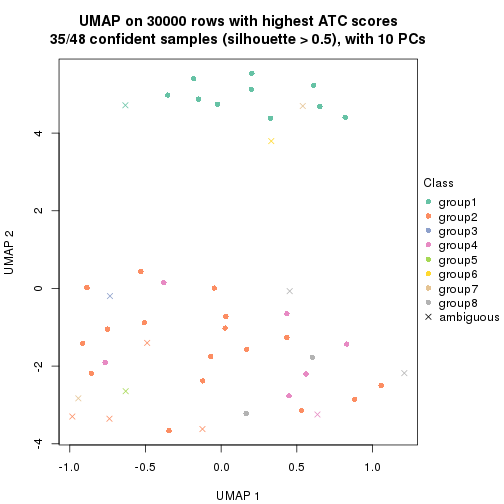</p>

</div>
</div>


Following heatmap shows how subgroups are split when increasing `k`:

```r
collect_classes(res)
```


If matrix rows can be associated to genes, consider to use `functional_enrichment(res,
...)` to perform function enrichment for the signature genes. See [this vignette](https://jokergoo.github.io/cola_vignettes/functional_enrichment.html) for more detailed explanations.


 

---------------------------------------------------


### Node03


Parent node: [Node0](#Node0).
Child nodes: 
                [Node011](#Node011)
        ,
                Node012-leaf
        ,
                [Node013](#Node013)
        ,
                [Node014](#Node014)
        ,
                Node015-leaf
        ,
                [Node021](#Node021)
        ,
                [Node022](#Node022)
        ,
                [Node023](#Node023)
        ,
                [Node024](#Node024)
        ,
                [Node025](#Node025)
        ,
                [Node031](#Node031)
        ,
                Node032-leaf
        ,
                [Node033](#Node033)
        ,
                Node034-leaf
        .


The object with results only for a single top-value method and a single partitioning method 
can be extracted as:

```r
res = res_rh["03"]
```

A summary of `res` and all the functions that can be applied to it:

```r
res
```

```
#> A 'ConsensusPartition' object with k = 2, 3, 4, 5, 6, 7, 8.
#>   On a matrix with 30000 rows and 187 columns.
#>   Top rows (1000) are extracted by 'ATC' method.
#>   Subgroups are detected by 'kmeans' method.
#>   Performed in total 350 partitions by row resampling.
#>   Best k for subgroups seems to be 2.
#> 
#> Following methods can be applied to this 'ConsensusPartition' object:
#>  [1] "cola_report"             "collect_classes"         "collect_plots"          
#>  [4] "collect_stats"           "colnames"                "compare_partitions"     
#>  [7] "compare_signatures"      "consensus_heatmap"       "dimension_reduction"    
#> [10] "functional_enrichment"   "get_anno_col"            "get_anno"               
#> [13] "get_classes"             "get_consensus"           "get_matrix"             
#> [16] "get_membership"          "get_param"               "get_signatures"         
#> [19] "get_stats"               "is_best_k"               "is_stable_k"            
#> [22] "membership_heatmap"      "ncol"                    "nrow"                   
#> [25] "plot_ecdf"               "predict_classes"         "rownames"               
#> [28] "select_partition_number" "show"                    "suggest_best_k"         
#> [31] "test_to_known_factors"   "top_rows_heatmap"
```

`collect_plots()` function collects all the plots made from `res` for all `k` (number of subgroups)
into one single page to provide an easy and fast comparison between different `k`.

```r
collect_plots(res)
```


The plots are:

- The first row: a plot of the eCDF (empirical cumulative distribution
  function) curves of the consensus matrix for each `k` and the heatmap of
  predicted classes for each `k`.
- The second row: heatmaps of the consensus matrix for each `k`.
- The third row: heatmaps of the membership matrix for each `k`.
- The fouth row: heatmaps of the signatures for each `k`.

All the plots in panels can be made by individual functions and they are
plotted later in this section.

`select_partition_number()` produces several plots showing different
statistics for choosing "optimized" `k`. There are following statistics:

- eCDF curves of the consensus matrix for each `k`;
- 1-PAC. [The PAC score](https://en.wikipedia.org/wiki/Consensus_clustering#Over-interpretation_potential_of_consensus_clustering)
  measures the proportion of the ambiguous subgrouping.
- Mean silhouette score.
- Concordance. The mean probability of fiting the consensus subgroup labels in all
  partitions.
- Area increased. Denote $A_k$ as the area under the eCDF curve for current
  `k`, the area increased is defined as $A_k - A_{k-1}$.
- Rand index. The percent of pairs of samples that are both in a same cluster
  or both are not in a same cluster in the partition of k and k-1.
- Jaccard index. The ratio of pairs of samples are both in a same cluster in
  the partition of k and k-1 and the pairs of samples are both in a same
  cluster in the partition k or k-1.

The detailed explanations of these statistics can be found in [the _cola_
vignette](https://jokergoo.github.io/cola_vignettes/cola.html#toc_13).

Generally speaking, higher 1-PAC score, higher mean silhouette score or higher
concordance corresponds to better partition. Rand index and Jaccard index
measure how similar the current partition is compared to partition with `k-1`.
If they are too similar, we won't accept `k` is better than `k-1`.

```r
select_partition_number(res)
```


The numeric values for all these statistics can be obtained by `get_stats()`.

```r
get_stats(res)
```

```
#>   k 1-PAC mean_silhouette concordance area_increased  Rand Jaccard
#> 2 2 1.000           1.000       1.000         0.4180 0.583   0.583
#> 3 3 0.699           0.627       0.867         0.3581 0.828   0.705
#> 4 4 0.750           0.960       0.922         0.1216 0.793   0.559
#> 5 5 0.842           0.805       0.909         0.0872 0.930   0.797
#> 6 6 0.826           0.838       0.895         0.0487 0.971   0.905
#> 7 7 0.799           0.770       0.877         0.0426 0.964   0.875
#> 8 8 0.768           0.762       0.856         0.0187 0.983   0.934
```

`suggest_best_k()` suggests the best $k$ based on these statistics. The rules are as follows:

- All $k$ with Jaccard index larger than 0.95 are removed because increasing
  $k$ does not provide enough extra information. If all $k$ are removed, it is
  marked as no subgroup is detected.
- For all $k$ with 1-PAC score larger than 0.9, the maximal $k$ is taken as
  the best $k$, and other $k$ are marked as optional $k$.
- If it does not fit the second rule. The $k$ with the maximal vote of the
  highest 1-PAC score, highest mean silhouette, and highest concordance is
  taken as the best $k$.

```r
suggest_best_k(res)
```

```
#> [1] 2
```


Following is the table of the partitions (You need to click the **show/hide
code output** link to see it). The membership matrix (columns with name `p*`)
is inferred by
[`clue::cl_consensus()`](https://www.rdocumentation.org/link/cl_consensus?package=clue)
function with the `SE` method. Basically the value in the membership matrix
represents the probability to belong to a certain group. The finall subgroup
label for an item is determined with the group with highest probability it
belongs to.

In `get_classes()` function, the entropy is calculated from the membership
matrix and the silhouette score is calculated from the consensus matrix.


<script>
$( function() {
	$( '#tabs-node-03-get-classes' ).tabs();
} );
</script>
<div id='tabs-node-03-get-classes'>
<ul>
<li><a href='#tab-node-03-get-classes-1'>k = 2</a></li>
<li><a href='#tab-node-03-get-classes-2'>k = 3</a></li>
<li><a href='#tab-node-03-get-classes-3'>k = 4</a></li>
<li><a href='#tab-node-03-get-classes-4'>k = 5</a></li>
<li><a href='#tab-node-03-get-classes-5'>k = 6</a></li>
<li><a href='#tab-node-03-get-classes-6'>k = 7</a></li>
<li><a href='#tab-node-03-get-classes-7'>k = 8</a></li>
</ul>

<div id='tab-node-03-get-classes-1'>
<p><a id='tab-node-03-get-classes-1-a' style='color:#0366d6' href='#'>show/hide code output</a></p>
<pre><code class="r">cbind(get_classes(res, k = 2), get_membership(res, k = 2))
</code></pre>

<pre><code>#&gt;                 class entropy silhouette p1 p2
#&gt; TCGA.EL.A4K9.01     1       0          1  1  0
#&gt; TCGA.KS.A41F.01     2       0          1  0  1
#&gt; TCGA.EL.A3ZM.01     1       0          1  1  0
#&gt; TCGA.EL.A3ZQ.01     2       0          1  0  1
#&gt; TCGA.ET.A40T.01     2       0          1  0  1
#&gt; TCGA.DE.A4MA.01     2       0          1  0  1
#&gt; TCGA.E8.A418.01     2       0          1  0  1
#&gt; TCGA.KS.A41J.01     2       0          1  0  1
#&gt; TCGA.DJ.A3VB.01     1       0          1  1  0
#&gt; TCGA.H2.A421.01     2       0          1  0  1
#&gt; TCGA.EL.A3ZO.01     2       0          1  0  1
#&gt; TCGA.DE.A4MD.01     1       0          1  1  0
#&gt; TCGA.DJ.A3VI.01     2       0          1  0  1
#&gt; TCGA.DJ.A3VA.01     2       0          1  0  1
#&gt; TCGA.L6.A4ET.01     2       0          1  0  1
#&gt; TCGA.DJ.A4V2.01     2       0          1  0  1
#&gt; TCGA.ET.A40Q.01     1       0          1  1  0
#&gt; TCGA.EL.A4K7.01     1       0          1  1  0
#&gt; TCGA.J8.A3O2.06     1       0          1  1  0
#&gt; TCGA.DJ.A3V7.01     2       0          1  0  1
#&gt; TCGA.EM.A4FN.01     2       0          1  0  1
#&gt; TCGA.EL.A4K1.01     2       0          1  0  1
#&gt; TCGA.H2.A422.01     2       0          1  0  1
#&gt; TCGA.J8.A3YF.01     1       0          1  1  0
#&gt; TCGA.DJ.A3VJ.01     1       0          1  1  0
#&gt; TCGA.EL.A3ZP.01     1       0          1  1  0
#&gt; TCGA.EM.A4FQ.01     2       0          1  0  1
#&gt; TCGA.EL.A3ZT.01     1       0          1  1  0
#&gt; TCGA.L6.A4EQ.01     1       0          1  1  0
#&gt; TCGA.DJ.A3VE.01     1       0          1  1  0
#&gt; TCGA.DE.A4MB.01     2       0          1  0  1
#&gt; TCGA.MK.A4N6.01     1       0          1  1  0
#&gt; TCGA.E8.A417.01     2       0          1  0  1
#&gt; TCGA.L6.A4EU.01     2       0          1  0  1
#&gt; TCGA.EL.A3ZL.01     2       0          1  0  1
#&gt; TCGA.J8.A4HW.01     2       0          1  0  1
#&gt; TCGA.BJ.A45J.01     2       0          1  0  1
#&gt; TCGA.CE.A482.01     2       0          1  0  1
#&gt; TCGA.DJ.A2Q6.01     2       0          1  0  1
#&gt; TCGA.DJ.A4UL.01     2       0          1  0  1
#&gt; TCGA.EL.A4KG.01     2       0          1  0  1
#&gt; TCGA.DJ.A2PQ.01     1       0          1  1  0
#&gt; TCGA.L6.A4EP.01     2       0          1  0  1
#&gt; TCGA.FY.A4B4.01     2       0          1  0  1
#&gt; TCGA.DE.A4MC.01     2       0          1  0  1
#&gt; TCGA.E3.A3E2.01     2       0          1  0  1
#&gt; TCGA.ET.A2MY.01     2       0          1  0  1
#&gt; TCGA.EL.A3H8.01     2       0          1  0  1
#&gt; TCGA.EL.A4JZ.01     2       0          1  0  1
#&gt; TCGA.KS.A4I9.01     2       0          1  0  1
#&gt; TCGA.EL.A3MW.01     2       0          1  0  1
#&gt; TCGA.E3.A3DY.01     1       0          1  1  0
#&gt; TCGA.DJ.A2Q4.01     1       0          1  1  0
#&gt; TCGA.FY.A4B3.01     1       0          1  1  0
#&gt; TCGA.E3.A3E3.01     2       0          1  0  1
#&gt; TCGA.EM.A3AQ.01     1       0          1  1  0
#&gt; TCGA.EM.A4FM.01     2       0          1  0  1
#&gt; TCGA.MK.A4N9.01     2       0          1  0  1
#&gt; TCGA.KS.A4I1.01     2       0          1  0  1
#&gt; TCGA.E3.A3E5.01     1       0          1  1  0
#&gt; TCGA.BJ.A4O8.01     1       0          1  1  0
#&gt; TCGA.E3.A3E0.01     2       0          1  0  1
#&gt; TCGA.IM.A41Y.01     2       0          1  0  1
#&gt; TCGA.KS.A4I5.01     2       0          1  0  1
#&gt; TCGA.KS.A4IB.01     2       0          1  0  1
#&gt; TCGA.EM.A4FF.01     2       0          1  0  1
#&gt; TCGA.EL.A4K0.01     2       0          1  0  1
#&gt; TCGA.FK.A4UB.01     1       0          1  1  0
#&gt; TCGA.MK.A4N7.01     2       0          1  0  1
#&gt; TCGA.EL.A4K4.01     2       0          1  0  1
#&gt; TCGA.EL.A3GS.01     2       0          1  0  1
#&gt; TCGA.EL.A3GZ.01     2       0          1  0  1
#&gt; TCGA.EL.A3N2.01     2       0          1  0  1
#&gt; TCGA.KS.A4I7.01     2       0          1  0  1
#&gt; TCGA.ET.A25G.01     2       0          1  0  1
#&gt; TCGA.EM.A3FK.01     2       0          1  0  1
#&gt; TCGA.EM.A2CS.01     2       0          1  0  1
#&gt; TCGA.EL.A3MX.01     2       0          1  0  1
#&gt; TCGA.ET.A25R.01     2       0          1  0  1
#&gt; TCGA.EM.A3FJ.01     2       0          1  0  1
#&gt; TCGA.EM.A3FQ.06     2       0          1  0  1
#&gt; TCGA.FE.A235.01     2       0          1  0  1
#&gt; TCGA.ET.A25M.01     1       0          1  1  0
#&gt; TCGA.EL.A3MY.01     1       0          1  1  0
#&gt; TCGA.DE.A7U5.01     2       0          1  0  1
#&gt; TCGA.DE.A69J.01     2       0          1  0  1
#&gt; TCGA.ET.A25K.01     2       0          1  0  1
#&gt; TCGA.EM.A3FM.01     1       0          1  1  0
#&gt; TCGA.FE.A22Z.01     2       0          1  0  1
#&gt; TCGA.EL.A3MZ.01     1       0          1  1  0
#&gt; TCGA.ET.A25L.01     2       0          1  0  1
#&gt; TCGA.DJ.A2Q7.01     2       0          1  0  1
#&gt; TCGA.DE.A69K.01     2       0          1  0  1
#&gt; TCGA.4C.A93U.01     2       0          1  0  1
#&gt; TCGA.ET.A25N.01     2       0          1  0  1
#&gt; TCGA.EL.A3H7.01     2       0          1  0  1
#&gt; TCGA.EM.A3FO.01     1       0          1  1  0
#&gt; TCGA.ET.A25O.01     2       0          1  0  1
#&gt; TCGA.EL.A3GU.01     2       0          1  0  1
#&gt; TCGA.DJ.A2PY.01     2       0          1  0  1
#&gt; TCGA.EM.A22I.01     2       0          1  0  1
#&gt; TCGA.DE.A0XZ.01     2       0          1  0  1
#&gt; TCGA.EL.A3H4.01     2       0          1  0  1
#&gt; TCGA.EM.A2OX.01     1       0          1  1  0
#&gt; TCGA.EM.A3SX.01     2       0          1  0  1
#&gt; TCGA.EL.A3CR.01     2       0          1  0  1
#&gt; TCGA.DJ.A3V6.01     1       0          1  1  0
#&gt; TCGA.BJ.A18Z.01     1       0          1  1  0
#&gt; TCGA.DJ.A3V0.01     1       0          1  1  0
#&gt; TCGA.EL.A3GY.01     2       0          1  0  1
#&gt; TCGA.EL.A3T8.01     1       0          1  1  0
#&gt; TCGA.EM.A22O.01     1       0          1  1  0
#&gt; TCGA.J8.A3YH.01     1       0          1  1  0
#&gt; TCGA.EL.A3GX.01     2       0          1  0  1
#&gt; TCGA.DO.A1JZ.01     2       0          1  0  1
#&gt; TCGA.FY.A3YR.01     2       0          1  0  1
#&gt; TCGA.DO.A1K0.01     2       0          1  0  1
#&gt; TCGA.DJ.A3V5.01     2       0          1  0  1
#&gt; TCGA.IM.A3ED.01     2       0          1  0  1
#&gt; TCGA.FK.A3SE.01     2       0          1  0  1
#&gt; TCGA.EL.A3T7.01     2       0          1  0  1
#&gt; TCGA.E8.A3X7.01     2       0          1  0  1
#&gt; TCGA.ET.A3BQ.01     2       0          1  0  1
#&gt; TCGA.EL.A3H5.01     2       0          1  0  1
#&gt; TCGA.EM.A2P3.01     2       0          1  0  1
#&gt; TCGA.EL.A3D0.01     1       0          1  1  0
#&gt; TCGA.J8.A3YH.06     1       0          1  1  0
#&gt; TCGA.BJ.A3EZ.01     1       0          1  1  0
#&gt; TCGA.EM.A1CU.01     1       0          1  1  0
#&gt; TCGA.EM.A3AN.01     2       0          1  0  1
#&gt; TCGA.EL.A3D6.01     2       0          1  0  1
#&gt; TCGA.DJ.A3UN.01     2       0          1  0  1
#&gt; TCGA.EL.A3CL.01     2       0          1  0  1
#&gt; TCGA.IM.A3U2.01     2       0          1  0  1
#&gt; TCGA.IM.A3U3.01     2       0          1  0  1
#&gt; TCGA.DJ.A1QE.01     2       0          1  0  1
#&gt; TCGA.FK.A3SB.01     2       0          1  0  1
#&gt; TCGA.DJ.A2PW.01     1       0          1  1  0
#&gt; TCGA.ET.A2MZ.01     1       0          1  1  0
#&gt; TCGA.FE.A233.01     2       0          1  0  1
#&gt; TCGA.EL.A3T9.01     2       0          1  0  1
#&gt; TCGA.DJ.A3UM.01     2       0          1  0  1
#&gt; TCGA.ET.A3BX.01     1       0          1  1  0
#&gt; TCGA.DJ.A1QQ.01     1       0          1  1  0
#&gt; TCGA.DJ.A1QO.01     1       0          1  1  0
#&gt; TCGA.BJ.A2NA.01     1       0          1  1  0
#&gt; TCGA.ET.A39J.01     2       0          1  0  1
#&gt; TCGA.EL.A3CM.01     2       0          1  0  1
#&gt; TCGA.DJ.A3UO.01     1       0          1  1  0
#&gt; TCGA.ET.A39P.01     2       0          1  0  1
#&gt; TCGA.ET.A3BO.01     2       0          1  0  1
#&gt; TCGA.DJ.A1QI.01     2       0          1  0  1
#&gt; TCGA.EL.A3TB.01     2       0          1  0  1
#&gt; TCGA.DJ.A1QN.01     2       0          1  0  1
#&gt; TCGA.FE.A234.01     2       0          1  0  1
#&gt; TCGA.FE.A231.01     1       0          1  1  0
#&gt; TCGA.ET.A3DW.01     1       0          1  1  0
#&gt; TCGA.ET.A3BT.01     2       0          1  0  1
#&gt; TCGA.EL.A3T3.01     2       0          1  0  1
#&gt; TCGA.ET.A39O.01     1       0          1  1  0
#&gt; TCGA.DJ.A1QH.01     2       0          1  0  1
#&gt; TCGA.DJ.A2PU.01     2       0          1  0  1
#&gt; TCGA.DJ.A2PN.01     2       0          1  0  1
#&gt; TCGA.FK.A3SG.01     2       0          1  0  1
#&gt; TCGA.FK.A3SH.01     2       0          1  0  1
#&gt; TCGA.DJ.A1QD.01     2       0          1  0  1
#&gt; TCGA.CE.A13K.01     2       0          1  0  1
#&gt; TCGA.EL.A3D1.01     1       0          1  1  0
#&gt; TCGA.BJ.A0ZH.01     2       0          1  0  1
#&gt; TCGA.DJ.A13T.01     2       0          1  0  1
#&gt; TCGA.FE.A3PD.01     2       0          1  0  1
#&gt; TCGA.FE.A3PC.01     2       0          1  0  1
#&gt; TCGA.ET.A39K.01     2       0          1  0  1
#&gt; TCGA.BJ.A3PU.01     1       0          1  1  0
#&gt; TCGA.BJ.A0ZB.01     1       0          1  1  0
#&gt; TCGA.DJ.A2PR.01     1       0          1  1  0
#&gt; TCGA.FY.A3ON.01     1       0          1  1  0
#&gt; TCGA.DJ.A13V.01     2       0          1  0  1
#&gt; TCGA.FY.A3R8.01     2       0          1  0  1
#&gt; TCGA.EL.A3CP.01     2       0          1  0  1
#&gt; TCGA.DE.A0Y3.01     2       0          1  0  1
#&gt; TCGA.FY.A3RA.01     2       0          1  0  1
#&gt; TCGA.ET.A3BN.01     2       0          1  0  1
#&gt; TCGA.H2.A3RI.01     2       0          1  0  1
#&gt; TCGA.FE.A3PA.01     1       0          1  1  0
#&gt; TCGA.DE.A0Y2.01     2       0          1  0  1
#&gt; TCGA.ET.A3BU.01     1       0          1  1  0
</code></pre>

<script>
$('#tab-node-03-get-classes-1-a').parent().next().next().hide();
$('#tab-node-03-get-classes-1-a').click(function(){
  $('#tab-node-03-get-classes-1-a').parent().next().next().toggle();
  return(false);
});
</script>
</div>

<div id='tab-node-03-get-classes-2'>
<p><a id='tab-node-03-get-classes-2-a' style='color:#0366d6' href='#'>show/hide code output</a></p>
<pre><code class="r">cbind(get_classes(res, k = 3), get_membership(res, k = 3))
</code></pre>

<pre><code>#&gt;                 class entropy silhouette  p1   p2   p3
#&gt; TCGA.EL.A4K9.01     1  0.0000      0.996 1.0 0.00 0.00
#&gt; TCGA.KS.A41F.01     2  0.0000      0.754 0.0 1.00 0.00
#&gt; TCGA.EL.A3ZM.01     1  0.0000      0.996 1.0 0.00 0.00
#&gt; TCGA.EL.A3ZQ.01     2  0.0000      0.754 0.0 1.00 0.00
#&gt; TCGA.ET.A40T.01     2  0.0000      0.754 0.0 1.00 0.00
#&gt; TCGA.DE.A4MA.01     2  0.0000      0.754 0.0 1.00 0.00
#&gt; TCGA.E8.A418.01     2  0.0000      0.754 0.0 1.00 0.00
#&gt; TCGA.KS.A41J.01     2  0.0000      0.754 0.0 1.00 0.00
#&gt; TCGA.DJ.A3VB.01     1  0.0000      0.996 1.0 0.00 0.00
#&gt; TCGA.H2.A421.01     2  0.0000      0.754 0.0 1.00 0.00
#&gt; TCGA.EL.A3ZO.01     2  0.0000      0.754 0.0 1.00 0.00
#&gt; TCGA.DE.A4MD.01     1  0.0000      0.996 1.0 0.00 0.00
#&gt; TCGA.DJ.A3VI.01     2  0.0000      0.754 0.0 1.00 0.00
#&gt; TCGA.DJ.A3VA.01     2  0.0000      0.754 0.0 1.00 0.00
#&gt; TCGA.L6.A4ET.01     3  0.5706      0.790 0.0 0.32 0.68
#&gt; TCGA.DJ.A4V2.01     2  0.6309     -0.585 0.0 0.50 0.50
#&gt; TCGA.ET.A40Q.01     1  0.0000      0.996 1.0 0.00 0.00
#&gt; TCGA.EL.A4K7.01     1  0.0000      0.996 1.0 0.00 0.00
#&gt; TCGA.J8.A3O2.06     1  0.0000      0.996 1.0 0.00 0.00
#&gt; TCGA.DJ.A3V7.01     2  0.0000      0.754 0.0 1.00 0.00
#&gt; TCGA.EM.A4FN.01     3  0.5560      0.793 0.0 0.30 0.70
#&gt; TCGA.EL.A4K1.01     2  0.4796      0.416 0.0 0.78 0.22
#&gt; TCGA.H2.A422.01     2  0.0000      0.754 0.0 1.00 0.00
#&gt; TCGA.J8.A3YF.01     1  0.0000      0.996 1.0 0.00 0.00
#&gt; TCGA.DJ.A3VJ.01     1  0.0000      0.996 1.0 0.00 0.00
#&gt; TCGA.EL.A3ZP.01     1  0.0000      0.996 1.0 0.00 0.00
#&gt; TCGA.EM.A4FQ.01     3  0.6280      0.663 0.0 0.46 0.54
#&gt; TCGA.EL.A3ZT.01     1  0.0000      0.996 1.0 0.00 0.00
#&gt; TCGA.L6.A4EQ.01     1  0.0000      0.996 1.0 0.00 0.00
#&gt; TCGA.DJ.A3VE.01     1  0.0000      0.996 1.0 0.00 0.00
#&gt; TCGA.DE.A4MB.01     2  0.0000      0.754 0.0 1.00 0.00
#&gt; TCGA.MK.A4N6.01     1  0.0000      0.996 1.0 0.00 0.00
#&gt; TCGA.E8.A417.01     2  0.0000      0.754 0.0 1.00 0.00
#&gt; TCGA.L6.A4EU.01     2  0.0000      0.754 0.0 1.00 0.00
#&gt; TCGA.EL.A3ZL.01     2  0.0000      0.754 0.0 1.00 0.00
#&gt; TCGA.J8.A4HW.01     2  0.0000      0.754 0.0 1.00 0.00
#&gt; TCGA.BJ.A45J.01     2  0.0000      0.754 0.0 1.00 0.00
#&gt; TCGA.CE.A482.01     2  0.0000      0.754 0.0 1.00 0.00
#&gt; TCGA.DJ.A2Q6.01     2  0.0000      0.754 0.0 1.00 0.00
#&gt; TCGA.DJ.A4UL.01     3  0.5560      0.793 0.0 0.30 0.70
#&gt; TCGA.EL.A4KG.01     3  0.5560      0.793 0.0 0.30 0.70
#&gt; TCGA.DJ.A2PQ.01     1  0.0000      0.996 1.0 0.00 0.00
#&gt; TCGA.L6.A4EP.01     2  0.6045     -0.147 0.0 0.62 0.38
#&gt; TCGA.FY.A4B4.01     2  0.0000      0.754 0.0 1.00 0.00
#&gt; TCGA.DE.A4MC.01     3  0.6280      0.663 0.0 0.46 0.54
#&gt; TCGA.E3.A3E2.01     2  0.0000      0.754 0.0 1.00 0.00
#&gt; TCGA.ET.A2MY.01     2  0.0000      0.754 0.0 1.00 0.00
#&gt; TCGA.EL.A3H8.01     2  0.5016      0.365 0.0 0.76 0.24
#&gt; TCGA.EL.A4JZ.01     2  0.6126     -0.223 0.0 0.60 0.40
#&gt; TCGA.KS.A4I9.01     2  0.6280     -0.439 0.0 0.54 0.46
#&gt; TCGA.EL.A3MW.01     2  0.6280     -0.439 0.0 0.54 0.46
#&gt; TCGA.E3.A3DY.01     1  0.0000      0.996 1.0 0.00 0.00
#&gt; TCGA.DJ.A2Q4.01     1  0.0000      0.996 1.0 0.00 0.00
#&gt; TCGA.FY.A4B3.01     1  0.0000      0.996 1.0 0.00 0.00
#&gt; TCGA.E3.A3E3.01     3  0.5560      0.793 0.0 0.30 0.70
#&gt; TCGA.EM.A3AQ.01     1  0.5560      0.746 0.7 0.00 0.30
#&gt; TCGA.EM.A4FM.01     2  0.6192     -0.295 0.0 0.58 0.42
#&gt; TCGA.MK.A4N9.01     2  0.6126     -0.223 0.0 0.60 0.40
#&gt; TCGA.KS.A4I1.01     2  0.0000      0.754 0.0 1.00 0.00
#&gt; TCGA.E3.A3E5.01     1  0.0000      0.996 1.0 0.00 0.00
#&gt; TCGA.BJ.A4O8.01     1  0.0000      0.996 1.0 0.00 0.00
#&gt; TCGA.E3.A3E0.01     2  0.6126     -0.227 0.0 0.60 0.40
#&gt; TCGA.IM.A41Y.01     2  0.0000      0.754 0.0 1.00 0.00
#&gt; TCGA.KS.A4I5.01     2  0.6280     -0.439 0.0 0.54 0.46
#&gt; TCGA.KS.A4IB.01     2  0.6244     -0.380 0.0 0.56 0.44
#&gt; TCGA.EM.A4FF.01     2  0.0892      0.735 0.0 0.98 0.02
#&gt; TCGA.EL.A4K0.01     3  0.6309      0.566 0.0 0.50 0.50
#&gt; TCGA.FK.A4UB.01     1  0.0000      0.996 1.0 0.00 0.00
#&gt; TCGA.MK.A4N7.01     2  0.0000      0.754 0.0 1.00 0.00
#&gt; TCGA.EL.A4K4.01     2  0.0892      0.735 0.0 0.98 0.02
#&gt; TCGA.EL.A3GS.01     2  0.6302     -0.514 0.0 0.52 0.48
#&gt; TCGA.EL.A3GZ.01     2  0.0000      0.754 0.0 1.00 0.00
#&gt; TCGA.EL.A3N2.01     2  0.6280     -0.439 0.0 0.54 0.46
#&gt; TCGA.KS.A4I7.01     2  0.0000      0.754 0.0 1.00 0.00
#&gt; TCGA.ET.A25G.01     2  0.0000      0.754 0.0 1.00 0.00
#&gt; TCGA.EM.A3FK.01     3  0.0000      0.472 0.0 0.00 1.00
#&gt; TCGA.EM.A2CS.01     2  0.0000      0.754 0.0 1.00 0.00
#&gt; TCGA.EL.A3MX.01     2  0.6045     -0.146 0.0 0.62 0.38
#&gt; TCGA.ET.A25R.01     2  0.0000      0.754 0.0 1.00 0.00
#&gt; TCGA.EM.A3FJ.01     3  0.6280      0.663 0.0 0.46 0.54
#&gt; TCGA.EM.A3FQ.06     3  0.6280      0.663 0.0 0.46 0.54
#&gt; TCGA.FE.A235.01     2  0.2066      0.692 0.0 0.94 0.06
#&gt; TCGA.ET.A25M.01     1  0.0000      0.996 1.0 0.00 0.00
#&gt; TCGA.EL.A3MY.01     1  0.0000      0.996 1.0 0.00 0.00
#&gt; TCGA.DE.A7U5.01     2  0.6244     -0.367 0.0 0.56 0.44
#&gt; TCGA.DE.A69J.01     3  0.6302      0.622 0.0 0.48 0.52
#&gt; TCGA.ET.A25K.01     2  0.0000      0.754 0.0 1.00 0.00
#&gt; TCGA.EM.A3FM.01     1  0.0000      0.996 1.0 0.00 0.00
#&gt; TCGA.FE.A22Z.01     2  0.6192     -0.295 0.0 0.58 0.42
#&gt; TCGA.EL.A3MZ.01     1  0.0000      0.996 1.0 0.00 0.00
#&gt; TCGA.ET.A25L.01     2  0.0000      0.754 0.0 1.00 0.00
#&gt; TCGA.DJ.A2Q7.01     2  0.6302     -0.514 0.0 0.52 0.48
#&gt; TCGA.DE.A69K.01     3  0.5835      0.780 0.0 0.34 0.66
#&gt; TCGA.4C.A93U.01     3  0.6302      0.622 0.0 0.48 0.52
#&gt; TCGA.ET.A25N.01     2  0.6280     -0.439 0.0 0.54 0.46
#&gt; TCGA.EL.A3H7.01     2  0.5560      0.179 0.0 0.70 0.30
#&gt; TCGA.EM.A3FO.01     1  0.0000      0.996 1.0 0.00 0.00
#&gt; TCGA.ET.A25O.01     3  0.5560      0.793 0.0 0.30 0.70
#&gt; TCGA.EL.A3GU.01     2  0.3686      0.576 0.0 0.86 0.14
#&gt; TCGA.DJ.A2PY.01     3  0.5706      0.790 0.0 0.32 0.68
#&gt; TCGA.EM.A22I.01     2  0.6045     -0.146 0.0 0.62 0.38
#&gt; TCGA.DE.A0XZ.01     2  0.6244     -0.367 0.0 0.56 0.44
#&gt; TCGA.EL.A3H4.01     2  0.0000      0.754 0.0 1.00 0.00
#&gt; TCGA.EM.A2OX.01     1  0.0000      0.996 1.0 0.00 0.00
#&gt; TCGA.EM.A3SX.01     2  0.0000      0.754 0.0 1.00 0.00
#&gt; TCGA.EL.A3CR.01     2  0.0000      0.754 0.0 1.00 0.00
#&gt; TCGA.DJ.A3V6.01     1  0.0000      0.996 1.0 0.00 0.00
#&gt; TCGA.BJ.A18Z.01     1  0.0000      0.996 1.0 0.00 0.00
#&gt; TCGA.DJ.A3V0.01     1  0.0000      0.996 1.0 0.00 0.00
#&gt; TCGA.EL.A3GY.01     2  0.6280     -0.439 0.0 0.54 0.46
#&gt; TCGA.EL.A3T8.01     1  0.0000      0.996 1.0 0.00 0.00
#&gt; TCGA.EM.A22O.01     1  0.0000      0.996 1.0 0.00 0.00
#&gt; TCGA.J8.A3YH.01     1  0.0000      0.996 1.0 0.00 0.00
#&gt; TCGA.EL.A3GX.01     2  0.6192     -0.295 0.0 0.58 0.42
#&gt; TCGA.DO.A1JZ.01     3  0.6309      0.566 0.0 0.50 0.50
#&gt; TCGA.FY.A3YR.01     2  0.0000      0.754 0.0 1.00 0.00
#&gt; TCGA.DO.A1K0.01     3  0.6302      0.621 0.0 0.48 0.52
#&gt; TCGA.DJ.A3V5.01     2  0.0000      0.754 0.0 1.00 0.00
#&gt; TCGA.IM.A3ED.01     2  0.6244     -0.367 0.0 0.56 0.44
#&gt; TCGA.FK.A3SE.01     2  0.0000      0.754 0.0 1.00 0.00
#&gt; TCGA.EL.A3T7.01     2  0.0000      0.754 0.0 1.00 0.00
#&gt; TCGA.E8.A3X7.01     2  0.0000      0.754 0.0 1.00 0.00
#&gt; TCGA.ET.A3BQ.01     2  0.6302     -0.514 0.0 0.52 0.48
#&gt; TCGA.EL.A3H5.01     2  0.6244     -0.367 0.0 0.56 0.44
#&gt; TCGA.EM.A2P3.01     2  0.6280     -0.439 0.0 0.54 0.46
#&gt; TCGA.EL.A3D0.01     1  0.0000      0.996 1.0 0.00 0.00
#&gt; TCGA.J8.A3YH.06     1  0.0000      0.996 1.0 0.00 0.00
#&gt; TCGA.BJ.A3EZ.01     1  0.0000      0.996 1.0 0.00 0.00
#&gt; TCGA.EM.A1CU.01     1  0.0000      0.996 1.0 0.00 0.00
#&gt; TCGA.EM.A3AN.01     2  0.0000      0.754 0.0 1.00 0.00
#&gt; TCGA.EL.A3D6.01     2  0.0000      0.754 0.0 1.00 0.00
#&gt; TCGA.DJ.A3UN.01     2  0.0000      0.754 0.0 1.00 0.00
#&gt; TCGA.EL.A3CL.01     2  0.6192     -0.295 0.0 0.58 0.42
#&gt; TCGA.IM.A3U2.01     2  0.0000      0.754 0.0 1.00 0.00
#&gt; TCGA.IM.A3U3.01     2  0.0000      0.754 0.0 1.00 0.00
#&gt; TCGA.DJ.A1QE.01     3  0.6126      0.732 0.0 0.40 0.60
#&gt; TCGA.FK.A3SB.01     2  0.6280     -0.439 0.0 0.54 0.46
#&gt; TCGA.DJ.A2PW.01     1  0.0000      0.996 1.0 0.00 0.00
#&gt; TCGA.ET.A2MZ.01     1  0.0000      0.996 1.0 0.00 0.00
#&gt; TCGA.FE.A233.01     3  0.5560      0.793 0.0 0.30 0.70
#&gt; TCGA.EL.A3T9.01     2  0.0000      0.754 0.0 1.00 0.00
#&gt; TCGA.DJ.A3UM.01     2  0.0000      0.754 0.0 1.00 0.00
#&gt; TCGA.ET.A3BX.01     1  0.0000      0.996 1.0 0.00 0.00
#&gt; TCGA.DJ.A1QQ.01     1  0.0000      0.996 1.0 0.00 0.00
#&gt; TCGA.DJ.A1QO.01     1  0.0000      0.996 1.0 0.00 0.00
#&gt; TCGA.BJ.A2NA.01     1  0.0000      0.996 1.0 0.00 0.00
#&gt; TCGA.ET.A39J.01     3  0.0000      0.472 0.0 0.00 1.00
#&gt; TCGA.EL.A3CM.01     2  0.0000      0.754 0.0 1.00 0.00
#&gt; TCGA.DJ.A3UO.01     1  0.0000      0.996 1.0 0.00 0.00
#&gt; TCGA.ET.A39P.01     3  0.6309      0.566 0.0 0.50 0.50
#&gt; TCGA.ET.A3BO.01     2  0.0000      0.754 0.0 1.00 0.00
#&gt; TCGA.DJ.A1QI.01     3  0.5560      0.793 0.0 0.30 0.70
#&gt; TCGA.EL.A3TB.01     2  0.0000      0.754 0.0 1.00 0.00
#&gt; TCGA.DJ.A1QN.01     3  0.5560      0.793 0.0 0.30 0.70
#&gt; TCGA.FE.A234.01     3  0.5560      0.793 0.0 0.30 0.70
#&gt; TCGA.FE.A231.01     1  0.0000      0.996 1.0 0.00 0.00
#&gt; TCGA.ET.A3DW.01     1  0.0000      0.996 1.0 0.00 0.00
#&gt; TCGA.ET.A3BT.01     2  0.0000      0.754 0.0 1.00 0.00
#&gt; TCGA.EL.A3T3.01     2  0.0000      0.754 0.0 1.00 0.00
#&gt; TCGA.ET.A39O.01     1  0.0000      0.996 1.0 0.00 0.00
#&gt; TCGA.DJ.A1QH.01     3  0.5706      0.790 0.0 0.32 0.68
#&gt; TCGA.DJ.A2PU.01     3  0.5560      0.793 0.0 0.30 0.70
#&gt; TCGA.DJ.A2PN.01     2  0.6244     -0.367 0.0 0.56 0.44
#&gt; TCGA.FK.A3SG.01     2  0.0000      0.754 0.0 1.00 0.00
#&gt; TCGA.FK.A3SH.01     2  0.0000      0.754 0.0 1.00 0.00
#&gt; TCGA.DJ.A1QD.01     3  0.5560      0.793 0.0 0.30 0.70
#&gt; TCGA.CE.A13K.01     2  0.0000      0.754 0.0 1.00 0.00
#&gt; TCGA.EL.A3D1.01     1  0.0000      0.996 1.0 0.00 0.00
#&gt; TCGA.BJ.A0ZH.01     2  0.0000      0.754 0.0 1.00 0.00
#&gt; TCGA.DJ.A13T.01     2  0.0000      0.754 0.0 1.00 0.00
#&gt; TCGA.FE.A3PD.01     2  0.0000      0.754 0.0 1.00 0.00
#&gt; TCGA.FE.A3PC.01     2  0.0000      0.754 0.0 1.00 0.00
#&gt; TCGA.ET.A39K.01     2  0.0000      0.754 0.0 1.00 0.00
#&gt; TCGA.BJ.A3PU.01     1  0.0000      0.996 1.0 0.00 0.00
#&gt; TCGA.BJ.A0ZB.01     1  0.0000      0.996 1.0 0.00 0.00
#&gt; TCGA.DJ.A2PR.01     1  0.0000      0.996 1.0 0.00 0.00
#&gt; TCGA.FY.A3ON.01     1  0.0000      0.996 1.0 0.00 0.00
#&gt; TCGA.DJ.A13V.01     2  0.0000      0.754 0.0 1.00 0.00
#&gt; TCGA.FY.A3R8.01     2  0.0000      0.754 0.0 1.00 0.00
#&gt; TCGA.EL.A3CP.01     2  0.6244     -0.367 0.0 0.56 0.44
#&gt; TCGA.DE.A0Y3.01     2  0.0000      0.754 0.0 1.00 0.00
#&gt; TCGA.FY.A3RA.01     3  0.6309      0.566 0.0 0.50 0.50
#&gt; TCGA.ET.A3BN.01     2  0.6302     -0.514 0.0 0.52 0.48
#&gt; TCGA.H2.A3RI.01     2  0.0000      0.754 0.0 1.00 0.00
#&gt; TCGA.FE.A3PA.01     1  0.0000      0.996 1.0 0.00 0.00
#&gt; TCGA.DE.A0Y2.01     2  0.2537      0.666 0.0 0.92 0.08
#&gt; TCGA.ET.A3BU.01     1  0.0000      0.996 1.0 0.00 0.00
</code></pre>

<script>
$('#tab-node-03-get-classes-2-a').parent().next().next().hide();
$('#tab-node-03-get-classes-2-a').click(function(){
  $('#tab-node-03-get-classes-2-a').parent().next().next().toggle();
  return(false);
});
</script>
</div>

<div id='tab-node-03-get-classes-3'>
<p><a id='tab-node-03-get-classes-3-a' style='color:#0366d6' href='#'>show/hide code output</a></p>
<pre><code class="r">cbind(get_classes(res, k = 4), get_membership(res, k = 4))
</code></pre>

<pre><code>#&gt;                 class entropy silhouette   p1   p2   p3   p4
#&gt; TCGA.EL.A4K9.01     1  0.0000      0.987 1.00 0.00 0.00 0.00
#&gt; TCGA.KS.A41F.01     2  0.3400      0.969 0.00 0.82 0.18 0.00
#&gt; TCGA.EL.A3ZM.01     1  0.2647      0.883 0.88 0.12 0.00 0.00
#&gt; TCGA.EL.A3ZQ.01     2  0.3400      0.969 0.00 0.82 0.18 0.00
#&gt; TCGA.ET.A40T.01     2  0.3400      0.969 0.00 0.82 0.18 0.00
#&gt; TCGA.DE.A4MA.01     2  0.3400      0.969 0.00 0.82 0.18 0.00
#&gt; TCGA.E8.A418.01     2  0.3400      0.969 0.00 0.82 0.18 0.00
#&gt; TCGA.KS.A41J.01     2  0.3400      0.969 0.00 0.82 0.18 0.00
#&gt; TCGA.DJ.A3VB.01     1  0.0000      0.987 1.00 0.00 0.00 0.00
#&gt; TCGA.H2.A421.01     2  0.3400      0.969 0.00 0.82 0.18 0.00
#&gt; TCGA.EL.A3ZO.01     2  0.3400      0.969 0.00 0.82 0.18 0.00
#&gt; TCGA.DE.A4MD.01     1  0.2921      0.862 0.86 0.14 0.00 0.00
#&gt; TCGA.DJ.A3VI.01     2  0.3801      0.925 0.00 0.78 0.22 0.00
#&gt; TCGA.DJ.A3VA.01     2  0.3400      0.969 0.00 0.82 0.18 0.00
#&gt; TCGA.L6.A4ET.01     3  0.0000      0.986 0.00 0.00 1.00 0.00
#&gt; TCGA.DJ.A4V2.01     3  0.0000      0.986 0.00 0.00 1.00 0.00
#&gt; TCGA.ET.A40Q.01     1  0.0000      0.987 1.00 0.00 0.00 0.00
#&gt; TCGA.EL.A4K7.01     1  0.0000      0.987 1.00 0.00 0.00 0.00
#&gt; TCGA.J8.A3O2.06     1  0.0000      0.987 1.00 0.00 0.00 0.00
#&gt; TCGA.DJ.A3V7.01     2  0.3400      0.969 0.00 0.82 0.18 0.00
#&gt; TCGA.EM.A4FN.01     3  0.0000      0.986 0.00 0.00 1.00 0.00
#&gt; TCGA.EL.A4K1.01     3  0.0000      0.986 0.00 0.00 1.00 0.00
#&gt; TCGA.H2.A422.01     2  0.5000      0.378 0.00 0.50 0.50 0.00
#&gt; TCGA.J8.A3YF.01     1  0.2647      0.883 0.88 0.12 0.00 0.00
#&gt; TCGA.DJ.A3VJ.01     1  0.0000      0.987 1.00 0.00 0.00 0.00
#&gt; TCGA.EL.A3ZP.01     1  0.0000      0.987 1.00 0.00 0.00 0.00
#&gt; TCGA.EM.A4FQ.01     3  0.0000      0.986 0.00 0.00 1.00 0.00
#&gt; TCGA.EL.A3ZT.01     1  0.0000      0.987 1.00 0.00 0.00 0.00
#&gt; TCGA.L6.A4EQ.01     1  0.0000      0.987 1.00 0.00 0.00 0.00
#&gt; TCGA.DJ.A3VE.01     1  0.0000      0.987 1.00 0.00 0.00 0.00
#&gt; TCGA.DE.A4MB.01     2  0.3400      0.969 0.00 0.82 0.18 0.00
#&gt; TCGA.MK.A4N6.01     1  0.0707      0.971 0.98 0.02 0.00 0.00
#&gt; TCGA.E8.A417.01     2  0.3400      0.969 0.00 0.82 0.18 0.00
#&gt; TCGA.L6.A4EU.01     2  0.3400      0.969 0.00 0.82 0.18 0.00
#&gt; TCGA.EL.A3ZL.01     2  0.3400      0.969 0.00 0.82 0.18 0.00
#&gt; TCGA.J8.A4HW.01     2  0.4977      0.497 0.00 0.54 0.46 0.00
#&gt; TCGA.BJ.A45J.01     2  0.3400      0.969 0.00 0.82 0.18 0.00
#&gt; TCGA.CE.A482.01     2  0.3400      0.969 0.00 0.82 0.18 0.00
#&gt; TCGA.DJ.A2Q6.01     2  0.3400      0.969 0.00 0.82 0.18 0.00
#&gt; TCGA.DJ.A4UL.01     3  0.0000      0.986 0.00 0.00 1.00 0.00
#&gt; TCGA.EL.A4KG.01     3  0.0000      0.986 0.00 0.00 1.00 0.00
#&gt; TCGA.DJ.A2PQ.01     1  0.0000      0.987 1.00 0.00 0.00 0.00
#&gt; TCGA.L6.A4EP.01     3  0.0000      0.986 0.00 0.00 1.00 0.00
#&gt; TCGA.FY.A4B4.01     2  0.3400      0.969 0.00 0.82 0.18 0.00
#&gt; TCGA.DE.A4MC.01     3  0.0000      0.986 0.00 0.00 1.00 0.00
#&gt; TCGA.E3.A3E2.01     2  0.3400      0.969 0.00 0.82 0.18 0.00
#&gt; TCGA.ET.A2MY.01     2  0.3400      0.969 0.00 0.82 0.18 0.00
#&gt; TCGA.EL.A3H8.01     3  0.0707      0.964 0.00 0.02 0.98 0.00
#&gt; TCGA.EL.A4JZ.01     3  0.0000      0.986 0.00 0.00 1.00 0.00
#&gt; TCGA.KS.A4I9.01     3  0.0000      0.986 0.00 0.00 1.00 0.00
#&gt; TCGA.EL.A3MW.01     3  0.0000      0.986 0.00 0.00 1.00 0.00
#&gt; TCGA.E3.A3DY.01     1  0.0000      0.987 1.00 0.00 0.00 0.00
#&gt; TCGA.DJ.A2Q4.01     1  0.0000      0.987 1.00 0.00 0.00 0.00
#&gt; TCGA.FY.A4B3.01     1  0.0000      0.987 1.00 0.00 0.00 0.00
#&gt; TCGA.E3.A3E3.01     3  0.0000      0.986 0.00 0.00 1.00 0.00
#&gt; TCGA.EM.A3AQ.01     4  0.0000      0.995 0.00 0.00 0.00 1.00
#&gt; TCGA.EM.A4FM.01     3  0.0000      0.986 0.00 0.00 1.00 0.00
#&gt; TCGA.MK.A4N9.01     3  0.0000      0.986 0.00 0.00 1.00 0.00
#&gt; TCGA.KS.A4I1.01     2  0.3400      0.969 0.00 0.82 0.18 0.00
#&gt; TCGA.E3.A3E5.01     1  0.0000      0.987 1.00 0.00 0.00 0.00
#&gt; TCGA.BJ.A4O8.01     1  0.0000      0.987 1.00 0.00 0.00 0.00
#&gt; TCGA.E3.A3E0.01     3  0.0000      0.986 0.00 0.00 1.00 0.00
#&gt; TCGA.IM.A41Y.01     2  0.3400      0.969 0.00 0.82 0.18 0.00
#&gt; TCGA.KS.A4I5.01     3  0.0000      0.986 0.00 0.00 1.00 0.00
#&gt; TCGA.KS.A4IB.01     3  0.0707      0.964 0.00 0.02 0.98 0.00
#&gt; TCGA.EM.A4FF.01     3  0.3172      0.759 0.00 0.16 0.84 0.00
#&gt; TCGA.EL.A4K0.01     3  0.0000      0.986 0.00 0.00 1.00 0.00
#&gt; TCGA.FK.A4UB.01     1  0.0000      0.987 1.00 0.00 0.00 0.00
#&gt; TCGA.MK.A4N7.01     2  0.3400      0.969 0.00 0.82 0.18 0.00
#&gt; TCGA.EL.A4K4.01     3  0.3172      0.759 0.00 0.16 0.84 0.00
#&gt; TCGA.EL.A3GS.01     3  0.0000      0.986 0.00 0.00 1.00 0.00
#&gt; TCGA.EL.A3GZ.01     2  0.4134      0.878 0.00 0.74 0.26 0.00
#&gt; TCGA.EL.A3N2.01     3  0.0000      0.986 0.00 0.00 1.00 0.00
#&gt; TCGA.KS.A4I7.01     2  0.4790      0.687 0.00 0.62 0.38 0.00
#&gt; TCGA.ET.A25G.01     2  0.3400      0.969 0.00 0.82 0.18 0.00
#&gt; TCGA.EM.A3FK.01     4  0.1211      0.991 0.00 0.04 0.00 0.96
#&gt; TCGA.EM.A2CS.01     2  0.3400      0.969 0.00 0.82 0.18 0.00
#&gt; TCGA.EL.A3MX.01     3  0.0707      0.964 0.00 0.02 0.98 0.00
#&gt; TCGA.ET.A25R.01     2  0.3400      0.969 0.00 0.82 0.18 0.00
#&gt; TCGA.EM.A3FJ.01     3  0.0000      0.986 0.00 0.00 1.00 0.00
#&gt; TCGA.EM.A3FQ.06     3  0.0000      0.986 0.00 0.00 1.00 0.00
#&gt; TCGA.FE.A235.01     3  0.2921      0.794 0.00 0.14 0.86 0.00
#&gt; TCGA.ET.A25M.01     1  0.0000      0.987 1.00 0.00 0.00 0.00
#&gt; TCGA.EL.A3MY.01     1  0.2345      0.903 0.90 0.10 0.00 0.00
#&gt; TCGA.DE.A7U5.01     3  0.0000      0.986 0.00 0.00 1.00 0.00
#&gt; TCGA.DE.A69J.01     3  0.0000      0.986 0.00 0.00 1.00 0.00
#&gt; TCGA.ET.A25K.01     2  0.3400      0.969 0.00 0.82 0.18 0.00
#&gt; TCGA.EM.A3FM.01     1  0.0000      0.987 1.00 0.00 0.00 0.00
#&gt; TCGA.FE.A22Z.01     3  0.0000      0.986 0.00 0.00 1.00 0.00
#&gt; TCGA.EL.A3MZ.01     1  0.2647      0.883 0.88 0.12 0.00 0.00
#&gt; TCGA.ET.A25L.01     2  0.3400      0.969 0.00 0.82 0.18 0.00
#&gt; TCGA.DJ.A2Q7.01     3  0.0000      0.986 0.00 0.00 1.00 0.00
#&gt; TCGA.DE.A69K.01     3  0.0000      0.986 0.00 0.00 1.00 0.00
#&gt; TCGA.4C.A93U.01     3  0.0000      0.986 0.00 0.00 1.00 0.00
#&gt; TCGA.ET.A25N.01     3  0.0000      0.986 0.00 0.00 1.00 0.00
#&gt; TCGA.EL.A3H7.01     3  0.0000      0.986 0.00 0.00 1.00 0.00
#&gt; TCGA.EM.A3FO.01     1  0.0000      0.987 1.00 0.00 0.00 0.00
#&gt; TCGA.ET.A25O.01     3  0.0000      0.986 0.00 0.00 1.00 0.00
#&gt; TCGA.EL.A3GU.01     3  0.1637      0.915 0.00 0.06 0.94 0.00
#&gt; TCGA.DJ.A2PY.01     3  0.0000      0.986 0.00 0.00 1.00 0.00
#&gt; TCGA.EM.A22I.01     3  0.0000      0.986 0.00 0.00 1.00 0.00
#&gt; TCGA.DE.A0XZ.01     3  0.0000      0.986 0.00 0.00 1.00 0.00
#&gt; TCGA.EL.A3H4.01     2  0.3400      0.969 0.00 0.82 0.18 0.00
#&gt; TCGA.EM.A2OX.01     1  0.0000      0.987 1.00 0.00 0.00 0.00
#&gt; TCGA.EM.A3SX.01     2  0.3400      0.969 0.00 0.82 0.18 0.00
#&gt; TCGA.EL.A3CR.01     2  0.3400      0.969 0.00 0.82 0.18 0.00
#&gt; TCGA.DJ.A3V6.01     1  0.0000      0.987 1.00 0.00 0.00 0.00
#&gt; TCGA.BJ.A18Z.01     1  0.0000      0.987 1.00 0.00 0.00 0.00
#&gt; TCGA.DJ.A3V0.01     1  0.0000      0.987 1.00 0.00 0.00 0.00
#&gt; TCGA.EL.A3GY.01     3  0.0000      0.986 0.00 0.00 1.00 0.00
#&gt; TCGA.EL.A3T8.01     1  0.0000      0.987 1.00 0.00 0.00 0.00
#&gt; TCGA.EM.A22O.01     1  0.2345      0.903 0.90 0.10 0.00 0.00
#&gt; TCGA.J8.A3YH.01     1  0.0000      0.987 1.00 0.00 0.00 0.00
#&gt; TCGA.EL.A3GX.01     3  0.0000      0.986 0.00 0.00 1.00 0.00
#&gt; TCGA.DO.A1JZ.01     3  0.0000      0.986 0.00 0.00 1.00 0.00
#&gt; TCGA.FY.A3YR.01     2  0.4994      0.444 0.00 0.52 0.48 0.00
#&gt; TCGA.DO.A1K0.01     3  0.0000      0.986 0.00 0.00 1.00 0.00
#&gt; TCGA.DJ.A3V5.01     2  0.3400      0.969 0.00 0.82 0.18 0.00
#&gt; TCGA.IM.A3ED.01     3  0.0000      0.986 0.00 0.00 1.00 0.00
#&gt; TCGA.FK.A3SE.01     2  0.3400      0.969 0.00 0.82 0.18 0.00
#&gt; TCGA.EL.A3T7.01     2  0.3400      0.969 0.00 0.82 0.18 0.00
#&gt; TCGA.E8.A3X7.01     2  0.3400      0.969 0.00 0.82 0.18 0.00
#&gt; TCGA.ET.A3BQ.01     3  0.0000      0.986 0.00 0.00 1.00 0.00
#&gt; TCGA.EL.A3H5.01     3  0.0000      0.986 0.00 0.00 1.00 0.00
#&gt; TCGA.EM.A2P3.01     3  0.0000      0.986 0.00 0.00 1.00 0.00
#&gt; TCGA.EL.A3D0.01     1  0.0000      0.987 1.00 0.00 0.00 0.00
#&gt; TCGA.J8.A3YH.06     1  0.0000      0.987 1.00 0.00 0.00 0.00
#&gt; TCGA.BJ.A3EZ.01     1  0.0000      0.987 1.00 0.00 0.00 0.00
#&gt; TCGA.EM.A1CU.01     1  0.0000      0.987 1.00 0.00 0.00 0.00
#&gt; TCGA.EM.A3AN.01     2  0.3400      0.969 0.00 0.82 0.18 0.00
#&gt; TCGA.EL.A3D6.01     2  0.3400      0.969 0.00 0.82 0.18 0.00
#&gt; TCGA.DJ.A3UN.01     2  0.3400      0.969 0.00 0.82 0.18 0.00
#&gt; TCGA.EL.A3CL.01     3  0.0000      0.986 0.00 0.00 1.00 0.00
#&gt; TCGA.IM.A3U2.01     2  0.3400      0.969 0.00 0.82 0.18 0.00
#&gt; TCGA.IM.A3U3.01     2  0.3400      0.969 0.00 0.82 0.18 0.00
#&gt; TCGA.DJ.A1QE.01     3  0.0000      0.986 0.00 0.00 1.00 0.00
#&gt; TCGA.FK.A3SB.01     3  0.0000      0.986 0.00 0.00 1.00 0.00
#&gt; TCGA.DJ.A2PW.01     1  0.0000      0.987 1.00 0.00 0.00 0.00
#&gt; TCGA.ET.A2MZ.01     1  0.0000      0.987 1.00 0.00 0.00 0.00
#&gt; TCGA.FE.A233.01     3  0.0000      0.986 0.00 0.00 1.00 0.00
#&gt; TCGA.EL.A3T9.01     2  0.3400      0.969 0.00 0.82 0.18 0.00
#&gt; TCGA.DJ.A3UM.01     2  0.3400      0.969 0.00 0.82 0.18 0.00
#&gt; TCGA.ET.A3BX.01     1  0.0000      0.987 1.00 0.00 0.00 0.00
#&gt; TCGA.DJ.A1QQ.01     1  0.0000      0.987 1.00 0.00 0.00 0.00
#&gt; TCGA.DJ.A1QO.01     1  0.0000      0.987 1.00 0.00 0.00 0.00
#&gt; TCGA.BJ.A2NA.01     1  0.0000      0.987 1.00 0.00 0.00 0.00
#&gt; TCGA.ET.A39J.01     4  0.0000      0.995 0.00 0.00 0.00 1.00
#&gt; TCGA.EL.A3CM.01     2  0.3400      0.969 0.00 0.82 0.18 0.00
#&gt; TCGA.DJ.A3UO.01     1  0.0000      0.987 1.00 0.00 0.00 0.00
#&gt; TCGA.ET.A39P.01     3  0.0000      0.986 0.00 0.00 1.00 0.00
#&gt; TCGA.ET.A3BO.01     2  0.3400      0.969 0.00 0.82 0.18 0.00
#&gt; TCGA.DJ.A1QI.01     3  0.0000      0.986 0.00 0.00 1.00 0.00
#&gt; TCGA.EL.A3TB.01     2  0.3400      0.969 0.00 0.82 0.18 0.00
#&gt; TCGA.DJ.A1QN.01     3  0.0000      0.986 0.00 0.00 1.00 0.00
#&gt; TCGA.FE.A234.01     3  0.0000      0.986 0.00 0.00 1.00 0.00
#&gt; TCGA.FE.A231.01     1  0.0000      0.987 1.00 0.00 0.00 0.00
#&gt; TCGA.ET.A3DW.01     1  0.0000      0.987 1.00 0.00 0.00 0.00
#&gt; TCGA.ET.A3BT.01     2  0.3400      0.969 0.00 0.82 0.18 0.00
#&gt; TCGA.EL.A3T3.01     2  0.3400      0.969 0.00 0.82 0.18 0.00
#&gt; TCGA.ET.A39O.01     1  0.0000      0.987 1.00 0.00 0.00 0.00
#&gt; TCGA.DJ.A1QH.01     3  0.0000      0.986 0.00 0.00 1.00 0.00
#&gt; TCGA.DJ.A2PU.01     3  0.0000      0.986 0.00 0.00 1.00 0.00
#&gt; TCGA.DJ.A2PN.01     3  0.0000      0.986 0.00 0.00 1.00 0.00
#&gt; TCGA.FK.A3SG.01     2  0.3400      0.969 0.00 0.82 0.18 0.00
#&gt; TCGA.FK.A3SH.01     2  0.3400      0.969 0.00 0.82 0.18 0.00
#&gt; TCGA.DJ.A1QD.01     3  0.0000      0.986 0.00 0.00 1.00 0.00
#&gt; TCGA.CE.A13K.01     2  0.3400      0.969 0.00 0.82 0.18 0.00
#&gt; TCGA.EL.A3D1.01     1  0.0000      0.987 1.00 0.00 0.00 0.00
#&gt; TCGA.BJ.A0ZH.01     2  0.3400      0.969 0.00 0.82 0.18 0.00
#&gt; TCGA.DJ.A13T.01     2  0.4134      0.877 0.00 0.74 0.26 0.00
#&gt; TCGA.FE.A3PD.01     2  0.3400      0.969 0.00 0.82 0.18 0.00
#&gt; TCGA.FE.A3PC.01     2  0.3400      0.969 0.00 0.82 0.18 0.00
#&gt; TCGA.ET.A39K.01     2  0.3400      0.969 0.00 0.82 0.18 0.00
#&gt; TCGA.BJ.A3PU.01     1  0.0000      0.987 1.00 0.00 0.00 0.00
#&gt; TCGA.BJ.A0ZB.01     1  0.0000      0.987 1.00 0.00 0.00 0.00
#&gt; TCGA.DJ.A2PR.01     1  0.0000      0.987 1.00 0.00 0.00 0.00
#&gt; TCGA.FY.A3ON.01     1  0.0000      0.987 1.00 0.00 0.00 0.00
#&gt; TCGA.DJ.A13V.01     2  0.3400      0.969 0.00 0.82 0.18 0.00
#&gt; TCGA.FY.A3R8.01     2  0.4624      0.762 0.00 0.66 0.34 0.00
#&gt; TCGA.EL.A3CP.01     3  0.0000      0.986 0.00 0.00 1.00 0.00
#&gt; TCGA.DE.A0Y3.01     2  0.3400      0.969 0.00 0.82 0.18 0.00
#&gt; TCGA.FY.A3RA.01     3  0.0000      0.986 0.00 0.00 1.00 0.00
#&gt; TCGA.ET.A3BN.01     3  0.0000      0.986 0.00 0.00 1.00 0.00
#&gt; TCGA.H2.A3RI.01     2  0.3400      0.969 0.00 0.82 0.18 0.00
#&gt; TCGA.FE.A3PA.01     1  0.0000      0.987 1.00 0.00 0.00 0.00
#&gt; TCGA.DE.A0Y2.01     3  0.2345      0.859 0.00 0.10 0.90 0.00
#&gt; TCGA.ET.A3BU.01     1  0.0000      0.987 1.00 0.00 0.00 0.00
</code></pre>

<script>
$('#tab-node-03-get-classes-3-a').parent().next().next().hide();
$('#tab-node-03-get-classes-3-a').click(function(){
  $('#tab-node-03-get-classes-3-a').parent().next().next().toggle();
  return(false);
});
</script>
</div>

<div id='tab-node-03-get-classes-4'>
<p><a id='tab-node-03-get-classes-4-a' style='color:#0366d6' href='#'>show/hide code output</a></p>
<pre><code class="r">cbind(get_classes(res, k = 5), get_membership(res, k = 5))
</code></pre>

<pre><code>#&gt;                 class entropy silhouette   p1   p2   p3   p4   p5
#&gt; TCGA.EL.A4K9.01     1  0.0000     0.9754 1.00 0.00 0.00 0.00 0.00
#&gt; TCGA.KS.A41F.01     2  0.1410     0.9530 0.00 0.94 0.06 0.00 0.00
#&gt; TCGA.EL.A3ZM.01     1  0.3109     0.7933 0.80 0.00 0.00 0.00 0.20
#&gt; TCGA.EL.A3ZQ.01     2  0.1410     0.9530 0.00 0.94 0.06 0.00 0.00
#&gt; TCGA.ET.A40T.01     2  0.1410     0.9530 0.00 0.94 0.06 0.00 0.00
#&gt; TCGA.DE.A4MA.01     2  0.1410     0.9530 0.00 0.94 0.06 0.00 0.00
#&gt; TCGA.E8.A418.01     2  0.1410     0.9530 0.00 0.94 0.06 0.00 0.00
#&gt; TCGA.KS.A41J.01     2  0.1410     0.9530 0.00 0.94 0.06 0.00 0.00
#&gt; TCGA.DJ.A3VB.01     1  0.0000     0.9754 1.00 0.00 0.00 0.00 0.00
#&gt; TCGA.H2.A421.01     2  0.1410     0.9530 0.00 0.94 0.06 0.00 0.00
#&gt; TCGA.EL.A3ZO.01     2  0.1410     0.9530 0.00 0.94 0.06 0.00 0.00
#&gt; TCGA.DE.A4MD.01     1  0.4096     0.7392 0.76 0.04 0.00 0.00 0.20
#&gt; TCGA.DJ.A3VI.01     2  0.5351     0.3774 0.00 0.56 0.38 0.00 0.06
#&gt; TCGA.DJ.A3VA.01     2  0.1410     0.9530 0.00 0.94 0.06 0.00 0.00
#&gt; TCGA.L6.A4ET.01     5  0.4287     0.8402 0.00 0.00 0.46 0.00 0.54
#&gt; TCGA.DJ.A4V2.01     3  0.0000     0.7837 0.00 0.00 1.00 0.00 0.00
#&gt; TCGA.ET.A40Q.01     1  0.0000     0.9754 1.00 0.00 0.00 0.00 0.00
#&gt; TCGA.EL.A4K7.01     1  0.0000     0.9754 1.00 0.00 0.00 0.00 0.00
#&gt; TCGA.J8.A3O2.06     1  0.0000     0.9754 1.00 0.00 0.00 0.00 0.00
#&gt; TCGA.DJ.A3V7.01     2  0.1410     0.9530 0.00 0.94 0.06 0.00 0.00
#&gt; TCGA.EM.A4FN.01     3  0.4287    -0.8188 0.00 0.00 0.54 0.00 0.46
#&gt; TCGA.EL.A4K1.01     3  0.0609     0.7696 0.00 0.00 0.98 0.00 0.02
#&gt; TCGA.H2.A422.01     3  0.5659     0.1694 0.00 0.32 0.58 0.00 0.10
#&gt; TCGA.J8.A3YF.01     1  0.3109     0.7933 0.80 0.00 0.00 0.00 0.20
#&gt; TCGA.DJ.A3VJ.01     1  0.0000     0.9754 1.00 0.00 0.00 0.00 0.00
#&gt; TCGA.EL.A3ZP.01     1  0.0000     0.9754 1.00 0.00 0.00 0.00 0.00
#&gt; TCGA.EM.A4FQ.01     3  0.0000     0.7837 0.00 0.00 1.00 0.00 0.00
#&gt; TCGA.EL.A3ZT.01     1  0.0000     0.9754 1.00 0.00 0.00 0.00 0.00
#&gt; TCGA.L6.A4EQ.01     1  0.0000     0.9754 1.00 0.00 0.00 0.00 0.00
#&gt; TCGA.DJ.A3VE.01     1  0.0000     0.9754 1.00 0.00 0.00 0.00 0.00
#&gt; TCGA.DE.A4MB.01     2  0.1410     0.9530 0.00 0.94 0.06 0.00 0.00
#&gt; TCGA.MK.A4N6.01     1  0.2280     0.8782 0.88 0.00 0.00 0.00 0.12
#&gt; TCGA.E8.A417.01     2  0.1410     0.9530 0.00 0.94 0.06 0.00 0.00
#&gt; TCGA.L6.A4EU.01     2  0.1410     0.9530 0.00 0.94 0.06 0.00 0.00
#&gt; TCGA.EL.A3ZL.01     2  0.1410     0.9530 0.00 0.94 0.06 0.00 0.00
#&gt; TCGA.J8.A4HW.01     3  0.4132     0.3377 0.00 0.26 0.72 0.00 0.02
#&gt; TCGA.BJ.A45J.01     2  0.1410     0.9530 0.00 0.94 0.06 0.00 0.00
#&gt; TCGA.CE.A482.01     2  0.1410     0.9530 0.00 0.94 0.06 0.00 0.00
#&gt; TCGA.DJ.A2Q6.01     2  0.1410     0.9530 0.00 0.94 0.06 0.00 0.00
#&gt; TCGA.DJ.A4UL.01     5  0.4262     0.8810 0.00 0.00 0.44 0.00 0.56
#&gt; TCGA.EL.A4KG.01     3  0.4302    -0.8557 0.00 0.00 0.52 0.00 0.48
#&gt; TCGA.DJ.A2PQ.01     1  0.0000     0.9754 1.00 0.00 0.00 0.00 0.00
#&gt; TCGA.L6.A4EP.01     3  0.0609     0.7698 0.00 0.00 0.98 0.00 0.02
#&gt; TCGA.FY.A4B4.01     2  0.1410     0.9530 0.00 0.94 0.06 0.00 0.00
#&gt; TCGA.DE.A4MC.01     3  0.0000     0.7837 0.00 0.00 1.00 0.00 0.00
#&gt; TCGA.E3.A3E2.01     2  0.1410     0.9530 0.00 0.94 0.06 0.00 0.00
#&gt; TCGA.ET.A2MY.01     2  0.1410     0.9530 0.00 0.94 0.06 0.00 0.00
#&gt; TCGA.EL.A3H8.01     3  0.0000     0.7837 0.00 0.00 1.00 0.00 0.00
#&gt; TCGA.EL.A4JZ.01     3  0.0000     0.7837 0.00 0.00 1.00 0.00 0.00
#&gt; TCGA.KS.A4I9.01     3  0.0000     0.7837 0.00 0.00 1.00 0.00 0.00
#&gt; TCGA.EL.A3MW.01     3  0.0000     0.7837 0.00 0.00 1.00 0.00 0.00
#&gt; TCGA.E3.A3DY.01     1  0.0000     0.9754 1.00 0.00 0.00 0.00 0.00
#&gt; TCGA.DJ.A2Q4.01     1  0.0000     0.9754 1.00 0.00 0.00 0.00 0.00
#&gt; TCGA.FY.A4B3.01     1  0.0000     0.9754 1.00 0.00 0.00 0.00 0.00
#&gt; TCGA.E3.A3E3.01     3  0.4307    -0.8881 0.00 0.00 0.50 0.00 0.50
#&gt; TCGA.EM.A3AQ.01     4  0.1043     0.9227 0.04 0.00 0.00 0.96 0.00
#&gt; TCGA.EM.A4FM.01     3  0.0000     0.7837 0.00 0.00 1.00 0.00 0.00
#&gt; TCGA.MK.A4N9.01     3  0.0000     0.7837 0.00 0.00 1.00 0.00 0.00
#&gt; TCGA.KS.A4I1.01     2  0.5095     0.3623 0.00 0.56 0.40 0.00 0.04
#&gt; TCGA.E3.A3E5.01     1  0.0000     0.9754 1.00 0.00 0.00 0.00 0.00
#&gt; TCGA.BJ.A4O8.01     1  0.0000     0.9754 1.00 0.00 0.00 0.00 0.00
#&gt; TCGA.E3.A3E0.01     3  0.0609     0.7696 0.00 0.00 0.98 0.00 0.02
#&gt; TCGA.IM.A41Y.01     2  0.1410     0.9530 0.00 0.94 0.06 0.00 0.00
#&gt; TCGA.KS.A4I5.01     3  0.0000     0.7837 0.00 0.00 1.00 0.00 0.00
#&gt; TCGA.KS.A4IB.01     3  0.2873     0.6384 0.00 0.02 0.86 0.00 0.12
#&gt; TCGA.EM.A4FF.01     3  0.2438     0.6740 0.00 0.06 0.90 0.00 0.04
#&gt; TCGA.EL.A4K0.01     3  0.1410     0.7376 0.00 0.00 0.94 0.00 0.06
#&gt; TCGA.FK.A4UB.01     1  0.0000     0.9754 1.00 0.00 0.00 0.00 0.00
#&gt; TCGA.MK.A4N7.01     2  0.4675     0.4471 0.00 0.60 0.38 0.00 0.02
#&gt; TCGA.EL.A4K4.01     3  0.3971     0.5382 0.00 0.10 0.80 0.00 0.10
#&gt; TCGA.EL.A3GS.01     3  0.0000     0.7837 0.00 0.00 1.00 0.00 0.00
#&gt; TCGA.EL.A3GZ.01     3  0.4287     0.0374 0.00 0.46 0.54 0.00 0.00
#&gt; TCGA.EL.A3N2.01     3  0.2020     0.6885 0.00 0.00 0.90 0.00 0.10
#&gt; TCGA.KS.A4I7.01     3  0.5864     0.1563 0.00 0.32 0.56 0.00 0.12
#&gt; TCGA.ET.A25G.01     2  0.5050     0.6957 0.00 0.70 0.18 0.00 0.12
#&gt; TCGA.EM.A3FK.01     4  0.3106     0.9196 0.00 0.02 0.00 0.84 0.14
#&gt; TCGA.EM.A2CS.01     2  0.1410     0.9530 0.00 0.94 0.06 0.00 0.00
#&gt; TCGA.EL.A3MX.01     3  0.0000     0.7837 0.00 0.00 1.00 0.00 0.00
#&gt; TCGA.ET.A25R.01     2  0.2754     0.9031 0.00 0.88 0.08 0.00 0.04
#&gt; TCGA.EM.A3FJ.01     3  0.0000     0.7837 0.00 0.00 1.00 0.00 0.00
#&gt; TCGA.EM.A3FQ.06     3  0.0000     0.7837 0.00 0.00 1.00 0.00 0.00
#&gt; TCGA.FE.A235.01     3  0.3946     0.5446 0.00 0.08 0.80 0.00 0.12
#&gt; TCGA.ET.A25M.01     1  0.0000     0.9754 1.00 0.00 0.00 0.00 0.00
#&gt; TCGA.EL.A3MY.01     1  0.2929     0.8166 0.82 0.00 0.00 0.00 0.18
#&gt; TCGA.DE.A7U5.01     3  0.0000     0.7837 0.00 0.00 1.00 0.00 0.00
#&gt; TCGA.DE.A69J.01     3  0.0000     0.7837 0.00 0.00 1.00 0.00 0.00
#&gt; TCGA.ET.A25K.01     2  0.3106     0.8542 0.00 0.84 0.14 0.00 0.02
#&gt; TCGA.EM.A3FM.01     1  0.0000     0.9754 1.00 0.00 0.00 0.00 0.00
#&gt; TCGA.FE.A22Z.01     3  0.0000     0.7837 0.00 0.00 1.00 0.00 0.00
#&gt; TCGA.EL.A3MZ.01     1  0.2732     0.8381 0.84 0.00 0.00 0.00 0.16
#&gt; TCGA.ET.A25L.01     2  0.1410     0.9530 0.00 0.94 0.06 0.00 0.00
#&gt; TCGA.DJ.A2Q7.01     3  0.1732     0.7098 0.00 0.00 0.92 0.00 0.08
#&gt; TCGA.DE.A69K.01     3  0.2732     0.4464 0.00 0.00 0.84 0.00 0.16
#&gt; TCGA.4C.A93U.01     3  0.0000     0.7837 0.00 0.00 1.00 0.00 0.00
#&gt; TCGA.ET.A25N.01     3  0.2280     0.6608 0.00 0.00 0.88 0.00 0.12
#&gt; TCGA.EL.A3H7.01     3  0.0000     0.7837 0.00 0.00 1.00 0.00 0.00
#&gt; TCGA.EM.A3FO.01     1  0.0000     0.9754 1.00 0.00 0.00 0.00 0.00
#&gt; TCGA.ET.A25O.01     5  0.4126     0.8422 0.00 0.00 0.38 0.00 0.62
#&gt; TCGA.EL.A3GU.01     3  0.0000     0.7837 0.00 0.00 1.00 0.00 0.00
#&gt; TCGA.DJ.A2PY.01     3  0.2280     0.5642 0.00 0.00 0.88 0.00 0.12
#&gt; TCGA.EM.A22I.01     3  0.0000     0.7837 0.00 0.00 1.00 0.00 0.00
#&gt; TCGA.DE.A0XZ.01     3  0.0000     0.7837 0.00 0.00 1.00 0.00 0.00
#&gt; TCGA.EL.A3H4.01     2  0.1410     0.9530 0.00 0.94 0.06 0.00 0.00
#&gt; TCGA.EM.A2OX.01     1  0.0000     0.9754 1.00 0.00 0.00 0.00 0.00
#&gt; TCGA.EM.A3SX.01     2  0.1410     0.9530 0.00 0.94 0.06 0.00 0.00
#&gt; TCGA.EL.A3CR.01     2  0.3561     0.7003 0.00 0.74 0.26 0.00 0.00
#&gt; TCGA.DJ.A3V6.01     1  0.0000     0.9754 1.00 0.00 0.00 0.00 0.00
#&gt; TCGA.BJ.A18Z.01     1  0.0000     0.9754 1.00 0.00 0.00 0.00 0.00
#&gt; TCGA.DJ.A3V0.01     1  0.0000     0.9754 1.00 0.00 0.00 0.00 0.00
#&gt; TCGA.EL.A3GY.01     3  0.0000     0.7837 0.00 0.00 1.00 0.00 0.00
#&gt; TCGA.EL.A3T8.01     1  0.0000     0.9754 1.00 0.00 0.00 0.00 0.00
#&gt; TCGA.EM.A22O.01     1  0.2732     0.8382 0.84 0.00 0.00 0.00 0.16
#&gt; TCGA.J8.A3YH.01     1  0.0000     0.9754 1.00 0.00 0.00 0.00 0.00
#&gt; TCGA.EL.A3GX.01     3  0.0609     0.7698 0.00 0.00 0.98 0.00 0.02
#&gt; TCGA.DO.A1JZ.01     3  0.0000     0.7837 0.00 0.00 1.00 0.00 0.00
#&gt; TCGA.FY.A3YR.01     3  0.5355     0.2977 0.00 0.22 0.66 0.00 0.12
#&gt; TCGA.DO.A1K0.01     3  0.0000     0.7837 0.00 0.00 1.00 0.00 0.00
#&gt; TCGA.DJ.A3V5.01     2  0.1410     0.9530 0.00 0.94 0.06 0.00 0.00
#&gt; TCGA.IM.A3ED.01     3  0.0000     0.7837 0.00 0.00 1.00 0.00 0.00
#&gt; TCGA.FK.A3SE.01     2  0.2280     0.8922 0.00 0.88 0.12 0.00 0.00
#&gt; TCGA.EL.A3T7.01     2  0.4132     0.6851 0.00 0.72 0.26 0.00 0.02
#&gt; TCGA.E8.A3X7.01     2  0.1410     0.9530 0.00 0.94 0.06 0.00 0.00
#&gt; TCGA.ET.A3BQ.01     3  0.0000     0.7837 0.00 0.00 1.00 0.00 0.00
#&gt; TCGA.EL.A3H5.01     3  0.0000     0.7837 0.00 0.00 1.00 0.00 0.00
#&gt; TCGA.EM.A2P3.01     3  0.0000     0.7837 0.00 0.00 1.00 0.00 0.00
#&gt; TCGA.EL.A3D0.01     1  0.0000     0.9754 1.00 0.00 0.00 0.00 0.00
#&gt; TCGA.J8.A3YH.06     1  0.0000     0.9754 1.00 0.00 0.00 0.00 0.00
#&gt; TCGA.BJ.A3EZ.01     1  0.0000     0.9754 1.00 0.00 0.00 0.00 0.00
#&gt; TCGA.EM.A1CU.01     1  0.0000     0.9754 1.00 0.00 0.00 0.00 0.00
#&gt; TCGA.EM.A3AN.01     2  0.1410     0.9530 0.00 0.94 0.06 0.00 0.00
#&gt; TCGA.EL.A3D6.01     2  0.1410     0.9530 0.00 0.94 0.06 0.00 0.00
#&gt; TCGA.DJ.A3UN.01     2  0.1410     0.9530 0.00 0.94 0.06 0.00 0.00
#&gt; TCGA.EL.A3CL.01     3  0.0000     0.7837 0.00 0.00 1.00 0.00 0.00
#&gt; TCGA.IM.A3U2.01     2  0.1410     0.9530 0.00 0.94 0.06 0.00 0.00
#&gt; TCGA.IM.A3U3.01     2  0.1410     0.9530 0.00 0.94 0.06 0.00 0.00
#&gt; TCGA.DJ.A1QE.01     3  0.0000     0.7837 0.00 0.00 1.00 0.00 0.00
#&gt; TCGA.FK.A3SB.01     3  0.0609     0.7698 0.00 0.00 0.98 0.00 0.02
#&gt; TCGA.DJ.A2PW.01     1  0.0000     0.9754 1.00 0.00 0.00 0.00 0.00
#&gt; TCGA.ET.A2MZ.01     1  0.0000     0.9754 1.00 0.00 0.00 0.00 0.00
#&gt; TCGA.FE.A233.01     3  0.4307    -0.8881 0.00 0.00 0.50 0.00 0.50
#&gt; TCGA.EL.A3T9.01     2  0.1410     0.9530 0.00 0.94 0.06 0.00 0.00
#&gt; TCGA.DJ.A3UM.01     2  0.1410     0.9530 0.00 0.94 0.06 0.00 0.00
#&gt; TCGA.ET.A3BX.01     1  0.0000     0.9754 1.00 0.00 0.00 0.00 0.00
#&gt; TCGA.DJ.A1QQ.01     1  0.0000     0.9754 1.00 0.00 0.00 0.00 0.00
#&gt; TCGA.DJ.A1QO.01     1  0.0000     0.9754 1.00 0.00 0.00 0.00 0.00
#&gt; TCGA.BJ.A2NA.01     1  0.0000     0.9754 1.00 0.00 0.00 0.00 0.00
#&gt; TCGA.ET.A39J.01     4  0.1043     0.9315 0.00 0.00 0.00 0.96 0.04
#&gt; TCGA.EL.A3CM.01     2  0.1410     0.9530 0.00 0.94 0.06 0.00 0.00
#&gt; TCGA.DJ.A3UO.01     1  0.0000     0.9754 1.00 0.00 0.00 0.00 0.00
#&gt; TCGA.ET.A39P.01     3  0.0000     0.7837 0.00 0.00 1.00 0.00 0.00
#&gt; TCGA.ET.A3BO.01     2  0.1410     0.9530 0.00 0.94 0.06 0.00 0.00
#&gt; TCGA.DJ.A1QI.01     5  0.4307     0.8674 0.00 0.00 0.50 0.00 0.50
#&gt; TCGA.EL.A3TB.01     2  0.1410     0.9530 0.00 0.94 0.06 0.00 0.00
#&gt; TCGA.DJ.A1QN.01     5  0.4307     0.8674 0.00 0.00 0.50 0.00 0.50
#&gt; TCGA.FE.A234.01     3  0.2020     0.6144 0.00 0.00 0.90 0.00 0.10
#&gt; TCGA.FE.A231.01     1  0.0000     0.9754 1.00 0.00 0.00 0.00 0.00
#&gt; TCGA.ET.A3DW.01     1  0.0000     0.9754 1.00 0.00 0.00 0.00 0.00
#&gt; TCGA.ET.A3BT.01     2  0.1410     0.9530 0.00 0.94 0.06 0.00 0.00
#&gt; TCGA.EL.A3T3.01     2  0.1410     0.9530 0.00 0.94 0.06 0.00 0.00
#&gt; TCGA.ET.A39O.01     1  0.0000     0.9754 1.00 0.00 0.00 0.00 0.00
#&gt; TCGA.DJ.A1QH.01     3  0.1410     0.6937 0.00 0.00 0.94 0.00 0.06
#&gt; TCGA.DJ.A2PU.01     5  0.4182     0.8668 0.00 0.00 0.40 0.00 0.60
#&gt; TCGA.DJ.A2PN.01     3  0.0000     0.7837 0.00 0.00 1.00 0.00 0.00
#&gt; TCGA.FK.A3SG.01     2  0.1410     0.9530 0.00 0.94 0.06 0.00 0.00
#&gt; TCGA.FK.A3SH.01     2  0.1410     0.9530 0.00 0.94 0.06 0.00 0.00
#&gt; TCGA.DJ.A1QD.01     5  0.4307     0.8674 0.00 0.00 0.50 0.00 0.50
#&gt; TCGA.CE.A13K.01     2  0.1410     0.9530 0.00 0.94 0.06 0.00 0.00
#&gt; TCGA.EL.A3D1.01     1  0.0000     0.9754 1.00 0.00 0.00 0.00 0.00
#&gt; TCGA.BJ.A0ZH.01     2  0.1410     0.9530 0.00 0.94 0.06 0.00 0.00
#&gt; TCGA.DJ.A13T.01     3  0.5864     0.1587 0.00 0.32 0.56 0.00 0.12
#&gt; TCGA.FE.A3PD.01     2  0.1410     0.9530 0.00 0.94 0.06 0.00 0.00
#&gt; TCGA.FE.A3PC.01     2  0.2732     0.8457 0.00 0.84 0.16 0.00 0.00
#&gt; TCGA.ET.A39K.01     2  0.1410     0.9530 0.00 0.94 0.06 0.00 0.00
#&gt; TCGA.BJ.A3PU.01     1  0.1410     0.9301 0.94 0.00 0.00 0.00 0.06
#&gt; TCGA.BJ.A0ZB.01     1  0.0609     0.9610 0.98 0.00 0.00 0.00 0.02
#&gt; TCGA.DJ.A2PR.01     1  0.0000     0.9754 1.00 0.00 0.00 0.00 0.00
#&gt; TCGA.FY.A3ON.01     1  0.0000     0.9754 1.00 0.00 0.00 0.00 0.00
#&gt; TCGA.DJ.A13V.01     2  0.1410     0.9530 0.00 0.94 0.06 0.00 0.00
#&gt; TCGA.FY.A3R8.01     3  0.4227     0.1325 0.00 0.42 0.58 0.00 0.00
#&gt; TCGA.EL.A3CP.01     3  0.1410     0.7333 0.00 0.00 0.94 0.00 0.06
#&gt; TCGA.DE.A0Y3.01     2  0.1410     0.9530 0.00 0.94 0.06 0.00 0.00
#&gt; TCGA.FY.A3RA.01     3  0.2020     0.6910 0.00 0.00 0.90 0.00 0.10
#&gt; TCGA.ET.A3BN.01     3  0.0000     0.7837 0.00 0.00 1.00 0.00 0.00
#&gt; TCGA.H2.A3RI.01     2  0.1410     0.9530 0.00 0.94 0.06 0.00 0.00
#&gt; TCGA.FE.A3PA.01     1  0.0000     0.9754 1.00 0.00 0.00 0.00 0.00
#&gt; TCGA.DE.A0Y2.01     3  0.4216     0.5020 0.00 0.10 0.78 0.00 0.12
#&gt; TCGA.ET.A3BU.01     1  0.0000     0.9754 1.00 0.00 0.00 0.00 0.00
</code></pre>

<script>
$('#tab-node-03-get-classes-4-a').parent().next().next().hide();
$('#tab-node-03-get-classes-4-a').click(function(){
  $('#tab-node-03-get-classes-4-a').parent().next().next().toggle();
  return(false);
});
</script>
</div>

<div id='tab-node-03-get-classes-5'>
<p><a id='tab-node-03-get-classes-5-a' style='color:#0366d6' href='#'>show/hide code output</a></p>
<pre><code class="r">cbind(get_classes(res, k = 6), get_membership(res, k = 6))
</code></pre>

<pre><code>#&gt;                 class entropy silhouette   p1   p2   p3   p4   p5   p6
#&gt; TCGA.EL.A4K9.01     1  0.0547      0.953 0.98 0.02 0.00 0.00 0.00 0.00
#&gt; TCGA.KS.A41F.01     6  0.0547      0.930 0.00 0.00 0.02 0.00 0.00 0.98
#&gt; TCGA.EL.A3ZM.01     1  0.3315      0.814 0.78 0.20 0.00 0.00 0.02 0.00
#&gt; TCGA.EL.A3ZQ.01     6  0.0547      0.930 0.00 0.00 0.02 0.00 0.00 0.98
#&gt; TCGA.ET.A40T.01     6  0.0547      0.930 0.00 0.00 0.02 0.00 0.00 0.98
#&gt; TCGA.DE.A4MA.01     6  0.1092      0.924 0.00 0.02 0.02 0.00 0.00 0.96
#&gt; TCGA.E8.A418.01     6  0.1807      0.903 0.00 0.06 0.02 0.00 0.00 0.92
#&gt; TCGA.KS.A41J.01     6  0.0547      0.930 0.00 0.00 0.02 0.00 0.00 0.98
#&gt; TCGA.DJ.A3VB.01     1  0.1092      0.946 0.96 0.02 0.00 0.00 0.02 0.00
#&gt; TCGA.H2.A421.01     6  0.1092      0.924 0.00 0.02 0.02 0.00 0.00 0.96
#&gt; TCGA.EL.A3ZO.01     6  0.0547      0.930 0.00 0.00 0.02 0.00 0.00 0.98
#&gt; TCGA.DE.A4MD.01     1  0.4328      0.717 0.72 0.18 0.00 0.00 0.10 0.00
#&gt; TCGA.DJ.A3VI.01     3  0.5569      0.284 0.00 0.16 0.52 0.00 0.00 0.32
#&gt; TCGA.DJ.A3VA.01     6  0.0547      0.930 0.00 0.00 0.02 0.00 0.00 0.98
#&gt; TCGA.L6.A4ET.01     5  0.3711      0.845 0.00 0.02 0.26 0.00 0.72 0.00
#&gt; TCGA.DJ.A4V2.01     3  0.1092      0.812 0.00 0.02 0.96 0.00 0.02 0.00
#&gt; TCGA.ET.A40Q.01     1  0.0547      0.953 0.98 0.02 0.00 0.00 0.00 0.00
#&gt; TCGA.EL.A4K7.01     1  0.1480      0.938 0.94 0.04 0.00 0.00 0.02 0.00
#&gt; TCGA.J8.A3O2.06     1  0.0547      0.953 0.98 0.02 0.00 0.00 0.00 0.00
#&gt; TCGA.DJ.A3V7.01     6  0.1092      0.924 0.00 0.02 0.02 0.00 0.00 0.96
#&gt; TCGA.EM.A4FN.01     5  0.3198      0.941 0.00 0.00 0.26 0.00 0.74 0.00
#&gt; TCGA.EL.A4K1.01     3  0.0547      0.809 0.00 0.02 0.98 0.00 0.00 0.00
#&gt; TCGA.H2.A422.01     3  0.5985      0.444 0.00 0.20 0.60 0.00 0.06 0.14
#&gt; TCGA.J8.A3YF.01     1  0.2793      0.823 0.80 0.20 0.00 0.00 0.00 0.00
#&gt; TCGA.DJ.A3VJ.01     1  0.0547      0.953 0.98 0.02 0.00 0.00 0.00 0.00
#&gt; TCGA.EL.A3ZP.01     1  0.0547      0.953 0.98 0.02 0.00 0.00 0.00 0.00
#&gt; TCGA.EM.A4FQ.01     3  0.1807      0.797 0.00 0.06 0.92 0.00 0.02 0.00
#&gt; TCGA.EL.A3ZT.01     1  0.1480      0.949 0.94 0.04 0.00 0.00 0.02 0.00
#&gt; TCGA.L6.A4EQ.01     1  0.1480      0.938 0.94 0.04 0.00 0.00 0.02 0.00
#&gt; TCGA.DJ.A3VE.01     1  0.1480      0.938 0.94 0.04 0.00 0.00 0.02 0.00
#&gt; TCGA.DE.A4MB.01     6  0.0547      0.930 0.00 0.00 0.02 0.00 0.00 0.98
#&gt; TCGA.MK.A4N6.01     1  0.1556      0.924 0.92 0.08 0.00 0.00 0.00 0.00
#&gt; TCGA.E8.A417.01     6  0.0547      0.930 0.00 0.00 0.02 0.00 0.00 0.98
#&gt; TCGA.L6.A4EU.01     6  0.1480      0.912 0.00 0.02 0.04 0.00 0.00 0.94
#&gt; TCGA.EL.A3ZL.01     6  0.0547      0.930 0.00 0.00 0.02 0.00 0.00 0.98
#&gt; TCGA.J8.A4HW.01     3  0.4380      0.528 0.00 0.08 0.70 0.00 0.00 0.22
#&gt; TCGA.BJ.A45J.01     6  0.0547      0.930 0.00 0.00 0.02 0.00 0.00 0.98
#&gt; TCGA.CE.A482.01     6  0.0547      0.930 0.00 0.00 0.02 0.00 0.00 0.98
#&gt; TCGA.DJ.A2Q6.01     6  0.1092      0.924 0.00 0.02 0.02 0.00 0.00 0.96
#&gt; TCGA.DJ.A4UL.01     5  0.3076      0.908 0.00 0.00 0.24 0.00 0.76 0.00
#&gt; TCGA.EL.A4KG.01     5  0.3309      0.929 0.00 0.00 0.28 0.00 0.72 0.00
#&gt; TCGA.DJ.A2PQ.01     1  0.1480      0.938 0.94 0.04 0.00 0.00 0.02 0.00
#&gt; TCGA.L6.A4EP.01     3  0.0547      0.811 0.00 0.02 0.98 0.00 0.00 0.00
#&gt; TCGA.FY.A4B4.01     6  0.2190      0.884 0.00 0.04 0.06 0.00 0.00 0.90
#&gt; TCGA.DE.A4MC.01     3  0.1807      0.797 0.00 0.06 0.92 0.00 0.02 0.00
#&gt; TCGA.E3.A3E2.01     6  0.0547      0.930 0.00 0.00 0.02 0.00 0.00 0.98
#&gt; TCGA.ET.A2MY.01     6  0.0547      0.930 0.00 0.00 0.02 0.00 0.00 0.98
#&gt; TCGA.EL.A3H8.01     3  0.0000      0.811 0.00 0.00 1.00 0.00 0.00 0.00
#&gt; TCGA.EL.A4JZ.01     3  0.1480      0.804 0.00 0.04 0.94 0.00 0.02 0.00
#&gt; TCGA.KS.A4I9.01     3  0.1480      0.804 0.00 0.04 0.94 0.00 0.02 0.00
#&gt; TCGA.EL.A3MW.01     3  0.0000      0.811 0.00 0.00 1.00 0.00 0.00 0.00
#&gt; TCGA.E3.A3DY.01     1  0.0000      0.954 1.00 0.00 0.00 0.00 0.00 0.00
#&gt; TCGA.DJ.A2Q4.01     1  0.0547      0.953 0.98 0.02 0.00 0.00 0.00 0.00
#&gt; TCGA.FY.A4B3.01     1  0.1865      0.929 0.92 0.04 0.00 0.00 0.04 0.00
#&gt; TCGA.E3.A3E3.01     5  0.3198      0.941 0.00 0.00 0.26 0.00 0.74 0.00
#&gt; TCGA.EM.A3AQ.01     4  0.0000      0.888 0.00 0.00 0.00 1.00 0.00 0.00
#&gt; TCGA.EM.A4FM.01     3  0.2350      0.773 0.00 0.10 0.88 0.00 0.02 0.00
#&gt; TCGA.MK.A4N9.01     3  0.1267      0.802 0.00 0.06 0.94 0.00 0.00 0.00
#&gt; TCGA.KS.A4I1.01     3  0.5682      0.139 0.00 0.16 0.46 0.00 0.00 0.38
#&gt; TCGA.E3.A3E5.01     1  0.0000      0.954 1.00 0.00 0.00 0.00 0.00 0.00
#&gt; TCGA.BJ.A4O8.01     1  0.0547      0.951 0.98 0.00 0.00 0.00 0.02 0.00
#&gt; TCGA.E3.A3E0.01     3  0.1556      0.794 0.00 0.08 0.92 0.00 0.00 0.00
#&gt; TCGA.IM.A41Y.01     6  0.0547      0.930 0.00 0.00 0.02 0.00 0.00 0.98
#&gt; TCGA.KS.A4I5.01     3  0.0937      0.806 0.00 0.04 0.96 0.00 0.00 0.00
#&gt; TCGA.KS.A4IB.01     3  0.3660      0.662 0.00 0.16 0.78 0.00 0.06 0.00
#&gt; TCGA.EM.A4FF.01     3  0.1807      0.796 0.00 0.06 0.92 0.00 0.00 0.02
#&gt; TCGA.EL.A4K0.01     3  0.1807      0.795 0.00 0.06 0.92 0.00 0.02 0.00
#&gt; TCGA.FK.A4UB.01     1  0.0547      0.953 0.98 0.02 0.00 0.00 0.00 0.00
#&gt; TCGA.MK.A4N7.01     6  0.5428      0.362 0.00 0.14 0.32 0.00 0.00 0.54
#&gt; TCGA.EL.A4K4.01     3  0.4238      0.665 0.00 0.16 0.76 0.00 0.04 0.04
#&gt; TCGA.EL.A3GS.01     3  0.0937      0.806 0.00 0.04 0.96 0.00 0.00 0.00
#&gt; TCGA.EL.A3GZ.01     3  0.4631      0.381 0.00 0.06 0.62 0.00 0.00 0.32
#&gt; TCGA.EL.A3N2.01     3  0.3045      0.736 0.00 0.10 0.84 0.00 0.06 0.00
#&gt; TCGA.KS.A4I7.01     3  0.6381      0.333 0.00 0.18 0.54 0.00 0.06 0.22
#&gt; TCGA.ET.A25G.01     6  0.6273      0.460 0.00 0.18 0.20 0.00 0.06 0.56
#&gt; TCGA.EM.A3FK.01     4  0.5361      0.770 0.00 0.44 0.00 0.48 0.06 0.02
#&gt; TCGA.EM.A2CS.01     6  0.1480      0.914 0.00 0.04 0.02 0.00 0.00 0.94
#&gt; TCGA.EL.A3MX.01     3  0.1807      0.797 0.00 0.06 0.92 0.00 0.02 0.00
#&gt; TCGA.ET.A25R.01     6  0.4328      0.704 0.00 0.18 0.10 0.00 0.00 0.72
#&gt; TCGA.EM.A3FJ.01     3  0.1807      0.797 0.00 0.06 0.92 0.00 0.02 0.00
#&gt; TCGA.EM.A3FQ.06     3  0.1807      0.797 0.00 0.06 0.92 0.00 0.02 0.00
#&gt; TCGA.FE.A235.01     3  0.4703      0.619 0.00 0.18 0.72 0.00 0.06 0.04
#&gt; TCGA.ET.A25M.01     1  0.0547      0.953 0.98 0.02 0.00 0.00 0.00 0.00
#&gt; TCGA.EL.A3MY.01     1  0.2793      0.823 0.80 0.20 0.00 0.00 0.00 0.00
#&gt; TCGA.DE.A7U5.01     3  0.1807      0.797 0.00 0.06 0.92 0.00 0.02 0.00
#&gt; TCGA.DE.A69J.01     3  0.1480      0.804 0.00 0.04 0.94 0.00 0.02 0.00
#&gt; TCGA.ET.A25K.01     6  0.4393      0.699 0.00 0.14 0.14 0.00 0.00 0.72
#&gt; TCGA.EM.A3FM.01     1  0.0547      0.953 0.98 0.02 0.00 0.00 0.00 0.00
#&gt; TCGA.FE.A22Z.01     3  0.2350      0.773 0.00 0.10 0.88 0.00 0.02 0.00
#&gt; TCGA.EL.A3MZ.01     1  0.2793      0.823 0.80 0.20 0.00 0.00 0.00 0.00
#&gt; TCGA.ET.A25L.01     6  0.0547      0.930 0.00 0.00 0.02 0.00 0.00 0.98
#&gt; TCGA.DJ.A2Q7.01     3  0.2474      0.768 0.00 0.08 0.88 0.00 0.04 0.00
#&gt; TCGA.DE.A69K.01     3  0.3679      0.599 0.00 0.04 0.76 0.00 0.20 0.00
#&gt; TCGA.4C.A93U.01     3  0.2350      0.773 0.00 0.10 0.88 0.00 0.02 0.00
#&gt; TCGA.ET.A25N.01     3  0.3660      0.679 0.00 0.16 0.78 0.00 0.06 0.00
#&gt; TCGA.EL.A3H7.01     3  0.1267      0.802 0.00 0.06 0.94 0.00 0.00 0.00
#&gt; TCGA.EM.A3FO.01     1  0.0547      0.950 0.98 0.02 0.00 0.00 0.00 0.00
#&gt; TCGA.ET.A25O.01     5  0.2941      0.884 0.00 0.00 0.22 0.00 0.78 0.00
#&gt; TCGA.EL.A3GU.01     3  0.1807      0.797 0.00 0.06 0.92 0.00 0.02 0.00
#&gt; TCGA.DJ.A2PY.01     3  0.2581      0.717 0.00 0.02 0.86 0.00 0.12 0.00
#&gt; TCGA.EM.A22I.01     3  0.0547      0.811 0.00 0.02 0.98 0.00 0.00 0.00
#&gt; TCGA.DE.A0XZ.01     3  0.1807      0.797 0.00 0.06 0.92 0.00 0.02 0.00
#&gt; TCGA.EL.A3H4.01     6  0.1092      0.924 0.00 0.02 0.02 0.00 0.00 0.96
#&gt; TCGA.EM.A2OX.01     1  0.1092      0.946 0.96 0.02 0.00 0.00 0.02 0.00
#&gt; TCGA.EM.A3SX.01     6  0.0547      0.930 0.00 0.00 0.02 0.00 0.00 0.98
#&gt; TCGA.EL.A3CR.01     6  0.4700      0.407 0.00 0.06 0.34 0.00 0.00 0.60
#&gt; TCGA.DJ.A3V6.01     1  0.0547      0.950 0.98 0.02 0.00 0.00 0.00 0.00
#&gt; TCGA.BJ.A18Z.01     1  0.0000      0.954 1.00 0.00 0.00 0.00 0.00 0.00
#&gt; TCGA.DJ.A3V0.01     1  0.1092      0.946 0.96 0.02 0.00 0.00 0.02 0.00
#&gt; TCGA.EL.A3GY.01     3  0.1092      0.811 0.00 0.02 0.96 0.00 0.02 0.00
#&gt; TCGA.EL.A3T8.01     1  0.0547      0.951 0.98 0.00 0.00 0.00 0.02 0.00
#&gt; TCGA.EM.A22O.01     1  0.2631      0.844 0.82 0.18 0.00 0.00 0.00 0.00
#&gt; TCGA.J8.A3YH.01     1  0.0000      0.954 1.00 0.00 0.00 0.00 0.00 0.00
#&gt; TCGA.EL.A3GX.01     3  0.0937      0.806 0.00 0.04 0.96 0.00 0.00 0.00
#&gt; TCGA.DO.A1JZ.01     3  0.1480      0.809 0.00 0.04 0.94 0.00 0.02 0.00
#&gt; TCGA.FY.A3YR.01     3  0.6012      0.445 0.00 0.18 0.60 0.00 0.06 0.16
#&gt; TCGA.DO.A1K0.01     3  0.2094      0.796 0.00 0.08 0.90 0.00 0.02 0.00
#&gt; TCGA.DJ.A3V5.01     6  0.0547      0.930 0.00 0.00 0.02 0.00 0.00 0.98
#&gt; TCGA.IM.A3ED.01     3  0.0937      0.810 0.00 0.04 0.96 0.00 0.00 0.00
#&gt; TCGA.FK.A3SE.01     6  0.4094      0.716 0.00 0.08 0.18 0.00 0.00 0.74
#&gt; TCGA.EL.A3T7.01     6  0.6001      0.492 0.00 0.18 0.20 0.00 0.04 0.58
#&gt; TCGA.E8.A3X7.01     6  0.0547      0.930 0.00 0.00 0.02 0.00 0.00 0.98
#&gt; TCGA.ET.A3BQ.01     3  0.0937      0.806 0.00 0.04 0.96 0.00 0.00 0.00
#&gt; TCGA.EL.A3H5.01     3  0.1807      0.797 0.00 0.06 0.92 0.00 0.02 0.00
#&gt; TCGA.EM.A2P3.01     3  0.0547      0.811 0.00 0.02 0.98 0.00 0.00 0.00
#&gt; TCGA.EL.A3D0.01     1  0.1865      0.929 0.92 0.04 0.00 0.00 0.04 0.00
#&gt; TCGA.J8.A3YH.06     1  0.0547      0.953 0.98 0.02 0.00 0.00 0.00 0.00
#&gt; TCGA.BJ.A3EZ.01     1  0.0547      0.953 0.98 0.02 0.00 0.00 0.00 0.00
#&gt; TCGA.EM.A1CU.01     1  0.0000      0.954 1.00 0.00 0.00 0.00 0.00 0.00
#&gt; TCGA.EM.A3AN.01     6  0.0937      0.917 0.00 0.00 0.04 0.00 0.00 0.96
#&gt; TCGA.EL.A3D6.01     6  0.0547      0.930 0.00 0.00 0.02 0.00 0.00 0.98
#&gt; TCGA.DJ.A3UN.01     6  0.0547      0.930 0.00 0.00 0.02 0.00 0.00 0.98
#&gt; TCGA.EL.A3CL.01     3  0.1267      0.811 0.00 0.06 0.94 0.00 0.00 0.00
#&gt; TCGA.IM.A3U2.01     6  0.0547      0.930 0.00 0.00 0.02 0.00 0.00 0.98
#&gt; TCGA.IM.A3U3.01     6  0.1092      0.924 0.00 0.02 0.02 0.00 0.00 0.96
#&gt; TCGA.DJ.A1QE.01     3  0.1807      0.797 0.00 0.06 0.92 0.00 0.02 0.00
#&gt; TCGA.FK.A3SB.01     3  0.1267      0.800 0.00 0.06 0.94 0.00 0.00 0.00
#&gt; TCGA.DJ.A2PW.01     1  0.0547      0.953 0.98 0.02 0.00 0.00 0.00 0.00
#&gt; TCGA.ET.A2MZ.01     1  0.1092      0.953 0.96 0.02 0.00 0.00 0.02 0.00
#&gt; TCGA.FE.A233.01     5  0.3198      0.941 0.00 0.00 0.26 0.00 0.74 0.00
#&gt; TCGA.EL.A3T9.01     6  0.0547      0.930 0.00 0.00 0.02 0.00 0.00 0.98
#&gt; TCGA.DJ.A3UM.01     6  0.0547      0.930 0.00 0.00 0.02 0.00 0.00 0.98
#&gt; TCGA.ET.A3BX.01     1  0.0000      0.954 1.00 0.00 0.00 0.00 0.00 0.00
#&gt; TCGA.DJ.A1QQ.01     1  0.0000      0.954 1.00 0.00 0.00 0.00 0.00 0.00
#&gt; TCGA.DJ.A1QO.01     1  0.0547      0.953 0.98 0.02 0.00 0.00 0.00 0.00
#&gt; TCGA.BJ.A2NA.01     1  0.0937      0.947 0.96 0.04 0.00 0.00 0.00 0.00
#&gt; TCGA.ET.A39J.01     4  0.0000      0.888 0.00 0.00 0.00 1.00 0.00 0.00
#&gt; TCGA.EL.A3CM.01     6  0.0547      0.930 0.00 0.00 0.02 0.00 0.00 0.98
#&gt; TCGA.DJ.A3UO.01     1  0.1480      0.938 0.94 0.04 0.00 0.00 0.02 0.00
#&gt; TCGA.ET.A39P.01     3  0.0937      0.806 0.00 0.04 0.96 0.00 0.00 0.00
#&gt; TCGA.ET.A3BO.01     6  0.0547      0.930 0.00 0.00 0.02 0.00 0.00 0.98
#&gt; TCGA.DJ.A1QI.01     5  0.3198      0.941 0.00 0.00 0.26 0.00 0.74 0.00
#&gt; TCGA.EL.A3TB.01     6  0.0547      0.930 0.00 0.00 0.02 0.00 0.00 0.98
#&gt; TCGA.DJ.A1QN.01     5  0.3198      0.941 0.00 0.00 0.26 0.00 0.74 0.00
#&gt; TCGA.FE.A234.01     3  0.4094      0.594 0.00 0.08 0.74 0.00 0.18 0.00
#&gt; TCGA.FE.A231.01     1  0.0000      0.954 1.00 0.00 0.00 0.00 0.00 0.00
#&gt; TCGA.ET.A3DW.01     1  0.1480      0.939 0.94 0.04 0.00 0.00 0.02 0.00
#&gt; TCGA.ET.A3BT.01     6  0.0547      0.930 0.00 0.00 0.02 0.00 0.00 0.98
#&gt; TCGA.EL.A3T3.01     6  0.1807      0.896 0.00 0.06 0.02 0.00 0.00 0.92
#&gt; TCGA.ET.A39O.01     1  0.0547      0.953 0.98 0.02 0.00 0.00 0.00 0.00
#&gt; TCGA.DJ.A1QH.01     3  0.3045      0.721 0.00 0.06 0.84 0.00 0.10 0.00
#&gt; TCGA.DJ.A2PU.01     5  0.2941      0.884 0.00 0.00 0.22 0.00 0.78 0.00
#&gt; TCGA.DJ.A2PN.01     3  0.1267      0.808 0.00 0.06 0.94 0.00 0.00 0.00
#&gt; TCGA.FK.A3SG.01     6  0.0547      0.930 0.00 0.00 0.02 0.00 0.00 0.98
#&gt; TCGA.FK.A3SH.01     6  0.0547      0.930 0.00 0.00 0.02 0.00 0.00 0.98
#&gt; TCGA.DJ.A1QD.01     5  0.3198      0.941 0.00 0.00 0.26 0.00 0.74 0.00
#&gt; TCGA.CE.A13K.01     6  0.2350      0.871 0.00 0.10 0.02 0.00 0.00 0.88
#&gt; TCGA.EL.A3D1.01     1  0.1092      0.946 0.96 0.02 0.00 0.00 0.02 0.00
#&gt; TCGA.BJ.A0ZH.01     6  0.2190      0.884 0.00 0.04 0.06 0.00 0.00 0.90
#&gt; TCGA.DJ.A13T.01     3  0.6554      0.271 0.00 0.18 0.50 0.00 0.06 0.26
#&gt; TCGA.FE.A3PD.01     6  0.2728      0.853 0.00 0.10 0.04 0.00 0.00 0.86
#&gt; TCGA.FE.A3PC.01     6  0.4566      0.671 0.00 0.14 0.16 0.00 0.00 0.70
#&gt; TCGA.ET.A39K.01     6  0.0547      0.930 0.00 0.00 0.02 0.00 0.00 0.98
#&gt; TCGA.BJ.A3PU.01     1  0.2474      0.902 0.88 0.08 0.00 0.00 0.04 0.00
#&gt; TCGA.BJ.A0ZB.01     1  0.0000      0.954 1.00 0.00 0.00 0.00 0.00 0.00
#&gt; TCGA.DJ.A2PR.01     1  0.0547      0.953 0.98 0.02 0.00 0.00 0.00 0.00
#&gt; TCGA.FY.A3ON.01     1  0.1480      0.938 0.94 0.04 0.00 0.00 0.02 0.00
#&gt; TCGA.DJ.A13V.01     6  0.1092      0.924 0.00 0.02 0.02 0.00 0.00 0.96
#&gt; TCGA.FY.A3R8.01     3  0.4608      0.520 0.00 0.10 0.68 0.00 0.00 0.22
#&gt; TCGA.EL.A3CP.01     3  0.0937      0.806 0.00 0.04 0.96 0.00 0.00 0.00
#&gt; TCGA.DE.A0Y3.01     6  0.1092      0.924 0.00 0.02 0.02 0.00 0.00 0.96
#&gt; TCGA.FY.A3RA.01     3  0.3270      0.725 0.00 0.12 0.82 0.00 0.06 0.00
#&gt; TCGA.ET.A3BN.01     3  0.1267      0.800 0.00 0.06 0.94 0.00 0.00 0.00
#&gt; TCGA.H2.A3RI.01     6  0.0547      0.930 0.00 0.00 0.02 0.00 0.00 0.98
#&gt; TCGA.FE.A3PA.01     1  0.1092      0.946 0.96 0.02 0.00 0.00 0.02 0.00
#&gt; TCGA.DE.A0Y2.01     3  0.5144      0.569 0.00 0.20 0.68 0.00 0.06 0.06
#&gt; TCGA.ET.A3BU.01     1  0.0937      0.952 0.96 0.04 0.00 0.00 0.00 0.00
</code></pre>

<script>
$('#tab-node-03-get-classes-5-a').parent().next().next().hide();
$('#tab-node-03-get-classes-5-a').click(function(){
  $('#tab-node-03-get-classes-5-a').parent().next().next().toggle();
  return(false);
});
</script>
</div>

<div id='tab-node-03-get-classes-6'>
<p><a id='tab-node-03-get-classes-6-a' style='color:#0366d6' href='#'>show/hide code output</a></p>
<pre><code class="r">cbind(get_classes(res, k = 7), get_membership(res, k = 7))
</code></pre>

<pre><code>#&gt;                 class entropy silhouette   p1   p2   p3   p4   p5   p6   p7
#&gt; TCGA.EL.A4K9.01     1  0.0000      0.954 1.00 0.00 0.00 0.00 0.00 0.00 0.00
#&gt; TCGA.KS.A41F.01     6  0.1006      0.897 0.00 0.00 0.00 0.02 0.00 0.96 0.02
#&gt; TCGA.EL.A3ZM.01     1  0.4475      0.722 0.72 0.00 0.00 0.14 0.04 0.00 0.10
#&gt; TCGA.EL.A3ZQ.01     6  0.0000      0.912 0.00 0.00 0.00 0.00 0.00 1.00 0.00
#&gt; TCGA.ET.A40T.01     6  0.0000      0.912 0.00 0.00 0.00 0.00 0.00 1.00 0.00
#&gt; TCGA.DE.A4MA.01     6  0.0504      0.905 0.00 0.00 0.00 0.00 0.00 0.98 0.02
#&gt; TCGA.E8.A418.01     6  0.2016      0.836 0.00 0.00 0.00 0.04 0.00 0.90 0.06
#&gt; TCGA.KS.A41J.01     6  0.0000      0.912 0.00 0.00 0.00 0.00 0.00 1.00 0.00
#&gt; TCGA.DJ.A3VB.01     1  0.0504      0.951 0.98 0.00 0.00 0.00 0.02 0.00 0.00
#&gt; TCGA.H2.A421.01     6  0.0504      0.905 0.00 0.00 0.00 0.00 0.00 0.98 0.02
#&gt; TCGA.EL.A3ZO.01     6  0.0000      0.912 0.00 0.00 0.00 0.00 0.00 1.00 0.00
#&gt; TCGA.DE.A4MD.01     1  0.4338      0.562 0.64 0.00 0.00 0.08 0.00 0.00 0.28
#&gt; TCGA.DJ.A3VI.01     7  0.5750      0.602 0.00 0.00 0.38 0.02 0.00 0.18 0.42
#&gt; TCGA.DJ.A3VA.01     6  0.0000      0.912 0.00 0.00 0.00 0.00 0.00 1.00 0.00
#&gt; TCGA.L6.A4ET.01     5  0.5652      0.611 0.00 0.00 0.18 0.10 0.60 0.00 0.12
#&gt; TCGA.DJ.A4V2.01     3  0.1166      0.761 0.00 0.00 0.94 0.00 0.00 0.00 0.06
#&gt; TCGA.ET.A40Q.01     1  0.0000      0.954 1.00 0.00 0.00 0.00 0.00 0.00 0.00
#&gt; TCGA.EL.A4K7.01     1  0.1433      0.932 0.92 0.00 0.00 0.00 0.08 0.00 0.00
#&gt; TCGA.J8.A3O2.06     1  0.0000      0.954 1.00 0.00 0.00 0.00 0.00 0.00 0.00
#&gt; TCGA.DJ.A3V7.01     6  0.0504      0.903 0.00 0.00 0.00 0.02 0.00 0.98 0.00
#&gt; TCGA.EM.A4FN.01     5  0.2259      0.852 0.00 0.00 0.16 0.00 0.84 0.00 0.00
#&gt; TCGA.EL.A4K1.01     3  0.0504      0.778 0.00 0.00 0.98 0.00 0.00 0.00 0.02
#&gt; TCGA.H2.A422.01     7  0.4278      0.466 0.00 0.00 0.46 0.00 0.00 0.04 0.50
#&gt; TCGA.J8.A3YF.01     1  0.3541      0.813 0.80 0.00 0.00 0.10 0.02 0.00 0.08
#&gt; TCGA.DJ.A3VJ.01     1  0.0000      0.954 1.00 0.00 0.00 0.00 0.00 0.00 0.00
#&gt; TCGA.EL.A3ZP.01     1  0.0000      0.954 1.00 0.00 0.00 0.00 0.00 0.00 0.00
#&gt; TCGA.EM.A4FQ.01     3  0.2159      0.778 0.00 0.00 0.90 0.02 0.02 0.00 0.06
#&gt; TCGA.EL.A3ZT.01     1  0.0863      0.945 0.96 0.00 0.00 0.00 0.04 0.00 0.00
#&gt; TCGA.L6.A4EQ.01     1  0.1433      0.932 0.92 0.00 0.00 0.00 0.08 0.00 0.00
#&gt; TCGA.DJ.A3VE.01     1  0.1433      0.932 0.92 0.00 0.00 0.00 0.08 0.00 0.00
#&gt; TCGA.DE.A4MB.01     6  0.0000      0.912 0.00 0.00 0.00 0.00 0.00 1.00 0.00
#&gt; TCGA.MK.A4N6.01     1  0.1928      0.902 0.90 0.00 0.00 0.08 0.02 0.00 0.00
#&gt; TCGA.E8.A417.01     6  0.0000      0.912 0.00 0.00 0.00 0.00 0.00 1.00 0.00
#&gt; TCGA.L6.A4EU.01     6  0.1664      0.865 0.00 0.00 0.02 0.00 0.00 0.92 0.06
#&gt; TCGA.EL.A3ZL.01     6  0.0000      0.912 0.00 0.00 0.00 0.00 0.00 1.00 0.00
#&gt; TCGA.J8.A4HW.01     3  0.4033      0.367 0.00 0.00 0.70 0.00 0.00 0.08 0.22
#&gt; TCGA.BJ.A45J.01     6  0.0000      0.912 0.00 0.00 0.00 0.00 0.00 1.00 0.00
#&gt; TCGA.CE.A482.01     6  0.0000      0.912 0.00 0.00 0.00 0.00 0.00 1.00 0.00
#&gt; TCGA.DJ.A2Q6.01     6  0.1166      0.880 0.00 0.00 0.00 0.00 0.00 0.94 0.06
#&gt; TCGA.DJ.A4UL.01     5  0.4100      0.840 0.00 0.00 0.10 0.10 0.76 0.00 0.04
#&gt; TCGA.EL.A4KG.01     5  0.1671      0.898 0.00 0.00 0.10 0.00 0.90 0.00 0.00
#&gt; TCGA.DJ.A2PQ.01     1  0.1433      0.932 0.92 0.00 0.00 0.00 0.08 0.00 0.00
#&gt; TCGA.L6.A4EP.01     3  0.1166      0.765 0.00 0.00 0.94 0.00 0.00 0.00 0.06
#&gt; TCGA.FY.A4B4.01     6  0.2376      0.814 0.00 0.00 0.00 0.02 0.00 0.86 0.12
#&gt; TCGA.DE.A4MC.01     3  0.2376      0.756 0.00 0.00 0.86 0.02 0.00 0.00 0.12
#&gt; TCGA.E3.A3E2.01     6  0.0000      0.912 0.00 0.00 0.00 0.00 0.00 1.00 0.00
#&gt; TCGA.ET.A2MY.01     6  0.0000      0.912 0.00 0.00 0.00 0.00 0.00 1.00 0.00
#&gt; TCGA.EL.A3H8.01     3  0.0863      0.773 0.00 0.00 0.96 0.00 0.00 0.00 0.04
#&gt; TCGA.EL.A4JZ.01     3  0.1886      0.771 0.00 0.00 0.88 0.00 0.00 0.00 0.12
#&gt; TCGA.KS.A4I9.01     3  0.0504      0.778 0.00 0.00 0.98 0.00 0.00 0.00 0.02
#&gt; TCGA.EL.A3MW.01     3  0.0000      0.782 0.00 0.00 1.00 0.00 0.00 0.00 0.00
#&gt; TCGA.E3.A3DY.01     1  0.0000      0.954 1.00 0.00 0.00 0.00 0.00 0.00 0.00
#&gt; TCGA.DJ.A2Q4.01     1  0.0000      0.954 1.00 0.00 0.00 0.00 0.00 0.00 0.00
#&gt; TCGA.FY.A4B3.01     1  0.1433      0.932 0.92 0.00 0.00 0.00 0.08 0.00 0.00
#&gt; TCGA.E3.A3E3.01     5  0.1671      0.898 0.00 0.00 0.10 0.00 0.90 0.00 0.00
#&gt; TCGA.EM.A3AQ.01     4  0.4003      0.735 0.04 0.32 0.00 0.64 0.00 0.00 0.00
#&gt; TCGA.EM.A4FM.01     3  0.2722      0.749 0.00 0.00 0.84 0.04 0.00 0.00 0.12
#&gt; TCGA.MK.A4N9.01     3  0.0863      0.771 0.00 0.00 0.96 0.00 0.00 0.00 0.04
#&gt; TCGA.KS.A4I1.01     7  0.5875      0.559 0.00 0.00 0.24 0.02 0.00 0.30 0.44
#&gt; TCGA.E3.A3E5.01     1  0.0504      0.951 0.98 0.00 0.00 0.00 0.02 0.00 0.00
#&gt; TCGA.BJ.A4O8.01     1  0.0504      0.952 0.98 0.00 0.00 0.00 0.02 0.00 0.00
#&gt; TCGA.E3.A3E0.01     3  0.2376      0.697 0.00 0.00 0.86 0.02 0.00 0.00 0.12
#&gt; TCGA.IM.A41Y.01     6  0.1363      0.883 0.00 0.00 0.00 0.02 0.00 0.94 0.04
#&gt; TCGA.KS.A4I5.01     3  0.0863      0.771 0.00 0.00 0.96 0.00 0.00 0.00 0.04
#&gt; TCGA.KS.A4IB.01     3  0.4278     -0.316 0.00 0.00 0.50 0.04 0.00 0.00 0.46
#&gt; TCGA.EM.A4FF.01     3  0.2081      0.687 0.00 0.00 0.86 0.00 0.00 0.00 0.14
#&gt; TCGA.EL.A4K0.01     3  0.4295      0.563 0.00 0.00 0.74 0.06 0.06 0.00 0.14
#&gt; TCGA.FK.A4UB.01     1  0.0000      0.954 1.00 0.00 0.00 0.00 0.00 0.00 0.00
#&gt; TCGA.MK.A4N7.01     7  0.5342      0.370 0.00 0.00 0.18 0.00 0.00 0.40 0.42
#&gt; TCGA.EL.A4K4.01     3  0.4684     -0.332 0.00 0.00 0.52 0.04 0.00 0.02 0.42
#&gt; TCGA.EL.A3GS.01     3  0.0000      0.782 0.00 0.00 1.00 0.00 0.00 0.00 0.00
#&gt; TCGA.EL.A3GZ.01     3  0.4348      0.212 0.00 0.00 0.68 0.00 0.00 0.18 0.14
#&gt; TCGA.EL.A3N2.01     3  0.3606      0.326 0.00 0.00 0.68 0.02 0.00 0.00 0.30
#&gt; TCGA.KS.A4I7.01     7  0.5105      0.579 0.00 0.00 0.40 0.02 0.00 0.08 0.50
#&gt; TCGA.ET.A25G.01     7  0.5381      0.436 0.00 0.00 0.12 0.02 0.00 0.36 0.50
#&gt; TCGA.EM.A3FK.01     2  0.0000      0.000 0.00 1.00 0.00 0.00 0.00 0.00 0.00
#&gt; TCGA.EM.A2CS.01     6  0.1166      0.882 0.00 0.00 0.00 0.00 0.00 0.94 0.06
#&gt; TCGA.EL.A3MX.01     3  0.2376      0.756 0.00 0.00 0.86 0.02 0.00 0.00 0.12
#&gt; TCGA.ET.A25R.01     7  0.4266      0.196 0.00 0.00 0.04 0.00 0.00 0.44 0.52
#&gt; TCGA.EM.A3FJ.01     3  0.1433      0.778 0.00 0.00 0.92 0.00 0.00 0.00 0.08
#&gt; TCGA.EM.A3FQ.06     3  0.3228      0.724 0.00 0.00 0.80 0.02 0.02 0.00 0.16
#&gt; TCGA.FE.A235.01     7  0.4283      0.316 0.00 0.00 0.48 0.04 0.00 0.00 0.48
#&gt; TCGA.ET.A25M.01     1  0.0000      0.954 1.00 0.00 0.00 0.00 0.00 0.00 0.00
#&gt; TCGA.EL.A3MY.01     1  0.2654      0.871 0.86 0.00 0.00 0.10 0.02 0.00 0.02
#&gt; TCGA.DE.A7U5.01     3  0.1671      0.771 0.00 0.00 0.90 0.00 0.00 0.00 0.10
#&gt; TCGA.DE.A69J.01     3  0.1166      0.782 0.00 0.00 0.94 0.00 0.00 0.00 0.06
#&gt; TCGA.ET.A25K.01     6  0.4514     -0.180 0.00 0.00 0.06 0.00 0.00 0.48 0.46
#&gt; TCGA.EM.A3FM.01     1  0.0504      0.948 0.98 0.00 0.00 0.00 0.02 0.00 0.00
#&gt; TCGA.FE.A22Z.01     3  0.2722      0.749 0.00 0.00 0.84 0.04 0.00 0.00 0.12
#&gt; TCGA.EL.A3MZ.01     1  0.3315      0.835 0.82 0.00 0.00 0.08 0.02 0.00 0.08
#&gt; TCGA.ET.A25L.01     6  0.0000      0.912 0.00 0.00 0.00 0.00 0.00 1.00 0.00
#&gt; TCGA.DJ.A2Q7.01     3  0.4015      0.391 0.00 0.00 0.68 0.06 0.00 0.00 0.26
#&gt; TCGA.DE.A69K.01     3  0.3770      0.630 0.00 0.00 0.74 0.00 0.18 0.00 0.08
#&gt; TCGA.4C.A93U.01     3  0.2722      0.749 0.00 0.00 0.84 0.04 0.00 0.00 0.12
#&gt; TCGA.ET.A25N.01     3  0.4278     -0.316 0.00 0.00 0.50 0.04 0.00 0.00 0.46
#&gt; TCGA.EL.A3H7.01     3  0.1886      0.764 0.00 0.00 0.88 0.00 0.00 0.00 0.12
#&gt; TCGA.EM.A3FO.01     1  0.0504      0.951 0.98 0.00 0.00 0.00 0.02 0.00 0.00
#&gt; TCGA.ET.A25O.01     5  0.4405      0.818 0.00 0.00 0.08 0.10 0.74 0.00 0.08
#&gt; TCGA.EL.A3GU.01     3  0.2376      0.756 0.00 0.00 0.86 0.02 0.00 0.00 0.12
#&gt; TCGA.DJ.A2PY.01     3  0.3722      0.619 0.00 0.00 0.76 0.02 0.18 0.00 0.04
#&gt; TCGA.EM.A22I.01     3  0.0504      0.778 0.00 0.00 0.98 0.00 0.00 0.00 0.02
#&gt; TCGA.DE.A0XZ.01     3  0.1671      0.771 0.00 0.00 0.90 0.00 0.00 0.00 0.10
#&gt; TCGA.EL.A3H4.01     6  0.0504      0.905 0.00 0.00 0.00 0.00 0.00 0.98 0.02
#&gt; TCGA.EM.A2OX.01     1  0.0863      0.946 0.96 0.00 0.00 0.00 0.04 0.00 0.00
#&gt; TCGA.EM.A3SX.01     6  0.0000      0.912 0.00 0.00 0.00 0.00 0.00 1.00 0.00
#&gt; TCGA.EL.A3CR.01     6  0.5134     -0.212 0.00 0.00 0.40 0.00 0.00 0.46 0.14
#&gt; TCGA.DJ.A3V6.01     1  0.0863      0.946 0.96 0.00 0.00 0.00 0.04 0.00 0.00
#&gt; TCGA.BJ.A18Z.01     1  0.0504      0.948 0.98 0.00 0.00 0.00 0.02 0.00 0.00
#&gt; TCGA.DJ.A3V0.01     1  0.1166      0.939 0.94 0.00 0.00 0.00 0.06 0.00 0.00
#&gt; TCGA.EL.A3GY.01     3  0.0863      0.786 0.00 0.00 0.96 0.00 0.00 0.00 0.04
#&gt; TCGA.EL.A3T8.01     1  0.0504      0.951 0.98 0.00 0.00 0.00 0.02 0.00 0.00
#&gt; TCGA.EM.A22O.01     1  0.3289      0.836 0.82 0.00 0.00 0.10 0.02 0.00 0.06
#&gt; TCGA.J8.A3YH.01     1  0.0000      0.954 1.00 0.00 0.00 0.00 0.00 0.00 0.00
#&gt; TCGA.EL.A3GX.01     3  0.1363      0.768 0.00 0.00 0.94 0.02 0.00 0.00 0.04
#&gt; TCGA.DO.A1JZ.01     3  0.0504      0.785 0.00 0.00 0.98 0.00 0.00 0.00 0.02
#&gt; TCGA.FY.A3YR.01     7  0.4487      0.552 0.00 0.00 0.42 0.00 0.00 0.06 0.52
#&gt; TCGA.DO.A1K0.01     3  0.1363      0.781 0.00 0.00 0.94 0.00 0.04 0.00 0.02
#&gt; TCGA.DJ.A3V5.01     6  0.0000      0.912 0.00 0.00 0.00 0.00 0.00 1.00 0.00
#&gt; TCGA.IM.A3ED.01     3  0.0000      0.782 0.00 0.00 1.00 0.00 0.00 0.00 0.00
#&gt; TCGA.FK.A3SE.01     6  0.4587      0.510 0.00 0.00 0.10 0.02 0.00 0.68 0.20
#&gt; TCGA.EL.A3T7.01     6  0.5635     -0.132 0.00 0.00 0.12 0.04 0.00 0.50 0.34
#&gt; TCGA.E8.A3X7.01     6  0.0000      0.912 0.00 0.00 0.00 0.00 0.00 1.00 0.00
#&gt; TCGA.ET.A3BQ.01     3  0.2769      0.717 0.00 0.00 0.86 0.04 0.02 0.00 0.08
#&gt; TCGA.EL.A3H5.01     3  0.2376      0.756 0.00 0.00 0.86 0.02 0.00 0.00 0.12
#&gt; TCGA.EM.A2P3.01     3  0.1363      0.783 0.00 0.00 0.94 0.02 0.00 0.00 0.04
#&gt; TCGA.EL.A3D0.01     1  0.1433      0.932 0.92 0.00 0.00 0.00 0.08 0.00 0.00
#&gt; TCGA.J8.A3YH.06     1  0.0000      0.954 1.00 0.00 0.00 0.00 0.00 0.00 0.00
#&gt; TCGA.BJ.A3EZ.01     1  0.0000      0.954 1.00 0.00 0.00 0.00 0.00 0.00 0.00
#&gt; TCGA.EM.A1CU.01     1  0.0000      0.954 1.00 0.00 0.00 0.00 0.00 0.00 0.00
#&gt; TCGA.EM.A3AN.01     6  0.0863      0.895 0.00 0.00 0.00 0.00 0.00 0.96 0.04
#&gt; TCGA.EL.A3D6.01     6  0.0504      0.905 0.00 0.00 0.00 0.00 0.00 0.98 0.02
#&gt; TCGA.DJ.A3UN.01     6  0.0000      0.912 0.00 0.00 0.00 0.00 0.00 1.00 0.00
#&gt; TCGA.EL.A3CL.01     3  0.0863      0.786 0.00 0.00 0.96 0.00 0.00 0.00 0.04
#&gt; TCGA.IM.A3U2.01     6  0.0000      0.912 0.00 0.00 0.00 0.00 0.00 1.00 0.00
#&gt; TCGA.IM.A3U3.01     6  0.0000      0.912 0.00 0.00 0.00 0.00 0.00 1.00 0.00
#&gt; TCGA.DJ.A1QE.01     3  0.2512      0.756 0.00 0.00 0.86 0.00 0.04 0.00 0.10
#&gt; TCGA.FK.A3SB.01     3  0.2745      0.634 0.00 0.00 0.82 0.02 0.00 0.00 0.16
#&gt; TCGA.DJ.A2PW.01     1  0.0000      0.954 1.00 0.00 0.00 0.00 0.00 0.00 0.00
#&gt; TCGA.ET.A2MZ.01     1  0.0504      0.952 0.98 0.00 0.00 0.00 0.02 0.00 0.00
#&gt; TCGA.FE.A233.01     5  0.1671      0.898 0.00 0.00 0.10 0.00 0.90 0.00 0.00
#&gt; TCGA.EL.A3T9.01     6  0.0000      0.912 0.00 0.00 0.00 0.00 0.00 1.00 0.00
#&gt; TCGA.DJ.A3UM.01     6  0.0000      0.912 0.00 0.00 0.00 0.00 0.00 1.00 0.00
#&gt; TCGA.ET.A3BX.01     1  0.0000      0.954 1.00 0.00 0.00 0.00 0.00 0.00 0.00
#&gt; TCGA.DJ.A1QQ.01     1  0.0000      0.954 1.00 0.00 0.00 0.00 0.00 0.00 0.00
#&gt; TCGA.DJ.A1QO.01     1  0.0000      0.954 1.00 0.00 0.00 0.00 0.00 0.00 0.00
#&gt; TCGA.BJ.A2NA.01     1  0.0000      0.954 1.00 0.00 0.00 0.00 0.00 0.00 0.00
#&gt; TCGA.ET.A39J.01     4  0.4003      0.728 0.00 0.32 0.00 0.64 0.04 0.00 0.00
#&gt; TCGA.EL.A3CM.01     6  0.0000      0.912 0.00 0.00 0.00 0.00 0.00 1.00 0.00
#&gt; TCGA.DJ.A3UO.01     1  0.1433      0.932 0.92 0.00 0.00 0.00 0.08 0.00 0.00
#&gt; TCGA.ET.A39P.01     3  0.0504      0.782 0.00 0.00 0.98 0.02 0.00 0.00 0.00
#&gt; TCGA.ET.A3BO.01     6  0.0000      0.912 0.00 0.00 0.00 0.00 0.00 1.00 0.00
#&gt; TCGA.DJ.A1QI.01     5  0.1671      0.898 0.00 0.00 0.10 0.00 0.90 0.00 0.00
#&gt; TCGA.EL.A3TB.01     6  0.0000      0.912 0.00 0.00 0.00 0.00 0.00 1.00 0.00
#&gt; TCGA.DJ.A1QN.01     5  0.1671      0.898 0.00 0.00 0.10 0.00 0.90 0.00 0.00
#&gt; TCGA.FE.A234.01     3  0.4908      0.478 0.00 0.00 0.62 0.02 0.26 0.00 0.10
#&gt; TCGA.FE.A231.01     1  0.0000      0.954 1.00 0.00 0.00 0.00 0.00 0.00 0.00
#&gt; TCGA.ET.A3DW.01     1  0.0863      0.945 0.96 0.00 0.00 0.00 0.04 0.00 0.00
#&gt; TCGA.ET.A3BT.01     6  0.0000      0.912 0.00 0.00 0.00 0.00 0.00 1.00 0.00
#&gt; TCGA.EL.A3T3.01     6  0.2081      0.812 0.00 0.00 0.00 0.00 0.00 0.86 0.14
#&gt; TCGA.ET.A39O.01     1  0.1006      0.939 0.96 0.00 0.00 0.02 0.02 0.00 0.00
#&gt; TCGA.DJ.A1QH.01     3  0.4308      0.628 0.00 0.00 0.72 0.02 0.16 0.00 0.10
#&gt; TCGA.DJ.A2PU.01     5  0.4100      0.840 0.00 0.00 0.10 0.10 0.76 0.00 0.04
#&gt; TCGA.DJ.A2PN.01     3  0.0504      0.785 0.00 0.00 0.98 0.00 0.00 0.00 0.02
#&gt; TCGA.FK.A3SG.01     6  0.0000      0.912 0.00 0.00 0.00 0.00 0.00 1.00 0.00
#&gt; TCGA.FK.A3SH.01     6  0.0000      0.912 0.00 0.00 0.00 0.00 0.00 1.00 0.00
#&gt; TCGA.DJ.A1QD.01     5  0.1671      0.898 0.00 0.00 0.10 0.00 0.90 0.00 0.00
#&gt; TCGA.CE.A13K.01     6  0.2708      0.708 0.00 0.00 0.00 0.00 0.00 0.78 0.22
#&gt; TCGA.EL.A3D1.01     1  0.0504      0.951 0.98 0.00 0.00 0.00 0.02 0.00 0.00
#&gt; TCGA.BJ.A0ZH.01     6  0.2259      0.786 0.00 0.00 0.00 0.00 0.00 0.84 0.16
#&gt; TCGA.DJ.A13T.01     7  0.5483      0.628 0.00 0.00 0.34 0.02 0.00 0.14 0.50
#&gt; TCGA.FE.A3PD.01     6  0.3745      0.588 0.00 0.00 0.00 0.04 0.00 0.70 0.26
#&gt; TCGA.FE.A3PC.01     6  0.4587      0.511 0.00 0.00 0.10 0.02 0.00 0.68 0.20
#&gt; TCGA.ET.A39K.01     6  0.0504      0.905 0.00 0.00 0.00 0.00 0.00 0.98 0.02
#&gt; TCGA.BJ.A3PU.01     1  0.2016      0.917 0.90 0.00 0.00 0.04 0.06 0.00 0.00
#&gt; TCGA.BJ.A0ZB.01     1  0.1006      0.939 0.96 0.00 0.00 0.02 0.02 0.00 0.00
#&gt; TCGA.DJ.A2PR.01     1  0.0000      0.954 1.00 0.00 0.00 0.00 0.00 0.00 0.00
#&gt; TCGA.FY.A3ON.01     1  0.1433      0.932 0.92 0.00 0.00 0.00 0.08 0.00 0.00
#&gt; TCGA.DJ.A13V.01     6  0.1166      0.881 0.00 0.00 0.00 0.00 0.00 0.94 0.06
#&gt; TCGA.FY.A3R8.01     3  0.4587      0.459 0.00 0.00 0.68 0.02 0.00 0.10 0.20
#&gt; TCGA.EL.A3CP.01     3  0.3370      0.611 0.00 0.00 0.78 0.06 0.00 0.00 0.16
#&gt; TCGA.DE.A0Y3.01     6  0.1166      0.880 0.00 0.00 0.00 0.00 0.00 0.94 0.06
#&gt; TCGA.FY.A3RA.01     3  0.4832      0.100 0.00 0.00 0.58 0.04 0.04 0.00 0.34
#&gt; TCGA.ET.A3BN.01     3  0.0504      0.778 0.00 0.00 0.98 0.00 0.00 0.00 0.02
#&gt; TCGA.H2.A3RI.01     6  0.0504      0.904 0.00 0.00 0.00 0.00 0.00 0.98 0.02
#&gt; TCGA.FE.A3PA.01     1  0.0863      0.946 0.96 0.00 0.00 0.00 0.04 0.00 0.00
#&gt; TCGA.DE.A0Y2.01     7  0.4701      0.453 0.00 0.00 0.44 0.04 0.00 0.02 0.50
#&gt; TCGA.ET.A3BU.01     1  0.0000      0.954 1.00 0.00 0.00 0.00 0.00 0.00 0.00
</code></pre>

<script>
$('#tab-node-03-get-classes-6-a').parent().next().next().hide();
$('#tab-node-03-get-classes-6-a').click(function(){
  $('#tab-node-03-get-classes-6-a').parent().next().next().toggle();
  return(false);
});
</script>
</div>

<div id='tab-node-03-get-classes-7'>
<p><a id='tab-node-03-get-classes-7-a' style='color:#0366d6' href='#'>show/hide code output</a></p>
<pre><code class="r">cbind(get_classes(res, k = 8), get_membership(res, k = 8))
</code></pre>

<pre><code>#&gt;                 class entropy silhouette   p1   p2   p3   p4   p5   p6   p7   p8
#&gt; TCGA.EL.A4K9.01     1  0.0000    0.92585 1.00 0.00 0.00 0.00 0.00 0.00 0.00 0.00
#&gt; TCGA.KS.A41F.01     8  0.2648    0.83909 0.00 0.00 0.00 0.00 0.00 0.08 0.08 0.84
#&gt; TCGA.EL.A3ZM.01     1  0.3514    0.61117 0.64 0.00 0.00 0.00 0.00 0.34 0.02 0.00
#&gt; TCGA.EL.A3ZQ.01     8  0.0000    0.91128 0.00 0.00 0.00 0.00 0.00 0.00 0.00 1.00
#&gt; TCGA.ET.A40T.01     8  0.0000    0.91128 0.00 0.00 0.00 0.00 0.00 0.00 0.00 1.00
#&gt; TCGA.DE.A4MA.01     8  0.0808    0.90074 0.00 0.00 0.00 0.00 0.00 0.00 0.04 0.96
#&gt; TCGA.E8.A418.01     8  0.3601    0.68563 0.00 0.02 0.00 0.00 0.00 0.16 0.06 0.76
#&gt; TCGA.KS.A41J.01     8  0.0000    0.91128 0.00 0.00 0.00 0.00 0.00 0.00 0.00 1.00
#&gt; TCGA.DJ.A3VB.01     1  0.0808    0.91971 0.96 0.00 0.00 0.00 0.00 0.00 0.04 0.00
#&gt; TCGA.H2.A421.01     8  0.1804    0.87396 0.00 0.00 0.00 0.00 0.00 0.02 0.08 0.90
#&gt; TCGA.EL.A3ZO.01     8  0.0000    0.91128 0.00 0.00 0.00 0.00 0.00 0.00 0.00 1.00
#&gt; TCGA.DE.A4MD.01     1  0.6376    0.30032 0.50 0.08 0.00 0.00 0.06 0.22 0.14 0.00
#&gt; TCGA.DJ.A3VI.01     7  0.5839    0.59483 0.00 0.02 0.38 0.00 0.00 0.04 0.42 0.14
#&gt; TCGA.DJ.A3VA.01     8  0.0000    0.91128 0.00 0.00 0.00 0.00 0.00 0.00 0.00 1.00
#&gt; TCGA.L6.A4ET.01     5  0.5451    0.59062 0.00 0.00 0.12 0.00 0.58 0.18 0.12 0.00
#&gt; TCGA.DJ.A4V2.01     3  0.1275    0.76989 0.00 0.00 0.94 0.00 0.00 0.02 0.04 0.00
#&gt; TCGA.ET.A40Q.01     1  0.0941    0.91588 0.96 0.00 0.00 0.00 0.00 0.02 0.02 0.00
#&gt; TCGA.EL.A4K7.01     1  0.1341    0.90196 0.92 0.00 0.00 0.00 0.00 0.00 0.08 0.00
#&gt; TCGA.J8.A3O2.06     1  0.0471    0.92179 0.98 0.00 0.00 0.00 0.00 0.00 0.02 0.00
#&gt; TCGA.DJ.A3V7.01     8  0.1563    0.85173 0.00 0.00 0.00 0.00 0.00 0.10 0.00 0.90
#&gt; TCGA.EM.A4FN.01     5  0.1091    0.85840 0.00 0.00 0.06 0.00 0.94 0.00 0.00 0.00
#&gt; TCGA.EL.A4K1.01     3  0.1091    0.76306 0.00 0.00 0.94 0.00 0.00 0.00 0.06 0.00
#&gt; TCGA.H2.A422.01     7  0.5039    0.62580 0.00 0.02 0.32 0.00 0.00 0.02 0.56 0.08
#&gt; TCGA.J8.A3YF.01     1  0.3142    0.60039 0.64 0.00 0.00 0.00 0.00 0.36 0.00 0.00
#&gt; TCGA.DJ.A3VJ.01     1  0.0471    0.92179 0.98 0.00 0.00 0.00 0.00 0.00 0.02 0.00
#&gt; TCGA.EL.A3ZP.01     1  0.0000    0.92585 1.00 0.00 0.00 0.00 0.00 0.00 0.00 0.00
#&gt; TCGA.EM.A4FQ.01     3  0.1275    0.76859 0.00 0.00 0.94 0.00 0.00 0.04 0.02 0.00
#&gt; TCGA.EL.A3ZT.01     1  0.1557    0.90787 0.92 0.00 0.00 0.00 0.00 0.02 0.06 0.00
#&gt; TCGA.L6.A4EQ.01     1  0.1563    0.89443 0.90 0.00 0.00 0.00 0.00 0.00 0.10 0.00
#&gt; TCGA.DJ.A3VE.01     1  0.1341    0.90196 0.92 0.00 0.00 0.00 0.00 0.00 0.08 0.00
#&gt; TCGA.DE.A4MB.01     8  0.0941    0.89528 0.00 0.00 0.00 0.00 0.00 0.02 0.02 0.96
#&gt; TCGA.MK.A4N6.01     1  0.1947    0.85868 0.86 0.00 0.00 0.00 0.00 0.14 0.00 0.00
#&gt; TCGA.E8.A417.01     8  0.0000    0.91128 0.00 0.00 0.00 0.00 0.00 0.00 0.00 1.00
#&gt; TCGA.L6.A4EU.01     8  0.2484    0.84010 0.00 0.00 0.02 0.00 0.00 0.02 0.10 0.86
#&gt; TCGA.EL.A3ZL.01     8  0.0000    0.91128 0.00 0.00 0.00 0.00 0.00 0.00 0.00 1.00
#&gt; TCGA.J8.A4HW.01     3  0.4313    0.37636 0.00 0.02 0.70 0.00 0.00 0.02 0.20 0.06
#&gt; TCGA.BJ.A45J.01     8  0.0000    0.91128 0.00 0.00 0.00 0.00 0.00 0.00 0.00 1.00
#&gt; TCGA.CE.A482.01     8  0.0000    0.91128 0.00 0.00 0.00 0.00 0.00 0.00 0.00 1.00
#&gt; TCGA.DJ.A2Q6.01     8  0.1804    0.87396 0.00 0.00 0.00 0.00 0.00 0.02 0.08 0.90
#&gt; TCGA.DJ.A4UL.01     5  0.5269    0.71077 0.00 0.10 0.06 0.00 0.62 0.20 0.02 0.00
#&gt; TCGA.EL.A4KG.01     5  0.1557    0.85227 0.00 0.00 0.06 0.00 0.92 0.02 0.00 0.00
#&gt; TCGA.DJ.A2PQ.01     1  0.1563    0.89443 0.90 0.00 0.00 0.00 0.00 0.00 0.10 0.00
#&gt; TCGA.L6.A4EP.01     3  0.1765    0.72646 0.00 0.00 0.88 0.00 0.00 0.00 0.12 0.00
#&gt; TCGA.FY.A4B4.01     8  0.2569    0.79656 0.00 0.00 0.02 0.00 0.00 0.00 0.16 0.82
#&gt; TCGA.DE.A4MC.01     3  0.2807    0.72647 0.00 0.02 0.84 0.00 0.00 0.10 0.04 0.00
#&gt; TCGA.E3.A3E2.01     8  0.0471    0.90681 0.00 0.00 0.00 0.00 0.00 0.00 0.02 0.98
#&gt; TCGA.ET.A2MY.01     8  0.0000    0.91128 0.00 0.00 0.00 0.00 0.00 0.00 0.00 1.00
#&gt; TCGA.EL.A3H8.01     3  0.1887    0.75775 0.00 0.00 0.90 0.00 0.00 0.04 0.06 0.00
#&gt; TCGA.EL.A4JZ.01     3  0.1557    0.76230 0.00 0.02 0.92 0.00 0.00 0.00 0.06 0.00
#&gt; TCGA.KS.A4I9.01     3  0.0808    0.76842 0.00 0.00 0.96 0.00 0.00 0.04 0.00 0.00
#&gt; TCGA.EL.A3MW.01     3  0.0808    0.76564 0.00 0.00 0.96 0.00 0.00 0.00 0.04 0.00
#&gt; TCGA.E3.A3DY.01     1  0.0000    0.92585 1.00 0.00 0.00 0.00 0.00 0.00 0.00 0.00
#&gt; TCGA.DJ.A2Q4.01     1  0.0000    0.92585 1.00 0.00 0.00 0.00 0.00 0.00 0.00 0.00
#&gt; TCGA.FY.A4B3.01     1  0.1563    0.89443 0.90 0.00 0.00 0.00 0.00 0.00 0.10 0.00
#&gt; TCGA.E3.A3E3.01     5  0.1091    0.85840 0.00 0.00 0.06 0.00 0.94 0.00 0.00 0.00
#&gt; TCGA.EM.A3AQ.01     4  0.0000    1.00000 0.00 0.00 0.00 1.00 0.00 0.00 0.00 0.00
#&gt; TCGA.EM.A4FM.01     3  0.3758    0.67400 0.00 0.04 0.76 0.00 0.00 0.14 0.06 0.00
#&gt; TCGA.MK.A4N9.01     3  0.1804    0.74688 0.00 0.00 0.90 0.00 0.00 0.02 0.08 0.00
#&gt; TCGA.KS.A4I1.01     7  0.5610    0.62193 0.00 0.02 0.32 0.00 0.00 0.02 0.48 0.16
#&gt; TCGA.E3.A3E5.01     1  0.0000    0.92585 1.00 0.00 0.00 0.00 0.00 0.00 0.00 0.00
#&gt; TCGA.BJ.A4O8.01     1  0.1341    0.90856 0.92 0.00 0.00 0.00 0.00 0.00 0.08 0.00
#&gt; TCGA.E3.A3E0.01     3  0.2818    0.69030 0.00 0.00 0.82 0.00 0.00 0.06 0.12 0.00
#&gt; TCGA.IM.A41Y.01     8  0.0808    0.90165 0.00 0.00 0.00 0.00 0.00 0.00 0.04 0.96
#&gt; TCGA.KS.A4I5.01     3  0.1607    0.75869 0.00 0.00 0.92 0.00 0.00 0.04 0.04 0.00
#&gt; TCGA.KS.A4IB.01     7  0.4358    0.35280 0.00 0.04 0.40 0.00 0.00 0.02 0.54 0.00
#&gt; TCGA.EM.A4FF.01     3  0.2940    0.71083 0.00 0.02 0.84 0.00 0.00 0.02 0.10 0.02
#&gt; TCGA.EL.A4K0.01     3  0.3314    0.68205 0.00 0.00 0.80 0.00 0.02 0.10 0.08 0.00
#&gt; TCGA.FK.A4UB.01     1  0.0000    0.92585 1.00 0.00 0.00 0.00 0.00 0.00 0.00 0.00
#&gt; TCGA.MK.A4N7.01     7  0.6340    0.50393 0.00 0.02 0.24 0.00 0.00 0.06 0.38 0.30
#&gt; TCGA.EL.A4K4.01     3  0.4199    0.29204 0.00 0.00 0.60 0.00 0.00 0.08 0.32 0.00
#&gt; TCGA.EL.A3GS.01     3  0.1557    0.76568 0.00 0.00 0.92 0.00 0.00 0.02 0.06 0.00
#&gt; TCGA.EL.A3GZ.01     3  0.4428    0.49819 0.00 0.02 0.72 0.00 0.00 0.04 0.14 0.08
#&gt; TCGA.EL.A3N2.01     3  0.3293    0.55808 0.00 0.00 0.74 0.00 0.00 0.04 0.22 0.00
#&gt; TCGA.KS.A4I7.01     7  0.4612    0.63673 0.00 0.04 0.24 0.00 0.00 0.00 0.64 0.08
#&gt; TCGA.ET.A25G.01     7  0.4916    0.55076 0.00 0.04 0.14 0.00 0.00 0.00 0.62 0.20
#&gt; TCGA.EM.A3FK.01     2  0.2756    0.00000 0.00 0.74 0.00 0.26 0.00 0.00 0.00 0.00
#&gt; TCGA.EM.A2CS.01     8  0.2025    0.86010 0.00 0.00 0.00 0.00 0.00 0.02 0.10 0.88
#&gt; TCGA.EL.A3MX.01     3  0.3270    0.70378 0.00 0.02 0.80 0.00 0.00 0.12 0.06 0.00
#&gt; TCGA.ET.A25R.01     7  0.4077    0.28284 0.00 0.00 0.02 0.00 0.00 0.02 0.56 0.40
#&gt; TCGA.EM.A3FJ.01     3  0.1091    0.76563 0.00 0.00 0.94 0.00 0.00 0.06 0.00 0.00
#&gt; TCGA.EM.A3FQ.06     3  0.2624    0.74073 0.00 0.02 0.86 0.00 0.00 0.06 0.06 0.00
#&gt; TCGA.FE.A235.01     7  0.4777    0.42877 0.00 0.00 0.40 0.00 0.00 0.08 0.50 0.02
#&gt; TCGA.ET.A25M.01     1  0.0000    0.92585 1.00 0.00 0.00 0.00 0.00 0.00 0.00 0.00
#&gt; TCGA.EL.A3MY.01     1  0.3142    0.60039 0.64 0.00 0.00 0.00 0.00 0.36 0.00 0.00
#&gt; TCGA.DE.A7U5.01     3  0.2348    0.74955 0.00 0.02 0.88 0.00 0.00 0.04 0.06 0.00
#&gt; TCGA.DE.A69J.01     3  0.1091    0.76563 0.00 0.00 0.94 0.00 0.00 0.06 0.00 0.00
#&gt; TCGA.ET.A25K.01     7  0.4940    0.33876 0.00 0.00 0.10 0.00 0.00 0.02 0.48 0.40
#&gt; TCGA.EM.A3FM.01     1  0.0000    0.92585 1.00 0.00 0.00 0.00 0.00 0.00 0.00 0.00
#&gt; TCGA.FE.A22Z.01     3  0.3758    0.67400 0.00 0.04 0.76 0.00 0.00 0.14 0.06 0.00
#&gt; TCGA.EL.A3MZ.01     1  0.3015    0.65389 0.68 0.00 0.00 0.00 0.00 0.32 0.00 0.00
#&gt; TCGA.ET.A25L.01     8  0.0000    0.91128 0.00 0.00 0.00 0.00 0.00 0.00 0.00 1.00
#&gt; TCGA.DJ.A2Q7.01     3  0.3856    0.57845 0.00 0.00 0.70 0.00 0.00 0.10 0.20 0.00
#&gt; TCGA.DE.A69K.01     3  0.3504    0.55531 0.00 0.00 0.70 0.00 0.26 0.04 0.00 0.00
#&gt; TCGA.4C.A93U.01     3  0.3651    0.66824 0.00 0.04 0.76 0.00 0.00 0.16 0.04 0.00
#&gt; TCGA.ET.A25N.01     3  0.4619   -0.21724 0.00 0.02 0.48 0.00 0.00 0.06 0.44 0.00
#&gt; TCGA.EL.A3H7.01     3  0.3270    0.70378 0.00 0.02 0.80 0.00 0.00 0.12 0.06 0.00
#&gt; TCGA.EM.A3FO.01     1  0.0000    0.92585 1.00 0.00 0.00 0.00 0.00 0.00 0.00 0.00
#&gt; TCGA.ET.A25O.01     5  0.5040    0.69277 0.00 0.10 0.06 0.00 0.60 0.24 0.00 0.00
#&gt; TCGA.EL.A3GU.01     3  0.3270    0.70378 0.00 0.02 0.80 0.00 0.00 0.12 0.06 0.00
#&gt; TCGA.DJ.A2PY.01     3  0.5111    0.47766 0.00 0.00 0.60 0.00 0.22 0.12 0.06 0.00
#&gt; TCGA.EM.A22I.01     3  0.1341    0.75736 0.00 0.00 0.92 0.00 0.00 0.00 0.08 0.00
#&gt; TCGA.DE.A0XZ.01     3  0.1408    0.76665 0.00 0.02 0.94 0.00 0.00 0.02 0.02 0.00
#&gt; TCGA.EL.A3H4.01     8  0.1804    0.87396 0.00 0.00 0.00 0.00 0.00 0.02 0.08 0.90
#&gt; TCGA.EM.A2OX.01     1  0.1091    0.91172 0.94 0.00 0.00 0.00 0.00 0.00 0.06 0.00
#&gt; TCGA.EM.A3SX.01     8  0.0000    0.91128 0.00 0.00 0.00 0.00 0.00 0.00 0.00 1.00
#&gt; TCGA.EL.A3CR.01     3  0.5859   -0.07416 0.00 0.02 0.50 0.00 0.00 0.10 0.08 0.30
#&gt; TCGA.DJ.A3V6.01     1  0.1091    0.91172 0.94 0.00 0.00 0.00 0.00 0.00 0.06 0.00
#&gt; TCGA.BJ.A18Z.01     1  0.0808    0.91595 0.96 0.00 0.00 0.00 0.00 0.04 0.00 0.00
#&gt; TCGA.DJ.A3V0.01     1  0.2224    0.87649 0.86 0.00 0.00 0.00 0.00 0.02 0.12 0.00
#&gt; TCGA.EL.A3GY.01     3  0.0000    0.76994 0.00 0.00 1.00 0.00 0.00 0.00 0.00 0.00
#&gt; TCGA.EL.A3T8.01     1  0.0000    0.92585 1.00 0.00 0.00 0.00 0.00 0.00 0.00 0.00
#&gt; TCGA.EM.A22O.01     1  0.3746    0.61226 0.64 0.00 0.00 0.00 0.00 0.32 0.04 0.00
#&gt; TCGA.J8.A3YH.01     1  0.0000    0.92585 1.00 0.00 0.00 0.00 0.00 0.00 0.00 0.00
#&gt; TCGA.EL.A3GX.01     3  0.2407    0.74270 0.00 0.00 0.86 0.00 0.00 0.08 0.06 0.00
#&gt; TCGA.DO.A1JZ.01     3  0.0808    0.77222 0.00 0.00 0.96 0.00 0.00 0.04 0.00 0.00
#&gt; TCGA.FY.A3YR.01     7  0.3991    0.63143 0.00 0.00 0.32 0.00 0.00 0.00 0.62 0.06
#&gt; TCGA.DO.A1K0.01     3  0.2348    0.76323 0.00 0.00 0.88 0.00 0.04 0.06 0.02 0.00
#&gt; TCGA.DJ.A3V5.01     8  0.0000    0.91128 0.00 0.00 0.00 0.00 0.00 0.00 0.00 1.00
#&gt; TCGA.IM.A3ED.01     3  0.0471    0.76747 0.00 0.00 0.98 0.00 0.00 0.00 0.02 0.00
#&gt; TCGA.FK.A3SE.01     8  0.4757    0.09237 0.00 0.00 0.20 0.00 0.00 0.00 0.24 0.56
#&gt; TCGA.EL.A3T7.01     7  0.5493    0.48152 0.00 0.00 0.12 0.00 0.00 0.06 0.48 0.34
#&gt; TCGA.E8.A3X7.01     8  0.0000    0.91128 0.00 0.00 0.00 0.00 0.00 0.00 0.00 1.00
#&gt; TCGA.ET.A3BQ.01     3  0.2862    0.70365 0.00 0.00 0.82 0.00 0.00 0.10 0.08 0.00
#&gt; TCGA.EL.A3H5.01     3  0.3270    0.70378 0.00 0.02 0.80 0.00 0.00 0.12 0.06 0.00
#&gt; TCGA.EM.A2P3.01     3  0.2020    0.76309 0.00 0.02 0.90 0.00 0.00 0.02 0.06 0.00
#&gt; TCGA.EL.A3D0.01     1  0.1563    0.89443 0.90 0.00 0.00 0.00 0.00 0.00 0.10 0.00
#&gt; TCGA.J8.A3YH.06     1  0.0000    0.92585 1.00 0.00 0.00 0.00 0.00 0.00 0.00 0.00
#&gt; TCGA.BJ.A3EZ.01     1  0.0000    0.92585 1.00 0.00 0.00 0.00 0.00 0.00 0.00 0.00
#&gt; TCGA.EM.A1CU.01     1  0.0000    0.92585 1.00 0.00 0.00 0.00 0.00 0.00 0.00 0.00
#&gt; TCGA.EM.A3AN.01     8  0.2265    0.85744 0.00 0.00 0.02 0.00 0.00 0.02 0.08 0.88
#&gt; TCGA.EL.A3D6.01     8  0.1275    0.89462 0.00 0.00 0.00 0.00 0.00 0.02 0.04 0.94
#&gt; TCGA.DJ.A3UN.01     8  0.0000    0.91128 0.00 0.00 0.00 0.00 0.00 0.00 0.00 1.00
#&gt; TCGA.EL.A3CL.01     3  0.0808    0.76564 0.00 0.00 0.96 0.00 0.00 0.00 0.04 0.00
#&gt; TCGA.IM.A3U2.01     8  0.0471    0.90185 0.00 0.00 0.00 0.00 0.00 0.00 0.02 0.98
#&gt; TCGA.IM.A3U3.01     8  0.0941    0.89752 0.00 0.00 0.00 0.00 0.00 0.02 0.02 0.96
#&gt; TCGA.DJ.A1QE.01     3  0.1887    0.75144 0.00 0.00 0.90 0.00 0.04 0.06 0.00 0.00
#&gt; TCGA.FK.A3SB.01     3  0.3227    0.67570 0.00 0.00 0.78 0.00 0.00 0.08 0.14 0.00
#&gt; TCGA.DJ.A2PW.01     1  0.0000    0.92585 1.00 0.00 0.00 0.00 0.00 0.00 0.00 0.00
#&gt; TCGA.ET.A2MZ.01     1  0.1275    0.91229 0.94 0.00 0.00 0.00 0.00 0.02 0.04 0.00
#&gt; TCGA.FE.A233.01     5  0.1557    0.84763 0.00 0.00 0.06 0.00 0.92 0.02 0.00 0.00
#&gt; TCGA.EL.A3T9.01     8  0.0000    0.91128 0.00 0.00 0.00 0.00 0.00 0.00 0.00 1.00
#&gt; TCGA.DJ.A3UM.01     8  0.0000    0.91128 0.00 0.00 0.00 0.00 0.00 0.00 0.00 1.00
#&gt; TCGA.ET.A3BX.01     1  0.0000    0.92585 1.00 0.00 0.00 0.00 0.00 0.00 0.00 0.00
#&gt; TCGA.DJ.A1QQ.01     1  0.0000    0.92585 1.00 0.00 0.00 0.00 0.00 0.00 0.00 0.00
#&gt; TCGA.DJ.A1QO.01     1  0.0000    0.92585 1.00 0.00 0.00 0.00 0.00 0.00 0.00 0.00
#&gt; TCGA.BJ.A2NA.01     1  0.0471    0.92126 0.98 0.00 0.00 0.00 0.00 0.02 0.00 0.00
#&gt; TCGA.ET.A39J.01     4  0.0000    1.00000 0.00 0.00 0.00 1.00 0.00 0.00 0.00 0.00
#&gt; TCGA.EL.A3CM.01     8  0.0000    0.91128 0.00 0.00 0.00 0.00 0.00 0.00 0.00 1.00
#&gt; TCGA.DJ.A3UO.01     1  0.1563    0.89358 0.90 0.00 0.00 0.00 0.00 0.00 0.10 0.00
#&gt; TCGA.ET.A39P.01     3  0.2132    0.75174 0.00 0.00 0.88 0.00 0.00 0.08 0.04 0.00
#&gt; TCGA.ET.A3BO.01     8  0.0000    0.91128 0.00 0.00 0.00 0.00 0.00 0.00 0.00 1.00
#&gt; TCGA.DJ.A1QI.01     5  0.1091    0.85840 0.00 0.00 0.06 0.00 0.94 0.00 0.00 0.00
#&gt; TCGA.EL.A3TB.01     8  0.0000    0.91128 0.00 0.00 0.00 0.00 0.00 0.00 0.00 1.00
#&gt; TCGA.DJ.A1QN.01     5  0.1091    0.85840 0.00 0.00 0.06 0.00 0.94 0.00 0.00 0.00
#&gt; TCGA.FE.A234.01     3  0.3943    0.28531 0.00 0.00 0.56 0.00 0.40 0.04 0.00 0.00
#&gt; TCGA.FE.A231.01     1  0.0000    0.92585 1.00 0.00 0.00 0.00 0.00 0.00 0.00 0.00
#&gt; TCGA.ET.A3DW.01     1  0.1887    0.89040 0.90 0.00 0.00 0.00 0.00 0.06 0.04 0.00
#&gt; TCGA.ET.A3BT.01     8  0.0000    0.91128 0.00 0.00 0.00 0.00 0.00 0.00 0.00 1.00
#&gt; TCGA.EL.A3T3.01     8  0.2569    0.78084 0.00 0.02 0.00 0.00 0.00 0.00 0.16 0.82
#&gt; TCGA.ET.A39O.01     1  0.1275    0.90855 0.94 0.00 0.00 0.00 0.00 0.04 0.02 0.00
#&gt; TCGA.DJ.A1QH.01     3  0.4835    0.50285 0.00 0.02 0.64 0.00 0.22 0.10 0.02 0.00
#&gt; TCGA.DJ.A2PU.01     5  0.5153    0.72472 0.00 0.10 0.06 0.00 0.64 0.18 0.02 0.00
#&gt; TCGA.DJ.A2PN.01     3  0.1275    0.77062 0.00 0.00 0.94 0.00 0.00 0.04 0.02 0.00
#&gt; TCGA.FK.A3SG.01     8  0.0000    0.91128 0.00 0.00 0.00 0.00 0.00 0.00 0.00 1.00
#&gt; TCGA.FK.A3SH.01     8  0.0000    0.91128 0.00 0.00 0.00 0.00 0.00 0.00 0.00 1.00
#&gt; TCGA.DJ.A1QD.01     5  0.1091    0.85840 0.00 0.00 0.06 0.00 0.94 0.00 0.00 0.00
#&gt; TCGA.CE.A13K.01     8  0.2650    0.70744 0.00 0.00 0.00 0.00 0.00 0.00 0.24 0.76
#&gt; TCGA.EL.A3D1.01     1  0.0000    0.92585 1.00 0.00 0.00 0.00 0.00 0.00 0.00 0.00
#&gt; TCGA.BJ.A0ZH.01     8  0.2569    0.80324 0.00 0.00 0.00 0.00 0.00 0.02 0.16 0.82
#&gt; TCGA.DJ.A13T.01     7  0.4276    0.64006 0.00 0.02 0.28 0.00 0.00 0.00 0.64 0.06
#&gt; TCGA.FE.A3PD.01     8  0.3594    0.57559 0.00 0.00 0.00 0.00 0.00 0.04 0.28 0.68
#&gt; TCGA.FE.A3PC.01     8  0.5159   -0.00418 0.00 0.00 0.16 0.00 0.00 0.02 0.30 0.52
#&gt; TCGA.ET.A39K.01     8  0.1804    0.87396 0.00 0.00 0.00 0.00 0.00 0.02 0.08 0.90
#&gt; TCGA.BJ.A3PU.01     1  0.3619    0.77805 0.74 0.00 0.00 0.00 0.00 0.14 0.12 0.00
#&gt; TCGA.BJ.A0ZB.01     1  0.0000    0.92585 1.00 0.00 0.00 0.00 0.00 0.00 0.00 0.00
#&gt; TCGA.DJ.A2PR.01     1  0.0000    0.92585 1.00 0.00 0.00 0.00 0.00 0.00 0.00 0.00
#&gt; TCGA.FY.A3ON.01     1  0.1765    0.88376 0.88 0.00 0.00 0.00 0.00 0.00 0.12 0.00
#&gt; TCGA.DJ.A13V.01     8  0.1563    0.87216 0.00 0.00 0.00 0.00 0.00 0.00 0.10 0.90
#&gt; TCGA.FY.A3R8.01     3  0.5178    0.31507 0.00 0.02 0.64 0.00 0.00 0.08 0.18 0.08
#&gt; TCGA.EL.A3CP.01     3  0.2862    0.69696 0.00 0.00 0.82 0.00 0.00 0.10 0.08 0.00
#&gt; TCGA.DE.A0Y3.01     8  0.1765    0.86287 0.00 0.00 0.00 0.00 0.00 0.00 0.12 0.88
#&gt; TCGA.FY.A3RA.01     3  0.5363    0.19844 0.00 0.00 0.50 0.00 0.04 0.14 0.32 0.00
#&gt; TCGA.ET.A3BN.01     3  0.2648    0.73199 0.00 0.00 0.84 0.00 0.00 0.08 0.08 0.00
#&gt; TCGA.H2.A3RI.01     8  0.1091    0.89286 0.00 0.00 0.00 0.00 0.00 0.00 0.06 0.94
#&gt; TCGA.FE.A3PA.01     1  0.0808    0.91578 0.96 0.00 0.00 0.00 0.00 0.00 0.04 0.00
#&gt; TCGA.DE.A0Y2.01     7  0.4995    0.55811 0.00 0.00 0.36 0.00 0.00 0.08 0.52 0.04
#&gt; TCGA.ET.A3BU.01     1  0.0000    0.92585 1.00 0.00 0.00 0.00 0.00 0.00 0.00 0.00
</code></pre>

<script>
$('#tab-node-03-get-classes-7-a').parent().next().next().hide();
$('#tab-node-03-get-classes-7-a').click(function(){
  $('#tab-node-03-get-classes-7-a').parent().next().next().toggle();
  return(false);
});
</script>
</div>
</div>

Heatmaps for the consensus matrix. It visualizes the probability of two
samples to be in a same group.


<script>
$( function() {
	$( '#tabs-node-03-consensus-heatmap' ).tabs();
} );
</script>
<div id='tabs-node-03-consensus-heatmap'>
<ul>
<li><a href='#tab-node-03-consensus-heatmap-1'>k = 2</a></li>
<li><a href='#tab-node-03-consensus-heatmap-2'>k = 3</a></li>
<li><a href='#tab-node-03-consensus-heatmap-3'>k = 4</a></li>
<li><a href='#tab-node-03-consensus-heatmap-4'>k = 5</a></li>
<li><a href='#tab-node-03-consensus-heatmap-5'>k = 6</a></li>
<li><a href='#tab-node-03-consensus-heatmap-6'>k = 7</a></li>
<li><a href='#tab-node-03-consensus-heatmap-7'>k = 8</a></li>
</ul>
<div id='tab-node-03-consensus-heatmap-1'>
<pre><code class="r">consensus_heatmap(res, k = 2)
</code></pre>

<p></p>

</div>
<div id='tab-node-03-consensus-heatmap-2'>
<pre><code class="r">consensus_heatmap(res, k = 3)
</code></pre>

<p>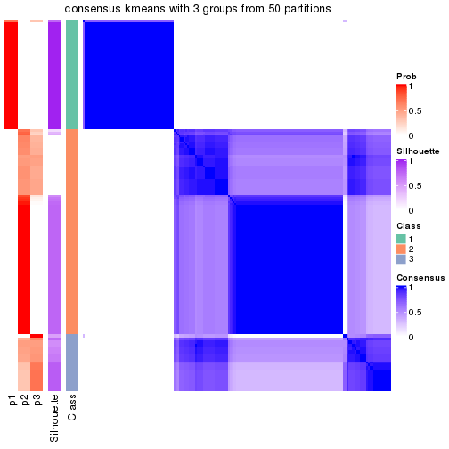</p>

</div>
<div id='tab-node-03-consensus-heatmap-3'>
<pre><code class="r">consensus_heatmap(res, k = 4)
</code></pre>

<p></p>

</div>
<div id='tab-node-03-consensus-heatmap-4'>
<pre><code class="r">consensus_heatmap(res, k = 5)
</code></pre>

<p></p>

</div>
<div id='tab-node-03-consensus-heatmap-5'>
<pre><code class="r">consensus_heatmap(res, k = 6)
</code></pre>

<p></p>

</div>
<div id='tab-node-03-consensus-heatmap-6'>
<pre><code class="r">consensus_heatmap(res, k = 7)
</code></pre>

<p></p>

</div>
<div id='tab-node-03-consensus-heatmap-7'>
<pre><code class="r">consensus_heatmap(res, k = 8)
</code></pre>

<p></p>

</div>
</div>

Heatmaps for the membership of samples in all partitions to see how consistent they are:


<script>
$( function() {
	$( '#tabs-node-03-membership-heatmap' ).tabs();
} );
</script>
<div id='tabs-node-03-membership-heatmap'>
<ul>
<li><a href='#tab-node-03-membership-heatmap-1'>k = 2</a></li>
<li><a href='#tab-node-03-membership-heatmap-2'>k = 3</a></li>
<li><a href='#tab-node-03-membership-heatmap-3'>k = 4</a></li>
<li><a href='#tab-node-03-membership-heatmap-4'>k = 5</a></li>
<li><a href='#tab-node-03-membership-heatmap-5'>k = 6</a></li>
<li><a href='#tab-node-03-membership-heatmap-6'>k = 7</a></li>
<li><a href='#tab-node-03-membership-heatmap-7'>k = 8</a></li>
</ul>
<div id='tab-node-03-membership-heatmap-1'>
<pre><code class="r">membership_heatmap(res, k = 2)
</code></pre>

<p></p>

</div>
<div id='tab-node-03-membership-heatmap-2'>
<pre><code class="r">membership_heatmap(res, k = 3)
</code></pre>

<p></p>

</div>
<div id='tab-node-03-membership-heatmap-3'>
<pre><code class="r">membership_heatmap(res, k = 4)
</code></pre>

<p></p>

</div>
<div id='tab-node-03-membership-heatmap-4'>
<pre><code class="r">membership_heatmap(res, k = 5)
</code></pre>

<p></p>

</div>
<div id='tab-node-03-membership-heatmap-5'>
<pre><code class="r">membership_heatmap(res, k = 6)
</code></pre>

<p></p>

</div>
<div id='tab-node-03-membership-heatmap-6'>
<pre><code class="r">membership_heatmap(res, k = 7)
</code></pre>

<p>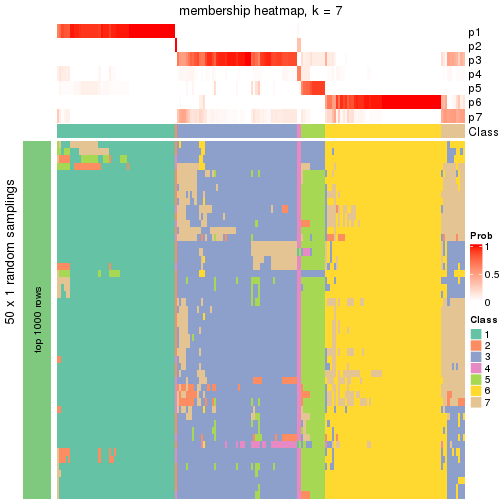</p>

</div>
<div id='tab-node-03-membership-heatmap-7'>
<pre><code class="r">membership_heatmap(res, k = 8)
</code></pre>

<p></p>

</div>
</div>

As soon as the classes for columns are determined, the signatures
that are significantly different between subgroups can be looked for. 
Following are the heatmaps for signatures.


<script>
$( function() {
	$( '#tabs-node-03-get-signatures' ).tabs();
} );
</script>
<div id='tabs-node-03-get-signatures'>
<ul>
<li><a href='#tab-node-03-get-signatures-1'>k = 2</a></li>
<li><a href='#tab-node-03-get-signatures-2'>k = 3</a></li>
<li><a href='#tab-node-03-get-signatures-3'>k = 4</a></li>
<li><a href='#tab-node-03-get-signatures-4'>k = 5</a></li>
<li><a href='#tab-node-03-get-signatures-5'>k = 6</a></li>
<li><a href='#tab-node-03-get-signatures-6'>k = 7</a></li>
<li><a href='#tab-node-03-get-signatures-7'>k = 8</a></li>
</ul>
<div id='tab-node-03-get-signatures-1'>
<pre><code class="r">get_signatures(res, k = 2)
</code></pre>

<p></p>

</div>
<div id='tab-node-03-get-signatures-2'>
<pre><code class="r">get_signatures(res, k = 3)
</code></pre>

<p></p>

</div>
<div id='tab-node-03-get-signatures-3'>
<pre><code class="r">get_signatures(res, k = 4)
</code></pre>

<p></p>

</div>
<div id='tab-node-03-get-signatures-4'>
<pre><code class="r">get_signatures(res, k = 5)
</code></pre>

<p></p>

</div>
<div id='tab-node-03-get-signatures-5'>
<pre><code class="r">get_signatures(res, k = 6)
</code></pre>

<p></p>

</div>
<div id='tab-node-03-get-signatures-6'>
<pre><code class="r">get_signatures(res, k = 7)
</code></pre>

<p></p>

</div>
<div id='tab-node-03-get-signatures-7'>
<pre><code class="r">get_signatures(res, k = 8)
</code></pre>

<p></p>

</div>
</div>


Compare the overlap of signatures from different k:

```r
compare_signatures(res)
```


`get_signature()` returns a data frame invisibly. To get the list of signatures, the function
call should be assigned to a variable explicitly. In following code, if `plot` argument is set
to `FALSE`, no heatmap is plotted while only the differential analysis is performed.

```r
# code only for demonstration
tb = get_signature(res, k = ..., plot = FALSE)
```

An example of the output of `tb` is:

```
#>   which_row         fdr    mean_1    mean_2 scaled_mean_1 scaled_mean_2 km
#> 1        38 0.042760348  8.373488  9.131774    -0.5533452     0.5164555  1
#> 2        40 0.018707592  7.106213  8.469186    -0.6173731     0.5762149  1
#> 3        55 0.019134737 10.221463 11.207825    -0.6159697     0.5749050  1
#> 4        59 0.006059896  5.921854  7.869574    -0.6899429     0.6439467  1
#> 5        60 0.018055526  8.928898 10.211722    -0.6204761     0.5791110  1
#> 6        98 0.009384629 15.714769 14.887706     0.6635654    -0.6193277  2
...
```

The columns in `tb` are:

1. `which_row`: row indices corresponding to the input matrix.
2. `fdr`: FDR for the differential test. 
3. `mean_x`: The mean value in group x.
4. `scaled_mean_x`: The mean value in group x after rows are scaled.
5. `km`: Row groups if k-means clustering is applied to rows (which is done by automatically selecting number of clusters).

If there are too many signatures, `top_signatures = ...` can be set to only show the 
signatures with the highest FDRs:

```r
# code only for demonstration
# e.g. to show the top 500 most significant rows
tb = get_signature(res, k = ..., top_signatures = 500)
```

If the signatures are defined as these which are uniquely high in current group, `diff_method` argument
can be set to `"uniquely_high_in_one_group"`:

```r
# code only for demonstration
tb = get_signature(res, k = ..., diff_method = "uniquely_high_in_one_group")
```


UMAP plot which shows how samples are separated.


<script>
$( function() {
	$( '#tabs-node-03-dimension-reduction' ).tabs();
} );
</script>
<div id='tabs-node-03-dimension-reduction'>
<ul>
<li><a href='#tab-node-03-dimension-reduction-1'>k = 2</a></li>
<li><a href='#tab-node-03-dimension-reduction-2'>k = 3</a></li>
<li><a href='#tab-node-03-dimension-reduction-3'>k = 4</a></li>
<li><a href='#tab-node-03-dimension-reduction-4'>k = 5</a></li>
<li><a href='#tab-node-03-dimension-reduction-5'>k = 6</a></li>
<li><a href='#tab-node-03-dimension-reduction-6'>k = 7</a></li>
<li><a href='#tab-node-03-dimension-reduction-7'>k = 8</a></li>
</ul>
<div id='tab-node-03-dimension-reduction-1'>
<pre><code class="r">dimension_reduction(res, k = 2, method = &quot;UMAP&quot;)
</code></pre>

<p></p>

</div>
<div id='tab-node-03-dimension-reduction-2'>
<pre><code class="r">dimension_reduction(res, k = 3, method = &quot;UMAP&quot;)
</code></pre>

<p></p>

</div>
<div id='tab-node-03-dimension-reduction-3'>
<pre><code class="r">dimension_reduction(res, k = 4, method = &quot;UMAP&quot;)
</code></pre>

<p></p>

</div>
<div id='tab-node-03-dimension-reduction-4'>
<pre><code class="r">dimension_reduction(res, k = 5, method = &quot;UMAP&quot;)
</code></pre>

<p></p>

</div>
<div id='tab-node-03-dimension-reduction-5'>
<pre><code class="r">dimension_reduction(res, k = 6, method = &quot;UMAP&quot;)
</code></pre>

<p></p>

</div>
<div id='tab-node-03-dimension-reduction-6'>
<pre><code class="r">dimension_reduction(res, k = 7, method = &quot;UMAP&quot;)
</code></pre>

<p></p>

</div>
<div id='tab-node-03-dimension-reduction-7'>
<pre><code class="r">dimension_reduction(res, k = 8, method = &quot;UMAP&quot;)
</code></pre>

<p></p>

</div>
</div>


Following heatmap shows how subgroups are split when increasing `k`:

```r
collect_classes(res)
```


If matrix rows can be associated to genes, consider to use `functional_enrichment(res,
...)` to perform function enrichment for the signature genes. See [this vignette](https://jokergoo.github.io/cola_vignettes/functional_enrichment.html) for more detailed explanations.


 

---------------------------------------------------


### Node031


Parent node: [Node03](#Node03).
Child nodes: 
                Node0111-leaf
        ,
                Node0112-leaf
        ,
                Node0113-leaf
        ,
                Node0114-leaf
        ,
                Node0131-leaf
        ,
                Node0132-leaf
        ,
                Node0133-leaf
        ,
                Node0141-leaf
        ,
                Node0142-leaf
        ,
                Node0143-leaf
        ,
                Node0211-leaf
        ,
                Node0212-leaf
        ,
                Node0221-leaf
        ,
                Node0222-leaf
        ,
                Node0223-leaf
        ,
                Node0224-leaf
        ,
                Node0231-leaf
        ,
                [Node0232](#Node0232)
        ,
                Node0233-leaf
        ,
                Node0234-leaf
        ,
                [Node0241](#Node0241)
        ,
                Node0242-leaf
        ,
                Node0243-leaf
        ,
                Node0244-leaf
        ,
                Node0251-leaf
        ,
                Node0252-leaf
        ,
                [Node0311](#Node0311)
        ,
                Node0312-leaf
        ,
                Node0313-leaf
        ,
                Node0331-leaf
        ,
                Node0332-leaf
        ,
                Node0333-leaf
        .


The object with results only for a single top-value method and a single partitioning method 
can be extracted as:

```r
res = res_rh["031"]
```

A summary of `res` and all the functions that can be applied to it:

```r
res
```

```
#> A 'ConsensusPartition' object with k = 2, 3, 4, 5, 6, 7, 8.
#>   On a matrix with 30000 rows and 54 columns.
#>   Top rows (1000) are extracted by 'ATC' method.
#>   Subgroups are detected by 'skmeans' method.
#>   Performed in total 350 partitions by row resampling.
#>   Best k for subgroups seems to be 3.
#> 
#> Following methods can be applied to this 'ConsensusPartition' object:
#>  [1] "cola_report"             "collect_classes"         "collect_plots"          
#>  [4] "collect_stats"           "colnames"                "compare_partitions"     
#>  [7] "compare_signatures"      "consensus_heatmap"       "dimension_reduction"    
#> [10] "functional_enrichment"   "get_anno_col"            "get_anno"               
#> [13] "get_classes"             "get_consensus"           "get_matrix"             
#> [16] "get_membership"          "get_param"               "get_signatures"         
#> [19] "get_stats"               "is_best_k"               "is_stable_k"            
#> [22] "membership_heatmap"      "ncol"                    "nrow"                   
#> [25] "plot_ecdf"               "predict_classes"         "rownames"               
#> [28] "select_partition_number" "show"                    "suggest_best_k"         
#> [31] "test_to_known_factors"   "top_rows_heatmap"
```

`collect_plots()` function collects all the plots made from `res` for all `k` (number of subgroups)
into one single page to provide an easy and fast comparison between different `k`.

```r
collect_plots(res)
```


The plots are:

- The first row: a plot of the eCDF (empirical cumulative distribution
  function) curves of the consensus matrix for each `k` and the heatmap of
  predicted classes for each `k`.
- The second row: heatmaps of the consensus matrix for each `k`.
- The third row: heatmaps of the membership matrix for each `k`.
- The fouth row: heatmaps of the signatures for each `k`.

All the plots in panels can be made by individual functions and they are
plotted later in this section.

`select_partition_number()` produces several plots showing different
statistics for choosing "optimized" `k`. There are following statistics:

- eCDF curves of the consensus matrix for each `k`;
- 1-PAC. [The PAC score](https://en.wikipedia.org/wiki/Consensus_clustering#Over-interpretation_potential_of_consensus_clustering)
  measures the proportion of the ambiguous subgrouping.
- Mean silhouette score.
- Concordance. The mean probability of fiting the consensus subgroup labels in all
  partitions.
- Area increased. Denote $A_k$ as the area under the eCDF curve for current
  `k`, the area increased is defined as $A_k - A_{k-1}$.
- Rand index. The percent of pairs of samples that are both in a same cluster
  or both are not in a same cluster in the partition of k and k-1.
- Jaccard index. The ratio of pairs of samples are both in a same cluster in
  the partition of k and k-1 and the pairs of samples are both in a same
  cluster in the partition k or k-1.

The detailed explanations of these statistics can be found in [the _cola_
vignette](https://jokergoo.github.io/cola_vignettes/cola.html#toc_13).

Generally speaking, higher 1-PAC score, higher mean silhouette score or higher
concordance corresponds to better partition. Rand index and Jaccard index
measure how similar the current partition is compared to partition with `k-1`.
If they are too similar, we won't accept `k` is better than `k-1`.

```r
select_partition_number(res)
```


The numeric values for all these statistics can be obtained by `get_stats()`.

```r
get_stats(res)
```

```
#>   k 1-PAC mean_silhouette concordance area_increased  Rand Jaccard
#> 2 2 1.000           0.999       1.000         0.4398 0.560   0.560
#> 3 3 0.997           0.973       0.987         0.5080 0.700   0.499
#> 4 4 0.736           0.746       0.869         0.1248 0.820   0.528
#> 5 5 0.697           0.617       0.827         0.0453 0.863   0.545
#> 6 6 0.688           0.592       0.798         0.0264 0.907   0.645
#> 7 7 0.678           0.491       0.744         0.0230 0.941   0.742
#> 8 8 0.709           0.397       0.673         0.0215 0.939   0.709
```

`suggest_best_k()` suggests the best $k$ based on these statistics. The rules are as follows:

- All $k$ with Jaccard index larger than 0.95 are removed because increasing
  $k$ does not provide enough extra information. If all $k$ are removed, it is
  marked as no subgroup is detected.
- For all $k$ with 1-PAC score larger than 0.9, the maximal $k$ is taken as
  the best $k$, and other $k$ are marked as optional $k$.
- If it does not fit the second rule. The $k$ with the maximal vote of the
  highest 1-PAC score, highest mean silhouette, and highest concordance is
  taken as the best $k$.

```r
suggest_best_k(res)
```

```
#> [1] 3
#> attr(,"optional")
#> [1] 2
```

There is also optional best $k$ = 2 that is worth to check.

Following is the table of the partitions (You need to click the **show/hide
code output** link to see it). The membership matrix (columns with name `p*`)
is inferred by
[`clue::cl_consensus()`](https://www.rdocumentation.org/link/cl_consensus?package=clue)
function with the `SE` method. Basically the value in the membership matrix
represents the probability to belong to a certain group. The finall subgroup
label for an item is determined with the group with highest probability it
belongs to.

In `get_classes()` function, the entropy is calculated from the membership
matrix and the silhouette score is calculated from the consensus matrix.


<script>
$( function() {
	$( '#tabs-node-031-get-classes' ).tabs();
} );
</script>
<div id='tabs-node-031-get-classes'>
<ul>
<li><a href='#tab-node-031-get-classes-1'>k = 2</a></li>
<li><a href='#tab-node-031-get-classes-2'>k = 3</a></li>
<li><a href='#tab-node-031-get-classes-3'>k = 4</a></li>
<li><a href='#tab-node-031-get-classes-4'>k = 5</a></li>
<li><a href='#tab-node-031-get-classes-5'>k = 6</a></li>
<li><a href='#tab-node-031-get-classes-6'>k = 7</a></li>
<li><a href='#tab-node-031-get-classes-7'>k = 8</a></li>
</ul>

<div id='tab-node-031-get-classes-1'>
<p><a id='tab-node-031-get-classes-1-a' style='color:#0366d6' href='#'>show/hide code output</a></p>
<pre><code class="r">cbind(get_classes(res, k = 2), get_membership(res, k = 2))
</code></pre>

<pre><code>#&gt;                 class entropy silhouette   p1   p2
#&gt; TCGA.EL.A4K9.01     1   0.000      1.000 1.00 0.00
#&gt; TCGA.EL.A3ZM.01     2   0.000      0.999 0.00 1.00
#&gt; TCGA.DJ.A3VB.01     2   0.000      0.999 0.00 1.00
#&gt; TCGA.DE.A4MD.01     2   0.000      0.999 0.00 1.00
#&gt; TCGA.ET.A40Q.01     2   0.141      0.980 0.02 0.98
#&gt; TCGA.EL.A4K7.01     1   0.000      1.000 1.00 0.00
#&gt; TCGA.J8.A3O2.06     1   0.000      1.000 1.00 0.00
#&gt; TCGA.J8.A3YF.01     2   0.000      0.999 0.00 1.00
#&gt; TCGA.DJ.A3VJ.01     1   0.000      1.000 1.00 0.00
#&gt; TCGA.EL.A3ZP.01     1   0.000      1.000 1.00 0.00
#&gt; TCGA.EL.A3ZT.01     1   0.000      1.000 1.00 0.00
#&gt; TCGA.L6.A4EQ.01     1   0.000      1.000 1.00 0.00
#&gt; TCGA.DJ.A3VE.01     1   0.000      1.000 1.00 0.00
#&gt; TCGA.MK.A4N6.01     2   0.000      0.999 0.00 1.00
#&gt; TCGA.DJ.A2PQ.01     1   0.000      1.000 1.00 0.00
#&gt; TCGA.E3.A3DY.01     1   0.000      1.000 1.00 0.00
#&gt; TCGA.DJ.A2Q4.01     1   0.000      1.000 1.00 0.00
#&gt; TCGA.FY.A4B3.01     1   0.000      1.000 1.00 0.00
#&gt; TCGA.E3.A3E5.01     1   0.000      1.000 1.00 0.00
#&gt; TCGA.BJ.A4O8.01     1   0.000      1.000 1.00 0.00
#&gt; TCGA.FK.A4UB.01     1   0.000      1.000 1.00 0.00
#&gt; TCGA.ET.A25M.01     1   0.000      1.000 1.00 0.00
#&gt; TCGA.EL.A3MY.01     2   0.000      0.999 0.00 1.00
#&gt; TCGA.EM.A3FM.01     1   0.000      1.000 1.00 0.00
#&gt; TCGA.EL.A3MZ.01     2   0.000      0.999 0.00 1.00
#&gt; TCGA.EM.A3FO.01     1   0.000      1.000 1.00 0.00
#&gt; TCGA.EM.A2OX.01     1   0.000      1.000 1.00 0.00
#&gt; TCGA.DJ.A3V6.01     2   0.000      0.999 0.00 1.00
#&gt; TCGA.BJ.A18Z.01     1   0.000      1.000 1.00 0.00
#&gt; TCGA.DJ.A3V0.01     2   0.000      0.999 0.00 1.00
#&gt; TCGA.EL.A3T8.01     1   0.000      1.000 1.00 0.00
#&gt; TCGA.EM.A22O.01     2   0.000      0.999 0.00 1.00
#&gt; TCGA.J8.A3YH.01     1   0.000      1.000 1.00 0.00
#&gt; TCGA.EL.A3D0.01     2   0.000      0.999 0.00 1.00
#&gt; TCGA.J8.A3YH.06     1   0.000      1.000 1.00 0.00
#&gt; TCGA.BJ.A3EZ.01     2   0.000      0.999 0.00 1.00
#&gt; TCGA.EM.A1CU.01     1   0.000      1.000 1.00 0.00
#&gt; TCGA.DJ.A2PW.01     1   0.000      1.000 1.00 0.00
#&gt; TCGA.ET.A2MZ.01     1   0.000      1.000 1.00 0.00
#&gt; TCGA.ET.A3BX.01     1   0.000      1.000 1.00 0.00
#&gt; TCGA.DJ.A1QQ.01     1   0.000      1.000 1.00 0.00
#&gt; TCGA.DJ.A1QO.01     2   0.000      0.999 0.00 1.00
#&gt; TCGA.BJ.A2NA.01     1   0.000      1.000 1.00 0.00
#&gt; TCGA.DJ.A3UO.01     1   0.000      1.000 1.00 0.00
#&gt; TCGA.FE.A231.01     2   0.000      0.999 0.00 1.00
#&gt; TCGA.ET.A3DW.01     2   0.000      0.999 0.00 1.00
#&gt; TCGA.ET.A39O.01     1   0.000      1.000 1.00 0.00
#&gt; TCGA.EL.A3D1.01     1   0.000      1.000 1.00 0.00
#&gt; TCGA.BJ.A3PU.01     1   0.000      1.000 1.00 0.00
#&gt; TCGA.BJ.A0ZB.01     2   0.000      0.999 0.00 1.00
#&gt; TCGA.DJ.A2PR.01     1   0.000      1.000 1.00 0.00
#&gt; TCGA.FY.A3ON.01     1   0.000      1.000 1.00 0.00
#&gt; TCGA.FE.A3PA.01     1   0.000      1.000 1.00 0.00
#&gt; TCGA.ET.A3BU.01     1   0.000      1.000 1.00 0.00
</code></pre>

<script>
$('#tab-node-031-get-classes-1-a').parent().next().next().hide();
$('#tab-node-031-get-classes-1-a').click(function(){
  $('#tab-node-031-get-classes-1-a').parent().next().next().toggle();
  return(false);
});
</script>
</div>

<div id='tab-node-031-get-classes-2'>
<p><a id='tab-node-031-get-classes-2-a' style='color:#0366d6' href='#'>show/hide code output</a></p>
<pre><code class="r">cbind(get_classes(res, k = 3), get_membership(res, k = 3))
</code></pre>

<pre><code>#&gt;                 class entropy silhouette   p1   p2   p3
#&gt; TCGA.EL.A4K9.01     1   0.000      0.976 1.00 0.00 0.00
#&gt; TCGA.EL.A3ZM.01     2   0.000      0.997 0.00 1.00 0.00
#&gt; TCGA.DJ.A3VB.01     3   0.207      0.936 0.00 0.06 0.94
#&gt; TCGA.DE.A4MD.01     2   0.000      0.997 0.00 1.00 0.00
#&gt; TCGA.ET.A40Q.01     3   0.000      0.990 0.00 0.00 1.00
#&gt; TCGA.EL.A4K7.01     3   0.000      0.990 0.00 0.00 1.00
#&gt; TCGA.J8.A3O2.06     3   0.000      0.990 0.00 0.00 1.00
#&gt; TCGA.J8.A3YF.01     2   0.000      0.997 0.00 1.00 0.00
#&gt; TCGA.DJ.A3VJ.01     1   0.000      0.976 1.00 0.00 0.00
#&gt; TCGA.EL.A3ZP.01     1   0.000      0.976 1.00 0.00 0.00
#&gt; TCGA.EL.A3ZT.01     1   0.000      0.976 1.00 0.00 0.00
#&gt; TCGA.L6.A4EQ.01     3   0.000      0.990 0.00 0.00 1.00
#&gt; TCGA.DJ.A3VE.01     1   0.000      0.976 1.00 0.00 0.00
#&gt; TCGA.MK.A4N6.01     3   0.000      0.990 0.00 0.00 1.00
#&gt; TCGA.DJ.A2PQ.01     1   0.369      0.848 0.86 0.00 0.14
#&gt; TCGA.E3.A3DY.01     3   0.000      0.990 0.00 0.00 1.00
#&gt; TCGA.DJ.A2Q4.01     1   0.000      0.976 1.00 0.00 0.00
#&gt; TCGA.FY.A4B3.01     1   0.000      0.976 1.00 0.00 0.00
#&gt; TCGA.E3.A3E5.01     3   0.000      0.990 0.00 0.00 1.00
#&gt; TCGA.BJ.A4O8.01     1   0.480      0.740 0.78 0.00 0.22
#&gt; TCGA.FK.A4UB.01     1   0.000      0.976 1.00 0.00 0.00
#&gt; TCGA.ET.A25M.01     3   0.000      0.990 0.00 0.00 1.00
#&gt; TCGA.EL.A3MY.01     2   0.000      0.997 0.00 1.00 0.00
#&gt; TCGA.EM.A3FM.01     3   0.000      0.990 0.00 0.00 1.00
#&gt; TCGA.EL.A3MZ.01     2   0.000      0.997 0.00 1.00 0.00
#&gt; TCGA.EM.A3FO.01     1   0.000      0.976 1.00 0.00 0.00
#&gt; TCGA.EM.A2OX.01     3   0.000      0.990 0.00 0.00 1.00
#&gt; TCGA.DJ.A3V6.01     2   0.153      0.958 0.00 0.96 0.04
#&gt; TCGA.BJ.A18Z.01     3   0.000      0.990 0.00 0.00 1.00
#&gt; TCGA.DJ.A3V0.01     3   0.207      0.936 0.00 0.06 0.94
#&gt; TCGA.EL.A3T8.01     1   0.000      0.976 1.00 0.00 0.00
#&gt; TCGA.EM.A22O.01     2   0.000      0.997 0.00 1.00 0.00
#&gt; TCGA.J8.A3YH.01     1   0.000      0.976 1.00 0.00 0.00
#&gt; TCGA.EL.A3D0.01     2   0.000      0.997 0.00 1.00 0.00
#&gt; TCGA.J8.A3YH.06     1   0.000      0.976 1.00 0.00 0.00
#&gt; TCGA.BJ.A3EZ.01     2   0.000      0.997 0.00 1.00 0.00
#&gt; TCGA.EM.A1CU.01     1   0.000      0.976 1.00 0.00 0.00
#&gt; TCGA.DJ.A2PW.01     1   0.000      0.976 1.00 0.00 0.00
#&gt; TCGA.ET.A2MZ.01     1   0.000      0.976 1.00 0.00 0.00
#&gt; TCGA.ET.A3BX.01     3   0.000      0.990 0.00 0.00 1.00
#&gt; TCGA.DJ.A1QQ.01     1   0.000      0.976 1.00 0.00 0.00
#&gt; TCGA.DJ.A1QO.01     2   0.000      0.997 0.00 1.00 0.00
#&gt; TCGA.BJ.A2NA.01     3   0.000      0.990 0.00 0.00 1.00
#&gt; TCGA.DJ.A3UO.01     3   0.153      0.950 0.04 0.00 0.96
#&gt; TCGA.FE.A231.01     2   0.000      0.997 0.00 1.00 0.00
#&gt; TCGA.ET.A3DW.01     2   0.000      0.997 0.00 1.00 0.00
#&gt; TCGA.ET.A39O.01     3   0.000      0.990 0.00 0.00 1.00
#&gt; TCGA.EL.A3D1.01     1   0.000      0.976 1.00 0.00 0.00
#&gt; TCGA.BJ.A3PU.01     3   0.000      0.990 0.00 0.00 1.00
#&gt; TCGA.BJ.A0ZB.01     2   0.000      0.997 0.00 1.00 0.00
#&gt; TCGA.DJ.A2PR.01     1   0.000      0.976 1.00 0.00 0.00
#&gt; TCGA.FY.A3ON.01     1   0.000      0.976 1.00 0.00 0.00
#&gt; TCGA.FE.A3PA.01     1   0.369      0.849 0.86 0.00 0.14
#&gt; TCGA.ET.A3BU.01     1   0.000      0.976 1.00 0.00 0.00
</code></pre>

<script>
$('#tab-node-031-get-classes-2-a').parent().next().next().hide();
$('#tab-node-031-get-classes-2-a').click(function(){
  $('#tab-node-031-get-classes-2-a').parent().next().next().toggle();
  return(false);
});
</script>
</div>

<div id='tab-node-031-get-classes-3'>
<p><a id='tab-node-031-get-classes-3-a' style='color:#0366d6' href='#'>show/hide code output</a></p>
<pre><code class="r">cbind(get_classes(res, k = 4), get_membership(res, k = 4))
</code></pre>

<pre><code>#&gt;                 class entropy silhouette   p1   p2   p3   p4
#&gt; TCGA.EL.A4K9.01     1  0.4134    0.73995 0.74 0.00 0.26 0.00
#&gt; TCGA.EL.A3ZM.01     2  0.0000    0.97297 0.00 1.00 0.00 0.00
#&gt; TCGA.DJ.A3VB.01     4  0.0000    0.87469 0.00 0.00 0.00 1.00
#&gt; TCGA.DE.A4MD.01     2  0.0000    0.97297 0.00 1.00 0.00 0.00
#&gt; TCGA.ET.A40Q.01     4  0.0000    0.87469 0.00 0.00 0.00 1.00
#&gt; TCGA.EL.A4K7.01     3  0.4907    0.27967 0.00 0.00 0.58 0.42
#&gt; TCGA.J8.A3O2.06     3  0.4855    0.45593 0.00 0.00 0.60 0.40
#&gt; TCGA.J8.A3YF.01     2  0.0000    0.97297 0.00 1.00 0.00 0.00
#&gt; TCGA.DJ.A3VJ.01     1  0.4624    0.61318 0.66 0.00 0.34 0.00
#&gt; TCGA.EL.A3ZP.01     1  0.0000    0.88022 1.00 0.00 0.00 0.00
#&gt; TCGA.EL.A3ZT.01     1  0.0000    0.88022 1.00 0.00 0.00 0.00
#&gt; TCGA.L6.A4EQ.01     3  0.4948    0.28687 0.00 0.00 0.56 0.44
#&gt; TCGA.DJ.A3VE.01     1  0.3975    0.75661 0.76 0.00 0.24 0.00
#&gt; TCGA.MK.A4N6.01     4  0.0000    0.87469 0.00 0.00 0.00 1.00
#&gt; TCGA.DJ.A2PQ.01     3  0.3335    0.65035 0.12 0.00 0.86 0.02
#&gt; TCGA.E3.A3DY.01     3  0.3037    0.65128 0.02 0.00 0.88 0.10
#&gt; TCGA.DJ.A2Q4.01     1  0.0000    0.88022 1.00 0.00 0.00 0.00
#&gt; TCGA.FY.A4B3.01     1  0.0000    0.88022 1.00 0.00 0.00 0.00
#&gt; TCGA.E3.A3E5.01     3  0.4624    0.52615 0.00 0.00 0.66 0.34
#&gt; TCGA.BJ.A4O8.01     3  0.3606    0.63772 0.14 0.00 0.84 0.02
#&gt; TCGA.FK.A4UB.01     1  0.4134    0.73995 0.74 0.00 0.26 0.00
#&gt; TCGA.ET.A25M.01     3  0.4522    0.55197 0.00 0.00 0.68 0.32
#&gt; TCGA.EL.A3MY.01     2  0.3801    0.71939 0.00 0.78 0.00 0.22
#&gt; TCGA.EM.A3FM.01     3  0.4994    0.31511 0.00 0.00 0.52 0.48
#&gt; TCGA.EL.A3MZ.01     2  0.0000    0.97297 0.00 1.00 0.00 0.00
#&gt; TCGA.EM.A3FO.01     1  0.0707    0.87147 0.98 0.00 0.02 0.00
#&gt; TCGA.EM.A2OX.01     3  0.4790    0.48066 0.00 0.00 0.62 0.38
#&gt; TCGA.DJ.A3V6.01     4  0.4977    0.00742 0.00 0.46 0.00 0.54
#&gt; TCGA.BJ.A18Z.01     4  0.2345    0.81247 0.00 0.00 0.10 0.90
#&gt; TCGA.DJ.A3V0.01     4  0.0707    0.85926 0.00 0.02 0.00 0.98
#&gt; TCGA.EL.A3T8.01     1  0.4134    0.73995 0.74 0.00 0.26 0.00
#&gt; TCGA.EM.A22O.01     2  0.0000    0.97297 0.00 1.00 0.00 0.00
#&gt; TCGA.J8.A3YH.01     3  0.4277    0.42768 0.28 0.00 0.72 0.00
#&gt; TCGA.EL.A3D0.01     2  0.2011    0.91432 0.00 0.92 0.08 0.00
#&gt; TCGA.J8.A3YH.06     3  0.4277    0.42768 0.28 0.00 0.72 0.00
#&gt; TCGA.BJ.A3EZ.01     2  0.0000    0.97297 0.00 1.00 0.00 0.00
#&gt; TCGA.EM.A1CU.01     1  0.0000    0.88022 1.00 0.00 0.00 0.00
#&gt; TCGA.DJ.A2PW.01     1  0.3801    0.77049 0.78 0.00 0.22 0.00
#&gt; TCGA.ET.A2MZ.01     3  0.4713    0.23502 0.36 0.00 0.64 0.00
#&gt; TCGA.ET.A3BX.01     4  0.1211    0.86614 0.00 0.00 0.04 0.96
#&gt; TCGA.DJ.A1QQ.01     1  0.0000    0.88022 1.00 0.00 0.00 0.00
#&gt; TCGA.DJ.A1QO.01     2  0.0000    0.97297 0.00 1.00 0.00 0.00
#&gt; TCGA.BJ.A2NA.01     4  0.2345    0.81247 0.00 0.00 0.10 0.90
#&gt; TCGA.DJ.A3UO.01     3  0.2706    0.65331 0.02 0.00 0.90 0.08
#&gt; TCGA.FE.A231.01     2  0.0000    0.97297 0.00 1.00 0.00 0.00
#&gt; TCGA.ET.A3DW.01     2  0.0000    0.97297 0.00 1.00 0.00 0.00
#&gt; TCGA.ET.A39O.01     4  0.1211    0.86618 0.00 0.00 0.04 0.96
#&gt; TCGA.EL.A3D1.01     1  0.0707    0.87147 0.98 0.00 0.02 0.00
#&gt; TCGA.BJ.A3PU.01     4  0.0707    0.87334 0.00 0.00 0.02 0.98
#&gt; TCGA.BJ.A0ZB.01     2  0.0000    0.97297 0.00 1.00 0.00 0.00
#&gt; TCGA.DJ.A2PR.01     1  0.0707    0.87147 0.98 0.00 0.02 0.00
#&gt; TCGA.FY.A3ON.01     1  0.0000    0.88022 1.00 0.00 0.00 0.00
#&gt; TCGA.FE.A3PA.01     3  0.2921    0.62241 0.14 0.00 0.86 0.00
#&gt; TCGA.ET.A3BU.01     1  0.0000    0.88022 1.00 0.00 0.00 0.00
</code></pre>

<script>
$('#tab-node-031-get-classes-3-a').parent().next().next().hide();
$('#tab-node-031-get-classes-3-a').click(function(){
  $('#tab-node-031-get-classes-3-a').parent().next().next().toggle();
  return(false);
});
</script>
</div>

<div id='tab-node-031-get-classes-4'>
<p><a id='tab-node-031-get-classes-4-a' style='color:#0366d6' href='#'>show/hide code output</a></p>
<pre><code class="r">cbind(get_classes(res, k = 5), get_membership(res, k = 5))
</code></pre>

<pre><code>#&gt;                 class entropy silhouette   p1   p2   p3   p4   p5
#&gt; TCGA.EL.A4K9.01     3  0.4818     0.2524 0.46 0.00 0.52 0.00 0.02
#&gt; TCGA.EL.A3ZM.01     2  0.0000     0.8870 0.00 1.00 0.00 0.00 0.00
#&gt; TCGA.DJ.A3VB.01     4  0.2331     0.6335 0.00 0.02 0.00 0.90 0.08
#&gt; TCGA.DE.A4MD.01     2  0.0000     0.8870 0.00 1.00 0.00 0.00 0.00
#&gt; TCGA.ET.A40Q.01     4  0.0000     0.7085 0.00 0.00 0.00 1.00 0.00
#&gt; TCGA.EL.A4K7.01     5  0.4216     0.7262 0.00 0.00 0.12 0.10 0.78
#&gt; TCGA.J8.A3O2.06     4  0.5579     0.3063 0.00 0.00 0.30 0.60 0.10
#&gt; TCGA.J8.A3YF.01     2  0.2280     0.8164 0.00 0.88 0.00 0.00 0.12
#&gt; TCGA.DJ.A3VJ.01     3  0.4613     0.4680 0.36 0.00 0.62 0.00 0.02
#&gt; TCGA.EL.A3ZP.01     1  0.0000     0.8668 1.00 0.00 0.00 0.00 0.00
#&gt; TCGA.EL.A3ZT.01     1  0.1216     0.8564 0.96 0.00 0.02 0.00 0.02
#&gt; TCGA.L6.A4EQ.01     5  0.5888     0.6630 0.00 0.00 0.14 0.28 0.58
#&gt; TCGA.DJ.A3VE.01     1  0.4227     0.0507 0.58 0.00 0.42 0.00 0.00
#&gt; TCGA.MK.A4N6.01     4  0.0609     0.6979 0.00 0.00 0.00 0.98 0.02
#&gt; TCGA.DJ.A2PQ.01     3  0.2754     0.6291 0.08 0.00 0.88 0.04 0.00
#&gt; TCGA.E3.A3DY.01     3  0.2331     0.5177 0.00 0.00 0.90 0.08 0.02
#&gt; TCGA.DJ.A2Q4.01     1  0.0609     0.8575 0.98 0.00 0.02 0.00 0.00
#&gt; TCGA.FY.A4B3.01     1  0.0609     0.8616 0.98 0.00 0.00 0.00 0.02
#&gt; TCGA.E3.A3E5.01     3  0.6455    -0.2846 0.00 0.00 0.48 0.32 0.20
#&gt; TCGA.BJ.A4O8.01     3  0.2438     0.6161 0.06 0.00 0.90 0.04 0.00
#&gt; TCGA.FK.A4UB.01     3  0.4798     0.3176 0.44 0.00 0.54 0.00 0.02
#&gt; TCGA.ET.A25M.01     3  0.5457    -0.3304 0.00 0.00 0.48 0.46 0.06
#&gt; TCGA.EL.A3MY.01     2  0.5444     0.5992 0.00 0.66 0.00 0.18 0.16
#&gt; TCGA.EM.A3FM.01     4  0.4990     0.3243 0.00 0.00 0.36 0.60 0.04
#&gt; TCGA.EL.A3MZ.01     2  0.0000     0.8870 0.00 1.00 0.00 0.00 0.00
#&gt; TCGA.EM.A3FO.01     1  0.3521     0.7639 0.82 0.00 0.04 0.00 0.14
#&gt; TCGA.EM.A2OX.01     4  0.6070     0.0119 0.00 0.00 0.44 0.44 0.12
#&gt; TCGA.DJ.A3V6.01     2  0.6326     0.2295 0.00 0.46 0.00 0.38 0.16
#&gt; TCGA.BJ.A18Z.01     4  0.2754     0.6744 0.00 0.00 0.08 0.88 0.04
#&gt; TCGA.DJ.A3V0.01     4  0.2331     0.6335 0.00 0.02 0.00 0.90 0.08
#&gt; TCGA.EL.A3T8.01     3  0.4675     0.4254 0.38 0.00 0.60 0.00 0.02
#&gt; TCGA.EM.A22O.01     2  0.0000     0.8870 0.00 1.00 0.00 0.00 0.00
#&gt; TCGA.J8.A3YH.01     3  0.3319     0.6577 0.16 0.00 0.82 0.00 0.02
#&gt; TCGA.EL.A3D0.01     2  0.4540     0.5783 0.00 0.64 0.02 0.00 0.34
#&gt; TCGA.J8.A3YH.06     3  0.3319     0.6577 0.16 0.00 0.82 0.00 0.02
#&gt; TCGA.BJ.A3EZ.01     2  0.0000     0.8870 0.00 1.00 0.00 0.00 0.00
#&gt; TCGA.EM.A1CU.01     1  0.0000     0.8668 1.00 0.00 0.00 0.00 0.00
#&gt; TCGA.DJ.A2PW.01     1  0.4182     0.1246 0.60 0.00 0.40 0.00 0.00
#&gt; TCGA.ET.A2MZ.01     3  0.3513     0.6540 0.18 0.00 0.80 0.00 0.02
#&gt; TCGA.ET.A3BX.01     4  0.5741     0.5069 0.06 0.00 0.10 0.70 0.14
#&gt; TCGA.DJ.A1QQ.01     1  0.0000     0.8668 1.00 0.00 0.00 0.00 0.00
#&gt; TCGA.DJ.A1QO.01     2  0.0000     0.8870 0.00 1.00 0.00 0.00 0.00
#&gt; TCGA.BJ.A2NA.01     4  0.2438     0.6864 0.00 0.00 0.06 0.90 0.04
#&gt; TCGA.DJ.A3UO.01     3  0.2754     0.4919 0.00 0.00 0.88 0.04 0.08
#&gt; TCGA.FE.A231.01     2  0.0000     0.8870 0.00 1.00 0.00 0.00 0.00
#&gt; TCGA.ET.A3DW.01     2  0.0000     0.8870 0.00 1.00 0.00 0.00 0.00
#&gt; TCGA.ET.A39O.01     4  0.0609     0.7140 0.00 0.00 0.02 0.98 0.00
#&gt; TCGA.EL.A3D1.01     1  0.2873     0.8001 0.86 0.00 0.02 0.00 0.12
#&gt; TCGA.BJ.A3PU.01     4  0.0609     0.7140 0.00 0.00 0.02 0.98 0.00
#&gt; TCGA.BJ.A0ZB.01     2  0.0000     0.8870 0.00 1.00 0.00 0.00 0.00
#&gt; TCGA.DJ.A2PR.01     1  0.2438     0.8246 0.90 0.00 0.06 0.00 0.04
#&gt; TCGA.FY.A3ON.01     1  0.0000     0.8668 1.00 0.00 0.00 0.00 0.00
#&gt; TCGA.FE.A3PA.01     3  0.3110     0.5638 0.06 0.00 0.86 0.00 0.08
#&gt; TCGA.ET.A3BU.01     1  0.0000     0.8668 1.00 0.00 0.00 0.00 0.00
</code></pre>

<script>
$('#tab-node-031-get-classes-4-a').parent().next().next().hide();
$('#tab-node-031-get-classes-4-a').click(function(){
  $('#tab-node-031-get-classes-4-a').parent().next().next().toggle();
  return(false);
});
</script>
</div>

<div id='tab-node-031-get-classes-5'>
<p><a id='tab-node-031-get-classes-5-a' style='color:#0366d6' href='#'>show/hide code output</a></p>
<pre><code class="r">cbind(get_classes(res, k = 6), get_membership(res, k = 6))
</code></pre>

<pre><code>#&gt;                 class entropy silhouette   p1   p2   p3   p4   p5   p6
#&gt; TCGA.EL.A4K9.01     1  0.3851    0.16995 0.54 0.00 0.46 0.00 0.00 0.00
#&gt; TCGA.EL.A3ZM.01     2  0.0000    0.90202 0.00 1.00 0.00 0.00 0.00 0.00
#&gt; TCGA.DJ.A3VB.01     4  0.3506    0.71207 0.00 0.00 0.02 0.80 0.02 0.16
#&gt; TCGA.DE.A4MD.01     2  0.0000    0.90202 0.00 1.00 0.00 0.00 0.00 0.00
#&gt; TCGA.ET.A40Q.01     4  0.2350    0.74595 0.00 0.00 0.00 0.88 0.02 0.10
#&gt; TCGA.EL.A4K7.01     5  0.3163    0.63069 0.00 0.00 0.04 0.00 0.82 0.14
#&gt; TCGA.J8.A3O2.06     3  0.5797    0.38995 0.00 0.00 0.52 0.36 0.08 0.04
#&gt; TCGA.J8.A3YF.01     2  0.3756   -0.00511 0.00 0.60 0.00 0.00 0.00 0.40
#&gt; TCGA.DJ.A3VJ.01     3  0.3309    0.43313 0.28 0.00 0.72 0.00 0.00 0.00
#&gt; TCGA.EL.A3ZP.01     1  0.0000    0.80657 1.00 0.00 0.00 0.00 0.00 0.00
#&gt; TCGA.EL.A3ZT.01     1  0.0547    0.80441 0.98 0.00 0.02 0.00 0.00 0.00
#&gt; TCGA.L6.A4EQ.01     5  0.5397    0.63459 0.00 0.00 0.06 0.20 0.66 0.08
#&gt; TCGA.DJ.A3VE.01     1  0.3864    0.11230 0.52 0.00 0.48 0.00 0.00 0.00
#&gt; TCGA.MK.A4N6.01     4  0.3111    0.73134 0.00 0.00 0.02 0.84 0.02 0.12
#&gt; TCGA.DJ.A2PQ.01     3  0.2474    0.63067 0.04 0.00 0.88 0.08 0.00 0.00
#&gt; TCGA.E3.A3DY.01     3  0.2956    0.61162 0.00 0.00 0.84 0.12 0.04 0.00
#&gt; TCGA.DJ.A2Q4.01     1  0.0547    0.80404 0.98 0.00 0.02 0.00 0.00 0.00
#&gt; TCGA.FY.A4B3.01     1  0.1092    0.78924 0.96 0.00 0.00 0.00 0.02 0.02
#&gt; TCGA.E3.A3E5.01     3  0.6702    0.39642 0.00 0.00 0.52 0.20 0.18 0.10
#&gt; TCGA.BJ.A4O8.01     3  0.3045    0.63183 0.06 0.00 0.84 0.10 0.00 0.00
#&gt; TCGA.FK.A4UB.01     3  0.3851   -0.02609 0.46 0.00 0.54 0.00 0.00 0.00
#&gt; TCGA.ET.A25M.01     3  0.4144    0.47259 0.00 0.00 0.62 0.36 0.02 0.00
#&gt; TCGA.EL.A3MY.01     6  0.5747    0.38470 0.00 0.30 0.00 0.20 0.00 0.50
#&gt; TCGA.EM.A3FM.01     3  0.5106    0.36157 0.00 0.00 0.50 0.44 0.02 0.04
#&gt; TCGA.EL.A3MZ.01     2  0.0000    0.90202 0.00 1.00 0.00 0.00 0.00 0.00
#&gt; TCGA.EM.A3FO.01     1  0.4631    0.61908 0.70 0.00 0.02 0.00 0.06 0.22
#&gt; TCGA.EM.A2OX.01     3  0.6516    0.38020 0.00 0.00 0.52 0.26 0.14 0.08
#&gt; TCGA.DJ.A3V6.01     4  0.5888   -0.27217 0.00 0.20 0.00 0.40 0.00 0.40
#&gt; TCGA.BJ.A18Z.01     4  0.0547    0.74327 0.00 0.00 0.02 0.98 0.00 0.00
#&gt; TCGA.DJ.A3V0.01     4  0.4002    0.54685 0.00 0.00 0.02 0.66 0.00 0.32
#&gt; TCGA.EL.A3T8.01     3  0.3797    0.09719 0.42 0.00 0.58 0.00 0.00 0.00
#&gt; TCGA.EM.A22O.01     2  0.0000    0.90202 0.00 1.00 0.00 0.00 0.00 0.00
#&gt; TCGA.J8.A3YH.01     3  0.3600    0.61448 0.08 0.00 0.82 0.00 0.08 0.02
#&gt; TCGA.EL.A3D0.01     6  0.5841    0.24056 0.00 0.30 0.00 0.00 0.22 0.48
#&gt; TCGA.J8.A3YH.06     3  0.3600    0.61448 0.08 0.00 0.82 0.00 0.08 0.02
#&gt; TCGA.BJ.A3EZ.01     2  0.0000    0.90202 0.00 1.00 0.00 0.00 0.00 0.00
#&gt; TCGA.EM.A1CU.01     1  0.0000    0.80657 1.00 0.00 0.00 0.00 0.00 0.00
#&gt; TCGA.DJ.A2PW.01     1  0.4646    0.05276 0.50 0.00 0.46 0.00 0.04 0.00
#&gt; TCGA.ET.A2MZ.01     3  0.2981    0.58333 0.16 0.00 0.82 0.00 0.02 0.00
#&gt; TCGA.ET.A3BX.01     4  0.4933    0.52571 0.06 0.00 0.06 0.76 0.06 0.06
#&gt; TCGA.DJ.A1QQ.01     1  0.0547    0.80432 0.98 0.00 0.02 0.00 0.00 0.00
#&gt; TCGA.DJ.A1QO.01     2  0.1556    0.82388 0.00 0.92 0.00 0.00 0.00 0.08
#&gt; TCGA.BJ.A2NA.01     4  0.0547    0.74327 0.00 0.00 0.02 0.98 0.00 0.00
#&gt; TCGA.DJ.A3UO.01     3  0.4926    0.55869 0.00 0.00 0.72 0.08 0.14 0.06
#&gt; TCGA.FE.A231.01     2  0.0000    0.90202 0.00 1.00 0.00 0.00 0.00 0.00
#&gt; TCGA.ET.A3DW.01     2  0.0000    0.90202 0.00 1.00 0.00 0.00 0.00 0.00
#&gt; TCGA.ET.A39O.01     4  0.0000    0.75512 0.00 0.00 0.00 1.00 0.00 0.00
#&gt; TCGA.EL.A3D1.01     1  0.3688    0.70467 0.80 0.00 0.02 0.00 0.04 0.14
#&gt; TCGA.BJ.A3PU.01     4  0.0000    0.75512 0.00 0.00 0.00 1.00 0.00 0.00
#&gt; TCGA.BJ.A0ZB.01     2  0.2048    0.76786 0.00 0.88 0.00 0.00 0.00 0.12
#&gt; TCGA.DJ.A2PR.01     1  0.2512    0.76846 0.88 0.00 0.06 0.00 0.00 0.06
#&gt; TCGA.FY.A3ON.01     1  0.0000    0.80657 1.00 0.00 0.00 0.00 0.00 0.00
#&gt; TCGA.FE.A3PA.01     3  0.4695    0.57449 0.02 0.00 0.74 0.02 0.16 0.06
#&gt; TCGA.ET.A3BU.01     1  0.0547    0.80033 0.98 0.00 0.00 0.00 0.02 0.00
</code></pre>

<script>
$('#tab-node-031-get-classes-5-a').parent().next().next().hide();
$('#tab-node-031-get-classes-5-a').click(function(){
  $('#tab-node-031-get-classes-5-a').parent().next().next().toggle();
  return(false);
});
</script>
</div>

<div id='tab-node-031-get-classes-6'>
<p><a id='tab-node-031-get-classes-6-a' style='color:#0366d6' href='#'>show/hide code output</a></p>
<pre><code class="r">cbind(get_classes(res, k = 7), get_membership(res, k = 7))
</code></pre>

<pre><code>#&gt;                 class entropy silhouette   p1   p2   p3   p4   p5   p6   p7
#&gt; TCGA.EL.A4K9.01     3  0.3459     0.2124 0.40 0.00 0.60 0.00 0.00 0.00 0.00
#&gt; TCGA.EL.A3ZM.01     2  0.0000     0.8801 0.00 1.00 0.00 0.00 0.00 0.00 0.00
#&gt; TCGA.DJ.A3VB.01     4  0.0863     0.6445 0.00 0.00 0.00 0.96 0.00 0.04 0.00
#&gt; TCGA.DE.A4MD.01     2  0.0000     0.8801 0.00 1.00 0.00 0.00 0.00 0.00 0.00
#&gt; TCGA.ET.A40Q.01     4  0.1671     0.6431 0.00 0.00 0.00 0.90 0.00 0.00 0.10
#&gt; TCGA.EL.A4K7.01     5  0.5071     0.6329 0.00 0.00 0.02 0.06 0.68 0.18 0.06
#&gt; TCGA.J8.A3O2.06     7  0.5833     0.6949 0.00 0.00 0.14 0.22 0.08 0.00 0.56
#&gt; TCGA.J8.A3YF.01     2  0.3927     0.1681 0.00 0.66 0.00 0.04 0.00 0.30 0.00
#&gt; TCGA.DJ.A3VJ.01     3  0.4211     0.4425 0.26 0.00 0.68 0.00 0.00 0.02 0.04
#&gt; TCGA.EL.A3ZP.01     1  0.0000     0.7736 1.00 0.00 0.00 0.00 0.00 0.00 0.00
#&gt; TCGA.EL.A3ZT.01     1  0.2421     0.7454 0.88 0.00 0.02 0.00 0.00 0.02 0.08
#&gt; TCGA.L6.A4EQ.01     5  0.2769     0.6567 0.00 0.00 0.02 0.04 0.86 0.00 0.08
#&gt; TCGA.DJ.A3VE.01     1  0.3546    -0.0201 0.54 0.00 0.46 0.00 0.00 0.00 0.00
#&gt; TCGA.MK.A4N6.01     4  0.0504     0.6515 0.00 0.00 0.00 0.98 0.00 0.00 0.02
#&gt; TCGA.DJ.A2PQ.01     3  0.3867     0.1031 0.02 0.00 0.60 0.00 0.00 0.00 0.38
#&gt; TCGA.E3.A3DY.01     3  0.4954    -0.2129 0.00 0.00 0.52 0.04 0.04 0.00 0.40
#&gt; TCGA.DJ.A2Q4.01     1  0.1363     0.7608 0.94 0.00 0.04 0.00 0.00 0.02 0.00
#&gt; TCGA.FY.A4B3.01     1  0.1363     0.7702 0.94 0.00 0.02 0.00 0.00 0.00 0.04
#&gt; TCGA.E3.A3E5.01     3  0.7328    -0.4804 0.00 0.00 0.34 0.10 0.16 0.06 0.34
#&gt; TCGA.BJ.A4O8.01     3  0.3815     0.1200 0.02 0.00 0.62 0.00 0.00 0.00 0.36
#&gt; TCGA.FK.A4UB.01     3  0.3558     0.0901 0.48 0.00 0.52 0.00 0.00 0.00 0.00
#&gt; TCGA.ET.A25M.01     7  0.5190     0.6982 0.00 0.00 0.30 0.18 0.00 0.00 0.52
#&gt; TCGA.EL.A3MY.01     4  0.5606    -0.3733 0.00 0.28 0.00 0.38 0.00 0.34 0.00
#&gt; TCGA.EM.A3FM.01     7  0.5182     0.7499 0.00 0.00 0.24 0.22 0.00 0.00 0.54
#&gt; TCGA.EL.A3MZ.01     2  0.0504     0.8773 0.00 0.98 0.00 0.00 0.00 0.02 0.00
#&gt; TCGA.EM.A3FO.01     1  0.6607     0.4371 0.50 0.00 0.10 0.00 0.02 0.20 0.18
#&gt; TCGA.EM.A2OX.01     7  0.6568     0.5372 0.00 0.00 0.34 0.24 0.08 0.00 0.34
#&gt; TCGA.DJ.A3V6.01     4  0.4587     0.3697 0.00 0.10 0.00 0.68 0.00 0.20 0.02
#&gt; TCGA.BJ.A18Z.01     4  0.3294     0.4329 0.00 0.00 0.00 0.66 0.00 0.00 0.34
#&gt; TCGA.DJ.A3V0.01     4  0.2421     0.5949 0.00 0.02 0.00 0.88 0.00 0.08 0.02
#&gt; TCGA.EL.A3T8.01     3  0.3496     0.1783 0.42 0.00 0.58 0.00 0.00 0.00 0.00
#&gt; TCGA.EM.A22O.01     2  0.0000     0.8801 0.00 1.00 0.00 0.00 0.00 0.00 0.00
#&gt; TCGA.J8.A3YH.01     3  0.2512     0.5012 0.10 0.00 0.86 0.00 0.00 0.00 0.04
#&gt; TCGA.EL.A3D0.01     6  0.5381     0.0000 0.00 0.36 0.00 0.00 0.12 0.50 0.02
#&gt; TCGA.J8.A3YH.06     3  0.2512     0.5012 0.10 0.00 0.86 0.00 0.00 0.00 0.04
#&gt; TCGA.BJ.A3EZ.01     2  0.0504     0.8745 0.00 0.98 0.00 0.00 0.00 0.02 0.00
#&gt; TCGA.EM.A1CU.01     1  0.0863     0.7668 0.96 0.00 0.04 0.00 0.00 0.00 0.00
#&gt; TCGA.DJ.A2PW.01     1  0.4701     0.0789 0.50 0.00 0.44 0.00 0.00 0.04 0.02
#&gt; TCGA.ET.A2MZ.01     3  0.3011     0.5014 0.12 0.00 0.82 0.00 0.00 0.00 0.06
#&gt; TCGA.ET.A3BX.01     4  0.5974     0.3006 0.06 0.00 0.02 0.50 0.00 0.08 0.34
#&gt; TCGA.DJ.A1QQ.01     1  0.0000     0.7736 1.00 0.00 0.00 0.00 0.00 0.00 0.00
#&gt; TCGA.DJ.A1QO.01     2  0.2016     0.8063 0.00 0.90 0.00 0.04 0.00 0.06 0.00
#&gt; TCGA.BJ.A2NA.01     4  0.4070     0.4210 0.00 0.00 0.02 0.66 0.00 0.02 0.30
#&gt; TCGA.DJ.A3UO.01     3  0.4872    -0.0758 0.00 0.00 0.60 0.02 0.08 0.00 0.30
#&gt; TCGA.FE.A231.01     2  0.0000     0.8801 0.00 1.00 0.00 0.00 0.00 0.00 0.00
#&gt; TCGA.ET.A3DW.01     2  0.0504     0.8773 0.00 0.98 0.00 0.00 0.00 0.02 0.00
#&gt; TCGA.ET.A39O.01     4  0.2259     0.6235 0.00 0.00 0.00 0.84 0.00 0.00 0.16
#&gt; TCGA.EL.A3D1.01     1  0.6381     0.4766 0.54 0.00 0.20 0.00 0.02 0.12 0.12
#&gt; TCGA.BJ.A3PU.01     4  0.3186     0.5800 0.00 0.00 0.00 0.76 0.00 0.02 0.22
#&gt; TCGA.BJ.A0ZB.01     2  0.2259     0.6937 0.00 0.84 0.00 0.00 0.00 0.16 0.00
#&gt; TCGA.DJ.A2PR.01     1  0.3386     0.6676 0.78 0.00 0.18 0.00 0.00 0.02 0.02
#&gt; TCGA.FY.A3ON.01     1  0.0000     0.7736 1.00 0.00 0.00 0.00 0.00 0.00 0.00
#&gt; TCGA.FE.A3PA.01     3  0.5998     0.2072 0.04 0.00 0.60 0.00 0.12 0.06 0.18
#&gt; TCGA.ET.A3BU.01     1  0.1363     0.7660 0.94 0.00 0.04 0.00 0.00 0.00 0.02
</code></pre>

<script>
$('#tab-node-031-get-classes-6-a').parent().next().next().hide();
$('#tab-node-031-get-classes-6-a').click(function(){
  $('#tab-node-031-get-classes-6-a').parent().next().next().toggle();
  return(false);
});
</script>
</div>

<div id='tab-node-031-get-classes-7'>
<p><a id='tab-node-031-get-classes-7-a' style='color:#0366d6' href='#'>show/hide code output</a></p>
<pre><code class="r">cbind(get_classes(res, k = 8), get_membership(res, k = 8))
</code></pre>

<pre><code>#&gt;                 class entropy silhouette   p1   p2   p3   p4   p5   p6   p7   p8
#&gt; TCGA.EL.A4K9.01     3  0.5342    -0.0746 0.40 0.00 0.44 0.00 0.00 0.00 0.04 0.12
#&gt; TCGA.EL.A3ZM.01     2  0.0808     0.8883 0.00 0.96 0.00 0.00 0.00 0.00 0.04 0.00
#&gt; TCGA.DJ.A3VB.01     4  0.1741     0.6048 0.00 0.00 0.00 0.92 0.02 0.02 0.04 0.00
#&gt; TCGA.DE.A4MD.01     2  0.0808     0.8883 0.00 0.96 0.00 0.00 0.00 0.00 0.04 0.00
#&gt; TCGA.ET.A40Q.01     4  0.0000     0.6042 0.00 0.00 0.00 1.00 0.00 0.00 0.00 0.00
#&gt; TCGA.EL.A4K7.01     5  0.6367     0.4060 0.00 0.00 0.02 0.02 0.52 0.14 0.20 0.10
#&gt; TCGA.J8.A3O2.06     7  0.6390     0.4634 0.00 0.00 0.32 0.26 0.06 0.02 0.34 0.00
#&gt; TCGA.J8.A3YF.01     2  0.5208     0.3221 0.00 0.60 0.00 0.06 0.04 0.26 0.04 0.00
#&gt; TCGA.DJ.A3VJ.01     3  0.5393     0.2745 0.28 0.00 0.54 0.00 0.00 0.00 0.10 0.08
#&gt; TCGA.EL.A3ZP.01     1  0.0000     0.6342 1.00 0.00 0.00 0.00 0.00 0.00 0.00 0.00
#&gt; TCGA.EL.A3ZT.01     1  0.2624     0.5706 0.86 0.00 0.00 0.00 0.00 0.02 0.06 0.06
#&gt; TCGA.L6.A4EQ.01     5  0.3048     0.4123 0.00 0.00 0.02 0.08 0.84 0.04 0.02 0.00
#&gt; TCGA.DJ.A3VE.01     1  0.5039     0.3057 0.56 0.00 0.32 0.00 0.00 0.02 0.02 0.08
#&gt; TCGA.MK.A4N6.01     4  0.0808     0.6075 0.00 0.00 0.00 0.96 0.04 0.00 0.00 0.00
#&gt; TCGA.DJ.A2PQ.01     3  0.2484     0.3280 0.02 0.00 0.86 0.00 0.02 0.00 0.10 0.00
#&gt; TCGA.E3.A3DY.01     3  0.2224     0.2618 0.00 0.00 0.86 0.00 0.02 0.00 0.12 0.00
#&gt; TCGA.DJ.A2Q4.01     1  0.1607     0.6224 0.92 0.00 0.00 0.00 0.00 0.00 0.04 0.04
#&gt; TCGA.FY.A4B3.01     1  0.1341     0.5916 0.92 0.00 0.00 0.00 0.00 0.00 0.00 0.08
#&gt; TCGA.E3.A3E5.01     7  0.7043     0.4557 0.00 0.00 0.30 0.12 0.08 0.02 0.40 0.08
#&gt; TCGA.BJ.A4O8.01     3  0.2265     0.3563 0.02 0.00 0.88 0.00 0.00 0.00 0.08 0.02
#&gt; TCGA.FK.A4UB.01     1  0.5349     0.0498 0.44 0.00 0.42 0.00 0.00 0.02 0.02 0.10
#&gt; TCGA.ET.A25M.01     3  0.5210    -0.4319 0.00 0.00 0.52 0.18 0.02 0.00 0.28 0.00
#&gt; TCGA.EL.A3MY.01     4  0.6731    -0.0377 0.00 0.24 0.00 0.42 0.08 0.20 0.06 0.00
#&gt; TCGA.EM.A3FM.01     3  0.5916    -0.5043 0.00 0.00 0.40 0.24 0.02 0.02 0.32 0.00
#&gt; TCGA.EL.A3MZ.01     2  0.0941     0.8919 0.00 0.96 0.00 0.00 0.00 0.02 0.02 0.00
#&gt; TCGA.EM.A3FO.01     8  0.3570     0.0000 0.36 0.00 0.00 0.00 0.00 0.00 0.02 0.62
#&gt; TCGA.EM.A2OX.01     7  0.5767     0.3415 0.00 0.00 0.32 0.14 0.02 0.00 0.48 0.04
#&gt; TCGA.DJ.A3V6.01     4  0.5675     0.3927 0.00 0.10 0.00 0.62 0.10 0.12 0.06 0.00
#&gt; TCGA.BJ.A18Z.01     4  0.4651     0.0497 0.00 0.00 0.18 0.58 0.00 0.00 0.24 0.00
#&gt; TCGA.DJ.A3V0.01     4  0.3670     0.5609 0.00 0.02 0.00 0.80 0.06 0.06 0.06 0.00
#&gt; TCGA.EL.A3T8.01     3  0.5462    -0.0659 0.38 0.00 0.46 0.00 0.00 0.02 0.02 0.12
#&gt; TCGA.EM.A22O.01     2  0.0000     0.8982 0.00 1.00 0.00 0.00 0.00 0.00 0.00 0.00
#&gt; TCGA.J8.A3YH.01     3  0.4882     0.3721 0.02 0.00 0.60 0.00 0.00 0.00 0.20 0.18
#&gt; TCGA.EL.A3D0.01     6  0.2888     0.0000 0.00 0.16 0.00 0.00 0.04 0.80 0.00 0.00
#&gt; TCGA.J8.A3YH.06     3  0.4760     0.3754 0.02 0.00 0.62 0.00 0.00 0.00 0.20 0.16
#&gt; TCGA.BJ.A3EZ.01     2  0.0000     0.8982 0.00 1.00 0.00 0.00 0.00 0.00 0.00 0.00
#&gt; TCGA.EM.A1CU.01     1  0.1275     0.6282 0.94 0.00 0.02 0.00 0.00 0.00 0.00 0.04
#&gt; TCGA.DJ.A2PW.01     1  0.5582     0.0779 0.44 0.00 0.38 0.00 0.02 0.00 0.02 0.14
#&gt; TCGA.ET.A2MZ.01     3  0.3670     0.4284 0.06 0.00 0.80 0.00 0.00 0.02 0.06 0.06
#&gt; TCGA.ET.A3BX.01     7  0.7690     0.1427 0.08 0.00 0.04 0.30 0.02 0.06 0.34 0.16
#&gt; TCGA.DJ.A1QQ.01     1  0.0471     0.6271 0.98 0.00 0.00 0.00 0.00 0.00 0.02 0.00
#&gt; TCGA.DJ.A1QO.01     2  0.2165     0.8198 0.00 0.88 0.00 0.00 0.00 0.06 0.06 0.00
#&gt; TCGA.BJ.A2NA.01     4  0.5037    -0.0326 0.00 0.00 0.14 0.54 0.02 0.00 0.30 0.00
#&gt; TCGA.DJ.A3UO.01     3  0.4834     0.1240 0.00 0.00 0.52 0.00 0.04 0.00 0.38 0.06
#&gt; TCGA.FE.A231.01     2  0.0471     0.8920 0.00 0.98 0.00 0.00 0.00 0.00 0.02 0.00
#&gt; TCGA.ET.A3DW.01     2  0.0000     0.8982 0.00 1.00 0.00 0.00 0.00 0.00 0.00 0.00
#&gt; TCGA.ET.A39O.01     4  0.2547     0.5111 0.00 0.00 0.04 0.84 0.00 0.00 0.12 0.00
#&gt; TCGA.EL.A3D1.01     1  0.3618    -0.2717 0.60 0.00 0.00 0.00 0.02 0.00 0.00 0.38
#&gt; TCGA.BJ.A3PU.01     4  0.3054     0.4769 0.00 0.00 0.08 0.80 0.00 0.00 0.12 0.00
#&gt; TCGA.BJ.A0ZB.01     2  0.1804     0.8389 0.00 0.90 0.00 0.00 0.00 0.08 0.02 0.00
#&gt; TCGA.DJ.A2PR.01     1  0.2888     0.5185 0.80 0.00 0.04 0.00 0.00 0.00 0.00 0.16
#&gt; TCGA.FY.A3ON.01     1  0.0000     0.6342 1.00 0.00 0.00 0.00 0.00 0.00 0.00 0.00
#&gt; TCGA.FE.A3PA.01     3  0.5966     0.1788 0.04 0.00 0.46 0.02 0.02 0.00 0.36 0.10
#&gt; TCGA.ET.A3BU.01     1  0.0808     0.6092 0.96 0.00 0.00 0.00 0.00 0.00 0.00 0.04
</code></pre>

<script>
$('#tab-node-031-get-classes-7-a').parent().next().next().hide();
$('#tab-node-031-get-classes-7-a').click(function(){
  $('#tab-node-031-get-classes-7-a').parent().next().next().toggle();
  return(false);
});
</script>
</div>
</div>

Heatmaps for the consensus matrix. It visualizes the probability of two
samples to be in a same group.


<script>
$( function() {
	$( '#tabs-node-031-consensus-heatmap' ).tabs();
} );
</script>
<div id='tabs-node-031-consensus-heatmap'>
<ul>
<li><a href='#tab-node-031-consensus-heatmap-1'>k = 2</a></li>
<li><a href='#tab-node-031-consensus-heatmap-2'>k = 3</a></li>
<li><a href='#tab-node-031-consensus-heatmap-3'>k = 4</a></li>
<li><a href='#tab-node-031-consensus-heatmap-4'>k = 5</a></li>
<li><a href='#tab-node-031-consensus-heatmap-5'>k = 6</a></li>
<li><a href='#tab-node-031-consensus-heatmap-6'>k = 7</a></li>
<li><a href='#tab-node-031-consensus-heatmap-7'>k = 8</a></li>
</ul>
<div id='tab-node-031-consensus-heatmap-1'>
<pre><code class="r">consensus_heatmap(res, k = 2)
</code></pre>

<p></p>

</div>
<div id='tab-node-031-consensus-heatmap-2'>
<pre><code class="r">consensus_heatmap(res, k = 3)
</code></pre>

<p></p>

</div>
<div id='tab-node-031-consensus-heatmap-3'>
<pre><code class="r">consensus_heatmap(res, k = 4)
</code></pre>

<p>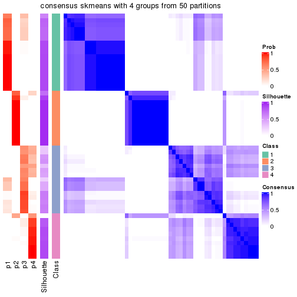</p>

</div>
<div id='tab-node-031-consensus-heatmap-4'>
<pre><code class="r">consensus_heatmap(res, k = 5)
</code></pre>

<p></p>

</div>
<div id='tab-node-031-consensus-heatmap-5'>
<pre><code class="r">consensus_heatmap(res, k = 6)
</code></pre>

<p></p>

</div>
<div id='tab-node-031-consensus-heatmap-6'>
<pre><code class="r">consensus_heatmap(res, k = 7)
</code></pre>

<p></p>

</div>
<div id='tab-node-031-consensus-heatmap-7'>
<pre><code class="r">consensus_heatmap(res, k = 8)
</code></pre>

<p></p>

</div>
</div>

Heatmaps for the membership of samples in all partitions to see how consistent they are:


<script>
$( function() {
	$( '#tabs-node-031-membership-heatmap' ).tabs();
} );
</script>
<div id='tabs-node-031-membership-heatmap'>
<ul>
<li><a href='#tab-node-031-membership-heatmap-1'>k = 2</a></li>
<li><a href='#tab-node-031-membership-heatmap-2'>k = 3</a></li>
<li><a href='#tab-node-031-membership-heatmap-3'>k = 4</a></li>
<li><a href='#tab-node-031-membership-heatmap-4'>k = 5</a></li>
<li><a href='#tab-node-031-membership-heatmap-5'>k = 6</a></li>
<li><a href='#tab-node-031-membership-heatmap-6'>k = 7</a></li>
<li><a href='#tab-node-031-membership-heatmap-7'>k = 8</a></li>
</ul>
<div id='tab-node-031-membership-heatmap-1'>
<pre><code class="r">membership_heatmap(res, k = 2)
</code></pre>

<p></p>

</div>
<div id='tab-node-031-membership-heatmap-2'>
<pre><code class="r">membership_heatmap(res, k = 3)
</code></pre>

<p></p>

</div>
<div id='tab-node-031-membership-heatmap-3'>
<pre><code class="r">membership_heatmap(res, k = 4)
</code></pre>

<p></p>

</div>
<div id='tab-node-031-membership-heatmap-4'>
<pre><code class="r">membership_heatmap(res, k = 5)
</code></pre>

<p></p>

</div>
<div id='tab-node-031-membership-heatmap-5'>
<pre><code class="r">membership_heatmap(res, k = 6)
</code></pre>

<p></p>

</div>
<div id='tab-node-031-membership-heatmap-6'>
<pre><code class="r">membership_heatmap(res, k = 7)
</code></pre>

<p>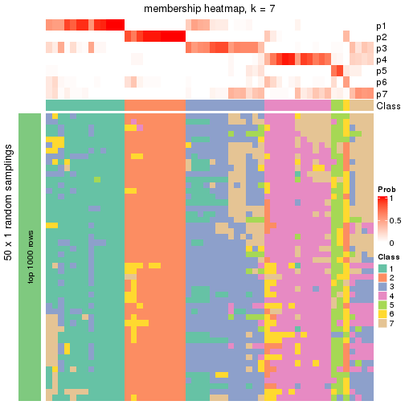</p>

</div>
<div id='tab-node-031-membership-heatmap-7'>
<pre><code class="r">membership_heatmap(res, k = 8)
</code></pre>

<p></p>

</div>
</div>

As soon as the classes for columns are determined, the signatures
that are significantly different between subgroups can be looked for. 
Following are the heatmaps for signatures.


<script>
$( function() {
	$( '#tabs-node-031-get-signatures' ).tabs();
} );
</script>
<div id='tabs-node-031-get-signatures'>
<ul>
<li><a href='#tab-node-031-get-signatures-1'>k = 2</a></li>
<li><a href='#tab-node-031-get-signatures-2'>k = 3</a></li>
<li><a href='#tab-node-031-get-signatures-3'>k = 4</a></li>
<li><a href='#tab-node-031-get-signatures-4'>k = 5</a></li>
<li><a href='#tab-node-031-get-signatures-5'>k = 6</a></li>
<li><a href='#tab-node-031-get-signatures-6'>k = 7</a></li>
<li><a href='#tab-node-031-get-signatures-7'>k = 8</a></li>
</ul>
<div id='tab-node-031-get-signatures-1'>
<pre><code class="r">get_signatures(res, k = 2)
</code></pre>

<p></p>

</div>
<div id='tab-node-031-get-signatures-2'>
<pre><code class="r">get_signatures(res, k = 3)
</code></pre>

<p></p>

</div>
<div id='tab-node-031-get-signatures-3'>
<pre><code class="r">get_signatures(res, k = 4)
</code></pre>

<p></p>

</div>
<div id='tab-node-031-get-signatures-4'>
<pre><code class="r">get_signatures(res, k = 5)
</code></pre>

<p></p>

</div>
<div id='tab-node-031-get-signatures-5'>
<pre><code class="r">get_signatures(res, k = 6)
</code></pre>

<p></p>

</div>
<div id='tab-node-031-get-signatures-6'>
<pre><code class="r">get_signatures(res, k = 7)
</code></pre>

<p></p>

</div>
<div id='tab-node-031-get-signatures-7'>
<pre><code class="r">get_signatures(res, k = 8)
</code></pre>

<p></p>

</div>
</div>


Compare the overlap of signatures from different k:

```r
compare_signatures(res)
```


`get_signature()` returns a data frame invisibly. To get the list of signatures, the function
call should be assigned to a variable explicitly. In following code, if `plot` argument is set
to `FALSE`, no heatmap is plotted while only the differential analysis is performed.

```r
# code only for demonstration
tb = get_signature(res, k = ..., plot = FALSE)
```

An example of the output of `tb` is:

```
#>   which_row         fdr    mean_1    mean_2 scaled_mean_1 scaled_mean_2 km
#> 1        38 0.042760348  8.373488  9.131774    -0.5533452     0.5164555  1
#> 2        40 0.018707592  7.106213  8.469186    -0.6173731     0.5762149  1
#> 3        55 0.019134737 10.221463 11.207825    -0.6159697     0.5749050  1
#> 4        59 0.006059896  5.921854  7.869574    -0.6899429     0.6439467  1
#> 5        60 0.018055526  8.928898 10.211722    -0.6204761     0.5791110  1
#> 6        98 0.009384629 15.714769 14.887706     0.6635654    -0.6193277  2
...
```

The columns in `tb` are:

1. `which_row`: row indices corresponding to the input matrix.
2. `fdr`: FDR for the differential test. 
3. `mean_x`: The mean value in group x.
4. `scaled_mean_x`: The mean value in group x after rows are scaled.
5. `km`: Row groups if k-means clustering is applied to rows (which is done by automatically selecting number of clusters).

If there are too many signatures, `top_signatures = ...` can be set to only show the 
signatures with the highest FDRs:

```r
# code only for demonstration
# e.g. to show the top 500 most significant rows
tb = get_signature(res, k = ..., top_signatures = 500)
```

If the signatures are defined as these which are uniquely high in current group, `diff_method` argument
can be set to `"uniquely_high_in_one_group"`:

```r
# code only for demonstration
tb = get_signature(res, k = ..., diff_method = "uniquely_high_in_one_group")
```


UMAP plot which shows how samples are separated.


<script>
$( function() {
	$( '#tabs-node-031-dimension-reduction' ).tabs();
} );
</script>
<div id='tabs-node-031-dimension-reduction'>
<ul>
<li><a href='#tab-node-031-dimension-reduction-1'>k = 2</a></li>
<li><a href='#tab-node-031-dimension-reduction-2'>k = 3</a></li>
<li><a href='#tab-node-031-dimension-reduction-3'>k = 4</a></li>
<li><a href='#tab-node-031-dimension-reduction-4'>k = 5</a></li>
<li><a href='#tab-node-031-dimension-reduction-5'>k = 6</a></li>
<li><a href='#tab-node-031-dimension-reduction-6'>k = 7</a></li>
<li><a href='#tab-node-031-dimension-reduction-7'>k = 8</a></li>
</ul>
<div id='tab-node-031-dimension-reduction-1'>
<pre><code class="r">dimension_reduction(res, k = 2, method = &quot;UMAP&quot;)
</code></pre>

<p></p>

</div>
<div id='tab-node-031-dimension-reduction-2'>
<pre><code class="r">dimension_reduction(res, k = 3, method = &quot;UMAP&quot;)
</code></pre>

<p></p>

</div>
<div id='tab-node-031-dimension-reduction-3'>
<pre><code class="r">dimension_reduction(res, k = 4, method = &quot;UMAP&quot;)
</code></pre>

<p></p>

</div>
<div id='tab-node-031-dimension-reduction-4'>
<pre><code class="r">dimension_reduction(res, k = 5, method = &quot;UMAP&quot;)
</code></pre>

<p></p>

</div>
<div id='tab-node-031-dimension-reduction-5'>
<pre><code class="r">dimension_reduction(res, k = 6, method = &quot;UMAP&quot;)
</code></pre>

<p></p>

</div>
<div id='tab-node-031-dimension-reduction-6'>
<pre><code class="r">dimension_reduction(res, k = 7, method = &quot;UMAP&quot;)
</code></pre>

<p></p>

</div>
<div id='tab-node-031-dimension-reduction-7'>
<pre><code class="r">dimension_reduction(res, k = 8, method = &quot;UMAP&quot;)
</code></pre>

<p></p>

</div>
</div>


Following heatmap shows how subgroups are split when increasing `k`:

```r
collect_classes(res)
```


If matrix rows can be associated to genes, consider to use `functional_enrichment(res,
...)` to perform function enrichment for the signature genes. See [this vignette](https://jokergoo.github.io/cola_vignettes/functional_enrichment.html) for more detailed explanations.


 

---------------------------------------------------


### Node0311


Parent node: [Node031](#Node031).
Child nodes: 
                Node02321-leaf
        ,
                Node02322-leaf
        ,
                Node02411-leaf
        ,
                Node02412-leaf
        ,
                Node02413-leaf
        ,
                Node02414-leaf
        ,
                Node03111-leaf
        ,
                Node03112-leaf
        ,
                Node03113-leaf
        .


The object with results only for a single top-value method and a single partitioning method 
can be extracted as:

```r
res = res_rh["0311"]
```

A summary of `res` and all the functions that can be applied to it:

```r
res
```

```
#> A 'ConsensusPartition' object with k = 2, 3, 4, 5, 6, 7, 8.
#>   On a matrix with 30000 rows and 23 columns.
#>   Top rows (1000) are extracted by 'ATC' method.
#>   Subgroups are detected by 'skmeans' method.
#>   Performed in total 350 partitions by row resampling.
#>   Best k for subgroups seems to be 3.
#> 
#> Following methods can be applied to this 'ConsensusPartition' object:
#>  [1] "cola_report"             "collect_classes"         "collect_plots"          
#>  [4] "collect_stats"           "colnames"                "compare_partitions"     
#>  [7] "compare_signatures"      "consensus_heatmap"       "dimension_reduction"    
#> [10] "functional_enrichment"   "get_anno_col"            "get_anno"               
#> [13] "get_classes"             "get_consensus"           "get_matrix"             
#> [16] "get_membership"          "get_param"               "get_signatures"         
#> [19] "get_stats"               "is_best_k"               "is_stable_k"            
#> [22] "membership_heatmap"      "ncol"                    "nrow"                   
#> [25] "plot_ecdf"               "predict_classes"         "rownames"               
#> [28] "select_partition_number" "show"                    "suggest_best_k"         
#> [31] "test_to_known_factors"   "top_rows_heatmap"
```

`collect_plots()` function collects all the plots made from `res` for all `k` (number of subgroups)
into one single page to provide an easy and fast comparison between different `k`.

```r
collect_plots(res)
```


The plots are:

- The first row: a plot of the eCDF (empirical cumulative distribution
  function) curves of the consensus matrix for each `k` and the heatmap of
  predicted classes for each `k`.
- The second row: heatmaps of the consensus matrix for each `k`.
- The third row: heatmaps of the membership matrix for each `k`.
- The fouth row: heatmaps of the signatures for each `k`.

All the plots in panels can be made by individual functions and they are
plotted later in this section.

`select_partition_number()` produces several plots showing different
statistics for choosing "optimized" `k`. There are following statistics:

- eCDF curves of the consensus matrix for each `k`;
- 1-PAC. [The PAC score](https://en.wikipedia.org/wiki/Consensus_clustering#Over-interpretation_potential_of_consensus_clustering)
  measures the proportion of the ambiguous subgrouping.
- Mean silhouette score.
- Concordance. The mean probability of fiting the consensus subgroup labels in all
  partitions.
- Area increased. Denote $A_k$ as the area under the eCDF curve for current
  `k`, the area increased is defined as $A_k - A_{k-1}$.
- Rand index. The percent of pairs of samples that are both in a same cluster
  or both are not in a same cluster in the partition of k and k-1.
- Jaccard index. The ratio of pairs of samples are both in a same cluster in
  the partition of k and k-1 and the pairs of samples are both in a same
  cluster in the partition k or k-1.

The detailed explanations of these statistics can be found in [the _cola_
vignette](https://jokergoo.github.io/cola_vignettes/cola.html#toc_13).

Generally speaking, higher 1-PAC score, higher mean silhouette score or higher
concordance corresponds to better partition. Rand index and Jaccard index
measure how similar the current partition is compared to partition with `k-1`.
If they are too similar, we won't accept `k` is better than `k-1`.

```r
select_partition_number(res)
```


The numeric values for all these statistics can be obtained by `get_stats()`.

```r
get_stats(res)
```

```
#>   k 1-PAC mean_silhouette concordance area_increased  Rand Jaccard
#> 2 2 1.000           0.992       0.996         0.1733 0.834   0.834
#> 3 3 1.000           0.986       0.994         2.3446 0.589   0.507
#> 4 4 0.657           0.828       0.882         0.1923 0.881   0.720
#> 5 5 0.638           0.770       0.848         0.0808 1.000   1.000
#> 6 6 0.657           0.597       0.807         0.0482 0.953   0.844
#> 7 7 0.667           0.479       0.768         0.0527 0.921   0.701
#> 8 8 0.690           0.362       0.730         0.0329 0.929   0.684
```

`suggest_best_k()` suggests the best $k$ based on these statistics. The rules are as follows:

- All $k$ with Jaccard index larger than 0.95 are removed because increasing
  $k$ does not provide enough extra information. If all $k$ are removed, it is
  marked as no subgroup is detected.
- For all $k$ with 1-PAC score larger than 0.9, the maximal $k$ is taken as
  the best $k$, and other $k$ are marked as optional $k$.
- If it does not fit the second rule. The $k$ with the maximal vote of the
  highest 1-PAC score, highest mean silhouette, and highest concordance is
  taken as the best $k$.

```r
suggest_best_k(res)
```

```
#> [1] 3
#> attr(,"optional")
#> [1] 2
```

There is also optional best $k$ = 2 that is worth to check.

Following is the table of the partitions (You need to click the **show/hide
code output** link to see it). The membership matrix (columns with name `p*`)
is inferred by
[`clue::cl_consensus()`](https://www.rdocumentation.org/link/cl_consensus?package=clue)
function with the `SE` method. Basically the value in the membership matrix
represents the probability to belong to a certain group. The finall subgroup
label for an item is determined with the group with highest probability it
belongs to.

In `get_classes()` function, the entropy is calculated from the membership
matrix and the silhouette score is calculated from the consensus matrix.


<script>
$( function() {
	$( '#tabs-node-0311-get-classes' ).tabs();
} );
</script>
<div id='tabs-node-0311-get-classes'>
<ul>
<li><a href='#tab-node-0311-get-classes-1'>k = 2</a></li>
<li><a href='#tab-node-0311-get-classes-2'>k = 3</a></li>
<li><a href='#tab-node-0311-get-classes-3'>k = 4</a></li>
<li><a href='#tab-node-0311-get-classes-4'>k = 5</a></li>
<li><a href='#tab-node-0311-get-classes-5'>k = 6</a></li>
<li><a href='#tab-node-0311-get-classes-6'>k = 7</a></li>
<li><a href='#tab-node-0311-get-classes-7'>k = 8</a></li>
</ul>

<div id='tab-node-0311-get-classes-1'>
<p><a id='tab-node-0311-get-classes-1-a' style='color:#0366d6' href='#'>show/hide code output</a></p>
<pre><code class="r">cbind(get_classes(res, k = 2), get_membership(res, k = 2))
</code></pre>

<pre><code>#&gt;                 class entropy silhouette   p1   p2
#&gt; TCGA.EL.A4K9.01     2   0.141      0.980 0.02 0.98
#&gt; TCGA.DJ.A3VJ.01     2   0.000      0.995 0.00 1.00
#&gt; TCGA.EL.A3ZP.01     2   0.000      0.995 0.00 1.00
#&gt; TCGA.EL.A3ZT.01     2   0.000      0.995 0.00 1.00
#&gt; TCGA.DJ.A3VE.01     2   0.000      0.995 0.00 1.00
#&gt; TCGA.DJ.A2PQ.01     2   0.000      0.995 0.00 1.00
#&gt; TCGA.DJ.A2Q4.01     2   0.000      0.995 0.00 1.00
#&gt; TCGA.FY.A4B3.01     2   0.000      0.995 0.00 1.00
#&gt; TCGA.BJ.A4O8.01     2   0.141      0.980 0.02 0.98
#&gt; TCGA.FK.A4UB.01     2   0.000      0.995 0.00 1.00
#&gt; TCGA.EM.A3FO.01     2   0.000      0.995 0.00 1.00
#&gt; TCGA.EL.A3T8.01     2   0.000      0.995 0.00 1.00
#&gt; TCGA.J8.A3YH.01     1   0.000      1.000 1.00 0.00
#&gt; TCGA.J8.A3YH.06     1   0.000      1.000 1.00 0.00
#&gt; TCGA.EM.A1CU.01     2   0.000      0.995 0.00 1.00
#&gt; TCGA.DJ.A2PW.01     2   0.000      0.995 0.00 1.00
#&gt; TCGA.ET.A2MZ.01     2   0.327      0.941 0.06 0.94
#&gt; TCGA.DJ.A1QQ.01     2   0.000      0.995 0.00 1.00
#&gt; TCGA.EL.A3D1.01     2   0.000      0.995 0.00 1.00
#&gt; TCGA.DJ.A2PR.01     2   0.000      0.995 0.00 1.00
#&gt; TCGA.FY.A3ON.01     2   0.000      0.995 0.00 1.00
#&gt; TCGA.FE.A3PA.01     2   0.000      0.995 0.00 1.00
#&gt; TCGA.ET.A3BU.01     2   0.000      0.995 0.00 1.00
</code></pre>

<script>
$('#tab-node-0311-get-classes-1-a').parent().next().next().hide();
$('#tab-node-0311-get-classes-1-a').click(function(){
  $('#tab-node-0311-get-classes-1-a').parent().next().next().toggle();
  return(false);
});
</script>
</div>

<div id='tab-node-0311-get-classes-2'>
<p><a id='tab-node-0311-get-classes-2-a' style='color:#0366d6' href='#'>show/hide code output</a></p>
<pre><code class="r">cbind(get_classes(res, k = 3), get_membership(res, k = 3))
</code></pre>

<pre><code>#&gt;                 class entropy silhouette   p1   p2   p3
#&gt; TCGA.EL.A4K9.01     3  0.0000      0.997 0.00 0.00 1.00
#&gt; TCGA.DJ.A3VJ.01     3  0.0000      0.997 0.00 0.00 1.00
#&gt; TCGA.EL.A3ZP.01     2  0.0000      0.988 0.00 1.00 0.00
#&gt; TCGA.EL.A3ZT.01     2  0.0000      0.988 0.00 1.00 0.00
#&gt; TCGA.DJ.A3VE.01     3  0.0000      0.997 0.00 0.00 1.00
#&gt; TCGA.DJ.A2PQ.01     3  0.0000      0.997 0.00 0.00 1.00
#&gt; TCGA.DJ.A2Q4.01     2  0.0000      0.988 0.00 1.00 0.00
#&gt; TCGA.FY.A4B3.01     2  0.0000      0.988 0.00 1.00 0.00
#&gt; TCGA.BJ.A4O8.01     3  0.0000      0.997 0.00 0.00 1.00
#&gt; TCGA.FK.A4UB.01     3  0.0000      0.997 0.00 0.00 1.00
#&gt; TCGA.EM.A3FO.01     2  0.0000      0.988 0.00 1.00 0.00
#&gt; TCGA.EL.A3T8.01     3  0.0000      0.997 0.00 0.00 1.00
#&gt; TCGA.J8.A3YH.01     1  0.0000      1.000 1.00 0.00 0.00
#&gt; TCGA.J8.A3YH.06     1  0.0000      1.000 1.00 0.00 0.00
#&gt; TCGA.EM.A1CU.01     2  0.0000      0.988 0.00 1.00 0.00
#&gt; TCGA.DJ.A2PW.01     2  0.0892      0.970 0.00 0.98 0.02
#&gt; TCGA.ET.A2MZ.01     3  0.0892      0.980 0.02 0.00 0.98
#&gt; TCGA.DJ.A1QQ.01     2  0.0000      0.988 0.00 1.00 0.00
#&gt; TCGA.EL.A3D1.01     2  0.0000      0.988 0.00 1.00 0.00
#&gt; TCGA.DJ.A2PR.01     2  0.0000      0.988 0.00 1.00 0.00
#&gt; TCGA.FY.A3ON.01     2  0.0000      0.988 0.00 1.00 0.00
#&gt; TCGA.FE.A3PA.01     2  0.2959      0.876 0.00 0.90 0.10
#&gt; TCGA.ET.A3BU.01     2  0.0000      0.988 0.00 1.00 0.00
</code></pre>

<script>
$('#tab-node-0311-get-classes-2-a').parent().next().next().hide();
$('#tab-node-0311-get-classes-2-a').click(function(){
  $('#tab-node-0311-get-classes-2-a').parent().next().next().toggle();
  return(false);
});
</script>
</div>

<div id='tab-node-0311-get-classes-3'>
<p><a id='tab-node-0311-get-classes-3-a' style='color:#0366d6' href='#'>show/hide code output</a></p>
<pre><code class="r">cbind(get_classes(res, k = 4), get_membership(res, k = 4))
</code></pre>

<pre><code>#&gt;                 class entropy silhouette p1   p2   p3   p4
#&gt; TCGA.EL.A4K9.01     3  0.4797      0.719  0 0.02 0.72 0.26
#&gt; TCGA.DJ.A3VJ.01     3  0.5077      0.723  0 0.08 0.76 0.16
#&gt; TCGA.EL.A3ZP.01     2  0.1211      0.895  0 0.96 0.00 0.04
#&gt; TCGA.EL.A3ZT.01     2  0.1211      0.887  0 0.96 0.00 0.04
#&gt; TCGA.DJ.A3VE.01     3  0.2921      0.776  0 0.00 0.86 0.14
#&gt; TCGA.DJ.A2PQ.01     3  0.2011      0.816  0 0.00 0.92 0.08
#&gt; TCGA.DJ.A2Q4.01     2  0.4088      0.751  0 0.82 0.04 0.14
#&gt; TCGA.FY.A4B3.01     2  0.0707      0.894  0 0.98 0.00 0.02
#&gt; TCGA.BJ.A4O8.01     3  0.1211      0.840  0 0.00 0.96 0.04
#&gt; TCGA.FK.A4UB.01     3  0.0707      0.841  0 0.00 0.98 0.02
#&gt; TCGA.EM.A3FO.01     2  0.1211      0.891  0 0.96 0.00 0.04
#&gt; TCGA.EL.A3T8.01     3  0.0707      0.838  0 0.00 0.98 0.02
#&gt; TCGA.J8.A3YH.01     1  0.0000      1.000  1 0.00 0.00 0.00
#&gt; TCGA.J8.A3YH.06     1  0.0000      1.000  1 0.00 0.00 0.00
#&gt; TCGA.EM.A1CU.01     2  0.2411      0.858  0 0.92 0.04 0.04
#&gt; TCGA.DJ.A2PW.01     2  0.5147      0.537  0 0.74 0.20 0.06
#&gt; TCGA.ET.A2MZ.01     3  0.4406      0.709  0 0.00 0.70 0.30
#&gt; TCGA.DJ.A1QQ.01     2  0.0707      0.891  0 0.98 0.00 0.02
#&gt; TCGA.EL.A3D1.01     4  0.4134      0.842  0 0.26 0.00 0.74
#&gt; TCGA.DJ.A2PR.01     4  0.4277      0.831  0 0.28 0.00 0.72
#&gt; TCGA.FY.A3ON.01     2  0.0707      0.894  0 0.98 0.00 0.02
#&gt; TCGA.FE.A3PA.01     4  0.6104      0.724  0 0.18 0.14 0.68
#&gt; TCGA.ET.A3BU.01     2  0.1637      0.880  0 0.94 0.00 0.06
</code></pre>

<script>
$('#tab-node-0311-get-classes-3-a').parent().next().next().hide();
$('#tab-node-0311-get-classes-3-a').click(function(){
  $('#tab-node-0311-get-classes-3-a').parent().next().next().toggle();
  return(false);
});
</script>
</div>

<div id='tab-node-0311-get-classes-4'>
<p><a id='tab-node-0311-get-classes-4-a' style='color:#0366d6' href='#'>show/hide code output</a></p>
<pre><code class="r">cbind(get_classes(res, k = 5), get_membership(res, k = 5))
</code></pre>

<pre><code>#&gt;                 class entropy silhouette p1   p2   p3   p4   p5
#&gt; TCGA.EL.A4K9.01     5  0.3922      0.755  0 0.00 0.18 0.04 0.78
#&gt; TCGA.DJ.A3VJ.01     5  0.4094      0.757  0 0.02 0.18 0.02 0.78
#&gt; TCGA.EL.A3ZP.01     2  0.0609      0.846  0 0.98 0.00 0.02 0.00
#&gt; TCGA.EL.A3ZT.01     2  0.2012      0.829  0 0.92 0.06 0.02 0.00
#&gt; TCGA.DJ.A3VE.01     5  0.4644      0.574  0 0.04 0.28 0.00 0.68
#&gt; TCGA.DJ.A2PQ.01     5  0.3109      0.699  0 0.00 0.20 0.00 0.80
#&gt; TCGA.DJ.A2Q4.01     2  0.6471      0.516  0 0.62 0.20 0.12 0.06
#&gt; TCGA.FY.A4B3.01     2  0.2797      0.826  0 0.88 0.06 0.06 0.00
#&gt; TCGA.BJ.A4O8.01     5  0.2516      0.780  0 0.00 0.14 0.00 0.86
#&gt; TCGA.FK.A4UB.01     5  0.1732      0.779  0 0.00 0.08 0.00 0.92
#&gt; TCGA.EM.A3FO.01     2  0.4437      0.746  0 0.76 0.14 0.10 0.00
#&gt; TCGA.EL.A3T8.01     5  0.1648      0.775  0 0.00 0.04 0.02 0.94
#&gt; TCGA.J8.A3YH.01     1  0.0000      1.000  1 0.00 0.00 0.00 0.00
#&gt; TCGA.J8.A3YH.06     1  0.0000      1.000  1 0.00 0.00 0.00 0.00
#&gt; TCGA.EM.A1CU.01     2  0.2012      0.823  0 0.92 0.00 0.02 0.06
#&gt; TCGA.DJ.A2PW.01     2  0.5295      0.700  0 0.74 0.06 0.10 0.10
#&gt; TCGA.ET.A2MZ.01     5  0.4456      0.662  0 0.00 0.32 0.02 0.66
#&gt; TCGA.DJ.A1QQ.01     2  0.0000      0.845  0 1.00 0.00 0.00 0.00
#&gt; TCGA.EL.A3D1.01     4  0.2012      0.753  0 0.06 0.02 0.92 0.00
#&gt; TCGA.DJ.A2PR.01     4  0.3627      0.772  0 0.10 0.04 0.84 0.02
#&gt; TCGA.FY.A3ON.01     2  0.0609      0.847  0 0.98 0.02 0.00 0.00
#&gt; TCGA.FE.A3PA.01     4  0.5778      0.636  0 0.04 0.10 0.68 0.18
#&gt; TCGA.ET.A3BU.01     2  0.3521      0.792  0 0.82 0.04 0.14 0.00
</code></pre>

<script>
$('#tab-node-0311-get-classes-4-a').parent().next().next().hide();
$('#tab-node-0311-get-classes-4-a').click(function(){
  $('#tab-node-0311-get-classes-4-a').parent().next().next().toggle();
  return(false);
});
</script>
</div>

<div id='tab-node-0311-get-classes-5'>
<p><a id='tab-node-0311-get-classes-5-a' style='color:#0366d6' href='#'>show/hide code output</a></p>
<pre><code class="r">cbind(get_classes(res, k = 6), get_membership(res, k = 6))
</code></pre>

<pre><code>#&gt;                 class entropy silhouette p1   p2   p3   p4   p5   p6
#&gt; TCGA.EL.A4K9.01     5  0.3258     0.4276  0 0.02 0.02 0.06 0.86 0.04
#&gt; TCGA.DJ.A3VJ.01     5  0.1480     0.4785  0 0.04 0.00 0.02 0.94 0.00
#&gt; TCGA.EL.A3ZP.01     2  0.0937     0.8243  0 0.96 0.00 0.04 0.00 0.00
#&gt; TCGA.EL.A3ZT.01     2  0.1635     0.8203  0 0.94 0.02 0.02 0.00 0.02
#&gt; TCGA.DJ.A3VE.01     6  0.6276     0.3182  0 0.06 0.00 0.12 0.30 0.52
#&gt; TCGA.DJ.A2PQ.01     6  0.3828     0.0754  0 0.00 0.00 0.00 0.44 0.56
#&gt; TCGA.DJ.A2Q4.01     2  0.5877     0.5168  0 0.58 0.06 0.30 0.04 0.02
#&gt; TCGA.FY.A4B3.01     2  0.2581     0.7820  0 0.86 0.02 0.12 0.00 0.00
#&gt; TCGA.BJ.A4O8.01     5  0.2094     0.4561  0 0.00 0.00 0.02 0.90 0.08
#&gt; TCGA.FK.A4UB.01     5  0.4731    -0.0365  0 0.00 0.02 0.02 0.56 0.40
#&gt; TCGA.EM.A3FO.01     2  0.3578     0.6185  0 0.66 0.00 0.34 0.00 0.00
#&gt; TCGA.EL.A3T8.01     5  0.4731    -0.0354  0 0.00 0.02 0.02 0.56 0.40
#&gt; TCGA.J8.A3YH.01     1  0.0000     1.0000  1 0.00 0.00 0.00 0.00 0.00
#&gt; TCGA.J8.A3YH.06     1  0.0000     1.0000  1 0.00 0.00 0.00 0.00 0.00
#&gt; TCGA.EM.A1CU.01     2  0.3162     0.7858  0 0.86 0.02 0.08 0.02 0.02
#&gt; TCGA.DJ.A2PW.01     2  0.5636     0.4855  0 0.62 0.06 0.08 0.24 0.00
#&gt; TCGA.ET.A2MZ.01     5  0.5679     0.2983  0 0.00 0.06 0.18 0.64 0.12
#&gt; TCGA.DJ.A1QQ.01     2  0.0000     0.8250  0 1.00 0.00 0.00 0.00 0.00
#&gt; TCGA.EL.A3D1.01     3  0.2020     0.8619  0 0.04 0.92 0.00 0.02 0.02
#&gt; TCGA.DJ.A2PR.01     3  0.1807     0.8607  0 0.06 0.92 0.00 0.02 0.00
#&gt; TCGA.FY.A3ON.01     2  0.0000     0.8250  0 1.00 0.00 0.00 0.00 0.00
#&gt; TCGA.FE.A3PA.01     3  0.4947     0.7433  0 0.04 0.74 0.08 0.12 0.02
#&gt; TCGA.ET.A3BU.01     2  0.2725     0.8002  0 0.88 0.06 0.04 0.00 0.02
</code></pre>

<script>
$('#tab-node-0311-get-classes-5-a').parent().next().next().hide();
$('#tab-node-0311-get-classes-5-a').click(function(){
  $('#tab-node-0311-get-classes-5-a').parent().next().next().toggle();
  return(false);
});
</script>
</div>

<div id='tab-node-0311-get-classes-6'>
<p><a id='tab-node-0311-get-classes-6-a' style='color:#0366d6' href='#'>show/hide code output</a></p>
<pre><code class="r">cbind(get_classes(res, k = 7), get_membership(res, k = 7))
</code></pre>

<pre><code>#&gt;                 class entropy silhouette p1   p2   p3   p4   p5   p6   p7
#&gt; TCGA.EL.A4K9.01     5  0.2569     0.5749  0 0.00 0.00 0.02 0.84 0.00 0.14
#&gt; TCGA.DJ.A3VJ.01     5  0.3396     0.5501  0 0.00 0.02 0.04 0.80 0.00 0.14
#&gt; TCGA.EL.A3ZP.01     2  0.2213     0.5953  0 0.90 0.00 0.04 0.04 0.00 0.02
#&gt; TCGA.EL.A3ZT.01     2  0.2706     0.5858  0 0.88 0.04 0.02 0.04 0.02 0.00
#&gt; TCGA.DJ.A3VE.01     6  0.6470     0.0000  0 0.00 0.00 0.10 0.16 0.38 0.36
#&gt; TCGA.DJ.A2PQ.01     7  0.3315     0.2577  0 0.00 0.00 0.08 0.02 0.08 0.82
#&gt; TCGA.DJ.A2Q4.01     4  0.5429     0.0000  0 0.32 0.10 0.54 0.04 0.00 0.00
#&gt; TCGA.FY.A4B3.01     2  0.1363     0.6110  0 0.94 0.02 0.00 0.00 0.04 0.00
#&gt; TCGA.BJ.A4O8.01     5  0.4649     0.4536  0 0.00 0.00 0.06 0.62 0.02 0.30
#&gt; TCGA.FK.A4UB.01     7  0.4675     0.4315  0 0.00 0.02 0.02 0.26 0.04 0.66
#&gt; TCGA.EM.A3FO.01     2  0.4070     0.2112  0 0.62 0.04 0.00 0.00 0.34 0.00
#&gt; TCGA.EL.A3T8.01     7  0.3417     0.4459  0 0.00 0.02 0.00 0.26 0.00 0.72
#&gt; TCGA.J8.A3YH.01     1  0.0000     1.0000  1 0.00 0.00 0.00 0.00 0.00 0.00
#&gt; TCGA.J8.A3YH.06     1  0.0000     1.0000  1 0.00 0.00 0.00 0.00 0.00 0.00
#&gt; TCGA.EM.A1CU.01     2  0.5668     0.2720  0 0.64 0.00 0.12 0.12 0.10 0.02
#&gt; TCGA.DJ.A2PW.01     2  0.5822    -0.0263  0 0.44 0.00 0.14 0.38 0.00 0.04
#&gt; TCGA.ET.A2MZ.01     5  0.5412     0.3578  0 0.00 0.00 0.24 0.60 0.08 0.08
#&gt; TCGA.DJ.A1QQ.01     2  0.2313     0.5793  0 0.88 0.00 0.06 0.00 0.06 0.00
#&gt; TCGA.EL.A3D1.01     3  0.2278     0.7005  0 0.00 0.88 0.04 0.00 0.08 0.00
#&gt; TCGA.DJ.A2PR.01     3  0.1718     0.7344  0 0.04 0.92 0.00 0.04 0.00 0.00
#&gt; TCGA.FY.A3ON.01     2  0.0504     0.6139  0 0.98 0.00 0.02 0.00 0.00 0.00
#&gt; TCGA.FE.A3PA.01     3  0.3984     0.6011  0 0.00 0.68 0.00 0.28 0.02 0.02
#&gt; TCGA.ET.A3BU.01     2  0.4453     0.4657  0 0.76 0.06 0.12 0.02 0.02 0.02
</code></pre>

<script>
$('#tab-node-0311-get-classes-6-a').parent().next().next().hide();
$('#tab-node-0311-get-classes-6-a').click(function(){
  $('#tab-node-0311-get-classes-6-a').parent().next().next().toggle();
  return(false);
});
</script>
</div>

<div id='tab-node-0311-get-classes-7'>
<p><a id='tab-node-0311-get-classes-7-a' style='color:#0366d6' href='#'>show/hide code output</a></p>
<pre><code class="r">cbind(get_classes(res, k = 8), get_membership(res, k = 8))
</code></pre>

<pre><code>#&gt;                 class entropy silhouette p1   p2   p3   p4   p5   p6   p7   p8
#&gt; TCGA.EL.A4K9.01     5   0.353     0.3943  0 0.00 0.06 0.06 0.82 0.02 0.02 0.02
#&gt; TCGA.DJ.A3VJ.01     5   0.462     0.3805  0 0.02 0.06 0.04 0.76 0.04 0.06 0.02
#&gt; TCGA.EL.A3ZP.01     2   0.213     0.5474  0 0.88 0.00 0.08 0.00 0.00 0.00 0.04
#&gt; TCGA.EL.A3ZT.01     2   0.414     0.5074  0 0.72 0.00 0.08 0.00 0.04 0.00 0.16
#&gt; TCGA.DJ.A3VE.01     6   0.211     0.0000  0 0.00 0.00 0.00 0.16 0.84 0.00 0.00
#&gt; TCGA.DJ.A2PQ.01     7   0.511     0.0000  0 0.00 0.00 0.04 0.14 0.24 0.58 0.00
#&gt; TCGA.DJ.A2Q4.01     4   0.411     0.0000  0 0.30 0.00 0.64 0.04 0.02 0.00 0.00
#&gt; TCGA.FY.A4B3.01     2   0.410     0.3523  0 0.68 0.02 0.06 0.00 0.00 0.00 0.24
#&gt; TCGA.BJ.A4O8.01     5   0.353     0.4090  0 0.00 0.02 0.02 0.80 0.06 0.10 0.00
#&gt; TCGA.FK.A4UB.01     5   0.579    -0.0258  0 0.00 0.00 0.02 0.44 0.20 0.32 0.02
#&gt; TCGA.EM.A3FO.01     8   0.337     0.0000  0 0.30 0.02 0.00 0.00 0.00 0.00 0.68
#&gt; TCGA.EL.A3T8.01     5   0.524     0.0590  0 0.00 0.00 0.00 0.48 0.16 0.34 0.02
#&gt; TCGA.J8.A3YH.01     1   0.000     1.0000  1 0.00 0.00 0.00 0.00 0.00 0.00 0.00
#&gt; TCGA.J8.A3YH.06     1   0.000     1.0000  1 0.00 0.00 0.00 0.00 0.00 0.00 0.00
#&gt; TCGA.EM.A1CU.01     2   0.485     0.3402  0 0.70 0.00 0.06 0.04 0.10 0.00 0.10
#&gt; TCGA.DJ.A2PW.01     2   0.769    -0.1257  0 0.38 0.04 0.10 0.26 0.06 0.02 0.14
#&gt; TCGA.ET.A2MZ.01     5   0.565     0.1905  0 0.00 0.02 0.06 0.46 0.00 0.38 0.08
#&gt; TCGA.DJ.A1QQ.01     2   0.359     0.4778  0 0.78 0.00 0.12 0.00 0.04 0.00 0.06
#&gt; TCGA.EL.A3D1.01     3   0.355     0.6375  0 0.00 0.80 0.08 0.00 0.02 0.02 0.08
#&gt; TCGA.DJ.A2PR.01     3   0.207     0.6493  0 0.04 0.90 0.04 0.00 0.00 0.00 0.02
#&gt; TCGA.FY.A3ON.01     2   0.235     0.5254  0 0.88 0.00 0.04 0.00 0.02 0.00 0.06
#&gt; TCGA.FE.A3PA.01     3   0.524     0.4958  0 0.08 0.62 0.04 0.22 0.00 0.00 0.04
#&gt; TCGA.ET.A3BU.01     2   0.371     0.5150  0 0.76 0.00 0.10 0.00 0.02 0.00 0.12
</code></pre>

<script>
$('#tab-node-0311-get-classes-7-a').parent().next().next().hide();
$('#tab-node-0311-get-classes-7-a').click(function(){
  $('#tab-node-0311-get-classes-7-a').parent().next().next().toggle();
  return(false);
});
</script>
</div>
</div>

Heatmaps for the consensus matrix. It visualizes the probability of two
samples to be in a same group.


<script>
$( function() {
	$( '#tabs-node-0311-consensus-heatmap' ).tabs();
} );
</script>
<div id='tabs-node-0311-consensus-heatmap'>
<ul>
<li><a href='#tab-node-0311-consensus-heatmap-1'>k = 2</a></li>
<li><a href='#tab-node-0311-consensus-heatmap-2'>k = 3</a></li>
<li><a href='#tab-node-0311-consensus-heatmap-3'>k = 4</a></li>
<li><a href='#tab-node-0311-consensus-heatmap-4'>k = 5</a></li>
<li><a href='#tab-node-0311-consensus-heatmap-5'>k = 6</a></li>
<li><a href='#tab-node-0311-consensus-heatmap-6'>k = 7</a></li>
<li><a href='#tab-node-0311-consensus-heatmap-7'>k = 8</a></li>
</ul>
<div id='tab-node-0311-consensus-heatmap-1'>
<pre><code class="r">consensus_heatmap(res, k = 2)
</code></pre>

<p></p>

</div>
<div id='tab-node-0311-consensus-heatmap-2'>
<pre><code class="r">consensus_heatmap(res, k = 3)
</code></pre>

<p></p>

</div>
<div id='tab-node-0311-consensus-heatmap-3'>
<pre><code class="r">consensus_heatmap(res, k = 4)
</code></pre>

<p></p>

</div>
<div id='tab-node-0311-consensus-heatmap-4'>
<pre><code class="r">consensus_heatmap(res, k = 5)
</code></pre>

<p></p>

</div>
<div id='tab-node-0311-consensus-heatmap-5'>
<pre><code class="r">consensus_heatmap(res, k = 6)
</code></pre>

<p></p>

</div>
<div id='tab-node-0311-consensus-heatmap-6'>
<pre><code class="r">consensus_heatmap(res, k = 7)
</code></pre>

<p></p>

</div>
<div id='tab-node-0311-consensus-heatmap-7'>
<pre><code class="r">consensus_heatmap(res, k = 8)
</code></pre>

<p></p>

</div>
</div>

Heatmaps for the membership of samples in all partitions to see how consistent they are:


<script>
$( function() {
	$( '#tabs-node-0311-membership-heatmap' ).tabs();
} );
</script>
<div id='tabs-node-0311-membership-heatmap'>
<ul>
<li><a href='#tab-node-0311-membership-heatmap-1'>k = 2</a></li>
<li><a href='#tab-node-0311-membership-heatmap-2'>k = 3</a></li>
<li><a href='#tab-node-0311-membership-heatmap-3'>k = 4</a></li>
<li><a href='#tab-node-0311-membership-heatmap-4'>k = 5</a></li>
<li><a href='#tab-node-0311-membership-heatmap-5'>k = 6</a></li>
<li><a href='#tab-node-0311-membership-heatmap-6'>k = 7</a></li>
<li><a href='#tab-node-0311-membership-heatmap-7'>k = 8</a></li>
</ul>
<div id='tab-node-0311-membership-heatmap-1'>
<pre><code class="r">membership_heatmap(res, k = 2)
</code></pre>

<p></p>

</div>
<div id='tab-node-0311-membership-heatmap-2'>
<pre><code class="r">membership_heatmap(res, k = 3)
</code></pre>

<p></p>

</div>
<div id='tab-node-0311-membership-heatmap-3'>
<pre><code class="r">membership_heatmap(res, k = 4)
</code></pre>

<p></p>

</div>
<div id='tab-node-0311-membership-heatmap-4'>
<pre><code class="r">membership_heatmap(res, k = 5)
</code></pre>

<p></p>

</div>
<div id='tab-node-0311-membership-heatmap-5'>
<pre><code class="r">membership_heatmap(res, k = 6)
</code></pre>

<p></p>

</div>
<div id='tab-node-0311-membership-heatmap-6'>
<pre><code class="r">membership_heatmap(res, k = 7)
</code></pre>

<p></p>

</div>
<div id='tab-node-0311-membership-heatmap-7'>
<pre><code class="r">membership_heatmap(res, k = 8)
</code></pre>

<p></p>

</div>
</div>

As soon as the classes for columns are determined, the signatures
that are significantly different between subgroups can be looked for. 
Following are the heatmaps for signatures.


<script>
$( function() {
	$( '#tabs-node-0311-get-signatures' ).tabs();
} );
</script>
<div id='tabs-node-0311-get-signatures'>
<ul>
<li><a href='#tab-node-0311-get-signatures-1'>k = 2</a></li>
<li><a href='#tab-node-0311-get-signatures-2'>k = 3</a></li>
<li><a href='#tab-node-0311-get-signatures-3'>k = 4</a></li>
<li><a href='#tab-node-0311-get-signatures-4'>k = 5</a></li>
<li><a href='#tab-node-0311-get-signatures-5'>k = 6</a></li>
<li><a href='#tab-node-0311-get-signatures-6'>k = 7</a></li>
<li><a href='#tab-node-0311-get-signatures-7'>k = 8</a></li>
</ul>
<div id='tab-node-0311-get-signatures-1'>
<pre><code class="r">get_signatures(res, k = 2)
</code></pre>

<p></p>

</div>
<div id='tab-node-0311-get-signatures-2'>
<pre><code class="r">get_signatures(res, k = 3)
</code></pre>

<p></p>

</div>
<div id='tab-node-0311-get-signatures-3'>
<pre><code class="r">get_signatures(res, k = 4)
</code></pre>

<p></p>

</div>
<div id='tab-node-0311-get-signatures-4'>
<pre><code class="r">get_signatures(res, k = 5)
</code></pre>

<p></p>

</div>
<div id='tab-node-0311-get-signatures-5'>
<pre><code class="r">get_signatures(res, k = 6)
</code></pre>

<p></p>

</div>
<div id='tab-node-0311-get-signatures-6'>
<pre><code class="r">get_signatures(res, k = 7)
</code></pre>

<p></p>

</div>
<div id='tab-node-0311-get-signatures-7'>
<pre><code class="r">get_signatures(res, k = 8)
</code></pre>

<p></p>

</div>
</div>


Compare the overlap of signatures from different k:

```r
compare_signatures(res)
```


`get_signature()` returns a data frame invisibly. To get the list of signatures, the function
call should be assigned to a variable explicitly. In following code, if `plot` argument is set
to `FALSE`, no heatmap is plotted while only the differential analysis is performed.

```r
# code only for demonstration
tb = get_signature(res, k = ..., plot = FALSE)
```

An example of the output of `tb` is:

```
#>   which_row         fdr    mean_1    mean_2 scaled_mean_1 scaled_mean_2 km
#> 1        38 0.042760348  8.373488  9.131774    -0.5533452     0.5164555  1
#> 2        40 0.018707592  7.106213  8.469186    -0.6173731     0.5762149  1
#> 3        55 0.019134737 10.221463 11.207825    -0.6159697     0.5749050  1
#> 4        59 0.006059896  5.921854  7.869574    -0.6899429     0.6439467  1
#> 5        60 0.018055526  8.928898 10.211722    -0.6204761     0.5791110  1
#> 6        98 0.009384629 15.714769 14.887706     0.6635654    -0.6193277  2
...
```

The columns in `tb` are:

1. `which_row`: row indices corresponding to the input matrix.
2. `fdr`: FDR for the differential test. 
3. `mean_x`: The mean value in group x.
4. `scaled_mean_x`: The mean value in group x after rows are scaled.
5. `km`: Row groups if k-means clustering is applied to rows (which is done by automatically selecting number of clusters).

If there are too many signatures, `top_signatures = ...` can be set to only show the 
signatures with the highest FDRs:

```r
# code only for demonstration
# e.g. to show the top 500 most significant rows
tb = get_signature(res, k = ..., top_signatures = 500)
```

If the signatures are defined as these which are uniquely high in current group, `diff_method` argument
can be set to `"uniquely_high_in_one_group"`:

```r
# code only for demonstration
tb = get_signature(res, k = ..., diff_method = "uniquely_high_in_one_group")
```


UMAP plot which shows how samples are separated.


<script>
$( function() {
	$( '#tabs-node-0311-dimension-reduction' ).tabs();
} );
</script>
<div id='tabs-node-0311-dimension-reduction'>
<ul>
<li><a href='#tab-node-0311-dimension-reduction-1'>k = 2</a></li>
<li><a href='#tab-node-0311-dimension-reduction-2'>k = 3</a></li>
<li><a href='#tab-node-0311-dimension-reduction-3'>k = 4</a></li>
<li><a href='#tab-node-0311-dimension-reduction-4'>k = 5</a></li>
<li><a href='#tab-node-0311-dimension-reduction-5'>k = 6</a></li>
<li><a href='#tab-node-0311-dimension-reduction-6'>k = 7</a></li>
<li><a href='#tab-node-0311-dimension-reduction-7'>k = 8</a></li>
</ul>
<div id='tab-node-0311-dimension-reduction-1'>
<pre><code class="r">dimension_reduction(res, k = 2, method = &quot;UMAP&quot;)
</code></pre>

<p></p>

</div>
<div id='tab-node-0311-dimension-reduction-2'>
<pre><code class="r">dimension_reduction(res, k = 3, method = &quot;UMAP&quot;)
</code></pre>

<p></p>

</div>
<div id='tab-node-0311-dimension-reduction-3'>
<pre><code class="r">dimension_reduction(res, k = 4, method = &quot;UMAP&quot;)
</code></pre>

<p></p>

</div>
<div id='tab-node-0311-dimension-reduction-4'>
<pre><code class="r">dimension_reduction(res, k = 5, method = &quot;UMAP&quot;)
</code></pre>

<p>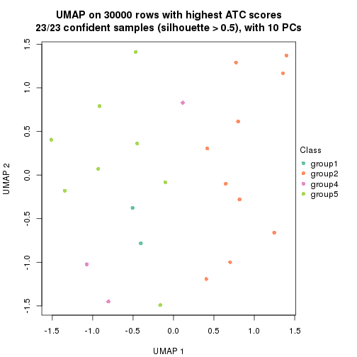</p>

</div>
<div id='tab-node-0311-dimension-reduction-5'>
<pre><code class="r">dimension_reduction(res, k = 6, method = &quot;UMAP&quot;)
</code></pre>

<p></p>

</div>
<div id='tab-node-0311-dimension-reduction-6'>
<pre><code class="r">dimension_reduction(res, k = 7, method = &quot;UMAP&quot;)
</code></pre>

<p></p>

</div>
<div id='tab-node-0311-dimension-reduction-7'>
<pre><code class="r">dimension_reduction(res, k = 8, method = &quot;UMAP&quot;)
</code></pre>

<p></p>

</div>
</div>


Following heatmap shows how subgroups are split when increasing `k`:

```r
collect_classes(res)
```


If matrix rows can be associated to genes, consider to use `functional_enrichment(res,
...)` to perform function enrichment for the signature genes. See [this vignette](https://jokergoo.github.io/cola_vignettes/functional_enrichment.html) for more detailed explanations.


 

---------------------------------------------------


### Node033


Parent node: [Node03](#Node03).
Child nodes: 
                Node0111-leaf
        ,
                Node0112-leaf
        ,
                Node0113-leaf
        ,
                Node0114-leaf
        ,
                Node0131-leaf
        ,
                Node0132-leaf
        ,
                Node0133-leaf
        ,
                Node0141-leaf
        ,
                Node0142-leaf
        ,
                Node0143-leaf
        ,
                Node0211-leaf
        ,
                Node0212-leaf
        ,
                Node0221-leaf
        ,
                Node0222-leaf
        ,
                Node0223-leaf
        ,
                Node0224-leaf
        ,
                Node0231-leaf
        ,
                [Node0232](#Node0232)
        ,
                Node0233-leaf
        ,
                Node0234-leaf
        ,
                [Node0241](#Node0241)
        ,
                Node0242-leaf
        ,
                Node0243-leaf
        ,
                Node0244-leaf
        ,
                Node0251-leaf
        ,
                Node0252-leaf
        ,
                [Node0311](#Node0311)
        ,
                Node0312-leaf
        ,
                Node0313-leaf
        ,
                Node0331-leaf
        ,
                Node0332-leaf
        ,
                Node0333-leaf
        .


The object with results only for a single top-value method and a single partitioning method 
can be extracted as:

```r
res = res_rh["033"]
```

A summary of `res` and all the functions that can be applied to it:

```r
res
```

```
#> A 'ConsensusPartition' object with k = 2, 3, 4, 5, 6, 7, 8.
#>   On a matrix with 30000 rows and 65 columns.
#>   Top rows (1000) are extracted by 'ATC' method.
#>   Subgroups are detected by 'skmeans' method.
#>   Performed in total 350 partitions by row resampling.
#>   Best k for subgroups seems to be 3.
#> 
#> Following methods can be applied to this 'ConsensusPartition' object:
#>  [1] "cola_report"             "collect_classes"         "collect_plots"          
#>  [4] "collect_stats"           "colnames"                "compare_partitions"     
#>  [7] "compare_signatures"      "consensus_heatmap"       "dimension_reduction"    
#> [10] "functional_enrichment"   "get_anno_col"            "get_anno"               
#> [13] "get_classes"             "get_consensus"           "get_matrix"             
#> [16] "get_membership"          "get_param"               "get_signatures"         
#> [19] "get_stats"               "is_best_k"               "is_stable_k"            
#> [22] "membership_heatmap"      "ncol"                    "nrow"                   
#> [25] "plot_ecdf"               "predict_classes"         "rownames"               
#> [28] "select_partition_number" "show"                    "suggest_best_k"         
#> [31] "test_to_known_factors"   "top_rows_heatmap"
```

`collect_plots()` function collects all the plots made from `res` for all `k` (number of subgroups)
into one single page to provide an easy and fast comparison between different `k`.

```r
collect_plots(res)
```


The plots are:

- The first row: a plot of the eCDF (empirical cumulative distribution
  function) curves of the consensus matrix for each `k` and the heatmap of
  predicted classes for each `k`.
- The second row: heatmaps of the consensus matrix for each `k`.
- The third row: heatmaps of the membership matrix for each `k`.
- The fouth row: heatmaps of the signatures for each `k`.

All the plots in panels can be made by individual functions and they are
plotted later in this section.

`select_partition_number()` produces several plots showing different
statistics for choosing "optimized" `k`. There are following statistics:

- eCDF curves of the consensus matrix for each `k`;
- 1-PAC. [The PAC score](https://en.wikipedia.org/wiki/Consensus_clustering#Over-interpretation_potential_of_consensus_clustering)
  measures the proportion of the ambiguous subgrouping.
- Mean silhouette score.
- Concordance. The mean probability of fiting the consensus subgroup labels in all
  partitions.
- Area increased. Denote $A_k$ as the area under the eCDF curve for current
  `k`, the area increased is defined as $A_k - A_{k-1}$.
- Rand index. The percent of pairs of samples that are both in a same cluster
  or both are not in a same cluster in the partition of k and k-1.
- Jaccard index. The ratio of pairs of samples are both in a same cluster in
  the partition of k and k-1 and the pairs of samples are both in a same
  cluster in the partition k or k-1.

The detailed explanations of these statistics can be found in [the _cola_
vignette](https://jokergoo.github.io/cola_vignettes/cola.html#toc_13).

Generally speaking, higher 1-PAC score, higher mean silhouette score or higher
concordance corresponds to better partition. Rand index and Jaccard index
measure how similar the current partition is compared to partition with `k-1`.
If they are too similar, we won't accept `k` is better than `k-1`.

```r
select_partition_number(res)
```


The numeric values for all these statistics can be obtained by `get_stats()`.

```r
get_stats(res)
```

```
#>   k 1-PAC mean_silhouette concordance area_increased  Rand Jaccard
#> 2 2 1.000           0.976       0.990         0.2654 0.736   0.736
#> 3 3 1.000           0.991       0.996         1.3330 0.619   0.491
#> 4 4 0.831           0.820       0.918         0.1688 0.871   0.672
#> 5 5 0.677           0.720       0.834         0.0419 0.968   0.891
#> 6 6 0.622           0.568       0.788         0.0251 0.932   0.776
#> 7 7 0.609           0.567       0.737         0.0220 0.934   0.777
#> 8 8 0.606           0.420       0.666         0.0344 0.903   0.649
```

`suggest_best_k()` suggests the best $k$ based on these statistics. The rules are as follows:

- All $k$ with Jaccard index larger than 0.95 are removed because increasing
  $k$ does not provide enough extra information. If all $k$ are removed, it is
  marked as no subgroup is detected.
- For all $k$ with 1-PAC score larger than 0.9, the maximal $k$ is taken as
  the best $k$, and other $k$ are marked as optional $k$.
- If it does not fit the second rule. The $k$ with the maximal vote of the
  highest 1-PAC score, highest mean silhouette, and highest concordance is
  taken as the best $k$.

```r
suggest_best_k(res)
```

```
#> [1] 3
#> attr(,"optional")
#> [1] 2
```

There is also optional best $k$ = 2 that is worth to check.

Following is the table of the partitions (You need to click the **show/hide
code output** link to see it). The membership matrix (columns with name `p*`)
is inferred by
[`clue::cl_consensus()`](https://www.rdocumentation.org/link/cl_consensus?package=clue)
function with the `SE` method. Basically the value in the membership matrix
represents the probability to belong to a certain group. The finall subgroup
label for an item is determined with the group with highest probability it
belongs to.

In `get_classes()` function, the entropy is calculated from the membership
matrix and the silhouette score is calculated from the consensus matrix.


<script>
$( function() {
	$( '#tabs-node-033-get-classes' ).tabs();
} );
</script>
<div id='tabs-node-033-get-classes'>
<ul>
<li><a href='#tab-node-033-get-classes-1'>k = 2</a></li>
<li><a href='#tab-node-033-get-classes-2'>k = 3</a></li>
<li><a href='#tab-node-033-get-classes-3'>k = 4</a></li>
<li><a href='#tab-node-033-get-classes-4'>k = 5</a></li>
<li><a href='#tab-node-033-get-classes-5'>k = 6</a></li>
<li><a href='#tab-node-033-get-classes-6'>k = 7</a></li>
<li><a href='#tab-node-033-get-classes-7'>k = 8</a></li>
</ul>

<div id='tab-node-033-get-classes-1'>
<p><a id='tab-node-033-get-classes-1-a' style='color:#0366d6' href='#'>show/hide code output</a></p>
<pre><code class="r">cbind(get_classes(res, k = 2), get_membership(res, k = 2))
</code></pre>

<pre><code>#&gt;                 class entropy silhouette   p1   p2
#&gt; TCGA.L6.A4ET.01     1   0.000      0.994 1.00 0.00
#&gt; TCGA.DJ.A4V2.01     1   0.000      0.994 1.00 0.00
#&gt; TCGA.EM.A4FN.01     1   0.000      0.994 1.00 0.00
#&gt; TCGA.EL.A4K1.01     1   0.000      0.994 1.00 0.00
#&gt; TCGA.EM.A4FQ.01     1   0.000      0.994 1.00 0.00
#&gt; TCGA.DJ.A4UL.01     1   0.000      0.994 1.00 0.00
#&gt; TCGA.EL.A4KG.01     1   0.000      0.994 1.00 0.00
#&gt; TCGA.L6.A4EP.01     1   0.000      0.994 1.00 0.00
#&gt; TCGA.DE.A4MC.01     2   0.000      0.966 0.00 1.00
#&gt; TCGA.EL.A3H8.01     1   0.000      0.994 1.00 0.00
#&gt; TCGA.EL.A4JZ.01     2   0.000      0.966 0.00 1.00
#&gt; TCGA.KS.A4I9.01     1   0.000      0.994 1.00 0.00
#&gt; TCGA.EL.A3MW.01     1   0.000      0.994 1.00 0.00
#&gt; TCGA.E3.A3E3.01     1   0.000      0.994 1.00 0.00
#&gt; TCGA.EM.A4FM.01     2   0.000      0.966 0.00 1.00
#&gt; TCGA.MK.A4N9.01     1   0.000      0.994 1.00 0.00
#&gt; TCGA.E3.A3E0.01     1   0.000      0.994 1.00 0.00
#&gt; TCGA.KS.A4I5.01     1   0.000      0.994 1.00 0.00
#&gt; TCGA.KS.A4IB.01     1   0.904      0.510 0.68 0.32
#&gt; TCGA.EM.A4FF.01     1   0.000      0.994 1.00 0.00
#&gt; TCGA.EL.A4K0.01     1   0.000      0.994 1.00 0.00
#&gt; TCGA.EL.A4K4.01     1   0.000      0.994 1.00 0.00
#&gt; TCGA.EL.A3GS.01     1   0.000      0.994 1.00 0.00
#&gt; TCGA.EL.A3N2.01     1   0.000      0.994 1.00 0.00
#&gt; TCGA.EL.A3MX.01     2   0.000      0.966 0.00 1.00
#&gt; TCGA.EM.A3FJ.01     1   0.000      0.994 1.00 0.00
#&gt; TCGA.EM.A3FQ.06     1   0.000      0.994 1.00 0.00
#&gt; TCGA.FE.A235.01     1   0.000      0.994 1.00 0.00
#&gt; TCGA.DE.A7U5.01     1   0.000      0.994 1.00 0.00
#&gt; TCGA.DE.A69J.01     1   0.000      0.994 1.00 0.00
#&gt; TCGA.FE.A22Z.01     2   0.000      0.966 0.00 1.00
#&gt; TCGA.DJ.A2Q7.01     1   0.000      0.994 1.00 0.00
#&gt; TCGA.DE.A69K.01     1   0.000      0.994 1.00 0.00
#&gt; TCGA.4C.A93U.01     2   0.000      0.966 0.00 1.00
#&gt; TCGA.ET.A25N.01     1   0.000      0.994 1.00 0.00
#&gt; TCGA.EL.A3H7.01     1   0.000      0.994 1.00 0.00
#&gt; TCGA.ET.A25O.01     1   0.000      0.994 1.00 0.00
#&gt; TCGA.EL.A3GU.01     2   0.000      0.966 0.00 1.00
#&gt; TCGA.DJ.A2PY.01     1   0.000      0.994 1.00 0.00
#&gt; TCGA.EM.A22I.01     1   0.000      0.994 1.00 0.00
#&gt; TCGA.DE.A0XZ.01     1   0.000      0.994 1.00 0.00
#&gt; TCGA.EL.A3GY.01     1   0.000      0.994 1.00 0.00
#&gt; TCGA.EL.A3GX.01     1   0.000      0.994 1.00 0.00
#&gt; TCGA.DO.A1JZ.01     1   0.000      0.994 1.00 0.00
#&gt; TCGA.DO.A1K0.01     1   0.000      0.994 1.00 0.00
#&gt; TCGA.IM.A3ED.01     1   0.000      0.994 1.00 0.00
#&gt; TCGA.ET.A3BQ.01     1   0.000      0.994 1.00 0.00
#&gt; TCGA.EL.A3H5.01     2   0.000      0.966 0.00 1.00
#&gt; TCGA.EM.A2P3.01     1   0.000      0.994 1.00 0.00
#&gt; TCGA.EL.A3CL.01     2   0.881      0.569 0.30 0.70
#&gt; TCGA.DJ.A1QE.01     1   0.000      0.994 1.00 0.00
#&gt; TCGA.FK.A3SB.01     1   0.000      0.994 1.00 0.00
#&gt; TCGA.FE.A233.01     1   0.000      0.994 1.00 0.00
#&gt; TCGA.ET.A39P.01     1   0.000      0.994 1.00 0.00
#&gt; TCGA.DJ.A1QI.01     1   0.000      0.994 1.00 0.00
#&gt; TCGA.DJ.A1QN.01     1   0.000      0.994 1.00 0.00
#&gt; TCGA.FE.A234.01     1   0.000      0.994 1.00 0.00
#&gt; TCGA.DJ.A1QH.01     2   0.000      0.966 0.00 1.00
#&gt; TCGA.DJ.A2PU.01     1   0.000      0.994 1.00 0.00
#&gt; TCGA.DJ.A2PN.01     1   0.000      0.994 1.00 0.00
#&gt; TCGA.DJ.A1QD.01     1   0.000      0.994 1.00 0.00
#&gt; TCGA.EL.A3CP.01     1   0.000      0.994 1.00 0.00
#&gt; TCGA.FY.A3RA.01     1   0.000      0.994 1.00 0.00
#&gt; TCGA.ET.A3BN.01     1   0.000      0.994 1.00 0.00
#&gt; TCGA.DE.A0Y2.01     1   0.000      0.994 1.00 0.00
</code></pre>

<script>
$('#tab-node-033-get-classes-1-a').parent().next().next().hide();
$('#tab-node-033-get-classes-1-a').click(function(){
  $('#tab-node-033-get-classes-1-a').parent().next().next().toggle();
  return(false);
});
</script>
</div>

<div id='tab-node-033-get-classes-2'>
<p><a id='tab-node-033-get-classes-2-a' style='color:#0366d6' href='#'>show/hide code output</a></p>
<pre><code class="r">cbind(get_classes(res, k = 3), get_membership(res, k = 3))
</code></pre>

<pre><code>#&gt;                 class entropy silhouette   p1   p2   p3
#&gt; TCGA.L6.A4ET.01     3  0.0000      0.988 0.00 0.00 1.00
#&gt; TCGA.DJ.A4V2.01     1  0.0000      0.999 1.00 0.00 0.00
#&gt; TCGA.EM.A4FN.01     1  0.0000      0.999 1.00 0.00 0.00
#&gt; TCGA.EL.A4K1.01     1  0.0000      0.999 1.00 0.00 0.00
#&gt; TCGA.EM.A4FQ.01     1  0.0000      0.999 1.00 0.00 0.00
#&gt; TCGA.DJ.A4UL.01     3  0.0000      0.988 0.00 0.00 1.00
#&gt; TCGA.EL.A4KG.01     3  0.0000      0.988 0.00 0.00 1.00
#&gt; TCGA.L6.A4EP.01     3  0.0000      0.988 0.00 0.00 1.00
#&gt; TCGA.DE.A4MC.01     2  0.0000      1.000 0.00 1.00 0.00
#&gt; TCGA.EL.A3H8.01     3  0.0000      0.988 0.00 0.00 1.00
#&gt; TCGA.EL.A4JZ.01     2  0.0000      1.000 0.00 1.00 0.00
#&gt; TCGA.KS.A4I9.01     1  0.0000      0.999 1.00 0.00 0.00
#&gt; TCGA.EL.A3MW.01     3  0.1529      0.954 0.04 0.00 0.96
#&gt; TCGA.E3.A3E3.01     1  0.0000      0.999 1.00 0.00 0.00
#&gt; TCGA.EM.A4FM.01     2  0.0000      1.000 0.00 1.00 0.00
#&gt; TCGA.MK.A4N9.01     3  0.0000      0.988 0.00 0.00 1.00
#&gt; TCGA.E3.A3E0.01     3  0.0000      0.988 0.00 0.00 1.00
#&gt; TCGA.KS.A4I5.01     3  0.0000      0.988 0.00 0.00 1.00
#&gt; TCGA.KS.A4IB.01     1  0.0000      0.999 1.00 0.00 0.00
#&gt; TCGA.EM.A4FF.01     1  0.0000      0.999 1.00 0.00 0.00
#&gt; TCGA.EL.A4K0.01     3  0.0000      0.988 0.00 0.00 1.00
#&gt; TCGA.EL.A4K4.01     1  0.0000      0.999 1.00 0.00 0.00
#&gt; TCGA.EL.A3GS.01     1  0.0000      0.999 1.00 0.00 0.00
#&gt; TCGA.EL.A3N2.01     1  0.0000      0.999 1.00 0.00 0.00
#&gt; TCGA.EL.A3MX.01     2  0.0000      1.000 0.00 1.00 0.00
#&gt; TCGA.EM.A3FJ.01     3  0.2066      0.933 0.06 0.00 0.94
#&gt; TCGA.EM.A3FQ.06     3  0.0000      0.988 0.00 0.00 1.00
#&gt; TCGA.FE.A235.01     3  0.0000      0.988 0.00 0.00 1.00
#&gt; TCGA.DE.A7U5.01     1  0.0000      0.999 1.00 0.00 0.00
#&gt; TCGA.DE.A69J.01     3  0.0892      0.972 0.02 0.00 0.98
#&gt; TCGA.FE.A22Z.01     2  0.0000      1.000 0.00 1.00 0.00
#&gt; TCGA.DJ.A2Q7.01     3  0.0000      0.988 0.00 0.00 1.00
#&gt; TCGA.DE.A69K.01     3  0.0000      0.988 0.00 0.00 1.00
#&gt; TCGA.4C.A93U.01     2  0.0000      1.000 0.00 1.00 0.00
#&gt; TCGA.ET.A25N.01     3  0.0000      0.988 0.00 0.00 1.00
#&gt; TCGA.EL.A3H7.01     1  0.0000      0.999 1.00 0.00 0.00
#&gt; TCGA.ET.A25O.01     1  0.0000      0.999 1.00 0.00 0.00
#&gt; TCGA.EL.A3GU.01     2  0.0000      1.000 0.00 1.00 0.00
#&gt; TCGA.DJ.A2PY.01     1  0.0000      0.999 1.00 0.00 0.00
#&gt; TCGA.EM.A22I.01     1  0.0892      0.975 0.98 0.00 0.02
#&gt; TCGA.DE.A0XZ.01     3  0.0000      0.988 0.00 0.00 1.00
#&gt; TCGA.EL.A3GY.01     1  0.0000      0.999 1.00 0.00 0.00
#&gt; TCGA.EL.A3GX.01     1  0.0000      0.999 1.00 0.00 0.00
#&gt; TCGA.DO.A1JZ.01     3  0.0000      0.988 0.00 0.00 1.00
#&gt; TCGA.DO.A1K0.01     1  0.0000      0.999 1.00 0.00 0.00
#&gt; TCGA.IM.A3ED.01     3  0.0000      0.988 0.00 0.00 1.00
#&gt; TCGA.ET.A3BQ.01     3  0.0000      0.988 0.00 0.00 1.00
#&gt; TCGA.EL.A3H5.01     2  0.0000      1.000 0.00 1.00 0.00
#&gt; TCGA.EM.A2P3.01     1  0.0000      0.999 1.00 0.00 0.00
#&gt; TCGA.EL.A3CL.01     3  0.0892      0.973 0.00 0.02 0.98
#&gt; TCGA.DJ.A1QE.01     1  0.0000      0.999 1.00 0.00 0.00
#&gt; TCGA.FK.A3SB.01     3  0.0000      0.988 0.00 0.00 1.00
#&gt; TCGA.FE.A233.01     1  0.0000      0.999 1.00 0.00 0.00
#&gt; TCGA.ET.A39P.01     1  0.0000      0.999 1.00 0.00 0.00
#&gt; TCGA.DJ.A1QI.01     3  0.0000      0.988 0.00 0.00 1.00
#&gt; TCGA.DJ.A1QN.01     3  0.2066      0.933 0.06 0.00 0.94
#&gt; TCGA.FE.A234.01     1  0.0000      0.999 1.00 0.00 0.00
#&gt; TCGA.DJ.A1QH.01     2  0.0000      1.000 0.00 1.00 0.00
#&gt; TCGA.DJ.A2PU.01     3  0.2066      0.933 0.06 0.00 0.94
#&gt; TCGA.DJ.A2PN.01     3  0.0000      0.988 0.00 0.00 1.00
#&gt; TCGA.DJ.A1QD.01     1  0.0000      0.999 1.00 0.00 0.00
#&gt; TCGA.EL.A3CP.01     3  0.0000      0.988 0.00 0.00 1.00
#&gt; TCGA.FY.A3RA.01     1  0.0000      0.999 1.00 0.00 0.00
#&gt; TCGA.ET.A3BN.01     1  0.0000      0.999 1.00 0.00 0.00
#&gt; TCGA.DE.A0Y2.01     1  0.0000      0.999 1.00 0.00 0.00
</code></pre>

<script>
$('#tab-node-033-get-classes-2-a').parent().next().next().hide();
$('#tab-node-033-get-classes-2-a').click(function(){
  $('#tab-node-033-get-classes-2-a').parent().next().next().toggle();
  return(false);
});
</script>
</div>

<div id='tab-node-033-get-classes-3'>
<p><a id='tab-node-033-get-classes-3-a' style='color:#0366d6' href='#'>show/hide code output</a></p>
<pre><code class="r">cbind(get_classes(res, k = 4), get_membership(res, k = 4))
</code></pre>

<pre><code>#&gt;                 class entropy silhouette   p1   p2   p3   p4
#&gt; TCGA.L6.A4ET.01     4  0.0000      0.848 0.00 0.00 0.00 1.00
#&gt; TCGA.DJ.A4V2.01     1  0.0000      0.897 1.00 0.00 0.00 0.00
#&gt; TCGA.EM.A4FN.01     1  0.4948      0.292 0.56 0.00 0.00 0.44
#&gt; TCGA.EL.A4K1.01     1  0.0000      0.897 1.00 0.00 0.00 0.00
#&gt; TCGA.EM.A4FQ.01     1  0.0000      0.897 1.00 0.00 0.00 0.00
#&gt; TCGA.DJ.A4UL.01     4  0.0000      0.848 0.00 0.00 0.00 1.00
#&gt; TCGA.EL.A4KG.01     4  0.7357      0.277 0.18 0.00 0.32 0.50
#&gt; TCGA.L6.A4EP.01     3  0.4277      0.718 0.00 0.00 0.72 0.28
#&gt; TCGA.DE.A4MC.01     2  0.0000      0.998 0.00 1.00 0.00 0.00
#&gt; TCGA.EL.A3H8.01     4  0.1211      0.828 0.00 0.00 0.04 0.96
#&gt; TCGA.EL.A4JZ.01     2  0.0000      0.998 0.00 1.00 0.00 0.00
#&gt; TCGA.KS.A4I9.01     1  0.0000      0.897 1.00 0.00 0.00 0.00
#&gt; TCGA.EL.A3MW.01     4  0.0000      0.848 0.00 0.00 0.00 1.00
#&gt; TCGA.E3.A3E3.01     1  0.1211      0.875 0.96 0.00 0.00 0.04
#&gt; TCGA.EM.A4FM.01     2  0.0000      0.998 0.00 1.00 0.00 0.00
#&gt; TCGA.MK.A4N9.01     3  0.2011      0.904 0.00 0.00 0.92 0.08
#&gt; TCGA.E3.A3E0.01     3  0.4624      0.611 0.00 0.00 0.66 0.34
#&gt; TCGA.KS.A4I5.01     3  0.1211      0.915 0.00 0.00 0.96 0.04
#&gt; TCGA.KS.A4IB.01     1  0.0000      0.897 1.00 0.00 0.00 0.00
#&gt; TCGA.EM.A4FF.01     1  0.0000      0.897 1.00 0.00 0.00 0.00
#&gt; TCGA.EL.A4K0.01     3  0.1637      0.913 0.00 0.00 0.94 0.06
#&gt; TCGA.EL.A4K4.01     1  0.0000      0.897 1.00 0.00 0.00 0.00
#&gt; TCGA.EL.A3GS.01     1  0.0000      0.897 1.00 0.00 0.00 0.00
#&gt; TCGA.EL.A3N2.01     1  0.0000      0.897 1.00 0.00 0.00 0.00
#&gt; TCGA.EL.A3MX.01     2  0.0000      0.998 0.00 1.00 0.00 0.00
#&gt; TCGA.EM.A3FJ.01     4  0.0000      0.848 0.00 0.00 0.00 1.00
#&gt; TCGA.EM.A3FQ.06     3  0.1637      0.913 0.00 0.00 0.94 0.06
#&gt; TCGA.FE.A235.01     3  0.0707      0.912 0.00 0.00 0.98 0.02
#&gt; TCGA.DE.A7U5.01     1  0.0000      0.897 1.00 0.00 0.00 0.00
#&gt; TCGA.DE.A69J.01     4  0.0707      0.840 0.00 0.00 0.02 0.98
#&gt; TCGA.FE.A22Z.01     2  0.0000      0.998 0.00 1.00 0.00 0.00
#&gt; TCGA.DJ.A2Q7.01     4  0.2921      0.736 0.00 0.00 0.14 0.86
#&gt; TCGA.DE.A69K.01     3  0.1211      0.915 0.00 0.00 0.96 0.04
#&gt; TCGA.4C.A93U.01     2  0.0000      0.998 0.00 1.00 0.00 0.00
#&gt; TCGA.ET.A25N.01     3  0.0707      0.912 0.00 0.00 0.98 0.02
#&gt; TCGA.EL.A3H7.01     1  0.0000      0.897 1.00 0.00 0.00 0.00
#&gt; TCGA.ET.A25O.01     4  0.4790      0.261 0.38 0.00 0.00 0.62
#&gt; TCGA.EL.A3GU.01     2  0.0000      0.998 0.00 1.00 0.00 0.00
#&gt; TCGA.DJ.A2PY.01     1  0.2647      0.808 0.88 0.00 0.00 0.12
#&gt; TCGA.EM.A22I.01     1  0.1637      0.847 0.94 0.00 0.06 0.00
#&gt; TCGA.DE.A0XZ.01     3  0.0707      0.912 0.00 0.00 0.98 0.02
#&gt; TCGA.EL.A3GY.01     1  0.4277      0.609 0.72 0.00 0.00 0.28
#&gt; TCGA.EL.A3GX.01     1  0.0000      0.897 1.00 0.00 0.00 0.00
#&gt; TCGA.DO.A1JZ.01     3  0.0000      0.899 0.00 0.00 1.00 0.00
#&gt; TCGA.DO.A1K0.01     1  0.4948      0.292 0.56 0.00 0.00 0.44
#&gt; TCGA.IM.A3ED.01     3  0.1637      0.913 0.00 0.00 0.94 0.06
#&gt; TCGA.ET.A3BQ.01     4  0.3610      0.635 0.00 0.00 0.20 0.80
#&gt; TCGA.EL.A3H5.01     2  0.0000      0.998 0.00 1.00 0.00 0.00
#&gt; TCGA.EM.A2P3.01     4  0.4624      0.373 0.34 0.00 0.00 0.66
#&gt; TCGA.EL.A3CL.01     3  0.0000      0.899 0.00 0.00 1.00 0.00
#&gt; TCGA.DJ.A1QE.01     1  0.0000      0.897 1.00 0.00 0.00 0.00
#&gt; TCGA.FK.A3SB.01     3  0.3801      0.796 0.00 0.00 0.78 0.22
#&gt; TCGA.FE.A233.01     1  0.0000      0.897 1.00 0.00 0.00 0.00
#&gt; TCGA.ET.A39P.01     1  0.0000      0.897 1.00 0.00 0.00 0.00
#&gt; TCGA.DJ.A1QI.01     3  0.3801      0.797 0.00 0.00 0.78 0.22
#&gt; TCGA.DJ.A1QN.01     4  0.0000      0.848 0.00 0.00 0.00 1.00
#&gt; TCGA.FE.A234.01     1  0.4907      0.345 0.58 0.00 0.00 0.42
#&gt; TCGA.DJ.A1QH.01     2  0.0707      0.985 0.00 0.98 0.02 0.00
#&gt; TCGA.DJ.A2PU.01     4  0.0000      0.848 0.00 0.00 0.00 1.00
#&gt; TCGA.DJ.A2PN.01     3  0.0707      0.912 0.00 0.00 0.98 0.02
#&gt; TCGA.DJ.A1QD.01     1  0.4790      0.431 0.62 0.00 0.00 0.38
#&gt; TCGA.EL.A3CP.01     4  0.0000      0.848 0.00 0.00 0.00 1.00
#&gt; TCGA.FY.A3RA.01     1  0.1637      0.861 0.94 0.00 0.00 0.06
#&gt; TCGA.ET.A3BN.01     1  0.0000      0.897 1.00 0.00 0.00 0.00
#&gt; TCGA.DE.A0Y2.01     1  0.0000      0.897 1.00 0.00 0.00 0.00
</code></pre>

<script>
$('#tab-node-033-get-classes-3-a').parent().next().next().hide();
$('#tab-node-033-get-classes-3-a').click(function(){
  $('#tab-node-033-get-classes-3-a').parent().next().next().toggle();
  return(false);
});
</script>
</div>

<div id='tab-node-033-get-classes-4'>
<p><a id='tab-node-033-get-classes-4-a' style='color:#0366d6' href='#'>show/hide code output</a></p>
<pre><code class="r">cbind(get_classes(res, k = 5), get_membership(res, k = 5))
</code></pre>

<pre><code>#&gt;                 class entropy silhouette   p1   p2   p3   p4   p5
#&gt; TCGA.L6.A4ET.01     4  0.0000    0.82740 0.00 0.00 0.00 1.00 0.00
#&gt; TCGA.DJ.A4V2.01     5  0.0609    0.78805 0.02 0.00 0.00 0.00 0.98
#&gt; TCGA.EM.A4FN.01     5  0.4126    0.35443 0.00 0.00 0.00 0.38 0.62
#&gt; TCGA.EL.A4K1.01     5  0.3424    0.76965 0.24 0.00 0.00 0.00 0.76
#&gt; TCGA.EM.A4FQ.01     5  0.3274    0.77663 0.22 0.00 0.00 0.00 0.78
#&gt; TCGA.DJ.A4UL.01     4  0.0000    0.82740 0.00 0.00 0.00 1.00 0.00
#&gt; TCGA.EL.A4KG.01     3  0.6665    0.00472 0.00 0.00 0.44 0.26 0.30
#&gt; TCGA.L6.A4EP.01     3  0.3424    0.69225 0.00 0.00 0.76 0.24 0.00
#&gt; TCGA.DE.A4MC.01     2  0.3109    0.87137 0.20 0.80 0.00 0.00 0.00
#&gt; TCGA.EL.A3H8.01     4  0.2438    0.79421 0.00 0.00 0.04 0.90 0.06
#&gt; TCGA.EL.A4JZ.01     2  0.1043    0.92290 0.04 0.96 0.00 0.00 0.00
#&gt; TCGA.KS.A4I9.01     5  0.0000    0.78166 0.00 0.00 0.00 0.00 1.00
#&gt; TCGA.EL.A3MW.01     4  0.0000    0.82740 0.00 0.00 0.00 1.00 0.00
#&gt; TCGA.E3.A3E3.01     5  0.1043    0.76637 0.00 0.00 0.00 0.04 0.96
#&gt; TCGA.EM.A4FM.01     2  0.0000    0.92982 0.00 1.00 0.00 0.00 0.00
#&gt; TCGA.MK.A4N9.01     3  0.2012    0.81862 0.02 0.00 0.92 0.06 0.00
#&gt; TCGA.E3.A3E0.01     3  0.3895    0.54759 0.00 0.00 0.68 0.32 0.00
#&gt; TCGA.KS.A4I5.01     3  0.1648    0.81938 0.04 0.00 0.94 0.02 0.00
#&gt; TCGA.KS.A4IB.01     5  0.4302    0.56289 0.48 0.00 0.00 0.00 0.52
#&gt; TCGA.EM.A4FF.01     5  0.0609    0.78860 0.02 0.00 0.00 0.00 0.98
#&gt; TCGA.EL.A4K0.01     3  0.3697    0.79720 0.08 0.00 0.82 0.10 0.00
#&gt; TCGA.EL.A4K4.01     5  0.3424    0.76965 0.24 0.00 0.00 0.00 0.76
#&gt; TCGA.EL.A3GS.01     5  0.3424    0.76965 0.24 0.00 0.00 0.00 0.76
#&gt; TCGA.EL.A3N2.01     5  0.2280    0.79666 0.12 0.00 0.00 0.00 0.88
#&gt; TCGA.EL.A3MX.01     2  0.0000    0.92982 0.00 1.00 0.00 0.00 0.00
#&gt; TCGA.EM.A3FJ.01     4  0.0609    0.82125 0.00 0.00 0.00 0.98 0.02
#&gt; TCGA.EM.A3FQ.06     3  0.3110    0.80976 0.08 0.00 0.86 0.06 0.00
#&gt; TCGA.FE.A235.01     3  0.1732    0.80495 0.08 0.00 0.92 0.00 0.00
#&gt; TCGA.DE.A7U5.01     5  0.3424    0.77127 0.24 0.00 0.00 0.00 0.76
#&gt; TCGA.DE.A69J.01     4  0.5680    0.57107 0.00 0.00 0.14 0.62 0.24
#&gt; TCGA.FE.A22Z.01     2  0.0000    0.92982 0.00 1.00 0.00 0.00 0.00
#&gt; TCGA.DJ.A2Q7.01     4  0.4252    0.52357 0.00 0.00 0.28 0.70 0.02
#&gt; TCGA.DE.A69K.01     3  0.3697    0.80175 0.10 0.00 0.82 0.08 0.00
#&gt; TCGA.4C.A93U.01     2  0.0000    0.92982 0.00 1.00 0.00 0.00 0.00
#&gt; TCGA.ET.A25N.01     3  0.1410    0.81395 0.06 0.00 0.94 0.00 0.00
#&gt; TCGA.EL.A3H7.01     5  0.3424    0.76965 0.24 0.00 0.00 0.00 0.76
#&gt; TCGA.ET.A25O.01     5  0.5425    0.27858 0.06 0.00 0.00 0.42 0.52
#&gt; TCGA.EL.A3GU.01     2  0.2929    0.87814 0.18 0.82 0.00 0.00 0.00
#&gt; TCGA.DJ.A2PY.01     5  0.2929    0.67299 0.00 0.00 0.00 0.18 0.82
#&gt; TCGA.EM.A22I.01     5  0.4263    0.64779 0.06 0.00 0.18 0.00 0.76
#&gt; TCGA.DE.A0XZ.01     3  0.0000    0.81892 0.00 0.00 1.00 0.00 0.00
#&gt; TCGA.EL.A3GY.01     5  0.3109    0.63851 0.00 0.00 0.00 0.20 0.80
#&gt; TCGA.EL.A3GX.01     5  0.3274    0.77614 0.22 0.00 0.00 0.00 0.78
#&gt; TCGA.DO.A1JZ.01     3  0.4060    0.62674 0.36 0.00 0.64 0.00 0.00
#&gt; TCGA.DO.A1K0.01     5  0.3895    0.46462 0.00 0.00 0.00 0.32 0.68
#&gt; TCGA.IM.A3ED.01     3  0.0609    0.82021 0.00 0.00 0.98 0.02 0.00
#&gt; TCGA.ET.A3BQ.01     4  0.4540    0.34641 0.02 0.00 0.34 0.64 0.00
#&gt; TCGA.EL.A3H5.01     2  0.0000    0.92982 0.00 1.00 0.00 0.00 0.00
#&gt; TCGA.EM.A2P3.01     4  0.4262    0.14777 0.00 0.00 0.00 0.56 0.44
#&gt; TCGA.EL.A3CL.01     3  0.4060    0.61677 0.36 0.00 0.64 0.00 0.00
#&gt; TCGA.DJ.A1QE.01     5  0.2020    0.79635 0.10 0.00 0.00 0.00 0.90
#&gt; TCGA.FK.A3SB.01     3  0.3731    0.76741 0.04 0.00 0.80 0.16 0.00
#&gt; TCGA.FE.A233.01     5  0.2516    0.79442 0.14 0.00 0.00 0.00 0.86
#&gt; TCGA.ET.A39P.01     5  0.2020    0.79635 0.10 0.00 0.00 0.00 0.90
#&gt; TCGA.DJ.A1QI.01     3  0.3291    0.78784 0.04 0.00 0.84 0.12 0.00
#&gt; TCGA.DJ.A1QN.01     4  0.0000    0.82740 0.00 0.00 0.00 1.00 0.00
#&gt; TCGA.FE.A234.01     5  0.4126    0.38076 0.00 0.00 0.00 0.38 0.62
#&gt; TCGA.DJ.A1QH.01     2  0.4182    0.74699 0.40 0.60 0.00 0.00 0.00
#&gt; TCGA.DJ.A2PU.01     4  0.0000    0.82740 0.00 0.00 0.00 1.00 0.00
#&gt; TCGA.DJ.A2PN.01     3  0.1410    0.81395 0.06 0.00 0.94 0.00 0.00
#&gt; TCGA.DJ.A1QD.01     5  0.4126    0.35585 0.00 0.00 0.00 0.38 0.62
#&gt; TCGA.EL.A3CP.01     4  0.1216    0.80428 0.02 0.00 0.02 0.96 0.00
#&gt; TCGA.FY.A3RA.01     5  0.1732    0.74500 0.00 0.00 0.00 0.08 0.92
#&gt; TCGA.ET.A3BN.01     5  0.0609    0.78805 0.02 0.00 0.00 0.00 0.98
#&gt; TCGA.DE.A0Y2.01     5  0.2280    0.79666 0.12 0.00 0.00 0.00 0.88
</code></pre>

<script>
$('#tab-node-033-get-classes-4-a').parent().next().next().hide();
$('#tab-node-033-get-classes-4-a').click(function(){
  $('#tab-node-033-get-classes-4-a').parent().next().next().toggle();
  return(false);
});
</script>
</div>

<div id='tab-node-033-get-classes-5'>
<p><a id='tab-node-033-get-classes-5-a' style='color:#0366d6' href='#'>show/hide code output</a></p>
<pre><code class="r">cbind(get_classes(res, k = 6), get_membership(res, k = 6))
</code></pre>

<pre><code>#&gt;                 class entropy silhouette   p1   p2   p3   p4   p5   p6
#&gt; TCGA.L6.A4ET.01     4  0.0547     0.7388 0.00 0.00 0.00 0.98 0.00 0.02
#&gt; TCGA.DJ.A4V2.01     5  0.1092     0.6248 0.02 0.00 0.00 0.02 0.96 0.00
#&gt; TCGA.EM.A4FN.01     5  0.4844     0.2900 0.04 0.00 0.00 0.32 0.62 0.02
#&gt; TCGA.EL.A4K1.01     5  0.3499     0.3401 0.32 0.00 0.00 0.00 0.68 0.00
#&gt; TCGA.EM.A4FQ.01     5  0.3460     0.4715 0.22 0.00 0.00 0.00 0.76 0.02
#&gt; TCGA.DJ.A4UL.01     4  0.1480     0.7324 0.00 0.00 0.04 0.94 0.00 0.02
#&gt; TCGA.EL.A4KG.01     3  0.5883     0.2625 0.00 0.00 0.56 0.24 0.18 0.02
#&gt; TCGA.L6.A4EP.01     3  0.3679     0.6592 0.00 0.00 0.76 0.20 0.00 0.04
#&gt; TCGA.DE.A4MC.01     2  0.3351     0.8333 0.16 0.80 0.00 0.00 0.00 0.04
#&gt; TCGA.EL.A3H8.01     4  0.5265     0.1964 0.00 0.00 0.40 0.50 0.10 0.00
#&gt; TCGA.EL.A4JZ.01     2  0.2094     0.8806 0.08 0.90 0.00 0.00 0.00 0.02
#&gt; TCGA.KS.A4I9.01     5  0.1480     0.6171 0.04 0.00 0.00 0.02 0.94 0.00
#&gt; TCGA.EL.A3MW.01     4  0.0547     0.7388 0.00 0.00 0.00 0.98 0.00 0.02
#&gt; TCGA.E3.A3E3.01     5  0.2728     0.5800 0.04 0.00 0.00 0.10 0.86 0.00
#&gt; TCGA.EM.A4FM.01     2  0.0000     0.8977 0.00 1.00 0.00 0.00 0.00 0.00
#&gt; TCGA.MK.A4N9.01     3  0.4468     0.6572 0.06 0.00 0.76 0.12 0.00 0.06
#&gt; TCGA.E3.A3E0.01     3  0.3315     0.6451 0.00 0.00 0.78 0.20 0.02 0.00
#&gt; TCGA.KS.A4I5.01     3  0.3258     0.6382 0.02 0.00 0.84 0.04 0.00 0.10
#&gt; TCGA.KS.A4IB.01     1  0.4534     0.1733 0.58 0.00 0.00 0.00 0.38 0.04
#&gt; TCGA.EM.A4FF.01     5  0.1480     0.6311 0.04 0.00 0.00 0.02 0.94 0.00
#&gt; TCGA.EL.A4K0.01     3  0.3600     0.6823 0.02 0.00 0.82 0.08 0.00 0.08
#&gt; TCGA.EL.A4K4.01     5  0.3819     0.3787 0.28 0.00 0.00 0.00 0.70 0.02
#&gt; TCGA.EL.A3GS.01     5  0.3076     0.4868 0.24 0.00 0.00 0.00 0.76 0.00
#&gt; TCGA.EL.A3N2.01     5  0.1814     0.6058 0.10 0.00 0.00 0.00 0.90 0.00
#&gt; TCGA.EL.A3MX.01     2  0.0000     0.8977 0.00 1.00 0.00 0.00 0.00 0.00
#&gt; TCGA.EM.A3FJ.01     4  0.2020     0.7047 0.02 0.00 0.02 0.92 0.04 0.00
#&gt; TCGA.EM.A3FQ.06     3  0.3688     0.6061 0.04 0.00 0.80 0.02 0.00 0.14
#&gt; TCGA.FE.A235.01     3  0.3821     0.4386 0.04 0.00 0.74 0.00 0.00 0.22
#&gt; TCGA.DE.A7U5.01     5  0.4495     0.4394 0.20 0.00 0.02 0.00 0.72 0.06
#&gt; TCGA.DE.A69J.01     4  0.6882     0.3205 0.08 0.00 0.30 0.44 0.18 0.00
#&gt; TCGA.FE.A22Z.01     2  0.0000     0.8977 0.00 1.00 0.00 0.00 0.00 0.00
#&gt; TCGA.DJ.A2Q7.01     4  0.4764     0.0897 0.02 0.00 0.42 0.54 0.02 0.00
#&gt; TCGA.DE.A69K.01     3  0.4361     0.5983 0.06 0.00 0.76 0.04 0.00 0.14
#&gt; TCGA.4C.A93U.01     2  0.0000     0.8977 0.00 1.00 0.00 0.00 0.00 0.00
#&gt; TCGA.ET.A25N.01     3  0.3315     0.5123 0.02 0.00 0.78 0.00 0.00 0.20
#&gt; TCGA.EL.A3H7.01     5  0.3156     0.5307 0.18 0.00 0.00 0.00 0.80 0.02
#&gt; TCGA.ET.A25O.01     1  0.6985     0.2382 0.36 0.00 0.00 0.32 0.26 0.06
#&gt; TCGA.EL.A3GU.01     2  0.2581     0.8638 0.12 0.86 0.00 0.00 0.00 0.02
#&gt; TCGA.DJ.A2PY.01     5  0.2956     0.5697 0.04 0.00 0.00 0.12 0.84 0.00
#&gt; TCGA.EM.A22I.01     5  0.5107     0.1093 0.04 0.00 0.30 0.00 0.62 0.04
#&gt; TCGA.DE.A0XZ.01     3  0.3854     0.6116 0.04 0.00 0.80 0.04 0.00 0.12
#&gt; TCGA.EL.A3GY.01     5  0.3829     0.5097 0.06 0.00 0.00 0.18 0.76 0.00
#&gt; TCGA.EL.A3GX.01     5  0.2793     0.5496 0.20 0.00 0.00 0.00 0.80 0.00
#&gt; TCGA.DO.A1JZ.01     6  0.3198     0.8876 0.00 0.00 0.26 0.00 0.00 0.74
#&gt; TCGA.DO.A1K0.01     5  0.4265     0.3536 0.04 0.00 0.00 0.30 0.66 0.00
#&gt; TCGA.IM.A3ED.01     3  0.3045     0.6748 0.02 0.00 0.86 0.06 0.00 0.06
#&gt; TCGA.ET.A3BQ.01     3  0.3828     0.2440 0.00 0.00 0.56 0.44 0.00 0.00
#&gt; TCGA.EL.A3H5.01     2  0.0547     0.8964 0.02 0.98 0.00 0.00 0.00 0.00
#&gt; TCGA.EM.A2P3.01     5  0.4873     0.0926 0.06 0.00 0.00 0.42 0.52 0.00
#&gt; TCGA.EL.A3CL.01     6  0.3409     0.8807 0.00 0.00 0.30 0.00 0.00 0.70
#&gt; TCGA.DJ.A1QE.01     5  0.2048     0.5915 0.12 0.00 0.00 0.00 0.88 0.00
#&gt; TCGA.FK.A3SB.01     3  0.3318     0.6776 0.02 0.00 0.82 0.14 0.00 0.02
#&gt; TCGA.FE.A233.01     5  0.1814     0.6073 0.10 0.00 0.00 0.00 0.90 0.00
#&gt; TCGA.ET.A39P.01     5  0.1807     0.6229 0.06 0.00 0.00 0.02 0.92 0.00
#&gt; TCGA.DJ.A1QI.01     3  0.3483     0.6742 0.02 0.00 0.82 0.12 0.00 0.04
#&gt; TCGA.DJ.A1QN.01     4  0.0547     0.7315 0.02 0.00 0.00 0.98 0.00 0.00
#&gt; TCGA.FE.A234.01     5  0.4360     0.3945 0.06 0.00 0.00 0.26 0.68 0.00
#&gt; TCGA.DJ.A1QH.01     2  0.5682     0.4532 0.38 0.46 0.00 0.00 0.00 0.16
#&gt; TCGA.DJ.A2PU.01     4  0.0000     0.7381 0.00 0.00 0.00 1.00 0.00 0.00
#&gt; TCGA.DJ.A2PN.01     3  0.3460     0.4754 0.02 0.00 0.76 0.00 0.00 0.22
#&gt; TCGA.DJ.A1QD.01     5  0.4482     0.2476 0.04 0.00 0.00 0.36 0.60 0.00
#&gt; TCGA.EL.A3CP.01     4  0.2882     0.7124 0.02 0.00 0.10 0.86 0.00 0.02
#&gt; TCGA.FY.A3RA.01     5  0.3270     0.5586 0.06 0.00 0.00 0.12 0.82 0.00
#&gt; TCGA.ET.A3BN.01     5  0.1807     0.6276 0.06 0.00 0.00 0.02 0.92 0.00
#&gt; TCGA.DE.A0Y2.01     5  0.2094     0.6222 0.08 0.00 0.00 0.02 0.90 0.00
</code></pre>

<script>
$('#tab-node-033-get-classes-5-a').parent().next().next().hide();
$('#tab-node-033-get-classes-5-a').click(function(){
  $('#tab-node-033-get-classes-5-a').parent().next().next().toggle();
  return(false);
});
</script>
</div>

<div id='tab-node-033-get-classes-6'>
<p><a id='tab-node-033-get-classes-6-a' style='color:#0366d6' href='#'>show/hide code output</a></p>
<pre><code class="r">cbind(get_classes(res, k = 7), get_membership(res, k = 7))
</code></pre>

<pre><code>#&gt;                 class entropy silhouette   p1   p2   p3   p4   p5   p6   p7
#&gt; TCGA.L6.A4ET.01     4  0.1006     0.7106 0.02 0.00 0.02 0.96 0.00 0.00 0.00
#&gt; TCGA.DJ.A4V2.01     5  0.2722     0.6183 0.00 0.00 0.00 0.04 0.84 0.00 0.12
#&gt; TCGA.EM.A4FN.01     5  0.5233     0.5698 0.00 0.00 0.00 0.20 0.52 0.00 0.28
#&gt; TCGA.EL.A4K1.01     5  0.3186     0.3836 0.22 0.00 0.00 0.00 0.76 0.00 0.02
#&gt; TCGA.EM.A4FQ.01     5  0.3052     0.4340 0.20 0.00 0.00 0.00 0.78 0.00 0.02
#&gt; TCGA.DJ.A4UL.01     4  0.0863     0.7149 0.00 0.00 0.04 0.96 0.00 0.00 0.00
#&gt; TCGA.EL.A4KG.01     5  0.6947     0.2522 0.00 0.00 0.34 0.10 0.36 0.02 0.18
#&gt; TCGA.L6.A4EP.01     3  0.4249     0.5747 0.02 0.00 0.70 0.24 0.00 0.02 0.02
#&gt; TCGA.DE.A4MC.01     2  0.3685     0.6024 0.32 0.66 0.00 0.00 0.00 0.00 0.02
#&gt; TCGA.EL.A3H8.01     4  0.6405     0.3417 0.00 0.00 0.26 0.46 0.10 0.00 0.18
#&gt; TCGA.EL.A4JZ.01     2  0.1928     0.8569 0.08 0.90 0.00 0.00 0.00 0.00 0.02
#&gt; TCGA.KS.A4I9.01     5  0.3911     0.6231 0.00 0.00 0.00 0.06 0.70 0.00 0.24
#&gt; TCGA.EL.A3MW.01     4  0.0504     0.7240 0.00 0.00 0.00 0.98 0.00 0.00 0.02
#&gt; TCGA.E3.A3E3.01     5  0.4681     0.6034 0.00 0.00 0.00 0.10 0.58 0.00 0.32
#&gt; TCGA.EM.A4FM.01     2  0.0000     0.8886 0.00 1.00 0.00 0.00 0.00 0.00 0.00
#&gt; TCGA.MK.A4N9.01     3  0.3289     0.7226 0.00 0.00 0.82 0.02 0.00 0.10 0.06
#&gt; TCGA.E3.A3E0.01     3  0.3617     0.6440 0.00 0.00 0.76 0.16 0.00 0.00 0.08
#&gt; TCGA.KS.A4I5.01     3  0.2509     0.7116 0.00 0.00 0.88 0.00 0.02 0.04 0.06
#&gt; TCGA.KS.A4IB.01     1  0.4461     0.0768 0.54 0.00 0.00 0.00 0.40 0.00 0.06
#&gt; TCGA.EM.A4FF.01     5  0.3770     0.6264 0.00 0.00 0.00 0.08 0.74 0.00 0.18
#&gt; TCGA.EL.A4K0.01     3  0.3494     0.6982 0.00 0.00 0.80 0.02 0.00 0.12 0.06
#&gt; TCGA.EL.A4K4.01     5  0.3863     0.3427 0.20 0.00 0.00 0.00 0.74 0.04 0.02
#&gt; TCGA.EL.A3GS.01     5  0.2864     0.4650 0.12 0.00 0.00 0.00 0.84 0.02 0.02
#&gt; TCGA.EL.A3N2.01     5  0.3263     0.5635 0.08 0.00 0.00 0.00 0.80 0.00 0.12
#&gt; TCGA.EL.A3MX.01     2  0.0000     0.8886 0.00 1.00 0.00 0.00 0.00 0.00 0.00
#&gt; TCGA.EM.A3FJ.01     4  0.1433     0.7067 0.00 0.00 0.00 0.92 0.00 0.00 0.08
#&gt; TCGA.EM.A3FQ.06     3  0.3011     0.7214 0.00 0.00 0.82 0.00 0.00 0.06 0.12
#&gt; TCGA.FE.A235.01     3  0.3927     0.6014 0.00 0.00 0.76 0.00 0.02 0.14 0.08
#&gt; TCGA.DE.A7U5.01     5  0.3617     0.4205 0.16 0.00 0.00 0.00 0.76 0.00 0.08
#&gt; TCGA.DE.A69J.01     5  0.7431     0.1081 0.02 0.00 0.22 0.28 0.28 0.00 0.20
#&gt; TCGA.FE.A22Z.01     2  0.0000     0.8886 0.00 1.00 0.00 0.00 0.00 0.00 0.00
#&gt; TCGA.DJ.A2Q7.01     4  0.4977     0.1873 0.00 0.00 0.42 0.50 0.00 0.04 0.04
#&gt; TCGA.DE.A69K.01     3  0.4030     0.6596 0.00 0.00 0.72 0.00 0.00 0.12 0.16
#&gt; TCGA.4C.A93U.01     2  0.0000     0.8886 0.00 1.00 0.00 0.00 0.00 0.00 0.00
#&gt; TCGA.ET.A25N.01     3  0.3494     0.6542 0.00 0.00 0.80 0.00 0.02 0.06 0.12
#&gt; TCGA.EL.A3H7.01     5  0.3055     0.4612 0.14 0.00 0.00 0.00 0.82 0.02 0.02
#&gt; TCGA.ET.A25O.01     5  0.6816     0.2254 0.22 0.00 0.00 0.26 0.38 0.00 0.14
#&gt; TCGA.EL.A3GU.01     2  0.3186     0.7360 0.22 0.76 0.00 0.00 0.00 0.00 0.02
#&gt; TCGA.DJ.A2PY.01     5  0.5007     0.5914 0.00 0.00 0.00 0.16 0.56 0.00 0.28
#&gt; TCGA.EM.A22I.01     5  0.5588     0.4543 0.04 0.00 0.18 0.02 0.62 0.00 0.14
#&gt; TCGA.DE.A0XZ.01     3  0.4402     0.6607 0.02 0.00 0.74 0.00 0.02 0.14 0.08
#&gt; TCGA.EL.A3GY.01     5  0.4789     0.5998 0.00 0.00 0.00 0.14 0.60 0.00 0.26
#&gt; TCGA.EL.A3GX.01     5  0.2163     0.5148 0.10 0.00 0.00 0.00 0.88 0.00 0.02
#&gt; TCGA.DO.A1JZ.01     6  0.4825     0.6483 0.02 0.00 0.16 0.00 0.00 0.66 0.16
#&gt; TCGA.DO.A1K0.01     5  0.5291     0.5601 0.00 0.00 0.00 0.20 0.50 0.00 0.30
#&gt; TCGA.IM.A3ED.01     3  0.1664     0.7268 0.00 0.00 0.92 0.00 0.00 0.06 0.02
#&gt; TCGA.ET.A3BQ.01     4  0.5221    -0.1019 0.00 0.00 0.44 0.46 0.00 0.06 0.04
#&gt; TCGA.EL.A3H5.01     2  0.0863     0.8814 0.04 0.96 0.00 0.00 0.00 0.00 0.00
#&gt; TCGA.EM.A2P3.01     5  0.5589     0.4252 0.00 0.00 0.00 0.32 0.40 0.00 0.28
#&gt; TCGA.EL.A3CL.01     6  0.4388     0.6194 0.04 0.00 0.30 0.00 0.00 0.64 0.02
#&gt; TCGA.DJ.A1QE.01     5  0.1928     0.5870 0.02 0.00 0.00 0.00 0.90 0.00 0.08
#&gt; TCGA.FK.A3SB.01     3  0.4492     0.6709 0.00 0.00 0.72 0.12 0.00 0.12 0.04
#&gt; TCGA.FE.A233.01     5  0.2803     0.5519 0.06 0.00 0.00 0.00 0.84 0.00 0.10
#&gt; TCGA.ET.A39P.01     5  0.2722     0.6111 0.04 0.00 0.00 0.00 0.84 0.00 0.12
#&gt; TCGA.DJ.A1QI.01     3  0.4379     0.6628 0.00 0.00 0.74 0.10 0.00 0.06 0.10
#&gt; TCGA.DJ.A1QN.01     4  0.1664     0.7103 0.02 0.00 0.00 0.92 0.00 0.00 0.06
#&gt; TCGA.FE.A234.01     5  0.5341     0.5495 0.00 0.00 0.00 0.24 0.50 0.00 0.26
#&gt; TCGA.DJ.A1QH.01     1  0.4418    -0.2534 0.62 0.30 0.00 0.00 0.00 0.00 0.08
#&gt; TCGA.DJ.A2PU.01     4  0.0504     0.7240 0.00 0.00 0.00 0.98 0.00 0.00 0.02
#&gt; TCGA.DJ.A2PN.01     3  0.4145     0.6005 0.00 0.00 0.74 0.00 0.02 0.10 0.14
#&gt; TCGA.DJ.A1QD.01     5  0.5128     0.5762 0.00 0.00 0.00 0.18 0.54 0.00 0.28
#&gt; TCGA.EL.A3CP.01     4  0.2745     0.6587 0.00 0.00 0.16 0.82 0.00 0.00 0.02
#&gt; TCGA.FY.A3RA.01     5  0.4418     0.5981 0.00 0.00 0.00 0.08 0.62 0.00 0.30
#&gt; TCGA.ET.A3BN.01     5  0.2421     0.5871 0.02 0.00 0.00 0.02 0.88 0.00 0.08
#&gt; TCGA.DE.A0Y2.01     5  0.1433     0.5734 0.00 0.00 0.00 0.00 0.92 0.00 0.08
</code></pre>

<script>
$('#tab-node-033-get-classes-6-a').parent().next().next().hide();
$('#tab-node-033-get-classes-6-a').click(function(){
  $('#tab-node-033-get-classes-6-a').parent().next().next().toggle();
  return(false);
});
</script>
</div>

<div id='tab-node-033-get-classes-7'>
<p><a id='tab-node-033-get-classes-7-a' style='color:#0366d6' href='#'>show/hide code output</a></p>
<pre><code class="r">cbind(get_classes(res, k = 8), get_membership(res, k = 8))
</code></pre>

<pre><code>#&gt;                 class entropy silhouette   p1   p2   p3   p4   p5   p6   p7   p8
#&gt; TCGA.L6.A4ET.01     4  0.1341   0.714379 0.00 0.00 0.00 0.92 0.08 0.00 0.00 0.00
#&gt; TCGA.DJ.A4V2.01     5  0.4191   0.019367 0.02 0.00 0.00 0.00 0.66 0.00 0.26 0.06
#&gt; TCGA.EM.A4FN.01     5  0.3078   0.471067 0.00 0.00 0.00 0.10 0.82 0.00 0.06 0.02
#&gt; TCGA.EL.A4K1.01     7  0.4100   0.715708 0.06 0.00 0.00 0.00 0.36 0.00 0.58 0.00
#&gt; TCGA.EM.A4FQ.01     7  0.4794   0.662012 0.00 0.00 0.00 0.00 0.42 0.02 0.48 0.08
#&gt; TCGA.DJ.A4UL.01     4  0.2132   0.712788 0.00 0.00 0.04 0.88 0.08 0.00 0.00 0.00
#&gt; TCGA.EL.A4KG.01     5  0.7397  -0.100302 0.00 0.00 0.24 0.12 0.38 0.02 0.08 0.16
#&gt; TCGA.L6.A4EP.01     3  0.5781   0.399645 0.00 0.00 0.52 0.22 0.04 0.00 0.02 0.20
#&gt; TCGA.DE.A4MC.01     2  0.3714   0.403094 0.44 0.54 0.00 0.02 0.00 0.00 0.00 0.00
#&gt; TCGA.EL.A3H8.01     4  0.6700   0.147206 0.00 0.00 0.26 0.36 0.24 0.00 0.02 0.12
#&gt; TCGA.EL.A4JZ.01     2  0.1804   0.825859 0.08 0.90 0.00 0.02 0.00 0.00 0.00 0.00
#&gt; TCGA.KS.A4I9.01     5  0.2025   0.429790 0.00 0.00 0.00 0.00 0.88 0.00 0.10 0.02
#&gt; TCGA.EL.A3MW.01     4  0.1563   0.721040 0.00 0.00 0.00 0.90 0.10 0.00 0.00 0.00
#&gt; TCGA.E3.A3E3.01     5  0.0941   0.482639 0.02 0.00 0.00 0.00 0.96 0.00 0.02 0.00
#&gt; TCGA.EM.A4FM.01     2  0.1275   0.842812 0.04 0.94 0.00 0.02 0.00 0.00 0.00 0.00
#&gt; TCGA.MK.A4N9.01     3  0.5744   0.393002 0.04 0.00 0.60 0.10 0.02 0.04 0.00 0.20
#&gt; TCGA.E3.A3E0.01     3  0.5668   0.370704 0.00 0.00 0.46 0.26 0.04 0.00 0.00 0.24
#&gt; TCGA.KS.A4I5.01     3  0.5345  -0.145819 0.02 0.00 0.52 0.02 0.02 0.06 0.00 0.36
#&gt; TCGA.KS.A4IB.01     1  0.5623   0.262804 0.48 0.00 0.00 0.00 0.08 0.02 0.36 0.06
#&gt; TCGA.EM.A4FF.01     5  0.3337   0.298109 0.04 0.00 0.00 0.00 0.78 0.00 0.16 0.02
#&gt; TCGA.EL.A4K0.01     3  0.2348   0.450310 0.02 0.00 0.88 0.06 0.00 0.04 0.00 0.00
#&gt; TCGA.EL.A4K4.01     7  0.4106   0.688962 0.04 0.00 0.00 0.00 0.30 0.00 0.64 0.02
#&gt; TCGA.EL.A3GS.01     7  0.3880   0.670545 0.02 0.00 0.00 0.00 0.32 0.00 0.64 0.02
#&gt; TCGA.EL.A3N2.01     5  0.3995  -0.142978 0.02 0.00 0.00 0.00 0.60 0.00 0.36 0.02
#&gt; TCGA.EL.A3MX.01     2  0.0000   0.843897 0.00 1.00 0.00 0.00 0.00 0.00 0.00 0.00
#&gt; TCGA.EM.A3FJ.01     4  0.2406   0.674915 0.00 0.00 0.00 0.80 0.20 0.00 0.00 0.00
#&gt; TCGA.EM.A3FQ.06     3  0.5129   0.332547 0.02 0.00 0.60 0.06 0.02 0.02 0.00 0.28
#&gt; TCGA.FE.A235.01     8  0.5801   0.504787 0.02 0.00 0.34 0.00 0.00 0.14 0.04 0.46
#&gt; TCGA.DE.A7U5.01     7  0.4999   0.645972 0.02 0.00 0.00 0.00 0.34 0.00 0.52 0.12
#&gt; TCGA.DE.A69J.01     5  0.6355   0.293444 0.02 0.00 0.12 0.16 0.56 0.00 0.06 0.08
#&gt; TCGA.FE.A22Z.01     2  0.0000   0.843897 0.00 1.00 0.00 0.00 0.00 0.00 0.00 0.00
#&gt; TCGA.DJ.A2Q7.01     4  0.5932  -0.000665 0.02 0.00 0.38 0.42 0.12 0.00 0.00 0.06
#&gt; TCGA.DE.A69K.01     3  0.5793   0.271318 0.02 0.00 0.58 0.10 0.02 0.06 0.00 0.22
#&gt; TCGA.4C.A93U.01     2  0.0000   0.843897 0.00 1.00 0.00 0.00 0.00 0.00 0.00 0.00
#&gt; TCGA.ET.A25N.01     8  0.4106   0.671601 0.00 0.00 0.30 0.00 0.00 0.02 0.04 0.64
#&gt; TCGA.EL.A3H7.01     7  0.4077   0.718366 0.02 0.00 0.00 0.00 0.40 0.00 0.56 0.02
#&gt; TCGA.ET.A25O.01     5  0.8086  -0.014539 0.16 0.00 0.02 0.24 0.30 0.06 0.18 0.04
#&gt; TCGA.EL.A3GU.01     2  0.3015   0.610911 0.32 0.68 0.00 0.00 0.00 0.00 0.00 0.00
#&gt; TCGA.DJ.A2PY.01     5  0.0808   0.480151 0.00 0.00 0.00 0.00 0.96 0.00 0.04 0.00
#&gt; TCGA.EM.A22I.01     5  0.6272  -0.236960 0.00 0.00 0.12 0.00 0.40 0.00 0.26 0.22
#&gt; TCGA.DE.A0XZ.01     3  0.5959   0.209379 0.00 0.00 0.52 0.02 0.04 0.08 0.04 0.30
#&gt; TCGA.EL.A3GY.01     5  0.2350   0.464362 0.00 0.00 0.00 0.04 0.86 0.00 0.10 0.00
#&gt; TCGA.EL.A3GX.01     7  0.4141   0.603216 0.02 0.00 0.00 0.00 0.48 0.02 0.48 0.00
#&gt; TCGA.DO.A1JZ.01     6  0.3036   0.596599 0.00 0.00 0.04 0.00 0.00 0.78 0.00 0.18
#&gt; TCGA.DO.A1K0.01     5  0.2940   0.489765 0.02 0.00 0.00 0.10 0.84 0.00 0.02 0.02
#&gt; TCGA.IM.A3ED.01     3  0.4828   0.203926 0.04 0.00 0.64 0.02 0.00 0.06 0.00 0.24
#&gt; TCGA.ET.A3BQ.01     4  0.5329  -0.052609 0.00 0.00 0.38 0.46 0.04 0.00 0.00 0.12
#&gt; TCGA.EL.A3H5.01     2  0.1557   0.840079 0.06 0.92 0.00 0.02 0.00 0.00 0.00 0.00
#&gt; TCGA.EM.A2P3.01     5  0.4057   0.401992 0.02 0.00 0.00 0.20 0.72 0.00 0.02 0.04
#&gt; TCGA.EL.A3CL.01     6  0.4299   0.519753 0.00 0.00 0.14 0.00 0.00 0.64 0.00 0.22
#&gt; TCGA.DJ.A1QE.01     5  0.4105  -0.270128 0.02 0.00 0.00 0.00 0.54 0.00 0.42 0.02
#&gt; TCGA.FK.A3SB.01     3  0.3880   0.444609 0.00 0.00 0.68 0.24 0.00 0.00 0.00 0.08
#&gt; TCGA.FE.A233.01     7  0.4491   0.565067 0.02 0.00 0.02 0.00 0.40 0.00 0.54 0.02
#&gt; TCGA.ET.A39P.01     5  0.3728   0.134550 0.02 0.00 0.00 0.00 0.68 0.00 0.28 0.02
#&gt; TCGA.DJ.A1QI.01     3  0.5298   0.383838 0.06 0.00 0.64 0.20 0.00 0.06 0.02 0.02
#&gt; TCGA.DJ.A1QN.01     4  0.2025   0.714983 0.02 0.00 0.00 0.88 0.10 0.00 0.00 0.00
#&gt; TCGA.FE.A234.01     5  0.3270   0.464268 0.02 0.00 0.00 0.12 0.80 0.00 0.00 0.06
#&gt; TCGA.DJ.A1QH.01     1  0.5433   0.177634 0.60 0.20 0.00 0.00 0.00 0.06 0.12 0.02
#&gt; TCGA.DJ.A2PU.01     4  0.2224   0.715915 0.02 0.00 0.00 0.86 0.12 0.00 0.00 0.00
#&gt; TCGA.DJ.A2PN.01     8  0.4570   0.672970 0.00 0.00 0.28 0.00 0.00 0.04 0.06 0.62
#&gt; TCGA.DJ.A1QD.01     5  0.0808   0.494316 0.00 0.00 0.00 0.04 0.96 0.00 0.00 0.00
#&gt; TCGA.EL.A3CP.01     4  0.4230   0.582420 0.02 0.00 0.16 0.74 0.04 0.00 0.02 0.02
#&gt; TCGA.FY.A3RA.01     5  0.3178   0.419015 0.02 0.00 0.00 0.00 0.80 0.00 0.14 0.04
#&gt; TCGA.ET.A3BN.01     5  0.4704   0.006882 0.04 0.00 0.00 0.00 0.58 0.00 0.32 0.06
#&gt; TCGA.DE.A0Y2.01     5  0.4325  -0.228460 0.02 0.00 0.00 0.00 0.56 0.00 0.38 0.04
</code></pre>

<script>
$('#tab-node-033-get-classes-7-a').parent().next().next().hide();
$('#tab-node-033-get-classes-7-a').click(function(){
  $('#tab-node-033-get-classes-7-a').parent().next().next().toggle();
  return(false);
});
</script>
</div>
</div>

Heatmaps for the consensus matrix. It visualizes the probability of two
samples to be in a same group.


<script>
$( function() {
	$( '#tabs-node-033-consensus-heatmap' ).tabs();
} );
</script>
<div id='tabs-node-033-consensus-heatmap'>
<ul>
<li><a href='#tab-node-033-consensus-heatmap-1'>k = 2</a></li>
<li><a href='#tab-node-033-consensus-heatmap-2'>k = 3</a></li>
<li><a href='#tab-node-033-consensus-heatmap-3'>k = 4</a></li>
<li><a href='#tab-node-033-consensus-heatmap-4'>k = 5</a></li>
<li><a href='#tab-node-033-consensus-heatmap-5'>k = 6</a></li>
<li><a href='#tab-node-033-consensus-heatmap-6'>k = 7</a></li>
<li><a href='#tab-node-033-consensus-heatmap-7'>k = 8</a></li>
</ul>
<div id='tab-node-033-consensus-heatmap-1'>
<pre><code class="r">consensus_heatmap(res, k = 2)
</code></pre>

<p></p>

</div>
<div id='tab-node-033-consensus-heatmap-2'>
<pre><code class="r">consensus_heatmap(res, k = 3)
</code></pre>

<p></p>

</div>
<div id='tab-node-033-consensus-heatmap-3'>
<pre><code class="r">consensus_heatmap(res, k = 4)
</code></pre>

<p></p>

</div>
<div id='tab-node-033-consensus-heatmap-4'>
<pre><code class="r">consensus_heatmap(res, k = 5)
</code></pre>

<p></p>

</div>
<div id='tab-node-033-consensus-heatmap-5'>
<pre><code class="r">consensus_heatmap(res, k = 6)
</code></pre>

<p></p>

</div>
<div id='tab-node-033-consensus-heatmap-6'>
<pre><code class="r">consensus_heatmap(res, k = 7)
</code></pre>

<p></p>

</div>
<div id='tab-node-033-consensus-heatmap-7'>
<pre><code class="r">consensus_heatmap(res, k = 8)
</code></pre>

<p></p>

</div>
</div>

Heatmaps for the membership of samples in all partitions to see how consistent they are:


<script>
$( function() {
	$( '#tabs-node-033-membership-heatmap' ).tabs();
} );
</script>
<div id='tabs-node-033-membership-heatmap'>
<ul>
<li><a href='#tab-node-033-membership-heatmap-1'>k = 2</a></li>
<li><a href='#tab-node-033-membership-heatmap-2'>k = 3</a></li>
<li><a href='#tab-node-033-membership-heatmap-3'>k = 4</a></li>
<li><a href='#tab-node-033-membership-heatmap-4'>k = 5</a></li>
<li><a href='#tab-node-033-membership-heatmap-5'>k = 6</a></li>
<li><a href='#tab-node-033-membership-heatmap-6'>k = 7</a></li>
<li><a href='#tab-node-033-membership-heatmap-7'>k = 8</a></li>
</ul>
<div id='tab-node-033-membership-heatmap-1'>
<pre><code class="r">membership_heatmap(res, k = 2)
</code></pre>

<p></p>

</div>
<div id='tab-node-033-membership-heatmap-2'>
<pre><code class="r">membership_heatmap(res, k = 3)
</code></pre>

<p></p>

</div>
<div id='tab-node-033-membership-heatmap-3'>
<pre><code class="r">membership_heatmap(res, k = 4)
</code></pre>

<p></p>

</div>
<div id='tab-node-033-membership-heatmap-4'>
<pre><code class="r">membership_heatmap(res, k = 5)
</code></pre>

<p></p>

</div>
<div id='tab-node-033-membership-heatmap-5'>
<pre><code class="r">membership_heatmap(res, k = 6)
</code></pre>

<p></p>

</div>
<div id='tab-node-033-membership-heatmap-6'>
<pre><code class="r">membership_heatmap(res, k = 7)
</code></pre>

<p></p>

</div>
<div id='tab-node-033-membership-heatmap-7'>
<pre><code class="r">membership_heatmap(res, k = 8)
</code></pre>

<p></p>

</div>
</div>

As soon as the classes for columns are determined, the signatures
that are significantly different between subgroups can be looked for. 
Following are the heatmaps for signatures.


<script>
$( function() {
	$( '#tabs-node-033-get-signatures' ).tabs();
} );
</script>
<div id='tabs-node-033-get-signatures'>
<ul>
<li><a href='#tab-node-033-get-signatures-1'>k = 2</a></li>
<li><a href='#tab-node-033-get-signatures-2'>k = 3</a></li>
<li><a href='#tab-node-033-get-signatures-3'>k = 4</a></li>
<li><a href='#tab-node-033-get-signatures-4'>k = 5</a></li>
<li><a href='#tab-node-033-get-signatures-5'>k = 6</a></li>
<li><a href='#tab-node-033-get-signatures-6'>k = 7</a></li>
<li><a href='#tab-node-033-get-signatures-7'>k = 8</a></li>
</ul>
<div id='tab-node-033-get-signatures-1'>
<pre><code class="r">get_signatures(res, k = 2)
</code></pre>

<p></p>

</div>
<div id='tab-node-033-get-signatures-2'>
<pre><code class="r">get_signatures(res, k = 3)
</code></pre>

<p></p>

</div>
<div id='tab-node-033-get-signatures-3'>
<pre><code class="r">get_signatures(res, k = 4)
</code></pre>

<p></p>

</div>
<div id='tab-node-033-get-signatures-4'>
<pre><code class="r">get_signatures(res, k = 5)
</code></pre>

<p></p>

</div>
<div id='tab-node-033-get-signatures-5'>
<pre><code class="r">get_signatures(res, k = 6)
</code></pre>

<p></p>

</div>
<div id='tab-node-033-get-signatures-6'>
<pre><code class="r">get_signatures(res, k = 7)
</code></pre>

<p>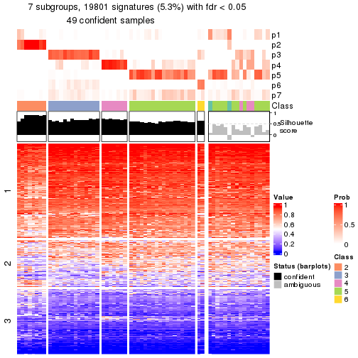</p>

</div>
<div id='tab-node-033-get-signatures-7'>
<pre><code class="r">get_signatures(res, k = 8)
</code></pre>

<p></p>

</div>
</div>


Compare the overlap of signatures from different k:

```r
compare_signatures(res)
```


`get_signature()` returns a data frame invisibly. To get the list of signatures, the function
call should be assigned to a variable explicitly. In following code, if `plot` argument is set
to `FALSE`, no heatmap is plotted while only the differential analysis is performed.

```r
# code only for demonstration
tb = get_signature(res, k = ..., plot = FALSE)
```

An example of the output of `tb` is:

```
#>   which_row         fdr    mean_1    mean_2 scaled_mean_1 scaled_mean_2 km
#> 1        38 0.042760348  8.373488  9.131774    -0.5533452     0.5164555  1
#> 2        40 0.018707592  7.106213  8.469186    -0.6173731     0.5762149  1
#> 3        55 0.019134737 10.221463 11.207825    -0.6159697     0.5749050  1
#> 4        59 0.006059896  5.921854  7.869574    -0.6899429     0.6439467  1
#> 5        60 0.018055526  8.928898 10.211722    -0.6204761     0.5791110  1
#> 6        98 0.009384629 15.714769 14.887706     0.6635654    -0.6193277  2
...
```

The columns in `tb` are:

1. `which_row`: row indices corresponding to the input matrix.
2. `fdr`: FDR for the differential test. 
3. `mean_x`: The mean value in group x.
4. `scaled_mean_x`: The mean value in group x after rows are scaled.
5. `km`: Row groups if k-means clustering is applied to rows (which is done by automatically selecting number of clusters).

If there are too many signatures, `top_signatures = ...` can be set to only show the 
signatures with the highest FDRs:

```r
# code only for demonstration
# e.g. to show the top 500 most significant rows
tb = get_signature(res, k = ..., top_signatures = 500)
```

If the signatures are defined as these which are uniquely high in current group, `diff_method` argument
can be set to `"uniquely_high_in_one_group"`:

```r
# code only for demonstration
tb = get_signature(res, k = ..., diff_method = "uniquely_high_in_one_group")
```


UMAP plot which shows how samples are separated.


<script>
$( function() {
	$( '#tabs-node-033-dimension-reduction' ).tabs();
} );
</script>
<div id='tabs-node-033-dimension-reduction'>
<ul>
<li><a href='#tab-node-033-dimension-reduction-1'>k = 2</a></li>
<li><a href='#tab-node-033-dimension-reduction-2'>k = 3</a></li>
<li><a href='#tab-node-033-dimension-reduction-3'>k = 4</a></li>
<li><a href='#tab-node-033-dimension-reduction-4'>k = 5</a></li>
<li><a href='#tab-node-033-dimension-reduction-5'>k = 6</a></li>
<li><a href='#tab-node-033-dimension-reduction-6'>k = 7</a></li>
<li><a href='#tab-node-033-dimension-reduction-7'>k = 8</a></li>
</ul>
<div id='tab-node-033-dimension-reduction-1'>
<pre><code class="r">dimension_reduction(res, k = 2, method = &quot;UMAP&quot;)
</code></pre>

<p>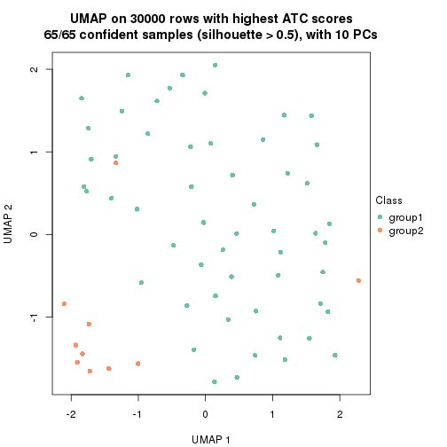</p>

</div>
<div id='tab-node-033-dimension-reduction-2'>
<pre><code class="r">dimension_reduction(res, k = 3, method = &quot;UMAP&quot;)
</code></pre>

<p></p>

</div>
<div id='tab-node-033-dimension-reduction-3'>
<pre><code class="r">dimension_reduction(res, k = 4, method = &quot;UMAP&quot;)
</code></pre>

<p></p>

</div>
<div id='tab-node-033-dimension-reduction-4'>
<pre><code class="r">dimension_reduction(res, k = 5, method = &quot;UMAP&quot;)
</code></pre>

<p></p>

</div>
<div id='tab-node-033-dimension-reduction-5'>
<pre><code class="r">dimension_reduction(res, k = 6, method = &quot;UMAP&quot;)
</code></pre>

<p></p>

</div>
<div id='tab-node-033-dimension-reduction-6'>
<pre><code class="r">dimension_reduction(res, k = 7, method = &quot;UMAP&quot;)
</code></pre>

<p></p>

</div>
<div id='tab-node-033-dimension-reduction-7'>
<pre><code class="r">dimension_reduction(res, k = 8, method = &quot;UMAP&quot;)
</code></pre>

<p></p>

</div>
</div>


Following heatmap shows how subgroups are split when increasing `k`:

```r
collect_classes(res)
```


If matrix rows can be associated to genes, consider to use `functional_enrichment(res,
...)` to perform function enrichment for the signature genes. See [this vignette](https://jokergoo.github.io/cola_vignettes/functional_enrichment.html) for more detailed explanations.


 

## Session info


```r
sessionInfo()
```

```
#> R version 4.0.0 (2020-04-24)
#> Platform: x86_64-pc-linux-gnu (64-bit)
#> Running under: CentOS Linux 7 (Core)
#> 
#> Matrix products: default
#> BLAS:   /usr/lib64/libblas.so.3.4.2
#> LAPACK: /usr/lib64/liblapack.so.3.4.2
#> 
#> locale:
#>  [1] LC_CTYPE=C                 LC_NUMERIC=C               LC_TIME=en_US.UTF-8       
#>  [4] LC_COLLATE=en_US.UTF-8     LC_MONETARY=en_US.UTF-8    LC_MESSAGES=en_US.UTF-8   
#>  [7] LC_PAPER=en_US.UTF-8       LC_NAME=C                  LC_ADDRESS=C              
#> [10] LC_TELEPHONE=C             LC_MEASUREMENT=en_US.UTF-8 LC_IDENTIFICATION=C       
#> 
#> attached base packages:
#> [1] grid      stats     graphics  grDevices utils     datasets  methods   base     
#> 
#> other attached packages:
#> [1] genefilter_1.70.0     ComplexHeatmap_2.7.11 markdown_1.1          knitr_1.30           
#> [5] matrixStats_0.57.0    cola_1.9.4           
#> 
#> loaded via a namespace (and not attached):
#>  [1] bitops_1.0-6         bit64_4.0.5          doParallel_1.0.15    RColorBrewer_1.1-2  
#>  [5] httr_1.4.2           data.tree_0.7.11     tools_4.0.0          R6_2.5.0            
#>  [9] irlba_2.3.3          DBI_1.1.0            BiocGenerics_0.34.0  colorspace_2.0-0    
#> [13] GetoptLong_1.0.4     gridExtra_2.3        tidyselect_1.0.0     bit_4.0.4           
#> [17] compiler_4.0.0       Biobase_2.48.0       Cairo_1.5-12.2       xml2_1.3.2          
#> [21] microbenchmark_1.4-7 slam_0.1-47          scales_1.1.0         askpass_1.1         
#> [25] stringr_1.4.0        digest_0.6.27        pkgconfig_2.0.3      umap_0.2.6.0        
#> [29] highr_0.8            rlang_0.4.7          GlobalOptions_0.1.2  RSQLite_2.2.0       
#> [33] impute_1.62.0        shape_1.4.5          jsonlite_1.7.1       mclust_5.4.7        
#> [37] dendextend_1.13.4    dplyr_0.8.5          RCurl_1.98-1.2       magrittr_2.0.1      
#> [41] Matrix_1.2-18        Rcpp_1.0.5           munsell_0.5.0        S4Vectors_0.26.1    
#> [45] reticulate_1.15      viridis_0.5.1        lifecycle_0.2.0      scatterplot3d_0.3-41
#> [49] stringi_1.5.3        blob_1.2.1           parallel_4.0.0       crayon_1.3.4        
#> [53] lattice_0.20-41      splines_4.0.0        annotate_1.65.1      circlize_0.4.12     
#> [57] polylabelr_0.2.0     pillar_1.4.3         rjson_0.2.20         codetools_0.2-16    
#> [61] stats4_4.0.0         XML_3.99-0.3         glue_1.4.2           evaluate_0.14       
#> [65] png_0.1-7            vctrs_0.3.4          foreach_1.5.0        polyclip_1.10-0     
#> [69] gtable_0.3.0         openssl_1.4.3        purrr_0.3.4          clue_0.3-57         
#> [73] assertthat_0.2.1     ggplot2_3.3.0        xfun_0.19            eulerr_6.1.0        
#> [77] xtable_1.8-4         skmeans_0.2-12       RSpectra_0.16-0      viridisLite_0.3.0   
#> [81] survival_3.1-12      Polychrome_1.2.5     tibble_3.0.1         iterators_1.0.12    
#> [85] AnnotationDbi_1.50.3 memoise_1.1.0        IRanges_2.22.2       cluster_2.1.0       
#> [89] ellipsis_0.3.1       brew_1.0-6
```


